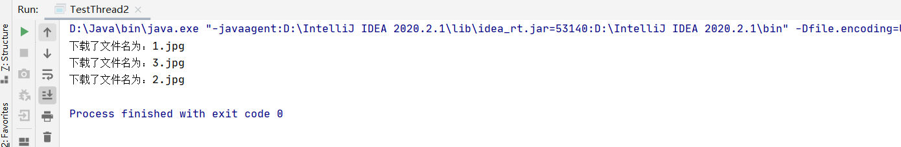
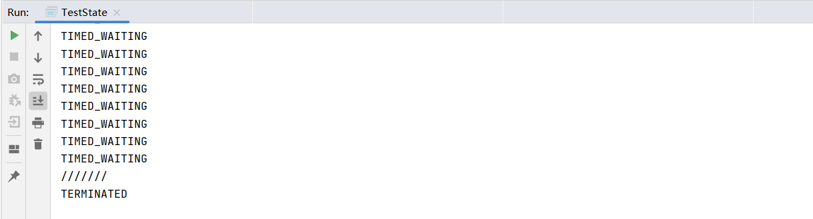
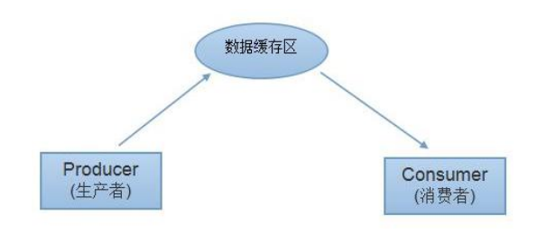

## 多线程详解

## 1、线程简介

### 1.1、多任务


现实中太多这样同时做多件事情的例子了，看起来是多个任务都在做，其实本质上我们的大脑在同一时间依旧只做了一件事情。


### 1.2、多线程


原来是一条路，慢慢因为车太多了，道路堵塞，效率极低。

为了提高使用的效率，能够充分利用道路，于是加了多个车道。从此，妈妈再也不用担心道路堵塞了。

### 1.3、普通方法调用和多线程


### 1.4、**程序.进程.线程**


### 1.5、**Process与Thread** 

- 说起进程，就不得不说下**程序**。程序是指令和数据的有序集合，其本身没有任何运 行的含义，是一个静态的概念。 

- 而**进程**则是执行程序的一次执行过程，它是一个动态的概念。是系统资源分配的单 位

- 通常在一个进程中可以包含若干个**线程**，当然一个进程中至少有一个线程，不然没 有存在的意义。线程是CPU调度和执行的的单位。 

**注意**

**很多多线程是模拟出来的，真正的多线程是指有多个cpu，即多核，如服务器。如果是模拟出来的多线程，即在一个cpu的情况下，在同一个时间点，cpu只能执行一个代码，因为切换的很快，所以就有同时执行的错局。**

### 1.6、 本章核心概念

- 线程就是独立的执行路径；

-  在程序运行时，即使没有自己创建线程，后台也会有多个线程，如主线程，gc线程；

- main() 称之为主线程，为系统的入口，用于执行整个程序；

- 在一个进程中，如果开辟了多个线程，线程的运行由调度器安排调度，调度器是与操作系统紧密相关的，先后顺序是不能认为的干预的。

- 对同一份资源操作时，会存在资源抢夺的问题，需要加入并发控制；

- 线程会带来额外的开销，如cpu调度时间，并发控制开销。

-  每个线程在自己的工作内存交互，内存控制不当会造成数据不一致

## 2、线程实现（重点）

### **2.1、三种创建方式**


### 2.2、**Thread**

> **学习提示：查看**JDK帮助文档

**步骤**

1. **自定义线程类继承Thread类** 

2. **重写run()方法，编写线程执行体**

3. **创建线程对象，调用start()方法启动线程**

**代码**

```java
package com.kaung.demo01;

import java.awt.event.ItemEvent;

//创建线程的方式一：继承Thread，重写run()方法，调用start开启线程

//总结 ：注意 ，线程开启不一定立即执行，由cpu调度执行

public class TestThread1 extends Thread{
    @Override
    public void  run(){
        //run方法线程体
        for(int i = 0; i < 20 ; i++){
            System.out.println("我在看代码---"+i);
        }

    }
    public static void main(String[] args) {
        //main线程，主线程

        //创建一个线程对象
        TestThread1 testThread1 = new TestThread1();

        //调用start()方法开启线程,执行run方法
        testThread1.start();
        for(int i = 0; i < 20; i++){
            System.out.println("我在学习多线程---"+i);
        }
    }
}

```

**执行结果**


**主线程和run方法线程交替执行。**


### **2.3、案例：下载图片** 

**代码**

```java
package com.kaung.demo01;

import org.apache.commons.io.FileUtils;

import java.io.File;
import java.io.IOException;
import java.net.URL;

//练习Thread ,实现多线程同步下载图片
public class TestThread2 extends Thread{
    private String url; //网络图片地址
    private String name; //保存的文件名
    public TestThread2(String url,String name){
        this.url=url;
        this.name=name;
    }
    //下载图片线程执行体
    @Override
    public void run() {
        WebDownloader webDownloader = new WebDownloader();
        webDownloader.downloader(url,name);
        System.out.println("下载了文件名为："+name);
    }

    public static void main(String[] args) {
        TestThread2 t1 = new TestThread2("https://public-cdn-oss.mosoteach.cn/books/mobile/cover-1@2x.jpg","1.jpg");
        TestThread2 t2 = new TestThread2("https://public-cdn-oss.mosoteach.cn/books/mobile/cover-1@2x.jpg","2.jpg");
        TestThread2 t3 = new TestThread2("https://public-cdn-oss.mosoteach.cn/books/mobile/cover-1@2x.jpg","3.jpg");
        //先下载t1
        t1.start();
        //然后t1
        t2.start();
        //最后t3
        t3.start();
    }
}
//下载器
class WebDownloader{
    //下载方法
    public void downloader(String url,String name){
        try {
            FileUtils.copyURLToFile(new URL(url),new File(name));
        } catch (IOException e) {
            e.printStackTrace();
            System.out.println("IO异常，downloader方法出现异常");
        }
    }

}
```

**运行截图**



我们开启了三个线程，这三个线程并不是按序执行的，谁先抢夺到了时间，谁先执行。

验证了结论：**在一个进程中，如果开辟了多个线程，线程的运行由调度器安排调度，调度器是与操作系统紧密相关的，先后顺序是不能认为的干预的。**

### 2.4、实现Runnable接口

**步骤**

1. **定义MyRunnable类实现Runnable接口**

2. **实现run()方法，编写线程执行体** 

3. **创建线程对象，调用start()方法启动线程** 

**代码**

```java
package com.kaung.demo01;

public class TestThread3 implements Runnable{
    @Override
    public void  run(){
        //run方法线程体
        for(int i = 0; i < 20 ; i++){
            System.out.println("我在看代码---"+i);
        }

    }
    public static void main(String[] args) {

        //创建runable接口的实现类对象
        TestThread3 testThread3 = new TestThread3();
        //创建线程对象，通过线程对象来开启我们的线程，代理
        Thread thread = new Thread(testThread3);
        thread.start();

        for(int i = 0; i < 200; i++){
            System.out.println("我在学习多线程---"+i);
        }
    }
}
```

**推荐使用Runnable对象，因为Java单继承的局限性**

### 2.5、小结

**继承Thread类**

- **子类继承Thread类具备多线程能力** 
- **启动线程：子类对象. start()** 
- ==不建议使用：避免OOP单继承局限性==

**实现Runable接口**

- **实现接口Runnable具有多线程能力**
- **启动线程：传入目标对象+Thread对象.start()** 
- ==推荐使用：避免单继承局限性，灵活方便，方便同一个对象被多个线程使用==

 

### 2.6、初始并发问题

**代码**

```java
package com.kaung.demo01;
//多个线程同时操作一个对象
//买火车票的例子

//发现问题 ： 多个线程操作同一个资源的情况下，线程不安全，数据紊乱。
public class TestThread4 implements Runnable {
    private int ticketNums = 10;
    @Override
    public void run() {
        while(true){
            if((ticketNums<=0)){
                break;
            }
            //模拟延时
            try {
                Thread.sleep(200);
            } catch (InterruptedException e) {
                e.printStackTrace();
            }
            System.out.println(Thread.currentThread().getName()+"--->拿到了第"+ticketNums-- +"票");
        }
    }

    public static void main(String[] args) {
        TestThread4 ticket = new TestThread4();

        new Thread(ticket,"小明").start();
        new Thread(ticket,"老师").start();
        new Thread(ticket,"黄牛党").start();
    }
}
```

**运行截图**


**发现问题 ： 多个线程操作同一个资源的情况下，线程不安全，数据紊乱。**

### 2.7、龟兔赛跑


```java
package com.kaung.demo01;

//模拟龟兔赛跑
public class Race implements Runnable{
    private static String winner;
    @Override
    public void run() {
        for (int i = 0; i <= 100; i++) {

            //模拟兔子休息
            if(Thread.currentThread().getName().equals("兔子")&&i%10==0) {
                try {
                    Thread.sleep(10);
                } catch (InterruptedException e) {
                    e.printStackTrace();
                }
            }
            //判断比赛是否结束
            boolean flag = gameOver(i);
            if(flag){
                break;
            }
            System.out.println(Thread.currentThread().getName()+"--->跑了"+i+"步");
        }
    }
    //判断是否完成比赛
    private boolean gameOver(int steps){
        //判断是否有胜利者
        if(winner!=null) //已经有胜利者了
        {
            return true;
        }
        if(steps>=100){
            winner = Thread.currentThread().getName();
            System.out.println("winner is "+winner);
            return true;
        }
        return false;
    }

    public static void main(String[] args) {
        Race race = new Race();
        new Thread(race,"兔子").start();
        new Thread(race,"乌龟").start();
    }
}

```


### 2.8、**实现Callable接口（了解即可）**


### 2.9、**静态代理** 

 **模式总结**

- 真实对象和代理对象都要实现同一个接口
- 代理对象要代理真实对象

**好处**

- 代理对象可以做很多真实对象做不了的事情
- 真实对象专注做自己的事情

```java
import sun.plugin2.main.client.WDonatePrivilege;

//静态代理模式总结
//真实对象和代理对象都要实现同一个接口
//代理对象要代理真实对象

//好处
    //代理对象可以做很多真实对象做不了的事情
    //真实对象专注做自己的事情
public class StaticProxy {
    public static void main(String[] args) {
        You you = new You();

        new Thread(()-> System.out.println("我爱你")).start();

        new WeddingCompany(new You()).HappyMarry();

    }
}
interface Marry{
    void HappyMarry();
}

//真实角色，你去结婚
class You implements Marry {

    @Override
    public void HappyMarry() {
        System.out.println("我要结婚了，超开心");
    }
}

//代理对象，帮助你结婚
class WeddingCompany implements Marry {
    //代理谁--> 真实目标角色
    private Marry target; //目标对象

    public WeddingCompany(Marry target) {
        this.target = target;
    }

    @Override
    public void HappyMarry() {
        brfore();
        this.target.HappyMarry(); //这就是真实对象
        after();
    }

    private void after() {
        System.out.println("结婚之后，收尾款");
    }

    private void brfore() {
        System.out.println("结婚之前，布置现场");
    }
}
```

### 3.0、**Lamda表达式** 

- **λ希腊字母表中排序第十一位的字母，英语名称为Lambda** 

- **避免匿名内部类定义过多** 

- **其实质属于函数式编程的概念** 

new Thread（**()->System.out.println(“多线程学习。。。。”)**）.start()


**为什么要使用lambda表达式**

- 避免匿名内部类定义过多
- 可以让你的代码看起来很简洁 
- 去掉了一堆没有意义的代码，只留下核心的逻辑。

**也许你会说，我看了Lambda表达式，不但不觉得简洁，反而觉得更乱，看不懂了。那是因为我们还没有习惯，用的多了，看习惯了，就好了**

理解**Functional Interface**（函数式接口）是学习Java8 **lambda表达式**的关键所在

**函数式接口的定义：** 

任何接口，如果只包含唯一一个抽象方法，那么它就是一个函数式接口。对于函数式接口，我们可以通过lambda表达式来创建该接口的对象。

**代码推导lambda表达式**

```java
package com.kuang.lambda;
/*
推导lambda表达式
*/
public class TestLambda1 {
    //3.静态内部类
    static class Like2 implements ILike{

        @Override
        public void lambda() {
            System.out.println("I like lambda2");
        }
    }
    public static void main(String[] args) {
        ILike like = new Like();
        like.lambda();

        like = new Like2();
        like.lambda();

        //4.局部内部类
        class Like3 implements ILike{

            @Override
            public void lambda() {
                System.out.println("I like lambda3");
            }
        }

        like = new Like3();
        like.lambda();

        //5.匿名内部类，没有类的名称，必须借助接口或者父类
        like = new ILike() {
            @Override
            public void lambda() {
                System.out.println("I like lambda4");
            }
        };
        like.lambda();

        //6.用lambda简化
        like = ()->{
            System.out.println("I like lambda5");
        };
        like.lambda();
    }
}
//1.定义一个函数式接口
interface ILike{
    void lambda();
}

//2.实现
class Like implements ILike{

    @Override
    public void lambda() {
        System.out.println("I like lambda");
    }
}
```

**代码2**

```java
package com.kuang.lambda;

public class TestLambda2 {
    public static void main(String[] args) {

        ILove love = (int a)->{
            System.out.println("I love you-->"+a);
        };
        love.love(520);

        //简化1 参数类型
        love = (a)->{
            System.out.println("I love you-->"+a);
        };
        love.love(521);

        //简化2 简化括号
        love = a->{
            System.out.println("I love you-->"+a);
        };
        love.love(522);

        //简化2 简化花括号
        love = a->System.out.println("I love you-->"+a);;
        love.love(523);
    }
}
//函数式接口
interface ILove{
    void love(int a);
}

```

**总结**

- `lambda`表达式只能在有一行代码的情况下才能简化成一行，如果有多行，那么就用代码块包裹。
- 前提是接口为**函数式接口** 。
- 多个参数也可以去掉参数类型，要去掉就都去掉，必须加上括号。

## 3、线程状态

### 3.1、 五大状态 


### **3.2、线程方法**


### **3.3、停止线程**

- 不推荐使用JDK提供的 stop()、 destroy()方法。【已废弃】
- 推荐线程自己停止下来
- 建议使用一个标志位进行终止变量 ，当flag=false，则终止线程运行。

```java
package com.kaung.state;

public class TestStop implements Runnable{
    //1.设置一个标识位
    private  boolean flag = true;
    @Override
    public void run() {
        int i = 0;
        while(flag){
            System.out.println("run.....Thread"+i++);
        }
    }
    //2.设置一个公开的方法停止线程，转换标志位
    public void stop(){
        this.flag = false;
    }

    public static void main(String[] args) {

        TestStop testStop = new TestStop();
        new Thread(testStop).start();

        for (int i = 0; i < 1000; i++) {
            System.out.println("main"+i);
            if(i==900){
                //调用stop方法切换标志位，让线程停止
                testStop.stop();
                System.out.println("线程停止了");
            }
        }
    }
}
```

**运行截图**


### 3.4、**线程休眠** 

**线程休眠** 

- sleep (时间) 指定当前线程阻塞的毫秒数； 1000 ms = 1s

- sleep存在异常InterruptedException； 

- sleep时间达到后线程进入就绪状态； 

- sleep可以模拟网络延时，倒计时等。 

- 每一个对象都有一个锁，sleep不会释放锁；

**演示代码**

模拟网络延时：放大问题的发生性。

```java
package com.kaung.state;

import java.text.SimpleDateFormat;
import java.util.Date;
import java.util.logging.SimpleFormatter;

//模拟倒计时
public class TestSleep {

    public static void main(String[] args) {
        //打印系统当前时间
        Date startTime = new Date(System.currentTimeMillis()); //获取系统当前时间

        while(true){
            try {
                Thread.sleep(1000);
                System.out.println(new SimpleDateFormat("HH:mm:ss").format(startTime));
                startTime = new Date(System.currentTimeMillis()); //更新时间
            } catch (InterruptedException e) {
                e.printStackTrace();
            }
        }
    }
    //模拟倒计时
    public static void tenDown() throws InterruptedException {
        int num = 10;
        while(true) {
            Thread.sleep(1000);
            System.out.println(num--);
            if(num<=0){
                break;
            }
        }
    }
}
```

### 3.5、**线程礼让** 

**线程礼让** 

- 礼让线程，让当前正在执行的线程暂停，但不阻塞 

- 将线程从运行状态转为就绪状态 

- **让cpu重新调度，礼让不一定成功！看CPU心情**

**代码模拟**

```java
package com.kaung.state;

public class TestYield {
    public static void main(String[] args) {
        MyYield myYield = new MyYield();
        new Thread(myYield,"a").start();
        new Thread(myYield,"b").start();

    }
}

class MyYield implements Runnable{

    @Override
    public void run() {
        System.out.println(Thread.currentThread().getName()+"线程开始执行");
        Thread.yield();//线程礼让
        System.out.println(Thread.currentThread().getName()+"线程停止执行");
    }
}
```

**运行截图**


**总结**

礼让不一定成功，需要看cpu心情。

### 3.6、**Join** 

**Join** 

- Join合并线程，待此线程执行完成后，再执行其他线程，其他线程阻塞

- 可以想象成插队


**代码模拟**

```java
package com.kaung.state;


//测试join方法，想象成插队
public class TestJoin implements Runnable{
    @Override
    public void run() {
        for (int i = 0; i < 1000; i++) {
            System.out.println("线程VIP来了"+i);
        }
    }

    public static void main(String[] args) throws InterruptedException {

        //启动我们的线程
        TestJoin testJoin = new TestJoin();
        Thread thread = new Thread(testJoin);
        thread.start();

        for (int i = 0; i < 500; i++) {
            if(i==200){
                thread.join();
            }
            System.out.println("main"+i);
        }
    }
}
```

**运行截图**


### 3.7、**线程状态观测** 

**JDk帮助文档**


**观察线程状态**

```java
package com.kaung.state;

//观测线程的状态
public class TestState {
    public static void main(String[] args) throws InterruptedException {
        Thread thread = new Thread(()->{
            for (int i = 0; i < 5; i++) { //让线程睡眠5s
                try {
                    Thread.sleep(1000);
                } catch (InterruptedException e) {
                    e.printStackTrace();
                }
            }
            System.out.println("///////");
        });

        //观察状态
        Thread.State state = thread.getState();
        System.out.println(state); //NEW


        thread.start();//启动线程
        state = thread.getState();
        System.out.println(state); //RUN

        while(state != Thread.State.TERMINATED){ //只要线程不停止，就一直输出状态
            Thread.sleep(100);
            state = thread.getState();
            System.out.println(state);
        }

    }
}

```

**运行截图**



**线程一旦进入死亡状态，就不能再次启动了。**

我们再来回顾一下这张图片。


### 3.8、**线程优先级** 

**线程优先级**

- Java提供一个线程调度器来监控程序中启动后进入就绪状态的所有线程，线程调度器按照优先级决定应该调度哪个线程来执行。

- 线程的优先级用数字表示，范围从1~10. 

  - Thread.MIN_PRIORITY = 1; 

  - Thread.MAX_PRIORITY = 10; 

  - Thread.NORM_PRIORITY = 5;  

- 使用以下方式改变或获取优先级 
  - getPriority() . setPriority(int xxx) 

==优先级的设定建议在start()调度前==

**代码**

```java
package com.kaung.state;

//测试线程的优先级
public class TestPriority {
    public static void main(String[] args) {
        //主线程默认优先级
        System.out.println(Thread.currentThread().getName()+"-->"+Thread.currentThread().getPriority());

        MyPriority myPriority = new MyPriority();

        Thread t1 = new Thread(myPriority,"t1");
        Thread t2 = new Thread(myPriority,"t2");
        Thread t3 = new Thread(myPriority,"t3");
        Thread t4 = new Thread(myPriority,"t4");

        //先设置线程的优先级，再启动
        t1.start();

        t2.setPriority(1);
        t2.start();

        t3.setPriority(4);
        t3.start();

        t4.setPriority(Thread.MAX_PRIORITY); //MAX_PRIORITY = 10
        t4.start();


    }
}


class MyPriority implements Runnable{

    @Override
    public void run() {
        //获取线程的优先级
        System.out.println(Thread.currentThread().getName()+"-->"+Thread.currentThread().getPriority());
    }
}
```

**运行截图**


**总结**

**优先级低只是意味着获得调度的概率低，并不是优先级低就不会被调用了，这都是看CPU的调度**

### 3.9、**守护(daemon)线程** 

**守护(daemon)线程** 

- 线程分为**用户线程**和**守护线程** 

- 虚拟机必须确保用户线程执行完毕 

- 虚拟机不用等待守护线程执行完毕 

- 如,后台记录操作日志,监控内存,垃圾回收等待..


**代码模拟**

```java
package com.kaung.state;

//测试守护线程
//上帝守护你
public class TestDaemon {
    public static void main(String[] args) {
        God god = new God();
        You you = new You();

        Thread thread = new Thread(god);
        thread.setDaemon(true); //默认是false表示的是用户线程，正常的线程都是用户线程

        thread.start();//上帝守护线程启动

        new Thread(you).start(); //你 用户线程启动...
    }
}

//上帝
class God implements Runnable{

    @Override
    public void run() {
        while(true){
            System.out.println("上帝守护你！");
        }
    }
}

//你
class You implements Runnable{

    @Override
    public void run() {
        for (int i = 0; i < 36500; i++) {
            System.out.println("你一生都开心的活着");
        }
        System.out.println("======goodbye world!======"); //hello world
    }
}
```

**运行结果**


## **4、线程同步（重点）**

==多个线程操作同一个资源==

### 4.1、**并发** 

并发 : **同一个对象**被**多个线程**同时操作


### 4.2、线程同步机制	

**线程同步**

- 现实生活中,我们会遇到 ” 同一个资源 , 多个人都想使用 ” 的问题 , 比如,食堂排队打饭 , 每个人都想吃饭 , 最天然的解决办法就是 , 排队 ，一个个来。


- 处理多线程问题时 , 多个线程访问同一个对象 , 并且某些线程还想修改这个对象 ，这时候我们就需要线程同步 ， 线程同步其实就是一种等待机制 , 多个需要同时访问此对象的线程进入这个**对象的等待池** 形成队列, 等待前面线程使用完毕 , 下一个线程再使用。

**队列 和 锁** 


- 由于同一进程的多个线程共享同一块存储空间 , 在带来方便的同时,也带来了访问冲突问题 , 为了保证数据在方法中被访问时的正确性 , 在访问时加入**锁机制** **synchronized** , 当一个线程获得对象的排它锁 , 独占资源 , 其他线程必须等待 , 使用后释放锁即可 ,存在以下问题 : 
  - 一个线程持有锁会导致其他所有需要此锁的线程挂起 ; 
  - 在多线程竞争下 , 加锁 , 释放锁会导致比较多的上下文切换和调度延时,引起性能问题 ; 
  - 如果一个优先级高的线程等待一个优先级低的线程释放锁会导致优先级倒置 , 引起性能问题 

### 4.3、三大不安全案例

**代码模拟**

**1、不安全的买票**

```java
package com.kaung.syn;

//不安全的买票
public class UnsafeBuyTicket {
    public static void main(String[] args) {
        BuyTicket station = new BuyTicket();

        new Thread(station,"苦逼的我").start();
        new Thread(station,"牛逼的你们").start();
        new Thread(station,"可恶的黄牛党").start();
    }
}


class BuyTicket implements Runnable{

    //票
    private int ticketNum = 10;
    boolean flag = true; //外部停止标志
    @Override
    public void run() {
        while(true){
            buy();
        }
    }
    private void buy(){
        //判断是否有票
        if(ticketNum <= 0){
            flag = false;
            return ;
        }
        //模拟延时
        try {
            Thread.sleep(100);
        } catch (InterruptedException e) {
            e.printStackTrace();
        }
        //买票
        System.out.println(Thread.currentThread().getName()+"拿到"+ticketNum--);
    }
}
```


**2、不安全的银行取钱**

```java
package com.kaung.syn;

import java.util.concurrent.ThreadLocalRandom;

//不安全的取钱
//两个人去银行取钱，账户
public class UnsafeBank {
    public static void main(String[] args) {
        //账户
        Account account = new Account(100,"结婚基金");

        Drawing you = new Drawing(account,50,"你");
        Drawing girlFriend = new Drawing(account,100,"girlFriend");

        you.start();
        girlFriend.start();

    }
}

//账户
class Account{
     int money; //余额
     String name; //卡名

    public Account(int money, String name) {
        this.money = money;
        this.name = name;
    }
}


//银行：模拟取款
class Drawing extends Thread{
    Account account; //账户
    //取了多少钱
    int drawingMoney;
    //现在手里有多少钱
    int nowMoney;

    public Drawing(Account account, int drawingMoney,String name) {
        super(name);
        this.account = account;
        this.drawingMoney = drawingMoney;
    }
    //取钱
    @Override
    public void run() {
        //判断有没有钱
        if(account.money - drawingMoney < 0){
            System.out.println(Thread.currentThread().getName()+"钱不够，取不下");
            return;
        }
        try {
            Thread.sleep(1000);
        } catch (InterruptedException e) {
            e.printStackTrace();
        }
        //卡内余额 = 余额 - 你取的钱
        account.money = account.money - drawingMoney;
        //你手里的钱
        nowMoney = nowMoney + drawingMoney;

        System.out.println(account.name+"余额为："+account.money);
        System.out.println(this.getName()+"手里的钱"+nowMoney);
    }
}

```

**运行截图**


**3、线程不安全的集合**

```java
package com.kaung.syn;


import java.util.*;
import java.util.concurrent.ThreadPoolExecutor;

//线程不安全的集合
public class UnsafeList {
    public static void main(String[] args) {
        List<String> list = new ArrayList<>();
        for (int i = 0; i < 10000; i++) {
            new Thread(()->{
               list.add(Thread.currentThread().getName());
            }).start();
        }
        try {
            Thread.sleep(3000);
        } catch (InterruptedException e) {
            e.printStackTrace();
        }
        System.out.println(list.size());
    }
}
```

**运行截图**


我们发现集合中的元素并没有到达10000，少了2个。这是因为多个线程抢占同一个资源，就会出现多个线程添加到了同一个位置。

 **每个线程在自己的工作内存交互，内存控制不当会造成数据不一致** 

### 4.4、同步方法

**同步方法**

- 由于我们可以通过 private 关键字来保证数据对象只能被方法访问 , 所以我们只需要针对方法提出一套机制 , 这套机制就是 synchronized 关键字 , 它包括两种用法 : synchronized 方法 和synchronized 块 . 

  同步方法 : `public synchronized void method(int args) {}`

- synchronized方法控制对 “对象” 的访问 , 每个对象对应一把锁 , 每个 synchronized方法都必须获得调用该方法的对象的锁才能执行 , 否则线程会阻塞 , 方法一旦执行 , 就独占该锁 , 直到该方法返回才释放锁 , 后面被阻塞的线程才能获得这个锁 , 继续执行。

  缺陷 : **若将一个大的方法申明为synchronized** **将会影响效率**

**同步方法弊端**


### 4.5、同步块

**同步块**

- 同步块 : `synchronized (Obj ) { } `
- **Obj** 称之为 **同步监视器** 
  - **Obj** 可以是任何对象 , 但是推荐使用共享资源作为同步监视器 
  - 同步方法中无需指定同步监视器 , 因为同步方法的同步监视器就是this , 就是 这个对象本身 , 或者是 class [ 反射中讲解 ] 
- 同步监视器的执行过程 
  1. 第一个线程访问 , 锁定同步监视器 , 执行其中代码 .
  2. 第二个线程访问 , 发现同步监视器被锁定 , 无法访问 
  3. 第一个线程访问完毕 , 解锁同步监视器 
  4. 第二个线程访问, 发现同步监视器没有锁 , 然后锁定并访问

**对三大不安全案例的改造**

**1、安全的买票**

```java
package com.kaung.syn;

//不安全的买票
public class UnsafeBuyTicket {
    public static void main(String[] args) {
        BuyTicket station = new BuyTicket();

        new Thread(station,"苦逼的我").start();
        new Thread(station,"牛逼的你们").start();
        new Thread(station,"可恶的黄牛党").start();
    }
}


class BuyTicket implements Runnable{

    //票
    private int ticketNum = 10;
    boolean flag = true; //外部停止标志
    @Override
    public void run() {
        while(flag){
            try {
                buy();
            } catch (InterruptedException e) {
                e.printStackTrace();
            }
        }
    }
    // synchronized 同步方法，锁的是this
    private synchronized void buy() throws InterruptedException {
        //判断是否有票
        if(ticketNum <= 0){
            flag = false;
            return ;
        }
        //模拟延时

        Thread.sleep(100);

        //买票
        System.out.println(Thread.currentThread().getName()+"拿到"+ticketNum--);
    }
}
```


**2、安全的取钱**

```java
package com.kaung.syn;

import java.util.concurrent.ThreadLocalRandom;

//不安全的取钱
//两个人去银行取钱，账户
public class UnsafeBank {
    public static void main(String[] args) {
        //账户
        Account account = new Account(100,"结婚基金");

        Drawing you = new Drawing(account,50,"你");
        Drawing girlFriend = new Drawing(account,100,"girlFriend");

        you.start();
        girlFriend.start();

    }
}

//账户
class Account{
     int money; //余额
     String name; //卡名

    public Account(int money, String name) {
        this.money = money;
        this.name = name;
    }
}


//银行：模拟取款
class Drawing extends Thread{
    Account account; //账户
    //取了多少钱
    int drawingMoney;
    //现在手里有多少钱
    int nowMoney;

    public Drawing(Account account, int drawingMoney,String name) {
        super(name);
        this.account = account;
        this.drawingMoney = drawingMoney;
    }
    //取钱
    //synchronized 默认锁的是this
    @Override
    public  void run() {
        //锁的对象是变化的量，需要增删改的对象
        synchronized ( account){
            //判断有没有钱
            if(account.money - drawingMoney < 0){
                System.out.println(Thread.currentThread().getName()+"钱不够，取不下");
                return;
            }
            try {
                Thread.sleep(1000);
            } catch (InterruptedException e) {
                e.printStackTrace();
            }
            //卡内余额 = 余额 - 你取的钱
            account.money = account.money - drawingMoney;
            //你手里的钱
            nowMoney = nowMoney + drawingMoney;

            System.out.println(account.name+"余额为："+account.money);
            System.out.println(this.getName()+"手里的钱"+nowMoney);
        }
    }
}

```


**3、线程安全的集合**

```java
package com.kaung.syn;


import java.util.*;
import java.util.concurrent.ThreadPoolExecutor;

//线程不安全的集合
public class UnsafeList {
    public static void main(String[] args) {
        List<String> list = new ArrayList<>();
        for (int i = 0; i < 10000; i++) {
            new Thread(()->{
                synchronized (list){
                    list.add(Thread.currentThread().getName());
                }
            }).start();
        }
        //休眠主线程，避免主线程执行过快，run线程还未执行完毕就打印结果。
        try {
            Thread.sleep(3000);
        } catch (InterruptedException e) {
            e.printStackTrace();
        }
        System.out.println(list.size());
    }
}

```


**总结**

锁的对象是变化的量，需要增删改的对象。锁住大家都操作的共同资源，避免共同资源在同一时间被多个对象访问。

### 4.6、CopyOnWriteArrayList

**线程安全的集合**

```java
package com.kaung.syn;

import java.util.concurrent.CopyOnWriteArrayList;

//测试JUC安全类型的集合
public class TestJUC {
    public static void main(String[] args) {
        CopyOnWriteArrayList<String> list = new CopyOnWriteArrayList<>();
        for (int i = 0; i < 10000; i++) {
            new Thread(()->{
                list.add(Thread.currentThread().getName());
            }).start();
        }
        try {
            Thread.sleep(3_000);
        } catch (InterruptedException e) {
            e.printStackTrace();
        }
        System.out.println(list.size());
    }
}
```

### 4.7、**死锁**

**死锁**

多个线程各自占有一些共享资源 , 并且互相等待其他线程占有的资源才能运行 , 而导致两个或者多个线程都在等待对方释放资源 , 都停止执行的情形 . 某一个同步块同时拥有 “ **两个以上对象的锁** ” 时 , 就可能会发生 “ 死锁 ” 的问题 。


**死锁避免方法**

- 产生死锁的四个必要条件：
  1. 互斥条件：一个资源每次只能被一个进程使用。 
  2. 请求与保持条件：一个进程因请求资源而阻塞时，对已获得的资源保持不放。
  3. 不剥夺条件 : 进程已获得的资源，在末使用完之前，不能强行剥夺。 
  4. 循环等待条件 : 若干进程之间形成一种头尾相接的循环等待资源关系。

上面列出了死锁的四个必要条件，我们只要想办法破其中的任意一个或多个条件就可以避免死锁发生。

**代码模拟死锁**

```java
package com.kuang.thread;


//死锁：多个线程互相抱着对方需要的资源，然后形成僵持
public class DeadLock {
    public static void main(String[] args) {
        Makeup g1 = new Makeup(0,"灰姑娘");
        Makeup g2 = new Makeup(1,"白雪公主");

        g1.start();
        g2.start();
    }
}

//口红
class Lipstick{

}
//镜子
class Mirror{

}
class Makeup extends Thread {
    //需要的资源只有一份，用static来保证只要一份
    static Lipstick lipstick = new Lipstick();
    static Mirror mirror = new Mirror();

    int choice; //选择
    String girlName; //使用化妆品的人

    Makeup(int choice, String girlName) {
        this.choice = choice;
        this.girlName = girlName;
    }

    @Override
    public void run() {
        //化妆
        try {
            makeup();
        } catch (InterruptedException e) {
            e.printStackTrace();
        }
    }

    //化妆，互相持有对方的锁，就是需要拿到对方的资源
    private void makeup() throws InterruptedException {
        if (choice == 0) {  //获得口红的锁
            synchronized (lipstick) {
                System.out.println(this.girlName + "获得口红的锁");
                Thread.sleep(1000);
                synchronized (mirror) {//一秒钟后想获得镜子
                    System.out.println(this.girlName + "获得镜子的锁");
                }
            }
        } else {
            synchronized (mirror) {
                System.out.println(this.girlName + "获得镜子的锁");
                Thread.sleep(2000);
                synchronized (lipstick) {//一秒钟后想获得口红
                    System.out.println(this.girlName + "获得口红的锁");
                }
            }
        }
    }
}
```

程序运行卡死，互相僵持。


### 4.8、**Lock(锁)** 

**Lock(锁)**

- 从JDK 5.0开始，Java提供了更强大的线程同步机制——通过显式定义同步锁对象来实现同步。同步锁使用Lock对象充当
- `java.util.concurrent.locks.Lock`接口是控制多个线程对共享资源进行访问的工具。 锁提供了对共享资源的独占访问，每次只能有一个线程对Lock对象加锁，线程开始访问共享资源之前应先获得Lock对象 
- ReentrantLock 类实现了 Lock ，它拥有与 synchronized 相同的并发性和内存语义，在实现线程安全的控制中，比较常用的是ReentrantLock，可以显式加锁、释放锁

**测试lock锁**

```java
package com.kuang.gaoji;

import java.util.concurrent.locks.ReentrantLock;

//测试lock锁
public class TestLock {
    public static void main(String[] args) {
        TestLock2 testLock2 = new TestLock2();

        new Thread(testLock2).start();
        new Thread(testLock2).start();
        new Thread(testLock2).start();
    }
}

class TestLock2 implements Runnable{
    int ticketNums = 10;

    //定义lock锁
    private final ReentrantLock lock = new ReentrantLock();
    @Override
    public void run() {
        while(true){

            try{
                lock.lock(); //加锁
                if(ticketNums>0){
                    try {
                        Thread.sleep(1000);
                    } catch (InterruptedException e) {
                        e.printStackTrace();
                    }
                    System.out.println(ticketNums--);
                }else {
                    break;
                }
            }finally {
               //解锁
                lock.unlock();
            }
        }
    }
}

```

**运行截图**


### 4.9、**synchronized 与 Lock 的对比** 

- Lock是显式锁（手动开启和关闭锁，别忘记关闭锁）synchronized是隐式锁，出了作用域自动释放 
- Lock只有代码块锁，synchronized有代码块锁和方法锁 
- 使用Lock锁，JVM将花费较少的时间来调度线程，性能更好。并且具有更好的扩展性（提供更多的子类） 
- 优先使用顺序： 
  - Lock > 同步代码块（已经进入了方法体，分配了相应资源）> 同步方法（在方法体之外）

## 5、线程协作

==生产者消费者模式==

### 5.1、**线程通信** 

**应用场景 : 生产者和消费者问题** 

- 假设仓库中只能存放一件产品 , 生产者将生产出来的产品放入仓库 , 消费者将仓库中产品取走消费 
- 如果仓库中没有产品 , 则生产者将产品放入仓库 , 否则停止生产并等待 , 直到仓库中的产品被消费者取走为止 
- 如果仓库中放有产品 , 则消费者可以将产品取走消费 , 否则停止消费并等待 , 直到仓库中再次放入产品为止 

### 5.2、**线程通信分析**

**这是一个线程同步问题** **,** **生产者和消费者共享同一个资源** **,** **并且生产者和消费者之间相互依赖** **,** **互为条件** **.** 

- 对于生产者 , 没有生产产品之前 , 要通知消费者等待 ，而生产了产品之后 , 又需要马上通知消费者消费 
- 对于消费者 , 在消费之后 , 要通知生产者已经结束消费 , 需要生产新的产品以供消费
- 在生产者消费者问题中 , 仅有synchronized是不够的 
  - synchronized 可阻止并发更新同一个共享资源 , 实现了同步  
  - synchronized 不能用来实现不同线程之间的消息传递 (通信)

**Java提供了几个方法解决线程之间的通信问题** 


### 5.3、**解决方式1** 

并发协作模型 “ 生产者 / 消费者模式 ” --->管程法 

- 生产者 : 负责生产数据的模块 (可能是方法 , 对象 , 线程 , 进程) ; 
- 消费者 : 负责处理数据的模块 (可能是方法 , 对象 , 线程 , 进程) ; 
- 缓冲区 : 消费者不能直接使用生产者的数据 , 他们之间有个 “ 缓冲区 

**生产者将生产好的数据放入缓冲区** **,** **消费者从缓冲区拿出数据**

**代码模拟**

```java
package com.kuang.gaoji;

//测试 ： 生产者消费者模型 -->利用缓冲区解决：管程法

//生产者 ，消费者，产品，缓冲区
public class TestPC {
    public static void main(String[] args) {
        SynContainer container  = new SynContainer();

        new Productor(container).start();
        new Consumer(container).start();
    }
}

//生产者
class Productor extends Thread{
    SynContainer container;
    public Productor (SynContainer container){
        this.container = container;
    }
    //生产
    @Override
    public void run() {
        for (int i = 0; i < 100; i++) {
            System.out.println("生产了"+i+"鸡");
            container.push(new Chicken(i));
        }
    }
}

//消费者
class Consumer extends Thread{
    SynContainer container;

    public Consumer(SynContainer container) {
        this.container = container;
    }

    //消费
    @Override
    public void run() {
        for (int i = 0; i < 100; i++) {
            System.out.println("消费了-->"+container.pop().id+"只鸡");
        }
    }
}

//产品 鸡
class Chicken{
    int id;
    public Chicken(int id){
        this.id=id;
    }
}

//缓冲区
class SynContainer{

    //需要一个容器大小
    Chicken[] chickens = new Chicken[10];
    //容器计数器
    int count = 0;

    //生产者放入产品
    public synchronized void push(Chicken chicken){
        //如果容器满了，就需要等待消费者消费
        while (count == chickens.length) {
           //生产等待
            try {
                this.wait();
            } catch (InterruptedException e) {
                e.printStackTrace();
            }
        }
        //如果没有满，我们就需要丢入产品
        chickens[count++] = chicken;
        this.notifyAll();
    }

    //消费者消费产品
    public synchronized Chicken pop(){
        //判断能否消费
        while (count == 0) {
            try {
                this.wait();
            } catch (InterruptedException e) {
                e.printStackTrace();
            }
        }
        //如果可以消费
        count--;
        Chicken chicken = chickens[count];
        //吃完了，通知消费者生产
        this.notifyAll();
        return chicken;
    }

}
```

**运行截图**


### 5.4、解决方式2

**并发协作模型 “ 生产者 / 消费者模式 ” --->信号灯法** 

 

### 5.5、使用线程池

**线程池**

- 背景：经常创建和销毁、使用量特别大的资源，比如并发情况下的线程，对性能影响很大。 

- 思路：提前创建好多个线程，放入线程池中，使用时直接获取，使用完放回池中。 可以避免频繁创建销毁、实现重复利用。类似生活中的公共交通工具。 

- 好处： 
  - 提高响应速度（减少了创建新线程的时间） 
  - 降低资源消耗（重复利用线程池中线程，不需要每次都创建） 
  - 便于线程管理(....) 
    - `corePoolSize`：核心池的大小
    - `maximumPoolSize`：最大线程数 
    - `keepAliveTime`：线程没有任务时最多保持多长时间后会终止

**使用线程池**

- JDK 5.0起提供了线程池相关API：**ExecutorService** 和 **Executors**
- ExecutorService：真正的线程池接口。常见子类ThreadPoolExecutor 
  - `void execute(Runnable command) `：执行任务/命令，没有返回值，一般用来执行Runnable 
  - `<T> Future<T> submit(Callable<T> task)`：执行任务，有返回值，一般又来执行Callable
  - `void shutdown() `：关闭连接池 
- Executors：工具类、线程池的工厂类，用于创建并返回不同类型的线程池

**代码模拟**

```java
package com.kuang.gaoji;


import java.util.concurrent.ExecutorService;
import java.util.concurrent.Executors;

//测试线程池
public class TestPool {
    public static void main(String[] args) {
        //1.创建服务，创建线程池
        //newFixedThreadPool 参数为：线程池大小
        ExecutorService service = Executors.newFixedThreadPool(10);

        service.execute(new MyThread());
        service.execute(new MyThread());
        service.execute(new MyThread());
        service.execute(new MyThread());

        //2.关闭连接
    }
}

class MyThread implements Runnable{
    @Override
    public void run() {
        System.out.println(Thread.currentThread().getName());
    }
}

```

**运行截图**


