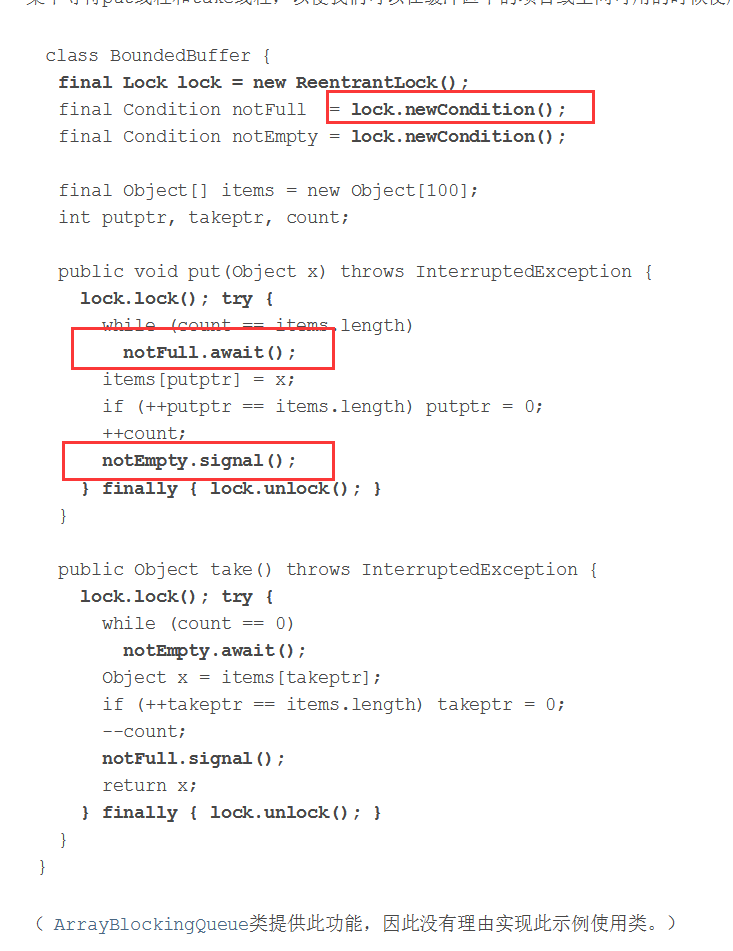
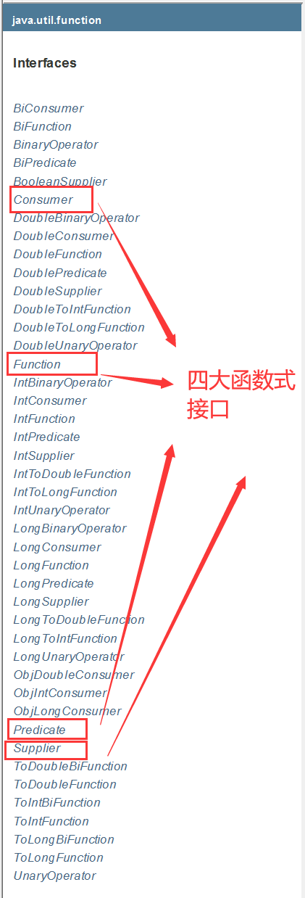

## JUC并发编程

## 1、什么是JUC

**源码** **+** **官方文档** 面试高频问！

|      |  |
| ---- | ------------------------------------------------------------ |
|      |                                                              |

java.util 工具包、包、分类

**业务：普通的线程代码** **Thread**

**Runnable** 没有返回值、效率相比入 Callable 相对较低！


## 2、线程和进程

> 线程、进程，如果不能使用一句话说出来的技术，不扎实！

进程：一个程序，QQ.exe Music.exe    程序的集合；

 一个进程往往可以包含多个线程，至少包含一个！

 Java默认有几个线程？ 2 个 mian、GC

线程：开了一个进程 Typora，写字，自动保存（线程负责的）

 对于Java而言：Thread、Runnable、Callable

**Java** **真的可以开启线程吗？** 开不了

```java
public synchronized void start() {
        /**
         * This method is not invoked for the main method thread or "system"
         * group threads created/set up by the VM. Any new functionality added
         * to this method in the future may have to also be added to the VM.
         *
         * A zero status value corresponds to state "NEW".
         */
        if (threadStatus != 0)
            throw new IllegalThreadStateException();

        /* Notify the group that this thread is about to be started
         * so that it can be added to the group's list of threads
         * and the group's unstarted count can be decremented. */
        group.add(this);

        boolean started = false;
        try {
            start0();
            started = true;
        } finally {
            try {
                if (!started) {
                    group.threadStartFailed(this);
                }
            } catch (Throwable ignore) {
                /* do nothing. If start0 threw a Throwable then
                  it will be passed up the call stack */
            }
        }
    }
	// 本地方法，底层的C++ ，Java 无法直接操作硬件
    private native void start0();
```

> ​	并发、并行

并发编程：并发、并行

并发（多线程操作同一个资源）

- CPU 一核 ，模拟出来多条线程，天下武功，唯快不破，快速交替

并行（多个人一起行走）

- CPU多核 ，多个线程可以同时执行； 线程池

```java
package com.kuang.demo01;

public class Test1 {
    public static void main(String[] args) {
        //获取cpu的核数
        //cpu 密集型 io密集型
        System.out.println(Runtime.getRuntime().availableProcessors());
    }
}
```

并发编程的本质：**充分利用CPU的资源**

所有的公司都很看重！

企业，挣钱=> 提高效率，裁员，找一个厉害的人顶替三个不怎么样的人；

人员（减） 、技术成本（高）

> 线程有几个状态

Thread.State 源码

```java
public enum State {
        //新生
        NEW,

       	//运行
        RUNNABLE,

       	//阻塞
        BLOCKED,

       	//等待 ，死死等待
        WAITING,

        //超时等待
        TIMED_WAITING,

        //终止
        TERMINATED;
    }
```

> wait/sleep 区别

**1、来自不同的类**

wait => Object

sleep  => Thread

**2、关于锁的释放**

wait 会释放锁，sleep 睡觉了，抱着锁睡觉，不会释放！

**3、使用的范围是不同的**

wait 必须在同步代码块中

sleep 可以再任何地方睡

**4、是否需要捕获异常**

wait 不需要捕获异常

sleep 必须要捕获异常

## 3、Lock锁（重点）

> 传统 Synchronized

代码模拟：卖票

```java
package com.kuang.demo01;
// 基本的卖票例子

/**
 真正的多线程开发，公司中的开发，降低耦合性
 线程就是一个单独的资源类，没有任何附属的操作！
 *1、 属性、方法
 */
public class SaleTicketDemo01 {
    public static void main(String[] args) {
        // 并发：多线程操作同一个资源类, 把资源类丢入线程
        Ticket ticket = new Ticket();

        // @FunctionalInterface 函数式接口，jdk1.8 lambda表达式 (参数)->{ 代码 }
        new Thread(()->{
            for (int i = 0; i < 40; i++) {
                ticket.sale();
            }
        },"A").start();

        new Thread(()->{
            for (int i = 0; i < 40; i++) {
                ticket.sale();
            }
        },"B").start();

        new Thread(()->{
            for (int i = 0; i < 40; i++) {
                ticket.sale();
            }
        },"C").start();

        new Thread(()->{
            for (int i = 0; i < 40; i++) {
                ticket.sale();
            }
        },"D").start();
    }
}

//资源类 OOP

class Ticket{
    //属性 方法
    private int number = 30;

    // 卖票的方式
    // synchronized 本质: 队列，锁
    public synchronized void sale(){
        if(number > 0){
            System.out.println(Thread.currentThread().getName()+"卖出了第"+(number--)+"张票，剩余："+number+"张票");
        }
    }
}
```

 运行截图


> Lock 接口


公平锁：十分公平：可以先来后到

**非公平锁：十分不公平：可以插队 （默认）**

```java
package com.kuang.demo01;
// 基本的卖票例子


import java.util.concurrent.locks.ReentrantLock;

/**
 真正的多线程开发，公司中的开发，降低耦合性
 线程就是一个单独的资源类，没有任何附属的操作！
 *1、 属性、方法
 */
public class SaleTicketDemo02 {
    public static void main(String[] args) {
        // 并发：多线程操作同一个资源类, 把资源类丢入线程
        Ticket ticket = new Ticket();
        // @FunctionalInterface 函数式接口，jdk1.8 lambda表达式 (参数)->{ 代码 }
        new Thread(()->{for (int i = 1; i < 40 ; i++) ticket.sale();},"A").start();
        new Thread(()->{for (int i = 1; i < 40 ; i++) ticket.sale();},"B").start();
        new Thread(()->{for (int i = 1; i < 40 ; i++) ticket.sale();},"C").start();
    }
}

//资源类 OOP
// Lock三部曲 
// 1、 new ReentrantLock(); 
// 2、 lock.lock(); // 加锁 
// 3、 finally=> lock.unlock(); // 解锁
class Ticket2{
    //属性 方法
    private int number = 30;
    ReentrantLock lock =  new ReentrantLock();
    public synchronized void sale(){
        lock.lock();  //加锁
        try {
            // 业务代码
            if(number > 0){
                System.out.println(Thread.currentThread().getName()+"卖出了第"+(number--)+"张票，剩余："+number+"张票");
            }
        } catch (Exception e) {
            e.printStackTrace();
        } finally {
            lock.unlock(); //解锁
        }
    }
}
```

> Synchronized 和 Lock 区别

1、Synchronized 内置的Java关键字， Lock 是一个Java类 

2、Synchronized 无法判断获取锁的状态，Lock 可以判断是否获取到了锁

3、Synchronized 会自动释放锁，lock 必须要手动释放锁！如果不释放锁，**死锁**

4、Synchronized 线程 1（获得锁，阻塞）、线程2（等待，傻傻的等）；Lock锁就不一定会等待下

去；

5、Synchronized 可重入锁，不可以中断的，非公平；Lock ，可重入锁，可以 判断锁，非公平（可以

自己设置）；

6、Synchronized 适合锁少量的代码同步问题，Lock 适合锁大量的同步代码！


> 锁是什么，如何判断锁的是谁！

[说一说你对synchronized锁的理解？](https://blog.csdn.net/qq1353424111/article/details/108659633?ops_request_misc=%257B%2522request%255Fid%2522%253A%2522161909208716780274196870%2522%252C%2522scm%2522%253A%252220140713.130102334..%2522%257D&request_id=161909208716780274196870&biz_id=0&utm_medium=distribute.pc_search_result.none-task-blog-2~all~first_rank_v2~rank_v29-1-108659633.pc_search_result_hbase_insert&utm_term=Synchronized+%E9%94%81)

synchronized的英文意思就是同步的意思，就是可以让synchronized修饰的方法，代码块，每次只能有一个线程在执行，以此来实现数据的安全。

一般可以修饰同步代码块、实例方法、静态方法，加锁对象分别为同步代码块块括号内的对象、实例对象、类。

## 4、生产者和消费者问题

面试的：单例模式、排序算法、生产者和消费者、死锁

> 生产者和消费者问题 Synchronized **版**

```java
package com.kuang.demo02;

/**
 *线程之间的通信问题：生产者和消费者问题！ 等待唤醒，通知唤醒
 * 线程交替执行 A B 操作同一个变量 num = 0
 * A num+1
 * B num-1
 * */
public class A {
    public static void main(String[] args) {
        Data date = new Data();

        new Thread(()->{
            for (int i = 0; i < 10; i++) {
                try {
                    date.increment();
                } catch (InterruptedException e) {
                    e.printStackTrace();
                }
            }
        },"A").start();

        new Thread(()->{
            for (int i = 0; i < 10; i++) {
                try {
                    date.decrement();
                } catch (InterruptedException e) {
                    e.printStackTrace();
                }
            }
        },"B").start();
    }
}

//判断等待，业务，通知
class Data{ //数字，资源类

    private int number = 0;

    public synchronized void increment() throws InterruptedException {
        if(number!=0){ //0
            //等待
            this.wait();
        }
        number++;
        //通知其他线程，我+1完毕了
        System.out.println(Thread.currentThread().getName()+"=>"+number);
        this.notifyAll();
    }

    public synchronized void decrement() throws InterruptedException {
        if(number==0){ //1
            //等待
            this.wait();
        }
        number --;
        System.out.println(Thread.currentThread().getName()+"=>"+number);
        //通知其他线程，我-1完毕了
        this.notifyAll();
    }
}
```

**运行截图**


> 问题存在，A B C D 4 个线程！ 虚假唤醒


**if** **改为** **while** **判断**

[线程虚假唤醒问题](https://blog.csdn.net/qq_33732195/article/details/108397633?ops_request_misc=%257B%2522request%255Fid%2522%253A%2522161914269316780261925839%2522%252C%2522scm%2522%253A%252220140713.130102334..%2522%257D&request_id=161914269316780261925839&biz_id=0&utm_medium=distribute.pc_search_result.none-task-blog-2~all~first_rank_v2~rank_v29-1-108397633.pc_search_result_hbase_insert&utm_term=%E7%BA%BF%E7%A8%8B%E8%99%9A%E5%81%87%E5%94%A4%E9%86%92) 

当有两条线程调用相同的方法时，线程唤醒调用了`notifyAll()`方法，会唤醒所有线程，这两条线程都会被唤醒，如果用`if`会直接执行下一步的代码，如果用`while`，线程虽然被唤醒，但还是会进行循环判断，就避免了线程虚假唤醒的问题；


**线程被唤醒后会从等待位置醒来，执行下面的代码；**

```java
package com.kuang.demo02;

/**
 *线程之间的通信问题：生产者和消费者问题！ 等待唤醒，通知唤醒
 * 线程交替执行 A B 操作同一个变量 num = 0
 * A num+1
 * B num-1
 * */
public class A {
    public static void main(String[] args) {
        Data date = new Data();

        new Thread(()->{
            for (int i = 0; i < 10; i++) {
                try {
                    date.increment();
                } catch (InterruptedException e) {
                    e.printStackTrace();
                }
            }
        },"A").start();

        new Thread(()->{
            for (int i = 0; i < 10; i++) {
                try {
                    date.decrement();
                } catch (InterruptedException e) {
                    e.printStackTrace();
                }
            }
        },"B").start();

        new Thread(()->{
            for (int i = 0; i < 10; i++) {
                try {
                    date.increment();
                } catch (InterruptedException e) {
                    e.printStackTrace();
                }
            }
        },"C").start();

        new Thread(()->{
            for (int i = 0; i < 10; i++) {
                try {
                    date.decrement();
                } catch (InterruptedException e) {
                    e.printStackTrace();
                }
            }
        },"D").start();
    }
}

//判断等待，业务，通知
class Data{ //数字，资源类

    private int number = 0;

    public synchronized void increment() throws InterruptedException {
        while(number!=0){ //0
            //等待
            this.wait();
        }
        number++;
        //通知其他线程，我+1完毕了
        System.out.println(Thread.currentThread().getName()+"=>"+number);
        this.notifyAll();
    }

    public synchronized void decrement() throws InterruptedException {
        while(number==0){ //1
            //等待
            this.wait();
        }
        number --;
        System.out.println(Thread.currentThread().getName()+"=>"+number);
        //通知其他线程，我-1完毕了
        this.notifyAll();
    }
}
```

**运行截图**


> JUC版的生产者和消费者问题


通过Lock 找到 Condition



代码实现：

```java
package com.kuang.demo02;


import java.util.concurrent.locks.Condition;
import java.util.concurrent.locks.Lock;
import java.util.concurrent.locks.ReentrantLock;

/**
 *线程之间的通信问题：生产者和消费者问题！ 等待唤醒，通知唤醒
 * 线程交替执行 A B 操作同一个变量 num = 0
 * A num+1
 * B num-1
 * */
public class B {
    public static void main(String[] args) {
        Data2 date = new Data2();
        new Thread(()->{
            for (int i = 0; i < 10; i++) {
                try {
                    date.increment();
                } catch (InterruptedException e) {
                    e.printStackTrace();
                }
            }
        },"A").start();

        new Thread(()->{
            for (int i = 0; i < 10; i++) {
                try {
                    date.decrement();
                } catch (InterruptedException e) {
                    e.printStackTrace();
                }
            }
        },"B").start();

        new Thread(()->{
            for (int i = 0; i < 10; i++) {
                try {
                    date.increment();
                } catch (InterruptedException e) {
                    e.printStackTrace();
                }
            }
        },"C").start();

        new Thread(()->{
            for (int i = 0; i < 10; i++) {
                try {
                    date.decrement();
                } catch (InterruptedException e) {
                    e.printStackTrace();
                }
            }
        },"D").start();

    }
}

//判断等待，业务，通知
class Data2{ //数字，资源类

    Lock lock = new ReentrantLock();
    Condition condition = lock.newCondition();
    private int number = 0;

    public void increment() throws InterruptedException {
        lock.lock();
        try {
            //业务代码
            while(number!=0){ //0
                //等待
                condition.await();
            }
            number++;
            //通知其他线程，我+1完毕了
            System.out.println(Thread.currentThread().getName()+"=>"+number);
            condition.signalAll();
        } catch (InterruptedException e) {
            e.printStackTrace();
        } finally {
            lock.unlock();
        }
    }

    public void decrement() throws InterruptedException {
        lock.lock();
        try {
            while(number==0){ //1
                //等待
                condition.await();
            }
            number --;
            System.out.println(Thread.currentThread().getName()+"=>"+number);
            //通知其他线程，我-1完毕了
            condition.signalAll();
        } catch (InterruptedException e) {
            e.printStackTrace();
        } finally {
            lock.unlock();
        }

    }
}
```

**任何一个新的技术，绝对不是仅仅只是覆盖了原来的技术，优势和补充！**

> Condition 精准的通知和唤醒线程

 

**有序执行ABC** 

```java
package com.kuang.demo02;

import java.util.concurrent.locks.Condition;
import java.util.concurrent.locks.Lock;
import java.util.concurrent.locks.ReentrantLock;

// A 执行完调用B，B执行完调用C，C执行完调用A
public class C {
    public static void main(String[] args) {
        Date3 date = new Date3();
        new Thread(()->{
            for (int i = 0; i < 10; i++) {
                date.printA();
            }
        },"A").start();

        new Thread(()->{
            for (int i = 0; i < 10; i++) {
                date.printB();
            }
        },"B").start();

        new Thread(()->{
            for (int i = 0; i < 10; i++) {
                date.printC();
            }
        },"C").start();


    }
}
class Date3{
    private Lock lock = new ReentrantLock();
    Condition condition1 = lock.newCondition();
    Condition condition2 = lock.newCondition();
    Condition condition3 = lock.newCondition();
    //一个同步监视器只能监视一个锁
    private int number = 1;
    public void printA(){
        lock.lock();
        try {
           //业务，判断->执行->通知
            while(number!=1){
                condition1.await();
            }
            System.out.println(Thread.currentThread().getName()+"=>AAAAAA");
            number = 2;
            condition2.signal();
        } catch (Exception e) {
            e.printStackTrace();
        } finally {
            lock.unlock();
        }
    }

    public void printB(){
        lock.lock();
        try {
            //业务，判断->执行->通知
            while(number!=2){
                condition2.await();
            }
            System.out.println(Thread.currentThread().getName()+"=>BBBBBB");
            number = 3;
            condition3.signal();
        } catch (Exception e) {
            e.printStackTrace();
        } finally {
            lock.unlock();
        }
    }
    public void printC(){
        lock.lock();
        try {
            //业务，判断->执行->通知
            while(number!=3){
                condition3.await();
            }
            System.out.println(Thread.currentThread().getName()+"=>AAAAAA");
            number = 1;
            condition1.signal();
        } catch (Exception e) {
            e.printStackTrace();
        } finally {
            lock.unlock();
        }
    }
}
```


## 5、8锁现象

如何判断锁的是谁！永远的知道什么锁，锁到底锁的是谁！c

**测试1**

```java
package com.kuang.lock8;


import java.util.concurrent.TimeUnit;


/**
*1、标准情况下，两个线程 先打印 发短信还是 打电话？ 1/发短信	2/打电话    //发短信
 *  两个方法用的是同一个锁，谁先拿到谁先执行  两个线程抢夺一个资
 *2、sendSms延迟4秒，两个线程先打印 发短信还是 打电话？ 1/发短信	2/打电话  //延迟四秒发短信
 *  两个方法用的是同一个锁，谁先拿到谁先执行
*/
public class Test1 {
public static void main(String[] args) { 
    
    Phone phone = new Phone();

	//锁的存在
	new Thread(()->{ phone.sendSms();
},"A").start();

	// 捕获
	try {
		TimeUnit.SECONDS.sleep(1);
	} catch (InterruptedException e) {
    	e.printStackTrace();
	}


		new Thread(()->{
		phone.call();
		},"B").start();
	}
}


class Phone{

	// synchronized 锁的对象是方法的调用者！、
	// 两个方法用的是同一个锁，谁先拿到谁执行！
	public synchronized void sendSms(){
        try {
			TimeUnit.SECONDS.sleep(4);
		} catch (InterruptedException e) { 
        	e.printStackTrace();
		}
		System.out.println("发短信");
}


	public synchronized void call(){ 
   	 	System.out.println("打电话");
	}

}
```

**测试2**

```java
package com.kuang.lock8;

import java.util.concurrent.TimeUnit;

/**
 *3、增加了一个普通方法后！先执行发短信还是hello？  //先执行hello
 *  hello没有锁，不受锁的影响
 *4、*两个对象，两个同步方法， 发短信还是 打电话？      // 打电话
 */
public class Test2 {

    public static void main(String[] args) {
        //两个对象，两个调用者，两把锁
        Phone2 phone1 = new Phone2();
        Phone2 phone2 = new Phone2();

        //锁的存在
        new Thread(()->{
            phone1.sendSms();
        },"A").start();


        try {
            TimeUnit.SECONDS.sleep(1);
        } catch (InterruptedException e) {
            e.printStackTrace();
        }

        new Thread(()->{
            phone2.call();
        },"B").start();
    }

}
class Phone2{

    //  synchronized 锁的对象是方法的调用者
    // 两个方法用的是同一个锁，谁先拿到谁先执行
    public synchronized void sendSms(){
        try {
            TimeUnit.SECONDS.sleep(4);
        } catch (InterruptedException e) {
            e.printStackTrace();
        }
        System.out.println("发短信");
    }

    public synchronized void call(){
        System.out.println("打电话");
    }

    //这里没有锁，不受锁的影响
    public  void hello(){
        System.out.println("hello");
    }
}
```

**测试3**

```java
package com.kuang.lock8;

import java.util.concurrent.TimeUnit;


/**
 *5、增加两个静态的同步方法，只有一个对象，先打印 发短信？打电话？  //发短信
 *   类一加载就有了！锁的是Class 模板
 *6、两个对象！增加两个静态的同步方法， 先打印 发短信？打电话？
 *   两个对象的Class类模板只有一个，static，锁的是Class
 */
public class Test3 {

    public static void main(String[] args) {
        // 两个对象的Class类模板只有一个，static，锁的是Class
        Phone3 phone1 = new Phone3();
        Phone3 phone2 = new Phone3();

        //锁的存在
        new Thread(()->{
            phone1.sendSms();
        },"A").start();


        try {
            TimeUnit.SECONDS.sleep(1);
        } catch (InterruptedException e) {
            e.printStackTrace();
        }

        new Thread(()->{
            phone2.call();
        },"B").start();
    }

}


// Phone3唯一的一个 Class 对象
class Phone3{

    //  synchronized 锁的对象是方法的调用者
    // static 静态方法
    // 类一加载就有了！锁的是Class 模板
    public static synchronized void sendSms(){
        try {
            TimeUnit.SECONDS.sleep(4);
        } catch (InterruptedException e) {
            e.printStackTrace();
        }
        System.out.println("发短信");
    }

    public static synchronized void call(){
        System.out.println("打电话");
    }
}
```

**测试4**

```java
package com.kuang.lock8;

import java.util.concurrent.TimeUnit;


/**
 * 7、1个静态的同步方法，1个普通的同步方法 ，一个对象，先打印 发短信？打电话？
 * 	  两个不同的锁，类锁和对象锁，有延迟的后执行
 * 8、1个静态的同步方法，1个普通的同步方法 ，两个对象，先打印 发短信？打电话？
 * 	  同上
 */
public class Test4 {

    public static void main(String[] args) {
        // 两个对象的Class类模板只有一个，static，锁的是Class
        Phone4 phone1 = new Phone4();
        Phone4 phone2 = new Phone4();

        //锁的存在
        new Thread(()->{
            phone1.sendSms();
        },"A").start();


        try {
            TimeUnit.SECONDS.sleep(1);
        } catch (InterruptedException e) {
            e.printStackTrace();
        }

        new Thread(()->{
            phone2.call();
        },"B").start();
    }

}


// Phone3唯一的一个 Class 对象
class Phone4{

    //静态同步方法 锁的class类模板
    public static synchronized void sendSms(){
        try {
            TimeUnit.SECONDS.sleep(4);
        } catch (InterruptedException e) {
            e.printStackTrace();
        }
        System.out.println("发短信");
    }
    //普通同步方法 锁的调用者
    public  synchronized void call(){
        System.out.println("打电话");
    }

}
```

> 小结

new this 具体的一个手机

static Class 唯一的一个模板


## 6、集合不安全类

> List 不安全

```java
package com.kuang.unsafe;

import java.util.*;
import java.util.concurrent.CopyOnWriteArrayList;

// java.util.ConcurrentModificationException 并发修改异常
public class ListTest {
    public static void main(String[] args) {
        // 并发下 ArrayList 不安全的吗，Synchronized；
        /**
        *解决方案；
        *1、List<String> list = new Vector<>();
        *2、List<String> list = Collections.synchronizedList(new ArrayList<>());
        *3、List<String> list = new CopyOnWriteArrayList<>()；
        */
        // CopyOnWrite 写入时复制	COW	计算机程序设计领域的一种优化策略；
        // 多个线程调用的时候，list，读取的时候，固定的，写入（覆盖）
        // 在写入的时候避免覆盖，造成数据问题！
        // 读写分离
        // CopyOnWriteArrayList	比 Vector Nb 在哪里？
        List<String> list =  new CopyOnWriteArrayList<>();
        for (int i = 1; i <= 10; i++) {
            new Thread(()->{
               list.add(UUID.randomUUID().toString().substring(0,5));
               System.out.println(list);
            },String.valueOf(i)).start();
        }

    }
}
```

小狂神的学习方法推荐：1、先会用、2、货比3家，寻找其他解决方案，3、分析源码！

> Set 不安全

```java
package com.kuang.unsafe;


import java.util.Collections;
import java.util.HashSet;
import java.util.Set;
import java.util.UUID;
import java.util.concurrent.CopyOnWriteArraySet;

/**
 *同理可证 ： ConcurrentModificationException
 * //1、Set<String> set = Collections.synchronizedSet(new HashSet<>());
 * //2、
 * */
public class SetTest {
    public static void main(String[] args) {
//        Set<String> set = new HashSet<>();
//        Set<String> set = Collections.synchronizedSet( new HashSet<>());
        Set<String> set = new CopyOnWriteArraySet<>();
        for (int i = 0; i < 30; i++) {
            new Thread(()->{
                set.add(UUID.randomUUID().toString().substring(0,5));
                System.out.println(set);
            },String.valueOf(i)).start();
        }
    }
}

```

```java
public HashSet() {
    map = new HashMap<>();
}
// add set 本质就是 map key是无法重复的
public boolean add(E e) {
    return map.put(e, PRESENT)==null;
}

private static final Object PRESENT = new Object(); // 不变的值
```

> Map 不安全

```java
package com.kuang.unsafe;

import java.util.HashMap;
import java.util.Map;
import java.util.UUID;
import java.util.concurrent.ConcurrentHashMap;

public class MapTest {
    public static void main(String[] args) {
        // map 是这样用的吗？ 不是，工作中不用 HashMap
        // 默认等价于什么？	new HashMap<>(16,0.75);
        // Map<String, String> map = new HashMap<>();
        //  唯一的一个家庭作业：研究ConcurrentHashMap的原理
        Map<String, String> map = new ConcurrentHashMap<>();  //并发hashMap
        for (int i = 0; i < 30; i++) {
            new Thread(()->{
                map.put(Thread.currentThread().getName(),UUID.randomUUID().toString().substring(0,5));
                System.out.println(map);
            },String.valueOf(i)).start();
        }
    }
}
```

## 7、Callable（简单）


1、可以有返回值

2、可以抛出异常

3、方法不同，run()/ call()


> 代码测试

```java
package com.kuang.callable;

import java.util.concurrent.Callable;
import java.util.concurrent.ExecutionException;
import java.util.concurrent.FutureTask;

public class CallableTest {
    public static void main(String[] args) throws ExecutionException, InterruptedException {
        // new Thread(new Runnable()).start();
        // new Thread(new FutureTask<V>()).start();
        // new Thread(new FutureTask<V>( Callable )).start();
        new Thread().start();
        //futureTask是Runnable的实现类，可以接收Callable的实现类
        MyThread myThread = new MyThread();
        FutureTask futureTask = new FutureTask(myThread); //适配类
        
        new Thread(futureTask,"A").start();
        new Thread(futureTask,"B").start(); //结果会被缓存，效率高

        Integer o = (Integer) futureTask.get();//这个get方法可能会产生阻塞，把他放到最后，或者使用异步通信来处理

        System.out.println(o);
    }
}

class MyThread implements Callable<Integer>{

    @Override
    public Integer call() throws Exception {
        System.out.println("call()");
        
        //耗时的操作
        return 1024;
    }
}
```

**细节：** 

1、有缓存

2、结果可能需要等待，会阻塞！

## 8、常用的辅助类(必会)

### 8.1、CountDownLatch


```java
package com.kuang.add;

import java.util.concurrent.CountDownLatch;

//计数器
public class CountDownLatchDemo {
    public static void main(String[] args) throws InterruptedException {
        // 总数是6，必须要执行任务的时候，再使用！
        CountDownLatch countDownLatch = new CountDownLatch(6);

        for (int i = 0; i < 6; i++) {
            new Thread(()->{
                System.out.println(Thread.currentThread().getName()+"Go out");
                countDownLatch.countDown(); //数量-1
            },String.valueOf(i)).start();
        }

        countDownLatch.await(); //// 等待计数器归零，然后再向下执行

        System.out.println("Close Door");
    }
}
```

原理：

`countDownLatch.countDown()`; //数量-1

`countDownLatch.await();`// 等待计数器归零，然后再向下执行

每次有线程调用` countDown()` 数量-1，假设计数器变为0，`countDownLatch.await() `就会被唤醒，继续执行！

### 8.2、CyclicBarrier


换句话说：加法计数器

```java
package com.kuang.add;

import java.util.concurrent.BrokenBarrierException;
import java.util.concurrent.CyclicBarrier;

public class CyclicBarrierDemo {
    /**
     * 集齐7颗龙珠召唤神龙
     */

    // 召唤龙珠的线程
    public static void main(String[] args) {
        CyclicBarrier cyclicBarrier = new CyclicBarrier(7,new Thread(()->{
            System.out.println("召唤神龙成功！");
        }));

        for (int i = 1; i <= 7; i++) {
            final int temp = i;

            new Thread(()->{
                System.out.println(Thread.currentThread().getName()+" 收集了 "+temp+"个龙珠");
                try {
                    cyclicBarrier.await();
                } catch (InterruptedException e) {
                    e.printStackTrace();
                } catch (BrokenBarrierException e) {
                    e.printStackTrace();
                }
            }).start();
        }
    }

}

```

**运行截图**


### 8.3、Semaphore

Semaphore：信号量


**代码模拟：抢车位**  

```java
package com.kuang.add;

import java.util.concurrent.Semaphore;
import java.util.concurrent.TimeUnit;

public class SemaphoreDemo {
    public static void main(String[] args) {
        //线程数量：停车位!限流！
        Semaphore semaphore = new Semaphore(3);
        for (int i = 1; i <= 6; i++) {
            new Thread(()->{
                try {
                    semaphore.acquire(); //得到
                    System.out.println(Thread.currentThread().getName()+"抢到车位");
                    TimeUnit.SECONDS.sleep(2);
                    System.out.println(Thread.currentThread().getName()+"离开车位");
                } catch (InterruptedException e) {
                    e.printStackTrace();
                } finally {
                    semaphore.release(); //释放
                }
            },String.valueOf(i)).start();
        }
    }
}
```


`semaphore.acquire()`获得，假设如果已经满了，等待，等待被释放为止！

`semaphore.release()`释放，会将当前的信号量释放 + 1，然后唤醒等待的线程！ 作用： 多个共享资源互斥的使用！并发限流，控制最大的线程数！

## 9、读写锁


**代码模拟**

```java
package com.kuang.rw;

import java.util.HashMap;
import java.util.Map;
import java.util.concurrent.locks.ReadWriteLock;
import java.util.concurrent.locks.ReentrantLock;
import java.util.concurrent.locks.ReentrantReadWriteLock;

/**
 *独占锁（写锁） 一次只能被一个线程占有
 *共享锁（读锁） 多个线程可以同时占有
 *ReadWriteLock
 *读-读	可以共存！
 *读-写	不能共存！
 *写-写	不能共存！
 */
public class ReadWriteLockDemo {
    public static void main(String[] args) {
        MyCacheLock myCache = new MyCacheLock();
        //写入
        for (int i = 0; i < 5; i++) {
            final int temp = i;
            new Thread(()->{
                myCache.put(temp+"",temp+"");
            },String.valueOf(i)).start();
        }
        //读取
        for (int i = 0; i < 5; i++) {
            final int temp = i;
            new Thread(()->{
                myCache.get(temp+"");
            },String.valueOf(i)).start();
        }
    }
}

class MyCacheLock{
    private Map<String,Object> map = new HashMap<>();
    // 读写锁： 更加细粒度的控制
    private ReadWriteLock readWriteLock = new ReentrantReadWriteLock();
    // 存 写
    public void put(String key,Object value){
        readWriteLock.writeLock().lock();
        try {
            System.out.println(Thread.currentThread().getName()+"写入"+key);
            map.put(key,value);
            System.out.println(Thread.currentThread().getName()+"写入ok");
        } catch (Exception e) {
            e.printStackTrace();
        } finally {
            readWriteLock.writeLock().unlock();
        }

    }

    // 取 读
    public void get(String key){
        readWriteLock.readLock().lock();
        try {
            System.out.println(Thread.currentThread().getName()+"读取"+key);
            Object o = map.get(key);
            System.out.println(Thread.currentThread().getName()+"读取ok");
        } catch (Exception e) {
            e.printStackTrace();
        } finally {
            readWriteLock.readLock().unlock();
        }

    }
}
/**
 * 自定义缓存
 */

class MyCache{
    private Map<String,Object> map = new HashMap<>();
    // 存 写
    public void put(String key,Object value){
        System.out.println(Thread.currentThread().getName()+"写入"+key);
        map.put(key,value);
        System.out.println(Thread.currentThread().getName()+"写入ok");
    }

    // 取 读
    public void get(String key){
        System.out.println(Thread.currentThread().getName()+"读取"+key);
        Object o = map.get(key);
        System.out.println(Thread.currentThread().getName()+"读取ok");
    }
}
```

**运行截图**


一次只有一个线程（  *写入*线程）可以修改共享数据，在许多情况下，任何数量的线程都可以同时读取数据（因此*读取器*线程）。 

写锁：一次只有一个线程（  *写入*线程）可以修改共享数据

读锁：任何数量的线程都可以同时读取数据（因此*读取器*线程）

## 10、阻塞队列

**图一**


**图二**


**BlockingQueue** BlockingQueue 不是新的东西


什么情况下我们会使用阻塞队列：

多线程并发处理，线程池！

**学会使用队列**

添加、移除

**四组**API

| **方式**     | **抛出异常** | **有返回值，不抛出异常** | **阻塞 等待** | **超时等待** |
| ------------ | ------------ | ------------------------ | ------------- | ------------ |
| 添加         | add          | offer()                   | put()         | offer(,,)     |
| 移除         | remove       | poll()                   | take()        | poll(,)      |
| 检测队首元素 | element      | peek                     | -             | -            |

> ArrayBlockingQueue阻塞队列

`add `和`remove`**抛出异常**

```java
    /**
     * 抛出异常
     */
    public static void test1(){
        //队列的大小
        ArrayBlockingQueue blockingQueue = new ArrayBlockingQueue<>(3);
        System.out.println(blockingQueue.add("a"));
        System.out.println(blockingQueue.add("b"));
        System.out.println(blockingQueue.add("c"));
        //IllegalStateException: Queue full 抛出异常！
        //System.out.println(blockingQueue.add("c"));

        System.out.println("=============");
        System.out.println(blockingQueue.remove());
        System.out.println(blockingQueue.remove());
        System.out.println(blockingQueue.remove());

        // java.util.NoSuchElementException 抛出异常！
        // System.out.println(blockingQueue.remove());
    }
```

`offer()`和`poll()`**有返回值，不抛出异常**

```java
    /**
     * 有返回值，没有异常
     */
    public static void test2(){
        //队列的大小
        ArrayBlockingQueue blockingQueue = new ArrayBlockingQueue<>(3);
        System.out.println(blockingQueue.offer("a"));
        System.out.println(blockingQueue.offer("b"));
        System.out.println(blockingQueue.offer("c"));
        // System.out.println(blockingQueue.offer("d")); // false 不抛出异常！

        System.out.println("====================");
        System.out.println(blockingQueue.poll());
        System.out.println(blockingQueue.poll());
        System.out.println(blockingQueue.poll());
        System.out.println(blockingQueue.poll()); // null	不抛出异常！
    }
```

`put()`和`take()`**阻塞 等待**

```java
   /**
     * 等待，阻塞（一直阻塞）
     */
    public static void test3() throws InterruptedException {
        // 队列的大小
        ArrayBlockingQueue blockingQueue = new ArrayBlockingQueue<>(3);

        //一直阻塞
        blockingQueue.put("a");
        blockingQueue.put("b");
        blockingQueue.put("c");
        // blockingQueue.put("d"); // 队列没有位置了，一直阻塞

        System.out.println(blockingQueue.take());
        System.out.println(blockingQueue.take());
        System.out.println(blockingQueue.take());
        System.out.println(blockingQueue.take()); // 没有这个元素，一直阻塞
 }
```

`offer(,,)`和`poll(,,)`**超时等待**

```java
	/**
     * 等待，阻塞（等待超时）
     */
    public static void test4() throws InterruptedException {
        // 队列的大小
        ArrayBlockingQueue blockingQueue = new ArrayBlockingQueue<>(3);
        blockingQueue.offer("a");
        blockingQueue.offer("b");
        blockingQueue.offer("c");
        // blockingQueue.offer("d",2,TimeUnit.SECONDS); // 等待超过2秒就退出
        System.out.println("===============");

        System.out.println(blockingQueue.poll());
        System.out.println(blockingQueue.poll());
        System.out.println(blockingQueue.poll());
        blockingQueue.poll(2, TimeUnit.SECONDS); // 等待超过2秒就退出
    }
```

> SynchronousQueue 同步队列

没有容量，

进去一个元素，必须等待取出来之后，才能再往里面放一个元素！

put、take

```java
package com.kuang.rb;

import jdk.nashorn.internal.ir.BlockLexicalContext;

import java.util.concurrent.BlockingQueue;
import java.util.concurrent.SynchronousQueue;
import java.util.concurrent.TimeUnit;

/**
 *同步队列
 *和其他的BlockingQueue 不一样， SynchronousQueue 不存储元素
 *put了一个元素，必须从里面先take取出来，否则不能在put进去值！
 */
public class SynchronousQueueDemo {
    public static void main(String[] args) {
        BlockingQueue<String> blockingQueue = new SynchronousQueue<>();//同步队列
        new Thread(()->{
            try {
                System.out.println(Thread.currentThread().getName()+"put 1");
                blockingQueue.put("1");
                System.out.println(Thread.currentThread().getName()+"put 2");
                blockingQueue.put("2");
                System.out.println(Thread.currentThread().getName()+"put 3");
                blockingQueue.put("3");
            } catch (InterruptedException e) {
                e.printStackTrace();
            }
        },"T1").start();

        new Thread(()->{
            try {
                TimeUnit.SECONDS.sleep(3);
                System.out.println(Thread.currentThread().getName()+"=>"+blockingQueue.take());
                TimeUnit.SECONDS.sleep(3);
                System.out.println(Thread.currentThread().getName()+"=>"+blockingQueue.take());
                TimeUnit.SECONDS.sleep(3);
                System.out.println(Thread.currentThread().getName()+"=>"+blockingQueue.take());
            } catch (InterruptedException e) {
                e.printStackTrace();
            }
        },"T2").start();
    }
}

```

**运行截图**


**学了技术，不会用！ 看的少！**

## 11、线程池（重点）

线程池：三大方法、7大参数、4种拒绝策略

> 池化技术

程序的运行，本质：占用系统的资源！ 优化资源的使用！=>池化技术、

线程池、连接池、内存池、对象池///.	创建、销毁。十分浪费资源

池化技术：事先准备好一些资源，有人要用，就来我这里拿，用完之后还给我。

**线程池的好处**

1、降低资源的消耗

2、提高响应的速度

3、方便管理。

==**线程复用、可以控制最大并发数、管理线程**== 

> 线程池：三大方法


```java
package com.kuang.pool;


import java.util.concurrent.ExecutorService;
import java.util.concurrent.Executors;

// Executors 工具类、3大方法
public class Demo01 {
    public static void main(String[] args) {
        // ExecutorService threadPool = Executors.newSingleThreadExecutor(); //单个线程
        //ExecutorService threadPool = Executors.newFixedThreadPool(5); //创建一个固定的线程池的大小
        ExecutorService threadPool = Executors.newCachedThreadPool(); //可伸缩的，遇强则强，遇弱则弱

        try {
            for (int i = 0; i < 100; i++) {
                // 使用了线程池之后，使用线程池来创建线程
                threadPool.execute(()->{
                    System.out.println(Thread.currentThread().getName()+" ok");
                });
            }
        } catch (Exception e) {
            e.printStackTrace();
        } finally {
            // 线程池用完，程序结束，关闭线程池
            threadPool.shutdown();
        }

    }
}
```

> 7大参数

源码分析

```java
//单个线程 
public static ExecutorService newSingleThreadExecutor() {
        return new FinalizableDelegatedExecutorService
            (new ThreadPoolExecutor(1, 1,                                    
                                    0L, TimeUnit.MILLISECONDS,
                                    new LinkedBlockingQueue<Runnable>()));
    }
 //创建一个固定的线程池的大小
 public static ExecutorService newFixedThreadPool(int nThreads) {
        return new ThreadPoolExecutor(nThreads, nThreads,
                                      0L, TimeUnit.MILLISECONDS,
                                      new LinkedBlockingQueue<Runnable>());
    }
 //可伸缩的，遇强则强，遇弱则弱
 public static ExecutorService newCachedThreadPool() {
        return new ThreadPoolExecutor(0, Integer.MAX_VALUE,
                                      60L, TimeUnit.SECONDS,
                                      new SynchronousQueue<Runnable>());
    }
   public ThreadPoolExecutor(int corePoolSize,// 核心线程池大小
                              int maximumPoolSize,// 最大核心线程池大小
                              long keepAliveTime, // 超时了没有人调用就会释放
                              TimeUnit unit,// 超时单位
                              BlockingQueue<Runnable> workQueue,// 阻塞队列
                              ThreadFactory threadFactory,// 线程工厂：创建线程的，一般不用动
                              RejectedExecutionHandler handler) { // 拒绝策略
        this(corePoolSize, maximumPoolSize, keepAliveTime, unit, workQueue,
             Executors.defaultThreadFactory(), handler);
    }
```


> 手动创建一个线程池

```java
package com.kuang.pool;


import java.util.concurrent.*;

// Executors 工具类、3大方法
/**
 *new ThreadPoolExecutor.AbortPolicy() // 银行满了，还有人进来，不处理这个人的，抛出异常
 *new ThreadPoolExecutor.CallerRunsPolicy() // 哪来的去哪里！
 *new ThreadPoolExecutor.DiscardPolicy() //队列满了，丢掉任务，不会抛出异常！
 *new ThreadPoolExecutor.DiscardOldestPolicy() //队列满了，尝试去和最早的竞争，也不会抛出异常！
 */
public class Demo01 {
    public static void main(String[] args) {
        // 自 定 义 线 程 池 ！ 工 作 ThreadPoolExecutor
        ExecutorService threadPool = new ThreadPoolExecutor(
                2,
                5,
                3,
                TimeUnit.SECONDS,
                new LinkedBlockingQueue<>(3),
                Executors.defaultThreadFactory(),
                new ThreadPoolExecutor.DiscardOldestPolicy()); //队列满了，尝试去和最早的竞争，也不会抛出异常！

        try {
            for (int i = 1; i <= 9; i++) {
                // 使用了线程池之后，使用线程池来创建线程
                threadPool.execute(()->{
                    System.out.println(Thread.currentThread().getName()+" ok");
                });
            }
        } catch (Exception e) {
            e.printStackTrace();
        } finally {
            // 线程池用完，程序结束，关闭线程池
            threadPool.shutdown();
        }

    }
}

```

> 4种拒绝策略 


```java
/**
 *new ThreadPoolExecutor.AbortPolicy() // 银行满了，还有人进来，不处理这个人的，抛出异常
 *new ThreadPoolExecutor.CallerRunsPolicy() // 哪来的去哪里！
 *new ThreadPoolExecutor.DiscardPolicy() //队列满了，丢掉任务，不会抛出异常！
 *new ThreadPoolExecutor.DiscardOldestPolicy() //队列满了，尝试去和最早的竞争，也不会抛出异常！
 */
```

> 小结和拓展

池的最大的大小如何去设置！

`Runtime.getRuntime().availableProcessors()` 获取cpu可执行的最大（核数）线程数

了解：IO密集型，CPU密集型：（调优）

```java
package com.kuang.pool;


import java.util.concurrent.*;

// Executors 工具类、3大方法
/**
 *new ThreadPoolExecutor.AbortPolicy() // 银行满了，还有人进来，不处理这个人的，抛出异常
 *new ThreadPoolExecutor.CallerRunsPolicy() // 哪来的去哪里！
 *new ThreadPoolExecutor.DiscardPolicy() //队列满了，丢掉任务，不会抛出异常！
 *new ThreadPoolExecutor.DiscardOldestPolicy() //队列满了，尝试去和最早的竞争，也不会抛出异常！
 */
public class Demo01 {
    public static void main(String[] args) {
        // 自 定 义 线 程 池 ！ 工 作 ThreadPoolExecutor

        // 最大线程到底该如何定义
        // 1、CPU 密集型，几核，就是几，可以保持CPu的效率最高！
        // 2、IO	密集型	> 判断你程序中十分耗IO的线程，
        // 程序	15个大型任务	io十分占用资源！

        // 获取CPU的核数
        System.out.println(Runtime.getRuntime().availableProcessors());

        ExecutorService threadPool = new ThreadPoolExecutor(
                2,
                Runtime.getRuntime().availableProcessors(),
                3,
                TimeUnit.SECONDS,
                new LinkedBlockingQueue<>(3),
                Executors.defaultThreadFactory(),
                new ThreadPoolExecutor.DiscardOldestPolicy()); //队列满了，尝试去和最早的竞争，也不会抛出异常！

        try {
            // 最大承载：Deque + max
            // 超过 RejectedExecutionException
            for (int i = 1; i <= 9; i++) {
                // 使用了线程池之后，使用线程池来创建线程
                threadPool.execute(()->{
                    System.out.println(Thread.currentThread().getName()+" ok");
                });
            }
        } catch (Exception e) {
            e.printStackTrace();
        } finally {
            // 线程池用完，程序结束，关闭线程池
            threadPool.shutdown();
        }

    }
}
```

## 12、四大函数式接口（必须掌握）

新时代的程序员：lambda表达式、链式编程、函数式接口、Stream流式计算

> 函数式接口： 只有一个方法的接口

```java

@FunctionalInterface
public interface Runnable {
    public abstract void run();
}
// 泛型、枚举、反射
// lambda表达式、链式编程、函数式接口、Stream流式计算
// 超级多FunctionalInterface
// 简化编程模型，在新版本的框架底层大量应用！
// foreach(消费者类的函数式接口)
```

 

> Function函数式接口

 

```java
package com.kuang.function;

import java.util.function.Function;

/**
 *Function 函数型接口, 有一个输入参数，有一个输出
 *只要是 函数型接口 可以 用 lambda表达式简化
 */
public class Demo01 {
    public static void main(String[] args) {
/*        Function<String,String> function = new Function<String, String>() {
            @Override
            public String apply(String str) {
                return str;
            }
        };
*/      Function<String,String> function = (str)->{return str;};
        System.out.println(function.apply("abc"));
    }
}

```

> 断定型接口：有一个输入参数，返回值只能是 布尔值！

 

```java
package com.kuang.function;

import java.util.function.Predicate;


/**
 * 断定型接口：有一个输入参数，返回值只能是 布尔值！
 */
public class Demo02 {
    public static void main(String[] args) {
  /*      Predicate<String> predicate = new Predicate<String>() {
            @Override
            public boolean test(String strr) {
                return strr.isEmpty();
            }
        };*/
        Predicate<String> predicate = (str)->{return str.isEmpty();};
        System.out.println(predicate.test(""));
    }
}

```

> Consumer 消费型接口

 

```java
package com.kuang.function;

import java.util.function.Consumer;

/**
 * Consumer 消费型接口: 只有输入，没有返回值
 */
public class Demo03 {
    public static void main(String[] args) {
        /*Consumer<String> consumer =new Consumer<String>() {
            @Override
            public void accept(String str) {
                System.out.println(str);
            }
        };*/
        Consumer<String> consumer = (str)->{System.out.println(str);};
        consumer.accept("abcdefg");
    }
}
```

> Supplier 供给型接口

 

```java
package com.kuang.function;

import java.util.function.Supplier;

/**
 * Supplier 供给型接口 没有参数，只有返回值
 */
public class Demo04 {
    public static void main(String[] args) {
 /*      Supplier supplier = new Supplier<Integer>() {
           @Override
           public Integer get() {
               System.out.println("get()");
               return 1024;
           }
       };*/
        Supplier supplier = ()->{return 1024;};
        System.out.println(supplier.get());

    }
}
```

## 13、Stream流式计算

> 什么是Stream流式计算

大数据：存储 + 计算

集合、MySQL 本质就是存储东西的； 

计算都应该交给流来操作！

```java
package com.kuang.stream;
import java.util.Arrays;
import java.util.List;
/**
 *题目要求：一分钟内完成此题，只能用一行代码实现！
 *现在有5个用户！筛选：
 *1、ID 必须是偶数
 *2、年龄必须大于23岁
 *3、用户名转为大写字母
 *4、用户名字母倒着排序
 *5、只输出一个用户！
 */
public class Test {
    public static void main(String[] args) {
        User u1 = new User(1,"a",21);
        User u2 = new User(2,"b",22);
        User u3 = new User(3,"c",23);
        User u4 = new User(4,"d",24);
        User u5 = new User(6,"e",25);
        // 集合就是存储
        List<User> list = Arrays.asList(u1, u2, u3, u4, u5);

        list.stream()
                .filter(u->{return u.getId()%2 == 0;})
                .filter(u->{return u.getAge() > 23; })
                .map(u->{return u.getName().toUpperCase();})
                .sorted((uu1,uu2)->{return uu2.compareTo(uu1);})
                .limit(1)
                .forEach(System.out::println);
    }
}
```

## 14、ForkJoin

> 什么是 ForkJoin

ForkJoin 在 JDK 1.7 ， 并行执行任务！提高效率。大数据量！ 

大数据：Map Reduce （把大任务拆分为小任务）


> ForkJoin 特点：工作窃取

这个里面维护的都是双端队列


> ForkJoin


```java
package com.kuang.forkjoin;


import java.util.concurrent.RecursiveTask;

/**
 *求和计算的任务！
 *3000	6000（ForkJoin）	9000（Stream并行流）
 如何使用 forkjoin
 1、forkjoinPool 通过它来执行
 2、计算任务 forkjoinPool.execute(ForkJoinTask task)
 3. 计算类要继承 ForkJoinTask
*/
public class ForkJoinDemo extends RecursiveTask<Long> {

    private Long start ; //1
    private Long end ;   //1990900000

    //临界值
    private Long temp = 10000L;

    public ForkJoinDemo(Long start, Long end) {
        this.start = start;
        this.end = end;
    }
    //计算方法
    @Override
    protected Long compute() {
        if((end - start) < temp){
            Long sum = 0L;
            for (Long i = start; i <= end; i++) {
                sum+= i;
            }
            return sum;
        }else{
            // forkjoin 递归
            Long middle = (end + start)/2; //中间值
            ForkJoinDemo task1 = new ForkJoinDemo(start,middle);
            task1.fork(); // 拆分任务，把任务压入线程队列
            ForkJoinDemo task2 = new ForkJoinDemo(middle+1,end);
            task2.fork(); // 拆分任务，把任务压入线程队列
            return task1.join() + task2.join();
        }

    }
}

```

测试：

```java
package com.kuang.forkjoin;

import java.util.concurrent.ExecutionException;
import java.util.concurrent.ForkJoinPool;
import java.util.concurrent.ForkJoinTask;
import java.util.stream.LongStream;

/**
 * 同一个任务，别人效率高你几十倍！
 */
public class Test {
    public static void main(String[] args) throws ExecutionException, InterruptedException {
        test1();
        test2();
        test3();
    }
    //普通程序员
    public static void test1()
    {
        Long start = System.currentTimeMillis();
        Long sum = 0L;
        for (long i = 1L; i <= 10_0000_0000; i++) {
            sum += i;
        }
        Long end = System.currentTimeMillis();
        System.out.println("sum="+sum+" 时间: "+(end - start));
    }
    // 会使用ForkJoin
    public static void test2() throws ExecutionException, InterruptedException {
        Long start = System.currentTimeMillis();
        ForkJoinPool forkJoinPool = new ForkJoinPool();
        ForkJoinTask<Long> task = new ForkJoinDemo(0L,10_0000_0000L);
        ForkJoinTask<Long> submit = forkJoinPool.submit(task);// 提交任务
        Long sum = submit.get();
        Long end = System.currentTimeMillis();
        System.out.println("sum="+sum+" 时间："+(end-start));
    }
    //大神程序员
    public static void test3(){
        Long start = System.currentTimeMillis();
        // Stream并行流 ()
        long sum = LongStream.rangeClosed(0L, 10_0000_0000L).parallel().reduce(0, Long::sum);
        Long end = System.currentTimeMillis();
        System.out.println("sum="+sum+" 时间："+(end-start));
    }
}

```

ForkJoin在大数据的时候才有优势


## 15、异步回调

> Future 设计的初衷： 对将来的某个事件的结果进行建模


```java
package com.kuang.future;

import java.util.concurrent.CompletableFuture;
import java.util.concurrent.ExecutionException;
import java.util.concurrent.TimeUnit;

/**
 *异步调用： CompletableFuture
 * // 异步执行
 * // 成功回调
 * // 失败回调
*/
public class Demo01 {
    // 异步是让调用方法的主线程不需要同步等待另一线程的完成，从而可以让主线程干其它的事情。
    public static void main(String[] args) throws ExecutionException, InterruptedException {
        // 没有返回值的 runAsync 异步回调
      /*  CompletableFuture<Void> completableFuture = CompletableFuture.runAsync(()->{
            try {
                TimeUnit.SECONDS.sleep(2);
            } catch (InterruptedException e) {
                e.printStackTrace();
            }
            System.out.println(Thread.currentThread().getName()+"runAsync=>Void");
        });
        System.out.println("1111");
        completableFuture.get();*/
        // 有返回值的 supplyAsync 异步回调
        // ajax，成功和失败的回调
        // 返回的是错误信息；
        CompletableFuture<Integer> completableFuture = CompletableFuture.supplyAsync(()->{
            System.out.println(Thread.currentThread().getName()+"supplyAsync=>Integer"); int i = 10/0;
            return 1024;
        });
        System.out.println(completableFuture.whenComplete((t, u) -> { System.out.println("t=>" + t); // 正常的返回结果System.out.println("u=>" + u); // 错误信息：
            // java.util.concurrent.CompletionException: java.lang.ArithmeticException: // by zero
        }).exceptionally((e) -> { System.out.println(e.getMessage());
            return 233; // 可以获取到错误的返回结果
        }).get());
        /**
         *succee Code 200
         *error Code 404 500
         */
    }
}

```


## 16、JVM

> 请你谈谈你对 Volatile 的理解

Volatile 是 Java 虚拟机提供**轻量级的同步机制**

1、保证可见性

==2、不保证原子性==

3、禁止指令重排

> 什么是JMM

JMM ： Java内存模型，不存在的东西，概念！约定！

**关于JMM的一些同步的约定：**

1、线程解锁前，必须把共享变量**立刻**刷回主存。

2、线程加锁前，必须读取主存中的最新值到工作内存中！

3、加锁和解锁是同一把锁 

线程 **工作内存** 、**主内存**

**8种操作：**


**内存交互操作有8种，虚拟机实现必须保证每一个操作都是原子的，不可在分的（对于double和long类  型的变量来说，load、store、read和write操作在某些平台上允许例外）**

- lock （锁定）：作用于主内存的变量，把一个变量标识为线程独占状态
- unlock  （解锁）：作用于主内存的变量，它把一个处于锁定状态的变量释放出来，释放后的变量才可以被其他线程锁定
- read   （读取）：作用于主内存变量，它把一个变量的值从主内存传输到线程的工作内存中，以便随后的load动作使用
- load （载入）：作用于工作内存的变量，它把read操作从主存中变量放入工作内存中
- use   （使用）：作用于工作内存中的变量，它把工作内存中的变量传输给执行引擎，每当虚拟机遇到一个需要使用到变量的值，就会使用到这个指令

- assign   （赋值）：作用于工作内存中的变量，它把一个从执行引擎中接受到的值放入工作内存的变量副本中

- store  （存储）：作用于主内存中的变量，它把一个从工作内存中一个变量的值传送到主内存中， 以便后续的write使用

- write	（写入）：作用于主内存中的变量，它把store操作从工作内存中得到的变量的值放入主内  存的变量中

**JMM对这八种指令的使用，制定了如下规则：**

- 不允许read和load、store和write操作之一单独出现。即使用了read必须load，使用了store必须

write

- 不允许线程丢弃他最近的assign操作，即工作变量的数据改变了之后，必须告知主存  不允许一个线程将没有assign的数据从工作内存同步回主内存

- 一个新的变量必须在主内存中诞生，不允许工作内存直接使用一个未被初始化的变量。就是怼变量  实施use、store操作之前，必须经过assign和load操作

- 一个变量同一时间只有一个线程能对其进行lock。多次lock后，必须执行相同次数的unlock才能解   锁

- 如果对一个变量进行lock操作，会清空所有工作内存中此变量的值，在执行引擎使用这个变量前，  必须重新load或assign操作初始化变量的值

- 如果一个变量没有被lock，就不能对其进行unlock操作。也不能unlock一个被其他线程锁住的变量对一个变量进行unlock操作之前，必须把此变量同步回主内存

问题： 程序不知道主内存的值已经被修改过了


 

## 17、Volatile

> 1、保证可见性

```java
package com.kuang.tvolatile;

import java.util.concurrent.TimeUnit;

public class JMMDemo {
    // 不加 volatile 程序就会死循环！
    // 加 volatile 可以保证可见性
    private volatile static int num = 0;

    public static void main(String[] args)  {
        new Thread(()->{// 线程 1 对主内存的变化不知道的
            while(num == 0){

            }
        });

        try { //主线程休眠一秒
            TimeUnit.SECONDS.sleep( 2);
        } catch (InterruptedException e) {
            e.printStackTrace();
        }

        num = 1;
        System.out.println(num);
    }
}

```

> 2、不保证原子性

原子性 : 不可分割

线程A在执行任务的时候，不能被打扰的，也不能被分割。要么同时成功，要么同时失败。