# 1、线程8大核心基础

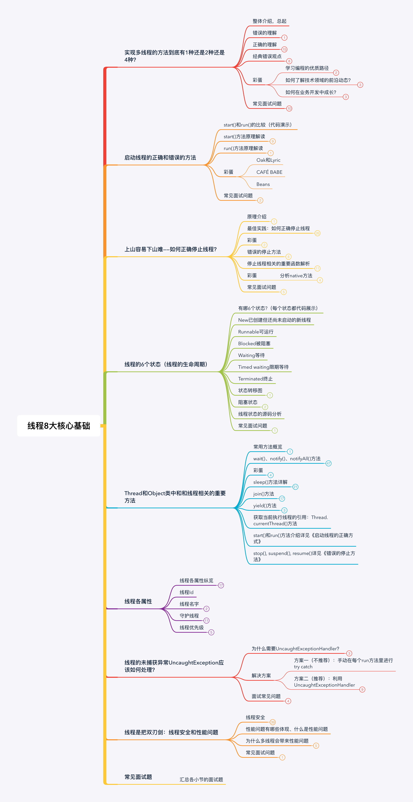

## 1.1、实现多线程的方法到底有1种还是2种还是4种?

### Oracle官网的文档是如何写的?

- 方法一：实现Runnable接口
- 方法二：继承Thread类

```java
package threadcoreknowledge.createthreads;

/**
 * 描述： 用Runnable方式创建线程
 */
public class RunnableStyle implements Runnable{
    public static void main(String[] args) {
        Thread thread = new Thread(new RunnableStyle());
        thread.start();
    }
    public void run() {
        System.out.println("用Runnable方式创建线程");
    }
}
package threadcoreknowledge.createthreads;

/**
 * 描述：  用Thread方式实现线程
 */
public class ThreadStyle extends Thread{
    @Override
    public void run() {
        System.out.println("用Thread方式实现线程");
    }

    public static void main(String[] args) {
        new ThreadStyle().start(); 
    }
}
```

### 两种方法的对比

方法1(实现Runnable接口)更好。

方法2的缺点：

- 从代码的架构来考虑，具体执行的任务（run方法里面的内容）应该是和Thread解耦的，不应该把这两件事情混为一谈；
- 从资源的节约上，继承了 Thread 类，每次我们想新建一个任务只能去新建一个独立的线程，而新建一个独立的线程损耗是十分大的（因为需要去创建，销毁）；
- 继承了Thread 类，由于Java不支持双继承，导致这个类无法去继承其他类了，这大大限制了代码的可扩性。

两种方法的本质对比

- 方法一：最终调用target.run();

```java
    @Override
    public void run() {
        if (target != null) {
            target.run();
        }
    }
```

- 方法二：run()整个都被重写

### 思考题:同时用两种方法会怎么样?

```java
package threadcoreknowledge.createthreads;

/**
 * 描述  同时使用Runnable和Thread两种实现线程的方式
 */
public class BothRunnableThread {
    public static void main(String[] args) {
        new Thread(new Runnable() {  //传入Runnable对象
            @Override
            public void run() {
                System.out.println("我来自Runnable");
            }
        }){
            @Override				//重写run()方法
            public void run() {      	
                System.out.println("我来自Thread");
            }
        }.start();
    }
}
```

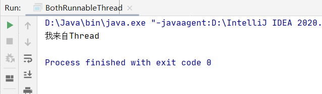

**从面向对象的思想去考虑：**因为我们重写了run()方法，所以导致Thread的三行run()方法代码不再存在，即使传入传入Runnable对象，它也不再执行。

### 总结：最精准的描述

1. 通常我们可以分为两类，Orracle也是这么说的
2. 准确的讲，创建线程只有—种方式那就是构造Thread类，而实现线程的执行单元有两种方式。

- 方法一：实现Runnable接口的run方法，并把Runnable实例传给Thread类；
- 方法二：重写Thread的run方法(继承Thread类)。

### 典型错误观点分析

1、“线程池创建线程也算是一种新建线程的方式”

```java
package threadcoreknowledge.wrongways;

import javafx.concurrent.Task;

import java.util.concurrent.ExecutorService;
import java.util.concurrent.Executors;

public class ThreadPools {
    public static void main(String[] args) {
        ExecutorService executorService = Executors.newCachedThreadPool();
        for (int i = 0; i < 1000; i++) {
            executorService.submit(new Tasks() {
            });
        }
    }
}
class Tasks implements Runnable{

    @Override
    public void run() {
        try {
            Thread.sleep(500);
        } catch (InterruptedException e) {
            e.printStackTrace();
        }
        System.out.println(Thread.currentThread().getName());
    }
}
```


```java
public Thread newThread(Runnable r) {
	Thread t = new Thread(group, r,
						  namePrefix + threadNumber.getAndIncrement(),
						  0);
	if (t.isDaemon())
		t.setDaemon(false);
	if (t.getPriority() != Thread.NORM_PRIORITY)
		t.setPriority(Thread.NORM_PRIORITY);
	return t;
}
```

点进去源码可以看到，线程池本质创建线程的方法是`new Thread`，因此这并不是一种新的创建线程方式 。

2、“通过Callable和FutureTask创建线程，也算是一种新建线程的方式”

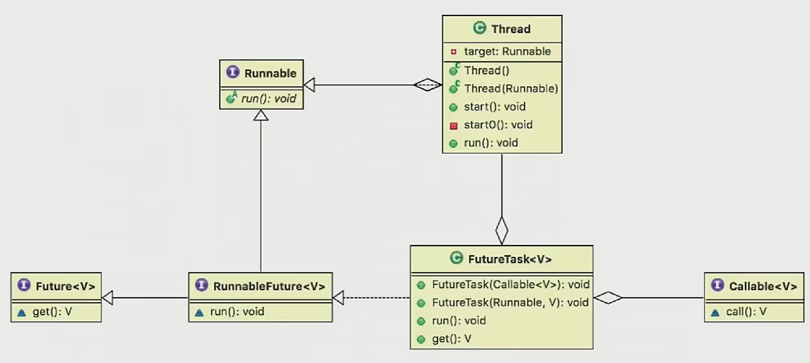本质是实现Runnable接口和继承Thread类实现的。

3、"无返回值是实现runnable接口，有返回值是实现callable接口，所以callable是新的实现线程的方式"

本质依旧是实现Runnable接口和继承Thread类实现的。

4、定时

```java
package threadcoreknowledge.wrongways;

import java.util.Timer;
import java.util.TimerTask;

/**
 * 描述：      定时器创建线程
 */
public class DemoTimerTask {
    public static void main(String[] args) {
        Timer timer = new Timer();
        timer.scheduleAtFixedRate(new TimerTask() {
            @Override
            public void run() {
                System.out.println(Thread.currentThread().getName());
            }
        },1000,1000);
    }
}
```

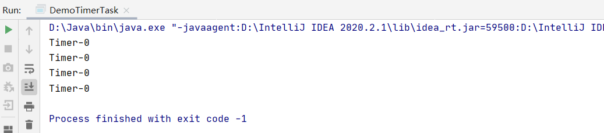

5、匿名内部类

```java
package threadcoreknowledge.wrongways;

public class AnonymousInnerClassDemo {
    public static void main(String[] args) {
        new Thread(){
            @Override
            public void run() {
                System.out.println(Thread.currentThread().getName());
            }
        }.start();
        new Thread(new Runnable() {
            @Override
            public void run() {
                System.out.println(Thread.currentThread().getName());
            }
        }).start();
    }
}
```

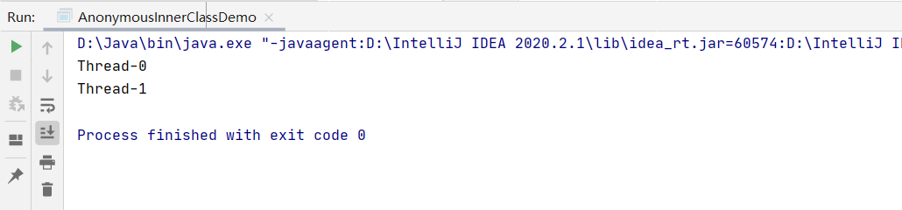

本质一样。

6、Lambda表达式

```java
package threadcoreknowledge.wrongways;

public class Lambda {
    public static void main(String[] args) {
        new Thread(()-> System.out.println(Thread.currentThread().getName())).start();
    }
}
```

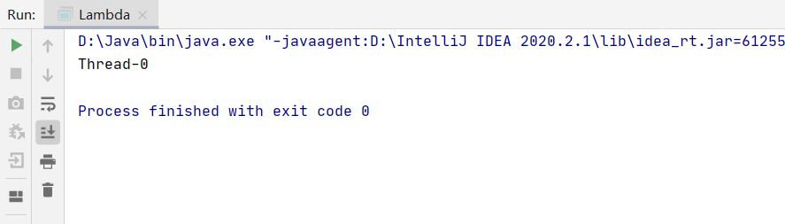

本质一样。

### 典型错误观点总结

多线程的实现方式，在代码中写法千变万化，但其本质万变不离其宗。他们通过各种各样的包装，比如线程池，定时器，包装的外表好像是实现线程池的一种方式，但是我们打开包装透过源码去看到他最终实现的道理的话，本质其实是实现Runnable接口和继承Thread类。

### 实现多线程——常见面试问题

**有多少种实现线程的方法？思路有5点：**

1. 从不同的角度看，会有不同的答案。
2. 典型答案是两种
3. 我们看原理，两种本质都是一样的
4. 具体展开说其他方式

1. 结论

**实现Runnable接口和继承Thread类哪种方式更好?**

1. 从代码架构角度
2. 新建线程的损耗
3. Java不支持双继承

## 1.2、怎样才是正确的线程启动方式?

### start()和run()的比较

```java
package threadcoreknowledge.startthread;

/**
 * 描述：   对比start和run两种启动线程的方式
 */
public class StartAndRunMethod {
    public static void main(String[] args) {
        Runnable runnable = ()->{
            System.out.println(Thread.currentThread().getName());
        };
        runnable.run();

        new Thread(runnable).start();
    }
}
```

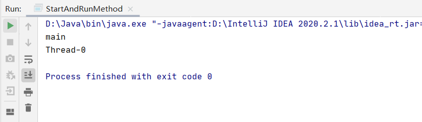

### start()方法原理解读

#### start()方法含义

1、启动新线程：

- 通知jvm，在有空闲的时候启动新线程；
- 调用start()方法的顺序并不能决定线程启动的顺序；
- start()方法其实会让两个线程同时运行，第一个就是我们的主线程，因为我们必须要有一个主线程或者其他的线程来执行start()方法，第二个才是我们刚刚被创建的子线程。new Thread().start()被我们的主线程或者父线程执行之后，之后去创建了我们的子线程。 

2、准备工作：

- 首先让自己处于就绪状态，这个就绪指的是已经获得了除CPU以外的其他资源，比如说已经设置了上下文，栈 ，线程状态，以及程序计数器（PC）。

3、不能重复start()

- 线程一旦开始执行，线程状态就从最开始的new状态进入到后序的那些状态，比如说RUNNABLE。一旦线程执行完毕，就会变成终止状态，而终止状态永远都不会返回回去，所以才会抛出**非法的线程状态异常** 。

```java
package threadcoreknowledge.startthread;
/**
 *  描述：演示不能两次调用start方法，否则会报错
 */
public class CanStartTwice {
    public static void main(String[] args) {
        Thread thread = new Thread();
        thread.start();
        thread.start();
    }
}
```

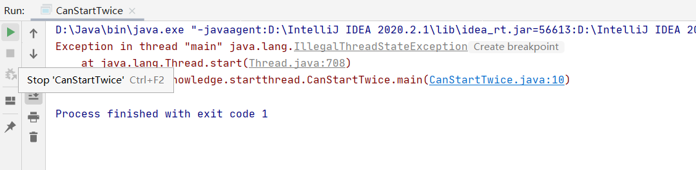

#### start()源码解析

1、启动新线程检查线程状态。

- Java线程状态最开始被初始化为0，表示还没有启动；
- 在start()方法的最开始要首先检查threadStatus是不是我们刚刚初始化还没有启动的状态， 如果不是，说明有问题抛出异常。

2、加入线程组。

3、调用start0()。

```java
public synchronized void start() {  
	if (threadStatus != 0)  //检查threadStatus
		throw new IllegalThreadStateException();
	group.add(this);        //加入线程组
	boolean started = false;
	try {
		start0();           //调用start0()
		started = true;
	} finally {
		try {
			if (!started) {
				group.threadStartFailed(this);
			}
		} catch (Throwable ignore) {

		}
	}
}
```

### run()方法原理解读

源码解析

```java
@Override
public void run() {
	if (target != null) {
		target.run();
	}
}
```

两种情况：

- 重写Thread类的run()方法；
- 传入target对象；

因此如果直接执行Runnable对象的run()方法，相当于执行一个普通方法，并没有起到多线程效果。所以要想真正的启动线程，不能直接调用run()方法，而是调用start()方法来间接的调用run()方法。


### 启动线程——常见面试问题

**1、一个线程两次调用start()方法会出现什么情况?为什么?**

- 会抛出java.lang.IllegalThreadStateException（非法的线程状态异常）。
- 在start()方法的最开始要首先检查线程状态是不是我们刚刚初始化还没有启动的状态， 如果不是，说明有问题抛出异常。
- 并且线程一旦开始执行，线程状态就从最开始的new状态进入到后序的那些状态，比如说RUNNABLE。一旦线程执行完毕，就会变成终止状态，而终止状态永远都不会返回回去，所以才会抛出**非法的线程状态异常** 。

**2、既然start()方法会调用run()方法，为什么我们选择调用start()方法，而不是****直接调用run()****方法呢?**

- 调用start()方法才是真正意义上启动了一个线程，它会去经历线程的各个生命周期。如果我们直接调用run()方法，它就是一个普通的方法而已，也不会用子线程去调用。

## 1.3、如何正确停止线程

### 讲解原理

原理介绍∶ 使用interrupt来通知，而不是强制

- 用一个线程来通知另一个线程让它停止工作；

- 被停止的那个线程它本身对自己的业务逻辑是最熟悉的，而发出停止信号的线程，它对于别人的业务逻辑很可能是不了解的，所以Java语言在设计的时候就把停止的权利交给了被停止的线程本身，这就是停止线程的核心，而不是强制停止。

### 停止线程最佳实践

**1、通常线程会在什么情况下停止，普通情况**

正常创建和启动一个线程

```java
package threadcoreknowledge.stopthreads;

/**
 * 描述：     run方法内没有sleep或wait方法时，停止线程
 */
public class RightWayStopThreadWithoutSleep implements Runnable {

    @Override
    public void run() {
        int num = 0;
        while (num <= Integer.MAX_VALUE / 2) {
            if (num % 10000 == 0) {
                System.out.println(num + "是10000的倍数");
            }
            num++;
        }
        System.out.println("任务运行结束了");
    }

    public static void main(String[] args) throws InterruptedException {
        Thread thread = new Thread(new RightWayStopThreadWithoutSleep());
        thread.start();
    }
}
```

打印结果：

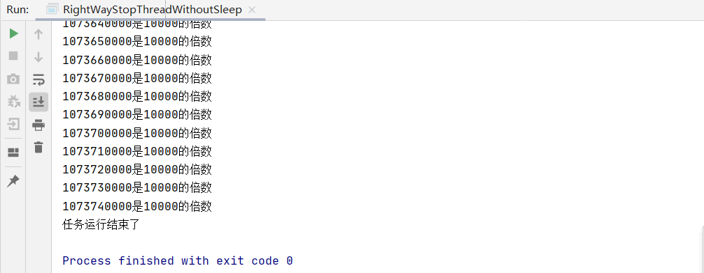

使用interrupt()方法中断

```java
package threadcoreknowledge.stopthreads;

/**
 * 描述：     run方法内没有sleep或wait方法时，停止线程
 */
public class RightWayStopThreadWithoutSleep implements Runnable {

    @Override
    public void run() {
        int num = 0;
        while (num <= Integer.MAX_VALUE / 2) {
            if (num % 10000 == 0) {
                System.out.println(num + "是10000的倍数");
            }
            num++;
        }
        System.out.println("任务运行结束了");
    }

    public static void main(String[] args) throws InterruptedException {
        Thread thread = new Thread(new RightWayStopThreadWithoutSleep());
        thread.start();
        Thread.sleep(1000);
        thread.interrupt();
    }
}
```

打印结果：


可以发现，没有任何效果，我们想把这个线程中断，但它似乎根本就没理会我们。这是因为这个线程想不想停止，取决于它本身，你强加给它一个中断信号，人家也是有权不做理会的。

响应工作的编写：

```java
package threadcoreknowledge.stopthreads;

/**
 * 描述：     run方法内没有sleep或wait方法时，停止线程
 */
public class RightWayStopThreadWithoutSleep implements Runnable {

    @Override
    public void run() {
        int num = 0;
        while (!Thread.currentThread().isInterrupted() && num <= Integer.MAX_VALUE / 2) {
            if (num % 10000 == 0) {
                System.out.println(num + "是10000的倍数");
            }
            num++;
        }
        System.out.println("任务运行结束了");
    }

    public static void main(String[] args) throws InterruptedException {
        Thread thread = new Thread(new RightWayStopThreadWithoutSleep());
        thread.start();
        Thread.sleep(1000);
        thread.interrupt(); 
    }
}
```

打印结果：


对比一下，线程在1s左右被中断了，interrupt()起到了中断效果。

**2、线程可能会被阻塞**

代码思路：开启一个线程执行任务：num从0循环递增+1到300，打印出该过程中是100倍数的数。执行完任务后让该线程睡眠1s，在线程阻塞时发出停止线程请求。

示例：

```java
package threadcoreknowledge.stopthreads;

/**
 * 描述：     带有sleep的中断线程的写法
 */
public class RightWayStopThreadWithSleep {

    public static void main(String[] args) throws InterruptedException {
        Runnable runnable = () -> {
            int num = 0;
            try {
                while (num <= 300 && !Thread.currentThread().isInterrupted()) {
                    if (num % 100 == 0) {
                        System.out.println(num + "是100的倍数");
                    }
                    num++;
                }
                Thread.sleep(1000);
            } catch (InterruptedException e) {
                e.printStackTrace();
            }
        };
        Thread thread = new Thread(runnable);
        thread.start();
        Thread.sleep(500);
        thread.interrupt();
    }
}
```

打印结果：

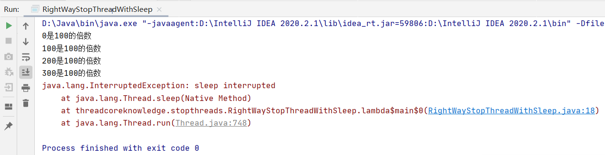

当线程正在休眠的过程中，如果收到了中断信号，它便会响应这个中断，它响应中断的方式特别特殊，就是抛出一个异常，于是我们就打印出了这个异常。可以看到这个异常信息也是十分明确的，sleep interrupted，也就是在sleep过程中被打断了。

**3、如果线程在每次迭代后都阻塞**

代码示例：

```java
package threadcoreknowledge.stopthreads;

/**
 * 描述：     如果在执行过程中，每次循环都会调用sleep或wait等方法，那么不需要每次迭代都检查是否已中断
 */
public class RightWayStopThreadWithSleepEveryLoop {
    public static void main(String[] args) throws InterruptedException {
        Runnable runnable = () -> {
            int num = 0;
            try {
                while (num <= 10000) {
                    if (num % 100 == 0) {
                        System.out.println(num + "是100的倍数");
                    }
                    num++;
                    Thread.sleep(10);
                }
            } catch (InterruptedException e) {
                e.printStackTrace();
            }
        };
        Thread thread = new Thread(runnable);
        thread.start();
        Thread.sleep(5000);
        thread.interrupt();
    }
}
```

打印结果：

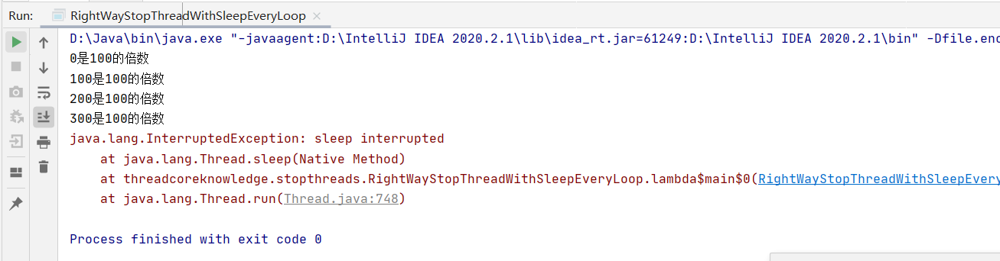

当线程每次迭代都阻塞时，就不再需要`Thread.currentThread().isInterrupted()`判断线程是否被中断了，由于每次循环都会进入到`sleep`过程中，而每次循环过程中又不会特别长，所以其实大部分时间是消耗在`Thread.sleep(10)`里面的，而在休眠的过程中如果接收到`interrupt`，自然会抛出异常，不要在代码中加入`Thread.currentThread().isInterrupted()`判断检查是否已中断。

**4、如果While里面放try / catch，会导致中断失效**

 代码示例：

```java
package threadcoreknowledge.stopthreads;

/**
 * 描述：     如果while里面放try/catch，会导致中断失效
 */
public class CantInterrupt {

    public static void main(String[] args) throws InterruptedException {
        Runnable runnable = () -> {
            int num = 0;
            while (num <= 10000 ) {
                if (num % 100 == 0) {
                    System.out.println(num + "是100的倍数");
                }
                num++;
                try {
                    Thread.sleep(10);
                } catch (InterruptedException e) {
                    e.printStackTrace();
                }
            }
        };
        Thread thread = new Thread(runnable);
        thread.start();
        Thread.sleep(5000);
        thread.interrupt();
    }
}
```

 运行结果：

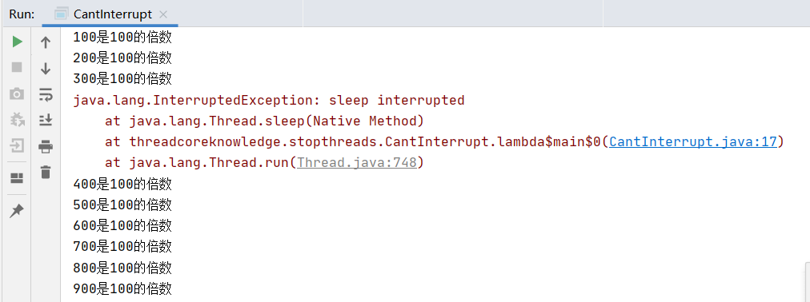

惊奇地发现，运行到第5秒时，明明已经`catch`住了InterruptedException异常，但还在线程并没有就此停止，反而继续打印，这是为什么呢？

因为抛出异常后被`catch`住了，然后因为不满足循环跳出的条件，所以自然继续执行`while`循环。

那是不是加上在`while()`里加上&& !Thread.currentThread().isInterrupted()，在线程中断后，下一次循环开始时判断一下线程是否已被中断即可？

修改代码：

```java
package threadcoreknowledge.stopthreads;

/**
 * 描述：     如果while里面放try/catch，会导致中断失效
 */
public class CantInterrupt {

    public static void main(String[] args) throws InterruptedException {
        Runnable runnable = () -> {
            int num = 0;
            while (num <= 10000 && !Thread.currentThread().isInterrupted()) {
                if (num % 100 == 0) {
                    System.out.println(num + "是100的倍数");
                }
                num++;
                try {
                    Thread.sleep(10);
                } catch (InterruptedException e) {
                    e.printStackTrace();
                }
            }
        };
        Thread thread = new Thread(runnable);
        thread.start();
        Thread.sleep(5000);
        thread.interrupt();
    }
}
```

打印结果：

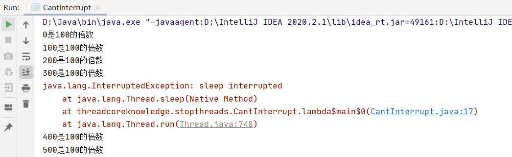

线程依然没有停止！！！


之所以会产生这样原因是因为java在设计sleep()函数的时候，有这样一个理念，当它一旦响应中断，于是便会把interrupt这个标记位给清除，所以在上面代码while后续检查过程中检查不到任何被中断过的迹象，导致程序不能退出。如何解决呢？下面就来解决这个问题。

### 实际开发中两种最佳实践

####  第一个最佳实践

通常在run()方法中不会一次性把所用业务都写在该方法中，我们可能会调用其他的方法。假设被调用的方法在某些代码环节可能需要处理异常，这是通常就是两种方法：一是try/catch，二是在方法签名上抛出这个异常 throws xxxException。下面先来演示一下非常不好的try/catch，说一下为什么不好。

**1、举一个使用try-catch的例子：**思路是：调用一个通过try/catch处理异常的方法，方法内容是睡眠2秒，启动子线程后，主线程睡眠 1秒后发起中断请求，确保子线程是在阻塞状态下响应中断。

代码示例：

```java
package threadcoreknowledge.stopthreads;

/**
 * 描述： 最佳实践：catch了interruptedException之后的优先选择：在方法签名中抛出异常
 * 那么在run()方法就会强制要求try/catch
 * */
public class RightWayStopThreadInProd implements Runnable{
    @Override
    public void run() {
        while(true) {
            System.out.println("go");
            throwInMethod();
        }
    }

    private void throwInMethod() {
        try {
            Thread.sleep(2000);
        } catch (InterruptedException e) {
            e.printStackTrace();
        }
    }

    public static void main(String[] args) throws InterruptedException {
        Thread thread = new Thread(new
                RightWayStopThreadInProd());
        thread.start();
        Thread.sleep(1000);
        thread.interrupt();
    }
}
```

运行结果：

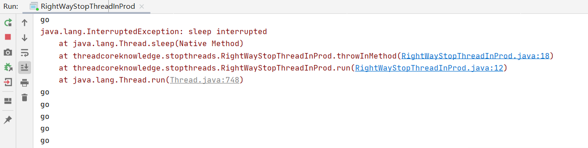

**try/catch为什么不好，不好在那里？**

- 图明显异常已经打印了，但是不好的是，在茫茫控制台信息中是很难注意到这个异常的，由于我们很难注意到它，我们就很难去处理它，所以实际上当有一个线程来打断我们时，我们没有处理好，非但没有处理好，反而把这个信息给忽略掉了，我们看似没有忽略，把内容打印出来，但在我们实践过程中，代码跑在服务器上，我们并不一定能感知到这个问题。

- 假设throwInMethod()方法是其他小伙伴写的，我们只是负责调用的话，那遗憾的事情就发生了，别人想中断我们，但我们没有响应，对于我们来说不但没有响应，还毫不知情，因为我们是负责写run()方法的内容，throwInMethod()方法是其他小伙伴负责的，我们并不了解里面的业务逻辑，所以我们就轻轻松松简简单单地调用它，最后的责任却是在我们这里，因为其他线程想中断我们，我们却没有响应中断。

- 编写throwInMethod()方法的小伙伴的责任绝不是把异常简单的打印出来，自己吞掉，应该上报给我们，把中断的这个信息传给我们。

**2、正确的最佳实践例子：**

```java
package threadcoreknowledge.stopthreads;

import threadcoreknowledge.createthreads.ThreadStyle;

/**
 * 描述：     最佳实践：catch了InterruptedExcetion之后的优先选择：在方法签名中抛出异常 那么在run()就会强制try/catch
 */
public class RightWayStopThreadInProd implements Runnable {

    @Override
    public void run() {
        while (true && !Thread.currentThread().isInterrupted()) {
            System.out.println("go");
            try {
                throwInMethod();
            } catch (InterruptedException e) {
                //保存日志、停止程序
                System.out.println("保存日志");
                e.printStackTrace();
            }
        }
    }

    private void throwInMethod() throws InterruptedException {
            Thread.sleep(2000);
    }

    public static void main(String[] args) throws InterruptedException {
        Thread thread = new Thread(new RightWayStopThreadInProd());
        thread.start();
        Thread.sleep(1000);
        thread.interrupt();
    }
}
```

运行结果:

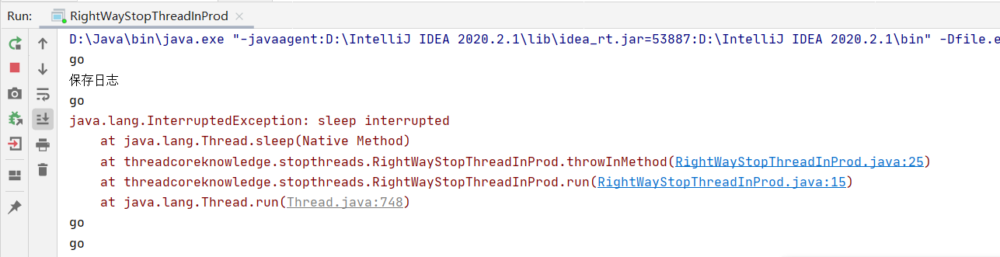

**3、总结，处理中断的最好方法是什么**

**传递中断：**优先选择在方法上抛出异常。

用throws InterruptedException 标记你的方法，不采用try 语句块捕获异常，以便于该异常可以传递到顶层，让run方法可以捕获这一异常，例如：

```java
void subTask() throws InterruptedException
	sleep(delay);
}
```

由于run方法内无法抛出checked Exception（只能用try catch），顶层方法必须处理该异常，避免了漏掉或者被吞掉的情况，增强了代码的健壮性。

#### 第二个最佳实践

- 我们上面说优先处理中断的方法是传递中断，但是在有些情况我们是无法传递的，比如说，我们是作为run()方法的编写者，在run()方法中是不允许抛出异常的，或者有时候我们确实不想在这个方法上抛出异常，我们如果想就是自己处理的话，这边也给出了一种对应的方法，即**不想或无法传递：****恢复****中断。**

- 恢复中断总体而言就是我们在获取`InterruptException`的同时，应该在catch语句中再次调用`Thread.currentThread().interrupt()`，这样就相当于自己把中断重新设置了一遍，这样一来在后续的执行中依然能检测到刚才发生的这个中断，并且有后续的逻辑继续去处理。

代码示例：

```java
package threadcoreknowledge.stopthreads;

/**
 * 描述：最佳实践2：在catch子语句中调用Thread.currentThread().interrupt()来恢复设置中断状态，以便于在后续的执行中，
 * 依然能够检查到刚才发生了中断
 * 回到刚才RightWayStopThreadInProd补上中断，让它跳出
 */
public class RightWayStopThreadInProd2 implements Runnable {

    @Override
    public void run() {
        while (true) {
            if (Thread.currentThread().isInterrupted()) {
                System.out.println("Interrupted，程序运行结束");
                break;
            }
            reInterrupt();
        }
    }

    private void reInterrupt() {
        try {
            Thread.sleep(2000);
        } catch (InterruptedException e) {
            Thread.currentThread().interrupt();
            e.printStackTrace();
        }
    }

    public static void main(String[] args) throws InterruptedException {
        Thread thread = new Thread(new RightWayStopThreadInProd2());
        thread.start();
        Thread.sleep(1000);
        thread.interrupt();
    }
}
```

 运行结果：

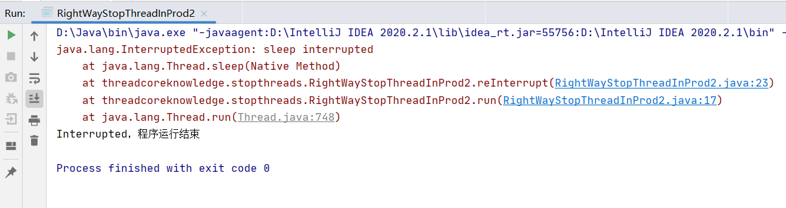

**总结：**

- 如果不想或无法传递InterruptedException（例如用run方法的时候，就不让该方法throws InterruptedException），那么应该选择在catch 子句中调用Thread.currentThread().interrupt() 来恢复设置中断状态，以便于在后续的执行依然能够检查到刚才发生了中断，正常退出。

### 响应中断的方法总结列表

响应中断指的是说，我们在wait或者sleep或者join过程中，如果一个中断信号过来了，它是可以感知到的，这个就叫拥有响应中断的能力。

- Object. wait()/ wait( long)/ wait( long, int)
- Thread.sleep( long)/sleep( long, int)
- Thread. join()/ join( long)/ join( long, int)
- java.util.concurrent. BlockingQueue. take( /put(E)
- java.util.concurrent. locks. Lock. lockInterruptibly0
- java. util. concurrent. CountDownLatch. await()
- java. util. concurrent. CyclicBarrier. await()
- java.util. concurrent. Exchanger. exchange(v)
- java.nio.channels.InterruptibleChannel相关方法
- java.nio.channels.Selector的相关方法

**为什么要用interrupt() 停止线程，究竟有什么好处？**

- 首先被中断的线程它自身拥有如何响应中断的权利，因为有些线程的某些代码是非常重要的，我们必须要等待这些线程处理完之后或者它们准备好之后，再 由它们自己去主动终止，或者它们完全不想理会我们的中断，这也是完全ok的。
- 我们不应该鲁莽的使用stop方法，而是通过使用interrupt() 方法来发出一个信号，让它们自己去处理，这样使我们的线程代码在实际中更加安全，也完成了清理工作 ，数据的完整性也得到了保证。