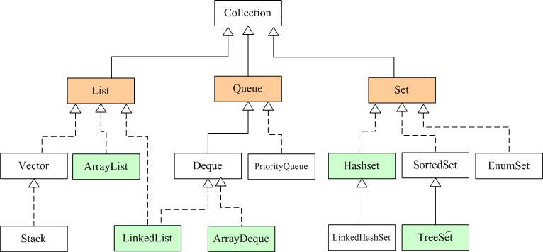
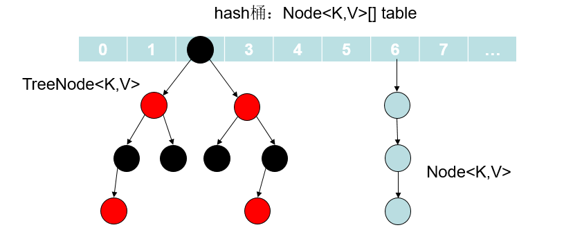
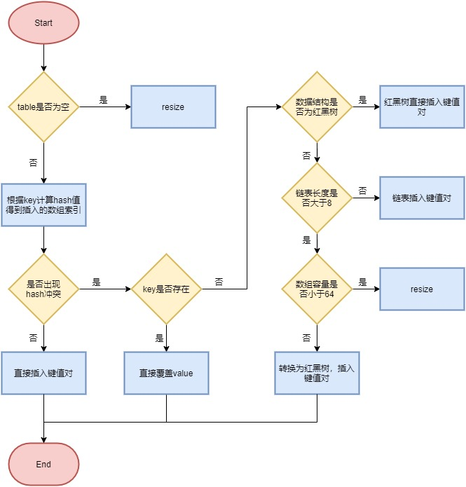
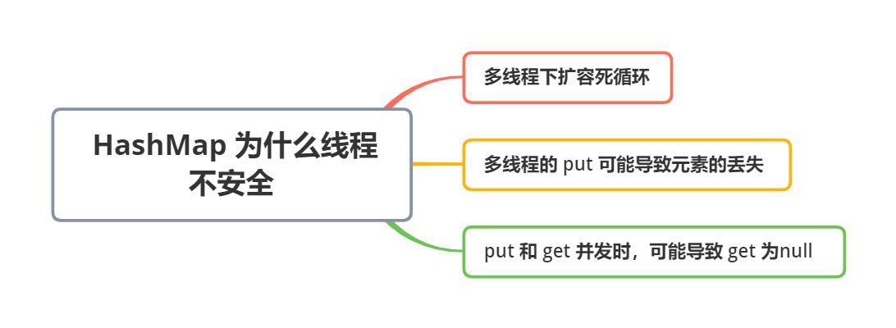
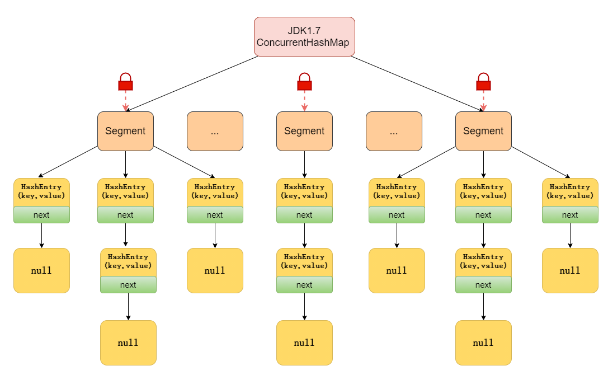
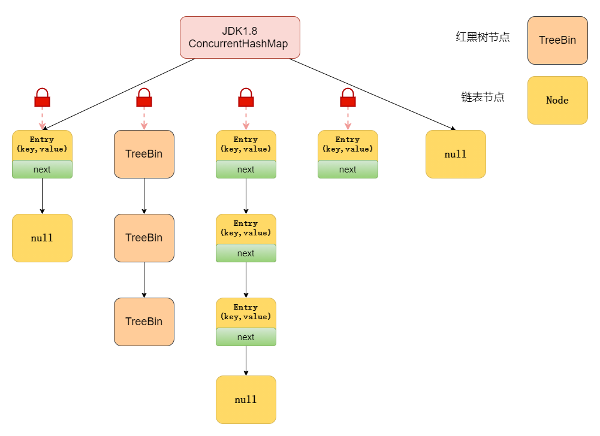
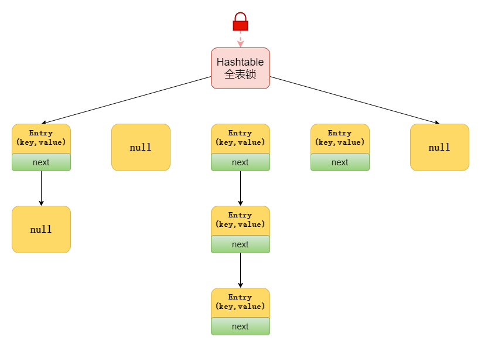
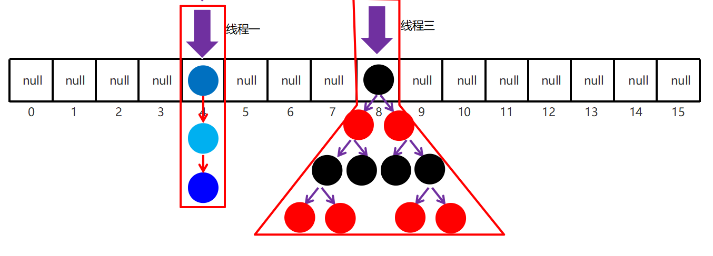
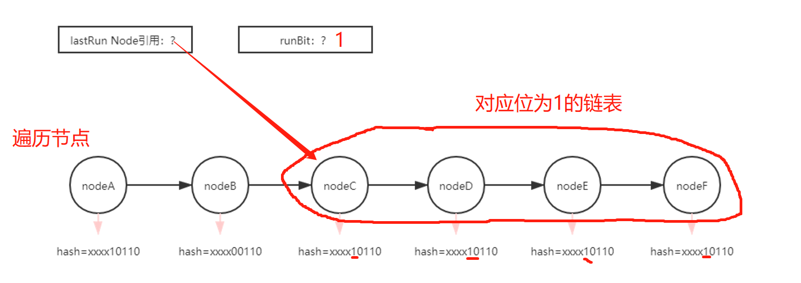
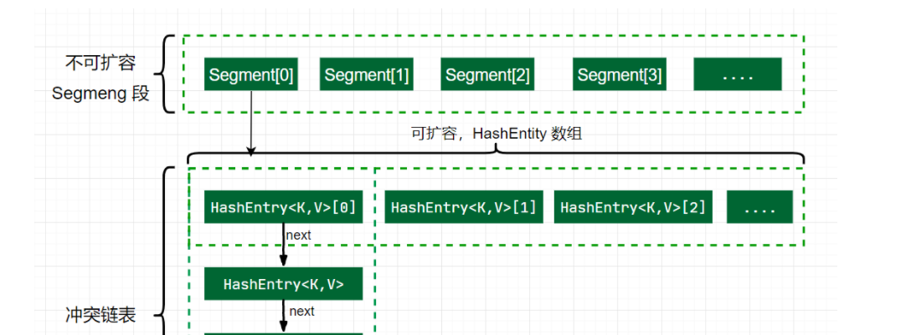

## 集合

## 知识点

### 1、集合概述

集合是一个大小可变的容器，容器中的每个数据称为一个元素

集合特点：类型可以不确定，大小不固定；集合有很多，不同的集合特点和使用场景不同

数组：类型和长度一旦定义出来就都固定

作用：  

* 在开发中，很多时候元素的个数是不确定的
* 而且经常要进行元素的增删该查操作，集合都是非常合适的，开发中集合用的更多

### 2、存储结构

数据结构指的是数据以什么方式组织在一起，不同的数据结构，增删查的性能是不一样的

数据存储的常用结构有：栈、队列、数组、链表和红黑树

* 队列（queue）：先进先出，后进后出。(FIFO first in first out)
  场景：各种排队、叫号系统，有很多集合可以实现队列

* 栈（stack）：后进先出，先进后出 （LIFO）
  压栈 == 入栈、弹栈 == 出栈
  场景：手枪的弹夹 

* 数组：数组是内存中的连续存储区域，分成若干等分的小区域（每个区域大小是一样的）。元素存在索引
  特点：**查询元素快**（根据索引快速计算出元素的地址，然后立即去定位）
              **增删元素慢**（创建新数组，迁移元素）

* 链表：元素不是内存中的连续区域存储，元素是游离存储的，每个元素会记录下个元素的地址
  特点：**查询元素慢，增删元素快**（针对于首尾元素，速度极快，一般是双链表）

* 树：

  * 二叉树：binary tree 永远只有一个根节点，是每个结点不超过2个节点的树（tree） 
    特点：二叉排序树：小的左边，大的右边，但是可能树很高，性能变差
                为了做排序和搜索会进行左旋和右旋实现平衡查找二叉树，让树的高度差不大于1

  * 红黑树（基于红黑规则实现自平衡的排序二叉树）：树保证到了很矮小，但是又排好序，性能最高的树

    特点：**红黑树的增删查改性能都好**

各数据结构时间复杂度对比：


### 3、Collection

#### 3.1、概述

Java 中集合的代表是Collection，Collection 集合是 Java 中集合的祖宗类

Collection 集合底层为数组：`[value1, value2, ....]`

```java
Collection集合的体系:
                      Collection<E>(接口)
                 /                         \
          Set<E>(接口)                    List<E>(接口)
      /               \                  /             \
 HashSet<E>(实现类) TreeSet<>(实现类)  ArrayList<E>(实现类)  LinekdList<>(实现类)
 /
LinkedHashSet<>(实现类)
```

**集合的特点：**

* Set 系列集合：添加的元素是无序，不重复，无索引的
  * HashSet：添加的元素是无序，不重复，无索引的
  * LinkedHashSet：添加的元素是有序，不重复，无索引的
  * TreeSet：不重复，无索引，按照大小默认升序排序
* List 系列集合：添加的元素是有序，可重复，有索引
  * ArrayList：添加的元素是有序，可重复，有索引
  * LinekdList：添加的元素是有序，可重复，有索引

#### 3.2、API

Collection 是集合的祖宗类，它的功能是全部集合都可以继承使用的，所以要学习它。

Collection 子类的构造器都有可以包装其他子类的构造方法，如：

* `public ArrayList(Collection<? extends E> c)`：构造新集合，元素按照由集合的迭代器返回的顺序

* `public HashSet(Collection<? extends E> c)`：构造一个包含指定集合中的元素的新集合

Collection API 如下：

* `public boolean add(E e)`：把给定的对象添加到当前集合中 。
* `public void clear()`：清空集合中所有的元素。
* `public boolean remove(E e)`：把给定的对象在当前集合中删除。
* `public boolean contains(Object obj)`：判断当前集合中是否包含给定的对象。
* `public boolean isEmpty()`：判断当前集合是否为空。
* `public int size()`：返回集合中元素的个数。
* `public Object[] toArray()`：把集合中的元素，存储到数组中
* `public boolean addAll(Collection<? extends E> c)`：将指定集合中的所有元素添加到此集合

```java
public class CollectionDemo {
    public static void main(String[] args) {
        Collection<String> sets = new HashSet<>();
        sets.add("MyBatis");
        System.out.println(sets.add("Java"));//true
        System.out.println(sets.add("Java"));//false
        sets.add("Spring");
        sets.add("MySQL");
        System.out.println(sets)//[]无序的;
        System.out.println(sets.contains("java"));//true 存在
        Object[] arrs = sets.toArray();
        System.out.println("数组："+ Arrays.toString(arrs));
        
        Collection<String> c1 = new ArrayList<>();
        c1.add("java");
        Collection<String> c2 = new ArrayList<>();
        c2.add("ee");
        c1.addAll(c2);// c1:[java,ee]  c2:[ee];
    }
}
```

#### 3.3、遍历

Collection 集合的遍历方式有三种:

集合可以直接输出内容，因为底层重写了 toString() 方法

1. 迭代器
   `public Iterator iterator()`：获取集合对应的迭代器，用来遍历集合中的元素的
   `E next()`：获取下一个元素值
   `boolean hasNext()`：判断是否有下一个元素，有返回true ,反之
   `default void remove()`：从底层集合中删除此迭代器返回的最后一个元素，这种方法只能在每次调用next() 时调用一次

2. 增强 for 循环：可以遍历集合或者数组，遍历集合实际上是迭代器遍历的简化写法

   ```java
   for(被遍历集合或者数组中元素的类型 变量名称 : 被遍历集合或者数组){
   
   }
   ```

   缺点：遍历无法知道遍历到了哪个元素了，因为没有索引

3. JDK 1.8 开始之后的新技术 Lambda 表达式

   ```java
   public class CollectionDemo {
       public static void main(String[] args) {
           Collection<String> lists = new ArrayList<>();
           lists.add("aa");
           lists.add("bb");
           lists.add("cc");
           System.out.println(lists); // lists = [aa, bb, cc]
   		//迭代器流程
           // 1.得到集合的迭代器对象。
           Iterator<String> it = lists.iterator();
           // 2.使用while循环遍历。
           while(it.hasNext()){
               String ele = it.next();
               System.out.println(ele);
           }
           
   		//增强for
           for (String ele : lists) {
               System.out.println(ele);
           }
           //lambda表达式
           lists.forEach(s -> {
               System.out.println(s);
           });
       }
   }
   ```


#### 4、List

##### 4.1、概述

List集合继承了Collection集合全部的功能。

List系列集合有索引，所以多了很多按照索引操作元素的功能：for循环遍历（4种遍历）

List系列集合：添加的元素是有序，可重复，有索引。

* ArrayList：添加的元素是有序，可重复，有索引。

* LinekdList：添加的元素是有序，可重复，有索引。


##### 4.2、ArrayList

###### 介绍

ArrayList 添加的元素，是有序，可重复，有索引的

* `public boolean add(E e)`：将指定的元素追加到此集合的末尾
* `public void add(int index, E element)`：将指定的元素，添加到该集合中的指定位置上
* `public E get(int index)`：返回集合中指定位置的元素
* `public E remove(int index)`：移除列表中指定位置的元素, 返回的是被移除的元素
* `public E set(int index, E element)`：用指定元素替换集合中指定位置的元素,返回更新前的元素值
* `int indexOf(Object o)`：返回列表中指定元素第一次出现的索引，如果不包含此元素，则返回 -1

```java
public static void main(String[] args){
    List<String> lists = new ArrayList<>();//多态
    lists.add("java1");
    lists.add("java1");//可以重复
    lists.add("java2");
    for(int i = 0 ; i < lists.size() ; i++ ) {
            String ele = lists.get(i);
            System.out.println(ele);
   }
}
```

###### 源码

ArrayList 实现类集合底层**基于数组存储数据**的，查询快，增删慢，支持快速随机访问

```java
public class ArrayList<E> extends AbstractList<E>
        implements List<E>, RandomAccess, Cloneable, java.io.Serializable{}
```

- `RandomAccess` 是一个标志接口，表明实现这个这个接口的 List 集合是支持**快速随机访问**的。在 `ArrayList` 中，我们即可以通过元素的序号快速获取元素对象，这就是快速随机访问。
- `ArrayList` 实现了 `Cloneable` 接口 ，即覆盖了函数`clone()`，能被克隆
- `ArrayList` 实现了 `Serializable `接口，这意味着`ArrayList`支持序列化，能通过序列化去传输

核心方法：

* 构造函数：以无参数构造方法创建 ArrayList 时，实际上初始化赋值的是一个空数组。当真正对数组进行添加元素操作时，才真正分配容量，即向数组中添加第一个元素时，**数组容量扩为 10**

* 添加元素：

  ```java
  // e 插入的元素  elementData底层数组   size 插入的位置
  public boolean add(E e) {
      //判断是否可以容纳e，若能，则直接添加在末尾;若不能，则进行扩容，然后再把e添加在末尾
      ensureCapacityInternal(size + 1);	// Increments modCount!!
      elementData[size++] = e;			// 插入size位置，然后加一
      return true;	
  }
  ```

  当 add 第 1 个元素到 ArrayList，size 是 0，进入 ensureCapacityInternal 方法，

  ```java
  private void ensureCapacityInternal(int minCapacity) {
      ensureExplicitCapacity(calculateCapacity(elementData, minCapacity));
  }
  ```

  ```java
  private static int calculateCapacity(Object[] elementData, int minCapacity) {
      // 判断elementData是不是空数组
      if (elementData == DEFAULTCAPACITY_EMPTY_ELEMENTDATA) {
          // 返回默认值和最小需求容量最大的一个
          return Math.max(DEFAULT_CAPACITY, minCapacity);
      }
      return minCapacity;
  }
  ```

  如果需要的容量大于数组长度，进行扩容：

  ```java
  // 判断是否需要扩容
  private void ensureExplicitCapacity(int minCapacity) {
      modCount++;
      // 索引越界
      if (minCapacity - elementData.length > 0)
          // 调用grow方法进行扩容，调用此方法代表已经开始扩容了
          grow(minCapacity);
  }
  ```

  指定索引插入，**在旧数组上操作**：

  ```java
  public void add(int index, E element) {
      rangeCheckForAdd(index);
      ensureCapacityInternal(size + 1);  // Increments modCount!!
      System.arraycopy(elementData, index, elementData, index + 1,
                       size - index);
      elementData[index] = element;
      size++;
  }
  ```

* 扩容：新容量的大小为 `oldCapacity + (oldCapacity >> 1)`，`oldCapacity >> 1` 需要取整，所以新容量大约是旧容量的 1.5 倍左右，即 oldCapacity+oldCapacity/2

  扩容操作需要调用 `Arrays.copyOf()`（底层 `System.arraycopy()`）把原数组整个复制到**新数组**中，这个操作代价很高，因此最好在创建 ArrayList 对象时就指定大概的容量大小，减少扩容操作的次数

  ```java
  private void grow(int minCapacity) {
      int oldCapacity = elementData.length;
      int newCapacity = oldCapacity + (oldCapacity >> 1);
      //检查新容量是否大于最小需要容量，若小于最小需要容量，就把最小需要容量当作数组的新容量
      if (newCapacity - minCapacity < 0)
  		newCapacity = minCapacity;//不需要扩容计算
      //检查新容量是否大于最大数组容量
      if (newCapacity - MAX_ARRAY_SIZE > 0)
          //如果minCapacity大于最大容量，则新容量则为Integer.MAX_VALUE
          //否则，新容量大小则为 MAX_ARRAY_SIZE 即为Integer.MAX_VALUE - 8
          newCapacity = hugeCapacity(minCapacity);
      elementData = Arrays.copyOf(elementData, newCapacity);
  }
  ```

  MAX_ARRAY_SIZE：要分配的数组的最大大小，分配更大的**可能**会导致

  * OutOfMemoryError:Requested array size exceeds VM limit（请求的数组大小超出VM限制）
  * OutOfMemoryError: Java heap space（堆区内存不足，可以通过设置JVM参数 -Xmx 来调节）

* 删除元素：需要调用 System.arraycopy() 将 index+1 后面的元素都复制到 index 位置上，在旧数组上操作，该操作的时间复杂度为 O(N)，可以看到 ArrayList 删除元素的代价是非常高的，

  ```java
  public E remove(int index) {
      rangeCheck(index);
      modCount++;
      E oldValue = elementData(index);
  
      int numMoved = size - index - 1;
      if (numMoved > 0)
          System.arraycopy(elementData, index+1, elementData, index, numMoved);
      elementData[--size] = null; // clear to let GC do its work
  
      return oldValue;
  }
  ```

* 序列化：ArrayList 基于数组并且具有动态扩容特性，因此保存元素的数组不一定都会被使用，就没必要全部进行序列化。保存元素的数组 elementData 使用 transient 修饰，该关键字声明数组默认不会被序列化

  ```java
   transient Object[] elementData;
  ```

* ensureCapacity：增加此实例的容量，以确保它至少可以容纳最小容量参数指定的元素数，减少增量重新分配的次数

  ```java
   public void ensureCapacity(int minCapacity) {
       if (minCapacity > elementData.length
           && !(elementData == DEFAULTCAPACITY_EMPTY_ELEMENTDATA
                && minCapacity <= DEFAULT_CAPACITY)) {
           modCount++;
           grow(minCapacity);
       }
   }
  ```

* **Fail-Fast**：快速失败，modCount 用来记录 ArrayList **结构发生变化**的次数，结构发生变化是指添加或者删除至少一个元素的所有操作，或者是调整内部数组的大小，仅仅只是设置元素的值不算结构发生变化

  在进行序列化或者迭代等操作时，需要比较操作前后 modCount 是否改变，改变了抛出 ConcurrentModificationException 异常

  ```java
  public Iterator<E> iterator() {
      return new Itr();
  }
  ```

  ```java
  private class Itr implements Iterator<E> {
      int cursor;       // index of next element to return
      int lastRet = -1; // index of last element returned; -1 if no such
      int expectedModCount = modCount;
  
      Itr() {}
  
      public boolean hasNext() {
          return cursor != size;
      }
  
     	// 获取下一个元素时首先判断结构是否发生变化
      public E next() {
          checkForComodification();
         	// .....
      }
      // modCount 被其他线程改变抛出并发修改异常
      final void checkForComodification() {
          if (modCount != expectedModCount)
              throw new ConcurrentModificationException();
      }
  	// 允许删除操作
      public void remove() {
          // ...
          checkForComodification();
          // ...
          // 删除后重置 expectedModCount
          expectedModCount = modCount;
      }
  }
  ```


##### 4.3、Vector

同步：Vector的实现与 ArrayList 类似，但是方法上使用了 synchronized 进行同步

构造：默认长度为 10 的数组

扩容：Vector 的构造函数可以传入 capacityIncrement 参数，作用是在扩容时使容量 capacity 增长 capacityIncrement，如果这个参数的值小于等于 0（默认0），**扩容时每次都令 capacity 为原来的两倍** 

**对比 ArrayList** 

1. Vector 是同步的，开销比 ArrayList 要大，访问速度更慢。最好使用 ArrayList 而不是 Vector，因为同步操作完全可以由程序来控制。

2. Vector 每次扩容请求其大小的 2 倍（也可以通过构造函数设置增长的容量），而 ArrayList 是 1.5 倍

3. 底层都是 `Object[]`数组存储

##### 4.4、LinkedList

###### 介绍

LinkedList 也是 List 的实现类：基于**双向链表**实现，使用 Node 存储链表节点信息，增删比较快，查询慢

LinkedList 除了拥有 List 集合的全部功能还多了很多操作首尾元素的特殊功能：

* `public boolean add(E e)`：将指定元素添加到此列表的结尾
* `public E poll()`：检索并删除此列表的头（第一个元素）
* `public void addFirst(E e)`：将指定元素插入此列表的开头
* `public void addLast(E e)`：将指定元素添加到此列表的结尾
* `public E getFirst()`：返回此列表的第一个元素
* `public E getLast()`：返回此列表的最后一个元素
* `public E removeFirst()`：移除并返回此列表的第一个元素
* `public E removeLast()`：移除并返回此列表的最后一个元素
* `public E pop()`：从此列表所表示的堆栈处弹出一个元素
* `public void push(E e)`：将元素推入此列表所表示的堆栈
* `public int indexOf(Object o)`：返回此列表中指定元素的第一次出现的索引，如果不包含返回 -1
* `public int lastIndexOf(Object o)`：从尾遍历找
* ` public boolean remove(Object o)`：一次只删除一个匹配的对象，如果删除了匹配对象返回true
* `public E remove(int index)`：删除指定位置的元素

```java
public class ListDemo {
    public static void main(String[] args) {
        // 1.用LinkedList做一个队列:先进先出，后进后出。
        LinkedList<String> queue = new LinkedList<>();
        // 入队
        queue.addLast("1号");
        queue.addLast("2号");
        queue.addLast("3号");
        System.out.println(queue); // [1号, 2号, 3号]
        // 出队
        System.out.println(queue.removeFirst());//1号
        System.out.println(queue.removeFirst());//2号
        System.out.println(queue);//[3号]

        // 做一个栈 先进后出
        LinkedList<String> stack = new LinkedList<>();
        // 压栈
        stack.push("第1颗子弹");//addFirst(e);
        stack.push("第2颗子弹");
        stack.push("第3颗子弹");
        System.out.println(stack); // [ 第3颗子弹, 第2颗子弹, 第1颗子弹]
        // 弹栈
        System.out.println(stack.pop());//removeFirst(); 第3颗子弹
        System.out.println(stack.pop());
        System.out.println(stack);// [第1颗子弹]
    }
}
```

###### 源码

LinkedList 是一个实现了 List 接口的**双端链表**，支持高效的插入和删除操作，另外也实现了 Deque 接口，使得 LinkedList 类也具有队列的特性

核心方法：

* 使 LinkedList 变成线程安全的，可以调用静态类 Collections 类中的 synchronizedList 方法：

  ```java
  List list = Collections.synchronizedList(new LinkedList(...));
  ```

* 私有内部类 Node：这个类代表双端链表的节点 Node

  ```java
  private static class Node<E> {
      E item;
      Node<E> next;
      Node<E> prev;
  
      Node(Node<E> prev, E element, Node<E> next) {
          this.item = element;
          this.next = next;
          this.prev = prev;
      }
  }
  ```

* 构造方法：只有无参构造和用已有的集合创建链表的构造方法

* 添加元素：默认加到尾部

  ```java
  public boolean add(E e) {
      linkLast(e);
      return true;
  }
  ```

* 获取元素：`get(int index)` 根据指定索引返回数据

  * 获取头节点 (index=0)：getFirst()、element()、peek()、peekFirst() 这四个获取头结点方法的区别在于对链表为空时的处理，是抛出异常还是返回null，其中**getFirst() 和element()** 方法将会在链表为空时，抛出异常
  * 获取尾节点 (index=-1)：getLast() 方法在链表为空时，会抛出NoSuchElementException，而peekLast() 则不会，只会返回 null

* 删除元素：

  * remove()、removeFirst()、pop()：删除头节点
  * removeLast()、pollLast()：删除尾节点，removeLast()在链表为空时抛出NoSuchElementException，而pollLast()方法返回null

**对比 ArrayList** 

1. 是否保证线程安全：ArrayList 和 LinkedList 都是不同步的，也就是不保证线程安全
2. 底层数据结构： 
   * Arraylist 底层使用的是 `Object` 数组
   * LinkedList 底层使用的是双向链表数据结构（JDK1.6 之前为循环链表，JDK1.7 取消了循环）
3. 插入和删除是否受元素位置的影响：
   * ArrayList 采用数组存储，所以插入和删除元素受元素位置的影响
   * LinkedList采 用链表存储，所以对于`add(E e)`方法的插入，删除元素不受元素位置的影响
4. 是否支持快速随机访问：
   * LinkedList 不支持高效的随机元素访问，ArrayList 支持
   * 快速随机访问就是通过元素的序号快速获取元素对象(对应于`get(int index)`方法)。
5. 内存空间占用：
   * ArrayList 的空间浪费主要体现在在 list 列表的结尾会预留一定的容量空间
   * LinkedList 的空间花费则体现在它的每一个元素都需要消耗比 ArrayList更多的空间（因为要存放直接后继和直接前驱以及数据）

#### 5、Set

##### 5.1、概述

Set 系列集合：添加的元素是无序，不重复，无索引的

* HashSet：添加的元素是无序，不重复，无索引的
* LinkedHashSet：添加的元素是有序，不重复，无索引的
* TreeSet：不重复，无索引，按照大小默认升序排序

**注意**：没有索引，不能使用普通 for 循环遍历

##### 5.2、HashSet

哈希值：

- 哈希值：JDK 根据对象的地址或者字符串或者数字计算出来的数值

- 获取哈希值：Object 类中的 public int hashCode()

- 哈希值的特点

  - 同一个对象多次调用 hashCode() 方法返回的哈希值是相同的
  - 默认情况下，不同对象的哈希值是不同的。而重写 hashCode() 方法，可以实现让不同对象的哈希值相同

**HashSet 底层就是基于 HashMap 实现，值是  PRESENT = new Object()**

Set集合添加的元素是无序，不重复的：

* 是如何去重复的？

  ```java
  1.对于有值特性的，Set集合可以直接判断进行去重复。
  2.对于引用数据类型的类对象，Set集合是按照如下流程进行是否重复的判断。
      Set集合会让两两对象，先调用自己的hashCode()方法得到彼此的哈希值（所谓的内存地址）
      然后比较两个对象的哈希值是否相同，如果不相同则直接认为两个对象不重复。
      如果哈希值相同，会继续让两个对象进行equals比较内容是否相同，如果相同认为真的重复了
      如果不相同认为不重复。
  
              Set集合会先让对象调用hashCode()方法获取两个对象的哈希值比较
                 /                     \
              false                    true
              /                          \
          不重复                        继续让两个对象进行equals比较
                                         /          \
                                       false        true
                                        /             \
                                      不重复          重复了
  ```

* Set系列集合元素无序的根本原因

  Set系列集合添加元素无序的根本原因是因为**底层采用了哈希表存储元素**。

  - JDK 1.8 之前：哈希表 = 数组（初始容量16) + 链表  + （哈希算法）
  - JDK 1.8 之后：哈希表 = 数组（初始容量16) + 链表 + 红黑树  + （哈希算法
    - 当链表长度超过阈值8且当前数组的长度 > 64时，将链表转换为红黑树，减少了查找时间
    - 当链表长度超过阈值8且当前数组的长度 < 64时，扩容

  

  每个元素的 hashcode() 的值进行响应的算法运算，计算出的值相同的存入一个数组块中，以链表的形式存储，如果链表长度超过8就采取红黑树存储，所以输出的元素是无序的。

* 如何设置只要对象内容一样，就希望集合认为它们重复了：**重写 hashCode 和 equals 方法**

##### 5.3、Linked

LinkedHashSet 为什么是有序的？

LinkedHashSet 底层依然是使用哈希表存储元素的，但是每个元素都额外带一个链来维护添加顺序，不光增删查快，还有顺序，缺点是多了一个存储顺序的链会**占内存空间**，而且不允许重复，无索引

##### 5.4、TreeSet

TreeSet 集合自排序的方式：

1. 有值特性的元素直接可以升序排序（浮点型，整型）
2. 字符串类型的元素会按照首字符的编号排序
3. 对于自定义的引用数据类型，TreeSet 默认无法排序，执行的时候报错，因为不知道排序规则

自定义的引用数据类型，TreeSet 默认无法排序，需要定制排序的规则，方案有 2 种：

   * 直接为**对象的类**实现比较器规则接口 Comparable，重写比较方法：

     方法：`public int compareTo(Employee o): this 是比较者, o 是被比较者`

      * 比较者大于被比较者，返回正数（升序）
      * 比较者小于被比较者，返回负数
      * 比较者等于被比较者，返回 0

   * 直接为**集合**设置比较器 Comparator 对象，重写比较方法：

     方法：`public int compare(Employee o1, Employee o2): o1 比较者, o2 被比较者`

     * 比较者大于被比较者，返回正数
     * 比较者小于被比较者，返回负数
     * 比较者等于被比较者，返回 0

注意：如果类和集合都带有比较规则，优先使用集合自带的比较规则

```java
public class TreeSetDemo{
    public static void main(String[] args){
        Set<Student> students = new TreeSet<>();
		Collections.add(students,s1,s2,s3);
        System.out.println(students);//按照年龄比较 升序
        
        Set<Student> s = new TreeSet<>(new Comparator<Student>(){
            @Override
            public int compare(Student o1, Student o2) {
                // o1比较者   o2被比较者
                return o2.getAge() - o1.getAge();//降序
            }
        });
    }
}

public class Student implements Comparable<Student>{
    private String name;
    private int age;
    // 重写了比较方法。
    // e1.compareTo(o)
    // 比较者：this
    // 被比较者：o
    // 需求：按照年龄比较 升序，年龄相同按照姓名
    @Override
    public int compareTo(Student o) {
        int result = this.age - o.age;
        return result == 0 ? this.getName().compareTo(o.getName):result;
    }
}
```

比较器原理：底层是以第一个元素为基准，加一个新元素，就会和第一个元素比，如果大于，就继续和大于的元素进行比较，直到遇到比新元素大的元素为止，放在该位置的左边。（树）

#### 6、Queue

Queue：队列，先进先出的特性

PriorityQueue 是优先级队列，底层存储结构为 Object[]，默认实现为小顶堆，每次出队最小的元素

构造方法：

* `public PriorityQueue()`：构造默认长度为 11 的队列（数组）

* `public PriorityQueue(Comparator<? super E> comparator)`：利用比较器自定义堆排序的规则

  ```java
  Queue<Integer> pq = new PriorityQueue<>((v1, v2) -> v2 - v1);//实现大顶堆
  ```

常用 API：

* `public boolean offer(E e)`：将指定的元素插入到此优先级队列中**尾部**
* `public E poll() `：检索并删除此队列的**头元素**，如果此队列为空，则返回 null 
* `public E peek()`：检索但不删除此队列的头，如果此队列为空，则返回 null
* `public boolean remove(Object o)`：从该队列中删除指定元素（如果存在），删除元素 e 使用 o.equals(e) 比较，如果队列包含多个这样的元素，删除第一个

#### 7、Collections

java.utils.Collections：集合**工具类**，Collections 并不属于集合，是用来操作集合的工具类

Collections 有几个常用的API：

* `public static <T> boolean addAll(Collection<? super T> c, T... e)`：给集合对象批量添加元素
* `public static void shuffle(List<?> list)`：打乱集合顺序
* `public static <T> void sort(List<T> list)`：将集合中元素按照默认规则排序
* `public static <T> void sort(List<T> list,Comparator<? super T> )`：集合中元素按照指定规则排序
* `public static <T> List<T> synchronizedList(List<T> list)`：返回由指定 list 支持的线程安全 list
* `public static <T> Set<T> singleton(T o)`：返回一个只包含指定对象的不可变组

```java
public class CollectionsDemo {
    public static void main(String[] args) {
        Collection<String> names = new ArrayList<>();
        Collections.addAll(names,"张","王","李","赵");
        
        List<Double> scores = new ArrayList<>();
        Collections.addAll(scores, 98.5, 66.5 , 59.5 , 66.5 , 99.5 );
        Collections.shuffle(scores);
        Collections.sort(scores); // 默认升序排序！
        System.out.println(scores);
        
        List<Student> students = new ArrayList<>();
        Collections.addAll(students,s1,s2,s3,s4);
        Collections.sort(students,new Comparator<Student>(){
            
        })
    }
}

public class Student{
    private String name;
    private int age;
}
```

### 4、Map

#### 4.1、概述

Collection 是单值集合体系，Map集合是一种双列集合，每个元素包含两个值。

Map集合的每个元素的格式：key=value（键值对元素），Map集合也被称为键值对集合

Map集合的完整格式：`{key1=value1, key2=value2, key3=value3, ...}`

```
Map集合的体系：
        Map<K , V>(接口,Map集合的祖宗类)
       /                      \
      TreeMap<K , V>           HashMap<K , V>(实现类,经典的，用的最多)
                                 \
                                  LinkedHashMap<K, V>(实现类)
```

Map集合的特点：

1. Map 集合的特点都是由键决定的
2. Map 集合的键是无序，不重复的，无索引的（Set）
3. Map 集合的值无要求（List）
4. Map 集合的键值对都可以为 null
5. Map 集合后面重复的键对应元素会覆盖前面的元素

HashMap：元素按照键是无序，不重复，无索引，值不做要求

LinkedHashMap：元素按照键是有序，不重复，无索引，值不做要求

```java
//经典代码
Map<String , Integer> maps = new HashMap<>();
maps.put("手机",1);
System.out.println(maps);
```

#### 4.2、常用API

Map 集合的常用 API

* `public V put(K key, V value)`：把指定的键与值添加到 Map 集合中，**重复的键会覆盖前面的值元素**
* `public V remove(Object key)`：把指定的键对应的键值对元素在集合中删除，返回被删除元素的值
* `public V get(Object key)`：根据指定的键，在 Map 集合中获取对应的值
* `public Set<K> keySet()`：获取 Map 集合中所有的键，存储到 **Set 集合**中
* `public Collection<V> values()`：获取全部值的集合，存储到 **Collection 集合**
* `public Set<Map.Entry<K,V>> entrySet()`：获取Map集合中所有的键值对对象的集合
* `public boolean containsKey(Object key)`：判断该集合中是否有此键

```java
public class MapDemo {
    public static void main(String[] args) {
        Map<String , Integer> maps = new HashMap<>();
        maps.put(.....);
        System.out.println(maps.isEmpty());//false
        Integer value = maps.get("....");//返回键值对象
        Set<String> keys = maps.keySet();//获取Map集合中所有的键，
        //Map集合的键是无序不重复的，所以返回的是一个Set集合
        Collection<Integer> values = maps.values();
        //Map集合的值是不做要求的，可能重复，所以值要用Collection集合接收!
    }
}
```

#### 4.3、遍历方式

Map集合的遍历方式有：3种。

1. “键找值”的方式遍历：先获取 Map 集合全部的键，再根据遍历键找值。
2. “键值对”的方式遍历：难度较大，采用增强 for 或者迭代器
3. JDK 1.8 开始之后的新技术：foreach，采用 Lambda表 达式

集合可以直接输出内容，因为底层重写了 toString() 方法

```java
public static void main(String[] args){
    Map<String , Integer> maps = new HashMap<>();
	//(1)键找值
    Set<String> keys = maps.keySet();
    for(String key : keys) {
        System.out.println(key + "=" + maps.get(key));
    }
    //Iterator<String> iterator = hm.keySet().iterator();
    
    //(2)键值对
    //(2.1)普通方式
    Set<Map.Entry<String,Integer>> entries = maps.entrySet();
    for (Map.Entry<String, Integer> entry : entries) {
             System.out.println(entry.getKey() + "=>" + entry.getValue());
    }
    //(2.2)迭代器方式
    Iterator<Map.Entry<String, Integer>> iterator = maps.entrySet().iterator();
    while (iterator.hasNext()) {
        Map.Entry<String, Integer> entry = iterator.next();
        System.out.println(entry.getKey() + "=" + entry.getValue());

    }
    //(3) Lamda
    maps.forEach((k,v) -> {
        System.out.println(k + "==>" + v);
    })
}
```

#### 4.4、HashMap

##### 4.4.1、基本介绍

HashMap 基于哈希表的 Map 接口实现，是以 key-value 存储形式存在，主要用来存放键值对

特点：

* HashMap 的实现不是同步的，这意味着它不是线程安全的
* key 是唯一不重复的，底层的哈希表结构，依赖 hashCode 方法和 equals 方法保证键的唯一
* key、value 都可以为null，但是 key 位置只能有一个null
* HashMap 中的映射不是有序的，即存取是无序的
* **key 要存储的是自定义对象，需要重写 hashCode 和 equals 方法，防止出现地址不同内容相同的 key**

JDK7 对比 JDK8：

* 7 = 数组 + 链表，8 = 数组 + 链表 + 红黑树
* 7 中是头插法，多线程容易造成环，8 中是尾插法
* 7 的扩容是全部数据重新定位，8 中是位置不变或者当前位置 + 旧 size 大小来实现
* 7 是先判断是否要扩容再插入，8 中是先插入再看是否要扩容

底层数据结构：

* 哈希表（Hash table，也叫散列表），根据关键码值而直接访问的数据结构。通过把关键码值映射到表中一个位置来访问记录，以加快查找的速度，这个映射函数叫做散列函数，存放记录的数组叫做散列表

* JDK1.8 之前 HashMap 由 数组+链表 组成

  * 数组是 HashMap 的主体
  * 链表则是为了解决哈希冲突而存在的（**拉链法解决冲突**），拉链法就是头插法，两个对象调用的 hashCode 方法计算的哈希码值（键的哈希）一致导致计算的数组索引值相同

* JDK1.8 以后 HashMap 由 **数组+链表 +红黑树**数据结构组成

  * 解决哈希冲突时有了较大的变化
  * 当链表长度**超过（大于）阈值**（或者红黑树的边界值，默认为 8）并且当前数组的**长度大于等于 64 时**，此索引位置上的所有数据改为红黑树存储
  * 即使哈希函数取得再好，也很难达到元素百分百均匀分布。当 HashMap 中有大量的元素都存放到同一个桶中时，就相当于一个长的单链表，假如单链表有 n 个元素，遍历的**时间复杂度是 O(n)**，所以 JDK1.8 中引入了 红黑树（查找**时间复杂度为 O(logn)**）来优化这个问题，使得查找效率更高

  


参考视频：https://www.bilibili.com/video/BV1nJ411J7AA

##### 4.4.2、继承关系

HashMap继承关系如下图所示：


说明：

* Cloneable 空接口，表示可以克隆， 创建并返回HashMap对象的一个副本。
* Serializable 序列化接口，属于标记性接口，HashMap对象可以被序列化和反序列化。
* AbstractMap 父类提供了Map实现接口，以最大限度地减少实现此接口所需的工作

##### 4.4.3、成员属性

1. 序列化版本号

   ```java
   private static final long serialVersionUID = 362498820763181265L;
   ```

2. 集合的初始化容量（**必须是二的 n 次幂** ）

   ```java
   // 默认的初始容量是16 -- 1<<4相当于1*2的4次方---1*16
   static final int DEFAULT_INITIAL_CAPACITY = 1 << 4;   
   ```

   HashMap 构造方法指定集合的初始化容量大小：

   ```java
   HashMap(int initialCapacity)// 构造一个带指定初始容量和默认加载因子 (0.75) 的空 HashMap
   ```

   * 为什么必须是 2 的 n 次幂？

     HashMap 中添加元素时，需要根据 key 的 hash 值，确定在数组中的具体位置。为了存取高效，要尽量较少碰撞，把数据尽可能分配均匀，每个链表长度大致相同，实现该方法的算法就是取模，hash%length，计算机中直接求余效率不如位移运算，所以源码中使用 hash&(length-1)，实际上**hash % length == hash & (length-1)的前提是 length 是 2 的n次幂**

     散列平均分布：2 的 n 次方是 1 后面 n 个 0，2 的 n 次方 -1 是 n 个 1，可以**保证散列的均匀性**，减少碰撞

     ```java
     例如长度为8时候，3&(8-1)=3  2&(8-1)=2 ，不同位置上，不碰撞；
     例如长度为9时候，3&(9-1)=0  2&(9-1)=0 ，都在0上，碰撞了；
     ```

   * 如果输入值不是 2 的幂会怎么样？

     创建 HashMap 对象时，HashMap 通过位移运算和或运算得到的肯定是 2 的幂次数，并且是大于那个数的最近的数字，底层采用 tableSizeFor() 方法

3. 默认的负载因子，默认值是 0.75 

   ```java
   static final float DEFAULT_LOAD_FACTOR = 0.75f;
   ```

4. 集合最大容量 

   ```java
   // 集合最大容量的上限是：2的30次幂
   static final int MAXIMUM_CAPACITY = 1 << 30;// 0100 0000 0000 0000 0000 0000 0000 0000 = 2 ^ 30
   ```

   最大容量为什么是 2 的 30 次方原因：

   * int 类型是 32 位整型，占 4 个字节
   * Java 的原始类型里没有无符号类型，所以首位是符号位正数为 0，负数为 1，

5. 当链表的值超过 8 则会转红黑树（JDK1.8 新增）

   ```java
   // 当桶(bucket)上的结点数大于这个值时会转成红黑树
   static final int TREEIFY_THRESHOLD = 8;
   ```

   为什么 Map 桶中节点个数大于 8 才转为红黑树？

   * 在 HashMap 中有一段注释说明：**空间和时间的权衡**

     ```java
     TreeNodes占用空间大约是普通节点的两倍，所以我们只在箱子包含足够的节点时才使用树节点。当节点变少(由于删除或调整大小)时，就会被转换回普通的桶。在使用分布良好的用户hashcode时，很少使用树箱。理想情况下，在随机哈希码下，箱子中节点的频率服从"泊松分布"，默认调整阈值为0.75，平均参数约为0.5，尽管由于调整粒度的差异很大。忽略方差，列表大小k的预期出现次数是(exp(-0.5)*pow(0.5, k)/factorial(k))
     0:    0.60653066
     1:    0.30326533
     2:    0.07581633
     3:    0.01263606
     4:    0.00157952
     5:    0.00015795
     6:    0.00001316
     7:    0.00000094
     8:    0.00000006
     more: less than 1 in ten million
     当hashCode离散性很好的时候，树型bin用到的概率非常小，因为数据均匀分布在每个bin中，几乎不会有bin中链表长度会达到阈值。但是在随机hashCode下，离散性可能会变差，然而JDK又不能阻止用户实现这种不好的hash算法，因此就可能导致不均匀的数据分布。不过理想情况下随机hashCode算法下所有bin中节点的分布频率会遵循泊松分布，我们可以看到，一个bin中链表长度达到8个元素的概率为0.00000006，几乎是不可能事件。所以，之所以选择8，是根据概率统计决定的。由此可见，发展30年的Java每一项改动和优化都是非常严谨和科学的。
     ```

   * 其他说法
     红黑树的平均查找长度是 log(n)，如果长度为 8，平均查找长度为 log(8)=3，链表的平均查找长度为 n/2，当长度为 8 时，平均查找长度为 8/2=4，这才有转换成树的必要；链表长度如果是小于等于 6，6/2=3，而 log(6)=2.6，虽然速度也很快的，但转化为树结构和生成树的时间并不短

6. 当链表的值**小于** 6 则会从红黑树转回链表

   ```java
   // 当桶(bucket)上的结点数小于这个值时树转链表
   static final int UNTREEIFY_THRESHOLD = 6;
   ```

7. 当Hash Map 数组长度**大于等于**这个64时，表中的桶才能进行树形化 ，否则桶内元素超过 8 时会扩容，而不是树形化。为了避免进行扩容、树形化选择的冲突，这个值不能小于 4 * TREEIFY_THRESHOLD (8)

   ```java
   // 桶中结构转化为红黑树对应的数组长度最小的值 
   static final int MIN_TREEIFY_CAPACITY = 64;
   ```

   原因：数组比较小的情况下变为红黑树结构，反而会降低效率，红黑树需要进行左旋，右旋，变色这些操作来保持平衡。同时数组长度小于 64 时，搜索时间相对快些，所以为了提高性能和减少搜索时间，底层在阈值大于 8 并且数组长度大于 64 时，链表才转换为红黑树，效率也变的更高效

8. table 用来初始化（必须是二的 n 次幂）

   ```java
   // 存储元素的数组 
   transient Node<K,V>[] table;
   ```

   jdk8 之前数组类型是 Entry<K,V>类型，之后是 Node<K,V> 类型。只是换了个名字，都实现了一样的接口 Map.Entry<K,V>，负责存储键值对数据的

 9. HashMap 中**存放元素的个数**（**重点**）

    ```java
    // 存放元素的个数，HashMap中K-V的实时数量，不是table数组的长度
    transient int size;
    ```

10. 记录 HashMap 的修改次数 

    ```java
    // 每次扩容和更改map结构的计数器
     transient int modCount;  
    ```

11. 调整大小下一个容量的值计算方式为（容量 * 负载因子）

     ```java
    // 临界值，当实际大小(容量*负载因子)超过临界值时，会进行扩容
    int threshold;
     ```

12. **哈希表的加载因子（重点）**

    ```java
     final float loadFactor;
    ```

    * 加载因子的概述

      loadFactor 加载因子，是用来衡量 HashMap 满的程度，表示 **HashMap 的疏密程度**，影响 hash 操作到同一个数组位置的概率，计算 HashMap 的实时加载因子的方法为：size/capacity，而不是占用桶的数量去除以 capacity，capacity 是桶的数量，也就是 table 的长度 length。

      当 HashMap 里面容纳的元素已经达到 HashMap 数组长度的 75% 时，表示 HashMap 拥挤，需要扩容，而扩容这个过程涉及到  rehash、复制数据等操作，非常消耗性能，所以开发中尽量减少扩容的次数，可以通过创建 HashMap 集合对象时指定初始容量来尽量避免。

      ```java
      HashMap(int initialCapacity, float loadFactor)//构造指定初始容量和加载因子的空HashMap
      ```

    * 为什么加载因子设置为 0.75，初始化临界值是 12？

      loadFactor 太大导致查找元素效率低，存放的数据拥挤，太小导致数组的利用率低，存放的数据会很分散。loadFactor 的默认值为 **0.75f 是官方给出的一个比较好的临界值**

    * threshold 计算公式：capacity(数组长度默认16) * loadFactor(负载因子默认 0.75)。这个值是当前已占用数组长度的最大值。**当 size>=threshold** 的时候，那么就要考虑对数组的 resize(扩容)，这就是衡量数组是否需要扩增的一个标准， 扩容后的 HashMap 容量是之前容量的**两倍**.

##### 4.4.4、构造方法

* 构造一个空的 HashMap ，**默认初始容量（16）和默认负载因子（0.75）**

  ```java
  public HashMap() {
  	this.loadFactor = DEFAULT_LOAD_FACTOR; 
  	// 将默认的加载因子0.75赋值给loadFactor，并没有创建数组
  }
  ```

* 构造一个具有指定的初始容量和默认负载因子（0.75）HashMap

  ```java
  // 指定“容量大小”的构造函数
  public HashMap(int initialCapacity) {
      this(initialCapacity, DEFAULT_LOAD_FACTOR);
  }
  ```

* 构造一个具有指定的初始容量和负载因子的 HashMap

  ```java
  public HashMap(int initialCapacity, float loadFactor) {
      // 进行判断
      // 将指定的加载因子赋值给HashMap成员变量的负载因子loadFactor
      this.loadFactor = loadFactor;
    	// 最后调用了tableSizeFor
      this.threshold = tableSizeFor(initialCapacity);
  }
  ```

  * 对于 `this.threshold = tableSizeFor(initialCapacity)` 

    JDK8 以后的构造方法中，并没有对 table 这个成员变量进行初始化，table 的初始化被推迟到了 put 方法中，在 put 方法中会对 threshold 重新计算

* 包含另一个 `Map` 的构造函数 

  ```java
  // 构造一个映射关系与指定 Map 相同的新 HashMap
  public HashMap(Map<? extends K, ? extends V> m) {
      // 负载因子loadFactor变为默认的负载因子0.75
      this.loadFactor = DEFAULT_LOAD_FACTOR;
      putMapEntries(m, false);
  }
  ```

  putMapEntries 源码分析：

  ```java
  final void putMapEntries(Map<? extends K, ? extends V> m, boolean evict) {
      //获取参数集合的长度
      int s = m.size();
      if (s > 0) {
          //判断参数集合的长度是否大于0
          if (table == null) {  // 判断table是否已经初始化
              // pre-size
              // 未初始化，s为m的实际元素个数
              float ft = ((float)s / loadFactor) + 1.0F;
              int t = ((ft < (float)MAXIMUM_CAPACITY) ?
                       (int)ft : MAXIMUM_CAPACITY);
              // 计算得到的t大于阈值，则初始化阈值
              if (t > threshold)
                  threshold = tableSizeFor(t);
          }
          // 已初始化，并且m元素个数大于阈值，进行扩容处理
          else if (s > threshold)
              resize();
          // 将m中的所有元素添加至HashMap中
          for (Map.Entry<? extends K, ? extends V> e : m.entrySet()) {
              K key = e.getKey();
              V value = e.getValue();
              putVal(hash(key), key, value, false, evict);
          }
      }
  }
  ```

  `float ft = ((float)s / loadFactor) + 1.0F` 这一行代码中为什么要加 1.0F ？

  s / loadFactor 的结果是小数，加 1.0F 相当于是对小数做一个向上取整以尽可能的保证更大容量，更大的容量能够减少 resize 的调用次数，这样可以减少数组的扩容

##### 4.4.5、成员方法

* hash()：HashMap 是支持 Key 为空的；HashTable 是直接用 Key 来获取 HashCode，key 为空会抛异常

  * &（按位与运算）：相同的二进制数位上，都是 1 的时候，结果为 1，否则为零
  * ^（按位异或运算）：相同的二进制数位上，数字相同，结果为 0，不同为 1，**不进位加法**

  ```java
  static final int hash(Object key) {
      int h;
      // 1）如果key等于null：可以看到当key等于null的时候也是有哈希值的，返回的是0.
      // 2）如果key不等于null：首先计算出key的hashCode赋值给h,然后与h无符号右移16位后的二进制进行按位异或得到最后的hash值
      return (key == null) ? 0 : (h = key.hashCode()) ^ (h >>> 16);
  }
  ```

  计算 hash 的方法：将 hashCode 无符号右移 16 位，高 16bit 和低 16bit 做异或，扰动运算

  原因：当数组长度n很小，假设n是16，那么 n-1即为 1111 ，这样的值和 hashCode() 直接做按位与操作，实际上只使用了哈希值的后4位。如果当哈希值的高位变化很大，低位变化很小，就很容易造成哈希冲突了，所以这里**把高低位都利用起来，让高16 位也参与运算**，从而解决了这个问题

  哈希冲突的处理方式：

  * 开放定址法：线性探查法（ThreadLocalMap 使用），平方探查法（i + 1^2、i - 1^2、i + 2^2……）、双重散列（多个哈希函数）
  * 链地址法：拉链法

* put()：jdk1.8 前是头插法 (拉链法)，多线程下扩容出现循环链表，jdk1.8 以后引入红黑树，插入方法变成尾插法

  第一次调用 put 方法时创建数组 Node[] table，因为散列表耗费内存，为了防止内存浪费，所以**延迟初始化**

  存储数据步骤（存储过程）：

  1. 先通过 hash 值计算出 key 映射到哪个桶，哈希寻址
  2. 如果桶上没有碰撞冲突，则直接插入
  3. 如果出现碰撞冲突：如果该桶使用红黑树处理冲突，则调用红黑树的方法插入数据；否则采用传统的链式方法插入，如果链的长度达到临界值，则把链转变为红黑树
  4. 如果数组位置相同，通过 equals 比较内容是否相同：相同则新的 value 覆盖旧 value，不相同则将新的键值对添加到哈希表中
  5. 最后判断 size 是否大于阈值 threshold，则进行扩容

  ```java
  public V put(K key, V value) {
      return putVal(hash(key), key, value, false, true);
  }
  ```

  putVal() 方法中 key 在这里执行了一下 hash()，在 putVal 函数中使用到了上述 hash 函数计算的哈希值：

  ```java
  final V putVal(int hash, K key, V value, boolean onlyIfAbsent, boolean evict) {
    	//。。。。。。。。。。。。。。
    	if ((p = tab[i = (n - 1) & hash]) == null){//这里的n表示数组长度16
    		//.....
        } else {
            if (e != null) { // existing mapping for key
                V oldValue = e.value;
                //onlyIfAbsent默认为false，所以可以覆盖已经存在的数据，如果为true说明不能覆盖
                if (!onlyIfAbsent || oldValue == null)
                    e.value = value;
                afterNodeAccess(e);
                // 如果这里允许覆盖，就直接返回了
                return oldValue;
            }
        }
      // 如果是添加操作，modCount ++，如果不是替换，不会走这里的逻辑，modCount用来记录逻辑的变化
      ++modCount;
      // 数量大于扩容阈值
      if (++size > threshold)
          resize();
      afterNodeInsertion(evict);
      return null;
  }
  ```

    * `(n - 1) & hash`：计算下标位置

    

    * 余数本质是不断做除法，把剩余的数减去，运算效率要比位运算低

* treeifyBin()

  节点添加完成之后判断此时节点个数是否大于TREEIFY_THRESHOLD临界值8，如果大于则将链表转换为红黑树，转换红黑树的方法 treeifyBin，整体代码如下：

  ```java
  if (binCount >= TREEIFY_THRESHOLD - 1) // -1 for 1st
     //转换为红黑树 tab表示数组名  hash表示哈希值
     treeifyBin(tab, hash);
  ```

  1. 如果当前数组为空或者数组的长度小于进行树形化的阈值(MIN_TREEIFY_CAPACITY = 64)就去扩容，而不是将节点变为红黑树
  2. 如果是树形化遍历桶中的元素，创建相同个数的树形节点，复制内容，建立起联系，类似单向链表转换为双向链表
  3. 让桶中的第一个元素即数组中的元素指向新建的红黑树的节点，以后这个桶里的元素就是红黑树而不是链表数据结构了

* tableSizeFor()：创建 HashMap 指定容量时，HashMap 通过位移运算和或运算得到比指定初始化容量大的最小的 2 的 n 次幂

  ```java
  static final int tableSizeFor(int cap) {//int cap = 10
      int n = cap - 1;
      n |= n >>> 1;
      n |= n >>> 2;
      n |= n >>> 4;
      n |= n >>> 8;
      n |= n >>> 16;
      return (n < 0) ? 1 : (n >= MAXIMUM_CAPACITY) ? MAXIMUM_CAPACITY : n + 1;
  }
  ```

  分析算法：

  1. `int n = cap - 1`：防止 cap 已经是 2 的幂。如果 cap 已经是 2 的幂， 不执行减 1 操作，则执行完后面的无符号右移操作之后，返回的 capacity 将是这个 cap 的 2 倍
  2. n=0 （cap-1 之后），则经过后面的几次无符号右移依然是 0，返回的 capacity 是 1，最后有 n+1
  3. |（按位或运算）：相同的二进制数位上，都是 0 的时候，结果为 0，否则为 1
  4. 核心思想：**把最高位是 1 的位以及右边的位全部置 1**，结果加 1 后就是大于指定容量的最小的 2 的 n 次幂

  例如初始化的值为 10：

  * 第一次右移

    ```java
    int n = cap - 1;//cap=10  n=9
    n |= n >>> 1;
    00000000 00000000 00000000 00001001 //9
    00000000 00000000 00000000 00000100 //9右移之后变为4
    --------------------------------------------------
    00000000 00000000 00000000 00001101 //按位或之后是13
    //使得n的二进制表示中与最高位的1紧邻的右边一位为1
    ```

  * 第二次右移

    ```java
    n |= n >>> 2;//n通过第一次右移变为了：n=13
    00000000 00000000 00000000 00001101  // 13
    00000000 00000000 00000000 00000011  // 13右移之后变为3
    -------------------------------------------------
    00000000 00000000 00000000 00001111	 //按位或之后是15
    //无符号右移两位，会将最高位两个连续的1右移两位，然后再与原来的n做或操作，这样n的二进制表示的高位中会有4个连续的1
    ```

    注意：容量最大是 32bit 的正数，因此最后 `n |= n >>> 16`，最多是 32 个 1（但是这已经是负数了）。在执行 tableSizeFor 之前，对 initialCapacity 做了判断，如果大于 MAXIMUM_CAPACITY(2 ^ 30)，则取 MAXIMUM_CAPACITY；如果小于 MAXIMUM_CAPACITY(2 ^ 30)，会执行移位操作，所以移位操作之后，最大 30 个 1，加 1 之后得 2 ^ 30

  * 得到的 capacity 被赋值给了 threshold

    ```java
    this.threshold = tableSizeFor(initialCapacity);//initialCapacity=10
    ```

  * JDK 11

    ```java
    static final int tableSizeFor(int cap) {
        //无符号右移，高位补0
    	//-1补码: 11111111 11111111 11111111 11111111
        int n = -1 >>> Integer.numberOfLeadingZeros(cap - 1);
        return (n < 0) ? 1 : (n >= MAXIMUM_CAPACITY) ? MAXIMUM_CAPACITY : n + 1;
    }
    //返回最高位之前的0的位数
    public static int numberOfLeadingZeros(int i) {
        if (i <= 0)
            return i == 0 ? 32 : 0;
        // 如果i>0，那么就表明在二进制表示中其至少有一位为1
        int n = 31;
        // i的最高位1在高16位，把i右移16位，让最高位1进入低16位继续递进判断
        if (i >= 1 << 16) { n -= 16; i >>>= 16; }
        if (i >= 1 <<  8) { n -=  8; i >>>=  8; }
        if (i >= 1 <<  4) { n -=  4; i >>>=  4; }
        if (i >= 1 <<  2) { n -=  2; i >>>=  2; }
        return n - (i >>> 1);
    }
    ```

* resize()：

  当 HashMap 中的**元素个数**超过 **(数组长度)*loadFactor(负载因子)** 或者链表过长时（链表长度 > 8，数组长度 < 64），就会进行数组扩容，创建新的数组，伴随一次重新 hash 分配，并且遍历 hash 表中所有的元素非常耗时，所以要尽量避免 resize

  扩容机制为扩容为原来容量的 2 倍：

  ```java
  if (oldCap > 0) {
      if (oldCap >= MAXIMUM_CAPACITY) {
          // 以前的容量已经是最大容量了，这时调大 扩容阈值 threshold
          threshold = Integer.MAX_VALUE;
          return oldTab;
      }
      else if ((newCap = oldCap << 1) < MAXIMUM_CAPACITY &&
               oldCap >= DEFAULT_INITIAL_CAPACITY)
          newThr = oldThr << 1; // double threshold
  }
  else if (oldThr > 0) // 初始化的threshold赋值给newCap
      newCap = oldThr;
  else { 
      newCap = DEFAULT_INITIAL_CAPACITY;
      newThr = (int)(DEFAULT_LOAD_FACTOR * DEFAULT_INITIAL_CAPACITY);
  }
  ```

  HashMap 在进行扩容后，节点**要么就在原来的位置，要么就被分配到"原位置+旧容量"的位置**

  判断：e.hash 与 oldCap 对应的有效高位上的值是 1，即当前数组长度 n 二进制为 1 的位为 x 位，如果 key 的哈希值 x 位也为 1，则扩容后的索引为 now + n

  注意：这里要求**数组长度 2 的幂**

  

  普通节点：把所有节点分成高低位两个链表，转移到数组

  ```java
  // 遍历所有的节点
  do {
      next = e.next;
      // oldCap 旧数组大小，2 的 n 次幂
      if ((e.hash & oldCap) == 0) {
          if (loTail == null)
              loHead = e;	//指向低位链表头节点
          else
              loTail.next = e;
          loTail = e;		//指向低位链表尾节点
      }
      else {
          if (hiTail == null)
              hiHead = e;
          else
              hiTail.next = e;
          hiTail = e;
      }
  } while ((e = next) != null);
  
  if (loTail != null) {
      loTail.next = null;	// 低位链表的最后一个节点可能在原哈希表中指向其他节点，需要断开
      newTab[j] = loHead;
  }
  ```

  红黑树节点：扩容时 split 方法会将树**拆成高位和低位两个链表**，判断长度是否小于等于 6

  ```java
  //如果低位链表首节点不为null，说明有这个链表存在
  if (loHead != null) {
      //如果链表下的元素小于等于6
      if (lc <= UNTREEIFY_THRESHOLD)
          //那就从红黑树转链表了，低位链表，迁移到新数组中下标不变，还是等于原数组到下标
          tab[index] = loHead.untreeify(map);
      else {
          //低位链表，迁移到新数组中下标不变，把低位链表整个赋值到这个下标下
          tab[index] = loHead;
          //如果高位首节点不为空，说明原来的红黑树已经被拆分成两个链表了
          if (hiHead != null)
              //需要构建新的红黑树了
              loHead.treeify(tab);
      }
  }
  ```

* remove()：删除是首先先找到元素的位置，如果是链表就遍历链表找到元素之后删除。如果是用红黑树就遍历树然后找到之后做删除，树小于 6 的时候退化为链表

  ```java
   final Node<K,V> removeNode(int hash, Object key, Object value,
                              boolean matchValue, boolean movable) {
       Node<K,V>[] tab; Node<K,V> p; int n, index;
       // 节点数组tab不为空、数组长度n大于0、根据hash定位到的节点对象p，
       // 该节点为树的根节点或链表的首节点）不为空，从该节点p向下遍历，找到那个和key匹配的节点对象
       if ((tab = table) != null && (n = tab.length) > 0 &&
           (p = tab[index = (n - 1) & hash]) != null) {
           Node<K,V> node = null, e; K k; V v;//临时变量，储存要返回的节点信息
           //key和value都相等，直接返回该节点
           if (p.hash == hash &&
               ((k = p.key) == key || (key != null && key.equals(k))))
               node = p;
           
           else if ((e = p.next) != null) {
               //如果是树节点，调用getTreeNode方法从树结构中查找满足条件的节点
               if (p instanceof TreeNode)
                   node = ((TreeNode<K,V>)p).getTreeNode(hash, key);
               //遍历链表
               else {
                   do {
                       //e节点的键是否和key相等，e节点就是要删除的节点，赋值给node变量
                       if (e.hash == hash &&
                           ((k = e.key) == key ||
                            (key != null && key.equals(k)))) {
                           node = e;
                           //跳出循环
                           break;
                       }
                       p = e;//把当前节点p指向e 继续遍历
                   } while ((e = e.next) != null);
               }
           }
           //如果node不为空，说明根据key匹配到了要删除的节点
           //如果不需要对比value值或者对比value值但是value值也相等，可以直接删除
           if (node != null && (!matchValue || (v = node.value) == value ||
                                (value != null && value.equals(v)))) {
               if (node instanceof TreeNode)
                   ((TreeNode<K,V>)node).removeTreeNode(this, tab, movable);
               else if (node == p)//node是首节点
                   tab[index] = node.next;
               else	//node不是首节点
                   p.next = node.next;
               ++modCount;
               --size;
               //LinkedHashMap
               afterNodeRemoval(node);
               return node;
           }
       }
       return null;
   }
  ```

* get()

  1. 通过 hash 值获取该 key 映射到的桶

  2. 桶上的 key 就是要查找的 key，则直接找到并返回

  3. 桶上的 key 不是要找的 key，则查看后续的节点：

     * 如果后续节点是红黑树节点，通过调用红黑树的方法根据 key 获取v alue

     * 如果后续节点是链表节点，则通过循环遍历链表根据 key 获取 value 

  4. 红黑树节点调用的是 getTreeNode 方法通过树形节点的 find 方法进行查

     * 查找红黑树，之前添加时已经保证这个树是有序的，因此查找时就是折半查找，效率更高。
     * 这里和插入时一样，如果对比节点的哈希值相等并且通过 equals 判断值也相等，就会判断 key 相等，直接返回，不相等就从子树中递归查找

  5. 时间复杂度 O(1)

     * 若为树，则在树中通过 key.equals(k) 查找，**O(logn)** 
     * 若为链表，则在链表中通过 key.equals(k) 查找，**O(n)**

##### 4.4.6、并发异常

HashMap 和 ArrayList 一样，内部采用 modCount 用来记录集合结构发生变化的次数，结构发生变化是指添加或者删除至少一个元素的所有操作，或者是调整内部数组的大小，仅仅只是设置元素的值不算结构发生变化

在进行序列化或者迭代等操作时，需要比较操作前后 modCount 是否改变，如果**其他线程此时修改了集合内部的结构**，就会直接抛出 ConcurrentModificationException 异常

```java
HashMap map = new HashMap();
Iterator iterator = map.keySet().iterator();
```

```java
final class KeySet extends AbstractSet<K> {
    // 底层获取的是 KeyIterator
	public final Iterator<K> iterator()     { 
        return new KeyIterator(); 
    }
}
final class KeyIterator extends HashIterator implements Iterator<K> {
    // 回调 HashMap.HashIterator#nextNode
    public final K next() { 
        return nextNode().key; 
    }
}
```

```java
abstract class HashIterator {
    Node<K,V> next;        // next entry to return
    Node<K,V> current;     // current entry
    int expectedModCount;  // for 【fast-fail】，快速失败
    int index;             // current slot

    HashIterator() {
        // 把当前 map 的数量赋值给 expectedModCount，迭代时判断
        expectedModCount = modCount;
        Node<K,V>[] t = table;
        current = next = null;
        index = 0;
        if (t != null && size > 0) { // advance to first entry
            do {} while (index < t.length && (next = t[index++]) == null);
        }
    }

    public final boolean hasNext() {
        return next != null;
    }
	// iterator.next() 会调用这个函数
    final Node<K,V> nextNode() {
        Node<K,V>[] t;
        Node<K,V> e = next;
        // 这里会判断 集合的结构是否发生了变化，变化后 modCount 会改变，直接抛出并发异常
        if (modCount != expectedModCount)
            throw new ConcurrentModificationException();
        if (e == null)
            throw new NoSuchElementException();
        if ((next = (current = e).next) == null && (t = table) != null) {
            do {} while (index < t.length && (next = t[index++]) == null);
        }
        return e;
    }
	// 迭代器允许删除集合的元素，【删除后会重置 expectedModCount = modCount】
    public final void remove() {
        Node<K,V> p = current;
        if (p == null)
            throw new IllegalStateException();
        if (modCount != expectedModCount)
            throw new ConcurrentModificationException();
        current = null;
        K key = p.key;
        removeNode(hash(key), key, null, false, false);
        // 同步expectedModCount
        expectedModCount = modCount;
    }
}
```

#### 4.5、LinkedMap

##### 4.5.1、原理分析

LinkedHashMap 是 HashMap 的子类

* 优点：添加的元素按照键有序不重复的，有序的原因是底层维护了一个双向链表

* 缺点：会占用一些内存空间

对比 Set：

* HashSet 集合相当于是 HashMap 集合的键，不带值
* LinkedHashSet 集合相当于是 LinkedHashMap 集合的键，不带值
* 底层原理完全一样，都是基于哈希表按照键存储数据的，只是 Map 多了一个键的值

源码解析：

* 内部维护了一个双向链表，用来维护插入顺序或者 LRU 顺序

  ```java
  transient LinkedHashMap.Entry<K,V> head;
  transient LinkedHashMap.Entry<K,V> tail;
  ```

* accessOrder 决定了顺序，默认为 false 维护的是插入顺序（先进先出），true 为访问顺序（**LRU 顺序**）

  ```java
  final boolean accessOrder;
  ```

* 维护顺序的函数

  ```java
  void afterNodeAccess(Node<K,V> p) {}
  void afterNodeInsertion(boolean evict) {}
  ```

* put()

  ```java
  // 调用父类HashMap的put方法
  public V put(K key, V value) {
      return putVal(hash(key), key, value, false, true);
  }
  final V putVal(int hash, K key, V value, boolean onlyIfAbsent, boolean evict)
  → afterNodeInsertion(evict);// evict为true
  ```

  afterNodeInsertion方法，当 removeEldestEntry() 方法返回 true 时会移除最近最久未使用的节点，也就是链表首部节点 first

  ```java
  void afterNodeInsertion(boolean evict) {
      LinkedHashMap.Entry<K,V> first;
      // evict 只有在构建 Map 的时候才为 false，这里为 true
      if (evict && (first = head) != null && removeEldestEntry(first)) {
          K key = first.key;
          removeNode(hash(key), key, null, false, true);//移除头节点
      }
  }
  ```

  removeEldestEntry() 默认为 false，如果需要让它为 true，需要继承 LinkedHashMap 并且覆盖这个方法的实现，在实现 LRU 的缓存中特别有用，通过移除最近最久未使用的节点，从而保证缓存空间足够，并且缓存的数据都是热点数据

  ```java
  protected boolean removeEldestEntry(Map.Entry<K,V> eldest) {
      return false;
  }
  ```

* get()

  当一个节点被访问时，如果 accessOrder 为 true，则会将该节点移到链表尾部。也就是说指定为 LRU 顺序之后，在每次访问一个节点时会将这个节点移到链表尾部，那么链表首部就是最近最久未使用的节点

  ```java
  public V get(Object key) {
      Node<K,V> e;
      if ((e = getNode(hash(key), key)) == null)
          return null;
      if (accessOrder)
          afterNodeAccess(e);
      return e.value;
  }
  ```

  ```java
  void afterNodeAccess(Node<K,V> e) {
      LinkedHashMap.Entry<K,V> last;
      if (accessOrder && (last = tail) != e) {
          // 向下转型
          LinkedHashMap.Entry<K,V> p =
              (LinkedHashMap.Entry<K,V>)e, b = p.before, a = p.after;
          p.after = null;
          // 判断 p 是否是首节点
          if (b == null)
              //是头节点 让p后继节点成为头节点
              head = a;
          else
              //不是头节点 让p的前驱节点的next指向p的后继节点，维护链表的连接
              b.after = a;
          // 判断p是否是尾节点
          if (a != null)
              // 不是尾节点 让p后继节点指向p的前驱节点
              a.before = b;
          else
              // 是尾节点 让last指向p的前驱节点
              last = b;
          // 判断last是否是空
          if (last == null)
              // last为空说明p是尾节点或者只有p一个节点
              head = p;
          else {
              // last和p相互连接
              p.before = last;
              last.after = p;
          }
          tail = p;
          ++modCount;
      }
  }
  ```

* remove()

  ```java
  //调用HashMap的remove方法
  final Node<K,V> removeNode(int hash, Object key, Object value,boolean matchValue, boolean movable)
  → afterNodeRemoval(node);
  ```

  当 HashMap 删除一个键值对时调用，会把在 HashMap 中删除的那个键值对一并从链表中删除

  ```java
  void afterNodeRemoval(Node<K,V> e) {
      LinkedHashMap.Entry<K,V> p =
          (LinkedHashMap.Entry<K,V>)e, b = p.before, a = p.after;
      // 让p节点与前驱节点和后继节点断开链接
      p.before = p.after = null;
      // 判断p是否是头节点
      if (b == null)
          // p是头节点 让head指向p的后继节点
          head = a;
      else
          // p不是头节点 让p的前驱节点的next指向p的后继节点，维护链表的连接
          b.after = a;
      // 判断p是否是尾节点，是就让tail指向p的前驱节点，不是就让p.after指向前驱节点，双向
      if (a == null)
          tail = b;
      else
          a.before = b;
  }
  ```

##### 4.5.2、LRU

使用 LinkedHashMap 实现的一个 LRU 缓存：

- 设定最大缓存空间 MAX_ENTRIES 为 3
- 使用 LinkedHashMap 的构造函数将 accessOrder 设置为 true，开启 LRU 顺序
- 覆盖 removeEldestEntry() 方法实现，在节点多于 MAX_ENTRIES 就会将最近最久未使用的数据移除

```java
public static void main(String[] args) {
    LRUCache<Integer, String> cache = new LRUCache<>();
    cache.put(1, "a");
    cache.put(2, "b");
    cache.put(3, "c");
    cache.get(1);//把1放入尾部
    cache.put(4, "d");
    System.out.println(cache.keySet());//[3, 1, 4]只能存3个，移除2
}

class LRUCache<K, V> extends LinkedHashMap<K, V> {
    private static final int MAX_ENTRIES = 3;

    protected boolean removeEldestEntry(Map.Entry eldest) {
        return size() > MAX_ENTRIES;
    }

    LRUCache() {
        super(MAX_ENTRIES, 0.75f, true);
    }
}
```

#### 4.6、TreeMap

TreeMap 实现了 SotredMap 接口，是有序不可重复的键值对集合，基于红黑树（Red-Black tree）实现，每个 key-value 都作为一个红黑树的节点。如果构造 TreeMap 没有指定比较器，则根据 key 执行自然排序（默认升序），如果指定了比较器则按照比较器来进行排序

TreeSet 集合的底层是基于TreeMap，只是键的附属值为空对象而已

TreeMap 集合指定大小规则有 2 种方式：

* 直接为对象的类实现比较器规则接口 Comparable，重写比较方法（拓展方式）
* 直接为集合设置比较器 Comparator 对象，重写比较方法

成员属性：

* Entry 节点

  ```java
   static final class Entry<K,V> implements Map.Entry<K,V> {
       K key;
       V value;
       Entry<K,V> left;		//左孩子节点
       Entry<K,V> right;		//右孩子节点
       Entry<K,V> parent;		//父节点
       boolean color = BLACK;	//节点的颜色，在红黑树中只有两种颜色，红色和黑色
   }
  ```

* compare()

  ```java
  //如果comparator为null，采用comparable.compartTo进行比较，否则采用指定比较器比较大小
  final int compare(Object k1, Object k2) {
      return comparator == null ? ((Comparable<? super K>)k1).compareTo((K)k2)
          : comparator.compare((K)k1, (K)k2);
  }
  ```

参考文章：https://blog.csdn.net/weixin_33991727/article/details/91518677

#### 4.7、WeakMap

WeakHashMap 是基于弱引用的

内部的 Entry 继承 WeakReference，被弱引用关联的对象在下一次垃圾回收时会被回收，并且构造方法传入引用队列，用来在清理对象完成以后清理引用

```java
private static class Entry<K,V> extends WeakReference<Object> implements Map.Entry<K,V> {
    Entry(Object key, V value,
          ReferenceQueue<Object> queue,
          int hash, Entry<K,V> next) {
        super(key, queue);
        this.value = value;
        this.hash  = hash;
        this.next  = next;
    }
}
```

WeakHashMap 主要用来实现缓存，使用 WeakHashMap 来引用缓存对象，由 JVM 对这部分缓存进行回收

Tomcat 中的 ConcurrentCache 使用了 WeakHashMap 来实现缓存功能，ConcurrentCache 采取分代缓存：

* 经常使用的对象放入 eden 中，eden 使用 ConcurrentHashMap 实现，不用担心会被回收（伊甸园）

* 不常用的对象放入 longterm，longterm 使用 WeakHashMap 实现，这些老对象会被垃圾收集器回收

* 当调用 get() 方法时，会先从 eden 区获取，如果没有找到的话再到 longterm 获取，当从 longterm 获取到就把对象放入 eden 中，从而保证经常被访问的节点不容易被回收

* 当调用 put() 方法时，如果 eden 的大小超过了 size，那么就将 eden 中的所有对象都放入 longterm 中，利用虚拟机回收掉一部分不经常使用的对象

  ```java
  public final class ConcurrentCache<K, V> {
      private final int size;
      private final Map<K, V> eden;
      private final Map<K, V> longterm;
  
      public ConcurrentCache(int size) {
          this.size = size;
          this.eden = new ConcurrentHashMap<>(size);
          this.longterm = new WeakHashMap<>(size);
      }
  
      public V get(K k) {
          V v = this.eden.get(k);
          if (v == null) {
              v = this.longterm.get(k);
              if (v != null)
                  this.eden.put(k, v);
          }
          return v;
      }
  
      public void put(K k, V v) {
          if (this.eden.size() >= size) {
              this.longterm.putAll(this.eden);
              this.eden.clear();
          }
          this.eden.put(k, v);
      }
  }
  ```


## 面试篇

### 常见集合有哪些？

Java集合类主要由两个根接口**Collection**和**Map**派生出来的，Collection派生出了三个子接口：List、Set、Queue（Java5新增的队列），因此Java集合大致也可分成List、Set、Queue、Map四种接口体系。 



List代表了有序可重复集合，可直接根据元素的索引来访问；Set代表无序不可重复集合，只能根据元素本身来访问；Queue是队列集合。

Map代表的是存储key-value对的集合，可根据元素的key来访问value。

### 线程安全的集合有哪些？线程不安全的呢？

线程安全的：

- Hashtable：比HashMap多了个线程安全。
- ConcurrentHashMap:是一种高效但是线程安全的集合。
- Vector：比Arraylist多了个同步化机制。
- Stack：栈，也是线程安全的，继承于Vector。

线性不安全的：

- HashMap
- Arraylist
- LinkedList
- HashSet
- TreeSet
- TreeMap

### Set与List区别?

1、List,Set都是继承自Collection接口

2、**List特点：**添加的元素是有序，可重复，有索引 。**Set特点：**添加的元素是无序，不重复，无索引的，重复元素会覆盖掉。(元素虽然无放入顺序，但是元素在set中的位置是由该元素的HashCode决定的，其位置其实是固定的，加入Set的Object需要重写equals()方和hashCode()方法，另外list支持for循环遍历，也可以用迭代器，但是set没有for循环遍历方法，因为set是无索引的，无法用下标来取得想要的值。)

3、Set和List对比：

Set：检索元素效率低下，删除和插入效率高，插入和删除不会引起元素位置改变。
List：和数组类似，List可以动态增长，查找元素效率高，插入删除元素效率低，因为会引起其他元素位置改变。

### 讲讲ArrayList？

**ArrayList** 是容量可变的非线程安全列表，使用数组实现，集合扩容时会创建更大的数组，把原有数组复制到新数组。支持对元素的快速随机访问，但插入与删除速度很慢。ArrayList 实现了 RandomAcess 标记接口，表明实现这个这个接口的 List 集合是支持**快速随机访问**的。在 `ArrayList` 中，我们即可以通过元素的序号快速获取元素对象，这就是快速随机访问。

**构造函数：** 以无参数构造方法创建 ArrayList 时，实际上初始化赋值的是一个空数组。当真正对数组进行添加元素操作时，才真正分配容量，即向数组中添加第一个元素时，**数组容量扩为 10**

**扩容：** 看第三个问题

**删除元素：** 需要调用 System.arraycopy() 将 index+1 后面的元素都复制到 index 位置上，在旧数组上操作，该操作的时间复杂度为 O(N)，可以看到 ArrayList 删除元素的代价是非常高的。

**序列化：** ArrayList 基于数组并且具有动态扩容特性，因此保存元素的数组不一定都会被使用，就没必要全部进行序列化。保存元素的数组 elementData 使用 =-0 l;‘ ,./’ 修饰，该关键字声明数组默认不会被序列化。

**Fail-Fast**：快速失败，modCount 用来记录 ArrayList **结构发生变化**的次数，结构发生变化是指添加或者删除至少一个元素的操作，或者是调整内部数组的大小，仅仅只是设置元素的值不算结构发生变化

在进行序列化或者迭代等操作时，需要比较操作前后 modCount 是否改变，改变了抛出 ConcurrentModificationException（并发修改） 异常。

### 讲讲ArrayList的扩容机制？

当容量不够时，需要使用`gorw()`方法进行扩容，新容量的大小为 `oldCapacity + (oldCapacity >> 1)`，`oldCapacity >> 1` 需要取整，所以新容量大约是旧容量的 1.5 倍左右，即 `oldCapacity+oldCapacity/2`。

扩容操作需要调用 `Arrays.copyOf()`（底层 `System.arraycopy()`）需要把原数组整个复制到**新数组**中，这个操作代价很高，因此最好在创建 ArrayList 对象时就指定大概的容量大小，减少扩容操作的次数

### 讲讲ArrayList 与Vector区别？

**实现：**都实现了List接口，底层都使用 `Object[]`数组存储。

**线程安全:** Vector使用了Synchronized 来实现线程同步，是线程安全的，而 ArrayList是非线程安全的。

**扩容：** Vector 每次扩容请求其大小的 2 倍（也可以通过构造函数设置增长的容量），而 ArrayList 是 1.5 倍。

**性能:**  ArrayList在性能方面要优于Vector。

### 为什么要用Arraylist取代Vector？

Vector 是同步的，开销比 ArrayList 要大，访问速度更慢。最好使用 ArrayList 而不是 Vector，是因为同步操作完全可以由程序来控制。

### 讲讲LinkedList？

LinkedList 是一个实现了 List 接口的**双端链表**，支持高效的插入和删除操作，另外也实现了 Deque 接口，使得 LinkedList 类也具有队列的特性。

LinkedList 包含三个重要的成员：size、first 和 last。size 是双向链表中节点的个数，first 和 last 分别指向首尾节点的引用。

LinkedList 的优点在于可以将零散的内存单元通过附加引用的方式关联起来，形成按链路顺序查找的线性结构，内存利用率较高。

### ArrayList和LinkedList的区别？

**区别：** 

1. 是否保证线程安全：ArrayList 和 LinkedList 都是不同步的，也就是不保证线程安全
2. 底层数据结构： 
   * Arraylist 底层使用的是 `Object` 数组，默认初始大小为10，插入元素超出则会动态扩容为原来的1.5倍。
   * LinkedList 底层使用的是双向链表数据结构（JDK1.6 之前为循环链表，JDK1.7 取消了循环）
3. 插入和删除是否受元素位置的影响：
   * ArrayList 采用数组存储，所以插入和删除元素受元素位置的影响
   * LinkedList采 用链表存储，所以对于`add(E e)`方法的插入，删除元素不受元素位置的影响
4. 是否支持快速随机访问：
   * LinkedList 不支持高效的随机元素访问，ArrayList 支持
   * 快速随机访问就是通过元素的序号快速获取元素对象(对应于`get(int index)`方法)。
5. 内存空间占用：
   * ArrayList 的空间浪费主要体现在在 list 列表的结尾会预留一定的容量空间
   * LinkedList 的空间花费则体现在它的每一个元素都需要消耗比 ArrayList更多的空间（双向列表每个结点要维护两个指针）

### HashMap 有什么特点？

HashMap 基于哈希表的 Map 接口实现，是以 key-value 存储形式存在，主要用来存放键值对。

**特点：** 

* HashMap 的实现不是同步的，这意味着它不是线程安全的
* key 是唯一不重复的，底层的哈希表结构，依赖 hashCode 方法和 equals 方法保证键的唯一
* key、value 都可以为null，但是 key 位置只能是一个null
* HashMap 中的映射不是有序的，即存取是无序的
* **key 要存储的是自定义对象，需要重写 hashCode 和 equals 方法，防止出现地址不同内容相同的 key** 
* JDK1.8 之前 HashMap 由 **数组+链表** 组成

  * 数组是 HashMap 的主体
  * 链表则是为了解决哈希冲突而存在的（**拉链法解决冲突**），拉链法就是头插法，两个对象调用的 hashCode 方法计算的哈希码值（键的哈希）一致导致计算的数组索引值相同
* JDK1.8 以后 HashMap 由 **数组+链表 +红黑树**数据结构组成

  * 解决哈希冲突时有了较大的变化
  * 当链表长度**超过（大于）阈值**（或者红黑树的边界值，默认为 8）并且当前数组的**长度大于等于 64 时**，此索引位置上的所有数据改为红黑树存储
  * 即使哈希函数取得再好，也很难达到元素百分百均匀分布。当 HashMap 中有大量的元素都存放到同一个桶中时，就相当于一个长的单链表，假如单链表有 n 个元素，遍历的**时间复杂度是 O(n)**，所以 JDK1.8 中引入了 红黑树（查找**时间复杂度为 O(logn)**）来优化这个问题，使得查找效率更高

### HashMap的底层数据结构是什么？

在JDK1.7 和JDK1.8 中有所差别：

在JDK1.7 中，由“数组+链表”组成，数组是 HashMap 的主体，链表则是主要为了解决哈希冲突而存在的。

在JDK1.8 中，由“数组+链表+红黑树”组成。当链表过长，则会严重影响 HashMap 的性能，红黑树搜索时间复杂度是 O(logn)，而链表是糟糕的  O(n)。因此，JDK1.8 对数据结构做了进一步的优化，引入了红黑树，链表和红黑树在达到一定条件会进行转换：

- 当链表超过 8 且数组长度超过 64 才会转红黑树。
- 将链表转换成红黑树前会判断，如果当前数组的长度小于 64，那么会选择先进行数组扩容，而不是转换为红黑树，以减少搜索时间。



### 解决hash冲突的办法有哪些？HashMap用的哪种？

解决Hash冲突方法有：开放定址法、再哈希法、链地址法（拉链法）、建立公共溢出区。HashMap中采用的是 链地址法 。

**开放定址法：**

- 开放定址法也称为再散列法，基本思想就是，如果`p=H(key)`出现冲突时，则以`p`为基础，再次`hash`，`p1 = H(p)`,直到找到一个不冲突的哈希地址。 因此开放定址法所需要的hash表的长度要大于等于所需要存放的元素，而且因为存在再次`hash`，所以**只能在删除的节点上做标记，而不能真正删除节点。**

**再哈希法:** 

- 再哈希法(双重散列，多重散列)，提供多个不同的hash函数，当`R1=H1(key1)`发生冲突时，再计算`R2=H2(key1)`，直到没有冲突为止。 这样做虽然不易产生堆集，但增加了计算的时间。

**链地址法(拉链法)**:

- 将哈希值相同的元素构成一个同义词的单链表,并将单链表的头指针存放在哈希表的第i个单元中，查找、插入和删除主要在同义词链表中进行。链表法适用于经常进行插入和删除的情况。

**建立公共溢出区:**

- 建立公共溢出区，将哈希表分为公共表和溢出表，当溢出发生时，将所有溢出数据统一放到溢出区

### 为什么在解决 hash 冲突的时候，不直接用红黑树？而选择先用链表，再转红黑树?

因为红黑树需要进行左旋，右旋，变色这些操作来保持平衡，而单链表不需要。当元素小于 8  个的时候，此时做查询操作，链表结构已经能保证查询性能。当元素大于 8 个的时候， 红黑树搜索时间复杂度是 O(logn)，而链表是  O(n)，此时需要红黑树来加快查询速度，但是新增节点的效率变慢了。

因此，如果一开始就用红黑树结构，元素太少，新增效率又比较慢，无疑这是浪费性能的。

### HashMap和Hashtable的区别？

**线程安全: **Hashtable方法sychonized修饰，线程安全

**效率方面:** 由于Hashtable方法被sychonized修饰，效率比HashMap低

**底层数据结构:** HashMap jdk8当链表长度>8并且数组长度>=64链表会转红黑树，Hashtable没有这样机制

**初始容量与扩容:**默认初始量:Hashtable为11，HashMap为16;若指定初始量: Hashtable用指定的值，HashMap会扩充为2的幂次方大小。

**扩容:**Hashtable容量变为原来2n+1倍，HashMap变为2倍。

**对Null key与Null value支持:** HashMap支持一个Null key多个Null value，Hashtable不支持Null key,否则报错空指针异常

### HashMap jdk8与jdk7区别？

* 7 = 数组 + 链表，8 = 数组 + 链表 + 红黑树
* 7 中是头插法，多线程容易造成环，8 中是尾插法
* 7 的扩容是全部数据重新定位，8 中是位置不变或者当前位置 + 旧 size 大小来实现
* 7 是先判断是否要扩容再插入，8 中是先插入再看是否要扩容

### HashMap默认加载因子是多少？为什么是 0.75，不是 0.6 或者 0.8 ？

loadFactor 加载因子，是用来衡量 HashMap 满的程度，表示 **HashMap 的疏密程度**，影响 hash 操作到同一个数组位置的概率

loadFactor 太大导致查找元素效率低，存放的数据拥挤，太小导致数组的利用率低，存放的数据会很分散。loadFactor 的默认值为 **0.75f 是官方给出的一个比较好的临界值** ，0.75是对空间和时间效率的一个平衡选择，一般不要修改。

### HashMap 中  key 的存储索引是怎么计算的？

首先根据key的值计算出hashcode的值，然后根据hashcode计算出hash值，最后通过hash&（length-1）计算得到存储的位置。

### HashMap的长度为什么是2的幂次方？

HashMap 中添加元素时，需要根据 key 的 hash 值，确定在数组中的具体位置。为了存取高效，要尽量较少碰撞，把数据尽可能分配均匀，每个链表长度大致相同，实现该方法的算法就是取模，hash%length，计算机中直接求余效率不如位移运算，所以源码中使用 hash&(length-1)，实际上**hash % length == hash & (length-1)的前提是 length 是 2 的n次幂**

散列平均分布：2 的 n 次方是 1 后面 n 个 0，2 的 n 次方 -1 是 n 个 1。这样按位“与”时，每一位都能&1，真正参与了运算，可以**保证散列的均匀性**，减少碰撞。

### 为什么要把key的哈希码右移16位呢？

因为h的int类型正好32位，为了使计算出的hash值更加的分散，所以选择先将h无符号右移16位，然后再与h异或时，就能达到h的高16位和低16位都能参与计算，尽最大努力减少哈希冲突。

### 为什么 Map 桶中节点个数大于 8 才转为红黑树？

* 在 HashMap 中有一段注释说明：**空间和时间的权衡**

  ```java
  TreeNodes占用空间大约是普通节点的两倍，所以我们只在箱子包含足够的节点时才使用树节点。当节点变少(由于删除或调整大小)时，就会被转换回普通的桶。在使用分布良好的用户hashcode时，很少使用树箱。理想情况下，在随机哈希码下，箱子中节点的频率服从"泊松分布"，默认调整阈值为0.75，平均参数约为0.5，尽管由于调整粒度的差异很大。忽略方差，列表大小k的预期出现次数是(exp(-0.5)*pow(0.5, k)/factorial(k))
  0:    0.60653066
  1:    0.30326533
  2:    0.07581633
  3:    0.01263606
  4:    0.00157952
  5:    0.00015795
  6:    0.00001316
  7:    0.00000094
  8:    0.00000006
  more: less than 1 in ten million
  当hashCode离散性很好的时候，树型bin用到的概率非常小，因为数据均匀分布在每个bin中，几乎不会有bin中链表长度会达到阈值。但是在随机hashCode下，离散性可能会变差，然而JDK又不能阻止用户实现这种不好的hash算法，因此就可能导致不均匀的数据分布。不过理想情况下随机hashCode算法下所有bin中节点的分布频率会遵循泊松分布，我们可以看到，一个bin中链表长度达到8个元素的概率为0.00000006，几乎是不可能事件。所以，之所以选择8，是根据概率统计决定的。由此可见，发展30年的Java每一项改动和优化都是非常严谨和科学的。
  ```

* 其他说法
  红黑树的平均查找长度是 log(n)，如果长度为 8，平均查找长度为 log(8)=3，链表的平均查找长度为 n/2，当长度为 8 时，平均查找长度为 8/2=4，这才有转换成树的必要；链表长度如果是小于等于 6，6/2=3，而 log(6)=2.6，虽然速度也很快的，但转化为树结构和生成树的时间并不短

### Hashmap的put方法流程？

简要流程如下：

1. 首先根据 key 的值计算 hash 值，找到该元素在数组中存储的下标；

2. 如果数组是空的，则调用 resize 进行初始化；

3. 如果没有哈希冲突直接放在对应的数组下标里；

4. 如果冲突了，且 key 已经存在，就覆盖掉 value；

5. 如果冲突后，发现该节点是红黑树，就将这个节点挂在树上；

6. 如果冲突后是链表，判断该链表是否大于 8 ，如果大于 8 并且数组长度小于 64，就进行扩容；如果链表节点大于 8 并且数组长度大于 64，则将这个结构转换为红黑树；否则，链表插入键值对，若 key 存在，就覆盖掉 value。

   

### HashMap并发线程安全问题?

1、在JDK1.7中，当并发执行扩容操作会造成环形链，然后调用get方法会死循环

2、JDK1.8中，并发执行put操作时会发生数据覆盖的操作。

### Hashmap扩容流程?

当 HashMap 中的**元素个数**超过 **(数组长度)*loadFactor(负载因子)** 或者链表过长时（链表长度 > 8，数组长度 < 64），就会进行数组扩容，创建新的数组，伴随一次重新 hash 分配，并且遍历 hash 表中所有的元素非常耗时，所以要尽量避免 resize，扩容为原来容量的 2 倍。

HashMap 在进行扩容后，节点**要么就在原来的位置，要么就被分配到"原位置+旧容量"的位置**，具体会将所有节点分成高低位两个链表，

低位链表存放扩容后数组下标没变的节点，高位链表存放变了的节点，最后将高低位链表插入新数组中。

### TreeMap 有什么特点？

TreeMap是基于红黑树的—种提供顺序访问的Map，增删改查的平均和最差时间复杂度均为 O(logn) ，最大特点是 Key 有序。Key 必须实现 Comparable 接口或提供的 Comparator 比较器，所以 Key 不允许为 null。

### HashMap为什么线程不安全？



- 多线程下扩容死循环。JDK1.7中的 HashMap 使用头插法插入元素，在多线程的环境下，扩容的时候有可能导致环形链表的出现，形成死循环。因此，JDK1.8使用尾插法插入元素，在扩容时会保持链表元素原本的顺序，不会出现环形链表的问题。
- 多线程的put可能导致元素的丢失。多线程同时执行 put 操作，如果计算出来的索引位置是相同的，那会造成前一个 key 被后一个 key 覆盖，从而导致元素的丢失。此问题在JDK 1.7和 JDK 1.8 中都存在。
- put和get并发时，可能导致get为null。线程1执行put时，因为元素个数超出threshold而导致rehash，线程2此时执行get，有可能导致这个问题。此问题在JDK 1.7和 JDK 1.8 中都存在。

### ConcurrentHashMap 的实现原理是什么？

ConcurrentHashMap  在 JDK1.7 和 JDK1.8  的实现方式是不同的。

**先来看下JDK1.7**

JDK1.7中的ConcurrentHashMap  是由 `Segment` 数组结构和 `HashEntry` 数组结构组成，即ConcurrentHashMap 把哈希桶切分成小数组（Segment ），每个小数组有 n 个 HashEntry 组成。

其中，Segment 继承了 ReentrantLock，所以 Segment 是一种可重入锁，扮演锁的角色；HashEntry 用于存储键值对数据。



首先将数据分为一段一段的存储，然后给每一段数据配一把锁，当一个线程占用锁访问其中一个段数据时，其他段的数据也能被其他线程访问，能够实现真正的并发访问。

**再来看下JDK1.8**

在数据结构上， JDK1.8  中的ConcurrentHashMap  选择了与 HashMap 相同的**数组+链表+红黑树**结构；在锁的实现上，抛弃了原有的 Segment 分段锁，采用`CAS + synchronized`实现更加低粒度的锁。

将锁的级别控制在了更细粒度的哈希桶元素级别，也就是说只需要锁住这个链表头结点（红黑树的根节点），就不会影响其他的哈希桶元素的读写，大大提高了并发度。



### ConcurrentHashMap  的 put 方法执行逻辑是什么？

**先来看JDK1.7**

首先，会尝试获取锁，如果获取失败，利用自旋获取锁；如果自旋重试的次数超过 64 次，则改为阻塞获取锁。

获取到锁后：

1. 将当前 Segment 中的 table 通过 key 的 hashcode 定位到 HashEntry。
2. 遍历该 HashEntry，如果不为空则判断传入的 key 和当前遍历的 key 是否相等，相等则覆盖旧的 value。
3. 不为空则需要新建一个 HashEntry 并加入到 Segment 中，同时会先判断是否需要扩容。
4. 释放 Segment 的锁。

**再来看JDK1.8**

大致可以分为以下步骤：

1. 根据 key 计算出 hash值。
2. 判断是否需要进行初始化。
3. 定位到 Node，拿到首节点 f，判断首节点 f：
   - 如果为  null  ，则通过cas的方式尝试添加。
   - 如果为 `f.hash = MOVED = -1` ，说明其他线程在扩容，参与一起扩容。
   - 如果都不满足 ，synchronized 锁住 f 节点，判断是链表还是红黑树，遍历插入。
4. 当在链表长度达到8的时候，数组扩容或者将链表转换为红黑树。

### ConcurrentHashMap 的 get 方法是否要加锁，为什么？

get 方法不需要加锁。因为 Node 的元素 val 和指针 next 是用 volatile 修饰的，在多线程环境下线程A修改结点的val或者新增节点的时候是对线程B可见的。

这也是它比其他并发集合比如 Hashtable、用 Collections.synchronizedMap()包装的 HashMap 安全效率高的原因之一。

```java
static class Node<K,V> implements Map.Entry<K,V> {
    final int hash;
    final K key;
    //可以看到这些都用了volatile修饰
    volatile V val;
    volatile Node<K,V> next;
}
```

### get方法不需要加锁与volatile修饰的哈希桶有关吗？

没有关系。哈希桶`table`用volatile修饰主要是保证在数组扩容的时候保证可见性。

### ConcurrentHashMap  不支持 key 或者 value 为  null  的原因？支持-key-或者-value-为-null-的原因？

我们先来说value 为什么不能为 null ，因为`ConcurrentHashMap `是用于多线程的 ，如果`map.get(key)`得到了 null ，无法判断，是映射的value是 null ，还是没有找到对应的key而为 null ，这就有了二义性。

而用于单线程状态的`HashMap`却可以用`containsKey(key)` 去判断到底是否包含了这个 null 。

我们用**反证法**来推理：

假设ConcurrentHashMap 允许存放值为 null 的value，这时有A、B两个线程，线程A调用ConcurrentHashMap .get(key)方法，返回为  null ，我们不知道这个 null 是没有映射的 null ，还是存的值就是 null 。

假设此时，返回为 null 的真实情况是没有找到对应的key。那么，我们可以用ConcurrentHashMap .containsKey(key)来验证我们的假设是否成立，我们期望的结果是返回false。

但是在我们调用ConcurrentHashMap .get(key)方法之后，containsKey方法之前，线程B执行了ConcurrentHashMap .put(key, null  )的操作。那么我们调用containsKey方法返回的就是true了，这就与我们的假设的真实情况不符合了，这就有了二义性。

### ConcurrentHashMap 的并发度是多少？

在JDK1.7中，并发度默认是16，这个值可以在构造函数中设置。如果自己设置了并发度，ConcurrentHashMap 会使用大于等于该值的最小的2的幂指数作为实际并发度，也就是比如你设置的值是17，那么实际并发度是32。

### ConcurrentHashMap 迭代器是强一致性还是弱一致性？

与HashMap迭代器是强一致性不同，ConcurrentHashMap 迭代器是弱一致性。

ConcurrentHashMap 的迭代器创建后，就会按照哈希表结构遍历每个元素，但在遍历过程中，内部元素可能会发生变化，如果变化发生在已遍历过的部分，迭代器就不会反映出来，而如果变化发生在未遍历过的部分，迭代器就会发现并反映出来，这就是弱一致性。

这样迭代器线程可以使用原来老的数据，而写线程也可以并发的完成改变，更重要的，这保证了多个线程并发执行的连续性和扩展性，是性能提升的关键。

### JDK1.7与JDK1.8 中ConcurrentHashMap 的区别？

- 数据结构：取消了Segment分段锁的数据结构，取而代之的是数组+链表+红黑树的结构。
- 保证线程安全机制：JDK1.7采用Segment的分段锁机制实现线程安全，其中segment继承自ReentrantLock。JDK1.8 采用CAS+Synchronized保证线程安全。
- 锁的粒度：原来是对需要进行数据操作的Segment加锁，现调整为对每个数组元素加锁（Node）。
- 链表转化为红黑树: 定位结点的hash算法简化会带来弊端,Hash冲突加剧,因此在链表节点数量大于8时，会将链表转化为红黑树进行存储。
- 查询时间复杂度：从原来的遍历链表O(n)，变成遍历红黑树O(logN)。

### ConcurrentHashMap 和Hashtable的效率哪个更高？为什么？

ConcurrentHashMap 的效率要高于Hashtable，因为Hashtable给整个哈希表加了一把大锁从而实现线程安全。而ConcurrentHashMap 的锁粒度更低，在JDK1.7中采用分段锁实现线程安全，在JDK1.8 中采用`CAS+Synchronized`实现线程安全。

### 说一下Hashtable的锁机制 ?

Hashtable是使用Synchronized来实现线程安全的，给整个哈希表加了一把大锁，多线程访问时候，只要有一个线程访问或操作该对象，那其他线程只能阻塞等待需要的锁被释放，在竞争激烈的多线程场景中性能就会非常差！



## ConcurrentHashMap 

### 1、并发集合

#### 1.1、集合对比

三种集合：

* HashMap 是线程不安全的，性能好
* Hashtable 线程安全基于 synchronized，综合性能差，已经被淘汰
* ConcurrentHashMap 保证了线程安全，综合性能较好，不止线程安全，而且效率高，性能好

集合对比：

1. Hashtable 继承 Dictionary 类，HashMap、ConcurrentHashMap 继承 AbstractMap，均实现 Map 接口
2. Hashtable 底层是数组 + 链表，JDK8 以后 HashMap 和 ConcurrentHashMap 底层是数组 + 链表 + 红黑树
3. HashMap 线程非安全，Hashtable 线程安全，Hashtable 的方法都加了 synchronized 关来确保线程同步
4. ConcurrentHashMap、Hashtable **不允许 null 值**，HashMap 允许 null 值
5. ConcurrentHashMap、HashMap 的初始容量为 16，Hashtable 初始容量为11，填充因子默认都是 0.75，两种 Map 扩容是当前容量翻倍：capacity * 2，Hashtable 扩容时是容量翻倍 + 1：capacity*2 + 1



**工作步骤：**

1.  初始化，使用 cas 来保证并发安全，懒惰初始化数组
2. 树化，当 数组长度< 64 时，先尝试扩容，超过 64 时，并且链表长度 > 8 时，会将**链表树化**，树化过程会用 synchronized 锁住链表头
3. put，如果该链表尚未创建，只需要使用 cas 创建链表；如果已经有了，锁住链表头进行后续 put 操作，元素添加至链表的尾部
4. get，无锁操作仅需要保证可见性，扩容过程中 get 操作拿到的是 ForwardingNode 会让 get 操作在新数组进行搜索
5. 扩容，扩容时以链表为单位进行，需要对 链表 进行 synchronized，但这时其它竞争线程也不是无事可做，它们会帮助把其它 链表 进行扩容
6. size，元素个数保存在 baseCount 中，并发时的个数变动保存在 CounterCell[] 当中，最后统计数量时累加

```java
//需求：多个线程同时往HashMap容器中存入数据会出现安全问题
public class ConcurrentHashMapDemo{
    public static Map<String,String> map = new ConcurrentHashMap();
    
    public static void main(String[] args){
        new AddMapDataThread().start();
        new AddMapDataThread().start();
        
        Thread.sleep(1000 * 5);//休息5秒，确保两个线程执行完毕
        System.out.println("Map大小：" + map.size());//20万
    }
}

public class AddMapDataThread extends Thread{
    @Override
    public void run() {
        for(int i = 0 ; i < 1000000 ; i++ ){
            ConcurrentHashMapDemo.map.put("键："+i , "值"+i);
        }
    }
}
```

#### 1.2、并发死链

JDK1.7 的 HashMap 采用的头插法（拉链法）进行节点的添加，HashMap 的扩容长度为原来的 2 倍

resize() 中节点（Entry）转移的源代码：

```java
void transfer(Entry[] newTable, boolean rehash) {
    int newCapacity = newTable.length;//得到新数组的长度   
    // 遍历整个数组对应下标下的链表，e代表一个节点
    for (Entry<K,V> e : table) {   
        // 当e == null时，则该链表遍历完了，继续遍历下一数组下标的链表 
        while(null != e) { 
            // 先把e节点的下一节点存起来
            Entry<K,V> next = e.next; 
            if (rehash) {              //得到新的hash值
                e.hash = null == e.key ? 0 : hash(e.key);  
            }
            // 在新数组下得到新的数组下标
            int i = indexFor(e.hash, newCapacity);  
             // 将e的next指针指向新数组下标的位置
            e.next = newTable[i];   
            // 将该数组下标的节点变为e节点
            newTable[i] = e; 
            // 遍历链表的下一节点
            e = next;                                   
        }
    }
}
```

JDK 8 虽然将扩容算法做了调整，改用了尾插法，但仍不意味着能够在多线程环境下能够安全扩容，还会出现其它问题（如扩容丢数据）

B站视频解析：https://www.bilibili.com/video/BV1n541177Ea

### 2、成员属性

#### 2.1、变量

* 存储数组：

  ```java
  transient volatile Node<K,V>[] table;
  ```

* 散列表的长度：

  ```java
  private static final int MAXIMUM_CAPACITY = 1 << 30;	// 最大长度
  private static final int DEFAULT_CAPACITY = 16;			// 默认长度
  ```

* 并发级别，JDK7 遗留下来，1.8 中不代表并发级别：

  ```java
  private static final int DEFAULT_CONCURRENCY_LEVEL = 16;
  ```

* 负载因子，JDK1.8 的 ConcurrentHashMap 中是固定值：

  ```java
  private static final float LOAD_FACTOR = 0.75f;
  ```

* 阈值：

  ```java
  static final int TREEIFY_THRESHOLD = 8;		// 链表树化的阈值
  static final int UNTREEIFY_THRESHOLD = 6;	// 红黑树转化为链表的阈值
  static final int MIN_TREEIFY_CAPACITY = 64;	// 当数组长度达到64且某个桶位中的链表长度超过8，才会真正树化
  ```

* 扩容相关：

  ```java
  private static final int MIN_TRANSFER_STRIDE = 16;	// 线程迁移数据【最小步长】，控制线程迁移任务的最小区间
  private static int RESIZE_STAMP_BITS = 16;			// 用来计算扩容时生成的【标识戳】
  private static final int MAX_RESIZERS = (1 << (32 - RESIZE_STAMP_BITS)) - 1;// 65535-1并发扩容最多线程数
  private static final int RESIZE_STAMP_SHIFT = 32 - RESIZE_STAMP_BITS;		// 扩容时使用
  ```

* 节点哈希值：

  ```java
  static final int MOVED     = -1; 			// 表示当前节点是 FWD 节点
  static final int TREEBIN   = -2; 			// 表示当前节点已经树化，且当前节点为 TreeBin 对象
  static final int RESERVED  = -3; 			// 表示节点时临时节点
  static final int HASH_BITS = 0x7fffffff; 	// 正常节点的哈希值的可用的位数
  ```

* 扩容过程：

  ```java
  // 扩容过程中，会将扩容中的新 table 赋值给 nextTable 保持引用，扩容结束之后，这里会被设置为 null
  private transient volatile Node<K,V>[] nextTable;
  // 记录扩容进度，所有线程都要从 0 - transferIndex 中分配区间任务，简单说就是老表转移到哪了，索引从高到低转移
  private transient volatile int transferIndex;
  ```

* 累加统计：

  ```java
  // LongAdder 中的 baseCount 未发生竞争时或者当前LongAdder处于加锁状态时，增量累到到 baseCount 中
  private transient volatile long baseCount;
  // LongAdder 中的 cellsBuzy，0 表示当前 LongAdder 对象无锁状态，1 表示当前 LongAdder 对象加锁状态
  private transient volatile int cellsBusy;
  // LongAdder 中的 cells 数组，
  private transient volatile CounterCell[] counterCells;
  ```

* 控制变量：

  **sizeCtl** < 0：

  * -1 表示当前 table 正在初始化（有线程在创建 table 数组），当前线程需要自旋等待

  * 其他负数表示当前 map 的 table 数组正在进行扩容，高 16 位表示扩容的标识戳；低 16 位表示 (1 + nThread) 当前参与并发扩容的线程数量 + 1

  sizeCtl = 0，表示创建 table 数组时使用 DEFAULT_CAPACITY 为数组大小

  sizeCtl > 0：

  * 如果 table 未初始化，表示初始化大小
  * 如果 table 已经初始化，表示下次扩容时的触发条件（阈值，元素个数，不是数组的长度）

  ```java
  private transient volatile int sizeCtl;		// volatile 保持可见性
  ```

#### 2.2、内部类

* Node 节点：

  ```java
  static class Node<K,V> implements Entry<K,V> {
      // 节点哈希值
      final int hash;
      final K key;
      volatile V val;
      // 单向链表
      volatile Node<K,V> next;
  }
  ```

* TreeBin 节点：

  ```java
   static final class TreeBin<K,V> extends Node<K,V> {
       // 红黑树根节点
       TreeNode<K,V> root;
       // 链表的头节点
       volatile TreeNode<K,V> first;
       // 等待者线程
       volatile Thread waiter;
  
       volatile int lockState;
       // 写锁状态 写锁是独占状态，以散列表来看，真正进入到 TreeBin 中的写线程同一时刻只有一个线程
       static final int WRITER = 1;
       // 等待者状态（写线程在等待），当 TreeBin 中有读线程目前正在读取数据时，写线程无法修改数据
       static final int WAITER = 2;
       // 读锁状态是共享，同一时刻可以有多个线程 同时进入到 TreeBi 对象中获取数据，每一个线程都给 lockState + 4
       static final int READER = 4;
   }
  ```

* TreeNode 节点：

  ```java
  static final class TreeNode<K,V> extends Node<K,V> {
      TreeNode<K,V> parent;  // red-black tree links
      TreeNode<K,V> left;
      TreeNode<K,V> right;
      TreeNode<K,V> prev;   //双向链表
      boolean red;
  }
  ```

* ForwardingNode 节点：转移节点

  ```java
   static final class ForwardingNode<K,V> extends Node<K,V> {
       // 持有扩容后新的哈希表的引用
       final Node<K,V>[] nextTable;
       ForwardingNode(Node<K,V>[] tab) {
           // ForwardingNode 节点的 hash 值设为 -1
           super(MOVED, null, null, null);
           this.nextTable = tab;
       }
   }
  ```


#### 2.3、代码块

* 变量：

  ```java
  // 表示sizeCtl属性在 ConcurrentHashMap 中内存偏移地址
  private static final long SIZECTL;
  // 表示transferIndex属性在 ConcurrentHashMap 中内存偏移地址
  private static final long TRANSFERINDEX;
  // 表示baseCount属性在 ConcurrentHashMap 中内存偏移地址
  private static final long BASECOUNT;
  // 表示cellsBusy属性在 ConcurrentHashMap 中内存偏移地址
  private static final long CELLSBUSY;
  // 表示cellValue属性在 CounterCell 中内存偏移地址
  private static final long CELLVALUE;
  // 表示数组第一个元素的偏移地址
  private static final long ABASE;
  // 用位移运算替代乘法
  private static final int ASHIFT;
  ```

* 赋值方法：

  ```java
  // 表示数组单元所占用空间大小，scale 表示 Node[] 数组中每一个单元所占用空间大小，int 是 4 字节
  int scale = U.arrayIndexScale(ak);
  // 判断一个数是不是 2 的 n 次幂，比如 8：1000 & 0111 = 0000
  if ((scale & (scale - 1)) != 0)
      throw new Error("data type scale not a power of two");
  
  // numberOfLeadingZeros(n)：返回当前数值转换为二进制后，从高位到低位开始统计，看有多少个0连续在一起
  // 8 → 1000 numberOfLeadingZeros(8) = 28
  // 4 → 100 numberOfLeadingZeros(4) = 29   int 值就是占4个字节
  ASHIFT = 31 - Integer.numberOfLeadingZeros(scale);
  
  // ASHIFT = 31 - 29 = 2 ，int 的大小就是 2 的 2 次方
  // ABASE + （5 << ASHIFT） 用位移运算替代了乘法，获取 arr[5] 的值
  ```


### 3、构造方法

* 无参构造， 散列表结构延迟初始化，默认的数组大小是 16：

  ```java
  public ConcurrentHashMap() {
  }
  ```

* 有参构造：

  ```java
  public ConcurrentHashMap(int initialCapacity) {
      // 指定容量初始化
      if (initialCapacity < 0) throw new IllegalArgumentException();
      int cap = ((initialCapacity >= (MAXIMUM_CAPACITY >>> 1)) ?
                 MAXIMUM_CAPACITY :
                 // 假如传入的参数是 16，16 + 8 + 1 ，最后得到 32
                 // 传入 12， 12 + 6 + 1 = 19，最后得到 32，尽可能的大，与 HashMap不一样
                 tableSizeFor(initialCapacity + (initialCapacity >>> 1) + 1));
      // sizeCtl > 0，当目前 table 未初始化时，sizeCtl 表示初始化容量
      this.sizeCtl = cap;
  }
  ```

  ```java
  private static final int tableSizeFor(int c) {
      int n = c - 1;
      n |= n >>> 1;
      n |= n >>> 2;
      n |= n >>> 4;
      n |= n >>> 8;
      n |= n >>> 16;
      return (n < 0) ? 1 : (n >= MAXIMUM_CAPACITY) ? MAXIMUM_CAPACITY : n + 1;
  }
  ```

  HashMap 部分详解了该函数，核心思想就是**把最高位是 1 的位以及右边的位全部置 1**，结果加 1 后就是 2 的 n 次幂

* 多个参数构造方法：

  ```java
  public ConcurrentHashMap(int initialCapacity, float loadFactor, int concurrencyLevel) {
      if (!(loadFactor > 0.0f) || initialCapacity < 0 || concurrencyLevel <= 0)
          throw new IllegalArgumentException();
      // 初始容量小于并发级别
      if (initialCapacity < concurrencyLevel)  
          // 把并发级别赋值给初始容量
          initialCapacity = concurrencyLevel; 
  	// loadFactor 默认是 0.75
      long size = (long)(1.0 + (long)initialCapacity / loadFactor);
      int cap = (size >= (long)MAXIMUM_CAPACITY) ?
          MAXIMUM_CAPACITY : tableSizeFor((int)size);
      // sizeCtl > 0，当目前 table 未初始化时，sizeCtl 表示初始化容量
      this.sizeCtl = cap;
  }
  ```

* 集合构造方法：

  ```java
  public ConcurrentHashMap(Map<? extends K, ? extends V> m) {
      this.sizeCtl = DEFAULT_CAPACITY;	// 默认16
      putAll(m);
  }
  public void putAll(Map<? extends K, ? extends V> m) {
      // 尝试触发扩容
      tryPresize(m.size());
      for (Entry<? extends K, ? extends V> e : m.entrySet())
          putVal(e.getKey(), e.getValue(), false);
  }
  ```

  ```java
  private final void tryPresize(int size) {
      // 扩容为大于 2 倍的最小的 2 的 n 次幂
      int c = (size >= (MAXIMUM_CAPACITY >>> 1)) ? MAXIMUM_CAPACITY :
      	tableSizeFor(size + (size >>> 1) + 1);
      int sc;
      while ((sc = sizeCtl) >= 0) {
          Node<K,V>[] tab = table; int n;
          // 数组还未初始化，【一般是调用集合构造方法才会成立，put 后调用该方法都是不成立的】
          if (tab == null || (n = tab.length) == 0) {
              n = (sc > c) ? sc : c;
              if (U.compareAndSwapInt(this, SIZECTL, sc, -1)) {
                  try {
                      if (table == tab) {
                          Node<K,V>[] nt = (Node<K,V>[])new Node<?,?>[n];
                          table = nt;
                          sc = n - (n >>> 2);// 扩容阈值：n - 1/4 n
                      }
                  } finally {
                      sizeCtl = sc;	// 扩容阈值赋值给sizeCtl
                  }
              }
          }
          // 未达到扩容阈值或者数组长度已经大于最大长度
          else if (c <= sc || n >= MAXIMUM_CAPACITY)
              break;
          // 与 addCount 逻辑相同
          else if (tab == table) {
              int rs = resizeStamp(n);
              if (sc < 0) {
                  Node<K,V>[] nt;
                  if ((sc >>> RESIZE_STAMP_SHIFT) != rs || sc == rs + 1 ||
                      sc == rs + MAX_RESIZERS || (nt = nextTable) == null ||
                      transferIndex <= 0)
                      break;
                  if (U.compareAndSwapInt(this, SIZECTL, sc, sc + 1))
                      transfer(tab, nt);
              }
              else if (U.compareAndSwapInt(this, SIZECTL, sc,
                                           (rs << RESIZE_STAMP_SHIFT) + 2))
                  transfer(tab, null);
          }
      }
  }
  ```


### 4、成员方法

#### 4.1、数据访存

* tabAt()：获取数组某个槽位的头节点，类似于数组中的直接寻址 arr[i]

  ```java
  // i 是数组索引
  static final <K,V> Node<K,V> tabAt(Node<K,V>[] tab, int i) {
      // (i << ASHIFT) + ABASE == ABASE + i * 4 （一个 int 占 4 个字节），这就相当于寻址，替代了乘法
      return (Node<K,V>)U.getObjectVolatile(tab, ((long)i << ASHIFT) + ABASE);
  }
  ```

* casTabAt()：指定数组索引位置修改原值为指定的值

  ```java
  static final <K,V> boolean casTabAt(Node<K,V>[] tab, int i, Node<K,V> c, Node<K,V> v) {
      return U.compareAndSwapObject(tab, ((long)i << ASHIFT) + ABASE, c, v);
  }
  ```

* setTabAt()：指定数组索引位置设置值

  ```java
  static final <K,V> void setTabAt(Node<K,V>[] tab, int i, Node<K,V> v) {
      U.putObjectVolatile(tab, ((long)i << ASHIFT) + ABASE, v);
  }
  ```


#### 4.2、添加方法

```java
public V put(K key, V value) {
    // 第三个参数 onlyIfAbsent 为 false 表示哈希表中存在相同的 key 时【用当前数据覆盖旧数据】
    return putVal(key, value, false);
}
```

* putVal()

  ```java
  final V putVal(K key, V value, boolean onlyIfAbsent) {
      // 【ConcurrentHashMap 不能存放 null 值】
      if (key == null || value == null) throw new NullPointerException();
      // 扰动运算，高低位都参与寻址运算
      int hash = spread(key.hashCode());
      // 表示当前 k-v 封装成 node 后插入到指定桶位后，在桶位中的所属链表的下标位置
      int binCount = 0;
      // tab 引用当前 map 的数组 table，开始自旋
      for (Node<K,V>[] tab = table;;) {
          // f 表示桶位的头节点，n 表示哈希表数组的长度
          // i 表示 key 通过寻址计算后得到的桶位下标，fh 表示桶位头结点的 hash 值
          Node<K,V> f; int n, i, fh;
          
          // 【CASE1】：表示当前 map 中的 table 尚未初始化
          if (tab == null || (n = tab.length) == 0)
              //【延迟初始化】
              tab = initTable();
          
          // 【CASE2】：i 表示 key 使用【寻址算法】得到 key 对应数组的下标位置，tabAt 获取指定桶位的头结点f
          else if ((f = tabAt(tab, i = (n - 1) & hash)) == null) {
              // 对应的数组为 null 说明没有哈希冲突，直接新建节点添加到表中
              if (casTabAt(tab, i, null,
                           new Node<K,V>(hash, key, value, null)))
                  break;
          }
          // 【CASE3】：逻辑说明数组已经被初始化，并且当前 key 对应的位置不为 null
          // 条件成立表示当前桶位的头结点为 FWD 结点，表示目前 map 正处于扩容过程中
          else if ((fh = f.hash) == MOVED)
              // 当前线程【需要去帮助哈希表完成扩容】
              tab = helpTransfer(tab, f);
          
          // 【CASE4】：哈希表没有在扩容，当前桶位可能是链表也可能是红黑树
          else {
              // 当插入 key 存在时，会将旧值赋值给 oldVal 返回
              V oldVal = null;
              // 【锁住当前 key 寻址的桶位的头节点】
              synchronized (f) {
                  // 这里重新获取一下桶的头节点有没有被修改，因为可能被其他线程修改过，这里是线程安全的获取
                  if (tabAt(tab, i) == f) {
                      // 头节点的哈希值大于 0 说明当前桶位是普通的链表节点
                      if (fh >= 0) {
                          // 当前的插入操作没出现重复的 key，追加到链表的末尾，binCount表示链表长度 -1
                          // 插入的key与链表中的某个元素的 key 一致，变成替换操作，binCount 表示第几个节点冲突
                          binCount = 1;
                          // 迭代循环当前桶位的链表，e 是每次循环处理节点，e 初始是头节点
                          for (Node<K,V> e = f;; ++binCount) {
                              // 当前循环节点 key
                              K ek;
                              // key 的哈希值与当前节点的哈希一致，并且 key 的值也相同
                              if (e.hash == hash &&
                                  ((ek = e.key) == key ||
                                   (ek != null && key.equals(ek)))) {
                                  // 把当前节点的 value 赋值给 oldVal
                                  oldVal = e.val;
                                  // 允许覆盖
                                  if (!onlyIfAbsent)
                                      // 新数据覆盖旧数据
                                      e.val = value;
                                  // 跳出循环
                                  break;
                              }
                              Node<K,V> pred = e;
                              // 如果下一个节点为空，把数据封装成节点插入链表尾部，【binCount 代表长度 - 1】
                              if ((e = e.next) == null) {
                                  pred.next = new Node<K,V>(hash, key,
                                                            value, null);
                                  break;
                              }
                          }
                      }
                      // 当前桶位头节点是红黑树
                      else if (f instanceof TreeBin) {
                          Node<K,V> p;
                          binCount = 2;
                          if ((p = ((TreeBin<K,V>)f).putTreeVal(hash, key,
                                                                value)) != null) {
                              oldVal = p.val;
                              if (!onlyIfAbsent)
                                  p.val = value;
                          }
                      }
                  }
              }
              
              // 条件成立说明当前是链表或者红黑树
              if (binCount != 0) {
                  // 如果 binCount >= 8 表示处理的桶位一定是链表，说明长度是 9
                  if (binCount >= TREEIFY_THRESHOLD)
                      // 树化
                      treeifyBin(tab, i);
                  if (oldVal != null)
                      return oldVal;
                  break;
              }
          }
      }
      // 统计当前 table 一共有多少数据，判断是否达到扩容阈值标准，触发扩容
      // binCount = 0 表示当前桶位为 null，node 可以直接放入，2 表示当前桶位已经是红黑树
      addCount(1L, binCount);
      return null;
  }
  ```

* spread()：扰动函数

  将 hashCode 无符号右移 16 位，高 16bit 和低 16bit 做异或，最后与 HASH_BITS 相与变成正数，**与树化节点和转移节点区分**，把高低位都利用起来减少哈希冲突，保证散列的均匀性

  ```java
  static final int spread(int h) {
      return (h ^ (h >>> 16)) & HASH_BITS; // 0111 1111 1111 1111 1111 1111 1111 1111
  }
  ```

* initTable()：初始化数组，延迟初始化

  ```java
  private final Node<K,V>[] initTable() {
      // tab 引用 map.table，sc 引用 sizeCtl
      Node<K,V>[] tab; int sc;
      // table 尚未初始化，开始自旋
      while ((tab = table) == null || tab.length == 0) {
          // sc < 0 说明 table 正在初始化或者正在扩容，当前线程可以释放 CPU 资源
          if ((sc = sizeCtl) < 0)
              Thread.yield();
          // sizeCtl 设置为 -1，相当于加锁，【设置的是 SIZECTL 位置的数据】，
          // 因为是 sizeCtl 是基本类型，不是引用类型，所以 sc 保存的是数据的副本
          else if (U.compareAndSwapInt(this, SIZECTL, sc, -1)) {
              try {
                  // 线程安全的逻辑，再进行一次判断
                  if ((tab = table) == null || tab.length == 0) {
                      // sc > 0 创建 table 时使用 sc 为指定大小，否则使用 16 默认值
                      int n = (sc > 0) ? sc : DEFAULT_CAPACITY;
                      // 创建哈希表数组
                      Node<K,V>[] nt = (Node<K,V>[])new Node<?,?>[n];
                      table = tab = nt;
                      // 扩容阈值，n >>> 2  => 等于 1/4 n ，n - (1/4)n = 3/4 n => 0.75 * n
                      sc = n - (n >>> 2);
                  }
              } finally {
                  // 解锁，把下一次扩容的阈值赋值给 sizeCtl
                  sizeCtl = sc;
              }
              break;
          }
      }
      return tab;
  }
  ```

* treeifyBin()：树化方法

  ```java
  private final void treeifyBin(Node<K,V>[] tab, int index) {
      Node<K,V> b; int n, sc;
      if (tab != null) {
          // 条件成立：【说明当前 table 数组长度未达到 64，此时不进行树化操作，进行扩容操作】
          if ((n = tab.length) < MIN_TREEIFY_CAPACITY)
              // 当前容量的 2 倍
              tryPresize(n << 1);
  
          // 条件成立：说明当前桶位有数据，且是普通 node 数据。
          else if ((b = tabAt(tab, index)) != null && b.hash >= 0) {
              // 【树化加锁】
              synchronized (b) {
                  // 条件成立：表示加锁没问题。
                  if (tabAt(tab, index) == b) {
                      TreeNode<K,V> hd = null, tl = null;
                      for (Node<K,V> e = b; e != null; e = e.next) {
                          TreeNode<K,V> p = new TreeNode<K,V>(e.hash, e.key, e.val,null, null);
                          if ((p.prev = tl) == null)
                              hd = p;
                          else
                              tl.next = p;
                          tl = p;
                      }
                      setTabAt(tab, index, new TreeBin<K,V>(hd));
                  }
              }
          }
      }
  }
  ```

* addCount()：添加计数，**代表哈希表中的数据总量**

  ```java
  private final void addCount(long x, int check) {
      // 【上面这部分的逻辑就是 LongAdder 的累加逻辑】
      CounterCell[] as; long b, s;
      // 判断累加数组 cells 是否初始化，没有就去累加 base 域，累加失败进入条件内逻辑
      if ((as = counterCells) != null ||
          !U.compareAndSwapLong(this, BASECOUNT, b = baseCount, s = b + x)) {
          CounterCell a; long v; int m;
          // true 未竞争，false 发生竞争
          boolean uncontended = true;
          // 判断 cells 是否被其他线程初始化
          if (as == null || (m = as.length - 1) < 0 ||
              // 前面的条件为 fasle 说明 cells 被其他线程初始化，通过 hash 寻址对应的槽位
              (a = as[ThreadLocalRandom.getProbe() & m]) == null ||
              // 尝试去对应的槽位累加，累加失败进入 fullAddCount 进行重试或者扩容
              !(uncontended = U.compareAndSwapLong(a, CELLVALUE, v = a.value, v + x))) {
              // 与 Striped64#longAccumulate 方法相同
              fullAddCount(x, uncontended);
              return;
          }
          // 表示当前桶位是 null，或者一个链表节点
          if (check <= 1)	
              return;
      	// 【获取当前散列表元素个数】，这是一个期望值
          s = sumCount();
      }
      
      // 表示一定 【是一个 put 操作调用的 addCount】
      if (check >= 0) {
          Node<K,V>[] tab, nt; int n, sc;
          
          // 条件一：true 说明当前 sizeCtl 可能为一个负数表示正在扩容中，或者 sizeCtl 是一个正数，表示扩容阈值
          //        false 表示哈希表的数据的数量没达到扩容条件
          // 然后判断当前 table 数组是否初始化了，当前 table 长度是否小于最大值限制，就可以进行扩容
          while (s >= (long)(sc = sizeCtl) && (tab = table) != null &&
                 (n = tab.length) < MAXIMUM_CAPACITY) {
              // 16 -> 32 扩容 标识为：1000 0000 0001 1011，【负数，扩容批次唯一标识戳】
              int rs = resizeStamp(n);
              
              // 表示当前 table，【正在扩容】，sc 高 16 位是扩容标识戳，低 16 位是线程数 + 1
              if (sc < 0) {
                  // 条件一：判断扩容标识戳是否一样，fasle 代表一样
                  // 勘误两个条件：
                  // 条件二是：sc == (rs << 16 ) + 1，true 代表扩容完成，因为低16位是1代表没有线程扩容了
                  // 条件三是：sc == (rs << 16) + MAX_RESIZERS，判断是否已经超过最大允许的并发扩容线程数
                  // 条件四：判断新表的引用是否是 null，代表扩容完成
                  // 条件五：【扩容是从高位到低位转移】，transferIndex < 0 说明没有区间需要扩容了
                  if ((sc >>> RESIZE_STAMP_SHIFT) != rs || sc == rs + 1 ||
                      sc == rs + MAX_RESIZERS || (nt = nextTable) == null ||
                      transferIndex <= 0)
                      break;
                  
                  // 设置当前线程参与到扩容任务中，将 sc 低 16 位值加 1，表示多一个线程参与扩容
                  // 条设置失败其他线程或者 transfer 内部修改了 sizeCtl 值
                  if (U.compareAndSwapInt(this, SIZECTL, sc, sc + 1))
                      //【协助扩容线程】，持有nextTable参数
                      transfer(tab, nt);
              }
              // 逻辑到这说明当前线程是触发扩容的第一个线程，线程数量 + 2
              // 1000 0000 0001 1011 0000 0000 0000 0000 +2 => 1000 0000 0001 1011 0000 0000 0000 0010
              else if (U.compareAndSwapInt(this, SIZECTL, sc,(rs << RESIZE_STAMP_SHIFT) + 2))
                  //【触发扩容条件的线程】，不持有 nextTable，初始线程会新建 nextTable
                  transfer(tab, null);
              s = sumCount();
          }
      }
  }
  ```

* resizeStamp()：扩容标识符，**每次扩容都会产生一个，不是每个线程都产生**，16 扩容到 32 产生一个，32 扩容到 64 产生一个

  ```java
  /**
   * 扩容的标识符
   * 16 -> 32 从16扩容到32
   * numberOfLeadingZeros(16) => 1 0000 => 32 - 5 = 27 => 0000 0000 0001 1011
   * (1 << (RESIZE_STAMP_BITS - 1)) => 1000 0000 0000 0000 => 32768
   * ---------------------------------------------------------------
   * 0000 0000 0001 1011
   * 1000 0000 0000 0000
   * 1000 0000 0001 1011
   * 永远是负数
   */
  static final int resizeStamp(int n) {
      // 或运算
      return Integer.numberOfLeadingZeros(n) | (1 << (RESIZE_STAMP_BITS - 1)); // (16 -1 = 15)
  }
  ```

#### 4.3、扩容方法

扩容机制：

* 当链表中元素个数超过 8 个，数组的大小还未超过 64 时，此时进行数组的扩容，如果超过则将链表转化成红黑树
* put 数据后调用 addCount() 方法，判断当前哈希表的容量超过阈值 sizeCtl，超过进行扩容
* 增删改线程发现其他线程正在扩容，帮其扩容

常见方法：

* transfer()：数据转移到新表中，完成扩容

  ```java
  private final void transfer(Node<K,V>[] tab, Node<K,V>[] nextTab) {
      // n 表示扩容之前 table 数组的长度
      int n = tab.length, stride;
      // stride 表示分配给线程任务的步长，默认就是 16 
      if ((stride = (NCPU > 1) ? (n >>> 3) / NCPU : n) < MIN_TRANSFER_STRIDE)
          stride = MIN_TRANSFER_STRIDE;
      // 如果当前线程为触发本次扩容的线程，需要做一些扩容准备工作，【协助线程不做这一步】
      if (nextTab == null) {
          try {
              // 创建一个容量是之前【二倍的 table 数组】
              Node<K,V>[] nt = (Node<K,V>[])new Node<?,?>[n << 1];
              nextTab = nt;
          } catch (Throwable ex) {
              sizeCtl = Integer.MAX_VALUE;
              return;
          }
          // 把新表赋值给对象属性 nextTable，方便其他线程获取新表
          nextTable = nextTab;
          // 记录迁移数据整体位置的一个标记，transferIndex 计数从1开始不是 0，所以这里是长度，不是长度-1
          transferIndex = n;
      }
      // 新数组的长度
      int nextn = nextTab.length;
      // 当某个桶位数据处理完毕后，将此桶位设置为 fwd 节点，其它写线程或读线程看到后，可以从中获取到新表
      ForwardingNode<K,V> fwd = new ForwardingNode<K,V>(nextTab);
      // 推进标记
      boolean advance = true;
      // 完成标记
      boolean finishing = false;
      
      // i 表示分配给当前线程任务，执行到的桶位
      // bound 表示分配给当前线程任务的下界限制，因为是倒序迁移，16 迁移完 迁移 15，15完成去迁移14
      for (int i = 0, bound = 0;;) {
          Node<K,V> f; int fh;
          
          // 给当前线程【分配任务区间】
          while (advance) {
              // 分配任务的开始下标，分配任务的结束下标
              int nextIndex, nextBound;
           
              // --i 让当前线程处理下一个索引，true说明当前的迁移任务尚未完成，false说明线程已经完成或者还未分配
              if (--i >= bound || finishing)
                  advance = false;
              // 迁移的开始下标，小于0说明没有区间需要迁移了，设置当前线程的 i 变量为 -1 跳出循环
              else if ((nextIndex = transferIndex) <= 0) {
                  i = -1;
                  advance = false;
              }
              // 逻辑到这说明还有区间需要分配，然后给当前线程分配任务，
              else if (U.compareAndSwapInt(this, TRANSFERINDEX, nextIndex,
                        // 判断区间是否还够一个步长，不够就全部分配
                        nextBound = (nextIndex > stride ? nextIndex - stride : 0))) {
                  // 当前线程的结束下标
                  bound = nextBound;
                  // 当前线程的开始下标，上一个线程结束的下标的下一个索引就是这个线程开始的下标
                  i = nextIndex - 1;
                  // 任务分配结束，跳出循环执行迁移操作
                  advance = false;
              }
          }
          
          // 【分配完成，开始数据迁移操作】
          // 【CASE1】：i < 0 成立表示当前线程未分配到任务，或者任务执行完了
          if (i < 0 || i >= n || i + n >= nextn) {
              int sc;
              // 如果迁移完成
              if (finishing) {
                  nextTable = null;	// help GC
                  table = nextTab;	// 新表赋值给当前对象
                  sizeCtl = (n << 1) - (n >>> 1);// 扩容阈值为 2n - n/2 = 3n/2 = 0.75*(2n)
                  return;
              }
              // 当前线程完成了分配的任务区间，可以退出，先把 sizeCtl 赋值给 sc 保留
              if (U.compareAndSwapInt(this, SIZECTL, sc = sizeCtl, sc - 1)) {
                  // 判断当前线程是不是最后一个线程，不是的话直接 return，
                  if ((sc - 2) != resizeStamp(n) << RESIZE_STAMP_SHIFT)
                      return;
                  // 所以最后一个线程退出的时候，sizeCtl 的低 16 位为 1
                  finishing = advance = true;
                  // 【这里表示最后一个线程需要重新检查一遍是否有漏掉的区间】
                  i = n;
              }
          }
          
          // 【CASE2】：当前桶位未存放数据，只需要将此处设置为 fwd 节点即可。
          else if ((f = tabAt(tab, i)) == null)
              advance = casTabAt(tab, i, null, fwd);
          // 【CASE3】：说明当前桶位已经迁移过了，当前线程不用再处理了，直接处理下一个桶位即可
          else if ((fh = f.hash) == MOVED)
              advance = true; 
          // 【CASE4】：当前桶位有数据，而且 node 节点不是 fwd 节点，说明这些数据需要迁移
          else {
              // 【锁住头节点】
              synchronized (f) {
                  // 二次检查，防止头节点已经被修改了，因为这里才是线程安全的访问
                  if (tabAt(tab, i) == f) {
                      // 【迁移数据的逻辑，和 HashMap 相似】
                          
                      // ln 表示低位链表引用
                      // hn 表示高位链表引用
                      Node<K,V> ln, hn;
                      // 哈希 > 0 表示当前桶位是链表桶位
                      if (fh >= 0) {
                          // 和 HashMap 的处理方式一致，与老数组长度相与，16 是 10000
                          // 判断对应的 1 的位置上是 0 或 1 分成高低位链表
                          int runBit = fh & n;
                          Node<K,V> lastRun = f;
                          // 遍历链表，寻找逆序看最长的对应位相同的链表，看下面的图更好的理解
                          for (Node<K,V> p = f.next; p != null; p = p.next) {
                              // 将当前节点的哈希 与 n
                              int b = p.hash & n;
                              // 如果当前值与前面节点的值 对应位 不同，则修改 runBit，把 lastRun 指向当前节点
                              if (b != runBit) {
                                  runBit = b;
                                  lastRun = p;
                              }
                          }
                          // 判断筛选出的链表是低位的还是高位的
                          if (runBit == 0) {
                              ln = lastRun;	// ln 指向该链表
                              hn = null;		// hn 为 null
                          }
                          // 说明 lastRun 引用的链表为高位链表，就让 hn 指向高位链表头节点
                          else {
                              hn = lastRun;
                              ln = null;
                          }
                          // 从头开始遍历所有的链表节点，迭代到 p == lastRun 节点跳出循环
                          for (Node<K,V> p = f; p != lastRun; p = p.next) {
                              int ph = p.hash; K pk = p.key; V pv = p.val;
                              if ((ph & n) == 0)
                                  // 【头插法】，从右往左看，首先 ln 指向的是上一个节点，
                                  // 所以这次新建的节点的 next 指向上一个节点，然后更新 ln 的引用
                                  ln = new Node<K,V>(ph, pk, pv, ln);
                              else
                                  hn = new Node<K,V>(ph, pk, pv, hn);
                          }
                          // 高低位链设置到新表中的指定位置
                          setTabAt(nextTab, i, ln);
                          setTabAt(nextTab, i + n, hn);
                          // 老表中的该桶位设置为 fwd 节点
                          setTabAt(tab, i, fwd);
                          advance = true;
                      }
                      // 条件成立：表示当前桶位是 红黑树结点
                      else if (f instanceof TreeBin) {
                          TreeBin<K,V> t = (TreeBin<K,V>)f;
                          TreeNode<K,V> lo = null, loTail = null;
                          TreeNode<K,V> hi = null, hiTail = null;
                          int lc = 0, hc = 0;
                          // 迭代 TreeBin 中的双向链表，从头结点至尾节点
                          for (Node<K,V> e = t.first; e != null; e = e.next) {
                              // 迭代的当前元素的 hash
                              int h = e.hash;
                              TreeNode<K,V> p = new TreeNode<K,V>
                                  (h, e.key, e.val, null, null);
                              // 条件成立表示当前循环节点属于低位链节点
                              if ((h & n) == 0) {
                                  if ((p.prev = loTail) == null)
                                      lo = p;
                                  else
                                      //【尾插法】
                                      loTail.next = p;
                                  // loTail 指向尾节点
                                  loTail = p;
                                  ++lc;
                              }
                              else {
                                  if ((p.prev = hiTail) == null)
                                      hi = p;
                                  else
                                      hiTail.next = p;
                                  hiTail = p;
                                  ++hc;
                              }
                          }
                          // 拆成的高位低位两个链，【判断是否需要需要转化为链表】，反之保持树化
                          ln = (lc <= UNTREEIFY_THRESHOLD) ? untreeify(lo) :
                          (hc != 0) ? new TreeBin<K,V>(lo) : t;
                          hn = (hc <= UNTREEIFY_THRESHOLD) ? untreeify(hi) :
                          (lc != 0) ? new TreeBin<K,V>(hi) : t;
                          setTabAt(nextTab, i, ln);
                          setTabAt(nextTab, i + n, hn);
                          setTabAt(tab, i, fwd);
                          advance = true;
                      }
                  }
              }
          }
      }
  }
  ```

  链表处理的 LastRun 机制，**可以减少节点的创建**

  

* helpTransfer()：帮助扩容机制

  ```java
  final Node<K,V>[] helpTransfer(Node<K,V>[] tab, Node<K,V> f) {
      Node<K,V>[] nextTab; int sc;
      // 数组不为空，节点是转发节点，获取转发节点指向的新表开始协助主线程扩容
      if (tab != null && (f instanceof ForwardingNode) &&
          (nextTab = ((ForwardingNode<K,V>)f).nextTable) != null) {
          // 扩容标识戳
          int rs = resizeStamp(tab.length);
          // 判断数据迁移是否完成，迁移完成会把 新表赋值给 nextTable 属性
          while (nextTab == nextTable && table == tab && (sc = sizeCtl) < 0) {
              if ((sc >>> RESIZE_STAMP_SHIFT) != rs || sc == rs + 1 ||
                  sc == rs + MAX_RESIZERS || transferIndex <= 0)
                  break;
              // 设置扩容线程数量 + 1
              if (U.compareAndSwapInt(this, SIZECTL, sc, sc + 1)) {
                  // 协助扩容
                  transfer(tab, nextTab);
                  break;
              }
          }
          return nextTab;
      }
      return table;
  }
  ```

  

#### 4.4、获取方法

ConcurrentHashMap 使用 get()  方法获取指定 key 的数据

* get()：获取指定数据的方法

  ```java
  public V get(Object key) {
      Node<K,V>[] tab; Node<K,V> e, p; int n, eh; K ek;
      // 扰动运算，获取 key 的哈希值
      int h = spread(key.hashCode());
      // 判断当前哈希表的数组是否初始化
      if ((tab = table) != null && (n = tab.length) > 0 &&
          // 如果 table 已经初始化，进行【哈希寻址】，映射到数组对应索引处，获取该索引处的头节点
          (e = tabAt(tab, (n - 1) & h)) != null) {
          // 对比头结点 hash 与查询 key 的 hash 是否一致
          if ((eh = e.hash) == h) {
              // 进行值的判断，如果成功就说明当前节点就是要查询的节点，直接返回
              if ((ek = e.key) == key || (ek != null && key.equals(ek)))
                  return e.val;
          }
          // 当前槽位的【哈希值小于0】说明是红黑树节点或者是正在扩容的 fwd 节点
          else if (eh < 0)
              return (p = e.find(h, key)) != null ? p.val : null;
          // 当前桶位是【链表】，循环遍历查找
          while ((e = e.next) != null) {
              if (e.hash == h &&
                  ((ek = e.key) == key || (ek != null && key.equals(ek))))
                  return e.val;
          }
      }
      return null;
  }
  ```

* ForwardingNode#find：转移节点的查找方法

  ```java
  Node<K,V> find(int h, Object k) {
      // 获取新表的引用
      outer: for (Node<K,V>[] tab = nextTable;;)  {
          // e 表示在扩容而创建新表使用寻址算法得到的桶位头结点，n 表示为扩容而创建的新表的长度
          Node<K,V> e; int n;
   
          if (k == null || tab == null || (n = tab.length) == 0 ||
              // 在新表中重新定位 hash 对应的头结点，表示在 oldTable 中对应的桶位在迁移之前就是 null
              (e = tabAt(tab, (n - 1) & h)) == null)
              return null;
  
          for (;;) {
              int eh; K ek;
              // 【哈希相同值也相同】，表示新表当前命中桶位中的数据，即为查询想要数据
              if ((eh = e.hash) == h && ((ek = e.key) == k || (ek != null && k.equals(ek))))
                  return e;
  
              // eh < 0 说明当前新表中该索引的头节点是 TreeBin 类型，或者是 FWD 类型
              if (eh < 0) {
                  // 在并发很大的情况下新扩容的表还没完成可能【再次扩容】，在此方法处再次拿到 FWD 类型
                  if (e instanceof ForwardingNode) {
                      // 继续获取新的 fwd 指向的新数组的地址，递归了
                      tab = ((ForwardingNode<K,V>)e).nextTable;
                      continue outer;
                  }
                  else
                      // 说明此桶位为 TreeBin 节点，使用TreeBin.find 查找红黑树中相应节点。
                      return e.find(h, k);
              }
  
              // 逻辑到这说明当前桶位是链表，将当前元素指向链表的下一个元素，判断当前元素的下一个位置是否为空
              if ((e = e.next) == null)
                  // 条件成立说明迭代到链表末尾，【未找到对应的数据，返回 null】
                  return null;
          }
      }
  }
  ```


#### 4.5、删除方法

* remove()：删除指定元素

  ```java
  public V remove(Object key) {
      return replaceNode(key, null, null);
  }
  ```

* replaceNode()：替代指定的元素，会协助扩容，**增删改（写）都会协助扩容，只有查询（读）操作不会**

  ```java
  final V replaceNode(Object key, V value, Object cv) {
      // 计算 key 扰动运算后的 hash
      int hash = spread(key.hashCode());
      // 开始自旋
      for (Node<K,V>[] tab = table;;) {
          Node<K,V> f; int n, i, fh;
          
          // 【CASE1】：table 还未初始化或者哈希寻址的数组索引处为 null，直接结束自旋，返回 null
          if (tab == null || (n = tab.length) == 0 || (f = tabAt(tab, i = (n - 1) & hash)) == null)
              break;
          // 【CASE2】：条件成立说明当前 table 正在扩容，【当前是个写操作，所以当前线程需要协助 table 完成扩容】
          else if ((fh = f.hash) == MOVED)
              tab = helpTransfer(tab, f);
          // 【CASE3】：当前桶位可能是 链表 也可能是 红黑树 
          else {
              // 保留替换之前数据引用
              V oldVal = null;
              // 校验标记
              boolean validated = false;
              // 【加锁当前桶位头结点】，加锁成功之后会进入代码块
              synchronized (f) {
                  // 双重检查
                  if (tabAt(tab, i) == f) {
                      // 说明当前节点是链表节点
                      if (fh >= 0) {
                          validated = true;
                          //遍历所有的节点
                          for (Node<K,V> e = f, pred = null;;) {
                              K ek;
                              // hash 和值都相同，定位到了具体的节点
                              if (e.hash == hash &&
                                  ((ek = e.key) == key ||
                                   (ek != null && key.equals(ek)))) {
                                  // 当前节点的value
                                  V ev = e.val;
                                  if (cv == null || cv == ev ||
                                      (ev != null && cv.equals(ev))) {
                                      // 将当前节点的值 赋值给 oldVal 后续返回会用到
                                      oldVal = ev;
                                      if (value != null)		// 条件成立说明是替换操作
                                          e.val = value;	
                                      else if (pred != null)	// 非头节点删除操作，断开链表
                                          pred.next = e.next;	
                                      else
                                          // 说明当前节点即为头结点，将桶位头节点设置为以前头节点的下一个节点
                                          setTabAt(tab, i, e.next);
                                  }
                                  break;
                              }
                              pred = e;
                              if ((e = e.next) == null)
                                  break;
                          }
                      }
                      // 说明是红黑树节点
                      else if (f instanceof TreeBin) {
                          validated = true;
                          TreeBin<K,V> t = (TreeBin<K,V>)f;
                          TreeNode<K,V> r, p;
                          if ((r = t.root) != null &&
                              (p = r.findTreeNode(hash, key, null)) != null) {
                              V pv = p.val;
                              if (cv == null || cv == pv ||
                                  (pv != null && cv.equals(pv))) {
                                  oldVal = pv;
                                  // 条件成立说明替换操作
                                  if (value != null)
                                      p.val = value;
                                  // 删除操作
                                  else if (t.removeTreeNode(p))
                                      setTabAt(tab, i, untreeify(t.first));
                              }
                          }
                      }
                  }
              }
              // 其他线程修改过桶位头结点时，当前线程 sync 头结点锁错对象，validated 为 false，会进入下次 for 自旋
              if (validated) {
                  if (oldVal != null) {
                      // 替换的值为 null，【说明当前是一次删除操作，更新当前元素个数计数器】
                      if (value == null)
                          addCount(-1L, -1);
                      return oldVal;
                  }
                  break;
              }
          }
      }
      return null;
  }
  ```


参考视频：https://space.bilibili.com/457326371/

### JDK7原理

ConcurrentHashMap 对锁粒度进行了优化，**分段锁技术**，将整张表分成了多个数组（Segment），每个数组又是一个类似 HashMap 数组的结构。允许多个修改操作并发进行，Segment 是一种可重入锁，继承 ReentrantLock，并发时锁住的是每个 Segment，其他 Segment 还是可以操作的，这样不同 Segment 之间就可以实现并发，大大提高效率。

底层结构： **Segment 数组 + HashEntry 数组 + 链表**（数组 + 链表是 HashMap 的结构）

* 优点：如果多个线程访问不同的 segment，实际是没有冲突的，这与 JDK8 中是类似的

* 缺点：Segments 数组默认大小为16，这个容量初始化指定后就不能改变了，并且不是懒惰初始化

  

