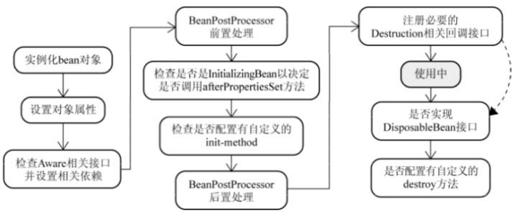
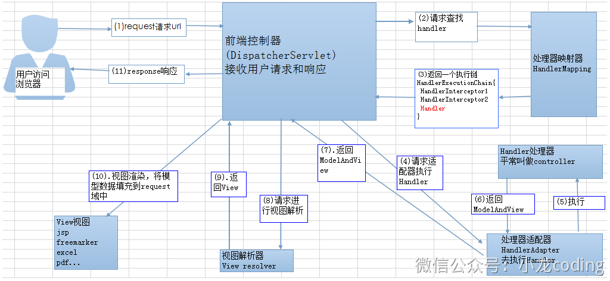

## Spring

### 1、Spring中的bean生命周期

**创建过程：**

1、实例化`bean`对象，以及设置`bean`属性；

2、设置对象属性；

3、检查`Aware`相关接口并设置相关依赖；

- 如果`Bean`实现了`BeanNameAware`接口，调用`setBeanName()`方法，传入`Bean`的名字。
- 如果`Bean`实现了`BeanClassLoaderAware`接口，调用`setBeanClassLoader()`方法，传入`ClassLoader`对象的实例。
- 与上面的类似，如果实现了其他`*.Aware`接口，就调用相应的方法。

4、`BeanPostProcessor`前置处理

- 如果有和加载这个`Bean`的`Spring` 容器相关的 `BeanPostProcessor`对象，执行`postProcessBeforelnitialization()`方法

5、调用`afterPropertiesSet()`

- 如果`Bean`实现了`lnitializingBean`接口，执行`afterPropertiesset()`方法。

6、包含`init-method`属性，执行指定方法

- 如果 `Bean`在配置文件中的定义包含`init-method` 属性，执行指定的方法。

7、`BeanPostProcessor`后置处理

- 如果有和加载这个`Bean`的`Spring`容器相关的`BeanPostProcessor`对象，执行`postProcessAfterInitialization()`方法
- 使用中

8、执行`destroyf()`

- 当要销毁 `Bean` 的时候，如果`Bean`实现了`DisposableBean`接口，执行`destroy()`方法。
- 当要销毁`Bean`的时候，如果`Bean`在配置文件中的定义包含`destroy-method` 属性，执行指定的方法。

### 2、SpringMVC 工作原理了解吗?

**流程说明（重要）：**

1. 客户端（浏览器）发送请求，直接请求到 `DispatcherServlet`。
2. `DispatcherServlet` 根据请求信息调用 `HandlerMapping`，解析请求对应的 `Handler`。
3. 解析到对应的 `Handler`（也就是我们平常说的 `Controller` 控制器）后，开始由 `HandlerAdapter` 适配器处理。
4. `HandlerAdapter` 会根据 `Handler`来调用真正的处理器开处理请求，并处理相应的业务逻辑。
5. 处理器处理完业务后，会返回一个 `ModelAndView` 对象，`Model` 是返回的数据对象，`View` 是个逻辑上的 `View`。
6. `ViewResolver` 会根据逻辑 `View` 查找实际的 `View`。
7. `DispaterServlet` 把返回的 `Model` 传给 `View`（视图渲染）。
8. 把 `View` 返回给请求者（浏览器）

### 3、@Transaction原理?|Spring事务什么时候会失效？

事务的原理是AOP，底层使用代理类实现。aop代理(cglib+jdk)

1、发生自调用，类里面使用this调用本类的方法，此时这个this不是代理类，而是userservice对象本身A方法没注解B方法有注解A去调用B事务是失效的不是代理类去调用

2、方法不是public的(@Tansaction只能作用于public方法，若非要不是public，可以开启代理模式AspectJ代理模式)

3、数据库不支持事务;没有被Spring管理;异常被吃掉不会回滚，被catch掉

### 4、Spring 事务实现方式有哪些？

- 编程式事务管理：这意味着你可以通过编程的方式管理事务，这种方式带来了很大的灵活性，但很难维护。
- 声明式事务管理：这种方式意味着你可以将事务管理和业务代码分离。你只需要通过注解或者XML配置管理事务。

### 5、Spring框架的事务管理有哪些优点？

- 它提供了跨不同事务api（如JTA、JDBC、Hibernate、JPA和JDO）的一致编程模型。
- 它为编程事务管理提供了比JTA等许多复杂事务API更简单的API。
- 它支持声明式事务管理。
- 它很好地集成了Spring的各种数据访问抽象。

### 6、 spring事务定义的传播规则

- PROPAGATION_REQUIRED: 支持当前事务，如果当前没有事务，就新建一个事务。这是最常见的选择。
- PROPAGATION_SUPPORTS: 支持当前事务，如果当前没有事务，就以非事务方式执行。
- PROPAGATION_MANDATORY: 支持当前事务，如果当前没有事务，就抛出异常。
- PROPAGATION_REQUIRES_NEW: 新建事务，如果当前存在事务，把当前事务挂起。
- PROPAGATION_NOT_SUPPORTED: 以非事务方式执行操作，如果当前存在事务，就把当前事务挂起。
- PROPAGATION_NEVER: 以非事务方式执行，如果当前存在事务，则抛出异常。
- PROPAGATION_NESTED:如果当前存在事务，则在嵌套事务内执行。如果当前没有事务，则进行与PROPAGATION_REQUIRED类似的操作。

### 7、Spring 框架中用到了哪些设计模式？

**工厂设计模式** : Spring使用工厂模式通过 `BeanFactory`、`ApplicationContext` 创建 bean 对象。

**代理设计模式** : Spring AOP 功能的实现。

**单例设计模式** : Spring 中的 Bean 默认都是单例的。

**模板方法模式** : Spring 中 `jdbcTemplate`、`hibernateTemplate` 等以 Template 结尾的对数据库操作的类，它们就使用到了模板模式。

**包装器设计模式** : 我们的项目需要连接多个数据库，而且不同的客户在每次访问中根据需要会去访问不同的数据库。这种模式让我们可以根据客户的需求能够动态切换不同的数据源。

**观察者模式:** Spring 事件驱动模型就是观察者模式很经典的一个应用。

**适配器模式** :Spring AOP 的增强或通知(Advice)使用到了适配器模式、spring MVC 中也是用到了适配器模式适配`Controller`。

### 8、什么是 AOP？

AOP(Aspect-Oriented Programming), 即 **面向切面编程**, 它与 OOP( Object-Oriented Programming, 面向对象编程) 相辅相成, 提供了与 OOP 不同的抽象软件结构的视角. 在 OOP 中, 我们以类(class)作为我们的基本单元, 而 AOP 中的基本单元是 **Aspect(切面)**

### 9、AOP 有哪些实现方式？

实现 AOP 的技术，主要分为两大类：

- 静态代理 - 指使用 AOP 框架提供的命令进行编译，从而在编译阶段就可生成 AOP 代理类，因此也称为编译时增强；
  - 编译时编织（特殊编译器实现）
  - 类加载时编织（特殊的类加载器实现）。
- 动态代理 - 在运行时在内存中“临时”生成 AOP 动态代理类，因此也被称为运行时增强。
  - `JDK` 动态代理：通过反射来接收被代理的类，并且要求被代理的类必须实现一个接口 。JDK 动态代理的核心是 InvocationHandler 接口和 Proxy 类 。
  - `CGLIB`动态代理： 如果目标类没有实现接口，那么 `Spring AOP` 会选择使用 `CGLIB` 来动态代理目标类 。`CGLIB` （ Code Generation Library ），是一个代码生成的类库，可以在运行时动态的生成某个类的子类，注意， `CGLIB` 是通过继承的方式做的动态代理，因此如果某个类被标记为 `final` ，那么它是无法使用 `CGLIB` 做动态代理的。

### 10、Servlet生命周期

加载阶段、初始化阶段、请求处理、销毁阶段

init()、service()、destroy)
