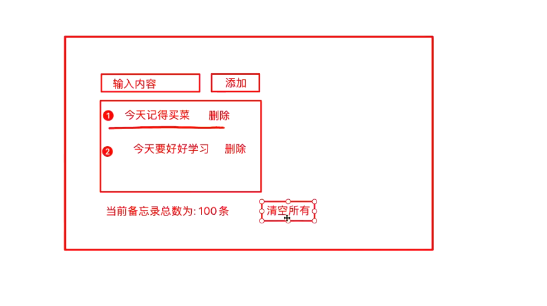

# Vue实战

## 1、Vue 引言


> `渐进式` JavaScript 框架   --摘自官网

```markdown
# 渐进式
   1. 易用  html css javascript
   2. 高效  开发前端页面 非常高效 
   3. 灵活  开发灵活 多样性

# 总结
		Vue 是一个javascript 框架 js 简化页面js操作
		bootstrap 是一个css框架  封装css

# 后端服务端开发人员: 
		页面标签 dom jquery js document.getElementById("xxx")
		Vue 渐进式javascript框架: 让我们通过操作很少的DOM,甚至不需要操作页面中任何DOM元素,就很容易的完成数据和视图绑定 ====> 双向绑定 MVVM  
		
		注意：日后在使用vue过程中页面不要再引入Jquery框架
		
		html css--->javascript(document.getElementById()...) ---->jquery($("#xx")) ---> angularjs --->vue(前后端分离架构核心)
		
		vue 前端系统   <-----JSON----->  后台系统springcloud

# Vue 作者
 	尤雨溪   国内的    
```

-------

## 2、Vue入门

### 2.1、下载Vuejs

```js
//开发版本:
	<!-- 开发环境版本，包含了有帮助的命令行警告 -->
	<script src="https://cdn.jsdelivr.net/npm/vue/dist/vue.js"></script>

//生产版本:
	<!-- 生产环境版本，优化了尺寸和速度 -->
	<script src="https://cdn.jsdelivr.net/npm/vue"></script>
```

### 2.2、Vue第一个入门应用

**1、vue第一个入门应用**

```html
<!DOCTYPE html>
<html lang="en">
<head>
    <meta charset="UTF-8">
    <title>vue系列课程</title>
</head>
<body>
    <div id="app">
        {{msg}}
        <h2>{{msg}}</h2>
        <span>
            <h2>{{msg}}</h2>
            <span>
                <span>{{msg}}</span>
            </span>
        </span>
        <h3>用户名：{{username}}</h3>
    </div>
</body>
</html>
<script src="js/vue.js"></script>
<script>
    var app= new Vue({
        el:"#app",  //element：元素 作用：用来指定vue实例作用范围  日后在el指定的作用范围内可以直接使用{{属性名}}获取data中的属性
        data:{      //data：数据    作用：用来给vue实例对象绑定一系列数据
            msg: "Vue欢迎您！",
            username: "小陈!!",
        }
    });
</script>
```

**2、vue实例中定义对象，数组等相关数据** 

```vue
<!DOCTYPE html>
<html lang="en">
<head>
    <meta charset="UTF-8">
    <title>vue系列课程</title>
</head>
<body>
    <div id="app">
        <h2>{{msg}}</h2>
        <h2>{{age}}</h2>
        <h2>姓名：{{user.name}}   描述：{{user.des}}</h2>
        <h2>{{schools[0]}}-{{schools[1]}}-{{schools[2]}}-{{schools[3]}}</h2>
        <h2>姓名：{{users[0].name}}  年龄：{{users[0].age}}  生日：{{users[0].bir}}</h2>
        <h2>姓名：{{users[1].name}}  年龄：{{users[1].age}}  生日：{{users[1].bir}}</h2>
        <h2>姓名：{{users[2].name}}  年龄：{{users[2].age}}  生日：{{users[2].bir}}</h2>
    </div>
</body>
</html>
<!--引入vue.js文件-->
<script src="js/vue.js"></script>
<script>
    var app = new Vue({
       el:"#app",  //指定vue作用范围
       data:{      //用来给vue实例绑定一系列数据
           msg:"百知欢迎您!!!",
           age:"23",
           user:{name:"小陈",des:"他在百知,百知等你！！"}, //定义对象
           schools:["河南校区","北京校区","天津校区","山西校区"], //定义一个数组
           users:[
               {name:"小王",age:23,bir:"2012-12-01"},
               {name:"小李",age:24,bir:"2013-12-01"},
               {name:"小赵",age:25,bir:"2014-12-01"},
           ]
       }
    });
</script>
```

**3、使用{{属性名}}获取data数据时,使用表达式 运算符等相关操作** 

```vue
<!DOCTYPE html>
<html lang="en">
<head>
    <meta charset="UTF-8">
    <title>vue系列课程</title>
</head>
<body>
    <div id="app">
        <h2>{{msg}}</h2>
        <!--{{属性名}}：使用这种方式获取数据时，可以进行相关的运算（算数，逻辑），调用获取值类型相关js方法-->
        <h2>{{msg + '您好'}}</h2>
        <h2>{{msg == 'hello vue'}}</h2>
        <h2>{{msg.toUpperCase()}}</h2>
        <h2>{{age + 1}}</h2>
        <h2>{{age == 23}}</h2>
    </div>
</body>
</html>
<!--引入vue.js文件-->
<script src="js/vue.js"></script>
<script>
    var app = new Vue({
       el:"#app",  //指定vue作用范围
       data:{      //用来给vue实例绑定一系列数据
            msg:"hello vue",
            age:23,
       }
    });
</script>
```

**4、使用vue时el属性指定**

```vue
<!DOCTYPE html>
<html lang="en">
<head>
    <meta charset="UTF-8">
    <title>vue系列课程</title>
</head>
<body >
    <div id="app" class="aa">
        <h2>{{msg}}</h2>

    </div>
</body>
</html>
<!--引入vue.js文件-->
<script src="js/vue.js"></script>
<script>
    var app = new Vue({
       el:"#app",  //指定vue作用范围
                        // 书写格式：使用css选择器 id选择器 html选择器 类选择器 推荐使用id选择器 id选择器具有唯一性
                        // 注意事项：不要将el指向body或html标签 Do not mount Vue to <html> or <body> - mount to normal elements instead.
       data:{      //用来给vue实例绑定一系列数据
            msg:"hello vue",
       }
    });
</script>
```

**5、总结** 

```markdown
# 总结:
			1.vue实例(对象)中el属性: 	代表Vue的作用范围  日后在Vue的作用范围内都可以使用Vue的语法
			2.vue实例(对象)中data属性: 用来给Vue实例绑定一些相关数据, 绑定的数据可以通过{{变量名}}在Vue作用范围内取出
			3.在使用{{}}进行获取data中数据时,可以在{{}}中书写表达式,运算符,调用相关方法,以及逻辑运算等
			4.el属性中可以书写任意的CSS选择器[jquery选择器],但是在使用Vue开发是推荐使用 id选择器  注意: el属性值不能指定body或html标签
```

------

## 3、v-text和v-html

### 3.1、v-text

> `v-text`:用来获取data中数据将数据以文本的形式渲染到指定标签内部             类似于javascript 中 innerText

```html
	<div id="app" class="aa">
        <span >{{ message }}</span>
        <span v-text="message"></span>
    </div>

    <!--引入vue.js-->
    <script src="https://cdn.jsdelivr.net/npm/vue/dist/vue.js"></script>
    <script>
        const app = new Vue({
            el:"#app",
            data:{
                message:"百知欢迎您"
            }
        })
    </script>
```

```markdown
# 总结
				1.{{}}(插值表达式)和v-text获取数据的区别在于 
				a.使用v-text取值会将标签中原有的数据覆盖 使用插值表达式的形式不会覆盖标签原有的数据
				b.使用v-text可以避免在网络环境较差的情况下出现插值闪烁
```

### 3.2、v-html

> `v-html`:用来获取data中数据将数据中含有的html标签先解析在渲染到指定标签的内部  类似于javascript中 innerHTML

```html
	<div id="app" class="aa">
        <span>{{message}}</span>
        <br>
        <span v-text="message"></span>

        <br>
        <span v-html="message">xxxxxx</span>
    </div>

    <!--引入vue.js-->
    <script src="https://cdn.jsdelivr.net/npm/vue/dist/vue.js"></script>
    <script>
        const app = new Vue({
            el:"#app",
            data:{
                message:"<a href=''>百知欢迎您</a>"
            }
        })
    </script>
```

### 3.3、v-text和v-html对比

**代码：** 

```vue
<!DOCTYPE html>
<html lang="en">
<head>
    <meta charset="UTF-8">
    <title>vue系列课程</title>
</head>
<body >
    <div id="app" class="aa">
        <h2>{{msg}} 您好</h2>
        <!--vue提供两个指令： v-text v-html 都可以直接根据属性名获取data数据渲染到指定标签内-->

        <!--v-text-->
        <h2><span v-text="msg"></span> 您好</h2>
        <!--
            v-text: {{}} 取值区别：
                1.使用{{}}取值不会将标签原始数据覆盖 使用v-text获取数据会将标签中原始内容覆盖
                2.v-text获取数据时不会出现插值闪烁  {{属性名}} ===> 插值表达式：容易出现插值闪烁 插值闪烁：当网络不好条件情况下使用{{}}方式获取数据
        -->
        <h2 v-html="msg"></h2>
        <!--
            共同点：都可以直接根据data中数据名，将数据渲染到标签内部
            v-text: v-text将获取数据直接以文本形式渲染到标签内部                innerText
            v-html: v-html将获取数据中含有html标签解析之后渲染到对应标签内部     innerHtml
        -->
        <h1 >{{content}}</h1>
        <h1 v-text="content"></h1>
        <h1 v-html="content"></h1>
    </div>
</body>
</html>
<!--引入vue.js文件-->
<script src="js/vue.js"></script>
<script>
    var app = new Vue({
       el:"#app",  //指定vue作用范围
       data:{      //用来给vue实例绑定一系列数据
            msg:"hello vue",
            content : "欢迎来到<a href='http://www.baidu.com'>百度</a>",
       }
    });
</script>
```

**运行结果：**


## 4、vue中事件绑定(v-on)

### 4.1、绑定事件基本语法

**1、vue事件绑定（一）** 

```html
<!DOCTYPE html>
<html lang="en">
<head>
    <meta charset="UTF-8">
    <title>vue系列课程</title>
</head>
<body >
    <div id="app" >
        <h2>{{msg}}</h2>
        <h2 v-text="msg"></h2>
        <h2 v-html="msg"></h2>

        <!--
            js 事件三要素
                1.事件源：发生事件源头称之为事件源，一般指的是html标签
                2.事件：发生特定动作 onclick单击 dbclick 双击 onkeyup ......
                3.监听器：事件处理器程序 事件处理函数 function(){}
            vue 事件：v-on
                1.在vue中给对应标签绑定事件可以通过vue提供v-on指令进行事件绑定 ==> v-on:事件名
                2.在vue中事件处理函数统一声明在vue实例中methods属性
        -->
        <!--给button按钮绑定多个事件-->
        <input type="button" value="点我" v-on:click="aaa" v-on:mouseover="bbb" v-on:mouseout="ccc">
    </div>
</body>
</html>
<!--引入vue.js文件-->
<script src="js/vue.js"></script>
<script>
    var app = new Vue({
       el:"#app",  //指定vue实例作用范围
       data:{      //用来给vue实例绑定一系列数据
            msg:"hello vue",
       },
       methods:{ //用来给当前vue实例对象，声明一系列函数
           aaa: function () {
                alert("aaa");
           },
           bbb: function () {
                console.log("mouse over");
           },
           ccc: function () {
               console.log("mouse out");
           }
       }
    });
</script>
```

**2、vue事件绑定（二）**

给一个按钮绑定点击+1事件。

```vue
<!DOCTYPE html>
<html lang="en">
<head>
    <meta charset="UTF-8">
    <title>vue系列课程</title>
</head>
<body >
    <div id="app" >
        <h1>{{msg}}</h1>
        <h1>{{age}}</h1>
        <!--
            vue事件：
                1. 使用v-on：事件名
                2. 函数名统一定义在vue实例中 methods 属性中
        -->
        <input type="button" value="点我给年龄+1" v-on:click="incrmentAge">
        <input type="button" value="点我给年龄-1" v-on:click="decrmentAge">
    </div>
</body>
</html>
<!--引入vue.js文件-->
<script src="js/vue.js"></script>
<script>
    var app = new Vue({
       el:"#app",  //指定vue实例作用范围
       data:{      //用来给vue实例绑定一系列数据
            msg:"hello vue",
            age:23,
       },
       methods:{ //用来给当前vue实例对象，声明一系列函数
           incrmentAge:function () {
               //this对象代表当前vue实例对象
               console.log(this);
               console.log(this.age)
               if(this.age >= 120) return;
               this.age ++;  //vue实例中data数据age发生变化
           },
           decrmentAge:function () { //定义函数
               if(this.age < 2) return ;
               this.age --;
           }
       }
    });
</script>
```

**3、总结** 

​	事件源: 发生事件`dom`元素      事件: 发生特定的动作   `click....`      监听器  发生特定动作之后的事件处理程序  通常是`js`中函数

1. 在`vue`中绑定事件是通过`v-on`指令来完成的 `v-on:`事件名 如  `v-on:click`

2. 在`v-on:`事件名的赋值语句中是当前事件触发调用的函数名

3. 在`vue`中事件的函数统一定义在`Vue`实例的`methods`属性中

4. 在`vue`定义的事件中`this`指的就是当前的`Vue`实例,日后可以在事件中通过使用`this`获取`Vue`实例中相关数据 调用`methods`中相关方法

### 4.2、Vue中事件的简化语法

```html
<!DOCTYPE html>
<html lang="en">
<head>
    <meta charset="UTF-8">
    <title>vue系列课程</title>
</head>
<body >
    <div id="app" >
        <h1>{{msg}}</h1>
        <h1>{{age}}</h1>

        <!--
            vue事件绑定  v-on：事件名  简化写法===> @事件名
        -->
        <input type="button" value="点我改变年龄" @click="changeAge">
    </div>
</body>
</html>
<!--引入vue.js文件-->
<script src="js/vue.js"></script>
<script>
    var app = new Vue({
       el:"#app",  //指定vue实例作用范围
       data:{      //用来给vue实例绑定一系列数据
            msg:"hello vue",
            age:23,
       },
       methods:{
           changeAge:function () { 
               this.age ++ ;
           }
       }
    });
</script>
```

```markdown
# 总结:
			1.日后在vue中绑定事件时可以通过@符号形式 简化  v-on 的事件绑定
```

### 4.3、Vue事件函数两种写法

```html
<script>
    var app = new Vue({
       el:"#app",  //指定vue实例作用范围
       data:{      //用来给vue实例绑定一系列数据
            msg:"hello vue",
            age:23,
       },
       methods:{
           /*changeAge:function () { //定义事件 简化写法
               this.age ++ ;
           }*/
           changeAge(){ //es6语法 ecmascript 6版本
               this.age ++ ;
           }
       }
    });
</script>
```

```markdown
# 总结:
			1.在Vue中事件定义存在两种写法  
				 一种是 函数名:function(){}       
			     一种是 函数名(){} 推荐
```

### 4.4、Vue事件参数传递

我们还可以给vue事件中传递参数。

```html
<!DOCTYPE html>
<html lang="en">
<head>
    <meta charset="UTF-8">
    <title>vue系列课程</title>
</head>
<body >
    <div id="app" >
        <h1>{{msg}}</h1>
        <h1>{{age}}</h1>

        <!--
            vue事件绑定  v-on：事件名  简化 @事件名="事件函数名(参数......)"
        -->
        
        <!--多个参数使用','隔开-->
        <input type="button" value="点我改变年龄的值" @click="changeAge(10,'xiaohei')"> 
    </div>
</body>
</html>
<!--引入vue.js文件-->
<script src="js/vue.js"></script>
<script>
    var app = new Vue({
        el:"#app",  //指定vue实例作用范围
        data:{      //用来给vue实例绑定一系列数据
            msg:"hello vue",
            age:23,
        },
        methods:{
            changeAge(number,name){ //定义事件
                console.log(number);
                console.log(name);
                this.age += number ;
            }
        }
    });
</script>
```

```markdown
# 总结:
	1.在使用事件时,可以直接在事件调用处给事件进行参数传递,在事件定义处通过定义对应变量接收传递的参数
```

-----

## 5、v-show v-if v-bind

### 5.1、v-show、v-if使用

> `v-show`: 用来控制页面中某个标签元素是否展示       
>
> `v-if`: 用来控制页面元素是否展示       

```html
<!DOCTYPE html>
<html lang="en">
<head>
    <meta charset="UTF-8">
    <title>vue系列课程</title>
</head>
<body >
    <div id="app" >
        <h2>{{msg}}</h2>
        <!--
            v-if、v-show ： 作用：都是用来控制页面中标签是否展示和隐藏 使用：标签：v-if="true|false" v-show="true|false"
            区别：
                v-show: 底层在控制页面标签是否展示时底层使用的是css 中 display 属性来标签展示和隐藏  推荐使用：v-show 数据量比较大 控制显示状态切换频繁
                v-if  : 底层在控制页面标签是否展示时底层是直接操作dom元素，通过对dom元素删除和添加来控制标签的展示和隐藏
        -->
        <!--v-show-->
        <h1 v-show="isShow">{{content}}</h1>
        <!--v-if-->
        <h1 v-if="isShow">{{content}}</h1>
    </div>
</body>
</html>
<!--引入vue.js文件-->
<script src="js/vue.js"></script>
<script>
    var app = new Vue({
        el:"#app",  //指定vue实例作用范围
        data:{      //用来给vue实例绑定一系列数据
            msg:"hello vue",
            content: "vue学习",
            isShow:true
        },
        methods:{ //用来给vue实例定义事件处理函数

        }
    });
</script>
```

**总结：**

1. 在使用v-show时可以直接书写boolean值控制元素展示,也可以通过变量控制标签展示和隐藏。
2. 在v-show中可以通过boolean表达式控制标签的展示和隐藏。
3. v-if、v-show ： 作用：都是用来控制页面中标签是否展示和隐藏 使用：标签：`v-if="true|false" `,`v-show="true|false"`
4.  区别：
   - v-show: 底层在控制页面标签是否展示时底层使用的是css 中 display 属性来标签展示和隐藏 。推荐使用：v-show  在数据量比较大和控制显示状态切换频繁时。
   - v-if  : 底层在控制页面标签是否展示时底层是直接操作dom元素，通过对dom元素删除和添加来控制标签的展示和隐藏。

### 5.2、v-show、v-if小案例 

**1、v-show、v-if显示隐藏案例(一)**

```html
<!DOCTYPE html>
<html lang="en">
<head>
    <meta charset="UTF-8">
    <title>vue系列课程</title>
</head>
<body >
    <div id="app" >
        <!-- v-show v-if -->
        <h2 v-show="isShow">{{msg}}</h2>

        <!--绑定事件 单击事件 @click-->
        <input type="button" value="显示" @click="show">
        <input type="button" value="隐藏" @click="hidden">
        <input type="button" value="切换显示状态" @click="changeState">
        <input type="button" value="切换显示状态,另一种写法" @click="isShow=!isShow">

    </div>
</body>
</html>
<!--引入vue.js文件-->
<script src="js/vue.js"></script>
<script>
    var app = new Vue({
        el:"#app",  //指定vue实例作用范围
        data:{      //用来给vue实例绑定一系列数据
            msg:"hello vue",
            isShow:true
        },
        methods:{ //用来给vue实例定义事件处理函数
            show(){  //用来显示
                this.isShow = true;
            },
            hidden(){//用来隐藏
                this.isShow = false;
            },
            changeState(){ //切换显示状态
                this.isShow = !this.isShow;
            },
        }
    });
</script>
```

**2、v-show、v-if显示隐藏案例(二)**

```vue
<!DOCTYPE html>
<html lang="en">
<head>
    <meta charset="UTF-8">
    <title>vue系列课程</title>
</head>
<body >
    <div id="app" >
        <!-- v-show v-if -->
        <h2>{{msg}}</h2>

        <!--图片添加鼠标移入事件-->
        
    </div>
</body>
</html>
<!--引入vue.js文件-->
<script src="js/vue.js"></script>
<script>
    var app = new Vue({
        el:"#app",  //指定vue实例作用范围
        data:{      //用来给vue实例绑定一系列数据
            msg:"hello vue",
            isShow:true
        },
        methods:{ //用来给vue实例定义事件处理函数
            hide(){
                this.isShow = false;
            }
        }
    });
</script>
```

### 5.3、v-bind

> `v-bind`: 用来绑定标签的属性从而通过vue动态修改标签的属性

```html
<!DOCTYPE html>
<html lang="en">
<head>
    <meta charset="UTF-8">
    <title>vue系列课程</title>
</head>
<body >
    <div id="app" >

        <h2>{{msg}}</h2>

       <!--
            v-bind: 绑定 作用：用来将html标签中相关属性绑定到vue实例中，日后通过对vue实例中数据修改，影响到对应标签中属性变化
                        语法：v-bind:属性名
        -->
        
    </div>
</body>
</html>
<!--引入vue.js文件-->
<script src="js/vue.js"></script>
<script>
    var app = new Vue({
        el:"#app",  //指定vue实例作用范围
        data:{      //用来给vue实例绑定一系列数据
            msg:"hello vue",
            imgSrc:"https://img0.baidu.com/it/u=384452397,1089369801&fm=26&fmt=auto&gp=0.jpg",
            width:200,
            tip:"这是图片"
        },
        methods:{ //用来给vue实例定义事件处理函数

        }
    });
</script>
```

### 5.4、v-bind 简化写法

> ​	vue为了方便我们日后绑定标签的属性提供了对属性绑定的简化写法如 `v-bind:属性名` 简化之后 `:属性名`

```vue
<!--
	v-bind: 绑定 作用：用来将html标签中相关属性绑定到vue实例中，日后通过对vue实例中数据修改，影响到对应标签中属性变化
	语法：v-bind:属性名   =====> 简化写法：属性名
-->

```

> 扩展v-bind使用

```vue
<!DOCTYPE html>
<html lang="en">
<head>
    <meta charset="UTF-8">
    <title>vue系列课程</title>
    <style>
        .aa{
            border: 5px red solid;
        }
        .bb{
            border: 5px darkorange solid;
        }
    </style>
</head>
<body >
    <div id="app" >

        <h2>{{msg}}</h2>

       <!--
            v-bind: 绑定 作用：用来将html标签中相关属性绑定到vue实例中，日后通过对vue实例中数据修改，影响到对应标签中属性变化
                        语法：v-bind:属性名   =====> 简化写法：属性名
        -->
        
    </div>
</body>
</html>
<!--引入vue.js文件-->
<script src="js/vue.js"></script>
<script>
    var app = new Vue({
        el:"#app",  //指定vue实例作用范围
        data:{      //用来给vue实例绑定一系列数据
            msg:"hello vue",
            imgSrc:"https://img0.baidu.com/it/u=384452397,1089369801&fm=26&fmt=auto&gp=0.jpg",
            width:200,
            tip:"这是图片",
            isClass:true,  //ture 显示red false 显示orange
        },
        methods:{ //用来给vue实例定义事件处理函数

        }
    });
</script>
```

### 5.5、v-bind案例

实现鼠标移入和移出对图片和边框的切换。

```vue
<!DOCTYPE html>
<html lang="en">
<head>
    <meta charset="UTF-8">
    <title>vue系列课程</title>
    <style>
        .aa{
            border: 5px red solid;
        }
        .bb{
            border: 5px darkorange solid;
        }
    </style>
</head>
<body >
    <div id="app" >

        <h2>{{msg}}</h2>
        <!--属性绑定-->
        
    </div>
</body>
</html>
<!--引入vue.js文件-->
<script src="js/vue.js"></script>
<script>
    var app = new Vue({
        el:"#app",  //指定vue实例作用范围
        data:{      //用来给vue实例绑定一系列数据
            msg:"hello vue",
            src:"https://img2.baidu.com/it/u=1077360284,2857506492&fm=26&fmt=auto&gp=0.jpg",
            cls:"aa"
        },
        methods:{ //用来给vue实例定义事件处理函数
            change(){
                this.src = "https://img1.baidu.com/it/u=3229045480,3780302107&fm=26&fmt=auto&gp=0.jpg";
                this.cls = "bb";
            },
            recover(){
                this.src = "https://img2.baidu.com/it/u=1077360284,2857506492&fm=26&fmt=auto&gp=0.jpg";
                this.cls = "aa";
            }
        }
    });
</script>
```

## 6、v-for的使用

> `v-for`: 作用就是用来对对象进行遍历的(数组也是对象的一种)

```html
<!DOCTYPE html>
<html lang="en">
<head>
    <meta charset="UTF-8">
    <title>vue系列课程</title>
</head>
<body >
    <div id="app" >

        <h2>{{msg}}</h2>

        <!--
            v-for : 作用：用来给vue实例中数据进行遍历
        -->
        <h1>遍历对象</h1>
        <h2 v-for="(value,key,index) in user">
            index: {{index}} key:{{key}} value:{{value}}
        </h2>

        <h1>遍历数组</h1>
        <h2 v-for="(school,index) in schools">
            index:{{index}}  schools:{{school}}
        </h2>

        <h1>遍历数组中含有对象</h1>
        <h2 v-for="(user,index) in users" :key = "user.id">
            index: {{index}} name:{{user.name}} age:{{user.age}} bir:{{user.bir}}
        </h2>

    </div>
</body>
</html>
<!--引入vue.js文件-->
<script src="js/vue.js"></script>
<script>
    var app = new Vue({
        el:"#app",  //指定vue实例作用范围
        data:{      //用来给vue实例绑定一系列数据
            msg:"hello vue",
            user:{name:"小王",age:23,bir:"2012-02-06"},
            schools:["北京","重庆","天津"],
            users:[
                {id:"1",name:"小王",age:23,bir:"2012-02-06"},
                {id:"2",name:"小李",age:34,bir:"2016-02-06"},
                {id:"3",name:"小赵",age:12,bir:"2014-02-06"},
            ]
        },
        methods:{ //用来给vue实例定义事件处理函数

        }
    });
</script>
```

```markdown
# 总结
	1.在使用v-for的时候一定要注意加入:key 用来给vue内部提供重用和排序的唯一key 
```

----

## 7、v-model 双向绑定

### 7.1、v-model

> `v-model`: 作用用来绑定标签元素的值与vue实例对象中data数据保持一致,从而实现双向的数据绑定机制

**代码：**

```html
<!DOCTYPE html>
<html lang="en">
<head>
    <meta charset="UTF-8">
    <title>vue系列课程</title>
</head>
<body >
    <div id="app" >

        <h2>{{msg}}</h2>

        <!--
            v-model : 作用：用来绑定from表单标签中的value属性交给vue实例进行管理 input select checxbox button ...
        -->
        <input type="text" v-model="msg">

        <input type="button" value="改变data数据" @click="change">

    </div>
</body>
</html>
<!--引入vue.js文件-->
<script src="js/vue.js"></script>
<script>
    var app = new Vue({
        el:"#app",  //指定vue实例作用范围
        data:{      //用来给vue实例绑定一系列数据
            msg:"hello vue",

        },
        methods:{ //用来给vue实例定义事件处理函数
            change(){
                this.msg = "vue学习"
            }
        }
    });
</script>
```

**总结：** 

```markdown
# 总结
		1.使用v-model指令可以实现数据的双向绑定 
		2.所谓双向绑定 表单中数据变化导致vue实例data数据变化   vue实例中data数据的变化导致表单中数据变化 称之为双向绑定

# MVVM架构  双向绑定机制
	Model: 数据  Vue实例中绑定数据
	
	VM:   ViewModel  监听器

	View:  页面  页面展示的数据
```

学完v-model以后，我们一起来做两个小案例。


### 7.2、两个案例

> **备忘录案例实现**

**需求：**

 

**代码：**

```vue
<!DOCTYPE html>
<html lang="en">
<head>
    <meta charset="UTF-8">
    <title>vue系列课程</title>
</head>
<body>
    <div id="app">
        <h1>{{msg}}</h1>
        <!-- v-if(dom)、v-show(css display) ： 作用：都是用来控制页面中标签是否展示和隐藏-->
        输入备忘录内容：<input type="text" v-model="content"> <input type="button" value="添加到备忘录" @click="saveItem"> <br>

        <ul v-show="items.length > 0">
            <li v-for="(item,index) in items">{{index+1}}. {{item}} <a href="javascript:;" @click="delItem(index)">删除</a></li>
        </ul>
        <h5 v-show="items.length == 0">当前备忘录中还没有任何内容~~,请添加！</h5>
        <h3>当前备忘录中共：{{items.length}}条</h3>
        <input type="button" value="清空备忘录" @click="delAllItems">
    </div>
</body>
</html>
<!--引入vue的js文件-->
<script src="js/vue.js"></script>
<script>
    var app = new Vue({
        el:"#app",  //代表vue实例作用范围
        data:{      //在vue实例中定义一系列数据
            msg:"备忘录功能实现",
            items:["今天去买菜","今天要好好学习","今天要取快递"],
            content:""
        },
        methods:{ //在vue实例中定义相关函数
            saveItem(){ //添加备忘录方法
                console.log(this.content);
                if(!this.content) {
                    alert("请输入备忘录内容!!!")
                    return;
                }
                this.items.push(this.content); //将新增的内容添加到数组中
                this.content="";
            },
            delItem(index){ //根据下标删除指定元素
                console.log(index);
                this.items.splice(index,1); //根据下标删除元素 //参数1：删除起始下标 参数2：删除元素个数
            },
            delAllItems(){ //清空备忘录
                this.items = [];
            }
        }
    });
</script>
```

**效果：**

 

> **购物车案例实现**

**需求：**

 

**代码：**

```vue
<!DOCTYPE html>
<html lang="en">
<head>
    <meta charset="UTF-8">
    <title>vue系列课程</title>
</head>
<body>
    <div id="app">
        <h1>{{msg}}</h1>

        <table border="1">
            <tr>
                <th>id</th>
                <th>名称</th>
                <th>价格</th>
                <th>数量</th>
                <th>小计</th>
            </tr>
            <!--v-for-->
            <tr v-for="(item,index) in items" :key="item.id">
                <td>{{item.id}}</td>
                <td>{{item.name}}</td>
                <td>{{item.price}}</td>
                <td><input type="button" value="-" @click="decrCount(index)">{{item.count}}<input type="button" value="+" @click="incrCount(index)"></td>
                <td>{{(item.price * item.count).toFixed(2)}}</td>
            </tr>
        </table>

        <h3>总价格：{{getTotalPrice()}}</h3>
    </div>
</body>
</html>
<!--引入vue的js文件-->
<script src="js/vue.js"></script>
<script>
    var app = new Vue({
        el:"#app",  //代表vue实例作用范围
        data:{      //在vue实例中定义一系列数据
            msg:"购物车功能实现",
            items:[
                {id:1,name:"苹果iphone12",count:1,price:28.28},
                {id:2,name:"华为mate40 pro",count:1,price:30.28},
            ]
        },
        methods:{ //在vue实例中定义相关函数
            incrCount(index){  //数量增加的方法
                console.log(this.items[index].count);
                this.items[index].count++;
            },
            decrCount(index){  //数量减少的方法
                console.log(this.items[index].count);
                if( this.items[index].count >= 1){
                    this.items[index].count--;
                }else{
                    alert("不能在少了!");
                    return ;
                }
            },
            getTotalPrice(){ 
                var totalPrice = 0;
                for(var i = 0; i < this.items.length; i++){
                    totalPrice += this.items[i].count * this.items[i].price;
                }
                return totalPrice.toFixed(2);
            }
        }
    });
</script>
```

**效果：**

 

## 8、计算属性

> 计算属性：computed: vue官方提供一个计算属性

**代码：**

```vue
<!DOCTYPE html>
<html lang="en">
<head>
    <meta charset="UTF-8">
    <title>vue系列课程</title>
</head>
<body>
    <div id="app">
        <h1>{{msg}}</h1>

        <!--
            computed: vue官方提供一个计算属性
                作用：在完成某种业务时，往往页面结果需要经过多次计算才能获取，computed属性就是用来完成页面结果多次计算
                好处：在完成计算同时也会将本次计算结果进行缓存，如果数据没有发生变化，在页面中多次使用，计算方法仅执行一次
                使用：{{ 属性名}} 属性名即方法名称
        -->
        <table border="1">
            <tr>
                <th>id</th>
                <th>名称</th>
                <th>价格</th>
                <th>数量</th>
                <th>小计</th>
            </tr>
            <!--v-for-->
            <tr v-for="(item,index) in items" :key="item.id">
                <td>{{item.id}}</td>
                <td>{{item.name}}</td>
                <td>{{item.price}}</td>
                <td><input type="button" value="-" @click="decrCount(index)">{{item.count}}<input type="button" value="+" @click="incrCount(index)"></td>
                <td>{{(item.price * item.count).toFixed(2)}}</td>
            </tr>
        </table>

        <!--使用methods方法完成计算业务：
            缺点：
                1.只要调用了一次计算方法，整个计算方法就会执行一次，如果在一个页面中多次使用到计算结果，可能会导致造成重复计算，导致页面加载性能变低
        -->
        <h3>总价格：{{totalPrice}}</h3>

    </div>
</body>
</html>
<!--引入vue的js文件-->
<script src="js/vue.js"></script>
<script>
    var app = new Vue({
        el:"#app",  //代表vue实例作用范围
        data:{      //在vue实例中定义一系列数据
            msg:"购物车功能实现之methods方法实现总价格",
            items:[
                {id:1,name:"苹果iphone12",count:1,price:28.28},
                {id:2,name:"华为mate40 pro",count:1,price:30.28},
            ]
        },
        methods:{ //在vue实例中定义相关函数
            incrCount(index){  //数量增加的方法
                console.log(this.items[index].count);
                this.items[index].count++;
            },
            decrCount(index){  //数量减少的方法
                console.log(this.items[index].count);
                if( this.items[index].count >= 1){
                    this.items[index].count--;
                }else{
                    alert("不能在少了!");
                    return ;
                }
            },

        },
        computed:{  //用来书写计算相关方法  计算属性
            totalPrice(){ //计算方法 好处：只进行一次计算，多次使用时直接使用第一次计算之后缓存结果
                var totalPrice = 0;
                for(var i = 0; i < this.items.length; i++){
                    totalPrice += this.items[i].count * this.items[i].price;
                }
                return totalPrice.toFixed(2);
            }
        }
    });
</script>
```

**总结：**

1. 作用：在完成某种业务时，往往页面结果需要经过多次计算才能获取，computed属性就是用来完成页面结果多次计算
2. 好处：在完成计算同时也会将本次计算结果进行缓存，如果数据没有发生变化，在页面中多次使用，计算方法仅执行一次
3. 使用：{{ 属性名}} 属性名即方法名称

## 9、事件修饰符

> `修饰符`: 用来和事件连用,用来决定事件触发条件或者是阻止事件的触发机制

```markdown
# 1.常用的事件修饰符
	.stop    停止
	.prevent 阻止
	.self    独自
	.once    一次
	
```

### 9.1 stop事件修饰符

> 用来阻止事件冒泡

```html
<h2>stop事件修饰符</h2>
<!--.stop 事件修饰符 作用：用来阻止事件的冒泡-->
<div style="width: 200px;height: 200px;background: red" @click="parent">

    <!--对孩子中单击事件进行修饰：不进行事件冒泡处理 .stop-->
    <div style="width: 100px;height: 100px;background: green" @click.stop="child"></div>

</div>
```

### 9.2 prevent 事件修饰符

> 用来阻止标签的默认行为

```html
<h2>prevent事件修饰符</h2>
<!--默认行为：根据href连接自动跳转 .prevent 阻止事件默认行为-->
<a href="http://www.baidu.com" @click.prevent="search">百度一下</a>
<a href="javascript:void(0);" @click.prevent="search">百度一下</a>
<a href="javascript:;" @click.prevent="search">百度一下</a>
```

### 9.3 self 事件修饰符

> 用来针对于当前标签的事件触发     ===========> 只触发自己标签的上特定动作的事件     只关心自己标签上触发的事件 不监听事件冒泡

```html
<h2>slef事件修饰符</h2>
<!--self: 只监听自身标签触发的对应事件-->
<div style="width: 200px;height: 200px;background: aqua" @click.self="parent">

    <div style="width: 100px;height: 100px;background: green" @click="child"></div>
    <div style="width: 100px;height: 100px;background: brown" @click="child"></div>

</div>
```

### 9.4 once 事件修饰符

> once 一次作用:  就是让指定事件只触发一次

```html
<!DOCTYPE html>
<html lang="en">
<head>
    <meta charset="UTF-8">
    <title>vue系列课程</title>
</head>
<body>
    <div id="app">

        <h1>{{msg}}</h1>

        <!--
            事件修饰符 作用：用来和事件连用，用来决定事件触发条件和决定事件触发机制
            .stop       停止事件冒泡
            .prevent    阻止默认行为
            .slef       只触发自身行为
            .once       一次事件

            注意：事件修饰符可以多个连用
         -->
        <h2>stop事件修饰符</h2>
         <!--.stop 事件修饰符 作用：用来阻止事件的冒泡-->
         <div style="width: 200px;height: 200px;background: red" @click="parent">

             <!--对孩子中单击事件进行修饰：不进行事件冒泡处理 .stop-->
             <div style="width: 100px;height: 100px;background: green" @click.stop.once="child"></div>

         </div>

        <h2>prevent事件修饰符</h2>
        <!--默认行为：根据href连接自动跳转 .prevent 阻止事件默认行为-->
        <a href="http://www.baidu.com" @click.prevent="search">百度一下</a>
        <a href="javascript:void(0);" @click.prevent="search">百度一下</a>
        <a href="javascript:;" @click.prevent="search">百度一下</a>

        <h2>slef事件修饰符</h2>
        <!--self: 只监听自身标签触发的对应事件-->
        <div style="width: 200px;height: 200px;background: aqua" @click.self="parent">

            <div style="width: 100px;height: 100px;background: green" @click="child"></div>
            <div style="width: 100px;height: 100px;background: brown" @click="child"></div>

        </div>

        <h2>once事件修饰符</h2>
        <!--once事件修饰符：作用：只能让标签上的对应事件执行一次-->
        <input type="button" value="点我" @click.once="clickMe">
    </div>
</body>
</html>
<!--引入vue的js文件-->
<script src="js/vue.js"></script>
<script>
    var app = new Vue({
        el:"#app",  //代表vue实例作用范围
        data:{      //在vue实例中定义一系列数据
            msg:"事件修饰符",

        },
        methods:{ //在vue实例中定义相关函数
            parent(){
                alert("parent div event");
            },
            child(){
                alert("child div event");
            },
            search(){
                alert("a click event");
            },
            clickMe(){
                alert("click me!!!")
            }
        },
        computed:{  //用来书写计算相关方法  计算属性

        }
    });
</script>
```

----

## 10、按键修饰符

> 作用: 用来与键盘中按键事件绑定在一起,用来修饰特定的按键事件的修饰符

```markdown
# 按键修饰符
	.enter
	.tab
	.delete (捕获“删除”和“退格”键)
	.esc
	.space
	.up
	.down
	.left
	.right
```

### 10.1 enter 回车键

> 用来在触发回车按键之后触发的事件

```html
<!DOCTYPE html>
<html lang="en">
<head>
    <meta charset="UTF-8">
    <title>vue系列课程</title>
</head>
<body>
    <div id="app">

        <h1>{{msg}}</h1>
        <!--
            按键修饰符：作用:用来和键盘上事件(keyup,keydown......)进行连用，用来修饰键盘上特定的按键来触发对应的事件
            .enter
            .tab
            .delete (捕获“删除”和“退格”键)
            .esc
            .space
            .up
            .down
            .left
            .right
        -->
        <!--.enter 回车按键修饰符-->
        <input type="text" v-model="msg" @keyup.enter="test">
    </div>
</body>
</html>
<!--引入vue的js文件-->
<script src="js/vue.js"></script>
<script>
    var app = new Vue({
        el:"#app",  //代表vue实例作用范围
        data:{      //在vue实例中定义一系列数据
            msg:"按键修饰符",

        },
        methods:{ //在vue实例中定义相关函数
            test(){
                console.log("test");
            }
        },
        computed:{  //用来书写计算相关方法  计算属性

        }
    });
</script>
```

### 10.2 tab 键

> 用来捕获到tab键执行到当前标签是才会触发

```html
<input type="text" @keyup.tab="test">
```

----

## 11、Axios 基本使用

### 11.1、引言 

> `Axios` 是一个异步请求技术,核心作用就是用来在页面中发送异步请求,并获取对应数据在页面中渲染       页面局部更新技术  Ajax

### 11.2、Axios 第一个程序

中文网站:https://www.kancloud.cn/yunye/axios/234845

安装: https://unpkg.com/axios/dist/axios.min.js

#### 11.2.1、GET方式的请求

**后端代码：**

```java
package com.xiao.controller;

import com.xiao.entity.User;
import org.springframework.web.bind.annotation.*;

import javax.websocket.server.PathParam;
import java.util.Date;

@RestController //代表接口中返回的都是json格式数据
@CrossOrigin //运行所有的请求 所有域访问 解决：跨域问题
public class AdminController {

    //user接口

    //rest接口 url/11/
    @GetMapping("user/{id}")
    public User FindUserById(@PathVariable("id") Integer id){
        System.out.println("id: "+id);
        System.out.println("user...");
        return new User(id,"小李",23,new Date());
    }

    //queryString接口 url?id=11
    @GetMapping("user")
    public User user(@RequestParam("id") Integer id){
        System.out.println("id: "+id);
        System.out.println("user...");
        return new User(id,"小陈",23,new Date());
    }

    //测试接口
    @GetMapping("demo")

    public String demo(){
        System.out.println("demo...");
        return "demo ok";
    }
}

```

**前端代码：**

```html
<!DOCTYPE html>
<html lang="en">
<head>
    <meta charset="UTF-8">
    <title>vue系列课程</title>
</head>
<body>
    <div id = "app">
        <h1>axios的GET方式请求</h1>
    </div>
</body>
</html>
<!--引入axios异步请求核心js文件-->
<script src="js/axios.min.js"></script>
<!--测试异步请求-->
<script>

    //发送axios 的GET方式请求
    /*axios.get("http://localhost:8989/user?id=11").then(function (res){
        console.log(res.data);
        console.log(res.data.id);
        console.log(res.data.name);
        console.log(res.data.age);
        console.log(res.data.bir);
    });*/

    //es6中简化写法function(){}简化写法java中lambada表达式   ()=>
    axios.get("http://localhost:8989/user/11").then((res)=>{
        console.log(res.data);
        console.log(res.data.id);
        console.log(res.data.name);
        console.log(res.data.age);
        console.log(res.data.bir);
    });


    /*axios.get("http://localhost:8989/demo").then(function (resonse){ //then 正确请求返回处理结果
        console.log(resonse.data);
    }).catch(function (error){  //请求地址值出错的处理结果
        console.log(error)
    });   //发送异步请求方式*/
</script>
```

#### 11.2.2 POST方式请求

**后端代码：**

```java
//定义post接口
@PostMapping("user")
public Map<String,Object> save(@RequestBody User user){ //@RequestBody 将json格式数据转换成java对象
    System.out.println("user:" + user);
    HashMap<String,Object> result = new HashMap<>();
    result.put("success",true);
    result.put("msg","添加成功~~");
    return result;
}

```

**前端代码：** 

```html
<!DOCTYPE html>
<html lang="en">
<head>
    <meta charset="UTF-8">
    <title>vue系列课程</title>
</head>
<body>
    <div id = "app">
        <h1>axios的POST方式请求</h1>
    </div>
</body>
</html>
<!--引入axios异步请求核心js文件-->
<script src="js/axios.min.js"></script>
<!--测试异步请求-->
<script>
    //发送post方式请求
    //参数1: url地址 参数2: 请求数据
    axios.post("http://localhost:8989/user",{
        name:"小李",
        age:23,
        bir:"2012-02-05"
    }).then((res)=>{
        console.log(res.data);
    });

</script>
```

#### 11.2.3 axios并发请求

> `并发请求`:  将多个请求在同一时刻发送到后端服务接口,最后在集中处理每个请求的响应结果

 

```js
//axios并发请求
//定义demo请求
function demo(){
    return axios.get("http://localhost:8989/demo");
}
//定义user请求
function user(){
    return axios.get("http://localhost:8989/user?id=11");
}
axios.all([demo(), user()]).then(axios.spread((demoRes,useRes)=>{ //并发请求
    console.log(demoRes);
    console.log(useRes);
})); 
```

#### 11.2.4 拦截器

 

------

## 12、Vue 生命周期

>  Vue 实例生命周期 ===> java 对象生命周期(初始化阶段 运行阶段  销毁阶段)    `生命周期钩子`   ====>  `生命周期函数` 
>
>  Vue实例从创建到销毁过程中自动触发一系列函数   ====> Vue生命周期函数(钩子)

.png)

**Vue生命周期总结** 

```markdown
# 
- 1.初始化阶段
        beforeCreate(){ //1.生命周期中第一个函数,该函数在执行时Vue实例仅仅完成了自身事件的绑定和生命周期函数的初始化工作,Vue实例中还没有 Data el methods相关属性
        console.log("beforeCreate: "+this.msg);
        },
        created(){ //2.生命周期中第二个函数,该函数在执行时Vue实例已经初始化了data属性和methods中相关方法
        console.log("created: "+this.msg);
        },
        beforeMount(){//3.生命周期中第三个函数,该函数在执行时Vue将El中指定作用范围作为模板编译
        console.log("beforeMount: "+document.getElementById("sp").innerText);
        },
        mounted(){//4.生命周期中第四个函数,该函数在执行过程中,已经将数据渲染到界面中并且已经更新页面
        console.log("Mounted: "+document.getElementById("sp").innerText);
        }

- 2.运行阶段
        beforeUpdate(){//5.生命周期中第五个函数,该函数是data中数据发生变化时执行 这个事件执行时仅仅是Vue实例中data数据变化页面显示的依然是原始数据
        console.log("beforeUpdate:"+this.msg);
        console.log("beforeUpdate:"+document.getElementById("sp").innerText);
        },
        updated(){    //6.生命周期中第六个函数,该函数执行时data中数据发生变化,页面中数据也发生了变化  页面中数据已经和data中数据一致
        console.log("updated:"+this.msg);
        console.log("updated:"+document.getElementById("sp").innerText);
        },

- 3.销毁阶段
        beforeDestory(){//7.生命周期第七个函数,该函数执行时,Vue中所有数据 methods componet 都没销毁
        },
        destoryed(){ //8.生命周期的第八个函数,该函数执行时,Vue实例彻底销毁
        }
        
```

----

**代码：**

```vue
<!DOCTYPE html>
<html lang="en">
<head>
    <meta charset="UTF-8">
    <title>vue系列课程</title>
</head>
<body>
    <div id = "app">
        <h1 id="sp">{{msg}}</h1>

        <input type="button" value="修改数据" @click="changeData">
        <!--
            vue生命周期分为三个阶段：
                1.初始化阶段
                     beforeCreate(){ //1.生命周期中第一个函数,该函数在执行时Vue实例仅仅完成了自身事件的绑定和生命周期函数的初始化工作,Vue实例中还没有 Data el methods相关属性
                        console.log("beforeCreate: "+this.msg);
                    },
                    created(){   //2.生命周期中第二个函数,该函数在执行时Vue实例已经初始化了data属性和methods中相关方法
                        console.log("created: "+this.msg);
                    },
                    beforeMount(){//3.生命周期中第三个函数,该函数在执行时Vue将El中指定作用范围作为模板编译
                        console.log("beforeMount: "+document.getElementById("sp").innerText);
                    },
                    mounted(){    //4.生命周期中第四个函数,该函数在执行过程中,已经将数据渲染到界面中并且已经更新页面
                        console.log("Mounted: "+document.getElementById("sp").innerText);
                    }
                2.运行阶段
                    beforeUpdate(){//5.生命周期中第五个函数,该函数是data中数据发生变化时执行 这个事件执行时仅仅是Vue实例中data数据变化页面显示的依然是原始数据
                        console.log("beforeUpdate:"+this.msg);
                        console.log("beforeUpdate:"+document.getElementById("sp").innerText);
                    },
                    updated(){    //6.生命周期中第六个函数,该函数执行时data中数据发生变化,页面中数据也发生了变化  页面中数据已经和data中数据一致
                        console.log("updated:"+this.msg);
                        console.log("updated:"+document.getElementById("sp").innerText);
                    },
                3.销毁阶段
                    beforeDestory(){//7.生命周期第七个函数,该函数执行时,Vue中所有数据 methods componet 都没销毁
                        },
                    destoryed(){ //8.生命周期的第八个函数,该函数执行时,Vue实例彻底销毁
                    }
        -->
    </div>
</body>
</html>
<script src="js/vue.js"></script>
<script>
    var app = new Vue({
        el: "#app",
        data:{
            msg:"vue 生命周期",
        },
        methods:{
            changeData(){
                this.msg="vue 生命周期讲解";
            }
        },
        computed:{},

        beforeCreate(){ //1.生命周期中第一个函数,该函数在执行时Vue实例仅仅完成了自身事件的绑定和生命周期函数的初始化工作,Vue实例中还没有 Data el methods相关属性
            console.log("beforeCreate: "+this.msg);
        },
        created(){   //2.生命周期中第二个函数,该函数在执行时Vue实例已经初始化了data属性和methods中相关方法
            console.log("created: "+this.msg);
        },
        beforeMount(){//3.生命周期中第三个函数,该函数在执行时Vue将El中指定作用范围作为模板编译
            console.log("beforeMount: "+document.getElementById("sp").innerText);
        },
        mounted(){    //4.生命周期中第四个函数,该函数在执行过程中,已经将数据渲染到界面中并且已经更新页面
            console.log("Mounted: "+document.getElementById("sp").innerText);
        },
        beforeUpdate(){//5.生命周期中第五个函数,该函数是data中数据发生变化时执行 这个事件执行时仅仅是Vue实例中data数据变化页面显示的依然是原始数据
            console.log("beforeUpdate:"+this.msg);
            console.log("beforeUpdate:"+document.getElementById("sp").innerText);
        },
        updated(){    //6.生命周期中第六个函数,该函数执行时data中数据发生变化,页面中数据也发生了变化  页面中数据已经和data中数据一致
            console.log("updated:"+this.msg);
            console.log("updated:"+document.getElementById("sp").innerText);
        },
        beforeDestory(){//7.生命周期第七个函数,该函数执行时,Vue中所有数据 methods componet 都没销毁
        },
        destoryed(){ //8.生命周期的第八个函数,该函数执行时,Vue实例彻底销毁
        }
    });
</script>
```


