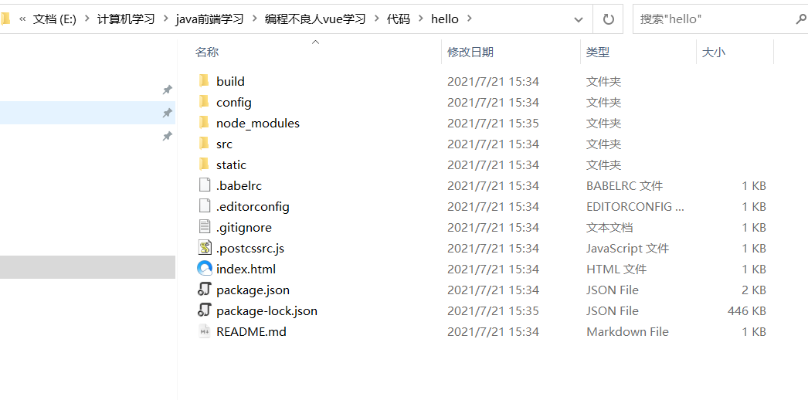
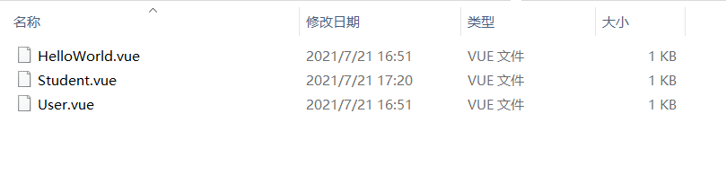
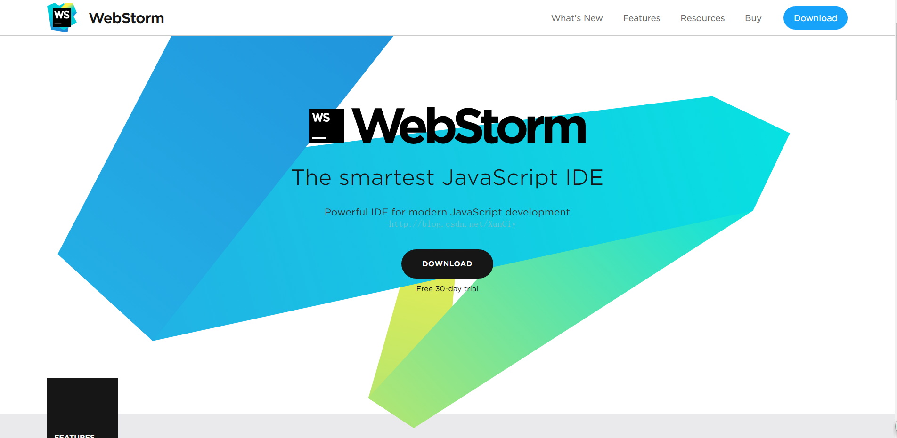
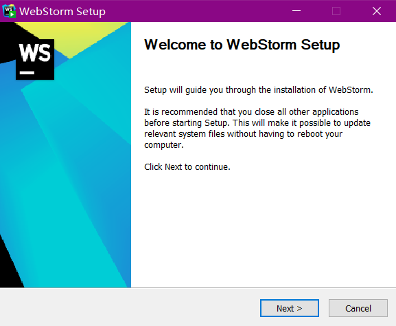
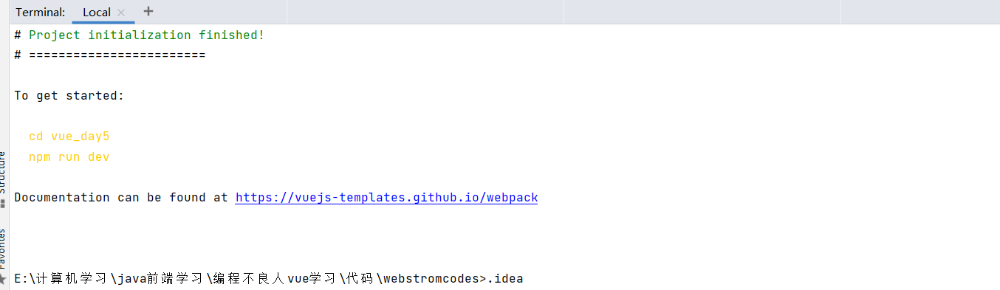
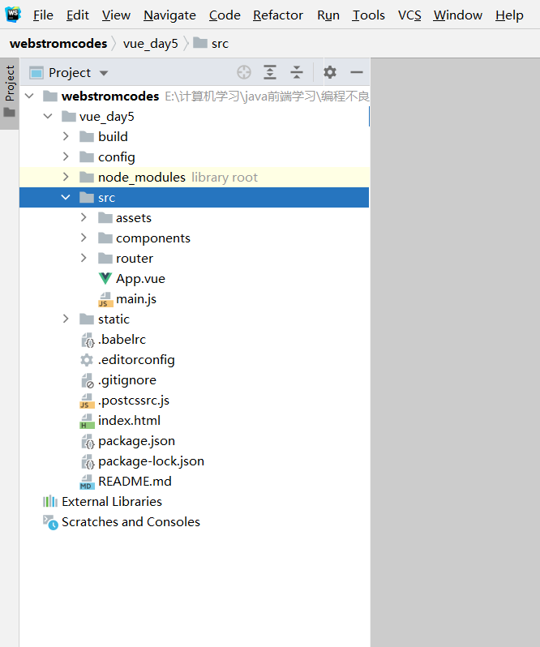
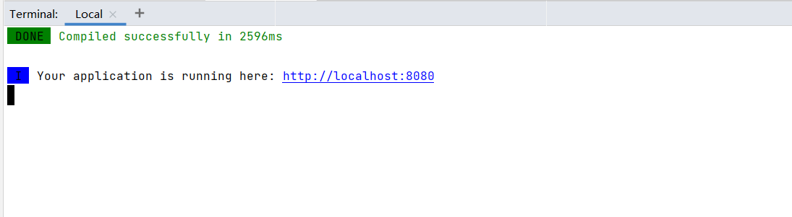
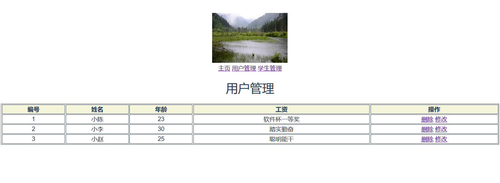

## 16、Vue CLI 脚手架

### 16.1、什么是CLI

命令行界面（英语：command-line interface，缩写：*CLI*）是在图形用户界面得到普及之前使用最为广泛的用户界面，它通常不支持鼠标，用户通过键盘输入指令，计算机接收到指令后，予以执行。也有人称之为字符用户界面（CUI）

### 16.2 什么是Vue CLI  <====>  (maven 项目构建工具)

Vue CLI 是一个基于 Vue.js 进行快速开发的完整系统。 使用Vue 脚手架之后我们开发的页面将是一个完整系统(项目)。 前端系统

### 16.3 Vue CLI优势

- 通过 `vue-cli` 搭建交互式的项目脚手架。       
- 通过 `@vue/cli` + `@vue/cli-service-global` 快速开始零配置原型开发   
- 一个运行时依赖 (`@vue/cli-service`)，该依赖：
  - 可升级;
  - 基于 webpack 构建，并带有合理的默认配置；   webpack 前端打包工具  index.html   vue组件  用户组件   学生组件  ..... 路由   dist目录
  - 可以通过项目内的配置文件进行配置；      cli 项目配置文件  添加
  - 可以通过插件进行扩展。                            cli 项目里
- 一个丰富的官方插件集合，集成了前端生态中最好的工具。 webpack打包工具===>dist目录  nodejs 服务器(tomcat java)  热部署插件  npm包
- 一套完全图形化的创建和管理 Vue.js 项目的用户界面

### 16.4 Vue CLI安装

#### 1、环境准备

```markdown
# 1.下载nodejs
	http://nodejs.cn/download/
		windows系统:   .msi  安装包(exe)指定安装位置   .zip(压缩包)直接解压缩指定目录
		mac os 系统:   .pkg  安装包格式自动配置环境变量  .tar.gz(压缩包)解压缩安装到指定名

# 2.配置nodejs环境变量
	1.windows系统:
	 	计算上右键属性---->  高级属性 ---->环境变量 添加如下配置:
		NODE_HOME=  nodejs安装目录
        PATH    = xxxx;%NODE_HOME%
    2.macos 系统
    	推荐使用.pkg安装直接配置node环境

# 3.验证nodejs环境是否成功
	node -v 

# 4.npm介绍
	node package mangager   nodejs包管理工具       前端主流技术  npm 进行统一管理
	maven 管理java后端依赖    远程仓库(中心仓库)      阿里云镜像
	npm   管理前端系统依赖     远程仓库(中心仓库)      配置淘宝镜像

# 5.配置淘宝镜像
	  npm config set registry https://registry.npm.taobao.org
	  npm config get registry

# 6.配置npm下载依赖位置
	 windows:
		npm config set cache "D:\nodereps\npm-cache"
		npm config set prefix "D:\nodereps\npm_global"
	 mac os:
	 	npm config set cache "/Users/chenyannan/dev/nodereps"
		npm config set prefix "/Users/chenyannan/dev/nodereps"

# 7.验证nodejs环境配置
	npm config ls
    ; userconfig /Users/chenyannan/.npmrc
    cache = "/Users/chenyannan/dev/nodereps"
    prefix = "/Users/chenyannan/dev/nodereps"
    registry = "https://registry.npm.taobao.org/"

```

#### 2、安装脚手架

```markdown
# 0.卸载脚手架
	npm uninstall -g @vue/cli  //卸载3.x版本脚手架
	npm uninstall -g vue-cli  //卸载2.x版本脚手架

# 1.Vue Cli官方网站
	https://cli.vuejs.org/zh/guide/

# 2.安装vue Cli
	npm install -g vue-cli

```

#### 3、第一个vue脚手架项目

> Vue-cli目录结构



```markdown
# 1.创建vue脚手架第一个项目
	vue init webpack 项目名
# 2.创建第一个项目
	hello     ------------->项目名
    -build  ------------->用来使用webpack打包使用build依赖  构建一些依赖文件
    -config ------------->用来做整个项目配置目录   主要用来对 开发 测试 环境进行配置
    -node_modules  ------>用来管理项目中使用依赖
    -src					 ------>用来书写vue的源代码[重点]
    	+assets      ------>用来存放静态资源 [重点]
      	components   ------>用来书写Vue组件 [重点]
      	router			 ------>用来配置项目中路由[重点]
      	App.vue      ------>项目中根组件[重点]
      	main.js      ------>项目中主入口[重点]
    -static        ------>其它静态
    -.babelrc      ------> 将es6语法转为es5运行
    -.editorconfig ------> 项目编辑配置
    -.gitignore    ------> git版本控制忽略文件
    -.postcssrc.js ------> 源码相关js
    -index.html    ------> 项目主页
    -package.json  ------> 类似与pom.xml 依赖管理  jquery 不建议手动修改
    -package-lock.json ----> 对package.json加锁
    -README.md         ----> 项目说明文件

# 3.如何运行在项目的根目录中执行
	npm run dev 运行前端系统

# 4.如何访问项目
	http://localhost:8080    

# 5.Vue Cli中项目开发方式
	 注意: 一切皆组件   一个组件中   js代码  html代码  css样式
	 	1. VueCli开发方式是在项目中开发一个一个组件对应一个业务功能模块,日后可以将多个组件组合到一起形成一个前端系统
	 	2. 日后在使用vue Cli进行开发时不再书写html,编写的是一个个组件(组件后缀.vue结尾的文件),日后打包时vue cli会将组件编译成运行的html文件	  
```

> rc 目录

`src`目录是项目的源码目录，所有代码都会写在这里！

> main.js

项目的入口文件，我们知道所有的程序都会有一个入口

````js
// The Vue build version to load with the `import` command
// (runtime-only or standalone) has been set in webpack.base.conf with an alias.
import Vue from 'vue'   // 引入VUE核心库
import App from './App' // 引入一个当前目录下的名字为App.vue的组件
import router from './router'

Vue.config.productionTip = false  // 是否要在生产环境当中给予提示功能。

/* eslint-disable no-new */
new Vue({
  el: '#app',
  router,
  components: { App },
  template: '<App/>'
})

````

- `import Vue from 'vue'`：ES6 写法，会被转换成 require("vue"); （require 是 NodeJS 提供的模块加载器）其实就相当于

  `<script src = "vue"></script>` 

- `import App from './App'` ：意思同上，但是指定了查找路径，./ 为当前目录

- `Vue.config.productionTip = false`：关闭浏览器控制台关于环境的相关提示

- `new Vue({})`：实例化 Vue

  - `el: '#app'`：查找 index.html 中 id 为 app 的元素
  - `template: '<App/>'`：模板，会将 index.html 中替换为
  - `components: { App }` ：引入组件，使用的是 import App from './App' 定义的 App 组件; 

> App.vue

```js
<template>
  <div id="app">
    
	<h1>自定义脚手架</h1>
	<!--展示路由-->
    <router-view/>
  </div>
</template>

<script>
export default {
  name: 'App'
}
</script>

<style>
#app {
  font-family: 'Avenir', Helvetica, Arial, sans-serif;
  -webkit-font-smoothing: antialiased;
  -moz-osx-font-smoothing: grayscale;
  text-align: center;
  color: #2c3e50;
  margin-top: 60px;
}
</style>
```

- template：HTML 代码模板，会替换 < App /> 中的内容

- export default{...}：导出 NodeJS 对象，作用是可以通过 import 关键字导入
  - name: 'App'：定义组件的名称
  - components: { HelloWorld }：定义子组件

- 在hello,Vue中,关于 < style scoped> 的说明：CSS 样式仅在当前组件有效，声明了样式的作用域,是当前的界面私有的! 不加代表全局有效。

> index.js  配置路由

```js
import Vue from 'vue'
import Router from 'vue-router'
import HelloWorld from '@/components/HelloWorld'

Vue.use(Router) //注册路由 new Vue({router,})

export default new Router({
  routes: [
    {
      path: '/',
      name: 'HelloWorld',
      component: HelloWorld
    }
  ]
})

```

> HelloWorld.vue

```js
<!-- 一个组件代表一个业务功能：html标签 js代码 css代码 -->
<template>
  <div class="hello">
    
  </div>
</template>

<script>
export default {
  name: 'HelloWorld',
  data () {
    return {
      msg: '欢迎Vue'
    }
  }
}
</script>

<!-- Add "scoped" attribute to limit CSS to this component only -->
<style scoped>
h1, h2 {
  font-weight: normal;
}
ul {
  list-style-type: none;
  padding: 0;
}
li {
  display: inline-block;
  margin: 0 10px;
}
a {
  color: #42b983;
}
</style>

```

#### 4、如何开发Vue脚手架

`注意:在Vue cli 中一切皆组件`

1、我们在HelloWorld.vue的同级目录下新建两个Student和User组件。

 

------

2、`Student.vue`和`User.vue`组件 

`Student.vue`组件

``` js
<template>
  <div class="hello">
     <h1>hello world {{msg}} </h1>
	 <h3>我是学生管理的主页</h3>
  </div>
</template>

<script>
export default {
  name: 'Student',
  data () {
    return {
      msg: '学生管理'
    }
  }
}
</script>
```

`User.vue`组件 

```js
<template>
  <div class="hello">
     <h1>hello world {{msg}} </h1>
	 <h3>我是用户管理的主页</h3>
  </div>
</template>

<script>
export default {
  name: 'HelloWorld',
  data () {
    return {
      msg: '用户管理'
    }
  }
}
</script>
```

3、在`App.vue`组件中引入这两个组件的链接，进行路由切换

```js
<template>
  <div id="app">
    
	<h1>自定义脚手架</h1>
	
	<router-link to="/">主页</router-link>
	<router-link to="/user">用户管理</router-link>
	<router-link to="/student">学生管理</router-link>
	
	<!--展示路由-->
    <router-view/>
  </div>
</template>
```

4、启动项目，测试一下


## 17、在脚手架中使用axios

### 17.1、安装axios

```markdown
# 1.安装axios
	npm install axios --save

# 2.配置main.js中引入axios
	import axios from 'axios';
	Vue.prototype.$http=axios;

# 3.使用axios
	在需要发送异步请求的位置:this.$http.get("url").then((res)=>{}) this.$http.post("url").then((res)=>{})
```

---

## 18、Vue Cli脚手架项目部署

```markdown
# 1.在项目根目录中执行如下命令:
	npm run build
	注意:vue脚手架打包的项目必须在服务器上运行不能直接双击运行

# 2.打包之后当前项目中变化
	在打包之后项目中出现dist目录,dist目录就是vue脚手架项目生产目录或者说是直接部署目录
```

## 19、webstorm开发vue cli项目

### 19.1、简介

WebStorm 是[JetBrains](https://baike.baidu.com/item/JetBrains/7502758)公司旗下一款[JavaScript ](https://baike.baidu.com/item/JavaScript /321142)开发工具。已经被广大[中国](https://baike.baidu.com/item/中国/1122445)[JS](https://baike.baidu.com/item/JS/10687961)[开发者](https://baike.baidu.com/item/开发者/239674)誉为“[Web](https://baike.baidu.com/item/Web/150564)[前端开发](https://baike.baidu.com/item/前端开发/10009024)神器”、“最强大的[HTML](https://baike.baidu.com/item/HTML/97049)5编辑器”、“最智能的JavaScript[ IDE](https://baike.baidu.com/item/ IDE/8232086)”等。与[IntelliJ IDEA](https://baike.baidu.com/item/IntelliJ IDEA/9548353)同源，继承了[IntelliJ IDEA](https://baike.baidu.com/item/IntelliJ IDEA/9548353)强大的JS部分的功能。



### 19.2、安装

官网地址：http://www.jetbrains.com/webstorm/

选择好安装路径

 

### 19.3、使用webstorm

webstorm和idea同属于一家开发公司，因此使用方式基本一样。

> 使用webstorm初始化项目

1、我们新建一个webstromcodes项目。

2、打开Terminal终端，输入`vue init webpack vue_day5` ，进行`vue-day5`项目的创建。

3、接下来的步骤和使用Vue Cli脚手架开发一样。

4、显示如下页面，项目初始化成功。



可以看下目录结构，和使用Vue CLI脚手架开发目录结构一致。

 

5、在Terminal终端输入`cd vue_day5`，进入当前项目根目录，项目目录中包含`package.json`才是根目录，可以输入`dir`查看当前目录结构。

6、最后我们输入`npm run dev`启动项目，出现如下界面：



说明项目成功运行！！！输入http://localhost:8080 ，打开浏览器查看一下，出现默认界面。

> main.js  项目中主入口

```js
//引入vue.js
import Vue from 'vue'
//引入app.vue 组件
import App from './App'
//引入router目录中 /index.js
import router from './router'

Vue.config.productionTip = false

/* eslint-disable no-new */
new Vue({
  el: '#app', //指定vue实例作用范围
  router,
  components: { App },
  template: '<App/>'
})
```

### 19.4、开发vue cli项目(一)

**1、Student组件**

```js
template>
  <div class="hello">
    <h1>{{ msg }}</h1>

  </div>
</template>

<script>
export default {
  name: 'HelloWorld',
  data () {
    return {
      msg: '欢迎进入我的系统！！！'
    }
  }
}
```

**2、User组件** 

```js
<template>
  <div>
    <h1>用户管理</h1>
    <table border="1" width="100%">
      <tr>
        <th>编号</th>
        <th>姓名</th>
        <th>年龄</th>
        <th>工资</th>
        <th>操作</th>
      </tr>
      <tr v-for="(user,index) in users" :key="user.id" >
        <td>{{user.id}}</td>
        <td>{{user.name}}</td>
        <td>{{user.age }}</td>
        <td>{{user.des}}</td>
        <td><a href="">删除</a> <a href="">修改</a></td>
      </tr>
    </table>
  </div>
</template>

<script>
export default {
  name: "User",
  data(){
    return {
      users:[],//定义数组
    };
  },
  methods:{

  },
  computed:{

  },
  created() { //初始化阶段发送请求查询所有用户信息
    this.$http.get("http://localhost:8990/users").then(res=>{
       console.log(res.data);
       this.users = res.data;
    });
  }
}
```

**3、App组件**

```js
<!--组件html标签-->
<template>
  <div id="app">
    <!--展示vue脚手架logo-->
    
    <br>
    <!--主页-->
    <router-link to="/">主页</router-link>
    <!--用户管理-->
    <router-link to="/user">用户管理</router-link>
    <!--学生管理-->
    <router-link to="/student">学生管理</router-link>
    <!--展示路由组件-->
    <router-view/>
  </div>
</template>
<!--组件中js代码-->
<script>
export default {
  name: 'App'
}
</script>
```

**4、index.js** 

```js
import Vue from 'vue'
import Router from 'vue-router'
//@ 代表src目录
import HelloWorld from '@/components/HelloWorld'
import User from '@/components/User'
import Student from "../components/Student";
Vue.use(Router)

export default new Router({
  routes: [
    {
      path: '/',
      name: 'HelloWorld',
      component: HelloWorld
    },
    {
      path: '/user',
      name: 'user',
      component: User
    },{
      path: '/student',
      name: 'student',
      component: Student
    }
  ]
})
```

启动项目测试一下：



成功查询到数据！！！

### 19.5、开发vue cli项目(二)

## 20、VueX 状态管理

### 20.1、简介&安装

```markdown
# 1.简介
- Vuex 是一个专为 Vue.js 应用程序开发的状态管理模式。它采用集中式存储管理应用的所有组件的状态，并以相应的规则保证状态以一种可预测的方式发生变化

# 2.安装vuex
-	npm install vuex --save

# 3.创建vue cli中创建store文件夹

# 4.在stroe中创建index.js文件
```

```javascript
import Vue from 'vue'
import Vuex from 'vuex'
//1.安装vuex
Vue.use(Vuex);
//2.创建store对象
const store = new Vuex.Store({
  
});
//3.暴露store对象
export default store;
```

```markdown
# 5.在main.js中引入stroe并注册到vue实例
```

```javascript
import Vue from 'vue'
import App from './App'
import router from './router'
import store from "./stroe";//引入store
Vue.config.productionTip = false

/* eslint-disable no-new */
new Vue({
  el: '#app',
  router,
  components: { App },
  template: '<App/>',
  store,//注册状态
})
```

### 20.2、state属性

```markdown
# 1.state属性
- 作用: 用来全局定义一些共享的数据状态

# 2.语法
    const store = new Vuex.Store({
    	state:{
    		counter:0,//定义共享状态
    	},
    }

# 3.使用
	 {{$store.state.counter}} ===> {{this.$store.state.counter}}
```

### 20.3、mutations 属性

```markdown
# 1.mutations 属性
- 作用: 用来定义对共享的数据修改的一系列函数

# 2.语法
    const store = new Vuex.Store({
      state:{
        counter:0,//定义共享状态
      },
      mutations:{
        //增加
        increment(state){
          state.counter++
        },
        //减小
        decrement(state){
          state.counter--
        }
      }
    });

# 3.使用
	this.$store.commit('decrement');
	this.$store.commit('increment');

# 4.mutations传递参数

- a.定义带有参数的函数
			mutations:{
     		//addCount 参数1:state 对象 参数2:自定义参数
     		addCount(state,counter){
        	console.log(counter);
        	return  state.counter += counter ;
      	}
    	}
- b.调用时传递参数
		this.$store.commit('addCount',11);
```

### 20.4、getters 属性

```markdown
# 1.getters 属性
- 官方:  允许我们在 store 中定义“getter”（可以认为是 store 的计算属性）。就像计算属性一样，getter 的返回值会根据	
	它的依赖被缓存起来，且只有当它的依赖值发生了改变才会被重新计算。
- 作用: 用来定义对共享的数据的计算相关的一系列函数 相当于 computed 属性 会对结果进行缓存

# 2.语法
	  getters:{
      //平方
      mathSqrts(state){
        console.log("--------");
        return state.counter*state.counter;
      },
      //乘以一个数字
      mathSqrtsNumber(state,getters){
        return getters.mathSqrts*3;
      },
      //传递参数
      mathSqrtsNumbers(state,getters){
        return function (number){
          return  number;
        }
      }
    }

# 3.使用
-		1.{{$store.getters.mathSqrts}}
-   2.{{$store.getters.mathSqrtsNumber}}
-   3.{{$store.getters.mathSqrtsNumbers(3)}}
```

----

### 20.5、练习

**index.js** 

```js
import Vue from 'vue' //vue.js
import Vuex from 'vuex'  //vuex.js

//1. vue中使用vuex
Vue.use(Vuex);

//2. 创建store对象
export default new Vuex.Store({
    //state: 用来定义所有组件共享的数据
    state:{
      counter:0,
    },
    //mutations: 用来定义对共享数据的修改方法
    mutations:{
      incrCounter(state){
        state.counter++;
      },
      decrCounter(state){
        state.counter--;
      },
      incrCounterCount(state,count){
        state.counter += count;
      },
    },
   //getters: 相当于store共享数据计算属性，该计算属性中方法只会执行一次，只有计算属性值发生变化才会重新计算，相当于之前的computed属性
   getters:{
      incrCount(state){  //二次渲染计算
          return state.counter + 10;
      },
      match(state,getters){
          return getters.incrCount * 2;
      }
   }
});


```

**User.vue**

```vue
<template>
  <div>
    <h1>用户管理--{{this.$store.state.counter}}--{{this.$store.getters.incrCount}}--{{this.$store.getters.match}}</h1>
    <input type="button" value="点我修改共享数据counter++" @click="changeStoreCounter">
    <input type="button" value="点我修改共享数据counter--" @click="decrStoreCounter">
    <input type="button" value="点我修改共享数据counter+5" @click="changeStoreCounterFive">
    <router-link to="/user/add" style="float: left">添加用户信息</router-link>
    <table border="1" width="100%">
      <tr>
        <th>编号</th>
        <th>姓名</th>
        <th>年龄</th>
        <th>工资</th>
        <th>操作</th>
      </tr>
      <tr v-for="(user,index) in users" :key="user.id" >
        <td>{{user.id}}</td>
        <td>{{user.name}}</td>
        <td>{{user.age }}</td>
        <td>{{user.des}}</td>
        <td><a href="javascript:;" @click="delUser(user.id)">删除</a> <router-link to="/user/add?id=user.id&name" >修改</router-link></td>
      </tr>
    </table>

    <hr>
    <!--显示子组件路由-->
    <router-view></router-view>
  </div>
</template>

<script>
export default {
  name: "User",
  data(){
    return {
      users:[],//定义数组
    };
  },
  methods:{
    findAll(){
      this.$http.get("http://localhost:8990/users").then(res=>{
        console.log(res.data);
        this.users = res.data;
      });
    },
    delUser(id){
      //友情提醒删除
      if(window.confirm("您确定要删除这条记录吗？")){
        this.$http.delete("http://localhost:8990/delete/"+id).then(res=>{
          alert("用户信息删除成功!");
          this.findAll(); ////调用查询所有
        }).catch(err=>{
          alert("用户信息删除失败!");
        });
      }
    },
    changeStoreCounter(){
       //修改共享数据counter++
      this.$store.commit('incrCounter');
    },
    decrStoreCounter(){
      //修改共享数据counter--
      this.$store.commit('decrCounter');
    },
    changeStoreCounterFive(){
      //修改共享数据counter+5
      this.$store.commit('incrCounterCount',5);
    }
  },
  computed:{

  },
  created() { //初始化阶段发送请求查询所有用户信息
    this.findAll();
  },  //user  /user/add /user/edit
  beforeRouteUpdate(to,from,next){ //当前组件中路由更新时自动触发的函数
    this.findAll();
    next(); //放行后路由后续操作
  },

}
</script>

<style scoped>
  th{
    background-color: beige;
  }
</style>

```

