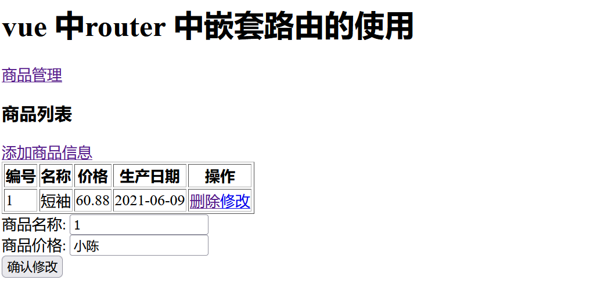

## Vue实战笔记（二）


## 13、es6的新特性

**1、变量声明  var 、let 、 const**

- var 作用: 使用这个关键字声明变量是全局变量，容易出现变量混淆。
- let 作用:  用来声明一个局部变量 。作用范围：从定义开始，到新定义的代码块结束 。 [推荐使用]
- const 作用：用来定义一个常量 。作用：变量一旦被定义不能被修改 。特殊说明：修饰number、字符串时变量的值不能修改， 修饰对象的时候对象的地址不能修改。

```javascript
<script >
     function test(){
        for(let i = 0; i < 10; i++){
            console.log("function inner:",i);
        }
        //console.log("function out:",i);
        const name = "xiaochen"; //常量

        const user = {name:"小三"}; //const 修饰对象，对象地址不能改变 对象中的属性可以随意修改
        console.log(user.name);
        user.name = "小明";
        console.log(user.name);
    }
    test(); //调用函数
</script>
```

**2、字符串模板  通过反引号使用字符串模板**

```javascript
    let html = "<div>\n"+
                    "<h1>我是标签</h1>\n"+
                    "<input type=\"text\" name=\"name\">\n"+
                    " <button>我是按钮</button>\n"+
                "</div>\n";

     let html1 = `<div>
                    <h1>我是标签</h1>
                    <input type="text" name="name">
                    <button>我是按钮</button>
                </div>`;
     console.log(html);
     console.log(html1);
```

**3、es6 function(){}**

匿名函数自己存在自己`this`，简化写法为`()=>`(箭头函数) ,  箭头函数没有自己`this`。 

**4、对象定义方式**

`es5`对象定义方式: 

```javascript
let name = "小陈";
let age = 23;
let bir = "2012-12-12";
const user = {name:name,age:age,bir:bir} ; //es5
console.log(user);
```

`es6`中对象的扩展：当对象属性名和属性赋值名一致时，可以省略变量名不写。

```javascript
let name = "小陈";
let age = 23;
let bir = "2012-12-12";
const stu = {name,age,bir} ; //es6
console.log(stu);
```


## 14、 Vue中组件(component)

### **14.1、Vue标准开发模式**

**1、vue推荐开发方式是sPA : Single Page (Web)Application  （单页面应用）**

- vue推荐开发方式是基于单页面应用单页面web应用

**2、什么是sPA单页面应用**

- 单页面应用:就是日后项目中只有一张页面

**3、为什么vue推荐开发方式sPA的开发方式?**

1. 引入vue js文件
2. 在现有页面中创建vue实例对象一个页面中只能存在一个vue实例一个。

==vue推荐开发方式要求:一个应用中只能存在一个vue实例== 

**4、使用现有手段严格遵循sPA存在问题?**

1. 现有开发方式导致项目中唯一一个页面中代码越来越多不利后续维护

2. 现有开发方式导致项目中唯一一个页面中完成全部业务功能,导致当前页面每次加载速度非常慢

**5、为了严格遵循sPa开发方式在vue中提供了vue组件component** 

**组件:**

1. 组件减少vue根实例代码量
2. 一个组负贲完成项目中一个功能或者一组功实现业务功能隔离
3. 组件还可以在vue实现复用

### 14.2、 组件作用

组件作用: 用来减少Vue实例对象中代码量,日后在使用Vue开发过程中,可以根据 不同业务功能将页面中划分不同的多个组件,然后由多个组件去完成整个页面的布局,便于日后使用Vue进行开发时页面管理,方便开发人员维护。组件还可以实现共享和复用。

### 14.3 、组件使用

#### 14.3.1 、全局组件注册

> 说明:全局组件注册给Vue实例,日后可以在任意Vue实例的范围内使用该组件

```js
//1.开发全局组件
<script>
    //开发全局组件
    //参数1. 组件名称     参数2：指定组件内容的配置对象
    Vue.component('login',{
       template:"<div><h3>用户登录组件</h3></div>", //template:模板 用来书写组件中html代码 注意：template属性必须存在一个根容器，有且只有一个根容器
    });

    Vue.component('register',{
        template: "<div><h3>用户注册组件</h3></div>"
    });
    const app = new Vue({
        el: "#app",
        data:{
        },
        methods:{
        },
        computed:{
        }
    });
</script>
//2.使用全局组件  在Vue实例范围内
<div id="app">
    <!--使用全局组件：根据组件名称使用全局组件-->
    <login></login>
	<register></register>
</div>
```

```markdown
# 注意:
 - 1.Vue.component用来开发全局组件 参数1: 组件的名称  参数2: 组件配置{}  template:''用来书写组件的html代码  template中必须有且只有一个root元素
 - 2.使用时需要在Vue的作用范围内根据组件名使用全局组件
 - 3.如果在注册组件过程中使用 驼峰命名组件的方式 在使用组件时 必须将驼峰的所有单词小写加入-线进行使用
```

#### 14.3.2 、局部组件注册

> 说明:通过将组件注册给对应Vue实例中一个components属性来完成组件注册,这种方式不会对Vue实例造成累加

- 第一种开发方式

```js
//局部组件登录模板声明
//定义登录组件配置对象
const login = {  //定义一个登录组件
    template:"<div><h3>用户登录局部组件</h3></div>"
}
const app = new Vue({
    el: "#app",
    data:{
    },
    methods:{
    },
    computed:{
    },
    components:{ //在这里注册组件都为局部组件
        login,   //es5 login:login  es6 login,
        register:{
            template:"<div><h3>用户注册局部组件</h3></div>"
        }
    }
});
//局部组件使用 在Vue实例范围内
<login></login>
<register></register>
```

- 第二种开发方式

```js
//1.声明局部组件模板  template 标签 注意:在Vue实例作用范围外声明
    <template id="loginTemplate">
        <div>
            <h3>用户登录局部组件</h3>
            <input type="text">
        </div>
    </template>

//2.定义变量用来保存模板配置对象
    //定义登录组件配置对象
    const login = {  //定义一个登录组件
        template:"#loginTemplate"
    };

//3.注册组件	
    const app = new Vue({
        el: "#app",
        data:{
        },
        methods:{
        },
        computed:{
        },
        components:{ //在这里注册组件都为局部组件
            login,   //注册登录组件
        }
    });
 //4.局部组件使用 在Vue实例范围内
	<login></login>
```

### 14.4、Prop的使用

**作用:props用来给组件传递相应静态数据或者是动态数据的** 

#### 14.4.1、 通过在组件上声明静态数据传递给组件内部

```js
//1.声明组件模板配置对象
      const login = {
        template: "<div><h3>登录界面-{{title}}-{{count}}-{{age}}</h3></div>",
        data(){ //注意：在props中定义数据，不能在data中重复定义，如果重复定义，优先使用					props中数据为主
            return {
                loginTitle : this.title,
            };
        },
        props:['title','count','age'],  //props作用 用来接收使用组件时通过组件标签传递的数据
    };

//2.注册组件
// 如何实现父组件向子组件内部传递数据，并将数据在子组件中进行展示?注意：在vue中父组件向子组件传递数据可以使用 prop 属性完成数据传递
    const app = new Vue({
       el:"#app",
       data:{
           msg: "Vue 中组件开发",

       },
       methods:{},
       computed:{},
       components:{
            login, //注册组价
       }
    });

//3.通过组件完成数据传递
	<login title="欢迎访问我们的系统!!!" count="11" age="23"></login>
```

```markdown
# 总结:
			1.使用组件时可以在组件上定义多个属性以及对应数据
			2.在组件内部可以使用props数组生命多个定义在组件上的属性名 日后可以在组件中通过{{ 属性名 }} 方式获取组件中属性值
			3.在props中定义数据，不能在data中重复定义，如果重复定义，优先使用props中数据为主
```

#### 14.4.2、通过在组件上声明动态数据传递给组件内部

```js
//1.声明组件模板对象
    const login = {
        template: "<div><h3>登录界面-{{title}}</h3></div>",
        data(){
            return {
            };
        },
        props:['title'],  //props作用 用来接收使用组件时通过组件标签传递的数据
  	};
//2.注册局部组件
    const app = new Vue({
           el:"#app",
           data:{
               msg: "Vue 中组件开发",
               name:"小李",
           },
           methods:{},
           computed:{},
           components:{
                login, //注册组价
           }
        });

//3.使用组件
	  <login :title="name"></login>  //使用v-bind形式将数据绑定Vue实例中data属性,日后data属性发生变化,组件内部数据跟着变化
```

#### 14.4.3、prop的单向数据流

> 单向数据流:所有的 prop 都使得其父子 prop 之间形成了一个**单向下行绑定**：父级 prop 的更新会向下流动到子组件中，但是反过来则不行。

- 所有的 prop 都使得其父子 prop 之间形成了一个**单向下行绑定**：父级 prop 的更新会向下流动到子组件中，但是反过来则不行。这样会防止从子组件意外改变父级组件的状态，从而导致你的应用的数据流向难以理解。


- 额外的，每次父级组件发生更新时，子组件中所有的 prop 都将会刷新为最新的值。这意味着你**不**应该在一个子组件内部改变 prop。如果你这样做了，Vue 会在浏览器的控制台中发出警告。---摘自官网

### 14.5、组件中定义数据和事件使用

##### 1. 组件中定义属于组件的数据

```js
//定义局部用户列表组件配置对象
const users = {
    template:"<div><h3>用户列表-{{count}}-{{name}}</h3></div>", //用来定义组件html内容
    data(){     //用来给当前组件定义一系列数据 注意：在组件中定义的数据只能在当前组件中可用
        return {
            count:0,
            name:"小李",
        };
    }
};
```

##### 2.组件中事件定义

```js
//定义局部用户列表组件配置对象
const users = {
    template:"<div><h3>用户列表-{{count}}-{{name}}-{{countSqrt}}</h3><button @click='changeCount'>+</button><ul><li v-for='item in items'>{{item}}</li></ul></div>", //用来定义组件html内容
    data(){     //用来给当前组件定义一系列数据 注意：在组件中定义的数据只能在当前组件中可用
        return {
            count:0,
            name:"小李",
            //items:["山西","北京","天津"],
            items:[],
        };
    },
    methods:{   //用来给当前组件定义一系列事件
        changeCount(){
            this.count++;
        }
    },
    computed:{  //用来给当前组件定义一系列计算属性，用来对页面中结果进行二次计算处理时候
        countSqrt(){
            return this.count*this.count;
        }
    },
    created(){ //组件已经注入了data、methods、computed 相关数据方法
        //发送请求
        /*axios.get("/xxx").then(res=>{
                this.items = res.data;
            });*/
        this.items=["山西","北京","天津"];
    },
};
```

```markdown
# 总结	
		1.组件中定义事件和直接在Vue中定义事件基本一致 直接在组件内部对应的html代码上加入@事件名=函数名方式即可
		2.在组件内部使用methods属性用来定义对应的事件函数即可,事件函数中this 指向的是当前组件的实例
```

### 14.6、向子组件中传递事件并在子组件中调用该事件

**在子组件中调用传递过来的相关事件必须使用 this.$emit('函数名') 方式调用** 

```js
<!DOCTYPE html>
<html lang="en">
<head>
    <meta charset="UTF-8">
    <title>vue系列课程</title>
</head>
<body>
    <div id="app">
       <h1>信息：{{msg}} 年龄：{{age}}</h1>

       <login @aa="findAll" @test="test"></login>
    </div>
</body>
</html>
<script src="js/vue.js"></script>
<script src="js/axios.min.js"></script>
<script>
    //如何将父组件中事件传递给子组件中 1.在使用事件时使用@别名=“传递事件名”  2.在组件中调用传递的事件时 this.$emit('别名')

    //定义一个登录组件配置对象
    const login = {
        template: "<div><h3>用户登录-{{msg}}</h3><button @click='test'>点我触发事件</button></div>",
        data(){
            return {
                msg:"我是子组件的信息",
                age:23,
                user:{id:2,name:"小陈",age:23,bir:"2012-02-09"},
            };
        },
        methods:{
            test(){
                alert('子组件中定义的事件...');
                //调用父组件中findAll事件 aa 事件名：
               // this.$emit('aa');   //$emit用来调用父组件中相关事件
                this.$emit('test',this.msg,this.age,this.user);   //$emit用来调用父组件中相关事件,并传递参数
            }
        }
    };
    const app = new Vue({
       el:"#app",
       data:{
           msg: "Vue 中组件开发",
           age:23,
           user:{id:1,name:"小吴",age:12},
       },
       methods:{
           findAll(){
               alert('父组件中定义的事件...');
           },
           test(msg,age,user) {
               alert('父组件中定义test的事件....'+msg);
               console.log("msg:",msg);
               console.log("age",age);
               console.log("user",user);
               this.msg = msg;
               this.age = age;
           }
       },
       computed:{},
       components:{
            login, //注册组件
       }
    });
</script>
```

-----

### 14.7、插槽的使用

**怎么理解插槽？**

- slot相当于一个空标签，通过vue可以实现动态改变值和样式，把一块区域内容抽了出来可以实现复用，就和Java里封装的工具类一样。

- 插槽就是子组件中的提供给父组件使用的一个占位符。

- 我们在构建页面过程中一般会把用的比较多的公共的部分抽取出来作为一个单独的组件，但是在实际使用这个组件的时候却又不能完全的满足需求，我希望在这个组件中添加一点东西，这时候我们就需要用到插槽来分发内容。

- 通俗易懂的讲，slot具有“占坑”的作用，在子组件占好了位置，那父组件使用该子组件标签时，新添加的DOM元素就会自动填到这个坑里面

```js
<!DOCTYPE html>
<html lang="en">
<head>
    <meta charset="UTF-8">
    <title>vue系列课程</title>
</head>
<body>
    <div id="app">
       <h1>{{msg}}</h1>
        <!--vue使用组件-->
       <login><h5 slot="aa">我是用户自定义aa内容</h5><h5 slot="bb">我是用户自定义bb内容</h5></login>
        <hr>
        <login><button>+++</button></login>
        <hr>
        <login></login>
        <hr>
    </div>
</body>
</html>
<script src="js/vue.js"></script>
<script src="js/axios.min.js"></script>
<script>

    //slot：插槽   作用：用来扩展自定义组件让组件变得更加灵活，用来个性化定制自己的组件  注意：插槽必须配合组件才能使用
    const login = {
        template: "<div><slot name='aa'><span>默认扩展</span></slot><h3>用户登录界面</h3><slot name='bb'><span>默认扩展</span></slot></div>",
    };
    const app = new Vue({
       el:"#app",
       data:{
           msg:"slot 插槽的使用"
       },
       methods:{
       },
       computed:{},
       components: {
           login,
       },
    });
</script>
```

## 15、Vue中路由 (Vue Router)

### 15.1、路由

**路由:根据请求的路径按照一定的路由规则进行请求的转发从而帮助我们实现统一请求的管理** 

### 15.2、作用

>  用来在vue中实现组件之间的动态切换

### 15.3、使用路由

**1、引入路由**

```js
<!--cdn方式-->
<script src="https://cdn.jsdelivr.net/npm/vue/dist/vue.js"></script>
<script src="https://unpkg.com/vue-router/dist/vue-router.js"></script>  //vue 路由js
<!--本地引入-->
<script src="js/vue-router.js"></script>
```

**2、创建组件对象**

```js
//创建组件配置对象
const users = {
    template:"<div><h3>用户管理</h3></div>"
};

const emps = {
    template: "<div><h3>员工管理</h3></div>"
}
```

**3、定义路由对象的规则**

```js
const router = new VueRouter({
    routes:[
        {path:'/users',component:users}, //用来定义具体得的某个组件路由规则 path:用来指定对应请求路径 component:指定路径对应的组件
        {path:'/emps', component:emps }  //用来定义一些规则
    ]
});
```

**4、将路由对象注册到vue实例**

```js
const app = new Vue({
    el:"#app",
    data:{
        msg:"vue 中router(路由)的使用",
    },
    methods:{},
    computed:{},
    components:{},  //注册局部组件
    router:router,  //用来注册路由配置
});
```

**5、在页面中显示路由的组件**

```html
<!--指定路由组件在哪里展示 router-view 标签：作用：用来展示路由对应组件显示的位置-->
<router-view></router-view>
```

**5、根据链接切换路由**

```html
<a href="#/users">用户管理</a>
<a href="#/emps">员工管理</a>
```

### 15.4、router-link使用

**作用:**用来替换我们在切换路由时使用a标签切换路由

**好处:**就是可以自动给路由路径加入#不需要手动加入 

```html
<!--router-link 标签： 作用：用来替换a标签 好处：书写路径时不需要显示加入# to: 用来指定路由路径 tag：默认为a标签 用来指定router-link底层渲染标签-->
<router-link to="/users" tag="a">用户管理(link)</router-link>
<router-link to="/emps"  tag="a">员工管理(link)</router-link>
```

```markdown
# 总结:
	1.router-link 用来替换使用a标签实现路由切换 好处是不需要书写#号直接书写路由路径
	2.router-link to属性用来书写路由路径   tag属性:用来将router-link渲染成指定的标签
```

### 15.5、默认路由

**作用:**用来在第一次进入界面是显示一个默认的组件 

```js
const router = new VueRouter({
    routes:[
        //{ path:'/',component:login},
        {path:'/',redirect:'users' },     //默认路由规则 redirect:(路由路径重定向)
        {path:'/users',component:users},  //用户组件路由规则
        {path:'/emps', component:emps }   //员工组件路由规则
    ]
});
```

### 15.6、路由动态切换两种方式

**方式一：通过使用标签方式直接进行路由切换**

```js
<!--1.通过使用标签方式直接进行路由切换-->
<a href="#/users">用户管理</a>
<a href="#/emps">员工管理</a>
<router-link to="/users" tag="a">用户管理(link)</router-link>
<router-link to="/emps"  tag="a">员工管理(link)</router-link>
```

**方式二：通过js代码的方式进行动态切换路由**

```js

<!--2.通过js代码的方式进行动态切换路由 this.router.push("切换的路由路径")-->
<button @click="test">测试动态路由</button>

const app = new Vue({
    el:"#app",
    data:{
        msg:"vue 中router(路由)的使用 route-link标签的使用",
    },
    methods:{
        test(){
            console.log("test");
            //this.$router.push("/emps"); //代表切换路由路径
            //this.$router.push({path:'/emps'}); //切换路由
            this.$router.push({name:"emps"}); //名称方式切换路由        [推荐]
        },
    },
    computed:{},
    components:{},  //注册局部组件
    router,     //注册路由
});
```

### 15.7、路由中参数传递

**第一种方式传递参数 传统方式**

1、通过?号形式拼接参数

```js
<!--1.获取？后传递参数 this.route.query.key.?后面参数key-->
<router-link to="/users?deptid=21name=李四">用户管理</router-link>
```

2、组件中获取参数

```js
const users = {
    template:"<div><h1>用户管理</h1></div>",
    data(){
        return {};
    },
    methods: {},
    created(){
        //获取路由路径中参数 1.获取queryString(deptid=21)中传递参数
        //this.$route 当前路由对象
        //this.$router 路由管理器对象
        console.log("deptid:",this.$route.query.deptid);
        console.log("name:",this.$route.query.name);
    }
};
```

**第二种方式传递参数 restful**

1、通过使用路径方式传递参数

```js
<!--2.获取路由路径中参数 rest 方式参数获取  this.$route.params.路径中别名-->
<router-link to="/emps/11/王五">员工管理</router-link>
const router = new VueRouter({
    routes:[      
        {path:'/emps/:id/:name', name:'emps',component:emps }   //员工组件路由规则
    ]
});
```

2、组件中获取参数

```js
const emps = {
    template: "<div><h1>员工管理</h1></div>",
    data(){
        return {};
    },
    methods: {},
    created() {
        console.log("id:",this.$route.params.id); //获取路径中的参数
        console.log("name:",this.$route.params.name); //获取路径中的参数
    }
}
```

**完整代码**

```js
<!DOCTYPE html>
<html lang="en">
<head>
    <meta charset="UTF-8">
    <title>vue系列课程</title>
</head>
<body>
    <div id="app">
        <h1>{{msg}}</h1>

        <!--切换路由-->
        <!--1.获取？后传递参数 this.route.query.key.?后面参数key-->
        <router-link to="/users?deptid=21name=李四">用户管理</router-link>
        <!--2.获取路由路径中参数 rest 方式参数获取  this.$route.params.路径中别名-->
        <router-link to="/emps/11/王五">员工管理</router-link>

        <!--router-view 显示路由组件-->
        <router-view></router-view>

    </div>
</body>
</html>
<script src="js/vue.js"></script>
<script src="js/axios.min.js"></script>
<script src="js/vue-router.js"></script>
<script>

    //创建组件配置对象
    const users = {
        template:"<div><h1>用户管理</h1></div>",
        data(){
            return {};
        },
        methods: {},
        created(){
            //获取路由路径中参数 1.获取queryString(deptid=21)中传递参数
            //this.$route 当前路由对象
            //this.$router 路由管理器对象
            console.log("deptid:",this.$route.query.deptid);
            console.log("name:",this.$route.query.name);
        }
    };

    const emps = {
        template: "<div><h1>员工管理</h1></div>",
        data(){
            return {};
        },
        methods: {},
        created() {
            console.log("id:",this.$route.params.id); //获取路径中的参数
            console.log("name:",this.$route.params.name); //获取路径中的参数
        }
    }

    //创建路由对象并定义路由规则
    const router = new VueRouter({
        routes:[
            {path:'/',redirect:'users' },     //默认路由规则 redirect:(路由路径重定向)
            {path:'/users',name:'users',component:users},  //用户组件路由规则   name:路由名称 必须唯一
            {path:'/emps/:id/:name', name:'emps',component:emps }   //员工组件路由规则
        ]
    });

    const app = new Vue({
       el:"#app",
       data:{
           msg:"vue 中router(路由)的使用 route-link标签的使用",
       },
       methods:{

       },
       computed:{},
       components:{},  //注册局部组件
       router,     //注册路由
    });
</script>
```

### 15.8、嵌套路由

**1、声明最外层和内层路由**

```js
<template id="product">
    <div>
        <h1>商品管理</h1>

        <router-link to="/product/add">商品添加</router-link>
        <router-link to="/product/edit">商品编辑</router-link>

        <router-view></router-view>

    </div>
</template>

//声明组件模板
const product={
  template:'#product'
};

const add = {
  template:'<h4>商品添加</h4>'
};

const edit = {
  template:'<h4>商品编辑</h4>'
};
```

**2、创建路由对象含有嵌套路由**

```js
const router = new VueRouter({
        routes:[
            {
                path:'/product',
                component:product,
                children:[
                    {path:'add',component: add},
                    {path:'edit',component: edit},
                ]
            },
        ]
    });
```

**3、注册路由对象**

```js
const app = new Vue({
    el: "#app",
    data: {},
    methods: {},
    router,//定义路由对象
});
```

**4、测试路由**

```html
<router-link to="/product">商品管理</router-link>
<router-view></router-view>
```

---

**案例练习：**

```js
<!DOCTYPE html>
<html lang="en">
<head>
    <meta charset="UTF-8">
    <title>vue系列课程</title>
</head>
<body>
    <div id="app">
        <h1>{{msg}}</h1>

        <!--路由链接-->
        <router-link to="/products">商品管理</router-link>
        <!--显示路由组件-->
        <router-view></router-view>
    </div>
</body>
</html>
<template id="productsTemplate">
    <div>
        <div><h3>商品列表</h3></div>
        <a href="#/products/add">添加商品信息</a>
        <table border="1">
            <tr>
                <th>编号</th>
                <th>名称</th>
                <th>价格</th>
                <th>生产日期</th>
                <th>操作</th>
            </tr>
            <tr>
                <td>1</td>
                <td>短袖</td>
                <td>60.88</td>
                <td>2021-06-09</td>
                <!--<th><a href="">删除</a><a href="#/products/edit">修改</a></th>-->
                <td><a href="">删除</a><a href="javascript:;" @click.prevent="editRow({id:1,name:'小陈'})">修改</a></td>
            </tr>
        </table>
        <!--router-view 用来展示子路由组件-->
        <router-view></router-view>
    </div>

</template>
<script src="js/vue.js"></script>
<script src="js/axios.min.js"></script>
<script src="js/vue-router.js"></script>
<script>

    //创建组件配置对象
    const products = {
        template:"#productsTemplate",
        data(){
            return {};
        },
        methods:{
            editRow(user){
                console.log(user);
                this.$router.push({path:'/products/edit',query:user}); //切换路由路径 通过query(?)
            }
        }
    };

    //创建添加商品信息子组件
    const add = {
        template: "<div from action=''>商品名称: <input type='text'><br>商品价格: <input type='text'><br> <input type='button' value='保存商品'></div>"
    }

    const edit = {
        template: "<div from action=''>商品名称: <input type='text' v-model='user.id'><br>商品价格: <input type='text' v-model='user.name'><br> <input type='button' value='确认修改'></div>",
        data() {
            return {
                user:{},
            };
        },
        methods:{},
        created(){
            console.log("edit: ",this.$route.query);
            this.user = this.$route.query;
        }
    }
    //创建路由对象
    const router = new VueRouter({
        routes:[
            {path:'/',redirect:'/products' },  //默认路由
            {
                path:'/products',
                name:'products',
                component:products,
                children:[ //定义子路由 注意：子路由的path属性不能使用'/'开头
                    {path:"add",component:add},
                    {path:"edit",component:edit},
                ]
            },

        ]
    });

    const app = new Vue({
       el:"#app",
       data:{
           msg:"vue 中router 中嵌套路由的使用",
       },
       methods:{},
       computed:{},
       components:{
           products,
       },
       router,  //注册路由
    });
</script>
```

**运行截图：**

  

