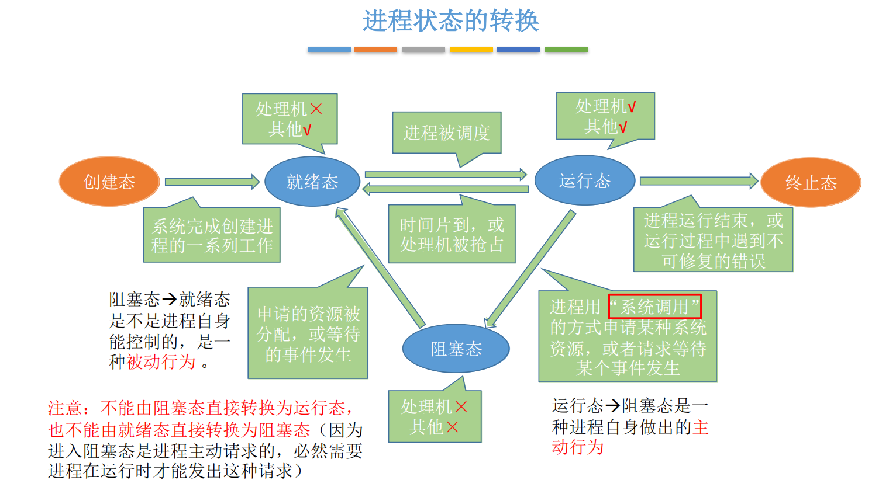
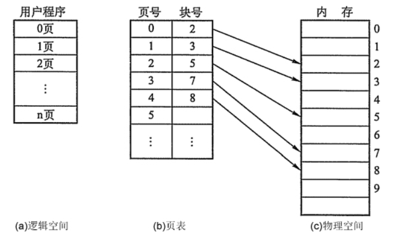
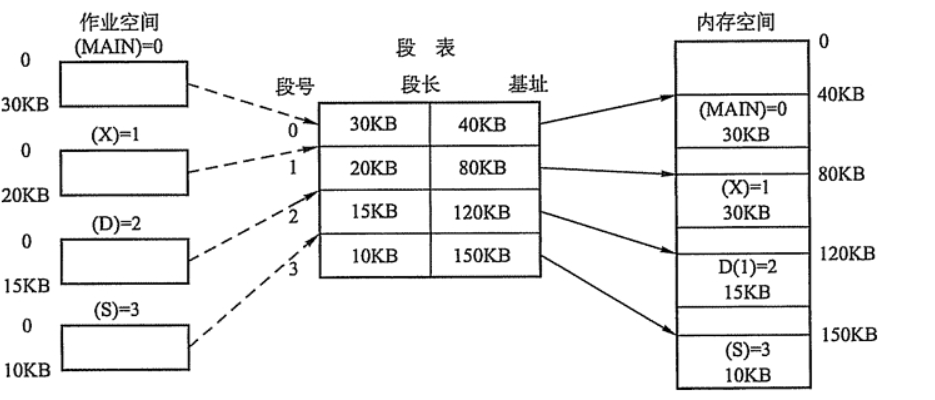
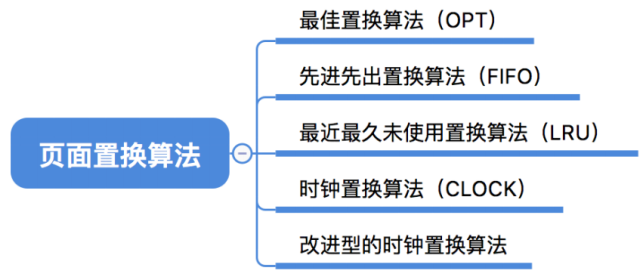

## 操作系统

### 1、什么是操作系统

- 操作系统简称OS，负责管理协调计算机硬件与软件资源工作的系统软件。
- 屏蔽了硬件层的复杂性，为上层应用软件与用户提供易用的服务。

### 2、什么是系统调用？

操作系统提供给应用程序（程序员/编程人员）使用的接口，可以以此获得操作系统内核的服务。

**用户态切换到内核态的几种方式**

- 系统调用、硬件设备中断信号；
- 异常:  发生异常，切换到处理该异常的内核程序中。

### 3、进程和线程的区别？

**进程**：一个正在运行中的程序就是一个进程，进程包括程序段、数据段、PCB三部分。

- 程序段就是程序的代码；
- 数据段就是程序运行时产生的数据（比如全局变量、局部变量等)；
- PCB中包含操作系统对其进行管理的各种信息（如进程标识符PID，进程当前状态，进程优先级。

**线程**：线程是属于进程的，是一个基本的 CPU 执行单元，是程序执行流的最小单元。

**主要区别如下：** 

- 调度：进程是资源分配的基本单位，线程是程序执行的基本单位。
- 开销：线程上下文切换开销小，进程线程间切换开销大。
- 切换:   同一进程间线程切换不会引起进程切换，不同进程间线程切换会引起进程切换
- 拥有资源： 进程是拥有资源的一个独立单位，线程不拥有系统资源，但是可以访问隶属于进程的资源。
- 通信:  线程间可以通过直接读写同一进程中的数据进行通信，但是进程通信需要借助系统内核的帮助。

### 4、线程切换开销为啥比进程小

1、线程切换不需要更换页表，而进程切换需要。页表切换会导致缓存失效，所以在进行地址转化的时候需要重新去查找页表，这就造成了程序运行的效率低下。

2、进程切换需要切换上下环境比线程上下文环境大，需要保存现场，切换，然后在恢复现场。

进程上下文环境:  程序计数器，通用寄存器、数据、用户栈、页表、pcb等

### 5、协程与线程的区别？

协程是一种**用户态的**，不被操作系统内核所管理，**完全由用户控制**的，**比线程更小的一种执行单元**，可以认为是轻量级的线程。

**区别如下：**

- 线程和进程都是同步机制，而协程是异步机制。
- 线程是抢占式，而协程是非抢占式的。需要用户释放使用权切换到其他协程，因此同一时间其实只有一个协程拥有运行权，相当于单线程的能力。
- 一个线程可以有多个协程，一个进程也可以有多个协程。
- 协程不被操作系统内核管理，而完全是由程序控制。线程是被分割的CPU资源，协程是组织好的代码流程，线程是协程的资源。但协程不会直接使用线程，协程直接利用的是执行器关联任意线程或线程池。
- 协程能保留上一次调用时的状态。

### 6、并发和并行有什么区别？

* 并行：在同一时刻，有多个指令在多个 CPU 上同时执行
* 并发：在同一时刻，有多个指令在单个 CPU 上交替执行

### 7、进程与线程的切换流程？

进程切换分两步：

- 1、切换**页表**以使用新的地址空间，一旦去切换上下文，处理器中所有已经缓存的内存地址一瞬间都作废了。

- 2、切换内核栈和硬件上下文。

对线程来说：

- 切换内核栈和硬件上下文。

对于linux来说，线程和进程的最大区别就在于地址空间，对于线程切换，第1步是不需要做的，第2步是进程和线程切换都要做的。

因为每个进程都有自己的虚拟地址空间，而线程是共享所在进程的虚拟地址空间的，因此同一个进程中的线程进行线程切换时不涉及虚拟地址空间的转换。

### 8、为什么虚拟地址空间切换会比较耗时？

进程都有自己的虚拟地址空间，把虚拟地址转换为物理地址需要查找页表，页表查找是一个很慢的过程，因此通常使用Cache来缓存常用的地址映射，这样可以加速页表查找，这个Cache就是TLB（本质是一个缓存，是用来加速页表查找的）

由于每个进程都有自己的虚拟地址空间，那么显然每个进程都有自己的页表，那么**当进程切换后页表也要进行切换，页表切换后TLB就失效了**，Cache失效导致命中率降低，那么虚拟地址转换为物理地址就会变慢，表现出来的就是程序运行会变慢，而线程切换则不会导致TLB失效，因为线程无需切换地址空间，因此我们通常说线程切换要比较进程切换块，原因就在这里。

### 9、进程间通信方式有哪些？

管道：管道这种通讯方式有两种限制，一是半双工的通信，数据只能单向流动，二是只能在具有亲缘关系的进程间使用。进程的亲缘关系通常是指父子进程关系。

管道可以分为两类：匿名管道和命名管道。匿名管道是单向的，只能在有亲缘关系的进程间通信；命名管道以磁盘文件的方式存在，可以实现本机任意两个进程通信。

信号 ： 信号是一种比较复杂的通信方式，信号可以在任何时候发给某一进程，而无需知道该进程的状态。

信号量：信号量是一个**计数器**，可以用来控制多个进程对共享资源的访问。它常作为一种**锁机制**，防止某进程正在访问共享资源时，其他进程也访问该资源。因此，主要作为进程间以及同一进程内不同线程之间的同步手段。

消息队列：消息队列是消息的链接表，包括Posix消息队列和System V消息队列。有足够权限的进程可以向队列中添加消息，被赋予读权限的进程则可以读走队列中的消息。消息队列克服了信号承载信息量少，管道只能承载无格式字节流以及缓冲区大小受限等缺点。

共享内存：共享内存就是映射一段能被其他进程所访问的内存，这段共享内存由一个进程创建，但多个进程都可以访问。共享内存是最快的 IPC 方式，它是针对其他进程间通信方式运行效率低而专门设计的。它往往与其他通信机制，如信号量，配合使用，来实现进程间的同步和通信。

Socket：与其他通信机制不同的是，它可用于不同机器间的进程通信。

**优缺点**：

- 管道：速度慢，容量有限；
- Socket：任何进程间都能通讯，但速度慢；
- 消息队列：容量受到系统限制，且要注意第一次读的时候，要考虑上一次没有读完数据的问题；
- 信号量：不能传递复杂消息，只能用来同步；
- 共享内存区：能够很容易控制容量，速度快，但要保持同步，比如一个进程在写的时候，另一个进程要注意读写的问题，相当于线程中的线程安全，当然，共享内存区同样可以用作线程间通讯，不过没这个必要，线程间本来就已经共享了同一进程内的一块内存。

### 10、线程同步的方式有哪些？

1、临界区：当多个线程访问一个独占性共享资源时，可以使用临界区对象。拥有临界区的线程可以访问被保护起来的资源或代码段，其他线程若想访问，则被挂起，直到拥有临界区的线程放弃临界区为止，以此达到用原子方式操 作共享资源的目的。

2、事件：事件机制，则允许一个线程在处理完一个任务后，主动唤醒另外一个线程执行任务。

3、互斥量：互斥对象和临界区对象非常相似，只是其允许在进程间使用，而临界区只限制与同一进程的各个线程之间使用，但是更节省资源，更有效率。

4、信号量：当需要一个计数器来限制可以使用某共享资源的线程数目时，可以使用“信号量”对象。

区别：

- 互斥量与临界区的作用非常相似，但互斥量是可以命名的，也就是说互斥量可以跨越进程使用，但创建互斥量需要的资源更多，所以如果只为了在进程内部是用的话使用临界区会带来速度上的优势并能够减少资源占用量 。因为互斥量是跨进程的互斥量一旦被创建，就可以通过名字打开它。
- 互斥量，信号量，事件都可以被跨越进程使用来进行同步数据操作。

### 11、线程的分类？

从线程的运行空间来说，分为用户级线程（user-level thread, ULT）和内核级线程（kernel-level, KLT）

**内核级线程**：这类线程依赖于内核，又称为内核支持的线程或轻量级进程。无论是在用户程序中的线程还是系统进程中的线程，它们的创建、撤销和切换都由内核实现。比如英特尔i5-8250U是4核8线程，这里的线程就是内核级线程

**用户级线程**：它仅存在于用户级中，这种线程是**不依赖于操作系统核心**的。应用进程利用**线程库来完成其创建和管理**，速度比较快，**操作系统内核无法感知用户级线程的存在**。

### 12、什么是临界区，如何解决冲突？

每个进程中访问临界资源的那段程序称为临界区，**一次仅允许一个进程使用的资源称为临界资源。**

解决冲突的办法：

- 如果有若干进程要求进入空闲的临界区，**一次仅允许一个进程进入**，如已有进程进入自己的临界区，则其它所有试图进入临界区的进程必须等待；
- 进入临界区的进程要在**有限时间内退出**。
- 如果进程不能进入自己的临界区，则应**让出CPU**，避免进程出现“忙等”现象。

### 13、 什么是死锁？死锁产生的条件？

**什么是死锁**：

在两个或者多个并发进程中，如果每个进程持有某种资源而又等待其它进程释放它或它们现在保持着的资源，在未改变这种状态之前都不能向前推进，称这一组进程产生了死锁。通俗的讲就是两个或多个进程无限期的阻塞、相互等待的一种状态。

**死锁产生的四个必要条件**：（有一个条件不成立，则不会产生死锁）

- 互斥条件：一个资源一次只能被一个进程使用
- 请求与保持条件：一个进程因请求资源而阻塞时，对已获得资源保持不放
- 不剥夺条件：进程获得的资源，在未完全使用完之前，不能强行剥夺
- 循环等待条件：若干进程之间形成一种头尾相接的环形等待资源关系

### 14、如何检测死锁？

- 1、jps、ps、任务管理器获取进程ID；
- 2、jstack pid获取进程中线程堆栈信息（区分线程状态->查看等待目标->对比 Monitor等持有状态)
- 3、jconsole、Jvisualvm排查死锁问题(java监视管理平台)

### 15、如何解决线程死锁？

只要破坏产生死锁的四个条件中的其中一个就可以了

- **破坏互斥条件 ：**这个条件我们没有办法破坏，因为我们用锁本来就是想让他们互斥的（临界资源需要互斥访问）
- **破坏请求与保持条件：**  一次性申请所有的资源。
- **破坏不剥夺条件：**  占用部分资源的线程进一步申请其他资源时，如果申请不到，可以主动释放它占有的资源。
- **破坏循环等待条件：**  靠按序申请资源来预防。按某一顺序申请资源，释放资源则反序释放。
- **锁排序法：**（必须回答出来的点）  指定获取锁的顺序，比如某个线程只有获得A锁和B锁，才能对某资源进行操作，在多线程条件下，如何避免死锁？  通过指定锁的获取顺序，比如规定，只有获得A锁的线程才有资格获取B锁，按顺序获取锁就可以避免死锁。这通常被认为是解决死锁很好的一种方法。
- 使用显式锁中的ReentrantLock.try(long,TimeUnit)来申请锁

### 16、进程调度策略有哪几种？

- **先来先服务**：非抢占式的调度算法，按照请求的顺序进行调度。有利于长作业，但不利于短作业，因为短作业必须一直等待前面的长作业执行完毕才能执行，而长作业又需要执行很长时间，造成了短作业等待时间过长。另外，对`I/O`密集型进程也不利，因为这种进程每次进行`I/O`操作之后又得重新排队。

- **短作业优先**：非抢占式的调度算法，按估计运行时间最短的顺序进行调度。长作业有可能会饿死，处于一直等待短作业执行完毕的状态。因为如果一直有短作业到来，那么长作业永远得不到调度。

- **最短剩余时间优先**：最短作业优先的抢占式版本，按剩余运行时间的顺序进行调度。 当一个新的作业到达时，其整个运行时间与当前进程的剩余时间作比较。如果新的进程需要的时间更少，则挂起当前进程，运行新的进程。否则新的进程等待。

- **时间片轮转**：将所有就绪进程按 `FCFS` 的原则排成一个队列，每次调度时，把 `CPU` 时间分配给队首进程，该进程可以执行一个时间片。当时间片用完时，由计时器发出时钟中断，调度程序便停止该进程的执行，并将它送往就绪队列的末尾，同时继续把 `CPU` 时间分配给队首的进程。

  时间片轮转算法的效率和时间片的大小有很大关系：因为进程切换都要保存进程的信息并且载入新进程的信息，如果时间片太小，会导致进程切换得太频繁，在进程切换上就会花过多时间。 而如果时间片过长，那么实时性就不能得到保证。 

- **优先级调度**：为每个进程分配一个优先级，按优先级进行调度。为了防止低优先级的进程永远等不到调度，可以随着时间的推移增加等待进程的优先级。

### 17、进程有哪些状态？

进程一共有`5`种状态，分别是创建、就绪、运行（执行）、终止、阻塞。 

- 创建态：进程正在被创建，操作系统为进程分配资源、初始化PCB。
- 终止态：进程正在从系统中撤销，操作系统会回收进程拥有的资源、撤销PCB。
- 运行态：占有CPU，并在CPU上运行。
- 就绪态：已经具备运行条件，但由于没有空闲CPU，而暂时不能运行。
- 阻塞态：因等待某一事件而暂时不能运行，如：等待操作系统分配打印机、等待读磁盘操作的结果。

**进程状态的转换：** 

**创建态→就绪态**：系统完成创建进程的系列工作，但是还未获得CPU资源。

**就绪态→运行态**：系统按某种策略选中就绪队列中的一个进程占用处理器，此时就变成了运行态。

**运行态→就绪态**：不是由于自身原因，而是由外界原因使运行状态的进程让出处理器，这时候就变成就绪态。例如时间片用完，或有更高优先级的进程来抢占处理器等。

**运行态→阻塞态**：进程用“系统调用”的方式申请某种系统资源,或者请求等待某个事件发生。

**阻塞态→就绪态**：则是等待的条件已满足，只需分配到处理器后就能运行。

### 18、内存管理机制

**块式管理**：将内存分为一个个块，一个块包含一个进程

**页式管理**：将内存空间分为一个个大小相等的分区，每个分区就是一个页框，然后将进程的逻辑地址分页存储在页框中，通过页表对应逻辑地址和物理地址

**段式管理**：内存被划分为若干个段，按段存储

**段页式管理**：把主存先分成若干段，每个段又分成若干页。

### 19、什么是分页？

把内存空间划分为**大小相等且固定的块**，作为主存的基本单位。因为程序数据存储在不同的页面中，而页面又离散的分布在内存中，**因此需要一个页表来记录映射关系，以实现从页号到物理块号的映射。**

访问分页系统中内存数据需要**两次的内存访问** (一次是从内存中访问页表，从中找到指定的物理块号，加上页内偏移得到实际物理地址；第二次就是根据第一次得到的物理地址访问内存取出数据)。

### 20、什么是分段？

**分页是为了提高内存利用率，而分段是为了满足程序员在编写代码的时候的一些逻辑需求(比如数据共享，数据保护，动态链接等)。**

分段内存管理当中，**地址是二维的，一维是段号，二维是段内地址；其中每个段的长度是不一样的，而且每个段内部都是从0开始编址的**。由于分段管理中，每个段内部是连续内存分配，但是段和段之间是离散分配的，因此也存在一个逻辑地址到物理地址的映射关系，相应的就是段表机制。

### 21、分页机制与分段机制异同

**共同点:**

- 1、分页机制和分段机制都是为了提高内存利用率，减少内存碎片。
- 2、页和段都是离散存储的，所以两者都是离散分配内存的方式。但是，每个页和段中的内存是连续的。

**区别：**

- 1、分页对用户不可见，分段对用户可见
- 2、分页地址空间一维，分段地址空间二维。分段更容易实现信息的共享与保护
- 3、分段会产生外部碎片;分页内存利用率更高，不会产生外部碎片
- 4、页的大小是固定的，由操作系统决定;而段的大小不固定，取决于我们当前运行的程序

### 22、讲一讲IO多路复用？

**IO多路复用是指内核一旦发现进程指定的一个或者多个IO条件准备读取，它就通知该进程。IO多路复用适用如下场合**：

- 当客户处理多个描述字时（一般是交互式输入和网络套接口），必须使用I/O复用。
- 当一个客户同时处理多个套接口时，而这种情况是可能的，但很少出现。
- 如果一个TCP服务器既要处理监听套接口，又要处理已连接套接口，一般也要用到I/O复用。
- 如果一个服务器即要处理TCP，又要处理UDP，一般要使用I/O复用。
- 如果一个服务器要处理多个服务或多个协议，一般要使用I/O复用。
- 与多进程和多线程技术相比，I/O多路复用技术的最大优势是系统开销小，系统不必创建进程/线程，也不必维护这些进程/线程，从而大大减小了系统的开销。

### 23、什么是用户态和内核态？

用户态和系统态是操作系统的两种运行状态：

- 内核态：内核态运行的程序可以访问计算机的任何数据和资源，不受限制，包括外围设备，比如网卡、硬盘等。处于内核态的 CPU 可以从一个程序切换到另外一个程序，并且占用 CPU 不会发生抢占情况。
- 用户态：用户态运行的程序只能受限地访问内存，只能直接读取用户程序的数据，并且不允许访问外围设备，用户态下的 CPU 不允许独占，也就是说 CPU 能够被其他程序获取。

### 24、 页面替换算法有哪些？

在程序运行过程中，如果要访问的页面不在内存中，就发生缺页中断从而将该页调入内存中。此时如果内存已无空闲空间，系统必须从内存中调出一个页面到磁盘对换区中来腾出空间。

**最佳置换算法（OPT，Optimal**）：每次选择淘汰的页面将是以后永不使用，或者在最长时间内不再被 访问的页面，这样可以保证最低的缺页率。

**先进先出置换算法（FIFO）**：每次选择淘汰的页面是最早进入内存的页面。

**最近最久未使用置换算法（LRU，least	recently	used）**：每次淘汰的页面是最近最久未使用的页面 。

**时钟(CLOCK)置换算法:**

- 当内存中无对应数据，访问位为О即可置换，再变换访问位为1，然后指针下移。
- 当内存中无对应数据，访问位为1不置换，再变换访问位为0，然后指针下移。
- 当内存中有对应数据时，访问位变换，指针下移。
  

