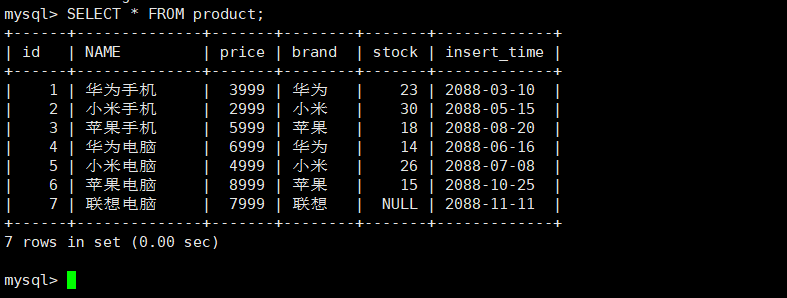
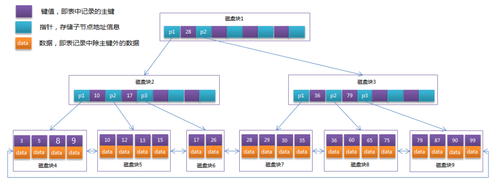
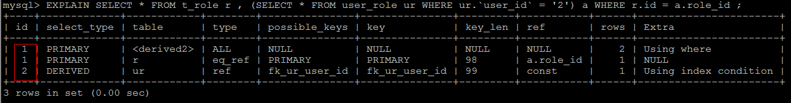
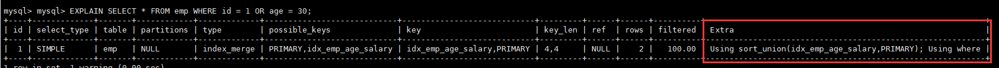
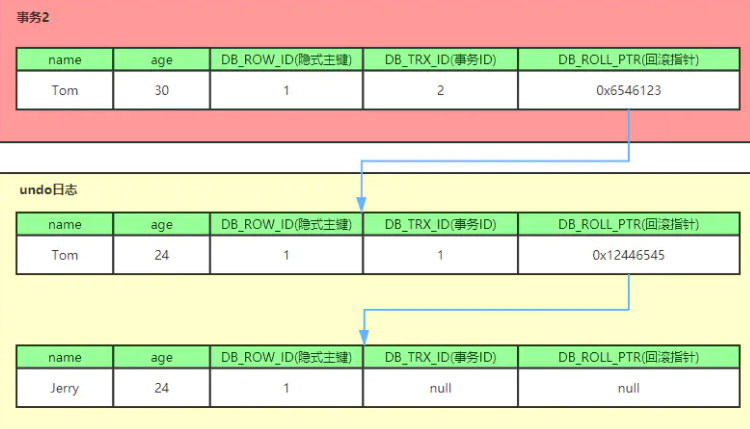
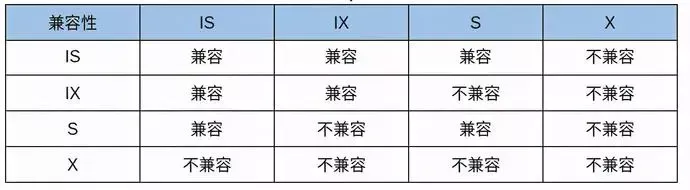

# MySQL

## 1、简介

### 1.1、数据库

数据库：DataBase，简称 DB，存储和管理数据的仓库

数据库的优势：

- 可以持久化存储数据
- 方便存储和管理数据
- 使用了统一的方式操作数据库 SQL

数据库、数据表、数据的关系介绍：

- 数据库

  - 用于存储和管理数据的仓库
  - 一个库中可以包含多个数据表

- 数据表

  - 数据库最重要的组成部分之一
  - 由纵向的列和横向的行组成（类似 excel 表格）
  - 可以指定列名、数据类型、等
  - 一个表中可以存储多条数据

- 数据：想要永久化存储的数据


参考视频：https://www.bilibili.com/video/BV1zJ411M7TB

参考文章：https://time.geekbang.org/column/intro/139

参考书籍：https://book.douban.com/subject/35231266/

### 1.2、MySQL

MySQL 数据库是一个最流行的关系型数据库管理系统之一

关系型数据库是将数据保存在不同的数据表中，而且表与表之间可以有关联关系，提高了灵活性。

缺点：数据存储在磁盘中，导致读写性能差，而且数据关系复杂，扩展性差

MySQL 所使用的 SQL 语句是用于访问数据库最常用的标准化语言。

MySQL 配置：

* MySQL 安装：https://www.jianshu.com/p/ba48f1e386f0

* MySQL 配置：

  * 修改 MySQL 默认字符集：安装 MySQL 之后第一件事就是修改字符集编码

    ```mysql
    vim /etc/mysql/my.cnf
    
    添加如下内容：
    [mysqld]
    character-set-server=utf8
    collation-server=utf8_general_ci
    
    [client]
    default-character-set=utf8
    ```

  * 启动 MySQL 服务： 

    ```shell
    systemctl start/restart mysql
    ```

  * 登录 MySQL：

    ```shell
    mysql -u root -p  敲回车，输入密码
    初始密码查看：cat /var/log/mysqld.log
    在root@localhost:   后面的就是初始密码
    ```
    
  * 查看默认字符集命令：

    ```mysql
    SHOW VARIABLES LIKE 'char%';
    ```

  * 修改MySQL登录密码：
    
    ```mysql
    set global validate_password_policy=0;
    set global validate_password_length=1;
      
    set password=password('密码');
    ```
    
  * 授予远程连接权限（MySQL 内输入）：
    
    ```mysql
    -- 授权
    grant all privileges on *.* to 'root' @'%' identified by '密码';
    -- 刷新
    flush privileges;
    ```
  
* 修改 MySQL 绑定 IP：

  ```shell
  cd /etc/mysql/mysql.conf.d
  sudo chmod 666 mysqld.cnf 
  vim mysqld.cnf 
  #bind-address = 127.0.0.1注释该行
  ```

* 关闭 Linux 防火墙

  ```shell
  systemctl stop firewalld.service
  放行3306端口
  ```

  

***


### 1.3、常用工具

#### 1.3.1、mysql

mysql 不是指 mysql 服务，而是指 mysql 的客户端工具

```sh
mysql [options] [database]
```

* -u  --user=name：指定用户名
* -p  --password[=name]：指定密码
* -h  --host=name：指定服务器IP或域名
* -P  --port=#：指定连接端口
* -e  --execute=name：执行SQL语句并退出，在控制台执行SQL语句，而不用连接到数据库执行

示例：

```sh
mysql -h 127.0.0.1 -P 3306 -u root -p
mysql -uroot -p2143 db01 -e "select * from tb_book";
```

#### 1.3.2、admin

mysqladmin 是一个执行管理操作的客户端程序，用来检查服务器的配置和当前状态、创建并删除数据库等

通过 `mysqladmin --help` 指令查看帮助文档

```sh
mysqladmin -uroot -p2143 create 'test01';
```

#### 1.3.3、binlog

服务器生成的日志文件以二进制格式保存，如果需要检查这些文本，就要使用 mysqlbinlog 日志管理工具

```sh
mysqlbinlog [options]  log-files1 log-files2 ...
```

* -d  --database=name：指定数据库名称，只列出指定的数据库相关操作

* -o  --offset=#：忽略掉日志中的前n行命令。

* -r  --result-file=name：将输出的文本格式日志输出到指定文件。

* -s  --short-form：显示简单格式， 省略掉一些信息。

* --start-datatime=date1  --stop-datetime=date2：指定日期间隔内的所有日志。

* --start-position=pos1 --stop-position=pos2：指定位置间隔内的所有日志。

#### 1.3.4、dump

##### 命令介绍

mysqldump 客户端工具用来备份数据库或在不同数据库之间进行数据迁移，备份内容包含创建表，及插入表的SQL语句

```sh
mysqldump [options] db_name [tables]
mysqldump [options] --database/-B db1 [db2 db3...]
mysqldump [options] --all-databases/-A
```

连接选项：

* -u  --user=name：指定用户名
* -p  --password[=name]：指定密码
* -h  --host=name：指定服务器IP或域名
* -P  --port=#：指定连接端口

输出内容选项：

* --add-drop-database：在每个数据库创建语句前加上 Drop database 语句
* --add-drop-table：在每个表创建语句前加上 Drop table 语句 , 默认开启 ; 不开启 (--skip-add-drop-table)
* -n  --no-create-db：不包含数据库的创建语句
* -t  --no-create-info：不包含数据表的创建语句
* -d --no-data：不包含数据
* -T, --tab=name：自动生成两个文件：一个.sql文件，创建表结构的语句；一个.txt文件，数据文件，相当于select into outfile  

示例：

```sh
mysqldump -uroot -p2143 db01 tb_book --add-drop-database --add-drop-table > a
mysqldump -uroot -p2143 -T /tmp test city
```


***


##### 数据备份

命令行方式：

* 备份命令：mysqldump -u root -p 数据库名称 > 文件保存路径

* 恢复
  1. 登录MySQL数据库：`mysql -u root p`
  2. 删除已经备份的数据库
  3. 重新创建与备份数据库名称相同的数据库
  4. 使用该数据库
  5. 导入文件执行：`source 备份文件全路径`


图形化界面：

* 备份

  

* 恢复

  


#### 1.3.5、import

mysqlimport 是客户端数据导入工具，用来导入mysqldump 加 -T 参数后导出的文本文件

```sh
mysqlimport [options]  db_name  textfile1  [textfile2...]
```

示例：

```sh
mysqlimport -uroot -p2143 test /tmp/city.txt
```

导入 sql 文件，可以使用 MySQL 中的 source 指令 : 

```mysql
source 文件全路径
```

#### 1.3.6、show

mysqlshow 客户端对象查找工具，用来很快地查找存在哪些数据库、数据库中的表、表中的列或者索引

```sh
mysqlshow [options] [db_name [table_name [col_name]]]
```

* --count：显示数据库及表的统计信息（数据库，表 均可以不指定）

* -i：显示指定数据库或者指定表的状态信息

示例：

```sh
#查询每个数据库的表的数量及表中记录的数量
mysqlshow -uroot -p1234 --count
#查询test库中每个表中的字段书，及行数
mysqlshow -uroot -p1234 test --count
#查询test库中book表的详细情况
mysqlshow -uroot -p1234 test book --count
```

## 2、体系结构

### 2.1、整体架构

体系结构详解：

* 第一层：网络连接层
  * 一些客户端和链接服务，包含本地 socket 通信和大多数基于客户端/服务端工具实现的 TCP/IP 通信，主要完成一些类似于连接处理、授权认证、及相关的安全方案
  * 在该层上引入了连接池 Connection Pool 的概念，管理缓冲用户连接，线程处理等需要缓存的需求
  * 在该层上实现基于 SSL 的安全链接，服务器也会为安全接入的每个客户端验证它所具有的操作权限

- 第二层：核心服务层
  * 查询缓存、分析器、优化器、执行器等，涵盖 MySQL 的大多数核心服务功能，所有的内置函数（日期、数学、加密函数等）
    * Management Serveices & Utilities：系统管理和控制工具，备份、安全、复制、集群等
    * SQL Interface：接受用户的 SQL 命令，并且返回用户需要查询的结果
    * Parser：SQL 语句分析器
    * Optimizer：查询优化器
    * Caches & Buffers：查询缓存，服务器会查询内部的缓存，如果缓存空间足够大，可以在大量读操作的环境中提升系统性能
  * 所有**跨存储引擎的功能**在这一层实现，如存储过程、触发器、视图等
  * 在该层服务器会解析查询并创建相应的内部解析树，并对其完成相应的优化如确定表的查询顺序，是否利用索引等， 最后生成相应的执行操作
  * MySQL 中服务器层不管理事务，**事务是由存储引擎实现的**
- 第三层：存储引擎层
  - Pluggable Storage Engines：存储引擎接口，MySQL 区别于其他数据库的重要特点就是其存储引擎的架构模式是插件式的（存储引擎是基于表的，而不是数据库）
  - 存储引擎**真正的负责了 MySQL 中数据的存储和提取**，服务器通过 API 和存储引擎进行通信
  - 不同的存储引擎具有不同的功能，共用一个 Server 层，可以根据开发的需要，来选取合适的存储引擎
- 第四层：系统文件层
  - 数据存储层，主要是将数据存储在文件系统之上，并完成与存储引擎的交互
  - File System：文件系统，保存配置文件、数据文件、日志文件、错误文件、二进制文件等


### 2.2、执行流程

#### 2.2.1、连接器

##### 连接原理

池化技术：对于访问数据库来说，建立连接的代价是比较昂贵的，因为每个连接对应一个用来交互的线程，频繁的创建关闭连接比较耗费资源，有必要建立数据库连接池，以提高访问的性能

连接建立 TCP 以后需要做**权限验证**，验证成功后可以进行执行 SQL。如果这时管理员账号对这个用户的权限做了修改，也不会影响已经存在连接的权限，只有再新建的连接才会使用新的权限设置

客户端如果长时间没有操作，连接器就会自动断开，时间是由参数 wait_timeout 控制的，默认值是 8 小时。如果在连接被断开之后，客户端再次发送请求的话，就会收到一个错误提醒：`Lost connection to MySQL server during query`

数据库里面，长连接是指连接成功后，如果客户端持续有请求，则一直使用同一个连接；短连接则是指每次执行完很少的几次查询就断开连接，下次查询再重新建立一个。为了减少连接的创建，推荐使用长连接，但是过多的长连接会造成 OOM，解决方案：

* 定期断开长连接，使用一段时间，或者程序里面判断执行过一个占用内存的大查询后，断开连接，之后要查询再重连。
* MySQL 5.7 版本，可以在每次执行一个比较大的操作后，通过执行 mysql_reset_connection 来重新初始化连接资源，这个过程不需要重连和重新做权限验证，但是会将连接恢复到刚刚创建完时的状态

MySQL 服务器可以同时和多个客户端进行交互，所以要保证每个连接会话的隔离性（事务机制部分详解）

整体的执行流程：


##### 连接状态

首先连接到数据库上，这时连接器发挥作用，连接完成后如果没有后续的动作，这个连接就处于空闲状态，通过指令查看连接状态

SHOW PROCESSLIST：查看当前 MySQL 在进行的线程，可以实时地查看 SQL 的执行情况，其中的 Command 列显示为 Sleep 的这一行，就表示现在系统里面有一个空闲连接


| 参数    | 含义                                                         |
| ------- | ------------------------------------------------------------ |
| ID      | 用户登录 mysql 时系统分配的 connection_id，可以使用函数 connection_id() 查看 |
| User    | 显示当前用户，如果不是 root，这个命令就只显示用户权限范围的 sql 语句 |
| Host    | 显示这个语句是从哪个 ip 的哪个端口上发的，可以用来跟踪出现问题语句的用户 |
| db      | 显示这个进程目前连接的是哪个数据库                           |
| Command | 显示当前连接的执行的命令，一般取值为休眠 Sleep、查询 Query、连接 Connect 等 |
| Time    | 显示这个状态持续的时间，单位是秒                             |
| State   | 显示使用当前连接的 sql 语句的状态，以查询为例，需要经过 copying to tmp table、sorting result、sending data等状态才可以完成 |
| Info    | 显示执行的 sql 语句，是判断问题语句的一个重要依据            |

#### 2.2.2、查询缓存

##### 工作流程

当执行完全相同的 SQL 语句的时候，服务器就会直接从缓存中读取结果，当数据被修改，之前的缓存会失效，修改比较频繁的表不适合做查询缓存

查询过程：

1. 客户端发送一条查询给服务器
2. 服务器先会检查查询缓存，如果命中了缓存，则立即返回存储在缓存中的结果（一般是 K-V 键值对），否则进入下一阶段
3. 分析器进行 SQL 分析，再由优化器生成对应的执行计划
4. MySQL 根据优化器生成的执行计划，调用存储引擎的 API 来执行查询
5. 将结果返回给客户端

大多数情况下不建议使用查询缓存，因为查询缓存往往弊大于利

* 查询缓存的**失效非常频繁**，只要有对一个表的更新，这个表上所有的查询缓存都会被清空。因此很可能费力地把结果存起来，还没使用就被一个更新全清空了，对于更新压力大的数据库来说，查询缓存的命中率会非常低
* 除非业务就是有一张静态表，很长时间才会更新一次，比如一个系统配置表，那这张表上的查询才适合使用查询缓存


***


##### 缓存配置

1. 查看当前的 MySQL 数据库是否支持查询缓存：

   ```mysql
   SHOW VARIABLES LIKE 'have_query_cache';	-- YES
   ```

2. 查看当前 MySQL 是否开启了查询缓存：

   ```mysql
   SHOW VARIABLES LIKE 'query_cache_type';	-- OFF
   ```

   参数说明：

   * OFF 或 0：查询缓存功能关闭

   * ON 或 1：查询缓存功能打开，查询结果符合缓存条件即会缓存，否则不予缓存；可以显式指定 SQL_NO_CACHE 不予缓存

   * DEMAND 或 2：查询缓存功能按需进行，显式指定 SQL_CACHE 的 SELECT 语句才缓存，其它不予缓存

     ```mysql
     SELECT SQL_CACHE id, name FROM customer; -- SQL_CACHE:查询结果可缓存
     SELECT SQL_NO_CACHE id, name FROM customer;-- SQL_NO_CACHE:不使用查询缓存
     ```

3. 查看查询缓存的占用大小：

   ```mysql
   SHOW VARIABLES LIKE 'query_cache_size';-- 单位是字节 1048576 / 1024 = 1024 = 1KB
   ```

4. 查看查询缓存的状态变量：

   ```mysql
   SHOW STATUS LIKE 'Qcache%';
   ```

   

   | 参数                    | 含义                                                         |
   | ----------------------- | ------------------------------------------------------------ |
   | Qcache_free_blocks      | 查询缓存中的可用内存块数                                     |
   | Qcache_free_memory      | 查询缓存的可用内存量                                         |
   | Qcache_hits             | 查询缓存命中数                                               |
   | Qcache_inserts          | 添加到查询缓存的查询数                                       |
   | Qcache_lowmen_prunes    | 由于内存不足而从查询缓存中删除的查询数                       |
   | Qcache_not_cached       | 非缓存查询的数量（由于 query_cache_type 设置而无法缓存或未缓存） |
   | Qcache_queries_in_cache | 查询缓存中注册的查询数                                       |
   | Qcache_total_blocks     | 查询缓存中的块总数                                           |

5. 配置 my.cnf：

   ```sh
   sudo chmod 666 /etc/mysql/my.cnf
   vim my.cnf
   # mysqld中配置缓存
   query_cache_type=1
   ```

   重启服务既可生效，执行 SQL 语句进行验证 ，执行一条比较耗时的 SQL 语句，然后再多执行几次，查看后面几次的执行时间；获取通过查看查询缓存的缓存命中数，来判定是否走查询缓存


***


##### 缓存失效

查询缓存失效的情况：

* SQL 语句不一致的情况，要想命中查询缓存，查询的 SQL 语句必须一致

  ```mysql
  select count(*) from tb_item;
  Select count(*) from tb_item;	-- 不走缓存，首字母不一致
  ```

* 当查询语句中有一些不确定查询时，则不会缓存，比如：now()、current_date()、curdate()、curtime()、rand()、uuid()、user()、database() 

  ```mysql
  SELECT * FROM tb_item WHERE updatetime < NOW() LIMIT 1;
  SELECT USER();
  SELECT DATABASE();
  ```

* 不使用任何表查询语句：

  ```mysql
  SELECT 'A';
  ```

* 查询 mysql、information_schema、performance_schema 等系统表时，不走查询缓存：

  ```mysql
  SELECT * FROM information_schema.engines;
  ```

* 在跨存储引擎的存储过程、触发器或存储函数的主体内执行的查询，缓存失效

* 如果表更改，则使用该表的所有高速缓存查询都将变为无效并从高速缓存中删除，包括使用 MERGE 映射到已更改表的表的查询，比如：INSERT、UPDATE、DELETE、ALTER TABLE、DROP TABLE、DROP DATABASE 

  

***


#### 2.2.3、分析器

没有命中查询缓存，就开始了 SQL 的真正执行，分析器会对 SQL 语句做解析

```sql
SELECT * FROM t WHERE id = 1;
```

* 先做**词法分析**，输入的是由多个字符串和空格组成的一条 SQL 语句，MySQL 需要识别出里面的字符串分别是什么，代表什么。从输入的 select 这个关键字识别出来这是一个查询语句；把字符串 t 识别成 表名 t，把字符串 id 识别成列 id
* 然后做**语法分析**，根据词法分析的结果，语法分析器会根据语法规则，判断你输入的这个 SQL 语句是否满足 MySQL 语法。如果你的语句不对，就会收到 `You have an error in your SQL syntax` 的错误提醒


***


#### 2.2.4、优化器

##### 成本分析

优化器是在表里面有多个索引的时候，决定使用哪个索引；或者在一个语句有多表关联（join）的时候，决定各个表的连接顺序。

* 根据搜索条件找出所有可能的使用的索引
* 成本分析，执行成本由 I/O 成本和 CPU 成本组成，计算全表扫描和使用不同索引执行 SQL 的代价
* 找到一个最优的执行方案，用最小的代价去执行语句

在数据库里面，扫描行数是影响执行代价的因素之一，扫描的行数越少意味着访问磁盘的次数越少，消耗的 CPU 资源越少，优化器还会结合是否使用临时表、是否排序等因素进行综合判断


***


##### 统计数据

MySQL 中保存着两种统计数据：

* innodb_table_stats 存储了表的统计数据，每一条记录对应着一个表的统计数据
* innodb_index_stats 存储了索引的统计数据，每一条记录对应着一个索引的一个统计项的数据

MySQL 在真正执行语句之前，并不能精确地知道满足条件的记录有多少条，只能根据统计信息来估算记录，统计信息就是索引的区分度,一个索引上不同的值的个数（比如性别只能是男女，就是 2 ），称之为基数（cardinality），基数越大说明区分度越好

通过**采样统计**来获取基数，InnoDB 默认会选择 N 个数据页，统计这些页面上的不同值得到一个平均值，然后乘以这个索引的页面数，就得到了这个索引的基数

在 MySQL 中，有两种存储统计数据的方式，可以通过设置参数 `innodb_stats_persistent` 的值来选择：

* ON：表示统计信息会持久化存储（默认），采样页数 N 默认为 20，可以通过 `innodb_stats_persistent_sample_pages `指定，页数越多统计的数据越准确，但消耗的资源更大
* 设置为 off 时，表示统计信息只存储在内存，采样页数 N 默认为 8，也可以通过系统变量设置（不推荐，每次重新计算浪费资源）

数据表是会持续更新的，两种更新方式：

* 设置 `innodb_stats_auto_recalc` 为 1，当发生变动的记录数量超过表大小的 10% 时，自动触发重新计算，不过是**异步进行**
* 调用 `ANALYZE TABLE t` 手动更新统计信息，只对信息做重新统计（不是重建表），没有修改数据，这个过程中加了 MDL 读锁并且是同步进行，所以会暂时阻塞系统

EXPLAIN 执行计划在优化器阶段生成，如果 explain 的结果预估的 rows 值跟实际情况差距比较大，可以执行 analyze 命令重新修正信息


***


##### 错选索引

采样统计本身是估算数据，或者 SQL 语句中的字段选择有问题时，可能导致 MySQL 没有选择正确的执行索引

解决方法：

* 采用 force index 强行选择一个索引

  ```sql
  SELECT * FROM user FORCE INDEX(name) WHERE NAME='seazean';
  ```

* 可以考虑修改 SQL 语句，引导 MySQL 使用期望的索引

* 新建一个更合适的索引，来提供给优化器做选择，或删掉误用的索引


***


#### 2.2.5、执行器

开始执行的时候，要先判断一下当前连接对表有没有执行查询的权限，如果没有就会返回没有权限的错误，在工程实现上，如果命中查询缓存，会在查询缓存返回结果的时候，做权限验证。如果有权限，就打开表继续执行，执行器就会根据表的引擎定义，去使用这个引擎提供的接口


****


### 2.3、数据空间

#### 2.3.1、数据存储

系统表空间是用来放系统信息的，比如数据字典什么的，对应的磁盘文件是 ibdata，数据表空间是一个个的表数据文件，对应的磁盘文件就是表名.ibd

表数据既可以存在共享表空间里，也可以是单独的文件，这个行为是由参数 innodb_file_per_table 控制的：

* OFF：表示表的数据放在系统共享表空间，也就是跟数据字典放在一起
* ON ：表示每个 InnoDB 表数据存储在一个以 .ibd 为后缀的文件中（默认）

一个表单独存储为一个文件更容易管理，在不需要这个表时通过 drop table 命令，系统就会直接删除这个文件；如果是放在共享表空间中，即使表删掉了，空间也是不会回收的

#### 2.3.2、数据删除

MySQL 的数据删除就是移除掉某个记录后，该位置就被标记为可复用，如果有符合范围条件的数据可以插入到这里。符合范围条件的意思是假设删除记录 R4，之后要再插入一个 ID 在 300 和 600 之间的记录时，就会复用这个位置


InnoDB 的数据是按页存储的如果删掉了一个数据页上的所有记录，整个数据页就可以被复用了，如果相邻的两个数据页利用率都很小，系统就会把这两个页上的数据合到其中一个页上，另外一个数据页就被标记为可复用

删除命令其实只是把记录的位置，或者**数据页标记为了可复用，但磁盘文件的大小是不会变的**，这些可以复用还没有被使用的空间，看起来就像是空洞，造成数据库的稀疏，因此需要进行紧凑处理

#### 2.3.3、重建数据

重建表就是按照主键 ID 递增的顺序，把数据一行一行地从旧表中读出来再插入到新表中，重建表时 MySQL 会自动完成转存数据、交换表名、删除旧表的操作，重建命令：

```sql
ALTER TABLE A ENGINE=InnoDB
```

工作流程：新建临时表 tmp_table B（在 Server 层创建的），把表 A 中的数据导入到表 B 中，操作完成后用表 B 替换表 A，完成重建

重建表的步骤需要 DDL 不是 Online 的，因为在导入数据的过程有新的数据要写入到表 A 的话，就会造成数据丢失

MySQL 5.6 版本开始引入的 Online DDL，重建表的命令默认执行此步骤：

* 建立一个临时文件 tmp_file（InnoDB 创建），扫描表 A 主键的所有数据页
* 用数据页中表 A 的记录生成 B+ 树，存储到临时文件中
* 生成临时文件的过程中，将所有对 A 的操作记录在一个日志文件（row log）中，对应的是图中 state2 的状态
* 临时文件生成后，将日志文件中的操作应用到临时文件，得到一个逻辑数据上与表 A 相同的数据文件，对应的就是图中 state3
* 用临时文件替换表 A 的数据文件


Online DDL 操作会先获取 MDL 写锁，再退化成 MDL 读锁。但 MDL 写锁持有时间比较短，所以可以称为 Online； 而 MDL 读锁，不阻止数据增删查改，但会阻止其它线程修改表结构

问题：重建表可以收缩表空间，但是执行指令后整体占用空间增大

原因：在重建表后 InnoDB 不会把整张表占满，每个页留了 1/16 给后续的更新使用。表在未整理之前页已经占用 15/16 以上，收缩之后需要保持数据占用空间在 15/16，所以文件占用空间更大才能保持

注意：临时文件也要占用空间，如果空间不足会重建失败

#### 2.3.4、inplace

DDL 中的临时表 tmp_table 是在 Server 层创建的，Online DDL 中的临时文件 tmp_file 是 InnoDB 在内部创建出来的，整个 DDL 过程都在 InnoDB 内部完成，对于 Server 层来说，没有把数据挪动到临时表，是一个原地操作，这就是 inplace

两者的关系：

* DDL 过程如果是 Online 的，就一定是 inplace 的
* inplace 的 DDL，有可能不是 Online 的，截止到 MySQL 8.0，全文索引（FULLTEXT）和空间索引 (SPATIAL ) 属于这种情况

==本节知识是抄录自《MySQL 实战 45 讲》，作者目前没有更深的理解，暂时记录，后续有了新的认知后会更新知识==

参考文章：https://time.geekbang.org/column/article/72388

## 3、单表操作

### 3.1、SQL

- SQL

  - Structured Query Language：结构化查询语言
  - 定义了操作所有关系型数据库的规则，每种数据库操作的方式可能会存在不一样的地方，称为“方言”

- SQL 通用语法

  - SQL 语句可以单行或多行书写，以**分号结尾**。
  - 可使用空格和缩进来增强语句的可读性。
  - MySQL 数据库的 SQL 语句不区分大小写，**关键字建议使用大写**。
  - 数据库的注释：
    - 单行注释：-- 注释内容       #注释内容(mysql特有)
    - 多行注释：/* 注释内容 */

- SQL 分类

  - DDL（Data Definition Language）数据定义语言

    - 用来定义数据库对象：数据库，表，列等。关键字：create、drop,、alter 等

  - DML（Data Manipulation Language）数据操作语言

    - 用来对数据库中表的数据进行增删改。关键字：insert、delete、update 等

  - DQL（Data Query Language）数据查询语言

    - 用来查询数据库中表的记录(数据)。关键字：select、where 等

  - DCL（Data Control Language）数据控制语言

    - 用来定义数据库的访问权限和安全级别，及创建用户。关键字：grant， revoke等

    


### 3.2、DDL

#### 3.2.1、数据库

* R(Retrieve)：查询

  * 查询所有数据库：

    ```mysql
    SHOW DATABASES;
    ```

  * 查询某个数据库的创建语句

    ```sql
    SHOW CREATE DATABASE 数据库名称;  -- 标准语法
    
    SHOW CREATE DATABASE mysql;     -- 查看mysql数据库的创建格式
    ```

    

* C(Create)：创建

  * 创建数据库

    ```mysql
    CREATE DATABASE 数据库名称;-- 标准语法
    
    CREATE DATABASE db1;     -- 创建db1数据库
    ```

  * 创建数据库（判断，如果不存在则创建）

    ```mysql
    CREATE DATABASE IF NOT EXISTS 数据库名称;
    ```

  * 创建数据库，并指定字符集

    ```mysql
    CREATE DATABASE 数据库名称 CHARACTER SET 字符集名称;
    ```

  * 例如：创建db4数据库、如果不存在则创建，指定字符集为gbk

    ```mysql
    -- 创建db4数据库、如果不存在则创建，指定字符集为gbk
    CREATE DATABASE IF NOT EXISTS db4 CHARACTER SET gbk;
    
    -- 查看db4数据库的字符集
    SHOW CREATE DATABASE db4;
    ```

    

* U(Update)：修改

  * 修改数据库的字符集

    ```mysql
    ALTER DATABASE 数据库名称 CHARACTER SET 字符集名称;
    ```

  * 常用字符集：

    ```mysql
    --查询所有支持的字符集
    SHOW CHARSET;
    --查看所有支持的校对规则
    SHOW COLLATION;
    
    -- 字符集: utf8,latinI,GBK,,GBK是utf8的子集
    -- 校对规则: ci 大小定不敏感，cs或bin大小写敏感
    ```

    

* D(Delete)：删除

  * 删除数据库：

    ```mysql
    DROP DATABASE 数据库名称;
    ```

  * 删除数据库(判断，如果存在则删除)：

    ```mysql
    DROP DATABASE IF EXISTS 数据库名称;
    ```
    
    

* 使用数据库：

  * 查询当前正在使用的数据库名称

    ```mysql
    SELECT DATABASE();
    ```

  * 使用数据库

    ```mysql
    USE 数据库名称； -- 标准语法
    USE db4;	   -- 使用db4数据库
    ```

#### 3.2.2、数据表

- R(Retrieve)：查询

  - 查询数据库中所有的数据表

    ```mysql
    USE mysql;-- 使用mysql数据库
    
    SHOW TABLES;-- 查询库中所有的表
    ```
  
  - 查询表结构

    ```mysql
  DESC 表名;
    ```
  
  - 查询表字符集
  
    ```mysql
    SHOW TABLE STATUS FROM 库名 LIKE '表名';
    ```

    

- C(Create)：创建

  - 创建数据表

    ```mysql
    CREATE TABLE 表名(
        列名1 数据类型1,
        列名2 数据类型2,
        ....
        列名n 数据类型n
    );
    -- 注意：最后一列，不需要加逗号
    ```

  - 复制表

    ```mysql
    CREATE TABLE 表名 LIKE 被复制的表名;  -- 标准语法
    
    CREATE TABLE product2 LIKE product; -- 复制product表到product2表
    ```

  - 数据类型

    | 数据类型  | 说明                                                         |
    | --------- | ------------------------------------------------------------ |
    | INT       | 整数类型                                                     |
    | DOUBLE    | 小数类型                                                     |
    | DATE      | 日期，只包含年月日：yyyy-MM-dd                               |
    | DATETIME  | 日期，包含年月日时分秒：yyyy-MM-dd HH:mm:ss                  |
    | TIMESTAMP | 时间戳类型，包含年月日时分秒：yyyy-MM-dd HH:mm:ss<br />如果不给这个字段赋值或赋值为 NULL，则默认使用当前的系统时间 |
    | CHAR      | 字符串，定长类型                                             |
    | VARCHAR   | 字符串，**变长类型**<br />name varchar(20) 代表姓名最大 20 个字符：zhangsan 8 个字符，张三 2 个字符 |
  
    `INT(n)`：n 代表位数
  
    * 3：int（9）显示结果为 000000010
    * 3：int（3）显示结果为 010
  
    `varchar(n)`：n 表示的是字符数
  
  - 例如：
  
    ```mysql
    -- 使用db3数据库
    USE db3;
    
    -- 创建一个product商品表
    CREATE TABLE product(
    	id INT,				-- 商品编号
    	NAME VARCHAR(30),	-- 商品名称
    	price DOUBLE,		-- 商品价格
    	stock INT,			-- 商品库存
    	insert_time DATE    -- 上架时间
    );
    ```

- U(Update)：修改

  - 修改表名

    ```mysql
    ALTER TABLE 表名 RENAME TO 新的表名;
    ```
  
  - 修改表的字符集
  
    ```mysql
  ALTER TABLE 表名 CHARACTER SET 字符集名称;
    ```

  - 添加一列
  
    ```mysql
    ALTER TABLE 表名 ADD 列名 数据类型;
    ```
  
  - 修改列数据类型
  
    ```mysql
    ALTER TABLE 表名 MODIFY 列名 新数据类型;
    ```

  - 修改列名称和数据类型

    ```mysql
    ALTER TABLE 表名 CHANGE 列名 新列名 新数据类型;
    ```
  
  - 删除列
  
    ```mysql
    ALTER TABLE 表名 DROP 列名;
    ```

    
  
- D(Delete)：删除

  - 删除数据表

    ```mysql
    DROP TABLE 表名;
    ```
  
  - 删除数据表(判断，如果存在则删除)
  
    ```mysql
    DROP TABLE IF EXISTS 表名;
    ```
  
    

### 3.3、DML

#### 3.3.1、INSERT

* 新增表数据

  * 新增格式 1：给指定列添加数据

    ```mysql
    INSERT INTO 表名(列名1,列名2...) VALUES (值1,值2...);
    ```

  * 新增格式 2：默认给全部列添加数据

    ```mysql
    INSERT INTO 表名 VALUES (值1,值2,值3,...);
    ```

  * 新增格式 3：批量添加数据

    ```mysql
    -- 给指定列批量添加数据
    INSERT INTO 表名(列名1,列名2,...) VALUES (值1,值2,...),(值1,值2,...)...;
    
    -- 默认给所有列批量添加数据 
    INSERT INTO 表名 VALUES (值1,值2,值3,...),(值1,值2,值3,...)...;
    ```

* 字符串拼接

  ```mysql
  CONCAT(string1,string2,'',...)
  ```
  
  
  
* 注意事项

  - 列名和值的数量以及数据类型要对应
  - 除了数字类型，其他数据类型的数据都需要加引号(单引双引都可以，推荐单引)


***


#### 3.3.2、UPDATE

* 修改表数据语法

  * 标准语法 

    ```mysql
    UPDATE 表名 SET 列名1 = 值1,列名2 = 值2,... [where 条件];
    ```

  * 修改电视的价格为1800、库存为36

    ```mysql
    UPDATE product SET price=1800,stock=36 WHERE NAME='电视';
    SELECT * FROM product;-- 查看所有商品信息
    ```

* 注意事项

  - 修改语句中必须加条件
  - 如果不加条件，则将所有数据都修改

#### 3.3.3、DELETE

* 删除表数据语法

  ```mysql
  DELETE FROM 表名 [WHERE 条件];
  ```

* 注意事项
  * 删除语句中必须加条件
  * 如果不加条件，则将所有数据删除

### 3.4、DQL

#### 3.4.1、查询语法

数据库查询遵循条件在前的原则

```mysql
SELECT DISTINCT
	<select list>
FROM
	<left_table> <join_type>
JOIN
	<right_table> ON <join_condition>	-- 连接查询在多表查询部分详解
WHERE
	<where_condition>
GROUP BY
	<group_by_list>
HAVING
	<having_condition>
ORDER BY
	<order_by_condition>
LIMIT
	<limit_params>
```

执行顺序：

```mysql
FROM	<left_table>

ON 		<join_condition>

<join_type>		JOIN	<right_table>

WHERE		<where_condition>

GROUP BY 	<group_by_list>

HAVING		<having_condition>

SELECT DISTINCT		<select list>

ORDER BY	<order_by_condition>

LIMIT		<limit_params>
```


***


#### 3.4.2、查询全部

* 查询全部的表数据

  ```mysql
  -- 标准语法
  SELECT * FROM 表名;
  
  -- 查询product表所有数据(常用)
  SELECT * FROM product;
  ```

* 查询指定字段的表数据

  ```mysql
  SELECT 列名1,列名2,... FROM 表名;
  ```

* **去除重复查询**：只有值全部重复的才可以去除，需要创建临时表辅助查询
  
  ```mysql
  SELECT DISTINCT 列名1,列名2,... FROM 表名;
  ```
  
* 计算列的值（四则运算）

  ```mysql
  SELECT 列名1 运算符(+ - * /) 列名2 FROM 表名;
  
  /*如果某一列值为null，可以进行替换
  	ifnull(表达式1,表达式2)
  	表达式1：想替换的列
  	表达式2：想替换的值*/
  ```

  例如：

  ```mysql
  -- 查询商品名称和库存，库存数量在原有基础上加10
  SELECT NAME,stock+10 FROM product;
  
  -- 查询商品名称和库存，库存数量在原有基础上加10。进行null值判断
  SELECT NAME,IFNULL(stock,0)+10 FROM product;
  ```

* **起别名**

  ```mysql
  SELECT 列名1,列名2,... AS 别名 FROM 表名;
  ```

  例如：

  ```mysql
  -- 查询商品名称和库存，库存数量在原有基础上加10。进行null值判断，起别名为getSum,AS可以省略。
  SELECT NAME,IFNULL(stock,0)+10 AS getsum FROM product;
  SELECT NAME,IFNULL(stock,0)+10 getsum FROM product;
  ```


***


#### 3.4.3、条件查询

* 条件查询语法

  ```mysql
  SELECT 列名 FROM 表名 WHERE 条件;
  ```

* 条件分类

  | 符号                | 功能                                                         |
  | ------------------- | ------------------------------------------------------------ |
  | >                   | 大于                                                         |
  | <                   | 小于                                                         |
  | >=                  | 大于等于                                                     |
  | <=                  | 小于等于                                                     |
  | =                   | 等于                                                         |
  | <> 或 !=            | 不等于                                                       |
  | BETWEEN ... AND ... | 在某个范围之内(都包含)                                       |
  | IN(...)             | 多选一                                                       |
  | LIKE                | **模糊查询**：_单个任意字符、%任意个字符、[] 匹配集合内的字符<br/>`LIKE '[^AB]%' `：不以 A 和 B 开头的任意文本 |
  | IS NULL             | 是NULL                                                       |
  | IS                  | 不是NULL                                                     |
  | AND 或 &&           | 并且                                                         |
  | OR 或 \|\|          | 或者                                                         |
  | NOT 或 !            | 非，不是                                                     |
  | UNION               | 对两个结果集进行**并集操作并进行去重，同时进行默认规则的排序** |
  | UNION ALL           | 对两个结果集进行并集操作不进行去重，不进行排序               |

* 例如：

  ```mysql
  -- 查询库存大于20的商品信息
  SELECT * FROM product WHERE stock > 20;
  
  -- 查询品牌为华为的商品信息
  SELECT * FROM product WHERE brand='华为';
  
  -- 查询金额在4000 ~ 6000之间的商品信息
  SELECT * FROM product WHERE price >= 4000 AND price <= 6000;
  SELECT * FROM product WHERE price BETWEEN 4000 AND 6000;
  
  -- 查询库存为14、30、23的商品信息
  SELECT * FROM product WHERE stock=14 OR stock=30 OR stock=23;
  SELECT * FROM product WHERE stock IN(14,30,23);
  
  -- 查询库存为null的商品信息
  SELECT * FROM product WHERE stock IS NULL;
  -- 查询库存不为null的商品信息
  SELECT * FROM product WHERE stock IS ;
  
  -- 查询名称以'小米'为开头的商品信息
  SELECT * FROM product WHERE NAME LIKE '小米%';
  
  -- 查询名称第二个字是'为'的商品信息
  SELECT * FROM product WHERE NAME LIKE '_为%';
  
  -- 查询名称为四个字符的商品信息 4个下划线
  SELECT * FROM product WHERE NAME LIKE '____';
  
  -- 查询名称中包含电脑的商品信息
  SELECT * FROM product WHERE NAME LIKE '%电脑%';
  ```

  


***


#### 3.4.5、函数查询

##### 聚合函数

聚合函数：将一列数据作为一个整体，进行纵向的计算

* 聚合函数语法

  ```mysql
  SELECT 函数名(列名) FROM 表名 [WHERE 条件]
  ```

* 聚合函数分类

  | 函数名      | 功能                               |
  | ----------- | ---------------------------------- |
  | COUNT(列名) | 统计数量（一般选用不为 null 的列） |
  | MAX(列名)   | 最大值                             |
  | MIN(列名)   | 最小值                             |
  | SUM(列名)   | 求和                               |
  | AVG(列名)   | 平均值（会忽略 null 行）           |

* 例如

  ```mysql
  -- 计算product表中总记录条数 7
  SELECT COUNT(*) FROM product;
  
  -- 获取最高价格
  SELECT MAX(price) FROM product;
  -- 获取最高价格的商品名称
  SELECT NAME,price FROM product WHERE price = (SELECT MAX(price) FROM product);
  
  -- 获取最低库存
  SELECT MIN(stock) FROM product;
  -- 获取最低库存的商品名称
  SELECT NAME,stock FROM product WHERE stock = (SELECT MIN(stock) FROM product);
  
  -- 获取总库存数量
  SELECT SUM(stock) FROM product;
  -- 获取品牌为小米的平均商品价格
  SELECT AVG(price) FROM product WHERE brand='小米';
  ```


***


##### 文本函数

CONCAT()：用于连接两个字段

```sql
SELECT CONCAT(TRIM(col1), '(', TRIM(col2), ')') AS concat_col FROM mytable
-- 许多数据库会使用空格把一个值填充为列宽，连接的结果出现一些不必要的空格，使用TRIM()可以去除首尾空格
```

| 函数名称  | 作 用                                                        |
| --------- | ------------------------------------------------------------ |
| LENGTH    | 计算字符串长度函数，返回字符串的字节长度                     |
| CONCAT    | 合并字符串函数，返回结果为连接参数产生的字符串，参数可以使一个或多个 |
| INSERT    | 替换字符串函数                                               |
| LOWER     | 将字符串中的字母转换为小写                                   |
| UPPER     | 将字符串中的字母转换为大写                                   |
| LEFT      | 从左侧字截取符串，返回字符串左边的若干个字符                 |
| RIGHT     | 从右侧字截取符串，返回字符串右边的若干个字符                 |
| TRIM      | 删除字符串左右两侧的空格                                     |
| REPLACE   | 字符串替换函数，返回替换后的新字符串                         |
| SUBSTRING | 截取字符串，返回从指定位置开始的指定长度的字符换             |
| REVERSE   | 字符串反转（逆序）函数，返回与原始字符串顺序相反的字符串     |


***


##### 数字函数

| 函数名称        | 作 用                                                      |
| --------------- | ---------------------------------------------------------- |
| ABS             | 求绝对值                                                   |
| SQRT            | 求二次方根                                                 |
| MOD             | 求余数                                                     |
| CEIL 和 CEILING | 两个函数功能相同，都是返回不小于参数的最小整数，即向上取整 |
| FLOOR           | 向下取整，返回值转化为一个BIGINT                           |
| RAND            | 生成一个0~1之间的随机数，传入整数参数是，用来产生重复序列  |
| ROUND           | 对所传参数进行四舍五入                                     |
| SIGN            | 返回参数的符号                                             |
| POW 和 POWER    | 两个函数的功能相同，都是所传参数的次方的结果值             |
| SIN             | 求正弦值                                                   |
| ASIN            | 求反正弦值，与函数 SIN 互为反函数                          |
| COS             | 求余弦值                                                   |
| ACOS            | 求反余弦值，与函数 COS 互为反函数                          |
| TAN             | 求正切值                                                   |
| ATAN            | 求反正切值，与函数 TAN 互为反函数                          |
| COT             | 求余切值                                                   |


***


##### 日期函数

| 函数名称                | 作 用                                                        |
| ----------------------- | ------------------------------------------------------------ |
| CURDATE 和 CURRENT_DATE | 两个函数作用相同，返回当前系统的日期值                       |
| CURTIME 和 CURRENT_TIME | 两个函数作用相同，返回当前系统的时间值                       |
| NOW 和  SYSDATE         | 两个函数作用相同，返回当前系统的日期和时间值                 |
| MONTH                   | 获取指定日期中的月份                                         |
| MONTHNAME               | 获取指定日期中的月份英文名称                                 |
| DAYNAME                 | 获取指定曰期对应的星期几的英文名称                           |
| DAYOFWEEK               | 获取指定日期对应的一周的索引位置值                           |
| WEEK                    | 获取指定日期是一年中的第几周，返回值的范围是否为 0〜52 或 1〜53 |
| DAYOFYEAR               | 获取指定曰期是一年中的第几天，返回值范围是1~366              |
| DAYOFMONTH              | 获取指定日期是一个月中是第几天，返回值范围是1~31             |
| YEAR                    | 获取年份，返回值范围是 1970〜2069                            |
| TIME_TO_SEC             | 将时间参数转换为秒数                                         |
| SEC_TO_TIME             | 将秒数转换为时间，与TIME_TO_SEC 互为反函数                   |
| DATE_ADD 和 ADDDATE     | 两个函数功能相同，都是向日期添加指定的时间间隔               |
| DATE_SUB 和 SUBDATE     | 两个函数功能相同，都是向日期减去指定的时间间隔               |
| ADDTIME                 | 时间加法运算，在原始时间上添加指定的时间                     |
| SUBTIME                 | 时间减法运算，在原始时间上减去指定的时间                     |
| DATEDIFF                | 获取两个日期之间间隔，返回参数 1 减去参数 2 的值             |
| DATE_FORMAT             | 格式化指定的日期，根据参数返回指定格式的值                   |
| WEEKDAY                 | 获取指定日期在一周内的对应的工作日索引                       |


****


#### 3.4.6、正则查询

正则表达式（Regular Expression）是指一个用来描述或者匹配一系列符合某个句法规则的字符串的单个字符串

```mysql
SELECT * FROM emp WHERE name REGEXP '^T';	-- 匹配以T开头的name值
SELECT * FROM emp WHERE name REGEXP '2$';	-- 匹配以2结尾的name值
SELECT * FROM emp WHERE name REGEXP '[uvw]';-- 匹配包含 uvw 的name值
```

| 符号   | 含义                          |
| ------ | ----------------------------- |
| ^      | 在字符串开始处进行匹配        |
| $      | 在字符串末尾处进行匹配        |
| .      | 匹配任意单个字符, 包括换行符  |
| [...]  | 匹配出括号内的任意字符        |
| [^...] | 匹配不出括号内的任意字符      |
| a*     | 匹配零个或者多个a(包括空串)   |
| a+     | 匹配一个或者多个a(不包括空串) |
| a?     | 匹配零个或者一个a             |
| a1\|a2 | 匹配a1或a2                    |
| a(m)   | 匹配m个a                      |
| a(m,)  | 至少匹配m个a                  |
| a(m,n) | 匹配m个a 到 n个a              |
| a(,n)  | 匹配0到n个a                   |
| (...)  | 将模式元素组成单一元素        |


***


#### 3.4.7、排序查询

* 排序查询语法

  ```mysql
  SELECT 列名 FROM 表名 [WHERE 条件] ORDER BY 列名1 排序方式1,列名2 排序方式2;
  ```

* 排序方式

  ```mysql
  ASC:升序
  DESC:降序
  ```

  注意：多个排序条件，当前边的条件值一样时，才会判断第二条件

* 例如

  ```mysql
  -- 按照库存升序排序
  SELECT * FROM product ORDER BY stock ASC;
  
  -- 查询名称中包含手机的商品信息。按照金额降序排序
  SELECT * FROM product WHERE NAME LIKE '%手机%' ORDER BY price DESC;
  
  -- 按照金额升序排序，如果金额相同，按照库存降序排列
  SELECT * FROM product ORDER BY price ASC,stock DESC;
  ```

  

***


#### 3.4.8、分组查询

分组查询会进行去重

* 分组查询语法

  ````mysql
  SELECT 列名 FROM 表名 [WHERE 条件] GROUP BY 分组列名 [HAVING 分组后条件过滤] [ORDER BY 排序列名 排序方式];
  ````

  WHERE 过滤行，HAVING 过滤分组，行过滤应当先于分组过滤

  分组规定：

  * GROUP BY 子句出现在 WHERE 子句之后，ORDER BY 子句之前
  * NULL 的行会单独分为一组
  * 大多数 SQL 实现不支持 GROUP BY 列具有可变长度的数据类型

* 例如

  ```mysql
  -- 按照品牌分组，获取每组商品的总金额
  SELECT brand,SUM(price) FROM product GROUP BY brand;
  
  -- 对金额大于4000元的商品，按照品牌分组,获取每组商品的总金额
  SELECT brand,SUM(price) FROM product WHERE price > 4000 GROUP BY brand;
  
  -- 对金额大于4000元的商品，按照品牌分组，获取每组商品的总金额，只显示总金额大于7000元的
  SELECT brand,SUM(price) AS getSum FROM product WHERE price > 4000 GROUP BY brand HAVING getSum > 7000;
  
  -- 对金额大于4000元的商品，按照品牌分组，获取每组商品的总金额，只显示总金额大于7000元的、并按照总金额的降序排列
  SELECT brand,SUM(price) AS getSum FROM product WHERE price > 4000 GROUP BY brand HAVING getSum > 7000 ORDER BY getSum DESC;
  ```


***


#### 3.4.9、分页查询

* 分页查询语法

  ```mysql
  SELECT 列名 FROM 表名 [WHERE 条件] GROUP BY 分组列名 [HAVING 分组后条件过滤] [ORDER BY 排序列名 排序方式] LIMIT 开始索引,查询条数;
  ```

* 公式：开始索引 = (当前页码-1) * 每页显示的条数

* 例如

  ```mysql
  SELECT * FROM product LIMIT 0,2;  -- 第一页 开始索引=(1-1) * 2
  SELECT * FROM product LIMIT 2,2;  -- 第二页 开始索引=(2-1) * 2
  SELECT * FROM product LIMIT 4,2;  -- 第三页 开始索引=(3-1) * 2
  SELECT * FROM product LIMIT 6,2;  -- 第四页 开始索引=(4-1) * 2
  ```

  


***


## 4、多表操作

### 4.1、分类

#### 介绍

：对表中的数据进行限定，保证数据的正确性、有效性、完整性！

的分类：

|                               | 说明           |
| ----------------------------- | -------------- |
| PRIMARY KEY                   | 主键           |
| PRIMARY KEY AUTO_INCREMENT    | 主键、自动增长 |
| UNIQUE                        | 唯一           |
|                               | 非空           |
| FOREIGN KEY                   | 外键           |
| FOREIGN KEY ON UPDATE CASCADE | 外键级联更新   |
| FOREIGN KEY ON DELETE CASCADE | 外键级联删除   |


***


#### 主键

* 主键特点：

  * 主键默认包含**非空和唯一**两个功能
  * 一张表只能有一个主键
  * 主键一般用于表中数据的唯一标识

* 建表时添加主键

  ```mysql
  CREATE TABLE 表名(
  	列名 数据类型 PRIMARY KEY,
      列名 数据类型,
      ...
  );
  ```

* 删除主键

  ```mysql
  ALTER TABLE 表名 DROP PRIMARY KEY;
  ```

* 建表后单独添加主键

  ```mysql
  ALTER TABLE 表名 MODIFY 列名 数据类型 PRIMARY KEY;
  ```

* 例如

  ```mysql
  -- 创建student表
  CREATE TABLE student(
  	id INT PRIMARY KEY  -- 给id添加主键
  );
  
  -- 添加数据
  INSERT INTO student VALUES (1),(2);
  -- 主键默认唯一，添加重复数据，会报错
  INSERT INTO student VALUES (2);
  -- 主键默认非空，不能添加null的数据
  INSERT INTO student VALUES (NULL);
  ```


***


#### 主键自增

主键自增可以为空，并自动增长。删除某条数据不影响自增的下一个数值，依然按照前一个值自增。

* 建表时添加主键自增

  ```mysql
  CREATE TABLE 表名(
  	列名 数据类型 PRIMARY KEY AUTO_INCREMENT,
      列名 数据类型,
      ...
  );
  ```

* 删除主键自增

  ```mysql
  ALTER TABLE 表名 MODIFY 列名 数据类型;
  ```

* 建表后单独添加主键自增

  ```mysql
  ALTER TABLE 表名 MODIFY 列名 数据类型 AUTO_INCREMENT;
  ```

* 例如

  ```mysql
  -- 创建student2表
  CREATE TABLE student2(
  	id INT PRIMARY KEY AUTO_INCREMENT    -- 给id添加主键自增
  );
  
  -- 添加数据
  INSERT INTO student2 VALUES (1),(2);
  -- 添加null值，会自动增长
  INSERT INTO student2 VALUES (NULL),(NULL);-- 3，4
  ```


***


#### 唯一

唯一：不能有重复的数据

* 建表时添加唯一

  ```mysql
  CREATE TABLE 表名(
  	列名 数据类型 UNIQUE,
      列名 数据类型,
      ...
  );
  ```

* 删除唯一

  ```mysql
  ALTER TABLE 表名 DROP INDEX 列名;
  ```

* 建表后单独添加唯一

  ```mysql
  ALTER TABLE 表名 MODIFY 列名 数据类型 UNIQUE;
  ```

  

***


#### 非空

* 建表时添加非空

  ```mysql
  CREATE TABLE 表名(
  	列名 数据类型 ,
      列名 数据类型,
      ...
  );
  ```

* 删除非空

  ```mysql
  ALTER TABLE 表名 MODIFY 列名 数据类型;
  ```

* 建表后单独添加非空

  ```mysql
  ALTER TABLE 表名 MODIFY 列名 数据类型 ;
  ```

 

***


#### 外键

  外键：让表和表之间产生关系，从而保证数据的准确性！

* 建表时添加外键

  ```mysql
  CREATE TABLE 表名(
  	列名 数据类型 ,
      ...
      CONSTRAINT 外键名 FOREIGN KEY (本表外键列名) REFERENCES 主表名(主表主键列名)
  );
  ```

* 删除外键

  ```mysql
  ALTER TABLE 表名 DROP FOREIGN KEY 外键名;
  ```

* 建表后单独添加外键

  ```mysql
  ALTER TABLE 表名 ADD CONSTRAINT 外键名 FOREIGN KEY (本表外键列名) REFERENCES 主表名(主表主键列名);
  ```

* 例如

  ```mysql
  -- 创建user用户表
  CREATE TABLE USER(
  	id INT PRIMARY KEY AUTO_INCREMENT,    -- id
  	name VARCHAR(20)              -- 姓名
  );
  -- 添加用户数据
  INSERT INTO USER VALUES (NULL,'张三'),(NULL,'李四'),(NULL,'王五');
  
  -- 创建orderlist订单表
  CREATE TABLE orderlist(
  	id INT PRIMARY KEY AUTO_INCREMENT,    -- id
  	number VARCHAR(20) ,          -- 订单编号
  	uid INT,                              -- 订单所属用户
  	CONSTRAINT ou_fk1 FOREIGN KEY (uid) REFERENCES USER(id)   -- 添加外键
  );
  -- 添加订单数据
  INSERT INTO orderlist VALUES (NULL,'hm001',1),(NULL,'hm002',1),
  (NULL,'hm003',2),(NULL,'hm004',2),
  (NULL,'hm005',3),(NULL,'hm006',3);
  
  -- 添加一个订单，但是没有所属用户。无法添加
  INSERT INTO orderlist VALUES (NULL,'hm007',8);
  -- 删除王五这个用户，但是订单表中王五还有很多个订单呢。无法删除
  DELETE FROM USER WHERE NAME='王五';
  ```


***


#### 外键级联

级联操作：当把主表中的数据进行删除或更新时，从表中有关联的数据的相应操作，包括 RESTRICT、CASCADE、SET NULL 和 NO ACTION

* RESTRICT 和 NO ACTION相同， 是指限制在子表有关联记录的情况下， 父表不能更新

* CASCADE 表示父表在更新或者删除时，更新或者删除子表对应的记录

* SET NULL 则表示父表在更新或者删除的时候，子表的对应字段被SET NULL

级联操作：

* 添加级联更新

  ```mysql
  ALTER TABLE 表名 ADD CONSTRAINT 外键名 FOREIGN KEY (本表外键列名) REFERENCES 主表名(主表主键列名) ON UPDATE [CASCADE | RESTRICT | SET NULL];
  ```

* 添加级联删除

  ```mysql
  ALTER TABLE 表名 ADD CONSTRAINT 外键名 FOREIGN KEY (本表外键列名) REFERENCES 主表名(主表主键列名) ON DELETE CASCADE;
  ```

* 同时添加级联更新和级联删除

  ```mysql
  ALTER TABLE 表名 ADD CONSTRAINT 外键名 FOREIGN KEY (本表外键列名) REFERENCES 主表名(主表主键列名) ON UPDATE CASCADE ON DELETE CASCADE;
  ```


***


### 4.2、多表设计

#### 4.2.1、一对一

多表：有多张数据表，而表与表之间有一定的关联关系，通过外键实现，分为一对一、一对多、多对多三类

举例：人和身份证

实现原则：在任意一个表建立外键，去关联另外一个表的主键

```mysql
-- 创建person表
CREATE TABLE person(
	id INT PRIMARY KEY AUTO_INCREMENT,	-- 主键id
	NAME VARCHAR(20)                        -- 姓名
);
-- 添加数据
INSERT INTO person VALUES (NULL,'张三'),(NULL,'李四');

-- 创建card表
CREATE TABLE card(
	id INT PRIMARY KEY AUTO_INCREMENT,	-- 主键id
	number VARCHAR(20) UNIQUE ,	-- 身份证号
	pid INT UNIQUE,                         -- 外键列
	CONSTRAINT cp_fk1 FOREIGN KEY (pid) REFERENCES person(id)
);
-- 添加数据
INSERT INTO card VALUES (NULL,'12345',1),(NULL,'56789',2);
```


***


#### 4.2.2、一对多

举例：用户和订单、商品分类和商品

实现原则：在多的一方，建立外键，来关联一的一方主键

```mysql
-- 创建user表
CREATE TABLE USER(
	id INT PRIMARY KEY AUTO_INCREMENT,	-- 主键id
	NAME VARCHAR(20)                        -- 姓名
);
-- 添加数据
INSERT INTO USER VALUES (NULL,'张三'),(NULL,'李四');

-- 创建orderlist表
CREATE TABLE orderlist(
	id INT PRIMARY KEY AUTO_INCREMENT,	-- 主键id
	number VARCHAR(20),                     -- 订单编号
	uid INT,				-- 外键列
	CONSTRAINT ou_fk1 FOREIGN KEY (uid) REFERENCES USER(id)
);
-- 添加数据
INSERT INTO orderlist VALUES (NULL,'hm001',1),(NULL,'hm002',1),(NULL,'hm003',2),(NULL,'hm004',2);
```


***


#### 4.2.3、多对多

举例：学生和课程。一个学生可以选择多个课程，一个课程也可以被多个学生选择

实现原则：借助第三张表中间表，中间表至少包含两个列，这两个列作为中间表的外键，分别关联两张表的主键

```mysql
-- 创建student表
CREATE TABLE student(
	id INT PRIMARY KEY AUTO_INCREMENT,	-- 主键id
	NAME VARCHAR(20)			-- 学生姓名
);
-- 添加数据
INSERT INTO student VALUES (NULL,'张三'),(NULL,'李四');

-- 创建course表
CREATE TABLE course(
	id INT PRIMARY KEY AUTO_INCREMENT,	-- 主键id
	NAME VARCHAR(10)			-- 课程名称
);
-- 添加数据
INSERT INTO course VALUES (NULL,'语文'),(NULL,'数学');

-- 创建中间表
CREATE TABLE stu_course(
	id INT PRIMARY KEY AUTO_INCREMENT,	-- 主键id
	sid INT,  -- 用于和student表中的id进行外键关联
	cid INT,  -- 用于和course表中的id进行外键关联
	CONSTRAINT sc_fk1 FOREIGN KEY (sid) REFERENCES student(id), -- 添加外键
	CONSTRAINT sc_fk2 FOREIGN KEY (cid) REFERENCES course(id)   -- 添加外键
);
-- 添加数据
INSERT INTO stu_course VALUES (NULL,1,1),(NULL,1,2),(NULL,2,1),(NULL,2,2);
```


***


### 4.3、连接查询

#### 4.3.1、连接原理

连接查询的是两张表有交集的部分数据，如果结果集中的每条记录都是两个表相互匹配的组合，则称这样的结果集为笛卡尔积

查询原理：两张表分为驱动表和被驱动表，首先查询驱动表得到数据集，然后根据数据集中的每一条记录再分别到被驱动表中查找匹配，所以驱动表只需要访问一次，被驱动表要访问多次

MySQL 将查询驱动表后得到的记录成为驱动表的扇出，连接查询的成本：单次访问驱动表的成本 + 扇出值 * 单次访问被驱动表的成本，优化器会选择成本最小的表连接顺序（确定谁是驱动表，谁是被驱动表）生成执行计划，进行连接查询，优化方式：

* 减少驱动表的扇出
* 降低访问被驱动表的成本

MySQL 提出了一种**空间换时间**的优化方式，基于块的循环连接，执行连接查询前申请一块固定大小的内存作为连接缓冲区 Join Buffer，先把若干条驱动表中的扇出暂存在缓冲区，每一条被驱动表中的记录一次性的与 Buffer 中多条记录进行匹配（可能是一对多），因为是在内存中完成，所以速度快，并且降低了 I/O 成本。

Join Buffer 可以通过参数 `join_buffer_size` 进行配置，默认大小是 256 KB

在成本分析时，对于很多张表的连接查询，连接顺序有非常多，MySQL 如果挨着进行遍历计算成本，会消耗很多资源

* 提前结束某种连接顺序的成本评估：维护一个全局变量记录当前成本最小的连接方式，如果一种顺序只计算了一部分就已经超过了最小成本，可以提前结束计算
* 系统变量 optimizer_search_depth：如果连接表的个数小于该变量，就继续穷举分析每一种连接数量，反之只对数量与 depth 值相同的表进行分析，该值越大成本分析的越精确

* 系统变量 optimizer_prune_level：控制启发式规则的启用，这些规则就是根据以往经验指定的，不满足规则的连接顺序不分析成本


***


#### 4.3.2、内外连接

##### 内连接

内连接查询，若驱动表中的记录在被驱动表中找不到匹配的记录时，则该记录不会加到最后的结果集

* 显式内连接

  ```mysql
  SELECT 列名 FROM 表名1 [INNER] JOIN 表名2 ON 条件;
  ```

* 隐式内连接

  ```mysql
  SELECT 列名 FROM 表名1,表名2 WHERE 条件;
  ```

内连接中 WHERE 子句和 ON 子句是等价的


***


##### 外连接

外连接查询，若驱动表中的记录在被驱动表中找不到匹配的记录时，则该记录也会加到最后的结果集，只是对于被驱动表中**不匹配过滤条件**的记录，各个字段使用 NULL 填充

应用实例：查学生成绩，也想查出缺考的人的成绩

（内连接快还是外连接快？）

* 左外连接：选择左侧的表为驱动表，查询左表的全部数据，和左右两张表有交集部分的数据

  ```mysql
  SELECT 列名 FROM 表名1 LEFT [OUTER] JOIN 表名2 ON 条件;
  ```

* 右外连接：选择右侧的表为驱动表，查询右表的全部数据，和左右两张表有交集部分的数据

  ```mysql
  SELECT 列名 FROM 表名1 RIGHT [OUTER] JOIN 表名2 ON 条件;
  ```


***


#### 4.3.3、关联查询

自关联查询：同一张表中有数据关联，可以多次查询这同一个表

* 数据准备

  ```mysql
  -- 创建员工表
  CREATE TABLE employee(
  	id INT PRIMARY KEY AUTO_INCREMENT,	-- 员工编号
  	NAME VARCHAR(20),					-- 员工姓名
  	mgr INT,							-- 上级编号
  	salary DOUBLE						-- 员工工资
  );
  -- 添加数据
  INSERT INTO employee VALUES (1001,'孙悟空',1005,9000.00),
  (1002,'猪八戒',1005,8000.00),
  (1003,'沙和尚',1005,8500.00),
  (1004,'小白龙',1005,7900.00),
  (1005,'唐僧',NULL,15000.00),
  (1006,'武松',1009,7600.00),
  (1007,'李逵',1009,7400.00),
  (1008,'林冲',1009,8100.00),
  (1009,'宋江',NULL,16000.00);
  ```

  

* 数据查询

  ```mysql
  -- 查询所有员工的姓名及其直接上级的姓名，没有上级的员工也需要查询
  /*
  分析
  	员工信息 employee表
  	条件：employee.mgr = employee.id
  	查询左表的全部数据，和左右两张表有交集部分数据，左外连接
  */
  SELECT
  	e1.id,
  	e1.name,
  	e1.mgr,
  	e2.id,
  	e2.name
  FROM
  	employee e1
  LEFT OUTER JOIN
  	employee e2
  ON
  	e1.mgr = e2.id;	
  ```

* 查询结果

  ```
  id		name	mgr	   id	  name
  1001	孙悟空	  1005	1005	唐僧
  1002	猪八戒	  1005	1005	唐僧
  1003	沙和尚	  1005	1005	唐僧
  1004	小白龙	  1005	1005	唐僧
  1005	唐僧	   NULL	 NULL	 NULL
  1006	武松	   1009	 1009	 宋江
  1007	李逵	   1009	 1009	 宋江
  1008	林冲	   1009	 1009	 宋江
  1009	宋江	   NULL	 NULL	 NULL
  ```


***


### 4.4、嵌套查询

#### 4.4.1、查询分类

查询语句中嵌套了查询语句，**将嵌套查询称为子查询**，FROM 子句后面的子查询的结果集称为派生表

根据结果分类：

* 结果是单行单列：可以将查询的结果作为另一条语句的查询条件，使用运算符判断

  ```mysql
  SELECT 列名 FROM 表名 WHERE 列名=(SELECT 列名/聚合函数(列名) FROM 表名 [WHERE 条件]);
  ```

* 结果是多行单列：可以作为条件，使用运算符 IN 或 NOT IN 进行判断

  ```mysql
  SELECT 列名 FROM 表名 WHERE 列名 [NOT] IN (SELECT 列名 FROM 表名 [WHERE 条件]); 
  ```

* 结果是多行多列：查询的结果可以作为一张虚拟表参与查询

  ```mysql
  SELECT 列名 FROM 表名 [别名],(SELECT 列名 FROM 表名 [WHERE 条件]) [别名] [WHERE 条件];
  
  -- 查询订单表orderlist中id大于4的订单信息和所属用户USER信息
  SELECT 
  	* 
  FROM 
  	USER u,
  	(SELECT * FROM orderlist WHERE id>4) o 
  WHERE 
  	u.id=o.uid;
  ```

相关性分类：

* 不相关子查询：子查询不依赖外层查询的值，可以单独运行出结果
* 相关子查询：子查询的执行需要依赖外层查询的值


****


#### 4.4.2、查询优化

不相关子查询的结果集会被写入一个临时表，并且在写入时**去重**，该过程称为**物化**，存储结果集的临时表称为物化表。

系统变量 tmp_table_size 或者 max_heap_table_size 为表的最值

* 小于系统变量时，内存中可以保存，会为建立基于内存的 MEMORY 存储引擎的临时表，并建立哈希索引
* 大于任意一个系统变量时，物化表会使用基于磁盘的存储引擎来保存结果集中的记录，索引类型为 B+ 树

物化后，嵌套查询就相当于外层查询的表和物化表进行内连接查询，然后经过优化器选择成本最小的表连接顺序执行查询

将子查询物化会产生建立临时表的成本，但是将子查询转化为连接查询可以充分发挥优化器的作用，所以引入：半连接

* t1 和 t2 表进行半连接，对于 t1 表中的某条记录，只需要关心在 s2 表中是否存在，而不需要关心有多少条记录与之匹配，最终结果集只保留 t1 的记录
* 半连接只是执行子查询的一种方式，MySQL 并没有提供面向用户的半连接语法


参考书籍：https://book.douban.com/subject/35231266/


***


### 4.5、查询练习

数据准备：

```mysql
-- 创建db4数据库
CREATE DATABASE db4;
-- 使用db4数据库
USE db4;

-- 创建user表
CREATE TABLE USER(
	id INT PRIMARY KEY AUTO_INCREMENT,	-- 用户id
	NAME VARCHAR(20),					-- 用户姓名
	age INT                             -- 用户年龄
);

-- 订单表
CREATE TABLE orderlist(
	id INT PRIMARY KEY AUTO_INCREMENT,	-- 订单id
	number VARCHAR(30),					-- 订单编号
	uid INT,   							-- 外键字段
	CONSTRAINT ou_fk1 FOREIGN KEY (uid) REFERENCES USER(id)
);

-- 商品分类表
CREATE TABLE category(
	id INT PRIMARY KEY AUTO_INCREMENT,  -- 商品分类id
	NAME VARCHAR(10)                    -- 商品分类名称
);

-- 商品表
CREATE TABLE product(
	id INT PRIMARY KEY AUTO_INCREMENT,   -- 商品id
	NAME VARCHAR(30),                    -- 商品名称
	cid INT, -- 外键字段
	CONSTRAINT cp_fk1 FOREIGN KEY (cid) REFERENCES category(id)
);

-- 中间表
CREATE TABLE us_pro(
	upid INT PRIMARY KEY AUTO_INCREMENT,  -- 中间表id
	uid INT, 							  -- 外键字段。需要和用户表的主键产生关联
	pid INT,							  -- 外键字段。需要和商品表的主键产生关联
	CONSTRAINT up_fk1 FOREIGN KEY (uid) REFERENCES USER(id),
	CONSTRAINT up_fk2 FOREIGN KEY (pid) REFERENCES product(id)
);
```


**数据查询：**

1. 查询用户的编号、姓名、年龄、订单编号。
   分析：
   	数据：用户的编号、姓名、年龄在 user 表，订单编号在 orderlist 表
   	条件：user.id = orderlist.uid

   ```mysql
   SELECT
   	u.*,
   	o.number
   FROM
   	USER u,
   	orderlist o
   WHERE
   	u.id = o.uid;
   ```

2. 查询所有的用户，显示用户的编号、姓名、年龄、订单编号。

   ```mysql
   SELECT
   	u.*,
   	o.number
   FROM
   	USER u
   LEFT OUTER JOIN
   	orderlist o
   ON
   	u.id = o.uid;
   ```

3. 查询用户年龄大于 23 岁的信息，显示用户的编号、姓名、年龄、订单编号。

   ```mysql
   SELECT
   	u.*,
   	o.number
   FROM
   	USER u,
   	orderlist o
   WHERE
   	u.id = o.uid
   	AND
   	u.age > 23;
   ```

   ```mysql
   SELECT
   	u.*,
   	o.number
   FROM
   	(SELECT * FROM USER WHERE age > 23) u,-- 嵌套查询
   	orderlist o
   WHERE
   	u.id = o.uid;
   ```

4. 查询张三和李四用户的信息，显示用户的编号、姓名、年龄、订单编号。

   ````mysql
   SELECT
   	u.*,
   	o.number
   FROM
   	USER u,
   	orderlist o
   WHERE
   	u.id=o.uid
   	AND
   	u.name IN ('张三','李四');
   ````

5. 查询所有的用户和该用户能查看的所有的商品，显示用户的编号、姓名、年龄、商品名称。
   数据：用户的编号、姓名、年龄在user表，商品名称在product表，中间表 us_pro
   条件：us_pro.uid = user.id AND us_pro.pid = product.id
   
   ```mysql
   SELECT
   	u.id,
   	u.name,
   	u.age,
   	p.name
   FROM
   	USER u,
   	product p,
   	us_pro up
   WHERE
   	up.uid = u.id
   	AND
   	up.pid=p.id;
   ```
   
6. 查询张三和李四这两个用户可以看到的商品，显示用户的编号、姓名、年龄、商品名称。

   ```mysql
   SELECT
   	u.id,
   	u.name,
   	u.age,
   	p.name
   FROM
   	USER u,
   	product p,
   	us_pro up
   WHERE
   	up.uid=u.id
   	AND
   	up.pid=p.id
   	AND
   	u.name IN ('张三','李四');
   ```


***


## 5、存储结构

### 5.1、视图

#### 5.1.1、基本介绍

视图概念：视图是一种虚拟存在的数据表，这个虚拟的表并不在数据库中实际存在

本质：将一条 SELECT 查询语句的结果封装到了一个虚拟表中，所以在创建视图的时候，工作重心要放在这条 SELECT 查询语句上

作用：将一些比较复杂的查询语句的结果，封装到一个虚拟表中，再有相同查询需求时，直接查询该虚拟表

优点：

* 简单：使用视图的用户不需要关心表的结构、关联条件和筛选条件，因为虚拟表中已经是过滤好的结果集
* 安全：使用视图的用户只能访问查询的结果集，对表的权限管理并不能限制到某个行某个列

* 数据独立，一旦视图的结构确定，可以屏蔽表结构变化对用户的影响，源表增加列对视图没有影响；源表修改列名，则可以通过修改视图来解决，不会造成对访问者的影响


***


#### 5.1.2、视图创建

* 创建视图

  ```mysql
  CREATE [OR REPLACE] 
  VIEW 视图名称 [(列名列表)] 
  AS 查询语句
  [WITH [CASCADED | LOCAL] CHECK OPTION];
  ```

  `WITH [CASCADED | LOCAL] CHECK OPTION` 决定了是否允许更新数据使记录不再满足视图的条件：

  * LOCAL：只要满足本视图的条件就可以更新
  * CASCADED：必须满足所有针对该视图的所有视图的条件才可以更新， 默认值

* 例如

  ```mysql
  -- 数据准备 city
  id	NAME	cid
  1	深圳	 	1
  2	上海		1
  3	纽约		2
  4	莫斯科	    3
  
  -- 数据准备 country
  id	NAME
  1	中国
  2	美国
  3	俄罗斯
  
  -- 创建city_country视图，保存城市和国家的信息(使用指定列名)
  CREATE 
  VIEW 
  	city_country (city_id,city_name,country_name)
  AS
      SELECT
          c1.id,
          c1.name,
          c2.name
      FROM
          city c1,
          country c2
      WHERE
          c1.cid=c2.id;
  ```

  

***


#### 5.1.3、视图查询

* 查询所有数据表，视图也会查询出来

  ```mysql
  SHOW TABLES;
  SHOW TABLE STATUS [\G];
  ```

* 查询视图

  ```mysql
  SELECT * FROM 视图名称;
  ```

* 查询某个视图创建

  ```mysql
  SHOW CREATE VIEW 视图名称;
  ```


***

#### 5.1.4、视图修改

视图表数据修改，会**自动修改源表中的数据**，因为更新的是视图中的基表中的数据

* 修改视图表中的数据

  ```mysql
  UPDATE 视图名称 SET 列名 = 值 WHERE 条件;
  ```

* 修改视图的结构

  ```mysql
  ALTER [ALGORITHM = {UNDEFINED | MERGE | TEMPTABLE}]
  VIEW 视图名称 [(列名列表)] 
  AS 查询语句
  [WITH [CASCADED | LOCAL] CHECK OPTION]
  
  -- 将视图中的country_name修改为name
  ALTER 
  VIEW 
  	city_country (city_id,city_name,name) 
  AS
      SELECT
          c1.id,
          c1.name,
          c2.name
      FROM
          city c1,
          country c2
      WHERE
          c1.cid=c2.id;
  ```


***


#### 5.1.5、视图删除

* 删除视图

  ```mysql
  DROP VIEW 视图名称;
  ```

* 如果存在则删除

  ```mysql
  DROP VIEW IF EXISTS 视图名称;
  ```


***


### 5.2、存储过程

#### 5.2.1、基本介绍

存储过程和函数：存储过程和函数是事先经过编译并存储在数据库中的一段 SQL 语句的集合

存储过程和函数的好处：

* 提高代码的复用性
* 减少数据在数据库和应用服务器之间的传输，提高传输效率
* 减少代码层面的业务处理
* **一次编译永久有效**

存储过程和函数的区别：

* 存储函数必须有返回值
* 存储过程可以没有返回值


***


#### 5.2.2、基本操作

DELIMITER：

* DELIMITER 关键字用来声明 sql 语句的分隔符，告诉 MySQL 该段命令已经结束

* MySQL 语句默认的分隔符是分号，但是有时需要一条功能 sql 语句中包含分号，但是并不作为结束标识，这时使用 DELIMITER 来指定分隔符：

  ```mysql
  DELIMITER 分隔符
  ```

存储过程的创建调用查看和删除：

* 创建存储过程

  ```mysql
  -- 修改分隔符为$
  DELIMITER $
  
  -- 标准语法
  CREATE PROCEDURE 存储过程名称(参数...)
  BEGIN
  	sql语句;
  END$
  
  -- 修改分隔符为分号
  DELIMITER ;
  ```

* 调用存储过程

  ```mysql
  CALL 存储过程名称(实际参数);
  ```

* 查看存储过程

  ```mysql
  SELECT * FROM mysql.proc WHERE db='数据库名称';
  ```

* 删除存储过程

  ```mysql
  DROP PROCEDURE [IF EXISTS] 存储过程名称;
  ```

练习：

* 数据准备

  ```mysql
  id	NAME	age		gender	score
  1	张三		23		男		95
  2	李四		24		男		98
  3	王五		25		女		100
  4	赵六		26		女		90
  ```

* 创建 stu_group() 存储过程，封装分组查询总成绩，并按照总成绩升序排序的功能

  ```mysql
  DELIMITER $
  
  CREATE PROCEDURE stu_group()
  BEGIN
  	SELECT gender,SUM(score) getSum FROM student GROUP BY gender ORDER BY getSum ASC; 
  END$
  
  DELIMITER ;
  
  -- 调用存储过程
  CALL stu_group();
  -- 删除存储过程
  DROP PROCEDURE IF EXISTS stu_group;
  ```

  

***


#### 5.2.3、存储语法

##### 变量使用

存储过程是可以进行编程的，意味着可以使用变量、表达式、条件控制语句等，来完成比较复杂的功能

* 定义变量：DECLARE 定义的是局部变量，只能用在 BEGIN END 范围之内
  
  ```mysql
  DECLARE 变量名 数据类型 [DEFAULT 默认值];
  ```
  
* 变量的赋值

  ```mysql
  SET 变量名 = 变量值;
  SELECT 列名 INTO 变量名 FROM 表名 [WHERE 条件];
  ```

* 数据准备：表 student

  ```mysql
  id	NAME	age		gender	score
  1	张三		23		男		95
  2	李四		24		男		98
  3	王五		25		女		100
  4	赵六		26		女		90
  ```

* 定义两个 int 变量，用于存储男女同学的总分数

  ```mysql
  DELIMITER $
  CREATE PROCEDURE pro_test3()
  BEGIN
  	-- 定义两个变量
  	DECLARE men,women INT;
  	-- 查询男同学的总分数，为men赋值
  	SELECT SUM(score) INTO men FROM student WHERE gender='男';
  	-- 查询女同学的总分数，为women赋值
  	SELECT SUM(score) INTO women FROM student WHERE gender='女';
  	-- 使用变量
  	SELECT men,women;
  END$
  DELIMITER ;
  -- 调用存储过程
  CALL pro_test3();
  ```


***


##### IF语句

* if 语句标准语法

  ```mysql
  IF 判断条件1 THEN 执行的sql语句1;
  [ELSEIF 判断条件2 THEN 执行的sql语句2;]
  ...
  [ELSE 执行的sql语句n;]
  END IF;
  ```

* 数据准备：表 student

  ```mysql
  id	NAME	age		gender	score
  1	张三		23		男		95
  2	李四		24		男		98
  3	王五		25		女		100
  4	赵六		26		女		90
  ```
  
* 根据总成绩判断：全班 380 分及以上学习优秀、320 ~ 380 学习良好、320 以下学习一般

  ```mysql
  DELIMITER $
  CREATE PROCEDURE pro_test4()
  BEGIN
  	DECLARE total INT;							-- 定义总分数变量
  	DECLARE description VARCHAR(10);			-- 定义分数描述变量
  	SELECT SUM(score) INTO total FROM student; 	-- 为总分数变量赋值
  	-- 判断总分数
  	IF total >= 380 THEN
  		SET description = '学习优秀';
  	ELSEIF total >=320 AND total < 380 THEN
  		SET description = '学习良好';
  	ELSE
  		SET description = '学习一般';
  	END IF;
  END$
  DELIMITER ;
  -- 调用pro_test4存储过程
  CALL pro_test4();
  ```


***


##### 参数传递

* 参数传递的语法

  IN：代表输入参数，需要由调用者传递实际数据，默认的
  OUT：代表输出参数，该参数可以作为返回值
  INOUT：代表既可以作为输入参数，也可以作为输出参数

  ```mysql
  DELIMITER $
  
  -- 标准语法
  CREATE PROCEDURE 存储过程名称([IN|OUT|INOUT] 参数名 数据类型)
  BEGIN
  	执行的sql语句;
  END$
  
  DELIMITER ;
  ```

* 输入总成绩变量，代表学生总成绩，输出分数描述变量，代表学生总成绩的描述

  ```mysql
  DELIMITER $
  
  CREATE PROCEDURE pro_test6(IN total INT, OUT description VARCHAR(10))
  BEGIN
  	-- 判断总分数
  	IF total >= 380 THEN 
  		SET description = '学习优秀';
  	ELSEIF total >= 320 AND total < 380 THEN 
  		SET description = '学习不错';
  	ELSE 
  		SET description = '学习一般';
  	END IF;
  END$
  
  DELIMITER ;
  -- 调用pro_test6存储过程
  CALL pro_test6(310,@description);
  CALL pro_test6((SELECT SUM(score) FROM student), @description);
  -- 查询总成绩描述
  SELECT @description;
  ```

* 查看参数方法

  * @变量名 : **用户会话变量**，代表整个会话过程他都是有作用的，类似于全局变量
  * @@变量名 : **系统变量** 

 

***


##### CASE

* 标准语法 1

  ```mysql
  CASE 表达式
      WHEN 值1 THEN 执行sql语句1;
      [WHEN 值2 THEN 执行sql语句2;]
      ...
      [ELSE 执行sql语句n;]
  END CASE;
  ```

* 标准语法 2

  ```mysql
  sCASE
      WHEN 判断条件1 THEN 执行sql语句1;
      [WHEN 判断条件2 THEN 执行sql语句2;]
      ...
      [ELSE 执行sql语句n;]
  END CASE;
  ```

* 演示

  ```mysql
  DELIMITER $
  CREATE PROCEDURE pro_test7(IN total INT)
  BEGIN
  	-- 定义变量
  	DECLARE description VARCHAR(10);
  	-- 使用case判断
  	CASE
  	WHEN total >= 380 THEN
  		SET description = '学习优秀';
  	WHEN total >= 320 AND total < 380 THEN
  		SET description = '学习不错';
  	ELSE 
  		SET description = '学习一般';
  	END CASE;
  	
  	-- 查询分数描述信息
  	SELECT description;
  END$
  DELIMITER ;
  -- 调用pro_test7存储过程
  CALL pro_test7(390);
  CALL pro_test7((SELECT SUM(score) FROM student));
  ```


***


##### WHILE

* while 循环语法

  ```mysql
  WHILE 条件判断语句 DO
  	循环体语句;
  	条件控制语句;
  END WHILE;
  ```
  
* 计算 1~100 之间的偶数和

  ```mysql
  DELIMITER $
  CREATE PROCEDURE pro_test6()
  BEGIN
  	-- 定义求和变量
  	DECLARE result INT DEFAULT 0;
  	-- 定义初始化变量
  	DECLARE num INT DEFAULT 1;
  	-- while循环
  	WHILE num <= 100 DO
  		IF num % 2 = 0 THEN
  			SET result = result + num;
  		END IF;
  		SET num = num + 1;
  	END WHILE;
  	-- 查询求和结果
  	SELECT result;
  END$
  DELIMITER ;
  
  -- 调用pro_test6存储过程
  CALL pro_test6();
  ```


***


##### REPEAT

* repeat 循环标准语法

  ```mysql
  初始化语句;
  REPEAT
  	循环体语句;
  	条件控制语句;
  	UNTIL 条件判断语句
  END REPEAT;
  ```

* 计算 1~10 之间的和

  ```mysql
  DELIMITER $
  CREATE PROCEDURE pro_test9()
  BEGIN
  	-- 定义求和变量
  	DECLARE result INT DEFAULT 0;
  	-- 定义初始化变量
  	DECLARE num INT DEFAULT 1;
  	-- repeat循环
  	REPEAT
  		-- 累加
  		SET result = result + num;
  		-- 让num+1
  		SET num = num + 1;
  		-- 停止循环
  		UNTIL num > 10
  	END REPEAT;
  	-- 查询求和结果
  	SELECT result;
  END$
  
  DELIMITER ;
  -- 调用pro_test9存储过程
  CALL pro_test9();
  ```


***


##### LOOP

LOOP 实现简单的循环，退出循环的条件需要使用其他的语句定义，通常可以使用 LEAVE 语句实现，如果不加退出循环的语句，那么就变成了死循环

* loop 循环标准语法

  ```mysql
  [循环名称:] LOOP
  	条件判断语句
  		[LEAVE 循环名称;]
  	循环体语句;
  	条件控制语句;
  END LOOP 循环名称;
  ```
  
* 计算 1~10 之间的和

  ```mysql
  DELIMITER $
  CREATE PROCEDURE pro_test10()
  BEGIN
  	-- 定义求和变量
  	DECLARE result INT DEFAULT 0;
  	-- 定义初始化变量
  	DECLARE num INT DEFAULT 1;
  	-- loop循环
  	l:LOOP
  		-- 条件成立，停止循环
  		IF num > 10 THEN
  			LEAVE l;
  		END IF;
  		-- 累加
  		SET result = result + num;
  		-- 让num+1
  		SET num = num + 1;
  	END LOOP l;
  	-- 查询求和结果
  	SELECT result;
  END$
  DELIMITER ;
  -- 调用pro_test10存储过程
  CALL pro_test10();
  ```


***


##### 游标

游标是用来存储查询结果集的数据类型，在存储过程和函数中可以使用光标对结果集进行循环的处理
* 游标可以遍历返回的多行结果，每次拿到一整行数据
* 简单来说游标就类似于集合的迭代器遍历
* MySQL 中的游标只能用在存储过程和函数中

游标的语法

* 创建游标

  ```mysql
  DECLARE 游标名称 CURSOR FOR 查询sql语句;
  ```

* 打开游标

  ```mysql
  OPEN 游标名称;
  ```

* 使用游标获取数据

  ```mysql
  FETCH 游标名称 INTO 变量名1,变量名2,...;
  ```

* 关闭游标

  ```mysql
  CLOSE 游标名称;
  ```

* Mysql 通过一个 Error handler 声明来判断指针是否到尾部，并且必须和创建游标的 SQL 语句声明在一起：

   ```mysql
   DECLARE EXIT HANDLER FOR NOT FOUND (do some action，一般是设置标志变量)
   ```

  

游标的基本使用

* 数据准备：表 student

  ```mysql
  id	NAME	age		gender	score
  1	张三		23		男		95
  2	李四		24		男		98
  3	王五		25		女		100
  4	赵六		26		女		90
  ```

* 创建 stu_score 表

  ```mysql
  CREATE TABLE stu_score(
  	id INT PRIMARY KEY AUTO_INCREMENT,
  	score INT
  );
  ```

* 将student表中所有的成绩保存到stu_score表中

  ```mysql
  DELIMITER $
  
  CREATE PROCEDURE pro_test12()
  BEGIN
  	-- 定义成绩变量
  	DECLARE s_score INT;
  	-- 定义标记变量
  	DECLARE flag INT DEFAULT 0;
  	
  	-- 创建游标，查询所有学生成绩数据
  	DECLARE stu_result CURSOR FOR SELECT score FROM student;
  	-- 游标结束后，将标记变量改为1  这两个必须声明在一起
  	DECLARE EXIT HANDLER FOR NOT FOUND SET flag = 1;
  	
  	-- 开启游标
  	OPEN stu_result;
  	-- 循环使用游标
  	REPEAT
  		-- 使用游标，遍历结果,拿到数据
  		FETCH stu_result INTO s_score;
  		-- 将数据保存到stu_score表中
  		INSERT INTO stu_score VALUES (NULL,s_score);
  	UNTIL flag=1
  	END REPEAT;
  	-- 关闭游标
  	CLOSE stu_result;
  END$
  
  DELIMITER ;
  
  -- 调用pro_test12存储过程
  CALL pro_test12();
  -- 查询stu_score表
  SELECT * FROM stu_score;
  ```
  
  


***


#### 5.2.4、存储函数

存储函数和存储过程是非常相似的，存储函数可以做的事情，存储过程也可以做到

存储函数有返回值，存储过程没有返回值（参数的 out 其实也相当于是返回数据了）

* 创建存储函数

  ```mysql
  DELIMITER $
  -- 标准语法
  CREATE FUNCTION 函数名称(参数 数据类型)
  RETURNS 返回值类型
  BEGIN
  	执行的sql语句;
  	RETURN 结果;
  END$
  
  DELIMITER ;
  ```

* 调用存储函数，因为有返回值，所以使用 SELECT 调用

  ```mysql
  SELECT 函数名称(实际参数);
  ```

* 删除存储函数

  ```mysql
  DROP FUNCTION 函数名称;
  ```

* 定义存储函数，获取学生表中成绩大于95分的学生数量

  ```mysql
  DELIMITER $
  CREATE FUNCTION fun_test()
  RETURN INT
  BEGIN
  	-- 定义统计变量
  	DECLARE result INT;
  	-- 查询成绩大于95分的学生数量，给统计变量赋值
  	SELECT COUNT(score) INTO result FROM student WHERE score > 95;
  	-- 返回统计结果
  	SELECT result;
  END
  DELIMITER ;
  -- 调用fun_test存储函数
  SELECT fun_test();
  ```


***


### 5.3、触发器

#### 5.3.1、基本介绍

触发器是与表有关的数据库对象，在 insert/update/delete 之前或之后触发并执行触发器中定义的 SQL 语句

* 触发器的这种特性可以协助应用在数据库端确保数据的完整性 、日志记录 、数据校验等操作

- 使用别名 NEW 和 OLD 来引用触发器中发生变化的记录内容，这与其他的数据库是相似的
- 现在触发器还只支持行级触发，不支持语句级触发

| 触发器类型      | OLD的含义                      | NEW的含义                      |
| --------------- | ------------------------------ | ------------------------------ |
| INSERT 型触发器 | 无 (因为插入前状态无数据)      | NEW 表示将要或者已经新增的数据 |
| UPDATE 型触发器 | OLD 表示修改之前的数据         | NEW 表示将要或已经修改后的数据 |
| DELETE 型触发器 | OLD 表示将要或者已经删除的数据 | 无 (因为删除后状态无数据)      |


***


#### 5.3.2、基本操作

* 创建触发器

  ```mysql
  DELIMITER $
  
  CREATE TRIGGER 触发器名称
  BEFORE|AFTER  INSERT|UPDATE|DELETE
  ON 表名
  [FOR EACH ROW]  -- 行级触发器
  BEGIN
  	触发器要执行的功能;
  END$
  
  DELIMITER ;
  ```

* 查看触发器的状态、语法等信息

  ```mysql
  SHOW TRIGGERS;
  ```

* 删除触发器，如果没有指定 schema_name，默认为当前数据库

  ```mysql
  DROP TRIGGER [schema_name.]trigger_name;
  ```

  

***


#### 5.3.3、触发演示

通过触发器记录账户表的数据变更日志。包含：增加、修改、删除

* 数据准备

  ```mysql
  -- 创建db9数据库
  CREATE DATABASE db9;
  -- 使用db9数据库
  USE db9;
  ```

  ```mysql
  -- 创建账户表account
  CREATE TABLE account(
  	id INT PRIMARY KEY AUTO_INCREMENT,	-- 账户id
  	NAME VARCHAR(20),					-- 姓名
  	money DOUBLE						-- 余额
  );
  -- 添加数据
  INSERT INTO account VALUES (NULL,'张三',1000),(NULL,'李四',2000);
  ```

  ```mysql
  -- 创建日志表account_log
  CREATE TABLE account_log(
  	id INT PRIMARY KEY AUTO_INCREMENT,	-- 日志id
  	operation VARCHAR(20),				-- 操作类型 (insert update delete)
  	operation_time DATETIME,			-- 操作时间
  	operation_id INT,					-- 操作表的id
  	operation_params VARCHAR(200)       -- 操作参数
  );
  ```

* 创建 INSERT 型触发器

  ```mysql
  DELIMITER $
  
  CREATE TRIGGER account_insert
  AFTER INSERT
  ON account
  FOR EACH ROW
  BEGIN
  	INSERT INTO account_log VALUES (NULL,'INSERT',NOW(),new.id,CONCAT('插入后{id=',new.id,',name=',new.name,',money=',new.money,'}'));
  END$
  
  DELIMITER ;
  ```

  ```mysql
  -- 向account表添加记录
  INSERT INTO account VALUES (NULL,'王五',3000);
  
  -- 查询日志表
  SELECT * FROM account_log;
  /*
  id	operation	operation_time		operation_id	operation_params
  1	INSERT	   	2021-01-26 19:51:11		3	     插入后{id=3,name=王五money=2000}
  */
  ```

  

* 创建 UPDATE 型触发器

  ```mysql
  DELIMITER $
  
  CREATE TRIGGER account_update
  AFTER UPDATE
  ON account
  FOR EACH ROW
  BEGIN
  	INSERT INTO account_log VALUES (NULL,'UPDATE',NOW(),new.id,CONCAT('修改前{id=',old.id,',name=',old.name,',money=',old.money,'}','修改后{id=',new.id,',name=',new.name,',money=',new.money,'}'));
  END$
  
  DELIMITER ;
  ```

  ```mysql
  -- 修改account表
  UPDATE account SET money=3500 WHERE id=3;
  
  -- 查询日志表
  SELECT * FROM account_log;
  /*
  id	operation	operation_time		operation_id	  operation_params
  2	UPDATE	   	2021-01-26 19:58:54		2		 更新前{id=2,name=李四money=1000}
  												 更新后{id=2,name=李四money=200}
  */
  ```

  

* 创建 DELETE 型触发器

  ```mysql
  DELIMITER $
  
  CREATE TRIGGER account_delete
  AFTER DELETE
  ON account
  FOR EACH ROW
  BEGIN
  	INSERT INTO account_log VALUES (NULL,'DELETE',NOW(),old.id,CONCAT('删除前{id=',old.id,',name=',old.name,',money=',old.money,'}'));
  END$
  
  DELIMITER ;
  ```

  ```mysql
  -- 删除account表数据
  DELETE FROM account WHERE id=3;
  
  -- 查询日志表
  SELECT * FROM account_log;
  /*
  id	operation	operation_time		operation_id	operation_params
  3	DELETE		2021-01-26 20:02:48		3	    删除前{id=3,name=王五money=2000}
  */
  ```


***


## 6、存储引擎

### 6.1、基本介绍

对比其他数据库，MySQL 的架构可以在不同场景应用并发挥良好作用，主要体现在存储引擎，插件式的存储引擎架构将查询处理和其他的系统任务以及数据的存储提取分离，可以针对不同的存储需求可以选择最优的存储引擎

存储引擎的介绍：

- MySQL 数据库使用不同的机制存取表文件 , 机制的差别在于不同的存储方式、索引技巧、锁定水平等不同的功能和能力，在 MySQL 中，将这些不同的技术及配套的功能称为存储引擎
- Oracle、SqlServer 等数据库只有一种存储引擎，MySQL **提供了插件式的存储引擎架构**，所以 MySQL 存在多种存储引擎 , 就会让数据库采取了不同的处理数据的方式和扩展功能
- 在关系型数据库中数据的存储是以表的形式存进行，所以存储引擎也称为表类型（存储和操作此表的类型）
- 通过选择不同的引擎，能够获取最佳的方案,  也能够获得额外的速度或者功能，提高程序的整体效果。

MySQL 支持的存储引擎：

- MySQL 支持的引擎包括：InnoDB、MyISAM、MEMORY、Archive、Federate、CSV、BLACKHOLE 等
- MySQL5.5 之前的默认存储引擎是 MyISAM，5.5 之后就改为了 InnoDB


****


### 6.2、引擎对比

MyISAM 存储引擎：

* 特点：不支持事务和外键，读取速度快，节约资源
* 应用场景：查询和插入操作为主，只有很少更新和删除操作，并对事务的完整性、并发性要求不高
* 存储方式：
  * 每个 MyISAM 在磁盘上存储成 3 个文件，其文件名都和表名相同，拓展名不同
  * 表的定义保存在 .frm 文件，表数据保存在 .MYD (MYData) 文件中，索引保存在 .MYI (MYIndex) 文件中

InnoDB 存储引擎：(MySQL5.5 版本后默认的存储引擎)

- 特点：**支持事务**和外键操作，支持并发控制。对比 MyISAM 的存储引擎，InnoDB 写的处理效率差一些，并且会占用更多的磁盘空间以保留数据和索引
- 应用场景：对事务的完整性有比较高的要求，在并发条件下要求数据的一致性，读写频繁的操作
- 存储方式：
  - 使用共享表空间存储， 这种方式创建的表的表结构保存在 .frm 文件中， 数据和索引保存在 innodb_data_home_dir 和 innodb_data_file_path 定义的表空间中，可以是多个文件
  - 使用多表空间存储，创建的表的表结构存在 .frm 文件中，每个表的数据和索引单独保存在 .ibd 中

MEMORY 存储引擎：

- 特点：每个 MEMORY 表实际对应一个磁盘文件 ，该文件中只存储表的结构，表数据保存在内存中，且默认使用 HASH 索引，这样有利于数据的快速处理，在需要快速定位记录可以提供更快的访问，但是服务一旦关闭，表中的数据就会丢失，数据存储不安全
- 应用场景：通常用于更新不太频繁的小表，用以快速得到访问结果，类似缓存
- 存储方式：表结构保存在 .frm 中

MERGE存储引擎：

* 特点：

  * 是一组 MyISAM 表的组合，这些 MyISAM 表必须结构完全相同，通过将不同的表分布在多个磁盘上
  * MERGE 表本身并没有存储数据，对 MERGE 类型的表可以进行查询、更新、删除操作，这些操作实际上是对内部的 MyISAM 表进行的

* 应用场景：将一系列等同的 MyISAM 表以逻辑方式组合在一起，并作为一个对象引用他们，适合做数据仓库

* 操作方式：

  * 插入操作是通过 INSERT_METHOD 子句定义插入的表，使用 FIRST 或 LAST 值使得插入操作被相应地作用在第一或者最后一个表上；不定义这个子句或者定义为 NO，表示不能对 MERGE 表执行插入操作
  * 对 MERGE 表进行 DROP 操作，但是这个操作只是删除 MERGE 表的定义，对内部的表是没有任何影响的

  ```mysql
  CREATE TABLE order_1(
  )ENGINE = MyISAM DEFAULT CHARSET=utf8;
  
  CREATE TABLE order_2(
  )ENGINE = MyISAM DEFAULT CHARSET=utf8;
  
  CREATE TABLE order_all(
  	-- 结构与MyISAM表相同
  )ENGINE = MERGE UNION = (order_1,order_2) INSERT_METHOD=LAST DEFAULT CHARSET=utf8;
  ```

  

| 特性         | MyISAM                       | InnoDB        | MEMORY             |
| ------------ | ---------------------------- | ------------- | ------------------ |
| 存储限制     | 有(平台对文件系统大小的限制) | 64TB          | 有(平台的内存限制) |
| **事务安全** | **不支持**                   | **支持**      | **不支持**         |
| **锁机制**   | **表锁**                     | **表锁/行锁** | **表锁**           |
| B+Tree索引   | 支持                         | 支持          | 支持               |
| 哈希索引     | 不支持                       | 不支持        | 支持               |
| 全文索引     | 支持                         | 支持          | 不支持             |
| 集群索引     | 不支持                       | 支持          | 不支持             |
| 数据索引     | 不支持                       | 支持          | 支持               |
| 数据缓存     | 不支持                       | 支持          | N/A                |
| 索引缓存     | 支持                         | 支持          | N/A                |
| 数据可压缩   | 支持                         | 不支持        | 不支持             |
| 空间使用     | 低                           | 高            | N/A                |
| 内存使用     | 低                           | 高            | 中等               |
| 批量插入速度 | 高                           | 低            | 高                 |
| **外键**     | **不支持**                   | **支持**      | **不支持**         |

面试问题：MyIsam 和 InnoDB 的区别？

* 事务：InnoDB 支持事务，MyISAM 不支持事务
* 外键：InnoDB 支持外键，MyISAM 不支持外键
* 索引：InnoDB 是聚集（聚簇）索引，MyISAM 是非聚集（非聚簇）索引

* 锁粒度：InnoDB 最小的锁粒度是行锁，MyISAM 最小的锁粒度是表锁
* 存储结构：参考本节上半部分


***


### 6.3、引擎操作

* 查询数据库支持的存储引擎

  ```mysql
  SHOW ENGINES;
  SHOW VARIABLES LIKE '%storage_engine%'; -- 查看Mysql数据库默认的存储引擎 
  ```

* 查询某个数据库中所有数据表的存储引擎

  ```mysql
  SHOW TABLE STATUS FROM 数据库名称;
  ```

* 查询某个数据库中某个数据表的存储引擎

  ```mysql
  SHOW TABLE STATUS FROM 数据库名称 WHERE NAME = '数据表名称';
  ```

* 创建数据表，指定存储引擎

  ```mysql
  CREATE TABLE 表名(
  	列名,数据类型,
      ...
  )ENGINE = 引擎名称;
  ```

* 修改数据表的存储引擎

  ```mysql
  ALTER TABLE 表名 ENGINE = 引擎名称;
  ```


***


## 7、索引机制

### 7.1、索引介绍

#### 7.1.1、基本介绍

MySQL 官方对索引的定义为：索引（index）是帮助 MySQL 高效获取数据的一种数据结构，**本质是排好序的快速查找数据结构。**在表数据之外，数据库系统还维护着满足特定查找算法的数据结构，这些数据结构以某种方式指向数据， 这样就可以在这些数据结构上实现高级查找算法，这种数据结构就是索引。

**索引是在存储引擎层实现的**，所以并没有统一的索引标准，即不同存储引擎的索引的工作方式并不一样

索引使用：一张数据表，用于保存数据；一个索引配置文件，用于保存索引；每个索引都指向了某一个数据


左边是数据表，一共有两列七条记录，最左边的是数据记录的物理地址（注意逻辑上相邻的记录在磁盘上也并不是一定物理相邻的）。为了加快 Col2 的查找，可以维护一个右边所示的二叉查找树，每个节点分别包含索引键值和一个指向对应数据的物理地址的指针，这样就可以运用二叉查找快速获取到相应数据

索引的优点：

* 类似于书籍的目录索引，提高数据检索的效率，降低数据库的 IO 成本
* 通过索引列对数据进行排序，降低数据排序的成本，降低 CPU 的消耗

索引的缺点：

* 一般来说索引本身也很大，不可能全部存储在内存中，因此索引往往以索引文件的形式**存储在磁盘**上
* 虽然索引大大提高了查询效率，同时却也降低更新表的速度。对表进行 INSERT、UPDATE、DELETE 操作，MySQL 不仅要保存数据，还要保存一下索引文件每次更新添加了索引列的字段，还会调整因为更新所带来的键值变化后的索引信息，**但是更新数据也需要先从数据库中获取**，索引加快了获取速度，所以可以相互抵消一下。
* 索引会影响到 WHERE 的查询条件和排序 ORDER BY 两大功能


***


#### 7.1.2、索引分类

索引一般的分类如下：

- 功能分类 
  - 主键索引：一种特殊的唯一索引，不允许有空值，一般在建表时同时创建主键索引
  - 单列索引：一个索引只包含单个列，一个表可以有多个单列索引（普通索引）
  - 联合索引：顾名思义，就是将单列索引进行组合
  - 唯一索引：索引列的值必须唯一，**允许有空值**，如果是联合索引，则列值组合必须唯一
    * NULL 值可以出现多次，因为两个 NULL 比较的结果既不相等，也不不等，结果仍然是未知
    * 可以声明不允许存储 NULL 值的非空唯一索引
  - 外键索引：只有 InnoDB 引擎支持外键索引，用来保证数据的一致性、完整性和实现级联操作
  
- 结构分类
  - BTree 索引：MySQL 使用最频繁的一个索引数据结构，是 InnoDB 和 MyISAM 存储引擎默认的索引类型，底层基于 B+Tree
  - Hash 索引：MySQL中 Memory 存储引擎默认支持的索引类型
  - R-tree 索引（空间索引）：空间索引是 MyISAM 引擎的一个特殊索引类型，主要用于地理空间数据类型
  - Full-text 索引（全文索引）：快速匹配全部文档的方式。MyISAM 支持， InnoDB 不支持 FULLTEXT 类型的索引，但是 InnoDB 可以使用 sphinx 插件支持全文索引，MEMORY 引擎不支持
  
  | 索引      | InnoDB           | MyISAM | Memory |
  | --------- | ---------------- | ------ | ------ |
  | BTREE     | 支持             | 支持   | 支持   |
  | HASH      | 不支持           | 不支持 | 支持   |
  | R-tree    | 不支持           | 支持   | 不支持 |
  | Full-text | 5.6 版本之后支持 | 支持   | 不支持 |

联合索引图示：根据身高年龄建立的组合索引（height,age）


***


### 7.2、索引操作

索引在创建表的时候可以同时创建， 也可以随时增加新的索引

* 创建索引：如果一个表中有一列是主键，那么会**默认为其创建主键索引**（主键列不需要单独创建索引）

  ```mysql
  CREATE [UNIQUE|FULLTEXT] INDEX 索引名称 [USING 索引类型] ON 表名(列名...);
  -- 索引类型默认是 B+TREE
  ```

* 查看索引

  ```mysql
  SHOW INDEX FROM 表名;
  ```

* 添加索引

  ```mysql
  -- 单列索引
  ALTER TABLE 表名 ADD INDEX 索引名称(列名);
  
  -- 组合索引
  ALTER TABLE 表名 ADD INDEX 索引名称(列名1,列名2,...);
  
  -- 主键索引
  ALTER TABLE 表名 ADD PRIMARY KEY(主键列名); 
  
  -- 外键索引(添加外键，就是外键索引)
  ALTER TABLE 表名 ADD CONSTRAINT 外键名 FOREIGN KEY (本表外键列名) REFERENCES 主表名(主键列名);
  
  -- 唯一索引
  ALTER TABLE 表名 ADD UNIQUE 索引名称(列名);
  
  -- 全文索引(mysql只支持文本类型)
  ALTER TABLE 表名 ADD FULLTEXT 索引名称(列名);
  ```

* 删除索引

  ```mysql
  DROP INDEX 索引名称 ON 表名;
  ```

* 案例练习

  数据准备：student

  ```mysql
  id	NAME	 age	score
  1	张三		23		99
  2	李四		24		95
  3	王五		25		98
  4	赵六		26		97
  ```

  索引操作：

  ```mysql
  -- 为student表中姓名列创建一个普通索引
  CREATE INDEX idx_name ON student(NAME);
  
  -- 为student表中年龄列创建一个唯一索引
  CREATE UNIQUE INDEX idx_age ON student(age);
  ```


***


### 7.3、聚簇索引

#### 7.3.1、索引对比

聚簇索引是一种数据存储方式，并不是一种单独的索引类型

* 聚簇索引的叶子节点存放的是主键值和数据行，支持覆盖索引

* 非聚簇索引的叶子节点存放的是主键值或指向数据行的指针（由存储引擎决定）

在 Innodb 下主键索引是聚簇索引，在 MyISAM 下主键索引是非聚簇索引


***


#### 7.3.2、Innodb

##### 聚簇索引

在 Innodb 存储引擎，B+ 树索引可以分为聚簇索引（也称聚集索引、clustered index）和辅助索引（也称非聚簇索引或二级索引、secondary index、non-clustered index）

InnoDB 中，聚簇索引是按照每张表的主键构造一颗 B+ 树，叶子节点中存放的就是整张表的数据，将聚簇索引的叶子节点称为数据页

* 这个特性决定了**数据也是索引的一部分**，所以一张表只能有一个聚簇索引
* 辅助索引的存在不影响聚簇索引中数据的组织，所以一张表可以有多个辅助索引

聚簇索引的优点：

* 数据访问更快，聚簇索引将索引和数据保存在同一个 B+ 树中，因此从聚簇索引中获取数据比非聚簇索引更快
* 聚簇索引对于主键的排序查找和范围查找速度非常快

聚簇索引的缺点：

* 插入速度严重依赖于插入顺序，按照主键的顺序（递增）插入是最快的方式，否则将会出现页分裂，严重影响性能，所以对于 InnoDB 表，一般都会定义一个自增的 ID 列为主键

* 更新主键的代价很高，将会导致被更新的行移动，所以对于 InnoDB 表，一般定义主键为不可更新

* 二级索引访问需要两次索引查找，第一次找到主键值，第二次根据主键值找到行数据


***


##### 辅助索引

在聚簇索引之上创建的索引称之为辅助索引，非聚簇索引都是辅助索引，像复合索引、前缀索引、唯一索引等

辅助索引叶子节点存储的是主键值，而不是数据的物理地址，所以访问数据需要二次查找，推荐使用覆盖索引，可以减少回表查询

**检索过程**：辅助索引找到主键值，再通过聚簇索引（二分）找到数据页，最后通过数据页中的 Page Directory（二分）找到对应的数据分组，遍历组内所所有的数据找到数据行

补充：无索引走全表查询，查到数据页后和上述步骤一致


***


##### 索引实现

InnoDB 使用 B+Tree 作为索引结构，并且 InnoDB 一定有索引

主键索引：

* 在 InnoDB 中，表数据文件本身就是按 B+Tree 组织的一个索引结构，这个索引的 key 是数据表的主键，叶子节点 data 域保存了完整的数据记录

* InnoDB 的表数据文件**通过主键聚集数据**，如果没有定义主键，会选择非空唯一索引代替，如果也没有这样的列，MySQL 会自动为 InnoDB 表生成一个**隐含字段 row_id** 作为主键，这个字段长度为 6 个字节，类型为长整形

辅助索引：

* InnoDB 的所有辅助索引（二级索引）都引用主键作为 data 域

* InnoDB 表是基于聚簇索引建立的，因此 InnoDB 的索引能提供一种非常快速的主键查找性能。不过辅助索引也会包含主键列，所以不建议使用过长的字段作为主键，**过长的主索引会令辅助索引变得过大**


***


#### 7.3.3、MyISAM

##### 非聚簇

MyISAM 的主键索引使用的是非聚簇索引，索引文件和数据文件是分离的，**索引文件仅保存数据的地址**

* 主键索引 B+ 树的节点存储了主键，辅助键索引 B+ 树存储了辅助键，表数据存储在独立的地方，这两颗 B+ 树的叶子节点都使用一个地址指向真正的表数据，对于表数据来说，这两个键没有任何差别
* 由于索引树是独立的，通过辅助索引检索无需访问主键的索引树回表查询


***


##### 索引实现

MyISAM 的索引方式也叫做非聚集的，之所以这么称呼是为了与 InnoDB 的聚集索引区分

主键索引：MyISAM 引擎使用 B+Tree 作为索引结构，叶节点的 data 域存放的是数据记录的地址

辅助索引：MyISAM 中主索引和辅助索引（Secondary key）在结构上没有任何区别，只是主索引要求 key 是唯一的，而辅助索引的 key 可以重复


参考文章：https://blog.csdn.net/lm1060891265/article/details/81482136


***


### 7.4、索引结构

#### 7.4.1、数据页

文件系统的最小单元是块（block），一个块的大小是 4K，系统从磁盘读取数据到内存时是以磁盘块为基本单位的，位于同一个磁盘块中的数据会被一次性读取出来，而不是需要什么取什么

InnoDB 存储引擎中有页（Page）的概念，页是 MySQL 磁盘管理的最小单位

* **InnoDB 存储引擎中默认每个页的大小为 16KB，索引中一个节点就是一个数据页**，所以会一次性读取 16KB 的数据到内存
* InnoDB 引擎将若干个地址连接磁盘块，以此来达到页的大小 16KB
* 在查询数据时如果一个页中的每条数据都能有助于定位数据记录的位置，这将会减少磁盘 I/O 次数，提高查询效率

数据页物理结构，从上到下：

* File Header：上一页和下一页的指针、该页的类型（索引页、数据页、日志页等）、**校验和**、LSN（最近一次修改当前页面时的系统 lsn 值，事务持久性部分详解）等信息
* Page Header：记录状态信息
* Infimum + Supremum：当前页的最小记录和最大记录（头尾指针），Infimum 所在分组只有一条记录，Supremum 所在分组可以有 1 ~ 8 条记录，剩余的分组可以有 4 ~ 8 条记录
* User Records：存储数据的记录
* Free Space：尚未使用的存储空间
* Page Directory：分组的目录，可以通过目录快速定位（二分法）数据的分组
* File Trailer：检验和字段，在刷脏过程中，页首和页尾的校验和一致才能说明页面刷新成功，二者不同说明刷新期间发生了错误；LSN 字段，也是用来校验页面的完整性

数据页中包含数据行，数据的存储是基于数据行的，数据行有 next_record 属性指向下一个行数据，所以是可以遍历的，但是一组数据至多 8 个行，通过 Page Directory 先定位到组，然后遍历获取所需的数据行即可

数据行中有三个隐藏字段：trx_id、roll_pointer、row_id（在事务章节会详细介绍它们的作用）


***


#### 7.4.2、BTree

BTree 的索引类型是基于 B+Tree 树型数据结构的，B+Tree 又是 BTree 数据结构的变种，用在数据库和操作系统中的文件系统，特点是能够保持数据稳定有序

BTree 又叫多路平衡搜索树，一颗 m 叉的 BTree 特性如下：

- 树中每个节点最多包含 m 个孩子
- 除根节点与叶子节点外，每个节点至少有 [ceil(m/2)] 个孩子
- 若根节点不是叶子节点，则至少有两个孩子
- 所有的叶子节点都在同一层
- 每个非叶子节点由 n 个key与 n+1 个指针组成，其中 [ceil(m/2)-1] <= n <= m-1 

5 叉，key 的数量 [ceil(m/2)-1] <= n <= m-1 为 2 <= n <=4 ，当 n>4 时中间节点分裂到父节点，两边节点分裂

插入 C N G A H E K Q M F W L T Z D P R X Y S 数据的工作流程：

* 插入前4个字母 C N G A 

  

* 插入 H，n>4，中间元素 G 字母向上分裂到新的节点

  

* 插入 E、K、Q 不需要分裂

  

* 插入 M，中间元素 M 字母向上分裂到父节点 G

  

* 插入 F，W，L，T 不需要分裂

  

*  插入 Z，中间元素 T 向上分裂到父节点中

  

* 插入 D，中间元素 D 向上分裂到父节点中，然后插入 P，R，X，Y 不需要分裂

  

*  最后插入 S，NPQR 节点 n>5，中间节点 Q 向上分裂，但分裂后父节点 DGMT 的 n>5，中间节点 M 向上分裂

  

BTree 树就已经构建完成了，BTree 树和二叉树相比， 查询数据的效率更高， 因为对于相同的数据量来说，**BTree 的层级结构比二叉树小**，所以搜索速度快

BTree 结构的数据可以让系统高效的找到数据所在的磁盘块，定义一条记录为一个二元组 [key, data] ，key 为记录的键值，对应表中的主键值，data 为一行记录中除主键外的数据。对于不同的记录，key 值互不相同，BTree 中的每个节点根据实际情况可以包含大量的关键字信息和分支


缺点：当进行范围查找时会出现回旋查找


***


#### 7.4.3、B+Tree

##### 数据结构

BTree 数据结构中每个节点中不仅包含数据的 key 值，还有 data 值。磁盘中每一页的存储空间是有限的，如果 data 数据较大时将会导致每个节点（即一个页）能存储的 key 的数量很小，当存储的数据量很大时同样会导致 B-Tree 的深度较大，增大查询时的磁盘 I/O 次数，进而影响查询效率，所以引入 B+Tree

B+Tree 为 BTree 的变种，B+Tree 与 BTree 的区别为：

* n 叉 B+Tree 最多含有 n 个 key（哈希值），而 BTree 最多含有 n-1 个 key

- 所有**非叶子节点只存储键值 key** 信息，只进行数据索引，使每个非叶子节点所能保存的关键字大大增加
- 所有**数据都存储在叶子节点**，所以每次数据查询的次数都一样
- **叶子节点按照 key 大小顺序排列，左边结尾数据都会保存右边节点开始数据的指针，形成一个链表**
- 所有节点中的 key 在叶子节点中也存在（比如 5)，key 允许重复，B 树不同节点不存在重复的 key


B* 树：是 B+ 树的变体，在 B+ 树的非根和非叶子结点再增加指向兄弟的指针

##### 优化结构

MySQL 索引数据结构对经典的 B+Tree 进行了优化，在原 B+Tree 的基础上，增加一个指向相邻叶子节点的链表指针，就形成了带有顺序指针的 B+Tree，**提高区间访问的性能，防止回旋查找**

区间访问的意思是访问索引为 5 - 15 的数据，可以直接根据相邻节点的指针遍历

B+ 树的**叶子节点是数据页**（page），一个页里面可以存多个数据行



通常在 B+Tree 上有两个头指针，**一个指向根节点，另一个指向关键字最小的叶子节点**，而且所有叶子节点（即数据节点）之间是一种链式环结构。可以对 B+Tree 进行两种查找运算：

- 有范围：对于主键的范围查找和分页查找
- 有顺序：从根节点开始，进行随机查找，顺序查找

InnoDB 中每个数据页的大小默认是 16KB，

* 索引行：一般表的主键类型为 INT（4 字节）或 BIGINT（8 字节），指针大小在 InnoDB 中设置为 6 字节节，也就是说一个页大概存储 16KB/(8B+6B)=1K 个键值（估值）。则一个深度为 3 的 B+Tree 索引可以维护 `10^3 * 10^3 * 10^3 = 10亿` 条记录
* 数据行：一行数据的大小可能是 1k，一个数据页可以存储 16 行

实际情况中每个节点可能不能填充满，因此在数据库中，B+Tree 的高度一般都在 2-4 层。MySQL 的 InnoDB 存储引擎在设计时是**将根节点常驻内存的**，也就是说查找某一键值的行记录时最多只需要 1~3 次磁盘 I/O 操作

B+Tree 优点：提高查询速度，减少磁盘的 IO 次数，树形结构较小


***


##### 索引维护

B+ 树为了保持索引的有序性，在插入新值的时候需要做相应的维护

每个索引中每个块存储在磁盘页中，可能会出现以下两种情况：

* 如果所在的数据页已经满了，这时候需要申请一个新的数据页，然后挪动部分数据过去，这个过程称为**页分裂**
* 当相邻两个页由于删除了数据，利用率很低之后，会将数据页做**页合并**，合并的过程可以认为是分裂过程的逆过程
* 这两个情况都是由 B+ 树的结构决定的

一般选用数据小的字段做索引，字段长度越小，普通索引的叶子节点就越小，普通索引占用的空间也就越小


***


### 7.5、设计原则

索引的设计可以遵循一些已有的原则，创建索引的时候请尽量考虑符合这些原则，便于提升索引的使用效率

创建索引时的原则：
- 对查询频次较高，且数据量比较大的表建立索引
- 使用唯一索引，区分度越高，使用索引的效率越高
- 索引字段的选择，最佳候选列应当从 where 子句的条件中提取，使用覆盖索引
- 使用短索引，索引创建之后也是使用硬盘来存储的，因此提升索引访问的 I/O 效率，也可以提升总体的访问效率。假如构成索引的字段总长度比较短，那么在给定大小的存储块内可以存储更多的索引值，相应的可以有效的提升 MySQL 访问索引的 I/O 效率
- 索引可以有效的提升查询数据的效率，但索引数量不是多多益善，索引越多，维护索引的代价越高。对于插入、更新、删除等 DML 操作比较频繁的表来说，索引过多，会引入相当高的维护代价，降低 DML 操作的效率，增加相应操作的时间消耗；另外索引过多的话，MySQL 也会犯选择困难病，虽然最终仍然会找到一个可用的索引，但提高了选择的代价

* MySQL 建立联合索引时会遵守**最左前缀匹配原则**，即最左优先，在检索数据时从联合索引的最左边开始匹配
  
  N 个列组合而成的组合索引，相当于创建了 N 个索引，如果查询时 where 句中使用了组成该索引的**前**几个字段，那么这条查询 SQL 可以利用组合索引来提升查询效率
  
  ```mysql
  -- 对name、address、phone列建一个联合索引
  ALTER TABLE user ADD INDEX index_three(name,address,phone);
  -- 查询语句执行时会依照最左前缀匹配原则，检索时分别会使用索引进行数据匹配。
  (name,address,phone)
  (name,address)
  (name,phone)	-- 只有name字段走了索引
  (name)
  
  -- 索引的字段可以是任意顺序的，优化器会帮助我们调整顺序，下面的SQL语句可以命中索引
  SELECT * FROM user WHERE address = '北京' AND phone = '12345' AND name = '张三';
  ```
  
  ```mysql
  -- 如果联合索引中最左边的列不包含在条件查询中，SQL语句就不会命中索引，比如：
  SELECT * FROM user WHERE address = '北京' AND phone = '12345'; 
  ```

哪些情况不要建立索引：

* 记录太少的表
* 经常增删改的表
* 频繁更新的字段不适合创建索引
* where 条件里用不到的字段不创建索引


***


### 7.6、索引优化

#### 7.6.1、覆盖索引

覆盖索引：包含所有满足查询需要的数据的索引（SELECT 后面的字段刚好是索引字段），可以利用该索引返回 SELECT 列表的字段，而不必根据索引去聚簇索引上读取数据文件

回表查询：要查找的字段不在非主键索引树上时，需要通过叶子节点的主键值去主键索引上获取对应的行数据

使用覆盖索引，防止回表查询：

* 表 user 主键为 id，普通索引为 age，查询语句：

  ```mysql
  SELECT * FROM user WHERE age = 30;
  ```

  查询过程：先通过普通索引 age=30 定位到主键值 id=1，再通过聚集索引 id=1 定位到行记录数据，需要两次扫描 B+ 树

* 使用覆盖索引：

  ```mysql
  DROP INDEX idx_age ON user;
  CREATE INDEX idx_age_name ON user(age,name);
  SELECT id,age FROM user WHERE age = 30;
  ```

  在一棵索引树上就能获取查询所需的数据，无需回表速度更快

使用覆盖索引，要注意 SELECT 列表中只取出需要的列，不可用 SELECT *，所有字段一起做索引会导致索引文件过大，查询性能下降


***


#### 7.6.2、索引下推

索引条件下推优化（Index Condition Pushdown，ICP）是 MySQL5.6 添加，可以在索引遍历过程中，对索引中包含的字段先做判断，直接过滤掉不满足条件的记录，减少回表次数

索引下推充分利用了索引中的数据，在查询出整行数据之前过滤掉无效的数据，再去主键索引树上查找

* 不使用索引下推优化时存储引擎通过索引检索到数据返回给 MySQL 服务器，服务器判断数据是否符合条件，符合条件的数据去聚簇索引回表查询，获取完整的数据

  
* 使用索引下推优化时，如果**存在某些被索引的列的判断条件**时，MySQL 服务器将这一部分判断条件传递给存储引擎，由存储引擎在索引遍历的过程中判断数据是否符合传递的条件，将符合条件的数据进行回表，检索出来返回给服务器，由此减少 IO 次数

  

**适用条件**：

* 需要存储引擎将索引中的数据与条件进行判断（所以**条件列必须都在同一个索引中**），所以优化是基于存储引擎的，只有特定引擎可以使用，适用于 InnoDB 和 MyISAM
* 存储引擎没有调用跨存储引擎的能力，跨存储引擎的功能有存储过程、触发器、视图，所以调用这些功能的不可以进行索引下推优化
* 对于 InnoDB 引擎只适用于二级索引，InnoDB 的聚簇索引会将整行数据读到缓冲区，不再需要去回表查询了，索引下推的目的减少 IO 次数也就失去了意义

工作过程：用户表 user，(name, age) 是联合索引

```mysql
SELECT * FROM user WHERE name LIKE '张%' AND　age = 10;	-- 头部模糊匹配会造成索引失效
```

* 优化前：在非主键索引树上找到满足第一个条件的行，然后通过叶子节点记录的主键值再回到主键索引树上查找到对应的行数据，再对比 AND 后的条件是否符合，符合返回数据，需要 4 次回表

  

* 优化后：检查索引中存储的列信息是否符合索引条件，然后交由存储引擎用剩余的判断条件判断此行数据是否符合要求，**不满足条件的不去读取表中的数据**，满足下推条件的就根据主键值进行回表查询，2 次回表
  

当使用 EXPLAIN 进行分析时，如果使用了索引条件下推，Extra 会显示 Using index condition


参考文章：https://blog.csdn.net/sinat_29774479/article/details/103470244

参考文章：https://time.geekbang.org/column/article/69636


***


#### 7.6.3、前缀索引

当要索引的列字符很多时，索引会变大变慢，可以只索引列开始的部分字符串，节约索引空间，提高索引效率

注意：使用前缀索引就系统就忽略覆盖索引对查询性能的优化了

优化原则：**降低重复的索引值**

比如地区表：

```mysql
area			gdp		code
chinaShanghai	100		aaa
chinaDalian		200		bbb
usaNewYork		300		ccc
chinaFuxin		400		ddd
chinaBeijing	500		eee
```

发现 area 字段很多都是以 china 开头的，那么如果以前 1-5 位字符做前缀索引就会出现大量索引值重复的情况，索引值重复性越低，查询效率也就越高，所以需要建立前 6 位字符的索引：

```mysql
CREATE INDEX idx_area ON table_name(area(7));
```

场景：存储身份证

* 直接创建完整索引，这样可能比较占用空间
* 创建前缀索引，节省空间，但会增加查询扫描次数，并且不能使用覆盖索引
* 倒序存储，再创建前缀索引，用于绕过字符串本身前缀的区分度不够的问题（前 6 位相同的很多）
* 创建 hash 字段索引，查询性能稳定，有额外的存储和计算消耗，跟第三种方式一样，都不支持范围扫描


****


#### 7.6.4、索引合并

使用多个索引来完成一次查询的执行方法叫做索引合并 index merge

* Intersection 索引合并：

  ```sql
  SELECT * FROM table_test WHERE key1 = 'a' AND key3 = 'b'; # key1 和 key3 列都是单列索引、二级索引
  ```

  从不同索引中扫描到的记录的 id 值取**交集**（相同 id），然后执行回表操作，要求从每个二级索引获取到的记录都是按照主键值排序

* Union 索引合并：

  ```sql
  SELECT * FROM table_test WHERE key1 = 'a' OR key3 = 'b';
  ```

  从不同索引中扫描到的记录的 id 值取**并集**，然后执行回表操作，要求从每个二级索引获取到的记录都是按照主键值排序

* Sort-Union 索引合并

  ```sql
  SELECT * FROM table_test WHERE key1 < 'a' OR key3 > 'b';
  ```

  先将从不同索引中扫描到的记录的主键值进行排序，再按照 Union 索引合并的方式进行查询


***


## 8、系统优化

### 8.1、优化步骤

#### 8.1.1、执行频率

随着生产数据量的急剧增长，很多 SQL 语句逐渐显露出性能问题，对生产的影响也越来越大，此时有问题的 SQL 语句就成为整个系统性能的瓶颈，因此必须要进行优化

MySQL 客户端连接成功后，查询服务器状态信息：

```mysql
SHOW [SESSION|GLOBAL] STATUS LIKE '';
-- SESSION: 显示当前会话连接的统计结果，默认参数
-- GLOBAL: 显示自数据库上次启动至今的统计结果
```

* 查看SQL执行频率：

  ```mysql
  SHOW STATUS LIKE 'Com_____';
  ```

  Com_xxx 表示每种语句执行的次数

  

* 查询 SQL 语句影响的行数：

  ```mysql
  SHOW STATUS LIKE 'Innodb_rows_%';
  ```

  

Com_xxxx：这些参数对于所有存储引擎的表操作都会进行累计

Innodb_xxxx：这几个参数只是针对InnoDB 存储引擎的，累加的算法也略有不同

| 参数                 | 含义                                                         |
| :------------------- | ------------------------------------------------------------ |
| Com_select           | 执行 SELECT 操作的次数，一次查询只累加 1                     |
| Com_insert           | 执行 INSERT 操作的次数，对于批量插入的 INSERT 操作，只累加一次 |
| Com_update           | 执行 UPDATE 操作的次数                                       |
| Com_delete           | 执行 DELETE 操作的次数                                       |
| Innodb_rows_read     | 执行 SELECT 查询返回的行数                                   |
| Innodb_rows_inserted | 执行 INSERT 操作插入的行数                                   |
| Innodb_rows_updated  | 执行 UPDATE 操作更新的行数                                   |
| Innodb_rows_deleted  | 执行 DELETE 操作删除的行数                                   |
| Connections          | 试图连接 MySQL 服务器的次数                                  |
| Uptime               | 服务器工作时间                                               |
| Slow_queries         | 慢查询的次数                                                 |


****


#### 8.1.2、定位低效

SQL 执行慢有两种情况：

* 偶尔慢：DB 在刷新（学完事务就懂了）
  * redo log 写满了
  * 内存不够用，要从 LRU 链表中淘汰
  * MySQL 认为系统空闲的时候
  * MySQL 关闭时
* 一直慢的原因：索引没有设计好、SQL 语句没写好、MySQL 选错了索引

通过以下两种方式定位执行效率较低的 SQL 语句

* 慢日志查询： 慢查询日志在查询结束以后才记录，执行效率出现问题时查询日志并不能定位问题

  配置文件修改：修改 .cnf 文件 `vim /etc/mysql/my.cnf`，重启 MySQL 服务器

  ```sh
  slow_query_log=ON
  slow_query_log_file=/usr/local/mysql/var/localhost-slow.log
  long_query_time=1	#记录超过long_query_time秒的SQL语句的日志
  log-queries-not-using-indexes = 1
  ```

  使用命令配置：

  ```mysql
  mysql> SET slow_query_log=ON;
  mysql> SET GLOBAL slow_query_log=ON;
  ```

  查看是否配置成功：

  ```mysql
  SHOW VARIABLES LIKE '%query%'
  ```

* SHOW PROCESSLIST：**实时查看**当前 MySQL 在进行的连接线程，包括线程的状态、是否锁表、SQL 的执行情况，同时对一些锁表操作进行优化

  


***


#### 8.1.3、EXPLAIN

##### 执行计划

通过 EXPLAIN 命令获取执行 SQL 语句的信息，包括在 SELECT 语句执行过程中如何连接和连接的顺序，执行计划在优化器优化完成后、执行器之前生成，然后执行器会调用存储引擎检索数据

查询 SQL 语句的执行计划：

```mysql
EXPLAIN SELECT * FROM table_1 WHERE id = 1;
```


| 字段          | 含义                                                         |
| ------------- | ------------------------------------------------------------ |
| id            | SELECT 的序列号                                              |
| select_type   | 表示 SELECT 的类型                                           |
| table         | 访问数据库中表名称，有时可能是简称或者临时表名称（<table_name>） |
| type          | 表示表的连接类型                                             |
| possible_keys | 表示查询时，可能使用的索引                                   |
| key           | 表示实际使用的索引                                           |
| key_len       | 索引字段的长度                                               |
| ref           | 表示与索引列进行等值匹配的对象，常数、某个列、函数等，type 必须在（range, const] 之间，左闭右开 |
| rows          | 扫描出的行数，表示 MySQL 根据表统计信息及索引选用情况，**估算**的找到所需的记录扫描的行数 |
| filtered      | 条件过滤的行百分比，单表查询没意义，用于连接查询中对驱动表的扇出进行过滤，查询优化器预测所有扇出值满足剩余查询条件的百分比，相乘以后表示多表查询中还要对被驱动执行查询的次数 |
| extra         | 执行情况的说明和描述                                         |

MySQL **执行计划的局限**：

* 只是计划，不是执行 SQL 语句，可以随着底层优化器输入的更改而更改
* EXPLAIN 不会告诉显示关于触发器、存储过程的信息对查询的影响情况
* EXPLAIN 不考虑各种 Cache
* EXPLAIN 不能显示 MySQL 在执行查询时的动态，因为执行计划在执行查询之前生成
* EXPALIN 部分统计信息是估算的，并非精确值
* EXPALIN 只能解释 SELECT 操作，其他操作要重写为 SELECT 后查看执行计划
* EXPLAIN PLAN 显示的是在解释语句时数据库将如何运行 SQL 语句，由于执行环境和 EXPLAIN PLAN 环境的不同，此计划可能与 SQL 语句实际的执行计划不同

SHOW WARINGS：在使用 EXPALIN 命令后执行该语句，可以查询与执行计划相关的拓展信息，展示出 Level、Code、Message 三个字段，当 Code 为 1003 时，Message 字段展示的信息类似于将查询语句重写后的信息，但是不是等价，不能执行复制过来运行

环境准备：


***


##### id

id 代表 SQL 执行的顺序的标识，每个 SELECT 关键字对应一个唯一 id，所以在同一个 SELECT 关键字中的表的 id 都是相同的。SELECT 后的 FROM 可以跟随多个表，每个表都会对应一条记录，这些记录的 id 都是相同的，

* id 相同时，执行顺序由上至下。连接查询的执行计划，记录的 id 值都是相同的，出现在前面的表为驱动表，后面为被驱动表

  ```mysql
  EXPLAIN SELECT * FROM t_role r, t_user u, user_role ur WHERE r.id = ur.role_id AND u.id = ur.user_id ;
  ```

  

* id 不同时，id 值越大优先级越高，越先被执行

  ```mysql
  EXPLAIN SELECT * FROM t_role WHERE id = (SELECT role_id FROM user_role WHERE user_id = (SELECT id FROM t_user WHERE username = 'stu1'))
  ```

  

* id 有相同也有不同时，id 相同的可以认为是一组，从上往下顺序执行；在所有的组中，id 的值越大的组，优先级越高，越先执行

  ```mysql
  EXPLAIN SELECT * FROM t_role r , (SELECT * FROM user_role ur WHERE ur.`user_id` = '2') a WHERE r.id = a.role_id ; 
  ```

  

* id 为 NULL 时代表的是临时表


***


##### select

表示查询中每个 select 子句的类型（简单 OR 复杂）

| select_type        | 含义                                                         |
| ------------------ | ------------------------------------------------------------ |
| SIMPLE             | 简单的 SELECT 查询，查询中不包含子查询或者 UNION             |
| PRIMARY            | 查询中若包含任何复杂的子查询，最外层（也就是最左侧）查询标记为该标识 |
| UNION              | 对于 UNION 或者 UNION ALL 的复杂查询，除了最左侧的查询，其余的小查询都是 UNION |
| UNION RESULT       | UNION 需要使用临时表进行去重，临时表的是 UNION RESULT        |
| DEPENDENT UNION    | 对于 UNION 或者 UNION ALL 的复杂查询，如果各个小查询都依赖外层查询，是相关子查询，除了最左侧的小查询为 DEPENDENT SUBQUERY，其余都是 DEPENDENT UNION |
| SUBQUERY           | 子查询不是相关子查询，该子查询第一个 SELECT 代表的查询就是这种类型，会进行物化（该子查询只需要执行一次） |
| DEPENDENT SUBQUERY | 子查询是相关子查询，该子查询第一个 SELECT 代表的查询就是这种类型，不会物化（该子查询需要执行多次） |
| DERIVED            | 在 FROM 列表中包含的子查询，被标记为 DERIVED（衍生），也就是生成物化派生表的这个子查询 |
| MATERIALIZED       | 将子查询物化后与与外层进行连接查询，生成物化表的子查询       |

子查询为 DERIVED：`SELECT * FROM (SELECT key1 FROM t1) AS derived_1 WHERE key1 > 10`

子查询为 MATERIALIZED：`SELECT * FROM t1 WHERE key1 IN (SELECT key1 FROM t2)`


****


##### type

对表的访问方式，表示 MySQL 在表中找到所需行的方式，又称访问类型

| type            | 含义                                                         |
| --------------- | ------------------------------------------------------------ |
| ALL             | 全表扫描，如果是 InnoDB 引擎是扫描聚簇索引                   |
| index           | 可以使用覆盖索引，但需要扫描全部索引                         |
| range           | 索引范围扫描，常见于 between、<、> 等的查询                  |
| index_subquery  | 子查询可以普通索引，则子查询的 type 为 index_subquery        |
| unique_subquery | 子查询可以使用主键或唯一二级索引，则子查询的 type 为 index_subquery |
| index_merge     | 索引合并                                                     |
| ref_or_null     | 非唯一性索引（普通二级索引）并且可以存储 NULL，进行等值匹配  |
| ref             | 非唯一性索引与常量等值匹配                                   |
| eq_ref          | 唯一性索引（主键或不存储 NULL 的唯一二级索引）进行等值匹配，如果二级索引是联合索引，那么所有联合的列都要进行等值匹配 |
| const           | 通过主键或者唯一二级索引与常量进行等值匹配                   |
| system          | system 是 const 类型的特例，当查询的表只有一条记录的情况下，使用 system |
| NULL            | MySQL 在优化过程中分解语句，执行时甚至不用访问表或索引       |

从上到下，性能从差到好，一般来说需要保证查询至少达到 range 级别， 最好达到 ref 


***


##### key

possible_keys：

* 指出 MySQL 能使用哪个索引在表中找到记录，查询涉及到的字段上若存在索引，则该索引将被列出，但不一定被查询使用
* 如果该列是 NULL，则没有相关的索引

key：

* 显示 MySQL 在查询中实际使用的索引，若没有使用索引，显示为 NULL
* 查询中若使用了**覆盖索引**，则该索引可能出现在 key 列表，不出现在 possible_keys

key_len：

* 表示索引中使用的字节数，可通过该列计算查询中使用的索引的长度
* key_len 显示的值为索引字段的最大可能长度，并非实际使用长度，即 key_len 是根据表定义计算而得，不是通过表内检索出的
* 在不损失精确性的前提下，长度越短越好 


***


##### Extra

其他的额外的执行计划信息，在该列展示：

* No tables used：查询语句中使用 FROM  dual 或者没有 FROM 语句
* Impossible WHERE：查询语句中的 WHERE 子句条件永远为 FALSE，会导致没有符合条件的行
* Using index：该值表示相应的 SELECT 操作中使用了**覆盖索引**（Covering Index）
* Using index condition：第一种情况是搜索条件中虽然出现了索引列，但是部分条件无法形成扫描区间（**索引失效**），会根据可用索引的条件先搜索一遍再匹配无法使用索引的条件，回表查询数据；第二种是使用了**索引条件下推**优化
* Using where：搜索条件需要在 Server 层判断，判断后执行回表操作查询，无法使用索引下推
* Using join buffer：连接查询被驱动表无法利用索引，需要连接缓冲区来存储中间结果
* Using filesort：无法利用索引完成排序（优化方向），需要对数据使用外部排序算法，将取得的数据在内存或磁盘中进行排序
* Using temporary：表示 MySQL 需要使用临时表来存储结果集，常见于排序、去重、分组等场景
* Select tables optimized away：说明仅通过使用索引，优化器可能仅从聚合函数结果中返回一行
* No tables used：Query 语句中使用 from dual 或不含任何 from 子句


参考文章：https://www.cnblogs.com/ggjucheng/archive/2012/11/11/2765237.html


****


#### 8.1.4、PROFILES

SHOW PROFILES 能够在做 SQL 优化时分析当前会话中语句执行的**资源消耗**情况

* 通过 have_profiling 参数，能够看到当前 MySQL 是否支持 profile：
  

* 默认 profiling 是关闭的，可以通过 set 语句在 Session 级别开启 profiling：

  

  ```mysql
  SET profiling=1; #开启profiling 开关；
  ```

* 执行 SHOW PROFILES 指令， 来查看 SQL 语句执行的耗时:

  ```mysql
  SHOW PROFILES;
  ```

  

* 查看到该 SQL 执行过程中每个线程的状态和消耗的时间：

  ```mysql
  SHOW PROFILE FOR QUERY query_id;
  ```

  

  **Sending data 状态**表示 MySQL 线程开始访问数据行并把结果返回给客户端，而不仅仅是返回给客户端。由于在 Sending data 状态下，MySQL 线程需要做大量磁盘读取操作，所以是整个查询中耗时最长的状态。

* 在获取到最消耗时间的线程状态后，MySQL 支持选择 all、cpu、block io 、context switch、page faults 等类型查看 MySQL 在使用什么资源上耗费了过高的时间。例如，选择查看 CPU 的耗费时间：

  

  * Status：SQL 语句执行的状态
  * Durationsql：执行过程中每一个步骤的耗时
  * CPU_user：当前用户占有的 CPU
  * CPU_system：系统占有的 CPU


***


#### 8.1.5、TRACE

MySQL 提供了对 SQL 的跟踪， 通过 trace 文件可以查看优化器生成执行计划的过程

* 打开 trace 功能，设置格式为 JSON，并设置 trace 的最大使用内存，避免解析过程中因默认内存过小而不能够完整展示

  ```mysql
  SET optimizer_trace="enabled=on",end_markers_in_json=ON;	-- 会话内有效
  SET optimizer_trace_max_mem_size=1000000;
  ```

* 执行 SQL 语句：

  ```mysql
  SELECT * FROM tb_item WHERE id < 4;
  ```

* 检查 information_schema.optimizer_trace：

  ```mysql
  SELECT * FROM information_schema.optimizer_trace \G; -- \G代表竖列展示
  ```
  
  执行信息主要有三个阶段：prepare 阶段、optimize 阶段（成本分析）、execute 阶段（执行）


****


### 8.2、索引失效

#### 8.2.1、创建索引

索引是数据库优化最重要的手段之一，通过索引通常可以帮助用户解决大多数的 MySQL 的性能优化问题

```mysql
CREATE TABLE `tb_seller` (
	`sellerid` varchar (100),
	`name` varchar (100),
	`nickname` varchar (50),
	`password` varchar (60),
	`status` varchar (1),
	`address` varchar (100),
	`createtime` datetime,
    PRIMARY KEY(`sellerid`)
)ENGINE=INNODB DEFAULT CHARSET=utf8mb4;
INSERT INTO `tb_seller` (`sellerid`, `name`, `nickname`, `password`, `status`, `address`, `createtime`) values('xiaomi','小米科技','小米官方旗舰店','e10adc3949ba59abbe56e057f20f883e','1','西安市','2088-01-01 12:00:00');
CREATE INDEX idx_seller_name_sta_addr ON tb_seller(name, status, address);
```


****


#### 8.2.2、避免失效

##### 语句错误

* 全值匹配：对索引中所有列都指定具体值，这种情况索引生效，执行效率高

  ```mysql
  EXPLAIN SELECT * FROM tb_seller WHERE name='小米科技' AND status='1' AND address='西安市';
  ```

  

* **最左前缀法则**：联合索引遵守最左前缀法则

  匹配最左前缀法则，走索引：

  ```mysql
  EXPLAIN SELECT * FROM tb_seller WHERE name='小米科技';
  EXPLAIN SELECT * FROM tb_seller WHERE name='小米科技' AND status='1';
  ```

  

  违法最左前缀法则 ， 索引失效：

  ```mysql
  EXPLAIN SELECT * FROM tb_seller WHERE status='1';
  EXPLAIN SELECT * FROM tb_seller WHERE status='1' AND address='西安市';
  ```

  

  如果符合最左法则，但是出现跳跃某一列，只有最左列索引生效：

  ```mysql
  EXPLAIN SELECT * FROM tb_seller WHERE name='小米科技' AND address='西安市';
  ```

  

  虽然索引列失效，但是系统**使用了索引下推进行了优化**

* **范围查询**右边的列，不能使用索引：

  ```mysql
  EXPLAIN SELECT * FROM tb_seller WHERE name='小米科技' AND status>'1' AND address='西安市';
  ```

  根据前面的两个字段 name ， status 查询是走索引的， 但是最后一个条件 address 没有用到索引，使用了索引下推

  

* 在索引列上进行**运算操作**， 索引将失效：

  ```mysql
  EXPLAIN SELECT * FROM tb_seller WHERE SUBSTRING(name,3,2) = '科技';
  ```

  

* **字符串不加单引号**，造成索引失效：

  在查询时，没有对字符串加单引号，MySQL 的查询优化器，会自动的进行类型转换，造成索引失效

  ```mysql
  EXPLAIN SELECT * FROM tb_seller WHERE name='小米科技' AND status=1;
  ```

  

* **用 OR 分割条件，索引失效**，导致全表查询：

  OR 前的条件中的列有索引而后面的列中没有索引或 OR 前后两个列是同一个复合索引，都造成索引失效

  ```mysql
  EXPLAIN SELECT * FROM tb_seller WHERE name='阿里巴巴' OR createtime = '2088-01-01 12:00:00';
  EXPLAIN SELECT * FROM tb_seller WHERE name='小米科技' OR status='1';
  ```

  

  **AND 分割的条件不影响**：

  ```mysql
  EXPLAIN SELECT * FROM tb_seller WHERE name='阿里巴巴' AND createtime = '2088-01-01 12:00:00';
  ```

  

* **以 % 开头的 LIKE 模糊查询**，索引失效：

  如果是尾部模糊匹配，索引不会失效；如果是头部模糊匹配，索引失效。

  ```mysql
  EXPLAIN SELECT * FROM tb_seller WHERE name like '%科技%';
  ```

  

  解决方案：通过覆盖索引来解决 

  ```mysql
  EXPLAIN SELECT sellerid,name,status FROM tb_seller WHERE name like '%科技%';
  ```

  

  原因：在覆盖索引的这棵 B+ 数上只需要进行 like 的匹配，或者是基于覆盖索引查询再进行 WHERE 的判断就可以获得结果


***


##### 系统优化

系统优化为全表扫描：

* 如果 MySQL 评估使用索引比全表更慢，则不使用索引，索引失效：

  ```mysql
  CREATE INDEX idx_address ON tb_seller(address);
  EXPLAIN SELECT * FROM tb_seller WHERE address='西安市';
  EXPLAIN SELECT * FROM tb_seller WHERE address='北京市';
  ```

  北京市的键值占 9/10（区分度低），所以优化为全表扫描，type = ALL

  

* IS  NULL、IS   **有时**索引失效：

  ```mysql
  EXPLAIN SELECT * FROM tb_seller WHERE name IS NULL;
  EXPLAIN SELECT * FROM tb_seller WHERE name IS ;
  ```

   失效的原因是 name 列全部不是 null，优化为全表扫描，当 NULL 过多时，IS NULL 失效

  

* IN 肯定会走索引，但是当 IN 的取值范围较大时会导致索引失效，走全表扫描：

  ```mysql
  EXPLAIN SELECT * FROM tb_seller WHERE sellerId IN ('alibaba','huawei');-- 都走索引
  EXPLAIN SELECT * FROM tb_seller WHERE sellerId NOT IN ('alibaba','huawei');
  ```


***


#### 8.2.3、底层原理

索引失效一般是针对联合索引，联合索引一般由几个字段组成，排序方式是先按照第一个字段进行排序，然后排序第二个，依此类推，图示（a, b）索引，**a 相等的情况下 b 是有序的**


* 最左前缀法则：当不匹配前面的字段的时候，后面的字段都是无序的。这种无序不仅体现在叶子节点，也会**导致查询时扫描的非叶子节点也是无序的**，因为索引树相当于忽略的第一个字段，就无法使用二分查找

* 范围查询右边的列，不能使用索引，比如语句： `WHERE a > 1 AND b = 1 `，在 a 大于 1 的时候，b 是无序的，a > 1 是扫描时有序的，但是找到以后进行寻找 b 时，索引树就不是有序的了

  

* 以 % 开头的 LIKE 模糊查询，索引失效，比如语句：`WHERE a LIKE '%d'`，前面的不确定，导致不符合最左匹配，直接去索引中搜索以 d 结尾的节点，所以没有顺序
                                  


参考文章：https://mp.weixin.qq.com/s/B_M09dzLe9w7cT46rdGIeQ


***


#### 8.24、查看索引

```mysql
SHOW STATUS LIKE 'Handler_read%';	
SHOW GLOBAL STATUS LIKE 'Handler_read%';
```


* Handler_read_first：索引中第一条被读的次数，如果较高，表示服务器正执行大量全索引扫描（这个值越低越好）

* Handler_read_key：如果索引正在工作，这个值代表一个行被索引值读的次数，值越低表示索引不经常使用（这个值越高越好）

* Handler_read_next：按照键顺序读下一行的请求数，如果范围或执行索引扫描来查询索引列，值增加

* Handler_read_prev：按照键顺序读前一行的请求数，该读方法主要用于优化 ORDER BY ... DESC

* Handler_read_rnd：根据固定位置读一行的请求数，如果执行大量查询并对结果进行排序则该值较高，可能是使用了大量需要 MySQL 扫描整个表的查询或连接，这个值较高意味着运行效率低，应该建立索引来解决

* Handler_read_rnd_next：在数据文件中读下一行的请求数，如果正进行大量的表扫描，该值较高，说明表索引不正确或写入的查询没有利用索引


***


### 8.3、SQL 优化

#### 8.3.1、覆盖索引

复合索引叶子节点不仅保存了复合索引的值，还有主键索引，所以使用覆盖索引的时候，加上主键也会用到索引

尽量使用覆盖索引，避免 SELECT *：

```mysql
EXPLAIN SELECT name,status,address FROM tb_seller WHERE name='小米科技' AND status='1' AND address='西安市';
```


如果查询列，超出索引列，也会降低性能：

```mysql
EXPLAIN SELECT name,status,address,password FROM tb_seller WHERE name='小米科技' AND status='1' AND address='西安市';
```


****


#### 8.3.2、减少访问

避免对数据进行重复检索：能够一次连接就获取到结果的，就不用两次连接，这样可以大大减少对数据库无用的重复请求

* 查询数据：

  ```mysql
  SELECT id,name FROM tb_book;
  SELECT id,status FROM tb_book; -- 向数据库提交两次请求，数据库就要做两次查询操作
  -- > 优化为:
  SELECT id,name,statu FROM tb_book;
  ```

* 插入数据：

  ```mysql
  INSERT INTO tb_test VALUES(1,'Tom');
  INSERT INTO tb_test VALUES(2,'Cat');
  INSERT INTO tb_test VALUES(3,'Jerry');	-- 连接三次数据库
  -- >优化为
  INSERT INTO tb_test VALUES(1,'Tom'),(2,'Cat')，(3,'Jerry');	-- 连接一次
  ```
  
* 在事务中进行数据插入：

  ```mysql
  start transaction;
  INSERT INTO tb_test VALUES(1,'Tom');
  INSERT INTO tb_test VALUES(2,'Cat');
  INSERT INTO tb_test VALUES(3,'Jerry');
  commit;	-- 手动提交，分段提交
  ```

* 数据有序插入：

  ```mysql
  INSERT INTO tb_test VALUES(1,'Tom');
  INSERT INTO tb_test VALUES(2,'Cat');
  INSERT INTO tb_test VALUES(3,'Jerry');
  ```

增加 cache 层：在应用中增加缓存层来达到减轻数据库负担的目的。可以部分数据从数据库中抽取出来放到应用端以文本方式存储，或者使用框架（Mybatis）提供的一级缓存 / 二级缓存，或者使用 Redis 数据库来缓存数据 


***


#### 8.3.3、数据插入

当使用 load 命令导入数据的时候，适当的设置可以提高导入的效率：


```mysql
LOAD DATA LOCAL INFILE = '/home/seazean/sql1.log' INTO TABLE `tb_user_1` FIELD TERMINATED BY ',' LINES TERMINATED BY '\n'; -- 文件格式如上图
```

对于 InnoDB 类型的表，有以下几种方式可以提高导入的效率：

1. **主键顺序插入**：因为 InnoDB 类型的表是按照主键的顺序保存的，所以将导入的数据按照主键的顺序排列，可以有效的提高导入数据的效率，如果 InnoDB 表没有主键，那么系统会自动默认创建一个内部列作为主键。

   **主键是否连续对性能影响不大，只要是递增的就可以**，比如雪花算法产生的 ID 不是连续的，但是是递增的

   * 插入 ID 顺序排列数据：

   

   * 插入 ID 无序排列数据：

   

2. **关闭唯一性校验**：在导入数据前执行 `SET UNIQUE_CHECKS=0`，关闭唯一性校验；导入结束后执行 `SET UNIQUE_CHECKS=1`，恢复唯一性校验，可以提高导入的效率。

   

3. **手动提交事务**：如果应用使用自动提交的方式，建议在导入前执行`SET AUTOCOMMIT=0`，关闭自动提交；导入结束后再打开自动提交，可以提高导入的效率。

   事务需要控制大小，事务太大可能会影响执行的效率。MySQL 有 innodb_log_buffer_size 配置项，超过这个值的日志会写入磁盘数据，效率会下降，所以在事务大小达到配置项数据级前进行事务提交可以提高效率

   


****


#### 8.3.4、ORDER BY

数据准备：

```mysql
CREATE TABLE `emp` (
  `id` INT(11)  AUTO_INCREMENT,
  `name` VARCHAR(100) ,
  `age` INT(3) ,
  `salary` INT(11) DEFAULT NULL,
  PRIMARY KEY (`id`)
) ENGINE=INNODB DEFAULT CHARSET=utf8mb4;
INSERT INTO `emp` (`id`, `name`, `age`, `salary`) VALUES('1','Tom','25','2300');-- ...
CREATE INDEX idx_emp_age_salary ON emp(age,salary);
```

* 第一种是通过对返回数据进行排序，所有不通过索引直接返回结果的排序都叫 FileSort 排序，会在内存中重新排序

  ```mysql
  EXPLAIN SELECT * FROM emp ORDER BY age DESC;	-- 年龄降序
  ```

  

* 第二种通过有序索引顺序扫描直接返回**有序数据**，这种情况为 Using index，不需要额外排序，操作效率高

  ```mysql
  EXPLAIN SELECT id, age, salary FROM emp ORDER BY age DESC;
  ```

  

* 多字段排序：

  ```mysql
  EXPLAIN SELECT id,age,salary FROM emp ORDER BY age DESC, salary DESC;
  EXPLAIN SELECT id,age,salary FROM emp ORDER BY salary DESC, age DESC;
  EXPLAIN SELECT id,age,salary FROM emp ORDER BY age DESC, salary ASC;
  ```

  

  尽量减少额外的排序，通过索引直接返回有序数据。**需要满足 Order by 使用相同的索引、Order By 的顺序和索引顺序相同、Order  by 的字段都是升序或都是降序**，否则需要额外的操作，就会出现 FileSort

优化：通过创建合适的索引能够减少 Filesort 的出现，但是某些情况下条件限制不能让 Filesort 消失，就要加快 Filesort 的排序操作

对于 Filesort ， MySQL 有两种排序算法：

* 两次扫描算法：MySQL4.1 之前，使用该方式排序。首先根据条件取出排序字段和行指针信息，然后在排序区 sort buffer 中排序，如果 sort buffer 不够，则在临时表 temporary table 中存储排序结果。完成排序后再根据行指针**回表读取记录**，该操作可能会导致大量随机 I/O 操作
* 一次扫描算法：一次性取出满足条件的所有数据，需要回表，然后在排序区 sort  buffer 中排序后直接输出结果集。排序时内存开销较大，但是排序效率比两次扫描算法高

MySQL 通过比较系统变量 max_length_for_sort_data 的大小和 Query 语句取出的字段的大小，来判定使用哪种排序算法。如果前者大，则说明 sort  buffer 空间足够，使用第二种优化之后的算法，否则使用第一种。

可以适当提高 sort_buffer_size  和 max_length_for_sort_data 系统变量，来增大排序区的大小，提高排序的效率

```mysql
SET @@max_length_for_sort_data = 10000; 		-- 设置全局变量
SET max_length_for_sort_data = 10240; 			-- 设置会话变量
SHOW VARIABLES LIKE 'max_length_for_sort_data';	-- 默认1024
SHOW VARIABLES LIKE 'sort_buffer_size';			-- 默认262114
```


***


#### 8.3.5、GROUP BY

GROUP BY 也会进行排序操作，与 ORDER BY 相比，GROUP BY 主要只是多了排序之后的分组操作，所以在 GROUP BY 的实现过程中，与 ORDER BY 一样也可以利用到索引

* 分组查询：

  ```mysql
  DROP INDEX idx_emp_age_salary ON emp;
  EXPLAIN SELECT age,COUNT(*) FROM emp GROUP BY age;
  ```

  

  Using temporary：表示 MySQL 需要使用临时表来存储结果集，常见于排序和分组查询

* 查询包含 GROUP BY 但是用户想要避免排序结果的消耗， 则可以执行 ORDER BY NULL 禁止排序：

  ```mysql
  EXPLAIN SELECT age,COUNT(*) FROM emp GROUP BY age ORDER BY NULL;
  ```

  

* 创建索引：

  ```mysql
  CREATE INDEX idx_emp_age_salary ON emp(age,salary);
  ```

  


***


#### 8.3.6、OR

对于包含 OR 的查询子句，如果要利用索引，则 OR 之间的**每个条件列都必须用到索引，而且不能使用到条件之间的复合索引**，如果没有索引，则应该考虑增加索引

* 执行查询语句：

  ```mysql
  EXPLAIN SELECT * FROM emp WHERE id = 1 OR age = 30;	-- 两个索引，并且不是复合索引
  ```

  

  ```sh
  Extra: Using sort_union(idx_emp_age_salary,PRIMARY); Using where
  ```

* 使用 UNION 替换 OR，求并集：
  
  注意：该优化只针对多个索引列有效，如果有列没有被索引，查询效率可能会因为没有选择 OR 而降低
  
  ```mysql
  EXPLAIN SELECT * FROM emp WHERE id = 1 UNION SELECT * FROM emp WHERE age = 30;
  ```
  
  
  
* UNION 要优于 OR 的原因：

  * UNION 语句的 type 值为 ref，OR 语句的 type 值为 range
  * UNION 语句的 ref 值为 const，OR 语句的 ref 值为 null，const 表示是常量值引用，非常快


****


#### 8.3.7、嵌套查询

MySQL 4.1 版本之后，开始支持 SQL 的子查询

* 可以使用 SELECT 语句来创建一个单列的查询结果，然后把结果作为过滤条件用在另一个查询中
* 使用子查询可以一次性的完成逻辑上需要多个步骤才能完成的 SQL 操作，同时也可以避免事务或者表锁死
* 在有些情况下，子查询是可以被更高效的连接（JOIN）替代

例如查找有角色的所有的用户信息：

* 执行计划：

  ```mysql
  EXPLAIN SELECT * FROM t_user WHERE id IN (SELECT user_id FROM user_role);
  ```

  

* 优化后：

  ```mysql
  EXPLAIN SELECT * FROM t_user u , user_role ur WHERE u.id = ur.user_id;
  ```

  

  连接查询之所以效率更高 ，是因为不需要在内存中创建临时表来完成逻辑上需要两个步骤的查询工作


***


#### 8.3.8、分页查询

一般分页查询时，通过创建覆盖索引能够比较好地提高性能

一个常见的问题是 `LIMIT 200000,10`，此时需要 MySQL 扫描前 200010 记录，仅仅返回 200000 - 200010 之间的记录，其他记录丢弃，查询排序的代价非常大

* 分页查询：

  ```mysql
  EXPLAIN SELECT * FROM tb_user_1 LIMIT 200000,10;
  ```

  

* 优化方式一：子查询，在索引列 id 上完成排序分页操作，最后根据主键关联回原表查询所需要的其他列内容

  ```mysql
  EXPLAIN SELECT * FROM tb_user_1 t,(SELECT id FROM tb_user_1 ORDER BY id LIMIT 200000,10) a WHERE t.id = a.id;
  ```

  

* 优化方式二：方案适用于主键自增的表，可以把 LIMIT 查询转换成某个位置的查询

  ```mysql
  EXPLAIN SELECT * FROM tb_user_1 WHERE id > 200000 LIMIT 10;				-- 写法 1
  EXPLAIN SELECT * FROM tb_user_1 WHERE id BETWEEN 200000 and 200010;	-- 写法 2
  ```
  
  


****


#### 8.3.9、使用提示

SQL 提示，是优化数据库的一个重要手段，就是在 SQL 语句中加入一些提示来达到优化操作的目的

* USE INDEX：在查询语句中表名的后面添加 USE INDEX 来提供 MySQL 去参考的索引列表，可以让 MySQL 不再考虑其他可用的索引

  ```mysql
  CREATE INDEX idx_seller_name ON tb_seller(name);
  EXPLAIN SELECT * FROM tb_seller USE INDEX(idx_seller_name) WHERE name='小米科技';
  ```

  

* IGNORE INDEX：让 MySQL 忽略一个或者多个索引，则可以使用 IGNORE INDEX 作为提示

  ```mysql
  EXPLAIN SELECT * FROM tb_seller IGNORE INDEX(idx_seller_name) WHERE name = '小米科技';
  ```

  

* FORCE INDEX：强制 MySQL 使用一个特定的索引

  ```mysql
  EXPLAIN SELECT * FROM tb_seller FORCE INDEX(idx_seller_name_sta_addr) WHERE NAME='小米科技';
  ```

  


***


#### 8.3.10、统计计数

在不同的 MySQL 引擎中，count(*) 有不同的实现方式：

* MyISAM 引擎把一个表的总行数存在了磁盘上，因此执行 count(*) 的时候会直接返回这个数，效率很高，但不支持事务
* show table status 命令通过采样估算可以快速获取，但是不准确
* InnoDB 表执行 count(*) 会遍历全表，虽然结果准确，但会导致性能问题

解决方案：

* 计数保存在 Redis 中，但是更新 MySQL 和 Redis 的操作不是原子的，会存在数据一致性的问题

* 计数直接放到数据库里单独的一张计数表中，利用事务解决计数精确问题：

  

  会话 B 的读操作在 T3 执行的，这时更新事务还没有提交，所以计数值加 1 这个操作对会话 B 还不可见，因此会话 B 查询的计数值和最近 100 条记录，返回的结果逻辑上就是一致的

  并发系统性能的角度考虑，应该先插入操作记录再更新计数表，因为更新计数表涉及到行锁的竞争，**先插入再更新能最大程度地减少事务之间的锁等待，提升并发度**

count 函数的按照效率排序：`count(字段) < count(主键id) < count(1) ≈ count(*)`，所以建议尽量使用 count(*)

* count(主键 id)：InnoDB 引擎会遍历整张表，把每一行的 id 值都取出来返回给 Server 层，Server 判断 id 不为空就按行累加
* count(1)：InnoDB 引擎遍历整张表但不取值，Server 层对于返回的每一行，放一个数字 1 进去，判断不为空就按行累加

* count(字段)：如果这个字段是定义为  的话，一行行地从记录里面读出这个字段，判断不能为 null，按行累加；如果这个字段定义允许为 null，那么执行的时候，判断到有可能是 null，还要把值取出来再判断一下，不是 null 才累加


参考文章：https://time.geekbang.org/column/article/72775


***


### 8.4、内存优化

#### 8.4.1、优化原则

三个原则：

* 将尽量多的内存分配给 MySQL 做缓存，但也要给操作系统和其他程序预留足够内存
* MyISAM 存储引擎的数据文件读取依赖于操作系统自身的 IO 缓存，如果有 MyISAM 表，就要预留更多的内存给操作系统做 IO 缓存
* 排序区、连接区等缓存是分配给每个数据库会话（Session）专用的，值的设置要根据最大连接数合理分配，如果设置太大，不但浪费资源，而且在并发数较高时会导致物理内存耗尽

MyISAM 存储引擎使用 key_buffer 缓存索引块，加速 MyISAM 索引的读写速度。对于 MyISAM 表的数据块没有特别的缓存机制，完全依赖于操作系统的 IO 缓存

* key_buffer_size：该变量决定 MyISAM 索引块缓存区的大小，直接影响到 MyISAM 表的存取效率

  ```mysql
  SHOW VARIABLES LIKE 'key_buffer_size';	-- 单位是字节
  ```

  在 MySQL 配置文件中设置该值，建议至少将1/4可用内存分配给 key_buffer_size：

  ```sh
  vim /etc/mysql/my.cnf
  key_buffer_size=1024M
  ```

* read_buffer_size：如果需要经常顺序扫描 MyISAM 表，可以通过增大 read_buffer_size 的值来改善性能。但 read_buffer_size 是每个 Session 独占的，如果默认值设置太大，并发环境就会造成内存浪费

* read_rnd_buffer_size：对于需要做排序的 MyISAM 表的查询，如带有 ORDER BY 子句的语句，适当增加该的值，可以改善此类的 SQL 的性能，但是 read_rnd_buffer_size 是每个 Session 独占的，如果默认值设置太大，就会造成内存浪费


***


#### 8.4.2、缓冲内存

Buffer Pool 本质上是 InnoDB 向操作系统申请的一段连续的内存空间。InnoDB 的数据是按数据页为单位来读写，每个数据页的大小默认是 16KB。数据是存放在磁盘中，每次读写数据都需要进行磁盘 IO 将数据读入内存进行操作，效率会很低，所以提供了 Buffer Pool 来暂存这些数据页，缓存中的这些页又叫缓冲页

工作原理：

* 从数据库读取数据时，会首先从缓存中读取，如果缓存中没有，则从磁盘读取后放入 Buffer Pool
* 向数据库写入数据时，会首先写入缓存，缓存中修改的数据会**定期刷新**到磁盘，这一过程称为刷脏


**唯一索引的更新不能使用 Buffer，只有普通索引可以使用，直接写入 Buffer 就结束，不用校验唯一性**

Buffer Pool 中每个缓冲页都有对应的控制信息，包括表空间编号、页号、偏移量、链表信息等，控制信息存放在占用的内存称为控制块，控制块与缓冲页是一一对应的，但并不是物理上相连的，都在缓冲池中

MySQL 提供了缓冲页的快速查找方式：**哈希表**，使用表空间号和页号作为 Key，缓冲页控制块的地址作为 Value 创建一个哈希表，获取数据页时根据 Key 进行哈希寻址：

* 如果不存在对应的缓存页，就从 free 链表中选一个空闲缓冲页，把磁盘中的对应页加载到该位置
* 如果存在对应的缓存页，直接获取使用，提高查询数据的效率


***


#### 8.4.3、内存管理

##### Free 链表

MySQL 启动时完成对 Buffer Pool 的初始化，先向操作系统申请连续的内存空间，然后将内存划分为若干对控制块和缓冲页。为了区分空闲和已占用的数据页，将所有缓冲页对应的控制块作为一个节点放入一个链表中，就是 Free 链表（**空闲链表**）


基节点：是一块单独申请的内存空间（占 40 字节），并不在 Buffer Pool的那一大片连续内存空间里

磁盘加载页的流程：

* 从 Free 链表中取出一个空闲的缓冲页
* 把缓冲页对应的控制块的信息填上（页所在的表空间、页号之类的信息）
* 把缓冲页对应的 Free 链表节点（控制块）从链表中移除，表示该缓冲页已经被使用


参考文章：https://blog.csdn.net/li1325169021/article/details/121124440


##### 8.4.4、Flush 链表

Flush 链表是一个用来**存储**的链表，对于已经修改过的缓冲，第一次修改后加入到**链表头部**，以后每次修改都不会重新加入，只修改部分控制信息，出于性能考虑并不是直接更新到磁盘，而是在未来的某个时间进行刷脏


后台有专门的线程每隔一段时间把刷新到磁盘：

* 从 Flush 链表中刷新一部分页面到磁盘：
  * 后台线程定时从 Flush 链表刷脏，根据系统的繁忙程度来决定刷新速率，这种方式称为 BUF_FLUSH_LIST
  * 线程刷脏的比较慢，导致用户线程加载一个新的数据页时发现没有空闲缓冲页，此时会尝试从 LRU 链表尾部寻找未修改的缓冲页直接释放，如果没有就会将 LRU 链表尾部的一个**同步刷新**到磁盘，速度较慢，这种方式称为 BUF_FLUSH_SINGLE_PAGE
* 从 LRU 链表的冷数据中刷新一部分页面到磁盘，即：BUF_FLUSH_LRU
  * 后台线程会定时从 LRU 链表的尾部开始扫描一些页面，扫描的页面数量可以通过系统变量 `innodb_lru_scan_depth` 指定，如果在 LRU 链表中发现，则把它们刷新到磁盘，这种方式称为 BUF_FLUSH_LRU
  * 控制块里会存储该缓冲页是否被修改的信息，所以可以很容易的获取到某个缓冲页是否是


参考文章：https://blog.csdn.net/li1325169021/article/details/121125765


***


##### LRU 链表

当 Buffer Pool 中没有空闲缓冲页时就需要淘汰掉最近最少使用的部分缓冲页，为了实现这个功能，MySQL 创建了一个 LRU 链表，当访问某个页时：

* 如果该页不在 Buffer Pool 中，把该页从磁盘加载进来后会将该缓冲页对应的控制块作为节点放入 **LRU 链表的头部**
* 如果该页在 Buffer Pool 中，则直接把该页对应的控制块移动到 LRU 链表的头部，所以 LRU 链表尾部就是最近最少使用的缓冲页

MySQL 基于局部性原理提供了预读功能：

* 线性预读：系统变量 `innodb_read_ahead_threshold`，如果顺序访问某个区（extent：16 KB 的页，连续 64 个形成一个区，一个区默认 1MB 大小）的页面数超过了该系统变量值，就会触发一次**异步读取**下一个区中全部的页面到 Buffer Pool 中
* 随机预读：如果某个区 13 个连续的页面都被加载到 Buffer Pool，无论这些页面是否是顺序读取，都会触发一次**异步读取**本区所有的其他页面到 Buffer Pool 中

预读会造成加载太多用不到的数据页，造成那些使用频率很高的数据页被挤到 LRU 链表尾部，所以 InnoDB 将 LRU 链表分成两段：

* 一部分存储使用频率很高的数据页，这部分链表也叫热数据，young 区
* 一部分存储使用频率不高的冷数据，old 区，默认占 37%，可以通过系统变量 `innodb_old_blocks_pct` 指定

当磁盘上的某数据页被初次加载到 Buffer Pool 中会被放入 old 区，淘汰时优先淘汰 old 区

* 当对 old 区的数据进行访问时，会在控制块记录下访问时间，等待后续的访问时间与第一次访问的时间是否在某个时间间隔内，通过系统变量 `innodb_old_blocks_time` 指定时间间隔，默认 1000ms，成立就移动到 young 区的链表头部
* `innodb_old_blocks_time` 为 0 时，每次访问一个页面都会放入 young 区的头部


***


#### 8.4.4、参数优化

Innodb 用一块内存区做 IO 缓存池，该缓存池不仅用来缓存 Innodb 的索引块，也用来缓存 Innodb 的数据块，可以通过下面的指令查看 Buffer Pool 的状态信息：

```mysql
SHOW ENGINE INNODB STATUS\G
```

`Buffer pool hit rate` 字段代表**内存命中率**，表示 Buffer Pool 对查询的加速效果

核心参数：

* `innodb_buffer_pool_size`：该变量决定了 Innodb 存储引擎表数据和索引数据的最大缓存区大小，默认 128M

  ```mysql
  SHOW VARIABLES LIKE 'innodb_buffer_pool_size';
  ```

  在保证操作系统及其他程序有足够内存可用的情况下，`innodb_buffer_pool_size` 的值越大，缓存命中率越高

  ```sh
  innodb_buffer_pool_size=512M
  ```

* `innodb_log_buffer_size`：该值决定了 Innodb 日志缓冲区的大小，保存要写入磁盘上的日志文件数据

  对于可能产生大量更新记录的大事务，增加该值的大小，可以避免 Innodb 在事务提交前就执行不必要的日志写入磁盘操作，影响执行效率，通过配置文件修改：

  ```sh
  innodb_log_buffer_size=10M
  ```

在多线程下，访问 Buffer Pool 中的各种链表都需要加锁，所以将 Buffer Pool 拆成若干个小实例，每个实例独立管理内存空间和各种链表（类似 ThreadLocal），多线程访问各实例互不影响，提高了并发能力

* 在系统启动时设置系统变量 `innodb_buffer_pool_instance` 可以指定 Buffer Pool 实例的个数，但是当 Buffer Pool 小于 1GB 时，设置多个实例时无效的

MySQL 5.7.5 之前 `innodb_buffer_pool_size` 只支持在系统启动时修改，现在已经支持运行时修改 Buffer Pool 的大小，但是每次调整参数都会重新向操作系统申请一块连续的内存空间，**将旧的缓冲池的内容拷贝到新空间**非常耗时，所以 MySQL 开始以一个 chunk 为单位向操作系统申请内存，所以一个 Buffer Pool 实例由多个 chunk 组成

* 指定系统变量 `innodb_buffer_pool_chunk_size` 来改变 chunk 的大小，只能在启动时修改，运行中不能修改，而且该变量并不包含缓冲页的控制块的内存大小
* `innodb_buffer_pool_size` 必须是 `innodb_buffer_pool_chunk_size × innodb_buffer_pool_instance` 的倍数，默认值是 `128M × 16 = 2G`，Buffer Pool 必须是 2G 的整数倍，如果指定 5G，会自动调整成 6G

* 如果启动时 `chunk × instances` > `pool_size`，那么 chunk 的值会自动设置为 `pool_size ÷ instances`


***


#### 8.4.5、其他内存

InnoDB 管理的 Buffer Pool 中有一块内存叫 Change Buffer 用来对**增删改**操作提供缓存，参数 `innodb_change_buffer_max_size ` 来动态设置，设置为 50 时表示 Change Buffer 的大小最多只能占用 Buffer Pool 的 50%

Server 层针对优化**查询**的内存为 Net Buffer，内存的大小是由参数 `net_buffer_length`定义，默认 16k，实现流程：

* 获取一行数据写入 Net Buffer，重复获取直到 Net Buffer 写满，调用网络接口发出去
* 若发送成功就清空 Net Buffer，然后继续取下一行；若发送函数返回 `EAGAIN` 或 `WSAEWOULDBLOCK`，表示本地网络栈 `socket send buffer` 写满了，进入等待，直到网络栈重新可写再继续发送


MySQL 采用的是边算边发的逻辑，因此对于数据量很大的查询来说，不会在 Server 端保存完整的结果集，如果客户端读结果不及时，会堵住 MySQL 的查询过程，但是不会把内存打爆导致 OOM


参考文章：https://blog.csdn.net/qq_33589510/article/details/117673449


***


### 8.5、并发优化

MySQL Server 是多线程结构，包括后台线程和客户服务线程。多线程可以有效利用服务器资源，提高数据库的并发性能。在 MySQL 中，控制并发连接和线程的主要参数：

* max_connections：控制允许连接到 MySQL 数据库的最大连接数，默认值是 151

  如果状态变量 connection_errors_max_connections 不为零，并且一直增长，则说明不断有连接请求因数据库连接数已达到允许最大值而失败，这时可以考虑增大max_connections 的值

  Mysql 最大可支持的连接数取决于很多因素，包括操作系统平台的线程库的质量、内存大小、每个连接的负荷、CPU的处理速度、期望的响应时间等。在 Linux 平台下，性能好的服务器，可以支持 500-1000 个连接，需要根据服务器性能进行评估设定

* back_log：控制 MySQL 监听 TCP 端口时的积压请求栈的大小

  如果 Mysql 的连接数达到 max_connections 时，新来的请求将会被存在堆栈中，以等待某一连接释放资源，该堆栈的数量即 back_log。如果等待连接的数量超过 back_log，将不被授予连接资源直接报错

  5.6.6 版本之前默认值为 50，之后的版本默认为 `50 + (max_connections/5)`，但最大不超过900，如果需要数据库在较短的时间内处理大量连接请求， 可以考虑适当增大 back_log 的值

* table_open_cache：控制所有 SQL 语句执行线程可打开表缓存的数量

  在执行 SQL 语句时，每个执行线程至少要打开1个表缓存，该参数的值应该根据设置的最大连接数以及每个连接执行关联查询中涉及的表的最大数量来设定：`max_connections * N`

* thread_cache_size：可控制 MySQL 缓存客户服务线程的数量

  为了加快连接数据库的速度，MySQL 会缓存一定数量的客户服务线程以备重用，池化思想

* innodb_lock_wait_timeout：设置 InnoDB 事务等待行锁的时间，默认值是 50ms

  对于需要快速反馈的业务系统，可以将行锁的等待时间调小，以避免事务被长时间挂起； 对于后台运行的批量处理程序来说，可以将行锁的等待时间调大，以避免发生大的回滚操作


***


## 事务机制

### 基本介绍

事务（Transaction）是访问和更新数据库的程序执行单元；事务中可能包含一个或多个 SQL 语句，这些语句要么都执行，要么都不执行，作为一个关系型数据库，MySQL 支持事务。

单元中的每条 SQL 语句都相互依赖，形成一个整体

* 如果某条 SQL 语句执行失败或者出现错误，那么整个单元就会回滚，撤回到事务最初的状态

* 如果单元中所有的 SQL 语句都执行成功，则事务就顺利执行

事务的四大特征：ACID

- 原子性 (atomicity)
- 一致性 (consistency)
- 隔离性 (isolaction)
- 持久性 (durability)

事务的几种状态：

* 活动的（active）：事务对应的数据库操作正在执行中
* 部分提交的（partially committed）：事务的最后一个操作执行完，但是内存还没刷新至磁盘
* 失败的（failed）：当事务处于活动状态或部分提交状态时，如果数据库遇到了错误或刷脏失败，或者用户主动停止当前的事务
* 中止的（aborted）：失败状态的事务回滚完成后的状态
* 提交的（committed）：当处于部分提交状态的事务刷脏成功，就处于提交状态


***


### 事务管理

#### 基本操作

事务管理的三个步骤

1. 开启事务：记录回滚点，并通知服务器，将要执行一组操作，要么同时成功、要么同时失败

2. 执行 SQL 语句：执行具体的一条或多条 SQL 语句

3. 结束事务（提交|回滚）

   - 提交：没出现问题，数据进行更新
   - 回滚：出现问题，数据恢复到开启事务时的状态


事务操作：

* 显式开启事务

  ```mysql
  START TRANSACTION [READ ONLY|READ WRITE|WITH CONSISTENT SNAPSHOT]; #可以跟一个或多个状态，最后的是一致性读
  BEGIN [WORK];
  ```

  说明：不填状态默认是读写事务

* 回滚事务，用来手动中止事务

  ```mysql
  ROLLBACK;
  ```

* 提交事务，显示执行是手动提交，MySQL 默认为自动提交

  ```mysql
  COMMIT;
  ```

* 保存点：在事务的执行过程中设置的还原点，调用 ROLLBACK 时可以指定回滚到哪个点

  ```mysql
  SAVEPOINT point_name;						#设置保存点
  RELEASE point_name							#删除保存点
  ROLLBACK [WORK] TO [SAVEPOINT] point_name	#回滚至某个保存点，不填默认回滚到事务执行之前的状态
  ```

* 操作演示

  ```mysql
  -- 开启事务
  START TRANSACTION;
  
  -- 张三给李四转账500元
  -- 1.张三账户-500
  UPDATE account SET money=money-500 WHERE NAME='张三';
  -- 2.李四账户+500
  UPDATE account SET money=money+500 WHERE NAME='李四';
  
  -- 回滚事务(出现问题)
  ROLLBACK;
  
  -- 提交事务(没出现问题)
  COMMIT;
  ```


***


#### 提交方式

提交方式的相关语法：

- 查看事务提交方式

  ```mysql
  SELECT @@AUTOCOMMIT;  		-- 会话，1 代表自动提交    0 代表手动提交
  SELECT @@GLOBAL.AUTOCOMMIT;	-- 系统
  ```

- 修改事务提交方式

  ```mysql
  SET @@AUTOCOMMIT=数字;	-- 系统
  SET AUTOCOMMIT=数字;		-- 会话
  ```

- **系统变量的操作**：

  ```sql
  SET [GLOBAL|SESSION] 变量名 = 值;					-- 默认是会话
  SET @@[(GLOBAL|SESSION).]变量名 = 值;				-- 默认是系统
  ```

  ```sql
  SHOW [GLOBAL|SESSION] VARIABLES [LIKE '变量%'];	  -- 默认查看会话内系统变量值
  ```

工作原理：

* 自动提交：如果没有 START TRANSACTION 显式地开始一个事务，那么**每条 SQL 语句都会被当做一个事务执行提交操作**；显式开启事务后，会在本次事务结束（提交或回滚）前暂时关闭自动提交
* 手动提交：不需要显式的开启事务，所有的 SQL 语句都在一个事务中，直到执行了提交或回滚，然后进入下一个事务
* 隐式提交：存在一些特殊的命令，在事务中执行了这些命令会马上强制执行 COMMIT 提交事务
  * DDL 语句 (CREATE/DROP/ALTER)、LOCK TABLES 语句、LOAD DATA 导入数据语句、主从复制语句等
  * 当一个事务还没提交或回滚，显式的开启一个事务会隐式的提交上一个事务


****


#### 事务 ID

只读事务不能对普通的表进行增删改操作，但是可以对临时表增删改，读写事务可以对数据表执行增删改查操作

事务在执行过程中对某个表执行了**增删改操作或者创建表**，就会为当前事务分配一个独一无二的事务 ID（对临时表并不会分配 ID），如果当前事务没有被分配 ID，默认是 0

事务 ID 本质上就是一个数字，服务器在内存中维护一个全局变量：

* 每当需要为某个事务分配 ID，就会把全局变量的值赋值给事务 ID，然后变量自增 1
* 每当变量值为 256 的倍数时，就将该变量的值刷新到系统表空间的 Max Trx ID 属性中，该属性占 8 字节
* 系统再次启动后，会读取表空间的 Max Trx ID 属性到内存，加上 256 后赋值给全局变量，因为关机时的事务 ID 可能并不是 256 的倍数，会比 Max Trx ID 大，所以需要加上 256 保持事务 ID 是一个递增的数字

**聚簇索引**的行记录除了完整的数据，还会自动添加 trx_id、roll_pointer 隐藏列，如果表中没有主键并且没有非空唯一索引，也会添加一个 row_id 的隐藏列作为聚簇索引


***


### 隔离级别

#### 四种级别

事务的隔离级别：多个客户端操作时，各个客户端的事务之间应该是隔离的，**不同的事务之间不该互相影响**，而如果多个事务操作同一批数据时，则需要设置不同的隔离级别，否则就会产生问题。

隔离级别分类：

| 隔离级别         | 名称     | 会引发的问题           | 数据库默认隔离级别  |
| ---------------- | -------- | ---------------------- | ------------------- |
| Read Uncommitted | 读未提交 | 脏读、不可重复读、幻读 |                     |
| Read Committed   | 读已提交 | 不可重复读、幻读       | Oracle / SQL Server |
| Repeatable Read  | 可重复读 | 幻读                   | MySQL               |
| Serializable     | 可串行化 | 无                     |                     |

一般来说，隔离级别越低，系统开销越低，可支持的并发越高，但隔离性也越差

* 脏写 (Dirty Write)：当两个或多个事务选择同一行，最初的事务修改的值被后面事务修改的值覆盖，所有的隔离级别都可以避免脏写（又叫丢失更新），因为有行锁

* 脏读 (Dirty Reads)：在一个事务处理过程中读取了另一个**未提交**的事务中修改过的数据

* 不可重复读 (Non-Repeatable Reads)：在一个事务处理过程中读取了另一个事务中修改并**已提交**的数据

  > 可重复读的意思是不管读几次，结果都一样，可以重复的读，可以理解为快照读，要读的数据集不会发生变化

* 幻读 (Phantom Reads)：在事务中按某个条件先后两次查询数据库，后一次查询查到了前一次查询没有查到的行，**数据条目**发生了变化。比如查询某数据不存在，准备插入此记录，但执行插入时发现此记录已存在，无法插入

隔离级别操作语法：

* 查询数据库隔离级别

  ```mysql
  SELECT @@TX_ISOLATION;			-- 会话
  SELECT @@GLOBAL.TX_ISOLATION;	-- 系统
  ```

* 修改数据库隔离级别

  ```mysql
  SET GLOBAL TRANSACTION ISOLATION LEVEL 级别字符串;
  ```


***


#### 加锁分析

InnoDB 存储引擎支持事务，所以加锁分析是基于该存储引擎

* Read Uncommitted 级别，任何操作都不会加锁

* Read Committed 级别，增删改操作会加写锁（行锁），读操作不加锁

  MySQL 做了优化，在 Server 层过滤条件时发现不满足的记录会调用 unlock_row 方法释放该记录的行锁，保证最后只有满足条件的记录加锁，但是扫表过程中每条记录的**加锁操作不能省略**。所以对数据量很大的表做批量修改时，如果无法使用相应的索引（全表扫描），在Server 过滤数据时就会特别慢，出现虽然没有修改某些行的数据，但是还是被锁住了的现象，这种情况同样适用于  RR

* Repeatable Read 级别，增删改操作会加写锁，读操作不加锁。因为读写锁不兼容，**加了读锁后其他事务就无法修改数据**，影响了并发性能，为了保证隔离性和并发性，MySQL 通过 MVCC 解决了读写冲突。RR 级别下的锁有很多种，锁机制章节详解

* Serializable 级别，读加共享锁，写加排他锁，读写互斥，使用的悲观锁的理论，实现简单，数据更加安全，但是并发能力非常差

  * 串行化：让所有事务按顺序单独执行，写操作会加写锁，读操作会加读锁
  * 可串行化：让所有操作相同数据的事务顺序执行，通过加锁实现


参考文章：https://tech.meituan.com/2014/08/20/innodb-lock.html


***


### 原子特性

#### 实现方式

原子性是指事务是一个不可分割的工作单位，事务的操作如果成功就必须要完全应用到数据库，失败则不能对数据库有任何影响。比如事务中一个 SQL 语句执行失败，则已执行的语句也必须回滚，数据库退回到事务前的状态

InnoDB 存储引擎提供了两种事务日志：redo log（重做日志）和 undo log（回滚日志）

* redo log 用于保证事务持久性
* undo log 用于保证事务原子性和隔离性

undo log 属于逻辑日志，根据每行操作进行记录，记录了 SQL 执行相关的信息，用来回滚行记录到某个版本

当事务对数据库进行修改时，InnoDB 会先记录对应的 undo log，如果事务执行失败或调用了 rollback 导致事务回滚，InnoDB 会根据 undo log 的内容**做与之前相反的操作**：

* 对于每个 insert，回滚时会执行 delete

* 对于每个 delete，回滚时会执行 insert

* 对于每个 update，回滚时会执行一个相反的 update，把数据修改回去


参考文章：https://www.cnblogs.com/kismetv/p/10331633.html


***


#### DML 解析

##### INSERT

乐观插入：当前数据页的剩余空间充足，直接将数据进行插入

悲观插入：当前数据页的剩余空间不足，需要进行页分裂，申请一个新的页面来插入数据，会造成更多的 redo log，undo log 影响不大

当向某个表插入一条记录，实际上需要向聚簇索引和所有二级索引都插入一条记录，但是 undo log 只需要针对聚簇索引记录，在回滚时会根据聚簇索引去所有的二级索引进行回滚操作

roll_pointer 是一个指针，**指向记录对应的 undo log 日志**，一条记录就是一个数据行，行格式中的 roll_pointer 就指向 undo log


***


##### DELETE

插入到页面中的记录会根据 next_record 属性组成一个单向链表，这个链表称为正常链表，被删除的记录也会通过 next_record 组成一个垃圾链表，该链表中所占用的存储空间可以被重新利用，并不会直接清除数据

在页面 Page Header 中，PAGE_FREE 属性指向垃圾链表的头节点，删除的工作过程：

* 将要删除的记录的 delete_flag 位置为 1，其他不做修改，这个过程叫 **delete mark**

* 在事务提交前，delete_flag = 1 的记录一直都会处于中间状态

* 事务提交后，有专门的线程将 delete_flag = 1 的记录从正常链表移除并加入垃圾链表，这个过程叫 **purge**

  purge 线程在执行删除操作时会创建一个 ReadView，根据事务的可见性移除数据（隔离特性部分详解）

当有新插入的记录时，首先判断 PAGE_FREE 指向的头节点是否足够容纳新纪录：

* 如果可以容纳新纪录，就会直接重用已删除的记录的存储空间，然后让 PAGE_FREE 指向垃圾链表的下一个节点
* 如果不能容纳新纪录，就直接向页面申请新的空间存储，并不会遍历垃圾链表

重用已删除的记录空间，可能会造成空间碎片，当数据页容纳不了一条记录时，会判断将碎片空间加起来是否可以容纳，判断为真就会重新组织页内的记录：

* 开辟一个临时页面，将页内记录一次插入到临时页面，此时临时页面时没有碎片的
* 把临时页面的内容复制到本页，这样就解放出了内存碎片，但是会耗费很大的性能资源


****


##### UPDATE

执行 UPDATE 语句，对于更新主键和不更新主键有两种不同的处理方式

不更新主键的情况：

* 就地更新（in-place update），如果更新后的列和更新前的列占用的存储空间一样大，就可以直接在原记录上修改

* 先删除旧纪录，再插入新纪录，这里的删除不是 delete mark，而是直接将记录加入垃圾链表，并且修改页面的相应的控制信息，执行删除的线程不是 purge，是执行更新的用户线程

  插入新记录时可能造成页空间不足，从而导致页分裂

更新主键的情况：

* 将旧纪录进行 delete mark，在更新语句提交后由 purge 线程移入垃圾链表
* 根据更新的各列的值创建一条新纪录，插入到聚簇索引中

在对一条记录修改前会**将记录的隐藏列 trx_id 和 roll_pointer 的旧值记录到 undo log 对应的属性中**，这样就记录的 roll_pointer 指向当前 undo log 记录，当前 undo log 记录的 roll_pointer 指向旧的 undo log 记录，**形成一个版本链**


***


#### 回滚日志

undo log 是采用段的方式来记录，Rollback Segement 称为回滚段，本质上就是一个类型是 Rollback Segement Header 的页面

每个回滚段中有 1024 个 undo slot，每个 slot 存放 undo 链表页面的头节点页号，每个链表对应一个叫 undo log segment 的段

* 在以前老版本，只支持 1 个 Rollback Segement，只能记录 1024 个 undo log segment
* MySQL5.5 开始支持 128 个 Rollback Segement，支持 128*1024 个 undo 操作

工作流程：

* 事务执行前需要到系统表空间第 5 号页面中分配一个回滚段（页），获取一个 Rollback Segement Header 页面的地址
* 回滚段页面有 1024 个 undo slot，首先去回滚段的两个 cached 链表获取缓存的 slot，缓存中没有就在回滚段页面中找一个可用的 undo slot 分配给当前事务
* 如果是缓存中获取的 slot，则该 slot 对应的 undo log segment 已经分配了，需要重新分配，然后从 undo log segment 中申请一个页面作为日志链表的头节点，并填入对应的 slot 中
* 每个事务 undo 日志在记录的时候占用两个 undo 页面的组成链表，分别为 insert undo 链表和 update undo 链表，链表的头节点页面为 first undo page 会包含一些管理信息，其他页面为 normal undo page

  说明：事务执行过程的临时表也需要两个 undo 链表，不和普通表共用，这些链表并不是事务开始就分配，而是按需分配


***


### 隔离特性

#### 实现方式

隔离性是指，事务内部的操作与其他事务是隔离的，多个并发事务之间要相互隔离，不能互相干扰

* 严格的隔离性，对应了事务隔离级别中的 serializable，实际应用中对性能考虑很少使用可串行化

* 与原子性、持久性侧重于研究事务本身不同，隔离性研究的是**不同事务**之间的相互影响

隔离性让并发情形下的事务之间互不干扰：

- 一个事务的写操作对另一个事务的写操作（写写）：锁机制保证隔离性
- 一个事务的写操作对另一个事务的读操作（读写）：MVCC 保证隔离性

锁机制：事务在修改数据之前，需要先获得相应的锁，获得锁之后，事务便可以修改数据；该事务操作期间，这部分数据是锁定的，其他事务如果需要修改数据，需要等待当前事务提交或回滚后释放锁（详解见锁机制）


***


#### 并发控制

MVCC 全称 Multi-Version Concurrency Control，即多版本并发控制，用来**解决读写冲突的无锁并发控制**，可以在发生读写请求冲突时不用加锁解决，这个读是指的快照读（也叫一致性读或一致性无锁读），而不是当前读：

* 快照读：实现基于 MVCC，因为是多版本并发，所以快照读读到的数据不一定是当前最新的数据，有可能是历史版本的数据
* 当前读：读取数据库记录是当前最新的版本（产生幻读、不可重复读），可以对读取的数据进行加锁，防止其他事务修改数据，是悲观锁的一种操作，读写操作加共享锁或者排他锁和串行化事务的隔离级别都是当前读

数据库并发场景：

* 读-读：不存在任何问题，也不需要并发控制

* 读-写：有线程安全问题，可能会造成事务隔离性问题，可能遇到脏读，幻读，不可重复读

* 写-写：有线程安全问题，可能会存在脏写（丢失更新）问题

MVCC 的优点：

* 在并发读写数据库时，做到在读操作时不用阻塞写操作，写操作也不用阻塞读操作，提高了并发读写的性能
* 可以解决脏读，不可重复读等事务隔离问题（加锁也能解决），但不能解决更新丢失问题

提高读写和写写的并发性能：

* MVCC + 悲观锁：MVCC 解决读写冲突，悲观锁解决写写冲突
* MVCC + 乐观锁：MVCC 解决读写冲突，乐观锁解决写写冲突


参考文章：https://www.jianshu.com/p/8845ddca3b23


***


#### 实现原理

##### 隐藏字段

实现原理主要是隐藏字段，undo日志，Read View 来实现的

数据库中的**聚簇索引**每行数据，除了自定义的字段，还有数据库隐式定义的字段：

* DB_TRX_ID：最近修改事务 ID，记录创建该数据或最后一次修改该数据的事务 ID
* DB_ROLL_PTR：回滚指针，**指向记录对应的 undo log 日志**，undo log 中又指向上一个旧版本的 undo log
* DB_ROW_ID：隐含的自增 ID（**隐藏主键**），如果数据表没有主键，InnoDB 会自动以 DB_ROW_ID 作为聚簇索引


***


##### 版本链

undo log 是逻辑日志，记录的是每个事务对数据执行的操作，而不是记录的全部数据，要**根据 undo log 逆推出以往事务的数据**

undo log 的作用：

* 保证事务进行 rollback 时的原子性和一致性，当事务进行回滚的时候可以用 undo log 的数据进行恢复
* 用于 MVCC 快照读，通过读取 undo log 的历史版本数据可以实现不同事务版本号都拥有自己独立的快照数据版本

undo log 主要分为两种：

* insert undo log：事务在 insert 新记录时产生的 undo log，只在事务回滚时需要，并且在事务提交后可以被立即丢弃

* update undo log：事务在进行 update 或 delete 时产生的 undo log，在事务回滚时需要，在快照读时也需要。不能随意删除，只有在快速读或事务回滚不涉及该日志时，对应的日志才会被 purge 线程统一清除

每次对数据库记录进行改动，都会产生的新版本的 undo log，随着更新次数的增多，所有的版本都会被 roll_pointer 属性连接成一个链表，把这个链表称之为**版本链**，版本链的头节点就是当前的最新的 undo log，链尾就是最早的旧 undo log

说明：因为 DELETE 删除记录，都是移动到垃圾链表中，不是真正的删除，所以才可以通过版本链访问原始数据



补充：undo 是逻辑日志，这里只是直观的展示出来

工作流程：

* 有个事务插入 persion 表一条新记录，name 为 Jerry，age 为 24
* 事务 1 修改该行数据时，数据库会先对该行加排他锁，然后先记录 undo log，然后修改该行 name 为 Tom，并且修改隐藏字段的事务 ID 为当前事务 1 的 ID（默认为 1 之后递增），回滚指针指向拷贝到 undo log 的副本记录，事务提交后，释放锁
* 以此类推


***


##### 读视图

Read View 是事务进行读数据操作时产生的读视图，该事务执行快照读的那一刻会生成数据库系统当前的一个快照，记录并维护系统当前活跃事务的 ID，用来做可见性判断，根据视图判断当前事务能够看到哪个版本的数据

注意：这里的快照并不是把所有的数据拷贝一份副本，而是由 undo log 记录的逻辑日志，根据库中的数据进行计算出历史数据

工作流程：将版本链的头节点的事务 ID（最新数据事务 ID）DB_TRX_ID 取出来，与系统当前活跃事务的 ID 对比进行可见性分析，不可见就通过 DB_ROLL_PTR 回滚指针去取出 undo log 中的下一个 DB_TRX_ID 比较，直到找到最近的满足可见性的 DB_TRX_ID，该事务 ID 所在的旧记录就是当前事务能看见的最新的记录

Read View 几个属性：

- m_ids：生成 Read View 时当前系统中活跃的事务 id 列表（未提交的事务集合，当前事务也在其中）
- min_trx_id：生成 Read View 时当前系统中活跃的最小的事务 id，也就是 m_ids 中的最小值（已提交的事务集合）
- max_trx_id：生成 Read View 时当前系统应该分配给下一个事务的 id 值，m_ids 中的最大值加 1（未开始事务）
- creator_trx_id：生成该 Read View 的事务的事务 id，就是判断该 id 的事务能读到什么数据

creator 创建一个 Read View，进行可见性算法分析：（解决了读未提交）

*  db_trx_id == creator_trx_id：表示这个数据就是当前事务自己生成的，自己生成的数据自己肯定能看见，所以此数据对 creator 是可见的
*  db_trx_id <  min_trx_id：该版本对应的事务 ID 小于 Read view 中的最小活跃事务 ID，则这个事务在当前事务之前就已经被提交了，对 creator 可见

*  db_trx_id >= max_trx_id：该版本对应的事务 ID 大于 Read view 中当前系统的最大事务 ID，则说明该数据是在当前 Read view 创建之后才产生的，对 creator 不可见
*  min_trx_id<= db_trx_id < max_trx_id：判断 db_trx_id 是否在活跃事务列表 m_ids 中
   * 在列表中，说明该版本对应的事务正在运行，数据不能显示（**不能读到未提交的数据**）
   * 不在列表中，说明该版本对应的事务已经被提交，数据可以显示（**可以读到已经提交的数据**）


***


##### 工作流程

表 user 数据

```sh
id		name		age
1		张三		   18	
```

Transaction 20：

```mysql
START TRANSACTION;	-- 开启事务
UPDATE user SET name = '李四' WHERE id = 1;
UPDATE user SET name = '王五' WHERE id = 1;
```

Transaction 60：

```mysql
START TRANSACTION;	-- 开启事务
-- 操作表的其他数据
```


ID 为 0 的事务创建 Read View：

* m_ids：20、60
* min_trx_id：20
* max_trx_id：61
* creator_trx_id：0


只有红框部分才复合条件，所以只有张三对应的版本的数据可以被看到


参考视频：https://www.bilibili.com/video/BV1t5411u7Fg


***


##### 二级索引

只有在聚簇索引中才有 trx_id 和 roll_pointer 的隐藏列，对于二级索引判断可见性的方式：

* 二级索引页面的 Page Header 中有一个 PAGE_MAX_TRX_ID 属性，代表修改当前页面的最大的事务 ID，SELECT 语句访问某个二级索引时会判断 ReadView 的 min_trx_id 是否大于该属性，大于说明该页面的所有属性对 ReadView 可见
* 如果属性判断不可见，就需要利用二级索引获取主键值，进行回表操作，得到聚簇索引后再按照聚簇索引的可见性判断的方法操作


***


#### RC RR

Read View 用于支持 RC（Read Committed，读已提交）和 RR（Repeatable Read，可重复读）隔离级别的实现，所以 **SELECT 在 RC 和 RR 隔离级别才使用 MVCC 读取记录**

RR、RC 生成时机：

- RC 隔离级别下，每次读取数据前都会生成最新的 Read View（当前读）
- RR 隔离级别下，在第一次数据读取时才会创建 Read View（快照读）

RC、RR 级别下的 InnoDB 快照读区别

- RC 级别下，事务中每次快照读都会新生成一个 Read View，这就是在 RC 级别下的事务中可以看到别的事务提交的更新的原因

- RR 级别下，某个事务的对某条记录的第一次快照读会创建一个 Read View， 将当前系统活跃的其他事务记录起来，此后在调用快照读的时候，使用的是同一个 Read View，所以一个事务的查询结果每次都是相同的

  RR 级别下，通过 `START TRANSACTION WITH CONSISTENT SNAPSHOT` 开启事务，会在执行该语句后立刻生成一个 Read View，不是在执行第一条 SELECT 语句时生成

解决幻读问题：

- 快照读：通过 MVCC 来进行控制的，在可重复读隔离级别下，普通查询是快照读，是不会看到别的事务插入的数据的，但是**并不能完全避免幻读**

  场景：RR 级别，T1 事务开启，创建 Read View，此时 T2 去 INSERT 新的一行然后提交，然后 T1 去 UPDATE 该行会发现更新成功，因为 **Read View 并不能阻止事务去更新数据**，并且把这条新记录的 trx_id 变为当前的事务 id，所以对当前事务就是可见的

- 当前读：通过 next-key 锁（行锁 + 间隙锁）来解决问题


***


### 持久特性

#### 实现方式

持久性是指一个事务一旦被提交了，那么对数据库中数据的改变就是永久性的，接下来的其他操作或故障不应该对其有任何影响。

Buffer Pool 的使用提高了读写数据的效率，但是如果 MySQL 宕机，此时 Buffer Pool 中修改的数据还没有刷新到磁盘，就会导致数据的丢失，事务的持久性无法保证，所以引入了 redo log 日志：

* redo log **记录数据页的物理修改**，而不是某一行或某几行的修改，用来恢复**提交后**的数据页，只能恢复到最后一次提交的位置
* redo log 采用的是 WAL（Write-ahead logging，**预写式日志**），所有修改要先写入日志，再更新到磁盘，保证了数据不会因 MySQL 宕机而丢失，从而满足了持久性要求
* 简单的 redo log 是纯粹的物理日志，负责的 redo log 会存在物理日志和逻辑日志

工作过程：MySQL 发生了宕机，InnoDB 会判断一个数据页在崩溃恢复时丢失了更新，就会将它读到内存，然后根据 redo log 内容更新内存，更新完成后，内存页变成，然后进行刷脏

缓冲池的**刷脏策略**：

* redo log 文件是固定大小的，如果写满了就要擦除以前的记录，在擦除之前需要把旧记录更新到磁盘中的数据文件中
* Buffer Pool 内存不足，需要淘汰部分数据页，如果淘汰的是，就要先将写到磁盘（要避免大事务）
* 系统空闲时，后台线程会自动进行刷脏（Flush 链表部分已经详解）
* MySQL 正常关闭时，会把内存的都刷新到磁盘上


****


#### 重做日志

##### 日志缓冲

服务器启动时会向操作系统申请一片连续内存空间作为 redo log buffer（重做日志缓冲区），可以通过 `innodb_log_buffer_size` 系统变量指定 redo log buffer 的大小，默认是 16MB

log buffer 被划分为若干 redo log block（块，类似数据页的概念），每个默认大小 512 字节，每个 block 由 12 字节的 log block head、496 字节的 log block body、4 字节的 log block trailer 组成

* 当数据修改时，先修改 Change Buffer 中的数据，然后在 redo log buffer 记录这次操作，写入 log buffer 的过程是顺序写入的（先写入前面的 block，写满后继续写下一个）
* log buffer 中有一个指针 buf_free，来标识该位置之前都是填满的 block，该位置之后都是空闲区域（**碰撞指针**）

MySQL 规定对底层页面的一次原子访问称为一个 Mini-Transaction（MTR），比如在 B+ 树上插入一条数据就算一个 MTR

* 一个事务包含若干个 MTR，一个 MTR 对应一组若干条 redo log，一组 redo log 是不可分割的，在进行数据恢复时也把一组 redo log 当作一个不可分割的整体处理

* 所以不是每生成一条 redo 日志就将其插入到 log buffer 中，而是一个 MTR 结束后**将一组 redo 日志写入 log buffer**


***


##### 日志刷盘

redo log 需要在事务提交时将日志写入磁盘，但是比将内存中的 Buffer Pool 修改的数据写入磁盘的速度快，原因：

* 刷脏是随机 IO，因为每次修改的数据位置随机，但写 redo log 是尾部追加操作，属于顺序 IO
* 刷脏是以数据页（Page）为单位的，一个页上的一个小修改都要整页写入，而 redo log 中只包含真正需要写入的部分，减少无效 IO

InnoDB 引擎会在适当的时候，把内存中 redo log buffer 持久化到磁盘，具体的**刷盘策略**：

* 在事务提交时需要进行刷盘，通过修改参数 `innodb_flush_log_at_trx_commit` 设置：
  * 0：表示当提交事务时，并不将缓冲区的 redo 日志写入磁盘，而是等待后台线程每秒刷新一次
  * 1：在事务提交时将缓冲区的 redo 日志**同步写入**到磁盘，保证一定会写入成功（默认值）
  * 2：在事务提交时将缓冲区的 redo 日志异步写入到磁盘，不能保证提交时肯定会写入，只是有这个动作。已经写入到操作系统的缓存，如果操作系统没有宕机而 MySQL 宕机，也是可以恢复数据的
* 写入 redo log buffer 的日志超过了总容量的一半，就会将日志刷入到磁盘文件，这会影响执行效率，所以开发中应**避免大事务**
* 服务器关闭时
* checkpoint 时（下小节详解）

redo 日志在磁盘中以文件组的形式存储，同一组中的每个文件大小一样格式一样，

* `innodb_log_group_home_dir` 代表磁盘存储 redo log 的文件目录，默认是当前数据目录
* `innodb_log_file_size` 代表文件大小，默认 48M，`innodb_log_files_in_group` 代表文件个数，默认 2 最大 100，所以日志的文件大小为 `innodb_log_file_size * innodb_log_files_in_group`

redo 日志文件也是由若干个 512 字节的 block 组成，日志文件的前 2048 个字节（前 4 个 block）用来存储一些管理信息，以后的用来存储 log buffer 中的 block 镜像

注意：block 并不代表一组 redo log，一组日志可能占用不到一个 block 或者几个 block，依赖于 MTR 的大小

服务器启动后 redo 磁盘空间不变，所以 redo 磁盘中的日志文件是被**循环使用**的，采用循环写数据的方式，写完尾部重新写头部，所以要确保头部 log 对应的修改已经持久化到磁盘


***


##### 日志序号

lsn (log sequence number) 代表已经写入的 redo 日志量、flushed_to_disk_lsn 指刷新到磁盘中的 redo 日志量，两者都是**全局变量**，如果两者的值相同，说明 log buffer 中所有的 redo 日志都已经持久化到磁盘

工作过程：写入 log buffer 数据时，buf_free 会进行偏移，偏移量就会加到 lsn 上

MTR 的执行过程中修改过的页对应的控制块会加到 Buffer Pool 的 flush 链表中，链表中是按照第一次修改的时间进行排序的（头插），控制块中有两个指针用来记录被修改的时间：

* oldest_modification：第一次修改 Buffer Pool 中某个缓冲页时，将修改该页的 MTR **开始时**对应的 lsn 值写入这个属性，所以链表页是以该值进行排序的
* newest_modification：每次修改页面，都将 MTR **结束时**对应的 lsn 值写入这个属性，所以是该页面最后一次修改后对应的 lsn 值

全局变量 checkpoint_lsn 表示当前系统可以被覆盖的 redo 日志总量，当 redo 日志对应的已经被刷新到磁盘后，该文件空间就可以被覆盖重用，此时执行一次 checkpoint 来更新 checkpoint_lsn 的值存入管理信息，刷脏和执行一次 checkpoint 并不是同一个线程

**checkpoint**：从 flush 链表尾部中找出还未刷脏的页面，该页面是当前系统中最早被修改的，该页面之前产生的都已经刷脏，然后将该页 oldest_modification 值赋值给 checkpoint_lsn，因为 lsn 小于该值时产生的 redo 日志都可以被覆盖了

checkpoint_lsn 是一个总量，随着 lsn 写入的增加，刷脏的继续进行，所以 checkpoint_lsn 值就会一直变大，该值的增量就代表磁盘文件中当前位置向后可以被覆盖的文件的量

在系统忙碌时，后台线程的刷脏操作不能将快速刷出，导致系统无法及时执行 checkpoint，这时需要用户线程从 flush 链表中把最早修改的刷新到磁盘中，然后执行 checkpoint

使用命令可以查看当前 InnoDB 存储引擎各种 lsn 的值：

```mysql
SHOW ENGINE INNODB STATUS\G
```


****


##### 崩溃恢复

恢复的起点：在从 redo 日志文件组的管理信息中获取最近发生 checkpoint 的信息，从 checkpoint_lsn 对应的日志文件开始恢复

恢复的终点：扫描日志文件的 block，block 的头部记录着当前 block 使用了多少字节，填满的 block 总是 512 字节， 如果某个 block 不是 512 字节，说明该 block 就是需要恢复的最后一个 block

恢复的过程：按照 redo log 依次执行恢复数据，优化方式

* 使用哈希表：根据 redo log 的 space ID 和 page number 属性计算出哈希值，将对同一页面的修改放入同一个槽里，可以一次性完成对某页的恢复，**避免了随机 IO**
* 跳过已经刷新到磁盘中的页面：数据页的 File Header 中的 FILE_PAGE_LSN 属性（类似 newest_modification）表示最近一次修改页面时的 lsn 值，如果在 checkpoint 后，数据页被刷新到磁盘中，那么该页 lsn 属性肯定大于 checkpoint_lsn 

问题：系统崩溃前没有提交的事务的 redo log 可能已经刷盘，这些数据可能在重启后也会恢复

解决：通过 undo log 在服务器重启时将未提交的事务回滚掉，定位到 128 个回滚段，遍历 slot，获取 undo 链表首节点页面的 undo segement header 中的 TRX_UNDO_STATE 属性，表示当前链表的事务属性，如果是活跃的就全部回滚


参考书籍：https://book.douban.com/subject/35231266/


***


#### 工作流程

MySQL 中还存在 binlog（二进制日志）也可以记录写操作并用于数据的恢复，**保证数据不丢失**，二者的区别是：

* 作用不同：redo log 是用于 crash recovery （故障恢复），保证 MySQL 宕机也不会影响持久性；binlog 是用于 point-in-time recovery 的，保证服务器可以基于时间点恢复数据，此外 binlog 还用于主从复制

* 层次不同：redo log 是 InnoDB 存储引擎实现的，而 binlog 是MySQL的服务器层实现的，同时支持 InnoDB 和其他存储引擎

* 内容不同：redo log 是物理日志，内容基于磁盘的 Page；binlog 的内容是二进制的，根据 binlog_format 参数的不同，可能基于SQL 语句、基于数据本身或者二者的混合（日志部分详解）

* 写入时机不同：binlog 在事务提交时一次写入；redo log 的写入时机相对多元

两种日志在 update 更新数据的**作用时机**：

```sql
update T set c=c+1 where ID=2;
```


流程说明：执行引擎将这行新数据更新到内存中（Buffer Pool）后，然后会将这个更新操作记录到 redo log buffer 里，此时 redo log 处于 prepare 状态，代表执行完成随时可以提交事务，然后执行器生成这个操作的 binlog 并**把 binlog 写入磁盘**，在提交事务后 **redo log 也持久化到磁盘**

redo log 和 binlog 都可以用于表示事务的提交状态，而**两阶段提交就是让这两个状态保持逻辑上的一致**，也有利于主从复制，更好的保持主从数据的一致性 

故障恢复数据：

* 如果在时刻 A 发生了崩溃（crash），由于此时 binlog 还没写，redo log 也没提交，所以数据恢复的时候这个事务会回滚
* 如果在时刻 B 发生了崩溃，redo log 和 binlog 有一个共同的数据字段叫 XID，崩溃恢复的时候，会按顺序扫描 redo log：
  * 如果 redo log 里面的事务是完整的，也就是已经有了 commit 标识，说明 binlog 也已经记录完整，直接从 redo log 恢复数据
  * 如果 redo log 里面的事务只有 prepare，就根据 XID 去 binlog 中判断对应的事务是否存在并完整，如果完整可以从 binlog 恢复 redo log 的信息，进而恢复数据，提交事务


判断一个事务的 binlog 是否完整的方法：

* statement 格式的 binlog，最后会有 COMMIT
* row 格式的 binlog，最后会有一个 XID event
* MySQL 5.6.2 版本以后，引入了 binlog-checksum 参数用来验证 binlog 内容的正确性


参考文章：https://time.geekbang.org/column/article/73161


***


#### 系统优化

系统在进行刷脏时会占用一部分系统资源，会影响系统的性能，产生系统抖动

* 一个查询要淘汰的个数太多，会导致查询的响应时间明显变长
* 日志写满，更新全部堵住，写性能跌为 0，这种情况对敏感业务来说，是不能接受的

InnoDB 刷的控制策略：

* `innodb_io_capacity` 参数代表磁盘的读写能力，建议设置成磁盘的 IOPS（每秒的 IO 次数）

* 刷脏速度参考两个因素：比例和 redo log 写盘速度
  * 参数 `innodb_max_dirty_pages_pct` 是比例上限，默认值是 75%，InnoDB 会根据当前的比例，算出一个范围在 0 到 100 之间的数字
  * InnoDB 每次写入的日志都有一个序号，当前写入的序号跟 checkpoint 对应的序号之间的差值，InnoDB 根据差值算出一个范围在 0 到 100 之间的数字
  * 两者较大的值记为 R，执行引擎按照 innodb_io_capacity 定义的能力乘以 R% 来控制刷的速度

* `innodb_flush_neighbors` 参数置为 1 代表控制刷脏时检查相邻的数据页，如果也是就一起刷脏，并检查邻居的邻居，这个行为会一直蔓延直到不是，在 MySQL 8.0 中该值的默认值是 0，不建议开启此功能


****


### 一致特性

一致性是指事务执行前后，数据库的完整性没有被破坏，事务执行的前后都是合法的数据状态。

数据库的完整性包括但不限于：实体完整性（如行的主键存在且唯一）、列完整性（如字段的类型、大小、长度要符合要求）、外键、用户自定义完整性（如转账前后，两个账户余额的和应该不变）

实现一致性的措施：

- 保证原子性、持久性和隔离性，如果这些特性无法保证，事务的一致性也无法保证
- 数据库本身提供保障，例如不允许向整形列插入字符串值、字符串长度不能超过列的限制等
- 应用层面进行保障，例如如果转账操作只扣除转账者的余额，而没有增加接收者的余额，无论数据库实现的多么完美，也无法保证状态的一致


****


## 锁机制

### 基本介绍

锁机制：数据库为了保证数据的一致性，在共享的资源被并发访问时变得安全有序所设计的一种规则

利用 MVCC 性质进行读取的操作叫**一致性读**，读取数据前加锁的操作叫**锁定读**

锁的分类：

- 按操作分类：
  - 共享锁：也叫读锁。对同一份数据，多个事务读操作可以同时加锁而不互相影响 ，但不能修改数据
  - 排他锁：也叫写锁。当前的操作没有完成前，会阻断其他操作的读取和写入
- 按粒度分类：
  - 表级锁：会锁定整个表，开销小，加锁快；不会出现死锁；锁定力度大，发生锁冲突概率高，并发度最低，偏向 MyISAM
  - 行级锁：会锁定当前操作行，开销大，加锁慢；会出现死锁；锁定力度小，发生锁冲突概率低，并发度高，偏向 InnoDB
  - 页级锁：锁的力度、发生冲突的概率和加锁开销介于表锁和行锁之间，会出现死锁，并发性能一般
- 按使用方式分类：
  - 悲观锁：每次查询数据时都认为别人会修改，很悲观，所以查询时加锁
  - 乐观锁：每次查询数据时都认为别人不会修改，很乐观，但是更新时会判断一下在此期间别人有没有去更新这个数据

* 不同存储引擎支持的锁

  | 存储引擎 | 表级锁   | 行级锁   | 页级锁 |
  | -------- | -------- | -------- | ------ |
  | MyISAM   | 支持     | 不支持   | 不支持 |
  | InnoDB   | **支持** | **支持** | 不支持 |
  | MEMORY   | 支持     | 不支持   | 不支持 |
  | BDB      | 支持     | 不支持   | 支持   |

从锁的角度来说：表级锁更适合于以查询为主，只有少量按索引条件更新数据的应用，如 Web 应用；而行级锁则更适合于有大量按索引条件并发更新少量不同数据，同时又有并查询的应用，如一些在线事务处理系统


***


### 内存结构

对一条记录加锁的本质就是在内存中创建一个锁结构与之关联，结构包括

* 事务信息：锁对应的事务信息，一个锁属于一个事务
* 索引信息：对于行级锁，需要记录加锁的记录属于哪个索引
* 表锁和行锁信息：表锁记录着锁定的表，行锁记录了 Space ID 所在表空间、Page Number 所在的页号、n_bits 使用了多少比特
* type_mode：一个 32 比特的数，被分成 lock_mode、lock_type、rec_lock_type 三个部分
  * lock_mode：锁模式，记录是共享锁、排他锁、意向锁之类
  * lock_type：代表表级锁还是行级锁
  * rec_lock_type：代表行锁的具体类型和 is_waiting 属性，is_waiting = true 时表示当前事务尚未获取到锁，处于等待状态。事务获取锁后的锁结构是 is_waiting 为 false，释放锁时会检查是否与当前记录关联的锁结构，如果有就唤醒对应事务的线程

一个事务可能操作多条记录，为了节省内存，满足下面条件的锁使用同一个锁结构：

* 在同一个事务中的加锁操作
* 被加锁的记录在同一个页面中
* 加锁的类型时一样的
* 加锁的状态时一样的


****


### Server

MySQL 里面表级别的锁有两种：一种是表锁，一种是元数据锁（meta data lock，MDL)

MDL 叫元数据锁，主要用来保护 MySQL内部对象的元数据，保证数据读写的正确性，**当对一个表做增删改查的时候，加 MDL 读锁；当要对表做结构变更操作 DDL 的时候，加 MDL 写锁**，两种锁不相互兼容，所以可以保证 DDL、DML、DQL 操作的安全

说明：DDL 操作执行前会隐式提交当前会话的事务，因为 DDL 一般会在若干个特殊事务中完成，开启特殊事务前需要提交到其他事务

MDL 锁的特性：

* MDL 锁不需要显式使用，在访问一个表的时候会被自动加上，在事务开始执行时申请，在整个事务提交后释放

* MDL 锁是在 Server 中实现，不是 InnoDB 存储引擎层能直接实现的锁

* MDL 锁还能实现其他粒度级别的锁，比如全局锁、库级别的锁、表空间级别的锁

FLUSH TABLES WITH READ LOCK 简称（FTWRL），全局读锁，让整个库处于只读状态，工作流程：

1. 上全局读锁（lock_global_read_lock）
2. 清理表缓存（close_cached_tables）
3. 上全局 COMMIT 锁（make_global_read_lock_block_commit）

该命令主要用于备份工具做一致性备份，由于 FTWRL 需要持有两把全局的 MDL 锁，并且还要关闭所有表对象，因此杀伤性很大


***


### MyISAM

#### 表级锁

MyISAM 存储引擎只支持表锁，这也是 MySQL 开始几个版本中唯一支持的锁类型

MyISAM 引擎在执行查询语句之前，会**自动**给涉及到的所有表加读锁，在执行增删改之前，会**自动**给涉及的表加写锁，这个过程并不需要用户干预，所以用户一般不需要直接用 LOCK TABLE 命令给 MyISAM 表显式加锁

* 加锁命令：（对 InnoDB 存储引擎也适用）

  读锁：所有连接只能读取数据，不能修改

  写锁：其他连接不能查询和修改数据

  ```mysql
  -- 读锁
  LOCK TABLE table_name READ;
  
  -- 写锁
  LOCK TABLE table_name WRITE;
  ```

* 解锁命令：

  ```mysql
  -- 将当前会话所有的表进行解锁
  UNLOCK TABLES;
  ```

锁的兼容性：

* 对 MyISAM 表的读操作，不会阻塞其他用户对同一表的读请求，但会阻塞对同一表的写请求
* 对 MyISAM 表的写操作，则会阻塞其他用户对同一表的读和写操作


锁调度：**MyISAM 的读写锁调度是写优先**，因为写锁后其他线程不能做任何操作，大量的更新会使查询很难得到锁，从而造成永远阻塞，所以 MyISAM 不适合做写为主的表的存储引擎


***


#### 锁操作

##### 读锁

两个客户端操作 Client 1和 Client 2，简化为 C1、C2

* 数据准备：

  ```mysql
  CREATE TABLE `tb_book` (
    `id` INT(11) AUTO_INCREMENT,
    `name` VARCHAR(50) DEFAULT NULL,
    `publish_time` DATE DEFAULT NULL,
    `status` CHAR(1) DEFAULT NULL,
    PRIMARY KEY (`id`)
  ) ENGINE=MYISAM DEFAULT CHARSET=utf8 ;
  
  INSERT INTO tb_book (id, NAME, publish_time, STATUS) VALUES(NULL,'java编程思想','2088-08-01','1');
  INSERT INTO tb_book (id, NAME, publish_time, STATUS) VALUES(NULL,'mysql编程思想','2088-08-08','0');
  ```

* C1、C2 加读锁，同时查询可以正常查询出数据

  ```mysql
  LOCK TABLE tb_book READ;	-- C1、C2
  SELECT * FROM tb_book;		-- C1、C2
  ```

  

* C1 加读锁，C1、C2查询未锁定的表，C1 报错，C2 正常查询

  ```mysql
  LOCK TABLE tb_book READ;	-- C1
  SELECT * FROM tb_user;		-- C1、C2
  ```

  

  C1、C2 执行插入操作，C1 报错，C2 等待获取

  ```mysql
  INSERT INTO tb_book VALUES(NULL,'Spring高级','2088-01-01','1');	-- C1、C2
  ```

  

  当在 C1 中释放锁指令 UNLOCK TABLES，C2 中的 INSERT 语句立即执行


***


##### 写锁

两个客户端操作 Client 1和 Client 2，简化为 C1、C2

* C1 加写锁，C1、C2查询表，C1 正常查询，C2 需要等待

  ```mysql
  LOCK TABLE tb_book WRITE;	-- C1
  SELECT * FROM tb_book;		-- C1、C2
  ```

  

  当在 C1 中释放锁指令 UNLOCK TABLES，C2 中的 SELECT 语句立即执行

* C1、C2 同时加写锁

  ```mysql
  LOCK TABLE tb_book WRITE;
  ```

  

* C1 加写锁，C1、C2查询未锁定的表，C1 报错，C2 正常查询


***


#### 锁状态

* 查看锁竞争：

  ```mysql
  SHOW OPEN TABLES;
  ```

  

  In_user：表当前被查询使用的次数，如果该数为零，则表是打开的，但是当前没有被使用

  Name_locked：表名称是否被锁定，名称锁定用于取消表或对表进行重命名等操作

  ```mysql
  LOCK TABLE tb_book READ;	-- 执行命令
  ```

  

* 查看锁状态：

  ```mysql
  SHOW STATUS LIKE 'Table_locks%';
  ```

  

  Table_locks_immediate：指的是能立即获得表级锁的次数，每立即获取锁，值加 1

  Table_locks_waited：指的是不能立即获取表级锁而需要等待的次数，每等待一次，该值加 1，此值高说明存在着较为严重的表级锁争用情况


***


### InnoDB

#### 行级锁

##### 记录锁

InnoDB 与 MyISAM 的最大不同有两点：一是支持事务；二是采用了行级锁，**InnoDB 同时支持表锁和行锁**

行级锁，也成为记录锁（Record Lock），InnoDB  实现了以下两种类型的行锁：

- 共享锁 (S)：又称为读锁，简称 S 锁，多个事务对于同一数据可以共享一把锁，都能访问到数据，但是只能读不能修改
- 排他锁 (X)：又称为写锁，简称 X 锁，不能与其他锁并存，如一个事务获取了一个数据行的排他锁，其他事务就不能再获取该行的其他锁，包括共享锁和排他锁，只有获取排他锁的事务是可以对数据读取和修改

RR 隔离界别下，对于 UPDATE、DELETE 和 INSERT 语句，InnoDB 会**自动给涉及数据集加排他锁**（行锁），在 commit 的时候会自动释放（在事务中加的锁，会**在事务中止或提交时自动释放**）；对于普通 SELECT 语句，不会加任何锁（只是针对 InnoDB 层来说的，因为在 Server 层会**加 MDL 读锁**），通过 MVCC 防止并发冲突

锁的兼容性：

- 共享锁和共享锁     兼容
- 共享锁和排他锁     冲突
- 排他锁和排他锁     冲突
- 排他锁和共享锁     冲突

可以通过以下语句显式给数据集加共享锁或排他锁：

```mysql
SELECT * FROM table_name WHERE ... LOCK IN SHARE MODE	-- 共享锁
SELECT * FROM table_name WHERE ... FOR UPDATE			-- 排他锁
```


***


##### 锁操作

两个客户端操作 Client 1和 Client 2，简化为 C1、C2

* 环境准备

  ```mysql
  CREATE TABLE test_innodb_lock(
  	id INT(11),
  	name VARCHAR(16),
  	sex VARCHAR(1)
  )ENGINE = INNODB DEFAULT CHARSET=utf8;
  
  INSERT INTO test_innodb_lock VALUES(1,'100','1');
  -- ..........
  
  CREATE INDEX idx_test_innodb_lock_id ON test_innodb_lock(id);
  CREATE INDEX idx_test_innodb_lock_name ON test_innodb_lock(name);
  ```

* 关闭自动提交功能：

  ```mysql
  SET AUTOCOMMIT=0;	-- C1、C2
  ```

  正常查询数据：

  ```mysql
  SELECT * FROM test_innodb_lock;	-- C1、C2
  ```

* 查询 id 为 3 的数据，正常查询：

  ```mysql
  SELECT * FROM test_innodb_lock WHERE id=3;	-- C1、C2
  ```

  

* C1 更新 id 为 3 的数据，但不提交：

  ```mysql
  UPDATE test_innodb_lock SET name='300' WHERE id=3;	-- C1
  ```

  

  C2 查询不到 C1 修改的数据，因为隔离界别为 REPEATABLE READ，C1 提交事务，C2 查询：

  ```mysql
  COMMIT;	-- C1
  ```

  

  提交后仍然查询不到 C1 修改的数据，因为隔离级别可以防止脏读、不可重复读，所以 C2 需要提交才可以查询到其他事务对数据的修改：

  ```mysql
  COMMIT;	-- C2
  SELECT * FROM test_innodb_lock WHERE id=3;	-- C2
  ```

  

* C1 更新 id 为 3 的数据，但不提交，C2 也更新 id 为 3 的数据：

  ```mysql
  UPDATE test_innodb_lock SET name='3' WHERE id=3;	-- C1
  UPDATE test_innodb_lock SET name='30' WHERE id=3;	-- C2
  ```

  

  当 C1 提交，C2 直接解除阻塞，直接更新

* 操作不同行的数据：

  ```mysql
  UPDATE test_innodb_lock SET name='10' WHERE id=1;	-- C1
  UPDATE test_innodb_lock SET name='30' WHERE id=3;	-- C2
  ```

  

  由于 C1、C2 操作的不同行，获取不同的行锁，所以都可以正常获取行锁


****


#### 锁分类

##### 间隙锁

当使用范围条件检索数据，并请求共享或排他锁时，InnoDB 会给符合条件的已有数据进行加锁，对于键值在条件范围内但并不存在的记录，叫做间隙（GAP）， InnoDB 会对间隙进行加锁，就是间隙锁 

* 唯一索引加锁只有在值存在时才是行锁，值不存在会变成间隙锁，所以范围查询时容易出现间隙锁
* 对于联合索引且是唯一索引，如果 where 条件只包括联合索引的一部分，那么会加间隙锁

加锁的基本单位是 next-key lock，该锁是行锁和 gap lock 的组合，可以保护当前记录和前面的间隙

* 加锁遵循左开右闭原则
* 假设有 10、11、13，那么可能的间隙锁包括：(负无穷,10]、(10,11]、(11,13]、(13,正无穷)，锁住索引 11 会对 (10,11] 加锁

间隙锁优点：RR 级别下间隙锁可以解决事务的一部分的**幻读问题**，通过对间隙加锁，可以防止读取过程中数据条目发生变化。一部分的意思是不会对全部间隙加锁，只能加锁一部分的间隙。

间隙锁危害：当锁定一个范围的键值后，即使某些不存在的键值也会被无辜的锁定，造成在锁定的时候无法插入锁定键值范围内的任何数据，在某些场景下这可能会对性能造成很大的危害

* 关闭自动提交功能：

  ```mysql
  SET AUTOCOMMIT=0;	-- C1、C2
  ```

* 查询数据表：

  ```mysql
  SELECT * FROM test_innodb_lock;
  ```

  

* C1 根据 id 范围更新数据，C2 插入数据：

  ```mysql
  UPDATE test_innodb_lock SET name='8888' WHERE id < 4;	-- C1
  INSERT INTO test_innodb_lock VALUES(2,'200','2');		-- C2
  ```

  

  出现间隙锁，C2 被阻塞，等待 C1 提交事务后才能更新


****


##### 意向锁

InnoDB 为了支持多粒度的加锁，允许行锁和表锁同时存在，支持在不同粒度上的加锁操作，InnoDB 增加了意向锁（Intention Lock）

意向锁是将锁定的对象分为多个层次，意向锁意味着事务希望在更细粒度上进行加锁，意向锁分为两种：

* 意向共享锁（IS）：事务有意向对表中的某些行加共享锁
* 意向排他锁（IX）：事务有意向对表中的某些行加排他锁

**IX，IS 是表级锁**，不会和行级的 X，S 锁发生冲突，意向锁是在加表级锁之前添加，为了在加表级锁时可以快速判断表中是否有记录被上锁，比如向一个表添加表级 X 锁的时：

- 没有意向锁，则需要遍历整个表判断是否有锁定的记录
- 有了意向锁，首先判断是否存在意向锁，然后判断该意向锁与即将添加的表级锁是否兼容即可，因为意向锁的存在代表有表级锁的存在或者即将有表级锁的存在

兼容性如下所示：



**插入意向锁** Insert Intention Lock 是在插入一行记录操作之前设置的一种间隙锁，是行级锁

插入意向锁释放了一种插入信号，即多个事务在相同的索引间隙插入时如果不是插入间隙中相同的位置就不需要互相等待。假设某列有索引值 2，6，只要两个事务插入位置不同，如事务 A 插入 3，事务 B 插入 4，那么就可以同时插入


***


##### 自增锁

系统会自动给 AUTO_INCREMENT 修饰的列进行递增赋值，实现方式：

* AUTO_INC 锁：表级锁，执行插入语句时会自动添加，在该语句执行完成后释放，并不是事务结束
* 轻量级锁：为插入语句生成 AUTO_INCREMENT 修饰的列时获取该锁，生成以后释放掉，不需要等到插入语句执行完后释放

系统变量 `innodb_autoinc_lock_mode` 控制采取哪种方式：

* 0：全部采用 AUTO_INC 锁
* 1：全部采用轻量级锁
* 2：混合使用，在插入记录的数量确定是采用轻量级锁，不确定时采用 AUTO_INC 锁


****


##### 隐式锁

一般情况下 INSERT 语句是不需要在内存中生成锁结构的，会进行隐式的加锁，保护的是插入后的安全

注意：如果插入的间隙被其他事务加了间隙锁，此次插入会被阻塞，并在该间隙插入一个插入意向锁

* 聚簇索引：索引记录有 trx_id 隐藏列，表示最后改动该记录的事务 id，插入数据后事务 id 就是当前事务。其他事务想获取该记录的锁时会判断当前记录的事务 id 是否是活跃的，如果不是就可以正常加锁；如果是就创建一个 X 的锁结构，该锁的 is_waiting 是 false，为自己的事务创建一个锁结构，is_waiting 是 true（类似 Java 中的锁升级）
* 二级索引：获取数据页 Page Header 中的 PAGE_MAX_TRX_ID 属性，代表修改当前页面的最大的事务 ID，如果小于当前活跃的最小事务 id，就证明插入该数据的事务已经提交，否则就需要获取到主键值进行回表操作

隐式锁起到了延迟生成锁的效果，如果其他事务与隐式锁没有冲突，就可以避免锁结构的生成，节省了内存资源

INSERT 在两种情况下会生成锁结构：

* 重复键：在插入主键或唯一二级索引时遇到重复的键值会报错，在报错前需要对对应的聚簇索引进行加锁
  * 隔离级别 <= Read Uncommitted，加 S 型 Record Lock
  * 隔离级别 >= Repeatable Read，加 S 型 next_key 锁

* 外键检查：如果待插入的记录在父表中可以找到，会对父表的记录加 S 型 Record Lock。如果待插入的记录在父表中找不到
  * 隔离级别 <= Read Committed，不加锁
  * 隔离级别 >= Repeatable Read，加间隙锁


***


#### 锁优化

##### 优化锁

InnoDB 存储引擎实现了行级锁定，虽然在锁定机制的实现方面带来了性能损耗可能比表锁会更高，但是在整体并发处理能力方面要远远优于 MyISAM 的表锁，当系统并发量较高的时候，InnoDB 的整体性能远远好于 MyISAM

但是使用不当可能会让 InnoDB 的整体性能表现不仅不能比 MyISAM 高，甚至可能会更差

优化建议：

- 尽可能让所有数据检索都能通过索引来完成，避免无索引行锁升级为表锁
- 合理设计索引，尽量缩小锁的范围
- 尽可能减少索引条件及索引范围，避免间隙锁
- 尽量控制事务大小，减少锁定资源量和时间长度
- 尽可使用低级别事务隔离（需要业务层面满足需求）


****


##### 锁升级

索引失效造成行锁升级为表锁，不通过索引检索数据，InnoDB 会将对表中的所有记录加锁，实际效果和**表锁**一样实际开发过程应避免出现索引失效的状况

* 查看当前表的索引：

  ```mysql
  SHOW INDEX FROM test_innodb_lock;
  ```

* 关闭自动提交功能：

  ```mysql
  SET AUTOCOMMIT=0;	-- C1、C2
  ```

* 执行更新语句：

  ```mysql
  UPDATE test_innodb_lock SET sex='2' WHERE name=10;	-- C1
  UPDATE test_innodb_lock SET sex='2' WHERE id=3;		-- C2
  ```

  

  索引失效：执行更新时 name 字段为 varchar 类型，造成索引失效，最终行锁变为表锁 


***


##### 死锁

不同事务由于互相持有对方需要的锁而导致事务都无法继续执行的情况称为死锁

死锁情况：线程 A 修改了 id = 1 的数据，请求修改 id = 2 的数据，线程 B 修改了 id = 2 的数据，请求修改 id = 1 的数据，产生死锁

解决策略：

* 直接进入等待直到超时，超时时间可以通过参数 innodb_lock_wait_timeout 来设置，但是时间的设置不好控制，超时可能不是因为死锁，而是因为事务处理比较慢，所以一般不采取该方式
* 主动死锁检测，发现死锁后**主动回滚死锁链条中较小的一个事务**，让其他事务得以继续执行，将参数 `innodb_deadlock_detect` 设置为 on，表示开启该功能。较小的意思就是事务执行过程中插入、删除、更新的记录条数

通过执行 `SHOW ENGINE INNODB STATUS` 可以查看最近发生的一次死循环，全局系统变量 `innodb_print_all_deadlocks` 设置为 on，就可以将每个死锁信息都记录在 MySQL 错误日志中

死锁一般是行级锁，当表锁发生死锁时，会在事务中访问其他表时直接报错，破坏了持有并等待的死锁条件


***


#### 锁状态

查看锁信息

```mysql
SHOW STATUS LIKE 'innodb_row_lock%';
```


参数说明：

* Innodb_row_lock_current_waits：当前正在等待锁定的数量

* Innodb_row_lock_time：从系统启动到现在锁定总时间长度

* Innodb_row_lock_time_avg：每次等待所花平均时长

* Innodb_row_lock_time_max：从系统启动到现在等待最长的一次所花的时间

* Innodb_row_lock_waits：系统启动后到现在总共等待的次数

当等待的次数很高，而且每次等待的时长也不短的时候，就需要分析系统中为什么会有如此多的等待，然后根据分析结果制定优化计划

查看锁状态：

```mysql
SELECT * FROM information_schema.innodb_locks;	#锁的概况
SHOW ENGINE INNODB STATUS\G; #InnoDB整体状态，其中包括锁的情况
```


lock_id 是锁 id；lock_trx_id 为事务 id；lock_mode 为 X 代表排它锁（写锁）；lock_type 为 RECORD 代表锁为行锁（记录锁）


***


### 乐观锁

悲观锁：在整个数据处理过程中，将数据处于锁定状态，为了保证事务的隔离性，就需要一致性锁定读。读取数据时给加锁，其它事务无法修改这些数据，修改删除数据时也加锁，其它事务同样无法读取这些数据

悲观锁和乐观锁使用前提：

- 对于读的操作远多于写的操作的时候，一个更新操作加锁会阻塞所有的读取操作，降低了吞吐量，最后需要释放锁，锁是需要一些开销的，这时候可以选择乐观锁
- 如果是读写比例差距不是非常大或者系统没有响应不及时，吞吐量瓶颈的问题，那就不要去使用乐观锁，它增加了复杂度，也带来了业务额外的风险，这时候可以选择悲观锁

乐观锁的现方式：

* 版本号

  1. 给数据表中添加一个 version 列，每次更新后都将这个列的值加 1

  2. 读取数据时，将版本号读取出来，在执行更新的时候，比较版本号

  3. 如果相同则执行更新，如果不相同，说明此条数据已经发生了变化

  4. 用户自行根据这个通知来决定怎么处理，比如重新开始一遍，或者放弃本次更新

     ```mysql
     -- 创建city表
     CREATE TABLE city(
     	id INT PRIMARY KEY AUTO_INCREMENT,  -- 城市id
     	NAME VARCHAR(20),                   -- 城市名称
     	VERSION INT                         -- 版本号
     );
     
     -- 添加数据
     INSERT INTO city VALUES (NULL,'北京',1),(NULL,'上海',1),(NULL,'广州',1),(NULL,'深圳',1);
     
     -- 修改北京为北京市
     -- 1.查询北京的version
     SELECT VERSION FROM city WHERE NAME='北京';
     -- 2.修改北京为北京市，版本号+1。并对比版本号
     UPDATE city SET NAME='北京市',VERSION=VERSION+1 WHERE NAME='北京' AND VERSION=1;
     ```

* 时间戳

  - 和版本号方式基本一样，给数据表中添加一个列，名称无所谓，数据类型需要是 **timestamp**
  - 每次更新后都将最新时间插入到此列
  - 读取数据时，将时间读取出来，在执行更新的时候，比较时间
  - 如果相同则执行更新，如果不相同，说明此条数据已经发生了变化


***


## 主从

### 基本介绍

复制是指将主数据库的 DDL 和 DML 操作通过二进制日志传到从库服务器中，然后在从库上对这些日志重新执行（也叫重做），从而使得从库和主库的数据保持同步

MySQL 支持一台主库同时向多台从库进行复制，从库同时也可以作为其他从服务器的主库，实现链状复制

MySQL 复制的优点主要包含以下三个方面：

- 主库出现问题，可以快速切换到从库提供服务

- 可以在从库上执行查询操作，从主库中更新，实现读写分离

- 可以在从库中执行备份，以避免备份期间影响主库的服务


***


### 复制原理

#### 主从结构

MySQL 的主从之间维持了一个长连接。主库内部有一个线程，专门用于服务从库的长连接，连接过程：

* 从库执行 change master 命令，设置主库的 IP、端口、用户名、密码以及要从哪个位置开始请求 binlog，这个位置包含文件名和日志偏移量
* 从库执行 start slave 命令，这时从库会启动两个线程，就是图中的 io_thread 和 sql_thread，其中 io_thread 负责与主库建立连接
* 主库校验完用户名、密码后，开始按照从传过来的位置，从本地读取 binlog 发给从库，开始主从复制

主从复制原理图：


主从复制主要依赖的是 binlog，MySQL 默认是异步复制，需要三个线程：

- binlog dump thread：在主库事务提交时，负责把数据变更记录在二进制日志文件 binlog 中，并通知 slave 有数据更新
- I/O thread：负责从主服务器上拉取二进制日志，并将 binlog 日志内容依次写到 relay log 中转日志的最末端，并将新的 binlog 文件名和 offset 记录到 master-info 文件中，以便下一次读取日志时从指定 binlog 日志文件及位置开始读取新的 binlog 日志内容
- SQL thread：监测本地 relay log 中新增了日志内容，读取中继日志并重做其中的 SQL 语句，从库在 relay-log.info 中记录当前应用中继日志的文件名和位置点以便下一次执行

同步与异步：

* 异步复制有数据丢失风险，例如数据还未同步到从库，主库就给客户端响应，然后主库挂了，此时从库晋升为主库的话数据是缺失的
* 同步复制，主库需要将 binlog 复制到所有从库，等所有从库响应了之后主库才进行其他逻辑，这样的话性能很差，一般不会选择
* MySQL 5.7 之出现了半同步复制，有参数可以选择成功同步几个从库就返回响应


****


#### 主主结构

主主结构就是两个数据库之间总是互为主从关系，这样在切换的时候就不用再修改主从关系

循环复制：在库 A 上更新了一条语句，然后把生成的 binlog 发给库 B，库 B 执行完这条更新语句后也会生成 binlog，会再发给 A

解决方法：

* 两个库的 server id 必须不同，如果相同则它们之间不能设定为主主关系
* 一个库接到 binlog 并在重放的过程中，生成与原 binlog 的 server id 相同的新的 binlog
* 每个库在收到从主库发过来的日志后，先判断 server id，如果跟自己的相同，表示这个日志是自己生成的，就直接丢弃这个日志


***


### 主从延迟

#### 延迟原因

正常情况主库执行更新生成的所有 binlog，都可以传到从库并被正确地执行，从库就能达到跟主库一致的状态，这就是最终一致性

主从延迟是主从之间是存在一定时间的数据不一致，就是同一个事务在从库执行完成的时间和主库执行完成的时间的差值，即 T2-T1

- 主库 A 执行完成一个事务，写入 binlog，该时刻记为 T1
- 日志传给从库 B，从库 B 执行完这个事务，该时刻记为 T2

通过在从库执行 `show slave status` 命令，返回结果会显示 seconds_behind_master 表示当前从库延迟了多少秒

- 每一个事务的 binlog 都有一个时间字段，用于记录主库上**写入**的时间
- 从库取出当前正在**执行**的事务的时间字段，跟系统的时间进行相减，得到的就是 seconds_behind_master

主从延迟的原因：

* 从库的查询压力大
* 大事务的执行，主库必须要等到事务完成之后才会写入 binlog，导致从节点出现应用 binlog 延迟
* 主库的 DDL，从库与主库的 DDL 同步是串行进行，DDL 在主库执行时间很长，那么从库也会消耗同样的时间
* 锁冲突问题也可能导致从节点的 SQL 线程执行慢
* 从库的机器性能比主库的差，导致从库的复制能力弱

主从同步问题永远都是**一致性和性能的权衡**，需要根据实际的应用场景，可以采取下面的办法：

* 优化 SQL，避免慢 SQL，减少批量操作
* 降低多线程大事务并发的概率，优化业务逻辑
* 业务中大多数情况查询操作要比更新操作更多，搭建一主多从结构，让这些从库来分担读的压力

* 尽量采用短的链路，主库和从库服务器的距离尽量要短，提升端口带宽，减少 binlog 传输的网络延时
* 实时性要求高的业务读强制走主库，从库只做备份


***


#### 并行复制

##### MySQL5.6

高并发情况下，主库的会产生大量的 binlog，在从库中有两个线程 IO Thread 和 SQL Thread 单线程执行，会导致主库延迟变大。为了改善复制延迟问题，MySQL 5.6 版本增加了并行复制功能，以采用多线程机制来促进执行

coordinator 就是原来的 sql_thread，并行复制中它不再直接更新数据，只**负责读取中转日志和分发事务**：

* 线程分配完成并不是立即执行，为了防止造成更新覆盖，更新同一 DB 的两个事务必须被分发到同一个工作线程
* 同一个事务不能被拆开，必须放到同一个工作线程

MySQL 5.6 版本的策略：每个线程对应一个 hash 表，用于保存当前这个线程的执行队列里的事务所涉及的表，hash 表的 key 是数据库 名，value 是一个数字，表示队列中有多少个事务修改这个库，适用于主库上有多个 DB 的情况

每个事务在分发的时候，跟线程的冲突（事务操作的是同一个 DB）关系包括以下三种情况：

* 如果跟所有线程都不冲突，coordinator 线程就会把这个事务分配给最空闲的线程
* 如果只跟一个线程冲突，coordinator 线程就会把这个事务分配给这个存在冲突关系的线程
* 如果跟多于一个线程冲突，coordinator 线程就进入等待状态，直到和这个事务存在冲突关系的线程只剩下 1 个

优缺点：

* 构造 hash 值的时候很快，只需要库名，而且一个实例上 DB 数也不会很多，不会出现需要构造很多个项的情况
* 不要求 binlog 的格式，statement 格式的 binlog 也可以很容易拿到库名（日志章节详解了 binlog）
* 主库上的表都放在同一个 DB 里面，这个策略就没有效果了；或者不同 DB 的热点不同，比如一个是业务逻辑库，一个是系统配置库，那也起不到并行的效果，需要**把相同热度的表均匀分到这些不同的 DB 中**，才可以使用这个策略


***


##### MySQL5.7

MySQL 5.7 并行复制策略的思想是：

* 所有处于 commit 状态的事务可以并行执行
* 同时处于 prepare 状态的事务，在从库执行时是可以并行的
* 处于 prepare 状态的事务，与处于 commit 状态的事务之间，在从库执行时也是可以并行的

MySQL 5.7 由参数 slave-parallel-type 来控制并行复制策略：

* 配置为 DATABASE，表示使用 MySQL 5.6 版本的**按库（DB）并行策略**
* 配置为 LOGICAL_CLOCK，表示的**按提交状态并行**执行

MySQL 5.7.22 版本里，MySQL 增加了一个新的并行复制策略，基于 WRITESET 的并行复制。新增了一个参数 binlog-transaction-dependency-tracking，用来控制是否启用这个新策略：

* COMMIT_ORDER：表示根据同时进入 prepare 和 commit 来判断是否可以并行的策略

* WRITESET：表示的是对于每个事务涉及更新的每一行，计算出这一行的 hash 值，组成该事务的 writeset 集合，如果两个事务没有操作相同的行，也就是说它们的 writeset 没有交集，就可以并行（**按行并行**）

* WRITESET_SESSION：是在 WRITESET 的基础上多了一个，即在主库上同一个线程先后执行的两个事务，在备库执行的时候，要保证相同的先后顺序

  为了唯一标识，这个 hash 表的值是通过  `库名 + 表名 + 索引名 + 值`（表示的是某一行）计算出来的

MySQL 5.7.22 按行并发的优势：

* writeset 是在主库生成后直接写入到 binlog 里面的，这样在备库执行的时候，不需要解析 binlog 内容，节省了计算量
* 不需要把整个事务的 binlog 都扫一遍才能决定分发到哪个线程，更省内存
* 从库的分发策略不依赖于 binlog 内容，所以 binlog 是 statement 格式也可以，更节约内存（因为 row 才记录更改的行）

MySQL 5.7.22 的并行复制策略在通用性上是有保证的，但是对于表上没主键、唯一和外键的场景，WRITESET 策略也是没法并行的，也会暂时退化为单线程模型


参考文章：https://time.geekbang.org/column/article/77083


***


#### 读写分离

读写分离：可以降低主库的访问压力，提高系统的并发能力

* 主库不建查询的索引，从库建查询的索引。因为索引需要维护的，比如插入一条数据，不仅要在聚簇索引上面插入，对应的二级索引也得插入
* 将读操作分到从库了之后，可以在主库把查询要用的索引删了，减少写操作对主库的影响

读写分离产生了读写延迟，造成数据的不一致性。假如客户端执行完一个更新事务后马上发起查询，如果查询选择的是从库的话，可能读到的还是以前的数据，叫过期读

解决方案：

* 强制将写之后**立刻读的操作转移到主库**，比如刚注册的用户，直接登录从库查询可能查询不到，先走主库登录

* **二次查询**，如果从库查不到数据，则再去主库查一遍，由 API 封装，比较简单，但导致主库压力大

* 更新主库后，读从库之前先 sleep 一下，类似于执行一条 `select sleep(1)` 命令
* 确保主备无延迟的方法，每次从库执行查询请求前，先判断 seconds_behind_master 是否已经等于 0，如果不等于那就等到这个参数变为 0 才能执行查询请求


***


### 负载均衡

负载均衡是应用中使用非常普遍的一种优化方法，机制就是利用某种均衡算法，将固定的负载量分布到不同的服务器上，以此来降低单台服务器的负载，达到优化的效果

* 分流查询：通过 MySQL 的主从复制，实现读写分离，使增删改操作走主节点，查询操作走从节点，从而可以降低单台服务器的读写压力

  

* 分布式数据库架构：适合大数据量、负载高的情况，具有良好的拓展性和高可用性。通过在多台服务器之间分布数据，可以实现在多台服务器之间的负载均衡，提高访问效率


****


### 主从搭建

#### 搭建流程

##### master

1. 在master 的配置文件（/etc/mysql/my.cnf）中，配置如下内容：

   ```sh
   #mysql 服务ID,保证整个集群环境中唯一
   server-id=1
   
   #mysql binlog 日志的存储路径和文件名
   log-bin=/var/lib/mysql/mysqlbin
   
   #错误日志,默认已经开启
   #log-err
   
   #mysql的安装目录
   #basedir
   
   #mysql的临时目录
   #tmpdir
   
   #mysql的数据存放目录
   #datadir
   
   #是否只读,1 代表只读, 0 代表读写
   read-only=0
   
   #忽略的数据, 指不需要同步的数据库
   binlog-ignore-db=mysql
   
   #指定同步的数据库
   #binlog-do-db=db01
   ```

2. 执行完毕之后，需要重启 MySQL

3. 创建同步数据的账户，并且进行授权操作：

   ```mysql
   GRANT REPLICATION SLAVE ON *.* TO 'seazean'@'192.168.0.137' IDENTIFIED BY '123456';
   FLUSH PRIVILEGES;
   ```

4. 查看 master 状态：

   ```mysql
   SHOW MASTER STATUS;
   ```

   

   * File：从哪个日志文件开始推送日志文件 
   * Position：从哪个位置开始推送日志
   * Binlog_Ignore_DB：指定不需要同步的数据库


***


##### slave

1. 在 slave 端配置文件中，配置如下内容：

   ```sh
   #mysql服务端ID,唯一
   server-id=2
   
   #指定binlog日志
   log-bin=/var/lib/mysql/mysqlbin
   ```

2. 执行完毕之后，需要重启 MySQL

3. 指定当前从库对应的主库的IP地址、用户名、密码，从哪个日志文件开始的那个位置开始同步推送日志

   ```mysql
   CHANGE MASTER TO MASTER_HOST= '192.168.0.138', MASTER_USER='seazean', MASTER_PASSWORD='seazean', MASTER_LOG_FILE='mysqlbin.000001', MASTER_LOG_POS=413;
   ```

4. 开启同步操作：

   ```mysql
   START SLAVE;
   SHOW SLAVE STATUS;
   ```

5. 停止同步操作：

   ```mysql
   STOP SLAVE;
   ```


***


##### 验证

1. 在主库中创建数据库，创建表并插入数据：

   ```mysql
   CREATE DATABASE db01;
   USE db01;
   CREATE TABLE user(
   	id INT(11)  AUTO_INCREMENT,
   	name VARCHAR(50) ,
   	sex VARCHAR(1),
   	PRIMARY KEY (id)
   )ENGINE=INNODB DEFAULT CHARSET=utf8;
   
   INSERT INTO user(id,NAME,sex) VALUES(NULL,'Tom','1');
   INSERT INTO user(id,NAME,sex) VALUES(NULL,'Trigger','0');
   INSERT INTO user(id,NAME,sex) VALUES(NULL,'Dawn','1');
   ```

2. 在从库中查询数据，进行验证：

   在从库中，可以查看到刚才创建的数据库：

   

   在该数据库中，查询表中的数据：

   


***


#### 主从切换

正常切换步骤：

* 在开始切换之前先对主库进行锁表 `flush tables with read lock`，然后等待所有语句执行完成，切换完成后可以释放锁

* 检查 slave 同步状态，在 slave 执行 `show processlist`

* 停止 slave io 线程，执行命令 `STOP SLAVE IO_THREAD`

* 提升 slave 为 master

  ```sql
  Stop slave;
  Reset master;
  Reset slave all;
  set global read_only=off;	-- 设置为可更新状态
  ```

* 将原来 master 变为 slave（参考搭建流程中的 slave 方法）

主库发生故障，从库会进行上位，其他从库指向新的主库


***


## 日志

### 日志分类

在任何一种数据库中，都会有各种各样的日志，记录着数据库工作的过程，可以帮助数据库管理员追踪数据库曾经发生过的各种事件。

MySQL日志主要包括六种：

1. 重做日志（redo log）
2. 回滚日志（undo log）
3. 归档日志（binlog）（二进制日志）
4. 错误日志（errorlog）
5. 慢查询日志（slow query log）
6. 一般查询日志（general log）
7. 中继日志（relay log）


***


### 错误日志

错误日志是 MySQL 中最重要的日志之一，记录了当 mysqld 启动和停止时，以及服务器在运行过程中发生任何严重错误时的相关信息。当数据库出现任何故障导致无法正常使用时，可以首先查看此日志

该日志是默认开启的，默认位置是：`/var/log/mysql/error.log`

查看指令：

```mysql
SHOW VARIABLES LIKE 'log_error%';
```

查看日志内容：

```sh
tail -f /var/log/mysql/error.log
```


***


### 归档日志

#### 基本介绍

归档日志（BINLOG）也叫二进制日志，是因为采用二进制进行存储，记录了所有的 DDL（数据定义语言）语句和 DML（数据操作语言）语句，但**不包括数据查询语句，在事务提交前的最后阶段写入**

作用：**灾难时的数据恢复和 MySQL 的主从复制**

归档日志默认情况下是没有开启的，需要在 MySQL 配置文件中开启，并配置 MySQL 日志的格式：

```sh
cd /etc/mysql
vim my.cnf

# 配置开启binlog日志， 日志的文件前缀为 mysqlbin -----> 生成的文件名如: mysqlbin.000001
log_bin=mysqlbin
# 配置二进制日志的格式
binlog_format=STATEMENT
```

日志存放位置：配置时给定了文件名但是没有指定路径，日志默认写入MySQL 的数据目录

日志格式：

* STATEMENT：该日志格式在日志文件中记录的都是 SQL 语句，每一条对数据进行修改的 SQL 都会记录在日志文件中，通过 mysqlbinlog 工具，可以查看到每条语句的文本。主从复制时，从库会将日志解析为原语句，并在从库重新执行一遍

  缺点：可能会导致主备不一致，因为记录的 SQL 在不同的环境中可能选择的索引不同，导致结果不同
* ROW：该日志格式在日志文件中记录的是每一行的数据变更，而不是记录 SQL 语句。比如执行 SQL 语句 `update tb_book set status='1'`，如果是 STATEMENT，在日志中会记录一行 SQL 语句； 如果是 ROW，由于是对全表进行更新，就是每一行记录都会发生变更，ROW 格式的日志中会记录每一行的数据变更

  缺点：记录的数据比较多，占用很多的存储空间

* MIXED：这是 MySQL 默认的日志格式，混合了STATEMENT 和 ROW 两种格式。MIXED 格式能尽量利用两种模式的优点，而避开它们的缺点


***


#### 日志读取

日志文件存储位置：/var/lib/mysql

由于日志以二进制方式存储，不能直接读取，需要用 mysqlbinlog 工具来查看，语法如下：

```sh
mysqlbinlog log-file;
```

查看 STATEMENT 格式日志：

* 执行插入语句：

  ```mysql
  INSERT INTO tb_book VALUES(NULL,'Lucene','2088-05-01','0');
  ```

* `cd /var/lib/mysql`：

  ```sh
  -rw-r-----  1 mysql mysql      177 5月  23 21:08 mysqlbin.000001
  -rw-r-----  1 mysql mysql       18 5月  23 21:04 mysqlbin.index
  ```

  mysqlbin.index：该文件是日志索引文件 ， 记录日志的文件名；

  mysqlbing.000001：日志文件

* 查看日志内容：

  ```sh
  mysqlbinlog mysqlbing.000001;
  ```

  
  
  日志结尾有 COMMIT

查看 ROW 格式日志：

* 修改配置：

  ```sh
  # 配置二进制日志的格式
  binlog_format=ROW
  ```

* 插入数据：

  ```mysql
  INSERT INTO tb_book VALUES(NULL,'SpringCloud实战','2088-05-05','0');
  ```

* 查看日志内容：日志格式 ROW，直接查看数据是乱码，可以在 mysqlbinlog 后面加上参数 -vv 

  ```mysql
  mysqlbinlog -vv mysqlbin.000002
  ```

  


***


#### 日志删除

对于比较繁忙的系统，生成日志量大，这些日志如果长时间不清除，将会占用大量的磁盘空间，需要删除日志

* Reset Master 指令删除全部 binlog 日志，删除之后，日志编号将从 xxxx.000001重新开始

  ```mysql
  Reset Master	-- MySQL指令
  ```

* 执行指令 `PURGE MASTER LOGS TO 'mysqlbin.***`，该命令将删除 ` ***` 编号之前的所有日志

* 执行指令 `PURGE MASTER LOGS BEFORE 'yyyy-mm-dd hh:mm:ss'` ，该命令将删除日志为 `yyyy-mm-dd hh:mm:ss` 之前产生的日志

* 设置参数 `--expire_logs_days=#`，此参数的含义是设置日志的过期天数，过了指定的天数后日志将会被自动删除，这样做有利于减少管理日志的工作量，配置 my.cnf 文件：

  ```sh
  log_bin=mysqlbin
  binlog_format=ROW
  --expire_logs_days=3
  ```


***


### 查询日志

查询日志中记录了客户端的所有操作语句，而二进制日志不包含查询数据的 SQL 语句

默认情况下，查询日志是未开启的。如果需要开启查询日志，配置 my.cnf：

```sh
# 该选项用来开启查询日志，可选值0或者1，0代表关闭，1代表开启 
general_log=1
# 设置日志的文件名，如果没有指定，默认的文件名为host_name.log，存放在/var/lib/mysql
general_log_file=mysql_query.log
```

配置完毕之后，在数据库执行以下操作：

```mysql
SELECT * FROM tb_book;
SELECT * FROM tb_book WHERE id = 1;
UPDATE tb_book SET name = 'lucene入门指南' WHERE id = 5;
SELECT * FROM tb_book WHERE id < 8
```

执行完毕之后， 再次来查询日志文件：


***


### 慢日志

慢查询日志记录所有执行时间超过 long_query_time 并且扫描记录数不小于 min_examined_row_limit 的所有的 SQL 语句的日志。long_query_time 默认为 10 秒，最小为 0， 精度到微秒

慢查询日志默认是关闭的，可以通过两个参数来控制慢查询日志，配置文件 `/etc/mysql/my.cnf`：

```sh
# 该参数用来控制慢查询日志是否开启，可选值0或者1，0代表关闭，1代表开启 
slow_query_log=1 

# 该参数用来指定慢查询日志的文件名，存放在 /var/lib/mysql
slow_query_log_file=slow_query.log

# 该选项用来配置查询的时间限制，超过这个时间将认为值慢查询，将需要进行日志记录，默认10s
long_query_time=10
```

日志读取：

* 直接通过 cat 指令查询该日志文件：

  ```sh
  cat slow_query.log
  ```

  

* 如果慢查询日志内容很多，直接查看文件比较繁琐，可以借助 mysql 自带的 mysqldumpslow 工具对慢查询日志进行分类汇总：

  ```sh
  mysqldumpslow slow_query.log
  ```

  


***


## 范式

### 第一范式

建立科学的，**规范的数据表**就需要满足一些规则来优化数据的设计和存储，这些规则就称为范式

**1NF：**数据库表的每一列都是不可分割的原子数据项，不能是集合、数组等非原子数据项。即表中的某个列有多个值时，必须拆分为不同的列。简而言之，**第一范式每一列不可再拆分，称为原子性**

基本表：


					

第一范式表：


****


### 第二范式

**2NF：**在满足第一范式的基础上，非主属性完全依赖于主码（主关键字、主键），消除非主属性对主码的部分函数依赖。简而言之，**表中的每一个字段 （所有列）都完全依赖于主键，记录的唯一性**

作用：遵守第二范式减少数据冗余，通过主键区分相同数据。

1. 函数依赖：A → B，如果通过 A 属性(属性组)的值，可以确定唯一 B 属性的值，则称 B 依赖于 A
   * 学号 → 姓名；(学号，课程名称) → 分数
2. 完全函数依赖：A → B，如果A是一个属性组，则 B 属性值的确定需要依赖于 A 属性组的所有属性值
   * (学号，课程名称) → 分数
3. 部分函数依赖：A → B，如果 A 是一个属性组，则 B 属性值的确定只需要依赖于 A 属性组的某些属性值
   * (学号，课程名称) → 姓名
4. 传递函数依赖：A → B，B → C，如果通过A属性(属性组)的值，可以确定唯一 B 属性的值，在通过 B 属性(属性组)的值，可以确定唯一 C 属性的值，则称 C 传递函数依赖于 A
   * 学号 → 系名，系名 → 系主任
5. 码：如果在一张表中，一个属性或属性组，被其他所有属性所完全依赖，则称这个属性(属性组)为该表的码
   * 该表中的码：(学号，课程名称)
   * 主属性：码属性组中的所有属性
   * 非主属性：除码属性组以外的属性


****


### 第三范式

**3NF：**在满足第二范式的基础上，表中的任何属性不依赖于其它非主属性，消除传递依赖。简而言之，**非主键都直接依赖于主键，而不是通过其它的键来间接依赖于主键**。

作用：可以通过主键 id 区分相同数据，修改数据的时候只需要修改一张表（方便修改），反之需要修改多表。


***


### 总结


****