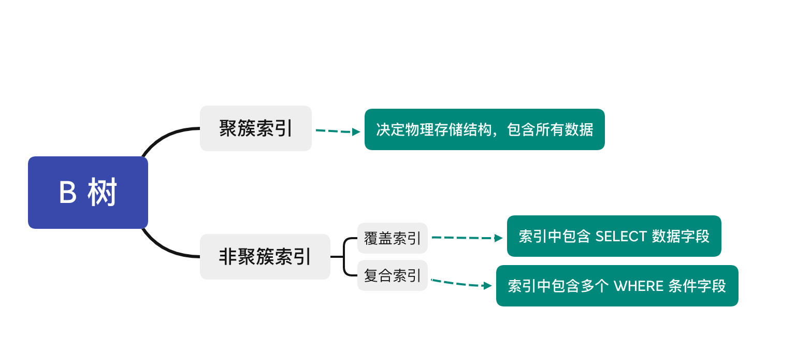

## 数据库知识手册

## 1、数据库基础概念

### 1.1、什么是数据库

**数据库（Database）** 是保存有组织的数据的容器（通常是一个文件或一组文件），是通过 **数据库管理系统（DataBase- Management System，DBMS）** 创建和操纵的容器。DBMS 的主要目标是提供一种可以方便、高效地存取数据库信息的途径。

我们常说 XX 数据库，其实实质上是 XX 数据库管理系统。目前，较为流行的数据库管理系统有 MySQL、SQL Server、Oracle 等。

数据库有两种类型，分别是 **关系型数据库** 和 **非关系型数据库**。

| 数据库类型     |                             定义                             |                             优点                             |                             缺点                             |                        常见                        |
| -------------- | :----------------------------------------------------------: | :----------------------------------------------------------: | :----------------------------------------------------------: | :------------------------------------------------: |
| 关系型数据库   | 建立在关系模型基础上，由多张能互相连接的 **表** 组成的数据库 | 1）使用表结构，格式一致，易于维护；2）使用 SQL 语句，可用于复杂查询；3）数据存储在磁盘中，安全性高 | 1）读写性能比较差；2）建立在关系模型上，不可避免空间浪费；3）固定的表结构，灵活度较低 | MySQL，Microsoft SQL Server，Oracle，PostgreSQL 等 |
| 非关系型数据库 | 非关系型数据库又被称为 NoSQL（Not Only SQL )，通常指数据以 **对象** 的形式存储在数据库中，而对象之间的关系通过每个对象自身的属性来决定。 | 1) 存储数据的格式可以是 key-value 、文档、图片等形式，应用场景更广泛；2）可轻松进行海量数据的维护和处理；3）具有可扩展、高并发、高稳定性、成本低的优势；4）可以实现数据的分布式处理 | 1）不提供 SQL 支持；2）无事务处理，无法保证数据的完整性和安全性；3）功能没有关系型数据库完善 |              Neo4j，Redis，MongoDB 等              |

### 1.2、为什么要使用数据库

|   数据保存方式   |                             优点                             |                         缺点                         |
| :--------------: | :----------------------------------------------------------: | :--------------------------------------------------: |
|  数据保存在内存  |                          存取速度快                          |                   数据无法永久保存                   |
|  数据保存在文件  |                        数据可永久保存                        | 查询数据不方便；操作速度比内存操作慢，频繁的 IO 操作 |
| 数据保存在数据库 | 数据可永久保存且数据安全性高；使用 SQL 语句，查询方便效率高；便于数据管理、智能化数据分析 |  数据库移植不方便；不支持集群；不擅长业务逻辑的处理  |

总而言之，面对庞大的网络数据量，使用数据库可以高效且条理分明地存储数据，它使人们能够更加迅速和方便地管理数据。

### 1.3、SQL 与 MySQL 有什么区别

SQL 和 MySQL 是 DBMS 中最令人困惑的两个术语，二者之间存在本质上的区别。

- SQL 是一种 **结构化查询语言**，用于在数据库上执行各种操作，但 MySQL 是一个 **关系数据库管理系统（RDBMS）**，使用 SQL 执行所有数据库操作。
- SQL 用于访问，更新和操作数据库中的数据，用户使用时需要学习该语言，然后编写查询，而 MySQL 是一个软件，会为用户提供一个界面，只需单击一些按钮即可用于执行各种数据库操作。
- 由于 MySQL 是一个软件，所以它会定期获得各种更新，但在 SQL 中，命令总是相同的。

### 1.4、数据库三大范式是什么

数据库范式是设计数据库时，需要遵循的一些规范。各种范式是条件递增的联系，越高的范式数据库冗余越小。常用的数据库三大范式为：

- **第一范式（1NF）**：每个列都不可以再拆分，强调的是列的原子性。第一范式要求数据库中的表都是二维表。
- **第二范式（2NF）**：在第一范式的基础上，一个表必须有一个主键，非主键列 **完全依赖** 于主键，而不能是依赖于主键的一部分。
- **第三范式（3NF）**：在第二范式的基础上，非主键列只依赖（直接依赖）于主键，不依赖于其他非主键。

### 1.5、数据库连接泄露的含义

数据库连接泄露指的是如果在某次使用或者某段程序中没有正确地关闭 Connection、Statement 和 ResultSet 资源，那么每次执行都会留下一些没有关闭的连接，这些连接失去了引用而不能得到重新使用，因此就造成了数据库连接的泄漏。数据库连接的资源是宝贵而且是有限的，如果在某段使用频率很高的代码中出现这种泄漏，那么数据库连接资源将被耗尽，影响系统的正常运转。

### 1.6、什么是触发器

触发器（trigger）是与表相关的数据库对象，是用户定义在关系表上的一类由事件驱动的特殊的存储过程，在满足定义条件时触发，并执行触发器中定义的 **语句集合**。触发器的这种特性可以协助应用在数据库端确保 **数据库的完整性**。

**使用场景**

- 可以通过数据库中的相关表实现 **级联更改**；
- 实时监控某张表中的某个字段的更改，并需要做出相应的处理。

## 2、索引

在面试环节中，谈及数据库问题时，不可避免地会涉及 **数据库索引** 知识，关于索引的概念、原理和意义等等问题，我们都该有所了解并掌握。本章主要介绍有关索引知识点的面试重点。

索引是一种 **数据结构**。数据库索引是 DBMS 中一个 **排序的数据结构**，以 **协助快速查询、更新** 数据库表中数据。索引的实现通常使用 B 树以及变种 B+ 树。

更通俗地说，索引就相当于目录，其存在是为了方便数据内容查找，本身也占用物理空间。

### 2.1、索引的优缺点

**索引的优点**

- 通过创建 **唯一性索引**，可以保证数据库表中每一行数据的唯一性；
- 可以加快数据的 **检索速度**，这也是创建索引的主要原因；
- 可以加速表和表之间的连接，特别是在实现 **数据的参考完整性** 方面特别有意义；
- 通过使用索引，可以在查询的过程中，使用 **优化隐藏器**，提高系统性能。

**索引的缺点**

- 时间上，创建和维护索引都要耗费时间，这种时间随着数据量的增加而增加，具体地，当对表中的数据进行增加、删除和修改的时候，索引也要动态的维护，这样就降低了数据的维护速度；
- 空间上，索引需要占 **物理空间**，除了数据表占数据空间之外，每一个索引还要占一定的物理空间，如果要建立聚簇索引，那么需要的空间就会更大。

### 2.2、索引的数据结构

数据库索引根据结构分类，主要有 **B 树索引**、**Hash 索引** 和 **位图索引** 三种。

**B 树索引**

B 树索引，又称 **平衡树索引**，是 MySQL 数据库中使用最频繁的索引类型，MySQL、Oracle 和 SQL Server 数据库默认的都是 B 树索引（实际是用 B+ 树实现的，因为在查看表索引时，MySQL 一律打印 BTREE，所以简称为 B 树索引）。

B 树索引以 **树结构** 组织，它有一个或者多个分支结点，分支结点又指向单级的叶结点。其中，分支结点用于遍历树，叶结点则保存真正的值和位置信息。

B+ 树是在 B 树基础上的一种优化，使其更适合实现外存储索引结构。

一棵 **m 阶 B-Tree** 的特性如下：

- 每个结点最多 m 个子结点；
- 除了根结点和叶子结点外，每个结点最少有 m/2（向上取整）个子结点；
- 所有的叶子结点都位于同一层；
- 每个结点都包含 k 个元素（关键字），这里 m/2≤k<m，这里 m/2 向下取整；
- 每个节点中的元素（关键字）从小到大排列；
- 每个元素子左结点的值，都小于或等于该元素，右结点的值都大于或等于该元素。

数据库以 B-Tree 的数据结构存储数据的图示如下：


B+ Tree 与 B-Tree 的结构很像，但是也有自己的特性：

- 所有的非叶子结点只存储 **关键字信息**；
- 所有具体数据都存在叶子结点中；
- 所有的叶子结点中包含了全部元素的信息；
- 所有叶子节点之间都有一个链指针。

数据库以 B+ Tree 的数据结构存储数据的图示如下：


**Hash 索引**

哈希索引采用一定的 **哈希算法**（常见哈希算法有 **直接定址法**、**平方取中法**、**折叠法**、**除数取余法**、**随机数法**），将数据库字段数据转换成定长的 Hash 值，与这条数据的行指针一并存入 Hash 表的对应位置，如果发生 **Hash 碰撞**（两个不同关键字的 Hash 值相同），则在对应 Hash 键下以 **链表形式** 存储。

检索时不需要类似 B+ 树那样从根节点到叶子节点逐级查找，只需一次哈希算法即可立刻定位到相应的位置，速度非常快，平均检索时间为 `O(1)`。

**位图索引**

B 树索引擅长于处理包含许多不同值的列，但是在处理基数较小的列时会变得很难使用。如果用户查询的列的基数非常的小， 即只有几个固定值，如性别、婚姻状况、行政区等等，要么不使用索引，查询时一行行扫描所有记录，要么考虑建立位图索引。

位图索引为存储在某列中的每个值生成一个位图。例如针对表中婚姻状况这一列，生成的位图索引大致如下所示：

| Value / Row ID |  1   |  2   |  3   |  4   |  5   |  6   |  ……  |
| :------------: | :--: | :--: | :--: | :--: | :--: | :--: | :--: |
|      未婚      |  1   |  1   |  0   |  0   |  0   |  0   |      |
|      已婚      |  0   |  0   |  0   |  1   |  1   |  1   |      |
|      离婚      |  0   |  0   |  1   |  0   |  0   |  0   |      |

对于婚姻状况这一列，索引包含 3 个位图，即生成有 3 个向量，分别属于每一个取值，每个位图为每一个人（行）都分配了 `0/1` 值（每一行有且仅有一个 `1` ），未婚为 110000……，已婚为 000111……，离婚为 001000……。

当进行数据查找时，只要查找相关位图中的所有 `1` 值即可（可根据查询需求进行与、或运算）。

例如， Oracle 用户可以通过为 `create index` 语句简单地添加关键词 `bitmap` 生成位图：

```

CREATE BITMAP INDEX acc_marital_idx ON account (marital_cd);
```

除了上述提及的，位图索引适合只有几个固定值的列，还需注意 ，位图索引适合静态数据，而不适合索引频繁更新的列。

### 2.3、使用 B+ 树的好处

- 由于 B+ 树的内部结点只存放键，不存放值，因此，一次读取，可以在同一内存页中获取更多的键，有利于更快地缩小查找范围。
- B+ 树的叶结点由一条链相连，因此当需要进行一次 **全数据遍历** 的时候，B+ 树只需要使用 O(logN) 时间找到最小结点，然后通过链进行 O(N) 的顺序遍历即可；或者，在找 **大于某个关键字或者小于某个关键字的数据** 的时候，B+ 树只需要找到该关键字然后沿着链表遍历即可。

### 2.4、Hash 索引和 B+ 树索引的区别

Hash 索引和 B+ 树索引有以下几点显见的区别：

- Hash 索引进行等值查询更快（一般情况下），但是却无法进行范围查询；
- Hash 索引不支持使用索引进行排序；
- Hash 索引不支持模糊查询以及多列索引的最左前缀匹配，原理也是因为 Hash 函数的不可预测；
- Hash 索引任何时候都避免不了回表查询数据，而 B+ 树在符合某些条件（聚簇索引，覆盖索引等）的时候可以只通过索引完成查询；
- Hash 索引虽然在等值查询上较快，但是不稳定，性能不可预测，当某个键值存在大量重复的时候，发生 Hash 碰撞，此时效率可能极差；而 B+ 树的查询效率比较稳定，对于所有的查询都是从根结点到叶子结点，且树的高度较低。

### 2.5、什么是前缀索引

有时需要索引很长的字符列，它会使索引变大并且变慢，一个策略就是索引开始的几个字符，而不是全部值，即被称为 **前缀索引**，以节约空间并得到好的性能。使用前缀索引的前提是 **此前缀的标识度高**，比如密码就适合建立前缀索引，因为密码几乎各不相同。

前缀索引需要的空间变小，但也会降低选择性。索引选择性（`INDEX SELECTIVITY`）是不重复的索引值（也叫基数）和表中所有行数（T）的比值，数值范围为 1/T ～1。高选择性的索引有好外，因为在查找匹配的时候可以过滤掉更多的行，唯一索引的选择率为  1，为最佳值。对于前缀索引而言，前缀越长往往会得到好的选择性，但是短的前缀会节约空间，所以实操的难度在于前缀截取长度的抉择，可以通过调试查看不同前缀长度的 **平均匹配度**，来选择截取长度。

### 2.6、什么是最左前缀匹配原则

在 MySQL 建立 **联合索引（多列索引）** 时会遵守最左前缀匹配原则，即 **最左优先**，在检索数据时从联合索引的最左边开始匹配。例如有一个 3 列索引（a,b,c），则已经对（a）、（a,b）、（a,b,c）上建立了索引。所以在创建 **多列索引**时，要根据业务需求，`where` 子句中 **使用最频繁** 的一列放在最左边。

根据最左前缀匹配原则，MySQL 会一直向右匹配直到遇到 **范围查询**（>、<、between、like）就停止匹配，比如采用查询条件  `where a = 1 and b = 2 and c > 3 and d = 4`  时，如果建立（a,b,c,d）顺序的索引，d 是用不到索引的，如果建立（a,b,d,c）的索引则都可以用到，并且 `where` 子句中 a、b、d 的顺序可以任意调整。

如果建立的索引顺序是 （a,b） ，那么根据最左前缀匹配原则，直接采用查询条件  `where b = 1` 是无法利用到索引的。

### 2.7、添加索引的原则

索引虽好，但也不是无限制使用的，以下为添加索引时需要遵循的几项建议性原则：

- 在 **查询中很少使用** 或者参考的列不要创建索引。由于这些列很少使用到，增加索引反而会降低系统的维护速度和增大空间需求。
- **只有很少数据值的列** 也不应该增加索引。由于这些列的取值很少，区分度太低，例如人事表中的性别，在查询时，需要在表中搜索的数据行的比例很大。增加索引，并不能明显加快检索速度。
- 定义为 `text`、`image` 和 `bit` 数据类型的列不应该增加索引。这是因为，这些列的数据量要么相当大，要么取值很少。
- 当 **修改性能远远大于检索性能** 时，不应该创建索引。这时因为，二者是相互矛盾的，当增加索引时，会提高检索性能，但是会降低修改性能。
- 定义有 **外键** 的数据列一定要创建索引。

### 2.8、什么是聚簇索引

**聚簇索引**，又称 **聚集索引**， 首先并不是一种索引类型，而是一种数据存储方式。具体的，聚簇索引指将 **数据存储** 和 **索引** 放到一起，找到索引也就找到了数据。

MySQL 里只有 INNODB 表支持聚簇索引，INNODB 表数据本身就是聚簇索引，非叶子节点按照主键顺序存放，叶子节点存放主键以及对应的行记录。所以对 INNODB 表进行全表顺序扫描会非常快。

**特点**

- 因为索引和数据存放在一起，所以具有更高的检索效率；
- 相比于非聚簇索引，聚簇索引可以减少磁盘的 IO 次数；
- 表的物理存储依据聚簇索引的结构，所以一个数据表只能有一个聚簇索引，但可以拥有多个非聚簇索引；
- 一般而言，会在频繁使用、排序的字段上创建聚簇索引。

**非聚簇索引**

除了聚簇索引以外的其他索引，均称之为非聚簇索引。非聚簇索引也是 B 树结构，与聚簇索引的存储结构不同之处在于，非聚簇索引中不存储真正的数据行，只包含一个指向数据行的指针。

就简单的 SQL 查询来看，分为 `SELECT` 和 `WHERE` 两个部分，索引的创建也是以此为根据的，分为 **复合索引** 和 **覆盖索引**。




## 3、事务管理

### 3.1、什么是数据库事务

数据库的 **事务**（Transaction）是一种机制、一个操作序列，包含了一组数据库操作命令，其执行的结果必须使数据库从一种一致性状态变到另一种一致性状态。事务把所有的命令作为一个整体一起向系统提交或撤销操作请求，即这一组数据库命令要么都执行，要么都不执行，因此事务是一个不可分割的工作逻辑单元。如果任意一个操作失败，那么整组操作即为失败，会回到操作前状态或者是上一个节点。

因此，事务是保持 **逻辑数据一致性** 和 **可恢复性** 的重要利器。而锁是实现事务的关键，可以保证事务的完整性和并发性

### 3.2、有哪些事务状态

事务在其整个生命周期中会经历不同的状态，这些状态也称为 **事务状态**。

- **活跃状态**：事务的第一个状态，任何正在执行的事务都处于此状态，所做的 **更改** 存储在 **主内存的缓冲区** 中。
- **部分提交状态**：执行上次操作后，事务进入部分提交状态。之所以是部分提交，是因为所做的更改仍然在主内存的缓冲区中。
- **失败状态**：如果某个检查在活动状态下失败，在活动状态或部分提交状态发生一些错误，并且事务无法进一步执行，则事务进入失败状态。
- **中止状态**：如果任何事务已达到失败状态，则恢复管理器将数据库回滚到开始执行的原始状态。
- **提交状态**：如果所有操作成功执行，则来自 **部分提交状态** 的事务进入提交状态。无法从此状态回滚，它是一个新的 **一致状态**。

### 3.3、事务的四大特性

事务具有 4 个特性，即原子性（Atomicity）、一致性（Consistency）、隔离性（Isolation）和持久性（Durability），这 4 个特性通常简称为 ACID，**关系型数据库** 需要遵循 ACID 规则。

- 原子性

  事务是最小的执行单位，不可分割的（原子的）。事务的原子性确保动作要么全部执行，要么全部不执行。

  以 **银行转账** 事务为例，如果该事务提交了，则这两个账户的数据将会更新；如果由于某种原因，事务在成功更新这两个账户之前终止了，则不会更新这两个账户的余额，并且会 **撤销** 对任何账户余额的修改，回到此操作前状态，即事务不能部分提交。

- 一致性

  当事务完成时，数据必须处于一致状态，多个事务对同一个数据读取的结果是相同的。

  以银行转账事务事务为例。在事务开始之前，所有 **账户余额的总额处于一致状态**。在事务进行的过程中，一个账户余额减少了，而另一个账户余额尚未修改。因此，所有账户余额的总额处于不一致状态。但是当事务完成以后，账户余额的总额再次恢复到一致状态。

- 隔离性

  **并发访问数据库** 时，一个用户的事务不被其他事务所干扰，各个事务不干涉内部的数据。

  修改数据的事务可以在另一个使用相同数据的事务开始之前访问这些数据，或者在另一个使用相同数据的事务结束之后访问这些数据。

- 持久性

  一个事务被提交之后，它对数据库中数据的改变是持久的，即使数据库发生故障也不应该对其有任何影响。

### 3.4、如何实现事务的 ACID 特性

事务的 ACID 特性是由关系数据库管理系统来实现的。

DBMS 采用 **日志** 来保证事务的 **原子性**、**一致性** 和 **持久性**。日志记录了事务对数据库所做的更新，如果某个事务在执行过程中发生错误，就可以根据日志，撤销事务对数据库已做的更新，使数据库退回到执行事务前的初始状态。

DBMS 采用 **锁机制** 来实现事务的隔离性。当多个事务同时更新数据库中相同的数据时，只允许 **持有锁的事务** 能更新该数据，其他事务必须等待，直到前一个事务释放了锁，其他事务才有机会更新该数据。

### 3.5、事务之间的相互影响

- 脏读（Dirty Read）

  一个事务读取了另一个事务未提交的数据。

- 不可重复读（Non-repeatable Read）

  就是在一个事务范围内，两次相同的查询会返回两个不同的数据，这是因为在此间隔内有其他事务对数据进行了修改。

- 幻读（Phantom Read）

  幻读是指当事务 **不是独立执行时** 发生的一种现象，例如有一个事务对表中的数据进行了修改，这种修改涉及到表中的全部数据行，同时，第一个事务也修改这个表中的数据，这种修改是向表中 **插入一行新数据**。那么，第一个事务的用户发现表中还有没有修改的数据行，就好像发生了幻觉一样。

- 丢失更新（Lost Update）

  两个事务同时读取同一条记录，事务 A 先修改记录，事务 B 也修改记录（B 是不知道 A 修改过），当 B 提交数据后， 其修改结果覆盖了 A 的修改结果，导致事务 A 更新丢失。

### 3.6、什么是事务的隔离级别

为了尽可能的避免上述事务之间的相互影响，从而达到事务的四大特性，SQL 标准定义了 4 种不同的事务隔离级别（TRANSACTION ISOLATION LEVEL），即 **并发事务对同一资源的读取深度层次**，由低到高依次是 读取未提交（READ-UNCOMMITTED）、读取已提交（READ-COMMITTED）、可重复读（REPEATABLE-READ）、可串行化（SERIALIZABLE），这 4 个级别与事务相互间影响问题对应如下：

|  隔离级别  | 脏读 | 不可重复读 | 幻读 | 丢失更新 |
| :--------: | :--: | :--------: | :--: | :------: |
| 读取未提交 |  是  |     是     |  是  |    是    |
| 读取已提交 |  否  |     是     |  是  |    是    |
|  可重复读  |  否  |     否     |  是  |    否    |
|  可串行化  |  否  |     否     |  否  |    否    |

- 读取未提交

  最低的隔离级别，一个事务可以读到另一个事务未提交的结果，所有的并发事务问题都会发生。

- 读取已提交

  只有在事务提交后，其更新结果才会被其他事务看见，可以解决 **脏读问题**，但是不可重复读或幻读仍有可能发生。Oracle 默认采用的是该隔离级别。

- 可重复读

  在一个事务中，对于同一份数据的读取结果总是相同的，无论是否有其他事务对这份数据进行操作，以及这个事务是否提交，除非数据是被本身事务自己所修改。可以解决 **脏读、不可重复读**。MySQL 默认采用可重复读隔离级别。

- 可串行化

  事务 **串行化执行**，隔离级别最高，完全服从 ACID，牺牲了系统的并发性，也就是说，所有事务依次逐个执行，所以可以解决并发事务的所有问题。


## 4、锁

在上一章中，提及事务之间的相互影响时，介绍了脏读、幻读等几种类型的数据错误，为更好避免发生这些错误，引入了对资源的锁定。锁定的存在使得一个事务对他自己的数据块进行操作时，另外一个事务不能插足这个数据块。

### 4.1、锁的分类

从数据库系统的角度，锁模式可分为以下6 种类型：

- **共享锁（S）**：又叫 **他读锁**。可以并发读取数据，但不能修改数据。也就是说当数据资源上存在共享锁时，所有的事务都不能对该数据进行修改，直到数据读取完成，共享锁释放。

- **排它锁（X）**：又叫 **独占锁**、**写锁**。对数据资源进行增删改操作时，不允许其它事务操作这块资源，直到排它锁被释放，从而防止同时对同一资源进行多重操作。

- **更新锁（U）**：防止出现 **死锁** 的锁模式，两个事务对一个数据资源进行先读取再修改的情况下，使用共享锁和排它锁有时会出现死锁现象，而使用更新锁就可以避免死锁的出现。

  资源的更新锁一次只能分配给一个事务，如果需要对资源进行修改，更新锁会变成排它锁，否则变为共享锁。

- **意向锁**：表示 SQL Server 需要在 **层次结构中的某些底层资源上** 获取共享锁或排它锁。例如，放置在 **表级** 的 **共享意向锁** 表示事务打算在表中的页或行上放置共享锁。在表级设置意向锁可防止另一个事务随后在包含那一页的表上获取排它锁。

  意向锁可以提高性能，因为 SQL Server 仅在 **表级** 检查意向锁来确定事务是否可以安全地获取该表上的锁，而无须检查表中的每行或每页上的锁以确定事务是否可以锁定整个表。

  意向锁包括意向共享 (IS)、意向排它 (IX) 以及与意向排它共享 (SIX)。

- **架构锁**：在执行 **依赖于表架构的操作** 时使用。架构锁的类型为：架构修改 (Sch-M) 和架构稳定性 (Sch-S)，执行表的数据定义语言 （DDL）操作（例如添加列或除去表）时使用架构修改锁，当编译查询时，使用架构稳定性锁。

- **大容量更新锁（BU）**：向表中大容量复制数据并指定了  `TABLOCK`  提示时使用。 大容量更新锁允许进程将数据并发地大容量复制到同一表，同时防止其它不进行大容量复制数据的进程访问该表。

### 4.2、事务隔离级别与锁的关系

- 在 **读取未提交** 隔离级别下，读取数据不需要加 **共享锁**，这样就不会跟被修改的数据上的 **排他锁** 冲突；
- 在 **读取已提交** 隔离级别下，读操作需要加 **共享锁**，但是在语句执行完以后释放共享锁；
- 在 **可重复读** 隔离级别下，读操作需要加 **共享锁**，但是在事务提交之前并不释放共享锁，也就是必须等待事务执行完毕以后才释放共享锁；
- **可串行化** 是限制性最强的隔离级别，因为该级别 **锁定整个范围的键**，并一直持有锁，直到事务完成。

### 4.3、什么是死锁？如何解决死锁？

死锁是指两个或多个事务在同一资源上相互占用，并请求锁定对方的资源，从而导致恶性循环的现象。

**常见的解决死锁的方法**

- 如果不同程序并发存取多个表，尽量约定 **以相同的顺序访问表**，可以大大降低死锁机会；
- 在同一个事务中，尽可能做到 **一次锁定所需要的所有资源**，减少死锁产生概率；
- 对于非常容易产生死锁的业务部分，可以尝试使用 **升级锁定颗粒度**，通过 **表级锁** 定来减少死锁产生的概率。

### 4.4、什么是乐观锁和悲观锁？如何实现？

DBMS 中的 **并发控制** 的任务是确保在 **多个事务同时存取数据库中同一数据** 时不破坏事务的隔离性和统一性以及数据库的统一性。乐观并发控制（乐观锁）和悲观并发控制（悲观锁）是并发控制主要采用的技术手段。

**悲观锁**：假定会发生并发冲突，屏蔽一切可能违反数据完整性的操作。在查询完数据的时候就把事务锁起来，直到提交事务。这对于长事务来讲，可能会严重影响系统的并发处理能力。实现方式：使用数据库中的锁机制。

**乐观锁**：假设不会发生并发冲突，只在提交操作时检查是否违反数据完整性。乐观锁适用于 **读多写少** 的应用场景，这样可以提高吞吐量。实现方式：一般会使用版本号机制或 CAS 算法实现。

## 5、常用 SQL 语句

当我们选择学习关系型数据库时，具体无论是 MySQL、SQL Server 还是 Oracle，我们都必须学习 SQL 语言，充分理解它的语言能力以及如何组合不同的功能以产生强大的结果。也许，还未来得及进行实操，但是在面试之前，突击性准备高频面试题，效果还是立竿见影的。

本章主讲常用 SQL 语言，选择 MySQL 作为示例数据库服务器。

### 5.1、SQL 语句主要分为哪些类别

SQL 语句可分为以下几类：

- 数据定义语言 DDL（Data Ddefinition Language）：例如 `CREATE`，`DROP`，`ALTER `  等，对逻辑结构等有操作的，其中包括表结构，视图和索引。
- 数据查询语言 DQL（Data Query Language）：即查询操作，以 `SELECT` 关键字为主，各种简单查询、连接查询等都属于 DQL。
- 数据操纵语言 DML（Data Manipulation Language）：例如 `INSERT`，`UPDATE`，`DELETE` 等，对数据进行操作的。DQL 与 DML共同构建了多数初级程序员常用的 **增删改查** 操作，而查询是较为特殊的一种，被划分到 DQL 中。
- 数据控制功能 DCL（Data Control Language）：例如 `GRANT`，`REVOKE`，`COMMIT`，`ROLLBACK` 等，对数据库安全性、完整性等有操作的，可以简单的理解为权限控制等。

### 5.2、什么是超键？什么是主键？

- **超 键**：在关系中，能唯一标识元组的属性集称为关系模式的超键。一个属性可以作为一个超键，多个属性组合在一起也可以作为一个超键。超键包含候选键和主键。
- **候选键**：是最小超键，即没有冗余元素的超键。
- **主 键**：数据库表中对储存数据对象予以 **唯一和完整标识的数据列或属性的组合**。一个数据列只能有一个主键，且主键的取值不能缺失，即不能为空值（NULL）。
- **外 键**：在一个表中存在的另一个表的主键称此表的外键，外键可以有重复的, 可以是空值。外键是用来和其他表建立联系用的。

### 5.3、SQL 约束有哪几种类型

约束是一种简单地强加于表中一列或多列的限制，从而保证表中数据一致性（准确和可靠）。以下为六大约束：

- **非空约束（NOT NULL）**：保证该字段值一定不为空；
- **默认约束（DEFAULT）**：保证字段有默认值；
- **主键约束（PRIMARY KEY）**：标志一列或者多列，并保证其值在表内的唯一性；
- **外键约束（FOREIGN KEY）**：限制一列或多列中的值必须被包含在另一表的外键列中，并且在级联更新或级联删除规则建立后也可以限制其他表中的可用值；
- **唯一约束（UNIQUE）**： 限制一列或多列的值，保证字段值在表内的唯一性，可以为空（主键约束是一种特殊类型的唯一约束）；
- **检查约束（CHECK）**：限制一列的可用值范围。

### 5.4、char 与 varchar 的区别

- char 表示定长字符串，长度是固定的，最多能存放的字符个数为 255，和编码无关；而 varchar 表示可变长字符串，长度是可变的，最多能存放的字符个数为 65532；
- 使用 char 时，如果插入数据的长度小于 char 的固定长度时，则用空格填充；
- 因为固定长度，char 的存取速度比 varchar 快很多，同时缺点是会占用多余空间，属于空间换时间；

### 5.5、有哪些关联查询

在项目开发过程中，使用数据库查询语句时，有很多需求都是要涉及到较为复杂或者多表的连接查询，需要关联查询实现。以下为总结的  MySQL 的五种关联查询。

- **交叉连接（CROSS JOIN）**

  除了在 `FROM` 子句中使用 **逗号间隔连接的表** 外，SQL 还支持另一种被称为交叉连接的操作，它们都返回被连接的两个表所有数据行的 **笛卡尔积**，返回到的数据行数等于第一个表中符合查询条件的数据行数 **乘以** 第二个表中符合查询条件的数据行数。惟一的不同在于，交叉连接分开列名时，使用 `CROSS JOIN` 关键字而不是逗号，即以下两个表达式等价：

  ```sql
  SELECT  *  FROM  A, B
  SELECT  *  FROM  A  CROSS JOIN  B
  ```

- **内连接（INNER JOIN）**

  内连接分为三类，分别是 **等值连接**：`ON A.id = B.id`、**不等值连接**：`ON A.id > B.id`  和 **自连接**：SELECT * `FROM A T1 INNER JOIN A T2 ON T1.id = T2.pid`。

- **外连接（LEFT JOIN/RIGHT JOIN）**

- **左外连接**：以左表为主，先查询出左表，按照 `ON` 后的关联条件匹配右表，没有匹配到的用 `NULL` 填充，可以简写成 `LEFT JOIN`；

- **右外连接**：以右表为主，先查询出右表，按照 `ON` 后的关联条件匹配左表，没有匹配到的用 `NULL` 填充，可以简写成 `RIGHT JOIN`；

- **联合查询（UNION 与 UNION ALL）**

  ```
  SELECT * FROM A UNION SELECT * FROM B UNION ...
  ```

  联合查询就是把多个结果集集中在一起，`UNION` 前的结果为基准，需要注意的是联合查询的 **列数要相等**，相同的记录行会合并；

  如果使用 `UNION ALL`，不会合并重复的记录行，所以效率更高。

- **全连接（FULL JOIN）**

  MySQL 本身不支持全连接，但可以通过联合使用 `LEFT JOIN`、`UNION` 和 `RIGHT JOIN` 来实现。

  ```
  SELECT * FROM A LEFT JOIN B ON A.id = B.id UNIONSELECT * FROM A RIGHT JOIN B ON A.id = B.id
  ```

### 5.6、什么是子查询

多条 MySQL 语句嵌套使用时，内部的 MySQL 查询语句称为子查询。子查询是一个 `SELECT` 语句，它嵌套在另一个 `SELECT`、`SELECT…INTO` 语句、`INSERT…INTO` 语句、`DELETE` 语句、 `UPDATE` 语句或嵌套在另一子查询中。

MySQL 的子查询是多表查询的一个重要组成部分，常常和 **连接查询** 一起使用，是多表查询的基础。

### 5.7、子查询的分类

子查询分为以下四类：

- **标量子查询**

  查询返回单一值的标量，如一个数字或一个字符串，是子查询中最简单的形式。

- **列子查询**

  子查询返回的结果集是 N 行一列，该结果通常来自对表的 **某个字段** 查询返回。

- **行子查询**

  子查询返回的结果集是一行 N 列，该结果通常是对表的 **某行数据** 进行查询而返回的结果集

- **表子查询**

  子查询返回的结果集是 N 行 N 列的一个表数据。

### 5.8、DROP、DELETE 与 TRUNCATE 的区别

三种都可以表示删除，其中的细微区别之处如下：

|              |                           DROP                            |                    DELETE                     |              TRUNCATE               |
| :----------: | :-------------------------------------------------------: | :-------------------------------------------: | :---------------------------------: |
| SQL 语句类型 |                            DDL                            |                      DML                      |                 DDL                 |
|     回滚     |                         不可回滚                          |                    可回滚                     |              不可回滚               |
|   删除内容   | 从数据库中 **删除表**，所有的数据行，索引和权限也会被删除 | 表结构还在，删除表的 **全部或者一部分数据行** | 表结构还在，删除表中的 **所有数据** |
|   删除速度   |                       删除速度最快                        |           删除速度慢，需要逐行删除            |             删除速度快              |

因此，在不再需要一张表的时候，采用 `DROP`；在想删除部分数据行时候，用 `DELETE`；在保留表而删除所有数据的时候用 `TRUNCATE`。

### 5.9、UNION 与 UNION ALL 的区别

`UNION` 用于把来自多个 `SELECT` 语句的结果组合到一个结果集合中，MySQL 会把结果集中 **重复的记录删掉**，而使用 `UNION ALL`，MySQL 会把所有的记录返回，且效率高于 `UNION` 。

## 6、Redis 常见面试题

### 6.1、Redis 缓存的特点

作为一个高性能的 Key-Value 数据库，Redis 与其他 Key-Value 缓存产品相比，有以下三个特点：

- Redis 运行在内存中但是可以 **持久化到磁盘**，重启的时候可以再次加载进行使用。
- Redis 不仅仅支持简单的 Key-Value 类型的数据，同时还提供 List，Set，Sorted set，hash 等数据结构的存储。
- Redis 还支持数据的备份，即 Master-Slave 主从模式的数据备份。

### 6.2、Redis 和 MySQL 的区别

- 首先，类型上的不同。MySQL 是**关系型数据库**，采用表格的存储方式，数据以行列组织：一个表中，每行是一个条目，都有且仅有此表的列所规定的属性。MySQL 作为关系型数据库遵守了传统的数据库的 ACID 原则 [①]，这些要求在记录重要数据（如用户账户密码，银行户头等）时是必须的。Redis 是 **NoSQL**（**非关系型数据库**），不严格遵守 ACID 原则，其采用 key-value  存储组织数据，大量使用缓存来读写数据，周期性地把更新数据写入磁盘或在追加文件中写入修改操作，以及同步分布数据库等。这些特点为大大提高了  Redis 在极大并发量下的读写性能。由于不以表格方式组织数据，Redis 的数据扩展十分灵活方便。
- 功能不同。 MySQL 主要用于持久化的存储数据到硬盘，功能强大，但是读取速度较慢。而 Redis 将使用频繁的数据存储在缓存中，缓存的读取速度快，能够大大的提高运行效率，但是一般在使用中，Redis 缓存的数据保存时间是有限的。
- 运行机制不同。MySQL 作为典型的关系型数据库，为了严格遵守 ACID  规则必须采取保守的缓存策略，特别是为了保证数据的一致性，在保证数据可靠性的同时，牺牲了许多（特别是多并发情形下的）读写性能。而现在互联网许多应用场景往往面临了海量用户的访问请求，对数据库并不需要非常强的一致性 [②]。如 Redis 等非关系型数据库（NoSQL），往往以不再满足 ACID 为代价求得更高的吞吐容量。NoSQL  通常采用极大的缓存、分布式服务来提高读写性能。

------

① 原子性（Atomicity）、一致性（Consistency）、隔离性（Isolation）、持久性（Durability)。

② 比如推特网站的用户在当次刷新推特时，容许在最新 10 秒内新发的推特不出现在这次刷新结果，但是不希望自己的应用因为等待刷新而陷入 5 秒以上的停顿。

### 6.3、Redis 和 MongoDB 的区别

MongoDB 和 Redis 都是 NoSQL，采用结构型数据存储，二者之间的主要区别如下所示：

- **性能方面**，二者都很高，总体而言，TPS 方面 Redis 要大于 MongoDB；
- **可操作性上**，MongoDB 支持丰富的数据表达、索引，最类似于关系数据库，支持 **丰富的查询语言**，操作比 Redis 更为便利；
- **内存及存储方面**，MongoDB 适合 **大数据量存储**，依赖操作系统虚拟做内存管理，采用镜像文件存储，内存占有率比较高，Redis 2.0 后增加 **虚拟内存特性**，突破物理内存限制，数据可以设置时效性；
- **对于数据持久化和数据恢复**，MongoDB 1.8 后，采用 binlog 方式（同 MySQL）支持持久化，增加了可靠性，而 Redis 依赖快照进行持久化、AOF 增强可靠性，但是增强可靠性的同时，也会影响访问性能；
- **在数据一致性上**，MongoDB 不支持事务，靠客户端自身保证，而 Redis 支持事务，能保证事务中的操作按顺序执行；
- **数据分析上**，MongoDB 内置 **数据分析功能（mapreduce）**，而 Redis 不支持数据分析；
- **应用场景不同**，MongoDB 适合海量数据，侧重于访问效率的提升，而 Redis 适合于较小数据量，侧重于性能。

### 6.4、Redis 有哪些数据类型

Redis 的五大常用数据类型：

- **String（字符串）**，是 Redis 最基本的数据类型，二进制安全的，可以包含任何数据，比如 JPG 图片或者序列化的对象，最大能存储 512 MB。
- **Hash（哈希）**，是一个键值对（key => value）集合，特别适合用于存储对象。
- **List（列表）**，R6
- **Set（集合）**，是 String 类型的无序集合，通过哈希表实现，添删查找操作的复杂度都是 O(1)。
- **Sorted set（有序集合）**，和 Set 一样也是 String 类型元素的集合，且不允许元素重复， 不同的是每个元素都会关联一个 Double  类型的分数（可重复）， 通过此分数来为集合中的成员进行从小到大的排序。

### 6.5、如何实现 Redis 的定时机制

-------------------------

Redis 服务器是一个 **事件驱动程序**，服务器需要处理以下两类事件：**文件事件** （服务器对套接字操作的抽象）和 **时间事件**（服务器对定时操作的抽象）。Redis 的定时机制就是借助时间事件实现的。

一个时间事件主要由以下三个属性组成：`id`，时间事件标识号；`when`，记录时间事件的到达时间；`timeProc`，时间事件处理器，当时间事件到达时，服务器就会调用相应的处理器来处理时间。一个时间事件根据时间事件处理器的返回值来判断是定时事件还是周期性事件。

### 6.6、单线程 Redis，为什么如此高效

------------------------

虽然 Redis 文件事件处理器以单线程方式运行，但是通过使用 **I/O 多路复用程序** 来监听多个套接字，文件事件处理器既实现了高性能的网络通信模型，又可以很好地与 Redis 服务器中其他同样以单线程运行的模块进行对接，这保持了 Redis 内部单线程设计的简单性。

### 6.7、Redis 有哪些数据淘汰策略

----------------------

Redis 内存数据量达到一定限制的时候，就会实行数据淘汰策略（回收策略）。Redis 会根据 maxmemory-policy 配置策略，来决定具体的行为：

- **no-eviction**：不删除策略，达到最大内存限制时刻，如果需要更多内存，直接返回错误信息；
- **allkey-lru**：从所有 Key 的哈希表（`server.db[i].dict`）中随机挑选多个 Key，然后在选到的 Key 中利用 lru 算法淘汰最近最少使用的数据；
- **volatile-lru**：从已设置过期时间的哈希表（`server.db[i].expires`）中随机挑选多个 Key，然后在选到的 Key 中用 lru 算法淘汰最近最少使用的数据；
- **volatile-random**：从已设置过期时间的哈希表（`server.db[i].expires`）中随机挑选 Key淘汰掉；
- **allkey-random**：从所有的 Key 的哈希表（`server.db[i].dict`）中随机挑选数据淘汰；
- **volatile-ttl**：从已设置过期时间的哈希表（`server.db[i].expires`）中随机挑选多个 Key，然后在选到的 Key 中选择剩余时间最短的数据淘汰掉。

### 6.8、对 Redis 的理解

--------------------------

Redis，全称为 Remote Dictionary Server，本质上是一个 Key-Value  类型的内存数据库，整个数据库统统加载在内存当中进行操作，定期通过异步操作把数据库数据写入磁盘或把修改操作写入追加的记录文件，并且在此基础上实现  Master-Slave（主从）同步。它支持存储的 Value 类型多样，包括  String（字符串）、List（链表）、Set（集合）、zset（sorted set —— 有序集合）和  Hash（哈希类型），这些数据类型都支持 `push/pop`、`add/remove` 及取交集并集和差集及更丰富的操作，而且这些操作都是原子性的。

Redis 的主要缺点是数据库容量受到物理内存的限制，不能用作海量数据的高性能读写，因此 Redis 适合的场景主要局限在较小数据量的高性能操作和运算上。

## 7、数据库优化

---------------------

系统的吞吐量瓶颈往往出现在数据库的 **访问速度** 上，随着应用程序的运行，数据库的中的数据会越来越多，处理时间会相应变慢，因为其数据是存放在 **磁盘** 上的，读写速度无法和内存相比，所以使用数据库时，十分有必要了解数据库优化问题。其优化原则为：减少系统瓶颈，减少资源占用，增加系统的反应速度。

### 7.1、数据库结构优化

------------------------

在数据库设计中，需要考虑数据冗余、查询和更新的速度、字段的数据类型是否合理等多方面的内容。可通过以下方式进行数据库结构的优化：

- **将字段很多的表分解成多个表**

  对于字段较多的表，如果有些字段的使用频率很低，可以将这些字段分离出来形成新表。

- **增加中间表**

  对于需要经常 **联合查询** 的表，通过建立中间表以提高查询效率，具体地，将需要通过联合查询的数据插入到中间表中，然后将原来的联合查询改为对中间表的查询。

- **增加冗余字段**

  众所皆知，设计数据表时应尽量遵循范式理论的规约，尽可能的减少冗余字段，让数据库设计看起来精致、优雅。但是，表的规范化程度越高，表和表之间的关系越多，需要连接查询的情况也就越多，性能也就越差，所以合理的加入冗余字段可以提高查询速度。

### 7.2、MySQL 数据库 CPU 使用率飙升到 500% 的话，如何处理？

--------------------

当 CPU 飙升到 500% 时，先用操作系统命令 `top` 命令观察是不是 mysqld 占用导致的，如果不是，找出占用高的进程，并进行相关处理。

如果是 mysqld 造成的，通过 `SHOW PROCESSLIST` 查看正在运行的线程，是不是有消耗资源的 SQL 在运行，找出其中消耗高的 SQL，看看执行计划是否准确， index 是否缺失，或者是数据量太大造成。

然后 kill 掉这些线程（同时观察 CPU 使用率是否下降），等进行相应的调整（比如说加索引、改 SQL、改内存参数）之后，再重新跑这些 SQL。

若每个 SQL 消耗资源都不多，只是同一时间大量的 session 连进来导致 CPU 飙升，这种情况就需要分析为何连接数会激增，再做出相应的调整，比如说限制连接数等。

### 7.3、为什么要分库分表

-----------------

数据库中的数据量不一定是可控的，随着时间和业务的发展，库中的表会越来越多，表中的数据量也会越来越大，相应地数据操作，例如 **增删改查的开销** 也会越来越大；另外，若不进行分布式部署，而一台服务器的 **资源** （CPU、磁盘、内存、IO 等）是有限的，最终数据库所能承载的数据量、数据处理能力都将遭遇瓶颈。所以，从 **性能** 和 **可用性** 角度考虑，会进行数据库拆分处理，具体地说，把原本存储于一个库的数据分块存储到多个库上，把原本存储于一个表的数据分块存储到多个表上，即 **分库分表**。

### 7.4、分库分表的具体实施策略

--------------------

分库分表有 **垂直切分** 和 **水平切分** 两种方式，在复杂的业务场景中，也可能会选择两者结合的方式。

| 切分方式 | 定义                                                         | 优点                                                         | 缺点                                                         | 应用场景                                                     |
| -------- | ------------------------------------------------------------ | ------------------------------------------------------------ | ------------------------------------------------------------ | ------------------------------------------------------------ |
| 垂直切分 | 数据表 **列** 的拆分，把一张列比较多的表拆分为多张表，具体地，根据数据库里面数据表的相关性进行拆分 | 可以使行数据变小，在查询时减少读取的 Block 数，减少 I/O 次数；简化表结构，更易于维护 | 主键会出现冗余，需要管理冗余列；会引起 JOIN 操作；加大事务管理的难度 | 适合 **表多** 且 各项 **业务逻辑** 划分清晰、低耦合情景      |
| 水平切分 | 数据表 **行** 的拆分，是一种横向按业务维度切分的方式，保持数据表结构不变，通过某种策略存储数据分片 | 可支持非常大的数据量存储；应用端改造少                       | 分片事务难以解决；会增加逻辑、部署、应用和运维的各种复杂度   | 水平拆分更适合进行 **分库** 或者 **单表数据量大** 且表中的数据本身就有独立性 |

--

### 7.5、分库分表存在哪些问题

---------------------

进行分库分表操作后，可能会面临以下几类问题：

- **事务问题**

  分库分表后，就成了分布式事务。如果依赖数据库本身的分布式事务管理功能去执行事务，将付出高昂的性能代价； 如果由应用程序去协助控制，形成程序逻辑上的事务，又会造成编程方面的负担。

- **跨库跨表的 JOIN 问题**

  在执行了分库分表之后，难以避免会将原本逻辑关联性很强的数据划分到不同的表、不同的库上，这时，表的关联操作将受到限制，我们无法 JOIN 位于不同分库的表，也无法 JOIN 分表粒度不同的表，结果原本一次查询能够完成的业务，可能需要多次查询才能完成。

- **额外的数据管理负担和数据运算压力**

  额外的数据管理负担，最为常见的是数据的 **定位问题** 和数据的 **增删改查** 的重复执行问题，这些都可以通过应用程序来解决，但必然会引起额外的逻辑运算。

### 7.6、什么是 MySQL 主从复制

主从复制是指将 **主数据库**（**Master**）中的 **DDL** 和 **DML** 操作通过二进制日志传输到 **从数据库**（**Slave**）  上，然后将这些日志重新执行（重做），从而使得从数据库的数据与主数据库保持一致。MySQL 支持单向、异步复制，复制过程中一个服务器充当主服务器，而一个或多个其它服务器充当从服务器。

主从复制的作用有：

- 当主数据库出现问题时，可以切换到从数据库；
- 可以进行数据库层面的读写分离，实现负载均衡；
- 可以在从数据库上进行实时数据备份。

### 7.7、MySQL 主从复制的工作原理

----------------

MySQL 的主从复制是一个 **异步** 的复制过程（一般情况下感觉是实时的），数据将从一个 MySQL 数据库（Master）复制到另外一个 MySQL 数据库（Slave），在  Master 与  Slave 之间实现整个主从复制的过程是由三个线程参与完成的，其中有两个线程（SQL 线程和 I/O 线程）在 Slave  端，另外一个线程（ I/O 线程）在 Master 端。

**基本原理流程**

Master 端：打开二进制日志（binlog ）记录功能 —— 记录下所有改变了数据库数据的语句，放进 Master 的 binlog 中；

Slave 端：开启一个 I/O 线程 —— 负责从 Master上拉取 binlog 内容，放进自己的中继日志（Relay log）中；

Slave 端：SQL 执行线程 —— 读取 Relay log，并顺序执行该日志中的 SQL 事件。

### 7.8、MySQL 读写分离的实现方案、

---------

MySQL 读写分离的实现方式主要基于 **主从复制**，通过 **路由的方式** 使应用对数据库的写请求只在 Master 上进行，读请求在 Slave 上进行。

具体地，有以下四种实现方案：

- 方案一：**基于 MySQL proxy 代理**

  在应用和数据库之间增加 **代理层**，代理层接收应用对数据库的请求，根据不同请求类型（即是读 read 还是写 write）转发到不同的实例，在实现读写分离的同时可以实现负载均衡。MySQL 的代理最常见的是 mysql-proxy、cobar、mycat、Atlas 等。

- 方案二：**基于应用内路由**

  基于应用内路由的方式即为在应用程序中实现，针对不同的请求类型去不同的实例执行 SQL。

  具体实现可基于 spring 的 aop：用 aop 来拦截 spring 项目的 dao 层方法，根据方法名称就可以判断要执行的类型，进而动态切换主从数据源。

- 方案三：**基于 MySQL-Connector-Java 的 JDBC 驱动方式**

  Java 程序通过在连接 MySQL 的 JDBC 中配置主库与从库等地址，JDBC 会自动将读请求发送给从库，将写请求发送给主库，此外， MySQL 的 JDBC 驱动还能够实现多个从库的负载均衡。

- 方案四：**基于 sharding-jdbc 的方式**

  sharding-sphere 是强大的读写分离、分表分库中间件，sharding-jdbc 是 sharding-sphere 的核心模块。

