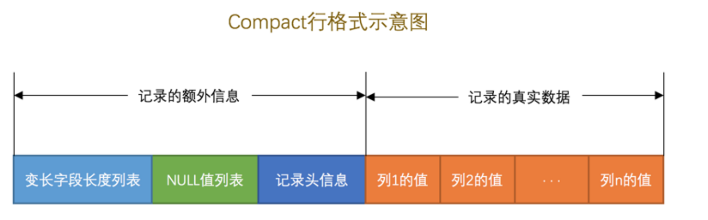
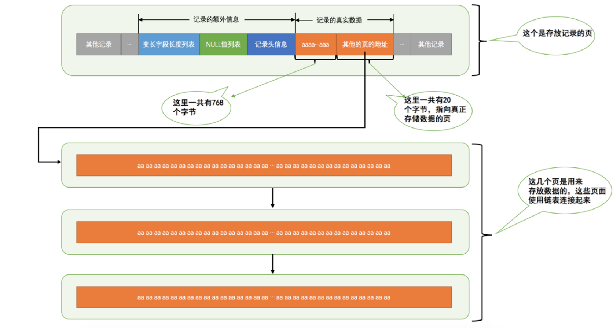

# 1、InnoDB记录结构 

## 1.1、InnoDB页简介

InnoDB 是一个将表中的数据存储到磁盘上的存储引擎，当我们想从表中获取某些记录时，InnoDB 采取的方式是：将数据划分为若干个页，以页作为磁盘和内存之间交互的基本单位，InnoDB中页的大小 一般为 ***16*** KB。也就是在一般情况下，一次最少从磁盘中读取16KB的内容到内存中，一次最少把内存中的16KB 

内容刷新到磁盘中。

## 1.2、InnoDB行格式 

我们平时是以记录为单位来向表中插入数据的，这些记录在磁盘上的存放方式也被称为 **行格式** 或者 **记录格式** 。 设计 InnoDB 存储引擎的大叔们到现在为止设计了4种不同类型的 行格式 ，分别是 Compact 、 Redundant 、 Dynamic 和 Compressed 行格式。

### 1.2.1、指定行格式的语法 

```sql
CREATE TABLE 表名 (列的信息) ROW_FORMAT=行格式名称
ALTER TABLE 表名 ROW_FORMAT=行格式名称
```

### 1.2.2、COMPACT行格式 



一条完整的记录其实可以被分为 **记录的额外信息** 和 **记录的真实数据** 两大部分，下边我 们详细看一下这两部分的组成。


#### 1.2.2.1、记录的额外信息 


这部分信息是服务器为了描述这条记录而不得不额外添加的一些信息，这些额外信息分为3类，分别是 变长字段长度列表 、 NULL值列表 和 记录头信息。


***变长字段长度列表\***

将一些变长的数据类型，比如 VARCHAR(M)，VARBINARY(M)，占用的字节数存起来，这些变长字段占的存储空间分为两部分： 

1.  真正的数据内容 
2. 占用的字节数

在 Compact 行格式中，把所有变长字段的真实数据占用的字节长度都存放在记录的开头部位，从而形成一个变长字段长度列表，各变长字段数据占用的字节数按照列的顺序逆序存放。

```sql
mysql> USE xiaohaizi;
Database changed
mysql> CREATE TABLE record_format_demo (
 -> c1 VARCHAR(10),
 -> c2 VARCHAR(10) NOT NULL,
 -> c3 CHAR(10),
 -> c4 VARCHAR(10)
 -> ) CHARSET=ascii ROW_FORMAT=COMPACT;
Query OK, 0 rows affected (0.03 sec)
```

 

c1 、 c2 、 c4 列都是 VARCHAR(10) 类型的，十六进制表示的长度分别为01 03 04。


变长字段长度列表 填入上边的示意图中的效果就是：另外需要注意的一点是，变长字段长度列表中只存储值为 非***NULL*** 的列内容占用的长度，值为 ***NULL*** 的列的长度 是不储存的 。


***NULL值列表\***

Compact 行格式把值为 NULL 的列统一管理起来，存储到 NULL 值列表中，处理过程是这样的： 

1. 首先统计表中允许存储 NULL 的列有哪些。 

- 主键列、被 NOT NULL 修饰的列都是不可以存储 NULL 值。

1. 将每个允许存储 NULL 的列对应一个二进制位，二进制位按照列的顺序逆序排列，二进制位表示的意义如下： 

- 二进制位的值为 1 时，代表该列的值为 NULL 。 
- 二进制位的值为 0 时，代表该列的值不为 NULL 。

1. NULL值列表 必须用整数个字节的位表示，如果不足，高位补0。

第一条记录，c1 、 c3 、 c4 这3个列的值都不为 NULL，用十六进制表示就是： 0x00 。

第二条记录， c1 、 c3 、 c4 这3个列中 c3 和 c4 的值都为 NULL，用十六进制表示就是： 0x06

 


***记录头信息\***


用于描述记录的记录头信息 ，它是由固定的 5 个字节组成。5 个字节也就是 40 个二进制位，不同的位代表不同的意思，如图： 

#### 1.2.2.2、记录的真实数据

对于 record_format_demo 表来说， 记录的真实数据 除了 c1 、 c2 、 c3 、 c4 这几个我们自己定义的列的数据以外， MySQL 会为每个记录默认的添加一些列（也称为 隐藏列 ），具体的列如下：

 

**InnoDB 表对主键的生成策略**：优先使用用户自定义主键作为主键，如果用户没有定义主键，则选取一个 Unique 键作为主键，如果表中连 Unique 键都没有定义的话，则 InnoDB 会为表默认添加一个名为row_id 的隐藏列作为主键。所以我们从上表中可以看出：InnoDB存储引擎会为每条记录都添加 ***transaction_id*** 和 ***roll_pointer*** 这两个列，但是 ***row_id*** 是可选的（在没有自定义主键以及Unique键的情况下才会添加该列）。 这些隐藏列的值不用我们操心， InnoDB 存储引擎会自己帮我们生成的。


### 1.2.3、总结

1. 页是 MySQL 中磁盘和内存交互的基本单位，也是 MySQL 是管理存储空间的基本单位。 
2. 指定和修改行格式的语法如下：

```sql
CREATE TABLE 表名 (列的信息) ROW_FORMAT=行格式名称
ALTER TABLE 表名 ROW_FORMAT=行格式名称
```

 \3. InnoDB 目前定义了4种行格式

- COMPACT行格式 

具体组成如图：


- Redundant行格式 

具体组成如图：



## Dynamic和Compressed行格式 

这两种行格式类似于 COMPACT行格式 ，只不过在处理行溢出数据时有点儿分歧，它们不会在	记录的真实 数据处存储字符串的前768个字节，而是把所有的字节都存储到其他页面中，只在记录的真实数据处储其他页面的地址。 

另外， Compressed 行格式会采用压缩算法对页面进行压缩。 

1. 一个页一般是 16KB ，当记录中的数据太多，当前页放不下的时候，会把多余的数据存储到其他页中，这种现象称为**行溢出** 。


# 2、InnoDB数据页结构 

## 2.1、不同类型的页简介 

页是 InnoDB 管理存储空间的基本单位，一个页的大小一般是 16KB 。InnoDB 为了不同的目的而设计了许多种不同类型的 页 ，比如存放表空间头部信息的页，存放 Insert Buffer 信息的页，存放 INODE 信息的页，存放 undo 日志信息的页。

存放我们表中记录的那种类型的被称为索引（ INDEX ）页。

## 2.2、数据**页结构的快速浏览** 

数据页代表的这块 16KB 大小的存储空间可以被划分为多个部分，不同部分有不同的功能，各个部分如图所示：


## 2.3、记录在页中的存储

一开始，并没有有 User Records这个部分，每当我们插入一条记录，都会从 Free Space 部分(尚未使用的存贮空间)申请一个记录大小的空间划分到 User Records 部分，当 Free Space 部分的空间全部 被 User Records 部分替代掉之后，也就意味着这个页使用完了，如果还有新的记录插入的话，就需要去申请新 

的页了，这个过程的图示如下：


### 2.3.1、记录头信息的秘密

```sql
mysql> CREATE TABLE page_demo(
 -> c1 INT,
 -> c2 INT,
 -> c3 VARCHAR(10000),
 -> PRIMARY KEY (c1)
 -> ) CHARSET=ascii ROW_FORMAT=Compact;
Query OK, 0 rows affected (0.03 sec)
```


向表中插入几条记录： 

```sql
mysql> INSERT INTO page_demo VALUES(1, 100, 'aaaa'), (2, 200, 'bbbb'), (3, 300, 'cccc'),
(4, 400, 'dddd');
```


从图中可以看出来，我们的记录按照主键从小到大的顺序形成了一个单链表，记录头信息中的各个属性:

- delete_mask ：标记着当前记录是否被删除，0未删除，1删除。

- n_owned ：最大记录
- record_type：  表示当前记录的类型。

- - 0 表示普通记录， 1 表示B+树非叶节点记录；
  - 2 表示最小记录， 3 表示最大记录。

- next_record：表示从当前记录的真实数据到下一条记录的真实数据的地址偏移量。
- heap_no ：这个属性表示当前记录在本页中的位置，最小记录和最大记录()的 heap_no 值分别是 0 和 1 ，也就是说它们的位置最靠前。 

删掉第2条记录后的示意图：


从图中可以看出来，删除第2条记录前后主要发生了这些变化： 

- 第2条记录并没有从存储空间中移除，而是把该条记录的 delete_mask 值设置为 1 。 
- 第2条记录的 next_record 值变为了0，意味着该记录没有下一条记录了。 
- 第1条记录的 next_record 指向了第3条记录。 
- 最大记录 的 n_owned 值从 5 变成了 4 ；

所以，不论我们怎么对页中的记录做增删改操作，InnoDB始终会维护一条记录的单链表，链表中的各个 

节点是按照主键值由小到大的顺序连接起来的。 

当数据页中存在多条被删除掉的记录时，这些记录的next_record属性将会把这些被删除掉的记录组成 

一个垃圾链表，以备之后重用这部分存储空间。

## 2.4、Page Directory（页目录）

1. InnoDB将所有正常的记录划分为几个组。
2. 每个组的最后一条记录的头信息中的 n_owned 属性表示该记录拥有多少条记录，也就是该组内共有几条记录。 
3. 每个组的最后一条记录的地址偏移量单独提取出来按顺序存储到靠近 页 的尾部的地方，这个地方就是所谓的 Page Directory ，也就是 页目录

页面目录中的这些地址 偏移量被称为**槽**（Slot ），所以这个页面目录就是由 **槽** 组成的。


在一个数据页中查找指定主键值的记录的过程分为两步： 

\1. 通过二分法确定该记录所在的槽，并找到该槽中主键值最小的那条记录。 

\2. 通过记录的 next_record 属性遍历该槽所在的组中的各个记录。


## 2.5、Page Header（页面头部）

页结构的第二部分，这个部分占用固定的 56 个字节，专门存储各种状态信息。

## 2.6、总结

1. InnoDB为了不同的目的而设计了不同类型的页，我们把用于存放记录的页叫做 数据页 。
2.  一个数据页可以被大致划分为7个部分，分别是

- File Header ，表示页的一些通用信息，占固定的38字节。
- Page Header ，表示数据页专有的一些信息，占固定的56个字节。
- Infimum + Supremum ，两个虚拟的伪记录，分别表示页中的最小和最大记录，占固定的 26 个字节。
- User Records ：真实存储我们插入的记录的部分，大小不固定。
- Free Space ：页中尚未使用的部分，大小不确定。
- Page Directory ：页中的某些记录相对位置，也就是各个槽在页面中的地址偏移量，大小不固定，插入的记录越多，这个部分占用的空间越多。
- File Trailer ：用于检验页是否完整的部分，占用固定的8个字节。

1. 每个记录的头信息中都有一个 next_record 属性，从而使页中的所有记录串联成一个 单链表 。
2. InnoDB 会为把页中的记录划分为若干个组，每个组的最后一个记录的地址偏移量作为一个 槽 ，存放在Page Directory 中，所以在一个页中根据主键查找记录是非常快的，分为两步：

- 通过二分法确定该记录所在的槽。
- 通过记录的next_record属性遍历该槽所在的组中的各个记录。

1. 每个数据页的 File Header 部分都有上一个和下一个页的编号，所以所有的数据页会组成一个 双链表 。
2. 为保证从内存中同步到磁盘的页的完整性，在页的首部和尾部都会存储页中数据的校验和和页面最后修改时
   对应的 LSN 值，如果首部和尾部的校验和和 LSN 值校验不成功的话，就说明同步过程出现了问题

# 3、快速查询的秘籍-B+树索引

InnoDB各个数据页可以组成一个 双向链表 ，而每个数据页中的记录会按照主键值从小到大的顺序组成一个 单向链表 ，每个数据页都会为存储在它里边儿的记录生成一个页目录 ，在通过主键查找某条记录的时候可以在 页目录 中使用二分法快速定位到对应的槽，然后再遍历该槽对应分组中的记录即可快速找到指定的记录。

3.1、没有索引的查找 

### 3.1.1、在一个页中的查找

分为两种情况： 

- 以主键为搜索条件

这个查找过程我们已经很熟悉了，可以在 **页目录** 中使用二分法快速定位到对应的槽，然后再遍历该槽对应 分组中的记录即可快速找到指定的记录。

- 以其他列作为搜索条件 

对非主键列的查找的过程可就不这么幸运了，因为在数据页中并没有对非主键列建立所谓的 页目录 ，所以 我们无法通过二分法快速定位相应的 槽 。这种情况下只能从 **最小记录** 开始依次遍历单链表中的每条记录， 然后对比每条记录是不是符合搜索条件。很显然，这种查找的效率是非常低的。

### 3.1.2、在很多页中的查找

在很多页中查找记录的话，可以分为两个步骤： 

\1. 定位到记录所在的页。 

\2. 从所在的页内中查找相应的记录。

在没有索引的情况下，不论是根据主键列或者其他列的值进行查找，由于我们并不能快速的定位到记录所在的页，所以只能从第一个页沿着双向链表一直往下找，在每一个页中根据我们刚刚唠叨过的查找方式去查找指定的记录。

## 3.2、索引

```sql
mysql> CREATE TABLE index_demo(
 -> c1 INT,
 -> c2 INT,
 -> c3 CHAR(1),
 -> PRIMARY KEY(c1)
 -> ) ROW_FORMAT = Compact;
Query OK, 0 rows affected (0.03 sec)
```


### 3.2.1、一个简单的索引方案 

为快速定位记录所在的数据页而建立一个别的目录，其满足下一个数据页中用户记录的主键值必须大于上一个页中用户记录的主键值。 


插入许多条记录后：给这些页做一个目录，每个页对应一个目录项，每个目录项包括下边两个部分： 

- 页的用户记录中最小的主键值，我们用 key 来表示。 
- 页号，我们用 page_no 表示；


我们只需要把几个目录项在物理存储器上连续存储，比如把他们放到一个数组里，就可以实现根 

据主键值快速查找某条记录的功能了。

### 3.2.2、InnoDB中的索引方案

用来表示目录项的记录称为 目录项记录 。record_type 属性，各个取值代表的意思如下：

- 0 ：普通的用户记录 
- 1 ：目录项记录 
- 2 ：最小记录 
- 3 ：最大记录 

目录项记录和普通的 用户记录 的不同点： 

- 目录项记录 的 record_type 值是1，而普通用户记录的 record_type 值是0。 
- 目录项记录 只有主键值和页的编号两个列，而普通的用户记录的列是用户自己定义的，可能包含很多列，另外还有 InnoDB 自己添加的隐藏列。

**多个页的示意图：**

从图中可以看出来，我们的实际用户记录其实都存放在B+树的最底层的节点上，这些节点也被称为 叶子节点 或 叶节点 ，其余用来存放 目录项 的节点称为 非叶子节点 或者 内节点 ，其中 B+ 树最上边的那个节点也称为根节点 。

#### 3.2.2.1、聚簇索引 

聚簇索引的特点：

1. 使用记录主键值的大小进行记录和页的排序，这包括三个方面的含义：

- 页内的记录是按照主键的大小顺序排成一个单向链表。
- 各个存放用户记录的页也是根据页中用户记录的主键大小顺序排成一个双向链表
- 存放目录项记录的页分为不同的层次，在同一层次中的页也是根据页中目录项记录的主键大小顺序排成
  一个双向链表。

1. B+ 树的叶子节点存储的是完整的用户记录。

- 所谓完整的用户记录，就是指这个记录中存储了所有列的值（包括隐藏列）

聚簇索引不需要我们显示去创建，InnoDB 存储引擎会自动的为我们创建聚簇索引，并且在在 InnoDB 存储引擎中， **聚簇索引** 就是数据的存储方式（所有的用户记录都存储在了 叶子节点 ），也就是所谓的索引即数据，数据即索引。 

#### 3.2.2.2、非聚簇索引 

**聚簇索引** 只能在搜索条件是主键值时才能发挥作用，因为 B+ 树中的数据都是按照主键进行排序的。

如果我们要以别的列作为搜索条件，可以多建几棵B+ 树，不同的 B+ 树中的数据采用不同的排序规则。

以c2列作为索引页，建立B+树：这个 B+ 树与上边介绍的聚簇索引有几处不同： 

- 使用记录 c2 列的大小进行记录和页的排序，这包括三个方面的含义： 

- - 页内的记录是按照 c2 列的大小顺序排成一个单向链表。 
  - 各个存放用户记录的页也是根据页中记录的 c2 列大小顺序排成一个双向链表。 
  - 存放目录项记录的页分为不同的层次，在同一层次中的页也是根据页中目录项记录的 c2 列大小顺序排成一个双向链表。 

- B+ 树的叶子节点存储的并不是完整的用户记录，而只是 **c2列+主键** 这两个列的值。

以 c2 列大小排序的 B+ 树只能确定我们要查找记录的主键值，所以如果我们想根据 c2 列的值查找到完整的用户记录的话，仍然需要到 **聚簇索引** 中再查一遍，这个过程也被称为 **回表** 。


***联合索引\*** 


我们也可以同时以多个列的大小作为排序规则，也就是同时为多个列建立索引，比方说我们想让 B+ 树按照 c2 和 c3 列的大小进行排序，这个包含两层含义： 

- 先把各个记录和页按照 c2 列进行排序。 
- 在记录的 c2 列相同的情况下，采用 c3 列进行排序 

为 c2 和 c3 列建立的索引的示意图如下：

**注意：**

- 各条记录先按照 c2 列的值进行排序，如果记录的 c2 列相同，则按照 c3 列的值进行排序。 
- B+ 树叶子节点处的用户记录由 c2 、 c3 和主键 c1 列组成。 


### 3.2.3、InnoDB的B+树索引的注意事项

#### 3.2.3.1、根页面万年不动窝 

一个B+树索引的根节点自诞生之日起，便不会再移动。这样只要我们对某个表建立一个索引，那么它的 根节点 的页号便会被记录到某个地方，然后凡是 InnoDB 存储引擎需要用到这个索引的时候，都会从那个固定的地方取出 根节点 的页号，从而来访问这个索引。 

#### 3.2.3.2、内节点中目录项记录的唯一性

为了让新插入记录能找到自己在那个页里，我们需要保证在B+树的同一层内节点的目录项记录除 页号 这个字段以外是唯一的。所以对于二级索引的内节点的目录项记录的内容实际上是由三个部分构成的： 

- 索引列的值 
- 主键值 
- 页号 

把 **主键值** 也添加到二级索引内节点中的目录项记录了，这样就能保证 B+ 树每一层节点中各条目录项 

记录除 **页号** 这个字段外是唯一的。


#### 3.2.3.3、一个页面最少存储2条记录 

一个数据页至少可以存放两条记录。

### 3.2.4、MyISAM中的索引方案简单介绍

MyISAM 的索引方案是将索引和数据分开存储：

- 将表中的记录按照记录的插入顺序单独存储在一个文件中，称之为 **数据文件，**我们可以通过行号而快速访问到一条记录。


- 使用 MyISAM 存储引擎的表会把索引信息另外存储到一个称为 **索引文件** 的另一个文件中。MyISAM 会单独为 表的主键创建一个索引，只不过在索引的叶子节点中存储的不是完整的用户记录，而是 **主键值 + 行号** 的组合。也就是先通过索引找到对应的行号，再通过行号去找对应的记录！

### 3.2.5、MySQL中创建和删除索引的语句

InnoDB 和 MyISAM 会自动为主键或者声明为 UNIQUE 的列去自动建立 B+ 树索引。

**为啥不自动为每个列都建立个索引呢？**

每建立一个索引都会建立一棵 B+ 树，每插入一条记录都要维护各个记录、数据页的排序关系，这是很费性能和存储空间的。

在创建表的时候指定需要建立索引的单个列或者建立联合索引的多个列： 

```sql
CREATE TALBE 表名 (
 各种列的信息 ··· , 
 [KEY|INDEX] 索引名 (需要被索引的单个列或多个列)
)
```

在修改表结构的时候添加索引：

```sql
ALTER TABLE 表名 ADD [INDEX|KEY] 索引名 (需要被索引的单个列或多个列);
```

# 4、B+树索引的使用

**一些重点的结论：**

- 每个索引都对应一棵 B+ 树， B+ 树分为好多层，最下边一层是叶子节点，其余的是内节点。所有 **用户记录**都存储在 B+ 树的叶子节点，所有 **目录项记录** 都存储在内节点。 
- InnoDB 存储引擎会自动为主键（如果没有它会自动帮我们添加）建立 **聚簇索引** ，聚簇索引的叶子节点包含完整的用户记录。 
- 我们可以为自己感兴趣的列建立 **二级索引** ， **二级索引** 的叶子节点包含的用户记录由 **索引列 + 主键** 组成，所以如果想通过 二级索引 来查找完整的用户记录的话，需要通过 **回表** 操作，也就是在通过 二级索引找到主键值之后再到 **聚簇索引** 中查找完整的用户记录。B+ 树中每层节点都是按照索引列值从小到大的顺序排序而组成了双向链表，而且每个页内的记录（不论是用户记录还是目录项记录）都是按照索引列的值从小到大的顺序而形成了一个单链表。
- 如果是 **联合索引** 的话，则页面和记录先按照 **联合索引** 前边的列排序，如果该列值相同，再按照 **联合索引** 后边的列排序。 
- 通过索引查找记录是从 B+ 树的根节点开始，一层一层向下搜索。由于每个页面都按照索引列的值建立了Page Directory （页目录），所以在这些页面中的查找非常快。 

## 4.1、索引的代价 

1、空间上的代价 

- 每建立一个索引都要为它建立一棵 B+ 树，每一棵 B+ 树的每一个节点都是一个数据页， 一个页默认会占用 16KB 的存储空间，一棵很大的 B+ 树由许多数据页组成，就是很大的一片存储空间。

2、时间上的代价

- 每次对表中的数据进行增、删、改操作时，都需要去修改各个 B+ 树索引。而增、删、改操作可能会对节点和记录的排序造成破坏，所以存储引擎需要额外的时间进行一些记录移位，页面分裂、页面回收啥的操作来维护好节点和记录的排序。

因此，一个表上索引建的越多，就会占用越多的存储空间，在增删改记录的时候性能就越差。

## 4.2、B+树索引适用的条件 

B+ 树索引并不是万能的，并不是所有的查询语句都能用到我们建立的索引。

```sql
CREATE TABLE person_info(
 id INT NOT NULL auto_increment,
 name VARCHAR(100) NOT NULL,
 birthday DATE NOT NULL,
 phone_number CHAR(11) NOT NULL,
 country varchar(100) NOT NULL,
 PRIMARY KEY (id),
 KEY idx_name_birthday_phone_number (name, birthday, phone_number)
);
```

- 对于这个表，id为自增主键，因此InnoDB 存储引擎会自动为 id 列建立聚簇索引。
- 额外定义了一个二级索引 idx_name_birthday_phone_number ，它是由3个列组成的联合索引。

索引对应的 B+ 树中页面和记录的排序方式就是这样的： 

- 先按照 name 列的值进行排序。 
- 如果 name 列的值相同，则按照 birthday 列的值进行排序。 
- 如果 birthday 列的值也相同，则按照 phone_number 的值进行排序。 

### 4.2.1、全值匹配 

如果我们的搜索条件中的列和索引列一致的话，这种情况就称为全值匹配，比如下面：

```sql
SELECT * FROM person_info WHERE name = 'Ashburn' AND birthday = '1990-09-27' AND phone_num
ber = '15123983239';
```

如果我们调换name 、 birthday 、 phone_number 这几个搜索列的顺序对查询的执行过程有影响么？

答案是：没影响,MySQL 有一个叫查询优化器的东西，会分析这些搜索条件并且按照可以使用的索引中列的顺序来决定先使用哪个搜索条件，后使用哪个搜索条件。


### 4.2.2、匹配左边的列 

如果我们想使用联合索引中尽可能多的列，搜索条件中的各个列必须是联合索引中从最左边连续的列。

### 4.2.3、匹配列前缀 

对于字符串类型的索引列来说，我们只匹配它的前缀也是可以快速定位记录的，比方说我们想查询名字以 'As' 开头的记录，那就可以这么写查询语句：

```sql
SELECT * FROM person_info WHERE name LIKE 'As%';
```

但是需要注意的是，如果只给出后缀或者中间的某个字符串，比如这样：

```sql
SELECT * FROM person_info WHERE name LIKE '%As%';
```

MySQL 就无法快速定位记录位置了，因为字符串中间有 'As' 的字符串并没有排好序，所以只能全表扫描了。


### 4.2.4、匹配范围值 

在使用联合进行范围查找的时候需要注意，如果对多个列同时进行范围查找的话，只有对索引最左边的那个列进行范围查找的时候才能用到 B+ 树索引

```sql
SELECT * FROM person_info WHERE name > 'Asa' AND name < 'Barlow' AND birthday > '1980-01-0
1';
```

上边这个查询可以分成两个部分： 

1. 通过条件 name > 'Asa' AND name < 'Barlow' 来对 name 进行范围，查找的结果可能有多条 name 值不同的记录， 
2. 对这些 name 值不同的记录继续通过 birthday > '1980-01-01' 条件继续过滤。 

只有 name 值相同的情况下才能用 birthday 列的值进行排序，而这个查询中通过 name 进行范围查找的记录中可能并不是按照 birthday 列进行排序的，所以在搜索条件中继续以 birthday 列进行查找时是用不到这个 B+ 树索引的。

### 4.2.5、精确匹配某一列并范围匹配另外一列

对于同一个联合索引来说，虽然对多个列都进行范围查找时只能用到最左边那个索引列，但是如果左边的列是精确查找，则右边的列可以进行范围查找，比方说这样：

```sql
SELECT * FROM person_info WHERE name = 'Ashburn' AND birthday > '1980-01-01' AND birthday
< '2000-12-31' AND phone_number > '15100000000';
```

这个查询的条件可以分为3个部分：

1. name = 'Ashburn' ，对 name 列进行精确查找，当然可以使用 B+ 树索引了。
2. birthday > '1980-01-01' AND birthday < '2000-12-31' ，由于 name 列是精确查找，所以通过 name =
   'Ashburn' 条件查找后得到的结果的 name 值都是相同的，它们会再按照 birthday 的值进行排序。所以此时
   对 birthday 列进行范围查找是可以用到 B+ 树索引的。
3. phone_number > '15100000000' ，通过 birthday 的范围查找的记录的 birthday 的值可能不同，所以这个
   条件无法再利用 B+ 树索引了，只能遍历上一步查询得到的记录。

## 4.3、回表的代价

需要回表的记录越多，使用二级索引的性能就越低，甚至让某些查询宁愿使用全表扫描也不使用 二级索引 。比方说 name 值在 Asa ～ Barlow 之间的用户记录数量占全部记录数量90%以上，那么如果使用 

idx_name_birthday_phone_number 索引的话，有90%多的 id 值需要回表，这不是吃力不讨好么，还不如直接去扫描聚簇索引（也就是全表扫描）。


**那什么时候采用全表扫描的方式，什么时候使用采用 二级索引 + 回表 的方式去执行查询呢？**

这个就是查询优化器做的工作，查询优化器会事先对表中的记录计算一些统计数据，然后再利用这些统计数据根据查询的 条件来计算一下需要回表的记录数，需要回表的记录数越多，就越倾向于使用**全表扫描**，反之倾向于使用 **二级索引 + 回表** 的方式。

## 4.4、如何挑选索引

### 4.4.1、只为用于搜索、排序或分组的列创建索引 

只为出现在 WHERE 子句中的列、连接子句中的连接列，或者出现在 ORDER BY 或 GROUP BY 子句中的 

列创建索引。而出现在查询列表中的列就没必要建立索引了：

```sql
SELECT birthday, country FROM person name WHERE name = 'Ashburn';
```

像查询列表中的 birthday 、 country 这两个列就不需要建立索引，我们只需要为出现在 WHERE 子句中的 name列创建索引就可以了。 


### 4.4.2、考虑列的基数

**列的基数** 指的是某一列中不重复数据的个数，在记录行数一定的情况下，列的基数越大，该列中的值越分散，列的基数越小，该列中的值越集中。


这个 列的基数 指标非常重要，直接影响我们是否能有效的利用索引。假设某个列的基数为 1 ，也就是所有记录在该列中的值都一样，那为该列建立索引是没有用的，因为所有值都一样就无法排序，无法进行快速查找了～ 而且如果某个建立了二级索引的列的重复值特别多，那么使用这个二级索引查出的记录还可能要做回表操作，这样性能损耗就更大了。


所以结论就是：最好为那些列的基数大的列建立索引，为基数太小列的建立索引效果可能不好。


**4.4.3、索引列的类型尽量小** 

我们在定义表结构的时候要显式的指定列的类型，以整数类型为例，有 tinyint 、 mediumint 、 int 、 bigint这么几种，它们占用的存储空间依次递增，我们这里所说的 **类型大小** 指的就是该类型表示的数据范围的大小。能表示的整数范围当然也是依次递增，如果我们想要对某个整数列建立索引的话，在表示的整数范围允许的情况下，尽量让索引列使用较小的类型，比如我们能使用 INT 就不要使用 BIGINT ，能使用 MEDIUMINT 就不要使用INT ～ 这是因为： 

- 数据类型越小，在查询时进行的比较操作越快（这是CPU层次的东东） 
- 数据类型越小，索引占用的存储空间就越少，在一个数据页内就可以放下更多的记录，从而减少磁盘 I/O 带来的性能损耗，也就意味着可以把更多的数据页缓存在内存中，从而加快读写效率。 

这个建议对于表的主键来说更加适用，因为不仅是聚簇索引中会存储主键值，其他所有的二级索引的节点处都会存储一份记录的主键值，如果主键适用更小的数据类型，也就意味着节省更多的存储空间和更高效的 I/O 。 


**4.4.4、索引字符串值的前缀**

对一个字符串建立索引时，需要考虑两个问题：

- B+ 树索引中的记录需要把该列的完整字符串存储起来，而且字符串越长，在索引中占用的存储空间越大。 
- 如果 B+ 树索引中索引列存储的字符串很长，那在做字符串比较时会占用更多的时间。 

可以只对字符串的前几个字符进行索引也就是说在二级索引的记录中只保留字符串前几个字符。这样在 B+ 树中存储字符串的前几个字符的编码，既节约空间，又减少了字符串的比较时间，还大概能解决排序的问题。

### 4.4.5、让索引列在比较表达式中单独出现 

如果索引列在比较表达式中不是以单独列的形式出现，而是以某个表达式，或者函数调用形式出 

现的话，是用不到索引的。 

### 4.4.6、主键插入顺序 

让主键具有 AUTO_INCREMENT ，让存储引擎自己为表生成主键，而不是我们手动插入，尽可能的减少页面分裂和记录移位。

## 4.5、总结

1. B+ 树索引在空间和时间上都有代价，所以没事儿不要乱建索引。
2. B+ 树索引适用于下边这些情况：

- 全值匹配
- 匹配左边的列
- 匹配范围值
- 精确匹配某一列并范围匹配另外一列
- 用于排序
- 用于分组

1. 在使用索引时需要注意下边这些事项：

- 只为用于搜索、排序或分组的列创建索引
- 为列的基数大的列创建索引
- 索引列的类型尽量小
- 可以只对字符串值的前缀建立索引
- 只有索引列在比较表达式中单独出现才可以适用索引
- 为了尽可能少的让 **聚簇索引** 发生页面分裂和记录移位的情况，建议让主键拥有 AUTO_INCREMENT 属性。
- 定位并删除表中的重复和冗余索引
- 尽量使用 **覆盖索引** 进行查询，避免 **回表** 带来的性能损耗。（一个索引包含（覆盖）所有需要查询字段的值，被称之为"覆盖索引"）