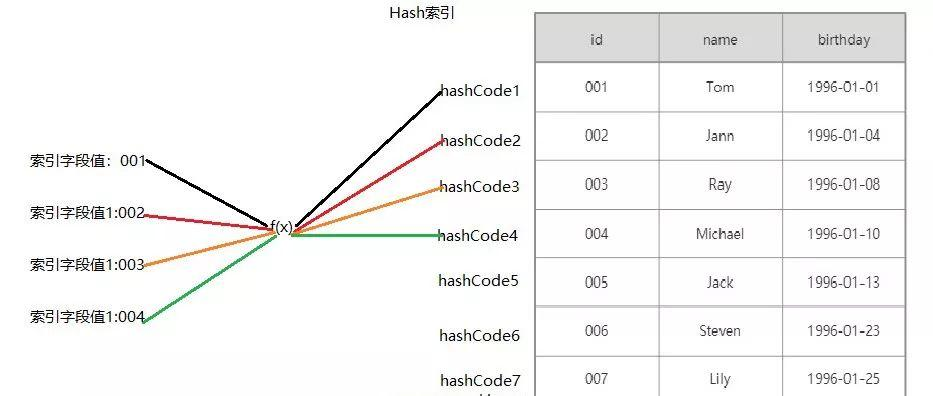
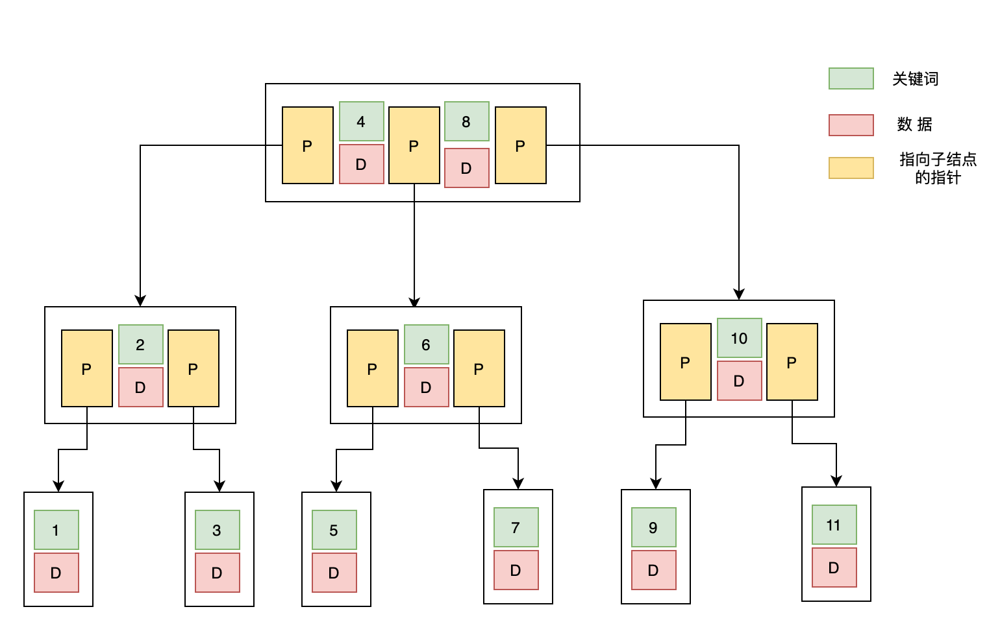
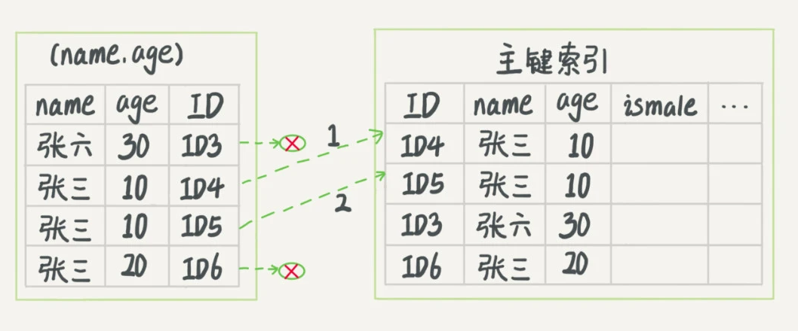
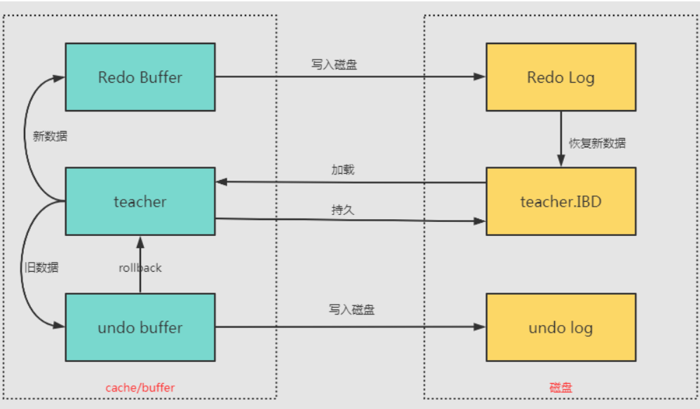
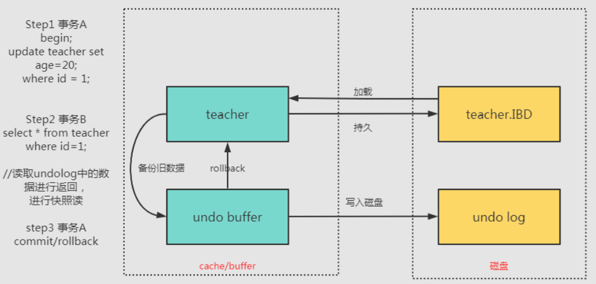
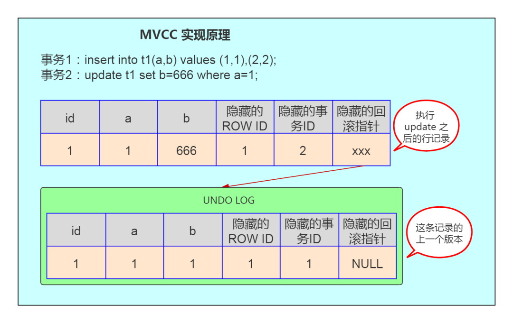
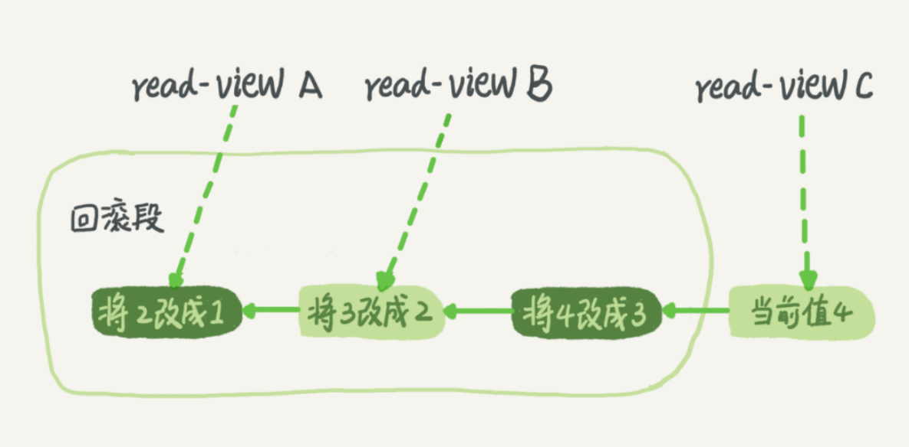
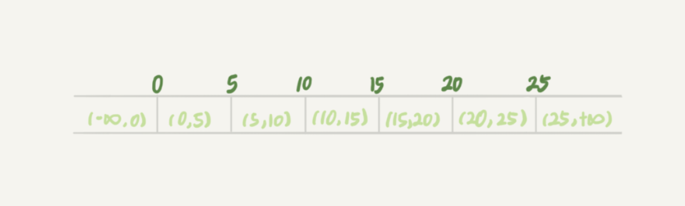
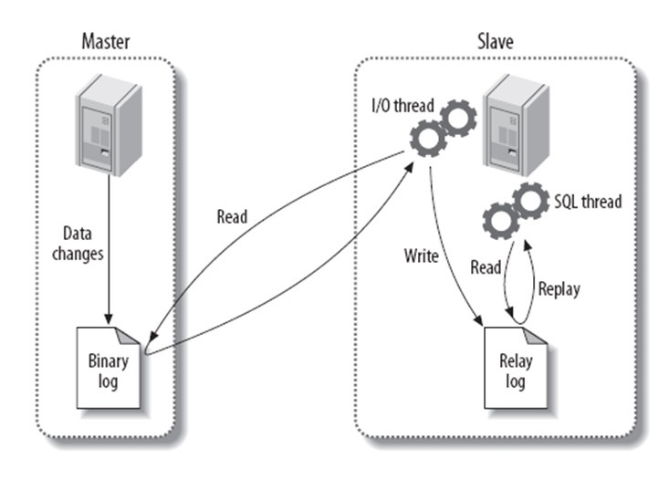

MySQL面试题

## 基础

### 1、SQL与MySQL有什么区别？

SQL 和 MySQL 是 DBMS 中最令人困惑的两个术语，二者之间存在本质上的区别。

- SQL 是一种 **结构化查询语言**，用于在数据库上执行各种操作，但 MySQL 是一个 **关系数据库管理系统（RDBMS）**，使用 SQL 执行所有数据库操作。

- SQL 用于访问，更新和操作数据库中的数据，用户使用时需要学习该语言，然后编写查询，而MySQL 是一个软件，会为用户提供一个界面，只需单击一些按钮即可用于执行各种数据库操作。

- 由于 MySQL 是一个软件，所以它会定期获得各种更新，但在 SQL 中，命令总是相同的。

### 2、数据库的三范式是什么？

数据库范式是设计数据库时，需要遵循的一些规范。各种范式是条件递增的联系，越高的范式数据库冗余越小。常用的数据库三大范式为：

- **第一范式（1NF）**：每个列都不可以再拆分，强调的是列的原子性，	即数据库表的每一列都是不可分割的原子数据项。
- **第二范式（2NF）**：在满足第一范式的基础上，非主属性完全依赖于主码（主关键字、主键），消除非主属性对主码的部分函数依赖。
- **第三范式（3NF）**：在满足第二范式的基础上，表中的任何属性不依赖于其它非主属性，消除传递依赖。简而言之，**非主键都直接依赖于主键，而不是通过其它的键来间接依赖于主键**。

### 3、数据库连接泄露的含义？

数据库连接泄露指的是如果在某次使用或者某段程序中没有正确地关闭 Connection、Statement 和 ResultSet 资源，那么每次执行都会留下一些没有关闭的连接，这些连接失去了引用而不能得到重新使用，因此就造成了数据库连接的泄漏。

数据库连接的资源是宝贵而且是有限的，如果在某段使用频率很高的代码中出现这种泄漏，那么数据库连接资源将被耗尽，影响系统的正常运转。

### 4、MySQL 支持哪些存储引擎?

MySQL 支持的存储引擎：

- MySQL 支持的引擎包括：InnoDB、MyISAM、MEMORY、Archive、Federate、CSV、BLACKHOLE 等
- MySQL5.5 之前的默认存储引擎是 MyISAM，5.5 之后就改为了 InnoDB

### 5、MyISAM 和 InnoDB 的区别有哪些？

**MyISAM 存储引擎：**

- 特点：不支持事务和外键，读取速度快，节约资源

- 索引：MyISAM 是非聚簇索引，索引文件和数据文件是分离的，索引保存的是数据的地址。

- 检索：MyISAM 支持全文索引，查询效率上 InnoDB 要高；

- 锁：MyISAM 支持表级锁，每次操作对整个表加锁

- 存贮方式：

  - 存贮表的总行数

  - 每个 MyISAM 在磁盘上存储成 3 个文件，表的定义保存在 .frm 文件，表数据保存在 .MYD (MYData) 文件中，索引保存在 .MYI (MYIndex) 文件中

- 应用场景：查询和插入操作为主，只有很少更新和删除操作，并对事务的完整性、并发性要求不高

**InnoDB 存储引擎：**

- 特点：支持事务和外键操作，支持并发控制。
- 索引：InnoDB 是聚集索引，索引和数据保存在同一个 B+ 树中，因此从聚簇索引中获取数据比非聚簇索引更快
- 检索：Innodb 不支持全文索引
- 锁：Innodb 支持行级锁
- 存贮方式：
  - 不存贮表的总行数
  - 使用共享表空间存储， 这种方式创建的表的表结构保存在 .frm 文件中， 数据和索引保存在 innodb_data_home_dir 和 innodb_data_file_path 定义的表空间中，可以是多个文件
  - 使用多表空间存储，创建的表的表结构存在 .frm 文件中，每个表的数据和索引单独保存在 .ibd 中
- 应用场景：对事务的完整性有比较高的要求，在并发条件下要求数据的一致性，读写频繁的操作

### 6、超键、候选键、主键、外键分别是什么？

- 超键：在关系中能唯一标识元组的属性集称为关系模式的超键。一个属性可以为作为一个超键，多个属性组合在一起也可以作为一个超键。超键包含候选键和主键。

- 候选键：是最小超键，即没有冗余元素的超键。
- 主键：数据库表中对储存数据对象予以唯一和完整标识的数据列或属性的组合。一个数据列只能有一个主键，且主键的取值不能缺失，即不能为空值（Null）。
- 外键：在一个表中存在的另一个表的主键称此表的外键。

### 7、MySQL 的逻辑架构了解吗？

第一层是网络连接层，主要完成一些类似于连接处理、授权认证、及相关的安全方案。

第二层是核心服务层，包括查询解析、分析、优化、缓存以及日期和时间等所有内置函数，所有跨存储引擎的功能都在这一层实现，例如存储过程、触发器、视图等。

第三层是存储引擎层，存储引擎负责 MySQL 中数据的存储和提取。服务器通过 API 和存储引擎进行通信，不同的存储引擎具有不同的功能，共用一个 Server 层，可以根据开发的需要，来选取合适的存储引擎。

第四层是系统文件层，主要是将数据存储在文件系统之上，并完成与存储引擎的交互。

### 8、SQL 约束有哪几种？

- NOT NULL: 用于控制字段的内容一定不能为空（NULL）。
- UNIQUE: 控件字段内容不能重复，一个表允许有多个 Unique 约束。
- PRIMARY KEY: 也是用于控件字段内容不能重复，但它在一个表只允许出现一个。
- FOREIGN KEY: 用于预防破坏表之间连接的动作，也能防止非法数据插入外键列，因为它必须是它指向的那个表中的值之一。
- CHECK: 用于控制字段的值范围。

### 9、自增主键（AUTO_INCREMENT）理解?

**自增主键:** 

- InnoDB引擎的自增值，在MySQL5.7及之前的版本，自增值保存在内存里，并没有持久化。每次重启后，第一次打开表的时候，都会去找自增值的最大值`max(id)`，然后将`max(id)+1`作为这个表当前的自增值
- 在MySQL8.0版本，将自增值的变更记录在了redo log中，重启的时候依靠redo log恢复重启之前的值，才有了“自增值持久化”的能力

**自增值修改机制** 

如果id字段被定义为AUTO_INCREMENT，在插入一行数据的时候，自增值的行为如下：

1. 如果插入数据时id字段指定为0、null或未指定值，那么就把这个表当前的AUTO_INCREMENT值填到自增字段

2. 如果插入数据时id字段指定了具体的值，就直接使用语句里指定的值

**自增值新增机制:**

1. 如果准备插入的值`>=`当前自增值，新的自增值就是 “准备插入的值+1”;
2. 否则，自增值不变。

### 10、为什么自增主键不连续？

- 在MySQL 5.7及之前的版本，自增值保存在内存里，并没有持久化
- 事务回滚（自增值不能回退，因为并发插入数据时，回退自增ID可能造成主键冲突)
- 唯一键冲突(由于表的自增值已变，但是主键发生冲突没插进去，下一次插入主键=现在变了的自增值+1，所以不连续)

### 11、MySQL 中的 varchar 和 char 有什么区别？

**char** 是一个定长字段，假如申请了`char(10)`的空间，那么无论实际存储多少内容，该字段都占用 10 个字符。

**varchar** 是变长的，也就是说申请的只是最大长度，占用的空间为实际字符长度+1， varchar还需要 1 或 2 个额外字节记录字符串长度。

**char的优点：**

- char适合存储很短的字符串，或所有值都接近同一个长度，例如存储密码的 MD5 值。对于经常变更的数据，CHAR 也比 VARCHAR更好，因为定长的 CHAR 不容易产生碎片。
- 对于非常短的列，CHAR 在存储空间上也更有效率，例如用 CHAR 来存储只有 Y 和 N 的值只需要一个字节，但是 VARCHAR 需要两个字节，因为还有一个记录长度的额外字节。

### 12、MySQL中 in 和 exists 区别？

MySQL中的in语句是把外表和内表作hash 连接，而exists语句是对外表作loop循环，每次loop循环再对内表进行查询。一直大家都认为exists比in语句的效率要高，这种说法其实是不准确的。这个是要区分环境的。

如果查询的两个表大小相当，那么用in和exists差别不大。 如果两个表中一个较小，一个是大表，则子查询表大的用exists，子查询表小的用in。 not in 和not exists：如果查询语句使用了not in，那么内外表都进行全表扫描，没有用到索引；而not extsts的子查询依然能用到表上的索引。所以无论那个表大，用not exists都比not in要快。

### 13、什么是存储过程？有哪些优缺点？

**存贮过程：** 存储过程是事先经过编译并存储在数据库中的一段 SQL 语句的集合。

**优点：**

- 提高代码的复用性
- 减少数据在数据库和应用服务器之间的传输，提高传输效率
- 减少代码层面的业务处理
- **一次编译永久有效**

**缺点：**

- 互联网项目中，迭代太快，项目的生命周期也比较短，在这样的情况下，存储过程的管理不是特别友好，同时复用性也没有写在服务层那么好。

### 13、讲一将MySQL 执行查询的过程？

1. 客户端通过 TCP 连接发送连接请求到 MySQL 连接器，连接器会对该请求进行权限验证及连接资源分配。
2. 客户端发送一条查询给服务器，服务器先会检查查询缓存，如果命中了缓存，则立即返回存储在缓存中的结果，否则进入下一阶段。
3. 分析器进行词法分析，语法分析。
4. 优化器执行计划生成，索引选择。
5. 最后交给执行器，将数据保存到结果集中，同时会逐步将数据缓存到查询缓存中，最终将结果集返回给客户端。


### 14、Innodb为什么推荐使用自增ID？

**理由如下：** 

- 1、使用自增ID，主键页就会近乎于顺序的记录填满，提升了页面的最大填充率，不会有页的浪费。
- 2、新插入的行一定会在原有的最大数据行下一行，mysql定位和寻址很快，不会为计算新行的位置而做出额外的消耗。
- 3、减少了页分裂和碎片的产生

**UUID**:   大量的随机IO + 页分裂导致移动大量的数据 + 数据会有碎片

**总结**:  自增主键是连续的，在插入过程中尽量减少页分裂，即使要进行页分裂，也只会分裂很少一部分。并且能减少数据的移动，每次插入都是插入到最后。总之就是减少分裂和移动的频率。

## 索引

### 1、索引是什么？

索引本质是**排好序的数据结构**，一种特殊的文件，包含着对数据表里所有记录的引用指针。索引的实现通常使用 B 树以及变种 B+ 树。

**优点：**

- 可以大大加快数据的检索速度，这也是创建索引的最主要的原因。
- 通过使用索引，可以在查询的过程中，使用优化隐藏器，提高系统的性能。

**缺点**：

- 索引是一个文件，它是要占据物理空间的。
- 创建索引和维护索引要耗费时间，具体地，当对表中的数据进行增加、删除和修改的时候，索引也要动态的维护，会降低增/改/删的执行效率；

### 2、MySQL有哪几种索引类型？

1、从存储结构上来划分：BTree 索引，Hash 索引，R-tree 索引（空间索引），Full-text 索引（全文索引）。

2、从功能层次上来划分：普通索引，唯一索引，主键索引，联合索引。

- 普通索引：即一个索引只包含单个列，一个表可以有多个单列索引
- 唯一索引：索引列的值必须唯一，但允许有空值
- 主键索引：一种特殊的唯一索引，不允许有空值，一般在建表时同时创建主键索引
- 联合索引：多列值组成一个索引，专门用于组合搜索

### 3、聚簇索引和非聚簇索引？

在 Innodb 存储引擎，B+ 树索引可以分为聚簇索引和非聚簇索引（或者叫二级索引）。

**聚簇索引：**

聚簇索引是按照每张表的主键构造一颗 B+ 树，叶子节点中存放的就是整张表的数据，将聚簇索引的叶子节点称为数据页。

**优点：** 

- 数据访问更快，聚簇索引将索引和数据保存在同一个 B+ 树中，因此从聚簇索引中获取数据比非聚簇索引更快
- 聚簇索引对于主键的排序查找和范围查找速度非常快

**缺点：**

- 插入速度严重依赖于插入顺序，按照主键的顺序（递增）插入是最快的方式，否则将会出现页分裂，严重影响性能。
- 更新主键的代价很高，将会导致被更新的行移动，所以对于 InnoDB 表，一般定义主键为不可更新。

**非聚簇索引**

非聚簇索引叶子节点存储的是主键值，而不是数据的物理地址，所以访问数据需要二次查找，推荐使用覆盖索引，可以减少回表查询。

**检索过程：**

首先找到主键值，再通过聚簇索引二分找到数据页，最后通过数据页中的页目录二分找到对应的数据分组，遍历组内所所有的数据找到数据行。

### 4、 讲一讲索引底层实现（数据结构）？

**Hash索引**

基于哈希表实现，只有精确匹配索引所有列的查询才有效，对于每一行数据，存储引擎都会对所有的索引列计算一个哈希码（hash code），并且Hash索引将所有的哈希码存储在索引中，同时在索引表中保存指向每个数据行的指针。 

如果发生 **Hash 碰撞**（两个不同关键字的 Hash 值相同），则在对应 Hash 键下以 **链表形式** 存储。

检索时不需要类似 B+ 树那样从根节点到叶子节点逐级查找，只需一次哈希算法即可立刻定位到相应的位置，速度非常快，平均检索时间为 `O(1)`。



**B 树索引**

B 树索引，又称 **平衡树索引**，是 MySQL 数据库中使用最频繁的索引类型，B-Tree能加快数据的访问速度，因为存储引擎不再需要进行全表扫描来获取数据，数据分布在各个节点之中。

一棵 **m 阶 B-Tree** 的特性如下：

- 每个结点最多 m 个子结点；
- 除了根结点和叶子结点外，每个结点最少有 m/2（向上取整）个子结点；
- 所有的叶子结点都位于同一层；
- 每个结点都包含 k 个元素（关键字key），这里 m/2≤k<m，这里 m/2 向下取整；
- 每个节点中的元素（关键字key）从小到大排列；
- 每个元素子左结点的值，都小于或等于该元素，右结点的值都大于或等于该元素。

数据库以 B-Tree 的数据结构存储数据的图示如下： 



**B+Tree索引** 

是B-Tree的改进版本，同时也是数据库索引索引所采用的存储结构。数据都在叶子节点上，并且增加了顺序访问指针，每个叶子节点都指向相邻的叶子节点的地址。相比B-Tree来说，进行范围查找时只需要查找两个节点，进行遍历即可。而B-Tree需要获取所有节点，相比之下B+Tree效率更高。

B+tree性质：

- n棵子tree的节点包含n个关键字，不用来保存数据而是保存数据的索引。

- 所有的非叶子结点只存储 **关键字key信息**，及指向含这些关键字记录的指针，且叶子结点本身依关键字的大小自小而大顺序链接；
- 所有具体数据都存在叶子结点中；
- 所有的叶子结点中包含了全部元素的信息；
- 所有叶子节点之间都有一个链指针。

数据库以 B+ Tree 的数据结构存储数据的图示如下：


### 5、为什么索引结构默认使用B+Tree，而不是B-Tree，Hash，二叉树，红黑树？

**B+树与B树相比** 

- **B+树的磁盘读写代价更低**：B+树的非叶子节点不存贮数据，只存贮关键词key信息，进行数据索引，使每个非叶子节点所能保存的关键字大大增加。这样磁盘块所能容纳的关键字数量也越多，一次性读入内存的需要查找的关键字也就越多，相对**IO读写次数就降低了。 **
- **更加适合区间查询**：B树的数据分布在各个节点之中，当进行范围查找时会出现回旋查找。而B+树的数据都存储在叶子结点中，并且MySQL 索引数据结构对经典的 B+Tree 进行了优化，增加一个指向相邻叶子节点的链表指针，就形成了带有顺序指针的 B+Tree，**提高区间访问的性能，防止回旋查找**

**B+树与Hash相比** 

- Hash虽然可以快速定位，但是没有顺序，IO复杂度高。
- Hash索引基于Hash表实现，只有Memory存储引擎显式支持哈希索引 。
- Hash索引因为不是按照索引值顺序存储的，就不能像B+Tree索引一样利用索引完成排序。
- 如果有大量重复键值得情况下，哈希索引的效率会很低，因为存在哈希碰撞问题 。

**B+树与红黑树相比** 

- 红黑树的高度随着数据量增加而增加，IO代价高。

**B+树与二叉树相比** 

- 树的高度不均匀，不能自平衡，查找效率跟数据有关（树的高度），并且IO代价高。

### 6、非聚簇索引一定会回表查询吗？

不一定，这涉及到查询语句所要求的字段是否全部命中了索引，如果全部命中了索引，那么就不必再进行回表查询。一个索引包含（覆盖）所有需要查询字段的值，被称之为"覆盖索引"。

举个简单的例子，假设我们在学生表的成绩上建立了索引，那么当进行`select score from student where score > 90`的查询时，在索引的叶子节点上，已经包含了score 信息，不会再次进行回表查询。

### 7、联合索引是什么？为什么需要注意联合索引中的顺序？

MySQL可以使用多个字段同时建立一个索引，叫做联合索引。在联合索引中，如果想要命中索引，需要按照建立索引时的字段顺序挨个使用，否则无法命中索引。

**具体原因为:**

- MySQL使用索引时需要索引有序，假设现在建立了"name，age，school"的联合索引，那么索引的排序为: 先按照name排序，如果name相同，则按照age排序，如果age的值也相等，则按照school进行排序。

- 当进行查询时，此时索引仅仅按照name严格有序，因此必须首先使用name字段进行等值查询，之后对于匹配到的列而言，其按照age字段严格有序，此时可以使用age字段用做索引查找，以此类推。因此在建立联合索引的时候应该注意索引列的顺序，一般情况下，将**查询需求频繁或者字段选择性高的列放在前面**。此外可以根据特例的查询或者表结构进行单独的调整。

### 8、如何创建索引？

创建索引有三种方式：

- 1、使用CREATE INDEX命令创建

  ```sql
  CREATE [UNIQUE|FULLTEXT] INDEX 索引名称 [USING 索引类型] ON 表名(列名...);
  -- 索引类型默认是 B+TREE
  ```

-  2、使用ALTER TABLE命令去增加索引。

  ```sql
  ALTER TABLE table_name ADD INDEX index_name (column_list);
  ```

- 3、在执行CREATE TABLE时创建索引

  ```mysql
  CREATE TABLEtable_name(
     c1 INT PRIMARY KEY,
     c2 INT NOT NULL,
     c3 INT NOT NULL,
     c4 VARCHAR(10),
     INDEX (c2,c3)  -- 创建两列c2和c3组成的索引。
  );
  ```

### 9、创建索引的设计原则有哪些？

创建索引时的原则：

- 对查询频次较高，且数据量比较大的表建立索引
- 尽量选择区分度高的列作为索引
- 使用短索引，在给定大小的存储块内可以存储更多的索引值，相应的可以有效的提升 MySQL 访问索引的 I/O 效率
- 使用唯一索引，区分度越高，使用索引的效率越高
- 索引字段的选择，最佳候选列应当从 where 子句的条件中提取，使用覆盖索引
- 对于插入、更新、删除等 DML 操作比较频繁的表，不适合建立索引
- 尽量的扩展索引，不要新建索引。比如表中已经有a的索引，现在要加(a,b)的索引，那么只需要修改原来的索引即可。
- 最左前缀匹配原则，即最左优先，在检索数据时从联合索引的最左边开始匹配

### 10、使用索引查询一定能提高查询的性能吗？

- 不一定，通常通过索引查询数据比全表扫描要快，但是我们也必须注意到它的代价。
- 索引需要空间来存储，也需要定期维护， 每当有记录在表中增减或索引列被修改时，索引本身也会被修改。

### 11、有哪些索引失效场景？

**1、模糊搜索导致的索引失效**

- 当`%`放在匹配字段前是不走索引的，放在后面才会走索引。

**2、OR引起的索引失效**

- `or`语句前后没有同时使用索引，或者`or`前后连接的不是同一个字段。

**3、运算符导致的索引失效**

- 如果你对列进行了（+，-，*，/，!）, 那么都将不会走索引。

**4、在索引字段上使用not，<>， ! =  (这样处理的是全表扫描)**

**5、类型不一致导致的索引失效**

- 比如列类型是字符串，一定要在条件中将数据用引号引用，否则失效（隐式转换类型)

**6、函数导致的索引失效**

- 如果使用函数在索引列，这是不走索引的。

**7、NOT IN、NOT EXISTS导致索引失效**

### 12、讲一讲最左匹配原则？

最左前缀原则就是最左优先，在创建多列索引时，要根据业务需求，where子句中使用最频繁的一列放在最左边。 mysql会一直向右匹配直到遇到范围查询(>、<、between、like)就停止匹配，比如a = 1 and b = 2 and c > 3 and d = 4  如果建立(a,b,c,d)顺序的索引，d是用不到索引的，如果建立(a,b,d,c)的索引则都可以用到，a,b,d的顺序可以任意调整。

=和in可以乱序，比如a = 1 and b = 2 and c = 3 建立(a,b,c)索引可以任意顺序，mysql的查询优化器会帮你优化成索引可以识别的形式。

### 13、讲一讲前缀索引？

当要索引的字段很长时，索引就会变得会变大变慢，如果只把很长字段的前面的公共部分作为一个索引，就会节约索引空间，提高索引效率。

**注意**：使用前缀索引系统就会忽略覆盖索引对查询性能的优化了

**场景**：存储身份证

* 直接创建完整索引，这样可能比较占用空间
* 创建前缀索引，节省空间，但会增加查询扫描次数，并且不能使用覆盖索引
* 倒序存储，再创建前缀索引，用于绕过字符串本身前缀的区分度不够的问题（前 6 位相同的很多）
* 创建 hash 字段索引，查询性能稳定，有额外的存储和计算消耗，跟第三种方式一样，都不支持范围扫描

### 14、百万级数据如何删除？

删除数据的速度和创建的索引数量是成正比的。先删索引，再删无用数据，再创建索引

### 15、讲一讲索引下推？

索引条件下推优化（Index Condition Pushdown，ICP）是 MySQL5.6 添加，可以在索引遍历过程中，对索引中包含的字段先做判断，直接过滤掉不满足条件的记录，**减少回表次数**。 

索引下推充分利用了索引中的数据，在查询出整行数据之前过滤掉无效的数据，再去主键索引树上查找。

**举个例子：**

用户表 user，(name, age) 是联合索引

```sql
SELECT * FROM user WHERE name LIKE '张%' AND　age = 10;	-- 头部模糊匹配会造成索引失效
```

* 优化前：在非主键索引树上找到满足第一个条件的行，然后通过叶子节点记录的主键值再回到主键索引树上查找到对应的行数据，再对比 AND 后的条件是否符合，符合返回数据，需要 4 次回表。

  

* 优化后：检查索引中存储的列信息是否符合索引条件，然后交由存储引擎用剩余的判断条件判断此行数据是否符合要求，**不满足条件的不去读取表中的数据**，满足下推条件的就根据主键值进行回表查询，2 次回表。

  

### 16、普通索引和唯一索引怎样选？

**查询比较：** 

- 查询会以页为单位将数据页加载进内存，不需要一条记录一条记录读取磁盘。然后**唯一索引根据条件查询到记录时就返回结果，**普通索引查到第一条记录往后遍历直到不满足条件**，由于都在内存中，不需要磁盘读取那么大开销，带来的额外查询开销忽略不计，**所以**查询性能几乎一致** 

**更新比较：** 

- 唯一索引由于更新时要检查唯一性，所以需要将数据页先加载进内存才能判断，此时直接操作内存，不需要操作change buffer。
- 补充: 普通索引若数据在内存中直接内存中更新，否则会将更新操作先记录到channge buffer中，等下一次查询将数据读到内存中再进行change buffer里相关更新操作后将数据返回（**也就是将更新索引页推迟到了查询的时候**。），这样一来，再写多读少的情况下就减少了磁盘lO，若写完就马上查询，就大可不必用change buffer，不但没提高多少效率还造成维护change buffer额外消耗。
- 将change buffer的操作对应到原始数据页的操作称为merge (可以查询来时读到内存再修改数据，后台线程也会merge，数据库正常关闭也会merge)

**适合场景**

- 写多读少，选用普通索引更好，可以利用change buffer进行性能优化减少磁盘lO，将更新操作记录到change bufer，等查询来了将数据读到内存再进行修改.

### 17、Hash 索引和 B+ 树索引的区别

Hash 索引和 B+ 树索引有以下几点显见的区别：

- Hash 索引进行等值查询更快（一般情况下），但是却无法进行范围查询；
- Hash 索引不支持使用索引进行排序；
- Hash 索引不支持模糊查询以及多列索引的最左前缀匹配，原理也是因为 Hash 函数的不可预测；
- Hash 索引任何时候都避免不了回表查询数据，而 B+ 树在符合某些条件（聚簇索引，覆盖索引等）的时候可以只通过索引完成查询；
- Hash 索引虽然在等值查询上较快，但是不稳定，性能不可预测，当某个键值存在大量重复的时候，发生 Hash 碰撞，此时效率可能极差；而 B+ 树的查询效率比较稳定，对于所有的查询都是从根结点到叶子结点，且树的高度较低。

## 事务

### 1、什么是数据库事务？

事务（Transaction）是访问和更新数据库的程序执行单元，是逻辑上的一组操作，要么都执行，要么都不执行。如果任意一个操作失败，那么整组操作即为失败，会回到操作前状态或者是上一个节点。

因此，事务是保持 **逻辑数据一致性** 和 **可恢复性** 的重要利器。而锁是实现事务的关键，可以保证事务的完整性和并发性。

### 2、介绍一下事务具有的四个特征？

事务的四大特征：ACID

- 原子性：事务是数据库的逻辑工作单位，事务中包含的各操作要么都做，要么都不做
- 一致性：事务执行的结果必须是使数据库从一个一致性状态变到另一个一致性状态。因此当数据库只包含成功事务提交的结果时，就说数据库处于一致性状态。如果数据库系统  运行中发生故障，有些事务尚未完成就被迫中断，这些未完成事务对数据库所做的修改有一部分已写入物理数据库，这时数据库就处于一种不正确的状态，或者说是不一致的状态。
- 隔离性 ：一个事务的执行不能其它事务干扰。即一个事务内部的//操作及使用的数据对其它并发事务是隔离的，并发执行的各个事务之间不能互相干扰。
- 持久性：也称永久性，指一个事务一旦提交，它对数据库中的数据的改变就应该是永久性的。接下来的其它操作或故障不应该对其执行结果有任何影响。

### 3、说一下MySQL 的四种隔离级别？

事务的隔离级别：多个客户端操作时，各个客户端的事务之间应该是隔离的，**不同的事务之间不该互相影响**，而如果多个事务操作同一批数据时，则需要设置不同的隔离级别，否则就会产生问题。

| 隔离级别         | 名称     | 会引发的问题           | 数据库默认隔离级别  |
| ---------------- | -------- | ---------------------- | ------------------- |
| Read Uncommitted | 读未提交 | 脏读、不可重复读、幻读 |                     |
| Read Committed   | 读已提交 | 不可重复读、幻读       | Oracle / SQL Server |
| Repeatable Read  | 可重复读 | 幻读                   | MySQL               |
| Serializable     | 可串行化 | 无                     |                     |

**读未提交**：最低的隔离级别，一个事务可以读到另一个事务未提交的结果，所有的并发事务问题都会发生。

**读已提交**：只有在事务提交后，其更新结果才会被其他事务看见，可以解决 **脏读问题**，但是不可重复读或幻读仍有可能发生。Oracle 默认采用的是该隔离级别。

**可重复读**：在一个事务中，对于同一份数据的读取结果总是相同的，无论是否有其他事务对这份数据进行操作，以及这个事务是否提交，除非数据是被本身事务自己所修改。可以解决 **脏读、不可重复读**。MySQL 默认采用可重复读隔离级别。

**可串行化**：事务 **串行化执行**，隔离级别最高，完全服从 ACID，牺牲了系统的并发性，也就是说，所有事务依次逐个执行，所以可以解决并发事务的所有问题。

### 4、什么是脏读？幻读？不可重复读？丢失更新？(事务的并发问题)

**脏读**：一个事务读取了另一个事务未提交的数据。

**不可重复读**： 就是在一个事务范围内，两次相同的查询会返回两个不同的数据，这是因为在此间隔内有其他事务对数据进行了修改。

**幻读**： 幻读是指当事务 **不是独立执行时** 发生的一种现象，例如事务A对表中的数据进行了修改，这种修改涉及到表中的全部数据行，同时，另一个事务B也修改这个表中的数据，这种修改是向表中 **插入一行新数据**。那么，事务A的用户发现表中还有没有修改的数据行，就好像发生了幻觉一样。

**丢失更新：**（脏写）

两个事务同时读取同一条记录，事务 A 先修改记录，事务 B 也修改记录（B 是不知道 A 修改过），当 B 提交数据后， 其修改结果覆盖了 A 的修改结果，导致事务 A 更新丢失。

### 5、事务的实现原理？

事务是基于重做日志文件(redo log)和回滚日志(undo log)实现的。

每提交一个事务必须先将该事务的所有日志写入到重做日志文件(redo log)进行持久化，数据库就可以通过重做日志(redo log)来保证事务的原子性和持久性。

每当有修改事务时，还会产生 undo log，如果需要回滚，则根据 undo log 的反向语句进行逻辑操作，比如 insert 一条记录就 delete 一条记录。undo log 主要实现数据库的一致性。

### 6、MySql的事务介绍一下？

InnoDB 存储引擎提供了两种事务日志：redo log（重做日志）和 undo log（回滚日志）

* redo log 用于保证事务持久性
* undo log 用于保证事务原子性和隔离性

**redo log**

redo log 不是随着事务的提交才写入的，而是在事务的执行过程中，便开始写入 redo 中。具体的落盘策略可以进行配置  。防止在发生故障的时间点，尚有脏页未写入磁盘，在重启 MySQL 服务的时候，根据 redo log  进行重做，从而达到事务的未入磁盘数据进行持久化这一特性。RedoLog 是为了实现事务的持久性而出现的产物。



**undo log**

undo log 属于逻辑日志，根据每行操作进行记录，记录了 SQL 执行相关的信息，用来回滚行记录到某个版本。

当事务对数据库进行修改时，InnoDB 会先记录对应的 undo log，如果事务执行失败或调用了 rollback 导致事务回滚，InnoDB 会根据 undo log 的内容**做与之前相反的操作**：

* 对于每个 insert，回滚时会执行 delete
* 对于每个 delete，回滚时会执行 insert
* 对于每个 update，回滚时会执行一个相反的 update，把数据修改回去



### 7、什么是MySQL的 binlog？

MySQL的 binlog 是记录所有数据库表结构变更（例如 CREATE、ALTER TABLE）以及表数据修改（INSERT、UPDATE、DELETE）的二进制日志。

binlog 不会记录 SELECT 和 SHOW 这类操作，因为这类操作对数据本身并没有修改，但你可以通过查询通用日志来查看 MySQL 执行过的所有语句。

MySQL binlog 以事件形式记录，还包含语句所执行的消耗的时间，MySQL 的二进制日志是事务安全型的。binlog 的主要目的是复制和恢复。

### 8、讲一讲binlog和redo log的区别？

* 1、**作用不同**：redo log 是用于 crash recovery （故障恢复），保证 MySQL 宕机也不会影响持久性；binlog 是用于 point-in-time recovery 的，保证服务器可以基于时间点恢复数据，此外 binlog 还用于主从复制
* 2、**层次不同**：redo log 是 InnoDB 存储引擎实现的，而 binlog 是MySQL的服务器层实现的，同时支持 InnoDB 和其他存储引擎
* 3、**内容不同**：redo log 是物理日志，内容基于磁盘的 Page；binlog 的内容是二进制的，根据 binlog_format 参数的不同，可能基于SQL 语句、基于数据本身或者二者的混合（日志部分详解）
* 4、**写入时机不同**：binlog 在事务提交时一次写入；redo log 的写入时机相对多元

### 9、一条更新语句怎么执行（两阶段提交）？

以这条更新语句为例：

```sql
update T set c=c+1 where ID=2;
```

**流程如下：**

- 1、执行引擎将这行新数据更新到内存中（若对应的行在内存直接返回，否则先去磁盘读取再返回）

- 2、执行器执行更新操作并将其记录到 redo log buffer 里，此时 redo log（重做日志） 处于 prepare 状态，代表执行完成随时可以提交事务。

- 3、执行器生成这个操作的 binlog 并把 binlog 写入磁盘。

- 4、执行器调用引擎事务提交接口，引擎把刚写入的redolog改为commit状态，更新完成。

**总结：**  redo log 和 binlog 都可以用于表示事务的提交状态，而**两阶段提交就是让这两个状态保持逻辑上的一致**，也有利于主从复制，更好的保持主从数据的一致性 。


**故障恢复数据：** 

* 如果在时刻 A 发生了崩溃（crash），由于此时 binlog 还没写，redo log 也没提交，所以数据恢复的时候这个事务会回滚
* 如果在时刻 B 发生了崩溃，redo log 和 binlog 有一个共同的数据字段叫 XID，崩溃恢复的时候，会按顺序扫描 redo log：
  * 如果 redo log 里面的事务是完整的，也就是已经有了 commit 标识，说明 binlog 也已经记录完整，直接从 redo log 恢复数据
  * 如果 redo log 里面的事务只有 prepare，就根据 XID 去 binlog 中判断对应的事务是否存在并完整，如果完整可以从 binlog 恢复 redo log 的信息，进而恢复数据，提交事务。


### 10、如何实现事务的 ACID 特性？

事务的 ACID 特性是由关系数据库管理系统来实现的。

DBMS 采用 **日志** 来保证事务的 **原子性**、**一致性** 和 **持久性**。日志记录了事务对数据库所做的更新，如果某个事务在执行过程中发生错误，就可以根据日志，撤销事务对数据库已做的更新，使数据库退回到执行事务前的初始状态。

**总结：** 

* redo log 用于保证事务持久性（记录事务开启后对数据的修改）
* undo log 用于保证事务原子性（记录事务开始前的老版本数据，可以保证原子操作）

DBMS 采用 **锁机制** 来实现事务的**隔离性**。当多个事务同时更新数据库中相同的数据时，只允许 **持有锁的事务** 能更新该数据，其他事务必须等待，直到前一个事务释放了锁，其他事务才有机会更新该数据。

### 11、什么是MVCC？

MVCC 全称 Multi-Version Concurrency Control，即多版本并发控制，用来**解决读写冲突的无锁并发控制**，可以在发生读写请求冲突时不用加锁解决，这个读是指的快照读（也叫一致性读或一致性无锁读），而不是当前读：

* 快照读：实现基于 MVCC，因为是多版本并发，所以快照读读到的数据不一定是当前最新的数据，有可能是历史版本的数据
* 当前读：读取数据库记录是当前最新的版本（产生幻读、不可重复读），可以对读取的数据进行加锁，防止其他事务修改数据，是悲观锁的一种操作，读写操作加共享锁或者排他锁和串行化事务的隔离级别都是当前读

数据库并发场景：

* 读-读：不存在任何问题，也不需要并发控制

* 读-写：有线程安全问题，可能会造成事务隔离性问题，可能遇到脏读，幻读，不可重复读

* 写-写：有线程安全问题，可能会存在脏写（丢失更新）问题

MVCC 的优点：

* 在并发读写数据库时，做到在读操作时不用阻塞写操作，写操作也不用阻塞读操作，提高了并发读写的性能
* 可以解决脏读，不可重复读等事务隔离问题（加锁也能解决），但不能解决更新丢失问题

提高读写和写写的并发性能：

* MVCC + 悲观锁：MVCC 解决读写冲突，悲观锁解决写写冲突
* MVCC + 乐观锁：MVCC 解决读写冲突，乐观锁解决写写冲突

### 12、讲一讲MVCC的实现原理？

实现原理主要是隐藏字段，版本链，undo日志，Read View 来实现的。

**隐藏字段**

对于 InnoDB ，聚簇索引记录中包含 3 个隐藏的列：

- ROW ID：隐藏的自增 ID，如果表没有主键，InnoDB 会自动按 ROW ID 产生一个聚集索引树。
- 事务 ID ( row_trx_id）：记录最后一次修改该记录的事务 ID。
- 回滚指针（ roll_pointer）：指向这条记录的上一个版本。

我们举个例子来解释说明隐藏字段的含义：

事务1执行下述sql语句，向t1表中插入数据：

```mysql
insert into t1(a, b) values (1, 1,), (2, 2)
```

事务2执行下述sql语句，修改t1表中数据：

```sql
update t1 set b=666 where a=1;
```

最后t1表中id为1的行隐藏的列数据如下图所示：

- 隐藏的自增 ID依然为1
- 事务 ID为2，最后一次修改该记录的事务为事务2
- 回滚指针指向这条记录的上一个版本。



**版本链**

undo log 是逻辑日志，记录的是每个事务对数据执行的操作，而不是记录的全部数据，要**根据 undo log（回滚日志） 逆推出以往事务的数据**。

每次对数据库记录进行改动，都会产生的新版本的undo log（回滚日志），随着更新次数的增多，所有的版本都会被 roll_pointer（回滚指针）属性连接成一个链表，把这个链表称之为**版本链**，版本链的头节点就是当前的最新的 undo log（回滚日志），链尾就是最早的undo log（回滚日志）。

**Read View**

Read View 是事务进行读数据操作时产生的读视图，该事务执行快照读的那一刻会生成数据库系统当前的一个快照，记录并维护系统当前活跃事务的 ID，用来做可见性判断，根据视图判断当前事务能够看到哪个版本的数据。

注意：这里的快照并不是把所有的数据拷贝一份副本，而是由 undo log 记录的逻辑日志，根据库中的数据进行计算出历史数据。

假设一个值从 1 被按顺序改成了 2、3、4，在回滚日志里面就会有类似下面的记录。



**Read View里面包含什么？**

**m_ids列表 + up_limit_id(低水位) + low_limit_id(高水位)** 

- m_ids是当前系统中活跃的事务 id 列表(未提交事务集合，当前事务也在其中)
- 低水位就是当前活跃事务最小ID
- 高水位就是下一个将分配的事务ID，也就是目前最大活跃事务ID + 1

视图数组把所有的row trx_id分成了几种不同的情况：


**数据可见性规则是怎样的实现的？** 

row_trx_id（最近操作当前数据的事务ID） 和 read_view （读视图）的对比来实现事务是否可见。

**读取原理:** 

某事务B要访问数据A，先获取该数据A中的row_trx_id（最近操作当前数据的事务ID，对比该事务B启动时刻生成的read view:

1. 如果row_trx_id在read view的左边(`row_trx_id < up_limit_id`)，表示这个事务可以访问这数据(在左边意味着该事务已经提交)
2. 如果row_trx_id在read view的右边(`row_trx_id >= low_limit_id`)，表示这个版本是由将来启动的事务生成的，是肯定不可见的;
3. 如果`up_limit_id <= row_trx_id < low_limit_id`，则 判断row_trx_id是否在活跃事务列表 m_ids 中:
   - 在列表中，说明该版本对应的事务正在运行，不可见（**不能读到未提交的数据**）;
   - 不在列表中，表示这个版本是已经提交了的事务生成的，可见（**可以读到已经提交的数据**）；

如果开启事务的时候，数据A还未被创建（`row_trx_id >= low_limit_id`），不能被事务看见，则我们获取数据A的roll_pointer（回滚指针），通过版本链取得上一版本，然后再根据数据历史版本事务ID与read_view（读数组）重新对比。

**因此可以总结出 MVCC 实现的原理大致是：** 

InnoDB  每一行数据都有一个隐藏的回滚指针，用于指向该行修改前的最后一个历史版本，这个历史版本存放在 undo log  中。如果要执行更新操作，会将原记录放入 undo log 中，并通过隐藏的回滚指针指向 undo log  中的原记录。其它事务此时需要查询时，就是查询 undo log 中这行数据的最后一个可见历史版本。

### 13、四种隔离级别原理及解决问题分析？

事务的并发问题分为：脏读，幻读，不可重复读，丢失更新。

**读未提交** :

- **概念**：一个事务可以读到另一个事务未提交的结果，所有的并发事务问题都会发生。

- **解决问题**:  直接读取数据，不能解决任何并发问题。

**读已提交：** 

- **概念**：只有在事务提交后，其更新结果才会被其他事务看见。 

- **解决问题**：读操作不加锁，写操作加排他锁，解决了脏读。

- **原理**：利用MVCC实现，事务中每次快照读都会新生成一个 Read View，这就是在 RC（读已提交）级别下的事务中可以看到别的事务提交的更新的原因。

**可重复读:**

- **概念**：在一个事务中，对于同一份数据的读取结果总是相同的，无论是否有其他事务对这份数据进行操作，以及这个事务是否提交，除非数据是被本身事务自己所修改。

- **解决问题**： 解决了脏读，不可重复读。

- **原理**： MVCC实现，只有事务第一次快照读时会创建Read View，此后在调用快照读的时候，使用的是同一个 Read View，所以一个事务的查询结果每次都是相同的。

**可串行化**:

- **可串行化**：事务 **串行化执行**，隔离级别最高，完全服从 ACID，牺牲了系统的并发性，也就是说，所有事务依次逐个执行，所以可以解决并发事务的所有问题。

- **原理**: 使用锁，读加共享锁，写加排他锁，串行执行

### 14、如何解决幻读问题？

**幻读**： 幻读是指当事务 **不是独立执行时** 发生的一种现象，例如事务A对表中的数据进行了修改，这种修改涉及到表中的全部数据行，同时，另一个事务B也修改这个表中的数据，这种修改是向表中 **插入一行新数据**。那么，事务A的用户发现表中还有没有修改的数据行，就好像发生了幻觉一样。

MySQL使用的InnoDB引擎默认的隔离级别是**可重复读** ，即在一个事务中，对于同一份数据的读取结果总是相同的，无论是否有其他事务对这份数据进行操作，以及这个事务是否提交，除非数据是被本身事务自己所修改。

**可重复读隔离下为什么会产生幻读？**

在可重复读隔离级别下，普通的查询是快照读，是不会看到别的事务插入的数据的。因此，幻读在 **当前读** 下才会出现。

- 快照读（一致性读）：实现基于 MVCC，因为是多版本并发，所以**快照读读到的数据不一定是当前最新的数据，有可能是历史版本的数据**。
- 当前读：**读取最新数据**，而不是历史版本的数据。

这样当事务A先执行**快照读**，事务B插入数据并提交，事务A再执行**当前读**，此时事务A就发生了**幻读**。第一次读取到结果集和第二次读取到的结果集不同。

**总结：**(RR隔离界别并没有完全解决幻读)只使用快照都或则当前读不会幻读。若先快照读，然后当前读，期间按快照读相同条件插入数据，当前读就会发生幻读。

**如何解决幻读？** 

即便是给每行数据都加上行锁，也无法解决幻读，行锁只能阻止修改，无法阻止新插入的记录。而新插入记录这个动作，要更新的是记录之间的“间隙”。因此，为了解决幻读问题，InnoDB只好引入新的锁，也就是间隙锁(Gap Lock)。

顾名思义，间隙锁，锁的就是两个值之间的空隙。比如对表t，初始化插入了6个记录，这就产生了7个间隙。



**怎么加间隙锁呢？**

事务A执行`select * from t for update` 语句时候，在一行行扫描的过程中，不仅将给行加上了行锁，还给行两边的空隙也加上了间隙锁。事务B则无法插入数据了，因此就避免了产生幻读。

**注意**：

间隙锁和间隙锁是不会产生冲突的，因为间隙锁的目的是阻止往这个区间插入数据，因此A事务加了以后B事务继续加间隙锁，这并不矛盾。

**总结**：

MySQL 在可重复读隔离级别解决了幻读问题，是通过行锁和间隙锁的组合 Next-Key 锁实现的。

### 15、RR，RC两种隔离级别实现的主要区别？

**RR和RC生成一致性视图（read view）的时机不一样:**

- 读已提交（RC），是在**每一次**select的时候生成ReadView的。
- 可重复读（RR），是在**第一次**select的时候生成ReadView的。

## 锁

### 1、为什么要加锁？

当多个户并发地存取数据时，在数据库中就会产生多个事务同时存取同一数据的情况，若对并发操作不加控制就可能会读取和存储不正确的数据，破坏数据库的一致性。

因此加锁是为了在多用户环境下保证数据库完整性和一致性。

### 2、MySQL都有哪些锁呢？

**锁的分类：**

- 按操作分类：
  - 共享锁：也叫读锁。对同一份数据，多个事务读操作可以同时加锁而不互相影响 ，但不能修改数据
  - 排他锁：也叫写锁。当前的操作没有完成前，会阻断其他操作的读取和写入
- 按粒度分类：
  - 表级锁：会锁定整个表，开销小，加锁快；不会出现死锁；锁定力度大，发生锁冲突概率高，并发度最低，偏向 MyISAM
  - 行级锁：会锁定当前操作行，开销大，加锁慢；会出现死锁；锁定力度小，发生锁冲突概率低，并发度高，偏向 InnoDB
  - 页级锁：锁的力度、发生冲突的概率和加锁开销介于表锁和行锁之间，会出现死锁，并发性能一般
- 按使用方式分类：
  - 悲观锁：每次查询数据时都认为别人会修改，很悲观，所以查询时加锁
  - 乐观锁：每次查询数据时都认为别人不会修改，很乐观，但是更新时会判断一下在此期间别人有没有去更新这个数据

**MyISAM和InnoDB存储引擎使用的锁：**

- MyISAM采用表级锁(table-level locking)。
- InnoDB支持行级锁(row-level locking)和表级锁，默认为行级锁

### 3、什么是乐观锁和悲观锁？如何实现 ？

**悲观锁：**

- 概念：每次查询数据时都认为别人会修改，很悲观，所以查询时加锁
- 实现方式：使用数据库中的锁机制。

**乐观锁**：

- 概念：每次查询数据时都认为别人不会修改，很乐观，但是更新时会判断一下在此期间别人有没有去更新这个数据
- 实现方式：一般会使用版本号机制或 CAS 算法实现。、

**悲观锁和乐观锁使用前提：** 

- 对于读的操作远多于写的操作的时候，一个更新操作加锁会阻塞所有的读取操作，降低了吞吐量，最后需要释放锁，锁是需要一些开销的，这时候可以选择乐观锁
- 如果是读写比例差距不是非常大或者系统没有响应不及时，吞吐量瓶颈的问题，那就不要去使用乐观锁，它增加了复杂度，也带来了业务额外的风险，这时候可以选择悲观锁

### 4、什么是死锁？如何解决死锁？

死锁是指两个或多个事务在同一资源上相互占用，并请求锁定对方的资源，从而导致恶性循环的现象。

常见的解决死锁的方法

- 1、如果不同程序会并发存取多个表，尽量约定以相同的顺序访问表，可以大大降低死锁机会。

- 2、在同一个事务中，尽可能做到一次锁定所需要的所有资源，减少死锁产生概率；

- 3、对于非常容易产生死锁的业务部分，可以尝试使用升级锁定颗粒度，通过表级锁定来减少死锁产生的概率；

如果业务处理不好可以用分布式事务锁或者使用乐观锁

### 5、InnoDB引擎的行锁是怎么实现的？

行级锁，也称为记录锁（Record Lock），InnoDB  实现了以下两种类型的行锁：

- 共享锁:  又叫做读锁。 当用户要进行数据的读取时，对数据加上共享锁。共享锁可以同时加上多个。
- 排他锁:  又叫做写锁。 当用户要进行数据的写入时，对数据加上排他锁。排他锁只可以加一个，他和其他的排他锁，共享锁都相斥。

**可重复读** 隔离界别下，对于 UPDATE、DELETE 和 INSERT 语句，InnoDB 会**自动给涉及数据集加排他锁**（行锁），在 commit 的时候会自动释放（在事务中加的锁，会**在事务中止或提交时自动释放**）；对于普通 SELECT 语句，不会加任何锁（只是针对 InnoDB 层来说的，因为在 Server 层会**加 MDL 读锁**），通过 MVCC 防止并发冲突。

### 6、隔离级别与锁的关系？

在**读未提交**级别下，读取数据不需要加共享锁，这样就不会跟被修改的数据上的排他锁冲突

在**读已提交**级别下，读操作需要加共享锁，但是在语句执行完以后释放共享锁；

在**可重复读**级别下，读操作需要加共享锁，但是在事务提交之前并不释放共享锁，也就是必须等待事务执行完毕以后才释放共享锁。

**可串行化**是限制性最强的隔离级别，因为该级别锁定整个范围的键，并一直持有锁，直到事务完成。

### 7、有哪些优化锁方面的意见？

优化建议：

- 尽可能让所有数据检索都能通过索引来完成，避免无索引行锁升级为表锁
- 合理设计索引，尽量缩小锁的范围
- 尽可能减少索引条件及索引范围，避免间隙锁
- 尽量控制事务大小，减少锁定资源量和时间长度
- 尽可使用低级别事务隔离（需要业务层面满足需求）

## 分库分表

### 1、为什么要分库分表？

数据库中的数据量不一定是可控的，随着时间和业务的发展，库中的表会越来越多，表中的数据量也会越来越大，相应地数据操作，例如 **增删改查的开销** 也会越来越大；另外，若不进行分布式部署，而一台服务器的 **资源** （CPU、磁盘、内存、IO 等）是有限的，最终数据库所能承载的数据量、数据处理能力都将遭遇瓶颈。

所以，从 **性能** 和 **可用性** 角度考虑，会进行数据库拆分处理，具体地说，把原本存储于一个库的数据分块存储到多个库上，把原本存储于一个表的数据分块存储到多个表上，即 **分库分表**。

### 2、分库分表的具体实施策略

--------------------

分库分表有 **垂直切分** 和 **水平切分** 两种方式，在复杂的业务场景中，也可能会选择两者结合的方式。

| 切分方式 | 定义                                                         | 优点                                                         | 缺点                                                         | 应用场景                                                     |
| -------- | ------------------------------------------------------------ | ------------------------------------------------------------ | ------------------------------------------------------------ | ------------------------------------------------------------ |
| 垂直切分 | 数据表 **列** 的拆分，把一张列比较多的表拆分为多张表，具体地，根据数据库里面数据表的相关性进行拆分 | 可以使行数据变小，在查询时减少读取的 Block 数，减少 I/O 次数；简化表结构，更易于维护 | 主键会出现冗余，需要管理冗余列；会引起 JOIN 操作；加大事务管理的难度 | 适合 **表多** 且 各项 **业务逻辑** 划分清晰、低耦合情景      |
| 水平切分 | 数据表 **行** 的拆分，是一种横向按业务维度切分的方式，保持数据表结构不变，通过某种策略存储数据分片 | 可支持非常大的数据量存储；应用端改造少                       | 分片事务难以解决；会增加逻辑、部署、应用和运维的各种复杂度   | 水平拆分更适合进行 **分库** 或者 **单表数据量大** 且表中的数据本身就有独立性 |

### 3、分库分表存在哪些问题

进行分库分表操作后，可能会面临以下几类问题：

- **事务问题**

  分库分表后，就成了分布式事务。如果依赖数据库本身的分布式事务管理功能去执行事务，将付出高昂的性能代价； 如果由应用程序去协助控制，形成程序逻辑上的事务，又会造成编程方面的负担。

- **跨库跨表的 JOIN 问题**

  在执行了分库分表之后，难以避免会将原本逻辑关联性很强的数据划分到不同的表、不同的库上，这时，表的关联操作将受到限制，我们无法 JOIN 位于不同分库的表，也无法 JOIN 分表粒度不同的表，结果原本一次查询能够完成的业务，可能需要多次查询才能完成。

- **额外的数据管理负担和数据运算压力**

  额外的数据管理负担，最为常见的是数据的 **定位问题** 和数据的 **增删改查** 的重复执行问题，这些都可以通过应用程序来解决，但必然会引起额外的逻辑运算。

## 主从复制

### 1、什么是 MySQL 主从复制？

主从复制是指将 **主数据库**（**Master**）中的 **DDL(数据定义语言)** 和 **DML（数据控制语言）** 操作通过二进制日志传输到 **从数据库**（**Slave**）  上，然后将这些日志重新执行（重做），从而使得从数据库的数据与主数据库保持同步。

MySQL 支持单向、异步复制，复制过程中一个服务器充当主服务器，而一个或多个其它服务器充当从服务器。

主从复制的优点有：

- 当主数据库出现问题时，可以切换到从数据库；
- 可以进行数据库层面的读写分离，实现负载均衡；
- 可以在从数据库上进行实时数据备份。

### 2、MySQL主从同步的目的？为什么要做主从同步？

- 1、通过增加从服务器来提高数据库的性能，在主服务器上执行写入和更新，在从服务器上向外提供读功能，可以动态地调整从服务器的数量，从而调整整个数据库的性能。

- 2、提高数据安全，可以在从服务器上备份而不破坏主服务器相应数据。
- 3、在主服务器上生成实时数据，而在从服务器上分析这些数据，从而提高主服务器的性能
- 4、数据备份。

### 3、如何实现MySQL的读写分离？

其实很简单，就是基于主从复制架构，简单来说，就搞一个主库，挂多个从库，然后我们就单单只是写主库，然后主库会自动把数据给同步到从库上去。

### 4、MySQL主从复制流程和原理？

基本原理流程，是3个线程以及之间的关联

主：binlog线程——记录下所有改变了数据库数据的语句，放进master上的binlog中；

从：io线程——在使用start slave 之后，负责从master上拉取 binlog 内容，放进自己的relay log中；

从：sql执行线程——执行relay log中的语句；

**复制过程如下**：



Binary log：主数据库的二进制日志

Relay log：从服务器的中继日志

第一步：master在每个事务更新数据完成之前，将该操作记录串行地写入到binlog文件中。

第二步：salve开启一个I/O Thread，该线程在master打开一个普通连接，主要工作是binlog dump  process。如果读取的进度已经跟上了master，就进入睡眠状态并等待master产生新的事件。I/O线程最终的目的是将这些事件写入到中继日志中。

第三步：SQL Thread会读取中继日志，并顺序执行该日志中的SQL事件，从而与主数据库中的数据保持一致。

## SQL优化

### 1、一条sql语句执行很慢的原因有哪些？

一个SQL执行的很慢，我们要分两种情况讨论:

**1、大多数情况下很正常，偶尔很慢，则有如下原因：**

- 数据库在刷新脏页（内存数据页跟磁盘数据页内容不一致的时候，我们称这个内存页为“脏页），例如redo log 写满了需要同步到磁盘。
- 执行的时候，遇到锁，如表锁、行锁。

- sql语句写的不好。

**2、这条SQL语句一直执行的很慢，则有如下原因：**

- 没有用上索引或者索引失效：比如该字段没有索引；由于对字段进行运算、函数操作导致无法用索引。

- 有索引可能会走全表扫描：

  - 怎样判断是否走全表扫描？

  - 索引区分度(索引的值不同越多，区分度越高），称为基数，而数据量大时不可能全部扫描一遍得到基数，而是采样部分数据进行预测，那有可能预测错了，导致走全表扫描。

### 2、如何定位及优化SQL语句的性能问题？

对于低性能的SQL语句的定位，最重要也是最有效的方法就是使用执行计划，MySQL提供了explain命令来查看语句的执行计划。

**explain的作用**

1. 描述 MySQL 如何执行查询操作、执行顺序，使用到的索引，以及 MySQL 成功返回结果集需要执行的行数。
2. 可以帮助我们分析 select 语句，让我们知道查询效率低下的原因，从而改进我们的查询，让查询优化器能够更好的工作。

**语法**

```sql
explain + select 语句;
```

再执行计划中，我们重点关注以下几列：

**第1列：** ID 越大，执行的优先级越高；ID 相等，从上往下优先顺序执行。

**第2列：** select_type 查询语句的类型，SIMPLE 简单查询，PRIMARY 复杂查询，DERIVED 衍生查询(from 子查询的临时表)，派生表。

**第4列：** 请重点掌握，type 类型，查询效率优先级：system->const->eq_ref->ref->range->index->ALL。

|   type类型   |                             解释                             |
| :----------: | :----------------------------------------------------------: |
|     ALL      |                           全表扫描                           |
|    index     |                          索引全扫描                          |
|    range     |                         索引范围扫描                         |
|     ref      |      使用非唯一索引扫描或唯一索引前缀扫描，返回单条记录      |
|    eq_ref    |    类似ref，区别在于使用的是唯一索引，使用主键的关联查询     |
| const/system | 单条记录，系统会把匹配行中的其他列作为常数处理，如主键或唯一索引查询 |

ALL 是最差的，system 是最好的，性能最佳，阿里巴巴开发规约中要求最差也得到 range 级别，而不能有 index、ALL。