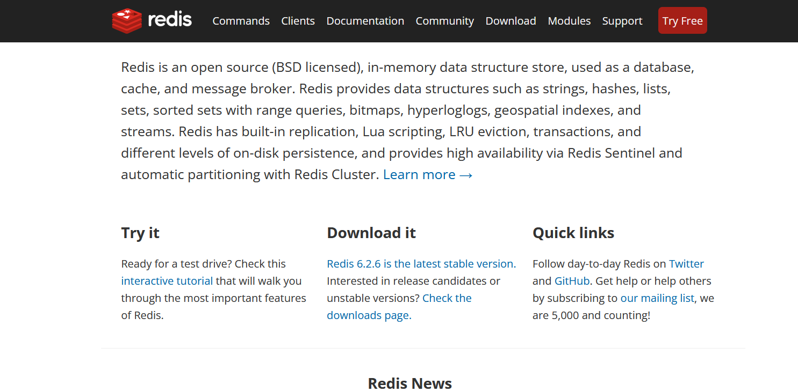
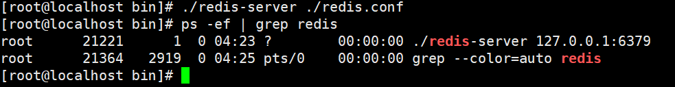

## 七天玩转Redis | Day1、Redis认识与安装


## 1、NOSQL的引言

NoSQL = Not Only SQL，意思：不仅仅是SQL；

泛指非关系型的数据库，随着互联网Web2.0网站的兴起，传统的关系数据库在应付web2.0网站，特别是超大规模和高并发的社交网络服务类型的Web2.0纯动态网站已经显得力不从心，暴露了很多难以克服的问题，而非关系型的数据库则由于其本身的特点得到了非常迅速的发展，NoSQL数据库的产生就是为了解决大规模数据集合多种数据种类带来的挑战，尤其是大数据应用难题，包括超大规模数据的存储。（例如谷歌或Facebook每天为他们的用户收集万亿比特的数据）。这些类型的数据存储不需要固定的模式，无需多余操作就可以横向扩展。

## 2、为什么是NOSQL

**1、易扩展**

NoSQL 数据库种类繁多，但是一个共同的特点都是去掉关系数据库的关系型特性。

**2、大数据量高性能**

NoSQL数据库都具有非常高的读写性能，尤其是在大数据量下，同样表现优秀。这得益于它的非关系性，数据库的结构简单。

**3、多样灵活的数据模型**

NoSQL无需事先为要存储的数据建立字段，随时可以存储自定义的数据格式，而在关系数据库里，增删字段是一件非常麻烦的事情。如果是非常大数据量的表，增加字段简直就是噩梦。

## 3、NoSQL应用场景

随着互联网网站的兴起，传统的关系数据库在应付动态网站，特别是超大规模和高并发的纯动态网站已经显得力不从心，暴露了很多难以克服的问题。**如商城网站中对商品数据频繁查询、对热搜商品的排行统计，订单超时问题**、以及微信朋友圈（音频，视频）存储等相关使用传统的关系型数据库实现就显得非常复杂，虽然能实现相应功能但是在性能上却不是那么乐观。

nosql这个技术门类的出现，更好的解决了这些问题，它告诉了世界不仅仅是sql。 

## 4、什么是Redis



Redis 是一个开源（BSD许可）的，**内存**中的数据结构存储系统，它可以用作**数据库、缓存和消息中间件**。 它支持多种类型的数据结构，如 字符串（strings），散列（hashes）， 列表（lists）， 集合（sets）， 有序集合（sorted sets） 与范围查询， bitmaps， hyperloglogs 和 地理空间（geospatial） 索引半径查询。 

Redis 内置了复制（replication），LUA脚本（Lua scripting），LRU驱动事件（LRU eviction），事务（transactions）和不同级别的 **磁盘持久化（persistence）**， 并通过**Redis哨兵（Sentinel）** 和自动分区（Cluster）提供高可用性（high availability）

## 5、Redis特点与优势

**特点**

- 内存数据库，速度快，也支持数据的持久化，可以将内存中的数据保存在磁盘中，重启的时候可以再次加载进行使用。
- Redis不仅仅支持简单的key-value类型的数据，同时还提供list，set，zset，hash等多种数据结构的存储。

- Redis支持数据的备份（master-slave）与集群（分片存储），以及拥有哨兵监控机制。
- 支持事务。

**优势**

- 性能极高 – Redis能读的速度是110000次/s，写的速度是81000次/s 。
- 丰富的数据类型 – Redis支持 Strings、Lists、 Hashes、Sets 、Sorted Sets 等数据类型操作。
- 原子操作 – Redis的所有操作都是原子性的，同时Redis还支持对几个操作合并后的原子性执行。（事务）
- 丰富的特性 – Redis还支持 publish/subscribe, 通知, key 过期等特性。

## 6、Linux下Redis的安装

### 6.1、解压安装

**1、打开LInux服务器，安装wget。**

```shell
yum install -y wget
```

**2、执行安装命令**

```shell
wget https://download.redis.io/releases/redis-6.2.6.tar.gz
```

**3、解压redis安装包**

```shell
tar -zxvf redis-6.2.6.tar.gz 
```

**4、由于`redis`是使用c语言编写的，因此我们还需要安装c语言依赖**

```shell
yum install -y gcc-c++
```

**5、升级gcc**

这里需要说明一下:在编译Redis 6之前需要升级gcc的版本，默认情况yum安装的gcc版本是4.8.5，由于版本过低，在编译时会报如下错误。所以我们需要执行以下操作升级GCC。 


执行下述命令：

```shell
# 安装 scl 源
yum install -y centos-release-scl scl-utils-build
# 安装9版本的 gcc、gcc-c++、gdb 工具链（toolchian)
yum install -y devtoolset-9-toolchain
# 临时覆盖系统原有的 gcc 引用
scl enable devtoolset-9 bash
# 查看 gcc 当前版本
gcc -v
```

再次查看当前gcc版本


成功升级到`9.3.1`！

### 6.2、编译安装

**1、先进行编译，检查redis的安装是否出错。**

```shell
# 编译的命令是make
make
```

**2、创建新的目录** 

```shell
mkdir -p /usr/local/redis
```

**3、将`redis`安装到我们新创建的目录中。**

```shell
make PREFIX=/usr/local/redis/ install
```

### 6.3、启动redis

**1、启动**

```shell
# 进入bin目录中，执行下述命令
./redis-server
```


启动成功！如何退出呢？`ctrl + c`退出。

**2、切换到守护进程** 

["守护进程"]（daemon）就是一直在后台运行的进程（daemon），执行下述操作，开启`redis`的守护进程。

 ```shell
# 我们先进入redis-6.2.6中
cd /usr/local/src/redis-6.2.6
# 拷贝redis.conf
cp redis.conf /usr/local/redis/bin/
# 进入redis.conf当前目录
cd /usr/local/redis/bin/
# 修改 redis.conf
vim redis.conf
# 将daemonize设置的值设置为yes
daemonize yes
 ```

然后我们通过加载配置文件的方式启动`redis`

```shell
./redis-server ./redis.conf
```



没有任何反馈，但是redis已经启动成功了！

**如何去结束？**

```shell
# kill  -9  3029 说明:强制终止3029号进程的运行，其中参数-9代表强制的意思
kill -9 21221
```

**3、配置开机启动** 

(1) 在系统服务目录里创建redis.service文件

```shell
vim /etc/systemd/system/redis.service
```

(2) 写入一下内容

```sh
[Unit]
Description=redis-server
After=network.target

[Service]
Type=forking
ExecStart=/usr/local/redis/bin/redis-server /usr/local/redis/bin/redis.conf         
PrivateTmp=true

[Install]
WantedBy=multi-user.target
```

**重载系统服务：systemctl daemon-reload** 

(3) 测试并加入开机自启

- 关闭redis-server：`systemctl start redis.service `
- 开启redis-server：`systemctl enable redis.service` 
- 查看redis-server状态：`systemctl status redis.service`

(4) 将服务加入开机自启

```shell
systemctl enable redis.service
```

## 7、Redis的配置

### 7.1.Redis的配置文件

**Redis支持很多的参数，但都有默认值。** 

- daemonize默认情况下,redis 不是在后台运行的，如果需要在后台运行，把该项的值更改为yes。
  了
- bind指定Redis只接收来自于该IP地址的请求。
- port监听端口，默认为6379。
- databases设置数据库的个数，默认使用的数据库是0。
- save设置Redis进行数据库镜像的频率。
- dbfilename镜像备份文件的文件名。
- dir数据库镜像备份的文件放置的路径。
- requirepass设置客户端连接后进行任何其他指定前需要使用的密码。
- maxclients限制同时连接的客户数量。
- maxmemory设置redis能够使用的最大内存。

###  7.2、通过windows客户端访问

安装Redis客户端，推荐redis-desktop-manager

- 安装完后，去建立连接，会提示失败，原因是redis默认只能本地访问。
- 修改配置文件redis.conf
- 注释掉 bind 127.0.0.1可以使所有的ip访问redis，若是想指定多个ip访问，但并不是全部的ip访问，可以bind设置
- 修改后kill -9 xXXx杀死redis进程，重启redis
- 再次建立连接->成功

**执行下述命令**

```shell
# 编辑redis.conf
vim redis.conf
# 将bind 127.0.0.1修改为虚拟机地址bind 192.168.165.3
bind 162.168.65.3
# 设置密码为123456
requirepass 123456
```

### 7.3、Redis自带的客户端的基本命令操作

```shell
# 进入当前目录
/usr/local/redis/bin
# 连接Redis客户端  -h 主机地址 -p 端口 -a 密码
./redis-cli -h 192.168.65.3 -p 6379 -a root
# 本机未修改端口简化写法
./redis-cli -a root
```

## 8、Redis数据库相关指令

### 8.1、数据库操作指令

```shell
# 1.Redis中库说明
- 使用redis的默认配置器动redis服务后,默认会存在16个库,编号从0-15
- 可以使用select 库的编号 来选择一个redis的库
- select 编号

# 2.Redis中操作库的指令
- 清空当前的库  FLUSHDB
- 清空全部的库  FLUSHALL

# 3.redis客户端显示中文
-	./redis-cli  -p 7000 --raw
```

### 8.2 、操作key相关指令

```shell
# 1.DEL指令
- 语法 :  DEL key [key ...] 
- 作用 :  删除给定的一个或多个key 。不存在的key 会被忽略。
- 可用版本： >= 1.0.0
- 返回值： 被删除key 的数量。 

# 2.EXISTS指令
- 语法:  EXISTS key
- 作用:  检查给定key 是否存在。
- 可用版本： >= 1.0.0
- 返回值： 若key 存在，返回1 ，否则返回0。

# 3.EXPIRE（有效期，单位）
- 语法:  EXPIRE key seconds
- 作用:  为给定key 设置生存时间，当key 过期时(生存时间为0 )，它会被自动删除。
- 可用版本： >= 1.0.0
- 时间复杂度： O(1)
- 返回值：设置成功返回1 。

# 4.KEYS
- 语法 :  KEYS pattern
- 作用 :  查找所有符合给定模式pattern 的key 。
- 语法:
	KEYS * 匹配数据库中所有key 。
	KEYS h?llo 匹配hello ，hallo 和hxllo 等。 	?只可以匹配一个任意字符
	KEYS h*llo 匹配hllo 和heeeeello 等。 	*可以匹配0到任意多个字符
	KEYS h[ae]llo 匹配hello 和hallo ，但不匹配hillo 。特殊符号用 "\" 隔开 [ae]匹配的字符只能是a或者是e
	KEYS h[ae][ae]llo 长度是6位，中间是a或者是e
- 可用版本： >= 1.0.0
- 返回值： 符合给定模式的key 列表。

# 5.MOVE
- 语法 :  MOVE key db
- 作用 :  将当前数据库的key 移动到给定的数据库db 当中。
- 可用版本： >= 1.0.0
- 返回值： 移动成功返回1 ，失败则返回0 。

# 6.PEXPIRE	（单位是毫秒）
- 语法 :  PEXPIRE key milliseconds
- 作用 :  这个命令和EXPIRE 命令的作用类似，但是它以毫秒为单位设置key 的生存时间，而不像EXPIRE 命令那样，以秒为单位。
- 可用版本： >= 2.6.0
- 时间复杂度： O(1)
- 返回值：设置成功，返回1  key 不存在或设置失败，返回0

# 7.PEXPIREAT	
- 语法 :  PEXPIREAT key milliseconds-timestamp
- 作用 :  这个命令和EXPIREAT 命令类似，但它以毫秒为单位设置key 的过期unix 时间戳，而不是像EXPIREAT那样，以秒为单位。
- 可用版本： >= 2.6.0
- 返回值：如果生存时间设置成功，返回1 。当key 不存在或没办法设置生存时间时，返回0 。(查看EXPIRE 命令获取更多信息)

# 8.TTL
- 语法 :   TTL key
- 作用 :   以秒为单位，返回给定key 的剩余生存时间(TTL, time to live)。
- 可用版本： >= 1.0.0
- 返回值：
	当key 不存在时，返回-2 。
	当key 存在但没有设置剩余生存时间时，返回-1 。
	否则，以秒为单位，返回key 的剩余生存时间。
- Note : 在Redis 2.8 以前，当key 不存在，或者key 没有设置剩余生存时间时，命令都返回-1 。

# 9.PTTL
- 语法 :  PTTL key
- 作用 :  这个命令类似于TTL 命令，但它以毫秒为单位返回key 的剩余生存时间，而不是像TTL 命令那样，以秒为单位。
- 可用版本： >= 2.6.0
- 返回值： 当key 不存在时，返回-2 。当key 存在但没有设置剩余生存时间时，返回-1 。
- 否则，以毫秒为单位，返回key 的剩余生存时间。
- 注意 : 在Redis 2.8 以前，当key 不存在，或者key 没有设置剩余生存时间时，命令都返回-1 。

# 10.RANDOMKEY
- 语法 :  RANDOMKEY
- 作用 :  从当前数据库中随机返回(不删除) 一个key 。
- 可用版本： >= 1.0.0
- 返回值：当数据库不为空时，返回一个key 。当数据库为空时，返回nil 。

# 11.RENAME
- 语法 :  RENAME key newkey
- 作用 :  将key 改名为newkey 。当key 和newkey 相同，或者key 不存在时，返回一个错误。当newkey 已经存在时，RENAME 命令将覆盖旧值。
- 可用版本： >= 1.0.0
- 返回值： 改名成功时提示OK ，失败时候返回一个错误。

# 12.TYPE
- 语法 :  TYPE key
- 作用 :  返回key 所储存的值的类型。
- 可用版本： >= 1.0.0
- 返回值：
	none (key 不存在)
	string (字符串)
	list (列表)
	set (集合)
	zset (有序集)
	hash (哈希表)
```


