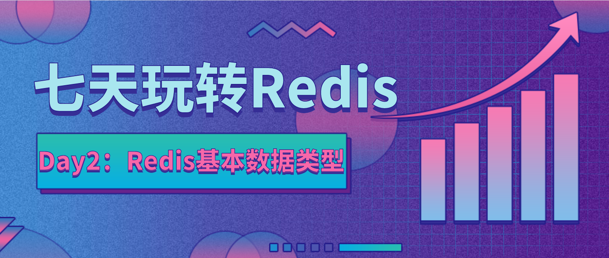
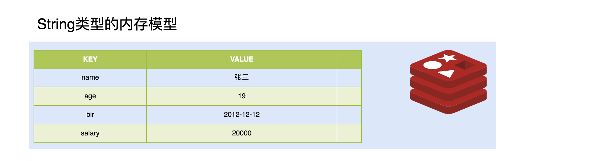
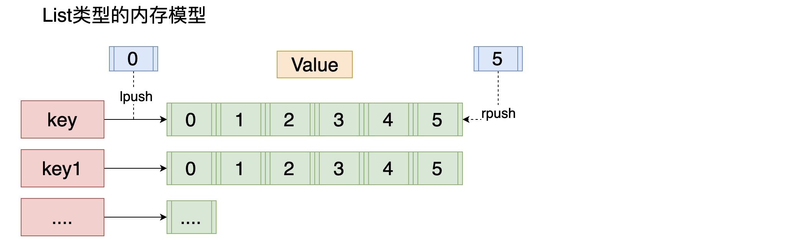

七天玩转Redis | Day2、Redis基本数据类型

## 前言

Redis作为内存中的数据结构存储系统，它可以用作数据库、缓存和消息中间件。它的value支持多种类型的数据结构，基本数据结构包含：字符串(strings)、散列(hashes)、列表(lists)、集合(sets)、有序集合(sorted sets)五种。

这五种数据结构在我们工作中经常使用到，面试过程中经常被问到，因此熟练掌握这5种基本数据结构的使用和应用场景是Redis知识最基础也是最重要的部分。

## 1、 String类型

### 1.1、类型介绍

字符串是Redis最简单的储存类型，它存储的值可以是字符串、整数或者浮点数，对整个字符串或者字符串的其中一部分执行操作;对整数或者浮点数执行自增(increment)或者自减(decrement)操作。

Redis的字符串是一个由字节组成的序列，跟java里面的ArrayList有点类似，采用预分配冗余空间的方式来减少内存的频繁分配，内部为当前字符串实际分配的空间capacity 一般要高于实际字符串长度len。当字符串长度小于1M时，扩容都是加倍现有的空间，如果超过1M，扩容时一次只会多扩1M的空间。需要注意的是字符串最大长度为512M。

### 1.2、应用场景

字符串类型在工作中使用广泛，主要用于缓存数据，提高查询性能.比如存储登录用户信息、电商中存储商品信息、可以做计数器(想知道什么时候封锁一个IP地址(访问超过几次))等等.

### 1.3、内存存储模型

### 1.4、 常用操作命令

| 命令                                       | 说明                                       |
| ------------------------------------------ | ------------------------------------------ |
| set                                        | 设置一个key/value                          |
| get                                        | 根据key获得对应的value                     |
| mset                                       | 一次设置多个key value                      |
| mget                                       | 一次获得多个key的value                     |
| getset                                     | 获得原始key的值，同时设置新值              |
| strlen                                     | 获得对应key存储value的长度                 |
| append                                     | 为对应key的value追加内容                   |
| getrange 索引0开始                         | 截取value的内容                            |
| setex                                      | 设置一个key存活的有效期（秒）              |
| psetex                                     | 设置一个key存活的有效期（毫秒）            |
| setnx                                      | 存在不做任何操作,不存在添加                |
| msetnx原子操作(只要有一个存在不做任何操作) | 可以同时设置多个key,只要有一个存在都不保存 |
| decr                                       | 进行数值类型的-1操作                       |
| decrby                                     | 根据提供的数据进行减法操作                 |
| Incr                                       | 进行数值类型的+1操作                       |
| incrby                                     | 根据提供的数据进行加法操作                 |
| Incrbyfloat                                | 根据提供的数据加入浮点数                   |

##  2、List类型

### 2.1、类型介绍

Redis中的lists相当于Java中的LinkedList，实现原理是一个双向链表（其底层是一个快速列表)，即可以支持反向查找和遍历，更方便操作。插入和删除操作非常快，时间复杂度为o(1)，但是索引定位很慢，时间复杂度为o(n)。

### 2.2、应用场景

lists的应用场景非常多，可以利用它轻松实现热销榜；可以实现工作队列(利用lists的push操作，将任务存在lists中，然后工作线程再用pop操作将任务取出进行执行） ；可以实现最新列表，比如最新评论等。

### 2.3、内存存储模型

### 2.4、常用操作指令

| 命令    | 说明                                 |
| ------- | ------------------------------------ |
| lpush   | 将某个值加入到一个key列表头部        |
| lpushx  | 同lpush,但是必须要保证这个key存在    |
| rpush   | 将某个值加入到一个key列表末尾        |
| rpushx  | 同rpush,但是必须要保证这个key存在    |
| lpop    | 返回和移除列表左边的第一个元素       |
| rpop    | 返回和移除列表右边的第一个元素       |
| lrange  | 获取某一个下标区间内的元素           |
| llen    | 获取列表元素个数                     |
| lset    | 设置某一个指定索引的值(索引必须存在) |
| lindex  | 获取某一个指定索引位置的元素         |
| lrem    | 删除重复元素                         |
| ltrim   | 保留列表中特定区间内的元素           |
| linsert | 在某一个元素之前，之后插入新元素     |

## 3、 Set类型

### 3.1、类型介绍

集合类似Java中的HashSet，内部实现是一个value永远为null的HashMap，实际就是通过计算hash的方式来快速排重的，这也是set能提供判断一个成员是否在集合内的原因。

特点: Set类型 Set集合 元素无序  不可以重复

### 3.2、应用场景

redis的sets类型是使用哈希表构造的，因此复杂度是o(1)，它支持集合内的增删改查，并且支持多个集合间的交集、并集、差集操作。可以利用这些集合操作，解决程序开发过程当中很多数据集合间的问题。比如计算网站独立ip，用户画像中的用户标签，共同好友等功能。

### 3.3、内存存储模型

### 3.4、常用命令

| 命令        | 说明                                               |
| ----------- | -------------------------------------------------- |
| sadd        | 为集合添加元素                                     |
| smembers    | 显示集合中所有元素 无序                            |
| scard       | 返回集合中元素的个数                               |
| spop        | 随机返回一个元素 并将元素在集合中删除              |
| smove       | 从一个集合中向另一个集合移动元素  必须是同一种类型 |
| srem        | 从集合中删除一个元素                               |
| sismember   | 判断一个集合中是否含有这个元素                     |
| srandmember | 随机返回元素                                       |
| sdiff       | 去掉第一个集合中和其它集合含有的相同元素           |
| sinter      | 求交集                                             |
| sunion      | 求和集                                             |

##  4、ZSet类型

### 4.1、类型介绍

sorted sets是Redis类似于SortedSet和HashMap的结合体，一方面它是一个set，保证了内部value的唯一性，另一方面它可以给每个value赋予一个score，代表这个value的排序权重。内部使用HashMap和跳跃表(SkipList)来保证数据的存储和有序，HashMap里放的是成员到score的映射，而跳跃表里存放的是所有的成员，排序依据是HashMap里存的score,使用跳跃表的结构可以获得比较高的查找效率，并且在实现上比较简单。sorted sets中最后一个value被移除后，数据结构自动删除，内存被回收。

特点: 可排序的set集合  排序  不可重复 

### 4.2、应用场景

主要应用于根据某个权重进行排序的队列的场景，比如游戏积分排行榜，设置优先级的任务列表，学生成绩表等。

### 4.3、内存模型 

### 4.5、常用命令

| 命令                       | 说明                                      |
| -------------------------- | ----------------------------------------- |
| zadd                       | 添加一个有序集合元素                      |
| zcard                      | 返回集合的元素个数                        |
| zrange 升序 zrevrange 降序 | 返回一个范围内的元素   withscores添加分数 |
| zrangebyscore              | 按照分数查找一个范围内的元素              |
| zrank                      | 返回排名                                  |
| zrevrank                   | 倒序排名                                  |
| zscore                     | 显示某一个元素的分数                      |
| zrem                       | 移除某一个元素                            |
| zincrby                    | 给某个特定元素加分                        |

##  5、hash类型

### 5.1、类型介绍

散列相当于Java中的HashMap，内部是无序字典。实现原理跟HashMap一致。一个哈希表有多个节点，每个节点保存一个键值对。

与Java中的HashMap不同的是，rehash 的方式不一样，因为Java的HashMap在字典很大时,rehash是个耗时的操作，需要一次性全部rehash。Redis为了高性能，不能堵塞服务，所以采用了渐进式rehash策略。

渐进式 rehash会在rehash的同时，保留新旧两个hash结构，查询时会同时查询两个hash结构，然后在后续的定时任务中以及hash操作指令中，循序渐进地将旧hash的内容一点点迁移到新的 hash结构中。当搬迁完成了，就会使用新的hash结构取而代之。
当hash移除了最后一个元素之后，该数据结构自动被删除，内存被回收。

特点: value 是一个map结构 存在key value  key 无序的  

### 5.2、应用场景

Hash也可以同于对象存储，比如存储用户信息，与字符串不一样的是，字符串是需要将对象进行序列化(比如json序列化)之后才能保存，而Hash则可以讲用户对象的每个字段单独存储，这样就能节省序列化和反序列的时间。如下:

此外还可以保存用户的购买记录，比如key为用户id，field为商品id，value为商品数量。同样还可以用于购物车数据的存储，比如key为用户id， field为商品id,value为购买数量等等。

### 5.3、内存模型

### 5.4、常用命令  

| 命令         | 说明                    |
| ------------ | ----------------------- |
| hset         | 设置一个key/value对     |
| hget         | 获得一个key对应的value  |
| hgetall      | 获得所有的key/value对   |
| hdel         | 删除某一个key/value对   |
| hexists      | 判断一个key是否存在     |
| hkeys        | 获得所有的key           |
| hvals        | 获得所有的value         |
| hmset        | 设置多个key/value       |
| hmget        | 获得多个key的value      |
| hsetnx       | 设置一个不存在的key的值 |
| hincrby      | 为value进行加法运算     |
| hincrbyfloat | 为value加入浮点值       |

