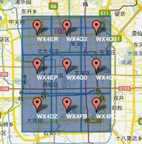

# 七天玩转Redis | Day3、Redis位图和GEO介绍与使用


# 1、位图 

## 1.1、应用场景

在很多互联网应用中，我们会存在签到送积分、签到领取奖励等这样的需求，比如:

- 签到1天送10积分，连续签到2天送20积分，3天送30积分，4天以上均送50积分等。
- 如果连续签到中断，则重置计数，每月初重置计数。
- 显示用户某个月的签到次数。
- 在日历控件上展示用户每月签到情况，可以切换年月显示。

## 1.2、设计思路

### 1.2.1、数据库解决

最简单的设计思路就是利用关系型数据库保存签到数据(t_user_sign)，如下:

| 字段名      | 描述                        |
| :---------- | --------------------------- |
| id          | 数据表主键（AUTO_INCREMENT) |
| fk_diner_id | 用户ID                      |
| sign_date   | 签到日期（如2010-11-11）    |
| amount      | 连续签到次数（如2）         |

- 用户签到：往此表插入一条数据，并更新连续签到天数;
- 查询根据签到日期查询
- 统计根据amount统计

如果这样存数据的话，对于用户量比较大的应用，数据库可能就扛不住，比如1000W用户，一天一条，那么一个月就是3亿数据，这是非常庞大的。

### 1.2.2、使用Redis的BitMaps完成

Bitmaps叫位图，它不是Redis的基本数据类型(比如Strings、Lists、Sets、Hashes这类实际的数据类型)，而是基于string数据类型的按位操作，高阶数据类型的一种。Bitmaps支持的最大位数是2^32​位。 使用512M内存就可以存储多达42.9亿的字节信息(2^32= 4,294,967,296)

它是由一组bit位组成的，每个bit位对应0和1两个状态，虽然内部还是采用String类型存储，但Redis提供了一些指令用于直接操作位图，可以把它看作是一个bit数组，数组的下标就是偏移量。

它的优点是内存开销小、效率高且操作简单，很适合用于签到这类场景。比如按月进行存储，一个月最多31天，那么我们将该月用户的签到缓存二进制就是
00000000000000000000000000000000，当某天签到将0改成1即可，而且Redis提供对bitmap的很多操作比如存储、获取、统计等指令，使用起来非常方便。

## 1.3、BitMaps常用指令

| 命令     | 功能                                         | 参数                                                         |
| -------- | -------------------------------------------- | ------------------------------------------------------------ |
| SETBIT   | 指定偏移量bit位置设置值                      | key offset value 【 0=<offset<2^32】                         |
| GETBIT   | 查询指定偏移位置的bit值                      | key offset                                                   |
| BITCOUNT | 统计指定字节区间bit为1的数量                 | key [start end]【@LBN】                                      |
| BITFIELD | 操作多字节位域                               | key [GET type offset]  [SET type offset value] [INCRBY type offsetincrement] [OVERFLOW WRAP/SAT/FAIL] |
| BITPOS   | 查询指定字节区间第一个被设置成1的bit位的位置 | key bit [start] [end]【@LBN】                                |

考虑到每月初需要重置连续签到次数，最简单的方式是按用户每月存一条签到数据（也可以每年存一条数据)。Key的格式为

`u :sign:userid :yyyyNM`，Value则采用长度为4个字节(32位）的位图（最大月份只有31天)。位图的每一位代表一天的签到，1表示已签，0表示未签。**从高位插入，也就是说左边位算是开始日期。**

例如`user:sign:98:202883`表示用户id=98的用户在2020年3月的签到记录。

# 2、GEO

## 2.1、应用场景

各种社交软件里面都有附件的人的需求，在该应用中，我们需要查询附近1公里的人员信息，同时只需查询出20个即可。


## 2.2、设计思路

解决基于地理位置的搜索，很多数据库品牌都支持：MySQL、MongoDB、Redis等都能支持地理位置的存储。

- 当用户登录应用时，或者保持用户登录后用户在使用应用时，客户端是可以时刻获取用户位置信息的(前提是用户要开启位置获取的权限)，客户端获取到最新的地理位置后，上传到后端服务器进行更新。
- 当用户点击Near Me功能时，那么通过后台就可以以当前用户的位置为圆点，距离为半径查询相关的用户展示即可完成。

##  2.3、Redis GEO常用指令

在Redis中，在有序集合以及GeoHash的基础上实现了Geo类型表示地理空间信息。GeoHash是将经纬度进行编码，使二维信息变为一维信息的一种算法。下面我们就来介绍Redis中Geo类型相关的常用指令。

| 命令              | 功能                                          | 参数                                                         |
| ----------------- | --------------------------------------------- | ------------------------------------------------------------ |
| GEOADD            | 添加地理位置                                  | GEOADD key longitude latitude member [longitude latitude member ...] |
| GEODIST           | 两点间的距离                                  | GEODIST key member1 member2 [unit]                           |
| GEOHASH           | 返回标准的Geohash值                           | GEOHASH key member[member ...]                               |
| GEOPOS            | 返回key中给定元素的位置信息(经纬度)           | GEOPQS key member[member...]                                 |
| GEOREDIUS         | 返回以某点为圆心，距离为半径的其他位置元素    | GEOREDIuS key longitude latitude radius m\|km/ft\|mi [wITHCQORD] [WITHDIST] [WITHHASH] [COUNT count] |
| GEORADIUSBYMEMBER | 跟GEOREDIuS一样，只不过圆心是给定的member元素 | GEORADIUSBYMEMBER key longitude latitude radius m \|km/ft\|mi [wITHCOORD] [WITHDIST] [WITHHASH] [COUNT count] |

### 2.3.1、GEOADD

 GEOADD key longitude latitude member [longitude latitude member ...] 添加位置信息

```shell
# 添加单个位置
192.168.65.3:0>GEOADD diner:location 121.446617 31.205593 'zhangsan'
"1"
# 添加多个位置
192.168.65.3:0>GEOADD diner:location 121.4465774 31.20485103 'lisi' 121.44534 31.2031 'wangwu' 121.4510648 31.2090667 'zhangliu'
"3"
```

### 2.3.2、GEODIST

GEODIST key member1  member2 [unit]计算距离，其中unit为单位m|km|ft(英尺)|mi (英里)

```shell
# 计算两点间的距离，返回距离的单位是米(m)
192.168.65.3:0>GEODIST diner:location zhangsan lisi m
"82.4241"
#计算两点间的距离，返回距离的单位是千米(km) 
192.168.65.3:0>GEODIST diner:location zhangsan lisi km 
"0.0824"
```

### 2.3.3、GEOHASH

GEOHASH key member[mmber...]返回一个或多个位置元素的Gechash。保存到Redis中是用Geohash位置52点整数编码的。

GeoHash将二维的经纬度转换成字符串，比如下图展示了北京9个区域的GeoHash字符串，分别是WX4ER，WX4G2、WX4G3等 等，每一个字符串代表了某一矩形区域。也就是说，这个矩形区域内所有的点（经纬度坐标）都共享相同的GeoHash字符串，这样既可以保护隐私（只表示大概区域位置而不是具体的点），又比较容易做缓存，比如左上角这个区域内的用户不断发送位置信息请求餐馆数据，由于这些用户的GeoHash字符串都是WX4ER，所以可以把WX4ER当作key，把该区域的餐馆信息当作value来进行缓存，而如果不使用GeoHash的话，由于区域内的用户传来的经纬度是各不相同的，很难做缓存。 



http://openlocation.org/geohash/geohash-js/ 提供了在地图上显示geohash编码的功能。

```shell
#计算某个位置的GeoHash值
192.168.65.3:0>GEOHASH diner:location zhangsan
 1)  "wtw3e8f9z20"
```

### 2.3.4、GEOPOS

GEOPos key member [member ...]从 `key` 里返回所有给定位置元素的位置（ 经度和纬度 ）

```shell
#返回zhangsan和lisi的位置信息
192.168.65.3:0>GEOPOS diner:location zhangsan lisi
 1)    1)   "121.44661813974380493"
  2)   "31.20559220971455971"

 2)    1)   "121.44657522439956665"
  2)   "31.20485207113603821"
```

### 2.3.5、GEORADIUS

GEORADIUs key longitude latitude radius m|km/ftlmi [WITHCOORD] [WITHDIST] [WITHHASH] [COUNT count]给定的经纬度为中心，返回键包含的位置元素当中，与中心的距离不超过给定最大距离的所有位置元素。范围可以使用以下其中一个单位:

- m表示单位为米。
- km表示单位为千米。
- mi表示单位为英里。
- ft表示单位为英尺。

在给定以下可选项时，命令会返回额外的信息: 

- `WITHDIST`: 在返回位置元素的同时， 将位置元素与中心之间的距离也一并返回。 距离的单位和用户给定的范围单位保持一致

- `WITHCOORD`: 将位置元素的经度和维度也一并返回

- `WITHHASH`: 以 52 位有符号整数的形式， 返回位置元素经过原始 geohash 编码的有序集合分值。 这个选项主要用于底层应用或者调试， 实际中的作用并不大。

命令默认返回未排序的位置元素。 通过以下两个参数， 用户可以指定被返回位置元素的排序方式：

- `ASC`：根据中心的位置， 按照从近到远的方式返回位置元素。

- `DESC`: 根据中心的位置， 按照从远到近的方式返回位置元素

在默认情况下， GEORADIUS 命令会返回所有匹配的位置元素。 虽然用户可以使用 COUNT 选项去获取前 N 个匹配元素， 但是因为命令在内部可能会需要对所有被匹配的元素进行处理， 所以在对一个非常大的区域进行搜索时， 即使只使用 `COUNT` 选项去获取少量元素， 命令的执行速度也可能会非常慢。 但是从另一方面来说， 使用 `COUNT` 选项去减少需要返回的元素数量， 对于减少带宽来说仍然是非常有用的。

```shell
# 以121.446617 31.205593(张三位置)为圆心，3000m为半径，查询返回用户及其位置
192.168.65.3:0>GEORADIUS diner:location 121.446617 31.205593 3000 m WITHCOORD
 1)    1)   "wangwu"
  2)      1)    "121.44534140825271606"
   2)    "31.20310057881493293"


 2)    1)   "lisi"
  2)      1)    "121.44657522439956665"
   2)    "31.20485207113603821"


 3)    1)   "zhangsan"
  2)      1)    "121.44661813974380493"
   2)    "31.20559220971455971"


 4)    1)   "zhangliu"
  2)      1)    "121.45106524229049683"
   2)    "31.20906731242401833"
# 以121.446617 31.205593(张三位置)为圆心，3000m为半径，查询返回用户及其距离(单位是米)

192.168.65.3:0>GEORADIUS diner:location 121.446617 31.205593 3000 m WITHDIST
 1)    1)   "wangwu"
  2)   "302.6202"

 2)    1)   "lisi"
  2)   "82.5066"

 3)    1)   "zhangsan"
  2)   "0.1396"

 4)    1)   "zhangliu"
  2)   "573.0651"
  
# 以121.446617 31.205593(张三位置)为圆心，3000m为半径，查询返回用户及其距离(单位是米) 由近及远
192.168.65.3:0>GEORADIUS diner:location 121.446617 31.205593 3000 m WITHDIST ASC
 1)    1)   "zhangsan"
  2)   "0.1396"

 2)    1)   "lisi"
  2)   "82.5066"

 3)    1)   "wangwu"
  2)   "302.6202"

 4)    1)   "zhangliu"
  2)   "573.0651"
  
# 以121.446617 31.205593(张三位置)为圆心，3000m为半径，查询返回用户及GeoHash值去2个
192.168.65.3:0>GEORADIUS diner:location 121.446617 31.205593 3000 m WITHHASH COUNT 2
 1)    1)   "zhangsan"
  2)   "4054756138736536"

 2)    1)   "lisi"
  2)   "4054756138536712"
```

### 2.3.6、GEORADIUSBYMEMBER

GEORADIUSBYMEMBER key member radius m|km/tlmi WITHCOORD] [WITHDIST] [WITHHASH] [COUNT count)，这个命令和GEORADIUs命令一样，都可以找出位于指定范围内的元素，但是GEORADIUSBYMEMBER 的中心点是由给定的位置元素决定的，而不是像GEORADIUS那样，使用输入的经度和纬度来决定中心点

指定成员的位置被用作查询的中心。

```shell
192.168.65.3:0>GEORADIUSBYMEMBER diner:location zhangsan 1000 m
 1)  "wangwu"
 2)  "lisi"
 3)  "zhangsan"
 4)  "zhangliu"
```

