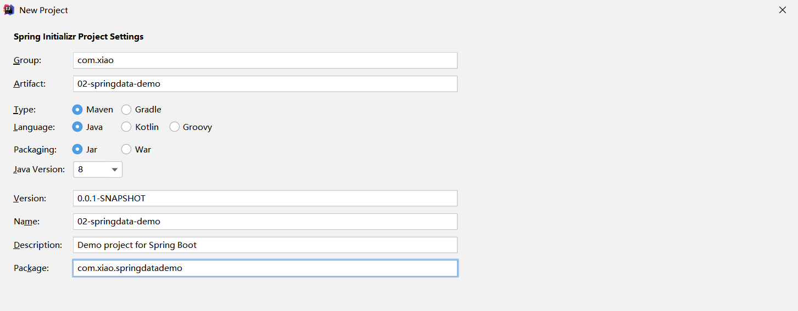

# 七天玩转Redis | Day6、SpringBoot集成Redis


Spring Boot Data(数据) Redis 中提供了**RedisTemplate和StringRedisTemplate**，其中StringRedisTemplate是RedisTemplate的子类，两个方法基本一致，不同之处主要体现在操作的数据类型不同，**RedisTemplate中的两个泛型都是Object，意味着存储的key和value都可以是一个对象，而StringRedisTemplate的两个泛型都是String，意味着StringRedisTemplate的key和value都只能是字符串。**

注意:  使用RedisTemplate默认是将对象序列化到Redis中,所以放入的对象必须实现对象序列化接口。

## 1、搭建环境

搭建环境：**采用**IDEA+JDK8 + SpringBoot2.3.5**集成**Redis。

**第一步：**使用IDEA构建项目，同时引入对应依赖



依赖选择


引入依赖

```xml
<?xml version="1.0" encoding="UTF-8"?>
<project xmlns="http://maven.apache.org/POM/4.0.0" xmlns:xsi="http://www.w3.org/2001/XMLSchema-instance"
         xsi:schemaLocation="http://maven.apache.org/POM/4.0.0 https://maven.apache.org/xsd/maven-4.0.0.xsd">
    <modelVersion>4.0.0</modelVersion>
    <parent>
        <groupId>org.springframework.boot</groupId>
        <artifactId>spring-boot-starter-parent</artifactId>
        <version>2.3.4.RELEASE</version>
        <relativePath/> <!-- lookup parent from repository -->
    </parent>
    <groupId>com.imooc</groupId>
    <artifactId>springboot-redis-demo</artifactId>
    <version>0.0.1-SNAPSHOT</version>
    <name>springboot-redis-demo</name>
    <description>Demo Redis project for Spring Boot</description>

    <properties>
        <java.version>1.8</java.version>
    </properties>

    <dependencies>
        <dependency>
            <groupId>org.springframework.boot</groupId>
            <artifactId>spring-boot-starter-data-redis</artifactId>
        </dependency>
        <dependency>
            <groupId>org.springframework.boot</groupId>
            <artifactId>spring-boot-starter-web</artifactId>
        </dependency>

        <dependency>
            <groupId>org.springframework.boot</groupId>
            <artifactId>spring-boot-starter-test</artifactId>
            <scope>test</scope>
            <exclusions>
                <exclusion>
                    <groupId>org.junit.vintage</groupId>
                    <artifactId>junit-vintage-engine</artifactId>
                </exclusion>
            </exclusions>
        </dependency>
    </dependencies>

    <build>
        <plugins>
            <plugin>
                <groupId>org.springframework.boot</groupId>
                <artifactId>spring-boot-maven-plugin</artifactId>
            </plugin>
        </plugins>
    </build>

</project>
```

**第二步：配置Redis** 

**application.yml** 配置文件如下： 

```yaml
# 主机
spring.redis.host=127.0.0.1
# 端口
spring.redis.port=6379
# 密码
spring.redis.password=root
# 数据库，默认第0个
spring.redis.database=0

# 最大连接数量 = maxTotal
spring.redis.jedis.pool.max-active=8
# 资源池允许最大空闲数
spring.redis.jedis.pool.max-idle=8
# 资源池确保最少空闲连接数
spring.redis.jedis.pool.min-idle=2
# 连接超时时间
spring.redis.jedis.pool.max-wait=1000
```

**第三步：添加Redis序列化方法** 

Redis要序列化对象是使对象可以跨平台存储和进行网络传输。因为存储和网络传输都需要把一个对象状态保存成一种跨平台识别的字节格式，然后其他的平台才可以通过字节信息解析还原对象信息，所以进行“跨平台存储”和”网络传输”的数据都需要进行序列化。

```java
   /**
     * redisTemplate 序列化使用的jdkSerializeable, 存储二进制字节码, 所以自定义序列化类
     * @param redisConnectionFactory
     * @return
     */
    @Bean
    public RedisTemplate<Object, Object> redisTemplate(RedisConnectionFactory redisConnectionFactory) {
        RedisTemplate<Object, Object> redisTemplate = new RedisTemplate<>();
        redisTemplate.setConnectionFactory(redisConnectionFactory);

        // 使用Jackson2JsonRedisSerialize 替换默认序列化
        Jackson2JsonRedisSerializer jackson2JsonRedisSerializer = new Jackson2JsonRedisSerializer(Object.class);

        ObjectMapper objectMapper = new ObjectMapper();
        objectMapper.setVisibility(PropertyAccessor.ALL, JsonAutoDetect.Visibility.ANY);
        jackson2JsonRedisSerializer.setObjectMapper(objectMapper);

        // 设置key和value的序列化规则
        redisTemplate.setValueSerializer(jackson2JsonRedisSerializer);
        redisTemplate.setKeySerializer(new StringRedisSerializer());

        redisTemplate.setHashKeySerializer(new StringRedisSerializer());
        redisTemplate.setHashValueSerializer(jackson2JsonRedisSerializer);

        redisTemplate.afterPropertiesSet();
        return redisTemplate;
    }
```

## 2、测试Redis

在测试的package中，写下测试方法如下：

**ApplicationTests.java** 

```java
package com.xiao.springdatademo;

import org.junit.jupiter.api.Test;
import org.springframework.beans.factory.annotation.Autowired;
import org.springframework.boot.test.context.SpringBootTest;
import org.springframework.data.redis.core.RedisTemplate;
@SpringBootTest
class ApplicationTests {
    @Autowired
    private RedisTemplate redisTemplate;
    @Test
    void testInit() {
        //PING PONG 心跳机制检测是否连接成功
        String pong = redisTemplate.getConnectionFactory().getConnection().ping();
        System.out.println("pong = " + pong);
    }
    @Test
    public void testString(){
        // 插入一条数据
        redisTemplate.opsForValue().set("username","lisi");
        // 获取一条数据
        Object username = redisTemplate.opsForValue().get("username");
        System.out.println("username = " + username);
    }
}
```

测试成功！ 


## 3、StringRedisTemplate

### 3.1、介绍

- StringRedisTemplate继承RedisTemplate。
- StringRedisTemplate使用的序列化类是StringRedisSerializer。

- SDR默认采用的序列化策略有两种，一种是String的序列化策略，一种是JDK的序列化策略。StringRedisTemplate默认采用的是String的序列化策略，保存的key和value都是采用此策略序列化保存的。

- StringRedisTemplate对字符串支持比较友好，不能存储对象，当你的redis数据库里面本来存的是字符串数据或者你要存取的数据就是字符串类型数据的时候，那么你就使用StringRedisTemplate即可。

### 3.2、StringRedisTemplate常用操作

```java
stringRedisTemplate.opsForValue().set("test", "100",60*10,TimeUnit.SECONDS);//向redis里存入数据和设置缓存时间  
stringRedisTemplate.boundValueOps("test").increment(-1);//val做-1操作

stringRedisTemplate.opsForValue().get("test")//根据key获取缓存中的val

stringRedisTemplate.boundValueOps("test").increment(1);//val +1

stringRedisTemplate.getExpire("test")//根据key获取过期时间

stringRedisTemplate.getExpire("test",TimeUnit.SECONDS)//根据key获取过期时间并换算成指定单位 

stringRedisTemplate.delete("test");//根据key删除缓存

stringRedisTemplate.hasKey("546545");//检查key是否存在，返回boolean值 

stringRedisTemplate.opsForSet().add("red_123", "1","2","3");//向指定key中存放set集合

stringRedisTemplate.expire("red_123",1000 , TimeUnit.MILLISECONDS);//设置过期时间

stringRedisTemplate.opsForSet().isMember("red_123", "1")//根据key查看集合中是否存在指定数据

stringRedisTemplate.opsForSet().members("red_123");//根据key获取set集合
```

### 3.3、**StringRedisTemplate的使用** 

使用  @Autowired 注解注入stringRedisTemplate。

```java
package com.xiao;

import org.junit.jupiter.api.Test;
import org.springframework.beans.factory.annotation.Autowired;
import org.springframework.boot.test.context.SpringBootTest;
import org.springframework.data.redis.connection.DataType;
import org.springframework.data.redis.core.StringRedisTemplate;

import java.util.*;

import java.util.ArrayList;
import java.util.concurrent.TimeUnit;

import static java.util.concurrent.TimeUnit.*;

//启动springboot应用
@SpringBootTest(classes = RedisDay2Application.class)
public class TestStringRedisTemplate {

    //注入StringRedisTemplate
    @Autowired
    private StringRedisTemplate stringRedisTemplate; //key value都是字符串

    //操作key相关
    @Test
    public void testKey(){
        //stringRedisTemplate.delete("name"); //删除一个key
        Boolean hasKey = stringRedisTemplate.hasKey("name");//判断一个key是否存在
        System.out.println(hasKey);
        DataType name = stringRedisTemplate.type("name");//判断key所对应的类型
        System.out.println(name);
        Set<String> keys = stringRedisTemplate.keys("*");
        keys.forEach(key-> System.out.println("key = " + key));
        Long expire = stringRedisTemplate.getExpire("age");//获取key超时时间 -1 永不超时 -2 key不存在 >=0 过期时间
        System.out.println(expire);

        //stringRedisTemplate.rename("name","name1"); //修改可以名字 判断key是否存在

        stringRedisTemplate.move("name1",1); //移动可以到指定库
    }

    //操作redis字符串  opsForValue 实际操作就是redis中String类型
    @Test
    public void testString(){
        stringRedisTemplate.opsForValue().set("name","小陈"); // set 设置一个key value
        String value = stringRedisTemplate.opsForValue().get("name"); //用来获取一个key对应value
        System.out.println("value = " + value);

        stringRedisTemplate.opsForValue().set("code","2357", 120,TimeUnit.SECONDS); //设置一个key超时时间

        stringRedisTemplate.opsForValue().append("name","，他是一个好人！");  //追加
    }

    //操作redis中的list类型  opsForList 实际操作的就是redis中的list类型
    @Test
    public void testList(){
        stringRedisTemplate.opsForList().leftPush("names","小陈"); //创建一个列表，并放入一个元素
        stringRedisTemplate.opsForList().leftPushAll("names","小陈","小张","小王"); //创建一个列表，并放入多个元素
        ArrayList<String> names = new ArrayList<>();
        names.add("xiaoming");
        names.add("xiaosan");
        stringRedisTemplate.opsForList().leftPushAll("names",names);
        List<String> stringList = stringRedisTemplate.opsForList().range("names", 0, -1);  //遍历list
        stringList.forEach(value-> System.out.println("value = " + value));

        stringRedisTemplate.opsForList().trim("names",1,3); //截取指定区间的list
    }

    //操作redis中的set类型 opsForSet 实际操作的就是redis中的set类型
    @Test
    public void testSet(){
        stringRedisTemplate.opsForSet().add("sets","李四","王五"); //创建set 并放入多个元素
        Set<String> sets = stringRedisTemplate.opsForSet().members("sets"); //查看set中成员
        sets.forEach(value-> System.out.println("value = " + value));
        Long size = stringRedisTemplate.opsForSet().size("sets");//获取set集合元素个数
        System.out.println("size = " + size);
    }

    //操作redis中的Zset类型
    @Test
    public void testZset(){
        stringRedisTemplate.opsForZSet().add("zsets","张三",1000);  //创建并放入元素
        Set<String> zsets = stringRedisTemplate.opsForZSet().range("zsets", 0, -1);//指定范围查询
        zsets.forEach(value-> System.out.println("value = " + value));
    }

    //操作redis中hash类型 opsForHash 实际操作的就是redis中的hash类型
    @Test
    public void testHash(){
        stringRedisTemplate.opsForHash().put("maps","name","张三"); //创建一个hash类型 并放入key value

        HashMap<String, String> map = new HashMap<String, String>();
        map.put("age","18");
        map.put("bir","2020-12-12");
        stringRedisTemplate.opsForHash().putAll("maps",map); //放入多个key value

        List<Object> values = stringRedisTemplate.opsForHash().multiGet("maps", Arrays.asList("name", "age"));//获取多个key value
        values.forEach(value-> System.out.println("value = " + value));

        String value = (String) stringRedisTemplate.opsForHash().get("maps", "name");//获取hash中某个key的值

        stringRedisTemplate.opsForHash().values("maps"); //获取所有value

        Set<Object> keys = stringRedisTemplate.opsForHash().keys("maps");//获取所有的keys

    }
}

```

## 4、RedisTemplate

### 4.1、介绍

- RedisTemplate默认采用的是JDK的序列化策略，保存的key和value都是采用此策略序列化保存的。
- RedisTemplate使用的序列化类是JdkSerializationRedisSerializer。
- RedisTemplate可以存储对象，当你的数据是复杂的对象类型，而取出的时候又不想做任何的数据转换，直接从Redis里面取出一个对象，那么使用RedisTemplate是更好的选择。

### 4.2、RedisTemplate常用操作

```java
redisTemplate.opsForValue();　　//操作字符串
redisTemplate.opsForHash();　　 //操作hash
redisTemplate.opsForList();　　 //操作list
redisTemplate.opsForSet();　　  //操作set
redisTemplate.opsForZSet();　 　//操作有序set
```

### 4.3、RedisTemplate的使用

使用  @Autowired 注解注入redisTemplate。

```java
package com.xiao;

import com.xiao.entity.User;
import org.junit.jupiter.api.Test;
import org.springframework.beans.factory.annotation.Autowired;
import org.springframework.boot.test.context.SpringBootTest;
import org.springframework.data.redis.connection.DataType;
import org.springframework.data.redis.core.RedisTemplate;
import org.springframework.data.redis.core.StringRedisTemplate;
import org.springframework.data.redis.serializer.StringRedisSerializer;

import java.util.*;
import java.util.concurrent.TimeUnit;

//启动springboot应用
@SpringBootTest(classes = RedisDay2Application.class)
public class TestRedisTemplate {

    //注入RedisTemplate key Object Value Object ==> 对象序列化 name value User() ==> name序列化 对象序列化结果
    @Autowired
    private RedisTemplate redisTemplate;

    //opsForxxx Value String Set Zset hash

    @Test
    public void testRedisTemplate(){

        /**
         * redisTemplate对象中  key 和 value 的序列化都是 jdkSerializationRedisSerializer
         *      key: String
         *      value: object
         *      修改默认key序列化方案   ： key  StringRedisSerializer
         */

        //修改key序列化方案    String类型序列
        redisTemplate.setKeySerializer(new StringRedisSerializer());
        //修改hash key序列化方案
        redisTemplate.setHashKeySerializer(new StringRedisSerializer());
        User user = new User();
        user.setId(UUID.randomUUID().toString()).setName("小赵").setAge(23).setBir(new Date());

        redisTemplate.opsForValue().set("user",user); //redis进行设置 对象需要经过序列化

        User user1 = (User)redisTemplate.opsForValue().get("user");
        System.out.println(user1);

        redisTemplate.opsForList().leftPush("list",user);

        redisTemplate.opsForSet().add("set",user);

        redisTemplate.opsForZSet().add("zset",user,10);

        redisTemplate.opsForHash().put("map","name",user);

    }
}
```

