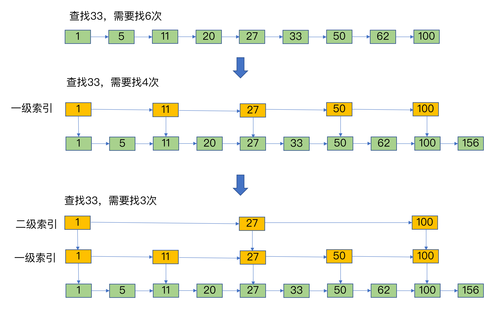
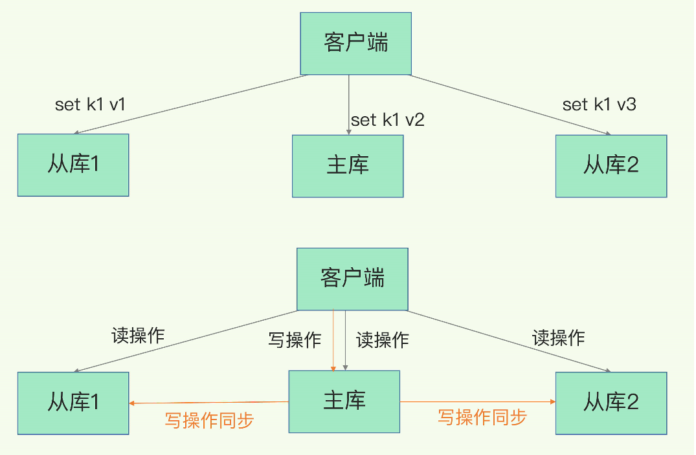
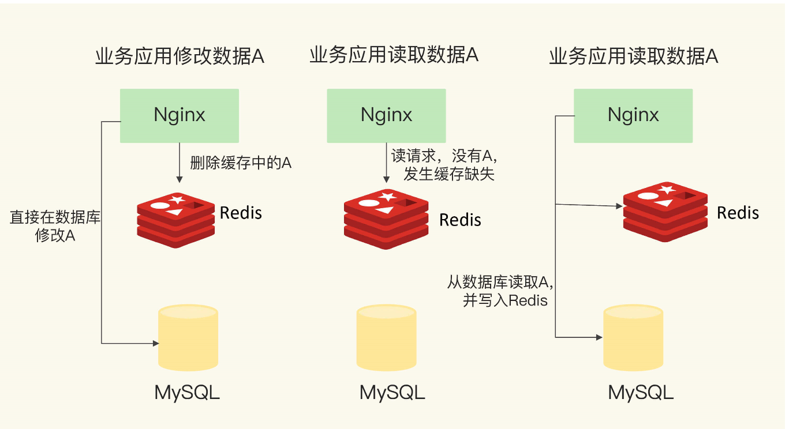

# Redis面试题

## 基础

### 1、Redis是什么？简述它的优缺点？

Redis是用 C 语言开发的一个开源的高性能键值对（key-value）内存数据库。经常被用来做缓存，消息队列，分布式锁。

Redis 提供了多种数据类型来支持不同的业务场景，如 字符串（strings），散列（hashes）， 列表（lists）， 集合（sets）， 有序集合（sorted sets）与范围查询。

Redis 还支持事务 、持久化、Lua 脚本、多种集群方案。

**优点：**

- 读写性能极高， Redis能读的速度是110000次/s，写的速度是81000次/s。

- 支持数据持久化，支持AOF和RDB两种持久化方式。
- 支持事务， Redis的所有操作都是原子性的
- 丰富的特性 – Redis还支持 publish/subscribe, 通知, key 过期等特性。
- 支持主从复制，主机会自动将数据同步到从机，可以进行读写分离。
- 丰富的数据类型 – Redis支持 Strings、Lists、 Hashes、Sets 、Sorted Sets 等数据类型操作。

**缺点：** 

- 数据库容量受到物理内存的限制，不能用作海量数据的高性能读写，因此Redis适合的场景主要局限在较小数据量的高性能操作和运算上。
- 主机宕机，宕机前有部分数据未能及时同步到从机，切换IP后还会引入数据不一致的问题，降低了系统的可用性。

### 2、为什么要用 Redis 做缓存？

**从高并发上来说：**

- 直接操作缓存能够承受的请求是远远大于直接访问数据库的，所以我们可以考虑把数据库中的部分数据转移到缓存中去，这样用户的一部分请求会直接到缓存这里而不用经过数据库。

**从高性能上来说：**

- 用户第一次访问数据库中的某些数据。  因为是从硬盘上读取的所以这个过程会比较慢。将该用户访问的数据存在缓存中，下一次再访问这些数据的时候就可以直接从缓存中获取了。操作缓存就是直接操作内存，所以速度相当快。如果数据库中的对应数据改变的之后，同步改变缓存中相应的数据。

### 3、Redis应用场景有哪些？ 

1. **缓存热点数据**，缓解数据库的压力。
2. 利用Redis 原子性的自增操作，可以实现**计数器**的功能，比如统计用户点赞数、用户访问数等。
3. **简单的消息队列**，可以使用Redis自身的发布订阅模式或者List来实现简单的消息队列，实现异步操作。
4. **限速器**，可用于限制某个用户访问某个接口的频率，比如秒杀场景用于防止用户快速点击带来不必要的压力。
5. **好友关系**，利用集合的一些命令，比如交集、并集、差集等，实现共同好友、共同爱好之类的功能。

### 4、Memcached和Redis的区别？

1. Redis 只使用**单核**，而 Memcached 可以使用多核。 
2. MemCached 数据结构单一，仅用来缓存数据，而 **Redis 支持多种数据类型**。 
3. MemCached 不支持数据持久化，重启后数据会消失。**Redis 支持数据持久化**。 
4. **Redis 提供主从同步机制和 cluster 集群部署能力**，能够提供高可用服务。Memcached 没有提供原生的集群模式，需要依靠客户端实现往集群中分片写入数据。 
5. Redis 的速度比 Memcached 快很多。 
6. Redis 使用**单线程的多路 IO 复用模型**，Memcached使用多线程的非阻塞 IO 模型。 

## Redis单线程

### 1、单线程Redis为什么这么快？

**单线程实现：**避免了多线程编程模式面临的共享资源的并发访问控制问题，比如线程切换和锁资源争用的开销。

**内存存储：**Redis是使用内存存储，没有磁盘IO上的开销。

**高效的数据结构：** 采用了高效的数据结构，例如哈希表和跳表，这是它实现高性能的一个重要原因。

**采用多路复用机制**：使其在网络IO操作中能并发处理大量的客户端请求，实现高吞吐率。

#### **拓展：** **基于多路复用的高性能I/O模型**

多路复用机制是指一个线程处理多个IO流，就是我们经常听到的select/epoll机制。简单来说，在Redis只运行单线程的情况下，**该机制允许内核中，同时存在多个监听套接字和已连接套接字**。内核会一直监听这些套接字上的连接请求或数据请求。一旦有请求到达，就会交给Redis线程处理，这就实现了一个Redis线程处理多个IO流的效果。

**过程如下：** 

1. Redis网络框架调用epoll机制，让内核监听这些套接字。
2. select/epoll一旦监测到FD（套接字）上有请求到达时，就会触发相应的事件。
3. 这些事件会被放进一个事件队列，Redis单线程对该事件队列不断进行处理。

这样一来，Redis无需一直轮询是否有请求实际发生，这就可以避免造成CPU资源浪费。同时，Redis在对事件队列中的事件进行处理时，会调用相应的处理函数，这就实现了基于事件的回调。因为Redis一直在对事件队列进行处理，所以能及时响应客户端请求，提升Redis的响应性能。


### 2、Redis为啥被称为单线程？

Redis是单线程，主要是指**Redis的网络IO和键值对读写是由一个线程来完成的，这也是Redis对外提供键值存储服务的主要流程**。但Redis的其他功能，比如持久化、异步删除、集群数据同步等，其实是由额外的线程执行的。所以，严格来说，Redis并不是单线程，但是我们一般把Redis称为单线程高性能，这样显得“酷”些。

### 3、Redis6.0为什么引入多线程?

Redis主要瓶颈在于内存与网络IO，内存不够可以增加或提供数据结构优化，而网络lO读写占时间，若可以将网络处理改为多线程，性能将大幅度提高。引入多线程处理网络读写，执行命令还是单线程，充分利用服务器多核资源。

## 数据结构

### 1、讲一讲Redis数据类型及底层数据结构？


Redis 的五大常用数据类型：String（字符串）、List（列表）、Hash（哈希）、Set（集合）和Sorted Set（有序集合）

#### String

**简介**

是 Redis 最基本的数据类型，普通的key- value 存储都可以归为此类。二进制安全的，可以包含任何数据，比如 JPG 图片或者序列化的对象，最大能存储 512 MB。

**应用场景**

计数的场景，用户的访问次数、热点文章的点赞转发数量。

**常用命令**

| 命令                                       | 说明                                       |
| ------------------------------------------ | ------------------------------------------ |
| set                                        | 设置一个key/value                          |
| get                                        | 根据key获得对应的value                     |
| mset                                       | 一次设置多个key value                      |
| mget                                       | 一次获得多个key的value                     |
| getset                                     | 获得原始key的值，同时设置新值              |
| strlen                                     | 获得对应key存储value的长度                 |
| append                                     | 为对应key的value追加内容                   |
| getrange 索引0开始                         | 截取value的内容                            |
| setex                                      | 设置一个key存活的有效期（秒）              |
| psetex                                     | 设置一个key存活的有效期（毫秒）            |
| setnx                                      | 存在不做任何操作,不存在添加                |
| msetnx原子操作(只要有一个存在不做任何操作) | 可以同时设置多个key,只要有一个存在都不保存 |
| decr                                       | 进行数值类型的-1操作                       |
| decrby                                     | 根据提供的数据进行减法操作                 |
| Incr                                       | 进行数值类型的+1操作                       |
| incrby                                     | 根据提供的数据进行加法操作                 |
| Incrbyfloat                                | 根据提供的数据加入浮点数                   |

**普通字符串的基本操作：**

```
127.0.0.1:6379> set key value #设置 key-value 类型的值
OK
127.0.0.1:6379> get key # 根据 key 获得对应的 value
"value"
127.0.0.1:6379> exists key  # 判断某个 key 是否存在
(integer) 1
127.0.0.1:6379> strlen key # 返回 key 所储存的字符串值的长度。
(integer) 5
127.0.0.1:6379> del key # 删除某个 key 对应的值
(integer) 1
127.0.0.1:6379> get key
(nil)
```

**批量设置** :

```
127.0.0.1:6379> mset key1 value1 key2 value2 # 批量设置 key-value 类型的值
OK
127.0.0.1:6379> mget key1 key2 # 批量获取多个 key 对应的 value
1) "value1"
2) "value2"
```

**计数器（字符串的内容为整数的时候可以使用）：**

```
127.0.0.1:6379> set number 1
OK
127.0.0.1:6379> incr number # 将 key 中储存的数字值增一
(integer) 2
127.0.0.1:6379> get number
"2"
127.0.0.1:6379> decr number # 将 key 中储存的数字值减一
(integer) 1
127.0.0.1:6379> get number
"1"
```

**过期（默认为永不过期）**：

```
127.0.0.1:6379> expire key  60 # 数据在 60s 后过期
(integer) 1
127.0.0.1:6379> setex key 60 value # 数据在 60s 后过期 (setex:[set] + [ex]pire)
OK
127.0.0.1:6379> ttl key # 查看数据还有多久过期
(integer) 56
```

**底层实现**

String对象底层的数据结构实现主要是 int 和简单动态字符串 SDS。

```c
struct sdshdr{
     //记录buf数组中已使用字节的数量
     //等于 SDS 保存字符串的长度
     int len;
     //记录 buf 数组中未使用字节的数量
     int free;
     //字节数组，用于保存字符串
     char buf[];
}
```


**为什么要用SDS？**

1、预防内存溢出

- C字符串，如果程序员在字符串修改的时候如果忘记给字符串重新分配足够的空间，那么就会发生内存溢出。
- 而Redis提供的SDS其内置的空间分配策略则可以完全杜绝这种事情的发生。当API需要对SDS进行修改时,  API会首先会检查SDS的空间是否满足条件, 如果不满足, API会自动对它动态扩展, 然后再进行修改。

2、减少内存重分配次数

- C字符串是由一个N+1长度的数组组成，如果字符串的长度变长，我们就必须对数组进行扩容，否则会产生内存溢出。而如果字符串长度变短，我们就必须释放掉不再使用的空间，否则会发生内存泄漏。

- Redis通过空间预分配和惰性空间释放策略在字符串操作中一定程度上减少了内存重分配的次数

  空间预分配

  - **如果字符串实际使用长度len<1M**，实际分配空间=len长度来存储字符串+1字节存末尾空字符+len长度的预分配空闲内存（双倍扩容）
  - **如果字符串实际使用长度len>1M**，实际分配空间=len长度来存储字符串+1字节存末尾空字符+1M长度的预分配空闲内存（扩容1M，最大长度为512M）

  惰性空间释放策略

  - 惰性空间释放用于字符串缩短的操作。当字符串缩短是，程序并不是立即使用内存重分配来回收缩短出来的字节，而是使用free属性记录起来，并等待将来使用。

3、二进制安全

- C字符串中的字符必须符合某种编码（比如ASCII），并且除了字符串的末尾之外，字符串里面不能包含空字符，否则最先被程序读入的空字符将被误认为是字符串结尾，这些限制使得C字符串只能保存文本数据，而不能保存像图片、音频、视频、压缩文件这样的二进制数据。
- SDS的buf字节数组不是在保存字符，而是一系列二进制数组，SDS API都会以二进制的方式来处理buf数组里的数据，使用len属性的值而不是空字符来判断字符串是否结束。

4、时间复杂度

- Redis在获取字符串长度上的时间复杂度为常数级O(1)。

学习文章：https://www.cnblogs.com/hunternet/p/9957913.html

#### List

**简介**

Redis 列表是简单的字符串列表，按照插入顺序排序，可以添加一个元素到列表的头部（左边）或者尾部（右边）。

**应用场景**

发布与订阅或者说消息队列、慢查询。

**常用命令**

| 命令   | 说明                                 |
| ------ | ------------------------------------ |
| lpush  | 将某个值加入到一个key列表头部        |
| lpushx | 同lpush,但是必须要保证这个key存在    |
| rpush  | 将某个值加入到一个key列表末尾        |
| rpushx | 同rpush,但是必须要保证这个key存在    |
| lpop   | 返回和移除列表左边的第一个元素       |
| rpop   | 返回和移除列表右边的第一个元素       |
| lrange | 获取某一个下标区间内的元素           |
| llen   | 获取列表元素个数                     |
| lset   | 设置某一个指定索引的值(索引必须存在) |
| lindex | 获取某一个指定索引位置的元素         |

**通过 `rpush/lpop` 实现队列：**

```shell
127.0.0.1:6379> rpush myList value1 # 向 list 的头部（右边）添加元素
(integer) 1
127.0.0.1:6379> rpush myList value2 value3 # 向list的头部（最右边）添加多个元素
(integer) 3
127.0.0.1:6379> lpop myList # 将 list的尾部(最左边)元素取出
"value1"
127.0.0.1:6379> lrange myList 0 1 # 查看对应下标的list列表， 0 为 start,1为 end
1) "value2"
2) "value3"
127.0.0.1:6379> lrange myList 0 -1 # 查看列表中的所有元素，-1表示倒数第一
1) "value2"
2) "value3"
```

**通过 `rpush/rpop` 实现栈：**

```shell
127.0.0.1:6379> rpush myList2 value1 value2 value3
(integer) 3
127.0.0.1:6379> rpop myList2 # 将 list的头部(最右边)元素取出
"value3"
```

**通过 `lrange` 查看对应下标范围的列表元素：**

```shell
127.0.0.1:6379> rpush myList value1 value2 value3
(integer) 3
127.0.0.1:6379> lrange myList 0 1 # 查看对应下标的list列表， 0 为 start,1为 end
1) "value1"
2) "value2"
127.0.0.1:6379> lrange myList 0 -1 # 查看列表中的所有元素，-1表示倒数第一
1) "value1"
2) "value2"
3) "value3"
```

通过 `lrange` 命令，你可以基于 list 实现分页查询，性能非常高！

**通过 `llen` 查看链表长度：**

```shell
127.0.0.1:6379> llen myList
(integer) 3
```

**底层实现（3.2之前）**

双向链表（linkedlist） + 压缩链表（ziplist）

**压缩链表：** 

压缩列表实际上类似于一个数组，数组中的每一个元素都对应保存一个数据。和数组不同的是，压缩列表在表头有三个字段zlbytes、zltail和zllen，分别表示列表长度、列表尾的偏移量和列表中的entry个数；压缩列表在表尾还有一个zlend，表示列表结束。


在压缩列表中，如果我们要查找定位第一个元素和最后一个元素，可以通过表头三个字段的长度直接定位，复杂度是O(1)。而查找其他元素时，就没有这么高效了，只能逐个查找，此时的复杂度就是O(N)了。

**双向链表：**

Redis 链表为**双向无环链表**，使用 listNode 结构表示

```c
typedef struct listNode
{ 
	// 前置节点 
	struct listNode *prev; 
	// 后置节点 
	struct listNode *next; 
	// 节点的值 
	void *value; 
} listNode;
```


- 双向：链表节点带有前驱、后继指针，获取某个节点的前驱、后继节点的时间复杂度为 O(1)
- 无环：链表为非循环链表，表头节点的前驱指针和表尾节点的后继指针都指向 NULL，对链表的访问以 NULL 为终点

当数据量较少时用ziplist，数据量多时用linkedlist。

**缺点：** 

- ziplist的添加和删除会引起连锁更新，比较耗费时间，这是因为ziplist的entry节点保存了上一个节点的长度，当一个节点的长度发生了变化，后面的节点都要更新其上一个节点的长度，引发了连锁反应。
- linkedlist维护前后指针，占内存空间，还容易造成内存碎片化。

**压缩列表在查找时间复杂度方面并没有很大的优势，那为什么Redis还会把它们作为底层数据结构呢？**

Redis的List底层使用压缩列表本质上是将所有元素紧挨着存储，所以分配的是一块连续的内存空间，虽然数据结构本身没有时间复杂度的优势，但是这样节省空间而且也能避免一些内存碎片； 

**底层实现（3.2之后）**

quicklist（快速列表） 代替了 ziplist 和 linkedlist。

quicklist 实际上是 ziplist 和 linkedlist 的混合体，将 linkedlist 按段切分，每一段使用 ziplist 来紧凑存储，多个 ziplist 之间使用双向指针串接起来，既满足了快速的插入删除性能，又不会出现太大的空间冗余 


#### Set

**简介：**

String 类型的无序集合，通过哈希表实现，添删查找操作的复杂度都是 O(1)。

**应用场景**

数据不重复可以判断一个成员是否存在，交集并集可以用来实现共同关注、粉丝列表。

**常用命令**

| 命令        | 说明                                               |
| ----------- | -------------------------------------------------- |
| sadd        | 为集合添加元素                                     |
| smembers    | 显示集合中所有元素 无序                            |
| scard       | 返回集合中元素的个数                               |
| spop        | 随机返回一个元素 并将元素在集合中删除              |
| smove       | 从一个集合中向另一个集合移动元素  必须是同一种类型 |
| srem        | 从集合中删除一个元素                               |
| sismember   | 判断一个集合中是否含有这个元素                     |
| srandmember | 随机返回元素                                       |
| sdiff       | 去掉第一个集合中和其它集合含有的相同元素           |
| sinter      | 求交集                                             |
| sunion      | 求和集                                             |

```shell
127.0.0.1:6379> sadd mySet value1 value2 # 添加元素进去
(integer) 2
127.0.0.1:6379> sadd mySet value1 # 不允许有重复元素
(integer) 0
127.0.0.1:6379> smembers mySet # 查看 set 中所有的元素
1) "value1"
2) "value2"
127.0.0.1:6379> scard mySet # 查看 set 的长度
(integer) 2
127.0.0.1:6379> sismember mySet value1 # 检查某个元素是否存在set 中，只能接收单个元素
(integer) 1
127.0.0.1:6379> sadd mySet2 value2 value3
(integer) 2
127.0.0.1:6379> sinterstore mySet3 mySet mySet2 # 获取 mySet 和 mySet2 的交集并存放在 mySet3 中
(integer) 1
127.0.0.1:6379> smembers mySet3
1) "value2"
```

**底层实现**

哈希表 + 整数数组

**整数数组**

整数集合（intset）是 Redis 用于保存整数值的集合抽象数据结构，可以保存类型为 int16_t、int32_t 或者 int64_t 的整数值，并且保证集合中的元素是**有序不重复**的。

当集合中的元素都是整数且元素个数小于 set-maxintset-entries配置（默认 512 个）时，Redis 会选用 intset 来作为集合的内部实现，从而减少内存的使用，当无法满足 intset 条件时，Redis 会使用 hashtable 作为集合的内部实现。

#### Sorted set

**简介**

和 Set 一样也是 String 类型元素的集合，且不允许元素重复， 不同的是每个元素都会关联一个 Double  类型的分数（可重复）， 通过此分数来为集合中的成员进行从小到大的排序。

**应用场景**

适用于排行榜和带权重的消息队列等场景。

**常用命令**

| 命令                       | 说明                                    |
| -------------------------- | --------------------------------------- |
| zadd                       | 添加一个有序集合元素                    |
| zcard                      | 返回集合的元素个数                      |
| zrange 升序 zrevrange 降序 | 返回一个范围内的元素 withscores添加分数 |
| zrangebyscore              | 按照分数查找一个范围内的元素            |
| zrank                      | 返回排名                                |
| zrevrank                   | 倒序排名                                |
| zscore                     | 显示某一个元素的分数                    |
| zrem                       | 移除某一个元素                          |
| zincrby                    | 给某个特定元素加分                      |

```shell
127.0.0.1:6379> zadd myZset 3.0 value1 # 添加元素到 sorted set 中 3.0 为权重
(integer) 1
127.0.0.1:6379> zadd myZset 2.0 value2 1.0 value3 # 一次添加多个元素
(integer) 2
127.0.0.1:6379> zcard myZset # 查看 sorted set 中的元素数量
(integer) 3
127.0.0.1:6379> zscore myZset value1 # 查看某个 value 的权重
"3"
127.0.0.1:6379> zrange  myZset 0 -1 # 顺序输出某个范围区间的元素，0 -1 表示输出所有元素
1) "value3"
2) "value2"
3) "value1"
127.0.0.1:6379> zrange  myZset 0 1 # 顺序输出某个范围区间的元素，0 为 start  1 为 stop
1) "value3"
2) "value2"
127.0.0.1:6379> zrevrange  myZset 0 1 # 逆序输出某个范围区间的元素，0 为 start  1 为 stop
1) "value1"
2) "value2"
```

**底层实现**

ziplist（压缩列表）+  skiplist（跳跃表）

- 当有序集合保存的元素个数要小于 128 个&&每个元素大小都小于 64 字节时使用ziplist。
- 当元素比较多时，此时 ziplist 的读写效率会下降，时间复杂度是 O(n)，而跳表的时间复杂度是 O(logn)。

**跳跃表**

有序链表只能逐一查找元素，导致操作起来非常缓慢，于是就出现了跳表。具体来说，跳表在链表的基础上，**增加了多级索引，通过索引位置的几个跳转，实现数据的快速定位**，如下图所示：



如果我们要在链表中查找33这个元素，只能从头开始遍历链表，查找6次，直到找到33为止。此时，复杂度是O(N)，查找效率很低。

为了提高查找速度，我们来增加一级索引：从第一个元素开始，每两个元素选一个出来作为索引。这些索引再通过指针指向原始的链表。例如，从前两个元素中抽取元素1作为一级索引，从第三、四个元素中抽取元素11作为一级索引。此时，我们只需要4次查找就能定位到元素33了。

如果我们还想再快，可以再增加二级索引：从一级索引中，再抽取部分元素作为二级索引。例如，从一级索引中抽取1、27、100作为二级索引，二级索引指向一级索引。这样，我们只需要3次查找，就能定位到元素33了。

可以看到，这个查找过程就是在多级索引上跳来跳去，最后定位到元素。这也正好符合“跳”表的叫法。当数据量很大时，跳表的查找复杂度就是O(logN)。

**为什么不用平衡树这些？**

跳表实现简单，平衡树插入删除可能引发平衡调整，更加复杂。跳表只需要动动结点指针;做范围查找的时候，平衡树比skiplist操作要复杂

#### **Hash**

是一个键值对（key => value）集合，特别适合用于存储对象。

**应用场景**

系统中对象数据的存储(用户信息，商品信息)

**常用命令**

| 命令         | 说明                    |
| ------------ | ----------------------- |
| hset         | 设置一个key/value对     |
| hget         | 获得一个key对应的value  |
| hgetall      | 获得所有的key/value对   |
| hdel         | 删除某一个key/value对   |
| hexists      | 判断一个key是否存在     |
| hkeys        | 获得所有的key           |
| hvals        | 获得所有的value         |
| hmset        | 设置多个key/value       |
| hmget        | 获得多个key的value      |
| hsetnx       | 设置一个不存在的key的值 |
| hincrby      | 为value进行加法运算     |
| hincrbyfloat | 为value加入浮点值       |

```shell
127.0.0.1:6379> hmset userInfoKey name "guide" description "dev" age "24"
OK
127.0.0.1:6379> hexists userInfoKey name # 查看 key 对应的 value中指定的字段是否存在。
(integer) 1
127.0.0.1:6379> hget userInfoKey name # 获取存储在哈希表中指定字段的值。
"guide"
127.0.0.1:6379> hget userInfoKey age
"24"
127.0.0.1:6379> hgetall userInfoKey # 获取在哈希表中指定 key 的所有字段和值
1) "name"
2) "guide"
3) "description"
4) "dev"
5) "age"
6) "24"
127.0.0.1:6379> hkeys userInfoKey # 获取 key 列表
1) "name"
2) "description"
3) "age"
127.0.0.1:6379> hvals userInfoKey # 获取 value 列表
1) "guide"
2) "dev"
3) "24"
127.0.0.1:6379> hset userInfoKey name "GuideGeGe" # 修改某个字段对应的值
127.0.0.1:6379> hget userInfoKey name
"GuideGeGe"
```

**底层实现**

ziplist（压缩列表）+ hashtable（哈希表）

- 当存储的数据量比较小的情况使用ziplist（键值对个数小于512个 && 每一个键值都小于64字节）。
- 当元素比较多时，此时 ziplist 的读写效率会下降，使用hashtable。

### 2、Redis键和值用什么结构组织？


可以看到List、Hash、Set和Sorted Set这四种数据类型，都有两种底层实现结构。通常情况下，我们会把这四种类型称为集合类型，它们的特点是**一个键对应了一个集合的数据**。

为了实现从键到值的快速访问，Redis使用了一个哈希表来保存所有键值对。


哈希表实则是一个数组+链表+entry，数组每个元素称为哈希桶，entry里包含(key，value,next)  key是string类型，value就是各个数据类型(string、list、zset、set...)

哈希表的最大好处很明显，就是让我们可以用O(1)的时间复杂度来快速查找到键值对——我们只需要计算键的哈希值，就可以知道它所对应的哈希桶位置，然后就可以访问相应的entry元素。

查找过程主要依赖于哈希计算，和数据量的多少并没有直接关系。也就是说，不管哈希表里有10万个键还是100万个键，我们只需要一次计算就能找到相应的键。

### 3、为什么往Redis中写入大量数据后，就可能发现操作有时候会突然变慢了？

往哈希表中写入更多数据时，**哈希冲突**是不可避免的问题。Redis解决哈希冲突的方式，就是**链式哈希**。（同一个哈希桶中的多个元素用一个链表来保存，它们之间依次用指针连接） 

如果哈希表里写入的数据越来越多，哈希冲突可能也会越来越多，这就会导致某些哈希冲突链过长，进而导致这个链上的元素查找耗时长，效率降低。


**如何解决？**

Redis会对哈希表做rehash操作，即增加现有的哈希桶数量，让逐渐增多的entry元素能在更多的桶之间分散保存，减少单个桶中的元素数量，从而减少单个桶中的冲突。

**rehash过程如下：** 

- 1、使用了两个全局哈希表：哈希表1和哈希表2。
- 2、开始只使用哈希表1，此时的哈希表2并没有被分配空间。
- 3、数据过多时，给哈希表2分配更大的空间（2 * 哈希表1）
- 4、将哈希表1中的数据重新映射并拷贝到哈希表2中；
- 5、释放哈希表1的空间，留作下一次rehash扩容备用。

若一次性将值全部从哈希1拷贝至哈希2，会造成线程阻塞，无法服务其他请求，为了避免这个问题，于是Redis采用了**渐进式rehash**。

**渐进式rehash：**

- 1、拷贝数据时，每处理一个请求，就将哈希表1对应索引位置的所有数据拷贝到哈希表2。
- 2、这样就巧妙地把一次性大量拷贝的开销，分摊到了多次处理请求的过程中，避免了耗时操作，保证了数据的快速访问。

## 持久化

### 1、讲一讲Redis持久化机制？

Redis提供了两种不同的持久化方法可以将数据存储在磁盘中，一种叫快照`RDB`，另一种叫只追加文件`AOF`。

#### AOF日志

AOF（Append Only File）只追加文件，也就是每次处理完请求命令后都会将此命令追加到aof文件的末尾。

因此AOF是写后日志，先执行命令，把数据写入内存，然后才记录日志 。


**AOF为什么要先执行命令再记日志呢？**

- AOF里记录的是Redis收到的每一条命令，这些命令是以文本形式保存的。为了避免额外的检查开销，Redis在向AOF里面记录日志的时候，并不会先去对这些命令进行语法检查。

- 所以，如果先记日志再执行命令的话，日志中就有可能记录了错误的命令，Redis在使用日志恢复数据时，就可能会出错。而写后日志这种方式，就是先让系统执行命令，只有命令能执行成功，才会被记录到日志中，否则，系统就会直接向客户端报错。

**AOF的好处：** 

- 先执行命令，把数据写入内存，然后才记录日志，可以避免出现记录错误命令的情况。
- 由于是在命令执行后才记录日志，所以**不会阻塞当前的写操作**。

**AOF的缺陷：**

- 如果刚执行完命令后，还没写入日志宕机了，就会有数据丢失的风险。
- AOF虽然避免了对当前命令的阻塞，但可能会给下一个操作带来阻塞风险。这是因为，AOF日志也是在主线程中执行的，如果在把日志文件写入磁盘时，磁盘写压力大，就会导致写盘很慢，进而导致后续的操作也无法执行了。

**通过三种写回策略控制AOF日志写回磁盘的时机，解决2个缺陷**。

3种AOF同步策略如下：

- **Always**，同步写回：每个写命令执行完，立马同步地将日志写回磁盘；
- **Everysec**，每秒写回：每个写命令执行完，只是先把日志写到AOF文件的内存缓冲区，每隔一秒把缓冲区中的内容写入磁盘；
- **No**，操作系统控制的写回：每个写命令执行完，只是先把日志写到AOF文件的内存缓冲区，由操作系统决定何时将缓冲区内容写回磁盘。


**总结一下就是**：想要获得高性能，就选择No策略；如果想要得到高可靠性保证，就选择Always策略；如果允许数据有一点丢失，又希望性能别受太大影响的话，那么就选择Everysec策略。

**AOF的重写机制**

AOF是以文件的形式在记录接收到的所有写命令。随着接收的写命令越来越多，AOF文件会越来越大，影响写入效率，宕机恢复也慢，就会影响到Redis的正常使用。

**使用AOF的重写机制解决日志文件过大问题** 

简单来说，AOF重写机制就是在重写时，Redis根据数据库的现状创建一个新的AOF文件，也就是说，读取数据库中的所有键值对，然后对每一个键值对用一条命令记录它的写入。

**为什么重写机制可以把日志文件变小呢?**

我们知道，AOF文件是以追加的方式，逐一记录接收到的写命令的。当一个键值对被多条写命令反复修改时，AOF文件会记录相应的多条命令。但是，在重写的时候，是根据这个键值对当前的最新状态，为它生成对应的写入命令。这样一来，一个键值对在重写日志中只用一条命令就行了，而且，在日志恢复时，只用执行这条命令，就可以直接完成这个键值对的写入了。

下面这张图就是一个例子：


**AOF重写会阻塞吗?**

和AOF日志由主线程写回不同，重写过程是由后台线程bgrewriteaof来完成的，这也是为了避免阻塞主线程，导致数据库性能下降。

**重写的具体过程？** 

- **一个拷贝，两处日志**
- 1、**一个拷贝：** 每次执行重写时，主线程fork一个后台的bgrewriteaof子进程，并将主线程的内存拷贝一份给bgrewriteaof子进程，然后子线程进行重写。
-  2、**两处日志**：第一处日志是指主线程正在使用的AOF日志，第二处是新的AOF重写日志。新的写操作来临时，Redis会将其写入主线程AOF缓冲区和新AOF缓冲区，等到拷贝数据的所有操作记录重写完成后，重写日志记录的这些最新操作也会写入新的AOF文件，以保证数据库最新状态的记录。此时，我们就可以用新的AOF文件替代旧文件了。


总结来说，每次AOF重写时，Redis会先执行一个内存拷贝，用于重写；然后，使用两个日志保证在重写过程中，新写入的数据不会丢失。而且，因为Redis采用额外的线程进行数据重写，所以，这个过程并不会阻塞主线程。

#### RDB快照

对Redis来说，它实现类似照片记录效果的方式，就是把某一时刻的状态以文件的形式写到磁盘上，也就是快照。这样一来，即使宕机，快照文件也不会丢失，数据的可靠性也就得到了保证。这个快照文件就称为RDB文件，其中，RDB就是Redis DataBase的缩写。

**给哪些内存数据做快照？**

Redis的数据都在内存中，为了提供所有数据的可靠性保证，它执行的是**全量快照**，也就是说，把内存中的所有数据都记录到磁盘中。

Redis提供了两个命令来生成RDB文件，分别是save和bgsave。

- save：在主线程中执行，会导致阻塞；
- bgsave：创建一个子进程，专门用于写入RDB文件，避免了主线程的阻塞，这也是Redis RDB文件生成的默认配置。

**bgsave指令工作原理：**

- 1、执行bgsave命令，主线程fork一个bgsave子进程，并且子进程可以共享主线程的所有内存数据。
- 2、bgsave子进程运行后，开始读取主线程的内存数据，并把它们写入RDB文件。
- 3、如果主线程对这些数据都是读操作（例如图中的键值对A），那么，主线程和bgsave子进程相互不影响。
- 4、如果主线程要修改一块数据（例如图中的键值对C），那么，这块数据就会被复制一份，生成该数据的副本。然后，bgsave子进程会把这个副本数据写入RDB文件，而在这个过程中，主线程仍然可以直接修改原来的数据。


**总结：**Redis会使用bgsave对当前内存中的所有数据做快照，这个操作是子进程在后台完成的，这就允许主线程同时可以修改数据。

**RDB缺点：**

- bgsave子进程需要通过fork操作从主线程创建出来，fork这个创建过程本身会阻塞主线程，而且主线程的内存越大，阻塞时间越长。
- 每隔一段时间执行快照，**若在间隔时间宕机会导致数据丢失**，若让间隔时间短一点则带来更高消耗，若长一点，宕机丢失数据多。

**RDB优点：**

- RDB 是一个紧凑压缩的二进制文件，存储效率较高，但存储数据量较大时，存储效率较低。
- RDB 内部存储的是 redis 在某个时间点的数据快照，非常**适合用于数据备份，全量复制**等场景。
- RDB 恢复数据的速度要比 AOF 快很多，因为是快照，直接恢复。

#### 对比

RDB 与 AOF 对比：

| 持久化方式   | RDB                | AOF                |
| ------------ | ------------------ | ------------------ |
| 占用存储空间 | 小（数据级：压缩） | 大（指令级：重写） |
| **存储速度** | 慢                 | 快                 |
| **恢复速度** | 快                 | 慢                 |
| 数据安全性   | 会丢失数据         | 依据策略决定       |
| 资源消耗     | 高/重量级          | 低/轻量级          |
| 启动优先级   | 低                 | 高                 |

**应用场景：** 

- 数据不能丢失时，内存快照和AOF的混合使用是一个很好的选择；
- 如果允许分钟级别的数据丢失，可以只使用RDB；
- 如果只用AOF，优先使用everysec的配置选项，因为它在可靠性和性能之间取了一个平衡。

## 主从复制

### 1、什么是Redis主从复制？

主从复制，是指将一台Redis服务器的数据，复制到其他的Redis服务器。前者称为主节点(master)，后者称为从节点(slave)；数据的复制是单向的，只能由主节点到从节点。

默认情况下，每台Redis服务器都是主节点；且一个主节点可以有多个从节点(或没有从节点)，但一个从节点只能有一个主节点。

### 2、主从复制有哪些好处？

- **读写分离**：master 写、slave 读，提高服务器的读写负载能力
- **负载均衡**：基于主从结构，配合读写分离，由 slave 分担 master 负载，并根据需求的变化，改变 slave 的数量，通过多个从节点分担数据读取负载，大大提高 Redis 服务器并发量与数据吞吐量
- 故障恢复：当 master 出现问题时，由 slave 提供服务，实现快速的故障恢复
- 数据冗余：实现数据热备份，是持久化之外的一种数据冗余方式
- 高可用基石：基于主从复制，构建哨兵模式与集群，实现 Redis **的高可用方案**

### 3、讲一讲读写分离？

Redis提供了主从库模式，以保证数据副本的一致，主从库之间采用的是读写分离的方式。、

- **读操作**：主库、从库都可以接收；

- **写操作**：首先到主库执行，然后，主库将写操作同步给从库。

  

### 4、为什么要采用读写分离的方式呢？

1、**容易造成数据不一致**：假设主从库都可以接收客户端的写操作，当客户端对同一个数据前后修改了多次，每一次的修改请求都发送到不同的实例上，会造成这个数据在多个实例上的副本不一致问题，在读取这个数据的时候，就可能读取到旧的值。如果要保持数据在多个实例的一致性，就要涉及到加锁、实例间协商是否完成修改等一系列操作，但这会带来巨额的开销。

2、**保证数据的一致性**：主从库模式一旦采用了读写分离，所有数据的修改只会在主库上进行，主库有了最新的数据后，会同步给从库，这样，主从库的数据就是一致的。

### 5、主从库间如何进行第一次同步？

主从库第一次同步分为三个阶段：

- 第一阶段：建立连接，协商同步；

- 第二阶段：主库同步数据给从库；

- 第三阶段：主库发送新命令给从库；

  

**第一阶段**： 主从库间建立连接，从库给主库发送psync命令，表示要进行数据同步，psync命令包含了**主库的runID**和**复制进度offset**两个参数。

- runID，是每个Redis实例启动时都会自动生成的一个随机ID，用来唯一标记这个实例。当从库和主库第一次复制时，因为不知道主库的runID，所以将runID设为“？”。
- offset，此时设为-1，表示第一次复制。

**第二阶段**： 主库收到psync命令后，会用FULLRESYNC响应命令带上两个参数：主库runID和主库目前的复制进度offset，返回给从库。从库收到响应后，会记录下这两个参数。（**FULLRESYNC响应表示第一次复制采用的全量复制，也就是说，主库会把当前所有的数据都复制给从库**。）

主库执行bgsave命令，生成RDB文件，发给从库，从库接收RDB文件，先清空当前数据库，然后加载RDB文件。

**第三阶段**：由于发送RDB过程期间会产生新数据，因此主库会把第二阶段执行过程中新收到的写命令，再发送给从库。

### 6、讲一讲主从级联模式分担全量复制时的主库压力？

一次全量复制中，对于主库来说，需要完成两个耗时的操作：生成RDB文件和传输RDB文件。如果从库数量很多，主库进行全量复制，会导致主库忙于fork子进程生成RDB文件，而fork这个操作会阻塞主线程处理正常请求，从而导致主库响应应用程序的请求速度变慢。

**通过“主-从-从”模式将主库生成RDB和传输RDB的压力，以级联的方式分散到从库上**。

具体如下：

- 1、手动选择一个从库（比如选择内存资源配置较高的从库），用于级联其他的从库。
- 2、再选择一些从库，让和刚才所选的从库，建立起主从关系。


**基于长连接的命令传播**:  主从完成全量复制后会继续维持一个网络连接，主库会通过这个连接将后续陆续收到的命令操作再同步给从库，这个过程可以避免频繁建立连接的开销。

### 7、增量复制？

假设主从网络断了之后，主从库会采用增量复制的方式继续同步。

- 全量复制是同步所有数据，而增量复制只会把主从库网络断连期间主库收到的命令，同步给从库。

当主从库断连后，主库会把断连期间收到的写操作命令写入repl_backlog_buffer环形缓冲区，**主库会记录自己写到的位置，从库则会记录自己已经读到的位置**。

### 8、为什么主从库间的复制不使用AOF呢？

- 1、虽然AOF记录的操作命令更全，相比于RDB丢失的数据更少，但AOF文件比RDB文件大，网络传输比较耗时。

- 2、从库在初始化数据时，RDB文件比AOF文件执行更快 。

## 哨兵模式

### 1、什么是哨兵，哨兵的作用是什么？

哨兵其实就是一个运行在特殊模式下的Redis进程，主从库实例运行的同时，它也在运行。哨兵主要负责的就是三个任务：监控、选主（选择主库）和通知。

- 监控：哨兵进程在运行时，周期性地给所有的主从库发送PING命令，检测它们是否仍然在线运行。如果从库没有在规定时间内响应哨兵的PING命令，哨兵就会把它标记为“下线状态”；同样，如果主库也没有在规定时间内响应哨兵的PING命令，哨兵就会判定主库下线，然后开始**自动切换主库**的流程。
- 选主：主库挂了以后，哨兵就需要从很多个从库里，按照一定的规则选择一个从库实例，把它作为新的主库。这一步完成后，现在的集群里就有了新主库。
- 通知：在执行通知任务时，哨兵会把新主库的连接信息发给其他从库，让它们执行replicaof命令，和新主库建立连接，并进行数据复制。同时，哨兵会把新主库的连接信息通知给客户端，让它们把请求操作发到新主库上。


**总结**：Redis的哨兵机制自动完成了以下三大功能，从而实现了主从库的自动切换，可以降低Redis集群的运维开销：

- 监控主库运行状态，并判断主库是否客观下线；
- 在主库客观下线后，选取新主库；
- 选出新主库后，通知从库和客户端。

### 2、哨兵如何判断主库的下线状态？

哨兵对主库的下线判断有“主观下线”和“客观下线”两种。

**主观下线**： 哨兵进程会使用PING命令检测它自己和主、从库的网络连接情况，用来判断实例的状态。

- 如果主从库对PING命令响应超时了，哨兵就会先把它标记为“主观下线”。
- 如果检测的是从库，直接简单的标记为“主观下线”。
- 如果检测的是主库，为了防止误判，不能简单地把它标记为“主观下线“。（通过哨兵集群，少数服从多数）

**客观下线**： 当有N个哨兵实例时，最好要有N/2 + 1个实例判断主库为“主观下线”，才能最终判定主库为“客观下线”。

### 3、如何选定新主库？

哨兵选择新主库的过程称为“筛选+打分”：

- 筛选：在多个从库中，先按照**一定的筛选条件**，把不符合条件的从库去掉。
  - **检查从库的当前在线状态，并判断它之前的网络连接状态**，如果从库总是和主库断连，而且断连次数超出了一定的阈值，我们就就可以认为这个从库的网络状况并不是太好，就可以把这个从库筛掉了。
- 打分：按照下述三个规则依次进行三轮打分，只要在某一轮中，有从库得分最高，那么它就是主库了。
  - **第一轮：优先级最高的从库得分高。** （手动设置从库的优先级，比如给内存大的实例设置高优先级）
  - **第二轮：和旧主库同步程度最接近的从库得分高。**（从库的slave_repl_offset越接近主库的master_repl_offset，同步程度越高）
  - **第三轮：ID号小的从库得分高。**（在优先级和复制进度都相同的情况下，ID号最小的从库得分最高，会被选为新主库。）

**总结**： 首先，哨兵会按照在线状态、网络状态，筛选过滤掉一部分不符合要求的从库，然后，依次按照优先级、复制进度、ID号大小再对剩余的从库进行打分，只要有得分最高的从库出现，就把它选为新主库。

## 缓存 

### 1、缓存穿透？

缓存穿透是指缓存和数据库中都没有的数据，而用户不断发起请求，如发起为id为“-1”的数据或id为特别大不存在的数据。这时的用户很可能是攻击者，攻击会导致数据库压力过大。

**解决方案**：

- 1、**接口校验。**在正常业务流程中可能会存在少量访问不存在 key 的情况，但是一般不会出现大量的情况，所以这种场景最大的可能性是遭受了非法攻击。可以在最外层先做一层校验：用户鉴权、数据合法性校验等，例如商品查询中，商品的ID是正整数，则可以直接对非正整数直接过滤等等。

- 2、**缓存空值**。当访问缓存和DB都没有查询到值时，可以将空值写进缓存，但是设置较短的过期时间，该时间需要根据产品业务特性来设置。

- 3、**布隆过滤器**。使用布隆过滤器存储所有可能访问的 key，不存在的 key 直接被过滤，存在的 key 则再进一步查询缓存和数据库。

### 2、缓存击穿？

缓存击穿是指缓存中没有，但数据库中有的数据（一般是缓存时间到期），这时由于并发用户特别多，同时读缓存没读到数据，又同时去数据库去取数据，引起数据库压力瞬间增大， 造成过大压力。

**解决方案：**

- 1、**加互斥锁**。在并发的多个请求中，只有第一个请求线程能拿到锁并执行数据库查询操作，其他的线程拿不到锁就阻塞等着，等到第一个线程将数据写入缓存后，直接走缓存。
- 2、**热点数据不过期**。直接将缓存设置为不过期，然后由定时任务去异步加载数据，更新缓存。这种方式适用于比较极端的场景，例如流量特别特别大的场景，使用时需要考虑业务能接受数据不一致的时间，还有就是异常情况的处理，不要到时候缓存刷新不上，一直是脏数据，那就凉了。

### 3、缓存雪崩？

缓存雪崩是指缓存中数据大批量到过期时间，而查询数据量巨大，引起数据库压力过大甚至down机。和缓存击穿不同的是，缓存击穿指并发查同一条数据，缓存雪崩是不同数据都过期了，很多数据都查不到从而查数据库。

**解决方案：** 

- 1、**过期时间打散**。既然是大量缓存集中失效，那最容易想到就是让他们不集中生效。可以给缓存的过期时间时加上一个随机值时间，使得每个 key 的过期时间分布开来，不会集中在同一时刻失效。
- 2、**热点数据不过期**。该方式和缓存击穿一样，也是要着重考虑刷新的时间间隔和数据异常如何处理的情况。
- 3、**加互斥锁**。该方式和缓存击穿一样，按 key 维度加锁，对于同一个 key，只允许一个线程去计算，其他线程原地阻塞等待第一个线程的计算结果，然后直接走缓存即可。

### 4、缓存预热？

缓存预热是指系统上线后，提前将相关的缓存数据加载到缓存系统。避免在用户请求的时候，先查询数据库，然后再将数据缓存的问题，用户直接查询事先被预热的缓存数据。

如果不进行预热，那么Redis初始状态数据为空，系统上线初期，对于高并发的流量，都会访问到数据库中， 对数据库造成流量的压力。

**解决方案**： 

- 1、数据量不大的时候，工程启动的时候进行加载缓存动作；
- 2、数据量大的时候，设置一个定时任务脚本，进行缓存的刷新；
- 3、数据量太大的时候，优先保证热点数据进行提前加载到缓存。

### 5、缓存降级？

缓存降级是指缓存失效或缓存服务器挂掉的情况下，不去访问数据库，直接返回默认数据或访问服务的内存数据。降级一般是有损的操作，所以尽量减少降级对于业务的影响程度。

在进行降级之前要对系统进行梳理，看看系统是不是可以丢卒保帅；从而梳理出哪些必须誓死保护，哪些可降级；比如可以参考日志级别设置预案：

- 一般：比如有些服务偶尔因为网络抖动或者服务正在上线而超时，可以自动降级；
- 警告：有些服务在一段时间内成功率有波动（如在95~100%之间），可以自动降级或人工降级，并发送告警；
- 错误：比如可用率低于90%，或者数据库连接池被打爆了，或者访问量突然猛增到系统能承受的最大阀值，此时可以根据情况自动降级或者人工降级；
- 严重错误：比如因为特殊原因数据错误了，此时需要紧急人工降级。

### 6、Redis做缓存有哪些类型？

按照Redis缓存是否接受写请求，我们可以把它分成只读缓存和读写缓存。

#### 只读缓存

当Redis用作只读缓存时，应用读取数据，先调用Redis GET接口，查询数据是否存在。而所有的数据写请求会直接发往后端的数据库，在数据库中增删改。对于删改的数据来说，如果Redis已经缓存了相应的数据，应用需要把这些缓存的数据删除，Redis中就没有这些数据了。

当应用再次读取这些数据时，会发生缓存缺失，应用会把这些数据从数据库中读出来，并写到缓存中。这样一来，这些数据后续再被读取时，就可以直接从缓存中获取了，能起到加速访问的效果。



**优点：**

只读缓存直接在数据库中更新数据的好处是，所有最新的数据都在数据库中，而数据库是提供数据可靠性保障的，这些数据不会有丢失的风险。当我们需要缓存图片、短视频这些用户只读的数据时，就可以使用只读缓存这个类型了。

#### 读写缓存

对于读写缓存来说，除了读请求会发送到缓存进行处理（直接在缓存中查询数据是否存在)，所有的写请求也会发送到缓存，在缓存中直接对数据进行增删改操作。此时，得益于Redis的高性能访问特性，数据的增删改操作可以在缓存中快速完成，处理结果也会快速返回给业务应用，这就可以提升业务应用的响应速度。

**缺点：**

Redis是内存数据库，一旦出现掉电或宕机，内存中的数据就会丢失。这也就是说，应用的最新数据可能会丢失，给应用业务带来风险。

**为了解决这个问题？**

读写缓存提供了同步直写和异步写回两种策略。其中，同步直写策略优先保证数据可靠性，而异步写回策略优先提供快速响应。

**同步直写**：

- 写请求发给缓存的同时，也会发给后端数据库进行处理，等到缓存和数据库都写完数据，才给客户端返回。这样，即使缓存宕机或发生故障，最新的数据仍然保存在数据库中，这就提供了数据可靠性保证。
- **缺点**：会降低缓存的访问性能。缓存处理写请求很快，而数据库比较慢，这样使缓存很快地处理了写请求，也需要等待数据库处理完所有的写请求，才能给应用返回结果，这就增加了缓存的响应延迟。

**异步写回策略：**

- 所有写请求都先在缓存中处理。等到这些增改的数据要被从缓存中淘汰出来时，缓存将它们写回后端数据库。
- **缺点**： 如果发生了掉电，缓存数据还没有被写回数据库，就会有丢失的风险了。


**如何选择？**

- 如果需要对写请求进行加速，我们选择读写缓存；
- 如果写请求很少，或者是只需要提升读请求的响应速度的话，我们选择只读缓存。

### 7、讲一讲缓存一致性？

**缓存数据的一致性：**

- 缓存中有数据，那么，缓存的数据值需要和数据库中的值相同；
- 缓存中本身没有数据，那么，数据库中的值必须是最新值。

不符合这两种情况的，就属于缓存和数据库的数据不一致问题了。

### 8、非并发情况下，数据不一致的发生及解决？

在更新数据库和删除缓存值的过程中，无论这两个操作的执行顺序谁先谁后，只要有一个操作失败了，就会导致客户端读取到旧值。

#### **1、先删除缓存值，后更新数据库值** 

缓存删除成功，但是数据库更新失败，那么，应用再访问数据时，缓存中没有数据，就会发生缓存缺失。然后，应用再访问数据库，但是数据库中的值为旧值，应用就访问到旧值了。

如下：


应用要把数据X的值从10更新为3，先在Redis缓存中删除了X的缓存值，但是更新数据库却失败了。如果此时有其他并发的请求访问X，会发现Redis中缓存缺失，紧接着，请求就会访问数据库，读到的却是旧值10。

#### 2、先更新数据库值，后删除缓存。

如果应用先完成了数据库的更新，但是，在删除缓存时失败了，那么，数据库中的值是新值，而缓存中的是旧值，这肯定是不一致的。这个时候，如果有其他的并发请求来访问数据，按照正常的缓存访问流程，就会先在缓存中查询，但此时，就会读到旧值了。

如下：


应用要把数据X的值从10更新为3，先成功更新了数据库，然后在Redis缓存中删除X的缓存，但是这个操作却失败了，这个时候，数据库中X的新值为3，Redis中的X的缓存值为10，这肯定是不一致的。如果刚好此时有其他客户端也发送请求访问X，会先在Redis中查询，该客户端会发现缓存命中，但是读到的却是旧值10。

**总结：** 


**解决：**重试机制

可以把要删除的缓存值或者是要更新的数据库值暂存到消息队列中，当应用没有能够成功地删除缓存值或者是更新数据库值时，可以从消息队列中重新读取这些值，然后再次进行删除或更新。

如果能够成功地删除或更新，我们就要把这些值从消息队列中去除，以免重复操作。

### 9、并发情况下，数据不一致问题的发生及解决？

#### **1、先删除缓存值，后更新数据库值** 

**数据不一致原因如下：**


t3时间以后，缓存中是旧值，数据库中是新值，两者不一致。

**解决方案：** 延迟双删，在线程A更新完数据库值以后，我们可以让它先sleep一小段时间，再进行一次缓存删除操作。

**原因分析：**

- sheep原因：线程Asleep的这段时间中，线程B能够先从数据库读取数据，再把缺失的数据写入缓存，这样线程A再进行删除，就把旧的缓存值删除了。（线程A sleep的时间，需要大于线程B读取数据+写入缓存的时间）

- 再删缓存原因:  为了避免删除缓存后，还没更新数据库，读请求来读到旧数据存于缓存，导致以后都是旧数据，则在读请求结束后，写请求可以删除读请求造成的旧数据。

#### **2、先更新数据库值，后删除缓存值。** 

**数据不一致原因如下：** 


如果线程A删除了数据库中的值，但还没来得及删除缓存值，线程B就开始读取数据了，那么此时，线程B查询缓存时，发现缓存命中，就会直接从缓存中读取旧值。

不过，在这种情况下，如果其他线程并发读缓存的请求不多，那么，就不会有很多请求读取到旧值。而且，线程A一般也会很快删除缓存值，这样一来，其他线程再次读取时，就会发生缓存缺失，进而从数据库中读取最新值。所以，这种情况对业务的影响较小。

### 10、缓存和数据库不一致总结

**读写缓存：** 要想保证缓存和数据库中的数据一致，就要采用同步直写策略。（在业务应用中使用事务机制，来保证缓存和数据库的更新具有原子性，也就是说，两者要不一起更新，要不都不更新，返回错误信息，进行重试。）

**只读缓存：** 


在大多数业务场景下，我们会把Redis作为只读缓存使用。针对只读缓存来说，我们既可以先删除缓存值再更新数据库，也可以先更新数据库再删除缓存。我的建议是，优先使用先更新数据库再删除缓存的方法，原因主要有两个：

1. 先删除缓存值再更新数据库，有可能导致请求因缓存缺失而访问数据库，给数据库带来压力；
2. 如果业务应用中读取数据库和写缓存的时间不好估算，那么，延迟双删中的等待时间就不好设置。

**注意：** 先更新数据库再删除缓存时，如果业务层要求必须读取一致的数据，那我们可以在更新数据库时，暂缓客户端暂存并发读请求，等数据库更新完、缓存值删除后，再读取数据，从而保证数据一致性。

### 11、Redis缓存有哪些淘汰策略？

Redis缓存共存在8中淘汰机制，如下图所示：


进行数据淘汰的策略中主要分为从设置了过期时间的数据集中选择性移除、从全局的数据集中选择性移除两大类。

**设置了过期时间的数据集中选择性移除：**

- volatile-ttl在筛选时，会针对设置了过期时间的键值对，根据过期时间的先后进行删除，越早过期的越先被删除。
- volatile-random就像它的名称一样，在设置了过期时间的键值对中，进行随机删除。
- volatile-lru会使用LRU算法筛选设置了过期时间的键值对。
- volatile-lfu会使用LFU算法选择设置了过期时间的键值对。

**从全局的数据集中选择性移除：**

- allkeys-random策略，从所有键值对中随机选择并删除数据；
- allkeys-lru策略，使用LRU算法在所有数据中进行筛选。
- allkeys-lfu策略，使用LFU算法在所有数据中进行筛选。

## 并发访问

### 1、项目的并发访问问题

我们在使用Redis时，不可避免地会遇到并发访问的问题，比如说如果多个用户同时下单，就会对缓存在Redis中的商品库存并发更新。一旦有了并发写操作，数据就会被修改，如果我们没有对并发写请求做好控制，就可能导致数据被改错，影响到业务的正常使用（例如库存数据错误，导致下单异常）。

### 2、如何保证并发访问的正确性？

为了保证并发访问的正确性，Redis提供了两种方法，分别是加锁和原子操作。

**加锁：**  加锁是一种常用的方法，在读取数据前，客户端需要先获得锁，否则就无法进行操作。当一个客户端获得锁后，就会一直持有这把锁，直到客户端完成数据更新，才释放这把锁。

**缺陷：**

- 1、加锁操作多，会降低系统的并发访问性能
- 2、Redis客户端要加锁时，需要用到分布式锁，而分布式锁实现复杂，需要用额外的存储系统来提供加解锁操作。

**原子操作**： 原子操作是指执行过程保持原子性的操作，而且原子操作执行时并不需要再加锁，实现了无锁操作。

**优点**：能保证并发控制，还能减少对系统并发性能的影响。

**Redis的原子操作采用了两种方法：** 

1. 把多个操作在Redis中实现成一个操作，也就是单命令操作；
2. 把多个操作写到一个Lua脚本中，以原子性方式执行单个Lua脚本。

**使用Lua脚本解决超卖** 

在减库存时，使用的 lua 脚本操作了 Redis，因为减库存时，我们需要判断系统库存够不够，然后才能减掉，这里是两个操作，如果分开独立执行，那么可能出现错误（因为客户端是多线程），因此我们采用 lua 脚本将两部操作放到一起同时在 Redis 中执行（Redis是单线程操作，故不会出现安全问题）

```lua
if (redis.call('hexists', KEYS[1], KEYS[2]) == 1) then
	local stock = tonumber(redis.call('hget', KEYS[1], KEYS[2]));
	if (stock > 0) then
	   redis.call('hincrby', KEYS[1], KEYS[2], -1);
	   return stock;
	end;
    return 0;
end;
```

## 分布式

### 如何使用Redis实现分布式锁？

**实现分布式锁要满足3点： 多线程可见，互斥，可重入。**

### **多线程可见**

Redis 本身就是基于 JVM 之外的，因此满足多进程可见的要求。

### **互斥** 

同一时间只能有一个进程获取锁标记，我们可以通过 Redis 的 setnx 实现，只有第一次执行的才会成功并返回1，其他情况返回0。 `setnx key value` 将 key 设置为 value，如果 key 不存在，这种情况下等同 SET 命令。当 key 存在，什么也不做。SEXTNX 是 “SET is Not Xists”的简写

```shell
# 第一次设置lock，成功返回1
127.0.0.1:0>setnx lock 123
"1"
# 如果存在，再次设置会返回0
127.0.0.1:0>setnx lock 123
"0"
# 获取lock
127.0.0.1:0>get lock
"123"
```

### **解决死锁**

但是使用 setnx 命令设置锁会出现死锁情况，比如当我 get lock 以后出现了异常以后并没有将锁删除，而且这把锁也没有过期时间，因此其他请求就再也获取不到这把锁，这就是死锁。于是，后来 Redis 对 `set` 指令进行了改进，可以添加过期时间。当然有人会使用 `expire` 指令将 key 进行过期，但这样就不能保证 `setnx` 和 `expire `的原子操作了。

```shell
SET KEY VALUE EX [seconds] PX [milliseconds] NX XX

# EX seconds – 设置键key的过期时间，单位时秒
# PX milliseconds – 设置键key的过期时间，单位时毫秒
# NX – 只有键key不存在的时候才会设置key的值
# XX – 只有键key存在的时候才会设置key的值
```

**因此 set lock 123 EX 60 NX == setnx lock 123 + expire lock 60，而且set是原子操作，因此如果使用最简单的Redis分布式锁的话就可以使用set指令** 

代码如下

```java
package com.imooc;

import redis.clients.jedis.Jedis;
import redis.clients.jedis.params.SetParams;

public class RedisLock {

    private static final String LOCK_SUCCESS = "OK";
    private static final long UNLOCK_SUCCESS = 1L;

    /**
     * 尝试获取分布式锁
     * @param jedis Redis客户端
     * @param lockKey 锁
     * @param value 锁的值
     * @param expireTime 超期时间
     * @return 是否获取成功
     */
    public static boolean tryLock(Jedis jedis, String lockKey,
                                  String value, int expireTime) {
        while(true) {
            // set key value ex seconds nx(只有键不存在的时候才会设置key)
            String result = jedis.set(lockKey, value,
                    SetParams.setParams().ex(expireTime).nx());
            if (LOCK_SUCCESS.equals(result)) {
                return true;
            }
        }
    }

    /**
     * 释放分布式锁
     * @param jedis Redis客户端
     * @param lockKey 锁
     * @return 是否释放成功
     */
    public static boolean unlock(Jedis jedis, String lockKey) {
        Long result = jedis.del(lockKey);
        if (UNLOCK_SUCCESS == result) {
            return true;
        }
        return false;
    }
}
```

测试代码

```java
package com.imooc;

import redis.clients.jedis.Jedis;
import redis.clients.jedis.JedisPool;
import redis.clients.jedis.JedisPoolConfig;
import redis.clients.jedis.params.SetParams;

import java.util.UUID;

public class RedisLockTest {

    private int count = 0;
    private String lockKey = "lock";

    private void call(Jedis jedis) {

        // 加锁
        boolean locked = RedisLock.tryLock(jedis, lockKey,
                UUID.randomUUID().toString(), 60);
        try {
            if (locked) {
                for (int i =0; i < 500; i++) {
                    count ++;
                }
            }
        } catch (Exception e) {
            e.printStackTrace();
        } finally {
            RedisLock.unlock(jedis, lockKey);
        }
    }

    public static void main(String[] args) throws Exception {
        RedisLockTest redisLockTest = new RedisLockTest();
        JedisPoolConfig jedisPoolConfig = new JedisPoolConfig();
        jedisPoolConfig.setMinIdle(1);
        jedisPoolConfig.setMaxTotal(5);
        JedisPool jedisPool = new JedisPool(jedisPoolConfig, "127.0.0.1",
                6379, 1000);

        Thread t1 = new Thread(() -> redisLockTest.call(jedisPool.getResource()));
        Thread t2 = new Thread(() -> redisLockTest.call(jedisPool.getResource()));
        t1.start();
        t2.start();
        t1.join();
        t2.join();
        System.out.println(redisLockTest.count);
    }

}
```

**此时的代码有一个风险：** 

如果客户端A执行了SETNX命令加锁后，假设客户端B执行了DEL命令释放锁，此时，客户端A的锁就被误释放了。如果客户端C正好也在申请加锁，就可以成功获得锁，进而开始操作共享数据。这样一来，客户端A和C同时在对共享数据进行操作，数据就会被修改错误，这也是业务层不能接受的。

如何解决这个问题呢？我们应该在删除锁之前，判断这个锁是否是自己设置的锁，如果不是（例如自己 的锁已经超时释放），那么就不要删除了。所以我们可以在set 锁时，存入当前线程的唯一标识！删除锁前，判断下里面的值是不是与自己标识释放一 致，如果不一致，说明不是自己的锁，就不要删除了。

**解决方法**：解锁的时候必须是自己的锁才能解除，否则不能解除。

代码调整如下：

```java
package com.imooc;

import redis.clients.jedis.Jedis;
import redis.clients.jedis.params.SetParams;

public class RedisLock02 {
    private static final String LOCK_SUCCESS = "OK";
    private static final long UNLOCK_SUCCESS = 1L;
    /**
     * 尝试获取分布式锁
     * @param jedis Redis客户端
     * @param lockKey 锁
     * @param requestId 锁的值
     * @param expireTime 超期时间
     * @return 是否获取成功
     */
    public static boolean tryLock(Jedis jedis, String lockKey,
                                  String requestId, int expireTime) {
        while(true) {
            // set key value ex seconds nx(只有键不存在的时候才会设置key)
            String result = jedis.set(lockKey, requestId,
                    SetParams.setParams().ex(expireTime).nx());
            if (LOCK_SUCCESS.equals(result)) {
                return true;
            }
        }
    }
    /**
     * 释放分布式锁
     * @param jedis Redis客户端
     * @param lockKey 锁
     * @return 是否释放成功
     */
    public static boolean unlock(Jedis jedis,  String lockKey, String requestId) {
        if (!jedis.get(lockKey).equals(requestId)) {
            return false;
        }
        Long result = jedis.del(lockKey);
        return UNLOCK_SUCCESS == result ? true: false;
    }
}
```

测试

```java
package com.imooc;

import redis.clients.jedis.Jedis;
import redis.clients.jedis.JedisPool;
import redis.clients.jedis.JedisPoolConfig;

import java.util.UUID;

public class RedisLockTest2 {

    private int count = 0;
    private String lockKey = "lock";

    private void call(Jedis jedis) {

        // 加锁
        String requestId = UUID.randomUUID().toString();
        boolean locked = RedisLock02.tryLock(jedis, lockKey,
                requestId, 60);
        try {
            if (locked) {
                for (int i =0; i < 500; i++) {
                    count ++;
                }
            }
        } catch (Exception e) {
            e.printStackTrace();
        } finally {
            RedisLock02.unlock(jedis, lockKey, requestId);
        }
    }

    public static void main(String[] args) throws Exception {
        RedisLockTest2 redisLockTest = new RedisLockTest2();
        JedisPoolConfig jedisPoolConfig = new JedisPoolConfig();
        jedisPoolConfig.setMinIdle(1);
        jedisPoolConfig.setMaxTotal(5);
        JedisPool jedisPool = new JedisPool(jedisPoolConfig, "127.0.0.1",
                6379, 1000);

        Thread t1 = new Thread(() -> redisLockTest.call(jedisPool.getResource()));
        Thread t2 = new Thread(() -> redisLockTest.call(jedisPool.getResource()));
        t1.start();
        t2.start();
        t1.join();
        t2.join();
        System.out.println(redisLockTest.count);
    }

}
```

按照上面方式实现分布式锁之后，就可以轻松解决大部分问题了。但是仍然有些场景是不满足的，例如一个方法获取到锁之后，可能在方法内调这个方法此时就获取不到锁了。这个时候我们就需要把锁改进成可重入锁。

### **可重入锁**

重入锁，指的是以线程为单位，当一个线程获取对象锁之后，这个线程可以再次获取本对象上的锁，而其他的线程是不可以的。可重入锁的意义在于防止死锁。

实现原理是通过为每个锁关联一个请求计数器和一个占有它的线程。当计数为0时，认为锁是未被占有的；线程请求一个未被占有的锁时，JVM将记录锁的占有者，并且将请求计数器置为1 。

如果同一个线程再次请求这个锁，计数将递增；每次占用线程退出同步块，计数器值将递减。直到计数器为0,锁被释放。

关于父类和子类的锁的重入：子类覆写了父类的synchonized方法，然后调用父类中的方法，此时如果没有重入的锁，那么这段代码将产生死锁。

**代码演示：**

**不可重入锁**

```java
public class Lock {

    private boolean isLocked = false;

    public synchronized void lock() {
        while (isLocked) {
            try {
                wait();
            } catch (InterruptedException e) {
                e.printStackTrace();
            }
        }
        isLocked = true;
    }

    public synchronized void unlock() {
        isLocked = false;
        notify();
    }
}
```

使用该锁

```java
package com.imooc.reentrant;

public class UnReentrantLockDemo {

    private int count = 0;
    private Lock lock = new Lock();

    private void call() {
        lock.lock();
        inc();
        lock.unlock();
    }

    private void inc() {
        lock.lock();
        for (int i =0; i < 500; i++) {
            count ++;
        }
        lock.unlock();
    }

    public static void main(String[] args) throws Exception {
        UnReentrantLockDemo unReentrantLockDemo = new UnReentrantLockDemo();
        Thread t1 = new Thread(()-> unReentrantLockDemo.call());
        Thread t2 = new Thread(() -> unReentrantLockDemo.call());
        t1.start();
        t2.start();
        t1.join();
        t2.join();
        System.out.println(unReentrantLockDemo.count);
    }
}
```

当前线程执行call()方法首先获取lock，接下来执行inc()方法就无法执行inc()中的逻辑，必须先释放锁。这个例子很好的说明了不可重入锁。

**可重入锁**

```java
/**
 * 为每个锁关联一个请求计数器和一个占有它的线程。
 * 当计数为0时，认为锁是未被占有的；
 * 线程请求一个未被占有的锁时，JVM将记录锁的占有者，并且将请求计数器置为1 。
 */
public class ReentrantLock {
    boolean isLocked = false;
    Thread lockBy = null; // 独占线程
    int lockedCount = 0; // 计数器

    public synchronized void lock() throws InterruptedException {
        Thread thread = Thread.currentThread();
        while (isLocked && lockBy != thread) { // 判断加锁，而且线程不是当前线程
            wait();
        }
        isLocked = true;
        lockedCount++; // 计数器 +1
        lockBy = thread;

    }

    public synchronized void unlock() {
        if (Thread.currentThread() == this.lockBy) { // 判断是否是当前线程
            lockedCount--;
            if (lockedCount == 0) {  // 计数器为0时，释放锁
                isLocked = false;
                notify();
            }
        }
    }
}
```

测试使用该锁

```java
public class ReentrantLockDemo {

    private int count = 0;
    private ReentrantLock lock = new ReentrantLock();

    private void call() {
        try {
            lock.lock();
        } catch (InterruptedException e) {
            e.printStackTrace();
        }
        inc();
        lock.unlock();
    }

    private void inc() {
        try {
            lock.lock();
        } catch (InterruptedException e) {
            e.printStackTrace();
        }
        for (int i =0; i < 500; i++) {
            count ++;
        }
        lock.unlock();
    }

    public static void main(String[] args) throws Exception {
        ReentrantLockDemo demo = new ReentrantLockDemo();
        Thread t1 = new Thread(()-> demo.call());
        Thread t2 = new Thread(() -> demo.call());
        t1.start();
        t2.start();
        t1.join();
        t2.join();
        System.out.println(demo.count);
    }
}
```

所谓可重入，意味着线程可以进入它已经拥有的锁的同步代码块儿。

我们设计两个线程调用call()方法，第一个线程调用call()方法获取锁，进入lock()方法，由于初始lockedBy是null，所以不会进入while而挂起当前线程，而是是增量lockedCount并记录lockBy为第一个线程。接着第一个线程进入inc()方法，由于同一进程，所以不会进入while而挂起，接着增量lockedCount，当第二个线程尝试lock，由于isLocked=true,所以他不会获取该锁，直到第一个线程调用两次unlock()将lockCount递减为0，才将标记为isLocked设置为false。

### Redis可重入锁

**设计思路**

```markdown
假设锁的key为“ lock ”，hashKey是当前线程的id：“ threadId ”，锁自动释放时间假设为20
获取锁的步骤：
    1、判断lock是否存在 EXISTS lock 
        2、不存在，则自己获取锁，记录重入层数为1.
        2、存在，说明有人获取锁了，下面判断是不是自己的锁,即判断当前线程id作为hashKey是否存在：HEXISTS lock threadId 
            3、不存在，说明锁已经有了，且不是自己获取的，锁获取失败.
            3、存在，说明是自己获取的锁，重入次数+1： HINCRBY lock threadId 1 ，最后更新锁自动释放时间， EXPIRE lock 20
        
释放锁的步骤：
    1、判断当前线程id作为hashKey是否存在： HEXISTS lock threadId 
        2、不存在，说明锁已经失效，不用管了 
        2、存在，说明锁还在，重入次数减1： HINCRBY lock threadId -1 ，
        　　3、获取新的重入次数，判断重入次数是否为0，为0说明锁全部释放，删除key： DEL lock

```

因此，存储在锁中的信息就必须包含：key、线程标识、重入次数。不能再使用简单的key-value结构， 这里推荐使用hash结构。而且要让所有指令都在同一个线程中操作，那么使用lua脚本

**设计 lock.lua 脚本**

```lua
local key = KEYS[1]; -- 第1个参数,锁的key
local threadId = ARGV[1]; -- 第2个参数,线程唯一标识
local releaseTime = ARGV[2]; -- 第3个参数,锁的自动释放时间

if(redis.call('exists', key) == 0) then -- 判断锁是否已存在
    redis.call('hset', key, threadId, '1'); -- 不存在, 则获取锁
    redis.call('expire', key, releaseTime); -- 设置有效期
    return 1; -- 返回结果
end;

if(redis.call('hexists', key, threadId) == 1) then -- 锁已经存在，判断threadId是否是自己    
    redis.call('hincrby', key, threadId, '1'); -- 如果是自己，则重入次数+1
    redis.call('expire', key, releaseTime); -- 设置有效期
    return 1; -- 返回结果
end;
return 0; -- 代码走到这里,说明获取锁的不是自己，获取锁失败
```

**设计 unlock.lua 脚本**

```lua
local key = KEYS[1]; -- 第1个参数,锁的key
local threadId = ARGV[1]; -- 第2个参数,线程唯一标识

if (redis.call('HEXISTS', key, threadId) == 0) then -- 判断当前锁是否还是被自己持有
    return nil; -- 如果已经不是自己，则直接返回
end;
local count = redis.call('HINCRBY', key, threadId, -1); -- 是自己的锁，则重入次数-1

if (count == 0) then -- 判断是否重入次数是否已经为0
    redis.call('DEL', key); -- 等于0说明可以释放锁，直接删除
    return nil;    
end;
```

**在项目中集成**

**编写 RedisLock 类**

```java
@Getter
@Setter
public class RedisLock {

    private RedisTemplate redisTemplate;
    private DefaultRedisScript<Long> lockScript;
    private DefaultRedisScript<Object> unlockScript;

    public RedisLock(RedisTemplate redisTemplate) {
        this.redisTemplate = redisTemplate;
        // 加载释放锁的脚本
        this.lockScript = new DefaultRedisScript<>();
        this.lockScript.setScriptSource(new ResourceScriptSource(new ClassPathResource("lock.lua")));
        this.lockScript.setResultType(Long.class);
        // 加载释放锁的脚本
        this.unlockScript = new DefaultRedisScript<>();
        this.unlockScript.setScriptSource(new ResourceScriptSource(new ClassPathResource("unlock.lua")));
    }

    /**
     * 获取锁
     * @param lockName 锁名称
     * @param releaseTime 超时时间(单位:秒)
     * @return key 解锁标识
     */
    public String tryLock(String lockName, long releaseTime) {
        // 存入的线程信息的前缀，防止与其它JVM中线程信息冲突
        String key = UUID.randomUUID().toString();

        // 执行脚本
        Long result = (Long)redisTemplate.execute(
                lockScript,
                Collections.singletonList(lockName),
                key + Thread.currentThread().getId(), releaseTime);

        // 判断结果
        if(result != null && result.intValue() == 1) {
            return key;
        }else {
            return null;
        }
    }
    /**
     * 释放锁
     * @param lockName 锁名称
     * @param key 解锁标识
     */
    public void unlock(String lockName, String key) {
        // 执行脚本
        redisTemplate.execute(
                unlockScript,
                Collections.singletonList(lockName),
                key + Thread.currentThread().getId(), null);
    }
}
```

### 总结

在基于单个Redis实例实现分布式锁时，对于加锁操作，我们需要满足四个条件。

1. 加锁包括了读取锁变量、检查锁变量值和设置锁变量值三个操作，但需要以原子操作的方式完成，所以，我们使用SET命令带上NX选项来实现加锁；
2. 锁变量需要设置过期时间，以免客户端拿到锁后发生异常，导致锁一直无法释放，所以，我们在SET命令执行时加上EX/PX选项，设置其过期时间；
3. 锁变量的值需要能区分来自不同客户端的加锁操作，以免在释放锁时，出现误释放操作，所以，我们使用SET命令设置锁变量值时，每个客户端设置的值是一个唯一值，用于标识客户端。
4. 为了实现可重入，为每个锁关联一个请求计数器和一个占有它的线程。
    * 当计数为0时，认为锁是未被占有的；
    * 线程请求一个未被占有的锁时，JVM将记录锁的占有者，并且将请求计数器置为1 。

和加锁类似，释放锁也包含了读取锁变量值、判断锁变量值和删除锁变量三个操作，不过，我们无法使用单个命令来实现，所以，我们可以采用Lua脚本执行释放锁操作，通过Redis原子性地执行Lua脚本，来保证释放锁操作的原子性。


