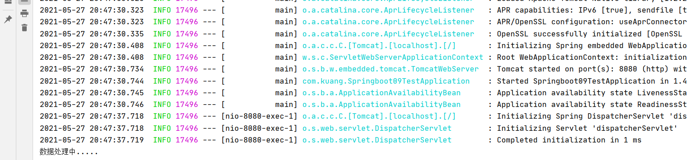
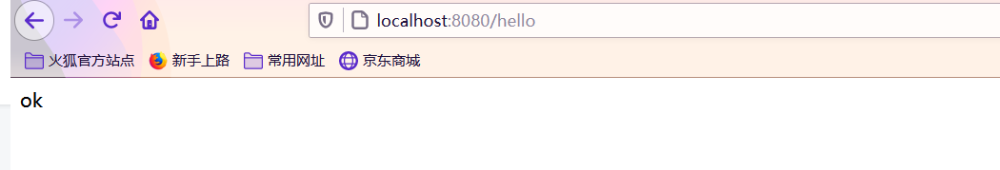
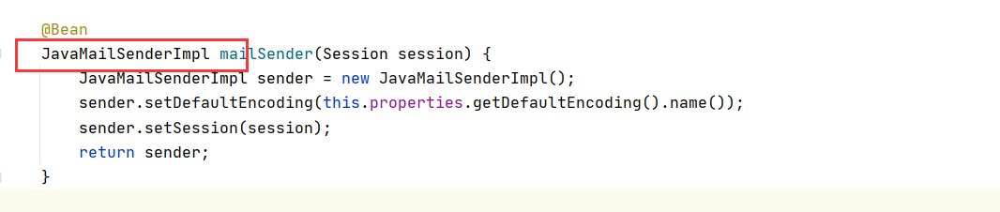
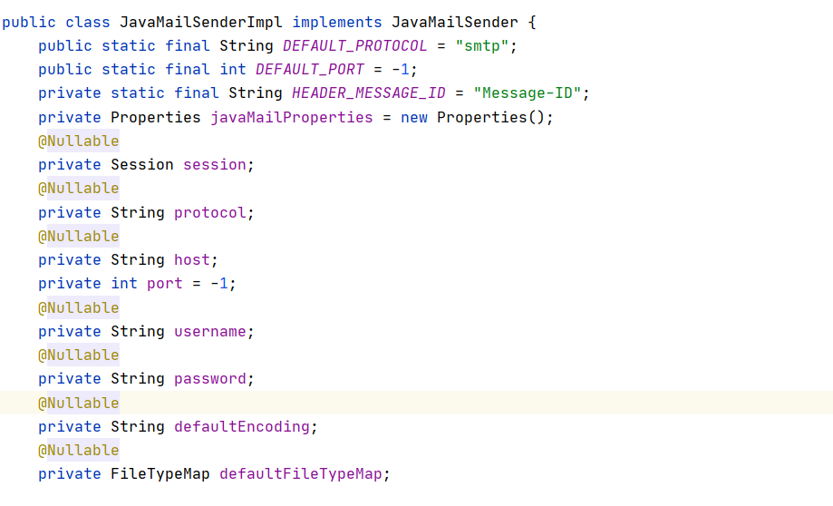
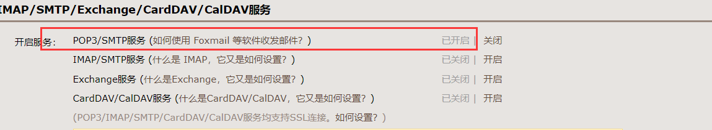
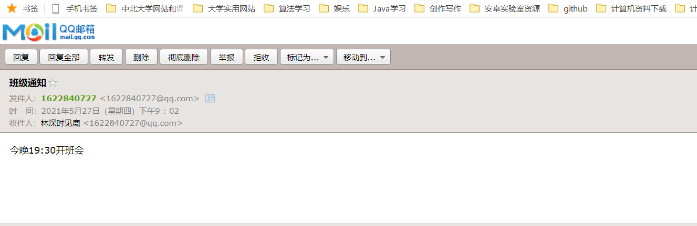
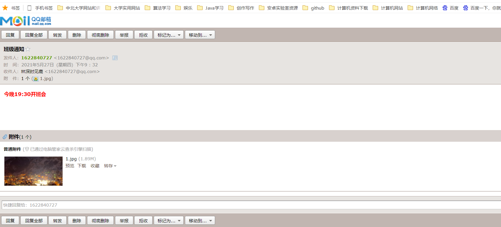
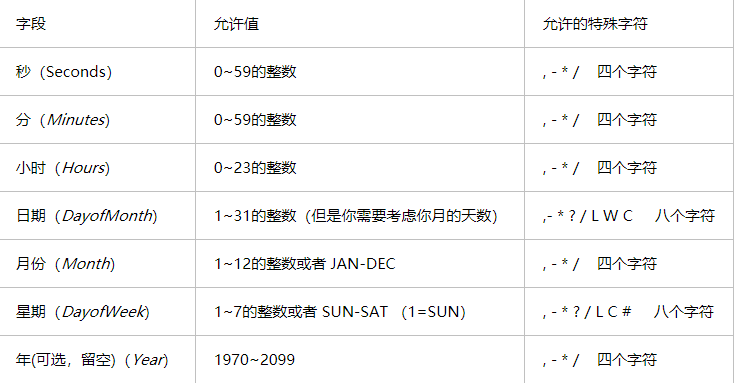
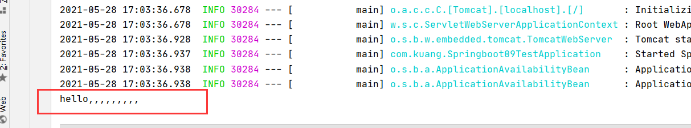

## SpringBootWeb开发提升

## 1、异步任务

> 异步处理还是非常常用的，比如我们在网站上发送邮件，后台会去发送邮件，此时前台会造成响应不动，直到邮件发送完毕，响应才会成功，所以我们一般会采用多线程的方式去处理这些任务。编写方法，假装正在处理数据，使用线程设置一些延时，模拟同步等待的情况；

1、创建一个service包 

2、 创建一个类AsyncService

```java
@Service
public class AsyncService {
    @Async //告诉Spring这是一个异步方法
    public void hello(){
        try {
            Thread.sleep(3000);
        } catch (InterruptedException e) {
            e.printStackTrace();
        }
        System.out.println("数据处理中.....");
    }
}
```

3、编写`controller`包 

4、编写AsyncController类

```java
@RestController
public class AsyncController {

    @Autowired
    AsyncService asyncService;

    @GetMapping("/hello")
    public String hello(){
        asyncService.hello();
        return "ok";
    }
}
```

5、 访问http://localhost:8080/hello进行测试，3秒后出现ok，这是同步等待的情况。问题：我们如果想让用户直接得到消息，就在后台使用多线程的方式进行处理即可，但是每次都需要自己手动去编写多线程的实现的话，太麻烦了，我们只需要用一个简单的办法，在我们的方法上加一个简单的注解即可，如下：

6、给hello方法添加@Async注解；

```java
@Service
public class AsyncService {
    @Async //告诉Spring这是一个异步方法
    public void hello(){
        try {
            Thread.sleep(3000);
        } catch (InterruptedException e) {
            e.printStackTrace();
        }
        System.out.println("数据处理中.....");
    }
}
```

SpringBoot就会自己开一个线程池，进行调用！但是要让这个注解生效，我们还需要在主程序上添加一个注解@EnableAsync ，开启异步注解功能；

```java
@EnableAsync //开启异步注解功能
@SpringBootApplication
public class Springboot09TestApplication {

    public static void main(String[] args) {
        SpringApplication.run(Springboot09TestApplication.class, args);
    }

}
```

7、重启测试，网页瞬间响应，后台代码依旧执行

**后台代码**



**网页响应**



## 2、邮件任务

邮件发送，在我们的日常开发中，也非常的多，Springboot也帮我们做了支持

- 邮件发送需要引入spring-boot-start-mail
- SpringBoot 自动配置MailSenderAutoConfifiguration
- 定义MailProperties内容，配置在application.yml中
- 自动装配JavaMailSender
- 测试邮件发送

**步骤**

1、引入pom依赖

```xml
<dependency>
    <groupId>org.springframework.boot</groupId>
    <artifactId>spring-boot-starter-mail</artifactId>
</dependency>
```

2、查看自动配置类：`MailSenderAutoConfifiguration`


点入`JavaMailSenderImpl`



查看其配置文件

****

3、这里面的一些属性需要我们自己去配置

**配置文件**

```properties
spring.mail.username=1622840727@qq.com
spring.mail.password=jvwsxwhswfbdiacb
spring.mail.host=smtp.qq.com

# qq需要配置ssl
spring.mail.properties.mail.smtp.ssl.enable=true
```

开启POP3/SMTP服务时，会生成一个授权码，保存授权码，在验证发送人身份时需填入授权码。我们将得到的授权码填入`password`中

4、进行单元测试

```java
package com.kuang;

import org.junit.jupiter.api.Test;
import org.springframework.beans.factory.annotation.Autowired;
import org.springframework.boot.test.context.SpringBootTest;
import org.springframework.mail.SimpleMailMessage;
import org.springframework.mail.javamail.JavaMailSenderImpl;

@SpringBootTest
class Springboot09TestApplicationTests {

    @Autowired
    JavaMailSenderImpl mailSender;

    @Test
    void contextLoads() {
        //邮件设置1：一个简单的邮件
        SimpleMailMessage message = new SimpleMailMessage();
        message.setSubject("班级通知"); 	//邮件标题
        message.setText("今晚19:30开班会"); //邮件正文

        message.setFrom("1622840727@qq.com");//发送放
        message.setTo("1622840727@qq.com");  //接收方
        mailSender.send(message);

    }

}
```

成功收到邮件



上述我们只是进行了一个简单邮件发送，实际邮件中正文的颜色可以发生改变，还可以添加一些如图片之类的附件。

5、复杂邮件的发送实现

将字体设置为红色

```java
helper.setText("<b style='color:red'>今晚19:30开班会</b>",true);
```

添加图片附件

```java
 helper.addAttachment("1.jpg",new File("C:\\Users\\Administrator\\Desktop\\1.jpg"));
```

完整代码

```java
@Test
void contextLoads2() throws MessagingException {
    //邮件设置2：一个复杂的邮件
    MimeMessage mimeMailMessage = mailSender.createMimeMessage();
    MimeMessageHelper helper = new MimeMessageHelper(mimeMailMessage, true);
    SimpleMailMessage message = new SimpleMailMessage();
    helper.setSubject("班级通知");
    helper.setText("<b style='color:red'>今晚19:30开班会</b>",true);

    //发送附件
    helper.addAttachment("1.jpg",new File("C:\\Users\\Administrator\\Desktop\\1.jpg"));
    helper.setTo("1622840727@qq.com");
    helper.setFrom("1622840727@qq.com");
    mailSender.send(mimeMailMessage);

}
```

查看效果



我们可以发现正文变红色了，并有了图片附件。

## 3、定时任务

> 项目开发中经常需要执行一些定时任务，比如需要在每天凌晨的时候，分析一次前一天的日志信息，Spring为我们提供了异步执行任务调度的方式，提供了两个接口。

两个接口:

- TaskExecutor接口

- TaskScheduler接口

两个注解：

- @EnableScheduling
- @Scheduled

**cron表达式：**

Cron表达式是一个字符串，字符串以5或6个空格隔开，分为6或7个域，每一个域代表一个含义。

corn从左到右（用空格隔开）：秒 分 小时 月份中的日期 月份 星期中的日期 年份

**各字段的含义：**



**我们测试一个定时任务：**

1、创建一个ScheduledService

```java
@Service
public class ScheduleService {
    @Scheduled(cron = "0 0/5 17,18 * * ?") //每天17点4分10秒执行一次
    public void hello(){
        System.out.println("hello,,,,,,,,,");
    }
}
```

2、主程序上增加@EnableScheduling 开启定时任务功能

```java
EnableAsync //开启异步注解功能
@SpringBootApplication
@EnableScheduling //开启定时功能的注解

public class Springboot09TestApplication {

    public static void main(String[] args) {
        SpringApplication.run(Springboot09TestApplication.class, args);
    }

}

```

3、我们可以看到在17:04:10时执行了`hello`方法。



## SpringBoot整合

