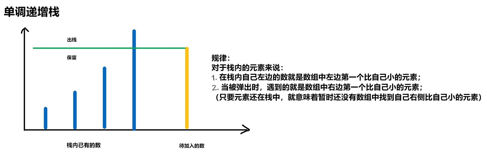

## LeetCode 热题 HOT 100 （2）

### [62. 不同路径](https://leetcode-cn.com/problems/unique-paths/)

**思路**

**(动态规划)**   $O(m*n)$ 

**状态表示：** `f[i,j]`表示从`(0,0)`走到`(i,j)`的所有不同路径的方案数。那么，`f[m-1][n-1]`就表示从网格左上角到网格右下角的所有不同路径的方案数，即为答案。

**状态转移：**    

 

由于限制了只能**向下走**或者**向右走**，因此到达`(i,j)`有两条路径 

- 从上方转移过来，`f[i][j] = f[i-1][j] `；
- 从左方转移过来，`f[i][j] = f[i][j-1] ` ;

因此，**状态计算方程为：** `f[i][j] = f[i-1][j] + f[i][j-1] ` ， 将向右和向下两条路径的方案数相加起来。

**初始化条件：** `f[0][0] = 1`，从`(0,0)`到达`(0,0)`只有一条路径。 

**分析图示：**   


**时间复杂度分析：** $O(m*n)$，其中  $m$和 $n$分别是网格的行数和列数 。

**c++代码**

```c++
class Solution {
public:
    int uniquePaths(int m, int n) {
        if(!n || !m) return 0;
        vector<vector<int>>f(m + 1, vector<int>(n + 1));
        f[0][0] = 1;
        for(int i = 0; i < m; i++)
            for(int j = 0; j < n; j++){
                if(!i && !j) continue;
                if(i) f[i][j] += f[i - 1][j];
                if(j) f[i][j] += f[i][j - 1];
            }
        return f[m - 1][n - 1];    
    }
};
```

### [64. 最小路径和](https://leetcode-cn.com/problems/minimum-path-sum/)

**思路**

**(动态规划)**   $O(m*n)$ 

**状态表示：** `f[i,j]`表示从`(0,0)`走到`(i,j)`的最小路径和。那么，`f[n-1][m-1]`就表示从网格左上角到网格右下角的最小路径和，即为答案。

**状态转移：**   

 

由于限制了只会**向下走**或者**向右走**，因此到达`(i,j)`有两条路径 

- 从上方转移过来，`f[i][j] = f[i-1][j] + grid[i][j]`
- 从左方转移过来，`f[i][j] = f[i][j-1] + grid[i][j]` 

因此，**状态计算方程为：** `f[i][j] = max(f[i - 1][j], f[i][j - 1]) + grid[i][j]`， 从向右和向下两条路径中选择路径之和最小的转移过来，再加上`grid[i][j]`的值。

**初始化条件：** `f[0][0] = grid[0][0]`， 其余都初始化为正无穷。 

**时间复杂度分析：** $O(m*n)$，其中  $m$和 $n$分别是网格的行数和列数 。

**c++代码**

```c++
class Solution {
public:
    int minPathSum(vector<vector<int>>& grid) {
        int n = grid.size(), m = grid[0].size();
        vector<vector<int>> f(n + 1, vector<int>(m + 1, INT_MAX));
        f[0][0] = grid[0][0];
        for(int i = 0; i < n; i++)
            for(int j = 0; j < m; j++){
                if(!i && !j) continue;
                if(i) f[i][j] = min(f[i - 1][j] + grid[i][j], f[i][j]);
                if(j) f[i][j] = min(f[i][j - 1] + grid[i][j], f[i][j]);
            }
        return f[n - 1][m - 1];    
    }
};
```

### [70. 爬楼梯](https://leetcode-cn.com/problems/climbing-stairs/)

**思路**

**(递推)** $O(n)$

**分析题目可以发现：**

- 上 1 阶台阶：有1种方式。

- 上 2 阶台阶：有1+1和2两种方式。 

- 上 3 阶台阶：到达第3阶的方法总数就是到第1阶和第2阶的方法数之和。

- 上 n 阶台阶，到达第n阶的方法总数就是到第 (n-1) 阶和第 (n-2) 阶的方法数之和。 

因此，定义数组 `f[i]` 表示上`i` 级台阶的方案数，则枚举最后一步是上`1`级台阶，还是上`2`级台阶，所以有：
`f[i] = f[i−1]+f[i−2]`。  


**时间复杂度分析：**递推状态数$O(n)$，转移时间复杂度是 $O(1)$，所以总时间复杂度是 $O(n)$。 

**c++代码**

```c++
class Solution {
public:
    int climbStairs(int n) {
        if(n <= 2) return n;
        vector<int>f(n + 1);
        f[1] = 1;
        f[2] = 2;
        for(int i = 3; i <= n; i++){
            f[i] = f[i - 1] + f[i - 2];
        }
        return f[n];
    }
};
```

### [72. 编辑距离](https://leetcode-cn.com/problems/edit-distance/)

**思路**

**(动态规划)**  $O(n * m)$

给你两个单词 `word1` 和 `word2`，请你计算出将 `word1` 转换成 `word2` 所使用的最少操作数 。

**状态表示：** `f[i][j]` 表示将 `word1` 的前 `i` 个字符变成 `word2` 的前 `j` 个字符需要进行的最少操作次数。

**状态计算：** 

如何计算`f[i][j]`？考虑`word1`的第`i`个字符与`word2`的第`j`个字符（下标从`1`开始），分为两种情况：

- 1、`word1[i] == word2[j]`，则`f[i][j] == f[i - 1][j - 1]`;

- 2、`word1[i] != word2[j]`，我们有三种选择，替换、删除、插入：
  - **替换：**替换`word1`的第`i`个字符或者替换`word2`的第`j`个字符，则`f[i][j] == f[i - 1][j - 1] + 1`；
  - **删除：**删除`word1`的第`i`个字符或者删除`word2`的第`j`个字符，则`f[i][j] = min(f[i - 1][j], f[i][j - 1]) + 1`;
  - **插入:**  在 `word2[j]` 后面添加 `word1[i]`或者在`word1[i]`后添加`word2[j]`，则`f[i][j] = min(f[i - 1][j], f[i][j - 1]) + 1`;

**初始化：**

```c++
for(int i = 0; i <= n; i++)  f[i][0] = i;   //将长度为i的word1变成长度为0的word2需要进行最少i次删除操作
for(int i = 0; i <= m; i++)  f[0][i] = i;   //将长度为i的word2变成长度为0的word1需要进行最少i次添加操作
```

**时间复杂度分析：**  状态数为$O(n * m)$，状态计算为$O(1)$，因此总的时间复杂度为$O(n * m)$。

**c++代码**

```c++
class Solution {
public:
    int minDistance(string word1, string word2) {
        int n = word1.size(), m = word2.size();
        word1 = ' ' + word1;
        word2 = ' ' + word2;
        vector<vector<int>>f(n + 1, vector<int>(m + 1));
        for(int i = 0; i <= n; i++)  f[i][0] = i;  //i次删除
        for(int i = 0; i <= m; i++)  f[0][i] = i;  //i次添加 word1 -> word2
        for(int i = 1; i <= n; i++)
            for(int j = 1; j <= m; j++){
                f[i][j] = min(f[i - 1][j], f[i][j - 1]) + 1; //添加或者删除
                int t = word1[i] != word2[j];
                f[i][j] = min(f[i][j], f[i - 1][j - 1] + t); //替换
            }
        return f[n][m];    
    }
};
```

### [75. 颜色分类](https://leetcode-cn.com/problems/sort-colors/) *

**思路**

**(双指针)**  $O(n)$

类似于刷油漆。 


**时间复杂度分析：** 一次遍历，因此为$O(n)$。

**c++代码**

```c++
class Solution {
public:
    void sortColors(vector<int>& nums) {
        int j = 0, k = 0;
        for(int i = 0; i < nums.size(); i++){
            int num = nums[i];
            nums[i] = 2;
            
            if(num < 2) nums[j++] = 1;
            if(num < 1) nums[k++] = 0; 
        }
    }
};
```

### [76. 最小覆盖子串](https://leetcode-cn.com/problems/minimum-window-substring/)

**思路**

**(滑动窗口)**  $O(n)$

这道题要求我们返回字符串` s`中包含字符串 `t` 的全部字符的最小窗口，我们利用滑动窗口的思想解决这个问题。因此我们需要两个哈希表，`hs`哈希表维护的是`s`字符串中滑动窗口中各个字符出现多少次，`ht`哈希表维护的是`t`字符串各个字符出现多少次。如果`hs`哈希表中包含`ht`哈希表中的所有字符，并且对应的个数都不小于`ht`哈希表中各个字符的个数，那么说明当前的窗口是**可行**的，可行中的长度最短的滑动窗口就是答案。 


**过程如下：** 

1、遍历`t`字符串，用`ht`哈希表记录`t`字符串各个字符出现的次数。 


2、定义两个指针`j`和`i`，`j`指针用于收缩窗口，`i`指针用于延伸窗口，则区间`[j,i]`表示当前滑动窗口。首先让`i`和`j`指针都指向字符串`s`开头，然后枚举整个字符串`s` ，枚举过程中，不断增加`i`使滑动窗口增大，相当于向右扩展滑动窗口。


3、每次向右扩展滑动窗口一步，将`s[i]`加入滑动窗口中，而新加入了`s[i]`，相当于滑动窗口维护的字符数加一，即`hs[s[i]]++`。 


4、对于新加入的字符`s[i]`,如果`hs[s[i]] <= ht[s[i]]`，说明当前新加入的字符`s[i]`是必需的，且还未到达字符串`t`所要求的数量。因此我们还需要事先定义一个`cnt`变量， `cnt`维护的是`s`字符串`[j,i]`区间中满足`t`字符串的元素的个数，记录相对应字符的总数。新加入的字符`s[i]`必需，则`cnt++`。

5、我们向右扩展滑动窗口的同时也不能忘记收缩滑动窗口。因此当`hs[s[j]] > ht[s[j]`时，说明`hs`哈希表中`s[j]`的数量多于`ht`哈希表中`s[j]`的数量，此时我们就需要向右收缩滑动窗口，`j++`并使`hs[s[j]]--`，即`hs[s[j ++ ]] --`。

6、当`cnt == t.size`时，说明此时滑动窗口包含符串 `t` 的全部字符。我们重复上述过程找到最小窗口即为答案。 


**时间复杂度分析：** 两个指针都严格递增，最多移动 $n$ 次，所以总时间复杂度是 O(n)。

**c++代码**

```c++
class Solution {
public:
    string minWindow(string s, string t) {
        unordered_map<int, int> hs, ht;
        for(char c : t) ht[c]++;
        string res;
        int cnt = 0;
        for(int i = 0, j = 0; i < s.size(); i++){
            hs[s[i]]++;
            if(hs[s[i]] <= ht[s[i]]) cnt++;
            while(hs[s[j]] > ht[s[j]]) hs[s[j++]]--;
            if(cnt == t.size()){
                if(res.empty() || i - j + 1 < res.size())
                    r0.es = s.substr(j, i - j + 1); 
            }
        }
        return res;
    }
};
```

### [78. 子集](https://leetcode-cn.com/problems/subsets/)

**思路**

**思路1**

**(二进制)**  $O(2^nn)$ 

对于一个大小为`n`的数组`nums`来说，由于每个数有**选**和**不选**两种情况，因此总共有 $2^n$ 种情况。我们用`n`位二进制数 $0$ 到 $2^n-1$ 表示每个数的选择状态情况，在某种情况`i`中，若该二进制数`i`的第`j`位是`1`，则表示`nums`数组第`j`位这个数选，我们将`nums[j]`加入到`path`中，枚举完`i`这种情况，将`path`加入到`res`中 。

例如对于集合`[1, 2, 3]`

| 0/1序列 | 表示集合  | 对应的二进制数 |
| :-----: | :-------: | :------------: |
|   000   |    []     |       0        |
|   001   |    [3]    |       1        |
|   010   |    [2]    |       2        |
|   011   |  [2, 3]   |       3        |
|   100   |    [1]    |       4        |
|   101   |  [1, 3]   |       5        |
|   110   |  [1, 2]   |       6        |
|   111   | [1, 2, 3] |       7        |

**时间复杂度分析：**一共枚举 $2^n$ 个数，每个数枚举 $n$ 位，所以总时间复杂度是 $O(2^nn)$。

**c++代码1** 

```c++
class Solution {
public:
    vector<vector<int>> subsets(vector<int>& nums) {
        vector<vector<int>>res;
        int n = nums.size();
        for(int i = 0; i < 1<<n; i++)
        {
            vector<int>path;
            for(int j = 0; j < n; j++)
            {
                if(i>>j&1)
                    path.push_back(nums[j]);
            }
            res.push_back(path);
        }
        return res;
    }
};
```

**时间复杂度分析：** 一共枚举 $2^n$ 个数，每个数枚举 $n$ 位，所以总时间复杂度是 $O(2^nn)$。 

**思路2**

**(递归)**   $O(2^nn)$

一共`n`个位置，递归枚举每个位置的数 **选** 还是 **不选**，然后递归到下一层。

**递归函数设计**

- 递归参数：`void dfs(vector<int>& nums, int u)` ，第一个参数是`nums`数组，第二个参数是`u`，表示当前枚举到`nums`数组中的第`u`位。
- 递归边界：`u == nums.size()`，当枚举到第`nums.size()`位时，递归结束，我们将结果放到答案数组`res`中。

**时间复杂度分析：** 一共 $2^n$ 个状态，每种状态需要 $O(n)$ 的时间来构造子集。 

**c++代码2**

```c++
class Solution {
public:
    vector<vector<int>>res;
    vector<int>path;
    vector<vector<int>> subsets(vector<int>& nums) {
        dfs(nums,0);
        return res;
    }
    void dfs(vector<int>&nums,int u)
    {
        if( u == nums.size()) //递归边界
        {
            res.push_back(path);
            return;
        }
        dfs(nums,u+1);  //不选第u位，递归下一层
        path.push_back(nums[u]);
        dfs(nums,u+1);  //选第u位，递归下一层
        path.pop_back(); //回溯
    }
};
```

### [79. 单词搜索](https://leetcode-cn.com/problems/word-search/)

**思路**

**(回溯)** $O(n^2 3^k)$ 

深度优先搜索，我们定义这样一种搜索顺序，即先枚举单词的起点，然后依次枚举单词的每个字母。在这个过程中需要将已经使用过的字母改成一个特殊字母，以避免重复使用字符。


**递归函数设计：**

```c++
bool dfs(vector<vector<char>>& board, string& word,int u,int x,int y)
```

`u`代表当前枚举到了目标单词`word`第`u`个位置。 

`x`，`y`是当前搜索到的二维字符网格的横纵坐标。 

**搜索过程如下：**

- 1、在二维字符网格中枚举每个单词的起点。
- 2、从该起点出发向四周搜索单词`word`，并记录此时枚举到单词`word`的第`u`个位置 ( `u`从`0`开始)。  
- 3、如果当前搜索的位置`(x,y)`的元素`board[x][y] == word[u]`,则继续向四周搜索。
- 4、直到枚举到单词`word`的最后一个字母返回`ture`，否则返回`false`。

**递归边界：** 

- 1、当搜索过程出现当前位置`board[x][y] != word[u]` ，说明当前路径不合法，返回`false`。
- 2、`u == word.size() - 1`,成功搜索到单词末尾，返回`true`。

**实现细节：** 

- 1、搜索过的位置继续搜索下一层时，需要对当前位置进行标识，表示已经搜索

- 2、可以使用偏移数组来简化代码。 

  

  

**时间复杂度分析：** 单词起点一共有 $n^2$ 个，单词的每个字母一共有上下左右四个方向可以选择，但由于不能走回头路，所以除了单词首字母外，仅有三种选择。所以总时间复杂度是  $O(n^2 3^k)$ 。 

**c++代码**

```c++
class Solution {
public:
    bool exist(vector<vector<char>>& board, string word) {
        for(int i = 0; i < board.size(); i++)
            for(int j = 0; j < board[i].size(); j++)
                if(dfs(board, word, 0, i, j))
                    return true;
        return false;            
    }
    int dx[4] = {-1, 0, 1, 0}, dy[4] = {0, 1, 0, -1};
    bool dfs(vector<vector<char>>& board, string word, int u, int x, int y){
        if(board[x][y] != word[u]) return false;
        if(u == word.size() - 1){
            return true;
        }
        char t = board[x][y];
        board[x][y] = '.';
        for(int i = 0; i < 4; i++){
            int a = x + dx[i], b = y + dy[i];
            if(a < 0 || a >= board.size() || b <0 || b >= board[0].size() || board[a][b] == '.') continue;
            if(dfs(board, word, u + 1, a, b))
                return true; 
        }
        board[x][y] = t;
        return false;
    }
};
```

### [84. 柱状图中最大的矩形](https://leetcode-cn.com/problems/largest-rectangle-in-histogram/)

**思路**

**(单调栈)**




对于每个柱子`i`，找到左边第一个比它小的柱子的位置`left[i]`，和找到右边第一个比它小的柱子的位置`right[i]`，`(right[i] - left[i] - 1) * heights[i]`是当前柱子所能找到的最大的矩形面积。

**c++代码**

```c++
class Solution {
public:
    int largestRectangleArea(vector<int>& h) {
        int n = h.size();
        vector<int> left(n), right(n);
        stack<int> st; //单调递增栈

        // 寻找左边第一个小于h[i]的数的下标
        for(int i = 0; i < n; i++){
            while(!st.empty() && h[st.top()] >= h[i]) st.pop();  //维护单调递增栈
            if(st.empty()) left[i] = -1;
            else left[i] = st.top();
            st.push(i);
        }

        st = stack<int>();
        // 寻找右边第一个小于h[i]的数的下标
        for(int i = n - 1; i >= 0; i--){
            while(!st.empty() && h[st.top()] >= h[i]) st.pop();  //维护单调递增栈
            if(st.empty()) right[i] = n;
            else right[i] = st.top();
            st.push(i);
        }

        int res = 0;
        for(int i = 0; i < n; i++){
            res = max(res, (right[i] - left[i] - 1) * h[i]);
        }
        return res;
    }
};
```

### [85. 最大矩形](https://leetcode-cn.com/problems/maximal-rectangle/)

**思路**

**(单调栈)**  $O(n^2)$

我们可以枚举每一行，将每一行看成一条基准线。对于某一行，看每个格子向上最多能到达的位置，当做这个位置的高度，然后就转化成了`Lc84`的问题，如下图是转化过程（当枚举到第6行时，对应的各个柱子，红色的为对应的柱子）：


枚举每一行都会得到一个最大矩形的结果，这些结果中最大的一个就是答案。

**我们如何得到各个柱子的高度？**

**动态规划**

**状态表示：** `h[i][j]`表示以`(i, j)`为起点对应柱子的最大高度。

**状态计算：** 如果`matrix[i][j] == 1`的话，则`h[i][j] = h[i - 1][j] + 1`，否则`h[i][j] = 0`。

**c++代码**

```c++
class Solution {
    public:
    int maxRectangleh(vector<int> h){
        int n = h.size();
        vector<int> left(n), right(n);
        stack<int> stk;
        for(int i = 0; i < n; i++){
            while(!stk.empty() && h[stk.top()] >= h[i]) stk.pop();  // 单调递增栈
            if(stk.empty()) left[i] = -1;
            else left[i] = stk.top();    // 左边第一个比h[i]小的位置
            stk.push(i);
        }
        stk = stack<int>();  //栈清空
        for(int i = n - 1; i >= 0; i--){
            while(!stk.empty() && h[stk.top()] >= h[i]) stk.pop();
            if(stk.empty()) right[i] = n;
            else right[i] = stk.top();   // 右边第一个比h[i]小的位置
            stk.push(i);
        }
        int res = 0;
        for(int i = 0; i < n; i++) res = max(res, h[i] * (right[i] - left[i] - 1));
        return res;
    }
    int maximalRectangle(vector<vector<char>>& matrix) {
        int n = matrix.size(),m = matrix[0].size();
        if(!n || !m) return 0;
        vector<vector<int>>h(n + 1, vector<int>(m + 1));
        for(int i = 0; i < n; i++)
            for(int j = 0; j < m; j++)
                if(matrix[i][j] == '1'){
                    if(i) h[i][j] = h[i - 1][j] + 1;
                    else  h[i][j] = 1;
                }
        int res = 0;
        for(int i = 0; i < n; i++) res = max(res, maxRectangleh(h[i]));
        return res;         
    }
};
```

### [94. 二叉树的中序遍历](https://leetcode-cn.com/problems/binary-tree-inorder-traversal/)

**思路**

**思路1** 

**(递归)**

按照 **左子树 => 根节点 => 右子树**的顺序进行遍历二叉树。 

**c++代码1**

```c++
/**
 * Definition for a binary tree node.
 * struct TreeNode {
 *     int val;
 *     TreeNode *left;
 *     TreeNode *right;
 *     TreeNode() : val(0), left(nullptr), right(nullptr) {}
 *     TreeNode(int x) : val(x), left(nullptr), right(nullptr) {}
 *     TreeNode(int x, TreeNode *left, TreeNode *right) : val(x), left(left), right(right) {}
 * };
 */
class Solution {
public:
    vector<int> res;
    vector<int> inorderTraversal(TreeNode* root) {
        dfs(root);
        return res;
    }

    void dfs(TreeNode* root){
        if(!root) return ;
        dfs(root->left);
        res.push_back(root->val);
        dfs(root->right);
    }
};
```

**思路2**

**(迭代)** 

假设当前树的根节点为`root`，如果`root != null`，将整颗树的左链压入栈中。此时的栈顶元素就是我们想要的中序遍历结果，将其加入`res`中。如果有右子树，按照相同的步骤处理右子树。

**c++代码2**

```c++
/**
 * Definition for a binary tree node.
 * struct TreeNode {
 *     int val;
 *     TreeNode *left;
 *     TreeNode *right;
 *     TreeNode() : val(0), left(nullptr), right(nullptr) {}
 *     TreeNode(int x) : val(x), left(nullptr), right(nullptr) {}
 *     TreeNode(int x, TreeNode *left, TreeNode *right) : val(x), left(left), right(right) {}
 * };
 */
class Solution {
public:
    vector<int> inorderTraversal(TreeNode* root) {
        vector<int> res;
        stack<TreeNode*> stk;
        while(root || stk.size()){
            while(root){  //将左子链压入栈中
                stk.push(root);
                root = root->left;
            }

            root = stk.top();
            stk.pop();
            res.push_back(root->val);  // 当前栈顶元素就是中序遍历的结果
            root = root->right; //处理右子树
        }
        return res;
    }
};
```

### [96. 不同的二叉搜索树](https://leetcode-cn.com/problems/unique-binary-search-trees/)

**思路**

**(动态规划)**  $O(n^2)$

**状态表示：** `f[n]`表示`n`个节点的二叉搜索树一共有多少种？

**状态计算：**

当给定的二叉树节点固定时，对应的二叉搜索树的情况数量也一定固定。对于节点数为`i`的二叉搜索树，我们去枚举二叉树的根节点的位置`j`，那么左子树区间为`[1, j - 1]`，节点数为`j - 1`，右子树区间为`[j + 1, i]`，节点数为`[i - j]`。将左子树长度和右子树的长度相乘就是节点数为`i`，根节点位置为`j`二叉树的种类，即`f[i] = f[j - 1] * f[i - j]`。

而对于长度为$n$的二叉树，根据根节点位置的划分，左子树可以有 $0,1,…n−1$ 个节点，对应的右子树有 $n−1,n−2,…,0$ 个节点，$f[n]$ 是所有这些情况的加和，所以$f[n] = \sum_{k=0}^{n-1}f[k]*f[n-1-k]$ 。

**初始化：** 

`f[0]= 1`，节点数为`0`的二叉树只有一种，为空树。

**时间复杂度分析：**状态总共有 $n $个，状态转移的复杂度是 $O(n)$，所以总时间复杂度是 $O(n^2)$。 

**c++代码**

```c++
class Solution {
public:
    int numTrees(int n) {
        vector<int>f(n + 1);
        f[0] = 1;
        for(int i = 1; i <= n; i++)  // 枚举二叉树的长度
            for(int j = 1; j <= i; j++) // 枚举根节点所在的位置
                f[i] += f[j - 1] * f[i - j];  //左子树长度 * 右子树长度 (映射)
        return f[n];        
  }
};
```

### [98. 验证二叉搜索树](https://leetcode-cn.com/problems/validate-binary-search-tree/)

**思路**

**(深度优先遍历)** $O(n)$  

二叉搜索树是一种节点值之间具有一定数量级次序的二叉树，对于树中每个节点：

- 若其左子树存在，则其左子树中每个节点的值都**小于**该节点值；
- 若其右子树存在，则其右子树中每个节点的值都**大于**该节点值。 

我们知道二叉搜索树**「中序遍历」**得到的值构成的序列一定是升序的的。因此我们可以对二叉树进行中序遍历，判断当前节点是否大于中序遍历的前一个节点，如果大于，说明说明这个序列是升序的，整棵树是二叉搜索树，否则不是。

**二叉树的中序遍历顺序为：**左根右

 **图示： ** 


**过程：** 

- 1、我们定义一个节点变量`pre`用来记录中序遍历的前一个节点。
- 2、中序遍历二叉树，在遍历过程中判断当前节点是否大于中序遍历的前一个节点。如果**大于**不做任何处理，如果**小于等于**说明不满足二叉搜索树的性质，返回`false`。

**细节：**

- 1、`pre`节点的初始值要设置为`null`。
- 2、具体实现过程看代码。

**时间复杂度分析：**树中每个节点仅被遍历一遍，所以时间复杂度是 $O(n)$。

**c++代码**

```c++
/**
 * Definition for a binary tree node.
 * struct TreeNode {
 *     int val;
 *     TreeNode *left;
 *     TreeNode *right;
 *     TreeNode() : val(0), left(nullptr), right(nullptr) {}
 *     TreeNode(int x) : val(x), left(nullptr), right(nullptr) {}
 *     TreeNode(int x, TreeNode *left, TreeNode *right) : val(x), left(left), right(right) {}
 * };
 */
class Solution {
public:
    TreeNode* pre = nullptr;
    bool isValidBST(TreeNode* root) {
        if(!root ) return true; //递归边界
        //判断当前节点的左子树是否满足二叉搜索树，如果不满足，直接返回false，无序递归右子树
        if(!isValidBST(root->left) )  return false; 
        //如果前一个节点不为空并且当前节点<=前一个节点，直接返回false
        if( pre && root->val <= pre->val) return false;
        //否则，将当前节点设置为pre
        pre = root;
        return isValidBST(root->right); //递归判断右子树
    }
};

```

### [101. 对称二叉树](https://leetcode-cn.com/problems/symmetric-tree/)

**思路**

**(递归）** $O(n)$

给定我们一个二叉树的根节点`root`，检查这颗二叉树是否轴对称。

**样例：**  


如样例所示，`root = [1,2,2,3,4,4,3]`，是一颗轴对称二叉树，因此我们返回`true`。判断一棵二叉树是否轴对称，其实就是判断这颗二叉树的左右**两个子树是否互为镜像**。 

两个子树互为镜像当且仅当：   

1. 两个子树的根节点值相等；
2. 第一棵子树的左子树和第二棵子树的右子树对称，且第一棵子树的右子树和第二棵子树的左子树对称；  


**具体实现过程如下：** 

- 1、我们定义两个指针`p`和`q` ,让`p`和`q`指针一开始分别指向左子树和右子树。

- 2、同步移动这两个指针来遍历这棵树，每次检查当前 `p` 和` q` 节点的值是否相等，如果相等再判断左右子树是否对称。

**判断两颗树对称的递归边界：**  

- `p`和`q`节点都为空时，左右子树都为空，返回`true`
- `p`和`q`节点只有一个为空时，左右子树不对称，返回`false`
- `p`和`q`节点值不相等，左右子树不对称，返回`false`

**时间复杂度分析：** 从上到下每个节点仅被遍历一遍，所以时间复杂度是 $O(n)$。 

**c++代码**

```c++
/**
 * Definition for a binary tree node.
 * struct TreeNode {
 *     int val;
 *     TreeNode *left;
 *     TreeNode *right;
 *     TreeNode() : val(0), left(nullptr), right(nullptr) {}
 *     TreeNode(int x) : val(x), left(nullptr), right(nullptr) {}
 *     TreeNode(int x, TreeNode *left, TreeNode *right) : val(x), left(left), right(right) {}
 * };
 */
class Solution {
public:
    bool isSymmetric(TreeNode* root) {
        if(!root) return true;
        return dfs(root->left, root->right);
    }
    bool dfs(TreeNode* p, TreeNode* q){
        if(!p && !q) return true;
        if(!p || !q) return false;
        if(p->val != q->val) return false;
        return dfs(p->left, q->right) && dfs(p->right, q->left);
    }
};
```

### [102. 二叉树的层序遍历](https://leetcode-cn.com/problems/binary-tree-level-order-traversal/)

**思路**

**(BFS)** $O(n)$
我们从根节点开始按宽度优先的顺序遍历整棵树，每次先扩展左儿子，再扩展右儿子。

这样我们会：

1. 先扩展根节点；
2. 再依次扩展根节点的左右儿子，也就是从左到右扩展第二层节点；
3. 再依次从左到右扩展第三层节点；
4. 依次类推

然后在遍历过程中我们给每一层加一个结尾标记`NULL`,当我们访问到一层的结尾时，由于`BFS`的特点，我们刚好把下一层都加到了队列中。这个时候就可以给这层加上结尾标记`NULL`了,每次遍历到一层的结尾`NULL`时，就将这一层添加到结果中。

**时间复杂度分析：**  每个节点仅会被遍历一次，因此时间复杂度为$O(n)$。

**c++代码**

```c++
/**
 * Definition for a binary tree node.
 * struct TreeNode {
 *     int val;
 *     TreeNode *left;
 *     TreeNode *right;
 *     TreeNode() : val(0), left(nullptr), right(nullptr) {}
 *     TreeNode(int x) : val(x), left(nullptr), right(nullptr) {}
 *     TreeNode(int x, TreeNode *left, TreeNode *right) : val(x), left(left), right(right) {}
 * };
 */
class Solution {
public:
    vector<vector<int>> levelOrder(TreeNode* root) {
        vector<vector<int>> res;
        vector<int> path;
        queue<TreeNode*> q;
        q.push(root);
        q.push(nullptr);
        while(q.size()){
            TreeNode* t = q.front();
            q.pop();
            if(!t){
                if(path.empty())  break;  //如果当前层没有元素，直接结束（防止进入死循环）
                res.push_back(path);
                path.clear();
                q.push(nullptr); //每一层的结尾加一个null标记结束
            }else{
                path.push_back(t->val);
                if(t->left)  q.push(t->left);
                if(t->right) q.push(t->right);
            }
        }
        return res;
    }
};
```

### [104. 二叉树的最大深度](https://leetcode-cn.com/problems/maximum-depth-of-binary-tree/)

**思路**

**(递归)** $O(n) $
当前树的最大深度等于左右子树的最大深度加`1`，也就是说如果我们知道了左子树和右子树的最大深度 `lh`和 `rh`，那么该二叉树的最大深度即为  `max(lh,rh) + 1` 

**图示：** 


**递归设计：**

- 1、递归边界：当前节点为空时，树的深度为`0`
- 2、递归返回值：返回当前子树的深度，即`max(lh,rh) + 1` 

**时间复杂度分析：**树中每个节点只被遍历一次，所以时间复杂度是 $O(n)$。 

**c++代码**

```c++
/**
 * Definition for a binary tree node.
 * struct TreeNode {
 *     int val;
 *     TreeNode *left;
 *     TreeNode *right;
 *     TreeNode() : val(0), left(nullptr), right(nullptr) {}
 *     TreeNode(int x) : val(x), left(nullptr), right(nullptr) {}
 *     TreeNode(int x, TreeNode *left, TreeNode *right) : val(x), left(left), right(right) {}
 * };
 */
class Solution {
public:
    int maxDepth(TreeNode* root) {
        if(!root) return 0;
        int lh = maxDepth(root->left), rh = maxDepth(root->right);
        return max(lh, rh) + 1;
    }
};
```

### [105. 从前序与中序遍历序列构造二叉树](https://leetcode-cn.com/problems/construct-binary-tree-from-preorder-and-inorder-traversal/)

**思路**

**(递归)**   $O(n)$

**二叉树： **

- 二叉树前序遍历的顺序为：根左右

- 二叉树中序遍历的顺序为：左根右

我们递归建立整棵二叉树：先创建根节点，然后递归创建左右子树，并让指针指向两棵子树。

**图示：** 


**具体步骤如下：**  

- 1、先利用前序遍历找根节点，前序遍历的第一个数，就是根节点的值；
- 2、在中序遍历中找到根节点的位置 `pos`，则 `pos` 左边是左子树的中序遍历，右边是右子树的中序遍历；
- 3、假设左子树的中序遍历的长度是 `k`，则在前序遍历中，根节点后面的 `k` 个数，是左子树的前序遍历，剩下的数是右子树的前序遍历；
- 4、有了左右子树的前序遍历和中序遍历，我们可以先递归创建出根节点，然后再递归创建左右子树，再将这两颗子树接到根节点的左右位置；

**细节1：**如何在中序遍历中对根节点快速定位？

一种简单的方法是直接扫描整个中序遍历的结果并找出根节点，但这样做的时间复杂度较高。我们可以考虑使用哈希表来帮助我们快速地定位根节点。对于哈希映射中的每个键值对，键表示一个元素（节点的值），值表示其在中序遍历中的出现位置。

**细节2：**如何确定左右子树的前序遍历和中序遍历范围？

- 1、根据哈希表找到中序遍历的根节点位置，我们记作`pos` 

- 2、用`pos-il` (`il`为中序遍历左端点) 得到中序遍历的长度`k` ，由于一棵树的前序遍历和中序遍历的长度相等，因此前序遍历的长度也为`k`。有了前序和中序遍历的长度，根据如上具体步骤`2`，`3`，我们就能很快确定左右子树的前序遍历和中序遍历范围。

  **如图所示：**  

  

  `pl`,`pr`对应一棵子树的前序遍历区间的左右端点， `il`,`ir`对应一棵子树的中序遍历区间的左右端点。

**时间复杂度分析：** $ O(n)$，其中 $n$ 是树中的节点个数。   

**c++代码** 

```c++
/**
 * Definition for a binary tree node.
 * struct TreeNode {
 *     int val;
 *     TreeNode *left;
 *     TreeNode *right;
 *     TreeNode() : val(0), left(nullptr), right(nullptr) {}
 *     TreeNode(int x) : val(x), left(nullptr), right(nullptr) {}
 *     TreeNode(int x, TreeNode *left, TreeNode *right) : val(x), left(left), right(right) {}
 * };
 */
class Solution {
public:
    unordered_map<int, int> pos;
    TreeNode* buildTree(vector<int>& preorder, vector<int>& inorder) {
        int n = inorder.size();
        for(int i = 0; i < n; i++){
            pos[inorder[i]] = i;
        }
        return dfs(preorder, 0, n - 1, inorder, 0, n - 1);
    }
    TreeNode* dfs(vector<int>& pre, int pl ,int pr, vector<int>& in, int il, int ir){
        if(pl > pr) return nullptr;
        int k = pos[pre[pl]] - il;  //中序遍历长度
        TreeNode* root = new TreeNode(pre[pl]);
        root->left =  dfs(pre, pl + 1, pl + k, in, il, il + k - 1);
        root->right = dfs(pre, pl + k + 1, pr, in, il + k + 1, ir);
        return root;
    }
};
```

### [114. 二叉树展开为链表](https://leetcode-cn.com/problems/flatten-binary-tree-to-linked-list/)

**思路**

**(树的遍历)**  $O(n)$

对于当前节点：

- 1、如果存在左子树，则将左子树右链插入当前节点右边。
- 2、否则，遍历至右子树 

**图示过程如下：** 


**时间复杂度分析： **

虽然有两重循环，但外层循环会将所有节点遍历一次，内层循环会将除了根节点之外的其他内部结点的右链遍历一次，所以每个节点最多被遍历两次，所以时间复杂度是 $O(n)$。 

**c++代码** 

```c++
/**
 * Definition for a binary tree node.
 * struct TreeNode {
 *     int val;
 *     TreeNode *left;
 *     TreeNode *right;
 *     TreeNode() : val(0), left(nullptr), right(nullptr) {}
 *     TreeNode(int x) : val(x), left(nullptr), right(nullptr) {}
 *     TreeNode(int x, TreeNode *left, TreeNode *right) : val(x), left(left), right(right) {}
 * };
 */
class Solution {
public:
    void flatten(TreeNode* root) {
        while(root){
            TreeNode* p = root->left;
            if(p){
                while(p->right) p = p->right; 
                p->right = root->right;
                root->right = root->left;
                root->left = nullptr;
            }
            root = root->right;
        }
        
    }
};
```

### [121. 买卖股票的最佳时机](https://leetcode-cn.com/problems/best-time-to-buy-and-sell-stock/)

**思路**

**(遍历)**  $O(n) $

- 1、当枚举到`i`时，`minv`维护的是`[0,i - 1]`最小的价格，`price[i] - minv`是在当前点`i`买入的最大收益，
- 2、计算所有点的最大收益取最大值

**时间复杂度分析:**     $O(n)$ 。

**c++代码**

```c++
class Solution {
public:
    int maxProfit(vector<int>& prices) {
        int res = 0, minv = INT_MAX;
        for(int i = 0; i < prices.size(); i++){
            minv = min(prices[i], minv);
            res = max(res, prices[i] - minv);
        }
        return res;
    }
};
```

### [124. 二叉树中的最大路径和](https://leetcode-cn.com/problems/binary-tree-maximum-path-sum/)

**思路**

**(递归，树的遍历)** $O(n^2)$

**路径** 

在这道题目中，路径是指从树中某个节点开始，沿着树中的边走，走到某个节点为止，路过的所有节点的集合。**路径的权值和是指路径中所有节点的权值的总和。**

对于一棵树，我们可以将其划分为很多的子树，如下图所示，虚线矩形围起来的子树。我们把这颗子树的蓝色节点称为该子树最高节点。用最高节点可以将整条路径分为两部分：从该节点向左子树延伸的路径，和从该节点向右子树延伸的部分。 

**如图所示：** 


我们可以递归遍历整棵树，递归时维护从每个子树从最高节点开始往下延伸的最大路径和。

- 对于每个子树的最高节点，递归计算完左右子树后，我们将左右子树维护的两条最大路径，和该点拼接起来，就可以得到以这个点为最高节点子树的最大路径。（这条路径一定是：**左子树路径->最高节点->右子树路径**）
- 然后维护从这个点往下延伸的最大路径：从左右子树的路径中选择权值大的一条延伸即可。（只能从**左右子树之间选一条路径**）

**最后整颗树的最大路径和为:**  根节点值+左子树最大路径和+右子树最大路径和，即`left_max + right_max + root->val`

**注意:** 

如果某条路径之和小于`0`，那么我们选择不走该条路径，因此其路径之和应和`0`之间取最大值。

**时间复杂度分析:**   每个节点仅会遍历一次，所以时间复杂度是 $O(n)$。

**c++代码**

```c++
/**
 * Definition for a binary tree node.
 * struct TreeNode {
 *     int val;
 *     TreeNode *left;
 *     TreeNode *right;
 *     TreeNode() : val(0), left(nullptr), right(nullptr) {}
 *     TreeNode(int x) : val(x), left(nullptr), right(nullptr) {}
 *     TreeNode(int x, TreeNode *left, TreeNode *right) : val(x), left(left), right(right) {}
 * };
 */
class Solution {
public:
    int res = INT_MIN;
    int maxPathSum(TreeNode* root) {
        dfs(root);
        return res;
    }
    int dfs(TreeNode* root){  //root到叶节点的最大路径和
        if(!root) return 0;
        int left = max(0, dfs(root->left)), right = max(0, dfs(root->right));
        res = max(res, root->val + left + right);
        return root->val + max(left, right);
    }
};
```

### [128. 最长连续序列](https://leetcode-cn.com/problems/longest-consecutive-sequence/)

**思路**

**(哈希）** $O(n)$ 

在一个未排序的整数数组 `nums`中 ，找出最长的数字连续序列，朴素的做法是：枚举`nums`中的每一个数`x`，并以`x`起点，在`nums`数组中查询`x + 1`,`x + 2`，，，`x + y`是否存在。假设查询到了 `x + y`，那么长度即为 `y - x + 1`，不断枚举更新答案即可。

如果每次查询一个数都要遍历一遍`nums`数组的话，时间复杂度为$O(n)$ ，其实我们可以用一个哈希表来存贮数组中的数，这样查询的时间就能优化为$O(1)$ 。 

**数组哈希去重**    


为了保证$O(n)$的时间复杂度，避免重复枚举一段序列，我们要从序列的起始数字向后枚举。也就是说如果有一个`x`, `x+1`, `x+2`,,,, `x+y`的连续序列，我们只会以`x`为起点向后枚举，而不会从`x+1`,`x+2`,,,向后枚举。    


**如何每次只枚举连续序列的起始数字`x`？** 

其实只需要每次在哈希表中检查是否存在 `x − 1`即可。如果`x - 1`存在，说明当前数`x`不是连续序列的起始数字，我们跳过这个数。

**具体过程如下：**

- 1、定义一个哈希表`hash`，将`nums`数组中的数都放入哈希表中。
- 2、遍历哈希表`hash`，如果当前数`x`的前驱`x-1`不存在，我们就以当前数`x`为起点向后枚举。
- 3、假设最长枚举到了数`y`，那么连续序列长度即为`y-x+1`。
- 4、不断枚举更新答案。

**时间复杂度分析：** `while`循环最多执行$n$次，因此时间复杂度为$O(n)$ 。

**c++代码**

```c++
class Solution {
public:
    int longestConsecutive(vector<int>& nums) {
        unordered_set<int> hash;
        for(int x : nums) hash.insert(x);
        int res = 0;
        for(int x : hash){
            if(!hash.count(x - 1)){
                int y = x;
                while(hash.count(y + 1)) y++;
                res = max(res, y - x + 1);
            }
        }
        return res;
    }
};
```

### [136. 只出现一次的数字](https://leetcode-cn.com/problems/single-number/)

**思路**

**(位运算)**   $O(n)$ 

异或运算有以下三个性质:

- 1、`0^0 = 0` ，`0^1 = 1`，`0`异或任何数＝任何数
- 2、`1^0 = 1` ，`1^1 = 0`，`1`异或任何数 = 任何数取反
- 3、任何数异或自己＝把自己置`0`，即 `a^a=0`

因此这道题可以用位运算来做，过程如下：

- 1、两个相同的元素经过异或之后会变为`0`。
- 2、将数组所有元素异或在一起即可得到出现 `1` 次的元素值。

**时间复杂度分析：** $O(n)$，其中 $n$ 是数组长度。 

**c++代码**

```c++
class Solution {
public:
    int singleNumber(vector<int>& nums) {
        int res = 0;
        for(int x : nums){
            res ^= x;
        }
        return res;
    }
};
```

