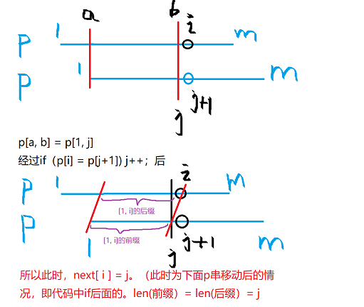
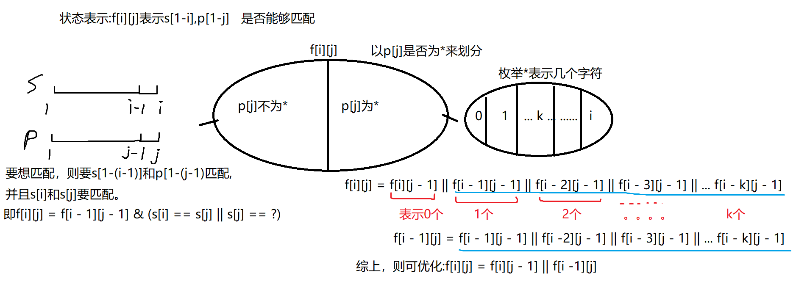

## LeetCode 精选 TOP 面试题（1）

### [1. 两数之和](https://leetcode-cn.com/problems/two-sum/)

**思路**

**(暴力枚举)** $O(n^2)$

两重循环枚举下标` i,j`，然后判断 `nums[i]+nums[j]` 是否等于 `target`。

**(哈希表)** $O(n)$

使用C++中的哈希表`unordered_map<int, int> hash`

- 用哈希表存储前面遍历过的数，当枚举到当前数时，若哈希表中存在`target - nums[i]`的元素，则表示已经找到符合条件的两个数。
- 若不存在`target - nums[i]`的元素则枚举完当前数再把当前数放进哈希表中

**时间复杂度：**由于只扫描一遍，且哈希表的插入和查询操作的复杂度是 $O(1)$，所以总时间复杂度是 $O(n)$.

**c++代码**

```c++
class Solution {
public:
    vector<int> twoSum(vector<int>& nums, int target) {
        unordered_map<int, int> hash;
        for(int i = 0; i < nums.size(); i++){
            if(hash.count(target - nums[i])){
                return {i, hash[target - nums[i]]};
            }
            hash[nums[i]] = i;
        }
        return {};
    }
};
```

### [2. 两数相加](https://leetcode-cn.com/problems/add-two-numbers/)

**(模拟)**   

这是道模拟题，模拟我们小时候列竖式做加法的过程：

1. 从最低位至最高位，逐位相加，如果和大于等于`10`，则保留个位数字，同时向前一位进`1`。
2. 如果最高位有进位，则需在最前面补`1`。

**具体实现**

1. 同时从头开始枚举两个链表，将`l1`和`l2`指针指向的元素相加存到`t`中，再将`t % 10 `的元素存到`dummy`链表中，再`t / 10`去掉存进去的元素，`l1`和`l2`同时往后移动一格。
2. 当遍历完所有元素时，如果`t != 0`，再把`t`存入到`dummy`链表中。


做有关链表的题目， 有个常用技巧：添加一个虚拟头结点：`ListNode *head = new ListNode(-1)`;，可以简化边界情况的判断。

**时间复杂度：**由于总共扫描一遍，所以时间复杂度是 $O(n)$。

```c++
/**
 * Definition for singly-linked list.
 * struct ListNode {
 *     int val;
 *     ListNode *next;
 *     ListNode() : val(0), next(nullptr) {}
 *     ListNode(int x) : val(x), next(nullptr) {}
 *     ListNode(int x, ListNode *next) : val(x), next(next) {}
 * };
 */
class Solution {
public:
    ListNode* addTwoNumbers(ListNode* l1, ListNode* l2) {
        ListNode* dummy = new ListNode(-1);  //新建一个虚拟头节点
        ListNode* cur = dummy;
        int t = 0;  //存贮进位
        while(l1 || l2){
            if(l1)  t += l1->val, l1 = l1->next;
            if(l2)  t += l2->val, l2 = l2->next;
            cur = cur->next = new ListNode(t % 10);
            t /= 10;
        }
        if(t) cur->next = new ListNode(t);
        return dummy->next;
    }
};
```

### [3. 无重复字符的最长子串](https://leetcode-cn.com/problems/longest-substring-without-repeating-characters/)

**思路**

**(双指针扫描)** $O(n)$

定义两个指针 $i,j(i<=j)$，表示当前扫描到的子串是 $[i,j]$ (闭区间)。扫描过程中维护一个哈希表`unordered_map <chat,int>hash`，表示 $[i,j]$中每个字符出现的次数。

线性扫描时，每次循环的流程如下：

- 1.指针`j` 向后移一位, 同时将哈希表中 `s[j`] 的计数加一，即` hash[s[j]]++`;
- 2.假设 `j `移动前的区间 `[i,j]`​中没有重复字符，则 `j` 移动后，只有 `s[j]`可能出现`2`次。因此我们不断向后移动 `i`，直至区间 `[i,j]`中 `s[j]` 的个数等于`1`为止；
- 3.当确保`[i, j]`中不存在重复元素时，更新`res`；

**时间复杂度分析：**由于 `i`，`j` 均最多增加`n`次，且哈希表的插入和更新操作的复杂度都是 $O(1)$，因此，总时间复杂度 $O(n)$。

**c++代码**

```c++
class Solution {
public:
    int lengthOfLongestSubstring(string s) {
        unordered_map<char, int> hash;
        int res = 0;
        for(int i = 0, j = 0; j < s.size(); j++){
            hash[s[j]]++;
            while(i < s.size() && hash[s[j]] > 1)  hash[s[i++]]--;
            if(j - i + 1 > res){
                res = j - i + 1;
            }
        }
        return res;
    }
};
```

### [4. 寻找两个正序数组的中位数](https://leetcode-cn.com/problems/median-of-two-sorted-arrays/)

**思路**

**(递归)**   $O(log(n+m))$ 

找出两个正序数组的**中位数**等价于找出两个正序数组中的**第k小数**。如果两个数组的大小分别为`n`和`m ` ，那么第 `k = (n + m)/2` 小数就是我们要求的中位数。

**如何寻找第k小的元素？** 

**过程如下：**

1、考虑一般情况，我们在 `nums1`和`nums2`数组中各取前`k/2`个元素  


我们默认`nums1`数组比`nums2`数组的有效长度小 。`nums1`数组的有效长度从`i`开始，`nums2`数组的有效长度从`j`开始，其中`[i,si - 1]`是`nums1`数组的前`k / 2`个元素，`[j, sj - 1]`是`nums2`数组的前` k / 2`个元素。

2、接下来我们去比较`nums1[si - 1]`和`nums2[sj - 1]`的大小。

- 如果`nums1[si - 1] > nums2[sj - 1]` ，则说明 `nums1` 中取的元素过多，`nums2` 中取的元素过少。因此`nums2` 中的前 `k/2`个元素一定都小于等于第 `k` 小数，即`nums2[j,sj-1]`中元素。我们可以舍去这部分元素，在剩下的区间内去找第`k - k / 2`小的元素，也就是说第`k`小一定在`[i,n]`与`[sj,m]`中。
- 如果`nums1[si - 1] <= nums2[sj - 1]`，同理可说明`nums2`中的前 `k/2`个元素一定都小于等于第 `k` 小数，即`nums1[i,si-1]`中元素。我们可以舍去这部分元素，在剩下的区间内去找第`k - k / 2`小的元素，也就是说第`k`小一定在`[si,n]`与`[j,m]`中。

3、递归过程`2`，每次可将问题的规模减少一半，最后剩下的一个数就是我们要找的第`k`小数。 

**递归边界：** 

- 当`nums1`数组为空时，我们直接返回`nums2`数组的第`k`小数。
- 当`k == 1`时，且两个数组均不为空，我们返回两个数组首元素的最小值，即`min(nums1[i], nums2[j])`。

**奇偶分析：** 

- 当两个数组元素个数的总和`total`为偶数时，找到第`total / 2`小`left`和第`total / 2 + 1`小`right`，结果是`(left + right / 2.0)`。

- 当`total`为奇数时，找到第`total / 2 + 1`小，即为结果。

**时间复杂度分析：** $k=(m+n)/2$，且每次递归 $k$ 的规模都减少一半，因此时间复杂度是$O(log(m+n))$.

```c++
class Solution {
public:
    double findMedianSortedArrays(vector<int>& nums1, vector<int>& nums2) {
        int tot = nums1.size() + nums2.size();
        if(tot % 2 == 0){
            int left = find(nums1, 0, nums2, 0, tot / 2);
            int right =find(nums1, 0, nums2, 0, tot / 2 + 1);
            return (left + right) / 2.0;
        }else{
            return find(nums1, 0, nums2, 0, tot / 2 + 1);
        }
    }

    int find(vector<int>& nums1,int i, vector<int>& nums2, int j, int k){
        if(nums1.size() - i > nums2.size() - j) return find(nums2, j, nums1, i, k);
        if(k == 1){
            //当第一个数组已经用完
            if(i == nums1.size()) return nums2[j];
            else return min(nums1[i], nums2[j]);
        }
        //当nums1数组为空时，我们直接返回nums2数组的第k小数。
        if (nums1.size() == i) return nums2[j + k - 1];
        int si = min((int)nums1.size(), i + k / 2), sj = j + k - k / 2;
        if(nums1[si - 1] > nums2[sj - 1]){
            return find(nums1, i, nums2, sj, k - (sj - j));
        }else{
            return find(nums1, si, nums2, j, k - (si - i));
        }
    }
};
```

### [5. 最长回文子串](https://leetcode-cn.com/problems/longest-palindromic-substring/)

**思路**

**(双指针)** $O(n^2)$

- 1、枚举数组中的每个位置`i`，从当前位置开始向两边扩散
- 2、当回文子串的长度是奇数时，从`i - 1`,`i + 1`开始往两边扩散
- 3、当回文子串的长度是偶数时，从`i`，`i + 1`开始往两边扩散
- 4、找到以`i`为中心的最长回文子串的长度，若存在回文子串比以前的长，则更新答案。

**图示:**


**时间复杂度分析：**枚举数组中的每个位置`i`需要$O(n)$的时间复杂度，求回文子串需要$O(n)$的时间复杂度，因此总的时间复杂度为$O(n^2)$。

**c++代码**

```c++
class Solution {
public:
    // 中心扩散法
    string longestPalindrome(string s) {
        string res;
        for(int i = 0; i < s.size(); i++){
            int l = i - 1, r = i + 1;   //回文串长度为奇数
            while(l >= 0 && r <= s.size() && s[l] == s[r]) l--, r++;
            if(r - l - 1 > res.size()){
                res = s.substr(l + 1, r - l - 1);
            } 
            l = i, r = i + 1;   //回文串长度为偶数
            while(l >= 0 && r <= s.size() && s[l] == s[r]) l--, r++;
            if(r - l - 1 > res.size()){
                res = s.substr(l + 1, r - l - 1);
            } 
        }
        return res;
    }
};
```

### [7. 整数反转](https://leetcode-cn.com/problems/reverse-integer/)

**思路**

**(循环)**  $O(logn)$

依次从右往左计算出每位数字，然后逆序累加在一个整数中。

另外，这题有两点需要注意：

- 1、因为int型整数逆序后可能会溢出，所以我们要用`long long`记录中间结果；
- 2、在C++中，负数的取模运算和数学意义上的取模运算不同，结果还是负数，比如 `−12 % 10 = −2`，所以我们不需要对负数进行额外处理。

**时间复杂度分析：**一共有 $O(logn)$位，对于每一位的计算量是常数级的，所以总时间复杂度是 $O(logn)$.

**c++代码**

```c++
class Solution {
public:
    int reverse(int x) {
        long res = 0;
        while(x){
            res = res * 10 + x % 10;
            x /= 10;
        }
        if(res > INT_MAX || res < INT_MIN) return 0;
        return res;
    }
};
```

### [8. 字符串转换整数 (atoi)](https://leetcode-cn.com/problems/string-to-integer-atoi/)

**思路**

**(模拟)**  $O(n)$

- 1、初始化`k = 0 `，`isMinus = false`，从头开始遍历字符串`str`，首先跳过连续的空格。
- 2、如果遇到`'+'`，则`isMinus = false`，`k++`，否则如果遇到`'-'`，则`isMinus = true`, `k++`。
- 3、初始化`num = 0`，如果遇到数字，则直接将其与之后连续的数字字符组合起来，形成一个整数。
- 4、最后根据符号位`isMinus`来返回正确的整数。

**实现细节：**

如果`num`超出了`2^31 − 1`，则根据符号位`isMinus`返回 INT_MAX或者 INT_MIN。

**c++代码**

```c++
class Solution {
public:
    int myAtoi(string str) {
        int k = 0;
        while(k < str.size() && str[k] == ' ') k++;  //跳过连续的空格
        bool isMinus = false;
        if(str[k] == '+')      isMinus = false, k++;
        else if(str[k] == '-') isMinus = true, k++;
        long num = 0;
        while(k < str.size() && str[k] >= '0' && str[k] <= '9'){
            num = num * 10 + str[k++] - '0';
            if(num > INT_MAX) return isMinus ? INT_MIN : INT_MAX;
        }
        return isMinus ? -num : num;
    }
};
```

### [10. 正则表达式匹配](https://leetcode-cn.com/problems/regular-expression-matching/)

**思路**

**(动态规划)**  $O(nm)$

**状态表示：**`f[i][j]` 表示字符串` s` 的前 `i `个字符和字符串 `p` 的前` j` 个字符能否匹配。

**状态计算：**

根据`p[j]` 是什么来划分集合：

- 1、`p[j] != '*' ` ，即`p[j]`是字符, 看`p[j]` 和`s[i]`的关系。如果`p[j] == s[i]`，则需判断 `s`的前`i - 1`个字母 能否和`p`的前`j -1`个字母匹配 ，即`f[i][j] == f[i - 1][j - 1]`，不匹配 , 无法转移。
- 2    `P[j]` 是匹配符:
  - 如果`p[j] == '.' `，则`p[j]` 和 `s[j]`匹配 ，则需判断 `s`的前`i - 1`个字母能否和`p`的前`j -1`个字母匹配 ，即`f[i][j] == f[i - 1][j - 1]`。
  - `p[j] == '*'`，得看`p[j - 1]`和`s[i]`的关系。如果不匹配，即`p[j - 1] ！= s[i]`，那么`'*'`匹配`0`个`p[j - 1]`,则需判断 `s`的前`i`个字母 能否和`p`的前`j - 2`个字母匹配 ，即`f[i][j] == f[i][j - 2]`。如果匹配，即`p[j - 1] == s[i] || p[j - 1] == '.'`，则需判断`s`的前`i - 1`个字母能否和`p`的前`j`个字母匹配 ，即`f[i][j] == f[i - 1][j]) `。

---------------


**总结:**

```c++
f[i][j] == f[i - 1][j - 1], 前提条件为p[j] == s[i] || p[j] == '.'
f[i][j] == f[i][j - 2], 前提条件为p[j] == '*' &&  p[j - 1] != s[i]
f[i][j] == f[i - 1][j], 前提条件为p[j] == '*' && ( p[j - 1] == s[i] || p[j - 1] == '.'）
```

**c++代码**

```c++
class Solution {
public:
    bool isMatch(string s, string p) {
        int n = s.size(), m = p.size();
        s = ' ' +  s, p = ' ' + p;
        vector<vector<bool>> f(n + 1, vector<bool>(m + 1));
        f[0][0] = true;
        for(int i = 0; i <= n; i++)
            for(int j = 1; j <= m; j++){
                if(j + 1 <= m && p[j + 1] == '*') continue;
                if(i &&p[j] != '*'){
                    f[i][j] = f[i - 1][j - 1] && (s[i] == p[j] || p[j] == '.');
                }else if(p[j] == '*'){
                    f[i][j] = f[i][j - 2] || i && f[i - 1][j] && (s[i] == p[j - 1] || p[j - 1] == '.');
                }
            }
        return f[n][m];    
    }
};
```

### [11. 盛最多水的容器](https://leetcode-cn.com/problems/container-with-most-water/)

**思路**

**(双指针扫描)**  $O(n)$

**过程如下：** 

1、定义两个指针`i`和`j`，分别表示容器的左右边界，初始化`i = 0`， `j = h.size() - 1`，容器大小为`min(i, j)*(j  - i)`。

2、遍历整个数组，若`h[i] < h[j]`，则`i++`，否则`j--`，每次迭代更新最大值。

**证明：** 

容器大小由短板决定, 移动长板的话, 水面高度不可能再上升, 而宽度变小了, 所以只有通过移动短板, 才有可能使水位上升。

**时间复杂度分析：** 两个指针总共扫描 $n$ 次，因此总时间复杂度是 $O(n)$。

**c++代码**

```c++
class Solution {
public:
    int maxArea(vector<int>& h) {
        int res = 0;
        for(int i = 0, j = h.size() - 1; i < j;){
            res = max(res, (j - i) * min(h[i], h[j]));
            if(h[i] < h[j]) i++;
            else j--;
        }
        return res;
    }
};
```

### [13. 罗马数字转整数](https://leetcode-cn.com/problems/roman-to-integer/)

**思路**

**(模拟)**   $O(n)$

- 1、定义一个哈希表，建立每个罗马字符到数字的映射。
- 2、从前往后遍历字符串，如果发现`s[i + 1]`表示的数字大于`s[i]`表示的数字，则结果减去`s[i]`，否则结果加上`s[i]`。

**时间复杂度分析：**  只遍历一次字符串，所以时间复杂度为$O(n)$。

**c++代码**

```c++
class Solution {
public:
    int romanToInt(string s) {
        unordered_map<char, int> hash;
        hash['I'] = 1; hash['V'] = 5;
        hash['X'] = 10;hash['L'] = 50;
        hash['C'] = 100; hash['D'] = 500;
        hash['M'] = 1000;
        int res = 0;
        for(int i = 0; i < s.size(); i++){
            if(i + 1 < s.size() && hash[s[i]] < hash[s[i + 1]]) res -= hash[s[i]];
            else res += hash[s[i]];
        }
        return res;
    }
};
```

### [14. 最长公共前缀](https://leetcode-cn.com/problems/longest-common-prefix/)

**思路**

**(字符串)**   

- 1、我们以第一个字符串为基准，枚举第一个字符串的每一位。
- 2、遍历整个字符串数组，让其他字符串的每一位同第一个字符串做比较，如果不相等或者到达了其他字符串终点，则直接返回结果。
- 3、否则说明最长公共前缀可以扩展，结果加上第一个字符串的当前位。

**c++代码**

```c++
class Solution {
public:
    string longestCommonPrefix(vector<string>& strs) {
        string res;
        if(strs.empty()) return res;
        string str1 = strs[0];
        for(int i = 0; i < str1.size(); i++){
            for(string str : strs){
                if(i >= str.size() || str[i] != str1[i]) return res;
            }
            res += str1[i];
        }
        return res;
    }
};
```

### [15. 三数之和](https://leetcode-cn.com/problems/3sum/)

**思路**

**(排序 + 双指针）** $O(n^2)$

- 1、将整个`nums`数组按从小到大排好序
- 2、枚举每个数，表示该数`nums[i]`已被确定，在排序后的情况下，通过双指针`l`，`r`分别从左边`l = i + 1`和右边`r = n - 1`往中间靠拢，找到`nums[i] + nums[l] + nums[r] == 0`的所有符合条件的搭配
- 3、在找符合条件搭配的过程中，假设`sum = nums[i] + nums[l] + nums[r]`
  若`sum > 0`，则`r`往左走，使`sum`变小
  若`sum < 0`，则`l`往右走，使`sum`变大
  若`sum == 0`，则表示找到了与`nums[i]`搭配的组合`nums[l]`和`nums[r]`，存到`ans`中
- 4、判重处理
  确定好`nums[i]`时，`l `需要从`i + 1`开始
  当`nums[i] == nums[i - 1]`，表示当前确定好的数与上一个一样，需要直接跳过
  当找符合条件搭配时，即`sum == 0`,需要对相同的`nums[l]`和`nums[r]`进行判重处理

**时间复杂度分析：**  $O(n^2)$。

**c++代码**

```c++
class Solution {
public:
    vector<vector<int>> threeSum(vector<int>& nums) {
        int n = nums.size();
        vector<vector<int>> res;
        sort(nums.begin(), nums.end());
        for(int i = 0; i < n; i++){
            if(i && nums[i] == nums[i - 1]) continue;
            int l = i + 1, r = n - 1;
            while(l < r){
                int sum = nums[i] + nums[l] + nums[r];
                if(sum < 0) l++;
                else if(sum > 0) r--;
                else {
                    res.push_back({nums[i], nums[l], nums[r]});
                    do l++; while(l < n && nums[l] == nums[l - 1]);
                    do r--; while(r >= 0 && nums[r] == nums[r + 1]);
                }
            }
        }
        return res;
    }
};
```

### [17. 电话号码的字母组合](https://leetcode-cn.com/problems/letter-combinations-of-a-phone-number/)

**(回溯，哈希，组合排列)**    $O(4^n)$ 

对于字符串`23`来说，递归搜索树如下图所示：


**递归函数设计：**

```c++
void dfs(string& digits, int u, string path) {
```

`digits`字符串数组，`u`表示枚举到`digitis`的第`u`个位置，`path`用来记录路径。

**解题过程如下：**

1、将数字到字母的映射到哈希表中。

2、递归搜索每个数字对应位置可以填哪些字符，这里我们从哈希表中查找，并将其拼接到`path`后。

3、当`u == digits.size() `时，表示搜索完一条路径，将其加入答案数组中。

**时间复杂度分析：** 一个数字最多有`4`种情况，假设有`n`个数字，因此`4^n`种情况是一个上限，因此时间复杂度是$O(4^n)$。

**c++代码**

```c++
class Solution {
public:
    vector<string> res;
    string strs[10] = {
        "", "","abc", "def",
        "ghi", "jkl", "mno",
        "pqrs", "tuv", "wxyz"
    };
    vector<string> letterCombinations(string digits) {
        if(!digits.size()) return res;
        dfs(digits, 0, "");
        return res;
    }

     void dfs(string digits, int u, string path){
        if(u == digits.size()){
            res.push_back(path);
            return ;
        }
        for(char c : strs[digits[u] - '0']){  //映射
            dfs(digits, u + 1, path + c);
        }
    }
};
```

### [19. 删除链表的倒数第 N 个结点](https://leetcode-cn.com/problems/remove-nth-node-from-end-of-list/)

**思路**

**(双指针)**   $O(n)$

**具体过程如下：**

1、创建虚拟头节点`dummy`，并让`dummy->next = head`。

2、创建快指针`first`和慢指针`second`，并让其都指向`dummy`。

3、先让快指针`first`走`n + 1`步，而后`first`，`second`指针同时向后走，直到`first`指针指向空节点，此时`second` 指向节点的下一个节点就是需要删除的节点，将其删除。

4、最后返回虚拟头节点的下一个节点。

**解释：**

始终保持两个指针之间间隔 `n` 个节点，在 `first` 到达终点时，`second` 的下一个结点就是倒数第 `n`个节点。


**时间复杂度分析：** 只遍历一次链表，因此时间复杂度为$O(n)$。

**c++代码**

```c++
/**
 * Definition for singly-linked list.
 * struct ListNode {
 *     int val;
 *     ListNode *next;
 *     ListNode() : val(0), next(nullptr) {}
 *     ListNode(int x) : val(x), next(nullptr) {}
 *     ListNode(int x, ListNode *next) : val(x), next(next) {}
 * };
 */
class Solution {
public:
    ListNode* removeNthFromEnd(ListNode* head, int n) {
        ListNode* dummy = new ListNode(-1);
        dummy->next = head;
        ListNode* first = dummy;
        ListNode* second = dummy;
        for(int i = 0; i <= n; i++) first = first->next;
        while(first){
            first = first->next;
            second = second->next;
        }
        second->next = second->next->next;
        return dummy->next;
    }
};
```

### [20. 有效的括号](https://leetcode-cn.com/problems/valid-parentheses/)	

**思路**

**(栈)** $O(n)$

定义一个栈，从前往后枚举每个字符：

- 1、当遇到`'('`,`'{'`,`'['`左括号时，将元素压进栈中
- 2、当遇到`')'`,`']'`,`'}'`右括号时，
  - 如果栈不为空并且栈顶元素是对应的左括号，说明这是匹配的符号，将栈顶元素`pop`出即可。
  - 否则，表示不匹配，`return false`。

- 3、最后，若栈是空栈，表示所有字符都已经匹配好了，若不是空栈，表示还存在未能匹配好的子符 

**时间复杂度分析：** 每个字符最多进栈出栈一次，因此时间复杂度为$O(n)$。

**c++代码**

```c++
class Solution {
public:
    bool isValid(string s) {
        stack<int> stk;
        for(int i = 0; i < s.size(); i++){
            if(s[i] == '(' || s[i] == '{' || s[i] == '[') stk.push(s[i]);
            else if(s[i] == ')'){
                if(!stk.empty() && stk.top() == '(') stk.pop();
                else return false;
            }
            else if(s[i] == '}'){
                if(!stk.empty() && stk.top() == '{') stk.pop();
                else return false;
            }
            else if(s[i] == ']'){
                if(!stk.empty() && stk.top() == '[') stk.pop();
                else return false;
            }
        }
        return stk.empty();
    }
};
```

### [21. 合并两个有序链表](https://leetcode-cn.com/problems/merge-two-sorted-lists/)

**思路**

**(线性合并)** $O(n)$ 

**解题过程如下：** 

1.    新建虚拟头节点 `dummy`，定义 `cur`指针并使其指向 `dummy`。
2.    当` l1` 或 `l2` 都不为为空时：
      - 若`l1->val < l2->val`，则令 `cur` 的 `next` 指针指向` l1`且 `l1`后移； 
      - 若`l1->val >=l2->val`，则令 `cur` 的 `next` 指针指向` l2`且 `l2`后移； 
      - `cur`后移一步；
3.    将剩余的 `l1` 或 `l2` 接到 `cur` 指针后边。
4.    最后返回`dummy->next`。

**时间复杂度分析：**  $O(n)$ 

**c++代码**

```c++
/**
 * Definition for singly-linked list.
 * struct ListNode {
 *     int val;
 *     ListNode *next;
 *     ListNode() : val(0), next(nullptr) {}
 *     ListNode(int x) : val(x), next(nullptr) {}
 *     ListNode(int x, ListNode *next) : val(x), next(next) {}
 * };
 */
class Solution {
public:
    ListNode* mergeTwoLists(ListNode* l1, ListNode* l2) {
        ListNode* dummmy = new ListNode(-1);
        ListNode* cur = dummmy;
        while(l1 && l2){
            if(l1->val < l2->val){
                cur->next = l1;
                l1 = l1->next;
            }else{
                cur->next = l2;
                l2 = l2->next;
            } 
            cur = cur->next;
        }
        if(l1) cur->next = l1;
        if(l2) cur->next = l2;
        return dummmy->next;
    }
};
```

### [22. 括号生成](https://leetcode-cn.com/problems/generate-parentheses/)

**思路**

**(dfs)**  $O(C_{2n}^{n})$ 

首先我们需要知道一个结论，一个合法的括号序列需要满足两个条件：

- 1、左右括号数量相等 
- 2、任意前缀中左括号数量 `>=` 右括号数量  （也就是说每一个右括号总能找到相匹配的左括号）


题目要求我们生成`n`对的合法括号序列组合，可以考虑使用深度优先搜索，将搜索顺序定义为枚举序列的每一位填什么，那么最终的答案一定是有`n`个左括号和`n`个右括号组成。

**如何设计`dfs`搜索函数？** 

最关键的问题在于搜索序列的当前位时，是选择填写左括号，还是选择填写右括号 ？因为我们已经知道合法的括号序列任意前缀中左括号数量一定 `>=` 右括号数量，因此，如果左括号数量不大于 `n`，我们可以放一个左括号，等待一个右括号来匹配 。如果右括号数量小于左括号的数量，我们可以放一个右括号，来使一个右括号和一个左括号相匹配。 

**递归树如下：** 


**递归函数设计**

```c++
void dfs(int n ,int lc, int rc ,string str)
```

`n`是括号对数，`lc`是左括号数量，`rc`是右括号数量，`str`是当前维护的合法括号序列。

**搜索过程如下：** 

- 1、初始时定义序列的左括号数量`lc` 和右括号数量`rc`都为`0`。
- 2、如果 `lc < n`，左括号的个数小于`n`，则在当前序列`str`后拼接左括号。
- 3、如果 `rc < n && lc > rc` , 右括号的个数小于左括号的个数，则在当前序列`str`后拼接右括号。
- 4、当`lc == n && rc == n` 时，将当前合法序列`str`加入答案数组`res`中。 

**时间复杂度分析：**经典的卡特兰数问题，因此时间复杂度为  $O(\frac{1}{n+1}C_{2n}^{n}) = O(C_{2n}^n)$ 。

**c++代码**

```c++
class Solution {
public:
    vector<string> res;
    vector<string> generateParenthesis(int n) {
        dfs(n, 0, 0, "");
        return res;
    }

    void dfs(int n, int lc, int rc, string path){
        if(lc == n && rc == n){
            res.push_back(path);
            return ;
        }
        if(lc < n) dfs(n, lc + 1, rc, path + '(');
        if(rc < n && lc > rc) dfs(n, lc, rc + 1, path + ')'); 
    }
};
```

### [23. 合并K个升序链表](https://leetcode-cn.com/problems/merge-k-sorted-lists/)

**思路**

**(优先队列）**  $O(nlogk)$

我们可以通过双路归并合并两个有序链表，但是这题要求对多个链表进行并操作。 其实和双路归并思路类似，我们分别用指针指向该链表的头节点，每次找到这些指针中值最小的节点，然后依次连接起来，并不断向后移动指针。

**如何找到一堆数中的最小值？**

用小根堆维护指向`k`个链表当前元素最小的指针，因此这里我们需要用到优先队列，并且自定义排序规则，如下：

```c++
struct cmp{ //自定义排序规则
    bool operator() (ListNode* a, ListNode* b){
        return a->val > b->val;  // val值小的在队列前
    }
};
```

**具体过程如下：** 

- 1、定义一个优先队列，并让`val`值小的元素排在队列前。
- 2、新建虚拟头节点`dummy`，定义 `cur`指针并使其指向 `dummy`。
- 3、首先将`k`个链表的头节点都加入优先队列中。

- 4、当队列不为空时：
  - 取出队头元素`t`（队头即为`k`个指针中元素值最小的指针）;
  - 令`cur` 的 `next` 指针指向`t`，并让`cur`后移一位；
  - 如果`t`的`next`指针不为空，我们将`t->next`加入优先队列中；
- 5、最后返回`dummy->next`。

**时间复杂度分析：**  $O(nlogk)$，$n$表示的是所有链表的总长度，$k$表示$k$个排序链表。

**c++代码**

```c++
/**
 * Definition for singly-linked list.
 * struct ListNode {
 *     int val;
 *     ListNode *next;
 *     ListNode() : val(0), next(nullptr) {}
 *     ListNode(int x) : val(x), next(nullptr) {}
 *     ListNode(int x, ListNode *next) : val(x), next(next) {}
 * };
 */
class Solution {
public:

    struct cmp{   //自定义排序规则
        bool operator()(ListNode* a, ListNode * b){
            return a->val > b->val;  //元素值小的在前面
        }
    };
    ListNode* mergeKLists(vector<ListNode*>& lists) {
        if(lists.empty()) return nullptr;
        priority_queue<ListNode*, vector<ListNode*>, cmp> heap;
        for(auto l : lists) if(l) heap.push(l);
        ListNode* dummmy = new ListNode(-1);
        ListNode* cur = dummmy;
        while(heap.size()){
            auto t = heap.top();
            heap.pop();
            cur = cur->next = t;
            if(t->next) heap.push(t->next);
        }
        return dummmy->next;
    }
};
```

### [26. 删除有序数组中的重复项](https://leetcode-cn.com/problems/remove-duplicates-from-sorted-array/)

**思路1**

取第一个数或者只要当前数和前一个数不相等，我们就取当前数（重复元素取最后一个）。

**c++代码1**

```c++
class Solution {
public:
    int removeDuplicates(vector<int>& nums) {
        int k = 0;
        for(int i = 0; i < nums.size(); i++){
            if(!i || nums[i] != nums[i - 1])
                nums[k++] = nums[i];
        }
        return k;
    }
};
```

**思路2** 

双指针，重复的一段元素我们只取第一个。

**c++代码2**

```c++
class Solution {
public:
    int removeDuplicates(vector<int>& nums) {
        int n = nums.size(), k = 0;
        for(int i = 0, j = 0; i <n; i++){
            j = i;
            while(j < n && nums[i] == nums[j]) j++;
            nums[k++] = nums[i];
            i = j - 1;
        }
        return k;
    }
};
```

### [28. 实现 strStr()](https://leetcode-cn.com/problems/implement-strstr/)

**思路**

**(KMP)**    $O(n+m)$

- 1、`next[i]`记录子串`ha[1, 2, , , i - 1, i]`的最长相等前后缀的前缀最后一位下标，或者说是子串的最长相等前后缀的长度。
- 2、预处理出`next`数组。
- 3、遍历字符串`ha`：
  - 当`ha`字符串和`ne`字符串发生失配时，根据`next`数组回退到其他位置。
  - 当匹配`ne`字符串的终点时，用匹配终点`i`减去字符串`ne`的长度`m`即是答案。



**时间复杂度分析：** KMP 算法的时间复杂度为 $O(n+m)$。

**c++代码**

```c++
class Solution {
public:
    int strStr(string ha, string ne) {
        int n = ha.size(), m = ne.size();
        if(m == 0) return 0;
        vector<int> next(m + 1);
        ha = ' ' + ha ,ne = ' ' + ne;
        for(int i = 2, j = 0; i <= m; i++){
            while(j && ne[i] != ne[j + 1]) j = next[j];
            if(ne[i] == ne[j + 1]) j++;
            next[i] = j;
        }
        for(int i = 1, j = 0; i <= n; i++){
            while(j && ha[i] != ne[j + 1]) j = next[j];
            if(ha[i] == ne[j + 1]) j++;
            if(j == m){
                return i - m;
            }
        }
        return -1;
    }
};
```

### [29. 两数相除](https://leetcode-cn.com/problems/divide-two-integers/)

**思路**

**(二进制，贪心)** 

由$ x/y = k$ ,我们不难想到除法的本质：$x -y - y - y - y .....= 余数$，其中减了`k`次`y`，如果极端的情况`x`为`int`的最大值，`y`为`1`，则会减$10^9$次，超时。  ​ 

**利用快速幂的思想:**

$x/y = k$，将$k$看成二进制表示，并且将$y$移到右边，则有:

$x=y∗k$

$x=y∗(2^0 + 2^1+2^3+…+2^i)$ 

$x=y + y∗2^1+y∗2^3+…+2^i$  

**具体过程如下：** 

- 1、当`x == INT_MIN && y == -1 ` ，此时会发生溢出，我们直接返回`INT_MAX`。
- 2、初始化`flag = false`，根据`x`和`y`的正负关系，确定结果的正负号。
- 3、`x / y = t`，则`x = t * y + 余数`， 将`y, 2y, 4y,,,2ny`的所有小于`x`的数存入`exp`数组中，`exp`数组元素从小到大排列。
- 4、从`exp`数组末端开始枚举，如果`a >= exp[i]`，则表示`t`中包含`1 << i`这个数，将`2^i`加入`res`中，并更新`a -= exp[i]`。

**c++代码**

```c++
class Solution {
public:
    int divide(int x, int y) {
        if(x == INT_MIN && y == -1) return INT_MAX;
        bool flag = false;
        if(x > 0 && y < 0 || x < 0 && y > 0)  flag = true;
        vector<long> exp;  //存贮商
        long a = abs((long)x), b = abs((long)y);
        for(long i = b; i <= a; i = i + i){
            exp.push_back(i);
        }
        long res = 0;
        for(int i = exp.size() - 1; i >= 0; i--){
            if(a >= exp[i]){
                res += (long)1 << i;
                a -= exp[i];
            }
        }
        if(flag)   res = -res;
        return res;
    }
};
```

### [33. 搜索旋转排序数组](https://leetcode-cn.com/problems/search-in-rotated-sorted-array/)

**思路**

**(二分)** $O(logn)$


1、先找到旋转点，在旋转点左边的点都大于等于`nums[0]`，右边的点都小于`nums[0]`，因此可以用二分找到该旋转点，即二分`>= nums[0]`的最右边界。

- 当`nums[mid] >= nums[0] `时，往右边区域找，`l = mid`。

- 当`nums[mid] < nums[0]`时，往左边区域找，`r = mid - 1`。

  

2、找到旋转点`l`后，可以知道`[0,l]`,`[l + 1, n - 1]`是两个有序数组，判断出`target`的值在哪个有序数组中，确定好二分的区间`[l,r]` 。

- 当`target >= nums[0]`，说明`target`在`[0, l]`区间内，我们令`l = 0`，`r`保持不变。
- 否则，说明`target`在`[l + 1, n - 1]`区间内，我们令`l = r + 1`，`r = n - 1`。

3、在`[l,r]`区间中，由于该区域也具有单调性，通过二分找到该值的位置，即二分` >= target`的最左边界

- 当`nums[mid] >= target`时，往左边区域找，`r = mid`。

- 当`nums[mid] < target`时， 往右边区域找, `l = mid + 1`。

  

4、若最后找到的元素`nums[r] != target`，则表示不存在该数，返回`-1`，否则返回该数值。

**时间复杂度分析：**  二分的时间复杂度为 $O(logn)$ 

**c++代码**

```c++
class Solution {
public:
    int search(vector<int>& nums, int target) {
        int l = 0, r = nums.size() - 1;
        while(l < r){
            int mid = (l + r + 1) / 2;
            if(nums[mid] >= nums[0]) l = mid;
            else r = mid - 1;
        }
        if(target >= nums[0]) l = 0;
        else l = r + 1, r = nums.size() - 1;
        while(l < r){
            int mid = (l + r) / 2;
            if(nums[mid] >= target) r = mid;
            else l = mid + 1;
        }
        if(nums[r] == target) return r;
        else return -1;
    }
};
```

### [34. 在排序数组中查找元素的第一个和最后一个位置](https://leetcode-cn.com/problems/find-first-and-last-position-of-element-in-sorted-array/)

**思路**

**(二分)**  $O(logn)$ 

两次二分，第一次二分查找第一个`>=target`的位置，第二次二分查找最后一个`<=target`的位置。查找成功则返回两个位置下标，否则返回`[-1,-1]`。

**第一次**

- 1、二分的范围，`l = 0`， `r = nums.size() - 1`，我们去二分查找`>=target`的最左边界。

- 2、当`nums[mid] >= target`时，往左半区域找，`r = mid`。

  

- 3、当`nums[mid] < target`时，  往右半区域找，`l = mid + 1`。

  

- 4、如果` nums[r] != target`，说明数组中不存在目标值 `target`，返回 `[-1, -1]`。否则我们就找到了第一个`>=target`的位置`L`。

**第二次**

- 1、二分的范围，`l = 0`， `r = nums.size() - 1`，我们去二分查找`<=target`的最右边界。

- 2、当`nums[mid] <= target`时，往右半区域找，`l = mid`。

  

- 3、当`nums[mid] > target`时，  往左半区域找，`r = mid - 1`。 

  

- 4、找到了最后一个`<=target`的位置`R`，返回区间`[L,R]`即可。

**时间复杂度分析：** 两次二分查找的时间复杂度为 $O(logn)$。

**c++代码**

```c++
class Solution {
public:
    vector<int> searchRange(vector<int>& nums, int target) {
        if(!nums.size())   return {-1, -1};
        int l = 0, r = nums.size() - 1;
        while(l < r){
            int mid = (l + r) / 2;
            if(nums[mid] >= target) r = mid;
            else l = mid + 1;
        }
        if(nums[r] != target) return {-1, -1};
        int L = r;
        l = 0, r = nums.size() - 1;
        while(l < r){
            int mid = (l + r + 1) / 2;
            if(nums[mid] <= target)  l = mid;
            else r = mid - 1;
        }
        return {L, r};
    }
};
```

### [36. 有效的数独](https://leetcode-cn.com/problems/valid-sudoku/)

**思路**

**(哈希，数组)**  $O(n^2)$ 

判断每一行，每一列，每一九宫格是否存在重复的元素

**c++代码**

```c++
class Solution {
public:
    bool isValidSudoku(vector<vector<char>>& board) {
        bool st[9];  //标记数组
        
        //判断行
        for(int i = 0; i < 9; i++){
            memset(st, 0, sizeof(st));
            for(int j = 0; j < 9; j++){
                if(board[i][j] != '.'){
                    int t = board[i][j] - '1';
                    if(st[t]) return false;
                    st[t] = true;
                } 
            }
        }

        //判断列
         for(int i = 0; i < 9; i++){
            memset(st, 0,sizeof(st));
            for(int j = 0; j < 9; j++){
                if(board[j][i] != '.'){
                    int t = board[j][i] - '1';
                    if(st[t]) return false;
                    st[t] = true;
                } 
            }
        }

        //判断9宫格
        for(int i = 0; i < 9; i += 3)
            for(int j = 0; j < 9; j += 3){
                memset(st, 0, sizeof(st));
                for(int x = 0; x < 3; x++)
                    for(int y = 0; y < 3; y++)
                        if(board[i + x][j + y] != '.'){
                            int t = board[i + x][j + y] - '1';
                            if (st[t]) return false;
                            st[t] = true;
                        }
            }
        return true;   
    }     
};


```

### [38. 外观数列](https://leetcode-cn.com/problems/count-and-say/)

**思路**

**(双指针，模拟）**  $O(n^2)$ 

- 1、初始化字符串`s`为`1`，迭代`n - 1`次。
- 2、遍历字符串`s`，枚举每个字符`j`，`k`从`j`开始，找到字符`j`的连续区间`[j, k - 1]`，这段连续区间的字符个数为`k - j`，字符为`s[j]`，将**个数+字符**拼接到字符串`t`的后面，`j`继续从`k`位置开始枚举。
- 3、将字符串`s`更新为`t`。
- 4、最后返回`s`字符串。

**c++代码**

```c++
class Solution {
public:
    string countAndSay(int n) {
        string s = "1";//第一项就是规定好的1
        for (int i = 0; i < n - 1; i ++ ) {//求第n项，那么肯定要变换n - 1次
            string t;//每次新的项用t来表示
            for (int j = 0; j < s.size();) {//找前一段相同的数
                int k = j + 1;//k从j + 1开始找
                while (k < s.size() && s[k] == s[j]) k ++ ;//只要相同就一直往后找
                t += to_string(k - j) + s[j];//t就加上对应的个数
                j = k;//j移到下一个位置
            }
            s = t;//将s更新成t即可
        }

        return s;
    }
};
```

### [41. 缺失的第一个正数](https://leetcode-cn.com/problems/first-missing-positive/)

**思路**

**(桶排序）** $O(n)$ 

对于一个长度为 `n` 的数组，其中没有出现的最小正整数只能在`[1,n+1]`中。这是因为如果`[1,n]` 都出现了，那么答案是 `n+1`，否则答案是`[1,n]`中没有出现的最小正整数。

**我们使用桶排序的思想：**

- 1、数组长度是`n`，我们通过某种规律的交换恢复数组，使得,`nums[0] = 1`,`nums[1] = 2` … `nums[n - 1] = n` ，即恢复完的数组中的每个数都应满足`nums[i] = i + 1`，如果某个`nums[i]`不满足，说明数组中缺失该`i+1`数。以`[3, 4, -1, 1]` 为例：恢复后的数组应当为 `[1, -1, 3, 4]`，其中`nums[1] ! = 2 (1 + 1)`我们就可以知道缺失的数为` 2`。  

  

- 2、那么我们如何将数组进行恢复呢？我们发现数组的值`num[i]`和下标`i`有一定的关系，即`nums[i] == nums[nums[i]-1]`，下标`i == nums[i] - 1`。

- 3、因此我们可以对数组进行一次遍历。对于处在`[1,n]`之间的数`nums[i]`,如果其`nums[i] ！= nums[nums[i]-1]`，我们就将`nums[i]`,` nums[nums[i] - 1]`不断进行交换，直到`nums[i] == nums[nums[i]-1]`。

- 4、若存在不在`[1,n]`区间的数时，则表示该数一定会在原数组占空间，且占到不能被对应的位置上，因此从小到大枚举，若`nums[i] != i + 1`，则表示`i + 1`这个数是第一个缺失的正数，若都没有缺失，那么`n + 1`就是第一个缺失的正数。

**时间复杂度分析：** $O(n)$，` n`是数组的长度。

**空间复杂度分析：**  $O(1)$ 。

**c++代码**

```c++
class Solution {
public:
    int firstMissingPositive(vector<int>& nums) {
        int n = nums.size();
        for(int i = 0; i < n; i++)
        {
            while(nums[i] >= 1 && nums[i] <= n && nums[i] != nums[nums[i] - 1])
                swap(nums[i], nums[nums[i] - 1]);
        }

        for(int i = 0; i < n ; i++)
        {
            if( nums[i] != i + 1)
                return i + 1;
        }
        return n + 1;  
    }
};
```

### [42. 接雨水](https://leetcode-cn.com/problems/trapping-rain-water/)

**思路**

**(三次线性扫描)** $O(n)$

1、观察整个图形，考虑对水的面积按 **列** 进行拆解、 

2、注意到，每个矩形条上方所能接受的水的高度，是由它**左边最高的**矩形，和**右边最高的**矩形决定的。具体地，假设第` i `个矩形条的高度为 `height[i]`，且矩形条**左边最高的 **矩形条的高度为 `left_max[i]`，**右边最高的**矩形条高度为 `right_max[i]`，则该矩形条上方能接受水的高度为` min(left_max[i], right_max[i]) - height[i]`。


3、需要分别从左向右扫描求` left_max`，从右向左求 `right_max`，最后统计答案即可。

4、注意特判` n`为 `0`。

**时间复杂度分析：** 三次线性扫描，故只需要 $O(n)$ 的时间。

**空间复杂度分析：** 需要额外 $O(n)$的空间记录每个位置左边最高的高度和右边最高的高度。

**c++代码**

```c++
class Solution {
public:
    int trap(vector<int>& h) {
        int n = h.size();
        vector<int> left_max(n);  //每个柱子左边最大值
        vector<int> right_max(n); //每个柱子右边最大值
        left_max[0] = h[0];
        for(int i = 1; i < n; i++){
            left_max[i] = max(left_max[i - 1], h[i]);
        }
        right_max[n - 1] = h[n - 1];
        for(int i = n - 2; i >= 0; i--){
            right_max[i] = max(right_max[i + 1], h[i]);
        }
        int res = 0;
        for(int i = 0; i < n; i++){
            res += min(left_max[i], right_max[i]) - h[i];
        }
        return res;
    }
};
```

### [44. 通配符匹配](https://leetcode-cn.com/problems/wildcard-matching/)

**(动态规划)**  $O(n^2)$

**状态表示：**`f[i][j]` 表示字符串` s` 的前 `i `个字符和字符串 `p` 的前` j` 个字符能否匹配。

**状态计算：** 

`f[i][j]`如何计算？我们根据`p[j]` 是什么来划分集合： 

- `s[i] == p[j] || p[j] == '?'`，这时候是精准匹配，所以取决于`s`的前`i - 1`个字符和`p`的前`j - 1`个字符是否匹配。`f[i][j] = f[i - 1][j - 1];`

- `p[j] == '*'`，这个时候`*`可以代表空串或者任意多个字符。如果是空串，那么`f[i][j] = f[i][j - 1]`。
  如果不是空串，那么`f[i][j] = f[i - 1][j]`。这是因为`*`代表了任意多个字符，如果能匹配前`i - 1`个字符，那么就在`*`代表的字符串后面加上`s[i]`，就可以匹配前`i`个字符啦。

  

用`f[i][j]`表示到`i-1`,j-1的话总是要考虑加一减一的事，容易搞混。可以还用`f[i][j]`表示到i,j，只不过在两个字符串前面加上特殊字符表示空字符，不影响结果又方便初始化，而且不改变`f[i][j]`定义。

**c++代码**

```c++
class Solution {
public:
    bool isMatch(string s, string p) {
        int n = s.size(), m = p.size();
        s  = ' ' + s, p = ' ' + p;   //下标从1开始
        vector<vector<bool>> f(n + 1, vector<bool>(m + 1));
        f[0][0] = true;
        for(int i = 0; i <= n; i++){
            for(int j = 1; j <= m; j++){
                if(i && p[j] != '*') f[i][j] =  (s[i] == p[j] || p[j] == '?') && f[i - 1][j - 1];
                else if(p[j] == '*') f[i][j] = f[i][j - 1] || i && f[i - 1][j];
            }
        }
        return f[n][m];
    } 
};
```

### [46. 全排列](https://leetcode-cn.com/problems/permutations/)

**思路**

**(dfs)** $O(n×n!)$

**具体解题过程：** 

- 1、我们从前往后，一位一位枚举，每次选择一个没有被使用过的数。
- 2、选好之后，将该数的状态改成“已被使用”，同时将该数记录在相应位置上，然后递归下一层。
- 3、递归返回时，不要忘记将该数的状态改成“未被使用”，并将该数从相应位置上删除。

**辅助数组：**

```c++
vector<bool> st;          //标记数组
vector<int> path;         //记录路径
```

**递归函数设计：**

```c++
void dfs(vector<int>& nums, int u)
```

- `nums`是选择数组，`u`是当前正在搜索的答案数组下标位置。

**递归搜索树** 

我们以`1` ,`2` ,`3`为例：


**时间复杂度分析:**    $O(n×n!)$ ，总共$n!$种情况，每种情况的长度为$n$。

**c++代码**

```c++
class Solution {
public:
    vector<vector<int>> res;
    vector<bool> st;
    vector<int> path;
    vector<vector<int>> permute(vector<int>& nums) {
        st = vector<bool>(nums.size() + 1,false);
        dfs(nums, 0);
        return res;
    }
    
    void dfs(vector<int>& nums, int u){
        if(u == nums.size()){
            res.push_back(path);
            return ;
        }

        for(int i = 0; i < nums.size(); i++){
            if(!st[i]){
                st[i] = true;
                path.push_back(nums[i]);
                dfs(nums, u + 1);
                st[i] = false;
                path.pop_back();
            }
        }
    }
};    
```

