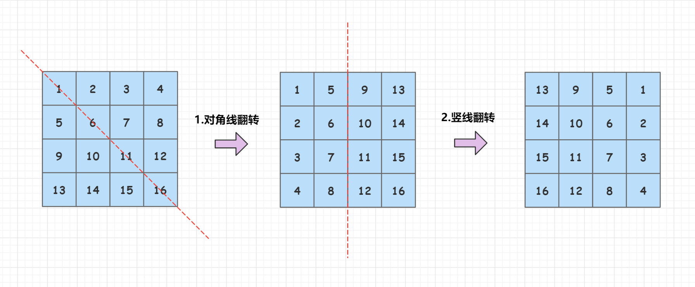
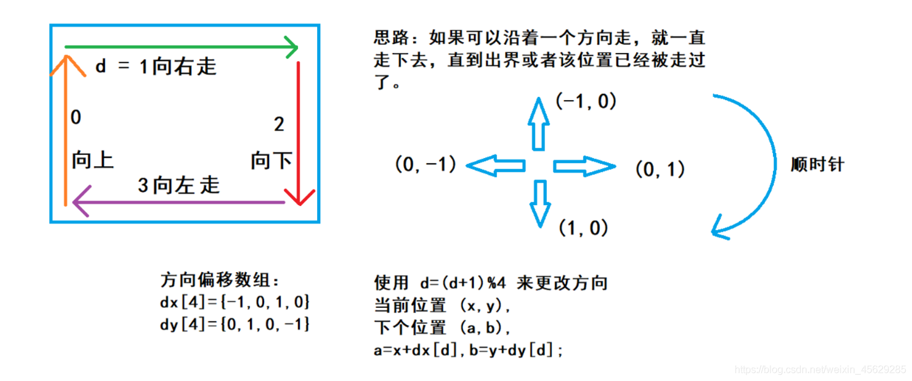
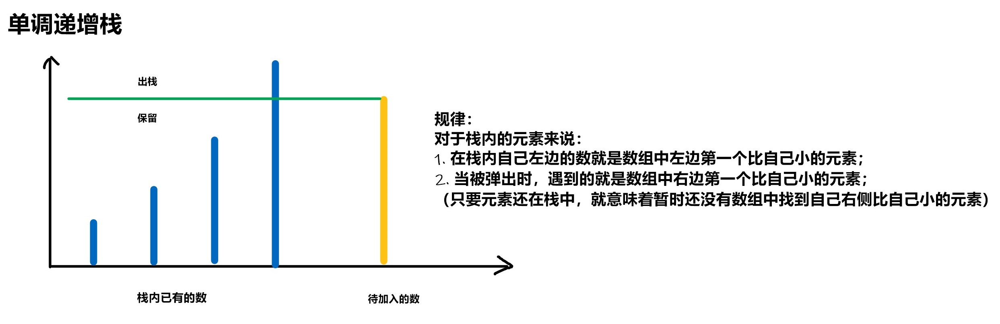

## LeetCode 精选 TOP 面试题（2）

### [48. 旋转图像](https://leetcode-cn.com/problems/rotate-image/)

**思路**

**(操作分解)** $O(n^2)$

我们对观察样例，找规律发现：先以**左上-右下对角条线**为轴做翻转，再以**中心的竖线**为轴做翻转，就可以顺时针翻转90度。



因此可以得出一个结论，顺时针90度应该是左上/右下对角线翻转+左右翻转，或者右上/左下对角线翻转+上下翻转。

**过程如下：** 

1. 先以左上-右下对角条线为轴做翻转；
2. 再以中心的竖线为轴做翻转；

**时间复杂度分析**：$O(n^2)$， 额外空间：$O(1)$ 。

**c++代码**

```c++
class Solution {
public:
    void rotate(vector<vector<int>>& matrix) {
        int n = matrix.size();
        for(int i = 0; i < n; i++)
            for(int j = 0; j < i; j++)
                swap(matrix[i][j], matrix[j][i]);
        for(int i = 0; i < n; i++)
            for(int j = 0, k = n - 1; j < k; j++, k--)
                swap(matrix[i][j], matrix[i][k]);
    }   
};
```

### [49. 字母异位词分组](https://leetcode-cn.com/problems/group-anagrams/)

**思路**

**(哈希 + 排序)**  $O(NLlogL)$

定义从`string` 映射到`vector<string>`的哈希表：`unordered_map<string, vector<string>>`。然后将每个字符串的所有字符从小到大排序，将排好序的字符串作为`key`，然后将原字符串插入`key`对应的`vector<string>`中。


**具体过程如下：**

- 1、定义一个`string` 映射到`vector<string>`的哈希表。

- 2、遍历`strs`字符串数组，对于每个字符串`str`:

  - 将`str`排序，作为哈希表的`key`值；

  - 将原`str`放入对应`key`值位置处；

- 3、最后遍历整个哈希表，将对应的`vector<string>`存入`res`中。

**时间复杂度分析：** 对于每个字符串，哈希表和`vector`的插入操作复杂度 $O(1)$，排序复杂度是 $O(LlogL)$。所以总时间复杂度是 $O(NLlogL)$。

**c++代码**

```c++
class Solution {
public:
    vector<vector<string>> groupAnagrams(vector<string>& strs) {
        unordered_map<string, vector<string>> hash;
        for(string str : strs){
            string nstr = str;
            sort(nstr.begin(), nstr.end());
            hash[nstr].push_back(str);
        }

        vector<vector<string>> res;
        for(auto item : hash){
            res.push_back(item.second);
        }

        return res;
    }
};
```

### [50. Pow(x, n)](https://leetcode-cn.com/problems/powx-n/)

**思路**

**(快速幂)**

- 1、初始化`is_minus = false`。
- 2、如果指数`n < 0`，则将指数`n`取正，并将`is_minus`记为`true`。
- 3、调用快速幂模板，指数减半，底数加倍。
- 4、如果`is_minus`为`true`，则返回`1 / res`，否则返回`res`。

**实现细节：**

- 为防止越界情况发生，定义`n`为`long`类型。

**c++代码**

```c++
class Solution {
public:
    double myPow(double x, long n) {
        bool is_minus = false;
        if(n < 0){
            n = -n;
            is_minus = true;
        }

        double res = 1;
        while(n){
            if(n & 1) res *= x;
            n >>= 1;
            x *= x;
        }

        return is_minus ? 1 / res : res;
    }
};
```

### [53. 最大子数组和](https://leetcode-cn.com/problems/maximum-subarray/)

**思路**

**(动态规划)**   $O(n)$

**状态表示：**`f[i]`表示以`nums[i]`为结尾的最大连续子数组和。

**状态计算：**

**如何确定`f[i]`的值？** 以`nums[i]`为结尾的连续子数组共分为两种情况：

- 只有`nums[i]`一个数，则`f[i] = nums[i]`；
- 以`nums[i]`为结尾的多个数，则`f[i] = f[i - 1] + nums[i]`。

两种情况取最大值，因此**状态转移方程为：**`f[i] = max(f[i - 1] + nums[i], nums[i])`。

**初始化：**

` f[0] = nums[0]`。

最后遍历每个位置的`f[i]`，然后其中的最大值即可。

**时间复杂度分析：** 只遍历一次数组，$O(n)$。

**c++代码**

```c++
class Solution {
public:
    int maxSubArray(vector<int>& nums) {
        int n = nums.size();
        vector<int> f(n + 1);
        f[0] = nums[0];
        int res = nums[0];
        for(int i = 1; i < n; i++){
            f[i] = max(f[i - 1] + nums[i], nums[i]);
            res = max(res, f[i]);
        }
        return res;
    }
};
```

### [54. 螺旋矩阵](https://leetcode-cn.com/problems/spiral-matrix/)

**思路**

**(模拟)**   $O(n * m)$

- 1、我们顺时针定义四个方向：上右下左。

  `d = 0`表示向上走，`d = 1`表示向右走，`d = 2`表示向下走，`d = 3`表示向左走。

- 2、使用`d=(d+1)%4`来更改方向当前位置`(x,y)`,下个位置`(a, b)`，`a=x+dx[d], b=y+dy[d]`。

- 3、从左上角开始遍历，先往右走，走到不能走为止，然后更改到下个方向，再走到不能走为止，依次类推，遍历 $n^2$ 个格子后停止。

**图示**



**时间复杂度分析：**   数组中的每个元素仅会被遍历一次，因此时间复杂度为$O(n * m)$。

**c++代码**

```c++
class Solution {
public:
    vector<int> spiralOrder(vector<vector<int>>& matrix) {
        vector<int> res;
        int n = matrix.size(), m = matrix[0].size();
        vector<vector<bool>> st(n + 1, vector<bool>(m + 1));
        int dx[4] = {-1, 0, 1, 0}, dy[4] = {0, 1, 0, -1};
        int x = 0, y = 0, d = 1;
        for(int i = 1; i <= n * m; i++){
            res.push_back(matrix[x][y]);
            st[x][y] = true;
            int a = x + dx[d], b = y + dy[d];
            if(a < 0 || a >= n || b < 0 || b >= m  || st[a][b]){
                d = (d + 1) % 4;
                a = x + dx[d], b = y + dy[d];
            }
            x = a, y = b;
        }
        return res;
    }
};
```

### [55. 跳跃游戏](https://leetcode-cn.com/problems/jump-game/)

**思路**

**(贪心)**  $O(n)$

从前往后遍历`nums`数组，记录我们能跳到的最远位置`j`，如果存在我们不能跳到的下标`i`，返回`false`即可，否则返回`true`。

**具体过程如下：** 

- 1、定义一个`j`变量用来记录我们可以跳到的最远位置，初始化`j = 0`。
- 2、遍历整个`nums[]`数组，`i`表示当前需要跳到的下标位置。
  - 若`j < i`，说明下标`i`不可达，则返回`false`；
  - 否则，说明`i`可达，则我们以`i`为起点更新可以跳到的最远位置`j`，即`j = max(j, i + nums[i])`；
- 3、如果可以遍历完整个数组，说明可以到达最后一个下标`i`，我们返回`true`。

**时间复杂度分析：**  只遍历一次数组，因此时间复杂度为$O(n)$。

**c++代码**

```c++
class Solution {
public:
    bool canJump(vector<int>& nums) {
        for(int i = 0, j = 0; i < nums.size(); i++){
            if(j < i)   return false;
            else j = max(j, i + nums[i]);
        }
        return true;
    }
};
```

### [56. 合并区间](https://leetcode-cn.com/problems/merge-intervals/)

**思路**

**(数组，排序)** $O(nlogn)$ 

1、将所有的区间按照左端点从小到大排序


2、定义区间左端点`l = a[0][0] `，右端点` r = a[0][1]`（等价于两个左右指针），我们从前往后遍历每个区间：

- 如果当前区间和上一个区间没有交集，也就是说当前区间的左端点`>`上一个区间的右端点，即`a[i][0] > r`，说明上一个区间独立，我们将上一个区间的左右端点`[l,r]`加入答案数组中，并更新左端点`l`，右端点`r`为当前区间的左右端点，即`l = a[i][0], r = a[i][1]`。

  **始终维持`l`和`r`为最新独立区间的左右端点。** 

  

- 如果当前区间和上一个区间有交集，即当前区间的左端点`<=`上一个区间的右端点，我们让左端点`l`保持不变，右端点`r`更新为`max(r,a[i][1])` ，进行区间的合并 。

  

3、最后再将最后一个合并或者未合并的独立区间`[l,r]`加入答案数组中。

**时间复杂度分析：** 遍历区间数组的时间为$O(n)$，对区间数组进行排序的时间复杂度为$O(nlogn)$ ,因此总的时间复杂度为$O(nlogn)$

**c++代码**

```c++
class Solution {
public:
    vector<vector<int>> merge(vector<vector<int>>& a) {
        vector<vector<int>> res;
        sort(a.begin(), a.end());
        int l = a[0][0], r = a[0][1];
        for(int i = 1; i < a.size(); i++){
            if(a[i][0] > r){
                res.push_back({l, r});
                l = a[i][0], r = a[i][1];
            }else{
                r = max(r, a[i][1]);
            }
        }
        res.push_back({l, r});
        return res;
    }
};
```

### [62. 不同路径](https://leetcode-cn.com/problems/unique-paths/)

**思路**

**(动态规划)**   $O(m*n)$ 

**状态表示：** `f[i,j]`表示从`(0,0)`走到`(i,j)`的所有不同路径的方案数。那么，`f[m-1][n-1]`就表示从网格左上角到网格右下角的所有不同路径的方案数，即为答案。

**状态转移：**    

 

由于限制了只能**向下走**或者**向右走**，因此到达`(i,j)`有两条路径 

- 从上方转移过来，`f[i][j] = f[i-1][j] `；
- 从左方转移过来，`f[i][j] = f[i][j-1] ` ;

因此，**状态计算方程为：** `f[i][j] = f[i-1][j] + f[i][j-1] ` ， 将向右和向下两条路径的方案数相加起来。

**初始化条件：** `f[0][0] = 1`，从`(0,0)`到达`(0,0)`只有一条路径。 

**分析图示：**   


**时间复杂度分析：** $O(m*n)$，其中  $m$和 $n$分别是网格的行数和列数 。

**c++代码**

```c++
class Solution {
public:
    int uniquePaths(int m, int n) {
        if(!n || !m) return 0;
        vector<vector<int>> f(m + 1, vector<int>(n + 1));
        f[0][0] = 1;
        for(int i = 0; i < m; i++)
            for(int j = 0; j < n; j++){
                if(!i && !j) continue;
                if(i)  f[i][j] += f[i - 1][j];
                if(j)  f[i][j] += f[i][j - 1];
            }
        return f[m - 1][n - 1];    
    }
};
```

### [66. 加一](https://leetcode-cn.com/problems/plus-one/)

**思路**

**(模拟)**  $O(n)$ 

模拟进位操作

**具体过程如下：**

- 1、为了便于计算，我们首先翻转`digits`数组，让数组低位存贮数字低位。
- 2、初始化`t = 1`，存贮进位，模拟加`1`操作。
- 3、遍历整个`digits`数组，让`t +=  digits[i]`，将`t % 10`存贮到`res`中，之后进行`t /= 10`操作。
- 4、如果`t != 0`，最后再将`t`加入`res`中。
- 5、最后将`res`数组翻转复原。

**c++代码**

```c++
class Solution {
public:
    vector<int> plusOne(vector<int>& digits) {
        reverse(digits.begin(), digits.end());
        int t = 1;
        vector<int> res;
        for(int i = 0; i < digits.size(); i++){
            t += digits[i];
            res.push_back(t % 10);
            t /= 10;
        }
        if(t) res.push_back(t);
        reverse(res.begin(), res.end());
        return res;
    }
};
```

### [69. Sqrt(x)](https://leetcode-cn.com/problems/sqrtx/)

**思路**

**(二分)**  $O(logn)$

直接二分查找

**具体过程如下：**

- 1、初始化`l = 0`，`r = x`，二分`mid * mid <= x`的最右边界。
- 2、如果`mid <= x / mid`，往右半区域找，`l = mid`。
- 3、否则，往左半区域找，`r = mid - 1`。
- 4、最后我们返回`r`。

**时间复杂度分析：**  二分的时间复杂度为$O(logn)$。

**c++代码**

```c++
class Solution {
public:
    int mySqrt(int x) {
        int l = 0, r = x;
        while(l < r){
            int mid = (l + r + 1ll) / 2;
            if(mid  <= x / mid)  l = mid;
            else r = mid - 1;
        }
        return r;
    }
};
```

### [70. 爬楼梯](https://leetcode-cn.com/problems/climbing-stairs/)

**思路**

**(递推)** $O(n)$

**分析题目可以发现：**

- 上 1 阶台阶：有1种方式。

- 上 2 阶台阶：有1+1和2两种方式。 

- 上 3 阶台阶：到达第3阶的方法总数就是到第1阶和第2阶的方法数之和。

- 上 n 阶台阶，到达第n阶的方法总数就是到第 (n-1) 阶和第 (n-2) 阶的方法数之和。 

因此，定义数组 `f[i]` 表示上`i` 级台阶的方案数，则枚举最后一步是上`1`级台阶，还是上`2`级台阶，所以有：
`f[i] = f[i−1]+f[i−2]`。  


**时间复杂度分析：**递推状态数$O(n)$，转移时间复杂度是 $O(1)$，所以总时间复杂度是 $O(n)$。 

**c++代码**

```c++
class Solution {
public:
    int climbStairs(int n) {
        if(n <= 2) return n;
        vector<int>f(n + 1);
        f[1] = 1;
        f[2] = 2;
        for(int i = 3; i <= n; i++)
            f[i] = f[i - 1] + f[i - 2];
        return f[n];    
    }
};
```

###  [73. 矩阵置零](https://leetcode-cn.com/problems/set-matrix-zeroes/)

**思路**

**(数组，哈希)**   $O(n^2)$


**具体过程如下：**

- 1、遍历整个矩阵，如果当前位置`matrix[i,j] == 0`，则在第`i`行的第一个元素，和第`j`列的第一个元素进行标记（绿色区域），表示第`i`行和第`j`列的所有元素都需要置换成`0`。
- 2、遍历`1 ~ n - 1`行，如果`matrix[i][0] == 0`，则将一整行元素置为`0`。
- 3、遍历`1 ~ m - 1`列，如果`matrix[0][j] == 0`，则将一整列元素置为`0`。
- 4、用`r0`标记第`0`行是否存在`0`的元素，用`c0`标记第`0`列是否存在`0`的元素，`1`表示不存在，`0`表示存在，最后若`r == 0`，把第`0`行全部置换成`0`，`c == 0`，把第`0`列全部置换成`0`。7

**时间复杂度分析：**   $O(n^2)$。

**c++代码**                     

```c++
class Solution {
public:
    void setZeroes(vector<vector<int>>& matrix) {
        int n = matrix.size(),  m = matrix[0].size();
        if(!n || !m) return ;
        int r0 = 1, c0 = 1;
        for(int i = 0; i < n; i++)
            for(int j = 0; j < m; j++){
                if(!matrix[i][j]){
                    if(i == 0) r0 = 0;
                    if(j == 0) c0 = 0;
                    matrix[i][0] = 0;
                    matrix[0][j] = 0;
                }
            }
        for(int i = 1; i < n; i++){
            if(!matrix[i][0])  
                for(int j = 0; j < m; j++)
                    matrix[i][j] = 0;
        }
        for(int j = 1; j < m; j++){
            if(!matrix[0][j])
                for(int i = 0; i < n; i++)
                    matrix[i][j] = 0;
        }

        if(!r0) for(int j = 0; j < m; j++)  matrix[0][j] = 0;
        if(!c0) for(int i = 0; i < n; i++)  matrix[i][0] = 0;
              
    }
};
```

### [75. 颜色分类](https://leetcode-cn.com/problems/sort-colors/)

**思路**

**(双指针)**  $O(n)$

类似于刷油漆。 


**时间复杂度分析：** 一次遍历，因此为$O(n)$。

**c++代码**

```c++
class Solution {
public:
    void sortColors(vector<int>& nums) {
        int j = 0, k = 0;
        for(int i = 0; i < nums.size(); i++){
            int num = nums[i];
            nums[i] = 2;
            if(num < 2)  nums[j++] = 1;
            if(num < 1)  nums[k++] = 0;
        }
    }
};
```

### [76. 最小覆盖子串](https://leetcode-cn.com/problems/minimum-window-substring/)

**思路**

**(滑动窗口)**  $O(n)$

这道题要求我们返回字符串` s`中包含字符串 `t` 的全部字符的最小窗口，我们利用滑动窗口的思想解决这个问题。因此我们需要两个哈希表，`hs`哈希表维护的是`s`字符串中滑动窗口中各个字符出现多少次，`ht`哈希表维护的是`t`字符串各个字符出现多少次。如果`hs`哈希表中包含`ht`哈希表中的所有字符，并且对应的个数都不小于`ht`哈希表中各个字符的个数，那么说明当前的窗口是**可行**的，可行中的长度最短的滑动窗口就是答案。 


**过程如下：** 

1、遍历`t`字符串，用`ht`哈希表记录`t`字符串各个字符出现的次数。 


2、定义两个指针`j`和`i`，`j`指针用于收缩窗口，`i`指针用于延伸窗口，则区间`[j,i]`表示当前滑动窗口。首先让`i`和`j`指针都指向字符串`s`开头，然后枚举整个字符串`s` ，枚举过程中，不断增加`i`使滑动窗口增大，相当于向右扩展滑动窗口。


3、每次向右扩展滑动窗口一步，将`s[i]`加入滑动窗口中，而新加入了`s[i]`，相当于滑动窗口维护的字符数加一，即`hs[s[i]]++`。 


4、对于新加入的字符`s[i]`,如果`hs[s[i]] <= ht[s[i]]`，说明当前新加入的字符`s[i]`是必需的，且还未到达字符串`t`所要求的数量。因此我们还需要事先定义一个`cnt`变量， `cnt`维护的是`s`字符串`[j,i]`区间中满足`t`字符串的元素的个数，记录相对应字符的总数。新加入的字符`s[i]`必需，则`cnt++`。

5、我们向右扩展滑动窗口的同时也不能忘记收缩滑动窗口。因此当`hs[s[j]] > ht[s[j]`时，说明`hs`哈希表中`s[j]`的数量多于`ht`哈希表中`s[j]`的数量，此时我们就需要向右收缩滑动窗口，`j++`并使`hs[s[j]]--`，即`hs[s[j ++ ]] --`。

6、当`cnt == t.size`时，说明此时滑动窗口包含符串 `t` 的全部字符。我们重复上述过程找到最小窗口即为答案。 


**时间复杂度分析：** 两个指针都严格递增，最多移动 $n$ 次，所以总时间复杂度是 O(n)。

**c++代码**

```c++
78. 子集class Solution {
public:
    string minWindow(string s, string t) {
        unordered_map<char, int> hs, ht;
        for(char c : t)  ht[c]++;
        int cnt = 0;
        string res;
        for(int i = 0, j = 0; i < s.size(); i++){
            hs[s[i]]++;
            if(hs[s[i]] <= ht[s[i]]) cnt++;
            while(hs[s[j]] > ht[s[j]])  hs[s[j++]]--;
            if(cnt == t.size()){
                if(res.empty() || i - j + 1 < res.size())
                    res = s.substr(j, i - j + 1);
            }
        }
        return res;
    }
};
```

### [78. 子集](https://leetcode-cn.com/problems/subsets/)

**思路1**

**(二进制)**  $O(2^nn)$ 

对于一个大小为`n`的数组`nums`来说，由于每个数有**选**和**不选**两种情况，因此总共有 $2^n$ 种情况。我们用`n`位二进制数 $0$ 到 $2^n-1$ 表示每个数的选择状态情况，在某种情况`i`中，若该二进制数`i`的第`j`位是`1`，则表示`nums`数组第`j`位这个数选，我们将`nums[j]`加入到`path`中，枚举完`i`这种情况，将`path`加入到`res`中 。

例如对于集合`[1, 2, 3]`

| 0/1序列 | 表示集合  | 对应的二进制数 |
| :-----: | :-------: | :------------: |
|   000   |    []     |       0        |
|   001   |    [3]    |       1        |
|   010   |    [2]    |       2        |
|   011   |  [2, 3]   |       3        |
|   100   |    [1]    |       4        |
|   101   |  [1, 3]   |       5        |
|   110   |  [1, 2]   |       6        |
|   111   | [1, 2, 3] |       7        |

**时间复杂度分析：**一共枚举 $2^n$ 个数，每个数枚举 $n$ 位，所以总时间复杂度是 $O(2^nn)$。

**c++代码1** 

```c++
class Solution {
public:
    vector<vector<int>> subsets(vector<int>& nums) {
        vector<vector<int>>res;
        int n = nums.size();
        for(int i = 0; i < 1<<n; i++)
        {
            vector<int>path;
            for(int j = 0; j < n; j++)
            {
                if(i>>j&1)
                    path.push_back(nums[j]);
            }
            res.push_back(path);
        }
        return res;
    }
};
```

**时间复杂度分析：** 一共枚举 $2^n$ 个数，每个数枚举 $n$ 位，所以总时间复杂度是 $O(2^nn)$。 

**思路2**

**(递归)**   $O(2^nn)$

一共`n`个位置，递归枚举每个位置的数 **选** 还是 **不选**，然后递归到下一层。

**递归函数设计**

- 递归参数：`void dfs(vector<int>& nums, int u)` ，第一个参数是`nums`数组，第二个参数是`u`，表示当前枚举到`nums`数组中的第`u`位。
- 递归边界：`u == nums.size()`，当枚举到第`nums.size()`位时，递归结束，我们将结果放到答案数组`res`中。

**时间复杂度分析：** 一共 $2^n$ 个状态，每种状态需要 $O(n)$ 的时间来构造子集。 

**c++代码2**

```c++
class Solution {
public:
    vector<vector<int>>res;
    vector<int>path;
    vector<vector<int>> subsets(vector<int>& nums) {
        dfs(nums,0);
        return res;
    }
    void dfs(vector<int>&nums,int u)
    {
        if( u == nums.size()) //递归边界
        {
            res.push_back(path);
            return;
        }
        dfs(nums,u+1);  //不选第u位，递归下一层
        path.push_back(nums[u]);
        dfs(nums,u+1);  //选第u位，递归下一层
        path.pop_back(); //回溯
    }
};
```

### [79. 单词搜索](https://leetcode-cn.com/problems/word-search/)

**(回溯)** $O(n^2 3^k)$ 

深度优先搜索，我们定义这样一种搜索顺序，即先枚举单词的起点，然后依次枚举单词的每个字母。在这个过程中需要将已经使用过的字母改成一个特殊字母，以避免重复使用字符。


**递归函数设计：**

```c++
bool dfs(vector<vector<char>>& board, string& word,int u,int x,int y)
```

`u`代表当前枚举到了目标单词`word`第`u`个位置。 

`x`，`y`是当前搜索到的二维字符网格的横纵坐标。 

**搜索过程如下：**

- 1、在二维字符网格中枚举每个单词的起点。
- 2、从该起点出发向四周搜索单词`word`，并记录此时枚举到单词`word`的第`u`个位置 ( `u`从`0`开始)。  
- 3、如果当前搜索的位置`(x,y)`的元素`board[x][y] == word[u]`,则继续向四周搜索。
- 4、直到枚举到单词`word`的最后一个字母返回`ture`，否则返回`false`。

**递归边界：** 

- 1、当搜索过程出现当前位置`board[x][y] != word[u]` ，说明当前路径不合法，返回`false`。
- 2、`u == word.size() - 1`,成功搜索到单词末尾，返回`true`。

**实现细节：** 

- 1、搜索过的位置继续搜索下一层时，需要对当前位置进行标识，表示已经搜索

- 2、可以使用偏移数组来简化代码。 

  

  

**时间复杂度分析：** 单词起点一共有 $n^2$ 个，单词的每个字母一共有上下左右四个方向可以选择，但由于不能走回头路，所以除了单词首字母外，仅有三种选择。所以总时间复杂度是  $O(n^2 3^k)$ 。 

**c++代码**

```c++
class Solution {
public:
    bool exist(vector<vector<char>>& board, string word) {
        for(int i = 0; i < board.size(); i++)
            for(int j = 0; j < board[i].size(); j++)
                if(dfs(board, word, 0, i, j))
                    return true;
        return false;            
    }
    int dx[4] = {-1, 0, 1, 0}, dy[4] = {0, 1, 0, -1};
    bool dfs(vector<vector<char>>& board, string word, int u, int x, int y){
        if(board[x][y] != word[u]) return false;
        if(u == word.size() - 1){
            return true;
        }
        char t = board[x][y];
        board[x][y] = '.';
        for(int i = 0; i < 4; i++){
            int a = x + dx[i], b = y + dy[i];
            if(a < 0 || a >= board.size() || b <0 || b >= board[0].size() || board[a][b] == '.') continue;
            if(dfs(board, word, u + 1, a, b))
                return true; 
        }
        board[x][y] = t;
        return false;
    }
};
```

### [84. 柱状图中最大的矩形](https://leetcode-cn.com/problems/largest-rectangle-in-histogram/)

**思路**

单调栈)**




对于每个柱子`i`，找到左边第一个比它小的柱子的位置`left[i]`，和找到右边第一个比它小的柱子的位置`right[i]`，`(right[i] - left[i] - 1) * heights[i]`是当前柱子所能找到的最大的矩形面积。

**c++代码**

```c++
class Solution {
public:
    int largestRectangleArea(vector<int>& h) {
        int n = h.size();
        vector<int> left(n), right(n);
        stack<int> stk;
        for(int i = 0; i < n; i++){
            while(stk.size() && h[stk.top()] >= h[i]) stk.pop();           if(stk.empty()) left[i] = -1;
            else left[i] = stk.top();
            stk.push(i);
        }

        stk = stack<int>();
        for(int i = n - 1; i >= 0; i--){
            while(stk.size() &&  h[stk.top()] >= h[i]) stk.pop();           if(stk.empty()) right[i] = n;
            else right[i] = stk.top();
            stk.push(i);
        }

        int res = 0;
        for(int i = 0; i < n; i++)
            res = max(res, (right[i] - left[i] - 1) * h[i]);
        return res;    
    }
};
```

### [88. 合并两个有序数组](https://leetcode-cn.com/problems/merge-sorted-array/)

**思路**

**思路1**

**(二路归并）**$O(n)$

- 1、新开一个数组`ans`用来存贮合并后的有序元素
- 2、定义两个指针`i`，和`j`分别指向`nums1`和`nums2`，每次将两个指针所指向的较小的数添加到`ans`中
- 3、将`ans`数组赋值给`num1`

**时间复杂度：**$O(n)$

**空间复杂度为：**由于新开了一个数组`ans`,因此空间复杂度为$O(n)$。

**代码1**

```c++
class Solution {
public:
    void merge(vector<int>& nums1, int m, vector<int>& nums2, int n) {
        vector<int> ans(n+m);
        int i = 0, j = 0 , t = 0;
        while( i < m && j < n)
        {
            if(nums1[i] <= nums2[j]) ans[t++] = nums1[i++];
            else ans[t++] = nums2[j++];
        }
        while( i < m) ans[t++] = nums1[i++];
        while( j < n) ans[t++] = nums2[j++];
        nums1 = ans;
    }
};
```

**思路2**

在上面**二路归并**算法中，需要临时一个构建一个数组，空间复杂度不是常数，通过观察题，没有充分利用题目所给的条件，`nums1`已经开够了足够大，如果直接在`nums1`上合并，便不需要额外的空间，而如果从前往后合并，则会覆盖元素得到错误结果，再通过观察，如果从后往前合并的方式，则不会覆盖，是理想的解法，时间$O(n)$，空间常数。

**步骤如下**

- 1、初始化`k = m + n - 1`
- 2、定义两个指针`i`，和`j`分别指向`nums1`和`nums2`，每次将两个指针所指向的较大的数放在`k`的位置，同时`i`或者`j` 和 `k`同时减`1`
- 3、如果`while(j >= 0)`再将`nums2`中剩余的数放入`nums1`中

**代码2**

```c++
class Solution {
public:
    void merge(vector<int>& nums1, int m, vector<int>& nums2, int n) {
        int k = m + n - 1;
        int i = m - 1,j = n - 1;
        while(i >= 0 && j >= 0)
        {
            if(nums1[i] >= nums2[j]) nums1[k --] = nums1[i --];
            else nums1[k --] = nums2[j --];
        }
        while(j >= 0) nums1[k --] = nums2[j --];
    }
};
```

### [91. 解码方法](https://leetcode-cn.com/problems/decode-ways/)

**思路**

**(动态规划)**  $O(n)$ 

给定我们一个字符串`s`，按照题目所给定的规则将其解码，问一个字符串可以有多少种不同的解码方式。

**样例：**


我们先来理解一下题目的翻译规则，如样例所示，`s = "226"`，可以分为两种情况：

- 1、将每一位数字单独解码，因此可以翻译成`"BBF"(2 2 6)`。
- 2、将相邻两位数字组合起来解码（组合的数字范围在`10 ~ 26`之间），因此可以翻译成`"BZ"(2 26)`, `"VF"(22 6)`。 

两种情况是或的关系，互不影响，将其相加，那么`226`共有`3`种不同的解码方式，下面来讲解动态规划的做法。

**状态表示：**`f[i]`表示前`i`个数字一共有多少种解码方式，那么，`f[n]`就表示前`n`个数字一共有多少种不同的解码方法，即为答案。

**状态计算：** 

设定字符串数组为`s[]`(数组下标从`1`开始)，考虑最后一次解码方式，因此对于第`i - 1`和第`i `个数字，分为两种决策：

- 1、如果`s[i]`不为`0`，则可以单独解码`s[i]`，由于求的是方案数，如果确定了第`i`个数字的翻译方式，那么解码前`i`个数字和解码前`i - 1`个数的方案数就是相同的，即`f[i] = f[i - 1]`。(`s[]`数组下标从`1`开始)

  

- 2、将`s[i]`和`s[i - 1]`组合起来解码（ 组合的数字范围在`10 ~ 26`之间 ）。如果确定了第`i`个数和第`i - 1`个数的翻译方式，那么解码前`i`个数字和解码前`i - 2`个数的方案数就是相同的，即`f[i] = f[i - 2]`。(`s[]`数组下标从`1`开始)


最后将两种决策的方案数加起来，**因此，状态转移方程为：** `f[i] = f[i - 1] + f[i - 2]`。

**边界条件：**

`f[0] = 1`，解码前`0`个数的方案数为`1`。

**为什么解码前`0`个数的方案数是`1`？** 

`f[0]`代表前`0`个数字的方案数，这样的状态定义其实是没有实际意义的，但是`f[0]`的值需要保证边界是对的，即`f[1]`和`f[2]`是对的。比如说，第一个数不为`0`，那么解码前`1`个数只有一种方法，将其单独翻译，即`f[1] = f[1 - 1] = 1`。解码前两个数，如果第`1`个数和第`2`个数可以组合起来解码，那么`f[2] = f[1] + f[0] = 2 `，否则只能单独解码第`2`个数，即`f[2] = f[1] = 1`。因此，在任何情况下`f[0]`取`1`都可以保证`f[1]`和`f[2]`是正确的，所以`f[0]`应该取`1`。

**实现细节:**

在推导状态转移方程时，我们假设的`s[]`数组下标是从`1`开始的，而实际中的`s[]`数组下标是从`0`开始的，为了一 一对应，我们需要将所有字符串的下标减去 `1`。比如在取组合数字的值时，要把`s[i - 1]` 和 `s[i]`的值往前错一位，取`s[i - 2]`和`s[i - 1]`，即组合值`t = (s[i - 2] - '0') * 10 + s[i - 1] - '0'`。

同时，由于在大部分语言中，字符串的下标是从 0而不是 1 开始的，因此在代码的编写过程中，我们需要将所有字符串的下标减去 1，与使用的语言保持一致。

**时间复杂度分析：** 状态数是 $n$ 个，状态转移的时间复杂度是 $O(1)$，所以总时间复杂度是$O(n)$。 

**空间复杂度分析：** $O(n)$。

**c++代码**

```c++
class Solution {
public:
    int numDecodings(string s) {
        int n = s.size();
        vector<int>f(n + 1);
        f[0] = 1;
        for(int i = 1; i <= n; i++){
            if(s[i - 1] != '0') f[i] = f[i - 1];
            if(i >= 2){
                int t = (s[i - 2] - '0') * 10 + s[i - 1] - '0';
                if(t >= 10 && t <= 26)   f[i] += f[i - 2];
            }
        }
        return f[n];
    }
};
```

### [94. 二叉树的中序遍历](https://leetcode-cn.com/problems/binary-tree-inorder-traversal/)

**思路**

**思路1** 

**(递归)**

按照 **左子树 => 根节点 => 右子树**的顺序进行遍历二叉树。 

**c++代码1**

```c++
/**
 * Definition for a binary tree node.
 * struct TreeNode {
 *     int val;
 *     TreeNode *left;
 *     TreeNode *right;
 *     TreeNode() : val(0), left(nullptr), right(nullptr) {}
 *     TreeNode(int x) : val(x), left(nullptr), right(nullptr) {}
 *     TreeNode(int x, TreeNode *left, TreeNode *right) : val(x), left(left), right(right) {}
 * };
 */
class Solution {
public:
    vector<int> res;
    vector<int> inorderTraversal(TreeNode* root) {
        dfs(root);
        return res;
    }

    void dfs(TreeNode* root){
        if(!root) return ;
        dfs(root->left);
        res.push_back(root->val);
        dfs(root->right);
    }
};
```

**思路2**

**(迭代)** 

假设当前树的根节点为`root`，如果`root != null`，将整颗树的左链压入栈中。此时的栈顶元素就是我们想要的中序遍历结果，将其加入`res`中。如果有右子树，按照相同的步骤处理右子树。

**c++代码2**

```c++
/**
 * Definition for a binary tree node.
 * struct TreeNode {
 *     int val;
 *     TreeNode *left;
 *     TreeNode *right;
 *     TreeNode() : val(0), left(nullptr), right(nullptr) {}
 *     TreeNode(int x) : val(x), left(nullptr), right(nullptr) {}
 *     TreeNode(int x, TreeNode *left, TreeNode *right) : val(x), left(left), right(right) {}
 * };
 */
class Solution {
public:
    vector<int> inorderTraversal(TreeNode* root) {
        vector<int> res;
        stack<TreeNode*> stk;
        while(root || stk.size()){
            while(root){  //将左子链压入栈中
                stk.push(root);
                root = root->left;
            }

            root = stk.top();
            stk.pop();
            res.push_back(root->val);  // 当前栈顶元素就是中序遍历的结果
            root = root->right; //处理右子树
        }
        return res;
    }
};
```

