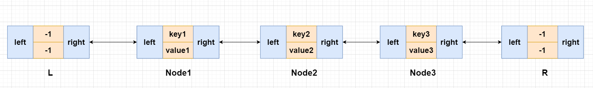
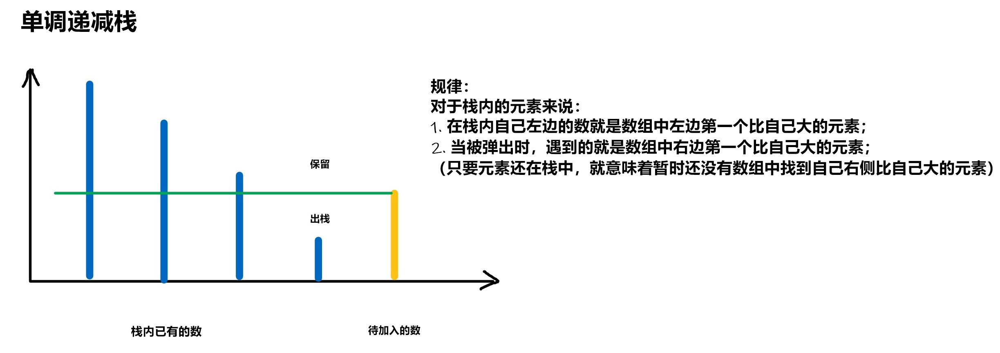

## LeetCode 精选 TOP 面试题（4）

### [146. LRU 缓存](https://leetcode-cn.com/problems/lru-cache/)

**题意解释** 

请为**LRU缓存**设计一个数据结构。支持两种操作：`get`和`set`。

- `get(key)` :  如果`key`在缓存中，则返回`key`对应的值（保证是正的）；否则返回`-1`；
- `set(key, value) `:  如果`key`在缓存中，则更新`key`对应的值；否则插入`(key, value)`，如果缓存已满，则先删除上次使用时间最老的`key`。

**思路**

**(双链表+哈希)**   $O(1)$ 

使用一个双链表和一个哈希表：

- 双链表存储一个节点被使用（`get`或者`put`）的时间戳，且按最近使用时间从左到右排好序，最先被使用的节点放在双链表的第一位，因此双链表的最后一位就是最久未被使用的节点； 

  

- 哈希表存储`key`对应的链表中的节点地址,用于`key-value` 的增删改查； 

  ​	

初始化：

- `n` 是缓存大小；
- 双链表和哈希表都为空；

`get(key)`： 首先用哈希表判断key是否存在：

- 如果key不存在，则返回-1；
- 如果key存在，则返回对应的value，同时将key对应的节点放到双链表的最左侧；

`put(key, value)`： 首先用哈希表判断key是否存在：

- 如果key存在，则修改对应的value，同时将key对应的节点放到双链表的最左侧；
- 如果key不存在：
  - 如果缓存已满，则删除双链表最右侧的节点（上次使用时间最老的节点），更新哈希表；
  - 否则，插入(key, value)：同时将key对应的节点放到双链表的最左侧，更新哈希表；

**对应的双链表的几种操作**

1、删除p节点


```c++
 p->right->left = p->left;
 p->left->right = p->right;
```

2、在L节点之后插入p节点


```c++
p->right = L->right;
p->left = L;
L->right->left = p;
L->right = p;
```

**时间复杂度分析**：双链表和哈希表的增删改查操作的时间复杂度都是 $O(1)$，所以get和set操作的时间复杂度也都是 $O(1)$。 

**c++代码**

```c++
class LRUCache {
public:
    //定义双链表
    struct Node{
        int key,value;
        Node* left ,*right;
        Node(int _key,int _value): key(_key),value(_value),left(NULL),right(NULL){}
    }*L,*R;//双链表的最左和最右节点，不存贮值。
    int n;
    unordered_map<int,Node*>hash;

    void remove(Node* p)
    {
        p->right->left = p->left;
        p->left->right = p->right;
    }
    void insert(Node *p)
    {
        p->right = L->right;
        p->left = L;
        L->right->left = p;
        L->right = p;
    }
    LRUCache(int capacity) {
        n = capacity;
        L = new Node(-1,-1),R = new Node(-1,-1);
        L->right = R;
        R->left = L;    
    }
    
    int get(int key) {
        if(hash.count(key) == 0) return -1; //不存在关键字 key 
        auto p = hash[key];
        remove(p);
        insert(p);//将当前节点放在双链表的第一位
        return p->value;
    }
    
    void put(int key, int value) {
        if(hash.count(key)) //如果key存在，则修改对应的value
        {
            auto p = hash[key];
            p->value = value;
            remove(p);
            insert(p);
        }
        else 
        {
            if(hash.size() == n) //如果缓存已满，则删除双链表最右侧的节点
            {
                auto  p = R->left;
                remove(p);
                hash.erase(p->key); //更新哈希表
                delete p; //释放内存
            }
            //否则，插入(key, value)
            auto p = new Node(key,value);
            hash[key] = p;
            insert(p);
        }
    }
};
```

### [148. 排序链表](https://leetcode-cn.com/problems/sort-list/)

**思路**

**(归并排序)**   $O(nlogn)$  

自顶向下递归形式的归并排序，由于递归需要使用系统栈，递归的最大深度是 $logn$，所以需要额外 $O(logn)$ 的空间。
所以我们需要使用自底向上非递归形式的归并排序算法。
基本思路是这样的，总共迭代 $logn$次：

1. 第一次，将整个区间分成连续的若干段，每段长度是2：$[a0,a1],[a2,a3],…[an−1,an−1][a0,a1],$然后将每一段内排好序，小数在前，大数在后；
2. 第二次，将整个区间分成连续的若干段，每段长度是4：$[a0,…,a3],[a4,…,a7],…[an−4,…,an−1][a0,…,a3]$,然后将每一段内排好序，这次排序可以利用之前的结果，相当于将左右两个有序的半区间合并，可以通过一次线性扫描来完成；
3. 依此类推，直到每段小区间的长度大于等于 $n$ 为止；

另外，当 $n$ 不是2的整次幂时，每次迭代只有最后一个区间会比较特殊，长度会小一些，遍历到指针为空时需要提前结束。


**举个例子：**

根据图片可知，从底部往上逐渐进行排序，先将长度是`1`的链表进行两两排序合并，再形成新的链表`head`，再在新的链表的基础上将长度是`2`的链表进行两两排序合并，再形成新的链表`head` … 直到将长度是`n / 2`的链表进行两两排序合并

```
step=1: (3->4) -> (1->7) -> (8->9) -> (2->11) -> (5->6)
step=2: (1->3->4->7) -> (2->8->9->11) -> (5->6)
step=4: (1->2->3->4->7->8->9->11) ->5->6
step=8: (1->2->3->4->5->6->7->8->9->11)
```

具体操作，当将长度是`i`的链表两两排序合并时，新建一个虚拟头结点` dummy`，`[j,j + i - 1]`和`[j + i, j + 2 * i - 1]`两个链表进行合并，在当前组中，`p`指向的是当前合并的左边的链表，`q`指向的是当前合并的右边的链表，`o`指向的是下一组的开始位置，将左链表和右链表进行合并，加入到`dummy`的链表中，操作完所有组后，返回`dummy.next`链表给`i * 2`的长度处理

注意的是：需要通过`l`和`r`记录当前组左链表和右链表使用了多少个元素，用的个数不能超过`i`，即使长度不是 `2n` 也可以同样的操作

**时间复杂度分析：**

整个链表总共遍历 $logn$ 次，每次遍历的复杂度是 $O(n)$，所以总时间复杂度是$O(nlogn)$。

**空间复杂度分析：**

整个算法没有递归，迭代时只会使用常数个额外变量，所以额外空间复杂度是 $O(1)$.

**c++代码**

```c++
/**
 * Definition for singly-linked list.
 * struct ListNode {
 *     int val;
 *     ListNode *next;
 *     ListNode() : val(0), next(nullptr) {}
 *     ListNode(int x) : val(x), next(nullptr) {}
 *     ListNode(int x, ListNode *next) : val(x), next(next) {}
 * };
 */
class Solution {
public:
    ListNode* sortList(ListNode* head) {
        int n = 0;
        for(auto p = head; p; p = p->next) n++;
        auto dummy = new ListNode(-1); //虚拟头节点
		dummy->next = head;
        //每次归并段的长度，每次长度依次为1,2,4,8...n/2, 小于n是因为等于n时说明所有元素均归并完毕，大于n时同理
        for(int i = 1; i < n; i *= 2)
        {
            auto cur = dummy ;
            for(int j = 1; j + i <= n; j += 2*i ){ //j代表每一段的开始，每次将两段有序段归并为一个大的有序段，故而每次+2i		   //必须保证每段中间序号是小于等于链表长度的，显然，如果大于表长，就没有元素可以归并了
                auto p = cur->next, q = p;//p表示第一段的起始点，q表示第二段的起始点，之后开始归并即可
                for(int k = 0; k < i; k++) q = q->next;
            	//l,r用于计数第一段和第二段归并的节点个数，由于当链表长度非2的整数倍时表长会小于i,故而需要加上p && q的边界判断
                int l = 0, r = 0;
                while(l < i && r < i && p && q) //二路归并
                {
                    if(p->val <= q->val)  cur = cur->next = p, p = p->next, l++;
                    else cur = cur->next = q, q = q->next, r++;
                }
            
                while(l < i && p) cur = cur->next = p, p = p->next ,l++;
                while(r < i && q) cur = cur->next = q, q = q->next ,r++;
                cur->next = q;//记得把排好序的链表尾链接到下一链表的表头，循环完毕后q为下一链表表头
            }
        }
        return dummy->next;
    }
};
```

### [150. 逆波兰表达式求值](https://leetcode-cn.com/problems/evaluate-reverse-polish-notation/)

**思路**

**(栈操作)** $O(n)$

遍历所有元素。如果当前元素是整数，则压入栈；如果是运算符，则将栈顶两个元素弹出做相应运算，再将结果入栈。
最终表达式扫描完后，栈里的数就是结果。

**时间复杂度分析：** 每个元素仅被遍历一次，且每次遍历时仅涉及常数次操作，所以时间复杂度是 $O(n)$。

**c++代码**

```c++
```

### [152. 乘积最大子数组](https://leetcode-cn.com/problems/maximum-product-subarray/)

**思路**

**(动态规划)**  $O(n)$

给你一个整数数组 `nums` ，让我们找出数组中乘积最大的连续子数组对应的乘积。

**样例：** 


如样例所示，`nums = [2,3,-2,4]`，连续子数组 `[2,3] `有最大乘积 `6`，下面来讲解动态规划的做法。

**状态表示：** 

`f[i]`表示以`num[i]`结尾的连续子数组乘积的最大值。

**假设`nums`数组都是非负数**，对于每个以`nums[i]`结尾的连续子数组，我们有两种选择方式：

- 1、只有`nums[i]`一个数，那么以`num[i]`结尾的连续子数组乘积的最大值则为`nums[i]` ，即`f[i] = nums[i]`。
- 2、以`nums[i]`为结尾的多个数连续组成的子数组，那么问题就转化成了以`nums[i - 1]`结尾的连续子数组的最大值再乘以`nums[i]`的值，即 `f[i] = f[i - 1] * nums[i]`。

**图示：** 


最后的结果是两种选择中取最大的一个，因此**状态转移方程为：** `f[i] = max(nums[i], f[i - 1] * nums[i])`。

但是`nums`数组中包含有正数，负数和零，当前的最大值如果乘以一个负数就会变成最小值，当前的最小值如果乘以一个负数就会变成一个最大值，因此我们还需要维护一个最小值。

**新的状态表示：** 

`f[i]`表示以`num[i]`结尾的连续子数组乘积的最大值，`g[i]`表示以`num[i]`结尾的连续子数组乘积的最小值。 

我们先去讨论以`nums[i]`结尾的连续子数组的最大值的状态转移方程：

- 1、如果`nums[i] >= 0`，同刚开始讨论的一样，`f[i] = max(nums[i], f[i - 1] * nums[i])`。
- 2、如果`nums[i] < 0`，只有`nums[i]`一个数，最大值为`nums[i]`。有多个数的话，问题就转化成了以`nums[i - 1]`结尾的连续子数组的最小值再乘以`nums[i]`(最小值乘以一个负数变成最大值)，即`f[i] = max(nums[i], g[i - 1] * nums[i])` 。 

**图示：** 


综上，最大值的状态转移方程为： `f[i] = max(nums[i], max(f[i - 1] * nums[i], g[i - 1] * nums[i]))`。

再去讨论以`nums[i]`结尾的连续子数组的最小值的状态转移方程：

- 1、如果`nums[i] >= 0`，同最大值的思考方式一样，只需把`max`换成`min`，即`g[i] = min(nums[i], g[i - 1] * nums[i])`。
- 2、如果`nums[i] < 0`，只有`nums[i]`一个数，最小值为`nums[i]`。有多个数的话，问题就转化成了以`nums[i - 1]`结尾的连续子数组的最大值再乘以`nums[i]`(最大值乘以一个负数变成最小值)，即`f[i] = min(nums[i], f[i - 1] * nums[i])` 。

**图示：** 


综上，最小值的状态转移方程为： `g[i] = min(nums[i], min(g[i - 1] * nums[i], f[i - 1] * nums[i]))`。

最后的结果就是分别以`nums[0]`或`nums[1]`，，，或`nums[i]`为结尾的连续子数组中取乘积结果最大的。

**初始化：** 

只有一个数`nums[0]`时，以`nums[i]`结尾的连续子数组乘积的最大值和最小值都为`nums[0]`。

**时间复杂度分析：** 只遍历一次`nums`数组，因此时间复杂度为$O(n)$，$n$是`nums`数组的长度。

**c++代码**

```c++
class Solution {
public:
    int maxProduct(vector<int>& nums) {
        int n = nums.size();
        vector<int>f(n + 1), g(n + 1);
        f[0] = nums[0], g[0] = nums[0];
        int res = nums[0];
        for(int i = 1; i < n; i++){
            f[i] = max(nums[i], max(f[i - 1] * nums[i], g[i - 1] * nums[i]));
            g[i] = min(nums[i], min(g[i - 1] * nums[i], f[i - 1] * nums[i]));
            res = max(res, f[i]);
        }
        return res;
    }
};
```

### [155. 最小栈](https://leetcode-cn.com/problems/min-stack/)

**思路**

**(单调栈)**   $O(1)$

我们除了维护基本的栈结构之外，还需要维护一个单调递减栈，来实现返回最小值的操作。

下面介绍如何维护单调递减栈：

- 当我们向栈中压入一个数时，如果该数 $≤$ 单调栈的栈顶元素，则将该数同时压入单调栈中；否则，不压入，这是由于栈具有先进后出性质，所以在该数被弹出之前，栈中一直存在一个数比该数小，所以该数一定不会被当做最小数输出。
- 当我们从栈中弹出一个数时，如果该数等于单调栈的栈顶元素，则同时将单调栈的栈顶元素弹出。
- 单调栈的栈顶元素，就是当前栈中的最小数。  



**时间复杂度分析：**四种操作都只有常数次入栈出栈操作，所以时间复杂度都是 $O(1)$。

**c++代码**

```c++
class MinStack {
public:

    stack<int> stackValue;
    stack<int> stackMin;  //单调递减栈
    MinStack() {

    }
    
    void push(int val) {
        stackValue.push(val);
        if(stackMin.empty() || stackMin.top() >= val) stackMin.push(val);
    }
    
    void pop() {
        if(stackValue.top() == stackMin.top()) stackMin.pop();
        stackValue.pop();
    }
    
    int top() {
        return stackValue.top();
    }
    
    int getMin() {
        return stackMin.top();
    }
};

```

### [160. 相交链表](https://leetcode-cn.com/problems/intersection-of-two-linked-lists/)

**思路**

**(链表，指针扫描)** $O(n)$

**算法步骤：** 

1. 用两个指针分别从两个链表头部开始扫描，每次分别走一步；
2. 如果一个指针走到`null`，则从另一个链表头部开始走；
3. 当两个指针相同时，
   - 如果指针不是`null`，则指针位置就是相遇点；
   - 如果指针是` null`，则两个链表不相交；

此题我们画图讲解，一目了然：

1、两个链表不相交： 


`a`,`b` 分别代表两个链表的长度，则两个指针分别走 `a+b` 步后都变成 `null`。

2 . 两个链表相交：


则两个指针分别走 `a + b + c` 步后在两链表交汇处相遇。

**时间复杂度分析：**每个指针走的长度不大于两个链表的总长度，所以时间复杂度是$O(n)$。

**c++代码**

```c++
/**
 * Definition for singly-linked list.
 * struct ListNode {
 *     int val;
 *     ListNode *next;
 *     ListNode(int x) : val(x), next(NULL) {}
 * };
 */
class Solution {
public:
    ListNode *getIntersectionNode(ListNode *headA, ListNode *headB) {
        auto pA = headA, pB = headB; //定义两个指针
        while(pA != pB){
            if(pA) pA = pA->next;
            else pA = headB;
            if(pB) pB = pB->next;
            else pB = headA;
        }
        return pA;
    }
};
```

### [162. 寻找峰值](https://leetcode-cn.com/problems/find-peak-element/)

**思路**

**(二分)**   $O(logn)$ 

数组的两端`nums[-1] = nums[n] = -∞` 都是负无穷，因此数组无论是单调递增还是单调递减，又或者是成起伏状，数组中必定包含一个峰值。如下图所示：


因为数组中的峰值不止一个，我们找到任意一个即可。题目还告诉我们对于所有有效的` i `都有 `nums[i] != nums[i + 1]`，即数组中的任意两个相邻数都不相等。 

**我们使用二分来做**，每次找出区间的中点`mid`，比较`nums[mid]`与`nums[mid + 1]`的大小关系来推断哪个区间内一定存在峰值，然后取一定存在峰值的区间。这样不断缩小区间范围，区间所剩下的最后一个数就是答案。 

**过程如下：** 

- 1、二分的边界，`l = 0`, `r = nums.size() - 1`。

- 2、如果`nums[mid] > nums[mid + 1]`，那么在`[l, mid]`这个区间内一定存在一个峰值。因为`[l,mid]`这一段如果是单调递减的话，那么`nums[l]`就是峰值，否则第一个出现上升的点就是峰值。

  

- 3、如果`nums[mid] < nums[mid + 1]`，那么在`[mid+1, r]`这个区间内一定存在一个峰值。因为`[mid+1,r]`这一段如果是单调递增的话，那么`nums[r]`就是峰值，否则第一个出现下降的点就是峰值。

  

**时间复杂度分析：** 二分查找，所以时间复杂度是 $O(logn)$。 

**c++代码**

```c++
class Solution {
public:
    int findPeakElement(vector<int>& nums) {
        int l = 0, r = nums.size() - 1;
        while(l < r){
            int mid = (l + r) / 2;
            if(nums[mid] > nums[mid + 1]) r = mid;
            else l = mid + 1;
        }
        return r;
    }
};
```

### [166. 分数到小数](https://leetcode-cn.com/problems/fraction-to-recurring-decimal/)

**思路**

**(模拟)**  $O(n)$

模拟手工计算除法的过程，每次将余数乘`10`再除以除数，当同一个余数出现两次时，我们就找到了循环节。所以我们用一个哈希表 `unordered_map<int,int>` 记录所有余数所对应的商在小数点后第几位，当计算到相同的余数时，上一次余数的位置和当前位置之间的数，就是该小数的循环节。

**实现细节：** 

当分子取`-2^31`，分母取`-1`是，结果`2^31`会超出`int = 2^31 - 1`的范围，因此我们用`long long`来存贮中间计算结果。

**具体过程如下：**

1、假设分子为`x`，分母为`y`，如果`x % y == 0`，则直接返回`x / y`。

2、根据`x`和`y`的正负性，判断结果的正负。为了方便计算，`x`取 `abs(x)`，`y`取`abs(y)`。

3、如果`x % y != 0`，我们先将商`x / y`存入结果字符串`res`中，并将余数`x % y`记录到`x `中。

4、定义`hash`表，如果当前余数`x`不为`0`，则我们进行下述循环操作：

- 用`hash`表记录每个余数的位置。
- 将余数`x *= 10`，作为下一次除法的被除数。
- 将商`x / y`存入结果字符串`res`中，并计算下一次的余数`x %= y`。
- 如果我们发现计算到了相同的余数`x`，则将`[0,hash[x]]`和`[hash[x],res.size()]`加入结果字符串`res`中。

5、最后返回`res`。


**时间复杂度分析：** 计算量与结果长度成正比，是线性的。所以时间复杂度是 $O(n)$。

**c++代码**

```c++
class Solution {
public:
    string fractionToDecimal(int numerator, int denominator) {
        typedef long long LL;
        LL x = numerator, y = denominator;
        if(x % y == 0) return to_string(x / y);
        string res;  //记录答案
        if((x < 0 && y > 0) || (x > 0 && y < 0))  res += '-';
        x = abs(x), y = abs(y);
        res += to_string(x / y) + '.', x %= y;
        unordered_map<int, int> hash;
        while(x){
            hash[x] = res.size();
            x *= 10;
            res += to_string(x / y);
            x %= y;
            if(hash.count(x)){
                res = res.substr(0, hash[x]) + '(' + res.substr(hash[x]) + ')';
                break;
            }
        }
        return res;
    }
};
```

### [169. 多数元素](https://leetcode-cn.com/problems/majority-element/)

**思路**

**(投票算法)**  $O(n)$ 

当一个国家的总统候选人`r`的支持率大于50%的话，即使每个反对他的人都给他投一个反对票，抵消掉他的支持票，他的支持票也不会被完全消耗掉。因此，我们可以假定和`r`相同的数都是支持票，和`r`不同的数都是反对票。

维护两个变量：候选人和他的票数

- 1、候选人初始化为`r = 0`，票数`c`初始化为`0`，遍历整个数组
- 2、当候选人的票数为`0`时，更换候选人，并将票数重置为`1`（默认自己投自己一票）
- 3、当候选人的值和当前元素相同时，票数加`1`，否则减`1`
- 4、最后维护的候选人即是答案

**时间复杂度分析：**  $O(n)$ ，$n$是数组的大小。

**空间复杂度分析：** 仅使用了两个变量，故需要 $O(1)$ 的额外空间。 

**c++代码**

```c++
class Solution {
public:
    int majorityElement(vector<int>& nums) {
        int r = 0, c = 0;
        for(int x : nums){
            if(c == 0) r = x, c = 1;
            else if(x == r) c++;
            else c--;
        }
        return r;
    }
};
```

### [171. Excel 表列序号](https://leetcode-cn.com/problems/excel-sheet-column-number/)

**思路**

**(进制转换)**  $O(n)$

`26` 进制转换成十进制，`res = res * 26 + c - 'A' + 1`。

**时间复杂度分析：** 需要遍历列名称一次，故为$O(n)$。

**c++代码**

```c++
class Solution {
public:
    int titleToNumber(string col) {
        long long  res = 0;
        for(char c : col){
            res = res * 26 + c - 'A' + 1;
        }
        return res;
    }
};
```

### [172. 阶乘后的零](https://leetcode-cn.com/problems/factorial-trailing-zeroes/)

**思路**

**(数学)** 

由于`n!`的后缀`0`是由质因子`2`和质因子`5`相乘而来的，而`2`的个数总是比`5`多的，因此我们只需要计算`n!`中质因子`5`的个数即可。


**c++代码**

```c++
class Solution {
public:
    int trailingZeroes(int n) {
        int res = 0;
        while(n){
            res += n / 5;
            n /= 5;
        }
        return res;
    }
};
```

### [179. 最大数](https://leetcode-cn.com/problems/largest-number/)

**思路**

**(贪心)**   $O(nlogn)$ 

给定一组非负数，重新排列使其组成一个最大的整数。

**样例：**


如样例所示，`[3,30,34,5,9]`所能组成的最大数字是`"9534330"`，下面来讲解贪心的做法。

假设给定我们包含两个数字的数组`[a,b]`，如果`"ab"`组合大于`"ba"`组合，那么我们优先选择`a`进行拼接。比如`nums = [10,2]`，`"210"`组合明显大于`"102"`组合，因此我们优先选择`2`进行拼接，这样我们就自定义一个排序规则。但是扩展到一个序列来讲，一个序列要能够正确地自定义排序，需要这种排序规则满足全序关系，即以下三个关系：

* 如果 `a ≤ b` 且 `b ≤ a` 则 `a = b` (反对称性)
 * 如果 `a ≤ b` 且 `b ≤ c` 则 `a ≤ c` (传递性)
 * 如果 `a ≤ b` 或 `b ≤ a` (完全性)

详细证明可看[官解](https://leetcode-cn.com/problems/largest-number/solution/zui-da-shu-by-leetcode-solution-sid5/)。 满足了全序关系，我们就可以将`nums`数组按照自定义排序规则重新排序，最后返回拼接好的字符串即可。

**实现细节：**

- c++自定义排序，实现一个`cmp`函数。 

**c++代码**

```c++
class Solution {
public:
    static bool cmp(int a, int b){
        string as = to_string(a), bs = to_string(b);
        return as + bs > bs + as;
    }
    string largestNumber(vector<int>& nums) {
        sort(nums.begin(), nums.end(), cmp);
        string res;
        for(int x : nums){
            res += to_string(x);
        }
        if(res[0] == '0') return "0";
        return res;
    }
};
```

### [189. 轮转数组](https://leetcode-cn.com/problems/rotate-array/)

**思路**

**(数组)**

三次翻转

**具体过程如下：** 

- 1、第一次将整个数组翻转。
- 2、第二次将前`k`个数翻转。
- 3、第三次将前`k`个数以后的数翻转。

**c++代码**

```c++
class Solution {
public:
    void rotate(vector<int>& nums, int k) {
        int n = nums.size();
        k %= n;
        reverse(nums.begin(), nums.end());
        reverse(nums.begin(), nums.begin() + k);
        reverse(nums.begin() + k, nums.end());
    }
};
```

### [190. 颠倒二进制位](https://leetcode-cn.com/problems/reverse-bits/)

**思路**

**(位运算)**  $O(1)$ 

使用位运算 `n >> i & 1 `可以取出 `n` 的第 `i` 位二进制数。
我们从小到大依次取出 `n` 的所有二进制位，然后逆序累加到另一个无符号整数中。

**c++代码**

```c++
class Solution {
public:
    uint32_t reverseBits(uint32_t n) {
        int res = 0;
        for(int i = 0; i < 32; i++){
            res = (res << 1) + (n >> i & 1);
        }
        return res;
    }
};
```

### [191. 位1的个数](https://leetcode-cn.com/problems/number-of-1-bits/)

**思路**

**(位运算)**   $O(1)$

1、`lowbit(x)`函数    用于返回`x`的最后一位`1`以及其后面`0`对应的数。

```c++
int lowbit(int x)
{
    return x & (-x);
}
```

比如：`lowbit(10) = lowbit(1010) => (10) = 2`

2、整数`n`的二进制表示中第`k`位是多少，比如：$n = 15 = (1111)_2$

- 先把第`k`位移到最后一位`n>>k`
- 再看个位是几，`x&1` 

**c++代码1**

```c++
class Solution {
public:
    int hammingWeight(uint32_t n) {
        int res = 0;
        for(int i = 0; i < 32; i++){
            res += n>>i&1;
        }
        return res;
    }
};
```

**c++代码2**

```java
class Solution {
public:
    int hammingWeight(uint32_t n) {
        int res = 0;
        while(n)
        {
            n -= n & -n; //返回二进制中最后一位1以及其后面0对应的数。
            res++; 
        }
        return res;
    }
};
```

### [198. 打家劫舍](https://leetcode-cn.com/problems/house-robber/)

**思路**

**(动态规划)**  $O(n)$

给定一个代表金额的非负整数数组`nums`，相邻房间不可偷，让我们输出可以偷窃到的最高金额。

**样例：**  


如样例所示，`nums = [2,7,9,3,1]`，偷窃`1`，`3`，`5`号房间可以获得最高金额`12`，下面来讲解动态规划的做法。

**状态表示：**`f[i]`表示偷窃`1`号到`i`号房间所能获得的最高金额。那么，`f[n]`就表示偷窃`1`号到`n`号房间所能获得的最高金额，即为答案。

**状态计算：**  

假设有`i`间房间，考虑最后一间偷还是不偷房间，有两种选择方案：

- 1、偷窃前`i-1`间房间，不偷窃最后一间房间，那么问题就转化为了偷窃`1`号到`i - 1`号房间所能获得的最高金额，即`f[i] = f[i-1]  `。  

  

- 2、偷窃前`i - 2`间房间和最后一间房间 (相邻的房屋不可闯入)，那么问题就转化为了偷窃`1`号到`i- 2`号房间所能获得的最高金额再加上偷窃第`i`号房间的金额，即`f[i] = f[i - 2] + nums[i]`。 (下标均从`1`开始)


两种方案，选择其中金额最大的一个。因此**状态转移方程为：** ` f[i] = max(f[i - 1], f[i - 2] + nums[i])`。 (下标均从`1`开始)

**初始化：**`f[1] = nums[0]`，偷窃`1`号房间所能获得的最高金额为`nums[0]`。

**实现细节：** 

我们定义的状态表示`f[]`数组和`nums[]`数组下标均是从`1`开始的，而题目给出的`nums[]`数组下标是从`0`开始的。为了一 一对应，状态转移方程中的`nums[i]`的值要往前错一位，取`nums[i - 1]`，这点细节希望大家可以注意一下。

**时间复杂度分析：** $O(n)$，其中 $n$是数组长度。只需要对数组遍历一次。

**c++代码**

```c++
class Solution {
public:
    int rob(vector<int>& nums) {
        int n = nums.size();
        vector<int>f(n + 1);
        f[1] = nums[0];
        for(int i = 2; i <= n; i++){
            f[i] = max(f[i - 1], f[i - 2] + nums[i - 1]);
        }
        return f[n];
    }
};
```

### [200. 岛屿数量](https://leetcode-cn.com/problems/number-of-islands/)

**思路**

**(深度优先遍历)**  

1. 从任意一个陆地点开始，即可通过四连通的方式，深度优先搜索遍历到所有与之相连的陆地，即遍历完整个岛屿。每次将遍历过的点清 `0`。
2. 重复以上过程，可行起点的数量就是答案。

**时间复杂度分析：**由于每个点最多被遍历一次，故时间复杂度为  $O(n*m)$    

**空间复杂度分析：**最坏情况下，需要额外$O(n*m)$ 的空间作为系统栈。 

**c++代码**

```c++
class Solution {
public:
    vector<vector<char>> g;
    int dx[4] = {-1, 0, 1, 0}, dy[4] = {0, 1, 0, -1};
    int numIslands(vector<vector<char>>& grid) {
        g = grid;
        int cnt = 0;
        for(int i = 0; i < g.size(); i++)
            for(int j = 0; j < g[i].size(); j++){
                if(g[i][j] == '1'){
                    dfs(i, j);
                    cnt++;
                }
            }
        return cnt;    
    }

    void dfs(int x, int y){
        g[x][y] = '0';
        for(int i = 0; i < 4; i++){
            int a = x + dx[i], b = y + dy[i];
            if(a < 0 || a >= g.size() || b < 0 || b >= g[a].size() || g[a][b] == '0') continue;
            dfs(a, b);
        }
    }
};
```

### [202. 快乐数](https://leetcode-cn.com/problems/happy-number/)

**思路**

**(哈希)** 

从起点开始，一直往下走，用哈希表记录每一次变过的点

- 1、若哈希表本身就已经有该点，则表示已经走到了一个死循环，则 `return false`
- 2、若一直走下去，哈希表中都不存在该点，并顺利走向`1`，则 `return true`。

**c++代码**

```c++
class Solution {
public:
    bool isHappy(int n) {
        unordered_set<int> hash;
        while(n != 1){
            int t = 0;
            while(n){
                t += (n % 10) * (n % 10);
                n /= 10;
            }
            if(hash.count(t)) return false;
            hash.insert(t);
            n = t;
        }
        return true;
    }
};
```

### [204. 计数质数](https://leetcode-cn.com/problems/count-primes/)

**思路**

**(线性筛素数)**   $O(n)$

数论模板题，常用数论模板可以参考https://www.acwing.com/blog/content/28/。

算法流程：

- 1、从小到大枚举每个数` i`；
- 2、如果 `i`没有被标记，将`i`加入质数集合；
- 3、对于每个 `i`，从小到大枚举已有的质数 $prime_j$，将 $i∗prime_j$ 标记成合数。如果 $i $能整除 $prime_j$，则直接break。

**下面证明该算法是正确的，且时间复杂度是线性的：** 

首先，质数一定不是其它质数的倍数，所以质数一定会被找出来。然后我们证明，每个合数一定会被它的最小质因子标记，且只会被它的最小值因子标记，从而每个合数只会被标记一次，所以时间复杂度是线性的。

**我们先来证明每个合数可以被它的最小质因子标记：**
假设某个合数是 $x$，它的最小质因子是 $p$，令 $i=x/p$，则 $i$ 的所有质因子一定大于等于 $p$，所以当算法的第一层循环枚举到 $i$后，我们从小到大枚举质数时，$i$ 一定不能整除比 $p$小的质数，所以一定可以枚举到质数 $p$，从而可以把 $x=i∗p$标记为合数。

**然后我们证明每个合数仅会被它的最小质因子标记：**
假设某个合数是 $x$，它的某个非最小的质因子是 $p$，令 $i=x/p$，则 $i$ 包含 $x$ 的最小质因子，从而 $i$ 存在某个质因子比 $p$ 小。所以当算法的第一层循环枚举到 $i$ 时，第二层循环枚举到 $i$ 的最小质因子后会直接break，不会枚举 $p$，所以 $x$一定不会被非最小的质因子标记。

证毕。

**时间复杂度分析：**每个合数仅会被它的最小质因子标记，所以每个合数只被标记`1`次，所以时间复杂度是 $O(n)$。

**c++代码**

```c++
class Solution {
public:
    int countPrimes(int n) {
        vector<int> primes;
        vector<bool> st(n + 1);
        for(int i = 2; i < n; i++){
            if(!st[i]) primes.push_back(i);
            for(int j = 0; i * primes[j] < n ; j++){
                st[i * primes[j]] = true;
                if(i % primes[j] == 0) break;
            }
        }
        return primes.size();
    }
};
```

### [206. 反转链表](https://leetcode-cn.com/problems/reverse-linked-list/)

**思路**

**(双指针，迭代)** $(n)$

给定一个链表的头节点，让我们反转该链表并输出反转后链表的头节点。

**样例：**


如样例所示，原始链表为`1->2->3->4->5->NULL`，我们将其翻转输出`5->4->3->2->1->NULL`。下面我们来讲解双指针的做法。

将一个链表翻转，即将该链表所有节点的`next`指针指向它的前驱节点。由于是单链表，我们在遍历时并不能直接找到其前驱节点，因此我们需要定义一个指针保存其前驱节点。

每次翻转时，我们都需要修改当前节点的`next`指针。如果不在改变当前节点的`next`指针前保存其后继节点，那么我们就失去了当前节点和后序节点的联系，因此还需要额外定义一个指针用于保存当前节点的后继节点。

**具体过程如下：**

1、定义一个前驱指针`pre`和`cur`指针，`pre`指针用来指向前驱节点，`cur`指针用来遍历整个链表，初始化`pre = null`，`cur = head`。  


2、我们首先保存`cur`指针指向节点的后继节点，然后让`cur`指针指向节点的`next`指针指向其前驱节点，即`cur->next = pre`。

3、`pre`指针和`cur`指针分别后移一位，重复上述过程，直到`cur`指向空节点。  

4、最后我们返回`pre`节点。  

**图示过程如下：** 


**时间复杂度分析：**只遍历一次链表，时间复杂度是$O(n)$。 

**c++代码**

```c++
/**
 * Definition for singly-linked list.
 * struct ListNode {
 *     int val;
 *     ListNode *next;
 *     ListNode() : val(0), next(nullptr) {}
 *     ListNode(int x) : val(x), next(nullptr) {}
 *     ListNode(int x, ListNode *next) : val(x), next(next) {}
 * };
 */
class Solution {
public:
    ListNode* reverseList(ListNode* head) {
        ListNode* pre = nullptr; //前驱指针
        ListNode* cur = head;
        while(cur){
            ListNode* t = cur->next;  //先保存后继节点
            cur->next = pre;
            pre = cur, cur = t;
        }
        return pre;
    }
};
```

### [207. 课程表](https://leetcode-cn.com/problems/course-schedule/)

**思路**

**拓扑排序：**   $O(n+m)$ 

对一个有向无环图`G`进行拓扑排序，是将`G`中所有顶点排成一个线性序列，使得图中任意一对顶点`u`和`v`，若`<u，v> ∈E(G)`，则`u`在线性序列中出现在`v`之前。


一个合法的选课序列就是一个拓扑序，拓扑序是指一个满足有向图上，不存在一条边出节点在入节点前的线性序列，如果有向图中有环，就不存在拓扑序。可以通过拓扑排序算法来得到拓扑序，以及判断是否存在环。

**拓扑排序步骤：** 

- 1、建图并记录所有节点的入度。
- 2、将所有入度为`0`的节点加入队列。
- 3、取出队首的元素`now`，将其加入拓扑序列。
- 4、访问所有`now`的邻接点`nxt`，将`nxt`的入度减`1`，当减到`0`后，将`nxt`加入队列。
- 5、重复步骤`3`、`4`，直到队列为空。 
- 6、如果拓扑序列个数等于节点数，代表该有向图无环，且存在拓扑序。

**时间复杂度分析：**假设 $n$ 为点数，$m$ 为边数，拓扑排序仅遍历所有的点和边一次，故总时间复杂度为 $O(n+m)$。

**c++代码**

```c++
class Solution {
public:
    bool canFinish(int n, vector<vector<int>>& edges) {
        vector<vector<int>> g(n);
        vector<int> d(n);  // 存贮每个节点的入度
        for(auto edge : edges){
            g[edge[1]].push_back(edge[0]);  //建图
            d[edge[0]]++;  //入度加1
        }

        queue<int> q;
        for(int i = 0; i < n; i++){
            if(d[i] == 0) q.push(i);  //将所有入度为0的节点加入队列。
        }

        int cnt = 0;  //统计拓扑节点的个数
        while(q.size()){
            int t = q.front();
            q.pop();
            cnt++;
            for(int i : g[t]){  //访问t的邻接节点
                d[i]--;
                if(d[i] == 0) q.push(i);
            }
        }
        
        return cnt == n;
    }
};
```

### [208. 实现 Trie (前缀树)](https://leetcode-cn.com/problems/implement-trie-prefix-tree/)

**思路** 

**字典树** 

字典树，顾名思义，是关于“字典”的一棵树。即：它是对于字典的一种存储方式（所以是一种数据结构而不是算法）。这个词典中的每个“单词”就是从根节点出发一直到某一个目标节点的路径，路径中每条边的字母连起来就是一个单词。


标橙色的节点是“目标节点“，即根节点到这个目标节点的路径上的所有字母构成了一个单词。

**作用：**

- 1、维护字符串集合**（字典）** 
- 2、向字符串集合中插入字符串**（建树）**
- 3、查询字符串集合中是否有某个字符串**（查询）**
- 4、查询字符串集合中是否有某个字符串的前缀**（查询）** 

**具体操作：**

**定义字典树节点**

```c++
struct Node {
    bool is_end;    // 表示是否存在以这个点为结尾的单词
    Node *son[26];  // 26个小写字母子结点
    Node() {        // 初始化
        is_end = false;
        for (int i = 0; i < 26; i ++ )   
            son[i] = NULL;
    }
}*root;
```

向字典树中插入一个单词`word`

从根结点出发，沿着字符串的字符一直往下走，若某一字符不存在，则直接把它创建出来，继续走下去，走完了整个单词，标记最后的位置的`is_end = true`。

```c++
void insert(string word) {
    auto p = root;
    for (auto c: word) {
        int u = c - 'a';
        if (!p->son[u]) p->son[u] = new Node();
        p = p->son[u];
    }
    p->is_end = true;
}
```

查找字典树中是否存在单词`word`

从根结点出发，沿着字符串的字符一直往下走，若某一字符不存在，则直接`return false`，当很顺利走到最后的位置的时候，判断最后一个位置的`is_end`即可。

```c++
bool search(string word) {
    auto p = root;
    for (auto c: word) {
        int u = c - 'a';
        if (!p->son[u]) return false;
        p = p->son[u];
    }
    return p->is_end;
}
```

查找字典树中是否有以`prefix`为前缀的单词

从根结点出发，沿着字符串的字符一直往下走，若某一字符不存在，则直接`return false`，如果顺利走到最后一个位置，则返回`true`。

```c++
bool startsWith(string word) {
    auto p = root;
    for (auto c: word) {
        int u = c - 'a';
        if (!p->son[u]) return false;
        p = p->son[u];
    }
    return true;
}
```

**时间复杂度分析：** $O(n)$，`n`表示单词操作字符串长度。

**c++代码**

```c++
class Trie {
public:
    struct Node{
        bool is_end;
        Node *son[26];
        Node(){
            is_end = false;
            for(int i = 0; i < 26; i++)
                son[i] = NULL;
        }
    }*root;
    Trie() {
        root = new Node();
    }
    
    void insert(string word) {
        auto p = root;
        for(auto c : word){
            int u = c - 'a';
            if(!p->son[u]) p->son[u] = new Node();
            p = p->son[u];
        }
        p->is_end = true;
    }
    
    bool search(string word) {
        auto p = root;
        for(auto c : word){
            int u = c - 'a';
            if(!p->son[u]) return false;
            p = p->son[u];
        }
        return p->is_end;
    }
    
    bool startsWith(string prefix) {
        auto p = root;
        for(auto c : prefix){
            int u = c -'a';
            if(!p->son[u]) return false;
            p = p->son[u];
        }
        return true;
    }
};

/**
 * Your Trie object will be instantiated and called as such:
 * Trie* obj = new Trie();
 * obj->insert(word);
 * bool param_2 = obj->search(word);
 * bool param_3 = obj->startsWith(prefix);
 */
```

### [210. 课程表 II](https://leetcode-cn.com/problems/course-schedule-ii/)

**思路**

**拓扑排序：**   $O(n+m)$ 

对一个有向无环图`G`进行拓扑排序，是将`G`中所有顶点排成一个线性序列，使得图中任意一对顶点`u`和`v`，若`<u，v> ∈E(G)`，则`u`在线性序列中出现在`v`之前。


一个合法的选课序列就是一个拓扑序，拓扑序是指一个满足有向图上，不存在一条边出节点在入节点前的线性序列，如果有向图中有环，就不存在拓扑序。可以通过拓扑排序算法来得到拓扑序，以及判断是否存在环。

**判断拓扑排序步骤：** 

- 1、建图并记录所有节点的入度。
- 2、将所有入度为`0`的节点加入队列。
- 3、取出队首的元素`now`，将其加入拓扑序列。
- 4、访问所有`now`的邻接点`nxt`，将`nxt`的入度减`1`，当减到`0`后，将`nxt`加入队列。
- 5、重复步骤`3`、`4`，直到队列为空。 
- 6、如果拓扑序列个数等于节点数，代表该有向图无环，且存在拓扑序。

在这道题中，拓扑排序时用的队列的进队顺序就是一个可行的输出方案。因此我们走一遍拓扑排序，将拓扑排序的元素加入`res`中，如果最后的`res.size() < n`，则表示该图不满足拓扑排序，则返回空数组，否则返回`res`数组。

**时间复杂度分析：**假设 $n$ 为点数，$m$ 为边数，拓扑排序仅遍历所有的点和边一次，故总时间复杂度为 $O(n+m)$。

**c++代码**

```c++
class Solution {
public:
    vector<int> findOrder(int n, vector<vector<int>>& edges) {
        vector<vector<int>> g(n);  // 邻接表
        vector<int> d(n);  // 存贮每个节点的入度
        for(auto edge :edges){
            g[edge[1]].push_back(edge[0]);  //建图
            d[edge[0]]++;
        }

        queue<int> q;
        for(int i = 0; i < n; i++)
            if(d[i] == 0) q.push(i); ////将所有入度为0的节点加入队列

        vector<int> res;
        while(q.size()){
            int t = q.front();
            q.pop();
            res.push_back(t);
            for(int i : g[t]){  //访问t的邻接节点(出边)
                d[i]--;
                if(d[i] == 0)  q.push(i);  // i的入度为0，将其加入队列中
            }
        }    

        if(res.size() < n) return {};
        return res;
    }
};
```

### [212. 单词搜索 II](https://leetcode-cn.com/problems/word-search-ii/)

**思路**

**(DFS+Trie)**  $O(n^23^LL)$ 

**朴素思想：**

暴力搜索出所有单词路径，再判断该路径表示的单词是否出现在单词列表中。枚举所有路径时先枚举起点，再枚举路径延伸的方向。 但朴素`DFS`搜索空间太大，直接搜会超时。所以我们需要剪枝。

**字典树优化：** 

我们先将所有单词存入`Trie`树中，这样我们在搜索时，如果发现当前单词前缀不在`trie`中，那么当前的路径一定不会构成任意一个单词，我们直接`return`。


**递归函数设计：**

```c++
void dfs(int x, int y, Node* p) 
```

`x`，`y`是当前搜索到的二维字符网格的横纵坐标。

`p` 是当前在字典树中搜索的节点。

**搜索过程如下：**

- 1、先将所有的单词放在一个字典树中，在二维字符网格中枚举每个单词的起点（这个起点是出现在字典树中的）。
- 2、从该起点出发向四周搜索单词`word`，在搜索过的点需要进行赋值为`'.'`，防止重复使用该字符。
- 3、如果当前搜索的位置`(x,y)`的元素`g[a][b]`在字典树中有子节点，则继续向四周搜索。
- 4、直到搜索到单词`word`的最后一个字母，`p->id != -1`，我们将这个单词的序号记录下来，存贮到`set`中。
- 5、最后根据单词的序号，将单词添加到`res`中。

**c++代码**

```c++
class Solution {
public:
    struct Node {
        int id;  //记录当前单词的序号
        Node *son[26];
        Node() {
            id = -1;
            for (int i = 0; i < 26; i ++ ) son[i] = NULL;
        }
    }*root;
    unordered_set<int> ids;
    vector<vector<char>> g;
    int dx[4] = {-1, 0, 1, 0}, dy[4] = {0, 1, 0, -1};

    void insert(string& word, int id) {   //向字典树中插入一个单词word
        auto p = root;
        for (auto c: word) {
            int u = c - 'a';
            if (!p->son[u]) p->son[u] = new Node();
            p = p->son[u];
        }
        p->id = id;
    }

    vector<string> findWords(vector<vector<char>>& board, vector<string>& words) {
        g = board;
        root = new Node();
        for (int i = 0; i < words.size(); i ++ ) insert(words[i], i);

        for (int i = 0; i < g.size(); i ++ )
            for (int j = 0; j < g[i].size(); j ++ ) {
                int u = g[i][j] - 'a';
                if (root->son[u])
                    dfs(i, j, root->son[u]);
            }

        vector<string> res;
        for (auto id: ids) res.push_back(words[id]);
        return res;
    }

    void dfs(int x, int y, Node* p) {
        if (p->id != -1) ids.insert(p->id);
        char t = g[x][y];
        g[x][y] = '.';
        for (int i = 0; i < 4; i ++ ) {
            int a = x + dx[i], b = y + dy[i];
            if (a >= 0 && a < g.size() && b >= 0 && b < g[0].size() && g[a][b] != '.') {
                int u = g[a][b] - 'a';
                if (p->son[u]) dfs(a, b, p->son[u]);
            }
        }
        g[x][y] = t;
    }
};
```

### 
