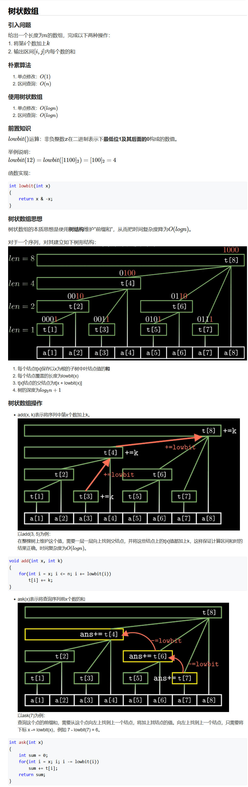

## LeetCode 精选 TOP 面试题（5）

### [215. 数组中的第K个最大元素](https://leetcode-cn.com/problems/kth-largest-element-in-an-array/)

**思路**

**快速选择** $O(n)$

快选是在快排的基础上只递归一半区间。


如果当前要找的数$>=x$递归左区间，否则递归右区间

**具体过程：** 

- 1、在特定区间`[l, r]`中，选中某个数`x`，将大于等于`x`的放在左边，小于`x`的放在右边，其中`[l, j]`是大于等于`x`的区间，`[j + 1,r]`是小于`x`的区间。
- 2、判断出第`k`大与`j`的大小关系，若`k <= j`，则递归到`[l, j]`区间，否则递归到`[j + 1,r]`的区间

**注意：**此处求的是第`k`大，而里面的方法`k`是指第`k`个位置，需要变成`k - 1`。 

**时间复杂度分析：**  递归时，每层时间复杂度为 $O(n)$，但并不是都进入左右两部分递归。仅进入一侧递归在平均情况下数组长度会减半，故时间复杂度为 $n+n/2+n/4+…+1=O(n)$。

**c++代码**

```c++
class Solution {
public:
    int findKthLargest(vector<int>& nums, int k) {
        return quick_sort(nums, 0, nums.size() - 1, k - 1); //注意下标
    }

    int quick_sort(vector<int>& nums, int l ,int r, int k){
        if(l == r) return nums[l];
        int x = nums[l], i = l - 1, j = r + 1;
        while(i < j){
            do i++; while(nums[i] > x);
            do j--; while(nums[j] < x);
            if(i < j) swap(nums[i], nums[j]);
        }

        if(k <= j) return quick_sort(nums, l, j, k);
        else return quick_sort(nums, j + 1, r, k);
    }
};
```

### [217. 存在重复元素](https://leetcode-cn.com/problems/contains-duplicate/)

**思路**

**(哈希)**   $O(n)$

**具体过程如下：**

- 1、定义一个哈希表，存贮每个数字出现的次数。
- 2、遍历`nums`数组，如果某个数字出现次数大于`1`，返回`true`。
- 3、否则，返回`false`

**c++代码**

```c++
class Solution {
public:
    bool containsDuplicate(vector<int>& nums) {
        unordered_map<int, int> hash;
        for(int x : nums) hash[x]++;
        for(int x : nums){
            if(hash[x] > 1) return true;
        }
        return false;
    }
};
```

### [227. 基本计算器 II](https://leetcode-cn.com/problems/basic-calculator-ii/)

**思路**

**(栈,表达式求值)**  $O(n)$ 

对于表达式求值这类问题，我们维护两个栈，一个`num`栈用来记录数字，一个`op`栈用来记录操作符，遍历表达式，遇到操作符时进行数的相应计算。

首先我们定义一个`eval()`函数，用于从数字栈`num`中弹出两个数字`a`和`b`，再从操作符栈`op`中弹出操作符号，进行计算后将结果数字加入到数字栈`num`中。 


**具体定义如下：** 

```c++
void eval() 
{
    int b = num.top(); num.pop();
    int a = num.top(); num.pop();
    char c = op.top(); op.pop();
    int r;
    if (c == '+') r = a + b;
    else if (c == '-') r = a - b;
    else if (c == '*') r = a * b;
    else r = a / b;
    num.push(r);
}
```

**然后我们从前往后扫描整个表达式：** 

- 1、当遇到空格` ' '`时，跳过。  

- 2、当遇到数字时，则读取一个连续的完整数字，再将其加入到数字栈`num`中。
- 3、当遇到`'+'`，`'-'`，`'*'`，`'/'` 运算符时，需要考虑优先级：
  - 如果操作符栈`op`的栈顶元素的优先级比当前遇到的操作符优先级高或者相等，则`while`循环进行`eval()`操作，即将数字栈`num`栈顶的两个元素取出来，然后和操作符栈`op`的栈顶操作符进行相应计算，并将计算结果压回数字栈`num`中。
  - 否则，将当前运算符压入操作符栈`op`中。
- 4、扫描完整个表达式后，如果操作符栈`op`中还存在元素，则`while`循环进行`eval()`操作。
- 5、最终返回数字栈`num`的栈顶元素值。

**图示过程： ** 


**细节处理：**

- 1、由于运算符有优先级，所以设计一个哈希表来存储`'+'`，`'-'`，`'*'`，`'/'` 优先级，我们将`'+'`和`'-'`设为`1`级优先级，将`'*'`和`'/'`设为`2`级优先级。
- 2、考虑到表达式`s`的第一个数字可能为负数，因此我们给`s`开头添加一个字符`0`。

**时间复杂度分析：** 每个数字和操作进栈出栈一次，所以总的时间复杂度是 $O(n)$ 。

**c++代码**

```c++
class Solution {
public:
    stack<int> num;  //存贮数字
    stack<char> op;  //存贮操作

    void eval() 
    {
        int b = num.top(); num.pop();
        int a = num.top(); num.pop();
        char c = op.top(); op.pop();
        int r;
        if (c == '+') r = a + b;
        else if (c == '-') r = a - b;
        else if (c == '*') r = a * b;
        else r = a / b;
        num.push(r);
    }

    int calculate(string s) {
        s = '0' + s;  // 对开头是负数的处理 
        unordered_map<char, int> pr; 
        pr['+'] = pr['-'] = 1, pr['*'] = pr['/'] = 2; //定义运算符的优先级
        for(int i = 0; i < s.size(); i++)
        {
            char c = s[i]; 
            if(c == ' ') continue;  //跳过空格
            if(isdigit(c))     //c是数字,读取一个连续的数字
            {
                int x = 0, j = i;
                while(j < s.size() && isdigit(s[j])) x = x * 10 + (s[j++] - '0');
                num.push(x);    //加入数字栈中
                i = j - 1;        
            }
            else  //c是操作符 
            {     //op栈非空并且栈顶操作符优先级大于等于当前操作符c的优先级，进行eval()计算
                while(op.size() && pr[op.top()] >= pr[c]) eval(); 
                op.push(c);
            }
        }
        while(op.size()) eval(); 
        return num.top();
    }
};
```

### [230. 二叉搜索树中第K小的元素](https://leetcode-cn.com/problems/kth-smallest-element-in-a-bst/)

**思路**

**(dfs)**  $O(n)$ 

**什么是二叉搜索树 ？**

二叉搜索树是一棵有序的二叉树，所以我们也可以称它为二叉排序树。具有以下性质的二叉树我们称之为二叉搜索树：若它的左子树不为空，那么左子树上的所有值均小于它的根节点；若它的右子树不为空，那么右子树上所有值均大于它的根节点。它的左子树和右子树分别也为二叉搜索树。

**二叉搜索树的中序遍历是：左=>根=>右； 二叉搜索树的中序遍历从小到大是有序的。** 

**中序遍历模板** 

```c++
//打印中序遍历
void dfs(TreeNode* root ) 
{
    if(!root) return;
    dfs(root->left); 	//左
    print(root->val);   //根
   	dfs(root->right);	//右
}
```

**过程如下：**

- 1、按照**左->根->右**的顺序（中序遍历）遍历二叉树

- 2、我们每次遍历一个节点的时候就让`k--`，当`k`减为`0`时，我们就找到了第`k`小的节点。

具体实现细节看代码。

**时间复杂度分析：** 每个节点最多只会被遍历`1`次，因此`n`个节点，时间复杂度为$O(n)$ 。

**c++代码**

```c++
/**
 * Definition for a binary tree node.
 * struct TreeNode {
 *     int val;
 *     TreeNode *left;
 *     TreeNode *right;
 *     TreeNode() : val(0), left(nullptr), right(nullptr) {}
 *     TreeNode(int x) : val(x), left(nullptr), right(nullptr) {}
 *     TreeNode(int x, TreeNode *left, TreeNode *right) : val(x), left(left), right(right) {}
 * };
 */
class Solution {
public:
    int res = 0;
    int kthSmallest(TreeNode* root, int k) {
        dfs(root, k);
        return res;
    }
    //引用传递，共用一个k
    void dfs(TreeNode* root, int &k){
        if(!root) return;
        dfs(root->left, k);
        k--;
        if(!k) res = root->val;
        dfs(root->right, k);
    }
};
```

### [234. 回文链表](https://leetcode-cn.com/problems/palindrome-linked-list/)

**思路**

**(链表操作)** 

假设初始的链表是 $L1→L2→L3→…→Ln$。 


分两步处理：

- 找到链表的中点节点，将其后半段的指针都反向，变成：$L1→L2→L3→…→L⌈n/2⌉←L⌈n/2⌉+1←…←Ln$;	

  

- 然后用两个指针分别从链表首尾开始往中间扫描，依次判断对应节点的值是否相等，如果都相等，说明是回文链表，否则不是。

  

- 最后再将整个链表复原。

**注意：**

1、我们选取链表的中点节点为$(n+1)/2$   下取整，$n$是链表的节点个数。

2、如果一个链表是奇数个节点(假设为5个节点)，将其后半段翻转完后的链表为： 


3、如果一个链表是偶数个节点(假设为4个节点)，将其后半段翻转完后的链表为：


 **连接左右链表节点之间的指向是双向的**

4、具体实现细节看代码

**空间复杂度分析：**链表的迭代翻转算法仅使用额外 $O(1)$ 的空间，所以本题也仅使用额外 $O(1)$ 的空间。

**时间复杂度分析：**整个链表总共被遍历`4`次，所以时间复杂度是 $O(n)$。

**c++代码**

```c++
/**
 * Definition for singly-linked list.
 * struct ListNode {
 *     int val;
 *     ListNode *next;
 *     ListNode() : val(0), next(nullptr) {}
 *     ListNode(int x) : val(x), next(nullptr) {}
 *     ListNode(int x, ListNode *next) : val(x), next(next) {}
 * };
 */
class Solution {
public:
    bool isPalindrome(ListNode* head) {
        int n = 0 ; //统计节点的个数
        for(ListNode *p = head ; p ; p = p->next) n++;
        if(n <= 1) return true; //节点数<=1的一定是回文链表
        //找到中点节点，由第一个节点跳(n+1)/2 -1步到达中点节点
        ListNode* a = head;
        for(int i = 0; i < (n+1)/2 - 1; i++) a = a->next; //a指针指向链表中点
        ListNode* b = a->next;  //b指针指向链表中点的下一个节点
        while(b) //将链表的后半段反向
        {
            ListNode* next = b->next; //保留b的next节点
            b->next = a;
            a = b, b = next;
        }6
        //此时a指向链表的尾节点,我们让b指向链表的头节点
        b = head;
        ListNode* tail = a; //保留一下尾节点
        bool res = true;
        for(int i = 0; i < n/2; i++) //判断是否是回文链表
        {
            if(b->val != a->val)
            {
                res = false;
                break;
            }
            b = b->next;
            a = a->next;
        }
        //将链表复原，后半段链表翻转
        //a指向尾节点，b指向a的下一个节点
        a = tail, b = a->next;
        for(int i = 0; i < n/2; i++)
        {
            ListNode* next = b->next;
            b->next = a;
            a = b , b = next;
        }
        tail->next = 0;
        return res;
    }
};
```

### [236. 二叉树的最近公共祖先](https://leetcode-cn.com/problems/lowest-common-ancestor-of-a-binary-tree/)

**思路**

**(递归)**   $O(n)$ 

考虑`p`和`q`这两个节点共有三种情况：
1、`p` 和 `q`在`root`的子树中，且位于两侧。
2、`p = root` 且 `q` 在 `root` 的左或右子树中。
3、`q = root` 且 `p` 在 `root` 的左或右子树中。

考虑在左子树和右子树中查找这两个节点，如果两个节点分别位于左子树和右子树，则最近公共祖先为自己(`root`)，若左子树中两个节点都找不到，说明最低公共祖先一定在右子树中，反之亦然。考虑到二叉树的递归特性，因此可以通过递归来求得。

**时间复杂度分析：**需要遍历整颗树，复杂度为 $O(n)$。

**c++代码**

```c++
/**
 * Definition for a binary tree node.
 * struct TreeNode {
 *     int val;
 *     TreeNode *left;
 *     TreeNode *right;
 *     TreeNode(int x) : val(x), left(NULL), right(NULL) {}
 * };
 */
class Solution {
public:
    TreeNode* lowestCommonAncestor(TreeNode* root, TreeNode* p, TreeNode* q) {
         if(!root) return NULL;  //没有找到，返回null
        if(root == p || root == q) return root; //找到其中之一，返回root
        TreeNode* left = lowestCommonAncestor(root->left, p, q);  //返回左子树查找节点
        TreeNode* right = lowestCommonAncestor(root->right,p ,q); //返回右子树查找节点
        if(left && right) return root; 
        if(left) return left;
        else return right;
    }
};
```

### [237. 删除链表中的节点](https://leetcode-cn.com/problems/delete-node-in-a-linked-list/)

**思路**

**(链表)**  $O(1)$ 

由于是单链表，我们不能找到前驱节点，所以我们不能按常规方法将该节点删除。  我们可以换一种思路，将下一个节点的值复制到当前节点，然后将下一个节点删除即可。

**c++代码**

```c++
/**
 * Definition for singly-linked list.
 * struct ListNode {
 *     int val;
 *     ListNode *next;
 *     ListNode(int x) : val(x), next(NULL) {}
 * };
 */
class Solution {
public: 
    /**
    由于是单链表，我们不能找到前驱节点，所以我们不能按常规方法将该节点删除。
    我们可以换一种思路，将下一个节点的值复制到当前节点，然后将下一个节点删除即可。
    **/
    void deleteNode(ListNode* node) {
       node->val = node->next->val;  //复制下一个节点
       node->next = node->next->next; 
    }
};
```

### [238. 除自身以外数组的乘积](https://leetcode-cn.com/problems/product-of-array-except-self/)

**思路**

**(前缀积)**  $O(n)$

最为直接的思路：申请两个数组，一个用来记录每个位置左边的乘积，另一个用来记录它右边的乘积，最后再把两个数组乘起来即可，但是这样的空间复杂度为$O(n)$。

类比于前缀和，我们用一个`p`数组，来存贮`nums[0] * nums[1] *...* nums[i - 1]`。然后从数组末尾开始遍历，用`s`记录数组末尾若干数字的乘积，然后每次更新`p[i]`即可。

**具体过程如下：** 

- 1、遍历整个数组，利用前缀积公式`p[i] = p[i - 1] * nums[i - 1]`，求出`p`数组。
- 2、初始化`s = 1`，倒序遍历数组，每次先执行`p[i] *= s `，然后`s *= nums[i]`。
- 3、最后返回`p`数组。

**时间复杂度分析：**  $O(n)$。

**c++代码**

```c++
class Solution {
public:
    vector<int> productExceptSelf(vector<int>& nums) {
        int n = nums.size();
        vector<int>p(n, 1);
        for(int i = 1; i < n; i++)  p[i] = p[i - 1] * nums[i - 1];
        for(int i = n - 1, s = 1; i >= 0; i--){
            p[i] *= s;
            s *= nums[i];
        }
        return p;
    }
};
```

### [239. 滑动窗口最大值](https://leetcode-cn.com/problems/sliding-window-maximum/)

**思路**

给定一个数组 `nums` 和滑动窗口的大小 `k`，让我们找出所有滑动窗口里的最大值。

**样例：**


如样例所示，`nums =  [1,3,-1,-3,5,3,6,7]`，`k = 3`，我们输出`[3,3,5,5,6,7] `。

首先，我们可以想到最朴素的做法是模拟滑动窗口的过程，每向右滑动一次都遍历一遍滑动窗口，找到最大的元素输出，这样的时间复杂度是$O(nk)$。考虑优化，其实滑动窗口类似于数据结构双端队列，窗口向右滑动过程相当于向队尾添加新的元素，同时再把队首元素删除。


**如何更快的找到队列中的最大值？**

其实我们可以发现，队列中没必要维护窗口中的所有元素，我们可以在队列中只保留那些可能成为窗口中的最大元素，去掉那些不可能成为窗口中的最大元素。

考虑这样一种情况，如果新进来的数字大于滑动窗口的末尾元素，那么末尾元素就不可能再成为窗口中最大的元素了，因为这个大的数字是后进来的，一定会比之前先进入窗口的小的数字要晚离开窗口，因此我们就可以将滑动窗口中比其小的数字弹出队列，于是队列中的元素就会维持从队头到队尾单调递减，这就是**单调递减队列**。

**单调递增队列** 


对于队列内的元素来说：

1. 在队列内自己左边的数就是数组中左边第一个比自己小的元素。
2. 当被弹出时，遇到的就是数组中右边第一个比自己小的元素 。( 只要元素还在队列中，就意味着暂时还没有数组中找到自己右侧比自己小的元素)
3. **队头到队尾单调递增，队首元素为队列最小值。** 

**单调递减队列** 


对于队列内的元素来说：

1. 在队列内自己左边的数就是数组中左边第一个比自己大的元素。
2. 当被弹出时，遇到的就是数组中右边第一个比自己大的元素 ，只要元素还在队列中，就意味着暂时还没有数组中找到自己右侧比自己大的元素。
3. **队头到队尾单调递减，队首元素为队列最大值。** 

了解了单调队列的一些性质以后，对于这道题我们就可以维护一个单调递减队列，来保存队列中所有递减的元素 ，随着入队和出队操作实时更新队列，这样队首元素始终就是队列中的最大值。同时如果队首元素在滑动窗口中，我们就可以将其加入答案数组中。

**实现细节：**

为了方便判断队首元素与滑动窗口的位置关系，**队列中保存的是对应元素的下标。**  

**具体解题过程如下：**

初始时单调队列为空，随着对数组的遍历过程中，每次插入元素前，需要考察两个事情：

- 1、合法性检查：队头下标如果距离` i` 超过了 `k` ，则应该出队。
- 2、单调性维护：如果 `nums[i]` 大于或等于队尾元素下标所对应的值，则当前队尾再也不可能充当某个滑动窗口的最大值了，故需要队尾出队，始终保持队中元素从队头到队尾单调递减。
- 3、如次遍历一遍数组，队头就是每个滑动窗口的最大值所在下标。

**时间复杂度分析：** 每个元素最多入队出队一次，复杂度为$O(n)$。

**c++代码**

```c++
class Solution {
public:
    vector<int> maxSlidingWindow(vector<int>& nums, int k) {
        deque<int> q;
        vector<int>res;
        for(int i = 0; i < nums.size(); i++){
            while(q.size() && i - k + 1 > q.front()) q.pop_front();
            while(q.size() && nums[i] >= nums[q.back()]) q.pop_back();
            q.push_back(i);
            if(i >= k - 1) res.push_back(nums[q.front()]);
        }
        return res;
    }
};
```

### [240. 搜索二维矩阵 II](https://leetcode-cn.com/problems/search-a-2d-matrix-ii/)

**思路**

**(单调性扫描)** $O(n+m)$

在`m x n`矩阵 `matrix`中我们可以发现一个性质：对于每个子矩阵右上角的数`x`，`x`左边的数都小于等于`x`，`x`下边的数都大于`x`。 


因此我们可以从整个矩阵的右上角开始枚举，假设当前枚举的数是 `x`：

- 如果 `x` 等于`target`，则说明我们找到了目标值，返回`true`；
- 如果 `x`小于`target`，则 `x`左边的数一定都小于`target`，我们可以直接排除当前一整行的数；
- 如果` x` 大于`target`，则 `x` 下边的数一定都大于`target`，我们可以直接排序当前一整列的数；

排除一整行就是让枚举的点的横坐标加一，排除一整列就是让纵坐标减一。当我们排除完整个矩阵后仍没有找到目标值时，就说明目标值不存在，返回`false`。

**具体过程如下：** 

- 1、初始化`i = 0`, `j = matrix[0].size() - 1`。
- 2、如果`matrix[i][j] == target`，返回`true`。
- 3、如果`matrix[i][j] < target`，`i++`，排除一行。
- 4、如果`matrix[i][j] > target`，`j--`，排除一列。
- 5、如果出界还未找到`target`，则返回`false`。

**时间复杂度分析：** 每一步会排除一行或者一列，矩阵一共有 $n$ 行，$m$ 列，所以最多会进行$n+m$步。所以时间复杂度是 $O(n+m)$。

**c++代码**

```c++
class Solution {
public:
    bool searchMatrix(vector<vector<int>>& matrix, int target) {
        int n = matrix.size(), m = matrix[0].size();
        if(!n || !m) return false;
        int i = 0, j = m - 1;
        while(i < n &&j >= 0 ){
            if(target == matrix[i][j]) return true;
            else if(target > matrix[i][j]) i++;
            else if(target < matrix[i][j]) j--;
        }
        return false;
    }
};
```

### [242. 有效的字母异位词](https://leetcode-cn.com/problems/valid-anagram/)

**思路**

**(哈希)**  $O(n)$

定义两个哈希表，记录每个字符出现的次数，最后判断两个哈希表是否相等。

**c++代码**

```c++
class Solution {
public:
    bool isAnagram(string s, string t) {
        unordered_map<char, int>a, b;
        for(char c : s) a[c]++;
        for(char c : t) b[c]++;
        return a == b;
    }
};
```

### [268. 丢失的数字](https://leetcode-cn.com/problems/missing-number/)

**思路**

**(基础数学)**   $O(n)$ 

直接对数组中的数字求和，然后用`n(n+1)2 − sum` 即可得到答案。

**时间复杂度分析：**只有一次求和，故时间复杂度为 $O(n)$ 

**c++代码**

```c++
class Solution {
public:
    int missingNumber(vector<int>& nums) {
        int n = nums.size(), sum = 0;
        for(int x : nums) sum += x;
        return (1 + n) * n / 2 - sum;
    }
};
```

### [279. 完全平方数](https://leetcode-cn.com/problems/perfect-squares/)

**思路**

**(动态规划 + 背包问题)**   $O(n\sqrt n)$ 

**状态表示：**`f[i]`表示通过平方数组成`i`所需要的最少完全平方数的个数。

**状态计算：**

每个物品的体积：`1`，`2`，`4`，`,,,` ，`j `，$\sqrt i$   (`j * j <= i`)  

假设背包大小为`i`，我们去枚举每个物品`w`，物品的体积为`w * w`，考虑最后一个物品`j`，有两种选择：

- 1、不选物品`j`，则 `f[i] = f[i]`。
- 2、选物品`j`，则`f[i] = f[i - j * j] + 1 `。

两种选择取最小值，**状态转移方程为：** `f[i] = min(f[i],f[i - j * j] + 1)`

**初始化：** `f[0] = 0`

**时间复杂度分析：** 状态数$O(n)$，状态计算$O(\sqrt n)$，故时间复杂度为$O(n\sqrt n)$ 。

**c++代码**

```c++
class Solution {
public:
    int numSquares(int n) {
        vector<int>f(n + 1, n);
        f[0] = 0; //初始化
        for(int i = 1; i <= n; i++)
            for(int j = 1; j * j <= n; j++)
                if(i >= j * j)
                    f[i] = min(f[i], f[i - j * j] + 1);
        return f[n];            
    }
};
```

### [283. 移动零](https://leetcode-cn.com/problems/move-zeroes/)

**思路**

**(双指针)**  $O(n)$  

给定一个数组 `nums`，要求我们将所有的 `0` 移动到数组的末尾，同时保持非零元素的相对顺序。

**样例：** 


如样例所示，数组`nums = [0,1,0,3,12]`，移动完成后变成`nums = [1,3,12,0,0]` ，下面来讲解双指针的做法。

我们定义两个指针，`i`指针和`k`指针，`i`指针用来遍历整个`nums`数组，`k`指针用来放置`nums`数组元素。然后将非`0`元素按照原有的相对顺序都放置到`nums`数组前面，剩下的位置都置为`0`。这样我们就完成了`0`元素的移动，同时也保持了非`0`元素的相对顺序。

**具体过程如下：**

- 1、定义两个指针`i`和`k`，初始化`i = 0`，`k = 0`。
- 2、`i`指针向后移动，遍整个`nums`数组，如果 `nums[i] != 0`，也就是说遇到了非`0`元素，此时我们就将`nums[i]`元素放置到`nums[k]`位置，同时`k++`后一位。
- 3、最后将`k`位置之后的元素都赋值为`0`。

**实现细节：**

遍历数组可以使用`for(int x : nums)`，这样就少定义一个指针，代码也显得更加简洁。

**时间复杂度分析：** $O(n)$ ，$n$是数组的长度，每个位置只被遍历一次。

**c++代码**

```c++
class Solution {
public:
    void moveZeroes(vector<int>& nums) {
        int k = 0;
        for(int x : nums){
            if(x != 0) nums[k++] = x;
        }
        while(k < nums.size()) nums[k++] = 0;
    }
};
```

### [287. 寻找重复数](https://leetcode-cn.com/problems/find-the-duplicate-number/)

**思路**

**(二分，抽屉原理)**  $O(nlogn)$ 

**抽屉原理:**  `n+1` 个苹果放在 `n` 个抽屉里，那么至少有一个抽屉中会放两个苹果。

在这个题目里，一共有 `n+1` 个数，每个数的取值范围是`1`到`n`，所以至少会有一个数出现两次。

然后我们采用分治的思想，将每个数的取值的区间`[1, n]`划分成`[1, n/2]`和`[n/2+1, n]`两个子区间，然后分别统计两个区间中数的个数。
注意这里的区间是指 **数的取值范围**，而不是 **数组下标**。 

划分之后，左右两个区间里一定至少存在一个区间，区间中数的个数大于区间长度。
这个可以用反证法来说明：如果两个区间中数的个数都小于等于区间长度，那么整个区间中数的个数就小于等于n，和有n+1个数矛盾。

因此我们可以把问题划归到左右两个子区间中的一个，而且由于区间中数的个数大于区间长度，根据抽屉原理，在这个子区间中一定存在某个数出现了两次。

依次类推，每次我们可以把区间长度缩小一半，直到区间长度为1时，我们就找到了答案。

**时间复杂度分析：** 每次会将区间长度缩小一半，一共会缩小 $O(logn)$ 次。每次统计两个子区间中的数时需要遍历整个数组，时间复杂度是 $O(n)$。所以总时间复杂度是 $O(nlogn)$。

**c++代码**

```c++
class Solution {
public:
    int findDuplicate(vector<int>& nums) {
        int l = 1, r = nums.size() - 1;  //取值范围
        while(l < r){
            int mid = (l + r) / 2;
            int s = 0;
            for(int x : nums) s += x >= l && x <= mid; //左区间数的个数
            if(s > mid - l + 1) r = mid;
            else l = mid + 1;
        }
        return r;
    }
};
```

### [289. 生命游戏](https://leetcode-cn.com/problems/game-of-life/)

**思路**

**(位运算 + 模拟)**  $O(nm)$

如何做到不用额外的空间，且把所有位置细胞的状态同时改变呢？因为只有`0`和`1`两个状态，因此我们可以用二进制中的第二位来存储变化后的状态。

- `00`：一开始是死细胞，后来还是死细胞
- `01`：一开始是活细胞，后来变成死细胞
- `10`：一开始是死细胞，后来变成活细胞
- `11`：一开始是活细胞，后来还是活细胞

我们最后把第二位全部右移一位就是结果数组了。

**具体过程如下：**

1、我们`cur`表示当前细胞状态，`live`表示当前细胞周围存活的细胞个数，`next`表示当前细胞的下一个状态。

2、遍历` board`数组，对于每一个` board[i][j]`方格上的细胞，先统计出周围存活的细胞个数`live`。

- 当前细胞状态为存活，即`cur = board[i][j] & 1 = 1`：
  - 如果`live < 2 || live > 3`，则其下一个状态为死亡，即 `next = 0`，
  - 否则`next = 1`。

- 当前细胞状态为死亡，即`cur = board[i][j] & 1 = 0`:
  - 如果`live == 3`，则其下一个状态为存活，即 `next = 1`。
  - 否则`next = 0`。

3、将`next`右移一位，存贮到`board[i][j]`中，即` board[i][j] |= next << 1`。

4、最后将`board`数组中的每一个元素左移一位。

**时间复杂度分析：**  $O(nm)$ 

**c++代码**

```c++
class Solution {
public:
    void gameOfLife(vector<vector<int>>& board) {
        if(board.empty() || board[0].empty()) return ;
        int n = board.size(), m = board[0].size();
        for(int i = 0; i < n; i++){
            for(int j = 0; j < m; j++){
                int live = 0;
                for(int x = i - 1; x <= i + 1; x++)
                    for(int y = j - 1; y <= j + 1; y++)
                    if(x >= 0 && x < n && y >=0 && y < m && !(x == i && y == j) && (board[x][y] & 1)){
                        live++;
                    }
                int cur = board[i][j] & 1, next = 0;
                if(cur){
                    if(live < 2 || live > 3) next = 0;
                    else next = 1;
                }else{
                    if(live == 3) next = 1;
                    else next = 0;
                }  
                board[i][j] |= next << 1;  
            }
            
        }
        for(int i = 0; i < n; i++)
            for(int j = 0; j < m; j++){
                board[i][j] >>= 1;
            }
    }
};
```

### [295. 数据流的中位数](https://leetcode-cn.com/problems/find-median-from-data-stream/)

**知识补充：**

https://www.cnblogs.com/wangchaowei/p/8288216.html

https://cloud.tencent.com/developer/article/1616910

**数据结构 - 堆**   

- Heap是一种数据结构具有以下的特点：
  (1）**完全二叉树**；
  (2）heap中存储的值是**偏序**；
- **Min-heap**:   父节点的值小于或等于子节点的值；
- **Max-heap**: 父节点的值大于或等于子节点的值；


**优先队列：** 

priority_queue称为“优先队列”，其底层是用堆实现。在优先队列中，队首元素一定是当前队列中优先级最高的哪一个。

默认的定义优先队列是大根堆，即父节点的值大于子节点的值。

**获取堆顶元素**

> top()：可以获得队首元素（堆顶元素），时间复杂度为O(1)。 与队列不一样的是，优先队列通过top()函数来访问队首元素（堆顶元素）。（队列是通过front()函数和back()函数访问下标）

**入队**

> push(x) ：令x入队，时间复杂度为O(logN)，其中N为当前优先队列中的元素个数。

**出队**

> pop()：   令队首元素（堆顶元素）出队，时间复杂度为O(logN)，其中N为当前优先队列中的元素个数。

**检测是否为空**

> empty()：检测优先队列是否为空，返回true为空，false为非空。时间复杂度为O（1）

**获取元素个数**

> size()：用来获得优先队列中元素的个数，时间复杂度为 O(1)

**案例代码** 

```c++
#include
#include
using namespace std;
int main(){
    priority_queue q;

    //入队
    q.push(3);
    q.push(4);
    q.push(1);

    //通过下标访问元素
    printf("%d\n",q.top());//输出4

    //出队
    q.pop();
    printf("%d\n",q.top());//输出3

    //检测队列是否为空
    if(q.empty() == true) {
        printf("Empty\n");
    } else {
        printf("Not Empty\n");
    }

    //获取长度
    //printf("%d\n",q.size());//输出3
}
```

**基本数据类型的优先级设置**

一般情况下，数字大的优先级更高。（char类型的为字典序最大） 对于基本结构的优先级设置。下面两种优先队列的定义是等价的： 

```c++
priority_queue<int> q; 
priority_queue<int, vector<int>, greater<int>> q;
```

如果想让优先队列总是把最小的元素放在队首，需进行以下定义：

```c++
priority_queue<int, vector<int>, grater<int>> q
```

**思路**

**(双堆)**  $O(nlogn)$


**c++代码**

```c++
class MedianFinder {
public:
    priority_queue<int, vector<int>, greater<int>> up;  //小根堆
    priority_queue<int> down;  // 大根堆

    /** initialize your data structure here. */
    MedianFinder() {

    }

    void addNum(int num) {
        if (down.empty() || num <= down.top()) {
            down.push(num);
            if (down.size() > up.size() + 1) {
                up.push(down.top());
                down.pop();
            }
        } else {
            up.push(num);
            if (up.size() > down.size()) {
                down.push(up.top());
                up.pop();
            }
        }
    }

    double findMedian() {
        if ((down.size() + up.size()) % 2) return down.top();
        return (down.top() + up.top()) / 2.0;
    }
};
```

### [297. 二叉树的序列化与反序列化](https://leetcode-cn.com/problems/serialize-and-deserialize-binary-tree/)

**思路**

**(前序遍历序列化)**   $O(n)$

1. 序列化：对整个二叉树进行先序遍历的序列存起来，同时需要把每个结点的空节点使用`"#"`进行标记，例如样例的顺序是`1,2,#,#,3,4,#,#,5,#,#`
2. 反序列化：对整个字符串按照`","`进行分割，把所有的元素按序存到链表中（链表元素的顺序是先序序列），按先序遍历的方式拿链表的元素，每次拿第一个元素作为根结点，并删除链表中的第一个元素，然后递归到左儿子做同样的操作，递归到右儿子做同样的操作。注意：若第一个元素是`"#"`,表示该节点是`null`，直接返回`null

**时间复杂度分析： **每个节点仅遍历两次，故时间复杂度为 $O(n)$。

**c++代码**

```c++
/**
 * Definition for a binary tree node.
 * struct TreeNode {
 *     int val;
 *     TreeNode *left;
 *     TreeNode *right;
 *     TreeNode(int x) : val(x), left(NULL), right(NULL) {}
 * };
 */
class Codec {
public:

    string path;
    // Encodes a tree to a single string.
    string serialize(TreeNode* root) {
        dfs_s(root);
        return path;
    }

    void dfs_s(TreeNode* root){
        if(!root) path += "#,";
        else{
            path += to_string(root->val) + ',';
            dfs_s(root->left);
            dfs_s(root->right);
        }
    }

    // Decodes your encoded data to tree.
    TreeNode* deserialize(string data) {
        int idx = 0;
        return dfs_d(data, idx);
    }

    TreeNode* dfs_d(string &data, int& idx){
        if(data[idx] == '#') {
            idx += 2;
            return NULL;
        }else{
            int k = idx;
            while(data[idx] != ',') idx++;
            TreeNode* root = new TreeNode(stoi(data.substr(k, idx - k)));       idx++;
            root->left = dfs_d(data, idx);
            root->right = dfs_d(data, idx);
            return root;
        }
    }
};

// Your Codec object will be instantiated and called as such:
// Codec ser, deser;
// TreeNode* ans = deser.deserialize(ser.serialize(root));
```

### [300. 最长递增子序列](https://leetcode-cn.com/problems/longest-increasing-subsequence/)

**思路**

**(动态规划)** $O(n^2)$

**状态表示：**`f[i]`表示以`nums[i]`为结尾的严格递增子序列的最大长度。

**集合划分：**  以`nums[i]`为结尾的严格递增子序列前一个数是`nums[0]`，`nums[1]`,,,`nums[i-1]`

**状态计算：** ` f[i] = max(f[i],f[j] + 1)  (j<i && nums[j] < nums[i])`

**图示说明：**


**时间复杂度分析：** 状态数量为$O(n)$，状态计算为$O(n)$，故时间复杂度为$O(n^2)$。 

**c++代码**

**c++代码**

```c++
class Solution {
public:
    int lengthOfLIS(vector<int>& nums) {
        int n = nums.size();
        vector<int>f(n + 1);
        int res = 0;
        for(int i = 0; i < n; i++){
            f[i] = 1;
            for(int j = 0; j < i; j++)
                if(nums[i] > nums[j])
                    f[i] = max(f[i], f[j] + 1);
            res = max(res, f[i]);        
        }
        return res;
    }
};
```

### [315. 计算右侧小于当前元素的个数](https://leetcode-cn.com/problems/count-of-smaller-numbers-after-self/)

**思路**

**(树状数组)** 



1、将所有的数字离散化到`1 ~ n`。

2、然后从右向左扫描数组，每遇到一个数，在树状数组中查询 `query(nums[i] - 1)`，即树状数组中小于等于 `nums[i]` 位置的前缀和。

3、然后更新树状数组 `add(nums[i], 1)`，即在 `nums[i]`位置上加 `1`。

**c++代码**

```c++
class Solution {
public:
    /**
        树状数组
    **/
    vector<int> t;
    const int n = 20001;
    int lowbit(int x){
        return -x & x;
    }
    void add(int x, int k){
        for(int i = x; i <= n; i += lowbit(i)) t[i] += k;
    }
    int query(int x){
        int sum = 0;
        for(int i = x; i; i -= lowbit(i))  sum += t[i];
        return sum;
    }
    vector<int> countSmaller(vector<int>& nums) {
        t.resize(n + 1);
        vector<int> res(nums.size());
        for(int i = nums.size() - 1; i >= 0; i--){
            int x = nums[i] + 10001; //离散化
            res[i] = query(x - 1);
            add(x, 1);
        }
        return res;
    }
};
```

### [322. 零钱兑换](https://leetcode-cn.com/problems/coin-change/)

**思路**

**思路**

**(动态规划，完全背包问题)**  $O(nm)$  

完全背包问题。

相当于有`n` 种物品，每种物品的体积是硬币面值，价值是`1`，每种物品可用无限次。问装满背包最少需要多少价值的物品？

先考虑二维状态

**状态表示：** `f[i][j]` 表示从前`i`种硬币中选，且总金额恰好为`j`的所需要的最少硬币数。

那么`f[n][amount]`就表示表示 从前`n`种硬币中选，且总金额恰好为`amount`的所需要的最少硬币数，即为答案。

**集合划分：**

按照第`i`种硬币可以选 `0`个,`1`个，`2`个，`3`个，，，，`k`个划分集合 `f[i][j]`。其中`k*w[i] <= j`,也就是说在背包能装下的情况下，枚举第`i`种硬币可以选择几个。

不使用第`i`种硬币，状态表示:  	`f[i-1][j]`

使用第`i`种硬币，假设我们使用`k`个(容量允许的情况下)，状态表示：`min(f[i-1][j - k*coin]) + k`  

**状态计算方程：** 

`f[i][j] = min(f[i-1][j],f[i-1][j-coins[i]] + 1,f[i-1][j-2*coins[i]] + 2,......,f[i-1][j-k*coins[i]] + k) ` .

**初始化条件:**

`f[0][0]=0`，其余`f[0][j] = INF`，表示当没有任何硬币的时候，存在凑成总和为 `0` 的方案，方案所使用的硬币为 `0`；凑成其他总和的方案不存在。

**c++代码**

```c++
class Solution {
public:
    int INF = 1000000000;
    int coinChange(vector<int>& coins, int amount) {
         int n = coins.size();
         vector<vector<int>> f (n + 1, vector<int>(amount + 1, INF));

         f[0][0] = 0;   
         for(int i = 1; i <= n; i++)
         {
         	int val = coins[i-1];
            for(int j = 0; j <= amount; j++)
                for(int k = 0; k*val <= j; k++)
                {
                    f[i][j] = min(f[i][j] , f[i-1][j-k*val] + k);
                }
         }	 
        if (f[n][amount] == INF) f[n][amount] = -1;
        return f[n][amount];
    }
};
```

**时间复杂度分析：** 共有 $n * amount$ 个状态需要转移，每个状态转移最多遍历$amount$次。整体复杂度为$O(n * amount^2)$

 

超出时间限制，考虑一维优化。

**一维优化** 

`v`代表第`i`件物品的体积(面值)

`f[i][j] = min( f[i-1][j],f[i-1][j-v] + 1,f[i-1][j-2v] + 2......f[i-1][j-kv] + k)`

`f[i][j-v] + 1 = min(f[i-1,[j-v] + 1,f[i-1][j-2v] + 2......,f[i-1][j-kv] + k)`  

**因此：**

`f[i][j] = min(f[i-1][j],f[i][j-v] + 1)`  

**图示：**


**去掉一维：**

**状态计算方程为:** `f[j] = min([j],[j-v] + 1)`

物品的体积即硬币面值: `f[j] = min([j],[j-coins[i]] + 1)` 

**时间复杂度分析**：令 `n` 表示硬币种数，`m` 表示总价钱，则总共两层循环，所以时间复杂度是 $O(nm)$。 

**c++代码**

```c++
class Solution {
public:
    const int INF = 1e9 + 10;
    int coinChange(vector<int>& coins, int amount) {
        int n = coins.size();
        vector<int>f(amount + 1, INF);
        f[0] = 0;
        for(int i = 0; i < n; i++)
            for(int j = coins[i]; j <= amount; j++)
                f[j] = min(f[j], f[j - coins[i]] + 1);
        if (f[amount] == INF) f[amount] = -1;        
        return f[amount];        
    }
};
```

### [326. 3 的幂](https://leetcode-cn.com/problems/power-of-three/)

**思路**

**(递归)**

- 1、如果一个数可以被3整除，我们递归计算`n / 3`。
- 2、递归边界，`n == 1`表示`n`是`3`的幂次方，`n == 0`表示`n`不是`3`的幂次方

**c++代码**

```c++
class Solution {
public:
    bool isPowerOfThree(int n) {
        if(n == 1) return true;
        if(n == 0) return false;
        return isPowerOfThree(n / 3) && n % 3 == 0;
    }
};
```

### [328. 奇偶链表](https://leetcode-cn.com/problems/odd-even-linked-list/)

**思路**

**(链表)**  $O(n)$   

根据节点编号的奇偶性，我们可以将奇数节点和偶数节点分离成奇数链表和偶数链表，然后将偶数链表连接在奇数链表之后，合并后的链表即为结果链表。 


**具体过程如下：**

1、从前往后遍历整个链表，遍历时维护四个指针：奇数链表头结点，奇数链表尾节点，偶数链表头结点，偶数链表尾节点。 


2、遍历时将位置编号是奇数的节点插在奇数链表尾节点后面，将位置编号是偶数的节点插在偶数链表尾节点后面。 

- 具体可以先定义一个`p`指针,让`p`指针向指向链表第三个节点，即`p = head->next->next`。

- 奇数链表尾节点`oddTail`的`next`指针指向`p`节点，并后移一位，即`oddTail = oddTail->next = p`。
- `p`指针后移一位。
- 偶数链表尾节点`evenTail`的`next`指针指向`p`节点, 并后移一位，即`evenTail = evenTail->next = p`。 
- `p`指针后移一位，重复上述过程。

最终我们就将奇偶链表分离开来，如下图所示：


3、遍历完整个链表后，将偶数链表头结点插在奇数链表尾节点后面即可。  

```c++
oddTail->next  = evenHead;  //将偶数链表头结点插在奇数链表尾节点后面
evenTail->next = nullptr;   //偶数链表尾节点指向null
```


**时间复杂度分析：** 整个链表只遍历一次，所以时间复杂度是$O(n)$，遍历时只记录了常数个额外的指针，所以额外的空间复杂度是 $O(1)$。 

**c++代码**

```c++
/**
 * Definition for singly-linked list.
 * struct ListNode {
 *     int val;
 *     ListNode *next;
 *     ListNode() : val(0), next(nullptr) {}
 *     ListNode(int x) : val(x), next(nullptr) {}
 *     ListNode(int x, ListNode *next) : val(x), next(next) {}
 * };
 */
class Solution {
public:
    ListNode* oddEvenList(ListNode* head) {
        if(!head || !head->next) return head;
        auto oddHead  = head, oddTail = oddHead;  //定义4个链表指针
        auto evenHead = head->next, evenTail = evenHead;

        for(ListNode* p = head->next->next; p;)
        {
            oddTail = oddTail->next = p;
            p = p->next;
            if(p) //当前节点不为空
            {
                evenTail = evenTail->next = p;
                p = p->next;
            }
        }
        oddTail->next  = evenHead; //将偶数链表头结点插在奇数链表尾节点后面
        evenTail->next = nullptr;
        return oddHead;
    }
};
```

### [329. 矩阵中的最长递增路径](https://leetcode-cn.com/problems/longest-increasing-path-in-a-matrix/)

**思路**

**(记忆化搜索 + 动态规划)**   $O(n^2)$

**状态表示：**  `f[i][j]`表示以`(i,j)`这个格子为起点的最大长度。

**状态计算：**   枚举上下左右四个格子，如果某个格子`(a,b)`比当前格子高，则用该格子更新当前格子的最大长度：`f[i][j] = max(f[i][j], dfs(a, b) + 1)`。

**初始化：** 以`(i,j)`这个格子为起点的最大长度默认为`1`。

**时间复杂度分析：** 状态数量$O(n^2)$， 状态计算$O(1)$，所以总时间复杂度是 $O(n^2)$。

**c++代码**

```c++
class Solution {
public:
    int dx[4] = {-1, 0, 1, 0}, dy[4] = {0, 1, 0, -1};
    vector<vector<int>> f, w;
    int n, m;
    int longestIncreasingPath(vector<vector<int>>& matrix) {
        w = matrix;
        n = w.size(), m = w[0].size();
        f = vector<vector<int>>(n + 1, vector<int>(m + 1));
        int res = 0;    
        for(int i = 0; i < n; i++)
            for(int j = 0; j < m; j++)
                res = max(res, dfs(i, j));
        return res;        
    }
    int dfs(int x, int y){
        if(f[x][y])  return f[x][y];
        f[x][y] = 1;
        for(int i = 0; i < 4; i++){
            int a = x + dx[i], b = y + dy[i];
            if(a >= 0 && a < n && b >= 0 && b < m && w[x][y] < w[a][b]){
                f[x][y] = max(f[x][y], dfs(a, b) + 1);
            }
        }
        return f[x][y];
    }
};
```

