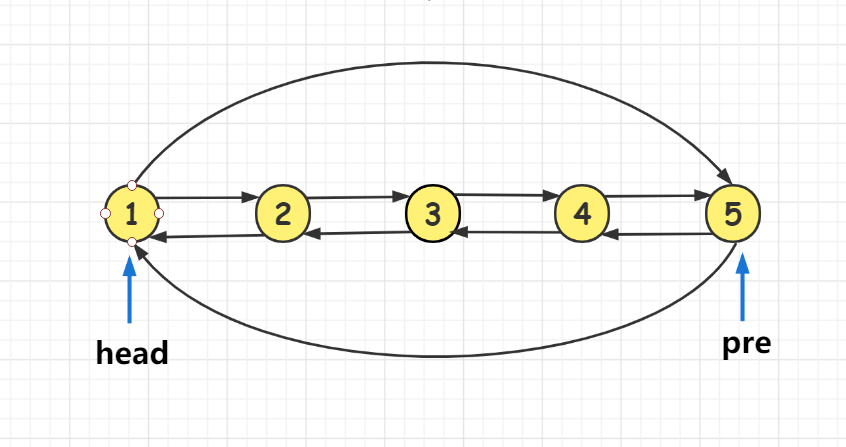
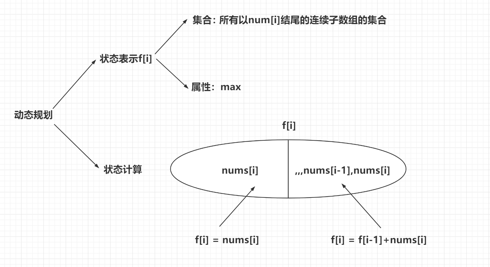

## 剑指offer

### [剑指 Offer 03. 数组中重复的数字](https://leetcode-cn.com/problems/shu-zu-zhong-zhong-fu-de-shu-zi-lcof/)

**思路** 

(数组遍历) $O(n)$
首先遍历一遍数组，如果存在某个数不在0到n-1的范围内，则返回-1。

下面的算法的主要思想是把每个数放到对应的位置上，即让` nums[i] = i`。

从前往后遍历数组中的所有数，假设当前遍历到的数是 `nums[i]=x`，那么：

如果`x != i && nums[x] == x`，则说明 `x` 出现了多次，直接返回`x`即可；如果`nums[x] != x`那我们就把 `x`交换到正确的位置上，即 `swap(nums[x], nums[i])`，交换完之后如果`nums[i] != i`，则重复进行该操作。由于每次交换都会将一个数放在正确的位置上，所以`swap`操作最多会进行 `n` 次，不会发生死循环。
循环结束后，如果没有找到任何重复的数，则返回`-1`。

**时间复杂度分析:**  每次`swap`操作都会将一个数放在正确的位置上，最后一次`swap`会将两个数同时放到正确位置上，一共只有 `n` 个数和 `n` 个位置，所以`swap`最多会进行 `n−1`次。所以总时间复杂度是 $O(n)$。

**c++代码**

```c++
class Solution {
public:
    int findRepeatNumber(vector<int>& nums) {
        for(int i = 0; i < nums.size(); i++){
            while(nums[i] != nums[nums[i]]) swap(nums[i], nums[nums[i]]);
            if(nums[i] != i) return nums[i];
        }
        return -1;
    }
};
```

### [剑指 Offer 04. 二维数组中的查找](https://leetcode-cn.com/problems/er-wei-shu-zu-zhong-de-cha-zhao-lcof/)

**(单调性扫描)** $O(n+m)$

在`m x n`矩阵 `matrix`中我们可以发现一个性质：对于每个子矩阵右上角的数`x`，`x`左边的数都小于等于`x`，`x`下边的数都大于`x`。 


因此我们可以从整个矩阵的右上角开始枚举，假设当前枚举的数是 `x`：

- 如果 `x` 等于`target`，则说明我们找到了目标值，返回`true`； 
- 如果 `x`小于`target`，则 `x`左边的数一定都小于`target`，我们可以直接排除当前一整行的数；
- 如果` x` 大于`target`，则 `x` 下边的数一定都大于`target`，我们可以直接排序当前一整列的数；

排除一整行就是让枚举的点的横坐标加一，排除一整列就是让纵坐标减一。当我们排除完整个矩阵后仍没有找到目标值时，就说明目标值不存在，返回`false`。

**具体过程如下：** 

- 1、初始化`i = 0`, `j = matrix[0].size() - 1`。
- 2、如果`matrix[i][j] == target`，返回`true`。
- 3、如果`matrix[i][j] < target`，`i++`，排除一行。
- 4、如果`matrix[i][j] > target`，`j--`，排除一列。
- 5、如果出界还未找到`target`，则返回`false`。

**时间复杂度分析：** 每一步会排除一行或者一列，矩阵一共有 $n$ 行，$m$ 列，所以最多会进行$ n+m $步。所以时间复杂度是 $O(n+m)$。

### [剑指 Offer 05. 替换空格](https://leetcode-cn.com/problems/ti-huan-kong-ge-lcof/)

**思路**

**(线性扫描)** $O(n)$

这个题在C++里比较好做，我们可以从前往后枚举原字符串：

- 1、如果遇到空格，则在string类型的答案中添加 `"%20"`；
- 2、如果遇到其他字符，则直接将它添加在答案中；

**时间复杂度分析:** 原字符串只会被遍历常数次，所以总时间复杂度是 $O(n)$。

**c++代码**

```c++
class Solution {
public:
    string replaceSpace(string s) {
        string res;
        for(int i = 0; i < s.size(); i++){
            if(s[i] == ' ') res += "%20";
            else res += s[i];
        }
        return res;
    }
};
```

### [剑指 Offer 06. 从尾到头打印链表](https://leetcode-cn.com/problems/cong-wei-dao-tou-da-yin-lian-biao-lcof/)

**思路**

**(遍历链表)** $O(n)$

单链表只能从前往后遍历，不能从后往前遍历，因此:

- 1、我们先从前往后遍历一遍输入的链表，将结果记录在答案数组中。
- 2、最后再将得到的数组逆序即可。 

**时间复杂度分析：** 链表和答案数组仅被遍历了常数次，所以总时间复杂度是 $O(n)$。

**c++代码**

```c++
class Solution {
public:
    vector<int> reversePrint(ListNode* head) {
        vector<int> res;
        ListNode* cur = head;
        while(cur){
            res.push_back(cur->val);
            cur = cur->next;
        }
        reverse(res.begin(), resa.end());
        return res;
    }
};
```

### [剑指 Offer 07. 重建二叉树](https://leetcode-cn.com/problems/zhong-jian-er-cha-shu-lcof/)

**思路**

**(递归)** $O(n)$ 

二叉树前序遍历的顺序为：根左右

二叉树中序遍历的顺序为：左根右

递归建立整棵二叉树：先创建根节点，然后递归创建左右子树，并让指针指向两棵子树。

我们画个图来说明，二叉树的前序和中序遍历。

**二叉树：**


**前序遍历：**


**中序遍历：**


**具体步骤如下：** 

- 1、先利用前序遍历找根节点：前序遍历的第一个数，就是根节点的值；
- 2、在中序遍历中找到根节点的位置 `pos`，则 `pos` 左边是左子树的中序遍历，右边是右子树的中序遍历；
- 3、假设左子树的中序遍历的长度是 `k`，则在前序遍历中，根节点后面的 `k` 个数，是左子树的前序遍历，剩下的数是右子树的前序遍历；
- 4、有了左右子树的前序遍历和中序遍历，我们可以先递归创建出根节点，然后再递归创建左右子树，再将这两颗子树接到根节点的左右位置；

**细节1：**如何在中序遍历中对根节点快速定位？

一种简单的方法是直接扫描整个中序遍历的结果并找出根节点，但这样做的时间复杂度较高。我们可以考虑使用哈希表来帮助我们快速地定位根节点。对于哈希映射中的每个键值对，键表示一个元素（节点的值），值表示其在中序遍历中的出现位置。

**细节2：**如何确定左右子树的前序遍历和中序遍历范围？

- 1、根据哈希表找到中序遍历的根节点位置，我们记作`pos` 

- 2、用`pos-il` (`il`为中序遍历左端点) 得到中序遍历的长度`k` ，由于一棵树的前序遍历和中序遍历的长度相等，因此前序遍历的长度也为`k`。有了前序和中序遍历的长度，根据如上具体步骤2，3，我们就能很快确定左右子树的前序遍历和中序遍历范围。如下图所示：

  

  `pl`,`pr`对应一棵子树的前序遍历区间的左右端点， `il`,`ir`对应一棵子树的中序遍历区间的左右端点。

**具体实现看代码。**

**时间复杂度分析：** $ O(n)$，其中 $n$ 是树中的节点个数。  

**c++代码** 

```c++
class Solution {
public:

    unordered_map<int,int> pos;
    TreeNode* buildTree(vector<int>& preorder, vector<int>& inorder) {
        int n = preorder.size();
        for(int i = 0; i < n; i++)
            pos[inorder[i]] = i; //记录中序遍历的根节点位置
        return dfs(preorder,inorder,0,n-1,0,n-1);        
    }
    //pl,pr对应一棵子树的前序遍历区间的左右端点
    //il,ir对应一棵子树的中序遍历区间的左右端点
    TreeNode* dfs(vector<int>&pre,vector<int>&in,int pl,int pr,int il,int ir)
    {
        if(pl > pr) return NULL; //左子树为空1
        int k = pos[pre[pl]] - il; // pos[pre[pl]]是中序遍历中根节点位置，k是子树前序和中序遍历的长度
        TreeNode* root = new TreeNode(pre[pl]);
        root->left = dfs(pre,in,pl+1,pl+k,il,il+k-1);  //左子树前序遍历，左子树中序遍历
        root->right = dfs(pre,in,pl+k+1,pr,il+k+1,ir); //右子树前序遍历，右子树中序遍历
        return root;
    }
};
```

### [剑指 Offer 09. 用两个栈实现队列](https://leetcode-cn.com/problems/yong-liang-ge-zhan-shi-xian-dui-lie-lcof/)

**思路**

**栈：** 先进后出

**队列：** 先进先出

**`push(x)` :**   直接将x插入主栈`stack1`中。

 **`pop()`：** 此时我们需要弹出最先进入栈的元素，也就是栈底元素。

- 1、在执行删除操作的时候我们首先看下第二个栈是否为空。如果为空，我们将第一个栈里的元素一个个弹出插入到第二个栈里，这样第二个栈里元素的顺序就是待删除的元素的顺序。
- 2、执行删除操作的时候我们直接弹出第二个栈的元素返回即可。

**c++代码**

```c++
class CQueue {
public:
     /**
        两个栈实现队列，栈： 先进后出
                     队列： 先进先出

        push(x) :   直接将x插入主栈stack1中
        pop()   ：
            此时我们需要弹出最先进入栈的元素，也就是栈底元素。
            在执行删除操作的时候我们首先看下第二个栈是否为空。如果为空，
            我们将第一个栈里的元素一个个弹出插入到第二个栈里，这样第二个
            栈里元素的顺序就是待删除的元素的顺序，要执行删除操作的时候我
            们直接弹出第二个栈的元素返回即可。
 
    **/
    stack<int> st1, st2;
    CQueue() {

    }
    void appendTail(int value) {
        st1.push(value);
    }
    
    int deleteHead() {
        if(st2.empty()){
            while(!st1.empty()){
                st2.push(st1.top());
                st1.pop();
            }
        }
        if(st2.empty()) return -1;
        int res = st2.top();
        st2.pop();
        return res;
    }
};
```

### [剑指 Offer 10- I. 斐波那契数列](https://leetcode-cn.com/problems/fei-bo-na-qi-shu-lie-lcof/)

**思路**

**(递推)** $O(n)$ 

斐波那契数的边界条件是 `F(0)=0` 和 `F(1)=1`。当 `n>1`时，每一项的和都等于前两项的和，因此有如下递推关系：

`F(n)=F(n−1)+F(n−2)` 

边界条件为 `F(0)` 和 `F(1)`。

**时间复杂度分析：**  $O(n)$ 。

**c++代码**

```c++
class Solution {
public:
    int fib(int n) {
        if(n == 0 || n == 1) return n;
        vector<int> f(n + 1);
        f[0] = 0;
        f[1] = 1;
        for(int i = 2; i <= n; i++){
            f[i] = (f[i - 1] + f[i - 2]) % 1000000007;
        }
        return f[n];
    }
};
```

### [剑指 Offer 10- II. 青蛙跳台阶问题](https://leetcode-cn.com/problems/qing-wa-tiao-tai-jie-wen-ti-lcof/)

**思路**

**(递推)** $O(n)$

**分析题目可以发现：**

- 上 1 阶台阶：有`1`种方式。

- 上 2 阶台阶：有`1+1`和`2`两种方式。 

- 上 3 阶台阶：到达第`3`阶的方法总数就是到第`1`阶和第`2`阶的方法数之和。

- 上 n 阶台阶，到达第`n`阶的方法总数就是到第 `(n-1) `阶和第 `(n-2)` 阶的方法数之和。  

因此，定义数组 `f[i]` 表示上`i` 级台阶的方案数，则枚举最后一步是上`1`级台阶，还是上`2`级台阶，所以有：
`f[i] = f[i−1]+f[i−2]`。  


**时间复杂度分析：**递推状态数$O(n)$，转移时间复杂度是 $O(1)$，所以总时间复杂度是 $O(n)$。 

**c++代码**

```c++
class Solution {
public:
    int numWays(int n) {
        if(n == 0) return 1;
        int mod = 1e9 + 7;
        vector<int> f(n + 2);
        f[1] = 1, f[2] = 2;
        for(int i = 3; i <= n; i++){
            f[i] = (f[i - 1] + f[i - 2]) % mod;
        }
        return f[n];
    }
};
```

### [剑指 Offer 11. 旋转数组的最小数字](https://leetcode-cn.com/problems/xuan-zhuan-shu-zu-de-zui-xiao-shu-zi-lcof/)

**思路**


为了便于分析，我们先将数组中的数画在二维坐标系中，横坐标表示数组下标，纵坐标表示数组数值，如下所示： 


我们发现除了最后水平的一段（黄色水平那段）之外，其余部分满足二分性质：竖直虚线左边的数满足 $nums[i]≥nums[0]$，而竖直虚线右边的数满足$nums[i]< nums[0]$，分界点就是整个数组的最小值。

所以我们**先将最后水平的一段删除**，这样数组就具有了二分性，因此可以二分出最小值的位置。 

**为什么要删除最后水平的一段？**  

由于`nums`数组中可能存在 **重复** 元素值，比如`nums = {2, 2, 0, 1, 2}`，如果我们不将最后水平的一段删除，那么如上图所示，那么竖直虚线左边的数满足 $nums[i]≥nums[0]$，竖直虚线右边的数满足$nums[i]<= nums[0]$，这样就不满足数组的**二段性**了。在二分遇到`nums[0]`这样的特殊值时，无法坚定的选择一边，而二分的条件就是数组满足二段性，即数组的某种性质在左半部分和右半部分**严格互斥。** 

**过程如下：**

- 1、在`[l,r]`区间中，` l = 0`, `r = nums.size() - 1`，我们去二分`< num[0]`的最左边界。
- 2、为了保证二分性，我们先将最后水平的一段删除。
- 3、当`nums[mid] < nums[0]`时，往左边区域找，`r = mid。`。


- 4、当`nums[mid] >= nums[0]`时，往右边区域找，`l = mid + 1`。 

  

- 5、当`l == r`，只剩下一个数时，就是最小值的位置，我们返回`nums[r]`。

**细节：**

- 当数组完全单调时，第一个数`nums[0]`最小，我们直接返回即可。

**时间复杂度分析：** 二分查找，所以时间复杂度是 $O(logn)$。 

**c++代码**

```c++
class Solution {
public:
    int minArray(vector<int>& nums) {
        int l = 0, r = nums.size() - 1;
        while(l < r && nums[0] == nums[r] ) r--; //去除最后水平的一段
        if(nums[r] >= nums[l]) return nums[0];   //数组单调，直接返回nums[0]
        while(l < r){  //二分 < nums[0]的最左边界
            int mid = l + r >> 1;
            if(nums[mid] < nums[0]) r = mid;
            else l = mid + 1;
        }
        return nums[r];
    }
};
```

### [剑指 Offer 12. 矩阵中的路径](https://leetcode-cn.com/problems/ju-zhen-zhong-de-lu-jing-lcof/)

**思路**

**(回溯)** $O(n^2 3^k)$ 

深度优先搜索，我们定义这样一种搜索顺序，即先枚举单词的起点，然后依次枚举单词的每个字母。在这个过程中需要将已经使用过的字母改成一个特殊字母，以避免重复使用字符。


**递归函数设计：**

```c++
bool dfs(vector<vector<char>>& board, string& word,int u,int x,int y)
```

`u`代表当前枚举到了目标单词`word`第`u`个位置。 

`x`，`y`是当前搜索到的二维字符网格的横纵坐标。 

**搜索过程如下：**

- 1、在二维字符网格中枚举每个单词的起点。
- 2、从该起点出发向四周搜索单词`word`，并记录此时枚举到单词`word`的第`u`个位置 ( `u`从`0`开始)。  
- 3、如果当前搜索的位置`(x,y)`的元素`board[x][y] == word[u]`,则继续向四周搜索。
- 4、直到枚举到单词`word`的最后一个字母返回`ture`，否则返回`false`。

**递归边界：** 

- 1、当搜索过程出现当前位置`board[x][y] != word[u]` ，说明当前路径不合法，返回`false`。
- 2、`u == word.size() - 1`,成功搜索到单词末尾，返回`true`。

**实现细节：** 

- 1、搜索过的位置继续搜索下一层时，需要对当前位置进行标识，表示已经搜索

- 2、可以使用偏移数组来简化代码。 

  

  

**时间复杂度分析：** 单词起点一共有 $n^2$ 个，单词的每个字母一共有上下左右四个方向可以选择，但由于不能走回头路，所以除了单词首字母外，仅有三种选择。所以总时间复杂度是  $O(n^2 3^k)$ 。 

**c++代码**

```c++
class Solution {
public:
    bool exist(vector<vector<char>>& board, string word) {
        for(int i = 0; i < board.size(); i++)
            for(int j = 0; j < board[i].size(); j++)
                if(dfs(board,word,0,i,j)) return true;
        return false;        
    }
    int dx[4] = {-1,0,1,0}, dy[4] = {0,1,0,-1}; //方向数组
    bool dfs(vector<vector<char>>& board, string& word,int u,int x,int y)
    {
        if(board[x][y] != word[u]) return false;
        if(u == word.size() - 1)   return true;
        char t = board[x][y];
        board[x][y] = '.';
        for(int i = 0; i < 4; i++)
        {
            int a = x + dx[i], b = y + dy[i];
            //出界或者走到已经搜索过的位置
            if(a < 0 || a >= board.size() || b < 0 || b >= board[0].size() || board[a][b] == '.')  continue;
            if(dfs(board,word,u+1,a,b)) return true;
        }
        board[x][y] = t;
        return false;
    }
};
```

### [剑指 Offer 13. 机器人的运动范围](https://leetcode-cn.com/problems/ji-qi-ren-de-yun-dong-fan-wei-lcof/)

**思路**

**(BFS)** $O(nm)$
这是一个典型的宽度优先搜索问题，我们从 `(0, 0)`点开始，每次朝上下左右四个方向扩展新的节点即可。

扩展时需要注意新的节点需要满足如下条件：

- 之前没有遍历过，这个可以用个`bool`数组来判断；
- 没有走出边界；
- 横纵坐标的各位数字之和小于 等于$k$；

最后答案就是所有遍历过的合法的节点个数。

**时间复杂度**

每个节点最多只会入队一次，所以时间复杂度不会超过方格中的节点个数。最坏情况下会遍历方格中的所有点，所以时间复杂度就是 $O(nm)$。

**细节：** 

如果把整个棋盘当做一个状态，那就需要回溯；如果把棋盘中的每个点当做状态，就不需要回溯。

**c++代码**

```c++
 class Solution {
public:
    int get_sum(pair<int, int> t){ //求出行坐标和列坐标的数位之和
        int sum = 0;
        while(t.first){
            sum += t.first % 10;
            t.first /= 10;
        }
        while(t.second){
            sum += t.second % 10;
            t.second /= 10;
        }
        return sum;
    }
    int movingCount(int m, int n, int k) {
        if(!m || !n) return 0;
        queue<pair<int,int>> q;
        int dx[4] = {-1, 0, 1, 0}, dy[4] = {0, 1, 0, -1};
        vector<vector<bool>> st(m, vector<bool>(n, false)); //标记数组
        q.push({0, 0});
        int cnt = 0;
        while(q.size()){
            auto t = q.front();
            q.pop();
            if(st[t.first][t.second] || get_sum(t) > k) continue; //判断当前点是否可走
            cnt++;
            st[t.first][t.second] = true; // 标记为走过
            for(int i = 0; i < 4; i++){
                int a = t.first + dx[i], b = t.second + dy[i];
                if(a >= 0 && a < m && b >=0 && b < n)
                    q.push({a, b});
            }
        }
        return cnt;
    }
};
```

### [剑指 Offer 14- I. 剪绳子](https://leetcode-cn.com/problems/jian-sheng-zi-lcof/)

**思路**

**(数学)** $O(n)$
这道题目是数学中一个很经典的问题，下面我们给出证明：

首先把一个正整数 $N$ 拆分成若干正整数只有有限种拆法，所以存在最大乘积。
假设 $N=n1+n2+…+nk$，并且 $n1×n2×…×nk$是最大乘积。

1. 显然1不会出现在其中；
2. 如果对于某个 $i$有$ ni≥5$，那么把 $ni $拆分成 $3+(ni−3)$，我们有 $3(ni−3)=3ni−9>ni$；
3. 如果 $ni=4$，拆成 $2+2$乘积不变，所以不妨假设没有4；
4. 如果有三个以上的2，那么 $3×3>2×2×2$，所以替换成3乘积更大；

综上，选用尽量多的$3$，直到剩下$2$或者$4$时，用$2$。

**时间复杂度分析**：

当 $n$比较大时，$n$ 会被拆分成 $⌈n/3⌉$ 个数，我们需要计算这么多次减法和乘法，所以时间复杂度是$O(n)$。

**c++代码**

```c++
class Solution {
public:
    int cuttingRope(int n) {
        if(n <= 3) return 1 * (n - 1); //拆成两段
        int res = 1;
        if(n % 3 == 1) res = 4, n -= 4;       //选用尽量多的3，余下一个4，剪成2*2
        else if(n % 3 == 2) res = 2 , n -= 2; //选用尽量多的3，余下一个2, 直接乘2
        while(n) res *= 3, n -= 3;
        return res;
    }
};
```

### [剑指 Offer 14- II. 剪绳子 II](https://leetcode-cn.com/problems/jian-sheng-zi-ii-lcof/)

**思路**

**同剪绳子I** 

**c++代码**

```c++
class Solution {
public:
    int cuttingRope(int n) {
        if(n <= 3) return n - 1;
        long long res = 1;
        if(n % 3 == 1)      res = 4, n -= 4;
        else if(n % 3 == 2) res = 2, n -= 2;
        while(n){
            res = (res * 3)% 1000000007;
            n -= 3;
        }
        return res;
    }
};
```

### [剑指 Offer 15. 二进制中1的个数](https://leetcode-cn.com/problems/er-jin-zhi-zhong-1de-ge-shu-lcof/)

**思路**
**(位运算)** 

$ lowbit(x) $**函数的作用**

$lowbit(x)$**操作返回 $x$ 的最后一位 $1$**

-  $x=1010_2$，那么 $lowbit(x)$ 返回 $10_2$，即$ lowbit(x)=10$
-  $x=101000_2$，那么 $lowbit(x) $返回$ 1000_2$，即$ lowbit(x)=1000$

**$lowbit$ 的应用：可以统计 $x$ 中 $1$ 的个数**

就是每一次把 $x$ 的最后一位 $1$ 减掉，即 $x−lowbit(x)$，只需要算下减多少次，减多少次就有多少个$ 1$ 。

**c++代码**

```c++
class Solution {
public:
    int hammingWeight(uint32_t n) {
        int res = 0;
        while(n){
            n -= n & -n;
            res++;
        }
        return res;
    }
};
```

### [剑指 Offer 16. 数值的整数次方](https://leetcode-cn.com/problems/shu-zhi-de-zheng-shu-ci-fang-lcof/)

**思路**

**(模拟，快速幂) **$O(logn)$

**快速幂模板:**

```c++
LL quickPow(LL a,LL b , int  mod )
{
    LL res= 1;
    while(b)
    {
        if(b&1) res = res * a %mod;
        b >>= 1;
        a = a*a %mod;
    }
    return res;
}
```

由于本题的指数是`int`范围，可能很大，所以需要用快速幂求解。

注意当指数是负数时，我们需要先取指数的绝对值，最后将乘积的倒数作为答案。

**时间复杂度分析：** 假设指数是 $n$，则一共会循环 $O(logn)$ 次，所以时间复杂度是 $O(logn)$。

**c++代码**

```c++
class Solution {
public:
    double myPow(double x, int n) {
        typedef long long LL;
        bool is_minus = false;
        if(n < 0) is_minus = true;  //判断指数是否是负数
        LL k = abs(LL(n));  //取绝对值
        double res = 1;
        while(k){
            if(k & 1) res *= x; // k是奇数
            k >>= 1; //指数减半
            x *= x;  //底数加倍
        }
        if(is_minus) res = 1 / res;
        return res;
    }
};
```

### [剑指 Offer 17. 打印从1到最大的n位数](https://leetcode-cn.com/problems/da-yin-cong-1dao-zui-da-de-nwei-shu-lcof/)

**思路**

**(模拟)**  $O(n)$

1、求出最大的`n`位十进制数。

2、枚举`[1, n]`，将其加入`res`中。

**时间复杂度分析：** $O(n)$。

**c++代码**

```c++
class Solution {
public:
    vector<int> printNumbers(int n) {
        int num = 0; //记录最大的n位十进制数
        while(n) num = num * 10 + 9, n--;
        vector<int> res;
        for(int i = 1; i <= num; i++){
            res.push_back(i);
        }
        return res;
    }
};
```

### [剑指 Offer 18. 删除链表的节点](https://leetcode-cn.com/problems/shan-chu-lian-biao-de-jie-dian-lcof/)*

**思路**

**(链表， 遍历)**  $O(n)$

为了方便处理边界情况，我们定义一个虚拟元素`dummy`指向链表头节点，即`dummy->next = head`，同时定义一个`pre`节点，记录当前遍历到的节点的前驱节点。

**具体过程如下：**

1、初始化虚拟头节点`dummy->next = head`，前驱节点`pre = dummy`。

2、遍历整个链表，如果当前节点`p`的`val`值等于`val`，我们就让`pre->next = p->next`，结束遍历。

3、最后返回虚拟头节点的下一个节点。


**时间复杂度分析：** $O(n)$

**c++代码**

```c++
/**
 * Definition for singly-linked list.
 * struct ListNode {
 *     int val;
 *     ListNode *next;
 *     ListNode(int x) : val(x), next(NULL) {}
 * };
 */
class Solution {
public:
    ListNode* deleteNode(ListNode* head, int val) {
        ListNode* dummy = new ListNode(-1);
        dummy->next = head;
        ListNode* pre = head;
        for(ListNode* p = dummy; p; pre = p, p = p->next){
            if(p->val == val){
                pre->next = p->next;
                break;
            }
        }
        return dummy->next;
    }
};
```

### [剑指 Offer 19. 正则表达式匹配](https://leetcode-cn.com/problems/zheng-ze-biao-da-shi-pi-pei-lcof/)

**思路**

**(动态规划)**  $O(nm)$

**状态表示：**`f[i][j]` 表示字符串` s` 的前 `i `个字符和字符串 `p` 的前` j` 个字符能否匹配。

**状态计算：**

根据`p[j]` 是什么来划分集合：

- 1、`p[j] != '*' ` ，即`p[j]`是字符, 看`p[j]` 和`s[i]`的关系。如果`p[j] == s[i]`，则需判断 `s`的前`i - 1`个字母 能否和`p`的前`j -1`个字母匹配 ，即`f[i][j] == f[i - 1][j - 1]`，不匹配 , 无法转移。
- 2    `P[j]` 是匹配符:
  - 如果`p[j] == '.' `，则`p[j]` 和 `s[j]`匹配 ，则需判断 `s`的前`i - 1`个字母能否和`p`的前`j -1`个字母匹配 ，即`f[i][j] == f[i - 1][j - 1]`。
  - `p[j]` 为`'*'`，得看`p[j - 1]`和`s[i]`的关系。如果不匹配，即`p[j - 1] ！= s[i]`，那么`'*'`匹配`0`个`p[j - 1]`,则需判断 `s`的前`i`个字母 能否和`p`的前`j - 2`个字母匹配 ，即`f[i][j] == f[i][j - 2]`。如果匹配，即`p[j - 1] == s[i] || p[j - 1] == '.'`，若`'*'`匹配多个`p[j - 1]`,则需判断`s`的前`i - 1`个字母 能否和`p`的前`j`个字母匹配 ，即`f[i][j] == f[i - 1][j]) `。

---------------


--------------------

**总结:**

```c++
f[i][j] == f[i - 1][j - 1], 前提条件为p[j] == s[i] || p[j] == '.'
f[i][j] == f[i][j - 2], 前提条件为p[j] == '*' &&  p[j - 1] != s[i]
f[i][j] == f[i - 1][j], 前提条件为p[j] == '*' && ( p[j - 1] == s[i] || p[j - 1] == '.'）
```

**c++代码**

```c++
class Solution {
public:
    bool isMatch(string s, string p) {
        int n = s.size(), m = p.size();
        vector<vector<bool>>f(n + 1, vector<bool>(m + 1));
        s = ' ' + s;   // 下标从1开始
        p = ' ' + p;
        f[0][0] = true;
        for(int i = 0; i <= n; i++){
            for(int j = 1; j <= m; j++){
                if(j + 1 <= m && p[j + 1] == '*') continue;  // 不去处理*的前一位字符。
                if(p[j] != '*'){
                    if((s[i] == p[j] || p[j] == '.')&& i)
                        f[i][j] = f[i - 1][j - 1];
                }else{
                    if(j >= 2) f[i][j] = f[i][j - 2];  //匹配0个
                    if(i && (p[j - 1] == '.' || s[i] == p[j - 1] ) && f[i - 1][j]) //匹配多个
                        f[i][j] = f[i - 1][j];    
                }
            }
        }
        return f[n][m];
    }
};
```

### [剑指 Offer 20. 表示数值的字符串](https://leetcode-cn.com/problems/biao-shi-shu-zhi-de-zi-fu-chuan-lcof/)

**思路**
**(模拟，字符串处理)**   $O(n)$

遍历整个字符串，将所有的不合法情况都去除掉，剩下的就是合法情况。

**具体过程如下：**

1、首先去除行首和行尾空格，如果去除完之后，整个字符串为空，则返回`false`。

2、行首如果有一个正负号，直接忽略。

3、如果字符串为空或只有一个`'.'`，则不是一个合法方案。
4、遍历整个字符串`s`，对于当前字符`s[i]`：

- `s[i]`为数字，则不做任何处理。
- `s[i] == '.'`，`.`的个数加`1`。如果此时`'.'`在`'e'`后面出现或者` '.'`的个数多于`1`个，则返回`false`。【`1e2.1`，`1e2.1.1`】
- `s[i] == 'e' || s[i] == 'E'`，`e`的个数加`1`。
  - 如果此时`'e'`的后面为空或者`'e'`多于`1`个或者`'e'`的前面为空或者为`'.''e'`，则返回`false`。【`12e`，`12e3e`，`e12`，`12.e3`】
  - `'e'`后面紧跟着正负号，但正负号后面为空，则返回`false`。【`1e2+`】
- `s[i]`为其他字符，返回`false`。

5、排除了各种非法情况，此时`s`则为合法方案，我们返回`true`。

**c++代码**

```c++
class Solution {
public:
    bool isNumber(string s) {
        int i = 0;
        while (i < s.size() && s[i] == ' ') i ++ ; //删除行首空格
        int j = s.size() - 1;
        while (j >= 0 && s[j] == ' ') j -- ; //删除行末空格
        if (i > j) return false;
        s = s.substr(i, j - i + 1);

        if (s[0] == '-' || s[0] == '+') s = s.substr(1); //忽略行首正负号
        if (s.empty() || s[0] == '.'&& s.size() == 1) return false;//如果字符串为空或只有一个'.',则不是一个合法方案

        int dot = 0, e = 0;
        for (int i = 0; i < s.size(); i ++ )
        {
            if (s[i] >= '0' && s[i] <= '9');//遇到数字不做任何处理
            else if (s[i] == '.')
            {
                dot ++ ; //'.'的个数加1
                if (e || dot > 1) return false;//'.'在'e'后面出现 , '.'的个数多于1个；
            }
            else if (s[i] == 'e' || s[i] == 'E')
            {
                e ++ ; //'e'的个数加1  
                //'e'的后面为空或者'e'多于1个或者'e'的前面为空或者为'.''e'
                if (i + 1 == s.size() || !i || e > 1 || i == 1 && s[0] == '.') return false;
                if (s[i + 1] == '+' || s[i + 1] == '-')//'e'后面紧跟着正负号，但正负号后面为空
                {
                    if (i + 2 == s.size()) return false;
                    i ++ ;
                }
            }
            else return false; //其他字符
        }
        return true;
    }

};
```

### [剑指 Offer 21. 调整数组顺序使奇数位于偶数前面](https://leetcode-cn.com/problems/diao-zheng-shu-zu-shun-xu-shi-qi-shu-wei-yu-ou-shu-qian-mian-lcof/)

**思路**

**(双指针扫描)**    $O(n)$

用两个指针分别从首尾开始，往中间扫描。扫描时保证第一个指针前面的数都是奇数，第二个指针后面的数都是偶数。

每次迭代时需要进行的操作：

1. 第一个指针一直往后走，直到遇到第一个偶数为止；
2. 第二个指针一直往前走，直到遇到第一个奇数为止；
3. 交换两个指针指向的位置上的数，再进入下一层迭代，直到两个指针相遇为止；


**时间复杂度分析：**当两个指针相遇时，走过的总路程长度是 $n$，所以时间复杂度是 $O(n)$。

**c++代码**

```c++
class Solution {
public:
    vector<int> exchange(vector<int>& nums) {
        int i = 0, j = nums.size() - 1;
        while(i < j){
            while(i < j && nums[i] % 2 == 1) i++;
            while(i < j && nums[j] % 2 == 0) j--;
            swap(nums[i], nums[j]);
        }
        return nums;
    }
};
```

### [剑指 Offer 22. 链表中倒数第k个节点](https://leetcode-cn.com/problems/lian-biao-zhong-dao-shu-di-kge-jie-dian-lcof/)

**思路**

**(链表)**$O(n)$

由于单链表不能索引到前驱节点，所以只能从前往后遍历。

我们一共遍历两次：

1. 第一次遍历得到链表总长度 $n$；

2. 链表的倒数第 $k$ 个节点，相当于正数第$n−k+1$ 个节点。所以第二次遍历到第$ n−k+1$ 个节点，就是我们要找的答案。

   

**注意:** 

当 $k>n$ 时要返回$nullptr$。

**时间复杂度分析：**  链表总共遍历两次，所以时间复杂度是 $O(n)$。

**c++代码**

```c++
/**
 * Definition for singly-linked list.
 * struct ListNode {
 *     int val;
 *     ListNode *next;
 *     ListNode(int x) : val(x), next(NULL) {}
 * };
 */
class Solution {
public:
    ListNode* getKthFromEnd(ListNode* head, int k) {
       int n = 0;
       for(auto p = head; p ; p = p->next) n++;
       if(k > n) return NULL;
       auto p = head;
       for(int i = 0; i < n - k; i++) p = p->next;
       return p;
    }
};
```

### [剑指 Offer 24. 反转链表](https://leetcode-cn.com/problems/fan-zhuan-lian-biao-lcof/)

**思路**

**(双指针，迭代)** $(n)$

反转链表即将所有节点的`next`指针指向他的前驱节点。由于是单链表，我们在迭代时不能直接找到前驱节点，所以我们需要一个额外的指针保存前驱节点。同时在改变当前节点的`next`指针前，不要忘记保存它的后继节点。

**具体过程如下：**

- 1、定义一个前驱指针`pre`和`cur`指针，`pre`指针用来指向前驱节点，`cur`指针用来遍历整个链表，初始化`cur = head`，`pre = null`。  

- 2、首先让`t`指针指向`cur`指向节点的后继节点，然后让`cur`指向节点的`next`指针指向其前驱节点，即`cur->next = pre`。
- 3、`pre`指针和`cur`指针分别后移一位，重复上述过程，直到`cur`指向空节点。  

- 4、最后我们返回`pre`节点。  


**时间复杂度分析：**只遍历一次链表，时间复杂度是$O(n)$。 

**c++代码**

```c++
/**
 * Definition for singly-linked list.
 * struct ListNode {
 *     int val;
 *     ListNode *next;
 *     ListNode(int x) : val(x), next(NULL) {}
 * };
 */
class Solution 
public:
    ListNode* reverseList(ListNode* head) {
        ListNode *pre = NULL;
        ListNode *cur = head;
        while(cur)
        {
            ListNode *t = cur->next; //保留后继节点
            cur->next = pre; //当前节点指向前驱节点
            pre = cur, cur = t;
        }
        return pre;
    }
};
```

### [剑指 Offer 25. 合并两个排序的链表](https://leetcode-cn.com/problems/he-bing-liang-ge-pai-xu-de-lian-biao-lcof/) *

**思路**

**(二路归并)** $O(n)$

1、新建头部的虚拟头节点`dummy`，设置`cur`指针指向`dummy`。

2、若当前`l1`指针指向的节点的值`val`比`l2`指针指向的节点的值`val`小，则令`cur`的`next`指针指向`l1`，且`l1`后移一位；否则指向`l2`，且`l2`后移一位。

3、然后`cur`指针按照上一步设置好的位置后移。

4、循环以上步骤直到`l1`或`l2`为空。

5、将剩余的`l1`或`l2`接到`cur`指针后边。

**时间复杂度分析：** 两个链表各遍历一次，所以时间复杂度为$O(n)$

**c++代码**

```c++
/**
 * Definition for singly-linked list.
 * struct ListNode {
 *     int val;
 *     ListNode *next;
 *     ListNode(int x) : val(x), next(NULL) {}
 * };
 */
class Solution {
public:
    ListNode* mergeTwoLists(ListNode* l1, ListNode* l2) {
        ListNode* dummy = new ListNode(-1);
        ListNode* cur = dummy;
        while(l1 != NULL && l2 != NULL){
            if(l1->val < l2->val){
                cur->next = l1;
                l1 = l1->next;
            }else{
                cur->next = l2;
                l2 = l2->next;
            }
            cur = cur->next;
        }
        cur->next = (l1 != NULL ? l1 : l2); //将剩余的l1或l2接到cur指针后边
        return dummy->next;
    }
};
```

### [剑指 Offer 26. 树的子结构](https://leetcode-cn.com/problems/shu-de-zi-jie-gou-lcof/) *

**(二叉树，递归)**   $O(nm)$

我们首先判断两棵二叉树是否为空，如果为空，则直接返回`false`。遍历树`A`中的所有非空节点`root`，判断树`A`中以`root`为根节点的子树是不是包含和树`B`一样的结构，且我们从根节点开始匹配，当从`A`的根节点开始不匹配的话，我们递归到`A`的左右子树去匹配。

`isSame`函数用来判断判断`B`是否为`A`的子树，具体设计思路如下：

- 如果树`B`中的节点为空，则表示当前分支是匹配的，返回`true`；
- 如果树`A`中的节点为空，但树B中的节点不为空，则说明不匹配，返回`false`；
- 如果两个节点都不为空，但数值不同，则说明不匹配，返回`false`；
- 否则说明当前这个点是匹配的，然后递归判断左子树和右子树是否分别匹配即可；

**时间复杂度分析：** 最坏情况下，我们对于树`A`中的每个节点都要递归判断一遍，每次判断在最坏情况下需要遍历完树`B`中的所有节点。
所以时间复杂度是 $O(nm)$，其中 $n $树A中的节点数， $m$ 是树B中的节点数。

**c++代码 **

```c++
/**
 * Definition for a binary tree node.
 * struct TreeNode {
 *     int val;
 *     TreeNode *left;
 *     TreeNode *right;
 *     TreeNode(int x) : val(x), left(NULL), right(NULL) {}
 * };
 */
class Solution {
public:
    bool isSubStructure(TreeNode* A, TreeNode* B) {
        if(!A || !B) return false; //如果A树或者B树一个为空，则不匹配
        if(isSame(A, B)) return true;  // 从根节点开始判断，找到第一个匹配的位置
        // 如果根节点不匹配的话，我们递归到左右子树去判断
        return isSubStructure(A->left, B) || isSubStructure(A->right, B);
    }

    bool isSame(TreeNode* A, TreeNode* B){
        if(!B) return true; //B树为空，匹配成功
        // B树不为空，若A树为空，或者A,B都不为空，但是值不相等,匹配不成功
        if(!A || A->val != B->val) return false;
        //否则说明当前这个点是匹配的，然后递归判断左子树和右子树是否分别匹配即可
        return isSame(A->left, B->left) && isSame(A->right, B->right);
    }
};

```

### [剑指 Offer 27. 二叉树的镜像](https://leetcode-cn.com/problems/er-cha-shu-de-jing-xiang-lcof/)*

**思路**

**(二叉树，递归)**   $O(n)$

观察样例，我们可以发现镜像后的树就是将原树的所有节点的左右儿子互换，因此递归遍历原树的所有节点，将每个节点的左右儿子互换即可。

**时间复杂度分析：** 原树中的每一个节点仅会被遍历一次，所以时间复杂度是 $O(n)$，$n$为树中的节点个数。

**c++代码**

```c++
/**
 * Definition for a binary tree node.
 * struct TreeNode {
 *     int val;
 *     TreeNode *left;
 *     TreeNode *right;
 *     TreeNode(int x) : val(x), left(NULL), right(NULL) {}
 * };
 */
class Solution {
public:
    TreeNode* mirrorTree(TreeNode* root) {
        if(!root) return NULL;  //如果节点为空，则返回NULL
        swap(root->left, root->right); //互换左右节点儿子
        mirrorTree(root->left); //递归左子树
        mirrorTree(root->right); //递归右子树
        return root;
    }
};
```

### [剑指 Offer 28. 对称的二叉树](https://leetcode-cn.com/problems/dui-cheng-de-er-cha-shu-lcof/)

**思路**

**(二叉树，递归)**  $O(n)$ 

**两个子树互为镜像当且仅当：** 

1. 两个子树的根节点值相等。
 2.  第一棵子树的左子树和第二棵子树的右子树互为镜像，且第一棵子树的右子树和第二棵子树的左子树互为镜像。

**递归边界：** 

1. 两个子树的当前节点都为空，判断成功，返回`true`。
2. 只有一个为空，判断失败，返回`false`。
3. 都不为空，但是值不相等，同样判断失败，返回`false`。
4. 递归左右子树继续判断

**时间复杂度分析：** 从上到下每个节点仅被遍历一遍，所以时间复杂度是 O(n)。

**c++代码** 

```c++
/**
 * Definition for a binary tree node.
 * struct TreeNode {
 *     int val;
 *     TreeNode *left;
 *     TreeNode *right;
 *     TreeNode(int x) : val(x), left(NULL), right(NULL) {}
 * };
 */
class Solution {
public:
    bool isSymmetric(TreeNode* root) {
        if(!root) return true;  //空树一定是对称的 
        return dfs(root->left, root->right);  //从左右子树开始判断
    }
    bool dfs(TreeNode* p, TreeNode* q){
        if(!p && !q) return true;
        if(!p || !q) return false;
        if(p->val != q->val) return false;
        return dfs(p->left, q->right) && dfs(p->right, q->left);
    }
};
```

### [剑指 Offer 29. 顺时针打印矩阵](https://leetcode-cn.com/problems/shun-shi-zhen-da-yin-ju-zhen-lcof/)

**思路**

**(模拟)**   $O(nm) $

我们顺时针定义四个方向：上右下左。

从左上角开始遍历，先往右走，走到不能走为止，然后更改到下个方向，再走到不能走为止，依次类推，遍历 `n*m` 个格子后停止。


**时间复杂度分析：** 矩阵中每个格子遍历一次，所以总时间复杂度是 $O(nm)$。

**c++代码**

```c++
class Solution {
public:
    int dx[4] = {-1, 0, 1, 0}, dy[4] = {0, 1, 0, -1};
    vector<int> spiralOrder(vector<vector<int>>& matrix) {
        vector<int> res;
        if(matrix.empty()) return res; 
        int n = matrix.size(), m = matrix[0].size();
        vector<vector<bool>> st(n, vector<bool>(m)); //标记数组
        int x = 0, y = 0, d = 1;  //当前所在位置
        for(int i = 1; i <= n * m; i++){
            res.push_back(matrix[x][y]);
            st[x][y] = true; //将当前位置标记为走过
            int a = x + dx[d], b = y + dy[d]; //下一个位置
            if(a < 0 || a >= n || b < 0 || b >= m || st[a][b]){
                d = (d + 1) % 4;
                a = x + dx[d], b = y + dy[d];
            }
            x = a, y = b;
        }
        return res;
    }
};
```

### [剑指 Offer 30. 包含min函数的栈](https://leetcode-cn.com/problems/bao-han-minhan-shu-de-zhan-lcof/)

**思路**

**(单调栈)**  $O(1)$

我们除了维护基本的栈`stackValue`结构之外，还需要维护一个单调递减栈`stackMin`，来实现返回最小值的操作。 


**`push`操作**

- 1、直接向普通栈`stackValue`压入。
- 2、如果该数 `≤` 单调栈`stackMin`的栈顶元素，则将该数同时压入单调栈中；否则，不压入。

**`pop()`操作**

- 1、如果普通栈顶元素 `==` 单调栈`stackMin`的栈顶元素，则弹出单调栈顶元素；否则，不弹出。
- 2、直接弹出普通栈顶元素

**时间复杂度分析：**  四种操作都只有常数次入栈出栈操作，所以时间复杂度都是 $O(1)$。

**c++代码**

```c++
class MinStack {
public:
    stack<int> stackValue;
    stack<int> stackMin;
    MinStack() {
    }
 
    void push(int x) {
        stackValue.push(x);
        if(stackMin.empty() || stackMin.top() >= x) stackMin.push(x);
    }
    
    void pop() {
        if(stackValue.top() == stackMin.top()) stackMin.pop();
        stackValue.pop();
    }
    
    int top() {
        return stackValue.top();
    }
    
    int min() {
        return stackMin.top();
    }
};
```

### [剑指 Offer 31. 栈的压入、弹出序列](https://leetcode-cn.com/problems/zhan-de-ya-ru-dan-chu-xu-lie-lcof/)*

**思路**

**(栈，模拟)** 

1、我们定义一个空栈`st`，然后模拟这个过程。

2、遍历`popped`数组，假设我们已经处理了出栈序列中的前`i - 1`个数，对于当前要出栈的元素`popped[i]`：

- 如果栈首元素和`popped[i]`不相等，我们就从`pushed`数组中，不断将数组元素压入`st`栈中，直到`popped[i]`入栈。
- 如果栈首元素和`popped[i]`相等，则将栈首出栈，否则的话，该序列不合法，我们返回`false`。

3、最后判断`st`是否为空，为空则表示弹出序列合法，否则不合法。      

**时间复杂度分析：**  遍历整个出栈序列的时间复杂度为$O(n)$，`while`循环最多执行`n`次，因此总的时间复杂度为$O(n)$。

**c++代码**

```c++
class Solution {
public:
    bool validateStackSequences(vector<int>& pushed, vector<int>& popped) {
        stack<int> st;
        int k = 0;
        for(int i = 0; i < popped.size(); i++){
            while(st.empty() || (st.top() != popped[i] && k != pushed.size())) st.push(pushed[k++]);
            if(st.top() == popped[i]) st.pop();
            else return false; 
        }
        return st.empty();
    }
};
```

### [剑指 Offer 32 - I. 从上到下打印二叉树](https://leetcode-cn.com/problems/cong-shang-dao-xia-da-yin-er-cha-shu-lcof/)

**思路**

**(BFS)**   $O(n)$

我们从根节点开始按宽度优先的顺序遍历整棵树，每次先扩展左儿子，再扩展右儿子。

这样我们会：

1. 先扩展根节点；
2. 再依次扩展根节点的左右儿子，也就是从左到右扩展第二层节点；
3. 再依次从左到右扩展第三层节点；
4. 依次类推

所以BFS的顺序就是这道题目要求的顺序。

**时间复杂度分析：** 每个节点仅被遍历一次，所以时间复杂度是 $O(n)$。

**c++代码**

```c++
/**
 * Definition for a binary tree node.
 * struct TreeNode {
 *     int val;
 *     TreeNode *left;
 *     TreeNode *right;
 *     TreeNode(int x) : val(x), left(NULL), right(NULL) {}
 * };
 */
class Solution {
public:
    // 广度优先遍历
    vector<int> levelOrder(TreeNode* root) {
        vector<int> res;
        if(!root) return res;
        queue<TreeNode*> q;
        q.push(root);
        while(q.size()){
            TreeNode * t = q.front();
            q.pop();
            res.push_back(t->val);
            if(t->left) q.push(t->left);
            if(t->right)q.push(t->right); 
        }
        return res;
    }
};

```

### [剑指 Offer 32 - II. 从上到下打印二叉树 II](https://leetcode-cn.com/problems/cong-shang-dao-xia-da-yin-er-cha-shu-ii-lcof/)

**思路**

和上一题的代码一样，区别在于，每一层结束的时候，往`queue`里塞一个`NULL`做每一层的结尾标记。当我们访问到一层的结尾时，由于`BFS`的特点，我们刚好把下一层都加到了队列中。这个时候就可以给这层加上结尾标记`NULL`了。	

**c++代码**

```c++
/**
 * Definition for a binary tree node.
 * struct TreeNode {
 *     int val;
 *     TreeNode *left;
 *     TreeNode *right;
 *     TreeNode(int x) : val(x), left(NULL), right(NULL) {}
 * };
 */
class Solution {
public:
    vector<vector<int>> levelOrder(TreeNode* root) {
        vector<vector<int>> res; //记录答案
        if(!root) return res;
        vector<int> level; //记录一层节点
        queue<TreeNode*> q;
        q.push(root);
        q.push(NULL); //第一层结尾标记
        while(q.size()){
            auto t = q.front();
            q.pop();
            if(!t){  //遍历到当前层的结尾
                if(level.empty()) break;
                res.push_back(level);
                q.push(NULL); //给下一层添加结尾标记
                level.clear();
            }else{
                level.push_back(t->val); //先将当层节点存贮到level,再将下一层存贮到队列中
                if(t->left)   q.push(t->left);
                if(t->right)  q.push(t->right);
            }
        }
        return res;
    }
};
```

### [剑指 Offer 32 - III. 从上到下打印二叉树 III](https://leetcode-cn.com/problems/cong-shang-dao-xia-da-yin-er-cha-shu-iii-lcof/)

**思路**

和上一题的思路类似，我们再加上一个`flag`标记，初始化`flag = false`，表示奇数行，如果是偶数行，`flag = true`，每次打印完一行后，将`flag`取反。

**c++代码**

```c++
class Solution {
public:
    // 宽度优先遍历
    vector<vector<int>> levelOrder(TreeNode* root) {
        vector<vector<int>> res; //记录答案
        queue<TreeNode*> q; //队列
        vector<int> level;  //存贮一层的节点
        bool flag = false;  //标记
        q.push(root);       //根节点入队
        q.push(NULL);       //一层的结尾标记
        while(q.size()){
            TreeNode* t = q.front();
            q.pop();
            if(!t){          //一层结束
                if(!level.size())  break; // 最后一层结束
                if(flag) reverse(level.begin(), level.end());
                res.push_back(level);
                flag = !flag;
                level.clear();
                q.push(NULL); //结尾标记入队
            }else{
                level.push_back(t->val);        // 存贮当层节点
                if(t->left)  q.push(t->left);   //下一层节点入队列
                if(t->right) q.push(t->right);
            }
        }
        return res;
    }
};
```

### [剑指 Offer 33. 二叉搜索树的后序遍历序列](https://leetcode-cn.com/problems/er-cha-sou-suo-shu-de-hou-xu-bian-li-xu-lie-lcof/)

**思路**

**递归** $O(n^2)$

**什么是二叉搜索树 ？**

二叉搜索树是一棵有序的二叉树，所以我们也可以称它为二叉排序树。具有以下性质的二叉树我们称之为二叉搜索树：若它的左子树不为空，那么左子树上的所有值均小于它的根节点；若它的右子树不为空，那么右子树上所有值均大于它的根节点。它的左子树和右子树分别也为二叉搜索树。

二叉搜索树的后序遍历是**左右根**，先遍历左子树，然后右子树，最后根节点。 


**判断是否是二叉搜索树的后序遍历序列:**

1. 递归当前序列的左右边界。
2. 根节点是当前序列的最后一个元素。
3. 遍历出左子树的终点在什么地方，这样我们就可以知道右子树的起始位置，然后我们遍历右子树的所有节点，看一下是否右子树的所有节点是否都比根节点要大，满足合法，否则不合法。
4. 递归左右子树，只有左右子树同时合法，我们这棵树才是合法的。

**如何遍历左子树的终点？**

左子树的元素都小于根节点，这样我们从头遍历`seq`序列，通过该性质找到左右子树的分界点`k`，那么左子树序列为`[l, k - 1]`，右子树序列为`[k, r - 1]`。

**时间复杂度分析：** `dfs`中有个`while`循环，最坏情况下会循环 $O(n) $次，一共会执行$O(n) $次`dfs`，所以时间复杂度是 $O(n^2)$。

**c++代码**

```c++
class Solution {
public:
    bool verifyPostorder(vector<int>& post) {
        if(post.empty()) return true;
        return dfs(post, 0 ,post.size() - 1);
    }

    bool dfs(vector<int>& post, int l, int r){
        if(l >= r) return true;  //递归边界，只剩下一个数肯定满足
        int root = post[r]; //记录根节点
        int k = l;
        while(k < r && post[k] < root) k++; //先遍历出左子树的终点 k - 1
        for(int i = k; i <= r; i++){
            if(post[i] < root)  return false;
        }
        return dfs(post, l, k - 1) && dfs(post, k, r - 1);
    }
};
```

### [剑指 Offer 34. 二叉树中和为某一值的路径](https://leetcode-cn.com/problems/er-cha-shu-zhong-he-wei-mou-yi-zhi-de-lu-jing-lcof/)

**思路**

**(前序遍历，递归)**   

递归，自顶向下从根节点往叶节点走，每走过一个节点，就让 `sum` 减去该节点的值，则如果走到某个叶节点时，`sum` 恰好为`0`，则说明从根节点到这个叶节点的路径上的数的和等于 `sum`，此时需要把这条路径记录下来。

**时间复杂度分析：**$O(n^2)$ 其中 $n$是树的节点数。在最坏情况下，树的上半部分为链状，下半部分为完全二叉树，并且从根节点到每一个叶子节点的路径都符合题目要求。此时，路径的数目为 $O(n)$，并且每一条路径的节点个数也为 $O(n)$，因此要将这些路径全部添加进答案中，时间复杂度为 $O(n^2)$ 

**c++代码**

```c++
class Solution {
public:
    vector<vector<int>> res; // 记录答案
    vector<int> path; //记录路径
    vector<vector<int>> pathSum(TreeNode* root, int target) {
        dfs(root, target);
        return res;
    }
    void dfs(TreeNode* root, int target){
        if(!root) return ;
        target -= root->val;
        path.push_back(root->val);
        if(!root->left && !root->right && !target) res.push_back(path);
        dfs(root->left, target);
        dfs(root->right, target);
        target += root->val;
        path.pop_back();
    }
};
```

### [剑指 Offer 35. 复杂链表的复制](https://leetcode-cn.com/problems/fu-za-lian-biao-de-fu-zhi-lcof/)

**思路**

**(迭代)**  $O(n)$

题目要求我们复制一个长度为` n` 的链表，该链表除了每个节点有一个指针指向下一个节点外，还有一个额外的指针指向链表中的任意节点或者`null`，如下图所示： 


**如何去复制一个带随机指针的链表？** 

首先我们可以忽略`random` 指针，然后对原链表的每个节点进行复制，并追加到原节点的后面，而后复制`random`指针。最后我们把原链表和复制链表拆分出来，并将原链表复原。

**图示过程如下：** 

1、在每个节点的后面加上它的复制，并将原链表和复制链表连在一起。


2、 从前往后遍历每一个原链表节点，对于有`random`指针的节点`p`，我们让它的`p->next->random = p->random->next`，这样我们就完成了对原链表`random`指针的复刻。  


3、最后我们把原链表和复制链表拆分出来，并将原链表复原。 


**具体过程如下：** 

- 1、定义一个`p`指针，遍历整个链表，复制每个节点，并将原链表和复制链表连在一起。
- 2、再次遍历整个链表，执行`p->next->random = p->random->next`，复制`random`指针。 
- 3、定义虚拟头节点`dummy`用来指向复制链表的头节点， 将两个链表拆分并复原原链表。

**时间复杂度分析：** $O(n)$，其中 $n$ 是链表的长度。 

**c++代码**

```c++
class Solution {
public:
    Node* copyRandomList(Node* head) {
        //先复制链表节点，并将原链表和复制链表连接到一起
        for(Node* p = head; p; p = p->next->next){
            Node* q = new Node(p->val);
            q->next = p->next;
            p->next = q;
        }

        //复制random指针
        for(Node* p = head; p; p = p->next->next){
            if(p->random) p->next->random = p->random->next;
        }

        //将原链表和复制链表分离开,并将原链表复原
        auto dummy = new Node(-1), cur = dummy;
        for(Node* p = head; p; p = p->next){
            Node* q = p->next;
            cur = cur->next = q;
            p->next = p->next->next;
        }
        
        return dummy->next;
    }
};
```

### [剑指 Offer 36. 二叉搜索树与双向链表](https://leetcode-cn.com/problems/er-cha-sou-suo-shu-yu-shuang-xiang-lian-biao-lcof/)

**思路**

**(递归）** $O(n)$ 

**什么是二叉搜索树 ？**

二叉搜索树是一棵有序的二叉树，所以我们也可以称它为二叉排序树。具有以下性质的二叉树我们称之为二叉搜索树：若它的左子树不为空，那么左子树上的所有值均小于它的根节点；若它的右子树不为空，那么右子树上所有值均大于它的根节点。它的左子树和右子树分别也为二叉搜索树。

**二叉搜索树的中序遍历是：左=>根=>右； 二叉搜索树的中序遍历从小到大是有序的。**  

**中序遍历模板** 

```c++
//打印中序遍历
void dfs(TreeNode* root ) 
{
    if(!root) return;
    dfs(root->left); 	//左
    print(root->val);   //根
   	dfs(root->right);	//右
}
```

如图所示，本题要求我们要将一棵**二叉搜索树**变成**排序的循环双向链表。**


二叉搜索树的中序遍历就是有序的，因此这道题就是在中序递归遍历的基础上改了一点。

**具体过程如下：**

1、我们定义两个指针`pre`和`head`，`pre`指针用于保存中序遍历的前一个节点，`head`指针用于记录排序链表的头节点。

2、中序遍历二叉树，因为是中序遍历，所以遍历顺序就是双线链表的建立顺序。我们只需要在中序遍历的过程中，修改每个节点的左右指针，将零散的节点连接成双向循环链表。


3、首先遍历二叉树的左子树，然后是当前根节点`root`。

- 当前驱节点`pre`不为空时，将前驱节点`pre`的右指针指向当前根节点`root`，即`pre->right = root`。

  

- 当前驱节点`pre`为空时： 代表正在访问链表头节点，记为 `head = root ` ，保存头节点。

4、每一个`root`节点访问时它的左子树肯定被访问过了，因此放心修改它的`left`指针，将`root`的`left`指针指向它的前驱节点，即` root->left = pre`， 这样两个节点之间的双向指针就修改好了。


5、然后前驱节点`pre`右移到当前`root`节点，接下来递归到右子树重复上述操作。


6、完成以上各步，只是将**二叉树**变成了**双向排序链表**，我们还需要将链表的首尾连接到一起，将其变成**双向循环排序链表**。

执行以下操作：

```c++
head->left = pre;
pre->right = head;
```



**时间复杂度分析：** $n$为二叉树的节点数， 中序遍历需要访问所有节点，因此时间复杂度为$O(n)$。  

**c++代码**

```c++
class Solution {
public:
    Node* pre = nullptr, *head = nullptr;
    Node* treeToDoublyList(Node* root) {
        if (!root) return root;
        dfs(root);
        head->left = pre;
        pre->right = head;
        return head;
    }
    void dfs(Node* root){
        if (!root) return; // 递归边界: 叶子结点返回
        dfs(root->left);
        if (pre) pre->right = root;
        else head = root; // 链表头结点
        root->left = pre;
        pre = root;
        dfs(root->right);
    }
};
```

### [剑指 Offer 37. 序列化二叉树](https://leetcode-cn.com/problems/xu-lie-hua-er-cha-shu-lcof/)

**思路**

**(前序遍历)** 

- 按照前序遍历顺序来序列化二叉树。

**c++代码**

```c++
/**
 * Definition for a binary tree node.
 * struct TreeNode {
 *     int val;
 *     TreeNode *left;
 *     TreeNode *right;
 *     TreeNode(int x) : val(x), left(NULL), right(NULL) {}
 * };
 */
class Solution {
public:

    // Encodes a tree to a single string.
    string serialize(TreeNode* root) 
    {
        string res;
        dfs_s(root, res);
        return res;
    }

    void dfs_s(TreeNode* root, string &res)
    {
        if(!root) 
        {
            res += "null ";//如果当前节点为空，保存null和一个空格
            return ;
        }    
        res += to_string(root->val) + ' ';//如果当前节点不为空，保存数字和一个空格
        dfs_s(root->left, res);
        dfs_s(root->right, res);
    }
    // Decodes your encoded data to tree.
    TreeNode* deserialize(string data) 
    {
        int u = 0;  //用来保存当前的字符串遍历的位置
    return dfs_d(data, u);
    }

    TreeNode* dfs_d(string data, int &u)
    {    //这里的u是传的引用，不是值传递
        if (u == data.size()) return NULL;  //如果已经达到了字符串的尾端，则退出。
        int k = u;
        while(data[k] != ' ') k++; //k记录当前数字的位数如134是个三位数的数字，56是个两位数的数字，退出的时候，k指向了字符的中间的空格，所以回到下个字符的首部需要加1.

         if(data[u] == 'n') 
         {  //如果当前字符串是“null”
            u = k+1;//回到下一个数字的首部，注意是u = k+1, 不是u = u+1;
            return NULL;//表示这次构造的是一个null节点，并没有孩子节点，所以跳过后面的递归
         }
        int val = 0;
        //如果数字是负的
        if(data[u] == '-')
        {
            for (int i = u+1; i < k; i++) val = val * 10 + data[i] - '0';
            val  = -val;
        }
        else
        {
            //如果是数字是正的
            for (int i = u; i < k; i++) val = val * 10 + data[i] - '0';
        }
        u = k + 1;//回到下个数字的首部
        //递归算法总是先写退出条件，然后才递归调用。
        auto root = new TreeNode(val);
        root->left = dfs_d(data, u);
        root->right = dfs_d(data, u);
        return root;
    }

};
```

### [剑指 Offer 38. 字符串的排列](https://leetcode-cn.com/problems/zi-fu-chuan-de-pai-lie-lcof/)

**思路**

**(全排列 + 去重)**  $O(n * n!)$

**数字全排列的模板**，对一个数组进行全排列，数组中不包含重复元素，比如 `nusm = {1, 2, 3}`时，我们输出：

```c++
1 2 3
1 3 2
2 1 3
2 3 1
3 1 2
3 2 1
```

**c++代码模板** 

```c++
void dfs(int u)
{
    if(u == nums.size()) 
    {
        res.push_back(path);
        return ;
    }
    for(int i = 0; i < nums.size(); i++)
    {
        if(!st[i])
        {
            path[i] = i;
            st[i] = true;
            dfs(u + 1);
            st[i] = false;									;
        }
    }
}
```

现在我们要对一个字符串进行全排列，但这个字符串中可能包含重复元素，比如`s = aab`，此时`a1a2b`和`a2a1b`就属于同一方案，而题目要求答案数组里面不能有重复元素，因此我们要考虑去重。

**如何去重**

1、先将所有字符从小到大排序，这样相同的字符会排在一起。

2、对于相同的字符，我们人为去定义一种相对顺序，即优先使用出现顺序在前的字符，其次使用相对顺序在后的字符，比如`a1a2b`，我们按`a1`，`a2`去使用。因此，如果我们先使用了`a2`，再`a1`，就要按下列代码减去剪枝。

```c++
if(i && s[i] == s[i - 1] && !st[i - 1]) continue;
```

**时间复杂度分析：**  $O(n*n!)$

**c++代码**

```c++
class Solution {
public:
    vector<string> res;
    vector<bool> st;
    vector<string> permutation(string s) {
       sort(s.begin(), s.end()); // 排序一下
       st = vector<bool>(s.size(), false);
       dfs(s, 0, "");
       return res; 
    }
    void dfs(string s, int u, string str){
        if(u == s.size()){
            res.push_back(str);
        }
        for(int i = 0; i < s.size(); i++){
            if(!st[i]){
                if(i && s[i] == s[i - 1] && !st[i - 1]) continue; //定义一个使用的相对顺序    
                st[i] = true;
                dfs(s, u + 1, str + s[i]);
                st[i] = false;
            }     
        }
    }
};
```

### [剑指 Offer 39. 数组中出现次数超过一半的数字](https://leetcode-cn.com/problems/shu-zu-zhong-chu-xian-ci-shu-chao-guo-yi-ban-de-shu-zi-lcof/)

**思路**

**(投票算法)**  $O(n)$ 

当一个国家的总统候选人`r`的支持率大于50%的话，即使每个反对他的人都给他投一个反对票，抵消掉他的支持票，他的支持票也不会被完全消耗掉。因此，我们可以假定和`r`相同的数都是支持票，和`r`不同的数都是反对票。

维护两个变量：候选人和他的票数

- 1、候选人初始化为`r = 0`，票数`c`初始化为`0`，遍历整个数组
- 2、当候选人的票数为`0`时，更换候选人，并将票数重置为`1`
- 3、当候选人的值和当前元素相同时，票数加`1`，否则减`1`
- 4、最后维护的候选人即是答案

**时间复杂度分析：**  $O(n)$ ，$n$是数组的大小。

**空间复杂度分析：** 仅使用了两个变量，故需要 $O(1)$ 的额外空间。 

**c++代码**

```c++
class Solution {
public:
    int majorityElement(vector<int>& nums) {
        int r = 0, c = 0;
        for(int x : nums){
            if(c == 0) r = x, c = 1;
            else if(r == x) c++;
            else c--;
        }
        return r;
    }
};
```

### [剑指 Offer 40. 最小的k个数](https://leetcode-cn.com/problems/zui-xiao-de-kge-shu-lcof/)

**思路**

**(堆排序)**  $O(nlogk)$

维护一个大小为`k`的大根堆，将数组元素都`push`进堆，当堆中的数大于`k`时弹出堆顶元素。注意弹出堆顶的顺序是从大到小的`k`个数，要进行逆序操作。

**时间复杂度分析：** 建堆的时间复杂度是$O(logk)$，要进行`n`次建堆的操作。

**c++代码**

```c++
class Solution {
public:
    vector<int> getLeastNumbers(vector<int>& arr, int k) {
        priority_queue<int> heap; //大根堆，根节点是最大的元素
        for(int x : arr){
            heap.push(x);
            if(heap.size() > k)  heap.pop();
        }
        vector<int> res;
        while(heap.size()){
            res.push_back(heap.top());
            heap.pop();
        }a
        reverse(res.begin(), res.end());
        return res;
    }
};
```

### [剑指 Offer 41. 数据流中的中位数](https://leetcode-cn.com/problems/shu-ju-liu-zhong-de-zhong-wei-shu-lcof/)

**知识补充：**

https://www.cnblogs.com/wangchaowei/p/8288216.html

https://cloud.tencent.com/developer/article/1616910

**数据结构 - 堆**   

- Heap是一种数据结构具有以下的特点：
  (1）**完全二叉树**；
  (2）heap中存储的值是**偏序**；
- **Min-heap**:   父节点的值小于或等于子节点的值；
- **Max-heap**: 父节点的值大于或等于子节点的值；


**优先队列：** 

priority_queue称为“优先队列”，其底层是用堆实现。在优先队列中，队首元素一定是当前队列中优先级最高的哪一个。

默认的定义优先队列是大根堆，即父节点的值大于子节点的值。

**获取堆顶元素**

> top()：可以获得队首元素（堆顶元素），时间复杂度为O(1)。 与队列不一样的是，优先队列通过top()函数来访问队首元素（堆顶元素）。（队列是通过front()函数和back()函数访问下标）

**入队**

> push(x) ：令x入队，时间复杂度为O(logN)，其中N为当前优先队列中的元素个数。

**出队**

> pop()：   令队首元素（堆顶元素）出队，时间复杂度为O(logN)，其中N为当前优先队列中的元素个数。

**检测是否为空**

> empty()：检测优先队列是否为空，返回true为空，false为非空。时间复杂度为O（1）

**获取元素个数**

> size()：用来获得优先队列中元素的个数，时间复杂度为 O(1)

**案例代码** 

```c++
#include
#include
using namespace std;
int main(){
    priority_queue q;

    //入队
    q.push(3);
    q.push(4);
    q.push(1);

    //通过下标访问元素
    printf("%d\n",q.top());//输出4

    //出队
    q.pop();
    printf("%d\n",q.top());//输出3

    //检测队列是否为空
    if(q.empty() == true) {
        printf("Empty\n");
    } else {
        printf("Not Empty\n");
    }

    //获取长度
    //printf("%d\n",q.size());//输出3
}
```

大根堆就是根节点是整棵树的最大值，小根堆就是根节点是整棵树的最小值。

**基本数据类型的优先级设置**

一般情况下，数字大的优先级更高。（char类型的为字典序最大） 对于基本结构的优先级设置。下面两种优先队列的定义是等价的： 

```c++
priority_queue<int> q;   // 大根堆
priority_queue<int,vector<int>,less<int> > q;
```

如果想让优先队列总是把最小的元素放在队首，需进行以下定义：

```c++
priority_queue<int, vector<int>, greater<int>> q //小根堆
```

**思路**

**(双顶堆)**   $O(logn)$

我们可以使用两个堆来解决这个问题，使用一个大顶堆保存整个数据流中较小的那一半元素，再使用一个小顶堆保存整个数据流中较大的那一半元素，同时大顶堆堆顶元素 `<=` 小顶堆堆顶的元素。

**具体过程：**

- 1、建立一个大根堆，一个小根堆。大根堆存储小于当前中位数，小根堆存储大于等于当前中位数。
- 2、执行`addNum`操作时，如果新加入的元素`num`小于等于大顶堆`down`堆顶元素，则加入大根堆中，否则加入小根堆中。
- 3、为了维持左右两边数的数量，我们可以让大根堆的大小最多比小根堆大`1`，每次插入后，可能会导致数量不平衡，所以如果插入后哪边的元素过多了，我们将该堆的堆顶元素弹出插入到另一个堆中。
- 4、当数据个数是奇数的时候，中位数就是大根堆堆顶，是偶数的时候就是大根堆与小根堆堆顶的平均值。 


**c++代码**

```c++
class MedianFinder {
public:
    priority_queue<int, vector<int>, greater<int>> up;  //小根堆
    priority_queue<int> down;  // 大根堆

    /** initialize your data structure here. */
    MedianFinder() {

    }

    void addNum(int num) {
        if (down.empty() || num <= down.top()) {
            down.push(num);
            if (down.size() > up.size() + 1) {
                up.push(down.top());
                down.pop();
            }
        } else {
            up.push(num);
            if (up.size() > down.size()) {
                down.push(up.top());
                up.pop();
            }
        }
    }

    double findMedian() {
        if ((down.size() + up.size()) % 2) return down.top();
        return (down.top() + up.top()) / 2.0;
    }
};
```

### [剑指 Offer 42. 连续子数组的最大和](https://leetcode-cn.com/problems/lian-xu-zi-shu-zu-de-zui-da-he-lcof/)

**思路**

**(动态规划)**  $O(n)$

**状态表示:**  `f[i]`表示以`num[i]`结尾的连续子数组的和的最大值

**集合划分:**  将集合划分为只有`nums[i]`一个数，和以`nums[i]`为结尾的多个数组成的连续子数组两大类

**状态计算：** `f[i] = max(nums[i], f[i - 1] + nums[i] )`。

**初始化：** `f[0] = nums[0]`。

**图示**：



**时间复杂度分析：**  $O(n)$。

**c++代码**

```c++
class Solution {
public:
    int maxSubArray(vector<int>& nums) {
        int n = nums.size(), res = nums[0];
        vector<int> f(n + 1, 0);
        f[0] = nums[0];
        for(int i = 1; i < n; i++){
            f[i] = max(nums[i], f[i - 1] + nums[i]);
            res = max(res, f[i]);
        }
        return res;
    }
};
```

### [剑指 Offer 43. 1～n 整数中 1 出现的次数](https://leetcode-cn.com/problems/1nzheng-shu-zhong-1chu-xian-de-ci-shu-lcof/)

**思路**

**(数位统计)** 

我们按位来进行计算，分为中间位，前位，和后位，分情况进行计算，循环中间位的值。

以`abcdef`为例，中间位为`c`   

1、`c = 1`   则个数 `+= (ab - 1)  * 1000 ` (`def`位数)。

2、前位取`ab`，`c = 0`，则不加。

- `c = 1`， 则个数 `+= def + 1`
- `c > 1`， 则个数 `+= 1000` (`def`位数)

**图示过程：** 


**c++代码**

```c++
class Solution {
public:
    int countDigitOne(int n) {
        if(!n) return 0;
        vector<int> nums;
        while(n)  nums.push_back(n % 10), n /= 10;
        long long res = 0;
        for(int i = nums.size() - 1; i >= 0; i--){
            int left = 0, right = 0, t = 1;
            for(int j = nums.size() - 1; j > i; j--) left = left * 10 + nums[j];
            for(int j = i - 1; j >= 0; j--) right = right * 10 + nums[j], t *= 10;
            res += left * t;
            if(nums[i] == 1) res += right + 1;
            else if(nums[i] > 1) res += t;
        }
        return res;
    }
};
```

### [剑指 Offer 44. 数字序列中某一位的数字](https://leetcode-cn.com/problems/shu-zi-xu-lie-zhong-mou-yi-wei-de-shu-zi-lcof/)

**思路**

**(数位统计)**  $O(logn)$ 

首先我们知道，`1` 位数有 `10` 个，`2` 位数有 `90` 个，`3` 位数有 `9 * 100` 个，`4` 位数有 `9 * 1000` 个，以此类推，如下表：

| 数字范围 | 数量 | 位数 | 占多少位 |
| :------: | :--: | :--: | :------: |
|   1~9    |  9   |  2   |    9     |
|  10~99   |  90  |  2   |   180    |
| 100~999  | 900  |  3   |   2700   |

**1、确定序列的第`n`位应该是一个几位数中的某一位** 

假如我们需要求的是序列的第`1001`位是什么，我们可以发现`1001 > 9`,所以第`1001`位肯定在`1~9`这九位数字之后，接下来我们又发现`(1001 - 9) > 180`,所以第`1001`位也不可能是一个两位数中的某位，而`(1001 - 9 - 180) < 2700`,因此可以断定序列的第`1001`位是一个三位数中的某一位。

**2、确定是几位数的第几个数，然后确定具体数值**

现在已经知道了序列的第`1001`位是一个三位数中的某一位，那到底是哪一个三位数呢，很简单，计算方法为`base + (n + i - 1)/i - 1`。( `[n / i]`上取整 = ` [(n + i - 1) / i] `)

`base`表示这一位的第一个数是多少，`1`位的第一个数是`1`，`2`位的第一个数是`10`，`3`位是`100`，`4`位是`1000`。

`i`是位数。

`n`是序列的第`n`位。

因此，`100 + (( 1001 - 9 - 180 + 3 - 1)/ 3 ) - 1 = 370` 

**3、确定属于那个数的第几位** 

ok，现在也知道了它是属于`370`的某位的，那到底是哪一位，求余就好了

`(1001 - 9 - 180) % 3 = 2`，所以答案是`370`中的第二位，即`7`。

**c++代码**

```c++
class Solution {
public:
    int digitAtIndex(int n) {
        n--; //先把0去掉，一位数字变成了9个
     	n++; //从第1位开始计数
        
        // i枚举的是位数，从1位开始枚举
        // s表示这一位一共有多少个数，1位有9个数
        // base表示这一位的第一个数是多少，1位的第一个数是1，2位的第一个数是10,3位是100,4位是1000
        long long i = 1,s = 9, base = 1; 
        while( n > i*s )
        {
            n -= i * s;
            i++;
            s *= 10;
            base *= 10;               
        }
        //确定i位数的第n位是属于哪个数  [n/i]上取整 = [(n+i-1)/i] 
        int number = base + (n + i - 1)/i - 1;
        
        //确定那个数的第几位
        int r = n % i ? n % i : i;  // 除不尽就是第几位，除尽了就是最后一位
        
        for(int j = 0; j < i - r; j++) number /= 10; //求数的第i - r位，取出第i - r位
        
        return number % 10;
    }
};
```

