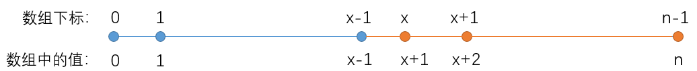

## 剑指offfer2

### [剑指 Offer 45. 把数组排成最小的数](https://leetcode-cn.com/problems/ba-shu-zu-pai-cheng-zui-xiao-de-shu-lcof/)

**思路**

**(排序) ** $O(nlogn)$

自定义排序规则，如果拼接`ab` 可以比拼接 `ba`更小的话，我们选择拼接`ab  `。

**时间复杂度分析:**  排序的时间复杂度为$O(nlogn)$。

**c++代码**

```c++
class Solution {
public:

    // 自定义排序规则，如果拼接ab 可以比拼接 ba更小的话，我们选择拼接ab  
    static bool cmp(int a, int b)
    {
        string as = to_string(a), bs = to_string(b);
        return as + bs < bs + as;
    }
    string minNumber(vector<int>& nums) {
        sort(nums.begin(), nums.end(), cmp);
        string res;
        for(auto x : nums)
            res +=  to_string(x);
        return res;    
    }
};
```

### [剑指 Offer 46. 把数字翻译成字符串](https://leetcode-cn.com/problems/ba-shu-zi-fan-yi-cheng-zi-fu-chuan-lcof/)

**思路**

**(动态规划)**  $O(logn)$

给定我们一个数字`num`，按照题目所给定的规则将其翻译成字符串，问一个数字有多少种不同的翻译方法。

**样例：** 


我们先来理解一下题目的翻译规则，如样例所示，`num = 12258`，可以分为两种情况：

- 1、将每一位单独翻译，因此可以翻译成`"bccfi"`。
- 2、将相邻两位组合起来翻译（组合的数字范围在`10 ~ 25`之间），因此可以翻译成`"bwfi"`, `"bczi"`, `"mcfi"和"mzi"`。

两种情况是或的关系，互不影响，将其相加，那么`12258`共有`5`种不同的翻译方式。为了可以很方便的将数字的相邻两位组合起来，我们可以先将数字`num`转化成字符串数组`s[]`，下面来讲解动态规划的做法。

**状态表示：** 

我们定义`f[i]`表示前`i`个数字一共有多少种不同的翻译方法。那么，`f[n]`就表示前`n`个数字一共有多少种不同的翻译方法，即为答案。

**状态计算:**    

假设字符串数组为`s[]`，对于第`i`个数字，分成两种决策：

- 1、单独翻译`s[i]`。由于求的是方案数，如果确定了第`i`个数字的翻译方式，那么翻译前`i`个数字和翻译前`i - 1`个数的方法数就是相同的，即`f[i] = f[i - 1]`。(`s[]`数组下标从`1`开始)

  

- 2、将`s[i]`和`s[i - 1]`组合起来翻译(组合的数字范围在`10 ~ 25`之间)。如果确定了第`i`个数和第`i - 1`个数的翻译方式，那么翻译前`i`个数字和翻译前`i - 2`个数的翻译方法数就是相同的，即`f[i] = f[i - 2]`。(`s[]`数组下标从`1`开始)

  

最后将两种决策的方案数加起来，**因此，状态转移方程为：** `f[i] = f[i - 1] + f[i - 2]`。

**初始化：** 

`f[0] = 1`，翻译前`0`个数的方法数为`1`。

**为什么一个数字都没有的方案数是`1`？** 

`f[0]`代表翻译前`0`个数字的方法数，这样的状态定义其实是没有实际意义的，但是`f[0]`的值需要保证边界是对的，即`f[1]`和`f[2]`是对的。比如说，翻译前`1`个数只有一种方法，将其单独翻译，即`f[1] = f[1 - 1] =  1`。翻译前两个数，如果第`1`个数和第`2`个数可以组合起来翻译，那么`f[2] = f[1] + f[0] = 2` ，否则只能单独翻译第`2`个数，即`f[2] = f[1] = 1`。因此，在任何情况下`f[0]`取`1`都可以保证`f[1]`和`f[2]`是正确的，所以`f[0]`应该取`1`。

**实现细节:**

我们将数字`num`转为字符串数组`s[]`，在推导状态转移方程时，假设的`s[]`数组下标是从`1`开始的，而实际中的`s[]`数组下标是从`0`开始的，为了一 一对应，在取组合数字的值时，要把`s[i - 1]` 和 `s[i]`的值往前错一位，取`s[i - 1]`和`s[i - 2]`，即组合值`t = (s[i - 2] - '0') * 10 + s[i - 1] - '0'`。

在推导状态转移方程时，一般都是默认数组下标从`1`开始，这样的**状态表示**可以和实际数组相对应，理解起来会更清晰，但在实际计算中要错位一下，希望大家注意下。

**时间复杂度分析：** $O(logn)$，计算的次数是`nums`的位数，即`logn​`，以`10`为底。

**c++代码**

```c++
class Solution {
public:
    int translateNum(int num) {
        string s = to_string(num);
        int n = s.size();
        vector<int> f(n + 1);
        f[0] = 1;  // 初始化
        for(int i = 1; i <= n; i++){
            f[i] = f[i - 1];
            if(i > 1){
                int t = (s[i - 2] - '0') * 10 + s[i - 1] - '0';
                if(t >= 10 && t <= 25)
                    f[i] += f[i - 2];
            }
        }
        return f[n];
    }
};
```

### [剑指 Offer 47. 礼物的最大价值](https://leetcode-cn.com/problems/li-wu-de-zui-da-jie-zhi-lcof/)

**思路**

**(动态规划)**   $O(m*n)$ 

**状态表示：** `f[i,j]`表示从`(0,0)`走到`(i,j)`可以拿到的礼物最大价值。那么，`f[n - 1][m - 1]`就表示从棋盘左上角走到棋盘右下角可以拿到的礼物最大价值，即为答案。

**状态转移：**   

 

由于限制了只会**向下走**或者**向右走**，因此到达`(i,j)`有两条路径 

- 从上方转移过来，`f[i][j] = f[i-1][j] + grid[i][j]`
- 从左方转移过来，`f[i][j] = f[i][j-1] + grid[i][j]` 

因此，**状态计算方程为：** `f[i][j] = max(f[i - 1][j], f[i][j - 1]) + grid[i][j]`， 从向右和向下两条路径中选择礼物价值最大的转移过来，再加上`grid[i][j]`的值。

**初始化：** `f[0][0] = grid[0][0]`。

**c++代码**

```c++
class Solution {
public:
    int maxValue(vector<vector<int>>& grid) {
        int n = grid.size(), m = grid[0].size();
        vector<vector<int>>f(n + 1, vector<int>(m + 1));
        f[0][0] = grid[0][0];
        for(int i = 0; i < n; i++)
            for(int j = 0; j < m; j++){
                if(!i && !j) continue;
                if(i) f[i][j] = max(f[i][j], f[i - 1][j] + grid[i][j]);
                if(j) f[i][j] = max(f[i][j], f[i][j - 1] + grid[i][j]);
            }
        return f[n - 1][m - 1];    
    }
};
```

### [剑指 Offer 48. 最长不含重复字符的子字符串](https://leetcode-cn.com/problems/zui-chang-bu-han-zhong-fu-zi-fu-de-zi-zi-fu-chuan-lcof/)、

**思路**

**(双指针扫描)** $O(n)$

定义两个指针 $i,j(i<=j)$，表示当前扫描到的子串是 $[i,j]$ (闭区间)。扫描过程中维护一个哈希表`unordered_map <chat,int>hash`，表示 $[i,j]$中每个字符出现的次数。

线性扫描时，每次循环的流程如下：

- 1.指针 $j$ 向后移一位, 同时将哈希表中 `s[j]` 的计数加一:` hash[s[j]]++`;

- 2.假设 $j$ 移动前的区间 $[i,j]$中没有重复字符，则 $j$ 移动后，只有 `s[j]​`可能出现`2`次。因此我们不断向后移动` i`，直至区间 `[i,j]`中 `s[j]` 的个数等于`1`为止；

**时间复杂度分析：**由于 `i`，`j` 均最多增加`n`次，且哈希表的插入和更新操作的复杂度都是 $O(1)$，因此，总时间复杂度 $O(n)$.

**c++代码** 

```c++
class Solution {
public:
    int lengthOfLongestSubstring(string s) {
        unordered_map<char, int> hash; //存贮每个字符出现的次数
        int res = 0;
        for(int j = 0, i = 0; j < s.size(); j++){   //[j, i]
            hash[s[j]]++;
            while(hash[s[j]] > 1) hash[s[i++]]--;
            res = max(res, j - i + 1);
        }
        return res;
    }
};
```

### [剑指 Offer 49. 丑数](https://leetcode-cn.com/problems/chou-shu-lcof/)

**思路**

**(三路归并)**   $O(n)$

我们把只包含质因子 `2`、`3` 和 `5` 的数称作丑数，使用` vector<int> res` 存储每个丑数，且已知第一个丑数是 `1`，即 `res[0] = 1`。

用 `i`,`j`,`k`,三个指针分别指向三个序列：

- `i `指向质因子包含 `2` 的所有数组成的序列 $II$。
- `j` 指向质因子包含 `3` 的所有数组成的序列 $III$。
- `k` 指向质因子包含 `5 `的所有数组成的序列 $V$。

初始状态下三个指针都是`0`，指向第一个丑数 `res[0] = 1`。

三路归并，每次取 `res[i]∗2`，`res[j]∗3`，`res[k]∗5`中的最小值，就是下一个丑数。
其中 `res[i]` 是序列 $II$ 的第 `i `个数，那么 `res[i]∗2` 就是第 `i + 1` 个数，`res[j]` 是序列 $III$ 的第 `j` 个数，那么 `res[j]∗3` 就是第 `j + 1` 个数，`res[k]` 是序列 $V $的第 `k` 个数，那么 `res[k]∗5`就是第 `k + 1`个数。

`res[0] = 1` 不属于任何序列。

如果下一个丑数为 `res[i]∗2`，则 `i `指针向往后移，如果 为`res[j]∗3`，则 `j `指针往后移，如果为` res[k]∗5`，则 `k` 指针往后移。

**细节：**

如果下一个丑数即是 `2` 的倍数也是 `3` 的倍数，那么指针 `i` 和 `j` 都要往后移。

**时间复杂度分析：** 求第 `n` 个丑数，已知第一个丑数是 `1`，循环 `n - 1` 次即可求得，时间复杂度为 $O(n)$。

**c++代码**

```c++
class Solution {
public:
    int nthUglyNumber(int n) {
        vector<int> res;
        res.push_back(1);
        int i = 0, k = 0, j = 0;
        while(--n){
            int t = min(res[i] * 2, min(res[j] * 3, res[k] * 5));
            res.push_back(t);
            if(t % 2 == 0)  i++;
            if(t % 3 == 0)  j++;
            if(t % 5 == 0)  k++;
        }
        return res.back();
    }
};

```

### [剑指 Offer 50. 第一个只出现一次的字符](https://leetcode-cn.com/problems/di-yi-ge-zhi-chu-xian-yi-ci-de-zi-fu-lcof/)

**思路**

**(哈希)**  $O(n)$

1、定义一个`hash`表，存贮字符串`s`中每个字符出现的次数。

2、遍历整个字符串，如果字符串`s`中的某个字符出现的次数为`1`，则我们返回该字符。

3、如果没有，则返回空格。

**时间复杂度分析：**  $O(n)$。

**c++代码**

```c++
class Solution {
public:
    char firstUniqChar(string s) {
        unordered_map<char, int> hash;
        for(char c : s) hash[c]++;
        for(char c : s){
            if(hash[c] == 1) return c;
        }
        return ' ';
    }
};
```

### [剑指 Offer 51. 数组中的逆序对](https://leetcode-cn.com/problems/shu-zu-zhong-de-ni-xu-dui-lcof/)

**思路**

**(归并排序)**   $O(nlogn)$

**归并排序模板：**

```c++
const int maxn = 1e5 + 10;
int q[maxn], tmp[maxn];
void merge_sort(int q[], int l, int r)
{
	if (l >= r)  return;      //如果只有一个数字或没有数字，则无需排序
	int mid = (l + r ) / 2;
	merge_sort(q, l, mid);       //分解左序列
	merge_sort(q, mid + 1, r);   //分解右序列
	int k = l, i = l, j = mid + 1;
	while (i <= mid && j <= r)   //合并
	{
		if (q[i] <= q[j]) tmp[k++] = q[i++];
		else tmp[k++] = q[j++];
	}
	while (i <= mid) tmp[k++] = q[i++];    //复制左边子序列剩余
	while (j <= r)   tmp[k++] = q[j++];    //复制右边子序列剩余
	for (int i = l; i <= r; i++) q[i] = tmp[i];
}
```

在归并排序的合并操作中，我们假设左右两个区间元素为：

左边：`{3 4 7 9}` 右边：`{1 5 8 10}`

那么合并操作的第一步就是比较`3`和`1`，然后将`1`取出来放到辅助数组中，这个时候我们发现，右边的区间如果是当前比较的较小值，那么其会与左边剩余的数字产生逆序关系，也就是说`1`和`3`、`4`、`7`、`9`都产生了逆序关系，因此我们可以一下子统计出有`4`对逆序对。接下来`3`，`4`取下来放到辅助数组后，`5`与左边剩下的`7`、`9`产生了逆序关系，我们可以统计出`2`对。依此类推，`8`与`9`产生`1`对,那么总共有`4 + 2 + 1`对。这样统计的效率就会大大提高，便可较好地解决逆序对问题。

而在算法的实现中，我们只需略微修改原有归并排序，当右边序列的元素为较小值时，就统计其产生的逆序对数量，即可完成逆序对的统计。


**时间复杂度分析：**  归并排序的时间复杂度为$O(nlogn)$。

**c++代码**

```c++
class Solution {
public:   
    int reversePairs(vector<int>& nums) {
        return merge(nums, 0, nums.size() - 1);
    }

    int merge(vector<int>&nums, int l, int r){
        if(l >= r) return 0; //序列中只有一个数
        int mid = l + r>> 1;
        int res = merge(nums, l, mid) + merge(nums, mid + 1, r);
        vector<int> tmp;
        int i = l, j = mid + 1;
        while(i <= mid && j <= r){
            if(nums[i] <= nums[j]) tmp.push_back(nums[i++]);
            else{
                res += mid - i + 1;
                tmp.push_back(nums[j++]);
            }
        }
        while(i <= mid) tmp.push_back(nums[i++]);
        while(j <= r)   tmp.push_back(nums[j++]);   
        int k = l;
        for(int x : tmp) nums[k++] = x;
        return res;
    }
};
```

### [剑指 Offer 52. 两个链表的第一个公共节点](https://leetcode-cn.com/problems/liang-ge-lian-biao-de-di-yi-ge-gong-gong-jie-dian-lcof/)

**(链表，指针扫描)** $O(n)$

这题的思路很巧妙，我们先给出做法，再介绍原理。

**算法步骤：** 

1. 用两个指针分别从两个链表头部开始扫描，每次分别走一步；
2. 如果指针走到`null`，则从另一个链表头部开始走；
3. 当两个指针相同时：
   - 如果指针不是`null`，则指针位置就是相遇点；
   - 如果指针是` null`，则两个链表不相交；

此题我们画图讲解，一目了然：

1、两个链表不相交：


`a`，`b` 分别代表两个链表的长度，则两个指针分别走 `a + b` 步后都变成 `null`。

2 、两个链表相交：


则两个指针分别走 `a + b + c` 步后在两链表交汇处相遇。

**时间复杂度分析：**每个指针走的长度不大于两个链表的总长度，所以时间复杂度是$O(n)$。

**c++代码**

```c++
/**
 * Definition for singly-linked list.
 * struct ListNode {
 *     int val;
 *     ListNode *next;
 *     ListNode(int x) : val(x), next(NULL) {}
 * };
 */
class Solution {
public:
    ListNode *getIntersectionNode(ListNode *headA, ListNode *headB) {
        auto pA = headA, pB = headB;
        while(pA != pB) {
            if(pA) pA = pA->next;
            else pA = headB;
            if(pB) pB = pB->next;
            else pB = headA;
        }
        return pA;
    }
};
```

### [剑指 Offer 53 - II. 0～n-1中缺失的数字](https://leetcode-cn.com/problems/que-shi-de-shu-zi-lcof/)

**思路**

**(二分)**  $O(logn)$

假设数组中第一个缺失的数是 `x`，那么数组中的数如下所示:



从中可以看出，数组左边蓝色部分都满足`nums[i] == i`，数组右边橙色部分都不满足`nums[i] == i`，因此我们可以二分出分界点 `x `的值。

**具体过程如下：**

1、初始化`l = 0 `， `r = nums.size() - 1`，二分`nums[i] !=i`的最左边界。

2、当`nums[mid] != mid` , 说明答案在左半部分，往左边区域找，则`r = mid`。

3、当`nums[mid] == mid` , 说明答案在右半部分，往右边区域找，则`l = mid + 1`。


4、当只剩下一个数时，就是缺失数字，我们返回`r`。

**实现细节：**

当所有数都满足`nums[i] == i`时，表示缺失的是 `n`。

**时间复杂度分析：** 二分的时间复杂度是 $O(logn)$。

**c++代码**

```c++
class Solution {
public:
    int missingNumber(vector<int>& nums) {
        int l = 0, r = nums.size() - 1;
        while(l < r){
            int mid = (l + r) / 2;
            if(nums[mid] != mid) r = mid;
            else l = mid + 1;
        }
        if(nums[r] == r)  r++;  //缺失的是n 
        return r;
    }
};
```

### [剑指 Offer 54. 二叉搜索树的第k大节点](https://leetcode-cn.com/problems/er-cha-sou-suo-shu-de-di-kda-jie-dian-lcof/)

**思路**

**(dfs)**  $O(n)$ 

**什么是二叉搜索树 ？**

二叉搜索树是一棵有序的二叉树，所以我们也可以称它为二叉排序树。具有以下性质的二叉树我们称之为二叉搜索树：若它的左子树不为空，那么左子树上的所有值均小于它的根节点；若它的右子树不为空，那么右子树上所有值均大于它的根节点。它的左子树和右子树分别也为二叉搜索树。

**二叉搜索树的中序遍历是：左=>根=>右； 二叉搜索树的中序遍历从小到大是有序的。** 

**中序遍历模板** 

```c++
//打印中序遍历
void dfs(TreeNode* root ) 
{
    if(!root) return;
    dfs(root->left); 	//左
    print(root->val);   //根
   	dfs(root->right);	//右
}
```

**如图所示** 


因此求二叉搜索树第 `k`大的节点” 可转化为求 “二叉搜索树的中序遍历倒序的第`k` 个节点”。

**过程如下：**

- 1、按照**右->根->左**的顺序（中序遍历倒序）遍历二叉树

- 2、我们每次遍历一个节点的时候就让`k--`，当`k`减为`0`时，我们就找到了第`k`大的节点。

具体实现细节看代码。

**时间复杂度分析：** 每个节点最多只会被遍历`1`次，因此`n`个节点，时间复杂度为$O(n)$ 。

**c++代码**

```c++
/**
 * Definition for a binary tree node.
 * struct TreeNode {
 *     int val;
 *     TreeNode *left;
 *     TreeNode *right;
 *     TreeNode(int x) : val(x), left(NULL), right(NULL) {}
 * };
 */
class Solution {
public: 
    int res;
    int kthLargest(TreeNode* root, int k) {
        dfs(root,k);
        return res;
    }
    void dfs(TreeNode* root ,int &k) //传引用 这里需要保证所有dfs函数共用一个k 
    {
        if(!root) return;
        dfs(root->right,k);
        k--;
        if(!k) res = root->val;
        dfs(root->left,k);
    }
};
```

### [剑指 Offer 55 - I. 二叉树的深度](https://leetcode-cn.com/problems/er-cha-shu-de-shen-du-lcof/)

**思路**

**(递归)**     $O(n)$

一棵二叉树的最大深度 `==` max(左子树最大深度,  右子树最大深度) + `1`。


**时间复杂度分析：**  $O(n)$

**c++代码**

```c++
/**
 * Definition for a binary tree node.
 * struct TreeNode {
 *     int val;
 *     TreeNode *left;
 *     TreeNode *right;
 *     TreeNode(int x) : val(x), left(NULL), right(NULL) {}
 * };
 */
class Solution {
public:
    //一棵二叉树的最大深度 == max(左子树最大深度, 右子树最大深度) + 1
    int maxDepth(TreeNode* root) {
        if(!root) return 0;
        int lh = maxDepth(root->left), rh = maxDepth(root->right);
        return max(lh, rh) + 1;
    }
};
```

### [剑指 Offer 55 - II. 平衡二叉树](https://leetcode-cn.com/problems/ping-heng-er-cha-shu-lcof/)

**思路**

**c++代码**

```c++

```

### [剑指 Offer 56 - II. 数组中数、字出现的次数 II](https://leetcode-cn.com/problems/shu-zu-zhong-shu-zi-chu-xian-de-ci-shu-ii-lcof/)

**思路**

**(位运算)**   $O(n)$ 

如果一个数字出现`3`次，它的二进制每一位也出现的`3`次。如果把所有的出现`3`次的数字的二进制表示的每一位都分别加起来，那么每一位都能被`3`整除。 我们把数组中所有的数字的二进制表示的每一位都加起来。如果某一位能被3整除，那么这一位对只出现一次的那个数的这一肯定为`0`。如果某一位不能被`3`整除，那么只出现一次的那个数字的该位置一定为`1`。

因此，考虑二进制每一位上出现 `0` 和 `1` 的次数，如果出现 `1` 的次数为 `3k + 1`，则证明答案中这一位是 `1`。

**具体过程：**

- 1、定义`bit`，从`0`枚举到`31`，相当于考虑数字的每一位。
- 2、遍历数组`nums`，统计所有数字`bit`位出现`1`的个数，记录到`cnt`中。
- 3、如果`bit`位`1`出现次数不是`3`的倍数，则说明答案在第`i`位是`1`，否则说明答案的`bit`位是`0`。

**时间复杂度分析：** 仅遍历 `32` 次数组，故时间复杂度为 $O(n)$。 

**c++代码** 

```c++
class Solution {
public:
    int singleNumber(vector<int>& nums) {
        int n = nums.size();
        int res = 0;
        for(int bit = 0; bit < 32; bit++){
            int cnt = 0; //统计所有数字bit位上1的个数
            for(int i = 0; i < nums.size(); i++){
                if(nums[i] >> bit & 1) cnt++;
            }
            if(cnt % 3 != 0) res += 1 << bit;
        }
        return res;
    }
};
```

### [剑指 Offer 66. 构建乘积数组](https://leetcode-cn.com/problems/gou-jian-cheng-ji-shu-zu-lcof/)

**思路**

**(数组)**   $O(n)$

由题意可知：$B[i]=A[0]×A[1]×…×A[i−1]×A[i+1]×…×A[n−1]$ 。

因此，我们可以通过两边遍历来实现：

- 1、第一遍正向遍历，求出 $B[i]=A[0]×A[1]×…×A[i−1]$。
- 2、第二遍反向遍历，求出$B[i] *= A[n - 1]×A[n - 2]×…×A[i+1]$。  

最后我们返回`B[]`数组即可。 

**时间复杂度分析：** 我们遍历了两次数组，因此时间复杂度为$O(n)$ 

**c++代码**

```c++
class Solution {
public:
    vector<int> constructArr(vector<int>& a) {
        int n = a.size();
        vector<int> res(n);
        for(int i = 0, p = 1; i < n; i++){  // 第一次算出 res[i] = a[0] * a[1] * ... * a[i - 1]
            res[i] = p;
            p *= a[i];
        }
        for(int i = n - 1, p = 1; i >= 0; i-- ){
            res[i] *= p;                   // 第二次算出 res[i] *= a[n - 1] * a[n - 2]*...* a[i + 1]
            p *= a[i];
        }
        return res;
    }
};
```

### [剑指 Offer 67. 把字符串转换成整数](https://leetcode-cn.com/problems/ba-zi-fu-chuan-zhuan-huan-cheng-zheng-shu-lcof/)

**思路**

**(模拟)**  $O(n)$

**先来看看题目的要求：**

- 1、**忽略所有行首空格**，找到第一个非空格字符，可以是 `‘+/−’ `表示是正数或者负数，紧随其后找到**最长的一串连续数字**，将其解析成一个整数。
- 2、整数后可能有**任意非数字字符**，请将其忽略。
- 3、如果整数大于`INT_MAX`，请返回`INT_MAX`；如果整数小于`INT_MIN`，请返回`INT_MIN`；

**具体过程：**

- 1、定义`k = 0`，用`k`来找到第一个非空字符位置。
- 2、使用`flag`记录数字的正负性，`false`表示正号，`true`表示负号。
- 3、使用`res`来存贮结果，当`str[k]`为数字字符时进入`while`循环，执行`res = res * 10 +str[k] - '0'`。
  - 根据`flag`判断，如果`res`大于`INT_MAX`，则返回`INT_MAX`；如果`res * -1`小于`INT_MIN`，则返回`INT_MIN`；
- 4、计算`res `。

**时间复杂度分析：**字符串长度是 `n`，每个字符最多遍历一次，所以总时间复杂度是 $O(n)$。

**c++代码 **

```c++
class Solution {
public:
    int strToInt(string str) {
        int k = 0;
        bool flag = false;

        while (k < str.size() && str[k] == ' ') k++;
        if (str[k] == '-') flag = true, k++;
        else if (str[k] == '+' ) k++;

        long long res = 0;
        while(k < str.size() && str[k] >= '0' && str[k] <= '9'){
            res = res * 10 + str[k] - '0';
            if (res > INT_MAX && !flag)     return  INT_MAX;
            if (res * -1 < INT_MIN && flag) return  INT_MIN;
            k++;
        }
        if(flag) res *= -1;
        return  res;
    }
};
```

