## 力扣500题刷题笔记

### [29. 两数相除](https://leetcode-cn.com/problems/divide-two-integers/)

**思路**

由$ x/y = k$ ,我们不难想到除法的本质：$x -y - y - y - y .....= 余数$，其中减了`k`次`y`，如果极端的情况`x`为`int`的最大值，`y`为`1`，则会减$10^9$次，超时。  ​ 

**利用快速幂的思想:**

$x/y = k$，将$k$看成二进制表示，并且将$y$移到右边，则有:

$x=y∗k$

$x=y∗(2^0 + 2^1+2^3+…+2^i)$ 

$x=y + y∗2^1+y∗2^3+…+2^i$  

**具体过程如下：** 

- 1、判断`x`和`y`的正负关系，确定最终的符号。
- 2、将$2^0*y$，$2^1*y$，$2^2*y$，$2^3*y$，放入`exp`数组中，`exp`数组元素大小从小到大排列。
- 3、从`exp`末端开始枚举，若`a >= exp[i]`，则表示 `k`包含`1 << i`这个数值，将 `2^i` 加入到`res`中，并且更新`a`，`a -= exp[i]`。

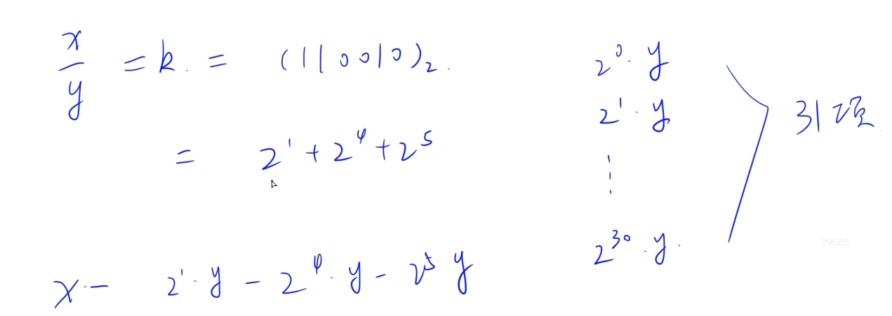


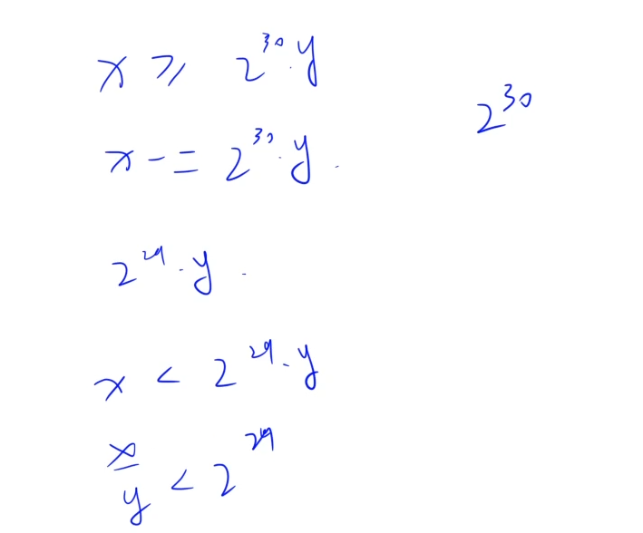

**c++代码**

```c++
class Solution {
public:
    int divide(int x, int y) {
        if(x == INT_MIN && y == -1) return INT_MAX;  //处理溢出
        bool flag = false;
        vector<long> exp; //指数项
        if(x < 0 && y > 0|| x > 0 && y < 0) flag = true;  //确定负号
        long a = abs((long)x), b = abs((long)y);
        for(long i = b; i <= a; i = i + i){
            exp.push_back(i);
        }
        long res = 0;
        for(int i = exp.size() - 1; i >= 0; i--){
            if(a >= exp[i]){
                res += (long)1 << i;
                a -= exp[i];
            }
        }
        if(flag) res = -res;
        return res;
    }
};
```

### [36. 有效的数独](https://leetcode-cn.com/problems/valid-sudoku/)

**思路**

**(哈希，数组)**  $O(n^2)$ 

**c++代码**

```c++
class Solution {
public:
    bool isValidSudoku(vector<vector<char>>& board) {
        bool st[9];  //标记数组
        
        //判断行
        for(int i = 0; i < 9; i++){
            memset(st, 0, sizeof(st));
            for(int j = 0; j < 9; j++){
                if(board[i][j] != '.'){
                    int t = board[i][j] - '1';
                    if(st[t]) return false;
                    st[t] = true;
                } 
            }
        }

        //判断列
         for(int i = 0; i < 9; i++){
            memset(st, 0,sizeof(st));
            for(int j = 0; j < 9; j++){
                if(board[j][i] != '.'){
                    int t = board[j][i] - '1';
                    if(st[t]) return false;
                    st[t] = true;
                } 
            }
        }

        //判断9宫格
        for(int i = 0; i < 9; i += 3)
            for(int j = 0; j < 9; j += 3){
                memset(st, 0, sizeof(st));
                for(int x = 0; x < 3; x++)
                    for(int y = 0; y < 3; y++)
                        if(board[i + x][j + y] != '.'){
                            int t = board[i + x][j + y] - '1';
                            if (st[t]) return false;
                            st[t] = true;
                        }
            }
        return true;   
    }     
};
```

### [38. 外观数列](https://leetcode-cn.com/problems/count-and-say/)*

**思路**

**(双指针）**  $O(n^2)$ 

 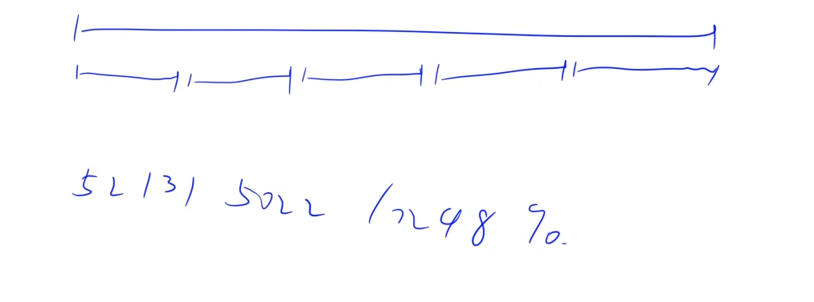

**c++代码**

```c++
class Solution {
public:
    string countAndSay(int n) {
        string s = "1";
        for(int i = 2; i <= n; i++){
            string t;
            for(int j = 0; j < s.size(); j++){
                int k = j;
                while(k < s.size() && s[k] == s[j])  k++;
                t += to_string(k - j) + s[j];
                j = k - 1;
            }
            s = t;
        }
        return s;
    }
};
```

### [44. 通配符匹配](https://leetcode-cn.com/problems/wildcard-matching/)*

**思路**

**(动态规划)**  $O(n^2)$

**状态表示：**`f[i][j]` 表示字符串` s` 的前 `i `个字符和字符串 `p` 的前` j` 个字符能否匹配。

**状态计算：** 

`f[i][j]`如何计算？我们根据`p[j]` 是什么来划分集合： 

- `s[i] == p[j] || p[j] == '?'`，这时候是精准匹配，所以取决于`s`的前`i - 1`个字符和`p`的前`j - 1`个字符是否匹配。`f[i][j] = f[i - 1][j - 1];`

- `p[j] == '*'`，这个时候`*`可以代表空串或者任意多个字符。如果是空串，那么`f[i][j] = f[i][j - 1]`。
  如果不是空串，那么`f[i][j] = f[i - 1][j]`。这是因为`*`代表了任意多个字符，如果能匹配前`i - 1`个字符，那么就在`*`代表的字符串后面加上`s[i]`，就可以匹配前`i`个字符啦。

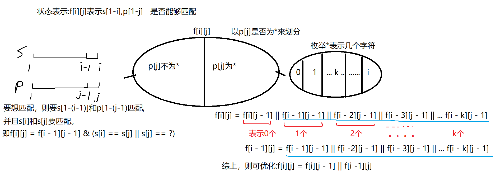  

用`f[i][j]`表示到`i-1`,j-1的话总是要考虑加一减一的事，容易搞混。可以还用`f[i][j]`表示到i,j，只不过在两个字符串前面加上特殊字符表示空字符，不影响结果又方便初始化，而且不改变`f[i][j]`定义。

**c++代码 **

```c++
	
```

### [378. 有序矩阵中第 K 小的元素](https://leetcode-cn.com/problems/kth-smallest-element-in-a-sorted-matrix/)

**思路**

**(值域二分)**  $nlog(V)$ 

数组的最小值是左上角的`matrix[0][0]`，最大值是右下角的`matrix[n−1][n−1]`，那么第`k`小的数一定在这个区间内。

二分的区间为`matrix[0][0] ~ matrix[n−1][n−1]`，假设我们二分出来的答案为`target`，那么遍历整个数组，统计 `<= target `的个数`cnt`，如果`cnt < k`个，那么说明第`k`小的数比`target`大。如果` cnt >= k`，就说明第`k`小的数`<= target`。

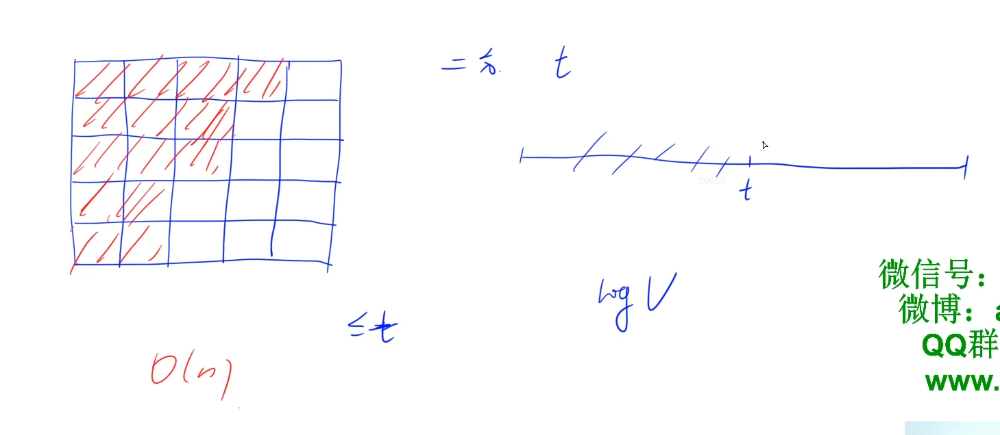

根据矩阵性质，每一行 `<= target` 的个数一定是递减的。

**c++代码**

```c++
class Solution {
public:
    int kthSmallest(vector<vector<int>>& matrix, int k) {
        int n = matrix.size();
        int l = matrix[0][0], r = matrix[n - 1][n - 1];
        while(l < r){
            int mid =  l + r  >> 1;
            int j = n - 1, cnt = 0;
            for(int i = 0; i < n; i++){
                while(j >= 0 && matrix[i][j] > mid) j--;
                cnt += j + 1; 
            }
            if(cnt >= k) r = mid;
            else l = mid + 1;
        }
        return r;
    }
};
```

### [315. 计算右侧小于当前元素的个数](https://leetcode-cn.com/problems/count-of-smaller-numbers-after-self/)

**思路**

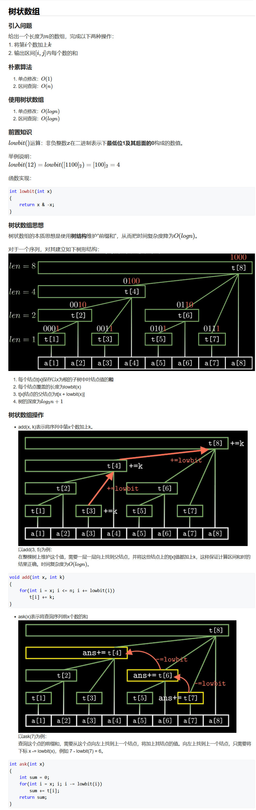

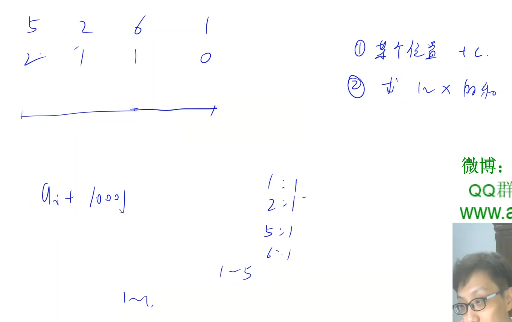

**c++代码**

```c++
class Solution {
public:
    /**
        树状数组
    **/
    vector<int> t;
    const int n = 20001;
    int lowbit(int x){
        return -x & x;
    }
    void add(int x, int k){
        for(int i = x; i <= n; i += lowbit(i)) t[i] += k;
    }
    int query(int x){
        int sum = 0;
        for(int i = x; i; i -= lowbit(i))  sum += t[i];
        return sum;
    }
    vector<int> countSmaller(vector<int>& nums) {
        t.resize(n + 1);
        vector<int> res(nums.size());
        for(int i = nums.size() - 1; i >= 0; i--){
            int x = nums[i] + 10001; //离散化
            res[i] = query(x - 1);
            add(x, 1);
        }
        return res;
    }
};
```

### [299. 猜数字游戏](https://leetcode-cn.com/problems/bulls-and-cows/)

**思路**

**(字符串，哈希)**  $O(n)$

1、定义`hash`表，记录`secret`中每个数字出现的次数。

2、遍历`guess`，统计`bulls`的个数。

3、遍历`secret`，统计统计两个数字的交集个数`tol`

4、`cows`个数 等于 `tol - bulls`

**c++代码**

```c++
class Solution {
public:
    /**
        字符串 哈希
    **/
    string getHint(string secret, string guess) {
        unordered_map<char, int> hash;
        for(char c : secret) hash[c]++;
        int bulls = 0; //公牛的个数
        for(int i = 0; i < guess.size(); i++){
            if(guess[i] == secret[i]){
                bulls++;  //统计公牛的个数
            }
        }
        int tol = 0;
        for(char c : guess){  //统计两个数字的交集个数
            if(hash[c]){
                tol++;
                hash[c]--;
            }
        }
        // cows = tol - bulls
        return to_string(bulls) + 'A' + to_string(tol - bulls) + 'B';
    }
};
```

### [202. 快乐数](https://leetcode-cn.com/problems/happy-number/)

**思路**

**(哈希)** 

从起点开始，一直往下走，用哈希表记录每一次变过的点

- 1、若哈希表本身就已经有该点，则表示已经走到了一个死循环，则 `return false`
- 2、若一直走下去，哈希表中都不存在该点，并顺利走向`1`，则 `return true`。

**c++代码**

```c++
class Solution {
public:
    bool isHappy(int n) {
        unordered_set<int> hash;
        while(n != 1){
            int t = 0;
            while(n){
                t += (n % 10) * (n % 10);
                n /= 10;
            }
            if(hash.count(t)) return false;
            hash.insert(t);
            n = t;
        }
        return true;
    }
};
```

### [66. 加一](https://leetcode-cn.com/problems/plus-one/)

**思路**

**(模拟)**  $O(n)$ 

模拟进位操作

**c++代码**

```c++
class Solution {
public:
    vector<int> plusOne(vector<int>& digits) {
        reverse(digits.begin(), digits.end()); //数组低位存贮数字低位(便于计算)
        vector<int> res;
        int t = 1; //存贮进位，模拟加1操作
        for(int i = 0; i < digits.size(); i++){
            t += digits[i];
            res.push_back(t % 10);
            t /= 10;
        }
        if(t) res.push_back(t);
        reverse(res.begin(), res.end());
        return res;
    }
};
```

### [190. 颠倒二进制位](https://leetcode-cn.com/problems/reverse-bits/)

**思路**

**(位运算)**  $O(1)$ 

使用位运算 `n >> i & 1 `可以取出 `n` 的第 `i` 位二进制数。
我们从小到大依次取出 `n` 的所有二进制位，然后逆序累加到另一个无符号整数中。

**c++代码**

```c++
class Solution {
public:
    uint32_t reverseBits(uint32_t n) {
        int res = 0;
        for(int i = 0; i < 32; i++){
            res = (res << 1) + (n >> i & 1);
        }
        return res;
    }
};
```

### [629. K个逆序对数组](https://leetcode-cn.com/problems/k-inverse-pairs-array/) *

**思路**

**(动态规划)** 

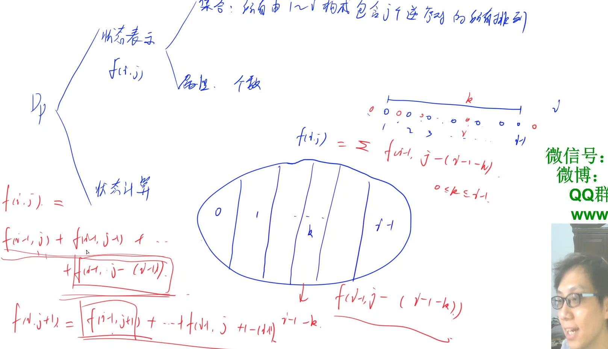

**状态表示：**`f[i][j]` 表示所有由`1-i`构成包含`j`个逆序对的所有排列的个数

**状态计算：** 

依据最大数`i`的位置来划分集合：

假设第 `i`个数所在位置为`k`，由于数值 `i `为整个数组的最大值，因此数值 `i `与前面所有数均不形成逆序对，与后面的所有数均形成逆序对。因此与数值 `i` 直接相关的逆向对的数量为 `i − 1 − k`。

`f[i][j] =  f[i - 1][j - (i - 1 - k)]`  ,  `0 <= k <= i - 1` 。

**初始化：**

`f[1][0] = 1`

**c++三维代码**

```c++
class Solution {
public:
    int kInversePairs(int n, int k) {
        int mod = 1e9 + 7;
        vector<vector<int>> f(n + 1, vector<int>(k + 1));
        f[1][0] = 1;  //初始化
        for(int i = 2; i <= n; i++){
            for(int j = 0; j <= k; j++){
                 long long s = 0;
                 for(int l = 0; l <= i - 1; l++){
                 if((j - (i - 1 - l)) >= 0){
                     s += f[i - 1][j - (i - 1 - l)];
                   }
                 }
                 f[i][j] = s % mod;
            }
        }
        return f[n][k];
    }
};

```

**c++二维代码**

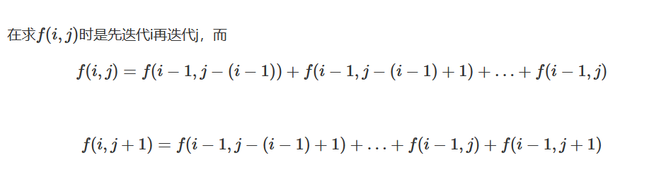

`f[i][j + 1] = f[i][j] - f[i - 1][j - (i - 1)] + f[i - 1][j + 1]`。

`f[i][j] = f[i][j - 1] - f[i - 1][j - i] + f[i - 1][j]`。

当我们从小到大枚举`j`时，我们发现对于每一个`f[i][j]`，其实较`f[i][j - 1]`说少了一项`f[i - 1][j - i]`多了一项`f[i - 1,j]`

因此，可以通过一个变量保存所有数组相加的个数，从而将`l`的循环时间复杂度降至$O(1)$，省去一重循环的时间。

```c++
class Solution {
public:
    int kInversePairs(int n, int k) {
        int mod = 1e9 + 7;
        vector<vector<int>> f(n + 1, vector<int>(k + 1));
        f[1][0] = 1;  
        for(int i = 2; i <= n; i++){
            long long s = 0;
            for(int j = 0; j <= k; j++){
                s += f[i - 1][j];
                if(j - i >= 0) s -= f[i - 1][j - i]; 
                f[i][j] = s % mod; 
            }
        }
        return f[n][k];
    }
};
```

### [73. 矩阵置零](https://leetcode-cn.com/problems/set-matrix-zeroes/) 

**思路**

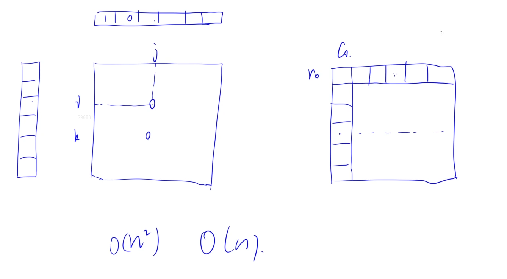

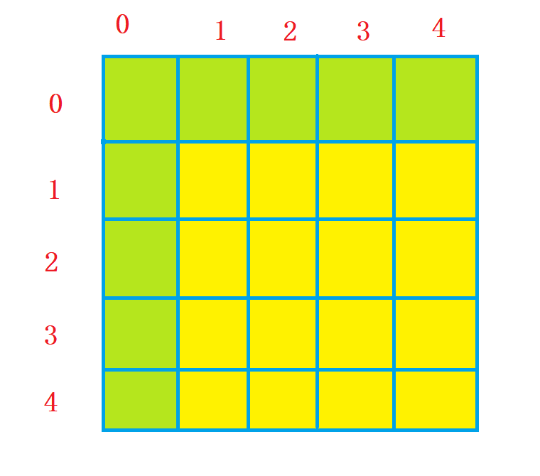 

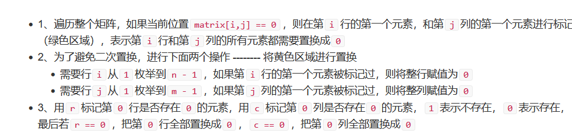

**c++代码**

```c++
```

### [137. 只出现一次的数字 II](https://leetcode-cn.com/problems/single-number-ii/)

**思路**

**(位运算)**   $O(n)$ 

如果一个数字出现`3`次，它的二进制每一位也出现的`3`次。如果把所有的出现`3`次的数字的二进制表示的每一位都分别加起来，那么每一位都能被`3`整除。 我们把数组中所有的数字的二进制表示的每一位都加起来。如果某一位能被3整除，那么这一位对只出现一次的那个数的这一肯定为`0`。如果某一位不能被`3`整除，那么只出现一次的那个数字的该位置一定为`1`。

因此，考虑二进制每一位上出现 `0` 和 `1` 的次数，如果出现 `1` 的次数为 `3k + 1`，则证明答案中这一位是 `1`。

**具体过程：**

- 1、定义`bit`，从`0`枚举到`31`，相当于考虑数字的每一位。
- 2、遍历数组`nums`，统计所有数字`bit`位出现`1`的个数，记录到`cnt`中。
- 3、如果`bit`位`1`出现次数不是`3`的倍数，则说明答案在第`i`位是`1`，否则说明答案的`bit`位是`0`。

**时间复杂度分析：** 仅遍历 `32` 次数组，故时间复杂度为 $O(n)$。 

**c++代码** 

```c++
class Solution {
public:
    int singleNumber(vector<int>& nums) {
        int n = nums.size();
        int res = 0;
        for(int bit = 0; bit < 32; bit++){
            int cnt = 0; //统计所有数字bit位上1的个数
            for(int i = 0; i < nums.size(); i++){
                if(nums[i] >> bit & 1) cnt++;
            }
            if(cnt % 3 != 0) res += 1 << bit;
        }
        return res;
    }
};
```

### [剑指 Offer 67. 把字符串转换成整数](https://leetcode-cn.com/problems/ba-zi-fu-chuan-zhuan-huan-cheng-zheng-shu-lcof/)

**思路**

**(模拟)**  $O(n)$

**先来看看题目的要求：**

- 1、**忽略所有行首空格**，找到第一个非空格字符，可以是 `‘+/−’ `表示是正数或者负数，紧随其后找到**最长的一串连续数字**，将其解析成一个整数。
- 2、整数后可能有**任意非数字字符**，请将其忽略。
- 3、如果整数大于`INT_MAX`，请返回`INT_MAX`；如果整数小于`INT_MIN`，请返回`INT_MIN`；

**具体过程：**

- 1、定义`k = 0`，用`k`来找到第一个非空字符位置。
- 2、使用`flag`记录数字的正负性，`false`表示正号，`true`表示负号。
- 3、使用`res`来存贮结果，当`str[k]`为数字字符时进入`while`循环，执行`res = res * 10 +str[k] - '0'`。
  - 根据`flag`判断，如果`res`大于`INT_MAX`，则返回`INT_MAX`；如果`res * -1`小于`INT_MIN`，则返回`INT_MIN`；
- 4、计算`res `。

**时间复杂度分析：**字符串长度是 `n`，每个字符最多遍历一次，所以总时间复杂度是 $O(n)$。

**c++代码 **

```c++
class Solution {
public:
    int strToInt(string str) {
        int k = 0;
        bool flag = false;

        while (k < str.size() && str[k] == ' ') k++;
        if (str[k] == '-') flag = true, k++;
        else if (str[k] == '+' ) k++;

        long long res = 0;
        while(k < str.size() && str[k] >= '0' && str[k] <= '9'){
            res = res * 10 + str[k] - '0';
            if (res > INT_MAX && !flag)     return  INT_MAX;
            if (res * -1 < INT_MIN && flag) return  INT_MIN;
            k++;
        }
        if(flag) res *= -1;
        return  res;
    }
};
```

### [295. 数据流的中位数](https://leetcode-cn.com/problems/find-median-from-data-stream/)

**知识补充：**

https://www.cnblogs.com/wangchaowei/p/8288216.html

https://cloud.tencent.com/developer/article/1616910

**数据结构 - 堆**   

- Heap是一种数据结构具有以下的特点：
   (1）**完全二叉树**；
   (2）heap中存储的值是**偏序**；
- **Min-heap**:   父节点的值小于或等于子节点的值；
-  **Max-heap**: 父节点的值大于或等于子节点的值；

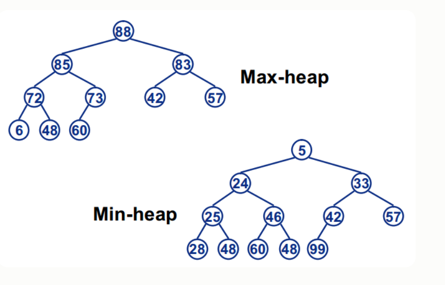

**优先队列：** 

priority_queue称为“优先队列”，其底层是用堆实现。在优先队列中，队首元素一定是当前队列中优先级最高的哪一个。

默认的定义优先队列是大根堆，即父节点的值大于子节点的值。

**获取堆顶元素**

> top()：可以获得队首元素（堆顶元素），时间复杂度为O(1)。 与队列不一样的是，优先队列通过top()函数来访问队首元素（堆顶元素）。（队列是通过front()函数和back()函数访问下标）

**入队**

> push(x) ：令x入队，时间复杂度为O(logN)，其中N为当前优先队列中的元素个数。

**出队**

> pop()：   令队首元素（堆顶元素）出队，时间复杂度为O(logN)，其中N为当前优先队列中的元素个数。

**检测是否为空**

> empty()：检测优先队列是否为空，返回true为空，false为非空。时间复杂度为O（1）

**获取元素个数**

> size()：用来获得优先队列中元素的个数，时间复杂度为 O(1)

**案例代码** 

```c++
#include
#include
using namespace std;
int main(){
    priority_queue q;

    //入队
    q.push(3);
    q.push(4);
    q.push(1);

    //通过下标访问元素
    printf("%d\n",q.top());//输出4

    //出队
    q.pop();
    printf("%d\n",q.top());//输出3

    //检测队列是否为空
    if(q.empty() == true) {
        printf("Empty\n");
    } else {
        printf("Not Empty\n");
    }

    //获取长度
    //printf("%d\n",q.size());//输出3
}
```

**基本数据类型的优先级设置**

一般情况下，数字大的优先级更高。（char类型的为字典序最大） 对于基本结构的优先级设置。下面两种优先队列的定义是等价的： 

```c++
priority_queue<int> q; 
priority_queue<int, vector<int>, greater<int>> q;
```

如果想让优先队列总是把最小的元素放在队首，需进行以下定义：

```c++
priority_queue<int, vector<int>, grater<int>> q
```

**思路**

**(双堆)**  

**c++代码**

```c+
```

### [27. 移除元素](https://leetcode-cn.com/problems/remove-element/)

**思路**

**(模拟)** $O(n)$ 

枚举每个元素，若当前元素与`val`不一致，则保存该元素。

**具体过程如下：**

1、定义`k = 0`。

2、遍历`nums`数组，判断`nums[i]`是否和`val`相等，如果不相等，则`nums[k] = nums[i]`，并且`k++`。

**时间复杂度分析：**  $O(n)$。

**c++代码**

```c++
class Solution {
public:
    int removeElement(vector<int>& nums, int val) {
        int k = 0;
        for(int x : nums){
            if(x != val) nums[k++] = x;
        }
        return k;
    }
};
```

### [35. 搜索插入位置](https://leetcode-cn.com/problems/search-insert-position/)

**思路**

**(二分)**  $O(logn)$

1、二分查找 `>= target`的最左边界。

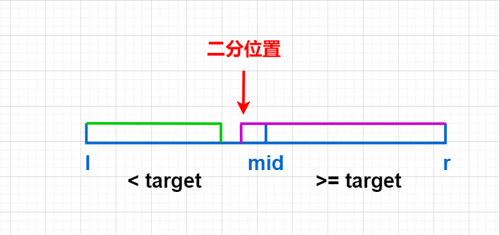

2、二分结束后，如果`nums[r] < target`，说明说明数组所有元素都比 `target` 小，我们返回`r + 2`，否则返回`r`。

**时间复杂度分析：** $O(logn)$。

**c++代码**

```c++
class Solution {
public:
    int searchInsert(vector<int>& nums, int target) {
        int l = 0, r = nums.size() - 1;
        while(l < r){
            int mid = l + r >> 1;
            if(nums[mid] >= target) r = mid;
            else l = mid + 1;
        }
        if(nums[r] < target) return r + 1;
        return l;
    }
};
```

### [58. 最后一个单词的长度](https://leetcode-cn.com/problems/length-of-last-word/)

**思路**

**(双指针)**  $O(n)$

1、从后往前找，找到第一个不是空字符串的位置`j`。

2、从`j`往前找，直到找到为空字符串的位置`i`，则区间`[i + 1,j]`即为最后一个单词。

3、最后返回`j - i`。

**c++代码**

```c++
class Solution {
public:
    int lengthOfLastWord(string s) {
        int j = s.size() - 1;
        while(j >= 0 && s[j] == ' ') j--;  //跳过结尾空格
        int i = j;
        while(i >= 0 && s[i] != ' ') i--;  //跳过最后一个单词
        return j - i; // [i + 1, j]即为结尾单词
    }
};
```

### [67. 二进制求和](https://leetcode-cn.com/problems/add-binary/) *

**思路**

**(字符串模拟)**  $O(max(n, m))$ 

1、对`a`字符串和`b`字符串进行反转，我们用`t`存贮进位。

2、枚举每一位，当还未达到字符串`a`或者`b`的末尾时，我们计算`t += a[i] + b[i]`，并将`t % 2`存贮到`res`中，之后执行`t /= 2`。

3、若枚举完所有位后，`t > 0`，则将`t`再次存入到`res`中。

3、如果枚举完所有位后，`t > 0`，将`t`再次存入到`res`下一位。

4、最后将`res`反转输出。

**时间复杂度分析：** $O(max(n, m))$ 。

**c++代码**

```c++
class Solution {
public:
    string addBinary(string a, string b) {
        int n = a.size(), m = b.size();
        reverse(a.begin(), a.end());
        reverse(b.begin(), b.end());
        string res;
        int t = 0;
        for(int i = 0; i < max(n, m); i++){
            if(i < n) t += a[i] - '0';
            if(i < m) t += b[i] - '0';
            res += to_string(t % 2);
            t /= 2;
        }
        if(t) res += to_string(t);
        reverse(res.begin(), res.end());
        return res;
    }
};
```

