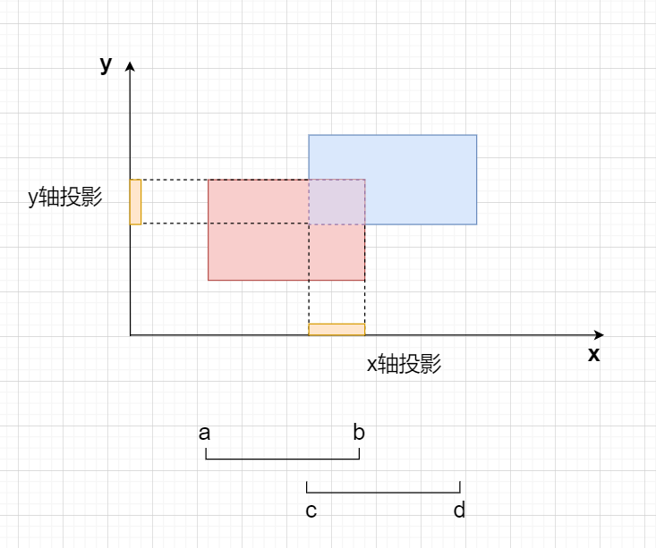
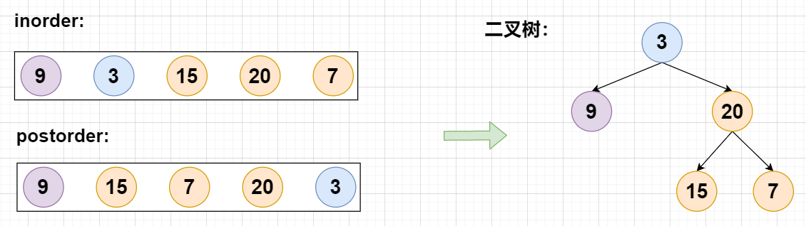
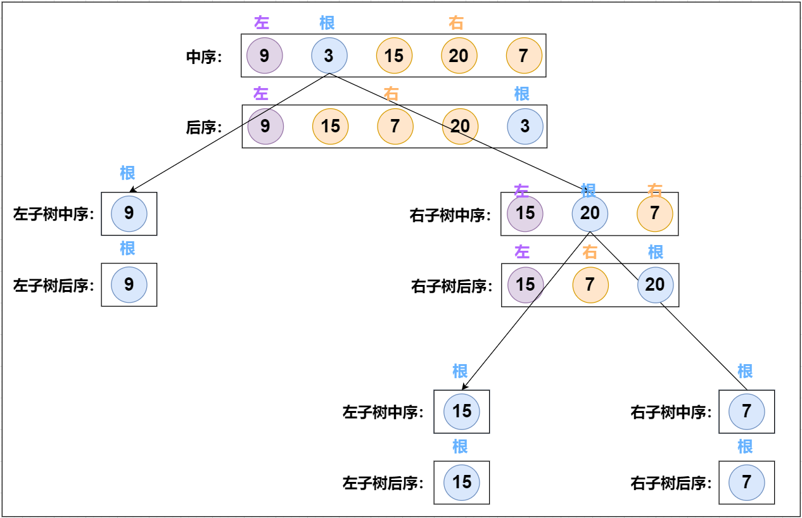
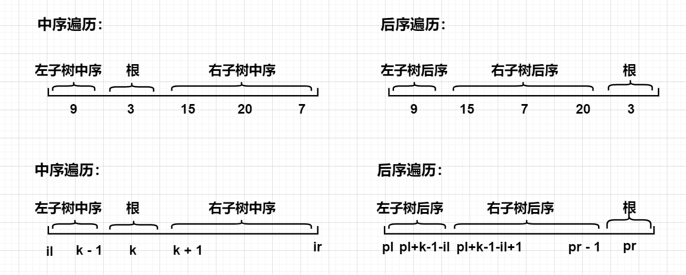
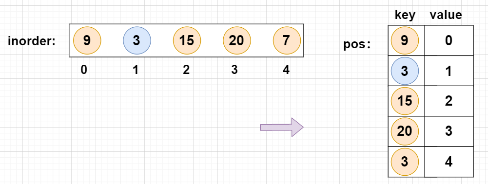
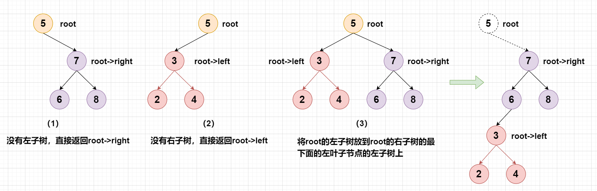
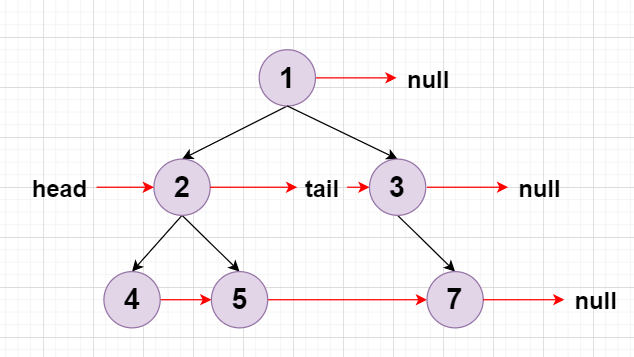

## 力扣500题刷题笔记

### [119. 杨辉三角 II](https://leetcode-cn.com/problems/pascals-triangle-ii/)

**思路**

**(动态规划)**  $O(n^2)$ 

**c++代码**

```c++
class Solution {
public:
    // 状态转移方程：f[i][j] = f[i - 1][j] + f[i - 1][j - 1]
    vector<int> getRow(int n) {
        vector<vector<int>> f(n + 1);
        for(int i = 0; i <= n; i++){  //第i行，有i+1个元素
            f[i].resize(i + 1);
            f[i][0] = f[i][i] = 1;    //每行的开头和结尾元素为1
            for(int j = 1; j < i; j++)
                f[i][j] = f[i - 1][j] + f[i - 1][j - 1];  //中间元素
        }
        return f[n];
    }
};
```

### [203. 移除链表元素](https://leetcode-cn.com/problems/remove-linked-list-elements/)

**思路**

**(模拟)** 

**c++代码**

```c++
/**
 * Definition for singly-linked list.
 * struct ListNode {
 *     int val;
 *     ListNode *next;
 *     ListNode() : val(0), next(nullptr) {}
 *     ListNode(int x) : val(x), next(nullptr) {}
 *     ListNode(int x, ListNode *next) : val(x), next(next) {}
 * };
 */
class Solution {
public:
    ListNode* removeElements(ListNode* head, int val) {
        ListNode* dummy = new ListNode(-1); //虚拟头节点
        dummy->next = head;
        ListNode* p = dummy;
        while(p && p->next){
            if(p->next->val == val) p->next = p->next->next;
            else p = p->next;
        }
        return dummy->next;
    }
};
```

### [557. 反转字符串中的单词 III](https://leetcode-cn.com/problems/reverse-words-in-a-string-iii/)

**思路**

**(双指针)**  $O(n)$

1、遍历整个`s`字符串：

- 如果`s[i]`为空格，则跳过，让`j`指向单词的第一个字符；
- 定义`j = i`，如果`s[j] != ' '`，`j++`，让`j`指向单词的下一个空格；
- 将`s[i, j - 1]`翻转。

2、返回`s`字符串。

**时间复杂度分析：**`j`最多递增`n`次，因此时间复杂度为$O(n)$。

**c++代码**

```c++
class Solution {
public:
    string reverseWords(string s) {
        for(int i = 0; i < s.size(); i++){
            if(s[i] == ' ') continue;
            int j = i;
            while(j < s.size() && s[j] != ' ') j++;
            reverse(s.begin() + i, s.begin() + j);
            i = j - 1;
        }
        return s;
    }
};
```

### [977. 有序数组的平方](https://leetcode-cn.com/problems/squares-of-a-sorted-array/)

**思路**

**(双指针，二路归并)**  $O(n)$

我们可以发现一个性质，平方后的数组可能是两端大，中间小。因此我们可以定义两个指针，一个在平方数组的开头，一个在平方数组的结尾，进行二路归并。

**具体过程如下：**

- 1、定义两个指针`i`和`j`，初始化`i = 0`, `j = n - 1`。同时再定义一个`k`，初始化`k = n - 1`，用于存放结果。
- 2、如果`nums[i] * nums[i] > nums[j] * nums[j]`，我们将`nums[i] * nums[i]`放入`res[k]`中，然后`i++`，`k--`。
- 3、否则将`nums[j] * nums[j]`放入`res[k]`，然后`j--`, `k--`;

**c++代码**

```c++
class Solution {
public:
    vector<int> sortedSquares(vector<int>& nums) {
        int n = nums.size();
        vector<int> res(n);
        int i = 0, j = n - 1, k = n - 1;
        while(i <= j){
            if(nums[i] * nums[i] > nums[j] * nums[j]){
                res[k] = nums[i] * nums[i];
                i++, k--;
            }else{
                res[k] = nums[j] * nums[j];
                j--, k--;
            }
        }
        return res;
    }
};
```

### [836. 矩形重叠](https://leetcode-cn.com/problems/rectangle-overlap/)

**思路**

**(几何，数学)**   $O(1)$ 

二维矩阵的重叠判断可以看成两个一维线段重叠的判断，因此我们可以将矩形投影到坐标轴上，进行线段重叠判断。



假设有两个线段分别为`[a, b]`和`[c, d]`，则两个线段重叠的充要条件为：`a < b && c < d && b > c && d > a` 。

**时间复杂度分析：** 两个判断，因此时间复杂度为$O(1)$。

**c++代码**

```c++
class Solution {
public:
    bool isRectangleOverlap(vector<int>& rec1, vector<int>& rec2) {
        return check(rec1[0], rec1[2], rec2[0], rec2[2]) &&
               check(rec1[1], rec1[3], rec2[1], rec2[3]); 
    }
    bool check(int a, int b, int c, int d){
        return a < b && c < d && b > c && d > a;
    }
};
```

**java代码**

```java
class Solution {
    public boolean isRectangleOverlap(int[] rec1, int[] rec2) {
        return check(rec1[0], rec1[2], rec2[0], rec2[2]) &&
               check(rec1[1], rec1[3], rec2[1], rec2[3]); 
    }
    public boolean check(int a, int b, int c, int d){
        return a < b && c < d && b > c && d > a;
    }
};    
```

### [231. 2 的幂](https://leetcode-cn.com/problems/power-of-two/)

**思路**

**(递归)**

- 1、如果一个数可以被2整除，我们递归计算`n / 2`。
- 2、递归边界，`n == 1`表示`n`是`3`的幂次方，`n == 0`表示`n`不是`3`的幂次方

**c++代码**

```c++
class Solution {
public:
    bool isPowerOfTwo(int n) {
        if(n == 1) return true;
        if(n == 0) return false;
        return isPowerOfTwo(n / 2) && n % 2 == 0;
    }
};
```

### [674. 最长连续递增序列](https://leetcode-cn.com/problems/longest-continuous-increasing-subsequence/) *

**思路**

**(双指针)** $O(n)$

**c++代码1**

```c++
class Solution {
public:
    int findLengthOfLCIS(vector<int>& nums) {
        int res = 0;
        for(int i = 0; i < nums.size(); i++){
            int j = i + 1;
            while(j < nums.size() && nums[j] > nums[j - 1]) j++;
            res = max(res, j - i);
            i = j - 1;
        }
        return res;
    }
};
```

**(动态规划)**  $O(n)$

**c++代码2**

```c++
class Solution {
public:
    int findLengthOfLCIS(vector<int>& nums) {
        int res = 0, n = nums.size();
        vector<int>f(n + 1);
        for(int i = 0; i < n; i++){
            f[i] = 1;
            if(i && nums[i] > nums[i - 1])
                f[i] = f[i - 1] + 1;
            res = max(res, f[i]);    
        }
        return res;
    }
};

```

### [257. 二叉树的所有路径](https://leetcode-cn.com/problems/binary-tree-paths/)

**思路**

**(递归)**   $O(n)$

1、从根结点出发，递归走所有的路径，并把路径的值记录下来
2、递归过程中

- 若左子树和右子树都为`null`，则返回记录的路径`path`;
- 若左子树不为`null`，则把左子树的值加入到路径中，递归到左子树;
- 若右子树不为`null`，则把右子树的值加入到路径中，递归到右子树;

**c++代码**

```c++
/**
 * Definition for a binary tree node.
 * struct TreeNode {
 *     int val;
 *     TreeNode *left;
 *     TreeNode *right;
 *     TreeNode() : val(0), left(nullptr), right(nullptr) {}
 *     TreeNode(int x) : val(x), left(nullptr), right(nullptr) {}
 *     TreeNode(int x, TreeNode *left, TreeNode *right) : val(x), left(left), right(right) {}
 * };
 */
class Solution {
public:
    vector<string> res;
    vector<string> binaryTreePaths(TreeNode* root) {
        dfs(root, "");
        return res;
    }
    void dfs(TreeNode* root, string path){
        if(!root) return ;
        if(!root->left && !root->right){
            res.push_back(path + to_string(root->val));
            return ;
        }
        if(root->left)  dfs(root->left,  path + to_string(root->val) + "->");
        if(root->right) dfs(root->right, path + to_string(root->val) + "->");
    }
};
```

### [559. N 叉树的最大深度](https://leetcode-cn.com/problems/maximum-depth-of-n-ary-tree/)

**思路**

**(dfs)**    $O(n)$

- 1、当前树的最大深度等于子树的最大深度加`1`。
- 2、遍历整颗子树，返回当前子结点的最大深度然后加1。

**c++代码**

```c++
/*
// Definition for a Node.
class Node {
public:
    int val;
    vector<Node*> children;

    Node() {}

    Node(int _val) {
        val = _val;
    }

    Node(int _val, vector<Node*> _children) {
        val = _val;
        children = _children;
    }
};
*/

class Solution {
public:
    int maxDepth(Node* root) {
        if(!root) return 0;
        int res = 0;
        for(Node* node : root->children){
            res = max(res, maxDepth(node));
        }
        return res + 1;
    }
};
```

### [409. 最长回文串](https://leetcode-cn.com/problems/longest-palindrome/)

**思路**

**(哈希)**   $O(n)$

- 1、用哈希表统计每个字符出现的次数。

- 2、遍历哈希表，如果一个字符出现的次数为`k`次，那么这个字符最多可以被用来拼凑成回文串的长度为`⌊k/2⌋ * 2`。因此，答案累加上这个长度。

- 3、如果某个字符还有剩余，那么我们还可以往回文串中间加一个字符，则答案累加`1`。

**时间复杂度分析：** 最多需要遍历输字符串中`n`个字符，所以时间复杂度为$O(n)$。

**c++代码**

```c++
class Solution {
public:
    int longestPalindrome(string s) {
        unordered_map<char, int> hash;
        for(char c : s)  hash[c]++;
        int res = 0;
        for(auto item : hash){
            int k = item.second;
            res += k / 2 * 2;
        }
        if(res < s.size()) res++;
        return res;
    }
};
```

### [680. 验证回文字符串 Ⅱ](https://leetcode-cn.com/problems/valid-palindrome-ii/)

**思路**

**(双指针 + 贪心)**    $O(n)$ 

- 1、判断一个字符串是否是回文串，我们可以直接使用双指针算法。
- 2、定义两个指针`i`和`j`，`i`从前往后，`j`从后往前，如果`s[i] != s[j]`，我们考虑删除`s[i]`或者`s[j]`。
- 3、删除某个字符以后，我们可以使用双指针判断剩余的字符串是否为双指针。

**c++代码**

```c++
class Solution {
public:
    bool validPalindrome(string s) {
        for(int i = 0, j = s.size() - 1; i < j; i++, j--){
            if(s[i] != s[j]){
                if(check(s, i + 1, j) || check(s, i, j - 1)) return true;
                return false;
            }
        }
        return true;
    }
    bool check(string s, int i, int j){
        while(i < j){
            if(s[i] != s[j]) return false;
            i++, j--;
        }
        return true;
    }
};
```

### [468. 验证IP地址](https://leetcode-cn.com/problems/validate-ip-address/)

**思路**

**(字符串 + 模拟)**  $O(n)$

**一个合法的IPv4满足以下条件：** 

1. 被`.`分割成`4`组字符串。
2. 每组字符串不为空，且长度` <= 3`。
3. 每组字符串转换成数字后介于`0 ~ 255`之间。
4. 每组字符串仅由数字字符组成。
5. 每组字符串的长度大于`1`时，不包含前导`0`。

**一个合法的IPv6满足以下条件：** 

1. 被`:`分割成`8`组字符串。
2. 每组字符串不为空，且长度`  <= 4`。
3. 每组字符串转化成数字后为一个16进制数，即字符范围为:  `0~9`,`a~f`, `A~F`。

由于C++中没有按字符分割的函数，因此我们自定义一个分割函数`split`，如下：

```c++
vector<string> split(string ip, char t) {
        vector<string> items;
        for (int i = 0; i < ip.size(); i ++ ) {
            int j = i;
            string item;
            while (ip[j] != t) item += ip[j ++ ];
            i = j;
            items.push_back(item);
        }
        return items;
   } 
```

这里使用了双指针算法，传入一个要分割的字符串`ip`和分割字符`t`，最后返回分割好的字符串数组`items`。

判断一个合法的IPv4和IPv6，我们首先调用分割函数`split`，然后按照上述条件模拟即可。

**具体过程如下：**

- 1、如果一个字符串`ip`即包含`.`也包含`:`，我们直接返回`Neither`。
- 2、如果包含`.`，我们进行`check_ipv4(ip)`，IPv4的合法性判断。
- 3、如果包含`:`，我们进行`check_ipv6(ip)`，IPv6的合法性判断。

**时间复杂度分析：**   每个字符串仅会被遍历一遍，因此时间复杂度为$O(n)$。

**c++代码**

```c++
class Solution {
public:
    vector<string> split(string ip, char t){
        vector<string> items;
        for(int i = 0; i < ip.size(); i++){
            int j = i;
            string item;
            while(j < ip.size() && ip[j] != t)  item += ip[j++];
            i = j;
            items.push_back(item);  
        }
        return items;
    }
    string check_ipv4(string ip){
        auto items = split(ip + '.', '.');a
        if(items.size() != 4) return "Neither";
        for(string item : items){
            if(item.empty() || item.size() > 3) return "Neither";
            if(item.size() > 1 && item[0] == '0')   return "Neither";
            for(char c : item){
                if(c < '0' || c > '9') return "Neither";
            }
            int t = stoi(item);
            if(t > 255) return "Neither";
        }
        return "IPv4";
    }
    bool check(char c){
        if (c >= '0' && c <= '9') return true;
        if (c >= 'a' && c <= 'f') return true;
        if (c >= 'A' && c <= 'F') return true;
        return false;
    }
    string check_ipv6(string ip){
        auto items = split(ip + ':', ':');
        if(items.size() != 8) return "Neither";
        for(string item : items){
            if(item.empty() || item.size() > 4) return "Neither";
            for(char c : item){
                if(!check(c)) return "Neither"; 
            }
        }
        return "IPv6";
    }

    string validIPAddress(string ip) {
        if(ip.find('.') != -1 && ip.find(':') != -1) return "Neither";
        if(ip.find('.') != -1)  return check_ipv4(ip);
        if(ip.find(':') != -1)  return check_ipv6(ip);
        return "Neither";
    }
};
```

### [525. 连续数组](https://leetcode-cn.com/problems/contiguous-array/)

**思路**   

**(前缀和 + 哈希表)**  $O(n)$

利用前缀和的思想，`s[i]`表示`nums[0 ~ i]` 中`1`的个数和`0`的个数的差值。我们固定终点`i`之后，在区间`[0 ~ i-1]`中判断是否存在`j`，使得`s[i] - s[j] == 0`，即区间`[j + 1, i]`的`1`的个数和`0`的个数的差值为`0`。如果满足，则表示区间`[j + 1, i]`之间`1`的个数和`0`的个数相等。

由于答案要求的是相同数量的 `0` 和 `1` 的最长连续子数组，因此我们要开一个哈希表记录每个前缀和第一次出现的下标。

**具体过程如下：**

- 1、定义一个哈希表，初始化`one = 0`,`zero = 0`，分别记录`0`和`1`的个数。

- 2、遍历`nums`数组，假设当前遍历到了`nums[i]`:

  - 计算差值`s = zero - one`；

  - 如果`s`在哈希表出现过，说明我们找到了一个`j`使得`s[i] == s[j]`，则更新答案；
  - 否则，`s`第一次出现，将其位置存入哈希表中；

- 3、最后返回答案。

**c++代码**

```c++
class Solution {
public:
    int findMaxLength(vector<int>& nums) {
        int n = nums.size();
        int res = 0, one = 0, zero = 0;
        unordered_map<int, int> hash;
        hash[0] = 0;
        for(int i = 1; i <= n; i++){
            int x = nums[i - 1];
            if(!x)  zero++;
            else one++;
            int s = one - zero;
            if(hash.count(s)) res = max(res, i - hash[s]);
            else hash[s] = i;
        }
        return res;
    }
};
```

### [106. 从中序与后序遍历序列构造二叉树](https://leetcode-cn.com/problems/construct-binary-tree-from-inorder-and-postorder-traversal/)

**思路**

**(递归)**  $O(n)$

给定两个整数数组`inorder` 和 `postorder` ，其中 `inorder` 是二叉树的中序遍历， `postorder` 是同一棵树的后序遍历，让我们返回这颗二叉树。

**样例：**      



如样例所示，`inorder = [9,3,15,20,7]`, `postorder = [9,15,7,20,3]`，我们可以构造出如上图所示的二叉树。

**二叉树： **

- 二叉树中序遍历的顺序为：左根右；
- 二叉树后序遍历的顺序为：左右根；

对于这道题目来讲，我们可以递归建立整棵二叉树：先创建根节点，然后递归创建左右子树，并让指针指向两棵子树。 



如上图所示，递归过程就是二叉树的建立过程。对二叉树的建立过程有了大致了解之后，接下来就是确定左右子树在中序和后序数组的边界。

**如何确定子树的左右边界？** 

根据二叉树的性质，我们可以依次采取下述步骤：

- 1、先利用后序遍历找根节点：后序遍历的最后一个数，就是根节点的值；

- 2、在中序遍历中找到根节点的位置 `k`，则 `k` 左边是左子树的中序遍历，右边是右子树的中序遍历；

- 3、假设`il`,`ir`对应子树中序遍历区间的左右端点， `pl`,`pr`对应子树后序遍历区间的左右端点。那么左子树的中序遍历的区间为

  `[il, k - 1]`，右子树的中序遍历的区间为`[k + 1, ir]`。

- 4、由步骤3可知左子树中序遍历的长度为`k - 1 - il + 1`，由于一棵树的中序遍历和后序遍历的长度相等，因此后序遍历的长度也为`k - 1 - il + 1`。这样根据后序遍历的长度，我们可以推导出左子树后序遍历的区间为`[pl, pl + k - 1 - il]`，右子树的后序遍历的区间为`[pl + k - 1 - il + 1, pr - 1]`。

仅凭文字可能不太好理解上述推导过程，我们画张图来辅助理解： 



左右子树中序和后序遍历的边界确定是这道题最大的难点，理解了这点，这道题也就做完了一大半。

**如何在中序遍历中对根节点快速定位？** 

一种简单的方法是直接扫描整个中序遍历的结果并找出根节点，但这样做的时间复杂度较高。我们可以考虑使用哈希表来帮助我们快速地定位根节点。对于哈希映射中的每个键值对，键表示一个元素（节点的值），值表示其在中序遍历中的出现位置。这样在中序遍历中查找根节点位置的操作，只需要 $O(1)$ 的时间。 

**如图：** 



**具体过程如下：**

- 1、创建一个哈希表`pos`记录记录每个值在中序遍历中的位置。
- 2、先利用后序遍历找根节点：后序遍历的最后一个数，就是根节点的值；
- 3、确定左右子树的后序遍历和中序遍历，先递归创建出左右子树，然后创建根节点。
- 4、最后将根节点的左右指针指向两棵子树。

**时间复杂度分析：** 查找根节点的位置需要$O(1)$ 的时间，创建每个节点需要的时间是 $O(1)$，因此总的时间复杂度是 $O(n)$。

**c++代码**

```c++
/**
 * Definition for a binary tree node.
 * struct TreeNode {
 *     int val;
 *     TreeNode *left;
 *     TreeNode *right;
 *     TreeNode() : val(0), left(nullptr), right(nullptr) {}
 *     TreeNode(int x) : val(x), left(nullptr), right(nullptr) {}
 *     TreeNode(int x, TreeNode *left, TreeNode *right) : val(x), left(left), right(right) {}
 * };
 */
class Solution {
public:
    unordered_map<int, int> pos;
    TreeNode* buildTree(vector<int>& inorder, vector<int>& postorder) {
        int n = inorder.size();
        for(int i = 0; i < n; i++){
            pos[inorder[i]] = i;     //记录中序遍历的根节点位置
        }
        return dfs(inorder, postorder, 0, n - 1, 0, n - 1);
    }
    TreeNode* dfs(vector<int>& inorder, vector<int>& postorder,int il, int ir, int pl, int pr){
        if(il > ir) return nullptr;
        int k = pos[postorder[pr]];   //中序遍历根节点位置
        TreeNode* root = new TreeNode(postorder[pr]); //创建根节点
        root->left = dfs(inorder, postorder, il, k - 1, pl, pl + k - 1 - il);
        root->right = dfs(inorder, postorder, k + 1, ir, pl + k - 1 - il + 1, pr - 1);
        return root;
    }
};
```

**Java代码**

```java
/**
 * Definition for a binary tree node.
 * public class TreeNode {
 *     int val;
 *     TreeNode left;
 *     TreeNode right;
 *     TreeNode() {}
 *     TreeNode(int val) { this.val = val; }
 *     TreeNode(int val, TreeNode left, TreeNode right) {
 *         this.val = val;
 *         this.left = left;
 *         this.right = right;
 *     }
 * }
 */
class Solution {
    private Map<Integer,Integer> pos = new HashMap<Integer,Integer>();
    public TreeNode buildTree(int[] inorder, int[] postorder) {
        int n = inorder.length;
        for(int i = 0; i < n; i++)
            pos.put(inorder[i], i);  //记录中序遍历的根节点位置
        return dfs( inorder, postorder, 0, n - 1, 0, n - 1);   
    }
     public TreeNode dfs(int[] inorder, int[] postorder, int il, int ir,int pl, int pr)
    {
        if(pl > pr ) return null;
        int k = pos.get(postorder[pr]);
        TreeNode root = new TreeNode(postorder[pr]);
        root.left  = dfs(inorder, postorder, il, k - 1, pl, pl + k - 1 - il);
        root.right = dfs(inorder, postorder, k + 1, ir, pl + k - 1 - il + 1, pr - 1);
        return root;     
    }
}
```

### [450. 删除二叉搜索树中的节点](https://leetcode-cn.com/problems/delete-node-in-a-bst/) *

**思路**

**(二叉搜索树)**   $O(h)$

根据二叉搜索树的性质，我们可以按照以下步骤进行删除：

- 1、目标节点`key`大于当前节点，递归到右子树去删除；
- 2、目标节点`key`小于当前节点，递归到左子树去删除；
- 3、目标节点`key`等于当前节点，则需要删除当前节点，并保证二叉搜索树的性质不变；

当目标节点`key`等于当前节点时，分为以下三种情况：

- 1、当前节点没有左子树，让其右子节点覆盖其位置，返回`root->right`;
- 2、当前节点没有右子树，让其左子节点覆盖其位置，返回`root->left`;
- 3、当前节点既有左子树又有右子树，我们让其左子树转移到其右子树的最左节点的左子树上；

我们画个图来辅助理解一下，假设我们要删除`key = 5`（root）的节点： 



**时间复杂度分析：** $O(h)$。

**c++代码**

```c++
/**
 * Definition for a binary tree node.
 * struct TreeNode {
 *     int val;
 *     TreeNode *left;
 *     TreeNode *right;
 *     TreeNode() : val(0), left(nullptr), right(nullptr) {}
 *     TreeNode(int x) : val(x), left(nullptr), right(nullptr) {}
 *     TreeNode(int x, TreeNode *left, TreeNode *right) : val(x), left(left), right(right) {}
 * };
 */
class Solution {
public:
    TreeNode* deleteNode(TreeNode* root, int key) {
        if(!root) return nullptr;
        if(root->val > key)       root->left  = deleteNode(root->left, key);
        else if(root->val < key)  root->right = deleteNode(root->right, key);
        else{
            if(!root->left)  return root->right;
            if(!root->right) return root->left;
            TreeNode* p = root->right;
            while(p->left) p = p->left;
            p->left = root->left;
            return root->right;
        }
        return root;
    }
};
```

### [117. 填充每个节点的下一个右侧节点指针 II](https://leetcode-cn.com/problems/populating-next-right-pointers-in-each-node-ii/)

**思路**

**(BFS)**  $O(n)$

- 1、用队列将当前层的结点全部存起来，并记录有`n`个是属于当前层
- 2、将当前层的每个结点都指向下一个结点，并把结点的左右儿子也加入到队列中，为下一层做准备。

**c++代码**

```c++
/*
// Definition for a Node.
class Node {
public:
    int val;
    Node* left;
    Node* right;
    Node* next;

    Node() : val(0), left(NULL), right(NULL), next(NULL) {}

    Node(int _val) : val(_val), left(NULL), right(NULL), next(NULL) {}

    Node(int _val, Node* _left, Node* _right, Node* _next)
        : val(_val), left(_left), right(_right), next(_next) {}
};
*/

class Solution {
public:
    Node* connect(Node* root) {
        if(!root) return NULL;
        queue<Node*> q;
        q.push(root);
        while(!q.empty()){
            int n = q.size();
            for(int i = 0; i < n; i++){
                Node* node = q.front();
                q.pop();
                if(i < n - 1) node->next = q.front();
                if(node->left)  q.push(node->left);
                if(node->right) q.push(node->right);
            }
        }
        return root;
    }
};
```

**(树的遍历)**  $O(n)$

树的每一层都可以看成一个单链表，因此我们可以定义一个虚拟头节点`head`，一个尾节点`tail`，每次将新的节点连接到尾节点后面。

每次遍历一层，就将下一层变成单链表。

**具体过程如下：**

- 1、初始化`cur`指针指向`root`，定义一个虚拟头节点`head`，一个尾节点`tail`。
- 2、用`cur`遍历下一层的单链表,，假设遍历到了`p`节点：
  - 如果`p->left`不为空，则将`tail`节点的`next`指针指向`p->left`，`tail = tail->next`；
  - 如果`p->right`不为空，则将`tail`节点的`next`指针指向`p->right`，`tail = tail->next`；
- 3、执行`cur = head->next`，让`cur`跳到下一层的最左边的节点。
- 4、最后返回`root`节点指针。



**c++代码** 

```c++
/*
// Definition for a Node.
class Node {
public:
    int val;
    Node* left;
    Node* right;
    Node* next;

    Node() : val(0), left(NULL), right(NULL), next(NULL) {}

    Node(int _val) : val(_val), left(NULL), right(NULL), next(NULL) {}

    Node(int _val, Node* _left, Node* _right, Node* _next)
        : val(_val), left(_left), right(_right), next(_next) {}
};
*/

class Solution {
public:
    Node* connect(Node* root) {
        if (!root) return root;
        auto cur = root;
        while (cur) {
            auto head = new Node(-1);
            auto tail = head;
            for (auto p = cur; p; p = p->next) {
                if (p->left) tail = tail->next = p->left;
                if (p->right) tail = tail->next = p->right;
            }
            cur = head->next;
        }
        return root;
    }
};


```

### [120. 三角形最小路径和](https://leetcode-cn.com/problems/triangle/)

**思路**

**(动态规划)**  $O(n^2)$

**1、自顶向下** 

**状态表示：**`f[i][j]`表示从`(0, 0)`走到`(i, j)`的最小路径和。

**状态计算：**`f[i][j] = min(f[i - 1][j - 1], f[i - 1][j]) + triangle[i][j] `。

最终的答案即为` f[n − 1][0]` 到 `f[n − 1][n − 1] `中的最小值。

**c++代码**

```c++
class Solution {
public:
    int minimumTotal(vector<vector<int>>& triangle) {
        int n = triangle.size();
        vector<vector<int>>f(n, vector<int>(n, INT_MAX));
        f[0][0] = triangle[0][0];
        for(int i = 1; i < n; i++)
            for(int j = 0; j <= i; j++){
                if(j < i)f[i][j] = min(f[i - 1][j] + triangle[i][j], f[i][j]) ;
                if(j)    f[i][j] = min(f[i - 1][j - 1] +  triangle[i][j], f[i][j]);
            }
        int res = INT_MAX;
        for(int i = 0; i < n; i++){
            res = min(res, f[n - 1][i]);
        }
        return res;
    }
};
```

**2、自底向上**

**状态表示：**`f[i][j]`表示从最后一行走到`(i, j)`的最小路径和。

**状态计算：**$f[i][j] = min(f[i + 1][j + 1], f[i + 1][j]) + triangle[i][j] $。

**最终答案：**$f[i][j]$。 

**c++代码**

```c++
class Solution {
public:
    int minimumTotal(vector<vector<int>>& triangle) {
        int n = triangle.size();
        vector<vector<int>>f(n + 1, vector<int>(n + 1));
        for(int i = n - 1; i >= 0; i--)
            for(int j = 0; j <= i; j++)
                f[i][j] = min(f[i + 1][j + 1], f[i + 1][j]) + triangle[i][j];
        return f[0][0];        
    }
};
```

**3、空间优化**

**c++代码**

```c++
class Solution {
public:
    int minimumTotal(vector<vector<int>>& f) {
        int n = f.size();
        for(int i = n - 2; i >= 0; i--)  //最后一行不用算
            for(int j = 0; j <= i; j++)
                f[i][j] += min(f[i + 1][j + 1], f[i + 1][j]);
        return f[0][0];        
    }
};
```

### [107. 二叉树的层序遍历 II](https://leetcode-cn.com/problems/binary-tree-level-order-traversal-ii/)

**思路**

**(BFS)**  $O(n)$

我们从根节点开始按宽度优先的顺序遍历整棵树，每次先扩展左儿子，再扩展右儿子。

这样我们会：

1. 先扩展根节点；
2. 再依次扩展根节点的左右儿子，也就是从左到右扩展第二层节点；
3. 再依次从左到右扩展第三层节点；
4. 依次类推

然后在遍历过程中我们给每一层加一个结尾标记`NULL`,当我们访问到一层的结尾时，由于`BFS`的特点，我们刚好把下一层都加到了队列中。这个时候就可以给这层加上结尾标记`NULL`了,每次遍历到一层的结尾`NULL`时，就将这一层添加到结果中。

最后将`res`数组翻转。

**c++代码1**

```c++
/**
 * Definition for a binary tree node.
 * struct TreeNode {
 *     int val;
 *     TreeNode *left;
 *     TreeNode *right;
 *     TreeNode() : val(0), left(nullptr), right(nullptr) {}
 *     TreeNode(int x) : val(x), left(nullptr), right(nullptr) {}
 *     TreeNode(int x, TreeNode *left, TreeNode *right) : val(x), left(left), right(right) {}
 * };
 */
class Solution {
public:
    vector<vector<int>> levelOrderBottom(TreeNode* root) {
        vector<vector<int>> res;
        vector<int> path;
        queue<TreeNode*> q;
        q.push(root);
        q.push(nullptr);
        while(q.size()){
            auto t = q.front();
            q.pop();
            if(!t){
                if(path.empty()) break; //如果当前层没有元素，直接结束（防止进入死循环）
                res.push_back(path);
                path.clear();
                q.push(nullptr);
            }else{
                path.push_back(t->val);
                if(t->left)  q.push(t->left);
                if(t->right) q.push(t->right);
            }
        }
        reverse(res.begin(), res.end());
        return res;
    }
};
```

**c++代码2：**

```c++
/**
 * Definition for a binary tree node.
 * struct TreeNode {
 *     int val;
 *     TreeNode *left;
 *     TreeNode *right;
 *     TreeNode() : val(0), left(nullptr), right(nullptr) {}
 *     TreeNode(int x) : val(x), left(nullptr), right(nullptr) {}
 *     TreeNode(int x, TreeNode *left, TreeNode *right) : val(x), left(left), right(right) {}
 * };
 */
class Solution {
public:
    vector<vector<int>> levelOrderBottom(TreeNode* root) {
        vector<vector<int>> res;
        queue<TreeNode*> q;
        if(root) q.push(root);
        while(q.size()){
            vector<int> path;
            int n = q.size();
            while(n--){
                TreeNode* t = q.front();
                q.pop();
                path.push_back(t->val);
                if(t->left)  q.push(t->left);
                if(t->right) q.push(t->right);
            }
            res.push_back(path);
        }
        reverse(res.begin(), res.end());
        return res;
    }
};
```

### [81. 搜索旋转排序数组 II](https://leetcode-cn.com/problems/search-in-rotated-sorted-array-ii/)

**思路**

**(线性扫描)**  $O(n)$

由于二分最坏情况下的时间复杂度是$O(n)$，因此对整个数组线性扫描一遍，是否能找到`target`。

**c++代码**

```c++
class Solution {
public:
    bool search(vector<int>& nums, int target) {
        for(int i = 0; i < nums.size(); i++){
            if(nums[i] == target) return true;
        }
        return false;
    }
};
```

**(二分)**

**c++代码**

```c++
```

### [77. 组合](https://leetcode-cn.com/problems/combinations/)

**思路**

**(dfs)**   $O(C_{n}^{k})$ 

深度优先搜索，每层枚举第` u `个数选哪个，一共枚举` k` 层。由于这道题要求组合数，不考虑数的顺序，所以我们需要再记录一个值 `start`，表示当前数需要从几开始选，来保证所选的数递增。

**时间复杂度分析：** 

**c++代码**

```c++
class Solution {
public:
    vector<vector<int>> res;
    vector<int> path;
    vector<vector<int>> combine(int n, int k) {
        dfs(n, k, 0, 1);
        return res;
    }
    void dfs(int n, int k, int u, int start){
        if(u == k){
            res.push_back(path);
            return ;
        }
        for(int i = start; i <= n; i++){
               path.push_back(i);
               dfs(n, k, u + 1, i + 1);
               path.pop_back();
        }
    }
};
```

### [384. 打乱数组](https://leetcode-cn.com/problems/shuffle-an-array/)

**思路**

**(洗牌算法)**   $O(n)$

共有 $n$ 个不同的数，根据每个位置能够选择什么数，共有 $n!$ 种组合，则每一个排列随机到的几率是$1/n!$。

主要思想是基于组合型枚举填数的思想，枚举每一位填什么数字。不需要真的模拟填什么数，可以用`swap`来实现。从左到右枚举每一位填什么，如第一位能填`n`个数，第二维能只能从接下来的`n - 1`个数中选…以此类推。

**洗牌算法：**

对于数组的每一个元素，随机从这个元素以及后面的所有元素中选取一个元素与该元素交换。

**正确性：**

一个数组全排列有$n!$种情况，所以洗牌算法也需要有$n!$种情况来满足排列的公平性。

**c++代码**

```c++
class Solution {
public:
    vector<int> a;
    Solution(vector<int>& nums) {
        a = nums;
    }
    
    vector<int> reset() {
        return a;
    }
    
    vector<int> shuffle() {
        int n = a.size();
        vector<int> b;
        b = a;
        for(int i = 0; i < n; i++){
            swap(b[i], b[i + rand() % (n - i)]);
        }
        return b;
    }
};

/**
 * Your Solution object will be instantiated and called as such:
 * Solution* obj = new Solution(nums);
 * vector<int> param_1 = obj->reset();
 * vector<int> param_2 = obj->shuffle();
 */
```

### [700. 二叉搜索树中的搜索](https://leetcode-cn.com/problems/search-in-a-binary-search-tree/)

**思路**

**(递归)**  

二叉搜索树满足如下性质：

- 左子树所有节点的元素值均小于根的元素值；
- 右子树所有节点的元素值均大于根的元素值。

因此：

- 若 `root` 为空则返回空节点；
- 若 `val=root.val`，则返回 `root`；
- 若`val < roo.val`，递归到左子树；
- 若`val > roo.val`，递归到右子树；

**c++代码1**

```c++
/**
 * Definition for a binary tree node.
 * struct TreeNode {
 *     int val;
 *     TreeNode *left;
 *     TreeNode *right;
 *     TreeNode() : val(0), left(nullptr), right(nullptr) {}
 *     TreeNode(int x) : val(x), left(nullptr), right(nullptr) {}
 *     TreeNode(int x, TreeNode *left, TreeNode *right) : val(x), left(left), right(right) {}
 * };
 */
class Solution {
public:
    TreeNode* searchBST(TreeNode* root, int val) {
        if(!root) return nullptr;
        if(root->val == val) return root;
        if(root->val < val) return searchBST(root->right, val);
        else  return searchBST(root->left, val);
    }
};
```

**c++代码2**

```c++
/**
 * Definition for a binary tree node.
 * struct TreeNode {
 *     int val;
 *     TreeNode *left;
 *     TreeNode *right;
 *     TreeNode() : val(0), left(nullptr), right(nullptr) {}
 *     TreeNode(int x) : val(x), left(nullptr), right(nullptr) {}
 *     TreeNode(int x, TreeNode *left, TreeNode *right) : val(x), left(left), right(right) {}
 * };
 */
class Solution {
public:
    TreeNode* searchBST(TreeNode* root, int val) {
        while(root){
            if(root->val == val) break;
            else if(root->val > val)  root = root->left;
            else root = root->right;
        }
        return root;
    }
};
```

### [852. 山脉数组的峰顶索引](https://leetcode-cn.com/problems/peak-index-in-a-mountain-array/)

**思路**

**(二分)**  $O(logn)$

**过程如下：**

- 1、二分的边界，`l = 0`, `r = nums.size() - 1`。
- 2、如果`nums[mid] > nums[mid + 1]`，那么在`[l, mid]`这个区间内一定存在一个峰值，因此 `r = mid`。
- 3、否则`l = mid + 1`。
- 4、最后返回`r`。

**c++代码**

```c++
class Solution {
public:
    int peakIndexInMountainArray(vector<int>& arr) {
        int l = 0, r = arr.size() - 1;
        while(l < r){
            int mid = (l + r) / 2;
            if(arr[mid] > arr[mid + 1]) r = mid;
            else l = mid + 1;
        }
        return r;
    }
};
```

### [392. 判断子序列](https://leetcode-cn.com/problems/is-subsequence/)

**思路**

**(双指针)**  $O(n)$

**c++代码**

```c++
class Solution {
public:
    bool isSubsequence(string s, string t) {
        int k = 0;
        for(int i = 0; i < t.size(); i++){
            if(s[k] == t[i]) k++;
        }
        return k == s.size();
    }
};
```

### [205. 同构字符串](https://leetcode-cn.com/problems/isomorphic-strings/)

**思路**

**(哈希)**  $O(n)$

- 1、用哈希表`st`维护字符串`s`到字符串`t`的映射关系；`ts`字符串`t`到字符串`s`的映射关系。
- 2、枚举字符串`s`和`t`中的所有字符，判断`s`当前字符`a`和`t`当前字符`b`是否一一对应:
  - 若不存在对应关系，则新建对应关系；
  - 若已经存在对应关系，但不对应则返回`false`；
- 3、最后返回`true`。

**c++代码**

```c++
class Solution {
public:
    bool isIsomorphic(string s, string t) {
        unordered_map<int, int> st, ts;
        for(int i = 0; i < s.size(); i++){
            char a = s[i], b = t[i];
            if(st.count(a) && st[a] != b) return false;
            st[a] = b;
            if(ts.count(b) && ts[b] != a) return false;
            ts[b] = a;
        }
        return true;
    }
};
```

