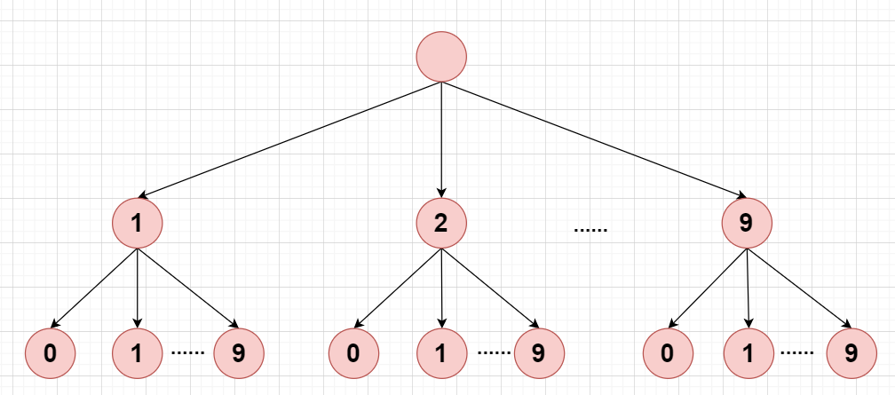
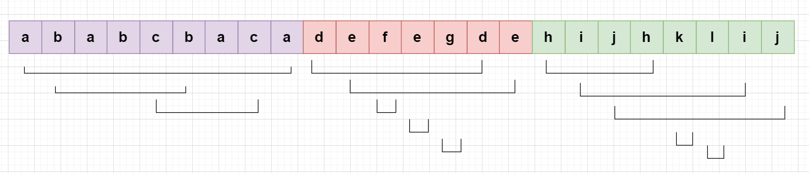
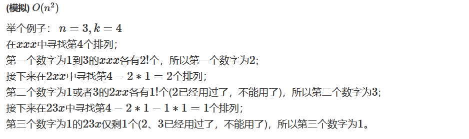
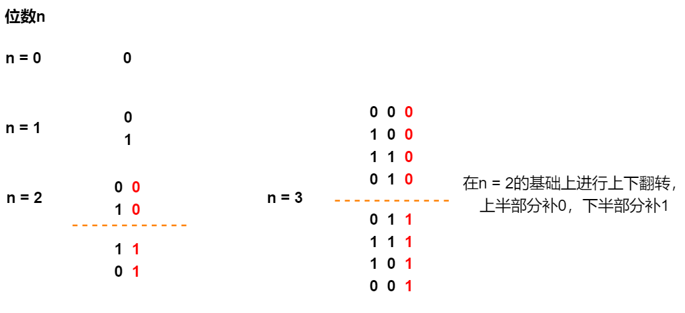

## 力扣500题刷题笔记

### [443. 压缩字符串](https://leetcode-cn.com/problems/string-compression/)

**思路**

**(双指针 + 字符串)**  $O(n)$

- 1、定义两个指针`i`和`j`，如果`s[i] == s[j]`则`j++`。因此，`s[i, j - 1]`则为重复字符串，且长度为`len = j - i`。
- 2、手动实现`to_string(len)`的方法。
- 3、最后返回压缩后的字符串的长度。

**c++代码**

```c++
 class Solution {
public:
    int compress(vector<char>& s) {
        int k = 0;
        for(int i = 0; i < s.size(); i++){
            int j = i + 1;
            while(j < s.size() && s[i] == s[j]) j++;
            s[k++] = s[i];
            int len = j - i;
            if(len > 1){
                int t = k;
                while(len){
                    s[t++] = '0' + len % 10;
                    len /= 10;
                }
                reverse(s.begin() + k, s.begin() + t);
                k = t;
            }
            i = j - 1;
        }
        return k;
    }
};
```

### [442. 数组中重复的数据](https://leetcode-cn.com/problems/find-all-duplicates-in-an-array/)

**思路**

**(数组)**   $O(n)$

我们用负号识别当前数是否用过

  1、遍历每个元素，对索引进行标记，将对应索引位置的值变为负数；

  2、如果发现该元素已经是负数，说明前面已经出现过，直接放到答案数组中。


**c++代码**

```c++
class Solution {
public:
    vector<int> findDuplicates(vector<int>& nums) {
        vector<int> res;
        for(int x : nums){
            x = abs(x);
            if(nums[x - 1] > 0) nums[x - 1] *= -1;
            else res.push_back(x);
        }
        return res;
    }
};

```

### [386. 字典序排数](https://leetcode-cn.com/problems/lexicographical-numbers/)

**思路**

**(dfs + trie树)**  $O(nlogn)$

我们用一个trie树来存贮所有的数，先序遍历就是这棵树的字典树。因此，我们按照先序遍历遍历字典树，遍历时把经过的路径节点转换成数字记录到答案数组中。

**先序遍历：** 根左右。



**时间复杂度分析：** 整颗树的节点个数为$nlogn$，我们需要把整颗树遍历一遍，因此时间复杂度为$O(nlogn)$。

**c++代码**

```c++
class Solution {
public:
    vector<int> res;
    vector<int> lexicalOrder(int n) {
        for(int i = 1; i <= 9; i++)
            dfs(i, n);
        return res;    
    }
    void dfs(int cur, int n){
        if(cur <= n) res.push_back(cur);
        else return;
        for(int i = 0; i <= 9; i++){
            dfs(cur * 10 + i, n);
        }
    }
};
```

### [763. 划分字母区间](https://leetcode-cn.com/problems/partition-labels/)

**思路**

**(哈希，双指针)**  $O(n)$ 



题目要求同一字母最多出现在一个片段的条件下，将一个字符串`s`划分尽可能多的区域。这道题的本质是区间合并，计算合并完的区间个数。

**具体过程如下：**

- 1、定义一个哈希表，用来记录每个字母最后出现的位置。
- 2、定义两个指针`start`和`end`，`[start, end]`则表示**同一字母最多出现在一个片段**的最短区间。
- 3、遍历`s`字符串，对于每个`s[i]`:
  - 用`hash[s[i]]`更新`end`；
  - 当`i == end`时，则我们找到了区间分割点，将区间长度`end - start + 1`加入答案数组中；
  - 最后更新`start = end = i + 1 `。
- 4、返回答案数组。

**c++代码**

```c++
class Solution {
public:
    // 区间合并
    vector<int> partitionLabels(string s) {
        unordered_map<char, int> hash;
        for(int i = 0; i < s.size(); i++){
            hash[s[i]] = i;
        }
        vector<int> res;
        int start = 0, end = 0;
        for(int i = 0; i < s.size(); i++){
            end = max(end, hash[s[i]]);
            if(i == end){
                res.push_back(end - start + 1);
                start = end = i + 1;
            }
        }
        return res;
    }
};
```

### [260. 只出现一次的数字 III](https://leetcode-cn.com/problems/single-number-iii/)

**思路**

**(位运算)**  $O(n)$

**前置知识：**

相同数异或为`0`，比如`a ^ a = 0`。

假设这两个只出现一次的数字分别为`x`和`y`，根据上述性质，我们将`nums`数组中的所有数都异或一遍，可以得到`x ^ y`。两个不同的数，其二进制表示中必然有一位是不同的，因此我们在`x ^ y`随便找到一个不同点，假设找到了为`1`的第`k`位。

我们可以根据第`k`位的不同，将序列分为两个集合，第`k`位为`1`的集合和第`k`位不是`1`的集合，其中`x`，`y`分别在这两个集合，且相同的元素是在同一个集合里面，于是将其转化成了求重复数字中的单个数值的问题。

我们将第`k`位为`1`的集合的所有数异或一遍，相同数相消，剩下的就是只出现一次的数，另一个数则为`x ^ y`再异或刚才我们求出的数。

**时间复杂度分析：** $O(n)$。

**c++代码**

```c++
class Solution {
public:
    // 相同数异或为0，a ^ a = 0
    /**
    异或得到 sum = x^y
    取 x与y中第k位为1的数
    将数分为两个集合，第k位为1的集合和第k位不是1的集合
    其中x y分别在这两个集合，且相同的元素是在同一个集合里面
    于是将其转化成了求重复数字中的单个数值的问题
    **/
    vector<int> singleNumbers(vector<int>& nums) {
        int sum = 0;
        for(int x : nums) sum ^= x; // sum = first ^ second;
        int k = 0;
        while(!(sum >> k & 1)) k++; //找到sum中为1的一位
        int first = 0;      //记录第一个数
        for(int x : nums){
            if(x >> k & 1)
                first ^= x;
        }
        return {first, sum ^ first};
    }
};

```

### [316. 去除重复字母](https://leetcode-cn.com/problems/remove-duplicate-letters/)

**思路**

**(贪心，单调栈)**  $O(n)$

定义一个栈`stk`用来记录答案字符串，由于字符串的api和栈基本相同，因此我们直接用字符串来替代栈。

定义一个标记数组`ins`，标记当前字符是否已经在`stk`中出现过。

定义一个哈希表，存贮每个字符最后一次出现的位置。

**具体过程如下：** 

1、遍历字符串`s`，记录每个字符最后出现的位置。

2、枚举字符串`s`的每个字符，对于当前字符`s[i]`:

- 如果其已经出现在了字符串栈`stk`中，则我们跳过当前字符；
- 如果没有，那么我们应该将这个字符加入答案中。但是为了字典序最小，我们需要考虑是否需要弹出栈顶元素。弹出的条件则是：当前元素小于栈顶元素，并且栈顶元素还在后面出现过，那么栈顶元素在后面再加进来会得到更小的字典序。
  - 如果需要弹出栈顶元素，则将栈顶元素标记为未在`stk`出现过。
  - 弹出栈顶元素。
- 将当前字符加入栈中。

3、最后返回`stk`。

**c++代码**

```c++
class Solution {
public:
    string removeDuplicateLetters(string s) {
        string stk;
        unordered_map<char, bool> ins;
        unordered_map<char, int> last;
        for(int i = 0; i < s.size(); i++) last[s[i]] = i;
        for(int i = 0; i < s.size(); i++){
            if(ins[s[i]]) continue;
            while(stk.size() && stk.back() > s[i] && last[stk.back()] > i){
                ins[stk.back()] = false;
                stk.pop_back();
            }
            ins[s[i]] = true;
            stk += s[i];
        }
        return stk;
    }
};
```

### [516. 最长回文子序列](https://leetcode-cn.com/problems/longest-palindromic-subsequence/)

**思路**

**(区间DP)**   $O(n^2)$

**状态表示：**`f[i][j]`表示区间`[i, j]`的最长回文子序列的长度。

**状态计算：** 

考虑边界`s[i]`和`s[j]`:

- 如果`s[i] == s[j]`，则`f[i][j] = f[i + 1][j - 1] + 2`；
- 否则，`f[i][j]`继承`f[i + 1][j]`和`f[i][j - 1]`的最大值，即`f[i][j] = max(f[i + 1][j], f[i][j - 1])`；

**初始化：**

`if(i == j)  f[i][j] = 1`;

**时间复杂度分析：**  $O(n^2)$。

**c++代码**

```c++
class Solution {
public:
    int longestPalindromeSubseq(string s) {
        int n = s.size();
        vector<vector<int>> f(n + 1, vector<int>(n + 1));
        for(int i = n - 1; i >=0 ; i--)
            for(int j = i; j < n; j++)
                if(i == j)  f[i][j] = 1;
                else{
                    if(s[i] == s[j]) f[i][j] = f[i + 1][j - 1] + 2;
                    else f[i][j] = max(f[i + 1][j], f[i][j - 1]);
                }
        return f[0][n - 1];        
    }
};
```

### [342. 4的幂](https://leetcode-cn.com/problems/power-of-four/)

**思路**

**(递归)**

- 1、如果一个数可以被4整除，我们递归计算`n / 4`。
- 2、递归边界，`n == 1`表示`n`是`4`的幂次方，`n == 0`表示`n`不是`3`的幂次方。

**c++代码**

```c++
class Solution {
public:
    bool isPowerOfFour(int n) {
        if(n == 1) return true;
        else if(n == 0)  return false;
        return isPowerOfFour(n / 4) && (n % 4 == 0);
    }
};
```

**(数论)**  $O(1)$

判断数`n`是不是`4`的整数幂的条件为：

- 1、`n > 0`；
- 2、$n = 4^k = 2^{2k} =  (2^k)^2$,`n`为平方数；
- 3、只包含质因子`2` ；

如何判断`n`只包含因子`2`?

`int`范围内，$2$的最大的整数次幂是 $2^{30}$，所以 $n$ 的质因子只有$2$，等价于 $n$ 能整除$2^{30}$。

**c++代码**

```c++
class Solution {
public:
    bool isPowerOfFour(int n) {
        if(n <=0 ) return false;
        int m = sqrt(n);
        if(m * m != n) return false;
        return (1 << 30) % n == 0; 
    }
};
```

### [57. 插入区间](https://leetcode-cn.com/problems/insert-interval/)

**思路**

**(数组)**  $O(nlogn)$

将`b`数组插入到`a`数组中，然后按照[56. 合并区间](https://leetcode-cn.com/problems/merge-intervals/)做法。 

**c++代码**

```c++
class Solution {
public:
    vector<vector<int>> merge(vector<vector<int>>& a) {
        vector<vector<int>> res;
        sort(a.begin(), a.end());
        int l = a[0][0], r = a[0][1];
        for(int i = 1; i < a.size(); i++){
            if(a[i][0] > r){
                res.push_back({l, r});
                l = a[i][0], r = a[i][1];
            }else{
                r = max(r, a[i][1]);
            }
        }
        res.push_back({l, r});
        return res;
    }
};
```

### [60. 排列序列](https://leetcode-cn.com/problems/permutation-sequence/)

**思路**

**(计数)**  $O(n^2)$  



**c++代码**

```c++
class Solution {
public:
    string getPermutation(int n, int k) {
        string res;
        vector<bool> st(10);
        for(int i = 1; i <= n; i++){
            int fact =  1;
            for(int j = 1; j <= n - i; j++) fact *= j;
            for(int j = 1; j <= n; j++){
                if(!st[j]){
                    if(fact < k)  k -= fact;
                    else{
                        res += to_string(j);
                        st[j] = true;
                        break;
                    }
                }
            }
        }
        return res;
    }
};
```

### [80. 删除有序数组中的重复项 II](https://leetcode-cn.com/problems/remove-duplicates-from-sorted-array-ii/)

**思路**

**(双指针)**   $O(n)$

- 1、定义两个指针`i`和`j`，初始化`i = 0`，`j = 0`；在定义一个`k`指针用来记录新的数组的长度，初始化`k = 0`。
- 2、遍历整个数组，利用双指针算法找到连续的区间`[i, j - 1]`，首先执行`nums[k++] = nums[i]`，即每一段连续的区间我们先取第一个元素，如果区间长度是`2`或者更大，则再执行一次`nums[k ++] = nums[i]`。
- 3、最后返回`k`。

**c++代码**

```c++
class Solution {
public:
    int removeDuplicates(vector<int>& nums) {
        int k = 0;
        for(int i = 0; i < nums.size(); i++){
            int j = i + 1;
            while(j < nums.size() && nums[j] == nums[i]) j++;\
            nums[k++] = nums[i];
            if(j - i >= 2){
                 nums[k++] = nums[i];
            }
            i = j - 1;
        }
        return k;
    }
};
```

### [89. 格雷编码](https://leetcode-cn.com/problems/gray-code/)

**思路**

**(构造)**  $O(2^n)$

我们可以发现一个构造规律：



**规律：** 在上一个结果的基础上进行上下翻转，然后上半部分补`0`，下半部分补`1`。

**操作：** 补`0`等价于在原来数的基础上 乘上`2`，翻转后补`1`,等价于翻转后的数的基础上 乘上`2`加`1`。

**c++代码**

```c++
class Solution {
public:
    vector<int> grayCode(int n) {
        vector<int> res(1, 0);
        while(n--){
            for(int i = res.size() - 1; i >=0; i--){
                res[i] *= 2; //前一半数补0
                res.push_back(res[i] + 1); //前一半数补1
            }
        }
        return res;
    }
};
```

### [90. 子集 II](https://leetcode-cn.com/problems/subsets-ii/)

**思路**

**(回溯)** 

[78. 子集](https://leetcode-cn.com/problems/subsets/)的数组中的元素 **互不相同**，而这道题中可能包含重复元素，因此我们要考虑去重问题。

**如何去重？** 

我们先将数组排序，这样相同元素就会排在一起，**同一层相同的元素跳过。**

再去定义一个搜索起点，已经考虑过的数，以后的搜索中就不能出现，让我们的每次搜索都从当前起点往后搜索(包含当前起点)，直到搜索到数组末尾（递增顺序）。

**递归函数设计**

```c++
void dfs(vector<int>& nums, int u)
```

- 第一个参数是`nums`数组，第二个参数是`u`，表示当前的搜索起点。

每搜索完一个分支，记录路径`path`，然后将其加入`res`中。

**c++代码**

```c++
class Solution {
public:
    vector<vector<int>> res;
    vector<int> path;
    vector<vector<int>> subsetsWithDup(vector<int>& nums) {
        sort(nums.begin(), nums.end());
        dfs(nums, 0);
        return res;
    }
    void dfs(vector<int>& nums, int u){
        res.push_back(path);
        for(int i = u; i < nums.size(); i++){
            if(i > u && nums[i] == nums[i - 1]) continue;
            path.push_back(nums[i]);
            dfs(nums, i + 1);
            path.pop_back();
        }
        return ;
    }
};
```

### [95. 不同的二叉搜索树 II](https://leetcode-cn.com/problems/unique-binary-search-trees-ii/)

**思路**

**(dfs)**  $O(C_{2n}^n/(n+1))$

**递归搜索所有方案:**

- 1、对于每段连续的有序序列 $l, l + 1, l + 2,,,r$，枚举二叉搜索树根节点的位置$i$。 
- 2、将 $l,l + 1⋯i−1$序列作为左子树，将 $i+1,⋯ r - 1, r$序列作为右子树，递归求出左右子树。
- 3、左子树的任意一种方案和右子树的任意一种方案拼在一起，可以得到当前节点的一种方案，所以我们将左右子树的所有方案两两组合，并记录在答案中。

**实现细节：**

搜索出的每一棵二叉树的节点是不能共用的，因为每个内部节点的左右儿子是不同的，如果共用会导致二叉树的结构错乱。因此，这里要对每种不同组合建立一个新的根节点，否则这些根节点的地址是一样的，那么它们的左右儿子在内层循环时会被不断覆盖掉。

**时间复杂度分析：** 卡特兰数，因此时间复杂度为 $O(C_{2n}^n/(n+1))$。

**c++代码**

```c++
/**
 * Definition for a binary tree node.
 * struct TreeNode {
 *     int val;
 *     TreeNode *left;
 *     TreeNode *right;
 *     TreeNode() : val(0), left(nullptr), right(nullptr) {}
 *     TreeNode(int x) : val(x), left(nullptr), right(nullptr) {}
 *     TreeNode(int x, TreeNode *left, TreeNode *right) : val(x), left(left), right(right) {}
 * };
 */
class Solution {
public:
    vector<TreeNode*> generateTrees(int n) {
        if(!n) return {};
        return dfs(1, n);
    }
    vector<TreeNode*> dfs(int l, int r){
        if(l > r) return {nullptr};
        vector<TreeNode*> res;
        for(int i = l; i <= r; i++){
            auto left = dfs(l, i - 1),right = dfs(i + 1, r);
            for(TreeNode* l : left)
                for(TreeNode* r : right){
                      auto root = new TreeNode(i);
                      root->left = l;
                      root->right = r;
                      res.push_back(root);
                }      
        }
        return res;
    }
};
```

### [109. 有序链表转换二叉搜索树](https://leetcode-cn.com/problems/convert-sorted-list-to-binary-search-tree/)

**思路**

**(快慢指针 + 递归)**   $O(nlogn)$

**快慢指针找中点代码：** 

为了将左右链表分开，我们需要再额外定义一个前驱指针`pre`，用来记录每个节点的前一个节点。

```c++
class Solution {
public:
    ListNode* middleNode(ListNode* head) {
        auto p = head, q = head;
        while(q && q->next){
            p = p->next;
            q = q->next->next;
        }
        return p;
    }
};
```

然后递归建立整棵二叉树。

每次以中点为根，以左半部分为左子树，右半部分为右子树。先分别递归建立左子树和右子树，然后令根节点的指针分别指向两棵子树。

**时间复杂度分析：**  $O(nlogn)$

**c++代码**

```c++
/**
 * Definition for singly-linked list.
 * struct ListNode {
 *     int val;
 *     ListNode *next;
 *     ListNode() : val(0), next(nullptr) {}
 *     ListNode(int x) : val(x), next(nullptr) {}
 *     ListNode(int x, ListNode *next) : val(x), next(next) {}
 * };
 */
/**
 * Definition for a binary tree node.
 * struct TreeNode {
 *     int val;
 *     TreeNode *left;
 *     TreeNode *right;
 *     TreeNode() : val(0), left(nullptr), right(nullptr) {}
 *     TreeNode(int x) : val(x), left(nullptr), right(nullptr) {}
 *     TreeNode(int x, TreeNode *left, TreeNode *right) : val(x), left(left), right(right) {}
 * };
 */
class Solution {
public:
    TreeNode* sortedListToBST(ListNode* head) {
        if(!head) return nullptr;
        if(!head->next) return new TreeNode(head->val);  //只有一个节点
        ListNode* p = head, *q = head, *pre = nullptr;
        while(q && q->next){
            pre = p;
            p = p->next;
            q = q->next->next;
        }
        pre->next = nullptr;  //将中点左边的链表分开
        TreeNode* root = new TreeNode(p->val);  //创建根节点
        root->left = sortedListToBST(head);     //左子树
        root->right = sortedListToBST(p->next); //右子树
        return root;
    }
};
```

### [115. 不同的子序列](https://leetcode-cn.com/problems/distinct-subsequences/)

**思路**

**(动态规划)**   $O(n^2)$

**状态表示：** `f[i][j]` 表示用 `S` 的前 `i` 个字符，能匹配完 `T` 的前 `j` 个字符的方案数。 

**状态转移：** 

考虑字符串`s[0, i - 1]`和字符串`t[0, j - 1]`的最后一个字符`s[i - 1]`和`s[j - 1]`:

- 如果`s[i - 1] != s[j - 1]`，则`s[i - 1]`不能匹配`s[j - 1]`，所以`f[i][j] = f[i - 1][j]`；
- 如果`s[i - 1] == s[j -1]` ，则`s[i−1]` 既可以匹配 `t[j−1]`，也可以不匹配 `t[j−1]`，所以`f[i][j] = f[i - 1][j] + f[i - 1][j - 1]`。

**初始化：**

因为 `s` 可以从任意一个字符开始匹配，所以 `f[i][0] = 1`（$0<= i <= s.size()$）

**时间复杂度分析：** 状态计算$O(1)$，状态数$O(n*m)$，所以总的时间复杂度为$O(nm)$。

**c++代码**

```c++
class Solution {
public:
    int numDistinct(string s, string t) {
        int n = s.size(), m = t.size();
        vector<vector<unsigned long long>> f(n + 1, vector<unsigned long long>(m + 1));
        for(int i = 0; i < n; i++) f[i][0] = 1;
        for(int i = 1; i <= n; i++)
            for(int j = 1; j <= m; j++){
                if(s[i - 1] != t[j - 1]) f[i][j] = f[i - 1][j];
                else f[i][j] = f[i - 1][j] + f[i - 1][j - 1];
            }
        return f[n][m];    
    }
};
```

### [144. 二叉树的前序遍历](https://leetcode-cn.com/problems/binary-tree-preorder-traversal/)

**思路**

**c++代码**

```c++
/**
 * Definition for a binary tree node.
 * struct TreeNode {
 *     int val;
 *     TreeNode *left;
 *     TreeNode *right;
 *     TreeNode() : val(0), left(nullptr), right(nullptr) {}
 *     TreeNode(int x) : val(x), left(nullptr), right(nullptr) {}
 *     TreeNode(int x, TreeNode *left, TreeNode *right) : val(x), left(left), right(right) {}
 * };
 */
class Solution {
public:
    vector<int> res;
    vector<int> preorderTraversal(TreeNode* root) {
        if(!root) return {};
        dfs(root);
        return res;
    }
    void dfs(TreeNode* root){
        if(!root) return;
        res.push_back(root->val);
        dfs(root->left);
        dfs(root->right);
    }
};
```

### [187. 重复的DNA序列](https://leetcode-cn.com/problems/repeated-dna-sequences/)

**思路**

**(哈希)**   $O(n)$

找到所有长度为10的且出现次数多于1的子串。

**具体过程如下：** 

- 1、定义一个哈希表，用哈希表记录所有长度是`10`的子串的个数。
- 2、遍历哈希表，当字符串出现的次数`>1`时，我们将其记录到`res`中。

**时间复杂度分析：**  $O(n)$。

**c++代码**

```c++
class Solution {
public:
    vector<string> findRepeatedDnaSequences(string s) {
        vector<string> res;
        unordered_map<string, int> hash;
        for(int i = 0; i + 10 <= s.size(); i++){
            hash[s.substr(i, 10)]++;
        }
        for(auto item : hash){
            if(item.second > 1)
                res.push_back(item.first);
        }
        return res;
    }
};
```

### [201. 数字范围按位与](https://leetcode-cn.com/problems/bitwise-and-of-numbers-range/)

**思路 **
**(位运算)**  $O(logn)$

给定一个范围`[left, right]`，返回这个区间所有数字的与运算。

例如 `[5, 7]`，我们返回`5 & 6 & 7 = 4`。

- 1、找到 `m` 和 `n` 从高位到低位中第一次出现不一样的位置，答案为该位置之前的二进制的累积和。
- 2、这是因为出现了第一次不一样之后，从 `m` 上升到 `n` 的过程中，必定会经历 `xxx100000... `和 `xxx011111...`的一次变化，这次变化会将该位之后的所有数字按位与清零。

**时间复杂度分析：** 最多遍历 31 次二进制位，故时间复杂度为 $O(logn)$。 

**c++代码**

```c++
class Solution {
public:
    int rangeBitwiseAnd(int n, int m) {
        int res = 0;
        for(int i = 30; i >= 0; i--){
            if((n >> i & 1) != (m >> i & 1)) break;
            else if(n >> i & 1) res += 1 << i;
        }
        return res;
    }
};
```

### [216. 组合总和 III](https://leetcode-cn.com/problems/combination-sum-iii/)

**思路** 

**(dfs)**    $O(C_9^k*k)$ 

`dfs`搜索出从`9`个数中选`k`个数并且和为`n`的所有方案。

**如何避免重复计数？** 

比如`{1, 2, 3}`，`{1, 3, 2}`，属于同一个集合。这里我们人为定义一种搜索顺序，每次枚举时，要保证同一方案中的数严格递增，这样重复的方案中我们只会取递增的。

**递归函数设计：**

```c++
void dfs(int k, int n, int start)
```

- 参数`k`代表剩余可选择的数的个数；
- 参数`n`代表剩余需要拼凑的和；
- 参数`start`代表搜索起点，初始化为`1`；

**递归边界：** 

当`k == 0 && n == 0`时，即代表我们搜索到了一种合法方案，将其记录到答案中。

**时间复杂度分析：** 从$9$个数中选 $k$ 个总共有 $C_9^k$ 个方案，将每个方案记录下来需要$O(k)$的时间，因此总的时间复杂度为$O(C_9^k  *k)$。

**c++代码**

```c++
class Solution {
public:
    vector<vector<int>> res;
    vector<int> path;
    vector<vector<int>> combinationSum3(int k, int n) {
        dfs(k, n, 1);
        return res;
    }
    void dfs(int k, int n, int start){
        if(!k){
            if(!n) res.push_back(path);
            return ;
        }
        for(int i = start; i <= 9; i++){
            if(n >= i){
                path.push_back(i);
                dfs(k - 1, n - i, i + 1);
                path.pop_back();
            }
        }
    }
};
```

### [219. 存在重复元素 II](https://leetcode-cn.com/problems/contains-duplicate-ii/)

**思路**

**(滑动窗口)**   

**具体过程如下：**

- 1、维护一个区间为`[i - k, i]`，长度为`k + 1`的滑动窗口，用哈希表记录窗口中每个元素出现的次数。
- 2、每次判断窗口内的当前遍历的元素`nums[i]`是否重复出现，重复出现返回`true`即可。

**c++代码**

```c++
class Solution {
public:
    bool containsNearbyDuplicate(vector<int>& nums, int k) {
        int n = nums.size();
        unordered_map<int, int> hash;
        for(int i = 0; i < n; i++){
            hash[nums[i]]++;
            if(i - k > 0)  hash[nums[i - k - 1]]--;
            if(hash[nums[i]] >= 2){
                return true;
            }
        }
        return false;
    }
};
```

**(哈希)**

**具体过程如下：**

- 1、用哈希表记录每个元素上一次出现的位置。

- 2、枚举所有数，假设枚举到了`nums[i]`：

  - 如果发现`nums[i]`存在哈希表中，则判断上一次出现的位置下标和当前下标的值是否小于等于`k`，是则返回`true`。
  - 否则更新哈希表中`nums[i]`的位置。

  3、最后返回`false`。

**c++代码** 

```c++
class Solution {
public:
    bool containsNearbyDuplicate(vector<int>& nums, int k) {
        int n = nums.size();
        unordered_map<int, int> hash;
        for(int i = 0; i < n; i++){
            int x = nums[i];
            if(hash.count(x) && i - hash[x] <= k) return true;
            hash[x] = i;
        }
        return false;
    }
};
```

### [292. Nim 游戏](https://leetcode-cn.com/problems/nim-game/)

**思路**

**(博弈)**   $O(1)$

如果 $n$ 能被 $4$ 整除，则不论每次你取多少石子，不妨设是 $x$，你的对手可以取 $4−x$枚石子。那么最后一枚石子一定被对手取走，你必败；

如果 $n$不能被 $4$ 整除，则你第一次取走 $n%4$ 枚石子，然后剩下的石子数就是 4的倍数，按上一种情况的讨论，你的对手必败，你必胜。

在C++中，$n%4$ 可以用位运算计算，时间效率高一些，n%4 = n&3。

**c++代码**

```c++
class Solution {
public:
    bool canWinNim(int n) {
        return n % 4;
    }
};
```

### [303. 区域和检索 - 数组不可变](https://leetcode-cn.com/problems/range-sum-query-immutable/)

**思路**

**前缀和**  $O(n)$

**具体过程如下：**

- 1、初始化时，计算`nums`数组的前缀和数组`s`。为了方便处理，我们让`s`数组下标从`1`开始。
- 2、求`sumRange(i, j)`时，返回`s[j + 1] - s[i]`。

**时间复杂度分析：**  初始化时需要遍历整个数组，时间复杂度是 $O(n)$；求区间和时只有常数次计算，时间复杂度是 $O(1)$。

**c++代码** 

```c++
class NumArray {
public:
    vector<int> s;
    NumArray(vector<int>& nums) {
        int n = nums.size();
        s = vector(n + 1, 0);
        for(int i = 1; i <= n; i++){
            s[i] = s[i - 1] + nums[i - 1];
        }
    }
    
    int sumRange(int i, int j) {
        return s[j + 1] - s[i];  //s[j] - s[i - 1]
    }
};

/**
 * Your NumArray object will be instantiated and called as such:
 * NumArray* obj = new NumArray(nums);
 * int param_1 = obj->sumRange(left,right);
 */
```


