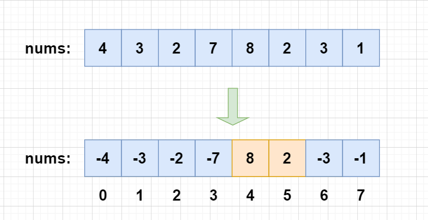

## 力扣500题刷题笔记

### [443. 压缩字符串](https://leetcode-cn.com/problems/string-compression/)

**思路**

**(双指针 + 字符串)**  $O(n)$

- 1、定义两个指针`i`和`j`，如果`s[i] == s[j]`则`j++`。因此，`s[i, j - 1]`则为重复字符串，且长度为`len = j - i`。
- 2、手动实现`to_string(len)`的方法。
- 3、最后返回压缩后的字符串的长度。

**c++代码**

```c++
 class Solution {
public:
    int compress(vector<char>& s) {
        int k = 0;
        for(int i = 0; i < s.size(); i++){
            int j = i + 1;
            while(j < s.size() && s[i] == s[j]) j++;
            s[k++] = s[i];
            int len = j - i;
            if(len > 1){
                int t = k;
                while(len){
                    s[t++] = '0' + len % 10;
                    len /= 10;
                }
                reverse(s.begin() + k, s.begin() + t);
                k = t;
            }
            i = j - 1;
        }
        return k;
    }
};
```

### [442. 数组中重复的数据](https://leetcode-cn.com/problems/find-all-duplicates-in-an-array/)

**思路**

**(数组)**   $O(n)$

我们用负号识别当前数是否用过

  1、遍历每个元素，对索引进行标记，将对应索引位置的值变为负数；

  2、如果发现该元素已经是负数，说明前面已经出现过，直接放到答案数组中。



**c++代码**

```c++
class Solution {
public:
    vector<int> findDuplicates(vector<int>& nums) {
        vector<int> res;
        for(int x : nums){
            x = abs(x);
            if(nums[x - 1] > 0) nums[x - 1] *= -1;
            else res.push_back(x);
        }
        return res;
    }
};

```


