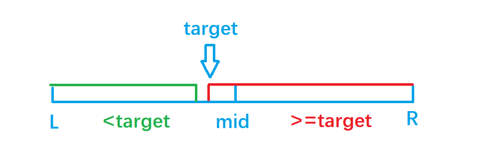
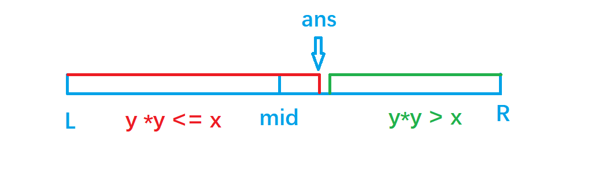
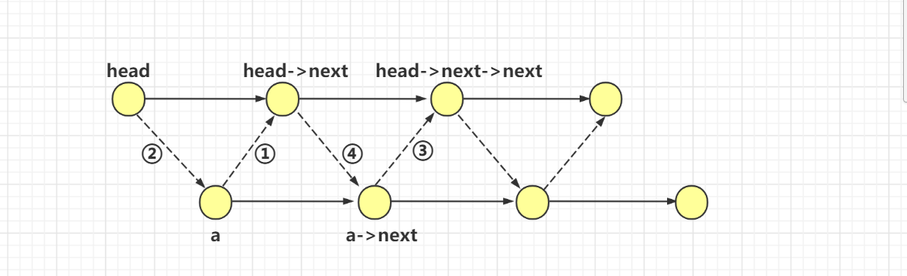
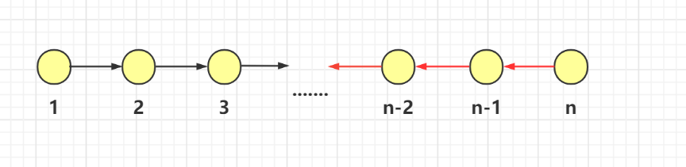

## 力扣500题刷题笔记

## 第一天：

### [206. 反转链表](https://leetcode-cn.com/problems/reverse-linked-list/)

**题目**

给你单链表的头节点 head ，请你反转链表，并返回反转后的链表。

**示例 1：**


输入：head = [1,2,3,4,5]
输出：[5,4,3,2,1]
**示例 2：**


输入：head = [1,2]
输出：[2,1]
**示例 3：**

输入：head = []
输出：[]


提示：

链表中节点的数目范围是 [0, 5000]
-5000 <= Node.val <= 5000


进阶：链表可以选用迭代或递归方式完成反转。你能否用两种方法解决这道题？

**思路**

翻转即将所有节点的next指针指向前驱节点。
由于是单链表，我们在迭代时不能直接找到前驱节点，所以我们需要一个额外的指针保存前驱节点。同时在改变当前节点的next指针前，不要忘记保存它的后继节点。

**空间复杂度分析：**遍历时只有3个额外变量，所以额外的空间复杂度是 $O(1)$。
时间复杂度分析：只遍历一次链表，时间复杂度是 $O(n)$。

**代码**

```c++
/**
 * Definition for singly-linked list.
 * struct ListNode {
 *     int val;
 *     ListNode *next;
 *     ListNode(int x) : val(x), next(NULL) {}
 * };
 */
 /*=======  非递归版 ====== */

class Solution {
public:
    ListNode* reverseList(ListNode* head) {
        ListNode* prev = NULL; //当前节点的前驱节点
        ListNode* cur = head;  //当前节点

        while(cur)
        {
            ListNode* next = cur->next; //首先保存当前节点的后继节点
            cur->next = prev; //将当前节点指向它的前驱节点
            prev = cur, cur = next; //节点后移
        }
        return prev;
    }
};
```

### [146. LRU 缓存机制](https://leetcode-cn.com/problems/lru-cache/)

**题目**

运用你所掌握的数据结构，设计和实现一个  LRU (最近最少使用) 缓存机制 。
实现 LRUCache 类：

- `LRUCache(int capacity) `以正整数作为容量 `capacity`初始化 `LRU` 缓存
- `int get(int key) `如果关键字 `key` 存在于缓存中，则返回关键字的值，否则返回 `-1` 。
- `void put(int key, int value) `如果关键字已经存在，则变更其数据值；如果关键字不存在，则插入该组「关键字-值」。当缓存容量达到上限时，它应该在写入新数据之前删除最久未使用的数据值，从而为新的数据值留出空间。


进阶：你是否可以在 `O(1)` 时间复杂度内完成这两种操作？

**示例：**

```\
输入
["LRUCache", "put", "put", "get", "put", "get", "put", "get", "get", "get"]
[[2], [1, 1], [2, 2], [1], [3, 3], [2], [4, 4], [1], [3], [4]]
输出
[null, null, null, 1, null, -1, null, -1, 3, 4]

解释
LRUCache lRUCache = new LRUCache(2);
lRUCache.put(1, 1); // 缓存是 {1=1}
lRUCache.put(2, 2); // 缓存是 {1=1, 2=2}
lRUCache.get(1);    // 返回 1
lRUCache.put(3, 3); // 该操作会使得关键字 2 作废，缓存是 {1=1, 3=3}
lRUCache.get(2);    // 返回 -1 (未找到)
lRUCache.put(4, 4); // 该操作会使得关键字 1 作废，缓存是 {4=4, 3=3}
lRUCache.get(1);    // 返回 -1 (未找到)
lRUCache.get(3);    // 返回 3
lRUCache.get(4);    // 返回 4
```


提示：

- 1 <= capacity <= 3000
- 0 <= key <= 3000
- 0 <= value <= 104
- 最多调用 3 * 104 次 get 和 put

**思路**

**(双链表+哈希)** $O(1)$
使用一个双链表和一个哈希表：

- 双链表存储一个节点被使用（get或者put）的时间戳，且按最近使用时间从左到右排好序，最先被使用的节点放在双链表的第一位，因此双链表的最后一位就是最久未被使用的节点；
- 哈希表存储`key`对应的链表中的节点地址,用于`key-value` 的增删改查；

初始化：

- `n` 是缓存大小；
- 双链表和哈希表都为空；

`get(key)`：
首先用哈希表判断key是否存在：

- 如果key不存在，则返回-1；

- 如果key存在，则返回对应的value，同时将key对应的节点放到双链表的最左侧；

`put(key, value)`：
首先用哈希表判断key是否存在：

- 如果key存在，则修改对应的value，同时将key对应的节点放到双链表的最左侧；
- 如果key不存在：
  - 如果缓存已满，则删除双链表最右侧的节点（上次使用时间最老的节点），更新哈希表；
  - 否则，插入(key, value)：同时将key对应的节点放到双链表的最左侧，更新哈希表；

**时间复杂度分析**：双链表和哈希表的增删改查操作的时间复杂度都是 O(1)，所以get和set操作的时间复杂度也都是 O(1)。


**对应的双链表的几种操作**

1、删除p节点


```c++
 p->right->left = p->left;
 p->left->right = p->right;
```


2、在L节点之后插入p节点


```c++
p->right = L->right;
p->left = L;
L->right->left = p;
L->right = p;
```

```c++
class LRUCache {
public:

    //定义双链表
    struct Node{
        int key,value;
        Node* left ,*right;
        Node(int _key,int _value): key(_key),value(_value),left(NULL),right(NULL){}
    }*L,*R;//双链表的最左和最右节点，不存贮值。
    int n;
    unordered_map<int,Node*>hash;

    void remove(Node* p)
    {
        p->right->left = p->left;
        p->left->right = p->right;
    }
    void insert(Node *p)
    {
        p->right = L->right;
        p->left = L;
        L->right->left = p;
        L->right = p;
    }
    LRUCache(int capacity) {
        n = capacity;
        L = new Node(-1,-1),R = new Node(-1,-1);
        L->right = R;
        R->left = L;    
    }
    
    int get(int key) {
        if(hash.count(key) == 0) return -1; //不存在关键字 key 
        auto p = hash[key];
        remove(p);
        insert(p);//将当前节点放在双链表的第一位
        return p->value;
    }
    
    void put(int key, int value) {
        if(hash.count(key)) //如果key存在，则修改对应的value
        {
            auto p = hash[key];
            p->value = value;
            remove(p);
            insert(p);
        }
        else 
        {
            if(hash.size() == n) //如果缓存已满，则删除双链表最右侧的节点
            {
                auto  p = R->left;
                remove(p);
                hash.erase(p->key); //更新哈希表
                delete p; //释放内存
            }
            //否则，插入(key, value)
            auto p = new Node(key,value);
            hash[key] = p;
            insert(p);
        }
    }
};

/**
 * Your LRUCache object will be instantiated and called as such:
 * LRUCache* obj = new LRUCache(capacity);
 * int param_1 = obj->get(key);
 * obj->put(key,value);
 */
```

### [215. 数组中的第K个最大元素](https://leetcode-cn.com/problems/kth-largest-element-in-an-array/)

**题目**

在未排序的数组中找到第 k 个最大的元素。请注意，你需要找的是数组排序后的第 k 个最大的元素，而不是第 k 个不同的元素。

**示例 1:**

```
输入: [3,2,1,5,6,4] 和 k = 2
输出: 5
```

**示例 2:**

```
输入: [3,2,3,1,2,4,5,5,6] 和 k = 4
输出: 4
```

**说明:**

你可以假设 k 总是有效的，且 1 ≤ k ≤ 数组的长度。

**思路1**

**快速排序**  $O(logn)$

将数组使用快速排序重新排列一遍，然后输出`nums[n-k]`

**思路2**

**快速选择** $O(n)$

快选是在快排的基础上只递归一半区间。


如果当前要找的数$>=x$递归左区间，否则递归右区间

**代码**

```c++
class Solution {
public:

    int quick_sort(vector<int>& nums, int l, int r, int k) {
        if (l == r) return nums[l];
        int x = nums[l], i = l - 1, j = r + 1;
        while (i < j) {
            do i ++ ; while (nums[i] > x);
            do j -- ; while (nums[j] < x);
            if (i < j) swap(nums[i], nums[j]);
        }
        if (k <= j) return quick_sort(nums, l, j, k);
        else return quick_sort(nums, j + 1, r, k);
    }

    int findKthLargest(vector<int>& nums, int k) {
        return quick_sort(nums, 0, nums.size() - 1, k - 1);
    }
};
```

## 第二天：

### [3. 无重复字符的最长子串](https://leetcode-cn.com/problems/longest-substring-without-repeating-characters/) 

**题目**

给定一个字符串，请你找出其中不含有重复字符的最长子串 的长度。

**示例 1:**

```
输入: s = "abcabcbb"
输出: 3 
解释: 因为无重复字符的最长子串是 "abc"，所以其长度为 3。
```

**示例 2:**

```
输入: s = "bbbbb"
输出: 1
解释: 因为无重复字符的最长子串是 "b"，所以其长度为 1。
```

**示例 3:**

```
输入: s = "pwwkew"
输出: 3
解释: 因为无重复字符的最长子串是 "wke"，所以其长度为 3。
     请注意，你的答案必须是 子串 的长度，"pwke" 是一个子序列，不是子串。
```

**示例 4:**

```
输入: s = ""
输出: 0
```

**提示：**

- `0 <= s.length <= 5 * 104`
- s 由英文字母、数字、符号和空格组成

**思路**

**(双指针扫描)** $O(n)$

定义两个指针 $i,j(i<=j)$，表示当前扫描到的子串是 $[i,j]$ (闭区间)。扫描过程中维护一个哈希表`unordered_map <chat,int>hash`，表示 $[i,j]$中每个字符出现的次数。

线性扫描时，每次循环的流程如下：

- 1.指针 j 向后移一位, 同时将哈希表中 s[j] 的计数加一:` hash[s[j]]++`;

- 2.假设 j 移动前的区间 $[i,j]$中没有重复字符，则 j 移动后，只有 $s[j]$可能出现2次。因此我们不断向后移动 i，直至区间 [i,j]中 s[j] 的个数等于1为止；

复杂度分析：由于 i,j 均最多增加n次，且哈希表的插入和更新操作的复杂度都是 $O(1)$，因此，总时间复杂度 $O(n)$.

**代码**

```c++

class Solution {
public:
    int lengthOfLongestSubstring(string s) {
        unordered_map<char,int>hash;
        int res =  0;
        for(int j = 0 ,i = 0; j < s.size(); j++)
        {
            hash[s[j]]++;
            while(hash[s[j]] > 1)
            {
                hash[s[i++]]--;       
            }
            res = max(res,j-i+1);
        }
        return res;
    }
};
```

### [25. K 个一组翻转链表](https://leetcode-cn.com/problems/reverse-nodes-in-k-group/) 

**题目**

给你一个链表，每 k 个节点一组进行翻转，请你返回翻转后的链表。

k 是一个正整数，它的值小于或等于链表的长度。

如果节点总数不是 k 的整数倍，那么请将最后剩余的节点保持原有顺序。

进阶：

你可以设计一个只使用常数额外空间的算法来解决此问题吗？
你不能只是单纯的改变节点内部的值，而是需要实际进行节点交换。

**示例 1：**

```
输入：head = [1,2,3,4,5], k = 2
输出：[2,1,4,3,5]
```

**示例 2：**

```
输入：head = [1,2,3,4,5], k = 3
输出：[3,2,1,4,5]
```

**示例 3：**

```
输入：head = [1,2,3,4,5], k = 1
输出：[1,2,3,4,5]
```

**示例 4：**

```
输入：head = [1], k = 1
输出：[1]
```

**提示：**

- 列表中节点的数量在范围 sz 内
- 1 <= sz <= 5000
- 0 <= Node.val <= 1000
- 1 <= k <= sz

**思路：**


具体操作，如图所示，黑色表示当前原始状况，红色表示操作状况

- 1、将后k个元素进行倒序操作，共操作k - 1次，详细操作看代码（注意：需要确保有k个元素才操作）
- 2、将后k个元素倒序后的序列的尾部指向后k + 1的元素
- 3、将p.next指向倒序后的序列的头部
- 4、更新p指针的位置，即指向倒序后的序列的尾部


**代码：**

```c++
/**
 * Definition for singly-linked list.
 * struct ListNode {
 *     int val;
 *     ListNode *next;
 *     ListNode() : val(0), next(nullptr) {}
 *     ListNode(int x) : val(x), next(nullptr) {}
 *     ListNode(int x, ListNode *next) : val(x), next(next) {}
 * };
 */
class Solution {
public:
    ListNode* reverseKGroup(ListNode* head, int k) {
        auto dummy =  new ListNode(-1);
        dummy->next = head;
        for(auto p = dummy; ;)
        {
            auto q = p;
            for(int i = 0;  i < k && q; i++) q = q->next;
            if(!q) break;
            auto a = p->next,b = a->next;
            for(int i = 0; i < k - 1; i++)
            {
                auto next = b->next;
                b->next = a;
                a = b, b = next;
            }
            auto c = p->next;
            c->next = b,p->next = a;
            p = c;
        }
        return dummy->next;
    }
};
```

### [912. 排序数组](https://leetcode-cn.com/problems/sort-an-array/)

 **思路：**

快速排序模板

**代码：**

```c++
class Solution {
public:
    vector<int> sortArray(vector<int>& nums) {
        quick_sort(nums,0,nums.size()-1);
        return nums;
    }
    void quick_sort(vector<int>& nums,int l,int r)
    {
        if(l >= r) return ;
        int i = l - 1,j = r + 1,x = nums[(l+r)/2];
        while(i < j)
        {
            do i++; while(nums[i] < x);
            do j--; while(nums[j] > x);
            if(i < j) swap(nums[i],nums[j]);
        }
        quick_sort(nums,l,j);
        quick_sort(nums,j+1,r);
    }
};
```

## 第三天：

### [21. 合并两个有序链表](https://leetcode-cn.com/problems/merge-two-sorted-lists/) 

**题目**

将两个升序链表合并为一个新的 **升序** 链表并返回。新链表是通过拼接给定的两个链表的所有节点组成的。 

**示例 1：**


```
输入：l1 = [1,2,4], l2 = [1,3,4]
输出：[1,1,2,3,4,4]
```

**示例 2：**

````
输入：l1 = [], l2 = []
输出：[]
````

**示例 3：**

```
输入：l1 = [], l2 = [0]
输出：[0]
```

**提示：**

- 两个链表的节点数目范围是 `[0, 50]`
- `-100 <= Node.val <= 100`
- `l1` 和 `l2` 均按 **非递减顺序** 排列

**思路**

**(线性合并)** $O(n)$ 

1.    新建头部的保护结点 `dummy`，设置 `cur`指针指向 `dummy`。
2. 若当前 `l1`指针指向的结点的值` val `比 `l2` 指针指向的结点的值 `val` 小，则令 `cur` 的 `next` 指针指向` l1`且 `l1`后移；否则指向 `l2`，且 `l2` 后移。
3. 然后 `cur` 指针按照上一部设置好的位置后移。
4. 循环以上步骤直到` l1` 或 `l2` 为空。
5. 将剩余的 `l1` 或 `l2` 接到 `cur` 指针后边。

**代码**

```c++
/**
 * Definition for singly-linked list.
 * struct ListNode {
 *     int val;
 *     ListNode *next;
 *     ListNode() : val(0), next(nullptr) {}
 *     ListNode(int x) : val(x), next(nullptr) {}
 *     ListNode(int x, ListNode *next) : val(x), next(next) {}
 * };
 */
 /*
 1.归并排序的后半部分解法，二路归并
 2.定义两个指针，分别指向两个链表
 
 */
class Solution {
public:
    ListNode* mergeTwoLists(ListNode* l1, ListNode* l2) {
    auto dummy=new ListNode(-1),cur = dummy  ; 
    //对与链表中的涉及到头结点的操作，我们可以定义一个虚拟头结点
    //这样不用再去特判头结点
    while(l1&&l2)
    {
        if(l1->val <= l2->val)
        {
            cur->next = l1;
            l1 = l1->next;
        }
        else 
        {
            cur->next = l2;
            l2 = l2->next;
        }
        cur = cur->next;
    }
    if(l1) cur->next = l1;
    if(l2) cur->next = l2;
    return dummy->next;
  }
};
```

### [160. 相交链表](https://leetcode-cn.com/problems/intersection-of-two-linked-lists/) 

**题目**

编写一个程序，找到两个单链表相交的起始节点。

如下面的两个链表**：**


在节点 c1 开始相交。

**示例 1：**


```
输入：intersectVal = 8, listA = [4,1,8,4,5], listB = [5,0,1,8,4,5], skipA = 2, skipB = 3
输出：Reference of the node with value = 8
输入解释：相交节点的值为 8 （注意，如果两个链表相交则不能为 0）。从各自的表头开始算起，链表 A 为 [4,1,8,4,5]，链表 B 为 [5,0,1,8,4,5]。在 A 中，相交节点前有 2 个节点；在 B 中，相交节点前有 3 个节点
```

**示例 2：**

```
输入：intersectVal = 2, listA = [0,9,1,2,4], listB = [3,2,4], skipA = 3, skipB = 1
输出：Reference of the node with value = 2
输入解释：相交节点的值为 2 （注意，如果两个链表相交则不能为 0）。从各自的表头开始算起，链表 A 为 [0,9,1,2,4]，链表 B 为 [3,2,4]。在 A 中，相交节点前有 3 个节点；在 B 中，相交节点前有 1 个节点。
```

**示例 3：**


```
输入：intersectVal = 0, listA = [2,6,4], listB = [1,5], skipA = 3, skipB = 2
输出：null
输入解释：从各自的表头开始算起，链表 A 为 [2,6,4]，链表 B 为 [1,5]。由于这两个链表不相交，所以 intersectVal 必须为 0，而 skipA 和 skipB 可以是任意值。
解释：这两个链表不相交，因此返回 null。
```

注意：

- 如果两个链表没有交点，返回 `null`.
- 在返回结果后，两个链表仍须保持原有的结构。
- 可假定整个链表结构中没有循环。
- 程序尽量满足 $O(n)$ 时间复杂度，且仅用 $O(1)$ 内存。

**思路**

**(链表，指针扫描)** $O(n)$

这题的思路很巧妙，我们先给出做法，再介绍原理。

算法步骤：

1. 用两个指针分别从两个链表头部开始扫描，每次分别走一步；
2. 如果指针走到`null`，则从另一个链表头部开始走；
3. 当两个指针相同时，
   - 如果指针不是`null`，则指针位置就是相遇点；
   - 如果指针是` null`，则两个链表不相交；

此题我们画图讲解，一目了然：

1、两个链表不相交：


`a`,`b` 分别代表两个链表的长度，则两个指针分别走 `a+b` 步后都变成 `null`。

2 . 两个链表相交：


则两个指针分别走 `a+b+c` 步后在两链表交汇处相遇。

**时间复杂度分析：**每个指针走的长度不大于两个链表的总长度，所以时间复杂度是$O(n)$。

**代码**

```c++
/**
 * Definition for singly-linked list.
 * struct ListNode {
 *     int val;
 *     ListNode *next;
 *     ListNode(int x) : val(x), next(NULL) {}
 * };
 */
class Solution {
public:
    ListNode *getIntersectionNode(ListNode *headA, ListNode *headB) {
        auto pA = headA,pB = headB;
        while(pA != pB)
        {
            if(pA) pA = pA->next;
            else pA = headB;
            if(pB) pB = pB->next;
            else pB = headA;
        }
        return pA;
    }
};
```

### [15. 三数之和](https://leetcode-cn.com/problems/3sum/) 

**题目**

给你一个包含 n 个整数的数组 nums，判断 nums 中是否存在三个元素 a，b，c ，使得 a + b + c = 0 ？请你找出所有和为 0 且不重复的三元组。

注意：答案中不可以包含重复的三元组。

**示例 1：**

```
输入：nums = [-1,0,1,2,-1,-4]
输出：[[-1,-1,2],[-1,0,1]]
```

**示例 2：**

```
输入：nums = []
输出：[]
```

**示例 3：**

```
输入：nums = [0]
输出：[]
```

**提示：**

- `0 <= nums.length <= 3000`
- `-105 <= nums[i] <= 105`

**思路**

**(排序 + 双指针）** $O(n^2)$

- 1、将整个`nums`数组按从小到大排好序

- 2、枚举每个数，表示该数`nums[i]`已被确定，在排序后的情况下，通过双指针`l`，`r`分别从左边`l = i + 1`和右边`r = n - 1`往中间靠拢，找到`nums[i] + nums[l] + nums[r] == 0`的所有符合条件的搭配
- 3、在找符合条件搭配的过程中，假设`sum = nums[i] + nums[l] + nums[r]`
  若`sum > 0`，则`r`往左走，使`sum`变小
  若`sum < 0`，则`l`往右走，使`sum`变大
  若`sum == 0`，则表示找到了与`nums[i]`搭配的组合`nums[l]`和`nums[r]`，存到`ans`中
- 4、判重处理
  确定好`nums[i]`时，`l `需要从`i + 1`开始
  当`nums[i] == nums[i - 1]`，表示当前确定好的数与上一个一样，需要直接跳过
  当找符合条件搭配时，即`sum == 0`,需要对相同的`nums[l]`和`nums[r]`进行判重出来

**代码** 

```c++
class Solution {
public:
    vector<vector<int>> threeSum(vector<int>& nums) {
        vector<vector<int>> res;
        sort(nums.begin(), nums.end());
        for (int st = 0; st < nums.size(); st++) {
            while (st != 0  && st < nums.size() && nums[st] == nums[st - 1])
                st++;
            int l = st + 1, r = nums.size() - 1;
            while (l < r) {
                if (nums[st] + nums[l] + nums[r] == 0) {
                    res.push_back({nums[st], nums[l], nums[r]});
                    do { l++; }while (l < r && nums[l - 1] == nums[l]);
                    do { r--; }while (l < r && nums[r] == nums[r + 1]);
                }
                else if (nums[st] + nums[l] + nums[r] < 0) {
                    do { l++; }while (l < r && nums[l - 1] == nums[l]);
                }
                else {
                    do { r--; }while (l < r && nums[r] == nums[r + 1]);
                }
            }
        }
        return res;
    }
};
```

## 第四天：

### [103. 二叉树的锯齿形层序遍历](https://leetcode-cn.com/problems/binary-tree-zigzag-level-order-traversal/) 

**题目**

给定一个二叉树，返回其节点值的锯齿形层序遍历。（即先从左往右，再从右往左进行下一层遍历，以此类推，层与层之间交替进行）。

例如：
给定二叉树 [3,9,20,null,null,15,7],

```
 	3
   / \
  9  20
    /  \
   15   7
```


返回锯齿形层序遍历如下：

```
[
  [3],
  [20,9],
  [15,7]
]
```

**思路**

**(BFS)** $O(n)$
我们从根节点开始按宽度优先的顺序遍历整棵树，每次先扩展左儿子，再扩展右儿子。

这样我们会：

1. 先扩展根节点；
2. 再依次扩展根节点的左右儿子，也就是从左到右扩展第二层节点；
3. 再依次从左到右扩展第三层节点；
4. 依次类推

然后在遍历过程中我们给每一层加一个结尾标记`NULL`,当我们访问到一层的结尾时，由于`BFS`的特点，我们刚好把下一层都加到了队列中。这个时候就可以给这层加上结尾标记`NULL`了。

再给每一层加一个标记，奇数行为从左到右，偶数行为从右到左。

**代码**

```c++
/**
 * Definition for a binary tree node.
 * struct TreeNode {
 *     int val;
 *     TreeNode *left;
 *     TreeNode *right;
 *     TreeNode(int x) : val(x), left(NULL), right(NULL) {}
 * };
 */
class Solution {
public:
    vector<vector<int>> printFromTopToBottom(TreeNode* root) {
        vector<vector<int>>res;
        if(!root) return res;
        queue<TreeNode*>q;
        vector<int>level; //记录一层的节点
        q.push(root);
        q.push(NULL);// 一层的结尾标记
        bool flag = false;
        while(q.size())
        {
            auto t = q.front();
            q.pop();
            if(!t)
            {
                if(!level.size()) break; //避免陷入死循环
                if(flag) reverse(level.begin(),level.end());
                res.push_back(level);
                level.clear();
                q.push(NULL);
                flag = !flag;
            }
            else
            {
                level.push_back(t->val);
                if(t->left) q.push(t->left);
                if(t->right) q.push(t->right);
            }
        }
        return res;
    }
};
```

### [141. 环形链表](https://leetcode-cn.com/problems/linked-list-cycle/) 

**题目**

给定一个链表，判断链表中是否有环。

如果链表中有某个节点，可以通过连续跟踪`next` 指针再次到达，则链表中存在环。 为了表示给定链表中的环，我们使用整数 `pos` 来表示链表尾连接到链表中的位置（索引从 0 开始）。 如果 `pos` 是 -1，则在该链表中没有环。注意：**pos 不作为参数进行传递**，仅仅是为了标识链表的实际情况。

如果链表中存在环，则返回` true` 。 否则，返回 `false` 。 

进阶：

你能用 $O(1)$（即，常量）内存解决此问题吗？

 

**示例 1：**


```
输入：head = [3,2,0,-4], pos = 1
输出：true
解释：链表中有一个环，其尾部连接到第二个节点。
```

**示例 2：**


```
输入：head = [1,2], pos = 0
输出：true
解释：链表中有一个环，其尾部连接到第一个节点。
```

**示例 3：**

```\
输入：head = [1], pos = -1
输出：false
解释：链表中没有环。
```

**提示：**

- 链表中节点的数目范围是 `[0, 104]`
- `-105 <= Node.val <= 105`
- `pos` 为 `-1` 或者链表中的一个 **有效索引** 。

**思路**

**(链表，指针扫描)** $O(n)$

用两个指针从头开始扫描，第一个指针每次走一步，第二个指针每次走两步。如果走到 `null`，说明不存在环；否则如果两个指针相遇，则说明存在环。

为什么呢？
假设链表存在环，则当第一个指针走到环入口时，第二个指针已经走到环上的某个位置，距离环入口还差 `x` 步。
由于第二个指针每次比第一个指针多走一步，所以第一个指针再走 `x`步，两个指针就相遇了。

**时间复杂度分析：**第一个指针在环上走不到一圈，所以第一个指针走的总步数小于链表总长度。而第二个指针走的路程是第一个指针的两倍，所以总时间复杂度是$O(n)$。


**代码** 

```c++
/**
 * Definition for singly-linked list.
 * struct ListNode {
 *     int val;
 *     ListNode *next;
 *     ListNode(int x) : val(x), next(NULL) {}
 * };
 */
 /*
 快慢指针算法 
 */
class Solution {
public:
    bool hasCycle(ListNode *head) {
    if(!head||!head->next)  return false;//如果只有一个结点或者没有结点直接返回false
    ListNode *s=head;  //慢指针
    ListNode *f=head->next; //快指针
    while(f)
    {
       s=s->next,f=f->next;
       if(!f)    return false;
       f=f->next;
       if(s==f)  return true;
    } 
    return false;
  }
};
```

### [121. 买卖股票的最佳时机](https://leetcode-cn.com/problems/best-time-to-buy-and-sell-stock/) 

**题目**

给定一个数组 `prices `，它的第` i` 个元素 `prices[i] `表示一支给定股票第 `i` 天的价格。

你只能选择 某一天 买入这只股票，并选择在 未来的某一个不同的日子 卖出该股票。设计一个算法来计算你所能获取的最大利润。

返回你可以从这笔交易中获取的最大利润。如果你不能获取任何利润，返回 `0` 。

 

**示例 1：**

````]
输入：[7,1,5,3,6,4]
输出：5
解释：在第 2 天（股票价格 = 1）的时候买入，在第 5 天（股票价格 = 6）的时候卖出，最大利润 = 6-1 = 5 。
     注意利润不能是 7-1 = 6, 因为卖出价格需要大于买入价格；同时，你不能在买入前卖出股票。
````

**示例 2：**

```
输入：prices = [7,6,4,3,1]
输出：0
解释：在这种情况下, 没有交易完成, 所以最大利润为 0。
```

**提示：**

- `1 <= prices.length <= 105`
- `0 <= prices[i] <= 104`

**思路**

- 1、当枚举到`i`时，`minv`维护的是`[0,i - 1]`最小的价格，`price[i] - minv`是在当前点`i`买入的最大收益，
- 2、计算所有点的最大收益取最大值

**时间复杂度** $O(n)$

**代码**

```c++
class Solution {
public:
    int maxProfit(vector<int>& prices) {
        int res = 0;
        int minv = INT_MAX;
        for(int i = 0; i < prices.size(); i++)
        {
            minv = min(minv,prices[i]); //记录[0,i-1]股票的最小价格
            res = max(res, prices[i] - minv);
        }
        return res;
    }
};
```

## 第五天：

### [102. 二叉树的层序遍历](https://leetcode-cn.com/problems/binary-tree-level-order-traversal/) 

**题目**

给你一个二叉树，请你返回其按 层序遍历 得到的节点值。 （即逐层地，从左到右访问所有节点）。

 

示例：
二叉树：[3,9,20,null,null,15,7],

      3
     / \
      9  20
        /  \
       15   7

返回其层序遍历结果：

```
[
  [3],
  [9,20],
  [15,7]
]
```

**思路**

**(BFS)** $O(n)$
我们从根节点开始按宽度优先的顺序遍历整棵树，每次先扩展左儿子，再扩展右儿子。

这样我们会：

1. 先扩展根节点；
2. 再依次扩展根节点的左右儿子，也就是从左到右扩展第二层节点；
3. 再依次从左到右扩展第三层节点；
4. 依次类推

然后在遍历过程中我们给每一层加一个结尾标记`NULL`,当我们访问到一层的结尾时，由于`BFS`的特点，我们刚好把下一层都加到了队列中。这个时候就可以给这层加上结尾标记`NULL`了,每次遍历到一层的结尾`NULL`时，就将这一层添加到结果中。

**代码**

```c++
/**
 * Definition for a binary tree node.
 * struct TreeNode {
 *     int val;
 *     TreeNode *left;
 *     TreeNode *right;
 *     TreeNode(int x) : val(x), left(NULL), right(NULL) {}
 * };
 */
class Solution {
public:
    vector<vector<int>> printFromTopToBottom(TreeNode* root) {
        vector<vector<int>>res;
        if(!root) return res;
        queue<TreeNode*>q;
        vector<int>level; //记录一层的节点
        q.push(root);
        q.push(NULL);// 一层的结尾标记
        while(q.size())
        {
            auto t = q.front();
            q.pop();
            if(!t)
            {
                if(!level.size()) break;
                res.push_back(level);
                level.clear();
                q.push(NULL);
            }
            else
            {
                level.push_back(t->val);
                if(t->left) q.push(t->left);
                if(t->right) q.push(t->right);
            }
        }
        return res;
    }
};
```

### [92. 反转链表 II](https://leetcode-cn.com/problems/reverse-linked-list-ii/) 

**题目**

给你单链表的头指针 `head `和两个整数 `left` 和 `right` ，其中 `left <= right` 。请你反转从位置` left `到位置 `right` 的链表节点，**返回反转后的链表 。**

**示例 1：**


```
输入：head = [1,2,3,4,5], left = 2, right = 4
输出：[1,4,3,2,5]
```

**示例 2：**

```
输入：head = [5], left = 1, right = 1
输出：[5]
```

**提示：**

- 链表中节点数目为 `n`
- `1 <= n <= 500`
- `-500 <= Node.val <= 500`
- `1 <= left <= right <= n`

**思路**


具体操作，如图所示，黑色表示当前原始状况，红色表示操作状况

- 1、添加虚拟头节点`dummy`，然后遍历链表找到第`left-1`个节点，将`a`指针指向第`left-1`个节点,`b`指针指向第`left`个节点，`c`指针指向第`left+1`个节点。
- 2、翻转`left`到`right`的序列，即蓝色矩阵中的序列。翻转完后，`b`指向第`right`节点，`c`指向第`right+1`节点，即红色`b`,`c`字母的位置。
- 3、先将`a->next->next`指向`c`节点，然后`a->nxet`指向`b`节点。
- 4、最后返回虚拟头结点的下一个节点`dummy->next`

**代码**

```c++
/**
 * Definition for singly-linked list.
 * struct ListNode {
 *     int val;
 *     ListNode *next;
 *     ListNode() : val(0), next(nullptr) {}
 *     ListNode(int x) : val(x), next(nullptr) {}
 *     ListNode(int x, ListNode *next) : val(x), next(next) {}
 * };
 */
class Solution {
public:
    ListNode* reverseBetween(ListNode* head, int left, int right) {
        if(left == right) return head;
        auto dummy = new ListNode(-1);//虚拟头节点
        dummy->next = head;
        auto p = dummy;
        for(int i = 0; i < left - 1; i++)  //让p走到left的前一个节点
        {
            p = p->next;
        }
        auto a = p, b = a->next,c = b->next ;
        for(int i = left + 1; i <= right ; i++) 
        {
            auto next = c->next;
            c->next = b;
            b = c,c = next;
        }
        a->next->next = c;
        a->next = b;
        return dummy->next;
    }
};
```

### [33. 搜索旋转排序数组](https://leetcode-cn.com/problems/search-in-rotated-sorted-array/) 

**题目：** 

整数数组 `nums` 按升序排列，数组中的值 互不相同 。

在传递给函数之前，`nums` 在预先未知的某个下标 `k（0 <= k < nums.length）`上进行了 旋转，使数组变为 `[nums[k], nums[k+1], ..., nums[n-1], nums[0], nums[1], ..., nums[k-1]]`（下标 从 0 开始 计数）。例如， `[0,1,2,4,5,6,7] `在下标` 3` 处经旋转后可能变为` [4,5,6,7,0,1,2]` 。

给你 旋转后 的数组 `nums `和一个整数 `target` ，如果` nums `中存在这个目标值` target` ，则返回它的下标，否则返回 `-1 `。

**示例 1：**

 ```
 输入：nums = [4,5,6,7,0,1,2], target = 0
 输出：4
 ```

**示例 2：**

```
输入：nums = [4,5,6,7,0,1,2], target = 3
输出：-1
```

**示例 3：**

```
输入：nums = [1], target = 0
输出：-1
```

**提示：**

- `1 <= nums.length <= 5000`
- `-10^4 <= nums[i] <= 10^4`
- `nums` 中的每个值都 独一无二
- 题目数据保证 `nums `在预先未知的某个下标上进行了旋转
- `-10^4 <= target <= 10^4`

**思路**

**(二分)** $O(logn)$


1、先找到旋转点，在旋转点左边的点都比`nums[0]`大，右边的点都比`nums[0]`小，因此可以用二分找到该点

- 当`nums[mid] >= nums[0] `时，往右边区域找，`l = mid`。

- 当`nums[mid] < nums[0]`时，往左边区域找，`r = mid - 1`。

  

2、找到旋转点`l`后，可以知道`[0,l - 1]`,`[l,n - 1]`是两个有序数组，判断出`target`的值在哪个有序数组中，确定好二分的区间`[l,r]` 

3、在`[l,r]`区间中，由于该区域也具有单调性，通过二分找到该值的位置

- 当`nums[mid] >= target`时，往左边区域找，`r = mid`。

- 当`nums[mid] < target`时， 往右边区域找, `l = mid + 1`。

  

4、若最后找到的元素`nums[r] != target`，则表示不存在该数，返回`-1`，否则返回该数值

**代码**

```c++
class Solution {
public:
    int search(vector<int>& nums, int target) {
       if(nums.empty()) return -1; 
       //先二分转折点 二分>=nums[0]的最右边
       int l = 0, r = nums.size() - 1;
       while( l < r)
       {
           int mid = (l + r + 1)/2;
           if(nums[mid] >= nums[0]) l = mid;
           else r = mid - 1;
       }
       if(target >= nums[0]) l = 0;  //target在左半边区域
       else l = r + 1, r = nums.size() - 1; //target在右半边区域
       while( l < r)
       {
           int mid = ( l + r)/2;
           if( nums[mid] >= target) r = mid;
           else l = mid + 1;
       }
       if(nums[r] == target) return r;//二分的while循环的结束条件是l>=r，所以在循环结束时l有可能会大于r，此时就可能导致越界，基本上二分问题优先取r都不会翻车。
       return -1;
    }
};
```

## 第六天：

### [1. 两数之和](https://leetcode-cn.com/problems/two-sum/) 

**题目**

给定一个整数数组 nums 和一个整数目标值 target，请你在该数组中找出 和为目标值 的那 两个 整数，并返回它们的数组下标。

你可以假设每种输入只会对应一个答案。但是，数组中同一个元素在答案里不能重复出现。

你可以按任意顺序返回答案。

 **示例 1：**

```
输入：nums = [2,7,11,15], target = 9
输出：[0,1]
解释：因为 nums[0] + nums[1] == 9 ，返回 [0, 1] 。
```

**示例 2：**

```
输入：nums = [3,2,4], target = 6
输出：[1,2]
```

**示例 3：**

```
输入：nums = [3,3], target = 6
输出：[0,1]
```

**提示：**

- `2 <= nums.length <= 103`

- `-109 <= nums[i] <= 109`
- `-109 <= target <= 109`
- **只会存在一个有效答案**

**思路**

**(暴力枚举)** $O(n^2)$

两重循环枚举下标` i,j`，然后判断 `nums[i]+nums[j]` 是否等于 `target`。

**(哈希表)** $O(n)$

使用C++中的哈希表—`unordered_map<int, int> hash`

- 用哈希表存储前面遍历过的数，当枚举到当前数时，若哈希表中存在`target - nums[i]`的元素，则表示已经找到符合条件的两个数。
- 若不存在`target - nums[i]`的元素则枚举完当前数再把当前数放进哈希表中

**时间复杂度：**由于只扫描一遍，且哈希表的插入和查询操作的复杂度是 $O(1)$，所以总时间复杂度是 $O(n)$.

**代码**

```c++
/*
   暴力写法  双重for循环  时间复杂度 O(n^2)

class Solution {
public:
    vector<int> twoSum(vector<int>& nums, int target)
    {
    vector<int>res;
    for(int i=0;i<nums.size();i++)
    {
        for(int j=0;j<i;j++)
        {
            if(nums[i]+nums[j]==target)
            {
                res={j,i};  //记录答案
                break;
            }
        }
        if(res.size()>0) break;
    }    
    return res;
    }
};
*/
/*
  使用 unordered<int,int>hash;  使用hash表进行优化
  建立key(元素)到value(下标)的映射
  时间复杂度为O(n)
*/
class Solution {
public:
    vector<int> twoSum(vector<int>& nums, int target)
    {
        vector<int>res;
        unordered_map<int,int>hash;
        for( int i = 0; i < nums.size(); i++)
        {
            int another = target - nums[i];
            if(hash.count(another))
            {
                res = {hash[another],i};
                break;
            }
            hash[nums[i]] = i;
        }
        return res;
    }
};
```

### [236. 二叉树的最近公共祖先](https://leetcode-cn.com/problems/lowest-common-ancestor-of-a-binary-tree/) 

**题目**

给定一个二叉树, 找到该树中两个指定节点的最近公共祖先。

百度百科中最近公共祖先的定义为：“对于有根树 T 的两个节点 p、q，最近公共祖先表示为一个节点 x，满足 x 是 p、q 的祖先且 x 的深度尽可能大（一个节点也可以是它自己的祖先）。”

**示例 1：**


```
输入：root = [3,5,1,6,2,0,8,null,null,7,4], p = 5, q = 1
输出：3
解释：节点 5 和节点 1 的最近公共祖先是节点 3 。
```

**示例 2：**


```
输入：root = [3,5,1,6,2,0,8,null,null,7,4], p = 5, q = 4
输出：5
解释：节点 5 和节点 4 的最近公共祖先是节点 5 。因为根据定义最近公共祖先节点可以为节点本身。
```

**示例 3：**

```
输入：root = [1,2], p = 1, q = 2
输出：1
```

**提示：**

- 树中节点数目在范围 `[2, 105] `内。
- `-109 <= Node.val <= 109`
- 所有 `Node.val` 互不相同 。
- `p != q`
- `p `和` q `均存在于给定的二叉树中。

**思路**

(递归) 

递归此函数，意义是在`root`这棵树找到`p`和`q`的最近公共祖先

- 1、若当前节点`root == p`，则表示`q`点一定在`root`的左右子树其中一处，则最近的公共结点肯定是`root`
- 2、若当前节点`root == q`，则表示`p`点一定在`root`的左右子树其中一处，则最近的公共结点肯定是`root`
- 3、若`1`和`2`情况都不是，则`p`和`q`的最近公共祖先要么在`root`的左子树，要么在`root`的右子树，则直接递归到`root->left`和`root->right`进行搜索，若递归完后，左子树返回`null`表示没找到，那答案肯定是在右子树，同理，右子树返回`null`表示没找到，那答案肯定是在左子树
- 4、若3情况中左右子树都找不到`p`和`q`的最近公共祖先，则表示`p`点和`q`点分别在不同的左右子树，则`root`就是他们的最近公共祖先

**代码**

```c++
/**
 * Definition for a binary tree node.
 * struct TreeNode {
 *     int val;
 *     TreeNode *left;
 *     TreeNode *right;
 *     TreeNode(int x) : val(x), left(NULL), right(NULL) {}
 * };
 */

class Solution {
public:
    TreeNode* lowestCommonAncestor(TreeNode* root, TreeNode* p, TreeNode* q) {
        if(root == NULL || root == p || root == q) return root;
        TreeNode *left = lowestCommonAncestor(root->left, p, q);
        TreeNode *right = lowestCommonAncestor(root->right, p, q);
        if(left == NULL) return right;
        if(right == NULL) return left;
        return root;
    }
};
```

### [23. 合并K个升序链表](https://leetcode-cn.com/problems/merge-k-sorted-lists/) 

**题目**

给你一个链表数组，每个链表都已经按升序排列。

请你将所有链表合并到一个升序链表中，返回合并后的链表。

 **示例 1：**

```
输入：lists = [[1,4,5],[1,3,4],[2,6]]
输出：[1,1,2,3,4,4,5,6]
解释：链表数组如下：
[
  1->4->5,
  1->3->4,
  2->6
]
将它们合并到一个有序链表中得到。
1->1->2->3->4->4->5->6
```

**示例 2：**

```
输入：lists = []
输出：[]
```

**示例 3：**

```
输入：lists = [[]]
输出：[]
```

**提示：**

- `k == lists.length`
- `0 <= k <= 10^4`
- `0 <= lists[i].length <= 500`
- `-10^4 <= lists[i][j] <= 10^4`
- `lists[i] `按 升序 排列
- `lists[i].length `的总和不超过 `10^4`

**思路**

- 1、一开始先用小根堆存储`k`个排序链表的头指针，每次操作后用小根堆维护`k`个链表当前元素最小的指针，并以指针对应的值进行排序
- 2、操作过程中，当小根堆不为空时，堆顶元素即当前`k`个排序链表当前最小的元素的指针`t`，将该值加入到`dummy`链表的后面，并把t指针往后走一位，使得`t`指针指向的值变大，再加入到小根堆中

**代码**

```c++
/**
 * Definition for singly-linked list.
 * struct ListNode {
 *     int val;
 *     ListNode *next;
 *     ListNode(int x) : val(x), next(NULL) {}
 * };
 */
class Solution {
public:

    struct Cmp {
        bool operator() (ListNode* a, ListNode* b) {
            return a->val > b->val;
        }
    };

    ListNode* mergeKLists(vector<ListNode*>& lists) {
        priority_queue<ListNode*, vector<ListNode*>, Cmp> heap;
        auto dummy = new ListNode(-1), tail = dummy;
        for (auto l : lists) if (l) heap.push(l);

        while (heap.size()) {
            auto t = heap.top();
            heap.pop();

            tail = tail->next = t;
            if (t->next) heap.push(t->next);
        }

        return dummy->next;
    }
};
```

## 第七天：

### [704. 二分查找](https://leetcode-cn.com/problems/binary-search/) 

**题目**

给定一个 n 个元素有序的（升序）整型数组 nums 和一个目标值 target  ，写一个函数搜索 nums 中的 target，如果目标值存在返回下标，否则返回 -1。

**示例 1:**

```
输入: nums = [-1,0,3,5,9,12], target = 9
输出: 4
解释: 9 出现在 nums 中并且下标为 4
```

**示例 2:**

```
输入: nums = [-1,0,3,5,9,12], target = 2
输出: -1
解释: 2 不存在 nums 中因此返回 -1
```

**提示：**

- 你可以假设 `nums `中的所有元素是不重复的。
- `n` 将在 `[1, 10000]`之间。
- `nums` 的每个元素都将在 `[-9999, 9999]`之间。

**思路**

**(二分)** $O(logn)$


1、在`[l,r]`区间中，`nums[i]`数组具有单调性，因此可以通过二分`>=target`的最左边界找到该值的位置

- 当`nums[mid] >= target`时，往左边区域找， `r = mid`

- 当`nums[mid] < target`时，往右边区域找，`l = mid + 1`

 

2、若最后找到的元素`nums[r] != target`，则表示不存在该数，返回`-1`，否则返回数值`r`

**代码**

```c++
class Solution {
public:
    int search(vector<int>& nums, int target) {
      //二分>=x的最左边界
      if(!nums.size()) return -1;
      int  l = 0, r =nums.size() - 1;
      while(l < r)
      {
          int mid = (l + r) / 2;
          if(nums[mid] >= target) r = mid;
          else l = mid + 1;
      }
      if(nums[r] == target) return r;
      else return -1;
    }
};
```

### [199. 二叉树的右视图](https://leetcode-cn.com/problems/binary-tree-right-side-view/) 

**题目**

给定一棵二叉树，想象自己站在它的右侧，按照从顶部到底部的顺序，返回从右侧所能看到的节点值。

**示例:**

```
输入: [1,2,3,null,5,null,4]
输出: [1, 3, 4]
解释:

   1            <---
 /   \
2     3         <---
 \     \
  5     4       <---
```

**思路**

**(bfs)**

- 1、按照宽度优先搜索的顺序搜索每一层

- 2、把宽搜的每一层的最后一个数记录下来 

**代码**

```c++
/**
 * Definition for a binary tree node.
 * struct TreeNode {
 *     int val;
 *     TreeNode *left;
 *     TreeNode *right;
 *     TreeNode() : val(0), left(nullptr), right(nullptr) {}
 *     TreeNode(int x) : val(x), left(nullptr), right(nullptr) {}
 *     TreeNode(int x, TreeNode *left, TreeNode *right) : val(x), left(left), right(right) {}
 * };
 */
class Solution {
public:
    vector<int> rightSideView(TreeNode* root) {
        vector<int> res;
        if(!root) return res;
        queue<TreeNode*>q;
        q.push(root);
        while(q.size())
        {
            int len = q.size();
            for(int i = 0; i < len ; i++)
            {
                auto t = q.front();
                q.pop();
                if(t->left) q.push(t->left);
                if(t->right) q.push(t->right);
                if(i == len - 1) res.push_back(t->val);
            }
        }
        return res;
    }
};
```

### [42. 接雨水](https://leetcode-cn.com/problems/trapping-rain-water/)

**题目**

给定 n 个非负整数表示每个宽度为 1 的柱子的高度图，计算按此排列的柱子，下雨之后能接多少雨水。

 **示例 1：**


```
输入：height = [0,1,0,2,1,0,1,3,2,1,2,1]
输出：6
解释：上面是由数组 [0,1,0,2,1,0,1,3,2,1,2,1] 表示的高度图，在这种情况下，可以接 6 个单位的雨水（蓝色部分表示雨水）。
```

**示例 2：**

```
输入：height = [4,2,0,3,2,5]
输出：9
```

**提示：**

- `n == height.length]`
- `0 <= n <= 3 * 104`
- `0 <= height[i] <= 105`

**思路1**

**(三次线性扫描)** $O(n)$

1、观察整个图形，考虑对水的面积按 列 进行拆解、

2、注意到，每个矩形条上方所能接受的水的高度，是由它左边最高的矩形，和右边 最高的 矩形决定的。具体地，假设第` i `个矩形条的高度为 `height[i]`，且矩形条左边 最高的 矩形条的高度为 `left_max[i]`，右边 最高的 矩形条高度为 `right_max[i]`，则该矩形条上方能接受水的高度为` min(left_max[i], right_max[i]) - height[i]`。


3、需要分别从左向右扫描求` left_max`，从右向左求 `right_max`，最后统计答案即可。
4、注意特判` n`为 `0`。


**时间复杂度**

- 三次线性扫描，故只需要 $O(n)$ 的时间。

**空间复杂度**

- 需要额外 $O(n)$的空间记录每个位置左边最高的高度和右边最高的高度。

**代码1**

```c++
class Solution {
public:
    int trap(vector<int>& height) {
        int n =height.size() ,res = 0;
        if(n == 0) return res;
        vector<int> left_max(n);  //存贮每个矩形左边的最高矩形
        vector<int> right_max(n); //存贮每个矩形右边的最高矩形
        left_max[0] = height[0];
        for(int i = 1; i < n ; i++)
        {
             left_max[i] = max(left_max[i-1],height[i]);   
        }
        right_max[n-1] = height[n-1];
        for(int i = n - 2; i >= 0 ;i--)
        {
            right_max[i] = max(right_max[i+1],height[i]);
        }
        for(int i = 0; i < n; i++)
        {
            res += min(left_max[i],right_max[i]) - height[i];
        }
        return res;
    }
};
```


**思路2**

**(单调栈)** $O(n)$

1、换一种思路，考虑每个位置左边和右边 第一个 比自身不低的矩形条，以及三个矩形条构成的 `U` 型，相当于对水的面积按 行 进行拆解。
2、维护严格单调递减的单调栈。在每次检查栈顶要出栈时，`i `为右边第一个比 `st.top()` 不低的矩形，`st.top() `弹出栈顶，并将其记为 `top`。
3、假设此时栈中仍然存在矩形，现在 `st.top()`（弹栈后的栈顶）、`top` 与` i `三个位置构成一个 `U `型，其中 `top `位置代表 `U `型的底部，此时可以计算出该` U` 型所能接受的水的面积为 `(i - st.top() - 1) * (min(height[st.top()], height[i]) - height[top])`。


4、最后当前矩形进栈。

**时间复杂度**

- 每个元素最多进栈一次出栈一次，故只需要$O(n)$ 的时间。

**空间复杂度**

- 需要额外 $O(n) $的空间存储单调栈。

**代码**

```c++
class Solution {
public:
    int trap(vector<int>& height) {
        int n = height.size(), ans = 0;
        stack<int> st;
        for (int i = 0; i < n; i++) {
            while (!st.empty() && height[st.top()] <= height[i]) {
                int top = st.top();
                st.pop();
                if (st.empty()) break;
                ans += (i - st.top() - 1) 
                        * (min(height[st.top()], height[i]) - height[top]);
            }
            st.push(i);
        }
        return ans;
    }
};
```

## 第八天

### [88. 合并两个有序数组](https://leetcode-cn.com/problems/merge-sorted-array/) 

**题目**

给你两个有序整数数组 `nums1 ` 和 `nums2`，请你将 `nums2` 合并到 `nums1 `中，使 `nums1` 成为一个有序数组。

初始化 `nums1` 和 `nums2 `的元素数量分别为 `m` 和` n`。你可以假设 `nums1` 的空间大小等于 `m + n`，这样它就有足够的空间保存来自 `nums2 `的元素。

 

**示例 1：**

```
输入：nums1 = [1,2,3,0,0,0], m = 3, nums2 = [2,5,6], n = 3
输出：[1,2,2,3,5,6]
```

**示例 2：**

```
输入：nums1 = [1], m = 1, nums2 = [], n = 0
输出：[1]
```

**提示：**

- `nums1.length == m + n`
- `nums2.length == n`
- `0 <= m, n <= 200`
- `1 <= m + n <= 200`
- `-109 <= nums1[i], nums2[i] <= 109`

**思路1**

**(二路归并）**$O(n)$

- 1、新开一个数组`ans`用来存贮合并后的有序元素
- 2、定义两个指针`i`，和`j`分别指向`nums1`和`nums2`，每次将两个指针所指向的较小的数添加到`ans`中
- 3、将`ans`数组赋值给`num1`

**时间复杂度：**$O(n)$

**空间复杂度为：**由于新开了一个数组`ans`,因此空间复杂度为$O(n)$。

**代码1**

```c++
class Solution {
public:
    void merge(vector<int>& nums1, int m, vector<int>& nums2, int n) {
        vector<int> ans(n+m);
        int i = 0, j = 0 , t = 0;
        while( i < m && j < n)
        {
            if(nums1[i] <= nums2[j]) ans[t++] = nums1[i++];
            else ans[t++] = nums2[j++];
        }
        while( i < m) ans[t++] = nums1[i++];
        while( j < n) ans[t++] = nums2[j++];
        nums1 = ans;
    }
};
```

**思路2**

在上面**二路归并**算法中，需要临时一个构建一个数组，空间复杂度不是常数，通过观察题，没有充分利用题目所给的条件，`nums1`已经开够了足够大，如果直接在`nums1`上合并，便不需要额外的空间，而如果从前往后合并，则会覆盖元素得到错误结果，再通过观察，如果从后往前合并的方式，则不会覆盖，是理想的解法，时间$O(n)$，空间常数。

**步骤如下**

- 1、初始化`k = m + n - 1`
- 2、定义两个指针`i`，和`j`分别指向`nums1`和`nums2`，每次将两个指针所指向的较大的数放在`k`的位置，同时`i`或者`j` 和 `k`同时减`1`
- 3、如果`while(j >= 0)`再将`nums2`中剩余的数放入`nums1`中

**代码2**

```c++
class Solution {
public:
    void merge(vector<int>& nums1, int m, vector<int>& nums2, int n) {
        int k = m + n - 1;
        int i = m - 1,j = n - 1;
        while(i >= 0 && j >= 0)
        {
            if(nums1[i] >= nums2[j]) nums1[k --] = nums1[i --];
            else nums1[k --] = nums2[j --];
        }
        while(j >= 0) nums1[k --] = nums2[j --];
    }
};
```

### [2. 两数相加](https://leetcode-cn.com/problems/add-two-numbers/) 

**题目**

给你两个 **非空** 的链表，表示两个非负的整数。它们每位数字都是按照 **逆序** 的方式存储的，并且每个节点只能存储 **一位** 数字。

请你将两个数相加，并以相同形式返回一个表示和的链表。

你可以假设除了数字 `0` 之外，这两个数都不会以 `0` 开头。

**示例 1：**


```
输入：l1 = [2,4,3], l2 = [5,6,4]
输出：[7,0,8]
解释：342 + 465 = 807.
```

**示例 2：**

```
输入：l1 = [0], l2 = [0]
输出：[0]
```

**示例 3：**

```
输入：l1 = [9,9,9,9,9,9,9], l2 = [9,9,9,9]
输出：[8,9,9,9,0,0,0,1]
```

**提示：**

- 每个链表中的节点数在范围 `[1, 100]` 内
- `0 <= Node.val <= 9`
- 题目数据保证列表表示的数字不含前导零

**思路**

这是道模拟题，模拟我们小时候列竖式做加法的过程：

1. 从最低位至最高位，逐位相加，如果和大于等于`10`，则保留个位数字，同时向前一位进`1`.
2. 如果最高位有进位，则需在最前面补`1`.

**具体实现**

1. 同时从头开始枚举两个链表，将`l1`和`l2`指针指向的元素相加存到`t`中，再将`t % 10 `的元素存到`dummy`链表中，再`t / 10`去掉存进去的元素，`l1`和`l2`同时往后移动一格
2. 当遍历完所有元素时，如果`t != 0`，再把`t`存入到`dummy`链表中

做有关链表的题目，有个常用技巧：添加一个虚拟头结点：`ListNode *head = new ListNode(-1)`;，可以简化边界情况的判断。
**时间复杂度：**由于总共扫描一遍，所以时间复杂度是 $O(n)$.

**代码**

```c++
/**
 * Definition for singly-linked list.
 * struct ListNode {
 *     int val;
 *     ListNode *next;
 *     ListNode() : val(0), next(nullptr) {}
 *     ListNode(int x) : val(x), next(nullptr) {}
 *     ListNode(int x, ListNode *next) : val(x), next(next) {}
 * };
 */
class Solution {
public:
    ListNode* addTwoNumbers(ListNode* l1, ListNode* l2) {
        ListNode* dummy = new ListNode(-1); //虚拟头结点
        ListNode* cur = dummy;
        int t = 0; //存贮进位
        while(l1 || l2 || t)
        {
            if(l1) t += l1->val,l1 = l1->next;
            if(l2) t += l2->val,l2 = l2->next;
            cur = cur->next = new ListNode(t % 10); //存贮进位的个位
            t /= 10;
        }
        return dummy->next;
}
};
```

### [142. 环形链表 II](https://leetcode-cn.com/problems/linked-list-cycle-ii/) 

**题目**

给定一个链表，返回链表开始入环的第一个节点。 如果链表无环，则返回 `null`。

为了表示给定链表中的环，我们使用整数 `pos` 来表示链表尾连接到链表中的位置（索引从` 0 `开始）。 如果 `pos` 是 `-1`，则在该链表中没有环。注意，`pos` 仅仅是用于标识环的情况，并不会作为参数传递到函数中。

**说明：**不允许修改给定的链表。

**进阶：**

- 你是否可以使用` O(1) `空间解决此题？

**示例 1：**


```
输入：head = [3,2,0,-4], pos = 1
输出：返回索引为 1 的链表节点
解释：链表中有一个环，其尾部连接到第二个节点。
```

**示例 2：**


**示例 3：**


```
输入：head = [1], pos = -1
输出：返回 null
解释：链表中没有环。
```

**提示：**

- 链表中节点的数目范围在范围 `[0, 104]` 内
- `-105 <= Node.val <= 105`
- `pos` 的值为 `-1` 或者链表中的一个有效索引

**思路**

本题的做法比较巧妙。
用两个指针 $first,second$分别从起点开始走，$first$每次走一步，$second $每次走两步。
如果过程中 $second$ 走到`null​`，则说明不存在环。否则当 $first$和 $second $相遇后，让 $first$ 返回起点，$second$ 待在原地不动，然后两个指针每次分别走一步，当相遇时，相遇点就是环的入口。


**证明：**如上图所示，a 是起点，b 是环的入口，c 是两个指针的第一次相遇点，ab之间的距离是x，bc之间的距离是 y。
则当 $first$ 走到 b 时，由于$ second$比 $first $多走一倍的路，所以$ second $已经从 b 开始在环上走了 x 步，可能多余1圈，距离 b 还差 y 步（这是因为第一次相遇点在 b 之后 y 步，我们让 first 退回 b 点，则 $second$ 会退 2y 步，也就是距离 b 点还差 y 步）；所以 $second$从 b 点走 x+y 步即可回到 b 点，所以$ second$ 从 c 点开始走，走 x 步即可恰好走到b 点，同时让 $first$ 从头开始走，走 x 步也恰好可以走到 b 点。所以第二次相遇点就是 b 点。

**时间复杂度**
$first$ 总共走了$ 2x+y$ 步，$second$ 总共走了 $2x+2y+x $步，所以两个指针总共走了 $5x+3y $步。由于当第一次$first$ 走到 b 点时，$second$ 最多追一圈即可追上$first$，所以 y 小于环的长度，所以 $x+y $小于等于链表总长度。所以总时间复杂度是$O(n)$。

**代码**

```c++
/**
 * Definition for singly-linked list.
 * struct ListNode {
 *     int val;
 *     ListNode *next;
 *     ListNode(int x) : val(x), next(NULL) {}
 * };
 */
class Solution {
public:
    ListNode *detectCycle(ListNode *head) {
         if(!head || !head->next) return NULL;//如果链表的第一个或者第二个节点为空
        ListNode *first = head, *second = head;
        while(first && second)
        {
            first = first->next;
            second = second->next;
            if(second) second = second->next;
            else return NULL;
            if(first == second)
            {
                first = head;
                while(first!=second)
                {
                    first = first->next;
                    second = second->next;
                }
                return first;
            }
        }
        return NULL;
    }
};
```

## 第九天

### [54. 螺旋矩阵](https://leetcode-cn.com/problems/spiral-matrix/) 

**题目**

给你一个 `m` 行 `n` 列的矩阵 `matrix` ，请按照 **顺时针螺旋顺序** ，返回矩阵中的所有元素。

 **示例 1：**


```
输入：matrix = [[1,2,3],[4,5,6],[7,8,9]]
输出：[1,2,3,6,9,8,7,4,5]
```

**示例 2：**


```
输入：matrix = [[1,2,3,4],[5,6,7,8],[9,10,11,12]]
输出：[1,2,3,4,8,12,11,10,9,5,6,7]
```

**提示：**

- `m == matrix.length`
- `n == matrix[i].length`
- `1 <= m, n <= 10`
- `-100 <= matrix[i][j] <= 100`

**思路**

- 1、我们顺时针定义四个方向：上右下左。

  `d = 0`表示向下走，`d = 1`表示向右走，`d = 2`表示向下走，`d = 3`表示向左走。

- 2、使用`d=(d+1)%4`来更改方向当前位置`(x,y)`,下个位置`(a, b)`，`a=x+dx[d], b=y+dy[d]`。

- 3、从左上角开始遍历，先往右走，走到不能走为止，然后更改到下个方向，再走到不能走为止，依次类推，遍历 $n^2$ 个格子后停止。

**图示**


**c++代码**

```c++
class Solution {
public:
    vector<int> spiralOrder(vector<vector<int>>& matrix) {
        vector<int>res;
        if(matrix.empty()) return res;
        int n = matrix.size(), m = matrix[0].size();
        vector<vector<bool>> st(n,vector<bool>(m,false));
        int dx[4] = { - 1, 0 , 1, 0}, dy[4] = { 0, 1, 0, -1};
        int x = 0, y = 0 ,d = 1;
        for(int i = 0; i < n*m; i++)
        {
            res.push_back(matrix[x][y]);
            st[x][y] = true; //标记该点为走过

            int a = x + dx[d], b = y + dy[d]; //下一个点
            if(a < 0 || a >= n || b < 0 || b >=m || st[a][b])
            {
                d = (d + 1) % 4; //按照上右下左更改方向
                a = x + dx[d], b = y + dy[d];
            }
            x = a, y = b;
        }
        return res;   
    }
};
```

**java代码**

```java
class Solution {
    public List<Integer> spiralOrder(int[][] matrix) {
        List<Integer> result = new ArrayList();
        if(matrix == null || matrix.length < 1) return result;

        int m = matrix.length, n = matrix[0].length;
        int[] dx = {0,1,0,-1}, dy = {1,0,-1,0};
        boolean[][] used = new boolean[m][n];

        for(int i = 0, x = 0, y = 0, d = 0; i < m * n; i++){
            result.add(matrix[x][y]);
            used[x][y] = true;

            //检验下一个位置是否合法, 不合法则更新方向, 并重新计算下一个位置
            int a = x + dx[d], b = y + dy[d];
            if( a < 0 || a >= m || b < 0 || b >= n || used[a][b]){
             
                d = (d + 1) % 4;
                a = x + dx[d];
                b = y + dy[d];
            }

            x = a ;
            y = b;
        }

        return result;
    }
}


```

### [415. 字符串相加](https://leetcode-cn.com/problems/add-strings/) 

**题目**

给定两个字符串形式的非负整数`num1`和`num2`，计算它们的和。

 **提示：**

- `num1` 和`num2` 的长度都小于 `5100`
- `num1` 和`num2` 都只包含数字` 0-9`
- `num1` 和`num2` 都不包含任何前导零
- **你不能使用任何內建 BigInteger 库， 也不能直接将输入的字符串转换为整数形式**

**思路**

**(高精度模板题）**

- 1、若`t1`表示第一个数当前位数的大小，`t2`表示第二个数当前位数的大小，`next`表示进位数

- 2、从个位数开始进行相加，使用`t`记录`(t1 + t2 + next)`得出的结果，`t % 10`为该位数确定好的元素，进行下一个位数操作时，需要`t /= 10`

**c++版代码**

```c++
class Solution {
public:
    vector<int> add(vector<int>& A, vector<int>& B) {
        vector<int> C;
        for (int i = 0, t = 0; i < A.size() || i < B.size() || t; i ++ ) {
            if (i < A.size()) t += A[i];
            if (i < B.size()) t += B[i];
            C.push_back(t % 10);
            t /= 10;
        }
        return C;
    }

    string addStrings(string a, string b) {
        vector<int> A, B;
        for (int i = a.size() - 1; i >= 0; i -- ) A.push_back(a[i] - '0');
        for (int i = b.size() - 1; i >= 0; i -- ) B.push_back(b[i] - '0');
        auto C = add(A, B);
        string c;
        for (int i = C.size() - 1; i >= 0; i -- ) c += to_string(C[i]);
        return c;
    }
};
```

**java版代码**

```java
class Solution {
    public String addStrings(String num1, String num2) {
        int n = num1.length();
        int m = num2.length();
        int i = n - 1 , j = m - 1 ;
        int c = 0 ;
        StringBuilder sb = new StringBuilder();
        while (i >= 0 || j >= 0 ) {
            int a = i >= 0 ? num1.charAt(i) - '0' : 0 ;
            int b = j >= 0 ? num2.charAt(j) - '0' : 0 ;
            int sum = a + b + c ;
            sb.append(sum % 10) ;
            c = sum / 10 ;
            i--;
            j--;
        }
        if (c > 0) {
            sb.append(c);
        }
        return sb.reverse().toString();

    }
}

```

**高精度java模板整理**

1、高精度加法

```java
import java.io.*;
import java.math.BigInteger;
class Main {
    public static void main(String[] args) throws IOException{
        BufferedReader cin = new BufferedReader(new InputStreamReader(System.in));
        String[] s = cin.readLine().split(" ");
        BigInteger n = new BigInteger(s[0]);
        s = cin.readLine().split(" ");
        BigInteger m = new BigInteger(s[0]);
        System.out.println(m.add(n));
    }
}
```

2、高精度减法

```java
import java.io.*;
import java.math.BigInteger;
class Main {
    public static void main(String[] args) throws IOException{
        BufferedReader cin = new BufferedReader(new InputStreamReader(System.in));
        String[] s = cin.readLine().split(" ");
        BigInteger n = new BigInteger(s[0]);
        s = cin.readLine().split(" ");
        BigInteger m = new BigInteger(s[0]);
        System.out.println(n.subtract(m));
    }
}
```

3、高精度乘法

```java
import java.io.*;
import java.math.BigInteger;
class Main {
    public static void main(String[] args) throws IOException{
        BufferedReader cin = new BufferedReader(new InputStreamReader(System.in));
        String[] s = cin.readLine().split(" ");
        BigInteger n = new BigInteger(s[0]);
        s = cin.readLine().split(" ");
        BigInteger m = new BigInteger(s[0]);
        System.out.println(n.multiply(m));
    }
}
```

4、高精度除法

```java
import java.io.*;
import java.math.BigInteger;
class Main {
    public static void main(String[] args) throws IOException{
        BufferedReader cin = new BufferedReader(new InputStreamReader(System.in));
        String[] s = cin.readLine().split(" ");
        BigInteger n = new BigInteger(s[0]);
        s = cin.readLine().split(" ");
        BigInteger m = new BigInteger(s[0]);
        System.out.println(n.divide(m));
        System.out.println(n.remainder(m));
    }
}

```

### [232. 用栈实现队列](https://leetcode-cn.com/problems/implement-queue-using-stacks/) 

**题目**

请你仅使用两个栈实现先入先出队列。队列应当支持一般队列支持的所有操作`（push、pop、peek、empty）`：

实现 `MyQueue` 类：

- `void push(int x)` 将元素` x `推到队列的末尾
- `int pop() `从队列的开头移除并返回元素
- `int peek()` 返回队列开头的元素
- `boolean empty()` 如果队列为空，返回 `true` ；否则，返回 `false`

**说明：**

- 你只能使用标准的栈操作 —— 也就是只有 `push to top`, `peek/pop from top, size`, 和 `is empty `操作是合法的。
- 你所使用的语言也许不支持栈。你可以使用 `list `或者 `deque`（双端队列）来模拟一个栈，只要是标准的栈操作即可。

**进阶：**

- 你能否实现每个操作均摊时间复杂度为$ O(1) $的队列？换句话说，执行 `n `个操作的总时间复杂度为 $O(n)$ ，即使其中一个操作可能花费较长时间。

**示例：**

```
输入：
["MyQueue", "push", "push", "peek", "pop", "empty"]
[[], [1], [2], [], [], []]
输出：
[null, null, null, 1, 1, false]

解释：
MyQueue myQueue = new MyQueue();
myQueue.push(1); // queue is: [1]
myQueue.push(2); // queue is: [1, 2] (leftmost is front of the queue)
myQueue.peek(); // return 1
myQueue.pop(); // return 1, queue is [2]
myQueue.empty(); // return false

```

提示：

- `1 <= x <= 9`
- 最多调用 `100` 次 `push`、`pop`、`peek `和` empty`
  假设所有操作都是有效的 （例如，一个空的队列不会调用` pop` 或者 `peek` 操作）

**思路**

模拟含有`1`,`2`,`3`元素的队列`queue`


用两个栈`a`，`b`模拟队列，`a`是存元素的栈，`b`是辅助栈

- 1、`push(int x)`：直接将元素加入到`a`栈中

  

- 2、`pop()` – 即需要弹出栈底元素，我们先将`a`栈的所有元素插入辅助栈`b`中，然后弹出`b`栈顶元素，最后再将辅助栈`b`中的元素重新压入当前栈`a`中；

  

  

- 3、`peek()` – 返回栈顶元素，同理，我们先将`a`栈的所有元素插入辅助栈`b`中，然后输出`b`栈顶元素，最后再将辅助栈`b`中的元素重新压入当前栈`a`中，恢复当前栈`a`原状； 

  

- 4、`empty()` – 返回当前栈是否为空；

**时间复杂度分析**：`push(x)` 和 `emtpy() `均只有一次操作，时间复杂度是$O(1)$；`pop() `和 `peek() `涉及到 `n`次操作，所以时间复杂度是 $O(n)$。

**c++代码**

```c++
class MyQueue {
public:
    /** Initialize your data structure here. */
    stack<int>a,b; //定义两个栈
    /** Initialize your data structure here. */
    
    MyQueue() {

    }
    /** Push element x to the back of queue. */
     void push(int x) {
        a.push(x);
    }
    
    /** Removes the element from in front of queue and returns that element. */
    int pop() {
        while(a.size()) b.push(a.top()),a.pop();
        int t = b.top();    
        b.pop();
        while(b.size())   a.push(b.top()),b.pop();
        return t; 
    }
    
    /** Get the front element. */
     int peek() {
        while(a.size()) b.push(a.top()),a.pop();
        int t = b.top();    
        while(b.size())   a.push(b.top()),b.pop();
        return t; 
    }
    
    /** Returns whether the queue is empty. */
     bool empty() {
        return a.empty();
    }
};

/**
 * Your MyQueue object will be instantiated and called as such:
 * MyQueue* obj = new MyQueue();
 * obj->push(x);
 * int param_2 = obj->pop();
 * int param_3 = obj->peek();
 * bool param_4 = obj->empty();
 */
```

**java代码**

```java
class MyQueue {
    static Stack<Integer> a = new Stack<Integer>();
    static Stack<Integer> b = new Stack<Integer>();
    /** Initialize your data structure here. */
    public MyQueue() {
        a.clear();
        b.clear();
    }

    /** Push element x to the back of queue. */
    public void push(int x) {
        a.add(x);
    }

    /** Removes the element from in front of queue and returns that element. */
    public int pop() {
        int n = a.size();
        for(int i = 0;i < n - 1;i ++) b.add(a.pop());
        int t = a.pop();
        for(int i = 0;i < n - 1;i ++) a.add(b.pop());
        return t;
    }

    /** Get the front element. */
    public int peek() {
        int n = a.size();
        for(int i = 0;i < n - 1;i ++) b.add(a.pop());
        int t = a.peek();
        for(int i = 0;i < n - 1;i ++) a.add(b.pop());
        return t;
    }

    /** Returns whether the queue is empty. */
    public boolean empty() {
        return a.isEmpty();
    }
}

/**
 * Your MyQueue object will be instantiated and called as such:
 * MyQueue obj = new MyQueue();
 * obj.push(x);
 * int param_2 = obj.pop();
 * int param_3 = obj.peek();
 * boolean param_4 = obj.empty();
 */

```

## 第10天

### [46. 全排列](https://leetcode-cn.com/problems/permutations/)

**题目**

给定一个不含重复数字的数组 nums ，返回其 所有可能的全排列 。你可以 按任意顺序 返回答案。

 

**示例 1：**

```
输入：nums = [1,2,3]
输出：[[1,2,3],[1,3,2],[2,1,3],[2,3,1],[3,1,2],[3,2,1]]
```

**示例 2：**

```
输入：nums = [0,1]
输出：[[0,1],[1,0]]
```

**示例 3：**

```
输入：nums = [1]
输出：[[1]]
```

**提示：**

- `1 <= nums.length <= 6`
- `-10 <= nums[i] <= 10`
- `nums` 中的所有整数 互不相同


**思路**

**(dfs)** $O(n×n!)$

**过程**

- 1、我们从前往后，一位一位枚举，每次选择一个没有被使用过的数。
- 2、选好之后，将该数的状态改成“已被使用”，同时将该数记录在相应位置上，然后递归。
- 3、递归返回时，不要忘记将该数的状态改成“未被使用”，并将该数从相应位置上删除。

**递归搜索树**

我们以`1` ,`2` ,`3`为例


**c++代码**

```c++
class Solution {
public:
    vector<vector<int>> res;  //记录答案
    vector<bool> st;          //标记数组
    vector<int> path;         //记录路径

    vector<vector<int>> permute(vector<int>& nums) {
 
        st = vector<bool>(nums.size(),false);
        path = vector<int>(nums.size());

        dfs(nums,0);
        return res;
    }

    void dfs(vector<int> &nums, int u)
    {
        if( u == nums.size())
        {
            res.push_back(path);
            return;
        }
        for(int i = 0; i < nums.size(); i++)
        {
            if(!st[i]) //nums[i]可能为负数，因此这里我们标记下标
            {
                path[u] = nums[i];
                st[i] = true;
                dfs(nums,u+1);
                st[i] = false;
            }
        }
    }
};
```

**java代码**

```java
class Solution {
    static List<List<Integer>> ans = new ArrayList<List<Integer>>();
    static boolean[] st;
    static List<Integer> t = new ArrayList<Integer>();
    static void dfs(int u,int[] nums)
    {
        int n = nums.length;
        if(u == n)
        {
            ans.add(new ArrayList<Integer>(t));
            return ;
        }
        for(int i = 0;i < n;i ++)
        {
            if(st[i]) continue;
            t.add(nums[i]);
            st[i] = true;
            dfs(u + 1,nums);
            st[i] = false;
            t.remove(t.size() - 1);
        }
    }
    public List<List<Integer>> permute(int[] nums) {
        ans.clear();
        int n = nums.length;

        st = new boolean[n + 10];
        dfs(0,nums);
        return ans;
    }
}
```

### [53. 最大子序和](https://leetcode-cn.com/problems/maximum-subarray/) 

**题目**

给定一个整数数组 `nums` ，找到一个具有最大和的连续子数组（子数组最少包含一个元素），返回其最大和。

 **示例 1：**

```\
输入：nums = [-2,1,-3,4,-1,2,1,-5,4]
输出：6
解释：连续子数组 [4,-1,2,1] 的和最大，为 6 。
```

**示例 2：**

```
输入：nums = [1]
输出：1
```

**示例 3：**

```
输入：nums = [0]
输出：0
```

**示例 4：**

```
输入：nums = [-1]
输出：-1
```

**示例 5：**

```
输入：nums = [-100000]
输出：-100000
```

**提示：**

- `1 <= nums.length <= 3 * 104`
- `-105 <= nums[i] <= 105`

**思路**

**(动态规划）**$O(n)$

**状态表示:** `f[i]`表示以`num[i]`结尾的连续子数组的和的最大值

**集合划分:**  将集合划分为只有`nums[i]`一个数，和以`nums[i]`为结尾的多个数组成的连续子数组两大类

**状态计算：** `f[i] = max(nums[i], f[i - 1] + nums[i] )`

**图形表示**：


**c++代码**

```c++
class Solution {
public:
    int maxSubArray(vector<int>& nums) {
        int res = nums[0];
        for(int i = 1; i < nums.size(); i++)
        {
            nums[i] = max(nums[i], nums[i-1] + nums[i]);
            res = max(res,nums[i]);
        }
        return res;
    }
};
```

**java代码**

```java
class Solution {
    public int maxSubArray(int[] nums) {
        int ans = nums[0];
        for(int i = 1;i < nums.length;i ++)
        {
            nums[i] = Math.max(nums[i],nums[i - 1] + nums[i]);
            ans = Math.max(ans,nums[i]);
        }
        return ans;
    }
}
```

### [5. 最长回文子串](https://leetcode-cn.com/problems/longest-palindromic-substring/) 

**题目**

给你一个字符串 `s`，找到 `s` 中最长的回文子串。

 **示例 1：**

```
输入：s = "babad"
输出："bab"
解释："aba" 同样是符合题意的答案。
```

**示例 2：**

```
输入：s = "cbbd"
输出："bb"
```

**示例 3：**

```
输入：s = "cbbd"
输出："bb"
示例 3：
```

**示例 4：**

```
输入：s = "ac"
输出："a"
```

**提示：**

-  `1 <= s.length <= 1000`
- `s `仅由数字和英文字母（大写和/或小写）组成

**思路**

**(双指针)** $O(n^2)$

- 1、枚举数组中的每个位置`i`，从当前位置开始向两边扩散
- 2、当回文子串是奇数时，从`i-1`,`i+1`开始往两边扩散
- 3、当回文子串是偶数时，从`i`，`i + 1`开始往两边扩散
- 4、找到以`i`为中心的最长回文子串的长度，若存在回文子串比以前的长，则更新回文串的最大长度，以及答案

**图示:**


**c++代码**

```c++
class Solution {
public:
    string longestPalindrome(string s) {
    string res;
    for(int i = 0; i < s.size(); i++)
     {
         int l = i, r = i+1; //回文子串是偶数
         while( l >= 0 && r < s.size() && s[l] == s[r]) l--,r++;
         if( res.size() < r - l -  1) res = s.substr(l+1,r-l-1);
         l = i - 1, r = i + 1;//回文子串是奇数
         while( l >= 0 && r < s.size() && s[l] == s[r]) l--,r++;
         if( res.size() < r - l -  1) res = s.substr(l+1,r-l-1);
     }
    return res;
 }
};
```

**java代码**

```java
class Solution {


    public String longestPalindrome(String s) {

        String res = "";
        for(int i = 0; i<s.length(); i++){
            //奇数情况
            int l = i - 1;
            int r = i + 1;
            while(l >= 0 && r < s.length() && s.charAt(l) == s.charAt(r)){
                r ++;
                l --;
            }

            // r-1 - (l+1) + 1 = r - l - 1
            if(res.length()<r-l-1) res=s.substring(l+1,r);

            //偶数情况
            l = i;
            r = i + 1;
            while(l >= 0 && r < s.length() && s.charAt(l) == s.charAt(r)){
                r ++;
                l --;
            }

            if(res.length()<r-l-1) res=s.substring(l+1,r);

        }
        return res;
    }
}

```

## 第11天

### [94. 二叉树的中序遍历](https://leetcode-cn.com/problems/binary-tree-inorder-traversal/) 

**题目**

给定一个二叉树的根节点 `root` ，返回它的 **中序** 遍历。

 **示例 1：**


```
输入：root = [1,null,2,3]
输出：[1,3,2]
```

**示例 2：**

```
输入：root = []
输出：[]
```

**示例 3：**

```
输入：root = [1]
输出：[1]
```

**示例 4：**


```
输入：root = [1,2]
输出：[2,1]
```

**示例 5：**


```
输入：root = [1,null,2]
输出：[1,2]
```

**提示：**

- 树中节点数目在范围` [0, 100] `内
- `-100 <= Node.val <= 100`

**进阶:** 递归算法很简单，你可以通过迭代算法完成吗？

**思路1** 

**(递归)**

在处理每个节点时，要按照 左子树 => 根节点 => 右子树的顺序进行遍历二叉树。


**c++代码1**

```c++
/**
 * Definition for a binary tree node.
 * struct TreeNode {
 *     int val;
 *     TreeNode *left;
 *     TreeNode *right;
 *     TreeNode() : val(0), left(nullptr), right(nullptr) {}
 *     TreeNode(int x) : val(x), left(nullptr), right(nullptr) {}
 *     TreeNode(int x, TreeNode *left, TreeNode *right) : val(x), left(left), right(right) {}
 * };
 */
class Solution {
public:
    vector<int> res; //记录答案
    vector<int> inorderTraversal(TreeNode* root) {
        dfs(root);
        return res;
    }
    void dfs(TreeNode * root)
    {
        if(!root) return ;
        dfs(root->left); //递归左子树
        res.push_back(root->val); //将当前节点插入到答案序列里面
        dfs(root->right); //递归右子树
    }
};
```

**java代码1**

```java
/**
 * Definition for a binary tree node.
 * public class TreeNode {
 *     int val;
 *     TreeNode left;
 *     TreeNode right;
 *     TreeNode(int x) { val = x; }
 * }
 */
class Solution {
    static List<Integer> ans = new ArrayList<Integer>();
    static void dfs(TreeNode root)
    {
        if(root != null)
        {
            dfs(root.left);
            ans.add(root.val);
            dfs(root.right);
        }
    }
    public List<Integer> inorderTraversal(TreeNode root) {
        ans.clear();
        dfs(root);
        return ans;
    }
}
```

**思路2** 

**(迭代)**

对于二叉树中的当前节点：

- 1、如果当前节点有左子树的话，将其压入栈中。
- 2、如果当前点的左儿子还有左子树，继续将左儿子压入栈中，直到最后一个节点没有左子树为止。

在递归处理左子树之前，先要保存当前节点，将其压入栈中，这个过程是可以迭代的。处理完当前节点以后，对于栈中元素：

- 1、取出栈顶元素，此时栈顶元素就是中序遍历下一个要遍历的节点，我们将其存入答案中。
- 2、如果当前栈顶元素有右子树，同上述步骤一样递归处理右子树。
- 3、如果当前栈顶元素没有右子树并且此时栈不为空，那么后继节点就是当前的栈顶元素 ，将其存入答案中。

**c++代码2**

```c++
/**
 * Definition for a binary tree node.
 * struct TreeNode {
 *     int val;
 *     TreeNode *left;
 *     TreeNode *right;
 *     TreeNode(int x) : val(x), left(NULL), right(NULL) {}
 * };
 */
class Solution {
public:
    vector<int> inorderTraversal(TreeNode* root) {
        vector<int> res;
        stack<TreeNode*> stk;
        while (root || stk.size()) {
            while (root) {
                stk.push(root);
                root = root->left;
            }

            root = stk.top();
            stk.pop();
            res.push_back(root->val);
            root = root->right;
        }
        return res;
    }
};
```

**java代码2**

```java
/**
 * Definition for a binary tree node.
 * public class TreeNode {
 *     int val;
 *     TreeNode left;
 *     TreeNode right;
 *     TreeNode(int x) { val = x; }
 * }
 */
class Solution {

    public List<Integer> inorderTraversal(TreeNode root) {
        List<Integer> ans = new ArrayList<Integer>();
        Stack<TreeNode> stk = new Stack<TreeNode>();
        TreeNode p = root;
        while(p != null || !stk.isEmpty())//说明还有元素能放进栈中 和 栈中有元素未访问
        {
            while(p != null)
            {
                stk.add(p);
                p = p.left;
            }
            p = stk.pop();
            ans.add(p.val);
            p = p.right;
        }

        return ans;
    }
}

```
### [69. x 的平方根](https://leetcode-cn.com/problems/sqrtx/) 

**题目**

实现 `int sqrt(int x)` 函数。

计算并返回 `x` 的平方根，其中 `x` 是非负整数。

由于返回类型是整数，结果只保留整数的部分，小数部分将被舍去。

**示例 1:**

```
输入: 4
输出: 2
```
**示例2：**

```
输入: 8
输出: 2
```

**说明:**

- `8 `的平方根是 `2.82842`..., 
-  由于返回类型是整数，小数部分将被舍去。

**思路**

**(二分)** $O(logx)$

我们二分出最大的 $y^2 <= x$ ,那么`y`就是答案

**过程**

- 1、我们从`l = 0，r = x`开始，先让`mid = (l + r + 1)/2`
- 2、如果`mid * mid <= x` ，则往右边查找，即`l = mid `，否则往左边查找，即`r = mid - 1`。

**图示过程**



**时间复杂度** $O(logx)$ 

**注意点**

- 1、`r`最大可以取`INT_MAX`再加上`1`就会超出`int`范围，因此我们将其写成`l + r +1ll`强转为`long long`类型，再`/2`就不会出现越界情况了。
- 2、`mid * mid`可能会超出`int`的范围，因此判断条件写成 `if( mid <= x/mid )`。

**c++代码**

```c++
class Solution {
public:
    int mySqrt(int x) {
        int l = 0 , r = x;
        while(l < r)
        {
            int  mid = (l + r + 1ll)/2;
            if(mid <= x/mid) l = mid;
            else r = mid - 1;
        }
        return r;
    }
};
```

**java代码**

```java
class Solution {
    public int mySqrt(int x) {
        int l = 0, r = x;
        while(l < r)
        {
            int mid = (int)(l + r + 1L >> 1);
            if(mid <= x / mid) l = mid;
            else r = mid - 1;
        }
        return l;
    }
}
```

### [31. 下一个排列](https://leetcode-cn.com/problems/next-permutation/) 

**题目**

实现获取 **下一个排列** 的函数，算法需要将给定数字序列重新排列成字典序中下一个更大的排列。

如果不存在下一个更大的排列，则将数字重新排列成最小的排列（即升序排列）。

必须 **原地** 修改，只允许使用额外常数空间。


**示例 1：**

```
输入：nums = [1,2,3]
输出：[1,3,2]
```

**示例 2：**

```
输入：nums = [3,2,1]
输出：[1,2,3]
```

**示例 3：**

```
输入：nums = [1,1,5]
输出：[1,5,1]
```

**示例 4：**

```
输入：nums = [1]
输出：[1]
```

**提示：**

- `1 <= nums.length <= 100`
- `0 <= nums[i] <= 100`

**思路**

**(找规律)** $O(n)$

对于数组排列问题，我们可以知道，如果一个数组是**升序数组**，那么它一定是最小的排列。如果是**降序数组**，那么它一定是最大的排列。而找下一个排列就是从后往前寻找第一个出现降序的地方，把这个地方的数字与后边第一个比它大的的数字交换，再把该位置之后整理为升序。

- 1、从数组末尾往前找，找到 **第一个** 位置 `k`，使得 `nums[k-1] < nums[k]`，则从后往前看`nums[k-1]，nums[k]`满足降序。
- 2、如果`k <=0`，说明不存在这样的`k` ，则数组是不递增的，直接将数组逆转即可。
- 3、如果存在这样的` k`，则让`t = k`，从前往后找到**第一个**位置 `t`，使得 `nums[t] <= nums[k-1]`，则`nums[t-1]`就是第一个大于` nums[k-1]`的数。
- 4、交换 `nums[k-1]` 与 `nums[t-1]`，然后将数组从`k` 到末尾部分逆转。

**图示过程**


**时间复杂度：**遍历整个数组需要$O(n)$的时间

**c++代码**

```c++
class Solution {
public:
    void nextPermutation(vector<int>& nums) {
        int k = nums.size() - 1;
        while (k > 0 && nums[k - 1] >= nums[k]) k -- ; // 
        if (k <= 0) {
            reverse(nums.begin(), nums.end());
        } else {
            int t = k;
            while (t < nums.size() && nums[t] > nums[k - 1]) t ++ ;
            swap(nums[t - 1], nums[k - 1]);
            reverse(nums.begin() + k, nums.end());
        }
    }
};

```

**java代码**

```java
class Solution {
    public void nextPermutation(int[] nums) {

        int k = nums.length - 1;
        while (k > 0 && nums[k - 1] >= nums[k]) k--;
        if (k == 0) {  // 说明是最大值, 返回最小值
            reverse(nums, 0, nums.length - 1);
        } else {
            int t = k;
            while (t < nums.length && nums[t] > nums[k - 1]) t++;
            swap(nums, k - 1, t - 1);
            reverse(nums, k, nums.length - 1);
        }
    }

    // 翻转nums[i...j]
    private void reverse(int[] nums, int i, int j) {
        while (i < j) {
            swap(nums, i, j);
            i++; j--;
        }
    }

    // 交换nums[i], nums[j]
    private void swap(int[] nums, int i, int j) {
        int t = nums[i]; nums[i] = nums[j]; nums[j] = t;
    }
}    
```

## 第12天

### [剑指 Offer 22. 链表中倒数第k个节点](https://leetcode-cn.com/problems/lian-biao-zhong-dao-shu-di-kge-jie-dian-lcof/) 

**题目**

输入一个链表，输出该链表中倒数第`k`个节点。为了符合大多数人的习惯，本题从`1`开始计数，即链表的尾节点是倒数第`1`个节点。

例如，一个链表有` 6 `个节点，从头节点开始，它们的值依次是 `1、2、3、4、5、6`。这个链表的倒数第` 3 `个节点是值为 `4 `的节点。

 **示例：**

```
给定一个链表: 1->2->3->4->5, 和 k = 2.

返回链表 4->5.
```

**思路**

**(链表)**$O(n)$

由于单链表不能索引到前驱节点，所以只能从前往后遍历。

我们一共遍历两次：

第一次遍历得到链表总长度 $n$；


链表的倒数第 $k$ 个节点，相当于正数第$n−k+1$ 个节点。所以第二次遍历到第$ n−k+1$ 个节点，就是我们要找的答案。


注意当 $k>n$ 时要返回$nullptr$。

**时间复杂度**

链表总共遍历两次，所以时间复杂度是 $O(n)$。

**c++代码**

```c++
/**
 * Definition for singly-linked list.
 * struct ListNode {
 *     int val;
 *     ListNode *next;
 *     ListNode(int x) : val(x), next(NULL) {}
 * };
 */
class Solution {
public:
    ListNode* getKthFromEnd(ListNode* head, int k) {
       int n = 0;
       for(auto p = head; p ; p = p->next) n++;
       if(k > n) return NULL;
       auto p = head;
       for(int i = 0; i < n - k; i++) p = p->next;
       return p;
    }
};
```

**java代码**

```java
/**
 * Definition for singly-linked list.
 * public class ListNode {
 *     int val;
 *     ListNode next;
 *     ListNode(int x) { val = x; }
 * }
 */
class Solution {
    public ListNode getKthFromEnd(ListNode head, int k) {
       int n = 0;
       for(ListNode p = head; p!=null ; p = p.next) n++;
       if(k > n) return null;
       ListNode p = head;
       for(int i = 0; i < n - k; i++) p = p.next;
       return p;
    }
}
```

### [470. 用 Rand7() 实现 Rand10()](https://leetcode-cn.com/problems/implement-rand10-using-rand7/) 

**题目**

已有方法 `rand7` 可生成 1 到 7 范围内的均匀随机整数，试写一个方法 `rand10` 生成 1 到 10 范围内的均匀随机整数。

不要使用系统的 `Math.random() `方法。

**示例 1:**

```
输入: 1
输出: [7]
```

**示例 2:**

```
输入: 2
输出: [8,4]
```

**示例 3:**

```
输入: 3
输出: [8,1,10]
```

**提示:**

1. `rand7 `已定义。
2. 传入参数: `n` 表示 `rand10 `的调用次数。

**进阶:**

1. `rand7()`调用次数的 **期望值** 是多少 ?
2. 你能否尽量少调用 `rand7()` ?

**思路**

**定理**

若`rand_n()`能等概率生成`1`到`n`的随机整数，则有`(rand_n() - 1) * n + rand_n()`能等概率生成`1`到`n * n`的随机整数。

**举例**

`(rand7()-1) * 7 + rand7()`: 相加元素无重复, 即等概率构成了 `1~49`, 即`rand49()`

注: 即在`0,7,14,21,28,35,42` 基础上等概率加`1, 2, 3, 4, 5, 6, 7`。

即:

第一个`rand7`为`0`时，再加上第二个`rand7()`可以生成：`1, 2, 3, 4, 5, 6, 7` (均为$1/7$概率)

第一个`rand7`为`1`时，再加上第二个`rand7()`可以生成：`8, 9, 10, 11, 12, 13, 14`

以此类推

第一个`rand7`为`7`时，再加上第二个`rand7()`可以生成：`43, 44, 45, 46, 47, 48, 49` (均为$1/7$概率)

我们只需要`[1,10]` 范围内的整数，但是会生成`[1,49]` 范围内的整数，相当于有 $4/5 $的数字都是无用的，需要重新生成。因此，我们需要尽可能多的充分利用`[1,49]` 范围内的数字。

方法是选择 `[1, 40]` 范围里的数，通过**取余运算**来得到 `[1, 10]` 范围的数，这里我们为了简化代码将`[1,40]`的数字都减`1`，取成`[0,39]`

|       数字x       | x%10余数 |
| :---------------: | :------: |
| 0, 10,   20 ,  30 |    0     |
|   1，11，21，31   |    1     |
|   2，12，22，32   |    2     |
|     ........      |          |
|  9，19,  29，39   |    9     |

余数`0`到`9`出现的概率都是相等的，最后再加`1`取到`[1,10]`。

**c++代码**

```c++
// The rand7() API is already defined for you.
// int rand7();
// @return a random integer in the range 1 to 7

class Solution {
public:
    int rand10() {
        int t = (rand7() - 1) * 7 + rand7();  // 取到1~49之间的数字
        if (t > 40) return rand10(); //如果数字大于40，再次进行rand7()运算
        return (t - 1) % 10 + 1; //0~9余数加一取到1~10
    }
};
```

**java代码**

```java
/**
 * The rand7() API is already defined in the parent class SolBase.
 * public int rand7();
 * @return a random integer in the range 1 to 7
 */
class Solution extends SolBase {
    public int rand10() {
        int t = (rand7() - 1) * 7 + rand7();  // 取到1~49之间的数字
        if (t > 40) return rand10(); //如果数字大于40，再次进行rand7()运算
        return (t - 1) % 10 + 1; //0~9余数加一取到1~10
    }
}
```

### [124. 二叉树中的最大路径和](https://leetcode-cn.com/problems/binary-tree-maximum-path-sum/)

**题目**

**路径** 被定义为一条从树中任意节点出发，沿父节点-子节点连接，达到任意节点的序列。同一个节点在一条路径序列中**至多出现一次** 。该路径 **至少包含一个 节点**，且不一定经过根节点。

**路径和** 是路径中各节点值的总和。

给你一个二叉树的根节点 root ，返回其 **最大路径和** 。

**示例 1：**


```
输入：root = [1,2,3]
输出：6
解释：最优路径是 2 -> 1 -> 3 ，路径和为 2 + 1 + 3 = 6
```

**示例 2：**

```
输入：root = [-10,9,20,null,null,15,7]
输出：42
解释：最优路径是 15 -> 20 -> 7 ，路径和为 15 + 20 + 7 = 42
```

**提示：**

- 树中节点数目范围是 `[1, 3 * 104]`
- `-1000 <= Node.val <= 1000`

**思路**

**(递归，树的遍历)** $O(n^2)$

在这道题目中，路径是指从树中某个节点开始，沿着树中的边走，走到某个节点为止，路过的所有节点的集合。
**路径的权值和是指路径中所有节点的权值的总和。**

对于一棵树，我们可以将其划分为很多的子树，如下图所示，虚线矩形围起来的子树。我们把这颗子树的蓝色节点称为该子树最高节点。用最高节点可以将整条路径分为两部分：从该节点向左子树延伸的路径，和从该节点向右子树延伸的部分。


我们可以递归遍历整棵树，递归时维护从每个子树从最高节点开始往下延伸的最大路径和。

- 对于每个子树的最高节点，递归计算完左右子树后，我们将左右子树维护的两条最大路径，和该点拼接起来，就可以得到以这个点为最高节点子树的最大路径。（这条路径一定是：**左子树路径->最高节点->右子树路径**）
- 然后维护从这个点往下延伸的最大路径：从左右子树的路径中选择权值大的一条延伸即可。（只能从**左右子树之间选一条路径**）

**最后整颗树的最大路径和为:**  根节点值+左子树最大路径和+右子树最大路径和，即`left_max + right_max + root->val`

**注意:**  如果某条路径之和小于`0`，那么我们选择不走该条路径，因此其路径之和应和`0`之间取最大值。

**时间复杂度分析:** 每个节点仅会遍历一次，所以时间复杂度是 $O(n)$。

**c++代码**

```c++
/**
 * Definition for a binary tree node.
 * struct TreeNode {
 *     int val;
 *     TreeNode *left;
 *     TreeNode *right;
 *     TreeNode() : val(0), left(nullptr), right(nullptr) {}
 *     TreeNode(int x) : val(x), left(nullptr), right(nullptr) {}
 *     TreeNode(int x, TreeNode *left, TreeNode *right) : val(x), left(left), right(right) {}
 * };
 */
class Solution {
public:
    int ans;
    int maxPathSum(TreeNode* root) {
        ans = INT_MIN;
        dfs(root);
        return ans;
    }
    int dfs(TreeNode* root)
    {
        if(!root) return 0;
        //计算左边分支最大值，左边分支如果为负数还不如不选择
        int left = max(0,dfs(root->left));
		//计算右边分支最大值，右边分支如果为负数还不如不选择
        int right = max(0,+dfs(root->right));
        //left->root->right 作为路径与已经计算过历史最大值做比较
        ans = max(ans,left + right + root->val);
        //返回经过root的单边最大分支给当前root的父节点计算使用
        return  root->val + max( left ,right);
    }
};
```

**java代码**

```java
/**
 * Definition for a binary tree node.
 * public class TreeNode {
 *     int val;
 *     TreeNode left;
 *     TreeNode right;
 *     TreeNode() {}
 *     TreeNode(int val) { this.val = val; }
 *     TreeNode(int val, TreeNode left, TreeNode right) {
 *         this.val = val;
 *         this.left = left;
 *         this.right = right;
 *     }
 * }
 */
class Solution {
    int ans ;
    public int maxPathSum(TreeNode root) {
        ans = Integer.MIN_VALUE;
        dfs(root);
        return ans;
    }
    public int dfs(TreeNode  root)
    {
        if(root == null) return 0;
        int left = Math.max(0,dfs(root.left)),right = Math.max(0,+dfs(root.right));
        ans = Math.max(ans,left + right + root.val);
        return  root.val + Math.max( left ,right);
    }
}
```

## 第13天

### [143. 重排链表](https://leetcode-cn.com/problems/reorder-list/)

**题目**

给定一个单链表$L$：`L0→L1→…→Ln-1→Ln `，
将其重新排列后变为： `L0→Ln→L1→Ln-1→L2→Ln-2→…`

你不能只是单纯的改变节点内部的值，而是需要实际的进行节点交换。

**示例 1:**

```
给定链表 1->2->3->4, 重新排列为 1->4->2->3.
```

**示例 2:**

```
给定链表 1->2->3->4->5, 重新排列为 1->5->2->4->3.
```

**思路**

**(链表，模拟)** $O(n)$

假设初始的链表是  $L1→L2→L3→…→Ln$。	


分两步处理：

- 找到链表的中点节点，将其后半段的指针都反向，变成：$L1→L2→L3→…→L⌈n/2⌉←L⌈n/2⌉+1←…←Ln$;	

  

- 用两个指针分别从`1`和`n`开始往中间扫描，将后半段交替插入到前半段，变成：

  $L1→Ln→L2→Ln−1→L3→Ln-2…$;  

  

**这里有几个需要注意的点：**

1. 我们选取链表的中点节点为 $(n+1)/2$ 下取整，$n$是链表的节点个数。
2. 我们将链表的中点节点划分到链表的前半段。
3. 具体实现细节见代码详解。

**如何将两个链表交错合并到一块？**



进行完后半段链表的反向之后，`a`指向后半段链表的首部。

- 1、先让`a`指向`head->next`，即`a->next = head->next`;
- 2、然后`head`指向`a`，即` head->next = a`;
- 3、`head`在合并完的链表上后移两个位置，`a`后移一个位置，重复上述过程。 

**时间复杂度分析：**整个链表总共扫描三次，第一次求总长度，第二次将后半段反向，第三次将后半段交替插入前半段，所以总时间复杂度是 $O(n)$。

**c++代码**

```c++
/**
 * Definition for singly-linked list.
 * struct ListNode {
 *     int val;
 *     ListNode *next;
 *     ListNode() : val(0), next(nullptr) {}
 *     ListNode(int x) : val(x), next(nullptr) {}
 *     ListNode(int x, ListNode *next) : val(x), next(next) {}
 * };
 */
class Solution {
public:
    void reorderList(ListNode* head) {
        int n = 0; //统计链表的节点个数
        for(ListNode *p = head; p; p = p->next) n++;
        if(n <= 2) return ; //如果链表的节点个数小于等于2，就没有重新排列的必要了
        ListNode *cur = head; 
        //找到中点节点，由第一个节点跳(n+1)/2 -1步到达中点节点
        for(int i = 0; i < (n+1)/2 -1; i++ ) cur = cur->next; 
        ListNode *a = cur; //a指针指向链表中点
        ListNode *b = cur->next; //b指针指向链表中点的下一个节点
        
        while(b) //将链表的后半段反向
        {
            ListNode *next = b->next; //保留b的next节点
            b->next = a;
            a = b, b = next;
        }
        cur->next = 0; //给前半段链表添加一个结束标记
        ListNode *tmp;
        while(head && head != a)//一个是遇到中点停止，一个是head, a左右两指针相遇停止
        {
            tmp = a->next;
            a->next = head->next;
            head->next = a;
            head = head->next->next;
            a = tmp;
        }
    }
};
```

### [300.最长递增子序列](https://leetcode-cn.com/problems/longest-increasing-subsequence/)

**题目**

给你一个整数数组 `nums` ，找到其中最长严格递增子序列的长度。

子序列是由数组派生而来的序列，删除（或不删除）数组中的元素而不改变其余元素的顺序。例如，`[3,6,2,7] `是数组 `[0,3,1,6,2,2,7] `的子序列。

**示例 1：**

```
输入：nums = [10,9,2,5,3,7,101,18]
输出：4
解释：最长递增子序列是 [2,3,7,101]，因此长度为 4 。
```

**示例 2：**

```
输入：nums = [0,1,0,3,2,3]
输出：4
```
**示例 3：**
```
输入：nums = [7,7,7,7,7,7,7]
输出：1
```
**提示：**

- `1 <= nums.length <= 2500`
- `-104 <= nums[i] <= 104`

**进阶：**

- 你可以设计时间复杂度为 $O(n2)$ 的解决方案吗？ 
- 你能将算法的时间复杂度降低到 $O(n*log(n))$ 吗?

**思路**

**(动态规划)** $O(n^2)$

**状态表示：**`f[i]`表示以`nums[i]`为结尾的严格递增子序列的最大长度。

**集合划分：**  以`nums[i]`为结尾的严格递增子序列前一个数是`nums[0]`，`nums[1]`,,,`nums[i-1]`

**状态计算：** ` f[i] = max(f[i],f[j] + 1)  (j<i && nums[j] < nums[i])`

**图示说明：**


**c++代码1**

```c++
class Solution {
public:
    int lengthOfLIS(vector<int>& nums) {
        int n = nums.size();
        vector<int>f(n);
        int res = 0;
        for(int i = 0; i < n; i++)
        {
            f[i] = 1;
            for(int j = 0; j < i ; j++)
            {
                if(nums[j] < nums[i])
                {
                    f[i] = max(f[i],f[j] + 1);
                }
            }
            res = max(res,f[i]);
        }
        return res;
    }
};
```

**java代码1**

```java
class Solution {
    public int lengthOfLIS(int[] nums) {
        int n = nums.length;
        int[] f = new int[n];
        int res = 0;
        for(int i = 0; i < n; i++)
        {
            f[i] = 1;
            for(int j = 0; j < i ; j++)
            {
                if(nums[j] < nums[i])
                {
                    f[i] = Math.max(f[i],f[j] + 1);
                }
            }
            res = Math.max(res,f[i]);
        }
        return res;
    }
}
```

**思路2**

**(贪心+二分)**  $O(n*logn)$ 

如果我们要使上升子序列尽可能的长，则我们需要让序列上升得尽可能慢，因此我们希望每次在上升子序列最后加上的那个数尽可能的小。

因此我们维护一个数组`q`，让`q[0]`表示长度为`1`的最长上升子序列的末尾元素的最小值，`q[1]`表示长度为`2`的最长上升子序列的末尾元素的最小值，`q[2]`表示长度为`3`的最长上升子序列的末尾元素的最小值，，，，，

`q`数组一定是单调递增的，并且`q`数组中的值随着在`q`中的下标单调递增，那么所能维护的`q`数组的最大长度就是我们的答案。

我们遍历`nums`数组：

- 如果`nums[i] >  q.back()`,直接将`nums[i]`插到`q`数组的末尾。

- 如果`nums[i] <=  q.back()`并且 `nums[i] <= q[0]` ，说明`nums[i]`此时是最小的，让`q[0] = x`

- 如果`nums[i] <=  q.back()`并且 `nums[i] > q[0]` ，我们在`q`数组中二分查找 `< nums[i]`的最大值，让`nums[i]`插到其后边。

  这样我们就可以让上升子序列最后加上的那个数尽可能的小。

在`[l,r]`区间中，`q[i]`数组具有单调性，因此可以通过二分`<nums[i]`的最右边界找到`< nums[i]`的最大值的位置:

- `q[mid] < nums[i]`，往右半区域查找，`l = mid` 
- `q[mid] >= nums[i]`，往左半区域查找，`r = mid-1 `

**图示：**


**c++代码2**

```c++
class Solution {
public:
    int lengthOfLIS(vector<int>& nums) {
        int n = nums.size();
        vector<int> q;
        for (auto x: nums) {
            if (q.empty() || x > q.back()) q.push_back(x);
            else {
                if (x <= q[0]) q[0] = x;
                else {
                    int l = 0, r = q.size() - 1;
                    while (l < r) {
                        int mid = l + r + 1 >> 1;
                        if (q[mid] < x) l = mid;
                        else r = mid - 1;
                    }
                    q[r + 1] = x;
                }
            }
        }
        return q.size();
    }
};
```

### [20. 有效的括号](https://leetcode-cn.com/problems/valid-parentheses/)

**题目**

给定一个只包括 `'('`，`')'`，`'{'`，`'}'`，`'['`，`']'` 的字符串 `s` ，判断字符串是否有效。

有效字符串需满足：

1. 左括号必须用相同类型的右括号闭合。
2. 左括号必须以正确的顺序闭合。

**示例 1：**

```
输入：s = "()"
输出：true
```

**示例 2：**

```
输入：s = "()[]{}"
输出：true
```

**示例 3：**

```
输入：s = "(]"
输出：false
```

**示例 4：**

```
输入：s = "([)]"
输出：false
```

**示例 5：**

```
输入：s = "{[]}"
输出：true
```

**提示：**

- `1 <= s.length <= 104`
- `s` 仅由括号 `'()[]{}'` 组成

**思路**

**(栈)** $O(n)$

从前往后枚举每个字符：

- 1、当遇到`'('`,`'{'`,`'['`左括号时，将元素压进栈中
- 2、当遇到`')'`,`']'`,`'}'`右括号时，
  - 如果栈为空，`return false`
  - 如果不为空并且栈顶元素是对应的左括号，说明这是匹配的符号，将栈顶元素`pop`出即可，
  - 否则，表示不匹配，`return false`

- 3、最后，若栈是空栈，表示所有字符都已经匹配好了，若不是空栈，表示还存在未能匹配好的子符 

**注意：**由于` '{' `和` '}' `以及 `'(' `和` ')' `他们的字符数值只相差`1`，而 `'[' `和` ']' `的字符数值只相差`2`，因此还可以通过这个特性简化代码，代码在最下方

**c++代码**

```c++
/*
1.遇到 '(','{','[' 入栈
2.遇到')',']','}',判断栈顶元素和当前元素是否匹配
     若不匹配，直接返回 false
     否匹配，让当前栈顶元素出栈
3.重复上述过程 
*/
class Solution {
public:
    bool isValid(string s) {
        stack<char> st;
        for(int i = 0; i < s.size(); i++)
        {
            if(s[i] == '(' || s[i] == '[' || s[i] =='{')   st.push(s[i]);
            if(s[i] == ')')
            {
                if(!st.empty() && st.top() == '(')  st.pop();
                else return false;
            }
            if(s[i] == ']')
            {
                if(!st.empty() && st.top() == '[')  st.pop();
                else return false;
            }
            if(s[i] == '}')
            {
                if(!st.empty() && st.top() == '{')  st.pop();
                else return false;
            }
        }
        return st.empty();
    }
};
```

**c++简化代码**

```c++
class Solution {
public:
    bool isValid(string s) {
        stack<char> stk;

        for (auto c : s) {
            if (c == '(' || c == '[' || c == '{') stk.push(c);
            else {
                if (stk.size() && abs(stk.top() - c) <= 2) stk.pop();
                else return false;
            }
        }

        return stk.empty();
    }
};
```

**java代码**

```java
class Solution {
    public boolean isValid(String s) {
        Stack<Character> st = new Stack<Character>();
        for(int i = 0; i < s.length(); i++)
        {
            char t = s.charAt(i);
            if(t == '(' || t == '[' || t =='{')   st.add(t);
            if(t == ')')
            {
                if(!st.isEmpty() && st.peek() == '(')  st.pop();
                else return false;
            }
            if(t == ']')
            {
                if(!st.isEmpty() && st.peek() == '[')  st.pop();
                else return false;
            }
            if(t == '}')
            {
                if(!st.isEmpty() && st.peek() == '{')  st.pop();
                else return false;
            }
        }
        return st.isEmpty();
    }
}
```

**java简化代码**

```java
class Solution {
    public boolean isValid(String s) {
        Stack<Character> stk = new Stack<Character>();
        for(int i = 0;i < s.length();i ++)
        {
            char t = s.charAt(i);
            if(t == '(' || t == '{' || t == '[') stk.add(t);
            else
            {
                if(!stk.isEmpty() && Math.abs(stk.peek() - t) <= 2) stk.pop();
                else return false;
            }
        }
        return stk.isEmpty();
    }
}
```

## 第14天

### [234. 回文链表](https://leetcode-cn.com/problems/palindrome-linked-list/) 

**题目**

请判断一个链表是否为回文链表。

**示例 1:**

```
输入: 1->2
输出: false
```

**示例 2:**

```
输入: 1->2->2->1
输出: true
```

**进阶：**
你能否用 $O(n)$ 时间复杂度和 $O(1)$ 空间复杂度解决此题？

**思路**

**(链表操作)** $O(n)$

假设初始的链表是  $L1→L2→L3→…→Ln$。	


分两步处理：

- 找到链表的中点节点，将其后半段的指针都反向，变成：$L1→L2→L3→…→L⌈n/2⌉←L⌈n/2⌉+1←…←Ln$;	

  

- 然后用两个指针分别从链表首尾开始往中间扫描，依次判断对应节点的值是否相等，如果都相等，说明是回文链表，否则不是。

  

- 最后再将整个链表复原。

**注意点：**

1. 我们选取链表的中点节点为 $(n+1)/2$ 下取整，$n$是链表的节点个数。

2. 如果一个链表是奇数个节点(假设为5个节点)，将其后半段翻转完后的链表为：


3. 如果一个链表是偶数个节点(假设为4个节点)，将其后半段翻转完后的链表为：


​	**连接左右链表节点之间的指向是双向的**

4. 具体实现细节看代码

**空间复杂度分析：**链表的迭代翻转算法仅使用额外 $O(1)$ 的空间，所以本题也仅使用额外 $O(1)$ 的空间。
**时间复杂度分析：**整个链表总共被遍历`4`次，所以时间复杂度是 $O(n)$。

**c++代码**

```c++
/**
 * Definition for singly-linked list.
 * struct ListNode {
 *     int val;
 *     ListNode *next;
 *     ListNode() : val(0), next(nullptr) {}
 *     ListNode(int x) : val(x), next(nullptr) {}
 *     ListNode(int x, ListNode *next) : val(x), next(next) {}
 * };
 */
class Solution {
public:
    bool isPalindrome(ListNode* head) {
        int n = 0 ; //统计节点的个数
        for(ListNode *p = head ; p ; p = p->next) n++;
        if(n <= 1) return true; //节点数<=1的一定是回文链表
        //找到中点节点，由第一个节点跳(n+1)/2 -1步到达中点节点
        ListNode* a = head;
        for(int i = 0; i < (n+1)/2 - 1; i++) a = a->next; //a指针指向链表中点
        ListNode* b = a->next;  //b指针指向链表中点的下一个节点
        while(b) //将链表的后半段反向
        {
            ListNode* next = b->next; //保留b的next节点
            b->next = a;
            a = b, b = next;
        }
        //此时a指向链表的尾节点,我们让b指向链表的头节点
        b = head;
        ListNode* tail = a; //保留一下尾节点
        bool res = true;
        for(int i = 0; i < n/2; i++) //判断是否是回文链表
        {
            if(b->val  != a->val)
            {
                res = false;
                break;
            }
            b = b->next;
            a = a->next;
        }
        //将链表复原，后半段链表翻转
        //a指向尾节点，b指向a的下一个节点
        a = tail, b = a->next;
        for(int i = 0; i < n/2; i++)
        {
            ListNode* next = b->next;
            b->next = a;
            a = b , b = next;
        }
        tail->next = 0;
        return res;
    }
};
```

**java代码**

```java
/**
 * Definition for singly-linked list.
 * public class ListNode {
 *     int val;
 *     ListNode next;
 *     ListNode() {}
 *     ListNode(int val) { this.val = val; }
 *     ListNode(int val, ListNode next) { this.val = val; this.next = next; }
 * }
 */
class Solution {
    public boolean isPalindrome(ListNode head) {
        int n = 0 ; //统计节点的个数
        for(ListNode p = head ; p!=null ; p = p.next) n++;
        if(n <= 1) return true; //节点数<=1的一定是回文链表
        //找到中点节点，由第一个节点跳(n+1)/2 -1步到达中点节点
        ListNode a = head;
        for(int i = 0; i < (n+1)/2 - 1; i++) a = a.next; //a指针指向链表中点
        ListNode b = a.next;  //b指针指向链表中点的下一个节点
        while(b!=null) //将链表的后半段反向
        {
            ListNode next = b.next; //保留b的next节点
            b.next = a;
            a = b;
            b = next;
        }
        //此时a指向链表的尾节点,我们让b指向链表的头节点
        b = head;
        ListNode tail = a; //保留一下尾节点
        boolean res = true;
        for(int i = 0; i < n/2; i++) //判断是否是回文链表
        {
            if(b.val  != a.val)
            {
                res = false;
                break;
            }
            b = b.next;
            a = a.next;
        }
        //将链表复原，后半段链表翻转
        //a指向尾节点，b指向a的下一个节点
        a = tail;
        b = a.next;
        for(int i = 0; i < n/2; i++)
        {
            ListNode next = b.next;
            b.next = a;
            a = b ;
            b = next;
        }
        tail.next = null;
        return res;
    }
}
```

### [200. 岛屿数量](https://leetcode-cn.com/problems/number-of-islands/) 

**题目**

给你一个由 `'1'`（陆地）和` '0'`（水）组成的的二维网格，请你计算网格中岛屿的数量。

岛屿总是被水包围，并且每座岛屿只能由水平方向和/或竖直方向上相邻的陆地连接形成。

此外，你可以假设该网格的四条边均被水包围。

**示例 1：**

```]
输入：grid = [
  ["1","1","1","1","0"],
  ["1","1","0","1","0"],
  ["1","1","0","0","0"],
  ["0","0","0","0","0"]
]
输出：1
```

**示例 2：**

````
输入：grid = [
  ["1","1","0","0","0"],
  ["1","1","0","0","0"],
  ["0","0","1","0","0"],
  ["0","0","0","1","1"]
]
输出：3
````

**提示：**

- `m == grid.length`
- `n == grid[i].length`
- `1 <= m, n <= 300`
- `grid[i][j] `的值为 `'0'` 或 `'1'`

**思路**

**(深度优先遍历)** $O(n*m)$

1. 从任意一个陆地点开始，即可通过四连通的方式，深度优先搜索遍历到所有与之相连的陆地，即遍历完整个岛屿。每次将遍历过的点清 0。
2. 重复以上过程，可行起点的数量就是答案。

**时间复杂度**

- 由于每个点最多被遍历一次，故时间复杂度为 $O(n*m)$ 

**空间复杂度**

- 最坏情况下，需要额外$O(n*m)$ 的空间作为系统栈。 

**c++代码**

```c++
class Solution {
public:
    vector<vector<char>>g;
    int dx[4] = {-1,0,1,0} ,dy[4] = {0,1,0,-1}; 
    int numIslands(vector<vector<char>>& grid) {
       g = grid;
       int cnt = 0;
       for(int i = 0; i < g.size(); i++)
         for(int j = 0 ; j < g[i].size(); j++)
         {
             if(g[i][j] == '1')
             {
                 dfs(i,j);
                 cnt++;
             }
         }
         return cnt;
    }
    void dfs(int x,int y)
    {
        g[x][y] = '0';
        for(int i = 0; i < 4; i++)
        {
            int a = x + dx[i], b = y + dy[i];
            if(a < 0 || a >= g.size() || b < 0 || b >= g[a].size() || g[a][b] == '0') continue;
            dfs(a,b);
        }
    }
};
```

**java代码**

```java
class Solution {
    static int ans = 0;
    static int n,m;
    static int[] dx = new int[]{-1, 0, 1, 0};
    static int[] dy = new int[]{0, -1, 0, 1};
    static void dfs(char[][] grid,int x,int y)
    {
        grid[x][y] = '#';
        for(int i = 0;i < 4;i ++)
        {
            int a = x + dx[i];
            int b = y + dy[i];
            if(a < 0 || a >= n || b < 0 || b >= m) continue;
            if(grid[a][b] == '1') dfs(grid, a, b);
        }
    }
    public int numIslands(char[][] grid) {
        n = grid.length;
        if(n == 0) return 0;
        m = grid[0].length;
        ans = 0;
        for(int i = 0;i < n;i ++)
            for(int j = 0;j < m;j ++)
                if(grid[i][j] == '1')   
                {
                    ans ++;
                    dfs(grid,i,j);
                }

        return ans;
    }
}
```

### [155. 最小栈](https://leetcode-cn.com/problems/min-stack/) 

**题目**

设计一个支持 `push` ，`pop` ，`top`操作，并能在常数时间内检索到最小元素的栈。

- `push(x) `—— 将元素 x 推入栈中。
- `pop() `—— 删除栈顶的元素。
- `top() `—— 获取栈顶元素。
- `getMin() `—— 检索栈中的最小元素。

**示例:**

```
输入：
["MinStack","push","push","push","getMin","pop","top","getMin"]
[[],[-2],[0],[-3],[],[],[],[]]

输出：
[null,null,null,null,-3,null,0,-2]

解释：
MinStack minStack = new MinStack();
minStack.push(-2);
minStack.push(0);
minStack.push(-3);
minStack.getMin();   --> 返回 -3.
minStack.pop();
minStack.top();      --> 返回 0.
minStack.getMin();   --> 返回 -2.
```

**提示：**

- `pop`、`top` 和 `getMin` 操作总是在 **非空栈** 上调用。

**思路**

**(单调栈)** $O(1)$
我们除了维护基本的栈结构之外，还需要维护一个单调栈，来实现返回最小值的操作。
下面介绍如何维护单调栈：

- 当我们向栈中压入一个数时，如果该数 $≤$ 单调栈的栈顶元素，则将该数同时压入单调栈中；否则，不压入，这是由于栈具有先进后出性质，所以在该数被弹出之前，栈中一直存在一个数比该数小，所以该数一定不会被当做最小数输出。
- 当我们从栈中弹出一个数时，如果该数等于单调栈的栈顶元素，则同时将单调栈的栈顶元素弹出。
- 单调栈的栈顶元素，就是当前栈中的最小数。

**时间复杂度分析：**四种操作都只有常数次入栈出栈操作，所以时间复杂度都是 $O(1)$.

**c++代码**

```c++
class MinStack {
public:
    /** initialize your data structure here. */
    stack<int> stackValue;
    stack<int> stackMin; //单调栈
    MinStack() {

    }
    
    void push(int val) {
        stackValue.push(val);
        if(stackMin.empty() || stackMin.top() >= val) stackMin.push(val);//单调栈为空或者当前元素<=单调栈的栈顶元素
    }
    
    void pop() {    
        if(stackValue.top() == stackMin.top()) stackMin.pop();
        stackValue.pop();
    }
    
    int top() {
        return stackValue.top();
    }
    
    int getMin() {
        return stackMin.top();
    }
};

/**
 * Your MinStack object will be instantiated and called as such:
 * MinStack* obj = new MinStack();
 * obj->push(val);
 * obj->pop();
 * int param_3 = obj->top();
 * int param_4 = obj->getMin();
 */
```

**java代码**

```java
class MinStack {

    /** initialize your data structure here. */
    private Stack<Integer> stackValue;
    private Stack<Integer> stackMin ;
    public MinStack() {
        stackValue = new Stack<Integer>();
        stackMin = new Stack<Integer>();
    }
    
    public void push(int val) {
        stackValue.push(val);
        if(stackMin.isEmpty() || stackMin.peek() >= val) stackMin.push(val);//单调栈为空或者当前元素<=单调栈的栈顶元素
    }
    
    public void pop() {     
        int top = stackValue.peek(); //当面对两个Integer类时，==所比较的是两个引用所指的是否为同一对象，声明成 int 类型，这里完成了自动拆箱，从 Integer 转成了 int，因此下面的比较可以使用 "==" 运算符
        if(top == stackMin.peek()) stackMin.pop();
        stackValue.pop();   
    }
    
    public int top() {
        return stackValue.peek();
    }
    
    public int getMin() {
        return stackMin.peek();
    }
}

/**
 * Your MinStack object will be instantiated and called as such:
 * MinStack obj = new MinStack();
 * obj.push(val);
 * obj.pop();
 * int param_3 = obj.top();
 * int param_4 = obj.getMin();
 */
```

## 第15天

### [148. 排序链表](https://leetcode-cn.com/problems/sort-list/) 

**题目**

给你链表的头结点 `head` ，请将其按 **升序** 排列并返回 **排序后的链表** 。

**进阶：**

- 你可以在 $O(nlogn)$ 时间复杂度和常数级空间复杂度下，对链表进行排序吗？

**示例 1：**


```
输入：head = [4,2,1,3]
输出：[1,2,3,4]
```

**示例 2：**


 ```
 输入：head = [-1,5,3,4,0]
 输出：[-1,0,3,4,5]
 ```

**示例 3：**

```
输入：head = []
输出：[]
```

**提示：**

- 链表中节点的数目在范围 `[0, 5 * 104]` 内
- `-105 <= Node.val <= 105`

**思路**

**(归并排序)** 时间：$O(nlogn)$  空间：$O(1)$ 

自顶向下递归形式的归并排序，由于递归需要使用系统栈，递归的最大深度是 $logn$，所以需要额外 $O(logn)$ 的空间。
所以我们需要使用自底向上非递归形式的归并排序算法。
基本思路是这样的，总共迭代 $logn$次：

1. 第一次，将整个区间分成连续的若干段，每段长度是2：$[a0,a1],[a2,a3],…[an−1,an−1][a0,a1],$然后将每一段内排好序，小数在前，大数在后；
2. 第二次，将整个区间分成连续的若干段，每段长度是4：$[a0,…,a3],[a4,…,a7],…[an−4,…,an−1][a0,…,a3]$,然后将每一段内排好序，这次排序可以利用之前的结果，相当于将左右两个有序的半区间合并，可以通过一次线性扫描来完成；
3. 依此类推，直到每段小区间的长度大于等于 $n$ 为止；

另外，当 $n$ 不是2的整次幂时，每次迭代只有最后一个区间会比较特殊，长度会小一些，遍历到指针为空时需要提前结束。


**举个例子：**

根据图片可知，从底部往上逐渐进行排序，先将长度是`1`的链表进行两两排序合并，再形成新的链表`head`，再在新的链表的基础上将长度是`2`的链表进行两两排序合并，再形成新的链表`head` … 直到将长度是`n / 2`的链表进行两两排序合并

```
step=1: (3->4) -> (1->7) -> (8->9) -> (2->11) -> (5->6)
step=2: (1->3->4->7) -> (2->8->9->11) -> (5->6)
step=4: (1->2->3->4->7->8->9->11) ->5->6
step=8: (1->2->3->4->5->6->7->8->9->11)
```

具体操作，当将长度是`i`的链表两两排序合并时，新建一个虚拟头结点` dummy`，`[j,j + i - 1]`和`[j + i, j + 2 * i - 1]`两个链表进行合并，在当前组中，`p`指向的是当前合并的左边的链表，`q`指向的是当前合并的右边的链表，`o`指向的是下一组的开始位置，将左链表和右链表进行合并，加入到`dummy`的链表中，操作完所有组后，返回`dummy.next`链表给`i * 2`的长度处理

注意的是：需要通过`l`和`r`记录当前组左链表和右链表使用了多少个元素，用的个数不能超过`i`，即使长度不是 `2n` 也可以同样的操作


**时间复杂度分析：**整个链表总共遍历 $logn$ 次，每次遍历的复杂度是 $O(n)$，所以总时间复杂度是$O(nlogn)$。

**空间复杂度分析：**整个算法没有递归，迭代时只会使用常数个额外变量，所以额外空间复杂度是 $O(1)$.


**c++代码**

```c++
/**
 * Definition for singly-linked list.
 * struct ListNode {
 *     int val;
 *     ListNode *next;
 *     ListNode() : val(0), next(nullptr) {}
 *     ListNode(int x) : val(x), next(nullptr) {}
 *     ListNode(int x, ListNode *next) : val(x), next(next) {}
 * };
 */
class Solution {
public:
    ListNode* sortList(ListNode* head) {
        int n = 0;
        for(auto p = head; p; p = p->next) n++;
        auto dummy = new ListNode(-1); //虚拟头节点
		dummy->next = head;
        //每次归并段的长度，每次长度依次为1,2,4,8...n/2, 小于n是因为等于n时说明所有元素均归并完毕，大于n时同理
        for(int i = 1; i < n; i *= 2)
        {
            auto cur = dummy ;
            for(int j = 1; j + i <= n; j += 2*i ){ //j代表每一段的开始，每次将两段有序段归并为一个大的有序段，故而每次+2i		   //必须保证每段中间序号是小于链表长度的，显然，如果大于表长，就没有元素可以归并了
                auto p = cur->next, q = p;//p表示第一段的起始点，q表示第二段的起始点，之后开始归并即可
                for(int k = 0; k < i; k++) q = q->next;
            	//l,r用于计数第一段和第二段归并的节点个数，由于当链表长度非2的整数倍时表长会小于i,故而需要加上p && q的边界判断
                int l = 0, r = 0;
                while(l < i && r < i && p && q) //二路归并
                {
                    if(p->val <= q->val)  cur = cur->next = p, p = p->next, l++;
                    else cur = cur->next = q, q = q->next, r++;
                }
            
                while(l < i && p) cur = cur->next = p, p = p->next ,l++;
                while(r < i && q) cur = cur->next = q, q = q->next ,r++;
                cur->next = q;//记得把排好序的链表尾链接到下一链表的表头，循环完毕后q为下一链表表头
            }
        }
        return dummy->next;
    }
};
```

**java代码** 

```java
/**
 * Definition for singly-linked list.
 * public class ListNode {
 *     int val;
 *     ListNode next;
 *     ListNode() {}
 *     ListNode(int val) { this.val = val; }
 *     ListNode(int val, ListNode next) { this.val = val; this.next = next; }
 * }
 */
class Solution {
    public ListNode sortList(ListNode head) {
		int n = 0;
        for(ListNode p = head; p!=null; p = p.next) n++;
        ListNode dummy = new ListNode(-1); //虚拟头节点
		dummy.next = head;
        //每次归并段的长度，每次长度依次为1,2,4,8...n/2, 小于n是因为等于n时说明所有元素均归并完毕，大于n时同理
        for(int i = 1; i < n; i *= 2)
        {
            ListNode cur = dummy ;
            for(int j = 1; j+i <= n; j += 2*i ){ //j代表每一段的开始，每次将两段有序段归并为一个大的有序段，故而每次+2i		   //必须保证每段中间序号是小于链表长度的，显然，如果大于表长，就没有元素可以归并了
            ListNode p = cur.next; 
            ListNode q = p;//p表示第一段的起始点，q表示第二段的起始点，之后开始归并即可
            for(int k = 0; k < i; k++) q = q.next;
            //l,r用于计数第一段和第二段归并的节点个数，由于当链表长度非2的整数倍时表长会小于i,故而需要加上p && q的边界判断
            int l = 0, r = 0;
            while(l < i && r < i && p!=null && q!=null) //二路归并
            {
                if(p.val <= q.val) 
                {
                    cur = cur.next = p;
                    p = p.next;
                    l++;
                }    
                else
                {
                    cur = cur.next = q;
                    q = q.next;
                   	 r++;
                	} 
            	}
            
            	while(l < i && p!=null) {cur = cur.next = p;p = p.next ;l++;}
            	while(r < i && q!=null) { cur = cur.next = q; q = q.next ;r++;}
            	cur.next = q;
        	}
        }
        return dummy.next;
    }
}
```

### [82. 删除排序链表中的重复元素 II](https://leetcode-cn.com/problems/remove-duplicates-from-sorted-list-ii/) 

**题目**

存在一个按升序排列的链表，给你这个链表的头节点 `head` ，请你删除链表中所有存在数字重复情况的节点，只保留原始链表中 **没有重复出现** 的数字。

返回同样按升序排列的结果链表。

**示例 1：**


```
输入：head = [1,2,3,3,4,4,5]
输出：[1,2,5]
```

**示例 2：**


```
输入：head = [1,1,1,2,3]
输出：[2,3]
```

**提示：**

- 链表中节点数目在范围` [0, 300]` 内
- `-100 <= Node.val <= 100`
- 题目数据保证链表已经按升序排列

**思路**

**(线性扫描)** $O(n)$

1、为了方便处理边界情况，我们定义一个虚拟元素 `dummy `指向链表头节点。


2、定义两个指针`p`和`q`，`p`指针指向的是上一个没有重复的元素的位置，初始位置是`dummy`，`q`从`p->next`开始。


3、`q`指针然后从`p->next`往后扫描整个链表，每次扫描元素相同的一段，如果这段中的元素个数多于`1`个，则将整段元素直接删除。


- `q->val == p->next->val`，说明`q`指向了重复的节点，让`q = q->next`，直到`q->val != p->next->val`或者`p==null`

- 若`p->next->next == q` ,说明`p`和`q`之间只有一个节点，否则`p`和`q`之间有多个节点
- 若`p`和`q`指针之间的节点为重复的节点  ,让`p->next = q`，将重复的节点删除，否则让`p`指针后移一个位置，重复上述操作。

4、具体细节看代码

**时间复杂度分析：**整个链表只扫描一遍，所以时间复杂度是 $O(n)$。

**c++代码**

```c++
/**
 * Definition for singly-linked list.
 * struct ListNode {
 *     int val;
 *     ListNode *next;
 *     ListNode() : val(0), next(nullptr) {}
 *     ListNode(int x) : val(x), next(nullptr) {}
 *     ListNode(int x, ListNode *next) : val(x), next(next) {}
 * };
 */
class Solution {
public:
    ListNode* deleteDuplicates(ListNode* head) {
        ListNode* dummy = new ListNode(-1); //虚拟头结点
        dummy->next = head;
        ListNode* p = dummy; 
        while(p->next)
        {
            auto q = p->next; //q指针指向p的下一个节点
            while(q && q->val == p->next->val) q = q->next; //让q跳过重复的节点
            if(p->next->next == q)  p = p->next; //p和q之间只有一个节点，说明中间这段节点没有重复，p后移一个位置
            else p->next = q; //p的下一个节点指向q，将重复的节点删除
        }
        return dummy->next ;
    }
};
```

**java代码** 

```java
/**
 * Definition for singly-linked list.
 * public class ListNode {
 *     int val;
 *     ListNode next;
 *     ListNode(int x) { val = x; }
 * }
 */
class Solution {
    public ListNode deleteDuplicates(ListNode head) {
        ListNode dummy = new ListNode(-1);
        dummy.next = head;

  	    ListNode p = dummy;
        while(p.next != null)
        {
            ListNode q = p.next;
            while(q != null && q.val == p.next.val)
                q = q.next;
            if(p.next.next == q) p = p.next;//没有重复
            else p.next = q;//表示重复

        }
        return dummy.next;
    }
}
```

### [56. 合并区间](https://leetcode-cn.com/problems/merge-intervals/)

**题目**

以数组 `intervals` 表示若干个区间的集合，其中单个区间为` intervals[i] = [starti, endi] `。请你合并所有重叠的区间，并返回一个不重叠的区间数组，该数组需恰好覆盖输入中的所有区间。

 **示例 1：**

```
输入：intervals = [[1,3],[2,6],[8,10],[15,18]]
输出：[[1,6],[8,10],[15,18]]
解释：区间 [1,3] 和 [2,6] 重叠, 将它们合并为 [1,6].
```

**示例 2：**

````
输入：intervals = [[1,4],[4,5]]
输出：[[1,5]]
解释：区间 [1,4] 和 [4,5] 可被视为重叠区间。
````

**提示：**

- `1 <= intervals.length <= 104`
- `intervals[i].length == 2`
- `0 <= starti <= endi <= 104` 

**思路**

**(数组，排序)** $O(nlogn)$ 

1、将所有的区间按照左端点从小到大排序


2、定义区间左端点`l = a[0][0] `，右端点` r = a[0][1]`（等价于两个左右指针），我们从前往后遍历每个区间：

- 如果当前区间和上一个区间没有交集，也就是说当前区间的左端点`>`上一个区间的右端点，即`a[i][0] > r`，说明上一个区间独立，我们将上一个区间的左右端点`[l,r]`加入答案数组中，并更新左端点`l`，右端点`r`为当前区间的左右端点，即`l = a[i][0], r = a[i][1]`。

  

- 如果当前区间和上一个区间有交集，即当前区间的左端点`<=`上一个区间的右端点，我们让左端点`l`保持不变，右端点`r`更新为`max(r,a[i][1])` ，进行区间的合并 。

  

  3、最后再将最后一个合并或者未合并的独立区间`[l,r]`加入答案数组中。

**时间复杂度分析：** 遍历区间数组的时间为$O(n)$，对区间数组进行排序的时间复杂度为$O(nlogn)$ ,因此总的时间复杂度为$O(nlogn)$

4、具体实现细节看代码。

**c++代码**

```c++
class Solution {
public:
    vector<vector<int>> merge(vector<vector<int>>& a) {
        vector<vector<int>>res;
        if(a.empty()) return res;
        
        sort(a.begin(),a.end()); //排序
        
        int l = a[0][0], r = a[0][1];
        for(int i = 1; i < a.size(); i++)
        {
            if(a[i][0] > r)  //上一个区间为独立区间
            {
                res.push_back({l,r});
                l = a[i][0], r = a[i][1];
            }
            else r = max(r,a[i][1]); //区间合并，更新右端点
        }
        res.push_back({l,r}); 
        return res;
    }
};
```

**java代码**

```java
class Solution {
    public int[][] merge(int[][] a) {
         List<int[]> res = new ArrayList<int[]>();
         if (a.length == 0 )  return new int[0][0];
         Arrays.sort(a,(x,y) -> x[0] - y[0]); //lambda表达式排序
         int l = a[0][0], r = a[0][1];
         for(int i = 1;i < a.length; i ++)
         {
             if(a[i][0] >r)
             {
                 res.add(new int[]{l,r});
                 l = a[i][0];
                 r = a[i][1];
             }
             else
             {
                 r = Math.max(r,a[i][1]);
             }
         }
         res.add(new int[]{l,r});      
         return  res.toArray(new int[res.size()][]);
    }
     
}
```

## 第16天

###  [105. 从前序与中序遍历序列构造二叉树](https://leetcode-cn.com/problems/construct-binary-tree-from-preorder-and-inorder-traversal/)

**题目**

根据一棵树的前序遍历与中序遍历构造二叉树。

**注意:**
你可以假设树中没有重复的元素。

例如，给出

```
前序遍历 preorder = [3,9,20,15,7]
中序遍历 inorder = [9,3,15,20,7]
返回如下的二叉树：
```

      	3
       / \
      9  20
        /  \
       15   7
**思路**

**(递归)** $O(n)$ 

二叉树前序遍历的顺序为：根左右

二叉树中序遍历的顺序为：左根右

递归建立整棵二叉树：先创建根节点，然后递归创建左右子树，并让指针指向两棵子树。

我们画个图来说明，二叉树的前序和中序遍历。

**二叉树：**


**前序遍历：**


**中序遍历：**


**具体步骤如下：** 

- 1、先利用前序遍历找根节点：前序遍历的第一个数，就是根节点的值；
- 2、在中序遍历中找到根节点的位置 `pos`，则 `pos` 左边是左子树的中序遍历，右边是右子树的中序遍历；
- 3、假设左子树的中序遍历的长度是 `k`，则在前序遍历中，根节点后面的 `k` 个数，是左子树的前序遍历，剩下的数是右子树的前序遍历；
- 4、有了左右子树的前序遍历和中序遍历，我们可以先递归创建出根节点，然后再递归创建左右子树，再将这两颗子树接到根节点的左右位置；

**细节1：**如何在中序遍历中对根节点快速定位？

​		一种简单的方法是直接扫描整个中序遍历的结果并找出根节点，但这样做的时间复杂度较高。我们可以考虑使用哈希表来帮助我们快速地定位根节点。对于哈希映射中的每个键值对，键表示一个元素（节点的值），值表示其在中序遍历中的出现位置。

**细节2：**如何确定左右子树的前序遍历和中序遍历范围？

- 1、根据哈希表找到中序遍历的根节点位置，我们记作`pos` 

- 2、用`pos-il` (`il`为中序遍历左端点) 得到中序遍历的长度`k` ，由于一棵树的前序遍历和中序遍历的长度相等，因此前序遍历的长度也为`k`。有了前序和中序遍历的长度，根据如上具体步骤2，3，我们就能很快确定左右子树的前序遍历和中序遍历范围。如下图所示：

  

  `pl`,`pr`对应一棵子树的前序遍历区间的左右端点， `il`,`ir`对应一棵子树的中序遍历区间的左右端点。

**具体实现细节看代码。**

**时间复杂度分析：** $ O(n)$，其中 $n$ 是树中的节点个数。  

**c++代码** 

```c++
/**
 * Definition for a binary tree node.
 * struct TreeNode {
 *     int val;
 *     TreeNode *left;
 *     TreeNode *right;
 *     TreeNode() : val(0), left(nullptr), right(nullptr) {}
 *     TreeNode(int x) : val(x), left(nullptr), right(nullptr) {}
 *     TreeNode(int x, TreeNode *left, TreeNode *right) : val(x), left(left), right(right) {}
 * };
 */
class Solution {
public:

    unordered_map<int,int> pos;
    TreeNode* buildTree(vector<int>& preorder, vector<int>& inorder) {
        int n = preorder.size();
        for(int i = 0; i < n; i++)
            pos[inorder[i]] = i; //记录中序遍历的根节点位置
        return dfs(preorder,inorder,0,n-1,0,n-1);        
    }
    //pl,pr对应一棵子树的前序遍历区间的左右端点
    //il,ir对应一棵子树的中序遍历区间的左右端点
    TreeNode* dfs(vector<int>&pre,vector<int>&in,int pl,int pr,int il,int ir)
    {
        if(pl > pr || il > ir)  return NULL; //子树为空
        int k = pos[pre[pl]] - il; // pos[pre[pl]]是中序遍历中根节点位置，k是子树前序和中序遍历的长度
        TreeNode* root = new TreeNode(pre[pl]);
        root->left = dfs(pre,in,pl+1,pl+k,il,il+k-1);  //左子树前序遍历，左子树中序遍历
        root->right = dfs(pre,in,pl+k+1,pr,il+k+1,ir); //右子树前序遍历，右子树中序遍历
        return root;
    }
};
```

**java代码**

```java
/**
 * Definition for a binary tree node.
 * public class TreeNode {
 *     int val;
 *     TreeNode left;
 *     TreeNode right;
 *     TreeNode() {}
 *     TreeNode(int val) { this.val = val; }
 *     TreeNode(int val, TreeNode left, TreeNode right) {
 *         this.val = val;
 *         this.left = left;
 *         this.right = right;
 *     }
 * }
 */
class Solution {

    private Map<Integer,Integer> map = new HashMap<Integer,Integer>();

    public TreeNode buildTree(int[] preorder, int[] inorder) {
        int n = preorder.length;
        for(int i = 0; i < n; i++)
            map.put(inorder[i],i); //记录中序遍历的根节点位置
        return dfs(preorder,inorder,0,n-1,0,n-1);        
    }
    //pl,pr对应一棵子树的前序遍历区间的左右端点
    //il,ir对应一棵子树的中序遍历区间的左右端点
    public TreeNode dfs(int[] pre,int[] in,int pl,int pr,int il,int ir)
    {
        if(pl > pr || il > ir) return null; //子树为空
        int k = map.get(pre[pl]) - il; // map.get(pre[pl])是中序遍历中根节点位置，k是子树前序和中序遍历的长度
        TreeNode root = new TreeNode(pre[pl]);
        root.left = dfs(pre,in,pl+1,pl+k,il,il+k-1);  //左子树前序遍历，左子树中序遍历
        root.right = dfs(pre,in,pl+k+1,pr,il+k+1,ir); //右子树前序遍历，右子树中序遍历
        return root;     
    }
}
```

### [113. 路径总和 II](https://leetcode-cn.com/problems/path-sum-ii/) 

**题目**

给你二叉树的根节点 `root `和一个整数目标和 `targetSum` ，找出所有 **从根节点到叶子节点** 路径总和等于给定目标和的路径。

**叶子节点** 是指没有子节点的节点。

 **示例 1：**


```
输入：root = [5,4,8,11,null,13,4,7,2,null,null,5,1], targetSum = 22
输出：[[5,4,11,2],[5,8,4,5]]
```

**示例 2：**


```
输入：root = [1,2,3], targetSum = 5
输出：[]
```

**示例 3：** 

```
输入：root = [1,2], targetSum = 0
输出：[]
```

**提示：**

- 树中节点总数在范围 `[0, 5000]` 内
- `-1000 <= Node.val <= 1000`
- `-1000 <= targetSum <= 1000`

**思路**

**(递归)** $O(n^2)$ 

递归，自顶向下从根节点往叶节点走，每走过一个节点，就让 `sum` 减去该节点的值，则如果走到某个叶节点时，`sum` 恰好为`0`，则说明从根节点到这个叶节点的路径上的数的和等于 `sum`，此时需要把这条路径记录下来。

**时间复杂度分析：**$O(n^2)$ 其中 $n$是树的节点数。在最坏情况下，树的上半部分为链状，下半部分为完全二叉树，并且从根节点到每一个叶子节点的路径都符合题目要求。此时，路径的数目为 $O(n)$，并且每一条路径的节点个数也为 $O(n)$，因此要将这些路径全部添加进答案中，时间复杂度为 $O(n^2)$ 

**空间复杂度分析：**$O(n)$，其中 $n$ 是树的节点数。空间复杂度主要取决于栈空间的开销，栈中的元素个数不会超过树的节点数。

**c++代码**

```c++
/**
 * Definition for a binary tree node.
 * struct TreeNode {
 *     int val;
 *     TreeNode *left;
 *     TreeNode *right;
 *     TreeNode() : val(0), left(nullptr), right(nullptr) {}
 *     TreeNode(int x) : val(x), left(nullptr), right(nullptr) {}
 *     TreeNode(int x, TreeNode *left, TreeNode *right) : val(x), left(left), right(right) {}
 * };
 */
class Solution {
public:
    vector<vector<int>>ans; //记录答案
    vector<int>path; //记录路径
    vector<vector<int>> pathSum(TreeNode* root, int targetSum) {
        dfs(root,targetSum);
        return ans;
    }
    void dfs(TreeNode* root, int sum)
    {
        if(!root) return ;   //访问到空节点，递归结束
        path.push_back(root->val);  //将当前节点加入路径中
        sum -= root->val; 
        if(!root->left && !root->right && !sum) ans.push_back(path); //如果是叶子结点并且sum==0,将其加入答案数组中
        dfs(root->left,sum);  //递归左子树
        dfs(root->right,sum); //递归右子树
        sum += root->val; 
        path.pop_back(); //恢复现场
    }
};
```

**java代码**

```java
/**
 * Definition for a binary tree node.
 * public class TreeNode {
 *     int val;
 *     TreeNode left;
 *     TreeNode right;
 *     TreeNode() {}
 *     TreeNode(int val) { this.val = val; }
 *     TreeNode(int val, TreeNode left, TreeNode right) {
 *         this.val = val;
 *         this.left = left;
 *         this.right = right;
 *     }
 * }
 */
class Solution {
    List<List<Integer>> ans = new LinkedList<List<Integer>>();
    Deque<Integer> path = new LinkedList<Integer>();
    public List<List<Integer>> pathSum(TreeNode root, int targetSum) {
        dfs(root,targetSum);
        return ans;
    }
    public void dfs(TreeNode root, int sum) {
        if(root == null) return ;   //访问到空节点，递归结束
        path.offerLast(root.val); //将当前节点加入路径中
        sum -= root.val; 
        if(root.left == null && root.right == null && sum == 0) ans.add(new LinkedList<Integer>(path));//如果是叶子结点并且sum==0,将其加入答案数组中
        dfs(root.left,sum);  //递归左子树
        dfs(root.right,sum); //递归右子树
        sum += root.val; 
        path.pollLast(); //恢复现场
    }
}
```

### [151. 翻转字符串里的单词](https://leetcode-cn.com/problems/reverse-words-in-a-string/)

**题目**

给你一个字符串 `s `，逐个翻转字符串中的所有 **单词** 。

**单词** 是由非空格字符组成的字符串。`s` 中使用至少一个空格将字符串中的 **单词** 分隔开。

请你返回一个翻转 `s` 中单词顺序并用单个空格相连的字符串。

**说明：**

- 输入字符串 `s` 可以在前面、后面或者单词间包含多余的空格。
- 翻转后单词间应当仅用一个空格分隔。
- 翻转后的字符串中不应包含额外的空格。

**示例 1：**

```
输入：s = "the sky is blue"
输出："blue is sky the"
```

**示例 2：**

```
输入：s = "  hello world  "
输出："world hello"
解释：输入字符串可以在前面或者后面包含多余的空格，但是翻转后的字符不能包括。
```

**示例 3：**

```
输入：s = "a good   example"
输出："example good a"
解释：如果两个单词间有多余的空格，将翻转后单词间的空格减少到只含一个。
```

**示例 4：**

```
输入：s = "  Bob    Loves  Alice   "
输出："Alice Loves Bob"
```

**示例 5：**

```
输入：s = "Alice does not even like bob"
输出："bob like even not does Alice"
```

**提示：** 

- `1 <= s.length <= 104`
- `s `包含英文大小写字母、数字和空格` ' '`
- `s` 中 至少存在一个 单词

**进阶：**

- 请尝试使用` O(1) `额外空间复杂度的原地解法。

**思路**

**(数组翻转)** $O(n)$ 

对于样例 `"the sky is blue"`分两步操作：

- 1、将字符串中的每个单词逆序，样例输入变为: `"eht yks si eulb"`；
- 2、将整个字符串逆序，样例输入变为：`"blue is sky the"`；

**图示样例过程：**

1、将`i`和`j`指针指向字符串的开头，并让`j`指针跳过字符串`s`单词的前导空格，指向单词的首非空字符。


2、再让`i`和`j`指针指向同一个位置，并让`j`指针跳过若干个非空字符指向单词后的第一个空格。


3、将`i`和`j`指针之间的单词翻转。


4、我们将翻转后的单词重新赋值给字符串`s`的前若干个字符（长度为单词的大小），重复上述过程。

5、最后将整个字符串翻转。 

**细节：**

- 赋值之后要给单词后补个空格作为单词之间的分隔符。

- 最后要将字符串`s`之后多余的空格擦除。

  

- 具体实现细节看代码。

**时间复杂度分析：**整个字符串总共扫描两遍，所以时间复杂度是 $O(n)$。且每次翻转一个字符串时，可以用两个指针分别从两端往中间扫描，每次交换两个指针对应的字符，所以额外空间的复杂度是 $O(1)$。  

**c++代码**

```c++
class Solution {
public:
    string reverseWords(string s) {
        int k = 0;
        for(int i = 0; i < s.size(); i++)
        {
            int j = i;
            while(j < s.size() && s[j] == ' ') j++; //j指针跳过单词的前导空格
            if(j == s.size()) break; //这里break是为了保证最后不会s[k++] = ' '，多加一个空格
            i = j;
            while(j < s.size() && s[j] != ' ') j++;
            reverse(s.begin() + i, s.begin() + j);
            if(k)  s[k++] = ' '; //补个空格
            while( i < j) s[k++] = s[i++];
        }
        s.erase(s.begin() + k,s.end());//擦除多余的空格
        reverse(s.begin(),s.end());
        return s;
    }
};
```

## 第17天

### [110. 平衡二叉树](https://leetcode-cn.com/problems/balanced-binary-tree/)

**题目**

给定一个二叉树，判断它是否是高度平衡的二叉树。

本题中，一棵高度平衡二叉树定义为：

> 一个二叉树每个节点的左右两个子树的高度差的绝对值不超过 1 。 

**示例 1：**


```
输入：root = [3,9,20,null,null,15,7]
输出：true
```

**示例 2：**


```
输入：root = [1,2,2,3,3,null,null,4,4]
输出：false
```

**示例 3：**

```
输入：root = []
输出：true
```

**提示：**

- 树中的节点数在范围 `[0, 5000]` 内
- `-104 <= Node.val <= 104`

**思路**

**(递归)** $O(n)$ 

递归：


1、首先递归左右子树，求出左右子树的最大深度，我们记为`lh`，`rh`。

2、然后判断两棵子树是否是平衡的，即两棵子树的最大深度的差是否不大于`1`。 

3、在递归的过程中记录每棵树的最大深度值，为左右子树的最大深度值加一，即`max(lh , rh) + 1`; 

4、具体实现细节看代码

**时间复杂度分析：**每个节点仅被遍历一次，且判断的复杂度是 $O(1)$。所以总时间复杂度是 $O(n)$。

**空间复杂度分析：** $O(n)$，其中 $n$ 是二叉树中的节点个数。空间复杂度主要取决于递归调用的层数，递归调用的层数不会超过$n$。

**c++代码 **

```c++
/**
 * Definition for a binary tree node.
 * struct TreeNode {
 *     int val;
 *     TreeNode *left;
 *     TreeNode *right;
 *     TreeNode() : val(0), left(nullptr), right(nullptr) {}
 *     TreeNode(int x) : val(x), left(nullptr), right(nullptr) {}
 *     TreeNode(int x, TreeNode *left, TreeNode *right) : val(x), left(left), right(right) {}
 * };
 */
class Solution {
public:
    bool res ;
    bool isBalanced(TreeNode* root) {
        res = true;
        dfs(root);
        return res;
    }
    int dfs(TreeNode* root) //递归一棵树的高度
    {
        if(!root) return 0;
        int lh = dfs(root->left) , rh = dfs(root->right);
        if(abs(lh - rh) > 1) res = false; //判断两棵子树是否是平衡的
        return max(lh , rh) + 1; //返回树的最大高度
    }
};
```

**java代码**

```java
/**
 * Definition for a binary tree node.
 * public class TreeNode {
 *     int val;
 *     TreeNode left;
 *     TreeNode right;
 *     TreeNode() {}
 *     TreeNode(int val) { this.val = val; }
 *     TreeNode(int val, TreeNode left, TreeNode right) {
 *         this.val = val;
 *         this.left = left;
 *         this.right = right;
 *     }
 * }
 */
class Solution {
    private boolean res ;
    public boolean isBalanced(TreeNode root) {
        res = true;
        dfs(root);
        return res;
    }
    public int dfs(TreeNode root) //递归一棵树的高度
    {
        if(root == null) return 0;
        int lh = dfs(root.left) , rh = dfs(root.right);
        if(Math.abs(lh - rh) > 1) res = false;
        return Math.max(lh , rh) + 1;
    }

}
```

### [543. 二叉树的直径](https://leetcode-cn.com/problems/diameter-of-binary-tree/) 

**题目**

给定一棵二叉树，你需要计算它的直径长度。一棵二叉树的直径长度是任意两个结点路径长度中的最大值。这条路径可能穿过也可能不穿过根结点。

 **示例 :**
给定二叉树

          1
         / \
        2   3
       / \     
      4   5    
返回 **3**, 它的长度是路径 [4,2,1,3] 或者 [5,2,1,3]。

**注意：**两结点之间的路径长度是以它们之间边的数目表示。

**思路**

**(递归，树的遍历）** $O(n)$ 

在这道题目中，路径是指从树中某个节点开始，沿着树中的边走，走到某个节点为止，路过的所有边的个数。**直径指的是二叉树路径长度中的最大值。** 

对于一棵树，我们可以将其划分为很多的子树，如下图所示，虚线矩形围起来的子树。我们把这颗子树的蓝色节点称为该子树最高节点。用最高节点可以将整条路径分为两部分：从该节点向左子树延伸的路径，和从该节点向右子树延伸的路径。 


因此对于任何一棵树，它里面的任何一条路径一定存在一个最高点。所以只要枚举树里面的每个节点作为最高点，然后比较以该节点作为最高点的左子树和右子树的最大高度之和，取其中的最大值，就是**二叉树的直径**。 

**递归函数的返回值定义为当前这颗子树的最大高度。** 

**递归过程：**


1、首先递归左右子树，求出左右子树的最大高度，我们记为`lh`，`rh`。

2、枚举树里面的每个节点作为最高点，然后比较以该节点作为最高点的左子树和右子树的最大高度之和（`lh` + `rh`），取其中的最大值。

3、具体实现细节看代码。

**时间复杂度分析：** $O(n)$，其中 $n$ 为二叉树的节点数，即遍历一棵二叉树的时间复杂度，每个结点只被访问一次。

**c++代码**

```c++
/**
 * Definition for a binary tree node.
 * struct TreeNode {
 *     int val;
 *     TreeNode *left;
 *     TreeNode *right;
 *     TreeNode() : val(0), left(nullptr), right(nullptr) {}
 *     TreeNode(int x) : val(x), left(nullptr), right(nullptr) {}
 *     TreeNode(int x, TreeNode *left, TreeNode *right) : val(x), left(left), right(right) {}
 * };
 */
class Solution {
public:
    int res = 0;
    int diameterOfBinaryTree(TreeNode* root) {
        dfs(root);
        return res;
    }
    int dfs(TreeNode*  root) //递归求一棵树的最大高度
    {
        if(!root) return 0;
        int lh = dfs(root->left), rh = dfs(root->right);
        res = max(res, lh + rh);
        return max(lh,rh) + 1;
    }
};
```

**java代码** 

```java
/**
 * Definition for a binary tree node.
 * public class TreeNode {
 *     int val;
 *     TreeNode left;
 *     TreeNode right;
 *     TreeNode() {}
 *     TreeNode(int val) { this.val = val; }
 *     TreeNode(int val, TreeNode left, TreeNode right) {
 *         this.val = val;
 *         this.left = left;
 *         this.right = right;
 *     }
 * }
 */
class Solution {
    
    private int res = 0;
    public int diameterOfBinaryTree(TreeNode root) {
        dfs(root);
        return res;
    }
    public int dfs(TreeNode root) //递归求一棵树的最大高度
    {
        if(root == null) return 0;
        int lh = dfs(root.left) , rh = dfs(root.right);
        res = Math.max(res, lh + rh);
        return Math.max(lh , rh) + 1;
    }
}
```

### [718. 最长重复子数组](https://leetcode-cn.com/problems/maximum-length-of-repeated-subarray/) 

**题目** 

给两个整数数组 `A` 和 `B` ，返回两个数组中公共的、长度最长的子数组的长度。

**示例：**

```
输入：
A: [1,2,3,2,1]
B: [3,2,1,4,7]
输出：3
解释：
长度最长的公共子数组是 [3, 2, 1] 。
```

**提示：**

- `1 <= len(A), len(B) <= 1000`
- `0 <= A[i], B[i] < 100`

**思路**

**(动态规划)** $O(n^2)$ 

**状态表示：** `f[i][j]`表示长度为`i`，末尾项为`a[i-1]`的`a`数组，与长度为`j`，末尾项为`b[j-1]`的`b`数组的公共子数组的集合，属性是最大长度。（`a`数组和`b`数组下标都是从`0`开始的，`f`数组下标从`1`开始）

**集合划分：** 我们以末尾元素`a[i-1]`和`b[i-1]`是否相同划分集合。

**状态计算：**

 如果长度为`i`，末尾项为`a[i-1]`的`a`数组和长度为`j`，末尾项为`b[j-1]`的`b`数组中的`a[i-1] == b[j-1]`。也就是说这两个数组的末尾元素相等，那么`f[i][j] = f[i-1][j-1] + 1`，`f[i][j]`可以由`f[i-1][j-1]`转移而来；

否则`f[i][j] = 0`，表示以`a[i-1]`和`b[j-1]`为结尾的公共子数组的最大长度为`0`，因为其结尾元素不相等；

**故状态转移方程为：** 

`f[i][j] = f[i-1][j-1] + 1 `，（`a[i-1] == b[j-1]`）

`f[i][j] = 0`，（`a[i-1] != b[j-1]` ）

**细节：**

- 初始化`f[i][0] = 0`，`f[0][j] = 0`。表示长度为`i`的`a`数组和长度为`0`的`b`数组或者长度为`0`的`a`数组和长度为`j`的`b`数组最长公共子数组长度为`0`。

- 最终的答案为`res = max(res,f[i][j])`，表示以`a`数组的各个元素为结尾的子数组和以`b`数组的各个元素为结尾的子数组的最长公共子数组长度。

**完整分析图示：**


**c++代码** 

```c++
class Solution {
public:
    int findLength(vector<int>& a, vector<int>& b) {
        int n = a.size(), m = b.size();
        vector<vector<int>> f(n + 1, vector<int> (m + 1, 0));
        int res = 0;
        for(int i = 1; i <= n; i++)
            for(int j = 1; j <= m; j++)
            {
                if(a[i-1] == b[j-1]) 
                    f[i][j] = f[i-1][j-1] + 1;
                else 
                    f[i][j] = 0;

                res =  max(res, f[i][j]);
            }
        return res;
    }
};
```

**java代码**

```java
class Solution {
    public int findLength(int[] a, int[] b) {
        int n = a.length;
        int m = b.length;
        int[][] f = new int[n+1][m+1];
        int res = 0;
        for(int i = 1; i <= n; i++)
            for(int j = 1; j <= m; j++)
            {
                if(a[i-1] == b[j-1])
                    f[i][j] = f[i-1][j-1] + 1;        
                else
                    f[i][j] = 0;
                res =  Math.max(res, f[i][j]);
            }
        return res;
    }
}
```

## 第18天

### [98. 验证二叉搜索树](https://leetcode-cn.com/problems/validate-binary-search-tree/) 

**题目**

给定一个二叉树，判断其是否是一个有效的二叉搜索树。

假设一个二叉搜索树具有如下特征：

- 节点的左子树只包含小于当前节点的数。
- 节点的右子树只包含大于当前节点的数。
- 所有左子树和右子树自身必须也是二叉搜索树。

**示例 1:** 

```
输入:
    2
   / \
  1   3
输出: true
```

**示例 2:**

```
输入:
    5
   / \
  1   4
     / \
    3   6
输出: false
解释: 输入为: [5,1,4,null,null,3,6]。
     根节点的值为 5 ，但是其右子节点值为 4 。
```

**思路**

**(深度优先遍历)** $O(n)$  

二叉搜索树是一种节点值之间具有一定数量级次序的二叉树，对于树中每个节点：

- 若其左子树存在，则其左子树中每个节点的值都不大于该节点值；
- 若其右子树存在，则其右子树中每个节点的值都不小于该节点值。

我们知道二叉搜索树「中序遍历」得到的值构成的序列一定是升序的的。中序遍历时，判断当前节点是否大于中序遍历的前一个节点，如果大于，说明说明这个序列是升序的，整棵树是二叉搜索树，否则不是。

**二叉树的中序遍历顺序为：**左根右

 **中序遍历图示：**


**过程：** 

- 1、我们定义一个节点变量`pre`用来记录中序遍历的前一个节点。
- 2、中序遍历二叉树，在遍历过程中判断当前节点是否大于中序遍历的前一个节点。如果**大于**不做任何处理，如果**小于等于**说明不满足二叉搜索树的性质，返回`false`。

**细节：**

- 1、`pre`节点的初始值要设置为`null`。
- 2、具体实现过程看代码。

**时间复杂度分析：**树中每个节点仅被遍历一遍，所以时间复杂度是 $O(n)$。

**c++代码**

```c++
/**
 * Definition for a binary tree node.
 * struct TreeNode {
 *     int val;
 *     TreeNode *left;
 *     TreeNode *right;
 *     TreeNode() : val(0), left(nullptr), right(nullptr) {}
 *     TreeNode(int x) : val(x), left(nullptr), right(nullptr) {}
 *     TreeNode(int x, TreeNode *left, TreeNode *right) : val(x), left(left), right(right) {}
 * };
 */
class Solution {
public:
    TreeNode* pre = nullptr;
    bool isValidBST(TreeNode* root) {
        if(!root ) return true; //递归边界
        //判断当前节点的左子树是否满足二叉搜索树，如果不满足，直接返回false，无序递归右子树
        if(!isValidBST(root->left) )  return false; 
        //如果前一个节点不为空并且当前节点<=前一个节点，直接返回false
        if( pre && root->val <= pre->val) return false;
        //否则，将当前节点设置为pre
        pre = root;
        return isValidBST(root->right); //递归判断右子树
    }
};
```

**java代码**

```java
/**
 * Definition for a binary tree node.
 * public class TreeNode {
 *     int val;
 *     TreeNode left;
 *     TreeNode right;
 *     TreeNode() {}
 *     TreeNode(int val) { this.val = val; }
 *     TreeNode(int val, TreeNode left, TreeNode right) {
 *         this.val = val;
 *         this.left = left;
 *         this.right = right;
 *     }
 * }
 */
class Solution {
    TreeNode pre = null;
    public boolean isValidBST(TreeNode root) {
        if(root == null ) return true; //递归边界
        //判断当前节点的左子树是否满足二叉搜索树，如果不满足，直接返回false，无序递归右子树
        if(!isValidBST(root.left) )  return false; 
        //如果前一个节点不为空并且当前节点<=前一个节点，直接返回false
        if(pre != null && root.val <= pre.val) return false;
        //否则，将当前节点设置为pre
        pre = root;
        return isValidBST(root.right); //递归判断右子树
    }
}
```

### [19. 删除链表的倒数第 N 个结点](https://leetcode-cn.com/problems/remove-nth-node-from-end-of-list/) 

**题目**

给你一个链表，删除链表的倒数第 `n` 个结点，并且返回链表的头结点。

**进阶：**你能尝试使用一趟扫描实现吗？ 

 **示例 1：**


````
输入：head = [1,2,3,4,5], n = 2
输出：[1,2,3,5]
````

**示例 2：**

```
输入：head = [1], n = 1
输出：[]
```

**示例 3：**

```
输入：head = [1,2], n = 1
输出：[1]
```

**提示：** 

- 链表中结点的数目为`sz`

- `1 <= sz <= 30`
- `0 <= Node.val <= 100`
- `1 <= n <= sz `

**思路1**

**(两次遍历)** $O(n)$ 

定义虚拟头节点节点，并指向链表头节点。我们从虚拟头结点开始遍历，得到链表的长度`n`。如果我们想要将倒数第`k`个结点删除，可以首先要找到倒数第`k+1`个结点`p`，然后将`p->next = p->next->next`。而链表中的倒数第 `k+1`个节点，对应链表中的正数第`n-k`个节点。因此可以再从虚拟头节点开始遍历链表，将正数第`n-k+1`个节点删除即可。

**图示过程如下：**

- 1、定义虚拟头节点节点，指向链表头节点。

  

- 2、从虚拟头结点`dummy`开始遍历，得到链表的长度`n`。

- 3、如果要将倒数第`k`个结点删除，我们首先找到倒数第`k+1`个结点`p`，对应正数的第 `n-k`个结点。 

  

- 4、让`p->next = p->next->next`，将其删除。 

  

- 5、最后返回虚拟头结点的的下一个结点`dummy->next`。

**时间复杂度分析：**$O(n)$，其中 `n` 是链表的长度。

**空间复杂度：**$O(1)$。

**c++代码1**

```c++
class Solution {
public:
    ListNode* removeNthFromEnd(ListNode* head, int k) {
    auto dummy = new ListNode(-1);   //虚拟头结点
    dummy->next = head;  //让虚拟头结点指向真正的头结点
    int n=0;
    for(auto p = dummy;p;p = p->next)  n++;  //计算结点的个数，便于找到倒数第k+1个结点
    auto p = dummy;
    for(int i = 1; i <= n-k-1;i++) p = p->next;
    p->next = p->next->next;
    return dummy->next;
  }
};
```

**java代码1**

```java
/**
 * Definition for singly-linked list.
 * public class ListNode {
 *     int val;
 *     ListNode next;
 *     ListNode() {}
 *     ListNode(int val) { this.val = val; }
 *     ListNode(int val, ListNode next) { this.val = val; this.next = next; }
 * }
 */
class Solution {
    public ListNode removeNthFromEnd(ListNode head, int k) {
        ListNode dummy =new ListNode(-1);   //虚拟头结点
        dummy.next=head; 
        int n = 0;
        for(ListNode p = dummy; p != null ;p = p.next)  n++;
        ListNode p = dummy;
        for(int i = 1;i <= n-k-1;i++) p = p.next;
        p.next = p.next.next;
        return dummy.next;
    }   
}
```


### [41. 缺失的第一个正数](https://leetcode-cn.com/problems/first-missing-positive/) 

**题目**

给你一个未排序的整数数组 `nums` ，请你找出其中没有出现的最小的正整数。

请你实现时间复杂度为 $O(n)$ 并且只使用常数级别额外空间的解决方案。

**示例 1：**

```
输入：nums = [1,2,0]
输出：3
```

**示例 2：**

```
输入：nums = [3,4,-1,1]
输出：2
```

**示例 3：**

```
输入：nums = [7,8,9,11,12]
输出：1
```

**提示：**

- `1 <= nums.length <= 5 * 105`
- `-231 <= nums[i] <= 231 - 1`

**思路**

**(桶排序）** $O(n)$ 

对于一个长度为 `n` 的数组，其中没有出现的最小正整数只能在`[1,n+1]`中。这是因为如果`[1,n]` 都出现了，那么答案是 `n+1`，否则答案是`[1,n]`中没有出现的最小正整数。

**我们使用桶排序的思想：**

- 1、数组长度是`n`，我们通过某种规律的交换恢复数组，使得,`nums[0] = 1`,`nums[1] = 2` … `nums[n - 1] = n` ，即恢复完的数组中的每个数都应满足`nums[i] = i + 1`，如果某个`nums[i]`不满足，说明数组中缺失该`i+1`数。以`[3, 4, -1, 1]` 为例：恢复后的数组应当为 `[1, -1, 3, 4]`，其中`nums[1] ! = 2 (1 + 1)`我们就可以知道缺失的数为` 2`。  

  

- 2、那么我们如何将数组进行恢复呢？我们发现数组的值`num[i]`和下标`i`有一定的关系，即`nums[i] == nums[nums[i]-1]`，下标`i == nums[i] - 1`。

- 3、因此我们可以对数组进行一次遍历。对于处在`[1,n]`之间的数`nums[i]`,如果其`nums[i] ！= nums[nums[i]-1]`，我们就将`nums[i]`,` nums[nums[i] - 1]`不断进行交换，直到`nums[i] ！= nums[nums[i]-1]`。

- 4、若存在不在`[1,n]`区间的数时，则表示该数一定会在原数组占空间，且占到不能被对应的位置上，因此从小到大枚举，若`nums[i] != i + 1`，则表示`i + 1`这个数是第一个缺失的正数，若都没有缺失，那么`n + 1`就是第一个缺失的正数。

**时间复杂度分析：** $O(n)$，` n`是数组的长度。

**空间复杂度分析：**  $O(1)$ 。

**c++代码**

```c++
class Solution {
public:
    int firstMissingPositive(vector<int>& nums) {
        int n = nums.size();
        for(int i = 0; i < n; i++)
        {
            while(nums[i] >= 1 && nums[i] <= n && nums[i] != nums[nums[i] - 1])
                swap(nums[i], nums[nums[i] - 1]);
        }

        for(int i = 0; i < n ; i++)
        {
            if( nums[i] != i + 1)
                return i + 1;
        }
        return n + 1;  
    }
};
```

**java代码** 

```java
class Solution {
    public int firstMissingPositive(int[] nums) {
        int n = nums.length;
        for(int i = 0; i < n; i++)
        {
            while(nums[i] >= 1 && nums[i] <= n && nums[i] != nums[nums[i] - 1])
            {
                 int temp = nums[nums[i] - 1];
                 nums[nums[i] - 1] = nums[i];
                 nums[i] = temp;
            }
        }
        for(int i = 0; i < n ; i++)
        {
            if( nums[i] != i + 1)
                return i + 1;
        }
        return n + 1;  
    }
    
}
```

## 第19天

### [144. 二叉树的前序遍历](https://leetcode-cn.com/problems/binary-tree-preorder-traversal/)

**题目**

给你二叉树的根节点 `root` ，返回它节点值的 **前序** 遍历。

**示例 1：**


```
输入：root = [1,null,2,3]
输出：[1,2,3]
```

**示例 2：**

```
输入：root = []
输出：[]
```

**示例 3：**

```
输入：root = [1]
输出：[1]
```

**示例 4：**


```
输入：root = [1,2]
输出：[1,2]
```

**示例 5：**


```
输入：root = [1,null,2]
输出：[1,2]
```

**提示：**

- 树中节点数目在范围 `[0, 100]` 内
- `-100 <= Node.val <= 100`

**进阶：**递归算法很简单，你可以通过迭代算法完成吗？

**思路1**

**(递归)**  $O(n)$ 

**二叉树前**序遍历的顺序为：根->左->右 


**时间复杂度分析：** $O(n)$ ，其中 `n`是二叉树的节点数。每一个节点恰好被遍历一次。

**c++代码1** 

```c++
/**
 * Definition for a binary tree node.
 * struct TreeNode {
 *     int val;
 *     TreeNode *left;
 *     TreeNode *right;
 *     TreeNode() : val(0), left(nullptr), right(nullptr) {}
 *     TreeNode(int x) : val(x), left(nullptr), right(nullptr) {}
 *     TreeNode(int x, TreeNode *left, TreeNode *right) : val(x), left(left), right(right) {}
 * };
 */
class Solution {
public:
    vector<int> res;
    vector<int> preorderTraversal(TreeNode* root) {
        dfs(root);
        return res;
    }
    void dfs(TreeNode* root)
    {
        if(!root) return ;
        res.push_back(root->val);
        dfs(root->left);
        dfs(root->right);
    }
};
```

**java代码1** 

```java
/**
 * Definition for a binary tree node.
 * public class TreeNode {
 *     int val;
 *     TreeNode left;
 *     TreeNode right;
 *     TreeNode() {}
 *     TreeNode(int val) { this.val = val; }
 *     TreeNode(int val, TreeNode left, TreeNode right) {
 *         this.val = val;
 *         this.left = left;
 *         this.right = right;
 *     }
 * }
 */
class Solution {
    List<Integer> res = new ArrayList<Integer>();
    public List<Integer> preorderTraversal(TreeNode root) {
        dfs(root);
        return res;
    }
    public void dfs(TreeNode root)
    {
        if(root == null) return ;
        res.add(root.val);
        dfs(root.left);
        dfs(root.right);
    }
}
```

**思路2**

**(迭代）**$O(n)$  

> 递归算法很简单，这里我们更深一步，考虑迭代算法。

迭代算法的本质是模拟递归，只不过递归使用了系统栈，而在迭代算法中我们使用`stack`模拟系统栈。

迭代算法中，对于二叉树中的当前节点：

- 1、将当前节点压入栈中，并记录到答案中。
- 2、如果当前节点还有左儿子的话，继续将其左儿子压入栈中。
- 3、重复上述过程，直到最后一个节点没有左儿子为止。

这样，我们就将当前节点和它的左侧子节点全部访问完毕了（相当于我们已经访问了根节点和左子树节点），栈中存放着当前节点和它的全部左侧子节点。接下来我们该要去访问当前节点的右子树了，由于栈是先进后出的，此时栈顶元素的右子节点就是前序遍历的下一个要遍历的节点，因此：

- 1、取出栈顶元素的右子节点。
- 2、当前栈顶元素已经访问完毕，我们将其弹出。
- 3、如果当前栈顶元素的右子节点不为空，我们继续将其当成当前节点，重复对当前节点的处理过程。

**c++代码2**

```c++
/**
 * Definition for a binary tree node.
 * struct TreeNode {
 *     int val;
 *     TreeNode *left;
 *     TreeNode *right;
 *     TreeNode(int x) : val(x), left(NULL), right(NULL) {}
 * };
 */
class Solution {
public:
    vector<int> preorderTraversal(TreeNode* root) {
        vector<int> res;
        stack<TreeNode*> stk;
        while (root || stk.size()) {
            while (root) {
                res.push_back(root->val); //访问当前节点
                stk.push(root);
                root = root->left;
            }
            root = stk.top()->right;
            stk.pop();
        }
        return res;
    }
};
```

**java代码2**

```java
/**
 * Definition for a binary tree node.
 * public class TreeNode {
 *     int val;
 *     TreeNode left;
 *     TreeNode right;
 *     TreeNode(int x) { val = x; }
 * }
 */
class Solution {
    public List<Integer> preorderTraversal(TreeNode root) {
        List<Integer> res = new ArrayList<Integer>();
        Stack<TreeNode> stk = new Stack<TreeNode>();
        while(root != null || !stk.isEmpty())
        {
            while(root != null)
            {
                res.add(root.val);
                stk.add(root);
                root = root.left;
            }
            root = stk.pop();
            root = root.right;
        }
        return res;
    }
}
```

### [104. 二叉树的最大深度](https://leetcode-cn.com/problems/maximum-depth-of-binary-tree/) 

**题目**

给定一个二叉树，找出其最大深度。

二叉树的深度为根节点到最远叶子节点的最长路径上的节点数。

**说明:** 叶子节点是指没有子节点的节点。

示例：
给定二叉树` [3,9,20,null,null,15,7]`

      3
     / \
      9  20
        /  \
       15   7

返回它的最大深度 3 。

**思路**

**(递归)** $O(n) $
当前树的最大深度等于左右子树的最大深度加`1`，也就是说如果我们知道了左子树和右子树的最大深度 `lh`和 `rh`，那么该二叉树的最大深度即为  `max(lh,rh) + 1`


**递归设计：**

- 1、递归边界：当前节点为空时，树的深度为`0`
- 2、递归返回值：返回当前子树的深度，即`max(lh,rh) + 1` 

**时间复杂度分析：**树中每个节点只被遍历一次，所以时间复杂度是 $O(n)$。 

**c++代码** 

```c++
/**
 * Definition for a binary tree node.
 * struct TreeNode {
 *     int val;
 *     TreeNode *left;
 *     TreeNode *right;
 *     TreeNode() : val(0), left(nullptr), right(nullptr) {}
 *     TreeNode(int x) : val(x), left(nullptr), right(nullptr) {}
 *     TreeNode(int x, TreeNode *left, TreeNode *right) : val(x), left(left), right(right) {}
 * };
 */
class Solution {
public:
    int maxDepth(TreeNode* root) {
       if( !root) return 0;      //递归边界
        int lh = maxDepth(root->left);
        int rh = maxDepth(root->right);
        return max(lh,rh) + 1;
    }
    
};
```

**java代码** 

```java
/**
 * Definition for a binary tree node.
 * public class TreeNode {
 *     int val;
 *     TreeNode left;
 *     TreeNode right;
 *     TreeNode() {}
 *     TreeNode(int val) { this.val = val; }
 *     TreeNode(int val, TreeNode left, TreeNode right) {
 *         this.val = val;
 *         this.left = left;
 *         this.right = right;
 *     }
 * }
 */
class Solution {
    public int maxDepth(TreeNode root) {
        if( root == null) return 0;
        int lh = maxDepth(root.left);
        int rh = maxDepth(root.right);
        return Math.max(lh,rh) + 1;
    }
}
```

### [70. 爬楼梯](https://leetcode-cn.com/problems/climbing-stairs/) 

**题目**

假设你正在爬楼梯。需要 `n`阶你才能到达楼顶。

每次你可以爬 `1` 或 `2` 个台阶。你有多少种不同的方法可以爬到楼顶呢？

**注意：**给定 `n `是一个正整数。

**示例 1：**

```
输入： 2
输出： 2
解释： 有两种方法可以爬到楼顶。

1.  1 阶 + 1 阶
2.  2 阶
```

**示例 2：**

```
输入： 3
输出： 3
解释： 有三种方法可以爬到楼顶。

1.  1 阶 + 1 阶 + 1 阶
2.  1 阶 + 2 阶
3.  2 阶 + 1 阶
```

**思路**

**(递推)** $O(n)$

**分析题目可以发现：**

- 上 1 阶台阶：有1种方式。

- 上 2 阶台阶：有1+1和2两种方式。 

- 上 3 阶台阶：到达第3阶的方法总数就是到第1阶和第2阶的方法数之和。

- 上 n 阶台阶，到达第n阶的方法总数就是到第 (n-1) 阶和第 (n-2) 阶的方法数之和。 

因此，定义数组 `f[i]` 表示上`i` 级台阶的方案数，则枚举最后一步是上`1`级台阶，还是上`2`级台阶，所以有：
`f[i] = f[i−1]+f[i−2]`。  


**时间复杂度分析：**递推状态数$O(n)$，转移时间复杂度是 $O(1)$，所以总时间复杂度是 $O(n)$。 

**c++代码**

```c++
class Solution {
public:
    int climbStairs(int n) {
        if( n <= 2) return n;
        vector<int> f(n + 1);
        f[1] = 1;
        f[2] = 2;
        for(int i = 3; i <= n; i++)
        {
            f[i] = f[i-1] + f[i-2];
        }
        return f[n];
    }
};


```

**java代码**

```java
class Solution {
    public int climbStairs(int n) {
         if( n <= 2) return n;
         int[] f = new int[ n + 1];
         f[1] = 1;
         f[2] = 2;
         for(int i = 3; i <= n; i++)
         {
            f[i] = f[i-1] + f[i-2];
         }
         return f[n];
    }
}
```

## 第20天 

### [226. 翻转二叉树](https://leetcode-cn.com/problems/invert-binary-tree/)

**题目**

翻转一棵二叉树。

**示例：**

输入：

     	 4
       /   \
      2     7
     / \   / \
    1   3 6   9

 输出：

    	  4
        /   \
      7     2
     / \   / \
    9   6 3   1
**备注:**
这个问题是受到 Max Howell 的 原问题 启发的 ：

> 谷歌：我们90％的工程师使用您编写的软件(Homebrew)，但是您却无法在面试时在白板上写出翻转二叉树这道题，这太糟糕了。

**思路**

**(递归)**  $O(n)$


我们可以发现翻转后的树就是将原树的所有节点的左右儿子互换！

所以我们递归遍历原树的所有节点，将每个节点的左右儿子互换即可。

**时间复杂度分析：**每个节点仅被遍历一次，所以时间复杂度是 $O(n)$。

**c++代码**

```c++
/**
 * Definition for a binary tree node.
 * struct TreeNode {
 *     int val;
 *     TreeNode *left;
 *     TreeNode *right;
 *     TreeNode() : val(0), left(nullptr), right(nullptr) {}
 *     TreeNode(int x) : val(x), left(nullptr), right(nullptr) {}
 *     TreeNode(int x, TreeNode *left, TreeNode *right) : val(x), left(left), right(right) {}
 * };
 */
class Solution {
public:
    TreeNode* invertTree(TreeNode* root) {
        if( !root) return nullptr;
        swap(root->left,root->right); //互换左右儿子
        invertTree(root->left); //递归左子树
        invertTree(root->right); //递归右子树
        return root;
    }
};
```

**java代码**

```java
/**
 * Definition for a binary tree node.
 * public class TreeNode {
 *     int val;
 *     TreeNode left;
 *     TreeNode right;
 *     TreeNode() {}
 *     TreeNode(int val) { this.val = val; }
 *     TreeNode(int val, TreeNode left, TreeNode right) {
 *         this.val = val;
 *         this.left = left;
 *         this.right = right;
 *     }
 * }
 */
class Solution {
    public TreeNode invertTree(TreeNode root) {
        if( root == null) return null;
        TreeNode temp = root.left; //互换左右儿子
        root.left = root.right;
        root.right = temp;
        invertTree(root.left); //递归左子树
        invertTree(root.right); //递归右子树
        return root;
    }
}
```

### [93. 复原 IP 地址](https://leetcode-cn.com/problems/restore-ip-addresses/) 

**题目**

定一个只包含数字的字符串，用以表示一个 IP 地址，返回所有可能从 `s` 获得的 有效 IP 地址 。你可以按任何顺序返回答案。

**有效 IP 地址** 正好由四个整数（每个整数位于 0 到 255 之间组成，且不能含有前导 `0`），整数之间用 `'.' `分隔。

例如："0.1.2.201" 和 "192.168.1.1" 是 **有效** IP 地址，但是 "0.011.255.245"、"192.168.1.312" 和 "192.168@1.1" 是 **无效** IP 地址。

**示例 1：**

```
输入：s = "25525511135"
输出：["255.255.11.135","255.255.111.35"]
```

**示例 2：**

```
输入：s = "0000"
输出：["0.0.0.0"]
```

**示例 3：**

```
输入：s = "1111"
输出：["1.1.1.1"]
```

**示例 4：**

```
输入：s = "010010"
输出：["0.10.0.10","0.100.1.0"]
```

**示例 5：**

```
输入：s = "101023"
输出：["1.0.10.23","1.0.102.3","10.1.0.23","10.10.2.3","101.0.2.3"]
```

**提示：**

- `0 <= s.length <= 3000`
- `s` 仅由数字组成

**思路**

**(dfs)**  $O(C_{n - 1}^3)$ 

一共有`4`位数字，暴力枚举`4`个在`[0,255]`区间合法数字，若当前枚举的数字符合条件，则从下一个位置开始枚举下一个数字

**时间复杂度分析：** 共有`n`个数字，从`n - 1`个间隔中取`3`个间隔点，因此时间复杂度是$O(C_{n - 1}^3)  $

**c++代码**

```c++
class Solution {
public:
    vector<string> ans;
    vector<string> restoreIpAddresses(string s) {
        dfs(s,0,0,"");
        return ans;
    }
    // u表示枚举到的字符串下标，k表示当前截断的IP个数，s表示原字符串
    void dfs(string& s,int u, int k, string path)
    {
        if( u == s.size()) //搜索到了字符串终点
        {
            if( k == 4) //已经搜索到了4个数
            {
                path.pop_back(); //去除路径中最后一个'.'
                ans.push_back(path);            
            }
            return ;
        }
        if( k == 4) return ; //剪枝：如果还未达到字符串终点，确已经搜到了四个数，则方案不合法。
        for(int i = u , t = 0; i < s.size(); i++)
        {
            if(i > u && s[u] == '0') break; //有前导0
            t = t * 10 + s[i] - '0';
            if(t <= 255) dfs(s,i + 1, k + 1,path + to_string(t) + '.');
            else break;
        }
    }
};
```

**java代码**

```java
class Solution {
    static List<String> ans = new ArrayList<String>();
    
    public List<String> restoreIpAddresses(String s) {
        ans.clear();
        dfs(s,0,0,"");
        return ans;
    }
    
    static void dfs(String s,int u,int k,String path)
    {
        if(u == s.length())
        {
            if(k == 4)
            {
                ans.add(path.substring(0,path.length() - 1));//去掉"."号
            }
            return ;
        }

        if(k == 4) return ;

        for(int i = u,t = 0;i < s.length();i ++)
        {
            if(i > u && s.charAt(u) == '0') break;//前导0
            t = t * 10 + s.charAt(i) - '0';
            if(t <= 255) dfs(s,i + 1,k + 1,path + t + ".");
            else break;
        }
    }
}
```

### [76. 最小覆盖子串](https://leetcode-cn.com/problems/minimum-window-substring/)

**题目**

给你一个字符串 `s` 、一个字符串` t `。返回 `s `中涵盖 `t` 所有字符的最小子串。如果 `s `中不存在涵盖` t` 所有字符的子串，则返回空字符串 "" 。

**注意：**如果` s` 中存在这样的子串，我们保证它是唯一的答案。

**示例 1：**

```
输入：s = "ADOBECODEBANC", t = "ABC"
输出："BANC"
```

**示例 2：**

```
输入：s = "a", t = "a"
输出："a"
```

**提示：**

- `1 <= s.length, t.length <= 105`
- `s` 和 `t `由英文字母组成

**进阶：**你能设计一个在 $o(n)$时间内解决此问题的算法吗？ 

**思路**

**(滑动窗口)**  $O(n)$

这道题要求我们返回字符串` s`中包含字符串 `t` 的全部字符的最小窗口，我们利用滑动窗口的思想解决这个问题。因此我们需要两个哈希表，`hs`哈希表维护的是`s`字符串中滑动窗口中各个字符出现多少次，`ht`哈希表维护的是`t`字符串各个字符出现多少次。如果`hs`哈希表中包含`ht`哈希表中的所有字符，并且对应的个数都不小于`ht`哈希表中各个字符的个数，那么说明当前的窗口是**可行**的，可行中的长度最短的滑动窗口就是答案。

 

**过程如下：** 

1、遍历`t`字符串，用`ht`哈希表记录`t`字符串各个字符出现的次数。 


2、定义两个指针`j`和`i`，`j`指针用于收缩窗口，`i`指针用于延伸窗口，则区间`[j,i]`表示当前滑动窗口。首先让`i`和`j`指针都指向字符串`s`开头，然后枚举整个字符串`s` ，枚举过程中，不断增加`i`使滑动窗口增大，相当于向右扩展滑动窗口。


3、每次向右扩展滑动窗口一步，将`s[i]`加入滑动窗口中，而新加入了`s[i]`，相当于滑动窗口维护的字符数加一，即`hs[s[i]]++`。 


4、对于新加入的字符`s[i]`,如果`hs[s[i]] <= ht[s[i]]`，说明当前新加入的字符`s[i]`是必需的，且还未到达字符串`t`所要求的数量。我们还需要事先定义一个`cnt`变量， `cnt`维护的是`s`字符串`[j,i]`区间中满足`t`字符串的元素的个数，记录相对应字符的总数。新加入的字符`s[i]`必需，则`cnt++`。

5、我们向右扩展滑动窗口的同时也不能忘记收缩滑动窗口。因此当`hs[s[j]] > ht[s[j]`时，说明`hs`哈希表中`s[j]`的数量多于`ht`哈希表中`s[j]`的数量，此时我们就需要向右收缩滑动窗口，`j++`并使`hs[s[j]]--`，即`hs[s[j ++ ]] --`。

6、当`cnt == t.size`时，说明此时滑动窗口包含符串 `t` 的全部字符。我们重复上述过程找到最小窗口即为答案。 


**c++代码**

```c++
class Solution {
public:
    string minWindow(string s, string t) {
        unordered_map<char, int> hs, ht;
        for (auto c: t) ht[c] ++ ;

        string res;
        int cnt = 0;
        for (int i = 0, j = 0; i < s.size(); i ++ ) {
            hs[s[i]] ++ ;
            if (hs[s[i]] <= ht[s[i]]) cnt ++ ;

            while (hs[s[j]] > ht[s[j]]) hs[s[j ++ ]] -- ;
            if (cnt == t.size()) {
                if (res.empty() || i - j + 1 < res.size())
                    res = s.substr(j, i - j + 1);
            }
        }

        return res;
    }
};
```

**java代码**

```java
class Solution {
    public String minWindow(String s, String t) {
        HashMap<Character,Integer> hs = new HashMap<Character,Integer>();
        HashMap<Character,Integer> ht = new HashMap<Character,Integer>();
        for(int i = 0;i < t.length();i ++)
        {
            ht.put(t.charAt(i),ht.getOrDefault(t.charAt(i), 0) + 1);
        }
        String ans = "";
        int len = 0x3f3f3f3f;
        int cnt = 0;//有多少个元素符合
        for(int i = 0,j = 0;i < s.length();i ++)
        {
            hs.put(s.charAt(i), hs.getOrDefault(s.charAt(i), 0) + 1);
            if(ht.containsKey(s.charAt(i)) && hs.get(s.charAt(i)) <= ht.get(s.charAt(i))) cnt ++;

            //维护双指针
            while(j < i && (!ht.containsKey(s.charAt(j)) || hs.get(s.charAt(j)) > ht.get(s.charAt(j))))
            {
                int count = hs.get(s.charAt(j)) - 1;
                hs.put(s.charAt(j), count);
                j ++;
            }

            if(cnt == t.length() && i - j + 1 < len)
            {
                len = i - j + 1;
                ans = s.substring(j,i + 1);
            }
        }
        return ans;
    }
}
```

