## 力扣500题刷题笔记

### [78. 子集](https://leetcode-cn.com/problems/subsets/) 

**题目**

给你一个整数数组 `nums` ，数组中的元素 **互不相同** 。返回该数组所有可能的子集（幂集）。

解集 **不能** 包含重复的子集。你可以按 **任意顺序** 返回解集。


**示例 1：**

```
输入：nums = [1,2,3]
输出：[[],[1],[2],[1,2],[3],[1,3],[2,3],[1,2,3]]
```

**示例 2：**

```
输入：nums = [0]
输出：[[],[0]]
```

**提示：**

- `1 <= nums.length <= 10`
- `-10 <= nums[i] <= 10`
- `nums`中的所有元素 **互不相同**

**思路1**

**(二进制)**  $O(2^nn)$ 

对于一个大小为`n`的数组`nums`来说，由于每个数有**选**和**不选**两种情况，因此总共有 $2^n$ 种情况。我们用`n`位二进制数 $0$ 到 $2^n-1$ 表示每个数的选择状态情况，在某种情况`i`中，若该二进制数`i`的第`j`位是`1`，则表示`nums`数组第`j`位这个数选，我们将`nums[j]`加入到`path`中，枚举完`i`这种情况，将`path`加入到`res`中 。

例如对于集合`[1, 2, 3]`

| 0/1序列 | 表示集合  | 对应的二进制数 |
| :-----: | :-------: | :------------: |
|   000   |    []     |       0        |
|   001   |    [3]    |       1        |
|   010   |    [2]    |       2        |
|   011   |  [2, 3]   |       3        |
|   100   |    [1]    |       4        |
|   101   |  [1, 3]   |       5        |
|   110   |  [1, 2]   |       6        |
|   111   | [1, 2, 3] |       7        |

**时间复杂度分析：**一共枚举 $2^n$ 个数，每个数枚举 $n$ 位，所以总时间复杂度是 $O(2^nn)$。

**c++代码1** 

```c++
class Solution {
public:
    vector<vector<int>> subsets(vector<int>& nums) {
        vector<vector<int>>res;
        int n = nums.size();
        for(int i = 0; i < 1<<n; i++)
        {
            vector<int>path;
            for(int j = 0; j < n; j++)
            {
                if(i>>j&1)
                    path.push_back(nums[j]);
            }
            res.push_back(path);
        }
        return res;
    }
};
```

**java代码1** 

```java
class Solution {
    static List<List<Integer>> res = new ArrayList<List<Integer>>();
    static List<Integer> path = new ArrayList<Integer>();
    
    public List<List<Integer>> subsets(int[] nums) {
        int n = nums.length;
        for(int i = 0;i < 1 << n;i ++)
        {
            path.clear();
            for(int j = 0;j < n;j ++)
            {
                if((i >> j & 1) == 1)
                    path.add(nums[j]);
            }
            res.add(new ArrayList<Integer>(path));
        }
        return res;
    }
}
```

**时间复杂度分析：** 一共枚举 $2^n$ 个数，每个数枚举 $n$ 位，所以总时间复杂度是 $O(2^nn)$。 

**思路2**

**(递归)**   $O(2^nn)$

一共`n`个位置，递归枚举每个位置的数 **选** 还是 **不选**，然后递归到下一层。

**递归函数设计**

- 递归参数：`void dfs(vector<int>& nums, int u)` ，第一个参数是`nums`数组，第二个参数是`u`，表示当前枚举到`nums`数组中的第`u`位。
- 递归边界：`u == nums.size()`，当枚举到第`nums.size()`位时，递归结束，我们将结果放到答案数组`res`中。

**时间复杂度分析：** 一共 $2^n$ 个状态，每种状态需要 $O(n)$ 的时间来构造子集。 

**c++代码2**

```c++
class Solution {
public:
    vector<vector<int>>res;
    vector<int>path;
    vector<vector<int>> subsets(vector<int>& nums) {
        dfs(nums,0);
        return res;
    }
    void dfs(vector<int>&nums,int u)
    {
        if( u == nums.size()) //递归边界
        {
            res.push_back(path);
            return;
        }
        dfs(nums,u+1);  //不选第u位，递归下一层
        path.push_back(nums[u]);
        dfs(nums,u+1);  //选第u位，递归下一层
        path.pop_back(); //回溯
    }
};
```

**java代码2**

```java
class Solution {
    List<List<Integer>> res= new ArrayList<List<Integer>>();
    List<Integer> path = new ArrayList<Integer>();

    public List<List<Integer>> subsets(int[] nums) {
        dfs(nums,0);
        return res;
    }

    public void dfs(int[] nums,int u) {
        if (u == nums.length) {
            res.add(new ArrayList<Integer>(path));
            return;
        }
        dfs(nums,u + 1);
        path.add(nums[u]);
        dfs(nums,u + 1);
        path.remove(path.size() - 1);
       
    }
}

```


### [剑指 Offer 54. 二叉搜索树的第k大节点](https://leetcode-cn.com/problems/er-cha-sou-suo-shu-de-di-kda-jie-dian-lcof/) 

**题目**

给定一棵二叉搜索树，请找出其中第k大的节点。

 

**示例 1:**

```
输入: root = [3,1,4,null,2], k = 1
   3
  / \
 1   4
  \
   2
输出: 4
```

**示例 2:**

```
输入: root = [5,3,6,2,4,null,null,1], k = 3
       5
      / \
     3   6
    / \
   2   4
  /
 1
输出: 4
```

**限制：**

`1 ≤ k ≤ `二叉搜索树元素个数

**思路**

**(dfs)**  $O(n)$ 

**什么是二叉搜索树 ？**

二叉搜索树是一棵有序的二叉树，所以我们也可以称它为二叉排序树。具有以下性质的二叉树我们称之为二叉搜索树：若它的左子树不为空，那么左子树上的所有值均小于它的根节点；若它的右子树不为空，那么右子树上所有值均大于它的根节点。它的左子树和右子树分别也为二叉搜索树。

**二叉搜索树的中序遍历是：左=>根=>右； 二叉搜索树的中序遍历从小到大是有序的。** 

**中序遍历模板** 

```c++
//打印中序遍历
void dfs(TreeNode* root ) 
{
    if(!root) return;
    dfs(root->left); 	//左
    print(root->val);   //根
   	dfs(root->right);	//右
}
```

**如图所示** 

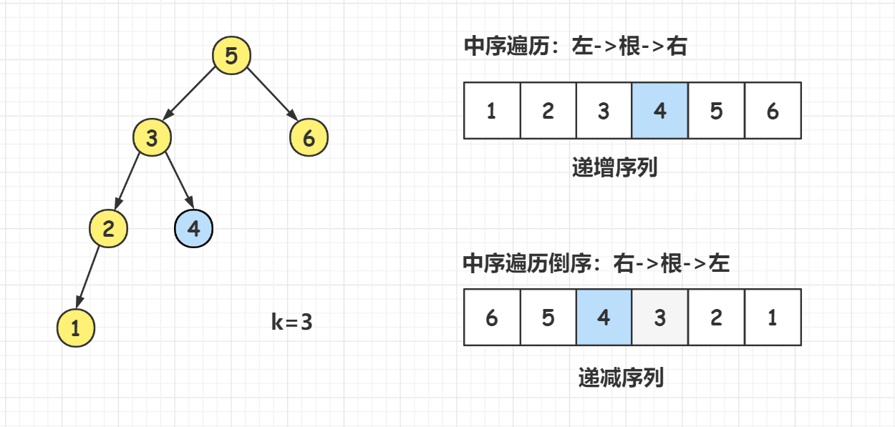

因此求二叉搜索树第 `k`大的节点” 可转化为求 “二叉搜索树的中序遍历倒序的第`k` 个节点”。

**过程如下：**

- 1、按照**右->根->左**的顺序（中序遍历倒序）遍历二叉树

- 2、我们每次遍历一个节点的时候就让`k--`，当`k`减为`0`时，我们就找到了第`k`大的节点。

具体实现细节看代码。

**时间复杂度分析：** 每个节点最多只会被遍历`1`次，因此`n`个节点，时间复杂度为$O(n)$ 。 

**c++代码**

```c++
/**
 * Definition for a binary tree node.
 * struct TreeNode {
 *     int val;
 *     TreeNode *left;
 *     TreeNode *right;
 *     TreeNode(int x) : val(x), left(NULL), right(NULL) {}
 * };
 */
class Solution {
public: 
    int res;
    int kthLargest(TreeNode* root, int k) {
        dfs(root,k);
        return res;
    }
    void dfs(TreeNode* root ,int &k) //传引用 这里需要保证所有dfs函数共用一个k 
    {
        if(!root) return;
        dfs(root->right,k); //右
        k--;
        if(!k) res = root->val; //根
        dfs(root->left,k); //左
    }
};
```

**java代码**

```java
/**
 * Definition for a binary tree node.
 * public class TreeNode {
 *     int val;
 *     TreeNode left;
 *     TreeNode right;
 *     TreeNode(int x) { val = x; }
 * }
 */
class Solution {
    int res;
    int index = 0; //计数器
    public int kthLargest(TreeNode root, int k) {
        dfs(root,k);
        return res;
    }
    void dfs(TreeNode root ,int k) 
    {
        if(root == null) return;
        dfs(root.right,k); //右
        index++;
        if(k == index) res = root.val; //根
        dfs(root.left,k); //左
    }
}
```

### [剑指 Offer 36. 二叉搜索树与双向链表](https://leetcode-cn.com/problems/er-cha-sou-suo-shu-yu-shuang-xiang-lian-biao-lcof/) 

**题目**

输入一棵二叉搜索树，将该二叉搜索树转换成一个排序的循环双向链表。要求不能创建任何新的节点，只能调整树中节点指针的指向。

 

为了让您更好地理解问题，以下面的二叉搜索树为例：


我们希望将这个二叉搜索树转化为双向循环链表。链表中的每个节点都有一个前驱和后继指针。对于双向循环链表，第一个节点的前驱是最后一个节点，最后一个节点的后继是第一个节点。

下图展示了上面的二叉搜索树转化成的链表。“head” 表示指向链表中有最小元素的节点。

 

特别地，我们希望可以就地完成转换操作。当转化完成以后，树中节点的左指针需要指向前驱，树中节点的右指针需要指向后继。还需要返回链表中的第一个节点的指针。

 注意：本题与主站 426 题相同：https://leetcode-cn.com/problems/convert-binary-search-tree-to-sorted-doubly-linked-li

**思路**

**(递归）** $O(n)$ 

**什么是二叉搜索树 ？**

二叉搜索树是一棵有序的二叉树，所以我们也可以称它为二叉排序树。具有以下性质的二叉树我们称之为二叉搜索树：若它的左子树不为空，那么左子树上的所有值均小于它的根节点；若它的右子树不为空，那么右子树上所有值均大于它的根节点。它的左子树和右子树分别也为二叉搜索树。

**二叉搜索树的中序遍历是：左=>根=>右； 二叉搜索树的中序遍历从小到大是有序的。**  

**中序遍历模板** 

```c++
//打印中序遍历
void dfs(TreeNode* root ) 
{
    if(!root) return;
    dfs(root->left); 	//左
    print(root->val);   //根
   	dfs(root->right);	//右
}
```

如图所示，本题要求我们要将一棵**二叉搜索树**变成**排序的循环双向链表。**

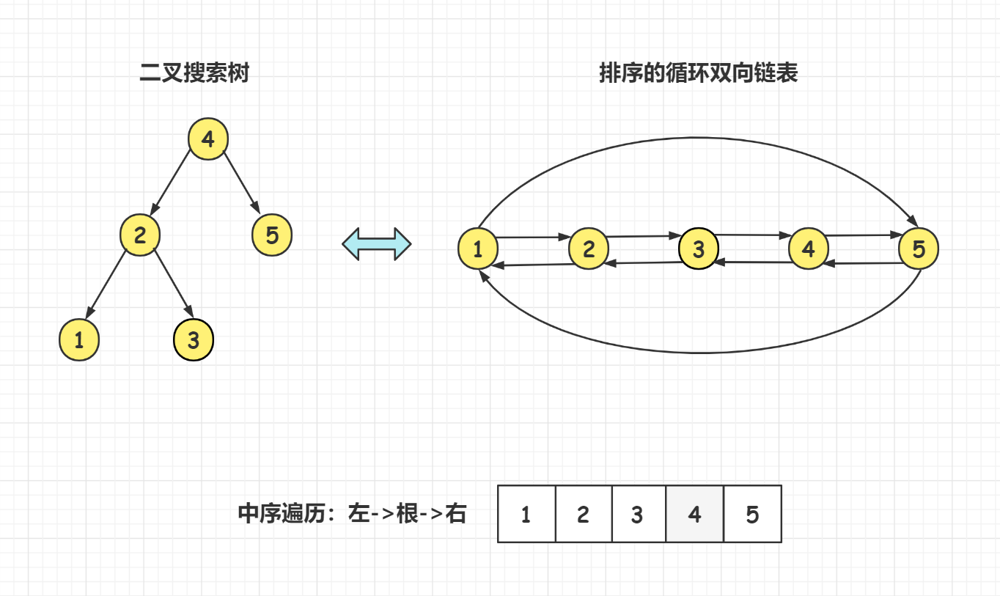

二叉搜索树的中序遍历就是有序的，因此这道题就是在中序递归遍历的基础上改了一点。

**具体过程如下：**

1、我们定义两个指针`pre`和`head`，`pre`指针用于保存中序遍历的前一个节点，`head`指针用于记录排序链表的头节点。

2、中序遍历二叉树，因为是中序遍历，所以遍历顺序就是双线链表的建立顺序。我们只需要在中序遍历的过程中，修改每个节点的左右指针，将零散的节点连接成双向循环链表。

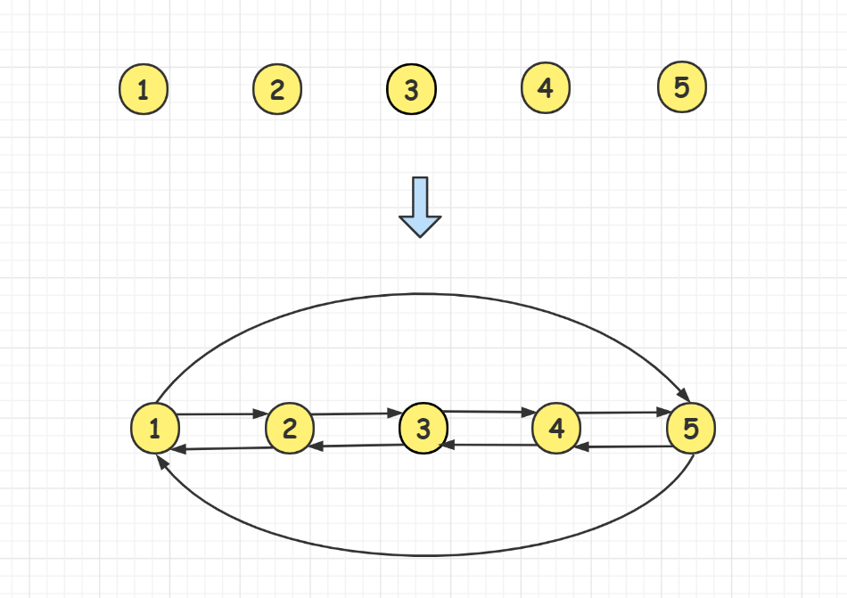

3、首先遍历二叉树的左子树，然后是当前根节点`root`。

- 当前驱节点`pre`不为空时，将前驱节点`pre`的左指针指向当前根节点`root`，即`pre->right = root`。

  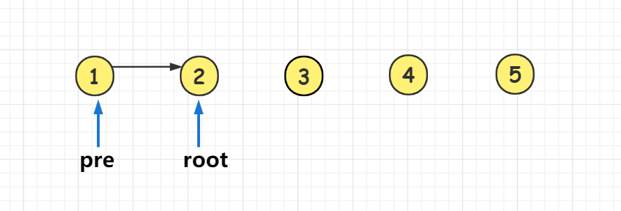

- 当前驱节点`pre`为空时： 代表正在访问链表头节点，记为 `head = root ` ，保存头节点。

4、每一个`root`节点访问时它的左子树肯定被访问过了，因此放心修改它的`left`指针，将`root`的`left`指针指向它的前驱节点，即` root->left = pre`， 这样两个节点之间的双向指针就修改好了。

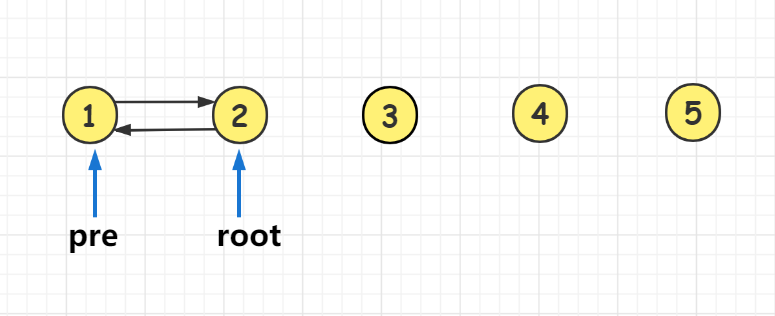

5、然后前驱节点`pre`右移到当前`root`节点，接下来递归到右子树重复上述操作。

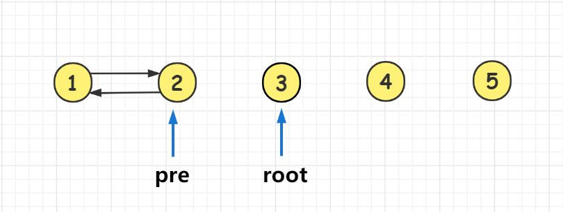

6、完成以上各步，只是将**二叉树**变成了**双向排序链表**，我们还需要将链表的首尾连接到一起，将其变成**双向循环排序链表**。

执行以下操作：

```c++
head->left = pre;
pre->right = head;
```

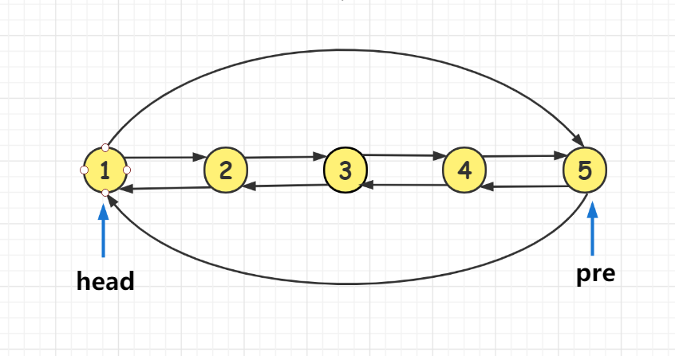

**时间复杂度分析：** $n$为二叉树的节点数， 中序遍历需要访问所有节点，因此时间复杂度为$O(n)$。  

**c++代码**

```c++
/*
// Definition for a Node.
class Node {
public:
    int val;
    Node* left;
    Node* right;

    Node() {}

    Node(int _val) {
        val = _val;
        left = NULL;
        right = NULL;
    }

    Node(int _val, Node* _left, Node* _right) {
        val = _val;
        left = _left;
        right = _right;
    }
};
*/
class Solution {
public:
    Node* pre = nullptr, *head = nullptr;
    Node* treeToDoublyList(Node* root) {
        if (!root) return root;
        dfs(root);
        head->left = pre;
        pre->right = head;
        return head;
    }
    void dfs(Node* root){
        if (!root) return;// 递归边界: 叶子结点返回
        dfs(root->left);  //左子树
        if (pre) pre->right = root;
        else head = root; // 保存链表头结点
        root->left = pre; 
        pre = root;
        dfs(root->right); //右子树
    }
};
```

**java代码**

```java
/*
// Definition for a Node.
class Node {
    public int val;
    public Node left;
    public Node right;

    public Node() {}

    public Node(int _val) {
        val = _val;
    }

    public Node(int _val,Node _left,Node _right) {
        val = _val;
        left = _left;
        right = _right;
    }
};
*/
class Solution {
    Node pre = null, head = null;
    public Node treeToDoublyList(Node root) {
        if (root == null) return root;
        dfs(root);
        head.left = pre;
        pre.right = head;
        return head;
    }
     void dfs(Node root){
        if (root == null) return; // 递归边界: 叶子结点返回
        dfs(root.left);
        if (pre != null) pre.right = root;
        else head = root; // 链表头结点
        root.left = pre;
        pre = root;
        dfs(root.right);
    }
}
```


### [101. 对称二叉树](https://leetcode-cn.com/problems/symmetric-tree/) 

**题目**

给定一个二叉树，检查它是否是镜像对称的。

 

例如，二叉树 `[1,2,2,3,4,4,3] `是对称的。

    	1
       / \
      2   2
     / \ / \
    3  4 4  3

但是下面这个` [1,2,2,null,3,null,3] `则不是镜像对称的:

      1
     / \
      2   2
       \   \
       3    3
 **进阶：** 

你可以运用递归和迭代两种方法解决这个问题吗？


**思路1**

**(递归）** $O(n)$

**样例如图**

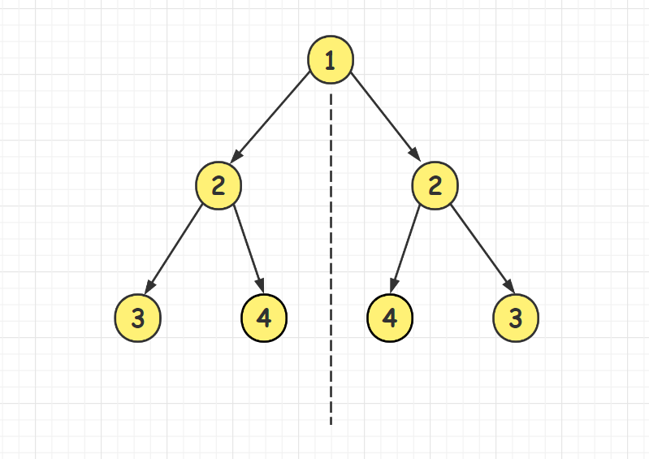

递归判断两个子树是否对称。

两个子树对称当且仅当：

1. 两个子树的根节点值相等；
2. 第一棵子树的左子树和第二棵子树的右子树对称，且第一棵子树的右子树和第二棵子树的左子树对称； 

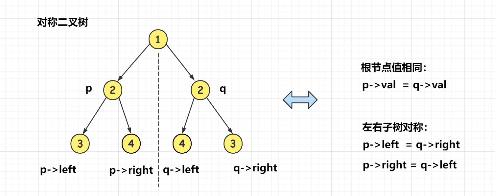

**过程如下**

1、我们定义两个指针`p`和`q` ,让`p`和`q`指针一开始分别指向左子树和右子树。

2、同步移动这两个指针来遍历这棵树，每次检查当前 `p` 和` q` 节点的值是否相等，如果相等再判断左右子树是否对称。

**递归边界**

- `p`和`q`节点都为空时，左右子树都为空，返回`true`
- `p`和`q`节点只有一个为空时，左右子树不对称，返回`false`
- `p`和`q`节点值不相等，左右子树不对称，返回`false`

**时间复杂度分析：** 从上到下每个节点仅被遍历一遍，所以时间复杂度是 $O(n)$。 

**c++代码1**

```c++
/**
 * Definition for a binary tree node.
 * struct TreeNode {
 *     int val;
 *     TreeNode *left;
 *     TreeNode *right;
 *     TreeNode(int x) : val(x), left(NULL), right(NULL) {}
 * };
 */
class Solution {
public:
    bool isSymmetric(TreeNode* root) {
        if(!root) return true; //根节点为空，返回true
        return dfs(root->left,root->right);//判断两棵子树是否对称
    }
    bool dfs(TreeNode* p,TreeNode* q){
        if(!p && !q) return true; //两个节点都为空
        else if (!p||!q) return false; //只有一个为空
        if(p->val != q->val) return false;
        //第一棵子树的左子树和第二棵子树的右子树对称，且第一棵子树的右子树和第二棵子树的左子树对称；
        return dfs(p->left,q->right)&&dfs(p->right,q->left);
    }
};
```

**java代码1**

```java
/**
 * Definition for a binary tree node.
 * public class TreeNode {
 *     int val;
 *     TreeNode left;
 *     TreeNode right;
 *     TreeNode() {}
 *     TreeNode(int val) { this.val = val; }
 *     TreeNode(int val, TreeNode left, TreeNode right) {
 *         this.val = val;
 *         this.left = left;
 *         this.right = right;
 *     }
 * }
 */
class Solution {
    public boolean isSymmetric(TreeNode root) {
         if(root == null) return true; //根节点为空，返回true
        return dfs(root.left,root.right);//判断两棵子树是否对称
    }
    public boolean dfs(TreeNode p,TreeNode q){
        if(p == null && q == null) return true; //两个节点都为空
        else if (p == null||q == null) return false; //只有一个为空
        if(p.val != q.val) return false;
        //第一棵子树的左子树和第二棵子树的右子树对称，且第一棵子树的右子树和第二棵子树的左子树对称；
        return dfs(p.left,q.right)&&dfs(p.right,q.left);
    }
}
```

**思路2**

**(迭代)** $O(n)$
用栈模拟递归，对根节点的左子树，我们用中序遍历；对根节点的右子树，我们用反中序遍历。
则两个子树互为镜像，当且仅当同时遍历两课子树时，对应节点的值相等。

**时间复杂度分析：**树中每个节点仅被遍历一遍，所以时间复杂度是 $O(n)$。 

**c++代码2**

```c++
**
 * Definition for a binary tree node.
 * struct TreeNode {
 *     int val;
 *     TreeNode *left;
 *     TreeNode *right;
 *     TreeNode(int x) : val(x), left(NULL), right(NULL) {}
 * };
 */
class Solution {
public:
    bool isSymmetric(TreeNode* root) {
        if (!root) return true;
        stack<TreeNode*> left, right;
        TreeNode *lc = root->left;
        TreeNode *rc = root->right;
        while(lc || rc || left.size())
        {
            while (lc && rc)
            {
                left.push(lc), right.push(rc);
                lc = lc->left, rc = rc->right;
            }
            if (lc || rc) return false;
            lc = left.top(), rc = right.top();
            left.pop(), right.pop();
            if (lc->val != rc->val) return false;
            lc = lc->right, rc = rc->left;
        }
        return true;
    }

};
```

**java代码2**

```java
/**
 * Definition for a binary tree node.
 * public class TreeNode {
 *     int val;
 *     TreeNode left;
 *     TreeNode right;
 *     TreeNode() {}
 *     TreeNode(int val) { this.val = val; }
 *     TreeNode(int val, TreeNode left, TreeNode right) {
 *         this.val = val;
 *         this.left = left;
 *         this.right = right;
 *     }
 * }
 */
class Solution {
    public boolean isSymmetric(TreeNode root) {
        if (root == null ) return true;
        Stack<TreeNode> left = new Stack<>();
        Stack<TreeNode> right = new Stack<>();
        TreeNode lc = root.left;
        TreeNode rc = root.right;
        while(lc != null || rc != null || left.size() != 0)
        {
            while (lc != null && rc != null)
            {
                left.push(lc);  right.push(rc);
                lc = lc.left;   rc = rc.right;
            }
            if (lc != null|| rc != null) return false;
            lc = left.peek();   rc = right.peek();
            left.pop() ; right.pop();
            if (lc.val != rc.val) return false;
            lc = lc.right;      rc = rc.left;
        }
        return true;
    }
}
```

### [322. 零钱兑换](https://leetcode-cn.com/problems/coin-change/) 

**题目**

给定不同面额的硬币 `coins`和一个总金额 `amount`。编写一个函数来计算可以凑成总金额所需的最少的硬币个数。如果没有任何一种硬币组合能组成总金额，返回 `-1`。

你可以认为每种硬币的数量是无限的。

 

**示例 1：**

````
输入：coins = [1, 2, 5], amount = 11
输出：3 
解释：11 = 5 + 5 + 1
````

**示例 2：**

```
输入：coins = [2], amount = 3
输出：-1
```

**示例 3：**

```
输入：coins = [1], amount = 0
输出：0
```

**示例 4：**

```
输入：coins = [1], amount = 1
输出：1
```

**示例 5：** 

```
输入：coins = [1], amount = 2
输出：2
```


提示：

- `1 <= coins.length <= 12`
- `1 <= coins[i] <= 2^31 - 1`
- `0 <= amount <= 104`

**思路**

**(动态规划，完全背包问题)**  $O(nm)$  

完全背包问题。

相当于有`n` 种物品，每种物品的体积是硬币面值，价值是`1`，每种物品可用无限次。问装满背包最少需要多少价值的物品？

先考虑二维状态

**状态表示：** `f[i][j]` 表示从前`i`种硬币中选，且总金额恰好为`j`的所需要的最少硬币数。

那么`f[n][amount]`就表示表示 从前`n`种硬币中选，且总金额恰好为`amount`的所需要的最少硬币数，即为答案。

**集合划分：**

按照第`i`种硬币可以选 `0`个,`1`个，`2`个，`3`个，，，，`k`个划分集合 `f[i][j]`。其中`k*w[i] <= j`,也就是说在背包能装下的情况下，枚举第`i`种硬币可以选择几个。

不使用第`i`种硬币，状态表示:  	`f[i-1][j]`

使用第`i`种硬币，假设我们使用`k`个(容量允许的情况下)，状态表示：`min(f[i-1][j - k*coin]) + k`  

**状态计算方程：** 

`f[i][j] = min(f[i-1][j],f[i-1][j-coins[i]] + 1,f[i-1][j-2*coins[i]] + 2,......,f[i-1][j-k*coins[i]] + k) ` .

**初始化条件:**

`f[0][0]=0`，其余`f[0][j] = INF`，表示当没有任何硬币的时候，存在凑成总和为 `0` 的方案，方案所使用的硬币为 `0`；凑成其他总和的方案不存在。

**c++代码**

```c++
class Solution {
public:
    int INF = 1000000000;
    int coinChange(vector<int>& coins, int amount) {
         int n = coins.size();
         vector<vector<int>> f (n + 1, vector<int>(amount + 1, INF));

         f[0][0] = 0;   
         for(int i = 1; i <= n; i++)
         {
         	int val = coins[i-1];
            for(int j = 0; j <= amount; j++)
                for(int k = 0; k*val <= j; k++)
                {
                    f[i][j] = min(f[i][j] , f[i-1][j-k*val] + k);
                }
         }	 
        if (f[n][amount] == INF) f[n][amount] = -1;
        return f[n][amount];
    }
};
```

**java代码**

```java
class Solution {
    int INF = 1000000000;
    public int coinChange(int[] coins, int amount) {
        int n = coins.length;
        int[][] f = new int[n + 1][amount + 1];

        for (int i = 0; i <= n; i++) 
            for(int j = 0; j <= amount; j++)
               f[i][j] = INF;
        f[0][0] = 0;
        for (int i = 1; i <= n; i++) {
            int val = coins[i - 1];
            for (int j = 0; j <= amount; j++) {
                for (int k = 0; k * val <= j; k++) {
                      f[i][j] = Math.min(f[i][j], f[i-1][j-k*val] + k);
                    }
                }
        }
        if (f[n][amount] == INF) f[n][amount] = -1;
        return f[n][amount];
    }
}
```

**时间复杂度分析：** 共有 $n * amount$ 个状态需要转移，每个状态转移最多遍历$amount$次。整体复杂度为$O(n * amount^2)$

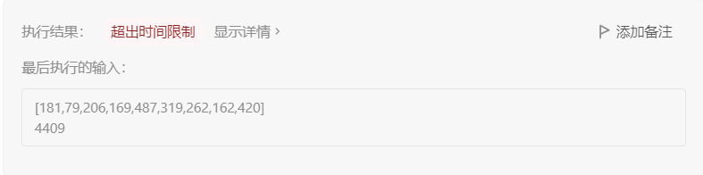 

超出时间限制，考虑一维优化。

**一维优化** 

`v`代表第`i`件物品的体积(面值)

`f[i][j] = min( f[i-1][j],f[i-1][j-v] + 1,f[i-1][j-2v] + 2......f[i-1][j-kv] + k)`

`f[i][j-v] + 1 = min(f[i-1,[j-v] + 1,f[i-1][j-2v] + 2......,f[i-1][j-kv] + k)`  

**因此：**

`f[i][j] = min(f[i-1][j],f[i][j-v] + 1)`  

**图示：**

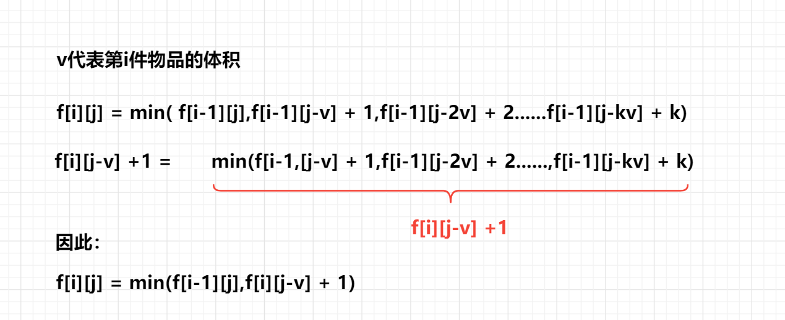

**去掉一维：**

**状态计算方程为:** `f[j] = min([j],[j-v] + 1)`

物品的体积即硬币面值: `f[j] = min([j],[j-coins[i]] + 1)` 

**时间复杂度分析**：令 `n` 表示硬币种数，`m` 表示总价钱，则总共两层循环，所以时间复杂度是 $O(nm)$。 

**c++代码**

```c++
class Solution {
public:

    int INF = 1000000000;

    int coinChange(vector<int>& coins, int amount) {
        vector<int> f(amount + 1, INF);
        f[0] = 0;
        for (int i = 0; i < coins.size(); i ++ )
            for (int j = coins[i]; j <= amount; j ++ )
                f[j] = min(f[j], f[j - coins[i]] + 1);
        if (f[amount] == INF) f[amount] = -1;
        return f[amount] ;
    }
};
```

**java代码**

```java
public class Solution {
    int INF = 1000000000;
    public int coinChange(int[] coins, int amount) {
        int[] f = new int[amount + 1];
        Arrays.fill(f, max);
        f[0] = 0;
        for (int i = 0; i < coins.size(); i ++ )
            for (int j = coins[i]; j <= amount; j ++ )
                    f[i] = Math.min(f[i], f[i - coins[j]] + 1);
                }
            }
        }
        if (f[amount] == INF) f[amount] = -1;
        return f[amount] ;
    }
}
```

### [83. 删除排序链表中的重复元素](https://leetcode-cn.com/problems/remove-duplicates-from-sorted-list/) 

**题目**

存在一个按升序排列的链表，给你这个链表的头节点 `head` ，请你删除所有重复的元素，使每个元素 只出现一次 。

返回同样按升序排列的结果链表。

 

**示例 1：**

```
输入：head = [1,1,2]
输出：[1,2]
```

**示例 2：**

```
输入：head = [1,1,2,3,3]
输出：[1,2,3]
```

**提示：**

- 链表中节点数目在范围 `[0, 300]` 内
- `-100 <= Node.val <= 100`
- 题目数据保证链表已经按升序排列

**思路**

**(线性扫描)** $O(n)$

在一个按升序排列的链表中，**重复的元素在链表中出现的位置是连续的** ，因此我们只需要对链表进行一次遍历，保留重复出现的元素中的第一个即可。

**具体过程如下：**

1、我们定义一个`p`指针，指向链表的头节点。

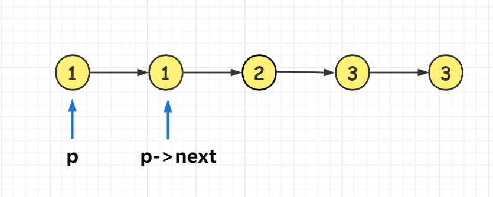

2、让`p`指针从前往后扫描整个链表:

-  如果`p`指针指向节点和其后继节点相同，则直接删除后继节点，即`p->next =  p->next->next`。 

  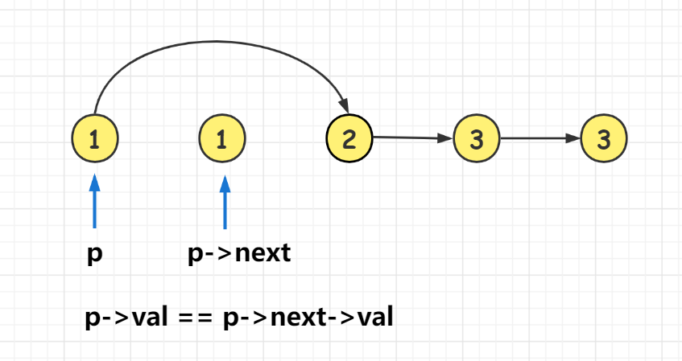

- 否则`p`指针移动到其后继节点，即`p = p->next`。 

  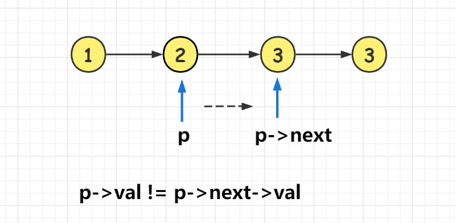

3、最后返回头节点`head` 。

这样经过了一次遍历，我们就将链表中的重复元素删除了。

**时间复杂度分析：** 整个链表只扫描一遍，所以时间复杂度是 $O(n)$。 

**c++代码** 

```c++
/**
 * Definition for singly-linked list.
 * struct ListNode {
 *     int val;
 *     ListNode *next;
 *     ListNode() : val(0), next(nullptr) {}
 *     ListNode(int x) : val(x), next(nullptr) {}
 *     ListNode(int x, ListNode *next) : val(x), next(next) {}
 * };
 */
class Solution {
public:
    ListNode* deleteDuplicates(ListNode* head) {
        if(!head)  return head;
        ListNode* p =  head;
        while(p->next)
        {
            if(p->val == p->next->val) p->next =  p->next->next;
            else  p = p->next;
        }
        return head;
    }
};
```

**java代码**

```java
/**
 * Definition for singly-linked list.
 * public class ListNode {
 *     int val;
 *     ListNode next;
 *     ListNode() {}
 *     ListNode(int val) { this.val = val; }
 *     ListNode(int val, ListNode next) { this.val = val; this.next = next; }
 * }
 */
class Solution {
    public ListNode deleteDuplicates(ListNode head) {
        if(head == null)  return head;
        ListNode p =  head;
        while(p.next != null)
        {
            if(p.val == p.next.val) p.next =  p.next.next;
            else  p = p.next;
        }
        return head;
    }
}
```


### [4. 寻找两个正序数组的中位数](https://leetcode-cn.com/problems/median-of-two-sorted-arrays/) 

**题目**

给定两个大小分别为 `m` 和 `n` 的正序（从小到大）数组 `nums1` 和 `nums2`。请你找出并返回这两个正序数组的 中位数 。

 **示例 1：** 

```
输入：nums1 = [1,3], nums2 = [2]
输出：2.00000
解释：合并数组 = [1,2,3] ，中位数 2
```

**示例 2：**

```
输入：nums1 = [1,2], nums2 = [3,4]
输出：2.50000
解释：合并数组 = [1,2,3,4] ，中位数 (2 + 3) / 2 = 2.5
```

**示例 3：**

```
输入：nums1 = [0,0], nums2 = [0,0]
输出：0.00000
```

**示例 4：**

```
输入：nums1 = [], nums2 = [1]
输出：1.00000
```

**示例 5：**

```
输入：nums1 = [2], nums2 = []
输出：2.00000
```

**提示：**

- `nums1.length == m`
- `nums2.length == n`
- `0 <= m <= 1000`
- `0 <= n <= 1000`
- `1 <= m + n <= 2000`
- `-106 <= nums1[i], nums2[i] <= 106`

**进阶：**你能设计一个时间复杂度为 `O(log (m+n))` 的算法解决此问题吗？ 

**思路**

**(递归)**   $O(log(n+m))$ 

找出两个正序数组的**中位数**等价于找出两个正序数组中的**第k小数**。如果两个数组的大小分别为`n`和`m ` ，那么第 `k = (n + m)/2` 小数就是我们要求的中位数。

**如何寻找第k小的元素？** 

**过程如下：**

1、考虑一般情况，我们在 `nums1`和`nums2`数组中各取前`k/2`个元素  

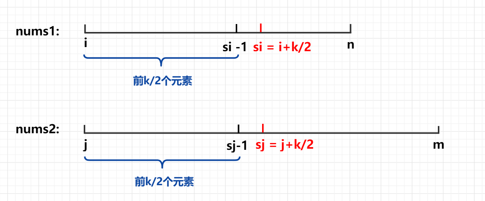

我们默认`nums1`数组比`nums2`数组的有效长度小 。`nums1`数组的有效长度从`i`开始，`nums2`数组的有效长度从`j`开始，其中`[i,si - 1]`是`nums1`数组的前`k / 2`个元素，`[j, sj - 1]`是`nums2`数组的前` k / 2`个元素。

2、接下来我们去比较`nums1[si - 1]`和`nums2[sj - 1]`的大小。

- 如果`nums1[si - 1] > nums2[sj - 1]` ，则说明 `nums1` 中取的元素过多，`nums2` 中取的元素过少。因此`nums2` 中的前 `k/2`个元素一定都小于等于第 `k` 小数，即`nums2[j,sj-1]`中元素。我们可以舍去这部分元素，在剩下的区间内去找第`k - k / 2`小的元素，也就是说第`k`小一定在`[i,n]`与`[sj,m]`中。
- 如果`nums1[si - 1] <= nums2[sj - 1]`，同理可说明`nums2`中的前 `k/2`个元素一定都小于等于第 `k` 小数，即`nums1[i,si-1]`中元素。我们可以舍去这部分元素，在剩下的区间内去找第`k - k / 2`小的元素，也就是说第`k`小一定在`[si,n]`与`[j,m]`中。

3、递归过程`2`，每次可将问题的规模减少一半，最后剩下的一个数就是我们要找的第`k`小数。 

**递归边界：** 

- 当`nums1`数组为空时，我们直接返回`nums2`数组的第`k`小数。
- 当`k == 1`时，且两个数组均不为空，我们返回两个数组首元素的最小值，即`min(nums1[i], nums2[j])`。

**奇偶分析：** 

- 当两个数组元素个数的总和`total`为偶数时，找到第`total / 2`小`left`和第`total / 2 + 1`小`right`，结果是`(left + right / 2.0)`。

- 当`total`为奇数时，找到第`total / 2 + 1`小，即为结果。

**时间复杂度分析：** $k=(m+n)/2$，且每次递归 $k$ 的规模都减少一半，因此时间复杂度是$O(log(m+n))$.

**c++代码**

```c++
class Solution {
public:
    double findMedianSortedArrays(vector<int>& nums1, vector<int>& nums2) {
        int tot = nums1.size() + nums2.size();
        if (tot % 2 == 0) {
            int left = find(nums1, 0, nums2, 0, tot / 2);
            int right = find(nums1, 0, nums2, 0, tot / 2 + 1);
            return (left + right) / 2.0;
        } else {
            return find(nums1, 0, nums2, 0, tot / 2 + 1);
        }
    }

    int find(vector<int>& nums1, int i, vector<int>& nums2, int j, int k) {
        if (nums1.size() - i > nums2.size() - j) return find(nums2, j, nums1, i, k);
        if (k == 1) {
            if (nums1.size() == i) return nums2[j];
            else return min(nums1[i], nums2[j]);
        }
        if (nums1.size() == i) return nums2[j + k - 1];
        int si = min((int)nums1.size(), i + k / 2), sj = j + k - k / 2;
        if (nums1[si - 1] > nums2[sj - 1])
            return find(nums1, i, nums2, sj, k - (sj - j));
        else
            return find(nums1, si, nums2, j, k - (si - i));
    }
};
```

**java代码**

```java
class Solution {
    public double findMedianSortedArrays(int[] nums1, int[] nums2) {
        int total = nums1.length + nums2.length;
        if(total % 2 == 0)
        {
            int left = f(nums1,0,nums2,0,total / 2);
            int right = f(nums1,0,nums2,0,total / 2 + 1);
            return (left + right) / 2.0;
        }
        else return f(nums1,0,nums2,0,total / 2 + 1);
    }
    static int f(int[] nums1,int i,int[] nums2,int j,int k)
    {
        //默认第一个是小的
        if(nums1.length - i > nums2.length - j) return f(nums2,j,nums1,i,k);
        //当第一个数组已经用完
        if(nums1.length == i) return nums2[j + k - 1];
        //当取第1个元素
        if(k == 1) return Math.min(nums1[i],nums2[j]);

        int si = Math.min(nums1.length,i + k / 2),sj = j + k - k / 2;
        if(nums1[si - 1] > nums2[sj - 1])
        {
            return f(nums1,i,nums2,sj,k - (sj - j));
        }
        else
        {
            return f(nums1,si,nums2,j,k - (si - i));
        }
    }
}

```

### [48. 旋转图像](https://leetcode-cn.com/problems/rotate-image/) 

**题目**

给定一个 $n × n$ 的二维矩阵 `matrix` 表示一个图像。请你将图像顺时针旋转 90 度。

你必须在 **原地** 旋转图像，这意味着你需要直接修改输入的二维矩阵。**请不要** 使用另一个矩阵来旋转图像。

 

**示例 1：** 


```
输入：matrix = [[1,2,3],[4,5,6],[7,8,9]]
输出：[[7,4,1],[8,5,2],[9,6,3]]
```

**示例 2：**


```
输入：matrix = [[5,1,9,11],[2,4,8,10],[13,3,6,7],[15,14,12,16]]
输出：[[15,13,2,5],[14,3,4,1],[12,6,8,9],[16,7,10,11]]
```

**示例 3：**

```
输入：matrix = [[1]]
输出：[[1]]
```

**示例 4：**

```
输入：matrix = [[1,2],[3,4]]
输出：[[3,1],[4,2]]
```

**提示：**

- `matrix.length == n`
- `matrix[i].length == n`
- `1 <= n <= 20`
- `-1000 <= matrix[i][j] <= 1000` 

**思路**

**(操作分解)** $O(n^2)$

我们对观察样例，找规律发现：先以**左上-右下对角条线**为轴做翻转，再以**中心的竖线**为轴做翻转，就可以翻转90度。

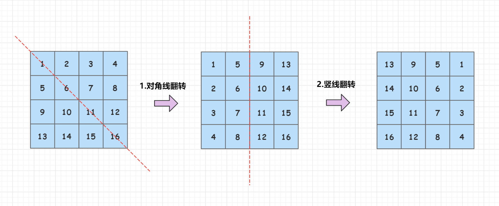

因此可以得出一个结论，顺时针90度应该是左上/右下对角线翻转+左右翻转，或者右上/左下对角线翻转+上下翻转。

**过程如下：** 

1. 先以左上-右下对角条线为轴做翻转；
2. 再以中心的竖线为轴做翻转；

**时间复杂度**：$O(n^2)$， 额外空间：$O(1)$ 

**c++代码**

```c++
class Solution {
public:
    void rotate(vector<vector<int>>& matrix) {
        //先沿斜对角线翻转
        int n = matrix.size();
        for(int i = 0; i < n; i++)
            for(int j = 0; j < i; j++)
                swap(matrix[i][j],matrix[j][i]);
        //再沿垂直竖线翻转
        for(int i = 0;i < n; i++)
            for(int j = 0, k = n - 1; j < k ; j++, k--) //类似于双指针，由两端向中心靠齐
                swap(matrix[i][j],matrix[i][k]);        
    }
};
```

**java代码** 

```java
class Solution {
    public void rotate(int[][] matrix) {
        int n = matrix.length;
        //先沿斜对角线翻转
        for(int i = 0;i < n;i ++)
            for(int j = 0;j < i;j ++){
                int temp = matrix[i][j];
                matrix[i][j] = matrix[j][i];
                matrix[j][i] = temp;
       }
       //再沿垂直竖线翻转
       for(int i = 0;i < n;i ++)
            for(int j = 0, k = n - 1; j < k ; j++, k--){
                int temp = matrix[i][k];
                matrix[i][k] = matrix[i][j];
                matrix[i][j] = temp;
        }
    }
}
```

### [239. 滑动窗口最大值](https://leetcode-cn.com/problems/sliding-window-maximum/) 

**题目**

给你一个整数数组 `nums`，有一个大小为 `k` 的滑动窗口从数组的最左侧移动到数组的最右侧。你只可以看到在滑动窗口内的 `k` 个数字。滑动窗口每次只向右移动一位。

返回滑动窗口中的最大值。

 **示例 1：**  

```
输入：nums = [1,3,-1,-3,5,3,6,7], k = 3
输出：[3,3,5,5,6,7]
解释：
滑动窗口的位置                最大值

---------------               -----

[1  3  -1] -3  5  3  6  7       3
 1 [3  -1  -3] 5  3  6  7       3
 1  3 [-1  -3  5] 3  6  7       5
 1  3  -1 [-3  5  3] 6  7       5
 1  3  -1  -3 [5  3  6] 7       6
 1  3  -1  -3  5 [3  6  7]      7
```

**示例 2：**

```
输入：nums = [1], k = 1
输出：[1]
```

**示例 3：**

```
输入：nums = [1,-1], k = 1
输出：[1,-1]
```

**示例 4：**

```
输入：nums = [9,11], k = 2
输出：[11]
```

**示例 5：**

```
输入：nums = [4,-2], k = 2
输出：[4]
```

**提示：**

- `1 <= nums.length <= 105`
- `-104 <= nums[i] <= 104`
- `1 <= k <= nums.length`

**思路**

**(单调队列)**  $O(n)$

首先，我们知道最直接的做法是模拟滑动窗口的过程，每向右滑动一次都遍历一遍窗口内的数字找最大的输出，这样的复杂度是$O(kn)$。考虑优化一下，窗口向右滑动的过程实际上就是将处于窗口的第一个数字删除，同时在窗口的末尾添加一个新的数字，这就可以用双向队列来模拟，每次把尾部的数字弹出，再把新的数字压入到头部，然后找队列中最大的元素即可。  

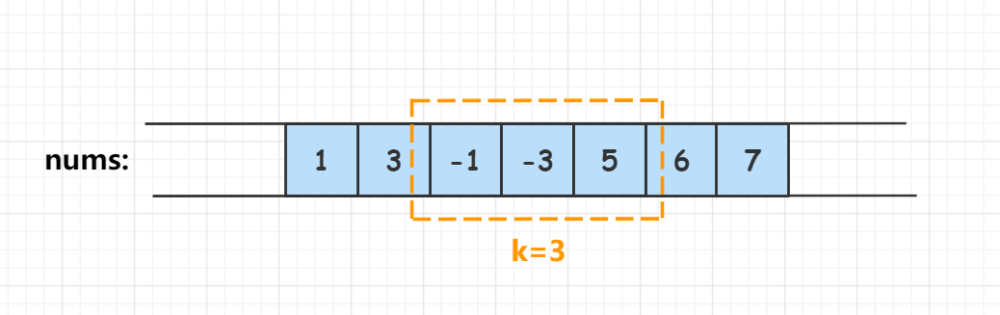

**如何快速找出滑动窗口中的最大值？** 

我们可以在队列中只保留那些可能成为窗口最大元素的数字，去掉那些不可能成为窗口中最大元素的数字。考虑这样一个情况，如果队列中进来一个较大的数字，那么队列中比这个数更小的数字就不可能再成为窗口中最大的元素了，因为这个大的数字是后进来的，一定会比之前早进入窗口的小的数字要晚离开窗口，那么那些早进入且比较小的数字就“永无出头之日”，所以就可以弹出队列。

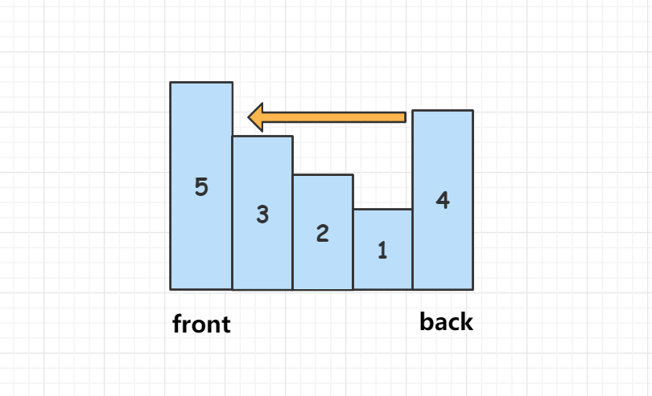

因此队列中的元素就会成保持一个单调递减的顺序，这样我们就维护了一个单调队列。

**单调队列** 

单调队列是一个普通的双端队列，即队头和队尾都可以添加和弹出元素。单调队列顾名思义，队列中元素之间的关系具有单调性，此处的单调性分为单调递增与单调递减。

以单调递减队列为例：

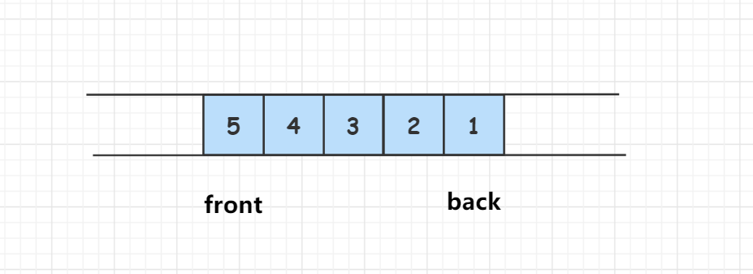

(这里我们规定递减是指从队头到队尾是递减序列）

**解题过程如下：** 

初始时单调队列为空。随着对数组的遍历过程中，每次插入元素前，需要考察两个事情：

- 1、合法性检查：队头下标如果距离` i` 超过了 `k` ，则应该出队。
- 2、 单调性维护：如果 `nums[i]` 大于或等于队尾元素下标所对应的值，则当前队尾再也不可能充当某个滑动窗口的最大值了，故需要队尾出队。始终保持队中元素从队头到队尾单调递减。
- 3、如次遍历一遍数组，队头就是每个滑动窗口的最大值所在下标。

**时间复杂度分析：** 每个元素最多入队出队一次，复杂度为$O(n)$ 

**c++代码** 

```c++
class Solution {
public:
    vector<int> maxSlidingWindow(vector<int>& nums, int k) {
        deque<int>q; //双端队列
        vector<int>res;
        for(int i = 0; i < nums.size(); i++){
            while(q.size() &&  i - k + 1 > q.front())  q.pop_front(); //判断是否在滑动窗口范围内
            while(q.size() && nums[i] >= nums[q.back()]) q.pop_back();//维护单调递减队列
            q.push_back(i); //将当前元素插入队列
            if(i >= k - 1)  res.push_back(nums[q.front()]); //滑动窗口的元素达到了k个，才可以将其加入答案数组中
        }
        return res;
    }
};
```

**java代码** 

```java
class Solution {
    public int[] maxSlidingWindow(int[] nums, int k) {
        int n = nums.length;
        Deque<Integer> queue = new ArrayDeque<>(); //双端队列
        int[] res = new int[n - k + 1];
        for (int i = 0 , j = 0; i < n; i++) {
            while (!queue.isEmpty() && i- k + 1 > queue.getFirst())   queue.pollFirst();
            while (!queue.isEmpty() && nums[i] > nums[queue.getLast()])  queue.pollLast();
            queue.offer(i);   
            if( i - k + 1 >= 0) res[j++] = nums[queue.getFirst()];           
        }
        return res;
    }
}
```

### [39. 组合总和](https://leetcode-cn.com/problems/combination-sum/)

**题目**

给定一个**无重复元素**的正整数数组 `candidates` 和一个正整数 `target` ，找出 `candidates` 中所有可以使数字和为目标数 `target` 的唯一组合。

`candidates` 中的数字可以无限制重复被选取。如果至少一个所选数字数量不同，则两种组合是唯一的。 

对于给定的输入，保证和为 `target` 的唯一组合数少于 `150` 个。

 **示例 1：**

```
输入: candidates = [2,3,6,7], target = 7
输出: [[7],[2,2,3]]
```

**示例 2：**

```
输入: candidates = [2,3,5], target = 8
输出: [[2,2,2,2],[2,3,3],[3,5]]
```

**示例 3：**

```
输入: candidates = [2], target = 1
输出: []
```

**示例 4：**

```\
输入: candidates = [1], target = 1
输出: [[1]]
```

**示例 5：**

```
输入: candidates = [1], target = 2
输出: [[1,1]]
```

**提示：**

- `1 <= candidates.length <= 30`
- `1 <= candidates[i] <= 200`
- `candidate` 中的每个元素都是独一无二的。
- `1 <= target <= 500`

**思路**

**(dfs,递归)**

递归枚举，枚举每个数字可以选多少次。

**递归过程如下:**

- 1、遍历数组中的每一个数字。
- 2、递归枚举每一个数字可以选多少次，递归过程中维护一个`target`变量。如果当前数字小于等于`target`，我们就将其加入我们的路径数组`path`中，相应的`target`减去当前数字的值。也就是说，每选一个分支，就减去所选分支的值。
- 3、当`target == 0`时，表示该选择方案是合法的，记录该方案，将其加入`res`数组中。

递归树如下，以`candidates = [2,3,6,7]`, `target = 7`为例。

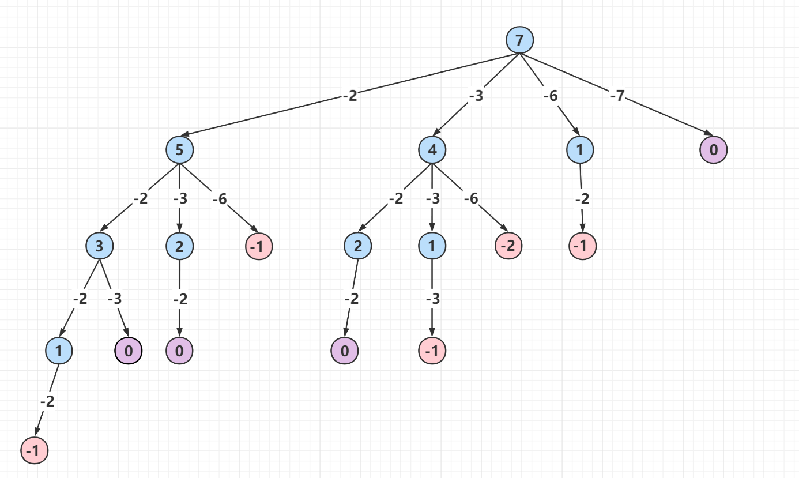

最终答案为：`[[7],[2,2,3]]` ，但是我们发现`[[2, 2, 3], [2, 3, 2], [3, 2, 2]`方案重复了。为了避免搜索过程中的重复方案，我们要去定义一个搜索起点，已经考虑过的数，以后的搜索中就不能出现，让我们的每次搜索都从当前起点往后搜索(包含当前起点)，直到搜索到数组末尾。这样我们人为规定了一个搜索顺序，就可以避免重复方案。

如下图所示，处于黄色虚线矩形内的分支都不再去搜索了，这样我们就完成了去重操作。

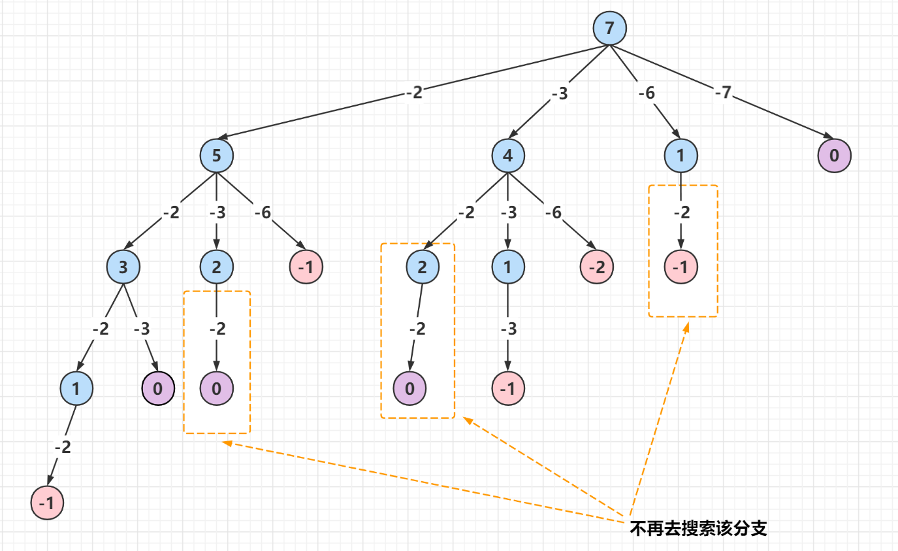

**递归函数设计：**

`void dfs(vector<int>&c,int u ,int target)`

变量`u`表示当前枚举的数字下标，`target`是递归过程中维护的目标数。

**递归边界：** 

- 1、 `if(target < 0)  `，表示当前方案不合法，返回上一层。
- 2、`if(target == 0)`，方案合法，记录该方案。

**时间复杂度分析： **无

**c++代码 **

```c++
class Solution {
public:

    vector<vector<int>>res; //记录答案
    vector<int>path;   //记录路径

    vector<vector<int>> combinationSum(vector<int>& candidates, int target) {
        dfs(candidates,0,target);
        return res;
    }

    void dfs(vector<int>&c,int u ,int target)
    {
        if(target < 0) return ;   //递归边界
        if(target == 0)
        {
            res.push_back(path);  //记录答案
            return ;
        }
        for(int i = u; i < c.size(); i++){
            if( c[i] <= target)  
            {
                path.push_back(c[i]);   //加入路径数组中
                dfs(c,i,target -  c[i]);// 因为可以重复使用，所以还是i
                path.pop_back();        //回溯，恢复现场
            }
        }
    }
};
```

**java代码**

```java
class Solution {
    List<List<Integer>> res = new ArrayList<>(); //记录答案
    List<Integer> path = new ArrayList<>();  //记录路径

    public List<List<Integer>> combinationSum(int[] candidates, int target) {
        dfs(candidates,0, target);
        return res;
    }
    public void dfs(int[] c, int u, int target) {
        if(target < 0) return ;
        if(target == 0)
        {
            res.add(new ArrayList(path));
            return ;
        }
        for(int i = u; i < c.length; i++){
            if( c[i] <= target)  
            {
                path.add(c[i]);
                dfs(c,i,target -  c[i]);    // 因为可以重复使用，所以还是i
                path.remove(path.size()-1); //回溯，恢复现场
            }
        }
    }
}
```

### [958. 二叉树的完全性检验](https://leetcode-cn.com/problems/check-completeness-of-a-binary-tree/) 

**题目**

 给定一个二叉树，确定它是否是一个完全二叉树。

百度百科中对完全二叉树的定义如下：

若设二叉树的深度为 `h`，除第 `h` 层外，其它各层 `(1～h-1)` 的结点数都达到最大个数，第 h 层所有的结点都连续集中在最左边，这就是完全二叉树。（注：第 `h` 层可能包含 1~ $2^h $个节点。）

 **示例 1：**


```
输入：[1,2,3,4,5,6]
输出：true
解释：最后一层前的每一层都是满的（即，结点值为 {1} 和 {2,3} 的两层），且最后一层中的所有结点（{4,5,6}）都尽可能地向左。
```

**示例 2：**


```
输入：[1,2,3,4,5,null,7]
输出：false
解释：值为 7 的结点没有尽可能靠向左侧。
```

**提示：**

1. 树中将会有 1 到 100 个结点。

**思路** 

**(bfs)** $O(n)$ 

完全二叉树的堆式存贮，堆就是一个完全二叉树，而完全二叉树可以用数组表示。我们将一个值为`1~n`的连续数组表示成一个完全二叉树如下图所示：  

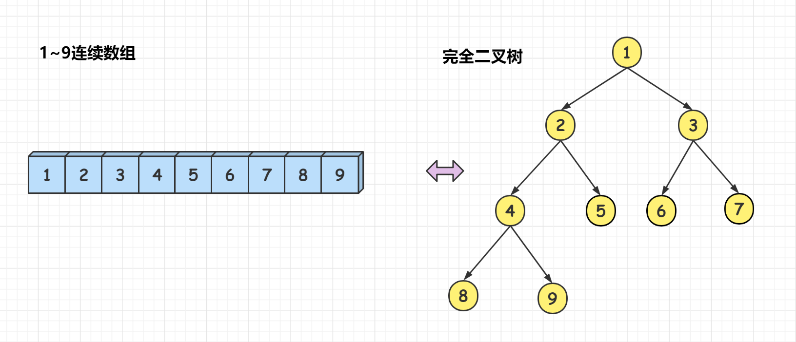

在完全二叉树中，用 `1` 表示根节点编号，则对于任意一个节点 `x`，它的左孩子为 `2*x`，右孩子为 `2*x + 1` 。那么我们可以发现，一颗二叉树是完全二叉树当且仅当节点编号依次为 `1, 2, 3, ...n` 且没有间隙。换句话说，可以将其表示为一个值为`1~n`的连续数组。而在一个值从`1`开始的连续数组中，**数组中最大元素值等于数组大小。** 在根节点编号值为`1`的完全二叉树则是**，节点编号最大值等于节点个数。** 

因此，我们可以对一颗二叉树进行**广度优先搜索**，这样搜索出的节点编号序列值恰好可以组成一个升序的数组。如果编号序列是一个从`1`开始的无间隔的连续数组，则该二叉树为完全二叉树。 

**递归函数设计：**

```c++
bool dfs(TreeNode* root , int k) //k是当前节点编号
```

`root`是当前遍历的节点，`k`是当前节点编号。

**搜索过程如下：**

- 1、我们从根节点开始搜索，并将根节点编号值设置为`1`。
- 2、然后搜索左子树，并传递其根节点值为`2*k`。搜索右子树，并传递其根节点值为`2*k+1`
- 3、在递归搜索过程中，记录节点个数`n`和当前最大节点编号值`p`。
- 4、最后判断最大节点值`p`和节点数`n`是否相等，相等则该二叉树是完全二叉树，否则不是。

**递归边界：**

- 1、题目规定树中最多有`100`个节点，如果节点编号`k > 100`，说明该二叉树不合法，返回`false`。
- 2、递归到叶子节点，子树递归结束，返回`true`。

**时间复杂度分析：** $O(n)$，其中 $n$是树节点个数 。

**c++代码**

```c++
/**
 * Definition for a binary tree node.
 * struct TreeNode {
 *     int val;
 *     TreeNode *left;
 *     TreeNode *right;
 *     TreeNode() : val(0), left(nullptr), right(nullptr) {}
 *     TreeNode(int x) : val(x), left(nullptr), right(nullptr) {}
 *     TreeNode(int x, TreeNode *left, TreeNode *right) : val(x), left(left), right(right) {}
 * };
 */
class Solution {
public:
    int n = 0, p = 0;  //n是节点数，p是最大节点编号值
    bool isCompleteTree(TreeNode* root) {
        if(!dfs(root,1)) return false; //还没有递归到终点就返回false，说明其不是完全二叉树
        return n == p;  //判断最大节点值是否和节点数相等
    }
    bool dfs(TreeNode* root , int k) //k是当前节点编号
    {
        if(!root) return true;  //递归到了叶子节点
        if(k > 100) return false;
        n++, p = max(p,k); //记录节点数和最大节点编号值
        return dfs(root->left,2*k)&&dfs(root->right,2*k + 1); //递归左右子树
    }
}; 
```

**java代码**

```java
/**
 * Definition for a binary tree node.
 * public class TreeNode {
 *     int val;
 *     TreeNode left;
 *     TreeNode right;
 *     TreeNode() {}
 *     TreeNode(int val) { this.val = val; }
 *     TreeNode(int val, TreeNode left, TreeNode right) {
 *         this.val = val;
 *         this.left = left;
 *         this.right = right;
 *     }
 * }
 */
class Solution {
    int n = 0, p = 0; 
    public boolean isCompleteTree(TreeNode root) {
        if(!dfs(root,1)) return false;
        return n == p;
    }
    public boolean dfs(TreeNode root , int k) //k是当前节点编号
    {
        if(root == null) return true;  //递归到了叶子节点
        if(k > 100) return false;
        n++;  p = Math.max(p,k); //记录节点数和最大节点编号值
        return dfs(root.left,2*k)&&dfs(root.right,2*k + 1); //递归左右子树
    }
}
```

### [43. 字符串相乘](https://leetcode-cn.com/problems/multiply-strings/) 

**题目**

给定两个以字符串形式表示的非负整数 `num1` 和 `num2`，返回 `num1` 和 `num2` 的乘积，它们的乘积也表示为字符串形式。

**示例 1:**

```
输入: num1 = "2", num2 = "3"
输出: "6"
```

**示例 2:**

```
输入: num1 = "123", num2 = "456"
输出: "56088"
```

**说明：**

1. `num1` 和 `num2` 的长度小于`110`。
2. `num1` 和 `num2` 只包含数字 `0-9`。
3. `num1` 和 `num2` 均不以零开头，除非是数字 `0` 本身。 
4. **不能使用任何标准库的大数类型（比如 BigInteger）或直接将输入转换为整数来处理。**

**思路**

**(字符串模拟）** $O(n*m)$ 

**普通竖式**  

以`num1 = 123` , `num2 = 456`为例：我们遍历 `num2` 每一位与 `num1` 进行相乘，将每一步的结果进行累加，在这个过程如果相乘或者相加的结果大于等于`10` ，我们都要去满`10`进位，**如下图所示：**  

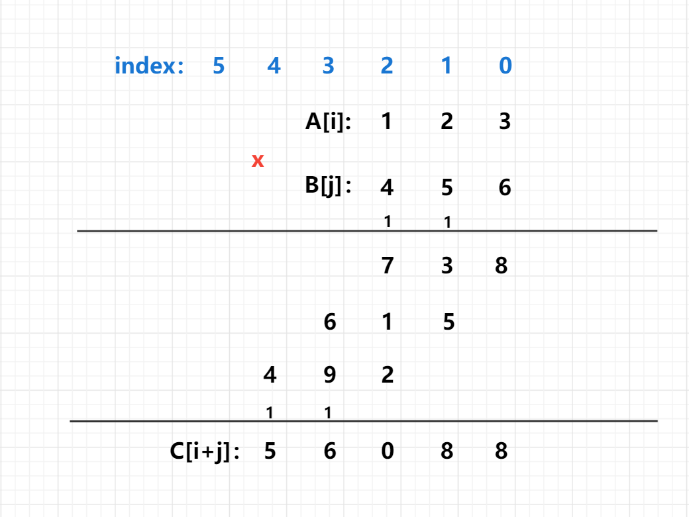


这样模拟普通竖式计算的方法较为复杂，我们可以考虑优化版的竖式计算。   

**优化竖式** 

其实在相乘或者相加计算过程的每一位，我们可以考虑先不去满`10`进位，等到计算完所有的相乘结果以后，最终将其加到一块，再去满`10`进位 ，最后的结果和**普通竖式** 一样，但却可以大大简化我们的模拟过程。(如下图所示) 

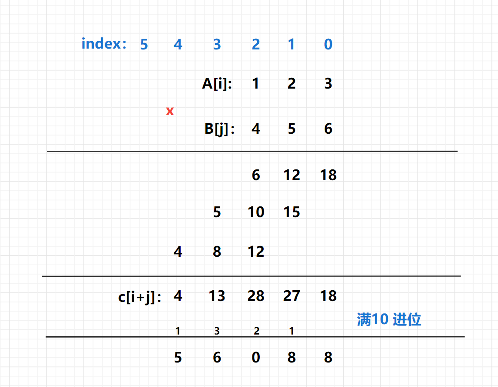

**具体过程如下：** 

- 1、长度是`n`和长度是`m`的数字相乘，最多只有`n + m`位，为了方便计算，将`num1`和`num2`反向存储到`A[]`和`B[]`中，即位数低的在数组前面，且开一个大小是`n + m`的`C[]`存储计算后的答案。
- 2、两个数相乘时，将`A[i] * B[j]`的结果累加到`C[i + j]`中，最后`C[i + j]`表示`i + j`这个位数的值是`C[i + j]`(如上图所示)
- 3、由于`C[]`数组中的某些位数字可能是大于等于`10`的，我们从`0`枚举到`n + m - 1`，进行满`10`进位， 将所有位的值全部变成个位数。
- 4、将`C[]`数组反转输出。

**细节：**

- 最终得到的数组`C[]`的高位可能包含前导`0`，因此在反转之前要先去除高位前导`0`。

**时间复杂度分析：** $O(n*m)$，$n$和$m$分别是$num1$和$num2$的长度。 

**c++代码**

```c++
class Solution {
public:
    string multiply(string num1, string num2) {
        vector<int> A, B;
        int n = num1.size(), m = num2.size();
        for (int i = n - 1; i >= 0; i -- ) A.push_back(num1[i] - '0'); //反向存贮
        for (int i = m - 1; i >= 0; i -- ) B.push_back(num2[i] - '0');
        vector<int> C(n + m);
        for (int i = 0; i < n; i ++ )
            for (int j = 0; j < m; j ++ )
                C[i + j] += A[i] * B[j];
        int t = 0;  //存贮进位
        for (int i = 0; i < C.size(); i ++ ) {
            t += C[i];
            C[i] = t % 10;
            t /= 10;
        }
        int k = C.size() - 1;
        while (k > 0 && !C[k]) k -- ;  //去除前导0
        string res;
        while (k >= 0) res += C[k -- ] + '0';  //反转
        return res;
    }
};
```

**java代码**

```java
class Solution {
    public String multiply(String num1, String num2) {

        int n = num1.length(), m = num2.length();
        int[] A = new int[n], B = new int[m];
        for (int i = n - 1; i >= 0; i--) A[n - 1 - i] = num1.charAt(i) - '0';
        for (int i = m - 1; i >= 0; i--) B[m - 1 - i] = num2.charAt(i) - '0';

        int[] C = new int[n + m];
        for (int i = 0; i < n; i++)
            for (int j = 0; j < m; j++)
                C[i + j] += A[i] * B[j];
        int t = 0;
        for (int i = 0; i < C.length; i++) {
            t += C[i];
            C[i] = t % 10;
            t /= 10;
        }
        int k = C.length - 1;
        while (k > 0 && C[k] == 0) k--;
        StringBuilder sb = new StringBuilder();
        while (k >= 0) sb.append((char)(C[k--] + '0'));
        return sb.toString();
    }
}
```

### [153. 寻找旋转排序数组中的最小值](https://leetcode-cn.com/problems/find-minimum-in-rotated-sorted-array/) 

**题目**

已知一个长度为 `n` 的数组，预先按照升序排列，经由 `1` 到 `n` 次 **旋转** 后，得到输入数组。例如，原数组 `nums = [0,1,2,4,5,6,7]` 在变化后可能得到：

- 若旋转 `4` 次，则可以得到 `[4,5,6,7,0,1,2]`
- 若旋转 `7` 次，则可以得到 `[0,1,2,4,5,6,7]`

注意，数组 `[a[0], a[1], a[2], ..., a[n-1]]` **旋转一次** 的结果为数组 `[a[n-1], a[0], a[1], a[2], ..., a[n-2]]` 。

给你一个元素值 **互不相同** 的数组 `nums` ，它原来是一个升序排列的数组，并按上述情形进行了多次旋转。请你找出并返回数组中的 **最小元素 **。 

 **示例 1：** 

```
输入：nums = [3,4,5,1,2]
输出：1
解释：原数组为 [1,2,3,4,5] ，旋转 3 次得到输入数组。
```

**示例 2：**

```
输入：nums = [4,5,6,7,0,1,2]
输出：0
解释：原数组为 [0,1,2,4,5,6,7] ，旋转 4 次得到输入数组。
```

**示例 3：**

````
输入：nums = [11,13,15,17]
输出：11
解释：原数组为 [11,13,15,17] ，旋转 4 次得到输入数组。
````

**提示：**

- `n == nums.length`
- `1 <= n <= 5000`
- `-5000 <= nums[i] <= 5000`
- `nums` 中的所有整数 **互不相同**
- `nums` 原来是一个升序排序的数组，并进行了 `1` 至 `n` 次旋转 

**思路**

**(二分)**  $O(logn)$ 

为了便于分析，我们先将数组中的数画在二维坐标系中，横坐标表示数组下标，纵坐标表示数组数值，如下所示： 

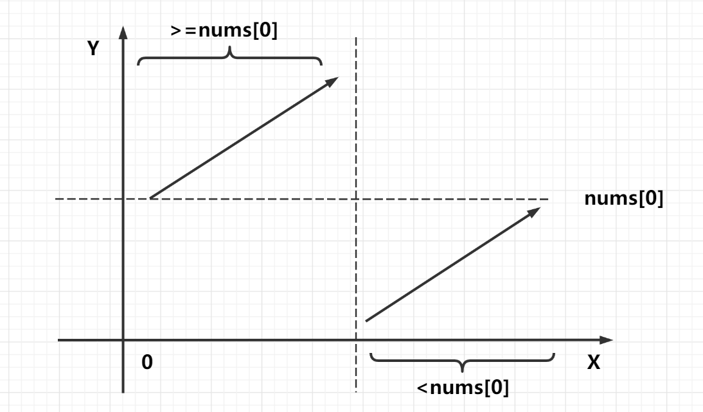

我们发现：竖直虚线左边的数满足 $nums[i]≥nums[0]$，而竖直虚线右边的数满足$nums[i]< nums[0]$，分界点就是整个数组的最小值。数组具有二分性，所以我们可以二分出最小值的位置。

**过程如下：**

- 1、在`[l,r]`区间中，` l = 0`, `r = nums.size() - 1`，我们去二分`<num[0]`的最左边界。
- 2、当`nums[mid] < nums[0]`时，往左边区域找，`r = mid。`。

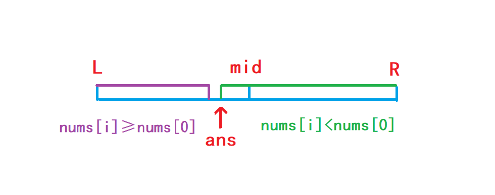


- 3、当`nums[mid] >= nums[0]`时，往右边区域找，`l = mid + 1`。 

  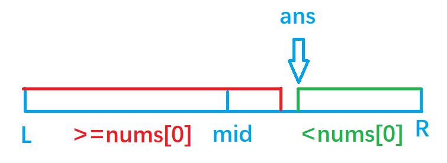

- 4、当只剩下一个数时，就是最小值的位置。

**细节：**

- 当数组完全单调时，第一个数`nums[0]`最小，我们直接返回即可。

**时间复杂度分析：** 二分查找，所以时间复杂度是 $O(logn)$。 

**c++代码**

```c++
class Solution {
public:
    int findMin(vector<int>& nums) {
        int l = 0, r = nums.size() - 1;
        if(nums[r] > nums[l]) return nums[0];  //升序数组，数组完全单调，第一个数最小
        while(l < r)
        {
            int mid = (l + r)/2;
            if(nums[mid] < nums[0])  r = mid;
            else l = mid + 1;
        }
        return nums[r];
    }
};
```

**java代码**

```java
class Solution {
    public int findMin(int[] nums) {
        int l = 0, r = nums.length - 1;
        if(nums[r] > nums[l]) return nums[0];  //升序数组，数组完全单调，第一个数最小
        while(l < r)
        {
            int mid = (l + r)/2;
            if(nums[mid] < nums[0])  r = mid;
            else l = mid + 1;
        }
        return nums[r];
    }
}
```

### [162. 寻找峰值](https://leetcode-cn.com/problems/find-peak-element/) 

**题目**

峰值元素是指其值大于左右相邻值的元素。

给你一个输入数组 `nums`，找到峰值元素并返回其索引。数组可能包含多个峰值，在这种情况下，返回 **任何一个峰值** 所在位置即可。

你可以假设 `nums[-1] = nums[n] = -∞` 。

**示例 1：**

```
输入：nums = [1,2,3,1]
输出：2
解释：3 是峰值元素，你的函数应该返回其索引 2。
```

**示例 2：**

```
输入：nums = [1,2,1,3,5,6,4]
输出：1 或 5 
解释：你的函数可以返回索引 1，其峰值元素为 2；
     或者返回索引 5， 其峰值元素为 6。
```

**提示：**

- `1 <= nums.length <= 1000`
- `-231 <= nums[i] <= 231 - 1`
- 对于所有有效的` i `都有 `nums[i] != nums[i + 1]`

**思路**

**(二分)**   $O(logn)$ 

数组的两端`nums[-1] = nums[n] = -∞` 都是负无穷，因此数组无论是单调递增还是单调递减，又或者是成起伏状，数组中必定包含一个峰值。如下图所示：

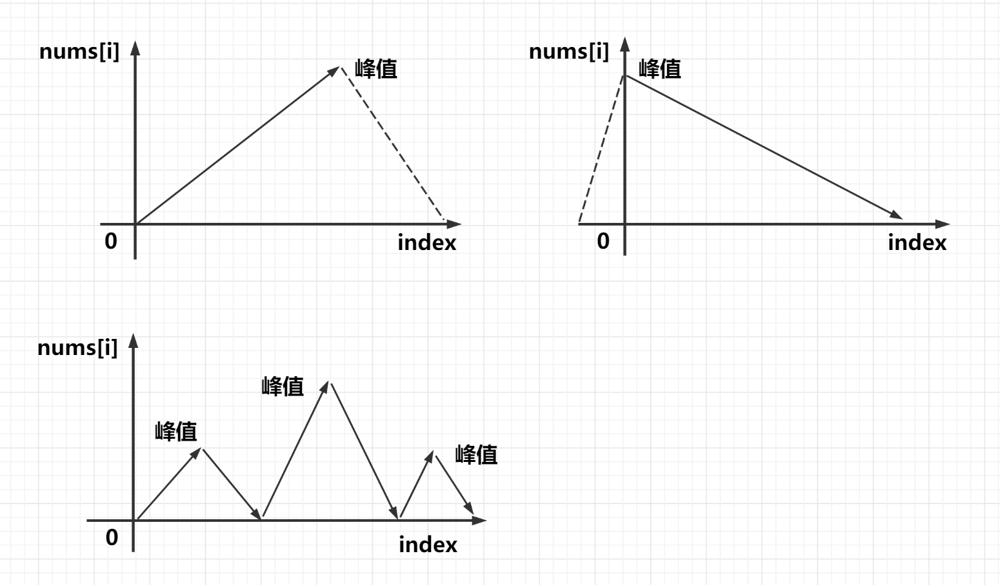

因为数组中的峰值不止一个，我们找到任意一个即可。题目还告诉我们对于所有有效的` i `都有 `nums[i] != nums[i + 1]`，即数组中的任意两个相邻数都不相等。 

**我们使用二分来做**，每次找出区间的中点`mid`，比较`nums[mid]`与`nums[mid + 1]`的大小关系来推断哪个区间内一定存在峰值，然后取一定存在峰值的区间。这样不断缩小区间范围，区间所剩下的最后一个数就是答案。 

**过程如下：** 

- 1、二分的边界，`l = 0`, `r = nums.size() - 1`。
- 2、如果`nums[mid] > nums[mid + 1]`，那么在`[l, mid]`这个区间内一定存在一个峰值。因为`[l,mid]`这一段如果是单调递减的话，那么`nums[l]`就是峰值，否则第一个出现上升的点就是峰值。
- 3、如果`nums[mid] < nums[mid + 1]`，那么在`[mid+1, r]`这个区间内一定存在一个峰值。因为`[mid+1,r]`这一段如果是单调递增的话，那么`nums[r]`就是峰值，否则第一个出现下降的点就是峰值。

**时间复杂度分析：** 二分查找，所以时间复杂度是 $O(logn)$。 

**c++代码**

```c++
class Solution {
public:
    int findPeakElement(vector<int>& nums) {
        int l = 0, r = nums.size() - 1;
        while( l < r)
        {
            int mid = ( l + r )/2;
            if(nums[mid] > nums[mid + 1]) r = mid;
            else l = mid + 1;
        }
        return r;
    }
};
```

**java代码**

```java
class Solution {
    public int findPeakElement(int[] nums) {
        int l = 0, r = nums.length - 1;
        while( l < r)
        {
            int mid = ( l + r )/2;
            if(nums[mid] > nums[mid + 1]) r = mid;
            else l = mid + 1;
        }
        return r;
    }
}
```

### [32. 最长有效括号](https://leetcode-cn.com/problems/longest-valid-parentheses/) 

**题目**

给你一个只包含 `'('` 和 `')'` 的字符串，找出最长有效（格式正确且连续）括号子串的长度。 

**示例 1：**

```
输入：s = "(()"
输出：2
解释：最长有效括号子串是 "()"
```

**示例 2：**

```
输入：s = ")()())"
输出：4
解释：最长有效括号子串是 "()()"
```

**示例 3：**

```
输入：s = ""
输出：0
```

**提示：**

- `0 <= s.length <= 3 * 10^4`
- `s[i] 为 '(' 或 ')'` 

**思路**

**(栈)** $O(n)$

我们可以发现一个规律，每一段合法括号序列它在字符串`s`中出现的位置一定是连续且不相交的，如下图所示：

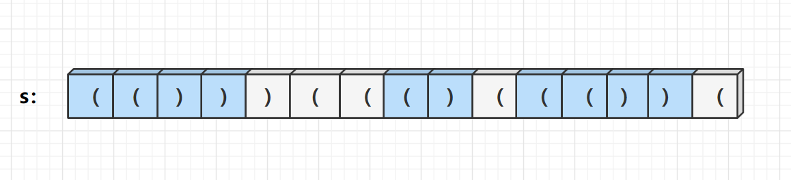

因此我们能想到的最直接的做法是找到每个可能的子串后判断它是否为合法括号序列，但这样的时间复杂度会达到 $O(n^3)$ 。

**有没有一种更高效的做法？**

我们知道栈在处理括号匹配有着天然的优势，于是考虑**用栈去判断序列的合法性**。遍历整个字符串`s`，把所有的合法括号序列按照右括号来分类，对于每一个右括号，都去求一下以这个右括号为右端点的最长的合法括号序列的左端点在什么位置。我们把每个右括号都枚举一遍之后，再取一个`max`，就是整个的最大长度。

**具体过程如下：**

- 1、用栈维护当前待匹配的左括号的位置，同时用 `start` 记录一个新的可能合法的子串的起始位置，初始设为`0`。

- 2、如果`s[i] =='('`，那么把`i`进栈。

- 3、如果`s[i] == ')'`,那么弹出栈顶元素 （代表栈顶的左括号匹配到了右括号），出栈后：

  - 如果栈为空，说明以当前右括号为右端点的合法括号序列的左端点为`start`，则更新答案 `i - start + 1`。

  - 如果栈不为空，说明以当前右括号为右端点的合法括号序列的左端点为栈顶元素的下一个元素，则更新答案`i - st.top()` 。

    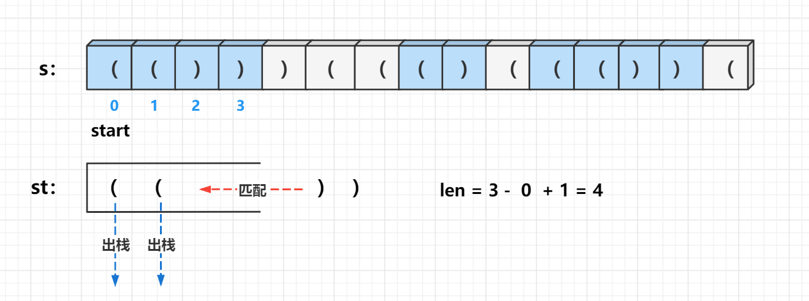 

- 4、遇到右括号`)`且当前栈为空，则当前的 `start `开始的子串不再可能为合法子串了，下一个合法子串的起始位置是 `i + 1`，更新 `start = i + 1`。

- 5、最后返回答案即可。

**实现细节：** 栈保存的是下标。

**时间复杂度分析：** 每个位置遍历一次，最多进栈一次，故时间复杂度为 $O(n)$。 

**c++代码**

```c++
class Solution {
public:
    int longestValidParentheses(string s) {
        stack<int> st;
        int ans = 0;
        for (int i = 0,start = 0; i < s.size(); i++) 
        {
            if (s[i] == '(') st.push(i);    //左括号入栈            
            else 
            {
                if (!st.empty()) 
                {
                    st.pop();	//匹配成功
                    if (st.empty()) ans = max(ans, i - start + 1);
                    else  ans = max(ans, i - st.top()); //i - st.top() + 1 - 1
                }
                else  start = i + 1;  //更新起点                      
            }
        }
        return ans;
    }
};
```

**java代码**

```java
class Solution {
    public int longestValidParentheses(String s) {
        Stack<Integer> st = new Stack<Integer>();
        int ans = 0;
        for(int i = 0 ,start = 0;i < s.length();i ++)
        {
            if( s.charAt(i) == '(') st.add(i);
            else
            {
                if(!st.isEmpty()) 
                {
                    st.pop();
                    if(st.isEmpty()) ans = Math.max(ans,i - start + 1);
                    else ans = Math.max(ans,i - st.peek());
                }
                else start = i + 1;
            }
        }
        return ans;
    }
}
```

### [64. 最小路径和](https://leetcode-cn.com/problems/minimum-path-sum/)

**题目**

给定一个包含非负整数的 `m x n`网格 `grid` ，请找出一条从左上角到右下角的路径，使得路径上的数字总和为最小。

**说明：**每次只能向下或者向右移动一步。

 **示例 1：**

````
输入：grid = [[1,3,1],[1,5,1],[4,2,1]]
输出：7
解释：因为路径 1→3→1→1→1 的总和最小。
````

**示例 2：**

```
输入：grid = [[1,2,3],[4,5,6]]
输出：12
```

**提示：**

- `m == grid.length`
- `n == grid[i].length`
- `1 <= m, n <= 200`
- `0 <= grid[i][j] <= 100`

**思路**

**(动态规划)**   $O(m*n)$ 

**状态表示：** `f[i,j]`表示从`(0,0)`走到`(i,j)`的最小路径和。那么，`f[n-1][m-1]`就表示从网格左上角到网格右下角的最小路径和，即为答案。

**状态转移：**   

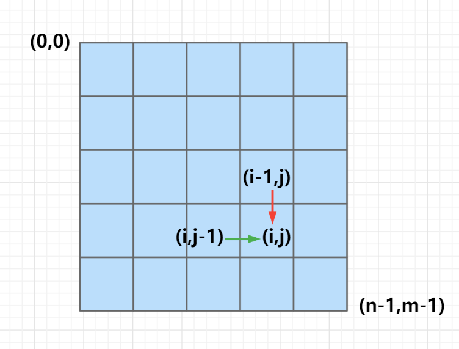 

由于限制了只会**向下走**或者**向右走**，因此到达`(i,j)`有两条路径 

- 从上方转移过来，`f[i][j] = f[i-1][j] + grid[i][j]`
- 从左方转移过来，`f[i][j] = f[i][j-1] + grid[i][j]` 

因此，**状态计算方程为：** `f[i][j] = max(f[i - 1][j], f[i][j - 1]) + grid[i][j]`， 从向右和向下两条路径中选择路径之和最小的转移过来，再加上`grid[i][j]`的值。

**初始化条件：** `f[0][0] = grid[0][0]`， 其余都初始化为正无穷。 

**分析图示：** 

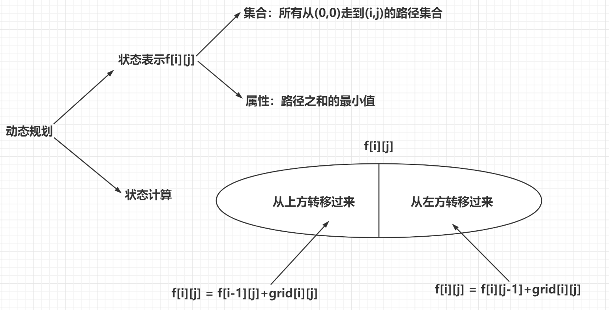

**时间复杂度分析：** $O(m*n)$，其中  $m$和 $n$分别是网格的行数和列数 。

**c++代码**

```c++
class Solution {
public:
    int minPathSum(vector<vector<int>>& grid) {
        int n = grid.size();
        int m = grid[0].size();
        vector<vector<int>> f(n, vector<int>(m, INT_MAX));
        for (int i = 0; i < n; i ++ )
            for (int j = 0; j < m; j ++ ) {
                if (!i && !j) f[i][j] = grid[i][j]; //初始化 f[0][0] =  grid[0][0]
                else 
                {
                    if (i) f[i][j] = min(f[i][j], f[i - 1][j] + grid[i][j]);//如果可以从上方转移过来
                    if (j) f[i][j] = min(f[i][j], f[i][j - 1] + grid[i][j]);//如果可以从左方转移过来
                }
            }
        return f[n - 1][m - 1]; 
    }
};
```

**java代码**

```java
class Solution {
    public int minPathSum(int[][] grid) {
        int n = grid.length;
        int m = grid[0].length;
        int[][] f = new int[n][m];
        for (int i = 0; i < n; i ++ )
            for (int j = 0; j < m; j ++ ) {
                if (i == 0 && j == 0) f[i][j] = grid[i][j]; //初始化 f[0][0] =  grid[0][0]
                else 
                {
                    f[i][j] = 0x3f3f3f3f;
                    if (i > 0) f[i][j] = Math.min(f[i][j],f[i - 1][j] + grid[i][j]);//如果可以从上方转移过来
                    if (j > 0) f[i][j] = Math.min(f[i][j],f[i][j - 1] + grid[i][j]);//如果可以从左方转移过来
                }
            }
        return f[n - 1][m - 1]; 
    }
}
```

###  [128. 最长连续序列](https://leetcode-cn.com/problems/longest-consecutive-sequence/) 

**题目**

给定一个未排序的整数数组 `nums` ，找出数字连续的最长序列（不要求序列元素在原数组中连续）的长度。

请你设计并实现时间复杂度为 `O(n)` 的算法解决此问题。

 **示例 1：**

```
输入：nums = [100,4,200,1,3,2]
输出：4
解释：最长数字连续序列是 [1, 2, 3, 4]。它的长度为 4。
```

**示例 2：**

```
输入：nums = [0,3,7,2,5,8,4,6,0,1]
输出：9
```

**提示：**

- `0 <= nums.length <= 105`
- `-109 <= nums[i] <= 109` 

**思路**

**(哈希）** $O(n)$ 

在一个未排序的整数数组 `nums`中 ，找出最长的数字连续序列，朴素的做法是：枚举`nums`中的每一个数`x`，并以`x`起点，在`nums`数组中查询`x + 1`,`x + 2`，，，`x + y`是否存在。假设查询到了 `x + y`，那么长度即为 `y - x + 1`，不断枚举更新答案即可。

如果每次查询一个数都要遍历一遍`nums`数组的话，时间复杂度为$O(n)$ ，其实我们可以用一个哈希表来存贮数组中的数，这样查询的时间就能优化为$O(1)$ 。   

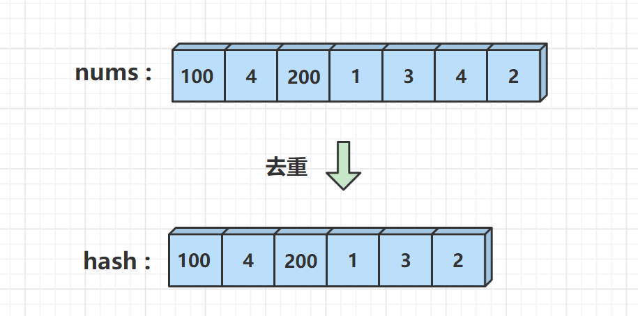

为了保证$O(n)$的时间复杂度，避免重复枚举一段序列，我们要从序列的起始数字向后枚举。也就是说如果有一个`x`, `x+1`, `x+2`,,,, `x+y`的连续序列，我们只会以`x`为起点向后枚举，而不会从`x+1`,`x+2`,,,向后枚举。    

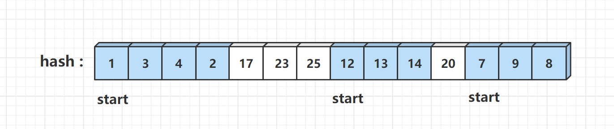

**如何每次只枚举连续序列的起始数字`x`？** 

其实只需要每次在哈希表中检查是否存在 `x−1`即可。如果`x-1`存在，说明当前数`x`不是连续序列的起始数字，我们跳过这个数。

**具体过程如下：**

- 1、定义一个哈希表`hash`，将`nums`数组中的数都放入哈希表中。
- 2、遍历哈希表`hash`，如果当前数`x`的前驱`x-1`不存在，我们就以当前数`x`为起点向后枚举。
- 3、假设最长枚举到了数`y`，那么连续序列长度即为`y-x+1`。
- 4、不断枚举更新答案。

**时间复杂度分析：** `while`循环最多执行$n$次，因此时间复杂度为$O(n)$ 。

**c++代码**

```c++
class Solution {
public:
    int longestConsecutive(vector<int>& nums) {
        unordered_set<int> hash;
        for(auto x : nums) hash.insert(x);    //放入hash表中
        int res = 0;
        for(auto x : hash)
        {
            if(hash.count(x) && !hash.count(x-1))
            {
                int y = x;   //以当前数x向后枚举
                while(hash.count(y + 1)) y++;
                res = max(res, y - x + 1);  //更新答案
            }
        }
        return res;
    }
};
```

**java代码** 

```java
class Solution {
    public int longestConsecutive(int[] nums) {
        Set<Integer> hash = new HashSet<Integer>();
        for(int x : nums) hash.add(x);    //放入hash表中
        int res = 0;
        for(int x : hash)
        {
            if(hash.contains(x) && !hash.contains(x-1))
            {
                int y = x;   //以当前数x向后枚举
                while(hash.contains(y + 1)) y++;
                res = Math.max(res, y - x + 1);  //更新答案
            }
        }
        return res;
    }
}
```

### [221. 最大正方形](https://leetcode-cn.com/problems/maximal-square/) 

**题目**

在一个由 `'0'` 和 `'1'` 组成的二维矩阵内，找到只包含 `'1'` 的最大正方形，并返回其面积。

 **示例 1：**

 

```
输入：matrix = [["1","0","1","0","0"],["1","0","1","1","1"],["1","1","1","1","1"],["1","0","0","1","0"]]
输出：4
```

**示例 2：** 


```
输入：matrix = [["0","1"],["1","0"]]
输出：1
```

**示例 3：**

```
输入：matrix = [["0"]]
输出：0
```

**提示：** 

- `m == matrix.length`
- `n == matrix[i].length`
- `1 <= m, n <= 300`
- `matrix[i][j]` 为 `'0'` 或 `'1'`  

**思路**

**(动态规划)**   $O(nm)$  

**状态表示：** `f[i][j]`表示所有以`(i,j)`为右下角的且只包含`1`的正方形的边长最大值。

**状态计算：**

对于每个位置 `(i, j)`，检查在矩阵中该位置的值：

- 如果该位置的值是 `0`，则 `f[i, j] = 0`，因为当前位置不可能在由 `1` 组成的正方形中。
- 如果该位置的值是 `1`，则 `f[i, j]`的值由其上方、左方和左上方的三个相邻位置的状态值决定。具体而言，当前位置的元素值等于三个相邻位置的元素中的最小值加 `1`。

**状态转移方程：** `f[i,j]=min(f[i−1,j−1],f[i−1,j],f[i,j−1])+1`  

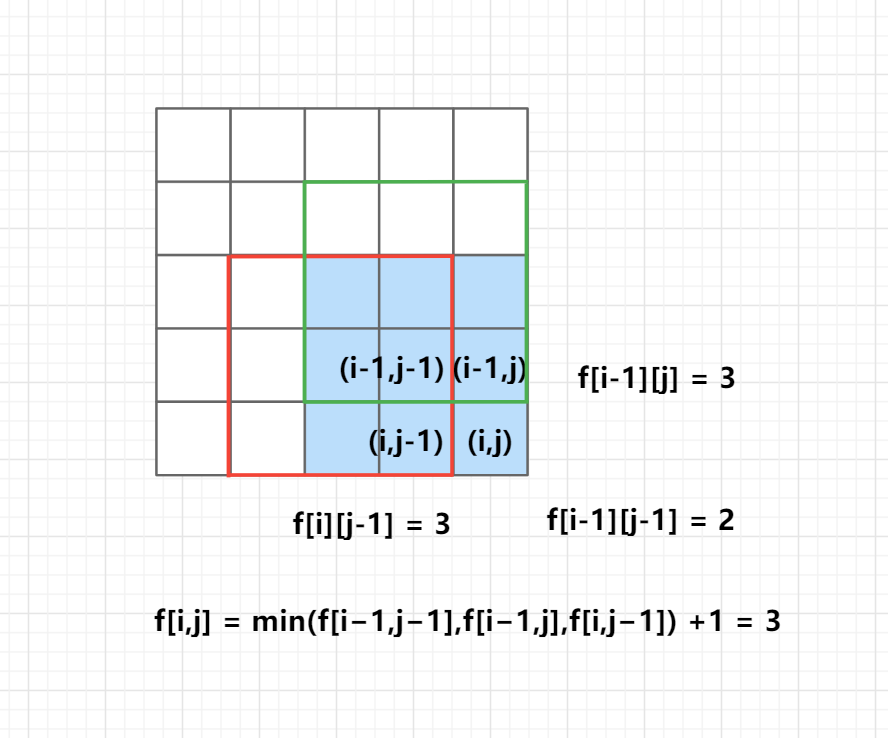

类似于 **[木桶的短板理论](https://baike.baidu.com/item/短板理论)**， 附近的最小边长，才与`(i,j)`的最长边长有关。

**时间复杂度分析：** $O(nm)$，其中 $n$和$m$是矩阵的行数和列数。 

**c++代码**

```c++
class Solution {
public:
    int maximalSquare(vector<vector<char>>& matrix) {
        if (matrix.empty() || matrix[0].empty()) return 0;
        int n = matrix.size(), m = matrix[0].size();
        vector<vector<int>> f(n + 1, vector<int>(m + 1));

        int res = 0;
        for (int i = 1; i <= n; i ++ )
            for (int j = 1; j <= m; j ++ )
                if (matrix[i - 1][j - 1] == '1') {
                    f[i][j] = min(f[i - 1][j], min(f[i][j - 1], f[i - 1][j - 1])) + 1;
                    res = max(res, f[i][j]);
                }

        return res * res;
    }
};
```

**java代码**

```java
class Solution {
    public int maximalSquare(char[][] matrix) {
        if(matrix.length == 0 || matrix[0].length == 0) return 0;
        int n = matrix.length, m = matrix[0].length;
        int[][] f = new int[n + 1][m + 1];
        int res = 0;
        for(int i = 1;i <= n;i ++)
            for(int j = 1;j <= m;j ++)
                if(matrix[i - 1][j - 1] == '1')
                {
                    f[i][j] = Math.min(f[i - 1][j - 1], Math.min(f[i - 1][j], f[i][j - 1])) + 1;
                    res = Math.max(res, f[i][j]);
                }

        return res * res;
    }
}
```

### [328. 奇偶链表](https://leetcode-cn.com/problems/odd-even-linked-list/) 

**题目**

给定一个单链表，把所有的奇数节点和偶数节点分别排在一起。请注意，这里的奇数节点和偶数节点指的是节点编号的奇偶性，而不是节点的值的奇偶性。

请尝试使用原地算法完成。你的算法的空间复杂度应为 $O(1)$，时间复杂度应为 $O(nodes)$，$nodes$ 为节点总数。 

**示例 1:**

```
输入: 1->2->3->4->5->NULL
输出: 1->3->5->2->4->NULL
```

**示例 2:**

```
输入: 2->1->3->5->6->4->7->NULL 
输出: 2->3->6->7->1->5->4->NULL
```

**说明:** 

- 应当保持奇数节点和偶数节点的相对顺序。
- 链表的第一个节点视为奇数节点，第二个节点视为偶数节点，以此类推。

**思路**

**(链表)**  $O(n)$   

根据节点编号的奇偶性，我们可以将奇数节点和偶数节点分离成奇数链表和偶数链表，然后将偶数链表连接在奇数链表之后，合并后的链表即为结果链表。 

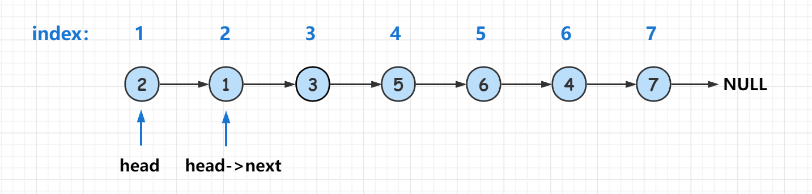

**具体过程如下：**

1、从前往后遍历整个链表，遍历时维护四个指针：奇数链表头结点，奇数链表尾节点，偶数链表头结点，偶数链表尾节点。 

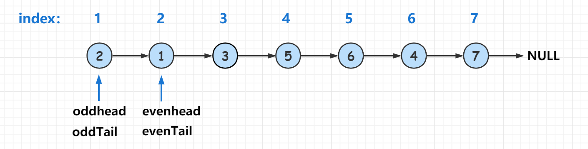

2、遍历时将位置编号是奇数的节点插在奇数链表尾节点后面，将位置编号是偶数的节点插在偶数链表尾节点后面。 

- 具体可以先定义一个`p`指针,让`p`指针向指向链表第三个节点，即`p = head->next->next`。

- 奇数链表尾节点`oddTail`的`next`指针指向`p`节点，并后移一位，即`oddTail = oddTail->next = p`。
- `p`指针后移一位。
- 偶数链表尾节点`evenTail`的`next`指针指向`p`节点, 并后移一位，即`evenTail = evenTail->next = p`。 
- `p`指针后移一位，重复上述过程。

最终我们就将奇偶链表分离开来，如下图所示：

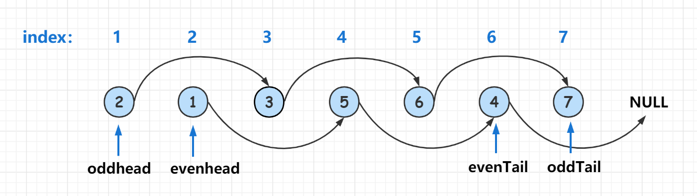


3、遍历完整个链表后，将偶数链表头结点插在奇数链表尾节点后面即可。  

```c++
oddTail->next  = evenHead;  //将偶数链表头结点插在奇数链表尾节点后面
evenTail->next = nullptr;   //偶数链表尾节点指向null
```


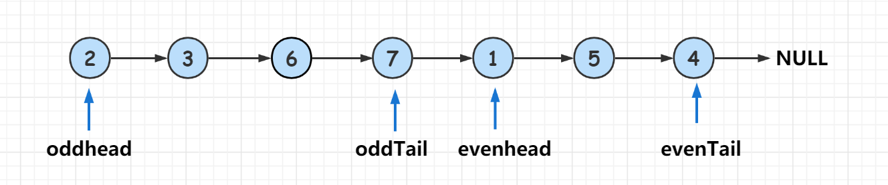

**时间复杂度分析：** 整个链表只遍历一次，所以时间复杂度是$O(n)$，遍历时只记录了常数个额外的指针，所以额外的空间复杂度是 $O(1)$。 

**c++代码 **

```c++
/**
 * Definition for singly-linked list.
 * struct ListNode {
 *     int val;
 *     ListNode *next;
 *     ListNode() : val(0), next(nullptr) {}
 *     ListNode(int x) : val(x), next(nullptr) {}
 *     ListNode(int x, ListNode *next) : val(x), next(next) {}
 * };
 */
class Solution {
public:
    ListNode* oddEvenList(ListNode* head) {
        if(!head || !head->next) return head;
        auto oddHead  = head, oddTail = oddHead;  //定义4个链表指针
        auto evenHead = head->next, evenTail = evenHead;

        for(ListNode* p = head->next->next; p;)
        {
            oddTail = oddTail->next = p;
            p = p->next;
            if(p) //当前节点不为空
            {
                evenTail = evenTail->next = p;
                p = p->next;
            }
        }
        oddTail->next  = evenHead; //将偶数链表头结点插在奇数链表尾节点后面
        evenTail->next = nullptr;
        return oddHead;
    }
};
```

**java代码**

```java
/**
 * Definition for singly-linked list.
 * public class ListNode {
 *     int val;
 *     ListNode next;
 *     ListNode() {}
 *     ListNode(int val) { this.val = val; }
 *     ListNode(int val, ListNode next) { this.val = val; this.next = next; }
 * }
 */
class Solution {
    public ListNode oddEvenList(ListNode head) {
        if(head == null|| head.next == null) return head;
        ListNode oddHead  = head, oddTail = oddHead;  //定义4个链表指针
        ListNode evenHead = head.next, evenTail = evenHead;

        for(ListNode p = head.next.next; p!=null;)
        {
            oddTail = oddTail.next = p;
            p = p.next;
            if(p != null)
            {
                evenTail = evenTail.next = p;
                p = p.next;
            }
        }
        oddTail.next  = evenHead; //将偶数链表头结点插在奇数链表尾节点后面
        evenTail.next = null;
        return oddHead;
    }
}
```

### [169. 多数元素](https://leetcode-cn.com/problems/majority-element/) 

**题目**  

给定一个大小为 `n` 的数组，找到其中的多数元素。多数元素是指在数组中出现次数 **大于** `⌊ n/2 ⌋` 的元素。

你可以假设数组是非空的，并且给定的数组总是存在多数元素。

 **示例 1：**

```
输入：[3,2,3]
输出：3
```

**示例 2：**

```
输入：[2,2,1,1,1,2,2]
输出：2
```

**进阶：** 

- 尝试设计时间复杂度为 $O(n)$、空间复杂度为 $O(1)$ 的算法解决此问题。 

**思路1**

**(哈希表)** $O(n)$ 

1、使用用哈希表记录每个元素出现多少次。

2、判断每个元素出现的次数是否大于$n/2$，如果大于，则返回该数字即可。

**时间复杂度分析：** $O(n)$ 

**空间复杂度分析：** 至少需要额外的 $O(n)$ 空间。 

**c++代码1**

```c++
class Solution {
public:
    int majorityElement(vector<int>& nums) {
        unordered_map<int, int> hash;
        for (int i = 0; i < nums.size(); i++) 
        {
            hash[nums[i]] += 1;
            if (hash[nums[i]] > nums.size() / 2)

                return nums[i];
        }
        return 0;
    }
};
```

**java代码1**

```java
class Solution {
    public int majorityElement(int[] nums) {
        HashMap<Integer, Integer> map = new HashMap<Integer, Integer>();
        int n = nums.length;
        for(int i = 0;i < n;i ++) 
        {
            int x = nums[i];
            map.put(x, map.getOrDefault(x, 0) + 1);
        }
        int res = 0;
        int count = 0;
        for(Map.Entry<Integer, Integer> entry : map.entrySet())
        {
            if(entry.getValue() > count)
            {
                count = entry.getValue();
                res = entry.getKey();
            }
        }
        return res;
    }
}
```

**思路2**

**(投票算法)**  $O(n)$ 

当一个国家的总统候选人`r`的支持率大于50%的话，即使每个反对他的人都给他投一个反对票，抵消掉他的支持票，他的支持票也不会被完全消耗掉。因此，我们可以假定和`r`相同的数都是支持票，和`r`不同的数都是反对票。

维护两个变量：候选人和他的票数

- 1、候选人初始化为`r = 0`，票数`c`初始化为`0`，遍历整个数组
- 2、当候选人的票数为`0`时，更换候选人，并将票数重置为`1`
- 3、当候选人的值和当前元素相同时，票数加`1`，否则减`1`
- 4、最后维护的候选人即是答案

**时间复杂度分析：**  $O(n)$ ，$n$是数组的大小。

**空间复杂度分析：** 仅使用了两个变量，故需要 $O(1)$ 的额外空间。 

**c++代码2**

```c++
class Solution {
public:
    int majorityElement(vector<int>& nums) {
        int r, c = 0;
        for (auto x: nums)
            if (!c) r = x, c = 1;
            else if (r == x) c ++ ;
            else c -- ;
        return r;
    }
};
```

**Java代码2**

```java
class Solution {
    public int majorityElement(int[] nums) {
        int r = 0,c = 0;
        for(int i = 0;i < nums.length;i ++)
        {
            int x = nums[i];
            if(c == 0) { r = x; c = 1; }
            else if(r == x) c ++;
            else c --; 
        }
        return r;
    }
}
```

### [136. 只出现一次的数字](https://leetcode-cn.com/problems/single-number/) 

**题目**

给定一个**非空**整数数组，除了某个元素只出现一次以外，其余每个元素均出现两次。找出那个只出现了一次的元素。

**说明：** 

你的算法应该具有线性时间复杂度。 你可以不使用额外空间来实现吗？

**示例 1:**

```
输入: [2,2,1]
输出: 1
```

**示例 2:**

```
输入: [4,1,2,1,2]
输出: 4
```

**思路**

**(位运算)** $O(n)$ 

异或运算有以下三个性质:

- 1、`0^0 = 0` ，`0^1 = 1`，`0`异或任何数＝任何数
- 2、`1^0 = 1` ，`1^1 = 0`，`1`异或任何数 = 任何数取反
- 3、任何数异或自己＝把自己置`0`，即 `a^a=0`

因此这道题可以用位运算来做，过程如下：

- 1、两个相同的元素经过异或之后会变为`0`。
- 2、将数组所有元素异或在一起即可得到出现 `1` 次的元素值。

**时间复杂度分析：** $O(n)$，其中 $n$ 是数组长度。 

**c++代码** 

```c++
class Solution {
public:
    int singleNumber(vector<int>& nums) {
        int res = 0;
        for(int i = 0; i < nums.size(); i++) res ^= nums[i];
        return res;
    }
};
```

**java代码**

```java
class Solution {
    public int singleNumber(int[] nums) {
        int res = 0;
        for(int i = 0;i < nums.length;i ++) res ^= nums[i];
        return res;
    }
}
```

### [79. 单词搜索](https://leetcode-cn.com/problems/word-search/) 

**题目**

给定一个 `m x n` 二维字符网格 `board `和一个字符串单词 `word` 。如果 `word` 存在于网格中，返回 `true` ；否则，返回 `false` 。

单词必须按照字母顺序，通过相邻的单元格内的字母构成，其中“相邻”单元格是那些水平相邻或垂直相邻的单元格。同一个单元格内的字母不允许被重复使用。

 **示例 1：**

 

```
输入：board = [["A","B","C","E"],["S","F","C","S"],["A","D","E","E"]], word = "ABCCED"
输出：true
```

**示例 2：**

 

```
输入：board = [["A","B","C","E"],["S","F","C","S"],["A","D","E","E"]], word = "SEE"
输出：true
```

**示例 3：**

 

```
输入：board = [["A","B","C","E"],["S","F","C","S"],["A","D","E","E"]], word = "ABCB"
输出：false

```

**提示：**

- `m == board.length`

- `n = board[i].length`
- `1 <= m, n <= 6`
- `1 <= word.length <= 15`
- `board` 和 `word` 仅由大小写英文字母组成 

**思路** 

**(回溯)** $O(n^2 3^k)$ 

深度优先搜索，我们定义这样一种搜索顺序，即先枚举单词的起点，然后依次枚举单词的每个字母。在这个过程中需要将已经使用过的字母改成一个特殊字母，以避免重复使用字符。

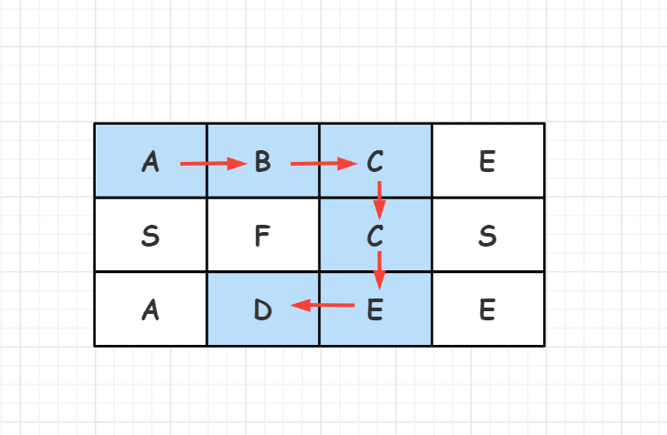

**递归函数设计：**

```c++
bool dfs(vector<vector<char>>& board, string& word,int u,int x,int y)
```

`u`代表当前枚举到了目标单词`word`第`u`个位置。 

`x`，`y`是当前搜索到的二维字符网格的横纵坐标。 

**搜索过程如下：**

- 1、在二维字符网格中枚举每个单词的起点。
- 2、从该起点出发向四周搜索单词`word`，并记录此时枚举到单词`word`的第`u`个位置 ( `u`从`0`开始)。  
- 3、如果当前搜索的位置`(x,y)`的元素`board[x][y] == word[u]`,则继续向四周搜索。
- 4、直到枚举到单词`word`的最后一个字母返回`ture`，否则返回`false`。

**递归边界：** 

- 1、当搜索过程出现当前位置`board[x][y] != word[u]` ，说明当前路径不合法，返回`false`。
- 2、`u == word.size() - 1`,成功搜索到单词末尾，返回`true`。

**实现细节：** 

- 1、搜索过的位置继续搜索下一层时，需要对当前位置进行标识，表示已经搜索

- 2、可以使用偏移数组来简化代码。 

  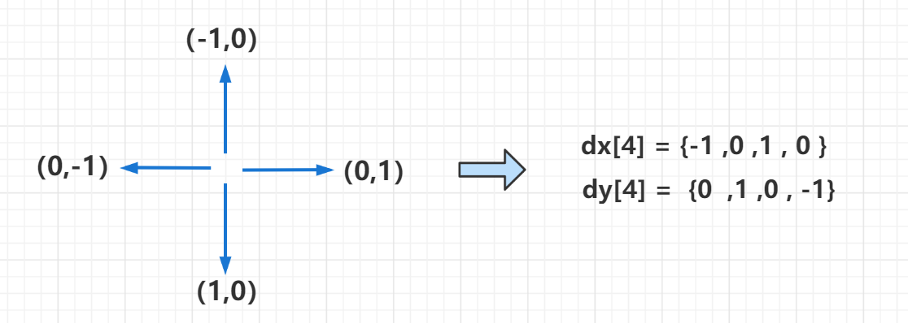

  

**时间复杂度分析：** 单词起点一共有 $n^2$ 个，单词的每个字母一共有上下左右四个方向可以选择，但由于不能走回头路，所以除了单词首字母外，仅有三种选择。所以总时间复杂度是  $O(n^2 3^k)$ 。 

**c++代码** 

```c++
class Solution {
public:
    bool exist(vector<vector<char>>& board, string word) {
        for(int i = 0; i < board.size(); i++)
            for(int j = 0; j < board[i].size(); j++)
                if(dfs(board,word,0,i,j)) return true;
        return false;        
    }
    int dx[4] = {-1,0,1,0}, dy[4] = {0,1,0,-1}; //方向数组
    bool dfs(vector<vector<char>>& board, string& word,int u,int x,int y)
    {
        if(board[x][y] != word[u]) return false;
        if(u == word.size() - 1)   return true;
        char t = board[x][y];
        board[x][y] = '.';
        for(int i = 0; i < 4; i++)
        {
            int a = x + dx[i], b = y + dy[i];
          
            if(a < 0 || a >= board.size() || b < 0 || b >= board[0].size() || board[a][b] == '.')  continue;
            if(dfs(board,word,u+1,a,b)) return true;
        }
        board[x][y] = t;
        return false;
    }
};
```

**java代码** 

```java
class Solution {
    public boolean exist(char[][] board, String word) {
        for(int i = 0; i < board.length; i++)
            for(int j = 0; j < board[i].length; j++)
                if(dfs(board,word,0,i,j)) return true;
        return false;   
    }
    int[] dx = new int[]{-1,0,1,0}, dy = new int[]{0,1,0,-1};
    boolean dfs(char[][] board, String word,int u,int x,int y)
    {
        if(board[x][y] != word.charAt(u)) return false;
        if(u == word.length() - 1)   return true;
        char t = board[x][y];
        board[x][y] = '.';
        for(int i = 0; i < 4; i++)
        {
            int a = x + dx[i], b = y + dy[i];
            if(a < 0 || a >= board.length|| b < 0 || b >= board[0].length || board[a][b] == '.')  continue;
            if(dfs(board,word,u+1,a,b)) return true;
        }
        board[x][y] = t;
        return false;
    }
}
```

### [122. 买卖股票的最佳时机 II](https://leetcode-cn.com/problems/best-time-to-buy-and-sell-stock-ii/) 

**题目**

给定一个数组 `prices` ，其中 `prices[i]` 是一支给定股票第 `i` 天的价格。

设计一个算法来计算你所能获取的最大利润。你可以尽可能地完成更多的交易（多次买卖一支股票）。

**注意：**你不能同时参与多笔交易（你必须在再次购买前出售掉之前的股票） 

**示例 1:**

```
输入: prices = [7,1,5,3,6,4]
输出: 7
解释: 在第 2 天（股票价格 = 1）的时候买入，在第 3 天（股票价格 = 5）的时候卖出, 这笔交易所能获得利润 = 5-1 = 4 。
     随后，在第 4 天（股票价格 = 3）的时候买入，在第 5 天（股票价格 = 6）的时候卖出, 这笔交易所能获得利润 = 6-3 = 3 。
```

**示例 2:**

```
输入: prices = [1,2,3,4,5]
输出: 4
解释: 在第 1 天（股票价格 = 1）的时候买入，在第 5 天 （股票价格 = 5）的时候卖出, 这笔交易所能获得利润 = 5-1 = 4 。
     注意你不能在第 1 天和第 2 天接连购买股票，之后再将它们卖出。因为这样属于同时参与了多笔交易，你必须在再次购买前出售掉之前的股票。

```

**示例 3:**

```
输入: prices = [7,6,4,3,1]
输出: 0
解释: 在这种情况下, 没有交易完成, 所以最大利润为 0。
```

**提示：**

- `1 <= prices.length <= 3 * 104`
- `0 <= prices[i] <= 104` 

**思路**

**(贪心)**  $O(n)$ 

对于`[i,j]`这一区间，我们知道: `p[j] - p[i]= (p[i+1] - p[i]) + (p[i+2] - p[i+1])+ ... + (p[j] - p[j-1])` 。如果我们每个长度为 `1`的区间都取正数，这样我们得到的`p[j] - p[i]`价值一定是最大的。

因此我们考虑相邻两天的股票价格，如果后一天的股票价格大于前一天的，那么在进行买入卖出操作后，即可获利。而且这样在不考虑交易次数的前提下，这样的贪心一定能获得最大的利润。  

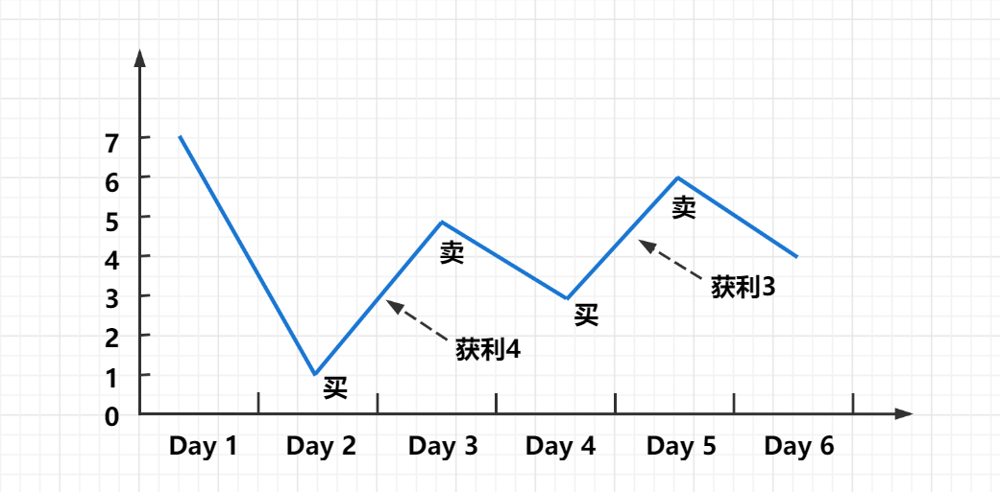

**具体过程如下：**

- 1、枚举整个数组，如果发现`preprices[i + 1] > prices[i]`，我们就在第`i`天买入，第`i+1`天卖出，并将利润`preprices[i + 1] -prices[i]`记录到答案`res`中。
- 2、返回总利润`res`。

**时间复杂度分析：**   $O(n)$ ，$n$是数组的长度。 

**c++代码**

```c++
class Solution {
public:
    int maxProfit(vector<int>& prices) {
        int res = 0;
        for(int i = 0; i < prices.size() - 1; i++)
            if(prices[i + 1] > prices[i])
                res += prices[i + 1] - prices[i];
        return res;
    }
};
```

**java代码**

```java
class Solution {
    public int maxProfit(int[] prices) {
        int res = 0;
        for(int i = 0; i < prices.length - 1; i++)
            if(prices[i + 1] > prices[i])
                res += prices[i + 1] - prices[i];
        return res;
    }
}
```

### [22. 括号生成](https://leetcode-cn.com/problems/generate-parentheses/) 

**题目**

数字 `n` 代表生成括号的对数，请你设计一个函数，用于能够生成所有可能的并且 **有效的** 括号组合。

**示例 1：**

```‘
输入：n = 3
输出：["((()))","(()())","(())()","()(())","()()()"]
```

**示例 2：**

```
输入：n = 1
输出：["()"]
```

**提示：**

- `1 <= n <= 8` 

**思路**

**(dfs)**  $O(C_{2n}^{n})$ 

首先我们需要知道一个结论，一个合法的括号序列需要满足两个条件：

- 1、左右括号数量相等 
- 2、任意前缀中左括号数量 `>=` 右括号数量  （也就是说每一个右括号总能找到相匹配的左括号）

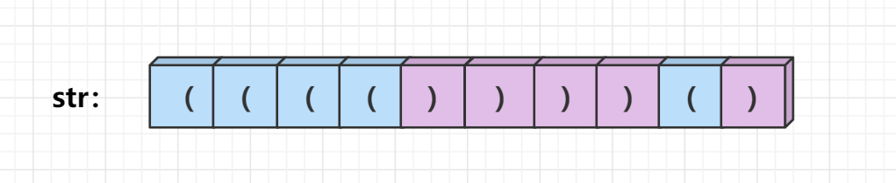

题目要求我们生成`n`对的合法括号序列组合，可以考虑使用深度优先搜索，将搜索顺序定义为枚举序列的每一位填什么，那么最终的答案一定是有`n`个左括号和`n`个右括号组成。

**如何设计`dfs`搜索函数？** 

最关键的问题在于搜索序列的当前位时，是选择填写左括号，还是选择填写右括号 ？因为我们已经知道合法的括号序列任意前缀中左括号数量一定 `>=` 右括号数量，因此，如果左括号数量不大于 `n`，我们可以放一个左括号，等待一个右括号来匹配 。如果右括号数量小于左括号的数量，我们可以放一个右括号，来使一个右括号和一个左括号相匹配。 

**递归树如下：** 

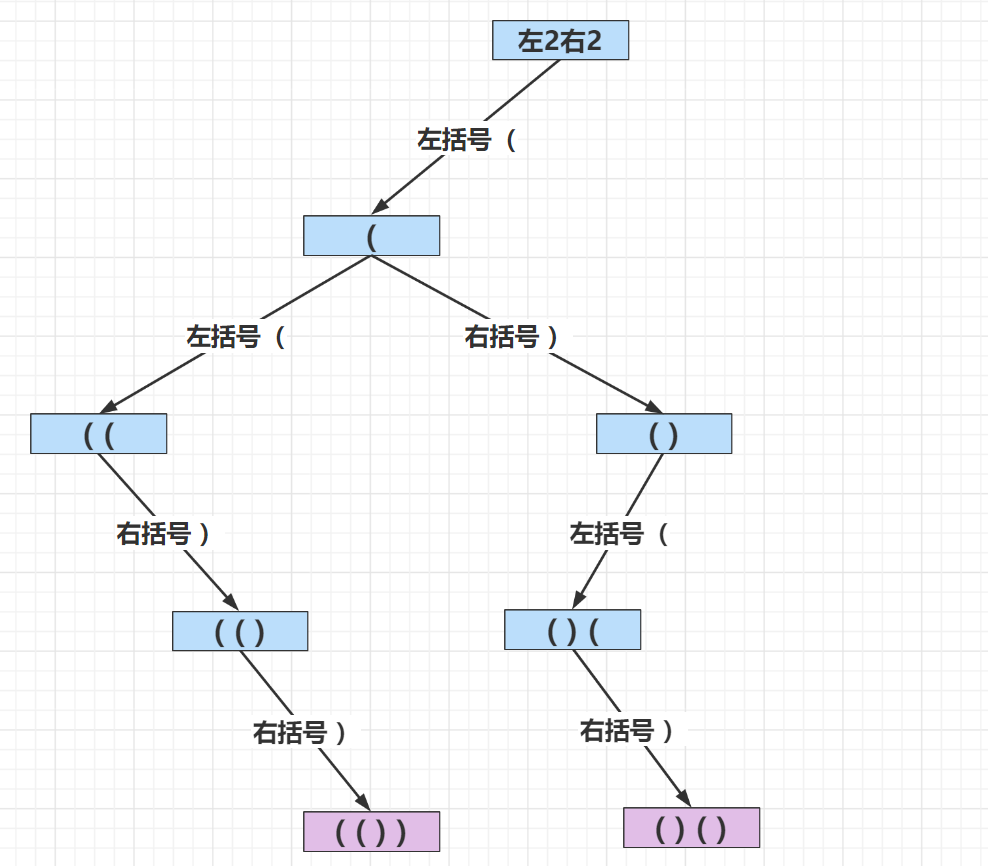

**递归函数设计**

```c++
void dfs(int n ,int lc, int rc ,string str)
```

`n`是括号对数，`lc`是左括号数量，`rc`是右括号数量，`str`是当前维护的合法括号序列。

**搜索过程如下：** 

- 1、初始时定义序列的左括号数量`lc` 和右括号数量`rc`都为`0`。
- 2、如果 `lc < n`，左括号的个数小于`n`，则在当前序列`str`后拼接左括号。
- 3、如果 `rc < n && lc > rc` , 右括号的个数小于左括号的个数，则在当前序列`str`后拼接右括号。
- 4、当`lc == n && rc == n` 时，将当前合法序列`str`加入答案数组`res`中。 

**时间复杂度分析：**经典的卡特兰数问题，因此时间复杂度为  $O(\frac{1}{n+1}C_{2n}^{n}) = O(C_{2n}^n)$ 。

**c++代码**

```c++
class Solution {
public:
    vector<string> res; //记录答案 
    vector<string> generateParenthesis(int n) {
        dfs(n , 0 , 0, "");
        return res;
    }
    void dfs(int n ,int lc, int rc ,string str)
    {
        if( lc == n && rc == n) res.push_back(str);   
        else
        {
            if(lc < n) dfs(n, lc + 1, rc, str + "(");
            if(rc < n && lc > rc) dfs(n, lc, rc + 1, str + ")");
        }
    }
};
```

**java代码**

```java
class Solution {
    static List<String> res = new ArrayList<String>();  //记录答案 

    public List<String> generateParenthesis(int n) {
        res.clear();
        dfs(n, 0, 0, "");
        return res;
    }
    public void dfs(int n ,int lc, int rc ,String str)
    {
        if( lc == n && rc == n) res.add(str);   
        else
        {
            if(lc < n) dfs(n, lc + 1, rc, str + "(");
            if(rc < n && lc > rc) dfs(n, lc, rc + 1, str + ")");
        }
    }
}
```

### [129. 求根节点到叶节点数字之和](https://leetcode-cn.com/problems/sum-root-to-leaf-numbers/) 

**题目** 

给你一个二叉树的根节点 `root`，树中每个节点都存放有一个 `0` 到 `9` 之间的数字。
每条从根节点到叶节点的路径都代表一个数字：

- 例如，从根节点到叶节点的路径 `1 -> 2 -> 3` 表示数字 `123` 。

计算从根节点到叶节点生成的 **所有数字之和** 。 

**叶节点** 是指没有子节点的节点。

**示例 1：**

 

```
输入：root = [1,2,3]
输出：25
解释：
从根到叶子节点路径 1->2 代表数字 12
从根到叶子节点路径 1->3 代表数字 13
因此，数字总和 = 12 + 13 = 25
```

**示例 2：**

 

```
输入：root = [4,9,0,5,1]
输出：1026
解释：
从根到叶子节点路径 4->9->5 代表数字 495
从根到叶子节点路径 4->9->1 代表数字 491
从根到叶子节点路径 4->0 代表数字 40
因此，数字总和 = 495 + 491 + 40 = 1026
```

**提示：**

- 树中节点的数目在范围 `[1, 1000]` 内
- `0 <= Node.val <= 9`
- 树的深度不超过 `10`

**思路**

**(dfs,树的遍历)** $O(n)$

从根节点递归遍历整棵树，遍历时维护从根节点到该节点的路径表示的数，当遍历到叶节点时，将路径表示的数累加到答案中。

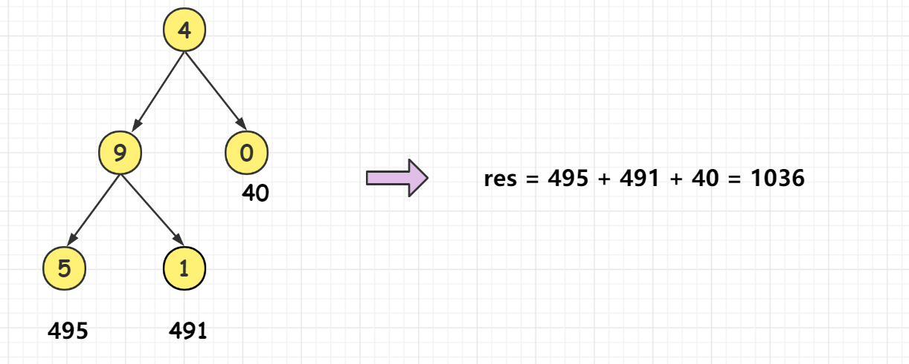

**递归函数设计：**

```c++
void dfs(TreeNode* root, int number)
```

`root`是当前遍历的节点，`number`是从根节点到当前节点路径表示的数。

**递归过程如下：**

- 1、从根节点开始往下遍历，维护一个从根节点到当前节点表示的数`number`，初始值为`0`。 
- 2、遍历当前节点`root`，将`root->val`追加到`number`中，即执行 `number = number * 10 + root->val`操作。
- 3、如果左子树不为空，递归到左子树。如果右子树不为空，递归到右子树。
- 4、当遍历到叶节点时，将`number`加入到数字之和`res`中。
- 5、最后返回`res`。

**时间复杂度分析：** $O(n)$，其中 $n$是二叉树的节点个数，对每个节点访问一次。 

**c++代码**

```c++
class Solution {
public:
    int res = 0;
    int sumNumbers(TreeNode* root) {
        dfs(root, 0);
        return res;
    }
    void dfs(TreeNode* root, int number)
    {
        number = number * 10 + root->val;
        if(!root->left && !root->right)  res += number;  //叶节点
        if(root->left)  dfs(root->left,number);			 //递归左子树
        if(root->right) dfs(root->right,number);	     //递归右子树		
    }
};
```

**java代码**

```java
class Solution {

    int res = 0;
    public int sumNumbers(TreeNode root) {
        dfs(root, 0);
        return res;
    }
    public void dfs(TreeNode root, int number)
    {
        number = number * 10 + root.val;
        if(root.left == null && root.right == null)  res += number; //叶节点
        if(root.left != null)  dfs(root.left,number);				//递归左子树
        if(root.right != null) dfs(root.right,number);				//递归右子树
    }
}
```

### [24. 两两交换链表中的节点](https://leetcode-cn.com/problems/swap-nodes-in-pairs/)

**题目** 

给定一个链表，两两交换其中相邻的节点，并返回交换后的链表。

**你不能只是单纯的改变节点内部的值**，而是需要实际的进行节点交换。

**示例 1：**

 

```
输入：head = [1,2,3,4]
输出：[2,1,4,3]
```

**示例 2：**

```
输入：head = []
输出：[]
```

**示例 3：**

```
输入：head = [1]
输出：[1]
```

**提示：**

- 链表中节点的数目在范围 `[0, 100]` 内
- `0 <= Node.val <= 100`

**思路**

**(模拟)**  $O(n)$ 

由于可能会对头节点进行改变，因此需要建立一个虚拟头结点`dummy`，指向原来的头节点。

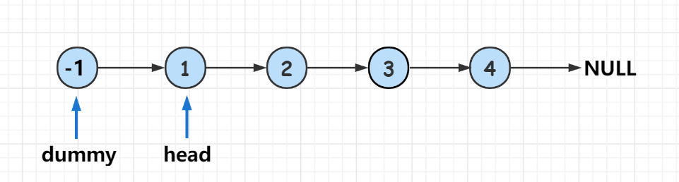

根据题意进行模拟迭代，两两交换相邻两个结点，如**下图所示：** 

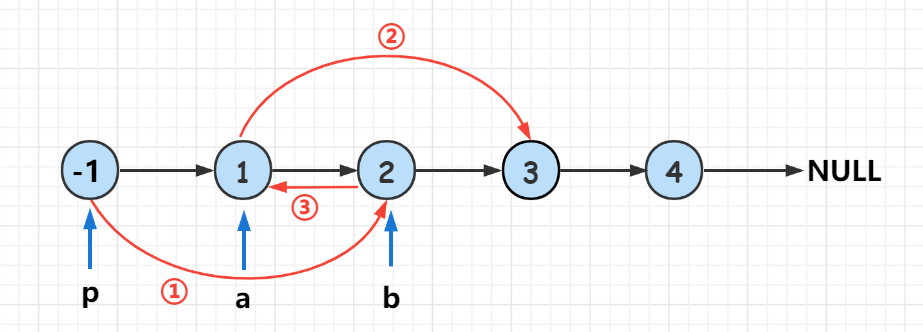

**具体过程详解：**

- 1、首先定义`p = dummy`，`a = p->next`，`b =  a->next`。

- 2、遍历整个链表，第一步先将`p`的`next`指针指向`b`，即`p->next = b`。

- 3、然后将`a`的`next`指向`b->next`，即`a->next = b->next`。

- 4、最后将`b`的`next`指向`a`，即`b->next = a`。

  经过上述操作以后，我们就成功交换了`a`，`b`节点，然后让`p`指向`a`节点，重复上述操作即可。


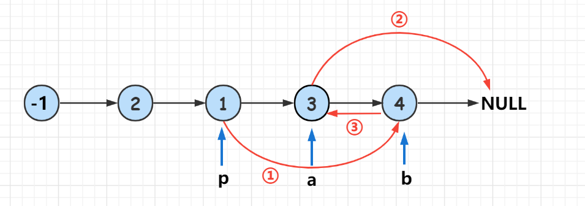

- 5、最后返回虚拟头节点的下一个节点

**时间复杂度分析：** $O(n)$，其中 $n$是链表的节点数量。 

**c++代码**

```c++
class Solution {
public:
    ListNode* swapPairs(ListNode* head) {
        ListNode*  dummy = new ListNode(-1);  //虚拟头节点
        dummy->next = head;
        for(auto p = dummy; p->next && p->next->next; )
        {
            auto a = p->next, b = a->next;
            p->next = b;
            a->next = b->next;
            b->next = a;
            p = a;
        }
        return dummy->next;
    }
};
```

**java代码**

```java
class Solution {
    public ListNode swapPairs(ListNode head) {
        ListNode dummy = new ListNode(0);
        dummy.next = head;
        for(ListNode p = dummy; p.next != null && p.next.next != null;)
        {
            ListNode a = p.next;	//虚拟头节点
            ListNode b = a.next;
            p.next = b;
            a.next = b.next;
            b.next = a;
            p = a;
        }
        return dummy.next;
    }
}
```

### [227. 基本计算器 II](https://leetcode-cn.com/problems/basic-calculator-ii/) 

**题目**

给你一个字符串表达式 `s` ，请你实现一个基本计算器来计算并返回它的值。

整数除法仅保留整数部分。

**示例 1：**

```
输入：s = "3+2*2"
输出：7
```

**示例 2：**

```
输入：s = " 3/2 "
输出：1
```

**示例 3：**

```
输入：s = " 3+5 / 2 "
输出：5
```

**提示：**

- `1 <= s.length <= 3 * 105`
- `s` 由整数和算符 `('+', '-', '*', '/')` 组成，中间由一些空格隔开
- `s` 表示一个 **有效表达式** 
- 表达式中的所有整数都是非负整数，且在范围 `[0, 2^31 - 1]` 内
- 题目数据保证答案是一个 **32-bit 整数** 

**思路** 

**(栈,表达式求值)**  $O(n)$ 

对于表达式求值这类问题，我们维护两个栈，一个`num`栈用来记录数字，一个`op`栈用来记录操作符，遍历表达式，遇到操作符时进行数的相应计算。

首先我们定义一个`eval()`函数，用于从数字栈`num`中弹出两个数字`a`和`b`，再从操作符栈`op`中弹出操作符号，进行计算后将结果数字加入到数字栈`num`中。 

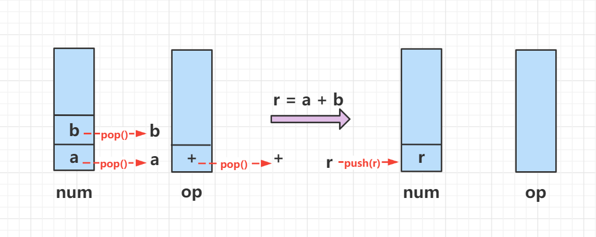

**具体定义如下：** 

```c++
void eval() 
{
    int b = num.top(); num.pop();
    int a = num.top(); num.pop();
    char c = op.top(); op.pop();
    int r;
    if (c == '+') r = a + b;
    else if (c == '-') r = a - b;
    else if (c == '*') r = a * b;
    else r = a / b;
    num.push(r);
}
```

**然后我们从前往后扫描整个表达式：** 

- 1、当遇到空格` ' '`时，跳过。  

- 2、当遇到数字时，则读取一个连续的完整数字，再将其加入到数字栈`num`中。
- 3、当遇到`'+'`，`'-'`，`'*'`，`'/'` 运算符时，需要考虑优先级：
  - 如果操作符栈`op`的栈顶元素的优先级比当前遇到的操作符优先级高，则`while`循环进行`eval()`操作，即将数字栈`num`栈顶的两个元素取出来，然后和操作符栈`op`的栈顶操作符进行相应计算，并将计算结果压回数字栈`num`中。
  - 否则，将当前运算符压入操作符栈`op`中。
- 4、扫描完整个表达式后，如果操作符栈`op`中还存在元素，则`while`循环进行`eval()`操作。
- 5、最终返回数字栈`num`的栈顶元素值。

**图示过程： ** 

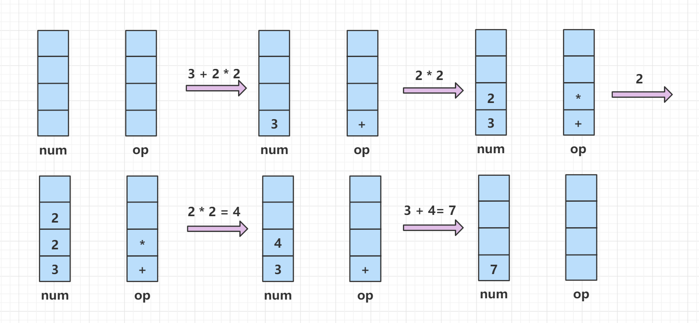

**细节处理：**

- 1、由于运算符有优先级，所以设计一个哈希表来存储`'+'`，`'-'`，`'*'`，`'/'` 优先级，我们将`'+'`和`'-'`设为`1`级优先级，将`'*'`和`'/'`设为`2`级优先级。
- 2、考虑到表达式`s`的第一个数字可能为负数，因此我们给`s`开头添加一个字符`0`。

**时间复杂度分析：** 每个数字和操作进栈出栈一次，所以总的时间复杂度是 $O(n)$ 。

**c++代码**

```c++
class Solution {
public:
    stack<int> num;  //存贮数字
    stack<char> op;  //存贮操作

    void eval() 
    {
        int b = num.top(); num.pop();
        int a = num.top(); num.pop();
        char c = op.top(); op.pop();
        int r;
        if (c == '+') r = a + b;
        else if (c == '-') r = a - b;
        else if (c == '*') r = a * b;
        else r = a / b;
        num.push(r);
    }

    int calculate(string s) {
        s = '0' + s;  // 对开头是负数的处理 
        unordered_map<char, int> pr; 
        pr['+'] = pr['-'] = 1, pr['*'] = pr['/'] = 2; //定义运算符的优先级
        for(int i = 0; i < s.size(); i++)
        {
            char c = s[i]; 
            if(c == ' ') continue;  //跳过空格
            if(isdigit(c))     //c是数字,读取一个连续的数字
            {
                int x = 0, j = i;
                while(j < s.size() && isdigit(s[j])) x = x * 10 + (s[j++] - '0');
                num.push(x);    //加入数字栈中
                i = j - 1;        
            }
            else  //c是操作符 
            {     //op栈非空并且栈顶操作符优先级大于等于当前操作符c的优先级，进行eval()计算
                while(op.size() && pr[op.top()] >= pr[c]) eval(); 
                op.push(c);
            }
        }
        while(op.size()) eval(); 
        return num.top();
    }
};
```

**java代码**

```java
class Solution {
    static Stack<Integer> num = new Stack<Integer>();
    static Stack<Character> op = new Stack<Character>();
    static HashMap<Character, Integer> map = new HashMap<Character, Integer>();
    static void eval()
    {
        int b = num.pop();
        int a = num.pop();
        char c = op.pop();
        int r = 0;
        if(c == '+') r = a + b;
        else if(c == '-') r = a - b;
        else if(c == '*') r = a * b;
        else r = a / b;
        num.add(r); 
    }
    public int calculate(String s) {
        s = '0' + s; // 对开头是负数的处理 
        map.put('+', 1);   //定义运算符的优先级
        map.put('-', 1);
        map.put('*', 2);
        map.put('/', 2);
        for(int i = 0; i < s.length();i ++)
        {
            char c = s.charAt(i);
            if(c == ' ') continue;  //跳过空格
            if(c >= '0' && c <= '9')  //c是数字,读取一个连续的数字
            {
                int x = 0, j = i;
                while(j < s.length() && s.charAt(j) >= '0' && s.charAt(j) <= '9')
                {
                    x = x * 10 + s.charAt(j) - '0';
                    j ++;
                }
                i = j - 1;
                num.add(x);
            }
            else  //c是操作符 
            {     //op栈非空并且栈顶操作符优先级大于等于当前操作符c的优先级，进行eval()计算
                while(!op.isEmpty() && map.get(op.peek()) >= map.get(c)) eval();
                op.add(c); 
            }
        }
        while(!op.isEmpty()) eval();
        return num.pop();
    }
}
```

### [34. 在排序数组中查找元素的第一个和最后一个位置](https://leetcode-cn.com/problems/find-first-and-last-position-of-element-in-sorted-array/) 

**题目** 

给定一个按照升序排列的整数数组 `nums`，和一个目标值 `target`。找出给定目标值在数组中的开始位置和结束位置。

如果数组中不存在目标值 `target`，返回 `[-1, -1]`。

**进阶：**

- 你可以设计并实现时间复杂度为 `O(log n)` 的算法解决此问题吗？

**示例 1：**

```
输入：nums = [5,7,7,8,8,10], target = 8
输出：[3,4]
```

**示例 2：**

```
输入：nums = [5,7,7,8,8,10], target = 6
输出：[-1,-1]
```

**示例 3：**

```
输入：nums = [], target = 0
输出：[-1,-1]
```

**提示：**

- `0 <= nums.length <= 105`
- `-109 <= nums[i] <= 109`
- `num` 是一个非递减数组
- `-109 <= target <= 109`

**思路**

**(二分)**  $O(logn)$  

在一个范围内，查找一个数字，要求找到这个元素的开始位置和结束位置，这个范围内的数字都是单调递增的，即具有单调性质，因此可以使用二分来做。 

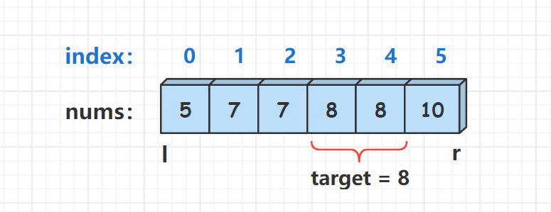

两次二分，第一次二分查找第一个`>=target`的位置，第二次二分查找最后一个`<=target`的位置。查找成功则返回两个位置下标，否则返回`[-1,-1]`。

**二分模板：** 

当我们将区间`[l, r]`划分成`[l, mid]`和`[mid + 1, r]`时，其更新操作是`r = mid`或者`l = mid + 1`，计算`mid`时不需要加`1`，即`mid = (l + r)/2`。 

**C++/java代码模板：**

```c++
int bsearch_1(int l, int r)
{
    while (l < r)
    {
        int mid = (l + r)/2;
        if (check(mid)) r = mid;
        else l = mid + 1;
    }
    return l;
}
```

**版本2**

当我们将区间`[l, r]`划分成`[l, mid - 1]`和`[mid, r]`时，其更新操作是`r = mid - 1`或者`l = mid`，此时为了防止死循环，计算`mid`时需要加`1`，即`mid = ( l + r + 1 ) /2`。 

**C++/java 代码模板：** 

```c++
int bsearch_2(int l, int r)
{
    while (l < r)
    {
        int mid = ( l + r + 1 ) /2;
        if (check(mid)) l = mid;
        else r = mid - 1;
    }
    return l;
}
```

**代码模板链接：**https://www.acwing.com/blog/content/31/  **y总，yyds。** 

**为什么两个二分模板的`mid`取值不同？** 

对于第二个模板，当我们更新区间时，如果左边界`l`更新为`l = mid`，此时`mid`的取值就应为`mid = (l + r + 1)/ 2`。因为当右边界`r = l + 1`时，此时`mid = (l + l + 1)/2`，相当于下取整，`mid`为`l`，左边界再次更新为`l = mid = l`，相当于没有变化。`while`循环就会陷入死循环。因此，我们总结出来一个小技巧，当左边界要更新为`l = mid`时，我们就令 `mid =(l + r + 1)/2`，相当于上取整，此时就不会因为`r`取特殊值` r = l + 1`而陷入死循环了。

而对于第一个模板，如果左边界`l`更新为`l = mid + 1`，是不会出现这样的困扰的。因此，大家可以熟记这两个二分模板，基本上可以解决`99%`以上的二分问题，再也不会被二分的边界取值所困扰

**第一次**

- 1、二分的范围，`l = 0`， `r = nums.size() - 1`，我们去二分查找`>=target`的最左边界。

- 2、当`nums[mid] >= target`时，往左半区域找，`r = mid`。

  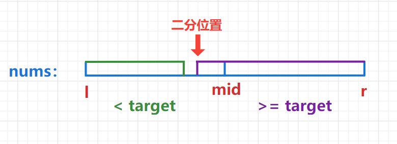

- 3、当`nums[mid] < target`时，  往右半区域找，`l = mid + 1`。

  

- 4、如果` nums[r] != target`，说明数组中不存在目标值 `target`，返回 `[-1, -1]`。否则我们就找到了第一个`>=target`的位置`L`。

**第二次**

- 1、二分的范围，`l = 0`， `r = nums.size() - 1`，我们去二分查找`<=target`的最右边界。

- 2、当`nums[mid] <= target`时，往右半区域找，`l = mid`。

  

- 3、当`nums[mid] > target`时，  往左半区域找，`r = mid - 1`。 

  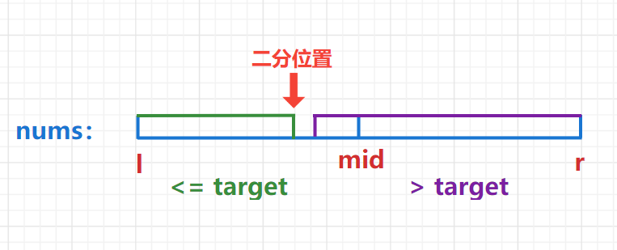

- 4、找到了最后一个`<=target`的位置`R`，返回区间`[L,R]`即可。

**时间复杂度分析：** 两次二分查找的时间复杂度为 $O(logn)$。

**c++代码**

```c++
class Solution {
public:
    vector<int> searchRange(vector<int>& nums, int target) {
        if(nums.empty()) return {-1,-1};
    
        int l = 0, r = nums.size() - 1; //二分范围
        while( l < r)			//查找元素的开始位置
        {
            int mid = (l + r )/2;
            if(nums[mid] >= target) r = mid;
            else l = mid + 1;
        }
        if( nums[r] != target) return {-1,-1};
        int L = r;
        l = 0, r = nums.size() - 1;
        while( l < r)          //查找元素的结束位置
        {
            int mid = (l + r + 1)/2;
            if(nums[mid] <= target ) l = mid;
            else r = mid - 1;
        }
        return {L,r};
    }
};
```

**java代码**

```java
class Solution {
    public int[] searchRange(int[] nums, int target) {
        if(nums.length == 0) return new int[]{-1,-1};
    
        int l = 0, r = nums.length - 1; //二分范围
        while( l < r)			//查找元素的开始位置
        {
            int mid = (l + r )/2;
            if(nums[mid] >= target) r = mid;
            else l = mid + 1;
        }
        if( nums[r] != target) return new int[]{-1,-1};
        int L = r;
        l = 0; r = nums.length - 1;
        while( l < r)			//查找元素的结束位置
        {
            int mid = (l + r + 1)/2;
            if(nums[mid] <= target ) l = mid;
            else r = mid - 1;
        }
        return new int[]{L,r};
    }
}
```

### [240. 搜索二维矩阵 II](https://leetcode-cn.com/problems/search-a-2d-matrix-ii/) 

**题目**

编写一个高效的算法来搜索 `m x n` 矩阵 `matrix` 中的一个目标值 `target` 。该矩阵具有以下特性：

- 每行的元素从左到右升序排列。
- 每列的元素从上到下升序排列。

**示例 1： **

 

```
输入：matrix = [[1,4,7,11,15],[2,5,8,12,19],[3,6,9,16,22],[10,13,14,17,24],[18,21,23,26,30]], target = 5
输出：true
```

**示例 2：**

 

```
输入：matrix = [[1,4,7,11,15],[2,5,8,12,19],[3,6,9,16,22],[10,13,14,17,24],[18,21,23,26,30]], target = 20
输出：false
```

**提示：**

- `m == matrix.length`
- `n == matrix[i].length`
- `1 <= n, m <= 300`
- `-109 <= matix[i][j] <= 109`
- 每行的所有元素从左到右升序排列 
- 每列的所有元素从上到下升序排列
- `-109 <= target <= 10^9`

**思路**

**(单调性扫描)** $O(n+m)$

在`m x n`矩阵 `matrix`中我们可以发现一个性质：对于每个子矩阵右上角的数`x`，`x`左边的数都小于等于`x`，`x`下边的数都大于`x`。 

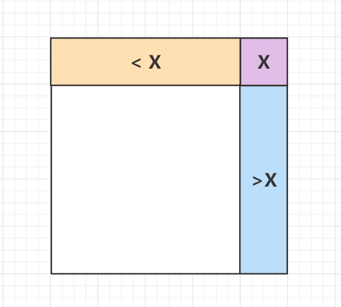 


因此我们可以从整个矩阵的右上角开始枚举，假设当前枚举的数是 `x`：

- 如果 `x` 等于`target`，则说明我们找到了目标值，返回`true`；
- 如果 `x`小于`target`，则 `x`左边的数一定都小于`target`，我们可以直接排除当前一整行的数；
- 如果` x` 大于`target`，则 `x` 下边的数一定都大于`target`，我们可以直接排序当前一整列的数；

排除一整行就是让枚举的点的横坐标加一，排除一整列就是让纵坐标减一。当我们排除完整个矩阵后仍没有找到目标值时，就说明目标值不存在，返回`false`。

**具体过程如下：** 

- 1、初始化`i = 0`, `j = matrix[0].size() - 1`。
- 2、如果`matrix[i][j] == target`，返回`true`。
- 3、如果`matrix[i][j] < target`，`i++`，排除一行。
- 4、如果`matrix[i][j] > target`，`j--`，排除一列。
- 5、如果出界还未找到`target`，则返回`false`。

**时间复杂度分析：** 每一步会排除一行或者一列，矩阵一共有 $n$ 行，$m$ 列，所以最多会进行$ n+m $步。所以时间复杂度是 $O(n+m)$。

**c++代码**

```c++
class Solution {
public:
    bool searchMatrix(vector<vector<int>>& matrix, int target) {
        if(!matrix.size() && !matrix[0].size()) return false;
        int i = 0, j = matrix[0].size() - 1;  //矩阵右上角
        while(i < matrix.size() && j >= 0)
        {
            if(matrix[i][j] == target)  return true;
            else if( matrix[i][j] < target) i++;  //排除一行
            else if( matrix[i][j] > target) j--;  //排除一列
        }
        return false;
    }
};
```

**java代码**

```java
class Solution {
    public boolean searchMatrix(int[][] matrix, int target) {
        if(matrix.length == 0 && matrix[0].length == 0) return false;
        int i = 0, j = matrix[0].length - 1;  //矩阵右上角
        while(i < matrix.length && j >= 0)
        {
            if(matrix[i][j] == target)  return true;
            else if( matrix[i][j] < target) i++;  //排除一行
            else if( matrix[i][j] > target) j--;  //排除一列
        }
        return false;
    }
}
```

### [72. 编辑距离](https://leetcode-cn.com/problems/edit-distance/) 

**题目**

给你两个单词 `word1` 和 `word2`，请你计算出将 `word1` 转换成 `word2` 所使用的最少操作数 。

你可以对一个单词进行如下三种操作：

- 插入一个字符
- 删除一个字符
- 替换一个字符

**示例 1：**

```
输入：word1 = "horse", word2 = "ros"
输出：3
解释：
horse -> rorse (将 'h' 替换为 'r')
rorse -> rose (删除 'r')
rose -> ros (删除 'e')
```

**示例 2：**

```
输入：word1 = "intention", word2 = "execution"
输出：5
解释：
intention -> inention (删除 't')
inention -> enention (将 'i' 替换为 'e')
enention -> exention (将 'n' 替换为 'x')
exention -> exection (将 'n' 替换为 'c')
exection -> execution (插入 'u')
```

**提示：**

- `0 <= word1.length, word2.length <= 500`
- `word1` 和 `word2` 由小写英文字母组成 

**思路**

**c++代码**

```c++
class Solution {
public:
    int minDistance(string a, string b) {
        int n = a.size(), m = b.size();
        a = ' ' + a, b =  ' ' + b;  //让单词下标从1开始
        vector<vector<int>>f(n + 1, vector<int>(m + 1, 1e8));

        for(int i = 0; i <= n; i++)  f[i][0] = i;
        for(int i = 0; i <= m; i++)  f[0][i] = i;

        for(int i = 1;i <= n; i++)
            for(int j = 1; j <= m; j++)
            {
                f[i][j] = min(f[i - 1][j] , f[i][j - 1]) + 1;
                int t = a[i] != b[j];
                f[i][j] = min(f[i][j] , f[i - 1][j - 1] + t);
            }
        return f[n][m];
    }
};
```

**java代码**

```java
class Solution {
    public int minDistance(String a, String b) {
        int n = a.length(), m = b.length();
        a = ' ' + a; b =  ' ' + b;  //让单词下标从1开始
        int[][] f = new int[n + 1][m + 1];

        for(int i = 0; i <= n; i++)  f[i][0] = i;
        for(int i = 0; i <= m; i++)  f[0][i] = i;

        for(int i = 1;i <= n; i++)
            for(int j = 1; j <= m; j++)
            {
                f[i][j] = Math.min(f[i - 1][j] , f[i][j - 1]) + 1;
                if(a.charAt(i) == b.charAt(j)) f[i][j] = Math.min(f[i][j], f[i - 1][j - 1]);
                else f[i][j] = Math.min(f[i][j], f[i - 1][j - 1] + 1);
            }
        return f[n][m];
    }
}
```

