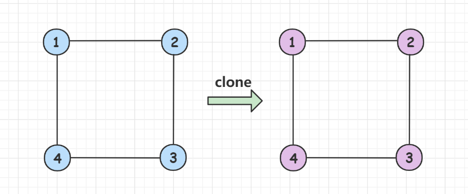
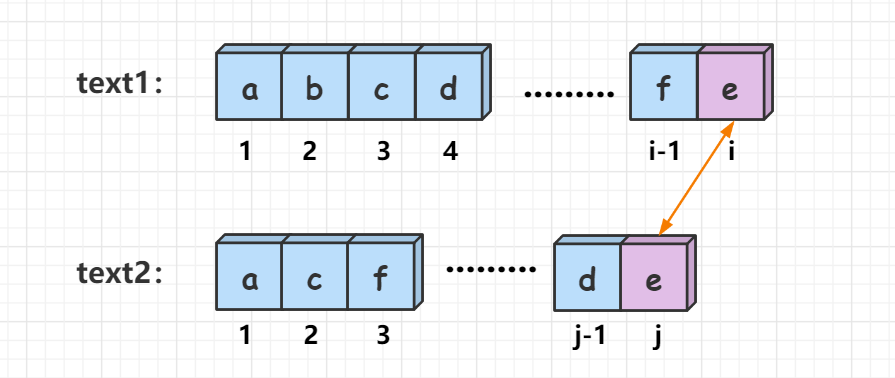
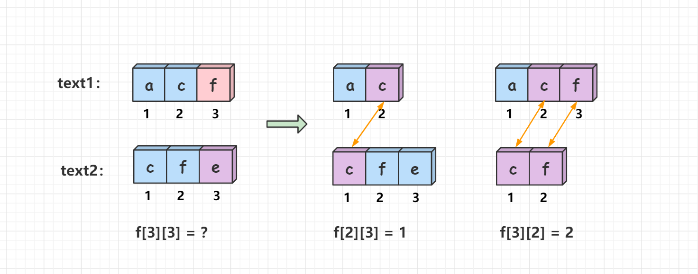

## 力扣500题刷题笔记

### [518. 零钱兑换 II](https://leetcode-cn.com/problems/coin-change-2/) 

**题目 **

给你一个整数数组 `coins` 表示不同面额的硬币，另给一个整数 `amount` 表示总金额。

请你计算并返回可以凑成总金额的硬币组合数。如果任何硬币组合都无法凑出总金额，返回 `0` 。

假设每一种面额的硬币有无限个。 

题目数据保证结果符合 `32` 位带符号整数。

 **示例 1：**

```
输入：amount = 5, coins = [1, 2, 5]
输出：4
解释：有四种方式可以凑成总金额：
5=5
5=2+2+1
5=2+1+1+1
5=1+1+1+1+1
```

**示例 2：**

```
输入：amount = 3, coins = [2]
输出：0
解释：只用面额 2 的硬币不能凑成总金额 3 。
```

**示例 3：**

```
输入：amount = 10, coins = [10] 
输出：1
```

**提示：**

- `1 <= coins.length <= 300`
- `1 <= coins[i] <= 5000`
- `coins` 中的所有值 **互不相同**
- `0 <= amount <= 5000`

**思路**

**(动态规划，完全背包)** 

**二维分析** 

**状态表示：** `f[i][j]` 表示从前`i`种硬币中选，且总金额恰好为`j`的所有选法集合的方案数。

那么`f[n][amount]`就表示表示从前`n`种硬币中选，且总金额恰好为`amount`的所有选法集合的方案数，即为答案。 

**集合划分：** 

按照第`i`种硬币可以选 `0`个,`1`个，`2`个，`3`个，，，，`k`个划分集合 `f[i][j]`。其中`k*coin[i] <= j`，也就是说在背包能装下的情况下，枚举第`i`种硬币可以选择几个。

- 第`i`种硬币选 `0`个，`f[i][j] = f[i-1][j]`
- 第`i`种硬币选 `1`个，`f[i][j] = f[i-1][j - coin[i]]`
- 第`i`种硬币选 `k`个，`f[i][j] = f[i-1][j - k*coin[i]]` 

**状态计算：** 

`f[i][j] = f[i-1][j]+f[i-1][j-coin[i]]+f[i-1][j-2*coin[i]],,,,,,+f[i-1][j-k*coin[i]]` 。

**初始化条件：**

- `f[0][0] = 1`，使用`0`种硬币币，凑`0`元钱，也是一种方案。

**时间复杂度分析：**  $O(amount^2*n)$，其中 $amount$是总金额，$n$是数组 $coins$的长度。 

**二维c++代码**

```c++
class Solution {
public:
    int change(int amount, vector<int>& coins) {
        int n = coins.size();
        vector<vector<int>>f(n + 1, vector<int>(amount + 1 , 0));
        f[0][0] = 1;  // 使用0种货币，凑0元钱,也是一种方案
        for(int i = 1; i <= n; i++)
        {
            int v =coins[i - 1];
            for(int j = 0; j <= amount; j++)
                 for(int k = 0; k*v <= j; k++)
                   f[i][j] += f[i-1][j-k*v];    //状态计算方程
        }
        return f[n][amount];        
    }
};
```

**二维java代码** 

```java
class Solution {
    public int change(int amount, int[] coins) {
        int n = coins.length;
        int[][] f = new int[n + 1][amount + 1];
        f[0][0] = 1;   // 使用0种货币，凑0元钱,也是一种方案
        for (int i = 1; i <= n; i++) {
            int v = coins[i - 1];
            for (int j = 0; j <= amount; j++) 
                for (int k = 0; k * v <= j; k++) 
                    f[i][j] += f[i - 1][j - k * v];  //状态计算方程
        }
        return f[n][amount];
    }
}
```

 

**一维优化：**

 二维完全背包求解方案复杂度较高，考虑一维优化。

`v`代表第`i`种硬币的面值

`f[i][j] = f[i-1][j] + f[i-1][j-v]+f[i-1][j-2v]+,,,,,+f[i-1][j-kv])`

`f[i][j-v] = f[i-1,[j-v]+f[i-1][j-2v]+,,,,,+f[i-1][j-kv])`

**因此：**

`f[i][j] = f[i-1][j]+f[i][j-v])`

**图示：** 


**去掉物品种类维度，状态计算方程为：**  `f[j] = f[j] + f[j-v]` 

**时间复杂度分析：** $O(amount*n)$  ，其中 $amount$是总金额，$n$是数组 $coins$的长度。 

**一维c++代码**

```c++
class Solution {
public:
    int change(int amount, vector<int>& coins) {
        vector<int>f(amount + 1);
        f[0] = 1; //f[0][0] = 1;
        for(int i = 1; i <= coins.size(); i++)
        {
            int v =coins[i - 1];
            for(int j = v; j <= amount; j++)
                f[j] += f[j - v];
        }
        return f[amount];        
        
    }
};
```

**一维java代码** 

```java
class Solution {
    public int change(int amount, int[] coins) {
        int[] f = new int[amount + 1];
        f[0] = 1; //f[0][0] = 1;
        for(int i = 1; i <= coins.length; i++)
        {
            int v =coins[i - 1];
            for(int j = v; j <= amount; j++)
                f[j] += f[j - v];
        }
        return f[amount];       
    }
}
```

### [剑指 Offer 51. 数组中的逆序对](https://leetcode-cn.com/problems/shu-zu-zhong-de-ni-xu-dui-lcof/)

**题目**

在数组中的两个数字，如果前面一个数字大于后面的数字，则这两个数字组成一个逆序对。输入一个数组，求出这个数组中的逆序对的总数。

 **示例 1:**

```
输入: [7,5,6,4]
输出: 5
```

**限制：**

`0 <= 数组长度 <= 50000`

**思路**

**c++代码** 

```c++
class Solution {
public:

    int merge(vector<int>& nums, int l, int r) {
        if (l >= r) return 0;

        int mid = l + r >> 1;
        int res = merge(nums, l, mid) + merge(nums, mid + 1, r);

        vector<int> temp;
        int i = l, j = mid + 1;
        while (i <= mid && j <= r)
        {
            if (nums[i] <= nums[j]) temp.push_back(nums[i ++ ]);
            else 
            {
                temp.push_back(nums[j ++ ]);
                res += mid - i + 1;
            }
        }

        while (i <= mid) temp.push_back(nums[i ++ ]);
        while (j <= r) temp.push_back(nums[j ++ ]);

        int k = l;
        for (auto x : temp) nums[k ++ ] = x;
        
        return res;
    }

    int reversePairs(vector<int>& nums) {
        return merge(nums, 0, nums.size() - 1);
    }
};
```

**java代码** 

```java
```

### [498. 对角线遍历](https://leetcode-cn.com/problems/diagonal-traverse/) 

**题目 **

给定一个含有 M x N 个元素的矩阵（M 行，N 列），请以对角线遍历的顺序返回这个矩阵中的所有元素，对角线遍历如下图所示。

 **示例:** 

```
输入:
[
 [ 1, 2, 3 ],
 [ 4, 5, 6 ],
 [ 7, 8, 9 ]
]
```

 

 ```
 输出:  [1,2,4,7,5,3,6,8,9]
 ```

**说明:**

1. 给定矩阵中的元素总数不会超过 100000 。

**思路**

**(模拟)**  $O(n*m)$ 

我们能够想到的最为直接的思路就是：按照题目要求，模拟在数组中的行走路线，然后以对角线遍历的顺序返回这个矩阵中的所有元素。

**首先来了解对角线的几个性质：** 

观察整个矩阵，我们可以发现，第一行的每一个元素对应一条对角线，最后一列的每一个元素对应一条对角线，两者重复包含右上角那条对角线。因此，假设矩阵的行数为`n`，列数为`m`，那么对角线的总数为: `n + m - 1` 。我们给每条对角线编个序号，如下图所示： 


最左上角的为第`0`条对角线 ，最右下角的为第 `n + m - 2`条对角线。观察对角线的方向，注意到对角线的方向是向上或者向下交替进行的。 当对角线的序号是偶数时，对角线的方向向上；当对角线的序号是奇数时，对角线的方向向下。 

**矩阵行列的性质：**

同一条对角线上的每个点`(x, y)`的横纵坐标之和 `x + y`相等，且都等于对角线的序号（仔细观察上图）。

**如何确定每条对角线的起始和终点端点 ？** 

根据对角线性质，只要知道端点的横纵坐标之一，就可以得到另一维坐标，因此我们可以只关心横坐标。

**对角线的起始和终点端点横坐标：**   


这样我们就确定了偶数对角线的起始和终点端点横坐标分别为`x = min(i, n - 1)`和`x = max(0, i - m + 1)`，纵坐标为` i - x`。（`i`是对角线序号） 

而奇数对角线的遍历方向恰好和偶数对角线相反，因此奇数对角线的起始和终点端点横坐标分别为`x = max(0, i - m + 1)`和`x = min(i, n - 1)`，纵坐标为` i - x`。（`i`是对角线序号） 。 

接下来的思路就很明确了，遍历每条对角线。如果是偶数对角线，就从下往上遍历；如果是奇数对角线，就从上往下遍历。

**具体过程如下：** 

- 1、定义答案数组`res`，遍历每条对角线。

- 2、对于每条序号为`i`的对角线，判断其奇偶性：

  - 如果是偶数对角线 ，确定其横坐标`x`，从下往上遍历，将`mat[x][i - x]`加入`res`中。 

  - 如果是奇数对角线 ，确定其横坐标`x`，从上往下遍历，将`mat[x][i - x]`加入`res`中。 

- 3、最后返回`res`。

**时间复杂度分析：** $O(n*m)$ ，每个元素只处理一遍。

**c++代码** 

```c++
class Solution {
public:
    vector<int> findDiagonalOrder(vector<vector<int>>& mat) {
        vector<int> res;
        if (mat.empty() || mat[0].empty()) return res;
        int n = mat.size(), m = mat[0].size();
        for (int i = 0; i < n + m - 1; i ++ ) 
        {
            if (i % 2 == 0)  //偶数对角线
            {
                for (int x = min(i, n - 1); x >= max(0, i - m + 1); x -- )//从下往上遍历
                    res.push_back(mat[x][i - x]);
            } else 		     //奇数对角线
            {      
                for (int x = max(0,  i - m + 1); x <= min(i, n - 1); x ++ )//从上往下遍历
                    res.push_back(mat[x][i - x]);
            }
        }
        return res;
    }
};
```

**java代码**

```java
class Solution {
    public int[] findDiagonalOrder(int[][] mat) {
    if (mat.length == 0 || mat[0].length == 0) return new int[0];
    int n = mat.length, m = mat[0].length;
    int[] res = new int[n * m];
    for (int i = 0, idx = 0; i < n + m - 1; i++) 
    {
        if (i % 2 == 0) //偶数对角线
            for (int x = Math.min(i, n - 1); x >= Math.max(0, i - m + 1); x -- ) //从下往上遍历
                res[idx++] = mat[x][i - x];
        else   		    //奇数对角线
            for (int x = Math.max(0, i - m + 1); x <= Math.min(i, n - 1); x ++ )//从上往下遍历
                res[idx++] = mat[x][i - x];
    }
    return res;
  }
}
```


### [138. 复制带随机指针的链表](https://leetcode-cn.com/problems/copy-list-with-random-pointer/) 

**题目** 

给你一个长度为` n` 的链表，每个节点包含一个额外增加的随机指针 `random` ，该指针可以指向链表中的任何节点或空节点。

构造这个链表的 **深拷贝。**  深拷贝应该正好由 `n` 个 **全新** 节点组成，其中每个新节点的值都设为其对应的原节点的值。新节点的 `next `指针和 `random `指针也都应指向复制链表中的新节点，并使原链表和复制链表中的这些指针能够表示相同的链表状态。**复制链表中的指针都不应指向原链表中的节点 。** 

例如，如果原链表中有 `X` 和 `Y` 两个节点，其中 `X.random --> Y `。那么在复制链表中对应的两个节点` x` 和` y` ，同样有` x.random --> y` 。

返回复制链表的头节点。

用一个由 `n` 个节点组成的链表来表示输入/输出中的链表。每个节点用一个` [val, random_index] `表示：

- `val`：一个表示 `Node.val` 的整数。
- `random_index`：随机指针指向的节点索引（范围从 `0 `到` n-1`）；如果不指向任何节点，则为  `null` 。

你的代码 **只** 接受原链表的头节点 `head`作为传入参数。

**示例 1：**


```
输入：head = [[7,null],[13,0],[11,4],[10,2],[1,0]]
输出：[[7,null],[13,0],[11,4],[10,2],[1,0]]

```

**示例 2：**


```
输入：head = [[1,1],[2,1]]
输出：[[1,1],[2,1]]
```

**示例 3：**


```
输入：head = [[3,null],[3,0],[3,null]]
输出：[[3,null],[3,0],[3,null]]
```

**示例 4：**

```
输入：head = []
输出：[]
解释：给定的链表为空（空指针），因此返回 null。
```

**思路** 

**(迭代)**  $O(n)$

题目要求我们复制一个长度为` n` 的链表，该链表除了每个节点有一个指针指向下一个节点外，还有一个额外的指针指向链表中的任意节点或者`null`，如下图所示： 


**如何去复制一个带随机指针的链表？** 

首先我们可以忽略`random` 指针，然后对原链表的每个节点进行复制，并追加到原节点的后面，而后复制`random`指针。最后我们把原链表和复制链表拆分出来，并将原链表复原。

**图示过程如下：** 

1、在每个节点的后面加上它的复制，并将原链表和复制链表连在一起。


2、 从前往后遍历每一个原链表节点，对于有`random`指针的节点`p`，我们让它的`p->next->random = p->random->next`，这样我们就完成了对原链表`random`指针的复刻。  


3、最后我们把原链表和复制链表拆分出来，并将原链表复原。 


**具体过程如下：** 

- 1、定义一个`p`指针，遍历整个链表，复制每个节点，并将原链表和复制链表连在一起。
- 2、再次遍历整个链表，执行`p->next->random = p->random->next`，复制`random`指针。 
- 3、定义虚拟头节点`dummy`用来指向复制链表的头节点， 将两个链表拆分并复原原链表。

**时间复杂度分析：** $O(n)$，其中 $n$ 是链表的长度。 

**空间复杂度分析：** $O(1)$。

**c++代码**  

```c++
/*
// Definition for a Node.
class Node {
public:
    int val;
    Node* next;
    Node* random;
    
    Node(int _val) {
        val = _val;
        next = NULL;
        random = NULL;
    }
};
*/

class Solution {
public:
    Node* copyRandomList(Node* head) {
        for(auto p = head; p; p = p->next->next)  //复制每个节点，并将原链表和复制链表连在一起。
        {
            auto q = new Node(p->val);
            q->next = p->next;
            p->next = q;
        }

        for(auto p = head; p; p = p->next->next)   //复制random指针
        {
            if(p->random)
              p->next->random = p->random->next;
        }

        //拆分两个链表，并复原原链表
        auto dummy = new Node(-1), cur = dummy; 
        for(auto p = head; p; p = p->next)
        {
            auto q = p->next;
            cur = cur->next = q;
            p->next = q->next;
        }

        return dummy->next;
    }
};
```

**java代码**

```java
/*
// Definition for a Node.
class Node {
    int val;
    Node next;
    Node random;

    public Node(int val) {
        this.val = val;
        this.next = null;
        this.random = null;
    }
}
*/

class Solution {
    public Node copyRandomList(Node head) {
        for(Node p = head; p != null; p = p.next.next)  //复制每个节点，并将原链表和复制链表连在一起。
        {
            Node q = new Node(p.val);
            q.next = p.next;
            p.next = q;
        }

        for(Node p = head; p != null; p = p.next.next)   //复制random指针
        {
            if(p.random != null)
              p.next.random = p.random.next;
        }

        //拆分两个链表，并复原原链表
        Node dummy = new Node(-1), cur = dummy;
        for(Node p = head; p != null; p = p.next)
        {
            Node q = p.next;
            cur = cur.next = q;
            p.next = q.next;
        }

        return dummy.next;
    }
}
```

**(哈希，回溯)** $O(n)$ 

使用回溯的方式遍历整个链表，让每个节点的复制相互独立。对于当前节点`node`，首先复制当前节点`node`，而后对当前节点的后继节点和随机指针指向的节点进行复制，最后让复制节点的`next`指针和`random`指针指向这两个复制的节点，即可完成边的复制。


为了防止多次遍历同一个节点，我们需要建立一个哈希表， 来记录源节点到克隆节点之间的映射关系。在回溯搜索过程中，如果当前正在搜索的节点出现在了哈希表中，就说明我们已经遍历完了整个链表，此时就可以直接从哈希表中取出复制后的节点的指针并返回。 


**具体过程如下：**

- 1、从`head`节点开始`dfs`遍历整个图。
- 2、复制当前节点`node`，并使用哈希表`hash`存贮源节点到复制节点之间的映射。
- 3、递归调用当前节点`node`的后继节点和随机指针指向的节点，并进行复制，然后让复制节点的`next`指针和`random`指针指向这两个复制的节点。
- 4、最后返回已经被访问过的节点的复制节点。

**时间复杂度分析：** $O(n)$，其中 $n$ 是链表的长度  。

**c++代码** 

```c++
class Solution {
public:
    unordered_map<Node*, Node*> hash;

    Node* copyRandomList(Node* head) 
    {
        if (head == NULL)  return NULL;
        return dfs(head);   
    }

    Node* dfs(Node* node)
    {
        if(node == NULL) return NULL;
        //node节点已经被访问过了,直接从哈希表hash中取出对应的克隆节点返回。
        if(hash.count(node))  return hash[node]; 
        Node* clone = new Node(node->val);    //复制节点
        hash[node] = clone;                   //建立源节点到复制节点的映射   
        clone->next = dfs(node->next);        //复制边  
        clone->random = dfs(node->random);
        return clone;
    }
};
```

**java代码** 

```java
/*
// Definition for a Node.
class Node {
    int val;
    Node next;
    Node random;

    public Node(int val) {
        this.val = val;
        this.next = null;
        this.random = null;
    }
}
*/

class Solution {
    Map<Node,Node> hash = new HashMap<>();
    public Node copyRandomList(Node head) {
        if(head == null) return null;
        return dfs(head);
    }
    Node dfs(Node node)
    {
        if(node == null) return null;
        //node节点已经被访问过了,直接从哈希表hash中取出对应的复制节点返回。
        if(hash.containsKey(node)) return hash.get(node); 
        Node clone = new Node(node.val);  //复制节点
        hash.put(node,clone);   		  //建立源节点到复制节点的映射
        clone.next = dfs(node.next);      //复制边  
        clone.random = dfs(node.random);
        return clone;
    }
}
```

### [133. 克隆图](https://leetcode-cn.com/problems/clone-graph/)

**题目**

给你无向 **[连通](https://baike.baidu.com/item/连通图/6460995?fr=aladdin)** 图中一个节点的引用，请你返回该图的 [**深拷贝**](https://baike.baidu.com/item/深拷贝/22785317?fr=aladdin)（克隆）。

图中的每个节点都包含它的值 `val`（`int`） 和其邻居的列表（`list[Node]`）。

```
class Node {
    public int val;
    public List<Node> neighbors;
}
```

**测试用例格式：** 

简单起见，每个节点的值都和它的索引相同。例如，第一个节点值为 1（`val = 1`），第二个节点值为 2（`val = 2`），以此类推。该图在测试用例中使用邻接列表表示。

**邻接列表** 是用于表示有限图的无序列表的集合。每个列表都描述了图中节点的邻居集。

给定节点将始终是图中的第一个节点（值为 1）。你必须将 **给定节点的拷贝** 作为对克隆图的引用返回。 

 **示例 1：** 


```
输入：adjList = [[2,4],[1,3],[2,4],[1,3]]
输出：[[2,4],[1,3],[2,4],[1,3]]
解释：
图中有 4 个节点。
节点 1 的值是 1，它有两个邻居：节点 2 和 4 。
节点 2 的值是 2，它有两个邻居：节点 1 和 3 。
节点 3 的值是 3，它有两个邻居：节点 2 和 4 。
节点 4 的值是 4，它有两个邻居：节点 1 和 3 。
```

**示例 2：**

 

```
输入：adjList = [[]]
输出：[[]]
解释：输入包含一个空列表。该图仅仅只有一个值为 1 的节点，它没有任何邻居。
```

**示例 3：**

```
输入：adjList = []
输出：[]
解释：这个图是空的，它不含任何节点。
```

**示例 4：**

 

```
输入：adjList = [[2],[1]]
输出：[[2],[1]]
```

**提示：**

- 节点数不超过 `100` 。
- 每个节点值 `Node.val `都是唯一的，`1 <= Node.val <= 100`。
- 无向图是一个**简单图**，这意味着图中没有重复的边，也没有自环。 
- 由于图是无向的，如果节点 `p` 是节点 `q` 的邻居，那么节点 `q` 也必须是节点 `p` 的邻居。
- 图是连通图，你可以从给定节点访问到所有节点。

**思路**

**(哈希，dfs)**  $O(n)$

 给定一个无向连通图，要求复制这个图，但是其中的节点**不再是原来图节点的引用**。我们可以从题目给定的节点引用出发，**深度优先搜索**遍历整个图，在遍历的过程中完成图的复制。



为了防止多次遍历同一个节点，我们需要建立一个哈希表`hash`， 来记录源节点到克隆节点之间的映射关系。在`dfs`搜索过程中，如果当前正在搜索的节点`node`出现在了哈希表中，就说明我们已经遍历完了整个无向图，此时就可以结束搜索过程。 


**dfs函数设计：** 

```c++
 Node* dfs(Node* node)
```

`node`是当前搜索到的节点，函数的返回值为`Node`类型。

**搜索边界：** 

- `if(hash[node])  return hash[node]`，如果`node`节点已经被访问过了，此时就可以直接从哈希表`hash`中取出对应的克隆节点返回。

**具体过程如下：** 

- 1、从`node`节点开始`dfs`遍历整个图。
- 2、克隆当前节点`node`，并使用哈希表`hash`存贮源节点到克隆节点之间的映射。
- 3、递归调用当前节点`node`的邻接节点`neighbors`，并进行克隆，最后将这些克隆的邻接节点加入克隆节点的邻接表中。
- 4、最后返回已经被访问过的节点的克隆节点。

**时间复杂度分析：** $O(n)$，其中 $n$ 表示节点数量。`dfs`遍历图的过程中每个节点只会被访问一次。

**c++代码** 

```c++
/*
// Definition for a Node.
class Node {
public:
    int val;
    vector<Node*> neighbors;
    Node() {
        val = 0;
        neighbors = vector<Node*>();
    }
    Node(int _val) {
        val = _val;
        neighbors = vector<Node*>();
    }
    Node(int _val, vector<Node*> _neighbors) {
        val = _val;
        neighbors = _neighbors;
    }
};
*/

class Solution {
public:
    unordered_map<Node* ,Node*>hash;
    Node* cloneGraph(Node* node) {
        if(!node) return NULL;
        return dfs(node);       
    }
    Node* dfs(Node* node)   
    {
        //node节点已经被访问过了,直接从哈希表hash中取出对应的克隆节点返回。
        if(hash[node])  return hash[node]; 
        Node* clone = new Node(node->val); //克隆节点
        hash[node] = clone;                //建立源节点到克隆节点的映射
        for(Node* ver: node->neighbors)    //克隆边
        {
            clone->neighbors.push_back(dfs(ver));
        }
        return clone;
    }
};
```

**java代码**  

```java
/*
// Definition for a Node.
class Node {
    public int val;
    public List<Node> neighbors;

    public Node() {
        val = 0;
        neighbors = new ArrayList<Node>();
    }

    public Node(int _val) {
        val = _val;
        neighbors = new ArrayList<Node>();
    }

    public Node(int _val, ArrayList<Node> _neighbors) {
        val = _val;
        neighbors = _neighbors;
    }
}
*/

class Solution {
    Map<Node,Node> map = new HashMap<>();
    public Node cloneGraph(Node node)
    {
        if(node == null) return null;
        return dfs(node);
    }

    Node dfs(Node node)
    {
        //node节点已经被访问过了,直接从哈希表hash中取出对应的克隆节点返回。
        if(map.containsKey(node)) return map.get(node); 
        Node clone = new Node(node.val);  //克隆节点
        map.put(node,clone);   		      //建立源节点到克隆节点的映射
        for(Node ver: node.neighbors)     //克隆边
        {    
            clone.neighbors.add(dfs(ver));
        }
        return clone;
    }
}

```

### [198. 打家劫舍](https://leetcode-cn.com/problems/house-robber/)

**题目**

你是一个专业的小偷，计划偷窃沿街的房屋。每间房内都藏有一定的现金，影响你偷窃的唯一制约因素就是相邻的房屋装有相互连通的防盗系统，**如果两间相邻的房屋在同一晚上被小偷闯入，系统会自动报警。**

给定一个代表每个房屋存放金额的非负整数数组，计算你 **不触动警报装置的情况下** ，一夜之内能够偷窃到的最高金额。

**示例 1：**

```
输入：[1,2,3,1]
输出：4
解释：偷窃 1 号房屋 (金额 = 1) ，然后偷窃 3 号房屋 (金额 = 3)。
     偷窃到的最高金额 = 1 + 3 = 4 。
```

**示例 2：**

```
输入：[2,7,9,3,1]
输出：12
解释：偷窃 1 号房屋 (金额 = 2), 偷窃 3 号房屋 (金额 = 9)，接着偷窃 5 号房屋 (金额 = 1)。
     偷窃到的最高金额 = 2 + 9 + 1 = 12 。
```

**提示：**

- `1 <= nums.length <= 100`
- `0 <= nums[i] <= 400`

**思路**

**(动态规划)**  $O(n)$

给定一个代表金额的非负整数数组`nums`，相邻房间不可偷，让我们输出可以偷窃到的最高金额。

**样例：**  


如样例所示，`nums = [2,7,9,3,1]`，偷窃`1`，`3`，`5`号房间可以获得最高金额`12`，下面来讲解动态规划的做法。

**状态表示：**`f[i]`表示偷窃`1`号到`i`号房间所能获得的最高金额。那么，`f[n]`就表示偷窃`1`号到`n`号房间所能获得的最高金额，即为答案。

**状态计算：**  

假设有`i`间房间，考虑最后一间偷还是不偷房间，有两种选择方案：

- 1、偷窃前`i-1`间房间，不偷窃最后一间房间，那么问题就转化为了偷窃`1`号到`i- 1`号房间所能获得的最高金额，即`f[i] = f[i-1]  `。 

  

- 2、偷窃前`i - 2`间房间和最后一间房间 (相邻的房屋不可闯入)，那么问题就转化为了偷窃`1`号到`i- 2`号房间所能获得的最高金额再加上偷窃第`i`号房间的金额，即`f[i] = f[i - 2] + nums[i]`。 (下标均从`1`开始)


两种方案，选择其中金额最大的一个。因此**状态转移方程为：** ` f[i] = max(f[i - 1], f[i - 2] + nums[i])`。 (下标均从`1`开始)

**初始化：**`f[1] = nums[0]`，偷窃`1`号房间所能获得的最高金额为`nums[0]`。

**实现细节：** 

我们定义的状态表示`f[]`数组和`nums[]`数组下标均是从`1`开始的，而题目给出的`nums[]`数组下标是从`0`开始的。为了一 一对应，状态转移方程中的`nums[i]`的值要往前错一位，取`nums[i-1]`，这点细节希望大家可以注意一下。

**时间复杂度分析：** $O(n)$，其中 $n$是数组长度。只需要对数组遍历一次。

**c++代码1**

```c++
class Solution {
public:
    int rob(vector<int>& nums) {
        int n = nums.size() ;
        vector<int>f(n + 1);
        f[1] = nums[0];  //初始化
        for(int i = 2; i <= n; i++){
            int w = nums[i - 1];
            f[i] = max(f[i-1], f[i - 2] + w); //状态计算方程
        }
        return f[n];
    }
};
```

**java代码** 

```java
class Solution {
    public int rob(int[] nums) {
        int n = nums.length;
        int[] f = new int[n + 1];
        f[1] = nums[0];  //初始化
        for(int i = 2; i <= n; i++){
            int w = nums[i - 1];
            f[i] = Math.max(f[i-1], f[i - 2] + w);  //状态计算方程
        }
        return f[n];
    }
}
```


### [1143. 最长公共子序列](https://leetcode-cn.com/problems/longest-common-subsequence/) 

**题目**

给定两个字符串 `text1` 和 `text2`，返回这两个字符串的最长 **公共子序列** 的长度。如果不存在 **公共子序列** ，返回 `0` 。

一个字符串的 **子序列** 是指这样一个新的字符串：它是由原字符串在不改变字符的相对顺序的情况下删除某些字符（也可以不删除任何字符）后组成的新字符串。 

- 例如，`"ace"` 是 `"abcde"` 的子序列，但 `"aec"` 不是 `"abcde"` 的子序列。

两个字符串的 **公共子序列** 是这两个字符串所共同拥有的子序列。

**示例 1：**

```
输入：text1 = "abcde", text2 = "ace" 
输出：3  
解释：最长公共子序列是 "ace" ，它的长度为 3 。
```

**示例 2：**

```
输入：text1 = "abc", text2 = "abc"
输出：3
解释：最长公共子序列是 "abc" ，它的长度为 3 。
```

**示例 3：** 

```
输入：text1 = "abc", text2 = "def"
输出：0
解释：两个字符串没有公共子序列，返回 0 。
```

**提示：**

- `1 <= text1.length, text2.length <= 1000`
- `text1` 和 `text2` 仅由小写英文字符组成。

**思路**

**(动态规划)**  $O(nm)$ 

给定两个字符串 `text1` 和 `text2`，返回这两个字符串的最长 **公共子序列** 的长度 (子序列可以不连续)。

**样例：** 


如样例所示，字符串`abcde`与字符串`ace`的最长公共子序列为`ace`，长度为`3`。最长公共子序列问题是典型的二维动态规划问题，下面来讲解动态规划的做法。

**状态表示：** 定义 `f[i][j]`表示字符串`text1`的`[1,i]`区间和字符串`text2`的`[1,j]`区间的最长公共子序列长度（下标从`1`开始）。

**状态计算：** 

可以根据`text1[i]`和`text2[j]`的情况，分为两种决策： 

- 1、若`text1[i] == text2[j]` ，也就是说两个字符串的最后一位相等，那么问题就转化成了字符串`text1`的`[1,j-1]`区间和字符串`text2`的`[1,j-1]`区间的最长公共子序列长度再加上一，即`f[i][j] = f[i - 1][j - 1] + 1`。（下标从`1`开始） 



- 2、若`text1[i] != text2[j]`，也就是说两个字符串的最后一位不相等，那么字符串`text1`的`[1,i]`区间和字符串`text2`的`[1,j]`区间的最长公共子序列长度无法延长，因此`f[i][j]`就会继承`f[i][j-1]`与`f[i-1][j]`中的较大值，即`f[i][j] = max(f[i - 1][j],f[i][j - 1])` 。 （ 下标从`1`开始） 



- 如上图所示：我们比较`text1[3]`与`text2[3]`，发现`'f'`不等于`'e'`，这样`f[3][3]`无法在原先的基础上延长，因此继承`"ac"`与`"cfe" `，`"acf"`与`"cf"`的最长公共子序列中的较大值，即 `f[3][3] = max(f[2][3] ,f[3][2]) = 2`。

**因此，状态转移方程为：**

`f[i][j] = f[i-1][j-1] + 1` ,当`text1[i] == text2[j]`。

` f[i][j] = max( f[i - 1][j],f[i][j - 1])`，当` text1[i] != text2[j]​ ` 。

**初始化：**

`f[i][0] = f[0][j] = 0`，(`0 <=i<=n`, `0<=j<=m`)

空字符串与有长度的字符串的最长公共子序列长度肯定为`0`。

**实现细节：** 

我们定义的状态表示`f`数组和`text`数组下标均是从`1`开始的，而题目给出的`text`数组下标是从`0`开始的，为了一 一对应，在判断`text1`和`text2`数组的最后一位是否相等时，往前错一位，即使用`text1[i - 1]`和`text2[j - 1]`来判断。

**时间复杂度分析：** $O(nm)$，其中$n$ 和 $m$ 分别是字符串 `text1` 和 `text2`的长度。

**c++代码**

```c++
class Solution {
public:
    int longestCommonSubsequence(string text1, string text2) {
        int n = text1.size(), m = text2.size();
        vector<vector<int>> f(n + 1, vector<int>(m + 1, 0));
        for (int i = 1; i <= n; ++i) {
            for (int j = 1; j <= m; ++j) {
                if (text1[i - 1] == text2[j - 1]) {
                    f[i][j] = f[i - 1][j - 1] + 1;
                } else {
                    f[i][j] = max(f[i - 1][j], f[i][j - 1]);
                }
            }
        }
        return f[n][m];
    }
};
```

**java代码** 

```java
class Solution {
    public int longestCommonSubsequence(String text1, String text2) {
        int n = text1.length(), m =  text2.length();
        int[][] f = new int[n + 1][m + 1];
        for (int i = 1; i <= n; ++i) {
            for (int j = 1; j <= m; ++j) {
                if (text1.charAt(i - 1) == text2.charAt(j - 1)) {
                    f[i][j] = f[i - 1][j - 1] + 1;
                } else {
                    f[i][j] = Math.max(f[i - 1][j], f[i][j - 1]);
                }
            }
        }
        return f[n][m];
    }
}
```

### [112. 路径总和](https://leetcode-cn.com/problems/path-sum/)

**题目**

给你二叉树的根节点 `root` 和一个表示目标和的整数 `targetSum` ，判断该树中是否存在 **根节点到叶子节点** 的路径，这条路径上所有节点值相加等于目标和 `targetSum` 。

**叶子节点** 是指没有子节点的节点。

 **示例 1：** 


```
输入：root = [5,4,8,11,null,13,4,7,2,null,null,null,1], targetSum = 22
输出：true
```

**示例 2：**


```
输入：root = [1,2,3], targetSum = 5
输出：false
```

**示例 3：**

```
输入：root = [1,2], targetSum = 0
输出：false
```

**提示：** 

- 树中节点的数目在范围` [0, 5000] `内
- `-1000 <= Node.val <= 1000`
- `-1000 <= targetSum <= 1000`

**思路**

**(递归)**  $O(n)$

给定一棵二叉树和一个 `sum`，判断是否存在一条从根节点到叶节点的路径，路径上所有数的和等于 `sum`。 

**样例：**  


如样例所示，存在`[5, 4, 11 , 2]` 这样一条路径，其相加之和等于`sum`。下面来讲解递归的做法。

我们从根节点往叶节点走，每走一个节点，就让`sum`减去当前节点的值。当我们走到某个叶子节点时，如果`sum`的值为`0`，就说明我们找到了一条从根节点到叶节点的路径，路径上所有数的和等于 `sum`。 

**递归边界：** 

- 1、遍历到了空节点，直接返回`false`。
- 2、遍历到了叶子节点，判断`sum`是否为`0`。

**具体过程如下：** 

- 1、从根节点`root`往下走。
- 2、使用`sum`减去当前节点的值，即`sum -= root->val`。
- 3、如果当前节点是叶节点，判断`sum`是否为`0`，并返回相应结果。
- 4、递归当前节点的左右子树。

**实现细节：**

这道题递归的过程中是不需要**回溯**的，因为我们的`sum`是值传递，递归不同的路径时，不同的路径维护的`sum`的值是互不影响的。

**时间复杂度分析： ** $O(n)$，其中$n$ 是树的节点数。每个节点仅被遍历一次。 

**c++代码** 

```c++
/**
 * Definition for a binary tree node.
 * struct TreeNode {
 *     int val;
 *     TreeNode *left;
 *     TreeNode *right;
 *     TreeNode() : val(0), left(nullptr), right(nullptr) {}
 *     TreeNode(int x) : val(x), left(nullptr), right(nullptr) {}
 *     TreeNode(int x, TreeNode *left, TreeNode *right) : val(x), left(left), right(right) {}
 * };
 */
class Solution {
public:
    bool hasPathSum(TreeNode* root, int sum) {
        if(!root)  return false;
        sum -= root->val;
        if(!root->left && !root->right) return !sum; //叶节点,判断sum是否为0
        else return hasPathSum(root->left,sum) || hasPathSum(root->right,sum); //递归左右子树
    }
};
```

**java代码** 

```java
/**
 * Definition for a binary tree node.
 * public class TreeNode {
 *     int val;
 *     TreeNode left;
 *     TreeNode right;
 *     TreeNode() {}
 *     TreeNode(int val) { this.val = val; }
 *     TreeNode(int val, TreeNode left, TreeNode right) {
 *         this.val = val;
 *         this.left = left;
 *         this.right = right;
 *     }
 * }
 */
class Solution {
    public boolean hasPathSum(TreeNode root, int sum) {
        if(root == null)  return false;
        sum -= root.val;
        if(root.left == null && root.right == null) return sum == 0;//叶节点,判断sum是否为0
        else return hasPathSum(root.left,sum) || hasPathSum(root.right,sum);//递归左右子树
    }
}
```

### [165. 比较版本号](https://leetcode-cn.com/problems/compare-version-numbers/)

**题目**

给你两个版本号 `version1` 和 `version2` ，请你比较它们。

版本号由一个或多个修订号组成，各修订号由一个 `'.'` 连接。每个修订号由 **多位数字** 组成，可能包含 **前导零** 。每个版本号至少包含一个字符。修订号从左到右编号，下标从 0 开始，最左边的修订号下标为 0 ，下一个修订号下标为 1 ，以此类推。例如，`2.5.33` 和 `0.1` 都是有效的版本号。

比较版本号时，请按从左到右的顺序依次比较它们的修订号。比较修订号时，只需比较 **忽略任何前导零后的整数值** 。也就是说，修订号 `1` 和修订号 `001` **相等** 。如果版本号没有指定某个下标处的修订号，则该修订号视为 `0 `。例如，版本 `1.0` 小于版本 `1.1` ，因为它们下标为 `0` 的修订号相同，而下标为` 1` 的修订号分别为 `0` 和 `1 `，`0 < 1 `。

返回规则如下：

- 如果 `version1 > version2` 返回 `1`，
- 如果` version1 < version2` 返回 `-1`，
- 除此之外返回 `0`。 

**示例 1：** 

```
输入：version1 = "1.01", version2 = "1.001"
输出：0
解释：忽略前导零，"01" 和 "001" 都表示相同的整数 "1"
```

**示例 2：** 

```
输入：version1 = "1.0", version2 = "1.0.0"
输出：0
解释：version1 没有指定下标为 2 的修订号，即视为 "0"
```

**示例 3：**

```
输入：version1 = "0.1", version2 = "1.1"
输出：-1
解释：version1 中下标为 0 的修订号是 "0"，version2 中下标为 0 的修订号是 "1" 。0 < 1，所以 version1 < version2
```

**示例 4：**

```
输入：version1 = "1.0.1", version2 = "1"
输出：1
```

**示例 5：**

```
输入：version1 = "7.5.2.4", version2 = "7.5.3"
输出：-1
```

**提示：** 

- `1 <= version1.length, version2.length <= 500`
- `version1` 和` version2 `仅包含数字和` '.'`
- `version1` 和 `version2` 都是 有效版本号
- `version1` 和 `version2` 的所有修订号都可以存储在 **`32 `位整数** 中  

**思路**

**(双指针)**  $O(max(n,m))$ 

比较两个版本号大小，版本号由修订号组成，中间使用`'.'`分隔，越靠近前边修订号的优先级越大。当`v1 > v2`时返回 `1`，当`v1 < v2`时返回 `-1`，相等时返回 `0`。

**样例：  ** 


如样例所示，`v1= 1.02.3`, `v2 = 1.02.2`，前两个修订号都相等，`v1`的第三个修订号大于`v2`的第三个修订号，因此`v1 > v2`，返回`1`。下面来讲解双指针的做法。

我们使用两个指针`i`和`j`分别指向两个字符串的开头，然后向后遍历，当遇到小数点`'.'`时停下来，并将每个小数点`'.'`分隔开的修订号解析成数字进行比较，越靠近前边，修订号的优先级越大。根据修订号大小关系，返回相应的数值。

**实现细节：**

```c++
// 将一段连续的字符串转换成数字 
while(i < v1.size() && v1[i] != '.') num1 = num1 * 10 + v1[i++] - '0';
```

这样做可以直接去前导`0`，同时将字符串转换成数字也便于比较大小。

**具体过程如下：**

- 1、定义两个指针 `i`和`j`，初始化`i = 0`，`j = 0`。
- 2、两个指针分别遍历两个字符串，将每个小数点`'.'`分隔开的修订号解析成数字，并进行大小比较：
  - 如果 `num1 > num2`，返回 `1`；
  - 如果 `num1 < num2`，返回 `-1`；
- 3、`i++`，`j++`，两个指针都后移一步，进行下一轮的修订号解析比较。
- 4、如果遍历完两个字符串都没有返回相应结果，说明两个字符串相等，返回`0`。

**时间复杂度分析：** $O(max(n,m))$ ，`n`和`m`分别是两个字符串的长度。

**c++代码**

```c++
class Solution {
public:
    int compareVersion(string v1, string v2) {
        int i = 0, j = 0;
        while(i < v1.size() || j < v2.size())
        {
            int num1 = 0, num2 = 0;
            while(i < v1.size() && v1[i] != '.') num1 = num1 * 10 + v1[i++] - '0';
            while(j < v2.size() && v2[j] != '.') num2 = num2 * 10 + v2[j++] - '0';
            if(num1 > num2) return 1;
            else if( num1 < num2) return -1;
            i++,j++;
        }
        return 0;
    }
};
```

**java代码**

```java
class Solution {
    public int compareVersion(String v1, String v2) {
        int i = 0, j = 0;
        int n = v1.length(), m = v2.length(); 
        while(i < n || j < m)
        {
            int num1 = 0, num2 = 0;
            while(i < n && v1.charAt(i) != '.') num1 = num1 * 10 + v1.charAt(i++) - '0';
            while(j < m && v2.charAt(j) != '.') num2 = num2 * 10 + v2.charAt(j++) - '0';
            if(num1 > num2) return 1;
            else if( num1 < num2) return -1;
            i++; j++;
        }
        return 0;
    }
}
```


### [62. 不同路径](https://leetcode-cn.com/problems/unique-paths/) 

**题目**

一个机器人位于一个 `m x n` 网格的左上角 （起始点在下图中标记为 “Start” ）。

机器人每次只能向下或者向右移动一步。机器人试图达到网格的右下角（在下图中标记为 “Finish” ）。

问总共有多少条不同的路径？

**示例 1：** 

 

```
输入：m = 3, n = 7
输出：28
```

**示例 2：**

```
输入：m = 3, n = 2
输出：3
解释：
从左上角开始，总共有 3 条路径可以到达右下角。
1. 向右 -> 向下 -> 向下
2. 向下 -> 向下 -> 向右
3. 向下 -> 向右 -> 向下
```

**示例 3：**

```
输入：m = 7, n = 3
输出：28
```

**示例 4：**

```
输入：m = 3, n = 3
输出：6
```

**提示：**

- `1 <= m, n <= 100`
- 题目数据保证答案小于等于 `2 * 109`

**思路**

**(动态规划)**   $O(m*n)$ 

**状态表示：** `f[i,j]`表示从`(0,0)`走到`(i,j)`的所有不同路径的方案数。那么，`f[m-1][n-1]`就表示从网格左上角到网格右下角的所有不同路径的方案数，即为答案。

**状态转移：**    

 

由于限制了只能**向下走**或者**向右走**，因此到达`(i,j)`有两条路径 

- 从上方转移过来，`f[i][j] = f[i-1][j] `；
- 从左方转移过来，`f[i][j] = f[i][j-1] ` ;

因此，**状态计算方程为：** `f[i][j] = f[i-1][j] + f[i][j-1] ` ， 将向右和向下两条路径的方案数相加起来。

**初始化条件：** `f[0][0] = 1`，从`(0,0)`到达`(0,0)`只有一条路径。 

**分析图示：**   


**时间复杂度分析：** $O(m*n)$，其中  $m$和 $n$分别是网格的行数和列数 。

**c++代码**

```c++
class Solution {
public:
    int uniquePaths(int m, int n) {
        vector<vector<int>>f(m, vector<int>(n,0));
        for(int i = 0; i < m; i++)
            for(int j = 0; j < n; j++)
            if(!i && !j) f[i][j] = 1; //初始化
            else{
                if(i) f[i][j] += f[i - 1][j];  //如果可以从上方转移过来
                if(j) f[i][j] += f[i][j - 1];  //如果可以从左方转移过来
            }
        return f[m - 1][n - 1];
    }
};
```

**java代码**

```java
class Solution {
    public int uniquePaths(int m, int n) {
        int[][] f = new int[m][n]; 
        for(int i = 0; i < m; i++)
            for(int j = 0; j < n; j++)
            if(i == 0 && j == 0) f[i][j] = 1; //初始化
            else{
                if(i != 0) f[i][j] += f[i - 1][j]; //如果可以从上方转移过来
                if(j != 0) f[i][j] += f[i][j - 1]; //如果可以从左方转移过来
            }
        return f[m - 1][n - 1];
    }
}
```

### [179. 最大数](https://leetcode-cn.com/problems/largest-number/)

**题目**

给定一组非负整数 `nums`，重新排列每个数的顺序（每个数不可拆分）使之组成一个最大的整数。

**注意：**输出结果可能非常大，所以你需要返回一个字符串而不是整数。

**示例 1:** 

```
输入：nums = [10,2]
输出："210"
```

**示例 2：**

```
输入：nums = [3,30,34,5,9]
输出："9534330"
```

**示例 3：**

```
输入：nums = [1]
输出："1"
```

**示例 4：**

```
输入：nums = [10]
输出："10"
```

**思路**

**(贪心)**   $O(nlogn)$ 

给定一组非负数，重新排列使其组成一个最大的整数。

**样例：**


如样例所示，`[3,30,34,5,9]`所能组成的最大数字是`"9534330"`，下面来讲解贪心的做法。

假设给定我们包含两个数字的数组`[a,b]`，如果`"ab"`组合大于`"ba"`组合，那么我们优先选择`a`进行拼接。比如`nums = [10,2]`，`"210"`组合明显大于`"102"`组合，因此我们优先选择`2`进行拼接，这样我们就自定义一个排序规则。但是扩展到一个序列来讲，一个序列要能够正确地自定义排序，需要这种排序规则满足全序关系，即以下三个关系：

* 如果 `a ≤ b` 且 `b ≤ a` 则 `a = b` (反对称性)
 * 如果 `a ≤ b` 且 `b ≤ c` 则 `a ≤ c` (传递性)
 * 如果 `a ≤ b` 或 `b ≤ a` (完全性)

详细证明可看[官解](https://leetcode-cn.com/problems/largest-number/solution/zui-da-shu-by-leetcode-solution-sid5/)。 满足了全序关系，我们就可以将`nums`数组按照自定义排序规则重新排序，最后返回拼接好的字符串即可。

**实现细节：**

c++自定义排序，实现一个`cmp`函数。 

```c++
static bool cmp(int a,int b) //自定义排序规则
    {
        string as = to_string(a), bs = to_string(b);
        return as + bs > bs + as;
    }
```

java自定义排序，`Arrays.sort()`结合`lamda`表达式。

```java
Arrays.sort(s, (a, b) -> {
            String x = a + b, y = b + a ;
            return y.compareTo(x);
 });  
```

**具体过程如下：**

- 1、自定义排序规则函数，将`nums`数组按照自定义排序规则重新排序。
- 2、从头到尾遍历`nums`数组，取出`nums`中的每一个数，拼接到答案字符串`res`中。
- 3、判断字符串`res`是否是全`0`，如果是全`0`，则返回`"0"`，否则返回`res`。

**时间复杂度分析：** 排序的时间复杂度 为$O(nlogn)$ 。

**c++代码**

```c++
class Solution {
public:
    static bool cmp(int a,int b) //自定义排序规则
    {
        string as = to_string(a), bs = to_string(b);
        return as + bs > bs + as;
    }
    string largestNumber(vector<int>& nums) {
        sort(nums.begin(), nums.end(), cmp);
        string res;
        for(auto x : nums) res += to_string(x);
        if(res[0] == '0') return "0";
        return res;
    }
};
```

**java代码** 

```java
class Solution {
    public String largestNumber(int[] nums) {
        int n = nums.length;
        String[] s = new String[n];
        for (int i = 0; i < n; i++) s[i] = nums[i] + "";
        Arrays.sort(s, (a, b) -> {
            String x = a + b, y = b + a ;
            return y.compareTo(x);
        });    
        StringBuilder res = new StringBuilder();
        for (String x : s) res.append(x);
    	if(res.charAt(0) == '0') return "0";
        return res.toString();
    }
}
```

### [283. 移动零](https://leetcode-cn.com/problems/move-zeroes/) 

**题目**

给定一个数组 `nums`，编写一个函数将所有 `0` 移动到数组的末尾，同时保持非零元素的相对顺序。

**示例:**

```
输入: [0,1,0,3,12]
输出: [1,3,12,0,0]
```

**说明:** 

1. 必须在原数组上操作，不能拷贝额外的数组。
2. 尽量减少操作次数。

**思路** 

**(双指针)**  $O(n)$  

给定一个数组 `nums`，要求我们将所有的 `0` 移动到数组的末尾，同时保持非零元素的相对顺序。

**样例：** 


如样例所示，数组`nums = [0,1,0,3,12]`，移动完成后变成`nums = [1,3,12,0,0]` ，下面来讲解双指针的做法。

我们定义两个指针，`i`指针和`k`指针，`i`指针用来遍历整个`nums`数组，`k`指针用来放置`nums`数组元素。然后将非`0`元素按照原有的相对顺序都放置到`nums`数组前面，剩下的位置都置为`0`。这样我们就完成了`0`元素的移动，同时也保持了非`0`元素的相对顺序。

**具体过程如下：**

- 1、定义两个指针`i`和`k`，初始化`i = 0`，`k = 0`。
- 2、`i`指针向后移动，遍整个`nums`数组，如果 `nums[i] != 0`，也就是说遇到了非`0`元素，此时我们就将`nums[i]`元素放置到`nums[k]`位置，同时`k++`后一位。
- 3、最后将`k`位置之后的元素都赋值为`0`。

**实现细节：**

遍历数组可以使用`for(int x : nums)`，这样就少定义一个指针，代码也显得更加简洁。

**时间复杂度分析：** $O(n)$ ，$n$是数组的长度，每个位置只被遍历一次。

**时间复杂度分析：** $O(1)$ ，只需要常数的空间存放指针变量。

**c++代码**

```c++
class Solution {
public:
    void moveZeroes(vector<int>& nums) {
        int k = 0;
        for(int x : nums)
            if(x != 0) nums[k++] = x;
        while(k < nums.size())  nums[k++] = 0;        
    }
};
```

**java代码**

```java
class Solution {
    public void moveZeroes(int[] nums) {
        int k = 0;
        for(int x : nums)
            if(x != 0) nums[k++] = x;
        while(k < nums.length)  nums[k++] = 0;      
    }
}
```


### [695. 岛屿的最大面积](https://leetcode-cn.com/problems/max-area-of-island/)

**题目**

给定一个包含了一些 `0` 和 `1` 的非空二维数组 `grid` 。

一个 **岛屿** 是由一些相邻的 `1` (代表土地) 构成的组合，这里的「相邻」要求两个 `1` 必须在水平或者竖直方向上相邻。你可以假设 `grid`的四个边缘都被 `0`（代表水）包围着。

找到给定的二维数组中最大的岛屿面积。(如果没有岛屿，则返回面积为 `0` 。)

 **示例 1:**

```
[[0,0,1,0,0,0,0,1,0,0,0,0,0],
 [0,0,0,0,0,0,0,1,1,1,0,0,0],
 [0,1,1,0,1,0,0,0,0,0,0,0,0],
 [0,1,0,0,1,1,0,0,1,0,1,0,0],
 [0,1,0,0,1,1,0,0,1,1,1,0,0],
 [0,0,0,0,0,0,0,0,0,0,1,0,0],
 [0,0,0,0,0,0,0,1,1,1,0,0,0],
 [0,0,0,0,0,0,0,1,1,0,0,0,0]]
```

对于上面这个给定矩阵应返回 `6`。注意答案不应该是 `11` ，因为岛屿只能包含水平或垂直的四个方向的 `1` 。

**示例 2:**

```
[[0,0,0,0,0,0,0,0]]
```

对于上面这个给定的矩阵, 返回 `0`。

**注意:** 给定的矩阵`grid` 的长度和宽度都不超过 50。

**思路**

**(DFS)** $O(n*m)$

给定一个由`0`和`1`组成的二维数组`grid`，其中`1`代表岛屿土地，要求找出二维数组中最大的岛屿面积，没有则返回`0`。

**样例：**


如样例所示，二维数组`grid`的最大岛屿面积为`4`，下面来讲解深度优先搜索的做法。

我们定义这样一种搜索顺序，即先搜索岛屿上的某块土地，然后以`4`个方向向四周探索与之相连的每一块土地，搜索过程中维护一个`area`变量，用来记录搜索过的土地总数。为了避免重复搜索，在这个过程中需要将已经搜索过的土地置为`0`，最后我们返回最大的`area`即可。

**搜索函数设计：**

```c++
int dfs(int x, int y)
```

`x`，`y`是当前搜索到的二维数组`grid`的横纵坐标。

**实现细节：** 

- 1、为了确保每个位置只被搜索一次，从当前搜索过的位置继续搜索下一个位置时，需要对当前位置进行标识，表示已经被搜索。
- 2、将二维数组`grid`以及二维数组的行数`n`和列数`m`都定义为全局变量可以减少搜索函数`dfs`的参数数量。
- 3、使用偏移数组来简化代码，如下图所示：


**具体过程如下：**

- 1、定义`res = 0`，遍历`grid`数组。
- 2、如果当前`grid`数组元素`grid[i][j] == 1`，也就是说为土地的话，就以当前土地`(i,j)`为起点继续向四周搜索联通的土地。
- 3、直到搜索完当前土地的所有的连通土地，最后将连通土地总数记录到`area`中。
- 4、执行`res = max(res,area)`,不断更新答案。

**时间复杂度分析：** $O(n*m)$，$n$是二维数组的行数，$m$是二维数组的列数，每个位置只被搜索一次。

**c++代码**

```c++
class Solution {
public:
    int n, m;
    vector<vector<int>>g;
    int dx[4] = {-1, 0, 1, 0}, dy[4] = {0, 1, 0, -1}; //偏移数组
    int dfs(int x, int y) //搜索函数
    {
        int area = 1;
        g[x][y] = 0;  //已经搜索过，标记为0
        for(int i = 0; i < 4; i++)
        {
            int a = x + dx[i], b = y + dy[i];
            //当前土地未出界也未被搜索过，继续下一层搜索
            if(a >=0 && a < n && b >=0 && b < m && g[a][b])
                area += dfs(a, b);
        }      
        return area; //返回连通土地总数
    }
    int maxAreaOfIsland(vector<vector<int>>& grid) {
        g = grid;
        int res = 0;
        n = grid.size(), m = grid[0].size();
        for(int i = 0; i < n; i++)
            for(int j = 0; j < m; j++)
                if(g[i][j])
                    res = max(res,dfs(i,j));
        return res;                
    }
};
```

**java代码**

```java
class Solution {
    private int n, m;
    private int[][] g;
    private int[] dx = {-1, 0, 1, 0}, dy = {0, 1, 0, -1};//偏移数组
    public int dfs(int x, int y) //搜索函数
    {
        int area = 1;
        g[x][y] = 0; //已经搜索过，标记为0
        for(int i = 0; i < 4; i++)
        {
            int a = x + dx[i], b = y + dy[i];
            //当前土地未出界也未被搜索过，继续下一层搜索
            if(a >=0 && a < n && b >= 0 && b < m && g[a][b] != 0)
                area += dfs(a, b);
        }      
        return area; //返回连通土地总数
    }
    public int maxAreaOfIsland(int[][] grid) {
        g = grid;
        int res = 0;
        n = grid.length; m = grid[0].length;
        for(int i = 0; i < n; i++)
            for(int j = 0; j < m; j++)
                if(g[i][j] != 0)
                    res = Math.max(res,dfs(i,j));
        return res;  
    }
}
```

###  [剑指 Offer 21. 调整数组顺序使奇数位于偶数前面](https://leetcode-cn.com/problems/diao-zheng-shu-zu-shun-xu-shi-qi-shu-wei-yu-ou-shu-qian-mian-lcof/)

**题目**

输入一个整数数组，实现一个函数来调整该数组中数字的顺序，使得所有奇数位于数组的前半部分，所有偶数位于数组的后半部分。

**示例：**

```
输入：nums = [1,2,3,4]
输出：[1,3,2,4] 
注：[3,1,2,4] 也是正确的答案之一。
```

 **提示：**

1. `0 <= nums.length <= 50000`
2. `1 <= nums[i] <= 10000`

**思路**

**(双指针)**  $O(n)$ 

给定一个`nums`数组，要求我们将所有的奇数调整到数组的前半部分，将所有的偶数调整到数组的后半部分。

**样例：**


如样例所示，`nums = [1,2,3,4]`，调整过后的`nums`为`[1,3,2,4] `，下面来讲解双指针的做法。

我们定义两个指针，分别从`nums`数组的首尾开始，往中间扫描。扫描时保证第一个指针前面的数都是奇数，第二个指针后面的数都是偶数。

**具体过程如下：**

- 1、定义两个指针`l`和`r`，初始化`l = 0`，`r = nums.size() - 1`。
- 2、`l`指针不断往后走，直到遇到第一个偶数为止。
- 3、`r`指针不断往前走，直到遇到第一个奇数为止。
- 4、交换`num[l]`和`num[r]`，循环执行`2`，`3`，`4`过程，直到 `l == r`时退出`while`循环。

**图示：** 


**时间复杂度分析：** 两个指针总共走过的长度是$n$，$n$是`nums`数组的长度，因此时间复杂度是$O(n)$。

**c++代码**

```c++
class Solution {
public:
    vector<int> exchange(vector<int>& nums) {
        int l  = 0, r = nums.size() - 1;
        while(l < r)
        {
            while(l < r && nums[l] % 2 == 1) l++;
            while(l < r && nums[r] % 2 == 0) r--;
            swap(nums[l],nums[r]);
        }
        return nums;
    }
};
```

**java代码**

```java
class Solution {
    public int[] exchange(int[] nums) {
        int l  = 0, r = nums.length - 1;
        while(l < r)
        {
            while(l < r && nums[l] % 2 == 1) l++;
            while(l < r && nums[r] % 2 == 0) r--;
            int tmp = nums[l];
            nums[l] = nums[r];
            nums[r] = tmp;
        }
        return nums;
    }
}
```

### [145. 二叉树的后序遍历](https://leetcode-cn.com/problems/binary-tree-postorder-traversal/)

**题目**

给定一个二叉树，返回它的 **后序** 遍历。 

**示例:**

```
输入: [1,null,2,3]  
   1
    \
     2
    /
   3 

输出: [3,2,1]
```

**进阶:** 递归算法很简单，你可以通过迭代算法完成吗？

**思路：**

**(递归）** $O(n)$

给定一个二叉树，返回它的 **后序** 遍历。

**样例：** 


如样例所示，该二叉树的后序遍历为`res = [9,5,7,4,3]`，下面来讲解递归的做法。

二叉树的后序遍历顺序为：**左->右->根**，因此我们直接按照 **左子树—>右子树—>根节点**的方式遍历这颗二叉树。

**递归函数设计：**

```c++
void dfs(TreeNode* root)
```

`root`是当前访问的节点。

**递归边界：**

当访问到空节点时，结束本次递归调用。

**具体过程如下：**

- 1、定义`res`数组用来存贮访问后的节点。
- 2、从根节点`root`开始递归。
- 3、递归调用`dfs(root->left)`和`dfs(root->right)`来遍历当前`root`节点的左右子树。
- 4、将当前`root`节点的`val`值加入`res`数组中。

**时间复杂度分析：** $O(n)$ ，其中 $n$是二叉树的节点数。每一个节点恰好被遍历一次。

**c++代码**

```c++
/**
 * Definition for a binary tree node.
 * struct TreeNode {
 *     int val;
 *     TreeNode *left;
 *     TreeNode *right;
 *     TreeNode() : val(0), left(nullptr), right(nullptr) {}
 *     TreeNode(int x) : val(x), left(nullptr), right(nullptr) {}
 *     TreeNode(int x, TreeNode *left, TreeNode *right) : val(x), left(left), right(right) {}
 * };
 */
class Solution {
public:
    vector<int>res;
    vector<int> postorderTraversal(TreeNode* root) {
        dfs(root);
        return res;
    }
    void dfs(TreeNode* root)
    {
        if(root == NULL) return;
        dfs(root->left);
        dfs(root->right);
        res.push_back(root->val);
    }
};
```

**java代码**

```java
/**
 * Definition for a binary tree node.
 * public class TreeNode {
 *     int val;
 *     TreeNode left;
 *     TreeNode right;
 *     TreeNode() {}
 *     TreeNode(int val) { this.val = val; }
 *     TreeNode(int val, TreeNode left, TreeNode right) {
 *         this.val = val;
 *         this.left = left;
 *         this.right = right;
 *     }
 * }
 */
class Solution {
    List<Integer> res = new ArrayList<Integer>();
    public List<Integer> postorderTraversal(TreeNode root) {
        dfs(root);
        return res;
    }
     public void dfs(TreeNode root)
    {
        if(root == null) return;
        dfs(root.left);
        dfs(root.right);
        res.add(root.val);
    }
}
```

**(迭代)**   $O(n)$

迭代算法的本质是模拟递归，只不过递归使用了系统栈，而在迭代算法中我们使用`stack`模拟系统栈。在 [144. 二叉树的前序遍历](https://leetcode-cn.com/problems/binary-tree-preorder-traversal/) 题中，我们已经知道了前序遍历二叉树的迭代写法，**因此如何更改少量的代码实现二叉树的后序遍历？**

二叉树的前序遍历顺序为：根->左->右，后序遍历的顺序为：左->右->根，我们将后序遍历的顺序颠倒过来为：根->右->左。因此我们只需要模拟前序遍历的过程，并将前序遍历中的左右子树遍历过程对换，最后将遍历得到的`res`数组翻转即可得到后序遍历的结果。

**具体过程如下：**

对于二叉树中的当前节点`root`：

- 1、将当前节点压入栈中，并记录到`res`数组中。
- 2、如果当前节点还有右儿子的话，继续将其右儿子压入栈中。
- 3、重复上述过程，直到最后一个节点没有右儿子为止。

这样，我们就将当前节点`root`和它的右侧子节点全部访问完毕了（相当于我们已经访问了根节点和右子树节点），栈中存放着当前节点和它的全部右侧子节点。接下来我们该要去访问当前节点的左子树了，由于栈是先进后出的，此时栈顶元素的左子节点就是下一个要遍历的节点，因此

- 1、取出栈顶元素的左子节点，并将其弹出栈。
- 2、如果当前栈顶元素的左子节点不为空，我们继续将其当成当前节点`root`，重复对当前节点`root`的处理过程。
- 3、最后将得到的`res`数组翻转。

**时间复杂度分析：** $O(n)$ ，其中 $n$是二叉树的节点数。每一个节点恰好被遍历一次。

**c++代码**

```c++
/**
 * Definition for a binary tree node.
 * struct TreeNode {
 *     int val;
 *     TreeNode *left;
 *     TreeNode *right;
 *     TreeNode(int x) : val(x), left(NULL), right(NULL) {}
 * };
 */
class Solution {
public:
    vector<int> postorderTraversal(TreeNode* root) {
        vector<int> res;
        stack<TreeNode*> stk;
        while (root || stk.size()) {
            while (root) {
                res.push_back(root->val);
                stk.push(root);
                root = root->right;
            }
            root = stk.top()->left;
            stk.pop();
        }

        reverse(res.begin(), res.end());
        return res;
    }
};
```

**java代码**

 ```java
 /**
  * Definition for a binary tree node.
  * public class TreeNode {
  *     int val;
  *     TreeNode left;
  *     TreeNode right;
  *     TreeNode() {}
  *     TreeNode(int val) { this.val = val; }
  *     TreeNode(int val, TreeNode left, TreeNode right) {
  *         this.val = val;
  *         this.left = left;
  *         this.right = right;
  *     }
  * }
  */
 class Solution {
     public List<Integer> postorderTraversal(TreeNode root) {
         List<Integer> res = new ArrayList<Integer>();
         Stack<TreeNode> stk = new Stack<TreeNode>();
         while(root != null || !stk.isEmpty())
         {
             while(root != null)
             {
                 res.add(root.val);
                 stk.add(root);
                 root = root.right;
             }
             root = stk.pop();
             root = root.left;
         }
         Collections.reverse(res);
         return res;
     }
 }
 ```

