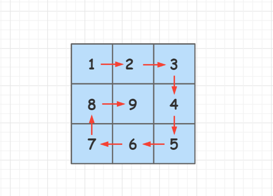

## 力扣500题刷题笔记

### [209. 长度最小的子数组](https://leetcode-cn.com/problems/minimum-size-subarray-sum/)

**题目**

给定一个含有 `n` 个正整数的数组和一个正整数 `target` 。

找出该数组中满足其和 `≥ target` 的长度最小的 **连续子数组** `[numsl, numsl+1, ..., numsr-1, numsr]` ，并返回其长度。如果不存在符合条件的子数组，返回 `0` 。

**示例 1：**

```
输入：target = 7, nums = [2,3,1,2,4,3]
输出：2
解释：子数组 [4,3] 是该条件下的长度最小的子数组。
```

**示例 2：**

```
输入：target = 4, nums = [1,4,4]
输出：1
```

**示例 3：**

```
输入：target = 11, nums = [1,1,1,1,1,1,1,1]
输出：0
```


提示：

- `1 <= target <= 10^9`
- `1 <= nums.length <= 10^5`
- `1 <= nums[i] <= 10^5`

**思路**

**(双指针)**  $O(n)$

给定一个含有 `n` 个正整数的数组和一个正整数 `target` ，让我们找出该数组中满足其和 `≥ target` 的长度最小的 **连续子数组**。

**样例：**


如样例所示，`target = 7`, `nums = [2,3,1,2,4,3]`，子数组 `[4,3]` 是该条件下的长度最小的子数组，因此返回`2`，下面来讲解双指针的做法。

我们定义两个指针`i`和`j`指针，将区间`[j,i]`看成滑动窗口，那么两个指针就分别表示滑动窗口的开始位置和结束位置，同时我们再维护一个`sum`变量用来存贮区间`[j,i]`连续数组的和。如果当前滑动窗口维护的区间和`sum`大于等于`target`，就说明当前的窗口是**可行**的，可行中的长度最短的滑动窗口就是答案。

**过程如下：**

1、初始化`i = 0`, `j = 0`，`sum = 0`，让两个指针都指向`nums`数组的开头，`i`指针用于扩展窗口，`j`指针用于收缩窗口。


2、枚举整个`nums`数组，枚举过程中，不断增加`i`使得滑动窗口向右扩展。每次向右扩展滑动窗口一步，维护的区间`[j,i]`的和`sum`就加上`nums[i]`的值，即 `sum += nums[i]`。

3、我们向右扩展滑动窗口的同时也不能忘记收缩滑动窗口。当`sum >= target`时，我们再去扩展滑动窗口就显得没有意义了。因此，如果`sum - nums[j] >= target`，也就是说我们减去`nums[j]`的值，`sum`的值依旧大于等于`target`，此时我们就可以向右收缩滑动窗口，`j++`并使`sum -= nums[j]`，即`sum -= nums[j++]`。 


4、如果收缩完的窗口区间值依旧满足`sum >= target`，我们就进行答案的更新，即 `res = min(res, i - j + 1)`。

**实现细节：**

如果不存在一个连续子数组满足其和`≥ target`，返回`0`。

**时间复杂度分析：** 每个元素最多访问两次，故时间复杂度为 $O(n)$，$n$是`nums`数组的长度。

**c++代码**

```c++
class Solution {
public:
    int minSubArrayLen(int target, vector<int>& nums) {
        int res = INT_MAX;
        int sum = 0;
        for(int i = 0, j = 0; i < nums.size(); i++)
        {
            sum += nums[i];     //向右扩展窗口
            while(sum - nums[j] >= target) sum -= nums[j++]; //向左收缩窗口
            if(sum >= target)  res = min(res, i - j + 1);    //区间更新
        }
        return res == INT_MAX ? 0 : res;	
    }
};
```

**java代码**

```java
class Solution {
    public int minSubArrayLen(int target, int[] nums) {
        int res = 0x3f3f3f;
        int sum = 0;
        for(int i = 0, j = 0; i < nums.length; i++)
        {
            sum += nums[i]; //向右扩展窗口
            while(sum - nums[j] >= target) sum -= nums[j++];    //向左收缩窗口
            if(sum >= target)  res = Math.min(res, i - j + 1);  //区间更新
        }
        return res == 0x3f3f3f ? 0 : res;
    }
}
```

### [59. 螺旋矩阵 II](https://leetcode-cn.com/problems/spiral-matrix-ii/) 

**题目**

给你一个正整数 `n` ，生成一个包含 `1` 到 `n^2` 所有元素，且元素按顺时针顺序螺旋排列的 `n x n` 正方形矩阵 `matrix` 。

**示例 1：**

 

```
输入：n = 3
输出：[[1,2,3],[8,9,4],[7,6,5]]
```

**示例 2：**

```
输入：n = 1
输出：[[1]]
```

**提示：**

- `1 <= n <= 20` 

**思路**]

**(模拟)**   $O(n^2)$

给定一个正整数`n`，让我们生成一个包含 `1` 到 `n2` 所有元素，且元素按顺时针顺序螺旋排列的 `n x n` 正方形矩阵 `matrix` 。

**样例： **



如样例所示，`n = 3` , 我们输出`[[1,2,3],[8,9,4],[7,6,5]]`，下面来讲解模拟的做法。

**具体过程如下：** 

1、我们顺时针定义四个方向：上右下左。`d = 0`表示向右走，`d = 1 `表示向下走，`d = 2`表示向左走，`d = 3`表示向上走，方向偏移数组定义为 `dx[4] = {0, 1, 0, -1}`, `dy[4] = {1, 0, -1, 0}`，如下图所示：  


2、当前位置定义为`(x,y)`，使用` d = (d + 1) % 4`来更改方向，那么下个要走的位置`(a, b)`则表示为： `a = x + dx[d], b = y + dy[d]`。

3、从左上角开始遍历，先往右走，走到不能走为止，然后更改到下个方向，再走到不能走为止，依次类推，遍历  $n^2$  个格子后停止。

**时间复杂度分析：** 矩阵中的每个数都被遍历一次，因此时间复杂度为$O(n^2)$，$n$是给定的正整数。

**c++代码**

```c++
class Solution {
public:
    vector<vector<int>> generateMatrix(int n) {
        vector<vector<int>>res(n, vector<int>(n, 0));
        int dx[4] = {0, 1, 0, -1}, dy[4] = {1, 0, -1, 0};  //方向偏移数组
        int x = 0, y = 0;  //当前位置
        for(int i = 1, d = 0; i <= n*n; i++)
        {
            res[x][y] = i; 
            int a = x + dx[d], b = y + dy[d]; 
            if(a <0 || a == n || b < 0 || b == n || res[a][b]){  //出界或者该位置已经被走过
                d = (d + 1) % 4;   //更改方向
                a = x + dx[d], b = y + dy[d];  //下一个要走的位置
            }
            x = a, y = b;    
        }
        return res;
    }
};
```

**java代码**

```java
class Solution {
    public int[][] generateMatrix(int n) {
        int[][] res = new int[n][n];
        int[] dx = {0, 1, 0, -1}, dy = {1, 0, -1, 0};  //方向偏移数组
        int x = 0, y = 0;  //当前位置
        for(int i = 1, d = 0; i <= n*n; i++)
        {
            res[x][y] = i; 
            int a = x + dx[d], b = y + dy[d]; 
            if(a <0 || a == n || b < 0 || b == n || res[a][b] != 0){  //出界或者该位置已经被走过
                d = (d + 1) % 4;   //更改方向
                a = x + dx[d] ; 
                b = y + dy[d];  //下一个要走的位置
            }
            x = a;
            y = b;    
        }
        return res;
    }
}
```

### [394. 字符串解码](https://leetcode-cn.com/problems/decode-string/)

**题目**

给定一个经过编码的字符串，返回它解码后的字符串。

编码规则为: `k[encoded_string]`，表示其中方括号内部的 `encoded_string` 正好重复 `k` 次。注意 `k` 保证为正整数。

你可以认为输入字符串总是有效的；输入字符串中没有额外的空格，且输入的方括号总是符合格式要求的。

此外，你可以认为原始数据不包含数字，所有的数字只表示重复的次数` k` ，例如不会出现像 `3a` 或 `2[4]` 的输入。

 **示例 1：**

```
输入：s = "3[a]2[bc]"
输出："aaabcbc"
```

**示例 2：**

```
输入：s = "3[a2[c]]"
输出："accaccacc"
```

**示例 3：**

```
输入：s = "2[abc]3[cd]ef"
输出："abcabccdcdcdef"
```

**示例 4：**

```
输入：s = "abc3[cd]xyz"
输出："abccdcdcdxyz"
```

**思路**

**(递归)**  $O(n)$

给定一个经过编码的字符串，返回它解码后的字符串。

**样例：**


如样例所示，`s = "3[a]2[bc]"`，我们根据编码规则解码后输出`aaabcbc`，下面来讲解**递归**的做法。 

我们首先来解析一下这个编码规则，方括号`[]`内包含要重复的字符串，方括号`[]`外的数字代表重复的次数，而且括号是可以嵌套的，比如样例2，` s = "3[a2[c]]"`。要想解码外层括号的字符串，就必须要先解码内层括号的字符串，这样就给了我们一种启发，我们可以先递归到内层，由内层到外层，层层解码。****

**递归函数设计：**

```c++
string dfs(string &s, int &u)
```

`s`是当前要遍历的字符串，`u`是当前遍历的字符串的位置下标。

**具体过程如下：** 

从左到右遍历整个字符串，在：

- 1、如果当前遇到的字符是字母，我们将其加入到答案字符串`res`中。
- 2、如果当前遇到了 `k[encoded_string]` 规则，则解析出数字`k`和字符串`encoded_string`，然后递归解码字符串`encoded_string`。
- 3、每次递归结束后，我们将解码得到的结果字符串`str`重复`k`次，然后将其添加到答案中。

**时间复杂度分析：** 假设共有 `n` 个规则，则最坏情况下所有规则会嵌套 `n` 层：`k[k[...k[encoded_string]]]`。则最终解码后的字符串长度是 `encoded_string.length * k^n`。所以时间复杂度是 $O(k^n)$。 

**c++代码**

```c++
class Solution {
public:
    string decodeString(string s) {
        int u = 0;    //当前遍历的字符串的位置下标
        return dfs(s, u);
    }
    string dfs(string &s, int &u){
        string res;
        while(u < s.size() && s[u] != ']'){
            if(s[u] >= 'a' && s[u] <= 'z' || s[u] >= 'A' && s[u] <= 'Z')   res += s[u++]; 
            else if(s[u] >= '0' && s[u] <= '9')
            {
                int k = u, num = 0;
                while(s[k] >= '0' && s[k] <= '9') num = num * 10 + s[k++] -'0';   //将字符转换成数字
                u = k + 1;               // 跳过左括号，递归到内层
                string str = dfs(s, u);  // 返回内层解码结果
                u++;                     // 跳过右括号
                while(num--)  res += str; 
            }
        }
        return res;
    }
};
```

**java代码**

```java

```

### [152. 乘积最大子数组](https://leetcode-cn.com/problems/maximum-product-subarray/)

**题目**

给你一个整数数组 `nums` ，请你找出数组中乘积最大的连续子数组（该子数组中至少包含一个数字），并返回该子数组所对应的乘积。

**示例 1:**

```
输入: [2,3,-2,4]
输出: 6
解释: 子数组 [2,3] 有最大乘积 6。
```

**示例 2:**

```
输入: [-2,0,-1]
输出: 0
解释: 结果不能为 2, 因为 [-2,-1] 不是子数组。
```

**思路：** 
**(动态规划)**  $O(n)$

给你一个整数数组 `nums` ，让我们找出数组中乘积最大的连续子数组对应的乘积。

**样例：**


如样例所示，`nums = [2,3,-2,4]`，连续子数组 `[2,3] `有最大乘积 `6`，下面来讲解动态规划的做法。

**状态表示：** 

`f[i]`表示以`num[i]`结尾的连续子数组乘积的最大值。

**假设`nums`数组都是非负数**，对于每个以`nums[i]`结尾的连续子数组，我们有两种选择方式：

- 1、只有`nums[i]`一个数，那么以`num[i]`结尾的连续子数组乘积的最大值则为`nums[i]` ，即`f[i] = nums[i]`。
- 2、以`nums[i]`为结尾的多个数连续组成的子数组，那么问题就转化成了以`nums[i - 1]`结尾的连续子数组的最大值再乘以`nums[i]`的值，即 `f[i] = f[i - 1] * nums[i]`。

**图示：** 


最后的结果是两种选择中取最大的一个，因此**状态转移方程为：** `f[i] = max(nums[i], f[i - 1] * nums[i])`。

但是`nums`数组中包含有正数，负数和零，当前的最大值如果乘以一个负数就会变成最小值，当前的最小值如果乘以一个负数就会变成一个最大值，因此我们还需要维护一个最小值。

**新的状态表示：**

`f[i]`表示以`num[i]`结尾的连续子数组乘积的最大值，`g[i]`表示以`num[i]`结尾的连续子数组乘积的最小值。 

我们先去讨论以`nums[i]`结尾的连续子数组的最大值的状态转移方程：

- 1、如果`nums[i] >= 0`，同刚开始讨论的一样，`f[i] = max(nums[i], f[i - 1] * nums[i])`。
- 2、如果`nums[i] < 0`，只有`nums[i]`一个数，最大值为`nums[i]`。有多个数的话，问题就转化成了以`nums[i - 1]`结尾的连续子数组的最小值再乘以`nums[i]`(最小值乘以一个负数变成最大值)，即`f[i] = max(nums[i], g[i - 1] * nums[i])` 。 

**图示：** 


综上，最大值的状态转移方程为： `f[i] = max(nums[i], max(f[i - 1] * nums[i], g[i - 1] * nums[i]))`。

再去讨论以`nums[i]`结尾的连续子数组的最小值的状态转移方程：

- 1、如果`nums[i] >= 0`，同最大值的思考方式一样，只需把`max`换成`min`，即`g[i] = min(nums[i], g[i - 1] * nums[i])`。
- 2、如果`nums[i] < 0`，只有`nums[i]`一个数，最小值为`nums[i]`。有多个数的话，问题就转化成了以`nums[i - 1]`结尾的连续子数组的最大值再乘以`nums[i]`(最大值乘以一个负数变成最小值)，即`f[i] = min(nums[i], f[i - 1] * nums[i])` 。

**图示：** 


综上，最小值的状态转移方程为： `g[i] = min(nums[i], min(g[i - 1] * nums[i], f[i - 1] * nums[i]))`。

最后的结果就是分别以`nums[0]`或`nums[1]`，，，或`nums[i]`为结尾的连续子数组中取乘积结果最大的。

**初始化：** 

只有一个数`nums[0]`时，以`nums[i]`结尾的连续子数组乘积的最大值和最小值都为`nums[0]`。

**时间复杂度分析：** 只遍历一次`nums`数组，因此时间复杂度为$O(n)$，$n$是`nums`数组的长度。

**c++代码**

```c++
class Solution {
public:
    int maxProduct(vector<int>& nums) {
       int n = nums.size(), res = nums[0];
       vector<int>f(n + 1, 0), g(n + 1, 0);
       f[0] = nums[0], g[0] = nums[0];  // 初始化
       for(int i = 1; i < n; i++)
       {
           f[i] = max(nums[i], max(f[i - 1] * nums[i], g[i - 1] * nums[i]));  //乘积最大值
           g[i] = min(nums[i], min(g[i - 1] * nums[i], f[i - 1] * nums[i]));  //乘积最小值
           res = max(res, f[i]);
       }         
       return res;         
    }
};
```

**java代码**

```java
class Solution {
    public int maxProduct(int[] nums) {
       int n = nums.length, res = nums[0];
       int[] f = new int[n + 1], g = new int [n + 1];
       f[0] = nums[0];  // 初始化
       g[0] = nums[0];
       for(int i = 1; i < n; i++)
       { 
           f[i] = Math.max(nums[i], Math.max(f[i - 1] * nums[i], g[i - 1] * nums[i])); //乘积最大值
           g[i] = Math.min(nums[i], Math.min(g[i - 1] * nums[i], f[i - 1] * nums[i])); //乘积最小值
           res = Math.max(res, f[i]);
       }         
       return res;   
    }
}
```

### [662. 二叉树最大宽度](https://leetcode-cn.com/problems/maximum-width-of-binary-tree/)

**题目**

给定一个二叉树，编写一个函数来获取这个树的最大宽度。树的宽度是所有层中的最大宽度。这个二叉树与**满二叉树（full binary tree）**结构相同，但一些节点为空。

每一层的宽度被定义为两个端点（该层最左和最右的非空节点，两端点间的`null`节点也计入长度）之间的长度。

**示例 1:**

```
输入: 

           1
         /   \
        3     2
       / \     \  
      5   3     9 

输出: 4
解释: 最大值出现在树的第 3 层，宽度为 4 (5,3,null,9)。
```

**示例 2:**

```
输入: 

          1
         /  
        3    
       / \       
      5   3     

输出: 2
解释: 最大值出现在树的第 3 层，宽度为 2 (5,3)。
```

**示例 3:**

```
输入: 

          1
         / \
        3   2 
       /        
      5      

输出: 2
解释: 最大值出现在树的第 2 层，宽度为 2 (3,2)。

```

**示例 4:**

```
输入: 

          1
         / \
        3   2
       /     \  
      5       9 
     /         \
    6           7
输出: 8
解释: 最大值出现在树的第 4 层，宽度为 8 (6,null,null,null,null,null,null,7)。

```

**注意:** 答案在32位有符号整数的表示范围内。

**思路**

**c++代码**

```c++
/**
 * Definition for a binary tree node.
 * struct TreeNode {
 *     int val;
 *     TreeNode *left;
 *     TreeNode *right;
 *     TreeNode() : val(0), left(nullptr), right(nullptr) {}
 *     TreeNode(int x) : val(x), left(nullptr), right(nullptr) {}
 *     TreeNode(int x, TreeNode *left, TreeNode *right) : val(x), left(left), right(right) {}
 * };
 */
class Solution {
public:
    #define ull unsigned long long
    ull res = 0;
    unordered_map<int, ull> map;   //存储每一个深度对应的第一个节点编号
    int widthOfBinaryTree(TreeNode* root) {
        if(!root)  return 0;
        dfs(root,0,0);
        return res;
    }
    void dfs(TreeNode* root, int depth, ull pos) //root: 当前节点, depth: 深度, pos: 当前节点编号
    {
        if(!root)  return ;
        map.insert({depth,pos});
        res = max(res, pos - map[depth] + 1);
        dfs(root->left,  depth + 1, 2 * pos);
        dfs(root->right, depth + 1, 2 * pos + 1);
    }
};
```

**java代码**

```java

```

### [739. 每日温度](https://leetcode-cn.com/problems/daily-temperatures/)

**题目**

请根据每日 **气温** 列表 `temperatures` ，请计算在每一天需要等几天才会有更高的温度。如果气温在这之后都不会升高，请在该位置用 `0` 来代替。 

**示例 1:**

````
输入: temperatures = [73,74,75,71,69,72,76,73]
输出: [1,1,4,2,1,1,0,0]
````

**示例 2:**

```
输入: temperatures = [30,40,50,60]
输出: [1,1,1,0]
```

**示例 3:**

```
输入: temperatures = [30,60,90]
输出: [1,1,0]
```

**提示：**

- `1 <= temperatures.length <= 105`
- `30 <= temperatures[i] <= 100` 

**思路**

**c++代码**

```c++
class Solution {
public:
    vector<int> dailyTemperatures(vector<int>& T) {
        stack<int> stk;
        vector<int> res(T.size());
        for(int i=0; i< T.size(); i++)
        {
            while(stk.size() && T[stk.top()] < T[i]){
                res[stk.top()] = i - stk.top();
                stk.pop();
            }
            stk.push(i);
        }
        return res;
    }
};
```

**java代码**

```java
```

### [61. 旋转链表](https://leetcode-cn.com/problems/rotate-list/)

**题目**

给你一个链表的头节点 `head` ，旋转链表，将链表每个节点向右移动 `k` 个位置。

**示例 1：**


```
输入：head = [1,2,3,4,5], k = 2
输出：[4,5,1,2,3]
```

**示例 2：**


```
输入：head = [0,1,2], k = 4
输出：[2,0,1]
```

**提示：**

- 链表中节点的数目在范围 `[0, 500]` 内
- `-100 <= Node.val <= 100`
- `0 <= k <= 2 * 109`

**思路**

**(模拟)**  $O(n)$

给你一个链表的头节点 `head` ，然后将链表每个节点向右移动 `k` 个位置。

**样例：** 


如样例所示，`head = [1,2,3,4,5]`，`k = 2`，我们输出`[4,5,1,2,3]`。下面来讲解模拟的做法。

假设链表的长度为`n`，为了将链表每个节点向右移动 `k` 个位置，我们只需要将链表的后 `k % n`个节点移动到链表的最前面，然后将链表的后`k % n`个节点和前 `n - k`个节点连接到一块即可。

**具体过程如下：**

1、首先遍历整个链表，求出链表的长度`n`，并找出链表的尾节点`tail`。


2、由于`k`可能很大，所以我们令 `k = k % n`，然后再次从头节点`head`开始遍历，找到第`n - k`个节点`p`，那么`1 ~ p`是链表的前 `n - k`个节点，`p+1 ~ n`是链表的后`k`个节点。


3、接下来就是依次执行` tail->next = head`，`head = p->next`，`p->next = nullptr`，将链表的后`k`个节点和前 `n - k`个节点拼接到一块，让`head`指向新的头节点，新的尾节点的`next`指针指向`null`。


4、最后返回链表的新的头节点`head`。

**时间复杂度分析：** 链表一共被遍历两次，因此总的时间复杂度为$O(n)$，$n$是链表的长度。

**c++代码**

```c++
/**
 * Definition for singly-linked list.
 * struct ListNode {
 *     int val;
 *     ListNode *next;
 *     ListNode() : val(0), next(nullptr) {}
 *     ListNode(int x) : val(x), next(nullptr) {}
 *     ListNode(int x, ListNode *next) : val(x), next(next) {}
 * };
 */
class Solution {
public:
    ListNode* rotateRight(ListNode* head, int k) {
        if(!head || !k)  return head;
        int n = 0;        //链表的长度
        ListNode* tail;   //尾节点
        for(ListNode* p = head; p ; p = p->next){
            tail = p;
            n++;
        }
        k %= n;  
        ListNode* p = head;
        for(int i = 0; i < n - k - 1; i++)   p = p->next;  //找到链表的第n-k个节点
        tail->next = head;
        head = p->next;
        p->next = nullptr;
        return head;     //返回新的头节点
    }
};
```

**java代码**

```javascript
/**
 * Definition for singly-linked list.
 * public class ListNode {
 *     int val;
 *     ListNode next;
 *     ListNode() {}
 *     ListNode(int val) { this.val = val; }
 *     ListNode(int val, ListNode next) { this.val = val; this.next = next; }
 * }
 */
class Solution {
    public ListNode rotateRight(ListNode head, int k) {
        if(head == null|| k == 0)  return head;
        int n = 0;			   //链表的长度
        ListNode tail = null;  //尾节点
        for(ListNode p = head; p != null ; p = p.next){
            tail = p;
            n++;
        }
        k %= n;
        ListNode p = head;
        for(int i = 0; i < n - k - 1; i++)  p = p.next;   //找到链表的第n-k个节点
        tail.next = head;
        head = p.next;
        p.next = null;
        return head;
    }
}
```

### [402. 移掉 K 位数字](https://leetcode-cn.com/problems/remove-k-digits/)

**题目**

给你一个以字符串表示的非负整数 `num` 和一个整数 `k` ，移除这个数中的 `k` 位数字，使得剩下的数字最小。请你以字符串形式返回这个最小的数字。

**示例 1 ：**

````
输入：num = "1432219", k = 3
输出："1219"
解释：移除掉三个数字 4, 3, 和 2 形成一个新的最小的数字 1219 。
````

**示例 2 ：**

```
输入：num = "10200", k = 1
输出："200"
解释：移掉首位的 1 剩下的数字为 200. 注意输出不能有任何前导零。
```

**示例 3 ：**

```
输入：num = "10", k = 2
输出："0"
解释：从原数字移除所有的数字，剩余为空就是 0 。
```

**提示：**

- `1 <= k <= num.length <= 105`
- `num` 仅由若干位数字（0 - 9）组成
- 除了 **0** 本身之外，`num` 不含任何前导零

**思路**


**c++代码**

```c++
class Solution {
public:
    string removeKdigits(string num, int k) {
        string res;  //字符串模拟单调栈
        for(auto c : num){
            while(k && res.size() && res.back() > c){
                res.pop_back();
                k--;
            }
            res += c;
        }
        while(k--)  res.pop_back();
        k = 0;
        while(k < res.size() && res[k] == '0')  k++; //去除前导0
        return k != res.size() ? res.substr(k) : "0";
    }
};
```

**java代码**

```java
```

### [50. Pow(x, n)](https://leetcode-cn.com/problems/powx-n/)

**题目**

实现 [pow(*x*, *n*)](https://www.cplusplus.com/reference/valarray/pow/) ，即计算 x 的 n 次幂函数（即，$x^n$）。 

**示例 1：**

```
输入：x = 2.00000, n = 10
输出：1024.00000
```

**示例 2：**

```
输入：x = 2.10000, n = 3
输出：9.26100
```

**示例 3：**

```
输入：x = 2.00000, n = -2
输出：0.25000
解释：2-2 = 1/22 = 1/4 = 0.25
```

**提示：**

- `-100.0 < x < 100.0`
- `-231 <= n <= 2^31-1`
- `-104 <= x^n <= 10^4`

**思路**

**c++代码**

```c++
class Solution {
public:
    double myPow(double x, long n) {
        int  is_minus = 0;
        if(n < 0){
            n = -n;
            is_minus = 1;
        } 
        double res = 1;
        while(n){
            if(n & 1)  res *= x;
            n >>= 1;
            x *= x;
        }
        return !is_minus ? res : 1 / res;  
    }
};
```

**java代码**

```java
 
```

### [213. 打家劫舍 II](https://leetcode-cn.com/problems/house-robber-ii/)

字节电商服务端一面

**题目**

你是一个专业的小偷，计划偷窃沿街的房屋，每间房内都藏有一定的现金。这个地方所有的房屋都 **围成一圈** ，这意味着第一个房屋和最后一个房屋是紧挨着的。同时，相邻的房屋装有相互连通的防盗系统，**如果两间相邻的房屋在同一晚上被小偷闯入，系统会自动报警 。**

给定一个代表每个房屋存放金额的非负整数数组，计算你 **在不触动警报装置的情况下** ，今晚能够偷窃到的最高金额。

 **示例 1：**

```
输入：nums = [2,3,2]
输出：3
解释：你不能先偷窃 1 号房屋（金额 = 2），然后偷窃 3 号房屋（金额 = 2）, 因为他们是相邻的。
```

**示例 2：**

```
输入：nums = [1,2,3,1]
输出：4
解释：你可以先偷窃 1 号房屋（金额 = 1），然后偷窃 3 号房屋（金额 = 3）。
     偷窃到的最高金额 = 1 + 3 = 4 。
```

**示例 3：**

```
输入：nums = [0]
输出：0
```

**思路**

给定一个代表金额的非负整数数组`nums`，相邻房间不可偷并且房间是围成一圈的，让我们输出可以偷窃到的最高金额。

**样例：**  


如样例所示，`nums = [1,2,3,1]`，偷窃`1`，`3`，号房间可以获得最高金额`4`。

**打家劫舍 I** 

我们先来看看「[198. 打家劫舍](https://leetcode-cn.com/problems/house-robber)」房间**单排排列**的动态规划的做法。

**状态表示：**`f[i]`表示偷窃`1`号到`i`号房间所能获得的最高金额。那么，`f[n]`就表示偷窃`1`号到`n`号房间所能获得的最高金额，即为答案。

**状态计算：**  

假设有`i`间房间，考虑最后一间偷还是不偷房间，有两种选择方案：

- 1、偷窃前`i-1`间房间，不偷窃最后一间房间，那么问题就转化为了偷窃`1`号到`i- 1`号房间所能获得的最高金额，即`f[i] = f[i-1]  `。  

  

- 2、偷窃前`i - 2`间房间和最后一间房间 (相邻的房屋不可闯入)，那么问题就转化为了偷窃`1`号到`i- 2`号房间所能获得的最高金额再加上偷窃第`i`号房间的金额，即`f[i] = f[i - 2] + nums[i]`。 (下标均从`1`开始)


两种方案，选择其中金额最大的一个。因此**状态转移方程为：** ` f[i] = max(f[i - 1], f[i - 2] + nums[i])`。 (下标均从`1`开始)

**打家劫舍 II**

我们已经知道了房间**单排排列**的状态转移方程，接下来思考房间**环状排列**的做法。

房间**环状排列** 意味着第一间和最后一间不能同时选择，因此我们可以分成两种情况来讨论：

- 1、不偷窃最后一间房间，那么问题转化为偷窃`1`号到`i - 1`号房间所能获得的最高金额。
- 2、不偷窃第一间房间，那么问题转化为偷窃`2`号到`i`号房间所能获得的最高金额。

两种情况中取最大值，这样我们就把**环状排列**问题转化为了两个**单排排列**的子问题。

我们定义两个数组`f[]`和`g[]`，分别用`f[n-1]`和`g[n]`两个数组值来表示区间`[1, n - 1]`和`[2, n]`的最大金额值，图示过程如下：


**初始化：**

`f[1] = nums[0]`，只偷窃`1`号房间所能获得的最高金额为`nums[0]`。

`g[2] = nums[1]`，把第二间房间当成房间单排排列的起点，只偷窃`2`号房间所能获得的最高金额为`nums[1]`。

**实现细节：** 

我们定义的状态表示`f[]`、`g[]`数组以及`nums[]`数组下标均是从`1`开始的，而题目给出的`nums[]`数组下标是从`0`开始的。为了一 一对应，状态转移方程中的`nums[i]`的值要往前错一位，取`nums[i - 1]`，这点细节希望大家可以注意一下。

**时间复杂度分析：** $O(n)$，其中 $n$是数组长度。需要对数组遍历一次。

**c++代码**

```c++
class Solution {
public:
    int rob(vector<int>& nums) {
       int n = nums.size();
       if(n == 1) return nums[0];       //只有一间房间，返回nums[0]
       vector<int>f(n + 1), g(n + 1);
       f[1] = nums[0], g[2] = nums[1];  //初始化
       for(int i = 2; i <= n - 1; i++)  f[i] = max(f[i - 1], f[i - 2] + nums[i - 1]); //区间[1,n-1]最大值
       for(int i = 3; i <= n; i++)      g[i] = max(g[i - 1], g[i - 2] + nums[i - 1]); //区间[2,n]最大值
       return max(f[n - 1], g[n]);
    }
};
```

**java代码**

```java
class Solution {
    public int rob(int[] nums) {
       int n = nums.length;
       if(n == 1) return nums[0];     //只有一间房间，返回nums[0]
       int[] f = new int[n + 1],  g = new int[n + 1];
       f[1] = nums[0];    //初始化
       g[2] = nums[1];    
       for(int i = 2; i <= n - 1; i++) f[i] = Math.max(f[i - 1], f[i - 2] + nums[i - 1]);
       for(int i = 3; i <= n; i++)     g[i] = Math.max(g[i - 1], g[i - 2] + nums[i - 1]);
       return Math.max(f[n - 1], g[n]);
    }
}
```

### [440. 字典序的第K小数字](https://leetcode-cn.com/problems/k-th-smallest-in-lexicographical-order/)

**题目**

给定整数 `n` 和 `k`，找到 `1` 到 `n` 中字典序第 `k` 小的数字。

注意：$1 ≤ k ≤ n ≤ 10^9$。 

**示例 :**

```
输入:
n: 13   k: 2

输出:
10

解释:
字典序的排列是 [1, 10, 11, 12, 13, 2, 3, 4, 5, 6, 7, 8, 9]，所以第二小的数字是 10。
```

**思路**

**c++代码**

```c++
```

**java代码**

```java
```

### [74. 搜索二维矩阵](https://leetcode-cn.com/problems/search-a-2d-matrix/)

**题目**

编写一个高效的算法来判断 `m x n` 矩阵中，是否存在一个目标值。该矩阵具有如下特性：

- 每行中的整数从左到右按升序排列。
- 每行的第一个整数大于前一行的最后一个整数。

**示例 1：**


```
输入：matrix = [[1,3,5,7],[10,11,16,20],[23,30,34,60]], target = 3
输出：true
```

**示例 2：**


```
输入：matrix = [[1,3,5,7],[10,11,16,20],[23,30,34,60]], target = 13
输出：false
```

**提示：**

- `m == matrix.length`
- `n == matrix[i].length`
- `1 <= m, n <= 100`
- `-10^4 <= matrix[i][j], target <= 10^4` 

**思路**

**c++代码**

```c++
class Solution {
public:
    bool searchMatrix(vector<vector<int>>& matrix, int target) {
        int n = matrix.size(), m = matrix[0].size();
        int l = 0, r = n *m - 1;
        while(l < r)
        {
            int mid = (l + r) / 2;
            if(matrix[mid / m][mid % m] >= target) r = mid;
            else l = mid + 1;
        } 
        return matrix[r / m][r % m] == target ;
    }
};
```

**java代码**

```java
```

### [40. 组合总和 II](https://leetcode-cn.com/problems/combination-sum-ii/)

**题目**

给定一个数组 `candidates` 和一个目标数 `target` ，找出 `candidates` 中所有可以使数字和为 `target` 的组合。

`candidates` 中的每个数字在每个组合中只能使用一次。

注意：解集不能包含重复的组合。  

**示例 1:**

```c++
输入: candidates = [10,1,2,7,6,1,5], target = 8,
输出:
[
[1,1,6],
[1,2,5],
[1,7],
[2,6]
]


```

**示例 2:**

```
输入: candidates = [2,5,2,1,2], target = 5,
输出:
[
[1,2,2],
[5]
]
```

**提示:**

- `1 <= candidates.length <= 100`
- `1 <= candidates[i] <= 50`
- `1 <= target <= 30`

**思路**

**c++代码**

```c++
class Solution {
public:
    vector<vector<int>> res;   //记录答案
    vector<int> path;          //记录路径 

    vector<vector<int>> combinationSum2(vector<int>& candidates, int target) {
        sort(candidates.begin(), candidates.end());
        dfs(candidates, 0, target);
        return res;
    }

    void dfs(vector<int>& c, int start, int target)
    {
        if(target < 0) return;  //剪枝
        if(target == 0)
        {
            res.push_back(path);
            return ;
        }
        for(int i = start; i < c.size(); i++)
        {
            if(c[i] <= target)           
            {
                if(i > start && c[i] == c[i - 1]) continue;  //去重
                path.push_back(c[i]);
                dfs(c, i + 1, target - c[i]);
                path.pop_back();           //回溯
            }
        }

    }
};
```

**java代码**

```java
```

### [329. 矩阵中的最长递增路径](https://leetcode-cn.com/problems/longest-increasing-path-in-a-matrix/)

**题目**

给定一个 `m x n` 整数矩阵 `matrix` ，找出其中 **最长递增路径** 的长度。

对于每个单元格，你可以往上，下，左，右四个方向移动。 你 **不能** 在 对角线 方向上移动或移动到 **边界外**（即不允许环绕）。

**示例 1：** 


```
输入：matrix = [[9,9,4],[6,6,8],[2,1,1]]
输出：4 
解释：最长递增路径为 [1, 2, 6, 9]。
```

**示例 2：**


```
输入：matrix = [[3,4,5],[3,2,6],[2,2,1]]
输出：4 
解释：最长递增路径是 [3, 4, 5, 6]。注意不允许在对角线方向上移动。
```

**示例 3：**

```
输入：matrix = [[1]]
输出：1
```

**提示：**

- `m == matrix.length`
- `n == matrix[i].length`
- `1 <= m, n <= 200`
- `0 <= matrix[i][j] <= 2^31 - 1`

**思路**

**(记忆化搜索 + 动态规划)**   $O(n^2)$

**状态表示：**  `f[i][j]`表示走到`(i,j)`这个格子时的最大长度。

**状态计算：**   枚举上下左右四个格子，如果某个格子`(a,b)`比当前格子高，则用该格子更新当前格子的最大长度：`f[i][j] = max(f[i][j], dfs(a, b) + 1)`。


**时间复杂度分析：** 状态数量$O(n^2)$， 状态计算$O(1)$，所以总时间复杂度是 $O(n^2)$。

**c++代码**

```c++
class Solution {
public:
    int dx[4] = {-1, 0, 1, 0}, dy[4] = {0, 1, 0, -1};
    vector<vector<int>>f, w;
    int n, m; 
    int dfs(int x,int y)
    {
        if(f[x][y]) return f[x][y];
        f[x][y] = 1;
        for(int i = 0; i < 4; i++)
        {
            int a = x + dx[i], b = y + dy[i];
            if(a >= 0 && a < n && b >= 0 && b < m && w[x][y] < w[a][b]){
                f[x][y] = max(f[x][y], dfs(a, b) + 1);
            }
        }
        return f[x][y];
    }

    int longestIncreasingPath(vector<vector<int>>& matrix) {
        w = matrix;
        n = w.size(), m = w[0].size();
        f = vector<vector<int>>(n, vector<int>(m, 0)); 
        int res = 0;
        for(int i = 0; i < n; i++)
            for(int j = 0; j < m; j++)
                res = max(res, dfs(i, j));
        return res;
    }

};
```

**java代码**

```java
```

### [135. 分发糖果](https://leetcode-cn.com/problems/candy/)

**题目**

老师想给孩子们分发糖果，有 `N` 个孩子站成了一条直线，老师会根据每个孩子的表现，预先给他们评分。

你需要按照以下要求，帮助老师给这些孩子分发糖果：

- 每个孩子至少分配到 `1` 个糖果。
- 评分更高的孩子必须比他两侧的邻位孩子获得更多的糖果。

那么这样下来，老师至少需要准备多少颗糖果呢？

**示例 1：**

````
输入：[1,0,2]
输出：5
解释：你可以分别给这三个孩子分发 2、1、2 颗糖果。
````

**示例 2：**

```
输入：[1,2,2]
输出：4
解释：你可以分别给这三个孩子分发 1、2、1 颗糖果。
     第三个孩子只得到 1 颗糖果，这已满足上述两个条件。
```

**思路**

**(记忆化搜索)**  $O(n)$ 

1、`f[i]`记录的是`i`孩子至少分发多少糖果

2、dfs(x)用来计算`f[x]`的值

3、搜索`f[x]`过程中，初始化`f[x] = 1`，每个孩子至少分配到 `1` 个糖果。

- 如果左边的孩子比`x`孩子评分低时，则`f[x] = max(f[x], dfs(x - 1) + 1)`;
- 如果右边的孩子比`x`孩子评分低时，则`f[x] = max(f[x], dfs(x + 1) + 1)`;

**c++代码**

```c++
class Solution {
public:
    int n;
    vector<int>f, w;
    int dfs(int x)
    {
        if(f[x] != -1)  return f[x];
        f[x] = 1;
        if(x && w[x - 1] < w[x]) f[x] = max(f[x], dfs(x - 1) + 1);
        if(x + 1 < n && w[x + 1] < w[x]) f[x] = max(f[x], dfs(x + 1) + 1);
        return f[x];
    }
    int candy(vector<int>& ratings) {
        w = ratings, n = ratings.size();
        int res = 0;
        f = vector<int>(n, -1);
        for(int i = 0; i < n; i++) res += dfs(i);
        return res;    
    }
};
```

**java代码**

```java
```

