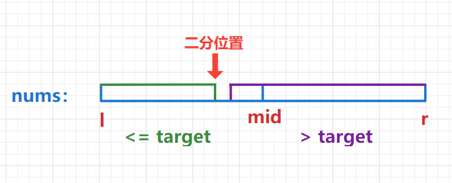
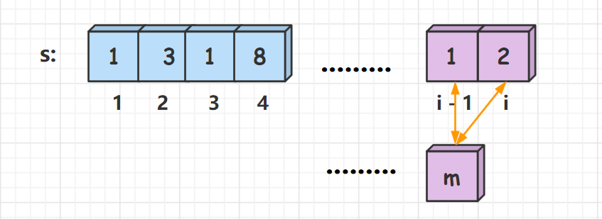

## 力扣500题刷题笔记

### [191. 位1的个数](https://leetcode-cn.com/problems/number-of-1-bits/)

**题目**

编写一个函数，输入是一个无符号整数（以二进制串的形式），返回其二进制表达式中数字位数为 `'1'` 的个数（也被称为汉明重量）。

**提示：**

- 请注意，在某些语言（如 Java）中，没有无符号整数类型。在这种情况下，输入和输出都将被指定为有符号整数类型，并且不应影响您的实现，因为无论整数是有符号的还是无符号的，其内部的二进制表示形式都是相同的。
- 在 Java 中，编译器使用二进制补码记法来表示有符号整数。因此，在上面的 示例 `3` 中，输入表示有符号整数` -3`。

**示例 1：**

```
输入：00000000000000000000000000001011
输出：3
解释：输入的二进制串 00000000000000000000000000001011 中，共有三位为 '1'。
```

**示例 2：**

```
输入：00000000000000000000000010000000
输出：1
解释：输入的二进制串 00000000000000000000000010000000 中，共有一位为 '1'。
```

**示例 3：**

```
输入：11111111111111111111111111111101
输出：31
解释：输入的二进制串 11111111111111111111111111111101 中，共有 31 位为 '1'。
```

**提示：**

- 输入必须是长度为 `32` 的 **二进制串** 。

**进阶**：

- 如果多次调用这个函数，你将如何优化你的算法？

**思路**

**(位运算)**   $O(1)$

1、`lowbit(x)`函数    用于返回`x`的最后一位`1`以及其后面`0`对应的数。

```c++
int lowbit(int x)
{
    return x & (-x);
}
```

比如：`lowbit(10) = lowbit(1010) => (10) = 2`

2、整数`n`的二进制表示中第`k`位是多少，比如：$n = 15 = (1111)_2$

- 先把第`k`位移到最后一位`n>>k`
- 再看个位是几，`x&1` 

**c++代码1**

```c++
class Solution {
public:
    int hammingWeight(uint32_t n) {
        int res = 0;
        for(int i = 0; i < 32; i++){
            res += n>>i&1;
        }
        return res;
    }
};
```

**c++代码2**

```java
class Solution {
public:
    int hammingWeight(uint32_t n) {
        int res = 0;
        while(n)
        {
            n -= n & -n; //返回二进制中最后一位1以及其后面0对应的数。
            res++; 
        }
        return res;
    }
};
```

### [75. 颜色分类](https://leetcode-cn.com/problems/sort-colors/)

**题目**

给定一个包含红色、白色和蓝色，一共 `n` 个元素的数组，原地对它们进行排序，使得相同颜色的元素相邻，并按照红色、白色、蓝色顺序排列。

此题中，我们使用整数 `0`、 `1` 和 `2` 分别表示红色、白色和蓝色。

**示例 1：**

```
输入：nums = [2,0,2,1,1,0]
输出：[0,0,1,1,2,2]
```

**示例 2：**

```
输入：nums = [2,0,1]
输出：[0,1,2]
```

**示例 3：**

```
输入：nums = [0]
输出：[0]
```

**示例 4：**

```
输入：nums = [1]
输出：[1]
```

**提示：**

- `n == nums.length`
- `1 <= n <= 300`
- `nums[i]` 为 `0`、`1` 或 `2` 

**思路**

**(双指针)**  $O(n)$

类似于刷油漆。

**c++代码**

```c++
class Solution {
public:
    void sortColors(vector<int>& nums) {
        int j = 0, k = 0;
        for(int i = 0; i < nums.size(); i++){
            int num = nums[i];
            nums[i] = 2;
            if(num < 2) nums[j++] = 1;
            if(num < 1) nums[k++] = 0; 
        }
    }
};
```

**java代码**

```java
```

### [114. 二叉树展开为链表](https://leetcode-cn.com/problems/flatten-binary-tree-to-linked-list/)

**题目**

给你二叉树的根结点 `root` ，请你将它展开为一个单链表：

- 展开后的单链表应该同样使用 `TreeNode` ，其中 `right` 子指针指向链表中下一个结点，而左子指针始终为 `null` 。
- 展开后的单链表应该与二叉树 **先序遍历** 顺序相同。 

**示例 1：**


```
输入：root = [1,2,5,3,4,null,6]
输出：[1,null,2,null,3,null,4,null,5,null,6]
```

**示例 2：**

```
输入：root = []
输出：[]
```

**示例 3：**

```
输入：root = [0]
输出：[0]
```

**提示：**

- 树中结点数在范围 `[0, 2000]` 内
- `-100 <= Node.val <= 100`

**进阶：**你可以使用原地算法（`O(1)` 额外空间）展开这棵树吗？

**思路**

**(树的遍历)**  $O(n)$

对于当前节点：

- 1、如果存在左子树，则将左子树右链插入当前节点右边。
- 2、否则，遍历至右子树


**c++代码**

```c++
class Solution {
public:
    void flatten(TreeNode* root) {
        while(root) // 当前节点
        {
            TreeNode* p = root->left;  //左子树
            if(p)
            {
                while(p->right) p = p->right;
                p->right = root->right;
                root->right = root->left;
                root->left = nullptr;
            } 
            root = root->right;
        }
    }
};
```

**java代码**

```java
```

### [86. 分隔链表](https://leetcode-cn.com/problems/partition-list/)  *

**题目**

给你一个链表的头节点 `head` 和一个特定值 `x` ，请你对链表进行分隔，使得所有 **小于** `x` 的节点都出现在 **大于或等于** `x` 的节点之前。

你应当 **保留** 两个分区中每个节点的初始相对位置。

 

**示例 1：** 


```
输入：head = [1,4,3,2,5,2], x = 3
输出：[1,2,2,4,3,5]
```

**示例 2：**

```
输入：head = [2,1], x = 2
输出：[1,2]
```

**提示：**

- 链表中节点的数目在范围 `[0, 200]` 内
- `-100 <= Node.val <= 100`
- `-200 <= x <= 200`

**思路**

**c++代码**

```c++
/**
 * Definition for singly-linked list.
 * struct ListNode {
 *     int val;
 *     ListNode *next;
 *     ListNode() : val(0), next(nullptr) {}
 *     ListNode(int x) : val(x), next(nullptr) {}
 *     ListNode(int x, ListNode *next) : val(x), next(next) {}
 * };
 */
class Solution {
public:
    ListNode* partition(ListNode* head, int x) {
        auto leftHead = new ListNode(-1), rightHead = new ListNode(-1);
        auto leftTail= leftHead, rightTail = rightHead;

        for(ListNode* p = head; p; p = p->next)
        {
            if(p->val < x) leftTail = leftTail->next = p;
            else rightTail = rightTail->next = p;
        }

        leftTail->next = rightHead->next;
        rightTail->next = nullptr;

        return leftHead->next;
    }
};
```

**java代码**

```java
```

### [230. 二叉搜索树中第K小的元素](https://leetcode-cn.com/problems/kth-smallest-element-in-a-bst/) *

**题目**

给定一个二叉搜索树的根节点 `root` ，和一个整数 `k` ，请你设计一个算法查找其中第 `k` 个最小元素（从 `1` 开始计数）。

**示例 1：**


```
输入：root = [3,1,4,null,2], k = 1
输出：1
```

**示例 2：**


```
输入：root = [5,3,6,2,4,null,null,1], k = 3
输出：3
```

**提示：**

- 树中的节点数为 `n` 。
- `1 <= k <= n <= 10^4`
- `0 <= Node.val <= 10^4`

**思路**

**(递归)**   $O(n)$

**c++代码**

```c++
/**
 * Definition for a binary tree node.
 * struct TreeNode {
 *     int val;
 *     TreeNode *left;
 *     TreeNode *right;
 *     TreeNode() : val(0), left(nullptr), right(nullptr) {}
 *     TreeNode(int x) : val(x), left(nullptr), right(nullptr) {}
 *     TreeNode(int x, TreeNode *left, TreeNode *right) : val(x), left(left), right(right) {}
 * };
 */

 // 二叉树的中序遍历是有序的
class Solution {
public:
    int res, cnt = 0;
    int kthSmallest(TreeNode* root, int k) {
        dfs(root, k);
        return res;
    }
    void dfs(TreeNode* root, int k){
        if(!root)  return ;
        dfs(root->left, k);
        if(++cnt == k){
            res = root->val;
            return ;
        }
        dfs(root->right, k);
    }
};
```

**java代码**

```java
```

### [560. 和为 K 的子数组](https://leetcode-cn.com/problems/subarray-sum-equals-k/)  *

**题目**

给你一个整数数组 `nums` 和一个整数 `k` ，请你统计并返回该数组中和为 `k` 的连续子数组的个数。

**示例 1：**

```
输入：nums = [1,1,1], k = 2
输出：2
```

**示例 2：**

```
输入：nums = [1,2,3], k = 3
输出：2
```

**提示：**

- `1 <= nums.length <= 2 * 10^4` 
- `-1000 <= nums[i] <= 1000`
- `-10^7 <= k <= 10^7` 

**思路**

**(前缀和，哈希)**  $O(n)$ 

**c++代码**

```c++
class Solution {
public:
    int subarraySum(vector<int>& nums, int k) {
        int sum = 0;  // 前缀和
        int res = 0;
        unordered_map<int, int>hash;
        hash[0] = 1;  // 前缀和为0，在初始化时出现了一次 
        for(int i = 0; i < nums.size(); i++) {
            sum += nums[i];
            res += hash[sum - k]; // 对于每一个有端点，都去找一下有多少个左端点符合
            hash[sum]++;  // 当前前缀和的次数+1
        }
        return res;
    }
};
```

**java代码**

```java
```

### [287. 寻找重复数](https://leetcode-cn.com/problems/find-the-duplicate-number/)  *

**题目**

给定一个包含 `n + 1` 个整数的数组 `nums` ，其数字都在 `1` 到 `n` 之间（包括 `1` 和 `n`），可知至少存在一个重复的整数。

假设` nums` 只有 **一个重复的整数** ，找出 **这个重复的数** 。 

你设计的解决方案必须不修改数组 `nums` 且只用常量级 $O(1)$的额外空间。

**示例 1：**

```
输入：nums = [1,3,4,2,2]
输出：2
```

**示例 2：**

```
输入：nums = [3,1,3,4,2]
输出：3
```

**示例 3：**

```
输入：nums = [1,1]
输出：1
```

**示例 4：**

```
输入：nums = [1,1,2]
输出：1
```

**提示：**

- `1 <= n <= 10^5`
- `nums.length == n + 1`
- `1 <= nums[i] <= n`
- `nums` 中 **只有一个整数** 出现 **两次或多次** ，其余整数均只出现 **一次** 

**思路** 

**(二分，抽屉原理)**  $O(nlogn)$ 

题解可参考：https://www.acwing.com/solution/content/693/

**c++代码**

```c++
class Solution {
public:
    int findDuplicate(vector<int>& nums) {
        int l = 1, r =nums.size() - 1;
        while(l < r)
        {
            int mid = (l + r) / 2;
            int s = 0;
            for(int x : nums){
                if(x >= l && x <= mid) s++; //统计左区间的个数
            }
            if(s > mid - l + 1) r = mid;
            else l = mid + 1;
        }
        return r;
    }
};
```

**java代码**

```java
```

### [剑指 Offer 27. 二叉树的镜像](https://leetcode-cn.com/problems/er-cha-shu-de-jing-xiang-lcof/)  *

请完成一个函数，输入一个二叉树，该函数输出它的镜像。

**例如输入：**

         4
       /   \
      2     7
     / \   / \
    1   3 6   9
**镜像输出：**

         4
       /   \
      7     2
     / \   / \
    9   6 3   1
 **示例 1：**

```
输入：root = [4,2,7,1,3,6,9]
输出：[4,7,2,9,6,3,1]
```

**限制：**

`0 <= 节点个数 <= 1000` 

**思路**

**c++代码**

```c++
/**
 * Definition for a binary tree node.
 * struct TreeNode {
 *     int val;
 *     TreeNode *left;
 *     TreeNode *right;
 *     TreeNode(int x) : val(x), left(NULL), right(NULL) {}
 * };
 */
class Solution {
public:
    TreeNode* mirrorTree(TreeNode* root) {
        if(!root) return nullptr;
        swap(root->left,root->right);
        mirrorTree(root->left);
        mirrorTree(root->right);
        return root;
    }
};
```

**java代码**

```jav
```

### [556. 下一个更大元素 III](https://leetcode-cn.com/problems/next-greater-element-iii/)

**题目**

给你一个正整数 `n` ，请你找出符合条件的**最小整数**，其由重新排列 `n` 中存在的每位数字组成，并且其值大于 `n` 。如果不存在这样的正整数，则返回 `-1` 。 

**注意** ，返回的整数应当是一个 **32 位整数** ，如果存在满足题意的答案，但不是 **32 位整数** ，同样返回 `-1` 。

**示例 1：**

```
输入：n = 12
输出：21
```

**示例 2：**

```
输入：n = 21
输出：-1
```

**思路**

**(找规律)**  $O(n)$ 

找下一个排列就是从后往前寻找第一个出现降的地方，把这个地方的数字与后边某个比它大的的数字交换，再把该位置之后整理为升序。

**c++代码**

```c++
class Solution {
public:
    int nextGreaterElement(int n) {
        string s = to_string(n);
        int k = s.size() - 1;
        while(k && s[k - 1] >= s[k]) k--; //寻找第一个递减的位置
        if(!k)  return -1;  
        int t = k;            
        while(t + 1 < s.size() && s[t + 1] > s[k - 1]) t++;
        //退出循环时， s[t+1] < s[k-1] 
        //由于后序数组是降序的，因此t+1是第一个 < s[k-1]的位置，则t是第一个 > s[k-1]的位置
        swap(s[k - 1], s[t]);
        reverse(s.begin() + k, s.end());
        long long res = stoll(s);
        if(res > INT_MAX) return -1;
        else return res;
    }
};
```

**java代码**

```java
```

### [189. 旋转数组](https://leetcode-cn.com/problems/rotate-array/)

**题目**

给定一个数组，将数组中的元素向右移动 `k` 个位置，其中 `k` 是非负数。

**进阶：**

- 尽可能想出更多的解决方案，至少有三种不同的方法可以解决这个问题。
- 你可以使用空间复杂度为$O(1)$ 的 **原地** 算法解决这个问题吗？

**示例 1:**

```
输入: nums = [1,2,3,4,5,6,7], k = 3
输出: [5,6,7,1,2,3,4]
解释:
向右旋转 1 步: [7,1,2,3,4,5,6]
向右旋转 2 步: [6,7,1,2,3,4,5]
向右旋转 3 步: [5,6,7,1,2,3,4]
```

**示例 2:**

```
输入：nums = [-1,-100,3,99], k = 2
输出：[3,99,-1,-100]
解释: 
向右旋转 1 步: [99,-1,-100,3]
向右旋转 2 步: [3,99,-1,-100]
```

**思路**

**(数组翻转)**   $O(n)$

**具体过程：** 

- 1、将整个链表翻转。
- 2、将前`k`个数翻转。
- 3、将后`n-k`个数翻转。

**c++代码**

```c++
class Solution {
public:
    void rotate(vector<int>& nums, int k) {
        int n = nums.size();
        k %= n;
        reverse(nums.begin(), nums.end());
        reverse(nums.begin(), nums.begin() + k);
        reverse(nums.begin() + k, nums.end());
    }
};
```

**java代码**

```java
```

### [47. 全排列 II](https://leetcode-cn.com/problems/permutations-ii/)

**题目**

给定一个可包含重复数字的序列 `nums` ，**按任意顺序** 返回所有不重复的全排列。

**示例 1：**

```
输入：nums = [1,1,2]
输出：
 [[1,1,2],
 [1,2,1],
 [2,1,1]]
```

**示例 2：**

```
输入：nums = [1,2,3]
输出：[[1,2,3],[1,3,2],[2,1,3],[2,3,1],[3,1,2],[3,2,1]]
```

**提示：**

- `1 <= nums.length <= 8`
- `-10 <= nums[i] <= 10`

**思路**

**(回溯) **  $O(n!)$

由于有重复元素的存在，这道题的枚举顺序和 Permutations 不同。

- 1、先将所有数从小到大排序，这样相同的数会排在一起；
- 2、从左到右依次枚举每个数，每次将它放在一个空位上；
- 3、对于相同数，我们人为定序，就可以避免重复计算：我们在$dfs$时记录一个额外的状态，记录上一个相同数存放的位置 $start$，我们在枚举当前数时，只枚举 $start+1,start+2,…,n$ 这些位置。
- 4、不要忘记递归前和回溯时，对状态进行更新。

**时间复杂度分析：**搜索树中最后一层共 $n!$ 个节点，前面所有层加一块的节点数量相比于最后一层节点数是无穷小量，可以忽略。且最后一层节点记录方案的计算量是 $O(n)$，所以总时间复杂度是$O(n×n!)$。 z`

**c++代码**

```c++
class Solution {
public:

    vector<vector<int>> res;
    vector<int> st;
    vector<int> path;

    vector<vector<int>> permuteUnique(vector<int>& nums) {
        sort(nums.begin(), nums.end());
        st = vector<int>(nums.size(), 0);
        path = vector<int>(nums.size());
        dfs(nums, 0);
        return res;
    }

    void dfs(vector<int>& nums, int u)
    {
        if(u == nums.size()){
            res.push_back(path);
            return ;
        }

        for(int i = 0; i < nums.size(); i++)
        {
            if(!st[i]){
                if(i && nums[i - 1] == nums[i] && !st[i - 1]) continue;
                path[u] = nums[i];
                st[i] = true;
                dfs(nums, u + 1);
                st[i] = false;
            }
        }
    }
};
```

**c++代码2** 

```java
```

### [55. 跳跃游戏](https://leetcode-cn.com/problems/jump-game/)

**题目**

给定一个非负整数数组 `nums` ，你最初位于数组的 **第一个下标** 。

数组中的每个元素代表你在该位置可以跳跃的最大长度。

判断你是否能够到达最后一个下标。

**示例 1：**

```
输入：nums = [2,3,1,1,4]
输出：true
解释：可以先跳 1 步，从下标 0 到达下标 1, 然后再从下标 1 跳 3 步到达最后一个下标。
```

**示例 2：**

```
输入：nums = [3,2,1,0,4]
输出：false
解释：无论怎样，总会到达下标为 3 的位置。但该下标的最大跳跃长度是 0 ， 所以永远不可能到达最后一个下标。
```

**提示：**

- `1 <= nums.length <= 3 * 104`
- `0 <= nums[i] <= 10^5`

**思路**

**(贪心)**  $O(n)$

从前往后遍历`nums`数组，记录我们能跳到的最远位置`j`，如果存在我们不能跳到的下标`i`，返回`false`即可，否则返回`true`。

**c++代码**

```c++
class Solution {
public:
    bool canJump(vector<int>& nums) {
        for(int i = 0, j = 0; i < nums.size(); i++){
            if(j < i)  return false;  
            j = max(j, i + nums[i]);
        }
        return true;
    }
};
```

**java代码**

```java
```

### [剑指 Offer 53 - I. 在排序数组中查找数字 I](https://leetcode-cn.com/problems/zai-pai-xu-shu-zu-zhong-cha-zhao-shu-zi-lcof/) *

统计一个数字在排序数组中出现的次数。

**示例 1:**

```
输入: nums = [5,7,7,8,8,10], target = 8
输出: 2
```

**示例 2:**

```
输入: nums = [5,7,7,8,8,10], target = 6
输出: 0
```

**提示：**

- `0 <= nums.length <= 10^5`
- `-10^9 <= nums[i] <= 10^9`
- `nums` 是一个非递减数组
- `-10^9 <= target <= 10^9`

**思路**

**(二分)**   $O(logn)$

统计一个数字在排序数组中出现的次数。

**样例：**


如样例所示，`nums = [5,7,7,8,8,10]`，`target = 8`，`8`在数组中出现的次数为`2`，于是最后返回`2`。

数组有序，因此可以使用二分来做。两次二分，第一次二分查找第一个`>= target`的位置`begin`；第二次二分查找最后一个`<= target`的位置`end`，查找成功则返回`end - begin + 1`，即为数字在排序数组中出现的次数，否则返回`0`，表示该数没有在数组中出现。

**二分模板：** 

**模板1**

当我们将区间`[l, r]`划分成`[l, mid]`和`[mid + 1, r]`时，其更新操作是`r = mid`或者`l = mid + 1`，计算`mid`时不需要加`1`，即`mid = (l + r)/2`。 

**C++/java代码模板：** 

```c++
int bsearch_1(int l, int r)
{
    while (l < r)
    {
        int mid = (l + r)/2;
        if (check(mid)) r = mid;
        else l = mid + 1;
    }
    return l;
}
```

**模板2**

当我们将区间`[l, r]`划分成`[l, mid - 1]`和`[mid, r]`时，其更新操作是`r = mid - 1`或者`l = mid`，此时为了防止死循环，计算`mid`时需要加`1`，即`mid = ( l + r + 1 ) /2`。 

**C++/java 代码模板：** 

```c++
int bsearch_2(int l, int r)
{
    while (l < r)
    {
        int mid = ( l + r + 1 ) /2;
        if (check(mid)) l = mid;
        else r = mid - 1;
    }
    return l;
}
```

**为什么两个二分模板的`mid`取值不同？** 

对于第二个模板，当我们更新区间时，如果左边界`l`更新为`l = mid`，此时`mid`的取值就应为`mid = (l + r + 1)/ 2`。因为当右边界`r = l + 1`时，此时`mid = (l + l + 1)/2`，相当于下取整，`mid`为`l`，左边界再次更新为`l = mid = l`，相当于没有变化。`while`循环就会陷入死循环。因此，我们总结出来一个小技巧，当左边界要更新为`l = mid`时，我们就令 `mid =(l + r + 1)/2`，相当于上取整，此时就不会因为`r`取特殊值` r = l + 1`而陷入死循环了。

而对于第一个模板，如果左边界`l`更新为`l = mid + 1`，是不会出现这样的困扰的。因此，大家可以熟记这两个二分模板，基本上可以解决`99%`以上的二分问题，再也不会被二分的边界取值所困扰了。

**什么时候用模板`1`？什么时候用模板`2`？** 

假设初始时我们的二分区间为`[l,r]`，每次二分缩小区间时，如果左边界`l`要更新为 `l = mid`，此时我们就要使用模板2，让 `mid = (l + r + 1)/ 2`，否则`while`会陷入死循环。如果左边界`l`更新为`l = mid + 1`,此时我们就使用模板1，让`mid = (l + r)/2`。因此，模板1和模板2本质上是根据代码来区分的，而不是应用场景。如果写完之后发现是`l = mid`，那么在计算`mid`时需要加上`1`，否则如果写完之后发现是`l = mid + 1`，那么在计算`mid`时不能加`1`。

**为什么模板要取`while( l < r)`，而不是`while( l <= r)`？**

本质上取`l < r` 和 `l <= r`是没有任何区别的，只是习惯问题，如果取`l <= r`，只需要修改对应的更新区间即可。

**`while`循环结束条件是`l >= r`，但为什么二分结束时我们优先取`r`而不是`l`?** 

二分的`while`循环的结束条件是`l >= r`，所以在循环结束时`l`有可能会大于`r`，此时就可能导致越界，二分问题我们优先取`r`。

**二分查找的实现细节：**  

- 1、二分查找时，首先要确定我们要查找的边界值，保证每次二分缩小区间时，边界值始终包含在内。

- 2、注意看下面的每张图，最后的答案就是红色箭头指出的位置，也是我们二分的边界值。如果不清楚每次二分时，区间是如何更新的，可以画出和下面类似的图，每次更新区间时，要保证边值始终包含在内，这样关于左右边界的更新就会一目了然。

**第一次查找target起始位置:** 

- 1、二分的范围，`l = 0`， `r = nums.size() - 1`，我们去二分查找`>= target`的最左边界`begin`。

- 2、当`nums[mid] >= target`时，往左半区域找，`r = mid`。


- 3、当`nums[mid] < target`时， 往右半区域找，`l = mid + 1`。


- 4、如果` nums[r] != target`，说明数组中不存在目标值 `target`，返回 `0`。否则我们就找到了第一个`>=target`的位置`begin`。

**第二次查找target结束位置：** 

- 1、二分的范围，`l = 0`， `r = nums.size() - 1`，我们去二分查找`<= target`的最右边界`end`。

- 2、当`nums[mid] <= target`时，往右半区域找，`l = mid`。


- 3、当`nums[mid] > target`时， 往左半区域找，`r = mid - 1`。 



- 4、找到了最后一个`<= target`的位置`begin`，返回`end - begin + 1`即可。

**时间复杂度分析：** 两次二分查找的时间复杂度为 $O(logn)$。

**空间复杂度分析：** 没有使用额外的数组，因此空间复杂度为$O(1)$。

**c++代码**

```c++
class Solution {
public:
    int search(vector<int>& nums, int target) {
        if(!nums.size()) return  0;
        int l = 0, r = nums.size() - 1;
        while(l < r)       //查找target的开始位置
        {
            int mid = (l + r) / 2;
            if(nums[mid] >= target) r = mid;
            else l = mid + 1;
        }
        if(nums[r] != target) return 0 ;  //查找失败
        int begin = r;     //记录开始位置
        l = 0, r = nums.size() - 1;
        while(l < r)       //查找tatget的结束位置
        {
            int mid = (l + r + 1) / 2;
            if(nums[mid] <= target) l = mid;
            else r = mid - 1;
        }
        int end = r;       //记录结束位置      
        return end - begin + 1;
    } 
};
```

**java代码**

```java
class Solution {
    public int search(int[] nums, int target) {
        if(nums.length == 0) return  0;
        int l = 0, r = nums.length - 1;
        while(l < r)       //查找target的开始位置
        {
            int mid = (l + r) / 2;
            if(nums[mid] >= target) r = mid;
            else l = mid + 1;
        }
        if(nums[r] != target) return 0 ;  //查找失败
        int begin = r;     //记录开始位置
        l = 0; r = nums.length - 1;
        while(l < r)       //查找tatget的结束位置
        {
            int mid = (l + r + 1) / 2;
            if(nums[mid] <= target) l = mid;
            else r = mid - 1;
        }
        int end = r;       //记录结束位置      
        return end - begin + 1;  
    }
}
```

### [剑指 Offer 57 - II. 和为s的连续正数序列](https://leetcode-cn.com/problems/he-wei-sde-lian-xu-zheng-shu-xu-lie-lcof/)*

**题目**

输入一个正整数 `target` ，输出所有和为 `targe`t 的连续正整数序列（至少含有两个数）。

序列内的数字由小到大排列，不同序列按照首个数字从小到大排列。 

**示例 1：**

```
输入：target = 9
输出：[[2,3,4],[4,5]]
```

**示例 2：**

```
输入：target = 15
输出：[[1,2,3,4,5],[4,5,6],[7,8]]
```

**限制：**

- `1 <= target <= 10^5`

**思路**

**(双指针)**   $O(n)$

**c++代码**

```c++
class Solution {
public:
    vector<vector<int>> findContinuousSequence(int target) {
        vector<vector<int>> res;
        int sum = 1;
        for(int i = 1, j = 1; i < target/2+1; i++){
            while(sum < target) sum += ++j;
            if(sum == target && j - i + 1 > 1){
                vector<int> path;
                for(int k = i; k <= j; k++)  path.push_back(k);
                res.push_back(path);
            }
            sum -= i;
        }
        return res;
    }
};
```

**java代码**

```java
```

### [剑指 Offer 46. 把数字翻译成字符串](https://leetcode-cn.com/problems/ba-shu-zi-fan-yi-cheng-zi-fu-chuan-lcof/) *

**题目**

给定一个数字，我们按照如下规则把它翻译为字符串：0 翻译成 “a” ，1 翻译成 “b”，……，11 翻译成 “l”，……，25 翻译成 “z”。一个数字可能有多个翻译。请编程实现一个函数，用来计算一个数字有多少种不同的翻译方法。

**示例 1:**

```
输入: 12258
输出: 5
解释: 12258有5种不同的翻译，分别是"bccfi", "bwfi", "bczi", "mcfi"和"mzi"
```

**提示：**

- `0 <= num < 2^31` 

**思路**

**(动态规划)**  $O(logn)$

给定我们一个数字`num`，按照题目所给定的规则将其翻译成字符串，问一个数字有多少种不同的翻译方法。

**样例：** 


我们先来理解一下题目的翻译规则，如样例所示，`num = 12258`，可以分为两种情况：

- 1、将每一位单独翻译，因此可以翻译成`"bccfi"`。
- 2、将相邻两位组合起来翻译（组合的数字范围在`10 ~ 25`之间），因此可以翻译成`"bwfi"`, `"bczi"`, `"mcfi"和"mzi"`。

两种情况是或的关系，互不影响，将其相加，那么`12258`共有`5`种不同的翻译方式。为了可以很方便的将数字的相邻两位组合起来，我们可以先将数字`num`转化成字符串数组`s[]`，下面来讲解动态规划的做法。

**状态表示：** 

我们定义`f[i]`表示前`i`个数字一共有多少种不同的翻译方法。那么，`f[n]`就表示前`n`个数字一共有多少种不同的翻译方法，即为答案。

**状态计算:**    

假设字符串数组为`s[]`，对于第`i`个数字，分成两种决策：

- 1、单独翻译`s[i]`。由于求的是方案数，如果确定了第`i`个数字的翻译方式，那么翻译前`i`个数字和翻译前`i - 1`个数的方法数就是相同的，即`f[i] = f[i - 1]`。(`s[]`数组下标从`1`开始)

  

- 2、将`s[i]`和`s[i - 1]`组合起来翻译(组合的数字范围在`10 ~ 25`之间)。如果确定了第`i`个数和第`i - 1`个数的翻译方式，那么翻译前`i`个数字和翻译前`i - 2`个数的翻译方法数就是相同的，即`f[i] = f[i - 2]`。(`s[]`数组下标从`1`开始)

  

最后将两种决策的方案数加起来，**因此，状态转移方程为：** `f[i] = f[i - 1] + f[i - 2]`。

**初始化：** 

`f[0] = 1`，翻译前`0`个数的方法数为`1`。

**为什么一个数字都没有的方案数是`1`？** 

`f[0]`代表翻译前`0`个数字的方法数，这样的状态定义其实是没有实际意义的，但是`f[0]`的值需要保证边界是对的，即`f[1]`和`f[2]`是对的。比如说，翻译前`1`个数只有一种方法，将其单独翻译，即`f[1] = f[1 - 1] =  1`。翻译前两个数，如果第`1`个数和第`2`个数可以组合起来翻译，那么`f[2] = f[1] + f[0] = 2` ，否则只能单独翻译第`2`个数，即`f[2] = f[1] = 1`。因此，在任何情况下`f[0]`取`1`都可以保证`f[1]`和`f[2]`是正确的，所以`f[0]`应该取`1`。

**实现细节:**

我们将数字`num`转为字符串数组`s[]`，在推导状态转移方程时，假设的`s[]`数组下标是从`1`开始的，而实际中的`s[]`数组下标是从`0`开始的，为了一 一对应，在取组合数字的值时，要把`s[i - 1]` 和 `s[i]`的值往前错一位，取`s[i - 1]`和`s[i - 2]`，即组合值`t = (s[i - 2] - '0') * 10 + s[i - 1] - '0'`。

在推导状态转移方程时，一般都是默认数组下标从`1`开始，这样的**状态表示**可以和实际数组相对应，理解起来会更清晰，但在实际计算中要错位一下，希望大家注意下。

**时间复杂度分析：** $O(logn)$，计算的次数是`nums`的位数，即`logn​`，以`10`为底。

**空间复杂度分析：** $O(n)$。

**c++代码**

```c++
class Solution {
public:
    int translateNum(int num) {
        string s = to_string(num); //将数字转为字符串
        int n = s.size();
        vector<int> f(n + 1);
        f[0] = 1;      //初始化
        for(int i = 1; i <= n; i++){
            f[i] = f[i - 1]; //单独翻译s[i]
            if(i > 1){ 
                int t = (s[i - 2] - '0') * 10 + s[i - 1] - '0';
                if(t >= 10 && t <= 25)    //组合的数字范围在10 ~ 25之间
                    f[i] += f[i - 2];     //将s[i] 和 s[i - 1]组合翻译
            }
        }
        return f[n];
    }
};
```

**java代码**

```java
class Solution {
    public int translateNum(int num) {
        String s = String.valueOf(num); // 将数字转为字符串
        int n = s.length();
        int[] f = new int[n + 1];
        f[0] = 1;  //初始化
        for(int i = 1; i <= n; i++){
            f[i] = f[i - 1];  //单独翻译s[i]
            if(i > 1){
                int t = (s.charAt(i - 2) - '0') * 10 + s.charAt(i - 1) - '0';
                if(t >= 10 && t <= 25) //组合的数字范围在10 ~ 25之间
                    f[i] += f[i - 2];  //将s[i] 和 s[i - 1]组合翻译
            }
        }
        return f[n];
    }
}
```

