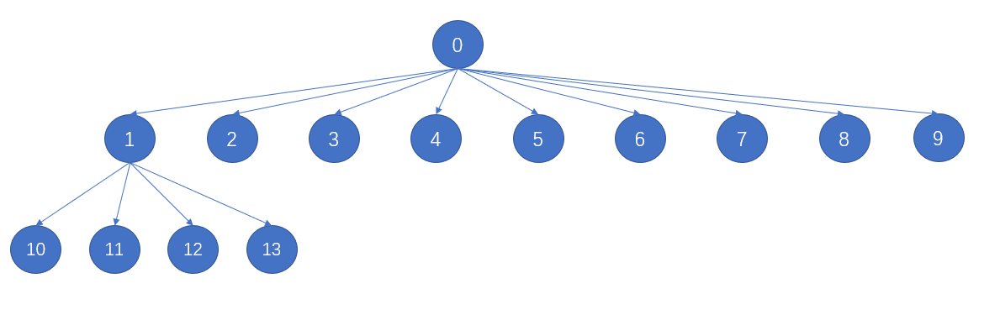
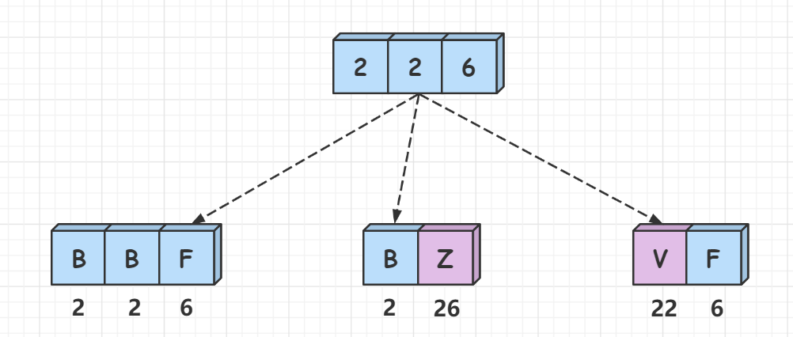

## 力扣500题刷题笔记

### [剑指 Offer 60. n个骰子的点数](https://leetcode-cn.com/problems/nge-tou-zi-de-dian-shu-lcof/)

**题目**

把`n`个骰子扔在地上，所有骰子朝上一面的点数之和为`s`。输入`n`，打印出`s`的所有可能的值出现的概率。

你需要用一个浮点数数组返回答案，其中第` i` 个元素代表这 `n` 个骰子所能掷出的点数集合中第` i` 小的那个的概率。

**示例 1:**

```
输入: 1
输出: [0.16667,0.16667,0.16667,0.16667,0.16667,0.16667]
```

**示例 2:**

```
输入: 2
输出: [0.02778,0.05556,0.08333,0.11111,0.13889,0.16667,0.13889,0.11111,0.08333,0.05556,0.02778]
```

**思路**

(动态规划)

计算所有点数出现的概率，点数`x`出现的概率为:   P(x) = x 出现的次数 / 总次数​ 

投掷 $n$个骰子，所有点数出现的总次数是 $6^n$。

**状态表示： **`f[i][j]`表示投掷`i`个骰子，点数之和为`j`出现的次数。那么`f[n][x]`就表示投掷`n`个筛子，点数之和为`x`出现的次数。

**状态计算：** 我们依据最后一次投掷的点数划分集合，那么 `f[i][j] = f[i - 1][j - k]`, `k 属于 {1, 2, 3, 4, 5, 6}`并且 `j >= k`。

**初始化：** 初始化 `f[1][1,2,3,4,5,6] = 1 = f[0][0]` 。投掷`0`个骰子，点数之和为0只有一种方案。

**c++代码**

```c++
class Solution {
public:
    vector<double> dicesProbability(int n) {
        vector<vector<int>> f(n + 1, vector<int>(6 * n + 1));
        vector<double> res;
        f[0][0] = 1;
        for(int i = 1; i <=n ;i++)
            for(int j = i; j <= 6 * i; j++)
                for(int k = 1; k <= 6; k++)
                    if(j >= k) 
                        f[i][j] += f[i - 1][j - k];
        int total = pow(6, n);
        for(int i = n; i <= 6 * n; i++){
            res.push_back(f[n][i] * 1.0 / total);
        }
        return res;
    }
};
```

**java代码**

```java
```

### [225. 用队列实现栈](https://leetcode-cn.com/problems/implement-stack-using-queues/)

**题目**

请你仅使用两个队列实现一个后入先出（LIFO）的栈，并支持普通栈的全部四种操作（`push`、`top`、`pop`和 `empty`）。

实现 `MyStack` 类：

- `void push(int x) `将元素` x` 压入栈顶。
- `int pop() `移除并返回栈顶元素。
- `int top()` 返回栈顶元素。
- `boolean empty()` 如果栈是空的，返回 `true` ；否则，返回 `false` 。

**注意：** 

你只能使用队列的基本操作 —— 也就是 `push to back`、`peek/pop from front`、`size` 和 i`s empty` 这些操作。
你所使用的语言也许不支持队列。 你可以使用 `list` （列表）或者 `deque`（双端队列）来模拟一个队列 , 只要是标准的队列操作即可。

**示例：**

**输入：**

```
["MyStack", "push", "push", "top", "pop", "empty"]
[[], [1], [2], [], [], []]
输出：
[null, null, null, 2, 2, false]

解释：
MyStack myStack = new MyStack();
myStack.push(1);
myStack.push(2);
myStack.top(); // 返回 2
myStack.pop(); // 返回 2
myStack.empty(); // 返回 False
```

**提示：** 

- `1 <= x <= 9`
- 多调用`100` 次 `push`、`pop`、`top` 和 `empty`
- 每次调用 `pop `和 `top` 都保证栈不为空

**进阶：**你能否实现每种操作的均摊时间复杂度为 `O(1)` 的栈？换句话说，执行 `n` 个操作的总时间复杂度 `O(n) `，尽管其中某个操作可能需要比其他操作更长的时间。你可以使用两个以上的队列。

**思路**

我们用一个队列来存储栈中元素。对于栈中的四种操作：

- `push(x)` – 直接入队；
- `pop()` – 即需要弹出队尾元素。我们先将队首元素弹出并插入队尾，循环 `n−1` 次，`n` 是队列长度。此时队尾元素已经在队首了，直接将其弹出即可；
- `top()` – 即返回队尾元素。同理，我们先将队首元素弹出并插入队尾，循环 `n−1` 次，`n` 是队列长度。此时队尾元素已经在队首了，直接将其返回。不要忘记将其弹出并插入队尾，恢复队列原状；
- `empty()` – 返回队列是否为空；

**时间复杂度分析：**`push() `和 `empty() `均只有一次操作，时间复杂度是 $O(1)$，`pop() `和 `top()` 需要循环`n` 次，所以时间复杂度是 $O(n)$。

**c++代码**

```c++
class MyStack {
public:

    queue<int>q, w;  // q是普通队列， w是缓存队列

    /** Initialize your data structure here. */
    MyStack() {

    }

    /** Push element x onto stack. */
    void push(int x) {
        q.push(x);
    }

    /** Removes the element on top of the stack and returns that element. */
    int pop() {  //弹出栈首元素
        while(q.size() > 1){
            w.push(q.front());
            q.pop();
        }
        int t = q.front();  //栈首元素
        q.pop(); //弹出栈首元素
        while(w.size()){
            q.push(w.front());
            w.pop();
        }
        return t;
    }

    /** Get the top element. */
    int top() {  //返回栈首元素，但是不弹出
         while(q.size() > 1){
            w.push(q.front());
            q.pop();
        }
        int t = q.front();  //栈首元素
        q.pop();
        while(w.size()){
            q.push(w.front());
            w.pop();
        }
        q.push(t);
        return t;
    }

    /** Returns whether the stack is empty. */
    bool empty() {
        return q.empty();
    }
};

/**
 * Your MyStack object will be instantiated and called as such:
 * MyStack* obj = new MyStack();
 * obj->push(x);
 * int param_2 = obj->pop();
 * int param_3 = obj->top();
 * bool param_4 = obj->empty();
 */
```

**java代码**

```java
```

### [440. 字典序的第K小数字](https://leetcode-cn.com/problems/k-th-smallest-in-lexicographical-order/)

**题目**

给定整数 `n` 和 `k`，找到 `1` 到 `n` 中字典序第 `k` 小的数字。

注意：`1 ≤ k ≤ n ≤ 10^9`。

**示例 :**

```
输入:
n: 13   k: 2

输出:
10

解释:
字典序的排列是 [1, 10, 11, 12, 13, 2, 3, 4, 5, 6, 7, 8, 9]，所以第二小的数字是 10。
```

**思路**

**(数位统计)**  $O(log^2n)$  

**什么是字典序？**

根据数字的前缀进行排序，比如 `112 <  12`，因为`12`前缀大于`112`的前缀。根据题目的样例我们可以画出一棵十叉树。

**样例：**



如样例所示，`n = 13 `, `k = 2`，那么字典序的排序则为：`[1, 10, 11, 12, 13, 2, 3, 4, 5, 6, 7, 8, 9]`，因此返回`10`。

**如何去做？** 

整个过程分为两步：

- 1、构造出`f(prefix, n)`函数，用来求出`1~n`中有多少个数的前缀是`prefix`。
- 2、最终答案的前缀开始枚举，不断减小`k`值，一位一位来看答案的前缀是多少，直到`k`值减小为`1`，此时的前缀`prefix`即为答案。

**具体过程如下：** 

- 1、我们从最终答案的前缀开始枚举，初始时前缀为 `1`，这也是字典序最小的数字。
- 2、首先求出当前前缀`prefix`在`1~n`出现的数量，我们假设为 `cnt = cnt = f(prefix, n)`。
  - 如果 `k == 1`，则当前前缀就是答案，我们返回`prefix`。
  - 如果`k > cnt`，则说明这个答案不是以这个前缀为开头的数字，我们让 `k -= cnt`，同时让当前前缀的最后一位加`1`，即(`prefix++`)。
  - 如果`1 < k <= cnt`，则当前前缀必然是`prefix`，因为当前前缀本身占据了一个位置，因此我们要让`k--`，同时`prefix *= 10`，开始确定前缀的下一位。
- 3、重复上述过程，直到 `k == 1 `。

**`f(prefix, n)`函数如何构造？** 

这里分为两种情况：

- 1、`prefix `的位数小于 `n`的位数，若：`prefix * 10 `的位数 小于`n`的位数，则 `prefix_0, prefix_1, ..., prefix_9` 都可以构成答案，若`prefix * 100 `的位数小于`n` 的位数，则` prefix_00, prefix_01, ..., prefix_99` 也都是答案。

  

- 2、`prefix `的位数等于 `n`的位数：断一下 `prefix` 是否小于等于 `n`的前缀，根据情况补全相同位数下能构成数字的个数。


**时间复杂度分析：** 计算以某个前缀构成的数字个数的时候需要 $O(logn)$ 的时间，每一位最多枚举 `10` 个数字，故总的时间复杂度为$O(log^2n)$  。

**c++代码**

```c++
class Solution {
public:

    int f(int prefix, int n) {
        long long p = 1;
        auto A = to_string(n), B = to_string(prefix);
        int dt = A.size() - B.size();
        int res = 0;
        for (int i = 0; i < dt; i ++ ) {
            res += p;
            p *= 10;
        }
        A = A.substr(0, B.size());
        if (A == B) res += n - prefix * p + 1;
        else if (A > B) res += p;
        return res;
    }

    int findKthNumber(int n, int k) {
        int prefix = 1;
        while (k > 1) {
            int cnt = f(prefix, n);
            if (k > cnt) {
                k -= cnt;
                prefix ++ ;
            } else {
                k -- ;
                prefix *= 10;
            }
        }
        return prefix;
    }
};
```

### [622. 设计循环队列](https://leetcode-cn.com/problems/design-circular-queue/)

**题目**

设计你的循环队列实现。 循环队列是一种线性数据结构，其操作表现基于 FIFO（先进先出）原则并且队尾被连接在队首之后以形成一个循环。它也被称为“环形缓冲器”。

循环队列的一个好处是我们可以利用这个队列之前用过的空间。在一个普通队列里，一旦一个队列满了，我们就不能插入下一个元素，即使在队列前面仍有空间。但是使用循环队列，我们能使用这些空间去存储新的值。

你的实现应该支持如下操作：

- `MyCircularQueue(k)`: 构造器，设置队列长度为 `k` 。
- `Front`: 从队首获取元素。如果队列为空，返回 `-1 `。
- `Rear`: 获取队尾元素。如果队列为空，返回` -1` 。
- `enQueue(value)`: 向循环队列插入一个元素。如果成功插入则返回真。
- `deQueue()`: 从循环队列中删除一个元素。如果成功删除则返回真。
- `isEmpty()`: 检查循环队列是否为空。
- `isFull()`: 检查循环队列是否已满。

**示例**

```
MyCircularQueue circularQueue = new MyCircularQueue(3); // 设置长度为 3
circularQueue.enQueue(1);  // 返回 true
circularQueue.enQueue(2);  // 返回 true
circularQueue.enQueue(3);  // 返回 true
circularQueue.enQueue(4);  // 返回 false，队列已满
circularQueue.Rear();  // 返回 3
circularQueue.isFull();  // 返回 true
circularQueue.deQueue();  // 返回 true
circularQueue.enQueue(4);  // 返回 true
circularQueue.Rear();  // 返回 4
```

**提示：**

- 所有的值都在 `0` 至 `1000 `的范围内；
- 操作数将在 `1` 至 `1000 `的范围内；
- 请不要使用内置的队列库。

**思路**

**(数组模拟）** $O(1)$ 


1、我们使用数组来模拟队列，定义两个指针`hh`和`tt`分别表示队头和队尾。0 1 2 3 

2、初始化队列最大长度为 `n = k + 1`，为什么要初始化队列大小为`k + 1`? 因为这里我们要用`hh == tt`表示队列为空，用`tt + 1 == hh`表示队列为满，为了区分队列为空和为满，这里我们定义成 `k + 1`。因此当`hh !=`

` tt`,队列的存贮空间为`[hh, tt - 1]`或者`[hh, tt)`，`tt`应该指向下一个队列中要存放的位置，`tt`这个位置我们不存贮值。

3、具体操作看代码

**c++代码**

```c++
class MyCircularQueue {
public:
    int hh = 0, tt = 0;
    vector<int> q;

    /** Initialize your data structure here. Set the size of the queue to be k. */
    MyCircularQueue(int k) {  // 设置队列大小
        q.resize(k + 1);
    }

    /** Insert an element into the circular queue. Return true if the operation is successful. */
    bool enQueue(int value) { // 向循环队列插入一个元素
        if (isFull()) return false;
        q[tt ++ ] = value;
        if (tt == q.size()) tt = 0;
        return true;
    }

    /** Delete an element from the circular queue. Return true if the operation is successful. */
    bool deQueue() {         //从循环队列中删除一个元素
        if (isEmpty()) return false;
        hh ++ ;
        if (hh == q.size()) hh = 0;
        return true;
    }

    /** Get the front item from the queue. */
    int Front() {           //从队首获取元素。如果队列为空，返回 -1 
        if (isEmpty()) return -1;
        return q[hh];
    }

    /** Get the last item from the queue. */
    int Rear() {            //获取队尾元素。如果队列为空，返回 -1 。
        if (isEmpty()) return -1;
        int t = tt - 1;
        if (t < 0) t += q.size();
        return q[t];
    }

    /** Checks whether the circular queue is empty or not. */
    bool isEmpty() { //检查循环队列是否为空。
        return hh == tt;
    }

    /** Checks whether the circular queue is full or not. */
    bool isFull() {
        return (tt + 1) % q.size() == hh;
    }
};

/**
 * Your MyCircularQueue object will be instantiated and called as such:
 * MyCircularQueue* obj = new MyCircularQueue(k);
 * bool param_1 = obj->enQueue(value);
 * bool param_2 = obj->deQueue();
 * int param_3 = obj->Front();
 * int param_4 = obj->Rear();
 * bool param_5 = obj->isEmpty();
 * bool param_6 = obj->isFull();
 */
```

**java代码**

```java
```

### [678. 有效的括号字符串](https://leetcode-cn.com/problems/valid-parenthesis-string/)

**题目**

给定一个只包含三种字符的字符串：`(` ，`)` 和` *`，写一个函数来检验这个字符串是否为有效字符串。有效字符串具有如下规则：

1. 任何左括号` (` 必须有相应的右括号` )`。
2. 任何右括号 `)` 必须有相应的左括号 `(` 。
3. 左括号 `( `必须在对应的右括号之前` )`。
4. `*`可以被视为单个右括号 `)` ，或单个左括号 `(` ，或一个空字符串。
5. 一个空字符串也被视为有效字符串。

**示例 1:**

```
输入: "()"
输出: True
```

**示例 2:**

```
输入: "(*)"
输出: True
```

**示例 3:**

```
输入: "(*))"
输出: True
```

**注意:**

1. 字符串大小将在 `[1，100]` 范围内。

**思路**

**(动态规划优化)**  $O(n)$ 


我们使用cnt来记录栈中左括号的数量，遍历字符串的过程中，如果遇到左括号，则进栈，左括号数量++。如果遇到右括号，则出栈，左括号数量--。在次过程中，如果左括号的数量 < 0 或者最后左括号的数量不为0，都表示当前序列不合法。

我们使用两个标记`low`,`high`分别当前已经读入的字符中所有可能的情况中最少有多少个左括号，最多有多少个左括号。对于读入的字符`c`

- 1、`c = '('`说明`low = low + 1`,`high = high + 1`
- 2、`c = ')'`说明`low = low - 1`,`high = high - 1`
- 3、`c = '*'`说明`low = low - 1`,`high = high + 1`这是因为，当前这个字符既可以看作是左括号也可以看作是右括号。

在匹配过程中，当出现 `low > high` 说明上界为负数，即右括号过多，因此需要返回`false`。如果当前`low < 0`需要把`low`重置为`0`，这是因为不可以在已经不合法的序列中继续添加左括号。

最后只需要判断一下，`low= 0`说明完全匹配。时间复杂度$O(N)$。

**c++代码**

```c++
 class Solution {
public:
    bool checkValidString(string s) {
        int low = 0, high = 0;
        for(char x : s){
            if(x == '(') low++, high++;
            else if(x == ')') low--, high--;
            else low--,high++;
            low = max(low, 0);
            if(low > high) return false;
        }
        return !low;
    }
};
```

**java代码** 

```java
```

### [1047. 删除字符串中的所有相邻重复项](https://leetcode-cn.com/problems/remove-all-adjacent-duplicates-in-string/)

**题目**

给出由小写字母组成的字符串 `S`，**重复项删除操作**会选择两个相邻且相同的字母，并删除它们。

在 `S` 上反复执行重复项删除操作，直到无法继续删除。 

在完成所有重复项删除操作后返回最终的字符串。答案保证唯一。

**示例：**

```
输入："abbaca"
输出："ca"
解释：
例如，在 "abbaca" 中，我们可以删除 "bb" 由于两字母相邻且相同，这是此时唯一可以执行删除操作的重复项。之后我们得到字符串 "aaca"，其中又只有 "aa" 可以执行重复项删除操作，所以最后的字符串为 "ca"。
```

**提示：**

1. `1 <= S.length <= 20000`
2. `S` 仅由小写英文字母组成。

**思路**

**方法一：栈**

充分理解题意后，我们可以发现，当字符串中同时有多组相邻重复项时，我们无论是先删除哪一个，都不会影响最终的结果。因此我们可以从左向右顺次处理该字符串。

而消除一对相邻重复项可能会导致新的相邻重复项出现，如从字符串`abba` 中删除`bb` 会导致出现新的相邻重复项`aa` 出现。因此我们需要保存当前还未被删除的字符。一种显而易见的数据结构呼之欲出：栈。我们只需要遍历该字符串，如果当前字符和栈顶字符相同，我们就贪心地将其消去，否则就将其入栈即可。

**代码**

在下面的 C++ 代码中，由于std::string 类本身就提供了类似「入栈」和「出栈」的接口，因此我们直接将需要被返回的字符串作为栈即可。对于其他的语言，如果字符串类没有提供相应的接口，则需要在遍历完成字符串后，使用栈中的字符显式地构造出需要被返回的字符串。

**时间复杂度：**$O(n)$，其中 `n`是字符串的长度。我们只需要遍历该字符串一次。

**c++代码**

```c++

```

**java代码**

```java
```

### [445. 两数相加 II](https://leetcode-cn.com/problems/add-two-numbers-ii/) *

**题目**

给你两个 **非空** 链表来代表两个非负整数。数字最高位位于链表开始位置。它们的每个节点只存储一位数字。将这两数相加会返回一个新的链表。

你可以假设除了数字 `0` 之外，这两个数字都不会以零开头。

**示例1：**


```
输入：l1 = [7,2,4,3], l2 = [5,6,4]
输出：[7,8,0,7]
```

**示例2：**

```
输入：l1 = [2,4,3], l2 = [5,6,4]
输出：[8,0,7]
```

**示例3：**

```
输入：l1 = [0], l2 = [0]
输出：[0]
```

**提示：**

- 链表的长度范围为` [1, 100]`
- `0 <= node.val <= 9`
- 输入数据保证链表代表的数字无前导 0

**思路**

**(链表翻转)**  $O(n)$

**时间复杂度分析：** $O(max(m,n))$，其中 `m` 和 `n`分别为两个链表的长度。

**c++代码**

```c++
/**
 * Definition for singly-linked list.
 * struct ListNode {
 *     int val;
 *     ListNode *next;
 *     ListNode() : val(0), next(nullptr) {}
 *     ListNode(int x) : val(x), next(nullptr) {}
 *     ListNode(int x, ListNode *next) : val(x), next(next) {}
 * };
 */
class Solution {
public:
    ListNode* reverse(ListNode* head){   // 翻转链表
        auto a = head, b = head->next;
        while(b){
            ListNode* c = b->next;
            b->next = a;
            a = b, b = c;
        }
        head->next = nullptr;
        return a;
    }
    ListNode* addTwoNumbers(ListNode* l1, ListNode* l2) {
        l1 = reverse(l1), l2 = reverse(l2);
        auto dummy = new ListNode(-1), cur = dummy;
        int t = 0;  //存贮进位
        while(l1 || l2 || t){
            if(l1)  t += l1->val, l1 = l1->next;
            if(l2)  t += l2->val, l2 = l2->next;
            cur = cur->next = new ListNode(t % 10);
            t /= 10;
        }
        return reverse(dummy->next);
    }
};
```

**java代码** 

```java
```

### [349. 两个数组的交集](https://leetcode-cn.com/problems/intersection-of-two-arrays/)

**题目**

给定两个数组，编写一个函数来计算它们的交集。

**示例 1：**

```
输入：nums1 = [1,2,2,1], nums2 = [2,2]
输出：[2]
```

**示例 2：**

```
输入：nums1 = [4,9,5], nums2 = [9,4,9,8,4]
输出：[9,4]
```

**说明：**

- 输出结果中的每个元素一定是唯一的。
- 我们可以不考虑输出结果的顺序。

**思路**

**c++代码**

```c++
class Solution {
public:
    /**
    1、定义一个哈希set用来存贮nums1的元素（去重）。
    2、遍历nums2数组，如果nums2[i]在哈希set中存在，则我们将其加入res中。
    3、每加入一个nums2[i]元素，记得要把其从哈希set中剔除。

    **/
    vector<int> intersection(vector<int>& nums1, vector<int>& nums2) {
        vector<int> res;
        unordered_set<int> hash;
        for(int x : nums1) hash.insert(x);
        for(int x : nums2){
            if(hash.count(x)){
                res.push_back(x);
                hash.erase(x);
            }
        }
        return res;
    }
};
```

**java代码**

```java
```

### [1095. 山脉数组中查找目标值](https://leetcode-cn.com/problems/find-in-mountain-array/) *

**题目**

给你一个 **山脉数组** `mountainArr`，请你返回能够使得 `mountainArr.get(index)` **等于** `target` **最小** 的下标 `index` 值。

如果不存在这样的下标 `index`，就请返回 `-1`。

 	

何为山脉数组？如果数组 A 是一个山脉数组的话，那它满足如下条件：

**首先**，`A.length >= 3`

**其次**，在 `0 < i < A.length - 1` 条件下，存在 `i` 使得：

- `A[0] < A[1] < ... A[i-1] < A[i]`
- `A[i] > A[i+1] > ... > A[A.length - 1]`


你将 **不能直接访问该山脉数组**，必须通过 `MountainArray` 接口来获取数据：

- `MountainArray.get(k) `- 会返回数组中索引为`k` 的元素（下标从 `0` 开始）
- `MountainArray.length()` - 会返回该数组的长度

**注意：**

对 `MountainArray.get` 发起超过 100 次调用的提交将被视为错误答案。此外，任何试图规避判题系统的解决方案都将会导致比赛资格被取消。

为了帮助大家更好地理解交互式问题，我们准备了一个样例 **“答案”**：https://leetcode-cn.com/playground/RKhe3ave，请注意这 不是一个**正确答案**。

**示例 1：**

```
输入：array = [1,2,3,4,5,3,1], target = 3
输出：2
解释：3 在数组中出现了两次，下标分别为 2 和 5，我们返回最小的下标 2。
```

**示例 2：**

```
输入：array = [0,1,2,4,2,1], target = 3
输出：-1
解释：3 在数组中没有出现，返回 -1。
```

**提示：**

- `3 <= mountain_arr.length() <= 10000`
- `0 <= target <= 10^9`
- `0 <= mountain_arr.get(index) <= 10^9`

**思路**

**c++代码**

```c++
/**
 * // This is the MountainArray's API interface.
 * // You should not implement it, or speculate about its implementation
 * class MountainArray {
 *   public:
 *     int get(int index);
 *     int length();
 * };
 */

class Solution {
public:
    /**
      先二分搜索找出峰顶，再进行左右两边二分搜索
    **/
    int findInMountainArray(int target, MountainArray &mountainArr) {
        int n = mountainArr.length();
        int l = 0, r = n - 1;
        while(l < r){
            int mid = (l + r) / 2;
            if(mountainArr.get(mid) > mountainArr.get(mid + 1)) r = mid;
            else l = mid + 1; 
        }
        int peak = r;   //峰顶所在位置  [0, peak] 单调递增 [peak + 1, n - 1] 单调递减
        l = 0, r = peak;
        while(l < r){   //[0, peak] 二分查找
            int mid = (l + r) / 2;
            if(mountainArr.get(mid) >= target) r = mid;
            else l = mid + 1;
        }
        if(mountainArr.get(r) == target) return r;
        l = peak + 1, r = n - 1;
        while(l < r){
            int mid = (l + r) / 2;
            if(mountainArr.get(mid) <= target) r = mid;
            else l = mid + 1;
        }
        if(mountainArr.get(r) == target) return r;
        else return -1;
    }
};
```

### [670. 最大交换](https://leetcode-cn.com/problems/maximum-swap/)

**题目**

给定一个非负整数，你**至多**可以交换一次数字中的任意两位。返回你能得到的最大值。

**示例 1 :**

```
输入: 2736
输出: 7236
解释: 交换数字2和数字7。
```

**示例 2 :**

```
输入: 9973
输出: 9973
解释: 不需要交换。
```

**注意:**

- 给定数字的范围是` [0, 10^8]`

**思路**

**(贪心)**


**c++代码** 

```c++
/**
    为了方便处理数字的每一位，现将其转化成字符串s。
    1、从前往后遍历数字的每一位，找到第一段递增序列[i, i + 1]。
    2、以i + 1为起点，查找大于s[i + 1]的最末端位置k。
    3、再次遍历数字的每一位，找到第一个小于s[k]的值s[j]，交换s[j]和s[k]。    
**/
class Solution {
public:
    int maximumSwap(int num) {
       string str = to_string(num);
        for (int i = 0; i + 1 < str.size(); i ++ ) {
            if (str[i] < str[i + 1]) {
                int k = i + 1;
                for (int j = k; j < str.size(); j ++ )
                    if (str[j] >= str[k])
                        k = j;
                for (int j = 0; ; j ++ )
                    if (str[j] < str[k]) {
                        swap(str[j], str[k]);
                        return stoi(str);
                    }
            }
        }
        return num;
    }
};
```

**java代码**

### [139. 单词拆分](https://leetcode-cn.com/problems/word-break/) *

**题目**

给定一个非空字符串 `s` 和一个包含非空单词的列表 `wordDict`，判定 `s`是否可以被空格拆分为一个或多个在字典中出现的单词。

**说明：**

- 拆分时可以重复使用字典中的单词。
- 你可以假设字典中没有重复的单词。

**示例 1：**

```
输入: s = "leetcode", wordDict = ["leet", "code"]
输出: true
解释: 返回 true 因为 "leetcode" 可以被拆分成 "leet code"。
```

**示例 2：**

```
输入: s = "applepenapple", wordDict = ["apple", "pen"]
输出: true
解释: 返回 true 因为 "applepenapple" 可以被拆分成 "apple pen apple"。
     注意你可以重复使用字典中的单词。
```

**示例 3：**

```
输入: s = "catsandog", wordDict = ["cats", "dog", "sand", "and", "cat"]
输出: false
```

**思路**

**(动态规划)**  $O(n^3)$ 


**状态表示：**  `f[i]`表示字符串`s`的前`i`个字符是否可以拆分成`wordDict`，其值有两个`true` 和`false`。

**状态计算：** 依据最后一次拆分成的字符串`str`划分集合，最后一次拆分成的字符串`str`可以为`s[0 ~ i - 1]`，`s[1 ~ i - 1]`，，，`s[j ~ i - 1]`。

**状态转移方程：**  `f[i] = ture   `   的条件是 ：`f[j] = ture`并且`s[j, i - 1]`在`hash`表中存在。

**初始化：** `f[0] = true`，表示空串且合法。

**时间复杂度分析：** 状态枚举$O(n^2)$，状态计算$O(n)$，因此时间复杂度为$O(n^3)$。

**c++代码**   

```c++
class Solution {
public:
    bool wordBreak(string s, vector<string>& wordDict) {
        unordered_set<string> hash;   //存贮单词
        vector<bool> f(s.size() + 1, false);  
        f[0] = true;  //初始化
        for(string word : wordDict){
            hash.insert(word);
        }
        for(int i = 1; i <= s.size(); i++){
            for(int j = 0; j < i; j++){  //for(int j = 1; j <= i; j++)
                if(f[j] && hash.find(s.substr(j, i - j)) != hash.end()){
                    f[i] = true;
                    break;  //只要有一个子集满足就ok了
                }
            }
        }
        return f[s.size()];
    }
};
```

### [91. 解码方法](https://leetcode-cn.com/problems/decode-ways/) *

**题目**

一条包含字母 `A-Z` 的消息通过以下映射进行了 **编码** ：

```
'A' -> 1
'B' -> 2
...
'Z' -> 26
```

要 **解码** 已编码的消息，所有数字必须基于上述映射的方法，反向映射回字母（可能有多种方法）。例如，`"11106"` 可以映射为：

- `"AAJF"` ，将消息分组为 `(1 1 10 6)`
- `"KJF"` ，将消息分组为 `(11 10 6)`

注意，消息不能分组为  `(1 11 06)` ，因为 `"06"` 不能映射为 `"F"` ，这是由于 `"6"` 和 `"06"` 在映射中并不等价。

给你一个只含数字的 **非空** 字符串 `s` ，请计算并返回 **解码** 方法的 **总数** 。

题目数据保证答案肯定是一个 **32 位** 的整数。

**示例 1：**

```
输入：s = "12"
输出：2
解释：它可以解码为 "AB"（1 2）或者 "L"（12）。
```

**示例 2：**

```
输入：s = "226"
输出：3
解释：它可以解码为 "BZ" (2 26), "VF" (22 6), 或者 "BBF" (2 2 6) 。
```

**示例 3：**

```
输入：s = "0"
输出：0
解释：没有字符映射到以 0 开头的数字。
含有 0 的有效映射是 'J' -> "10" 和 'T'-> "20" 。
由于没有字符，因此没有有效的方法对此进行解码，因为所有数字都需要映射。
```

**示例 4：**

```
输入：s = "06"
输出：0
解释："06" 不能映射到 "F" ，因为字符串含有前导 0（"6" 和 "06" 在映射中并不等价）。
```

**思路**

**(动态规划)**  $O(n)$ 

给定我们一个字符串`s`，按照题目所给定的规则将其解码，问一个字符串可以有多少种不同的解码方式。

**样例：**



我们先来理解一下题目的翻译规则，如样例所示，`s = "226"`，可以分为两种情况：

- 1、将每一位数字单独解码，因此可以翻译成`"BBF"(2 2 6)`。
- 2、将相邻两位数字组合起来解码（组合的数字范围在`10 ~ 26`之间），因此可以翻译成`"BZ"(2 26)`, `"VF"(22 6)`。 

两种情况是或的关系，互不影响，将其相加，那么`226`共有`3`种不同的解码方式，下面来讲解动态规划的做法。

**状态表示：**`f[i]`表示前`i`个数字一共有多少种解码方式，那么，`f[n]`就表示前`n`个数字一共有多少种不同的解码方法，即为答案。

**状态计算：** 

设定字符串数组为`s[]`(数组下标从`1`开始)，考虑最后一次解码方式，因此对于第`i - 1`和第`i `个数字，分为两种决策：

- 1、如果`s[i]`不为`0`，则可以单独解码`s[i]`，由于求的是方案数，如果确定了第`i`个数字的翻译方式，那么解码前`i`个数字和解码前`i - 1`个数的方案数就是相同的，即`f[i] = f[i - 1]`。(`s[]`数组下标从`1`开始)

  

- 2、将`s[i]`和`s[i - 1]`组合起来解码（ 组合的数字范围在`10 ~ 26`之间 ）。如果确定了第`i`个数和第`i - 1`个数的翻译方式，那么解码前`i`个数字和解码前`i - 2`个数的方案数就是相同的，即`f[i] = f[i - 2]`。(`s[]`数组下标从`1`开始)


最后将两种决策的方案数加起来，**因此，状态转移方程为：** `f[i] = f[i - 1] + f[i - 2]`。

**边界条件：**

`f[0] = 1`，解码前`0`个数的方案数为`1`。

**为什么解码前`0`个数的方案数是`1`？** 

`f[0]`代表前`0`个数字的方案数，这样的状态定义其实是没有实际意义的，但是`f[0]`的值需要保证边界是对的，即`f[1]`和`f[2]`是对的。比如说，第一个数不为`0`，那么解码前`1`个数只有一种方法，将其单独翻译，即`f[1] = f[1 - 1] = 1`。解码前两个数，如果第`1`个数和第`2`个数可以组合起来解码，那么`f[2] = f[1] + f[0] = 2 `，否则只能单独解码第`2`个数，即`f[2] = f[1] = 1`。因此，在任何情况下`f[0]`取`1`都可以保证`f[1]`和`f[2]`是正确的，所以`f[0]`应该取`1`。

**实现细节:**

在推导状态转移方程时，我们假设的`s[]`数组下标是从`1`开始的，而实际中的`s[]`数组下标是从`0`开始的，为了一 一对应，我们需要将所有字符串的下标减去 `1`。比如在取组合数字的值时，要把`s[i - 1]` 和 `s[i]`的值往前错一位，取`s[i - 2]`和`s[i - 1]`，即组合值`t = (s[i - 2] - '0') * 10 + s[i - 1] - '0'`。

同时，由于在大部分语言中，字符串的下标是从 0而不是 1 开始的，因此在代码的编写过程中，我们需要将所有字符串的下标减去 1，与使用的语言保持一致。

**时间复杂度分析：** 状态数是 $n$ 个，状态转移的时间复杂度是 $O(1)$，所以总时间复杂度是$O(n)$。 

**空间复杂度分析：** $O(n)$。

**c++代码**

```c++
class Solution {
public:
    int numDecodings(string s) {
        int n = s.size();
        vector<int> f(n + 1);
        f[0] = 1;  // 边界条件
        for(int i = 1; i <= n; i++){
            if(s[i - 1] != '0') f[i] = f[i - 1];         //单独解码s[i - 1]
            if(i >= 2){
                int t = (s[i - 2] - '0') * 10 + s[i - 1] - '0';
                if(t >= 10 && t <= 26) f[i] += f[i - 2]; //将s[i - 2] 和 s[i - 1]组合解码
            }
        }
        return f[n];
    }
};
```

**java代码**

```java
class Solution {
    public int numDecodings(String s) {
        int n = s.length();
        int[] f = new int[n + 10];
        f[0] = 1;
        for(int i = 1; i <= n;i ++)
        {
            if(s.charAt(i - 1) != '0') f[i] += f[i - 1]; //单独解码s[i - 1]
            if(i >= 2)
            {
                int t = (s.charAt(i - 2) - '0') * 10 + s.charAt(i - 1) - '0';
                if(t >= 10 && t <= 26) f[i] += f[i - 2]; //将s[i - 2] 和 s[i - 1]组合解码
            }
        }
        return f[n];
    }
}
```

### [410. 分割数组的最大值](https://leetcode-cn.com/problems/split-array-largest-sum/)

**题目**

给定一个非负整数数组 `nums` 和一个整数 `m` ，你需要将这个数组分成 `m` 个非空的连续子数组。

设计一个算法使得这 `m` 个子数组各自和的最大值最小。

 **示例 1：**

```
输入：nums = [7,2,5,10,8], m = 2
输出：18
解释：
一共有四种方法将 nums 分割为 2 个子数组。 其中最好的方式是将其分为 [7,2,5] 和 [10,8] 。
因为此时这两个子数组各自的和的最大值为18，在所有情况中最小。
```

**示例 2：**

```
输入：nums = [1,2,3,4,5], m = 2
输出：9
```

**示例 3：**

```
输入：nums = [1,4,4], m = 3
输出：4
```

**提示：**

- `1 <= nums.length <= 1000`
- `0 <= nums[i] <= 10^6` 
- `1 <= m <= min(50, nums.length)`

**思路**

**(二分 + 贪心)** 

「使……最大值尽可能小」是二分搜索题目常见的问法。

首先假定答案为`x`，看看是否可以找到一种分割方案，使得分割子数组各自和的最大值不超过`x`。

**如何分割？**

贪心地模拟分割的过程，从前到后遍历数组，用 `sum` 表示当前分割子数组的和，`cnt` 表示已经分割出的子数组的数量（包括当前子数组），那么每当 `sum` 加上当前值超过了 `x`，我们就把当前取的值作为新的一段分割子数组的开头，并将`cnt`加 `1`。遍历结束后验证是否 `cnt` 不超过 `m`。

**为什么可以用二分？**

- 1、因为所有数都是非负整数，则选择的数越多，和就越大。
- 2、若每个组的子数组和都是`<= x`的，`x`越大，则我们能够分隔的段的数量越少，`x`越小，则我们能够分割的段的数量越多。

- 3、答案具有二段性，我们可以去二分查找`cnt <= m`的最左边界`x`。

**具体过程：**

- 1、二分的范围 `l = 0`, `r = INT_MAX`，二分查找`cnt <= m`的最左边界`x`。

- 2、当`check(nums, m, mid)` 满足条件时，往左半区域找， `r = mid`。
- 3、否则，往右半区域找，`l = mid + 1`。

**c++代码**

```c++

```

### [111. 二叉树的最小深度](https://leetcode-cn.com/problems/minimum-depth-of-binary-tree/)

给定一个二叉树，找出其最小深度。

最小深度是从根节点到最近叶子节点的最短路径上的节点数量。

说明：叶子节点是指没有子节点的节点。 

 

**示例 1：**

```
输入：root = [3,9,20,null,null,15,7]
输出：2
```

**示例 2：**

```
输入：root = [2,null,3,null,4,null,5,null,6]
输出：5
```

**提示：**

- 树中节点数的范围在 `[0, 105]` 内
- `-1000 <= Node.val <= 1000`

**思路**

递归计算每个结点的最小深度:

- 1、当当前节点是空，直接返回。
- 2、当左子树是空，且右子树不为空，则返回 **右子树** 的最小深度 + `1`。
- 3、当右子树是空，且左子树不为空，则返回 **左子树** 的最小深度 + `1`。
- 4、当左右子树均不为空，则返回 **左右子树** 的最小深度的最小值 + `1`。

**c++代码**

```c++
class Solution {
public:
    int minDepth(TreeNode* root) {
        if(!root) return 0;
        int lh = minDepth(root->left), rh = minDepth(root->right);
        if(root->left && root->right)  return min(lh, rh) + 1;
        else return lh + rh + 1;
    }
    
};
```

### [494. 目标和](https://leetcode-cn.com/problems/target-sum/) *

**题目**

给你一个整数数组 `nums` 和一个整数 `target` 。

向数组中的每个整数前添加 `'+'` 或`'-'` ，然后串联起所有整数，可以构造一个 **表达式** ：

- 例如，`nums = [2, 1]` ，可以在 `2` 之前添加 `'+' `，在 `1` 之前添加` '-'` ，然后串联起来得到表达式 `"+2-1"` 。

返回可以通过上述方法构造的、运算结果等于 `target` 的不同 **表达式** 的数目。

**示例 1： **

```
输入：nums = [1,1,1,1,1], target = 3
输出：5
解释：一共有 5 种方法让最终目标和为 3 。
-1 + 1 + 1 + 1 + 1 = 3
+1 - 1 + 1 + 1 + 1 = 3
+1 + 1 - 1 + 1 + 1 = 3
+1 + 1 + 1 - 1 + 1 = 3
+1 + 1 + 1 + 1 - 1 = 3
```

**示例 2：**

```
输入：nums = [1], target = 1
输出：1
```

**提示：**

- `1 <= nums.length <= 20`
- `0 <= nums[i] <= 1000`
- `0 <= sum(nums[i]) <= 1000`
- `-1000 <= target <= 1000` 

**思路**

**(动态规划)** 

**状态表示：** `f[i,j]`表示前`i`个数，总和为`j`的所有方案的数量。

**状态计算：** 

考虑最后一个数`a[i]`的选择，有两种决策：

- 1、`a[i]`取正，`f[i, j] = f[i - 1,j - a[i]] `。
- 2、`a[i]`取负，`f[i, j] = f[i - 1,j + a[i]] ` 。

**状态计算方程：** `f[i, j] = f[i - 1,j - a[i]] + f[i - 1,j + a[i]] `  。

**c++代码**

```c++
class Solution {
public:
    // 动态规划
    int findTargetSumWays(vector<int>& nums, int target) {
        int n = nums.size(), Offset = 1000;  // offset为偏移量
        vector<vector<int>> f(n + 1, vector<int>(2000 + 10));
        f[0][Offset] = 1;  //对应f[0][0] = 1, 前0个数，和为0的方案数为1
        for(int i = 1; i <= n; i++){
            for(int j = - 1000; j <= 1000; j++){
                if(j - nums[i - 1] >= -1000)
                    f[i][j + Offset] += f[i - 1][j + Offset - nums[i - 1]];
                if(j + nums[i - 1] <= 1000)
                    f[i][j + Offset] += f[i - 1][j + Offset + nums[i - 1]];    
            }
        }
        return f[n][target + Offset];
    }
};
```

**java代码**

```java
```

