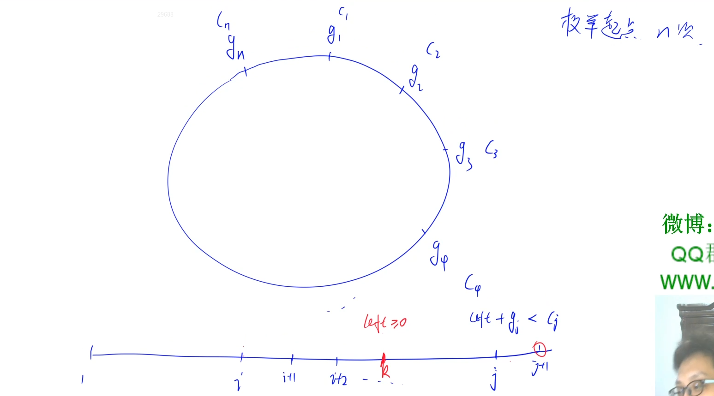

## 力扣500题刷题笔记

### [188. 买卖股票的最佳时机 IV](https://leetcode-cn.com/problems/best-time-to-buy-and-sell-stock-iv/)  *

**题目** 

给定一个整数数组 `prices` ，它的第 `i` 个元素 `prices[i]` 是一支给定的股票在第 `i `天的价格。

设计一个算法来计算你所能获取的最大利润。你最多可以完成 `k `笔交易。

注意：你不能同时参与多笔交易（你必须在再次购买前出售掉之前的股票）。

**示例 1：**

```
输入：k = 2, prices = [2,4,1]
输出：2
解释：在第 1 天 (股票价格 = 2) 的时候买入，在第 2 天 (股票价格 = 4) 的时候卖出，这笔交易所能获得利润 = 4-2 = 2 。
```

**示例 2：**

```
输入：k = 2, prices = [3,2,6,5,0,3]
输出：7
解释：在第 2 天 (股票价格 = 2) 的时候买入，在第 3 天 (股票价格 = 6) 的时候卖出, 这笔交易所能获得利润 = 6-2 = 4 。
     随后，在第 5 天 (股票价格 = 0) 的时候买入，在第 6 天 (股票价格 = 3) 的时候卖出, 这笔交易所能获得利润 = 3-0 = 3 。
```

**提示：**

- `0 <= k <= 100`
- `0 <= prices.length <= 1000`
- `0 <= prices[i] <= 1000` 

**思路**

**(动态规划)**  $O(n^2)$ 

首先，有个比较特殊的前提，若一共有`n`天，则最多买卖`n/2`次（因为买卖在同一天收益得`0`，买卖在不同天才会有收益），因此如果`k > n/2`的话，可以直接令`k = n/2`。


**常规思路**   $O(kn^2)$

**状态表示：** `f[i][k]`表示考虑前`i`天，完成了`k`笔交易的最大收益。（买卖各一次为一次交易）

**状态计算：**

对于`i`天，我们有两种选择：

- 1、第`i`天不做任何交易，那么`f[i][k] = f[i - 1][k]`。
- 2、第`i`天做交易，卖出手中的股票，那么`f[i][k] = f[j][k - 1] + p[i] - p[j]` 。（`0 <= j <= i`） 

由于我们要求的是最大收益，因此不考虑在第`i`天买入股票，不然会使收益变低。如果我们在第`i`天卖出，那么当天的收益就是枚举买入股票的日期`j`，计算`p[i] - p[j]`，再加上考虑前`j`天，最多完成`j - 1`笔交易的最大收益。

**状态DP**  $O(n^2)$

**状态表示：**

- 1、`f[i][j]` 表示考虑前`i` 天，恰好交易了`j`次股票，且当前手中不持有股票的最大收益（已卖出手中股票）。

- 2、`g[i][j]` 表示考虑前`i` 天，恰好交易了`j`次股票，且当前手中持有股票的最大收益（未卖出手中股票）。

**状态计算：**

- 1、`f[i][j] = max(f[i - 1][j]), g[i - 1][j - 1] + prices[i]`
- 2、`g[i][j] = max(g[i−1][j], f[i−1][j] − prices[i])` 

**c++代码**

```c++
int f[10001], g[10001];

class Solution {
public:
    int maxProfit(int k, vector<int>& prices) {
        int INF = 1e8;
        int n = prices.size();
        k = min(k, n / 2);
        memset(f, -0x3f, sizeof f);
        memset(g, -0x3f, sizeof g);
        f[0] = 0;
        int res = 0;
        for (int i = 1; i <= n; i ++ )
            for (int j = k; j >= 0; j -- ) {
                g[j] = max(g[j], f[j] - prices[i - 1]);
                if (j) f[j] = max(f[j], g[j - 1] + prices[i - 1]);
            }
        for (int i = 1; i <= k; i ++ ) res = max(res, f[i]);
        return res;
    }
};
```

**java代码**

```

```

### [134. 加油站](https://leetcode-cn.com/problems/gas-station/)

**题目**

在一条环路上有 `N`个加油站，其中第 `i` 个加油站有汽油 `gas[i] `升。

你有一辆油箱容量无限的的汽车，从第 `i `个加油站开往第` i+1` 个加油站需要消耗汽油 `cost[i]` 升。你从其中的一个加油站出发，开始时油箱为空。

如果你可以绕环路行驶一周，则返回出发时加油站的编号，否则返回 `-1`。

**说明:** 

- 如果题目有解，该答案即为唯一答案。
- 输入数组均为非空数组，且长度相同。
- 输入数组中的元素均为非负数。

**示例 1:**

```
输入: 
gas  = [1,2,3,4,5]
cost = [3,4,5,1,2]

输出: 3

解释:
从 3 号加油站(索引为 3 处)出发，可获得 4 升汽油。此时油箱有 = 0 + 4 = 4 升汽油
开往 4 号加油站，此时油箱有 4 - 1 + 5 = 8 升汽油
开往 0 号加油站，此时油箱有 8 - 2 + 1 = 7 升汽油
开往 1 号加油站，此时油箱有 7 - 3 + 2 = 6 升汽油
开往 2 号加油站，此时油箱有 6 - 4 + 3 = 5 升汽油
开往 3 号加油站，你需要消耗 5 升汽油，正好足够你返回到 3 号加油站。
因此，3 可为起始索引。
```

**示例 2:**

```
输入: 
gas  = [2,3,4]
cost = [3,4,3]

输出: -1

解释:
你不能从 0 号或 1 号加油站出发，因为没有足够的汽油可以让你行驶到下一个加油站。
我们从 2 号加油站出发，可以获得 4 升汽油。 此时油箱有 = 0 + 4 = 4 升汽油
开往 0 号加油站，此时油箱有 4 - 3 + 2 = 3 升汽油
开往 1 号加油站，此时油箱有 3 - 3 + 3 = 3 升汽油
你无法返回 2 号加油站，因为返程需要消耗 4 升汽油，但是你的油箱只有 3 升汽油。
因此，无论怎样，你都不可能绕环路行驶一周。
```

**思路** 




假如从第`i`个站开始走，没法走一圈回来，而是最多走到第`j`个站，那么从`i...j`之间的一个站点`k`开始走，也没有可能超过`j`这个站，因为从`i`走到`k`的时候是有`>=0`的剩余油量的，但是从第`k`个站出发的话就没有这些油量了，所以更不可能走超过`j`。

因此，如果没法到达第`j`个站，那么我们可以直接排除`i + 1, i + 2,,,j`这些不合法加油站，直接从`j+1`加油站开始作为下一次的起点。

**时间复杂度分析：**$O(n)$ 

**c++代码**

```c++
class Solution {
public:
    int canCompleteCircuit(vector<int>& gas, vector<int>& cost) {
        int n = gas.size();
        for(int i = 0; i < n; ){// 枚举每个起点
            int left = 0, j = 0;  //剩余油量, 每次走的站点数
            for(; j < n; j++){
                int k = (i + j) % n;  //下一个要到达的站点
                left += gas[k] - cost[k];
                if(left < 0) break;   //当前起点不合法
            }
            if(j == n) return i;  //返回合法起点
            i = i + j + 1;   //下一次起点为j + 1
        } 
        return -1;
    }
};
```

**java代码**

```java
```

### [10. 正则表达式匹配](https://leetcode-cn.com/problems/regular-expression-matching/)*

**题目**

给你一个字符串 `s` 和一个字符规律 `p`，请你来实现一个支持 `'.'` 和 `'*`' 的正则表达式匹配。

- `'.' `匹配任意单个字符
- `'*'`匹配零个或多个前面的那一个元素

所谓匹配，是要涵盖 **整个** 字符串 `s`的，而不是部分字符串。

**示例 1：**

```
输入：s = "aa" p = "a"
输出：false
解释："a" 无法匹配 "aa" 整个字符串。
```

**示例 2:**

```
输入：s = "aa" p = "a*"
输出：true
解释：因为 '*' 代表可以匹配零个或多个前面的那一个元素, 在这里前面的元素就是 'a'。因此，字符串 "aa" 可被视为 'a' 重复了一次。
```

**示例 3：**

```
输入：s = "ab" p = ".*"
输出：true
解释：".*" 表示可匹配零个或多个（'*'）任意字符（'.'）。
```

**示例 4：**

```
输入：s = "aab" p = "c*a*b"
输出：true
解释：因为 '*' 表示零个或多个，这里 'c' 为 0 个, 'a' 被重复一次。因此可以匹配字符串 "aab"。
```

**示例 5：**

```
输入：s = "mississippi" p = "mis*is*p*."
输出：false
```

提示：

- `1 <= s.length <= 20`
- `1 <= p.length <= 30`
- `s` 可能为空，且只包含从 `a-z` 的小写字母。
- `p` 可能为空，且只包含从 `a-z` 的小写字母，以及字符 `. `和` *`。
- 保证每次出现字符` * `时，前面都匹配到有效的字符

**c++代码**

**(动态规划)**  $O(nm)$

**状态表示：**`f[i][j]` 表示字符串` s` 的前 `i `个字符和字符串 `p` 的前` j` 个字符能否匹配。

**状态计算：**

根据`p[j]` 是什么来划分集合：

- 1、`p[j] != '*' ` ，即`p[j]`是字符, 看`p[j]` 和`s[i]`的关系。如果`p[j] == s[i]`，则需判断 `s`的前`i - 1`个字母 能否和`p`的前`j -1`个字母匹配 ，即`f[i][j] == f[i - 1][j - 1]`，不匹配 , 无法转移。
- 2    `P[j]` 是匹配符:
  - 如果`p[j] == '.' `，则`p[j]` 和 `s[j]`匹配 ，则需判断 `s`的前`i - 1`个字母能否和`p`的前`j -1`个字母匹配 ，即`f[i][j] == f[i - 1][j - 1]`。
  - `p[j]` 为`'*'`，得看`p[j - 1]`和`s[i]`的关系。如果不匹配，即`p[j - 1] ！= s[i]`，那么`'*'`匹配`0`个`p[j - 1]`,则需判断 `s`的前`i`个字母 能否和`p`的前`j - 2`个字母匹配 ，即`f[i][j] == f[i][j - 2]`。如果匹配，即`p[j - 1] == s[i] || p[j - 1] == '.'`，若`'*'`匹配多个`p[j - 1]`,则需判断`s`的前`i - 1`个字母 能否和`p`的前`j`个字母匹配 ，即`f[i][j] == f[i - 1][j]) `。

---------------


--------------------

**总结:**

```c++
f[i][j] == f[i - 1][j - 1], 前提条件为p[j] == s[i] || p[j] == '.'
f[i][j] == f[i][j - 2], 前提条件为p[j] == '*' &&  p[j - 1] != s[i]
f[i][j] == f[i - 1][j], 前提条件为p[j] == '*' && ( p[j - 1] == s[i] || p[j - 1] == '.'）
```

**c++代码**

```c++
class Solution {
public:
    bool isMatch(string s, string p) {
        int n = s.size(), m = p.size();
        vector<vector<bool>>f(n + 1, vector<bool>(m + 1));
        s = ' ' + s;   // 下标从1开始
        p = ' ' + p;
        f[0][0] = true;
        for(int i = 0; i <= n; i++){
            for(int j = 1; j <= m; j++){
                if(j + 1 <= m && p[j + 1] == '*') continue;  // 不去处理*的前一位字符。
                if(p[j] != '*'){
                    if((s[i] == p[j] || p[j] == '.')&& i)
                        f[i][j]  = f[i - 1][j - 1];
                }else{
                    if(j >= 2) f[i][j] = f[i][j - 2];  //匹配0个
                    if(i && (p[j - 1] == '.' || s[i] == p[j - 1] ) && f[i - 1][j]) //匹配多个
                        f[i][j] = f[i - 1][j];    
                }
            }
        }
        return f[n][m];
    }
};
```

### [96. 不同的二叉搜索树](https://leetcode-cn.com/problems/unique-binary-search-trees/)

**题目**

给你一个整数 `n` ，求恰由 `n` 个节点组成且节点值从 `1` 到 `n` 互不相同的 **二叉搜索树** 有多少种？返回满足题意的二叉搜索树的种数。

**示例 1：**  	


```
输入：n = 3
输出：5
```

**示例 2：**

```
输入：n = 1
输出：1
```

**提示：**

- `1 <= n <= 19`

**思路** 

**(动态规划)** 

给定一个有序序列 $1⋯n$，为了构建出一棵二叉搜索树，我们可以遍历每个数字 $i$	，将该数字作为树根，将 $1⋯(i−1)$序列作为左子树，将 $(i+1)⋯n$序列作为右子树。接着我们可以按照同样的方式递归构建左子树和右子树。 

在上述构建的过程中，由于根的值不同，因此我们能保证每棵二叉搜索树是唯一的。 

由此可见，原问题可以分解成规模较小的两个子问题，且子问题的解可以复用。因此，我们可以想到使用动态规划来求解本题。

**状态表示：** `f[n]`表示`n`个节点的二叉树共有多少种。 


**状态计算方程：** `f[i] += f[j - 1] * f[i - j]`

**初始化：** `f[0] = 1, f[1]  = 1`  空树和只有根的树，只有一种情况。

**c++代码**

```c++
class Solution {
public:
    int numTrees(int n) {
        vector<int>f(n + 1);
        f[0] = 1;
        for(int i = 1; i <= n; i++)  // 枚举二叉树的长度
            for(int j = 1; j <= i; j++) // 枚举根节点所在的位置
                f[i] += f[j - 1] * f[i - j];  //左子树长度 * 右子树长度 (映射)
        return f[n];        
  }
};
```

### [84. 柱状图中最大的矩形](https://leetcode-cn.com/problems/largest-rectangle-in-histogram/)

**题目**

给定 `n`个非负整数，用来表示柱状图中各个柱子的高度。每个柱子彼此相邻，且宽度为 `1 `。

求在该柱状图中，能够勾勒出来的矩形的最大面积。

 **示例 1:**


```
输入：heights = [2,1,5,6,2,3]
输出：10
解释：最大的矩形为图中红色区域，面积为 10
```

**示例 2：**


```
输入： heights = [2,4]
输出： 4
```

**提示：**

- `1 <= heights.length <=10^5`
- `0 <= heights[i] <= 10^4`

**思路**

**(单调栈)**


对于每个柱子`i`，找到左边第一个比它小的柱子的位置`left[i]`，和找到右边第一个比它小的柱子的位置`right[i]`，`(right[i] - left[i] - 1) * heights[i]`是当前柱子所能找到的最大的矩形面积。

**c++代码**

```c++
class Solution {
public:
    int largestRectangleArea(vector<int>& h) {
        int n = h.size();
        vector<int> left(n), right(n);
        stack<int> stk;
        for(int i = 0; i < n; i++){
            while(!stk.empty() && h[stk.top()] >= h[i]) stk.pop();  // 单调递增栈
            if(stk.empty()) left[i] = -1;
            else left[i] = stk.top();    // 左边第一个比h[i]小的位置
            stk.push(i);
        }
        stk = stack<int>();  //栈清空
        for(int i = n - 1; i >= 0; i--){
            while(!stk.empty() && h[stk.top()] >= h[i]) stk.pop(); // 单调递增栈
            if(stk.empty()) right[i] = n;
            else right[i] = stk.top();   // 右边第一个比h[i]小的位置
            stk.push(i);
        }
        int res = 0;
        for(int i = 0; i < n; i++) res = max(res, h[i] * (right[i] - left[i] - 1));
        return res;
    }
};
```

### [85. 最大矩形](https://leetcode-cn.com/problems/maximal-rectangle/)  *

**题目**

给定一个仅包含 `0` 和 `1` 、大小为 `rows x cols` 的二维二进制矩阵，找出只包含 `1` 的最大矩形，并返回其面积。

**示例 1：**


```
输入：matrix = [["1","0","1","0","0"],["1","0","1","1","1"],["1","1","1","1","1"],["1","0","0","1","0"]]
输出：6
解释：最大矩形如上图所示。
```

**示例 2：**

```
输入：matrix = []
输出：0
```

**示例 3：**

```
输入：matrix = [["0"]]
输出：0
```

**示例 4：**

```
输入：matrix = [["1"]]
输出：1
```

**示例 5：**

```
输入：matrix = [["0","0"]]
输出：0
```

**思路**

**(单调栈)**  $O(n^2)$

我们可以枚举每一行，将每一行看成一条基准线。对于某一行，看每个格子向上最多能到达的位置，当做这个位置的高度，然后就转化成了Lc84的问题，如下图是转化过程（当枚举到第6行时，对应的各个柱子，红色的为对应的柱子）：


枚举每一行都会得到一个最大矩形的结果，这些结果中最大的一个就是答案。

**我们如何得到各个柱子的高度？**

**动态规划**

**状态表示：** `h[i][j]`表示以`(i, j)`为起点对应柱子的最大高度。

**状态计算：** 如果`matrix[i][j] == 1`的话，则`h[i][j] = h[i - 1][j] + 1`，否则`h[i][j] = 0`。

**c++代码** 

```c++
```

### [617. 合并二叉树](https://leetcode-cn.com/problems/merge-two-binary-trees/) *

**题目**

给定两个二叉树，想象当你将它们中的一个覆盖到另一个上时，两个二叉树的一些节点便会重叠。

你需要将他们合并为一个新的二叉树。合并的规则是如果两个节点重叠，那么将他们的值相加作为节点合并后的新值，否则不为 NULL 的节点将直接作为新二叉树的节点。

示例 1:

```
输入: 
	   Tree 1                     Tree 2                  
          1                         2                             
         / \                       / \                            
        3   2                     1   3                        
       /                           \   \                      
      5                             4   7                  
输出: 
合并后的树:
	     3
	    / \
	   4   5
	  / \   \ 
	 5   4   7
```

**注意:** 合并必须从两个树的根节点开始。

**思路**

**(递归)**  $O(n + m)$

我们以第一颗树为基准，将第二颗树往第一颗树上加。

**具体过程如下：** 

- 1、从根节点开始，如果`root1 `和`root2`都为空，则返回空。
- 2、如果`root1`不为空，`root2`为空，则返回`root1`，同理如果`root2`不为空，`root1`为空，则返回`root2`。
- 3、如果`root1 `和`root2`均不为空，则将节点值累加到`root1`上。
- 4、递归`root1`的左子树和右子树，令 `root1`的左儿子指向递归返回的左子树，`root1`的右儿子指向递归返回的右子树，最后返回 `root1`。

**c++代码**

```c++
/**
 * Definition for a binary tree node.
 * struct TreeNode {
 *     int val;
 *     TreeNode *left;
 *     TreeNode *right;
 *     TreeNode() : val(0), left(nullptr), right(nullptr) {}
 *     TreeNode(int x) : val(x), left(nullptr), right(nullptr) {}
 *     TreeNode(int x, TreeNode *left, TreeNode *right) : val(x), left(left), right(right) {}
 * };
 */
class Solution {
public:
    TreeNode* mergeTrees(TreeNode* root1, TreeNode* root2) {
        if(!root1 && !root2) return nullptr;
        if(root1 && !root2)  return root1;
        if(!root1 && root2)  return root2;
        root1->val += root2->val;
        root1->left = mergeTrees(root1->left, root2->left);
        root1->right = mergeTrees(root1->right, root2->right);
        return root1;
    }
};
```

### [279. 完全平方数](https://leetcode-cn.com/problems/perfect-squares/)

**题目**

给定正整数 `n`，找到若干个完全平方数（比如 `1`,` 4`, `9`, `16`, ...）使得它们的和等于 `n`。你需要让组成和的完全平方数的个数最少。

给你一个整数 `n` ，返回和为` n` 的完全平方数的 **最少数量** 。

**完全平方数** 是一个整数，其值等于另一个整数的平方；换句话说，其值等于一个整数自乘的积。例如，`1`、`4`、`9` 和 `16` 都是完全平方数，而 `3` 和 `11` 不是。

**示例 1：**

```
输入：n = 12
输出：3 
解释：12 = 4 + 4 + 4
```

**示例 2：**

```
输入：n = 13
输出：2
解释：13 = 4 + 9
```

**提示：**

- `1 <= n <= 10^4`

**思路** 

**(动态规划 + 背包问题)**   $O(n\sqrt n)$ 

**状态表示：**`f[i]`表示通过平方数组成`i`所需要的最少完全平方数的个数。

**状态计算：**

每个物品的体积：`1`，`2`，`4`，`,,,` ，`j `，$\sqrt i$   (`j * j <= i`)  

背包大小为`i`，我们去枚举每个物品`w`，物品的体积为`w * w`，考虑最后一个物品`j`，有两种选择：

- 1、不选物品`j`，则 `f[i] = f[i]`。
- 2、选物品`j`，则`f[i] = f[i - j * j] + 1 `。

两种选择取最大值，**状态转移方程为：** `f[i] = max(f[i],f[i - j * j] + 1)`

**初始化：**

`f[0] = 0`。

**c++代码 **

```c++
class Solution {
public:
    int numSquares(int n) {
        vector<int> f(n + 1, n);
        f[0] = 0; //初始化
        for(int i = 1; i <= n; i++)
            for(int j = 1; j * j <= n; j++)
                if(i >= j * j)
                    f[i] = min(f[i], f[i - j * j] + 1);
        return f[n];        
    }
};
```

### [337. 打家劫舍 III](https://leetcode-cn.com/problems/house-robber-iii/) *

**题目**

在上次打劫完一条街道之后和一圈房屋后，小偷又发现了一个新的可行窃的地区。这个地区只有一个入口，我们称之为“根”。 除了“根”之外，每栋房子有且只有一个“父“房子与之相连。一番侦察之后，聪明的小偷意识到“这个地方的所有房屋的排列类似于一棵二叉树”。 如果两个直接相连的房子在同一天晚上被打劫，房屋将自动报警。

计算在不触动警报的情况下，小偷一晚能够盗取的最高金额。

**示例 1:** 

    输入: [3,2,3,null,3,null,1]
    	 3
    	/ \
     	2  3
        \   \ 
         3   1
    
    输出: 7 
    解释: 小偷一晚能够盗取的最高金额 = 3 + 3 + 1 = 7.
  **示例 2:** 

    输入: [3,4,5,1,3,null,1]	
        3
    	/ \
       4   5
      / \   \ 
     1   3   1
    输出: 9
    解释: 小偷一晚能够盗取的最高金额 = 4 + 5 = 9.
**思路**


**(树形DP)**   $O(n)$

**状态表示：** 

- `f[i][0]`表示偷以`i`节点为根的子树，且不偷节点`i`所能获得的最高金额。
- `f[i][1]`表示偷以`i`节点为根的子树，且偷节点`i`所能获得的最高金额。

**状态计算：**

- `f[i][0]`: 因为选择不偷节点`i`，所以对节点`i`的子结点没有限制，其左右子节点都可以选择偷或者不偷，于是可以直接用左右子节点的最大收益转移，即`f[root][0] = max(f[root->left][0], f[root->left][1]) + max(f[root->right][0], f[root->right][1])`。
- `f[i][1]`: 因为选择偷节点`i`，所以我们不能去偷节点`i`的子节点，只能从不偷左右子节点的状态来转移。即`f[i][1] = f[i->left][0] + f[i->right][0] +root->val`。

**时间复杂度分析：** $O(n)$ 

**c++代码1** 

```c++
class Solution {
public:
    unordered_map<TreeNode*, unordered_map<int, int>>f;

    int rob(TreeNode* root) {
        dfs(root);
        return max(f[root][0], f[root][1]);
    }

    void dfs(TreeNode *root)
    {
        if (!root) return;
        dfs(root->left);
        dfs(root->right);
        f[root][1] = root->val + f[root->left][0] + f[root->right][0];
        f[root][0] = max(f[root->left][0], f[root->left][1]) + max(f[root->right][0], f[root->right][1]);
    }
};
```

**c++代码2**

```c++
class Solution {
public:
    int rob(TreeNode* root) {
        vector<int> f = dfs(root);
        return max(f[0], f[1]);
    }

    vector<int> dfs(TreeNode* root){
        if(!root) return {0, 0};
        vector<int> l = dfs(root->left);  //递归左子树
        vector<int> r = dfs(root->right); //递归右子树
        return {max(l[0], l[1]) + max(r[0], r[1]),l[0] + r[0] + root->val};
    }
};
```

### [647. 回文子串](https://leetcode-cn.com/problems/palindromic-substrings/) *

**题目**

给你一个字符串 `s` ，请你统计并返回这个字符串中 **回文子串** 的数目。

**回文字符串** 是正着读和倒过来读一样的字符串。  

**子字符串** 是字符串中的由连续字符组成的一个序列。 

具有不同开始位置或结束位置的子串，即使是由相同的字符组成，也会被视作不同的子串。

**示例 1：** 

```
输入：s = "abc"
输出：3
解释：三个回文子串: "a", "b", "c"
```

**示例 2：**

```
输入：s = "aaa"
输出：6
解释：6个回文子串: "a", "a", "a", "aa", "aa", "aaa"
```

**提示：**

- `1 <= s.length <= 1000`
- `s` 由小写英文字母组成

**思路** 

**(中心扩展)**  $O(n^2)$

- 1、每次固定回文子串的中间位置，然后向左右开始扩展。
- 2、每次固定后，分为奇数长度和偶数长度两种情况，然后统计答案。

**c++代码** 

```c++
class Solution {
public:
    int countSubstrings(string s) {
        int res = 0;
        for(int i = 0; i < s.size(); i++){
            for(int j = i, k = i; j >= 0 && k < s.size(); j--, k++){   //奇数长度
                if(s[j] != s[k]) break;
                else res++;
            }
            for(int j = i, k = i + 1; j >= 0 && k < s.size(); j--, k++){//偶数长度
                if(s[j] != s[k]) break;
                else res++;
            }
        }
        return res;
    }
};
```

**(动态规划)**   $O(n^2)$

**状态表示：**`f[i][j]`表示字符串`s`在区间`[i, j]`的子串是否为一个回文串。`f[i][j]`有两种状态，如果是，则`f[i][j] = ture`，如果不是，则`f[i][j] = false`。

**状态计算：**

对于字符串`s`的区间子串`s[i,,,j]`，我们去判断`s[i]`和`s[j]`是否相等：

- 1、如果`s[i] == s[j]`，那么此时`f[i][j]`的状态就取决于`f[i + 1][j - 1]`，即`f[i][j] = f[i + 1][j - 1]`。
- 2、如果`s[i] != s[j]`，那么可以肯定`s[i,,,j]`一定不是回文串，即`f[i][j] = false`。

因此**，状态转移方程为：** 

**边界：**

`s[i] == s[j] && (j - i) <= 2`时， `f[i][j] = true`。

**c++代码** 

 ```c++
 class Solution {
 public:
     int countSubstrings(string s) {
         int n = s.size();
         vector<vector<bool>> f(n + 1, vector<bool>(n + 1, false));
         int res = 0;
         for(int i = n - 1; i >= 0; i--){
             for(int j = i; j < n; j++){
                 if(s[i] == s[j]) f[i][j] = (j - i <= 2) || f[i + 1][j - 1];
                 else f[i][j] = false;
                 if(f[i][j]) res++;
             }
         }
         return res;
     }
 };
 ```

### [23. 合并K个升序链表](https://leetcode-cn.com/problems/merge-k-sorted-lists/) 

**题目**

给你一个链表数组，每个链表都已经按升序排列。

请你将所有链表合并到一个升序链表中，返回合并后的链表。

**示例 1：**

```
输入：lists = [[1,4,5],[1,3,4],[2,6]]
输出：[1,1,2,3,4,4,5,6]
解释：链表数组如下：
[
  1->4->5,
  1->3->4,
  2->6
]
将它们合并到一个有序链表中得到。
1->1->2->3->4->4->5->6
```

**示例 2：**

```
输入：lists = []
输出：[]
```

**示例 3：**

```
输入：lists = [[]]
输出：[]
```

提示：

- `k == lists.length`
- `0 <= k <= 10^4`
- `0 <= lists[i].length <= 500`
- `-10^4 <= lists[i][j] <= 10^4`
- `lists[i]` 按 **升序** 排列
- `lists[i].length` 的总和不超过 `10^4` 

**思路**

**(优先队列）**  $O(nlogk)$

- 1、用小根堆存储`k`个排序链表的头指针，每次操作后用小根堆维护`k`个链表当前元素最小的指针，并以指针对应的值进行排序。
- 2、操作过程中，当小根堆不为空时，堆顶元素即当前`k`个排序链表当前最小的元素的指针`t`，将该值加入到`dummy`链表的后面，并把`t`指针往后走一位，使得`t`指针指向的值变大，再加入到小根堆中。

**c++代码**

```c++
/**
 * Definition for singly-linked list.
 * struct ListNode {
 *     int val;
 *     ListNode *next;
 *     ListNode() : val(0), next(nullptr) {}
 *     ListNode(int x) : val(x), next(nullptr) {}
 *     ListNode(int x, ListNode *next) : val(x), next(next) {}
 * };
 */
class Solution {
public:
    struct cmp{ //自定义排序规则
        bool operator() (ListNode* a, ListNode* b){
            return a->val > b->val;   // val值小的在优先队列前
        }
    };
    ListNode* mergeKLists(vector<ListNode*>& lists) {
        priority_queue<ListNode*, vector<ListNode*>, cmp> heap;
        auto dummy = new ListNode(-1), cur = dummy;
        for(ListNode* l : lists)  if(l) heap.push(l);
        while(heap.size()){
            ListNode* t = heap.top();  // k个指针中元素值最小的指针t取出来
            heap.pop(); 
            cur = cur->next = t;
            if(t->next)  heap.push(t->next);  //将t->next加入优先队列中
        } 
        return dummy->next;
    }
};
```

### [347. 前 K 个高频元素](https://leetcode-cn.com/problems/top-k-frequent-elements/)

**题目**

给你一个整数数组 `nums` 和一个整数 `k` ，请你返回其中出现频率前 `k` 高的元素。你可以按 **任意顺序** 返回答案。

 

**示例 1:**

```
输入: nums = [1,1,1,2,2,3], k = 2
输出: [1,2]
```

**示例 2:**

```
输入: nums = [1], k = 1
输出: [1]
```

**提示：** 

- `1 <= nums.length <= 10^5`
- `k` 的取值范围是 `[1, 数组中不相同的元素的个数]`
- 题目数据保证答案唯一，换句话说，数组中前 `k `个高频元素的集合是唯一的

**思路 **

**(计数排序)**  $O(n)$


我们可以先统计每个数字出现了多少次，在统计一下出现次数为`t`次的元素各有多少个，然后利用计数排序的思想判断一下出现次数前`K`多的数字最少出现多少次，求出这个下界`i`，最后再遍历一次哈希表，将所有出现次数大于等于这个下界的元素加入答案。

**具体过程：** 

- 1、先统计每个元素出现次数。
- 2、用`s`数组，`s[i]`表示出现了`i`次的元素有`s[i]`个。
- 3、根据`k`在`s`数组中找到一个分界线`i`，使得前`k`个高频元素的出现次数都`>i`次。

**c++代码** 

```c++
class Solution {
public:
    vector<int> topKFrequent(vector<int>& nums, int k) {
        int n = nums.size();
        unordered_map<int, int> cnt; // 统计每个元素出现的次数
        for(int x : nums) cnt[x]++;
        vector<int> s(n + 1);  //统计每个次数出现的元素有多少个
        for(auto p : cnt) s[p.second]++;
        int i = n, t = 0;
        while(t < k) t += s[i--];
        vector<int> res;
        for(auto p : cnt){
            if(p.second > i)
              res.push_back(p.first);
        }
        return res;
    }
};
```

### [416. 分割等和子集](https://leetcode-cn.com/problems/partition-equal-subset-sum/) * 

**题目** 

给你一个 **只包含正整数** 的 **非空** 数组 `nums` 。请你判断是否可以将这个数组分割成两个子集，使得两个子集的元素和相等。

**示例 1：**

```
输入：nums = [1,5,11,5]
输出：true
解释：数组可以分割成 [1, 5, 5] 和 [11] 。
```

**示例 2：**

```
输入：nums = [1,2,3,5]
输出：false
解释：数组不能分割成两个元素和相等的子集。
```

**提示：**

- `1 <= nums.length <= 200`
- `1 <= nums[i] <= 100`

**思路** 

**(动态规划)**  $O(n * m)$

给定一个只包含正整数的非空数组 `nums[0]`，判断是否可以从数组中选出一些数字，使得这些数字的和**恰好等于**整个数组的元素和的一半。

**样例：**  


如样例所示，`nums = [1,5,11,5]`，数组可以分割成 `[1, 5, 5]` 和 `[11]`，因此返回`ture`。从题意来看，这个问题可以转换成`0-1`背包问题，**如何看出来的？**我们不妨将换种表述方式：

将大小为`n`的数组看成`n`件物品，数组元素和`sum`的一半看成一个容量为`sum / 2`的背包， 每件物品只能使用一次，每件物品的体积是`nums[i]`，求解是否可以选出一些物品，使得这些物品的总体积**恰好**为背包的容量，因此可以使用动态规划求解，下面我们来讲解具体做法。

首先，如果`sum` 是奇数，则不可能将数组分割成元素和相等的两个子集，因此直接返回`false`。接下来我们去定义状态表示和推导状态转移方程。

**状态表示：**  `f[i][j]`表示从前`i`个数中选若干个数，是否使得这些数字的和**恰好等于**`j`。因此`f[i][j]`有两种状态，`true`或者`false`。

**状态计算:**  

假定`nums[]`数组下标从`1`开始，如何确定`f[i][j]`的值？ 

一般去考虑最后一步，那么对于当前的数字 `nums[i]`，可以选取也可以不选取:

- 1、不选 `nums[i]`，那么我们就从前`i - 1`个数中选，看是否使得这些数字的和恰好等于`j`，即 `f[i][j] = f[i - 1][j]`。
- 2、选择`nums[i]` ，在背包可以装下的情况下，那么相应的背包容量就要减去`nums[i]`  ,`f[i][j]`的状态就可以从`f[i - 1][j - nums[i]]`转移过来，即`f[i][j] = f[i - 1][j - nums[i]]`。

综上，两种情况只要有一个为`true`，那么`f[i][j]`就为`true`。因此**状态转移方程为**`f[i][j] = f[i - 1][j] | f[i - 1][j - nums[i]]`。

**初始化：** 

`f[0][0] = true`：在前`0`个数中，我们可以一个数都不去选，因此从前`0`个数中选，使得这些数字的和**恰好等于**`0`的状态为`true`，其余的状态都初始化为`false`。

**实现细节：** 

在推导状态转移方程时，我们假设的`nums[]`数组下标是从`1`开始的，而实际中的`nums[]`数组下标是从`0`开始的，因此在代码的编写过程中，我们需要将所有`nums[i]`的下标减去 `1`，与使用的语言保持一致。

**时间复杂度分析:**  $O(n * m)$，`n`是`nums`数组的大小，`m`数组元素和的一半。

**空间复杂度分析：**$O(n * m)$ 

**c++代码** 

```c++
class Solution {
public:
    bool canPartition(vector<int>& nums) {
        int n = nums.size(), sum = 0;
        for(int x : nums) sum += x;
        if(sum % 2) return false;
        int m = sum / 2;
        vector<vector<bool>> f(n + 1, vector<bool>(m + 1, false));
        f[0][0] = true;
        for(int i = 1; i <= n; i++){
            for(int j = 1; j <= m; j++){
                if(j >= nums[i - 1]) f[i][j] = f[i - 1][j - nums[i - 1]] | f[i - 1][j];
                else f[i][j] = f[i - 1][j];
            }
        }
        return f[n][m];
    }
};	
```

**java代码**

```java
class Solution {
    public boolean canPartition(int[] nums) {
        int n = nums.length, sum = 0;
        for(int x : nums) sum += x;
        if(sum % 2 != 0) return false;
        int m = sum / 2;
        boolean[][] f = new boolean[n + 1][m + 1];
        f[0][0] = true;
        for(int i = 1; i <= n; i++){
            for(int j = 1; j <= m; j++){
                if(j >= nums[i - 1]) f[i][j] = f[i - 1][j - nums[i - 1]] || f[i - 1][j];
                else f[i][j] = f[i - 1][j];
            }
        }
        return f[n][m];
    }
}
```

**一维优化** 

我们可以发现，在计算 `f[i][j]`的过程中，每一行`f[i][j]`的值只与上一行的`f[i - 1][j]`有关，因此考虑去掉前一维，状态转移方程为：`f[j] = f[j] | f[j - nums[i]]`。

如果此时我们继续考虑第二层循环`j`从小往大计算，即：

```c++
for (int i = 1; i <= n; i++){ 	             //为了下标对应，实际nums[i]应取nums[i - 1]
    for (int j = nums[i]; j <= m; j++){
         f[j] = f[i] | f[j - nums[i]];   
    }
}    
```

此时的状态便与二维的状态不等价了，因为在计算第`i`层的状态时，我们从小到大枚举， `j - nums[i]`严格小于`j`，那么`f[j-nums[i]]`一定会先于`f[j]`被计算出来，于是我们计算出来的`f[j - nums[i]]`仍为第`i`层状态，这样`f[j - nums[i]]`等价于`f[i][j-nums[i]]` ，实际上`f[j - nums[i]]`应该等价于`f[i - 1][j - nums[i]]`。

**为了解决这个问题只需要将`j`从大到小枚举。**

```c++
for (int i = 1; i <= n; i++){ 	             //为了下标对应，实际nums[i]应取nums[i - 1]
    for (int j = m; j >= nums[i]; j -- ){
         f[j] = f[i] | f[j - nums[i]];   
    }
}    
```

因为我们从大到小枚举`j`，而 `j - nums[i]`严格小于`j`，于是我们在计算`f[j]` 的时候`f[j - nums[i]]`还未被第`i`层状态更新过，那么它存的就是上一层(`i - 1`层)的状态，即`f[i - 1][j - nums[i]]`。

**空间复杂度分析：**$O(n)$ 

**c++代码**

```c++
class Solution {
public:
    bool canPartition(vector<int>& nums) {
        int n = nums.size(), m = 0;
        for (int x: nums) m += x;
        if (m % 2) return false;
        m /= 2;
        vector<bool> f(m + 1);
        f[0] = true;
        for (int i = 1; i <= n; i++)
            for (int j = m; j >= nums[i - 1]; j -- )
                f[j] = f[j] | f[j - nums[i - 1]];
        return f[m]; 
    }
};
```

**java代码**

```java
class Solution {
    public boolean canPartition(int[] nums) {
        int n = nums.length, m = 0;
        for (int x: nums) m += x;
        if (m % 2 != 0) return false;
        m /= 2;
        boolean[] f = new boolean[m + 1];
        f[0] = true;
        for (int i = 1; i <= n; i++)
            for (int j = m; j >= nums[i - 1]; j -- )
                f[j] |= f[j - nums[i - 1]];
        return f[m];
    }
}
```


### [49. 字母异位词分组](https://leetcode-cn.com/problems/group-anagrams/)

给你一个字符串数组，请你将 **字母异位词** 组合在一起。可以按任意顺序返回结果列表。

**字母异位词** 是由重新排列源单词的字母得到的一个新单词，所有源单词中的字母都恰好只用一次。

**示例 1:**

```
输入: strs = ["eat", "tea", "tan", "ate", "nat", "bat"]
输出: [["bat"],["nat","tan"],["ate","eat","tea"]]
```

**示例 2:**

```
输入: strs = [""]
输出: [[""]]
```

**示例 3:**

```
输入: strs = ["a"]
输出: [["a"]]
```

提示：

- `1 <= strs.length <= 10^4`
- `0 <= strs[i].length <= 100`
- `strs[i]` 仅包含小写字母

**思路**

**(哈希 + 排序)** $O(nlogn)$


定义从`string` 映射到`vector<string>`的哈希表：`unordered_map<string, vector<string>>`。然后将每个字符串的所有字符从小到大排序，将排好序的字符串作为`key`，然后将原字符串插入`key`对应的`vector<string>`中。

**时间复杂度分析：**  $O(nlogn)$ 

**c++代码**

```c++
class Solution {
public:
    vector<vector<string>> groupAnagrams(vector<string>& strs) {
        unordered_map<string, vector<string>> hash;  //哈希表
        for(string str : strs){
            string nstr = str;
            sort(nstr.begin(), nstr.end());  //排序 将其作为key值
            hash[nstr].push_back(str);
        }
        vector<vector<string>> res;
        for(auto item : hash){
            res.push_back(item.second);
        }
        return res;
    }
};
```


