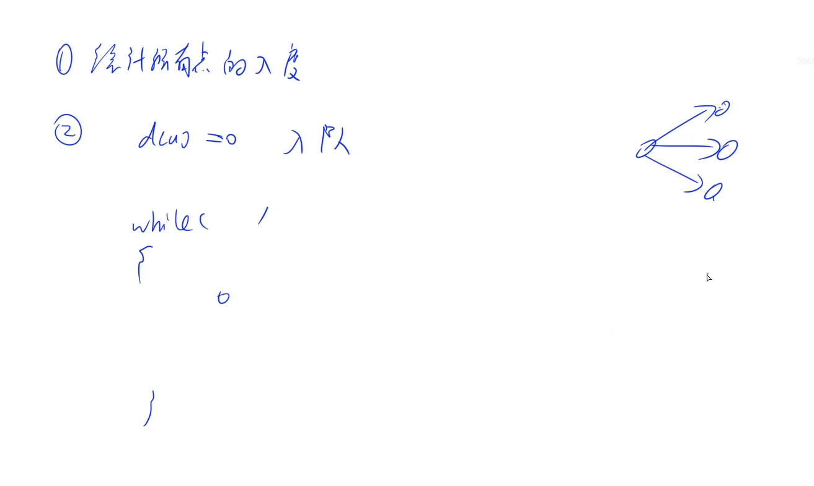
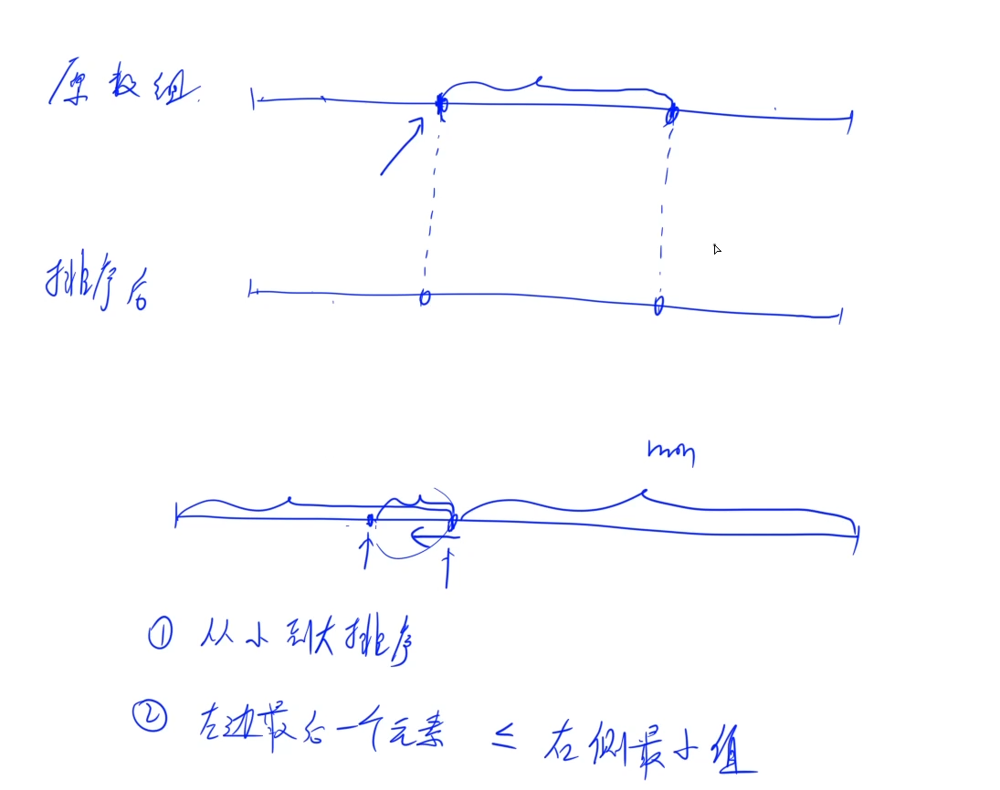
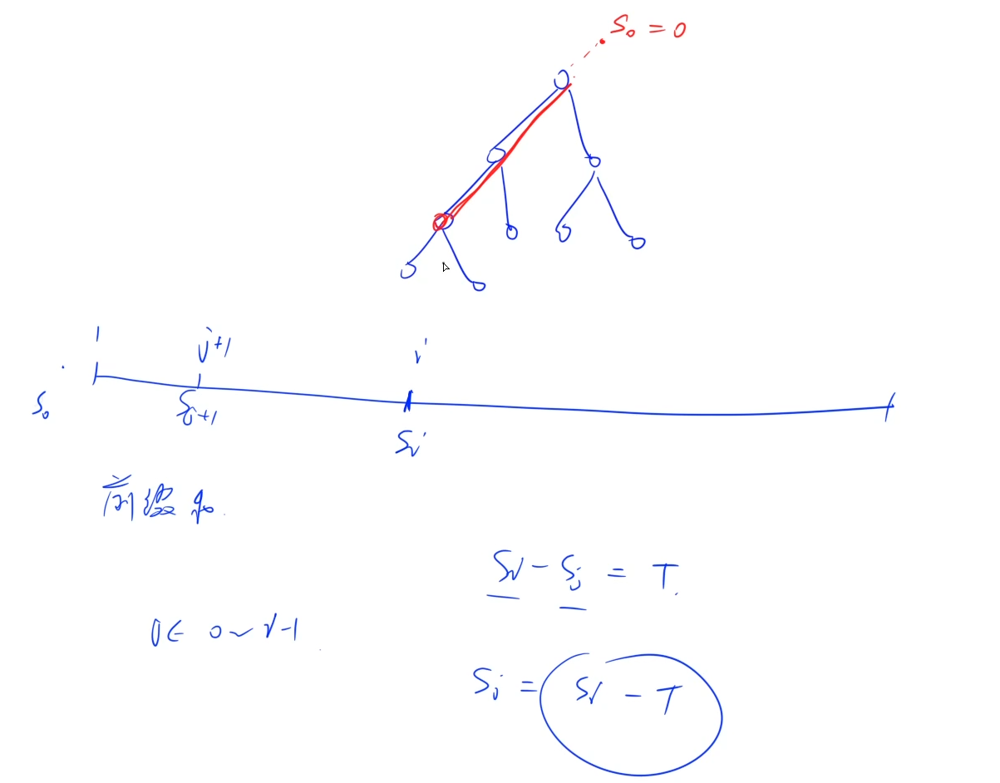
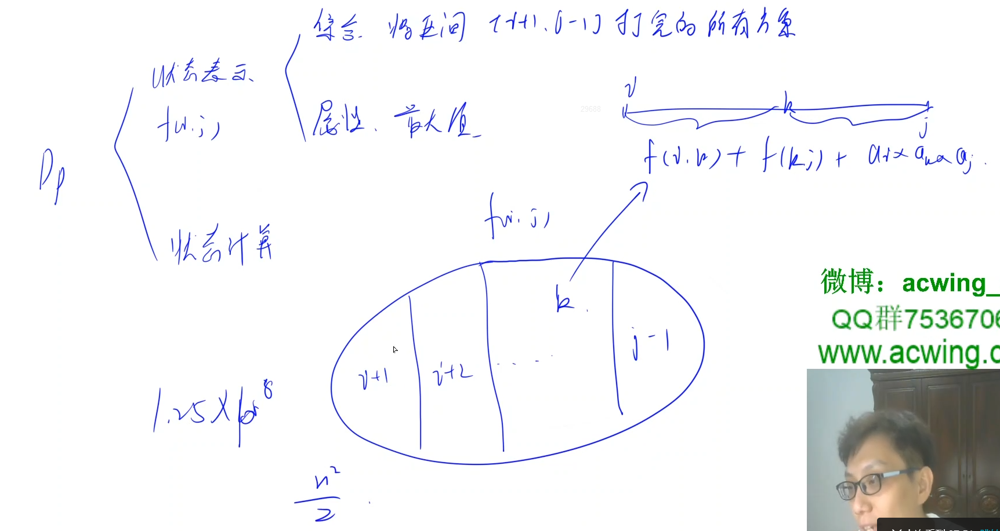
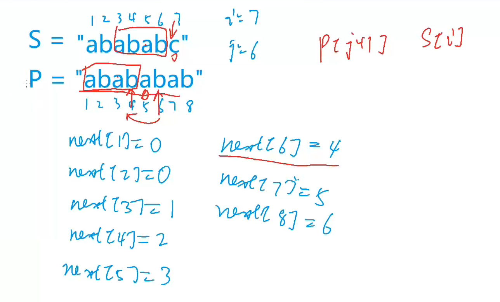
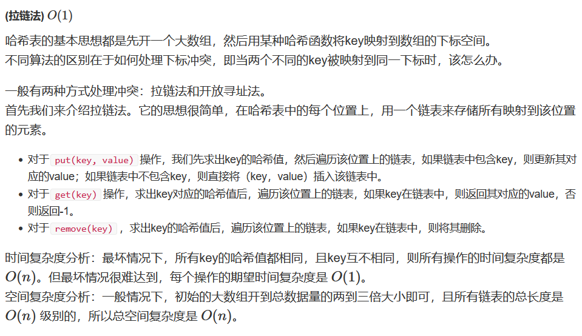
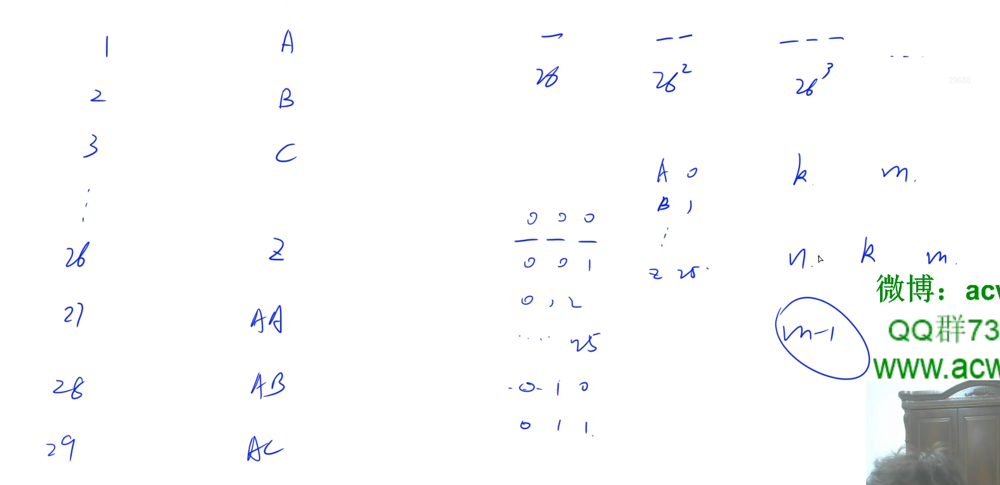
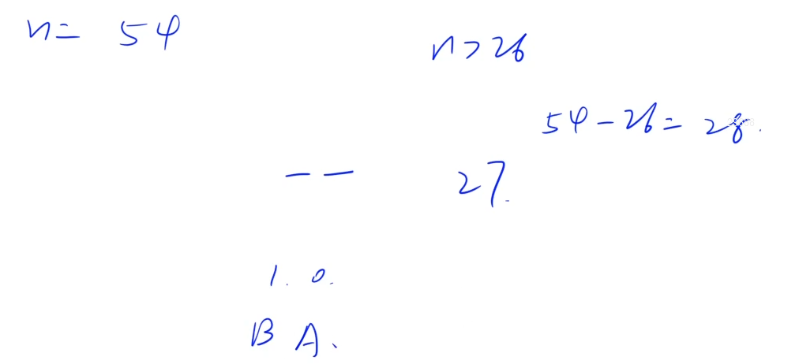

## 力扣500题刷题笔记

### [207. 课程表](https://leetcode-cn.com/problems/course-schedule/)

你这个学期必须选修 `numCourses` 门课程，记为`0` 到 `numCourses - 1` 。在选修某些课程之前需要一些先修课程。 先修课程按数组 	`prerequisites` 给出，其中 `prerequisites[i] = [ai, bi]` ，表示如果要学习课程 `ai` 则 必须 先学习课程  `bi` 。

- 例如，先修课程对 `[0, 1]` 表示：想要学习课程 `0` ，你需要先完成课程 `1` 。

请你判断是否可能完成所有课程的学习？如果可以，返回 `true` ；否则，返回 `false` 。

**示例 1：**

```
输入：numCourses = 2, prerequisites = [[1,0]]
输出：true
解释：总共有 2 门课程。学习课程 1 之前，你需要完成课程 0 。这是可能的。
```

**示例 2：**

```
输入：numCourses = 2, prerequisites = [[1,0],[0,1]]
输出：false
解释：总共有 2 门课程。学习课程 1 之前，你需要先完成课程 0 ；并且学习课程 0 之前，你还应先完成课程 1 。这是不可能的。
```

**提示：** 

- `1 <= numCourses <= 10^5`
- `0 <= prerequisites.length <= 5000`
- `prerequisites[i].length == 2`
- `0 <= ai, bi < numCourses`
- `prerequisites[i]` 中的所有课程对 **互不相同** 

**思路 **

 **(拓扑排序)**  $O(n + m)$ 




**拓扑排序：**  

对一个有向无环图(Directed Acyclic Graph简称DAG)G进行拓扑排序，是将G中所有顶点排成一个线性序列，使得图中任意一对顶点u和v，若<u，v> ∈E(G)，则u在线性序列中出现在v之前。

一个合法的选课序列就是一个拓扑序，拓扑序是指一个满足有向图上，不存在一条边出节点在入节点前的线性序列，如果有向图中有环，就不存在拓扑序。可以通过拓扑排序算法来得到拓扑序，以及判断是否存在环。

**拓扑排序步骤：** 

- 1、建图并记录所有节点的入度。
- 2、将所有入度为`0`的节点加入队列。
- 3、取出队首的元素`now`，将其加入拓扑序列。
- 4、访问所有`now`的邻接点`nxt`，将`nxt`的入度减`1`，当减到`0`后，将`nxt`加入队列。
- 5、重复步骤`3`、`4`，直到队列为空。 
- 6、如果拓扑序列个数等于节点数，代表该有向图无环，且存在拓扑序。

**时间复杂度分析：**假设 $n$ 为点数，$m$ 为边数，拓扑排序仅遍历所有的点和边一次，故总时间复杂度为 $O(n+m)$。

**c++代码 **

```c++
class Solution {
public:
    bool canFinish(int n, vector<vector<int>>& edges) {
        vector<vector<int>> g(n);
        vector<int> d(n);  // 存贮每个节点的入度
        for(auto edge : edges){
            g[edge[1]].push_back(edge[0]);  //建图
            d[edge[0]]++;  //入度加1
        }

        queue<int> q;
        for(int i = 0; i < n; i++){
            if(d[i] == 0) q.push(i);  //将所有入度为0的节点加入队列。
        }

        int cnt = 0;  //统计拓扑节点的个数
        while(q.size()){
            int t = q.front();
            q.pop();
            cnt++;
            for(int i : g[t]){  //访问t的邻接节点(出边)
                d[i]--;
                if(d[i] == 0) q.push(i);
            }
        }
        
        return cnt == n;
    }
};
```

### [438. 找到字符串中所有字母异位词](https://leetcode-cn.com/problems/find-all-anagrams-in-a-string/) * 

**题目**

给定两个字符串 `s` 和 `p`，找到 `s` 中所有 `p` 的 **异位词** 的子串，返回这些子串的起始索引。不考虑答案输出的顺序。

**异位词** 指由相同字母重排列形成的字符串（包括相同的字符串）。 

**示例 1:**

```
输入: s = "cbaebabacd", p = "abc"
输出: [0,6]
解释:
起始索引等于 0 的子串是 "cba", 它是 "abc" 的异位词。
起始索引等于 6 的子串是 "bac", 它是 "abc" 的异位词。
```

**示例 2:**

```
输入: s = "abab", p = "ab"
输出: [0,1,2]
解释:
起始索引等于 0 的子串是 "ab", 它是 "ab" 的异位词。
起始索引等于 1 的子串是 "ba", 它是 "ab" 的异位词。
起始索引等于 2 的子串是 "ab", 它是 "ab" 的异位词。
```

**思路** 

**c++代码**

```c++
class Solution {
public:
    vector<int> findAnagrams(string s, string p) {
        unordered_map<char, int> hs, hp;
        for(int c : p) hp[c]++;
        vector<int> res;
        for(int i = 0, j = 0; i < s.size(); i++){
            hs[s[i]]++;
            while(hs[s[i]] > hp[s[i]])  hs[s[j++]]--;       
            if(i - j + 1 == p.size()){
                res.push_back(j);
            }
        }
        return res;
    }
};
```

### [621. 任务调度器](https://leetcode-cn.com/problems/task-scheduler/)

给你一个用字符数组` tasks` 表示的 CPU 需要执行的任务列表。其中每个字母表示一种不同种类的任务。任务可以以任意顺序执行，并且每个任务都可以在 1 个单位时间内执行完。在任何一个单位时间，CPU 可以完成一个任务，或者处于待命状态。

然而，两个 **相同种类** 的任务之间必须有长度为整数 `n` 的冷却时间，因此至少有连续 `n` 个单位时间内 CPU 在执行不同的任务，或者在待命状态。 

你需要计算完成所有任务所需要的 **最短时间** 。

**示例 1：**

````
输入：tasks = ["A","A","A","B","B","B"], n = 2
输出：8
解释：A -> B -> (待命) -> A -> B -> (待命) -> A -> B
     在本示例中，两个相同类型任务之间必须间隔长度为 n = 2 的冷却时间，而执行一个任务只需要一个单位时间，所以中间出现了（待命）状态。 
````

**示例 2：**

````
输入：tasks = ["A","A","A","B","B","B"], n = 0
输出：6
解释：在这种情况下，任何大小为 6 的排列都可以满足要求，因为 n = 0
["A","A","A","B","B","B"]
["A","B","A","B","A","B"]
["B","B","B","A","A","A"]
...
诸如此类
````

**示例 3：**

```
输入：tasks = ["A","A","A","A","A","A","B","C","D","E","F","G"], n = 2
输出：16
解释：一种可能的解决方案是：
     A -> B -> C -> A -> D -> E -> A -> F -> G -> A -> (待命) -> (待命) -> A -> (待命) -> (待命) -> A
```

**提示：**

- `1 <= task.length <= 104`
- `tasks[i]` 是大写英文字母
- `n` 的取值范围为 `[0, 100]`

**思路**

**c++代码**

```c++
class Solution {
public:
    int leastInterval(vector<char>& tasks, int n) {
        unordered_map<char, int> hash;
        for (auto c: tasks) hash[c] ++ ;
        int maxc = 0, cnt = 0;
        for (auto [k, v]: hash) maxc = max(maxc, v);
        for (auto [k, v]: hash)
            if (maxc == v)
                cnt ++ ;
        return max((int)tasks.size(), (maxc - 1) * (n + 1) + cnt);
    }
};

```

### [581. 最短无序连续子数组](https://leetcode-cn.com/problems/shortest-unsorted-continuous-subarray/) * 

**题目**

给你一个整数数组 `nums` ，你需要找出一个 **连续子数组** ，如果对这个子数组进行升序排序，那么整个数组都会变为升序排序。

请你找出符合题意的 **最短** 子数组，并输出它的长度。 

**示例 1： **

```
输入：nums = [2,6,4,8,10,9,15]
输出：5
解释：你只需要对 [6, 4, 8, 10, 9] 进行升序排序，那么整个表都会变为升序排序。
```

**示例 2：**

```
输入：nums = [1,2,3,4]
输出：0
```

**示例 3：**

```
输入：nums = [1]
输出：0
```

**提示：**

- `1 <= nums.length <= 10^4` 
- `-105 <= nums[i] <= 10^5`

**思路1**

**(排序)**  $O(nlogn)$ 

- 1、将原数组拷贝一份，然后对拷贝后的数组排序。
- 2、对比原数组和排序后的数组，除去前半部分和后半部分相同的数字后，剩余数字的长度就是答案。

**c++代码1**

```c++
class Solution {
public:
    int findUnsortedSubarray(vector<int>& nums) {
        int n = nums.size();
        vector<int> a(nums);
        sort(a.begin(), a.end());
        int i = 0, j = n - 1;
        while(i < n && nums[i] == a[i]) i++;
        while(j >=0 && nums[j] == a[j]) j--;
        return max(0, j - i + 1);
    }
};
```

**思路2**



**有序 + 无序 + 有序** 

递增有序的最左边界满足：

- 1、从小到大排序
- 2、左边左后一个元素 <= 右侧最小值

**具体过程：**

- 1、遍历数组找到左边保持升序的最后一个点的位置`l`,和从右向左看保持降序的最后一个点的位置`r`。
- 2、从`l+ 1`的位置向右扫描，如果遇到有比`nums[l]`小的元素，说明最起码`l`不在正确位置上，则`l--`。
- 3、从`r - 1`的位置向左扫描，如果遇到有比`nums[r]`大的元素，说明最起码`nums[r]`不在正确的位置上，`r ++`。
- 4、最后返回`r - l - 1`。

**c++代码2**

```c++
class Solution {
public:
    int findUnsortedSubarray(vector<int>& nums) {
        int n = nums.size();
        int l = 0, r = n - 1;
        while(l + 1 < n && nums[l + 1] >= nums[l])  l++;
        if(l == r) return 0;
        while(r - 1 >= 0 && nums[r - 1] <= nums[r]) r--;
        for(int i = l + 1; i < n; i++){
            while(l >= 0 && nums[l] > nums[i]) l--;
        }
        for(int i = r - 1; i >= 0; i--){
            while(r < n && nums[r] < nums[i]) r++;
        }
        return r - l - 1;
    }
};
```

### [538. 把二叉搜索树转换为累加树](https://leetcode-cn.com/problems/convert-bst-to-greater-tree/)

**思路**

本题中要求我们将每个节点的值修改为原来的节点值加上所有大于它的节点值之和。这样我们只需要反序中序遍历该二叉搜索树，记录过程中的节点值之和，并不断更新当前遍历到的节点的节点值，即可得到题目要求的累加树。

**c++代码**

```c++
class Solution {
public:
    int sum = 0;
    TreeNode* convertBST(TreeNode* root) {
        if(root != nullptr){
            convertBST(root->right);
            sum += root->val;
            root->val = sum;
            convertBST(root->left);
        }
        return root;
    }
};
```

### [238. 除自身以外数组的乘积](https://leetcode-cn.com/problems/product-of-array-except-self/)

**思路**

申请两个数组，一个用来记录每个位置左边的乘积，和它右边的乘积，再把两个数组乘起来即可。

**c++代码**

```c++
class Solution {
public:
    vector<int> productExceptSelf(vector<int>& nums) {
        int n = nums.size();
        vector<int> p(n, 1);
        for(int i = 1; i < n; i++)  p[i] = p[i - 1] * nums[i - 1];  //前缀乘积
        for(int i = n - 1 , s = 1; i >= 0; i--){
            p[i] *= s;
            s *= nums[i];  // 后缀乘积
        }
        return p;
    }
};
```

### [437. 路径总和 III](https://leetcode-cn.com/problems/path-sum-iii/) *

**思路1**

**(dfs)**  $O(n^2)$  

我们遍历每一个节点 `node`，搜索以当前节点`node`为起始节点往下延伸的所有路径，并对路径总和为 `targetSumtarget`的路径进行累加统计。

**c++代码** 

```c++
class Solution {
public:
    int res = 0;
    int pathSum(TreeNode* root, int targetSum) {
        if(!root) return 0;
        dfs(root, targetSum);
        pathSum(root->left, targetSum);
        pathSum(root->right, targetSum);
        return res;
    }
    void dfs(TreeNode* root, int sum){
        if(!root) return ;
        sum -= root->val;
        if(sum == 0) res++;
        if(root->left) dfs(root->left, sum);
        if(root->right)dfs(root->right, sum);
    }
};
```




**(前缀和 + 哈希)**  $O(n)$

求出二叉树的前缀和，统计以每个节点`node`节点为路径结尾的合法路径的数量，记录一个哈希表`cnt`，维护每个前缀和出现的次数。

对于当前节点`root`，前缀和为`cur`，累加 `cnt [cur - sum]`的值，看看有几个路径起点满足。

**c++代码**

```c++
class Solution {
public:
    unordered_map<int, int> cnt;
    int res = 0;
    int pathSum(TreeNode* root, int targetSum) {
        cnt[0] = 1;
        dfs(root, targetSum, 0);
        return res;
    }
    void dfs(TreeNode* root, int sum, int cur){
        if(!root) return ;
        cur += root->val;
        res += cnt[cur - sum];
        cnt[cur]++;
        dfs(root->left, sum, cur), dfs(root->right, sum, cur);
        cnt[cur]--; //回溯
    }
};
```

### [309. 最佳买卖股票时机含冷冻期](https://leetcode-cn.com/problems/best-time-to-buy-and-sell-stock-with-cooldown/)

**思路**

**(动态规划)** $O(n)$

**状态表示：**`f[i]`表示第`i` 天结束后不持有股票的最大收益，`g[i]` 表示第 `i` 天结束后持有股票的最大收益。

**状态计算：** 	

- `f[i] = max(f[i - 1], g[i - 1] + prices[i])`，表示第 `i` 天什么都不做，或者卖掉持有的股票。
- `g[i] = max(g[i - 1], f[i - 2] - prices[i])`，  表示第 `i` 天什么都不做，或者买当天的股票，但需要从上两天的结果转移。

**初始化：** 

**c++代码**

```c++
class Solution {
public:
    int maxProfit(vector<int>& prices) {
        int n = prices.size();
        vector<int> f(n + 1), g(n + 1);
        f[0] = 0, g[0] = -prices[0];
        for(int i = 1; i < n; i++){
            f[i] = max(f[i - 1], g[i - 1] + prices[i]);
            if(i >= 2) g[i] = max(g[i - 1], f[i - 2] - prices[i]);
            else g[i] = max(g[i - 1], -prices[i]);
        }
        return f[n - 1];
    }
};
```

### [312. 戳气球](https://leetcode-cn.com/problems/burst-balloons/) *

**题目**

**思路**

**(区间DP)**   $O(n^3)$ 



**状态表示：** `f[i][j]`表示戳破区间`(i, j)`所有气球所能获得硬币的最大数量。

**状态计算：** 

假设最后一次戳破编号为`k`的气球

`f[i][j] = max(f[i][j], f[i][k] + f[k][j] + a[i] * a[k] * a[j])`

**c++代码**

```c++
class Solution {
public:
    int maxCoins(vector<int>& nums) {
        int n = nums.size();
        vector<int> a(n + 2, 1);  //全部初始化为1
        for(int i = 1; i <= n; i++)  a[i] =  nums[i - 1];  //下标从1开始
        vector<vector<int>> f(n + 2, vector<int>(n + 2));
        for(int len = 3; len <= n + 2; len++)  //枚举长度   
            for(int i = 0; i + len - 1 <= n + 1; i++){ //[0, n + 1]  //左边界
                int j = i + len - 1;  // (i,j)  右边界
                for(int k = i + 1; k < j; k++)
                  f[i][j] = max(f[i][j], f[i][k] + f[k][j] + a[i] * a[j] * a[k]);
            }
        return f[0][n + 1];    
    }
};
```

### [459. 重复的子字符串](https://leetcode-cn.com/problems/repeated-substring-pattern/)

**思路1**

**暴力解法** 

**c++代码1**

```c++
class Solution {
public:
    bool repeatedSubstringPattern(string s) {
        int n = s.size();
        for(int len = 1; len <= n / 2; len++){
            bool flag = true;
            string str = s.substr(0, len);
            for(int i = 0; i < n; i += len){
                for(int j = 0; j < len; j++)
                {
                    if(s[j] != s[j + i]){
                        flag = false;
                        break;
                    }
                }
            }
            if(flag) return true;
        }
        return false;
    }
};
```

**思路2**

**KMP**



**next数组：** 

`next`数组,`next[i]`表示子串`p[1,2,,,,,,i-1,i]`的最长相等前后缀的前缀最后一位下标,或者说是子串的最长相等前后缀的长度，因为我们是从下标1开始的，这也体现出了从1开始的好处

**定理1：**  

假设`S`的长度为`len`，则`S`存在最小循环节，循环节的长度`L`为`len-next[len]`，子串为`S[0…len-next[len]-1]`。

- 1、如果`len`可以被`len - next[len]`整除，则表明字符串`S`可以完全由循环节循环组成，循环周期`T=len/L`。

- 2、如果不能，说明还需要再添加几个字母才能补全。需要补的个数是循环个数`L-len%L=L-(len-L)%L=L-next[len]%L，L=len-next[len]`。

**c++代码2**

```c++
class Solution {
public:
    bool repeatedSubstringPattern(string s) {
        int n = s.size();
        s = ' ' + s;  //下标从1开始
        vector<int> next(n + 1);
        for(int i = 2 , j = 0; i <= n ; i++){
            while(j && s[i] != s[j + 1])  j = next[j];
            if(s[i] == s[j + 1]) j++;
            next[i] = j;
        }
        int t = n - next[n];
        return t < n && n % t == 0;
    }
};
```

### [26. 删除有序数组中的重复项](https://leetcode-cn.com/problems/remove-duplicates-from-sorted-array/)

**思路1**

取第一个数或者只要当前数和前一个数不相等，我们就取当前数（重复元素取最后一个）。

**c++代码1**

```c++
class Solution {
public:
    int removeDuplicates(vector<int>& nums) {
        int k = 0;
        for(int i = 0; i < nums.size(); i++){
            if(!i || nums[i] != nums[i - 1])
                nums[k++] = nums[i];
        }
        return k;
    }
};
```

**思路2** 

双指针，重复的一段元素我们只取第一个。

**c++代码2**

```c++
class Solution {
public:
    int removeDuplicates(vector<int>& nums) {
        int n = nums.size(), k = 0;
        for(int i = 0, j = 0; i <n; i++){
            j = i;
            while(j < n && nums[i] == nums[j]) j++;
            nums[k++] = nums[i];
            i = j - 1;
        }
        return k;
    }
};
```

### [268. 丢失的数字](https://leetcode-cn.com/problems/missing-number/) *

**思路**

(基础数学) $O(n)$

直接对数组中的数字求和，然后用`n(n+1)2 − sum` 即可得到答案。

**时间复杂度分析：**只有一次求和，故时间复杂度为 $O(n)$ 

**c++代码** 

```c++
class Solution {
public:
    int missingNumber(vector<int>& nums) {
        int n = nums.size(), sum = 0;
        for(int x : nums) sum += x;
        return (1 + n) * n / 2 - sum;
    }
};
```

### [706. 设计哈希映射](https://leetcode-cn.com/problems/design-hashmap/) *

**思路**

**(拉链法）**$O(1)$  



**c++代码**

```c++
const int N = 19997;
class MyHashSet {
public:
    vector<int> h[N];  //数组模拟单调表，h[t]存贮key的哈希值，t为存贮地址
    MyHashSet() {

    }
    
    int find(vector<int>&h, int key){  // 哈希表中是否包含key的哈希值
        for(int i = 0; i < h.size(); i++){
            if(h[i] == key) return i;
        }
        return -1;
    }
    void add(int key) {   
        int t = key % N;   //t是坑位
        int k = find(h[t], key);
        if(k == -1)  h[t].push_back(key); 
    }
    
    void remove(int key) {
        int t = key % N;
        int k = find(h[t], key);
        if (k != -1) h[t].erase(h[t].begin() + k);
    }
    
    bool contains(int key) {
        int t = key % N;
        int k = find(h[t], key);
        return k != -1;
    }
};

```

### [168. Excel表列名称](https://leetcode-cn.com/problems/excel-sheet-column-title/)

**思路**





**c++代码**

```c++
```

