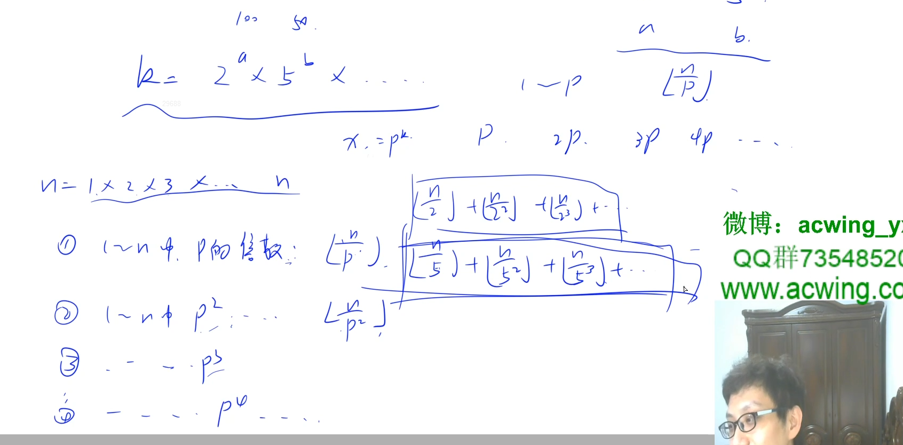
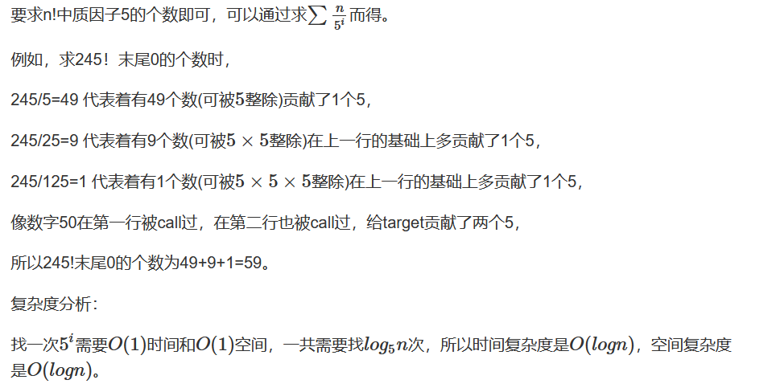
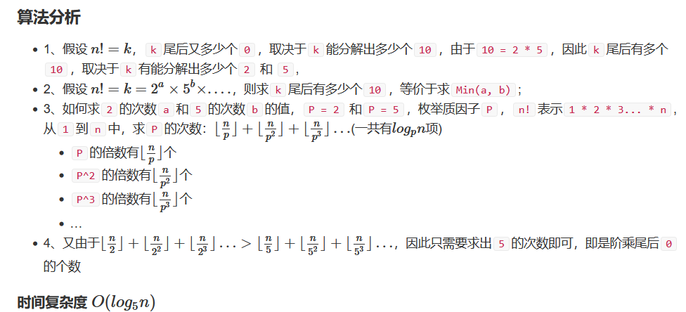
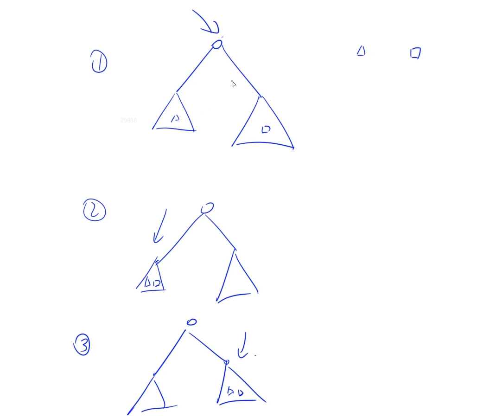
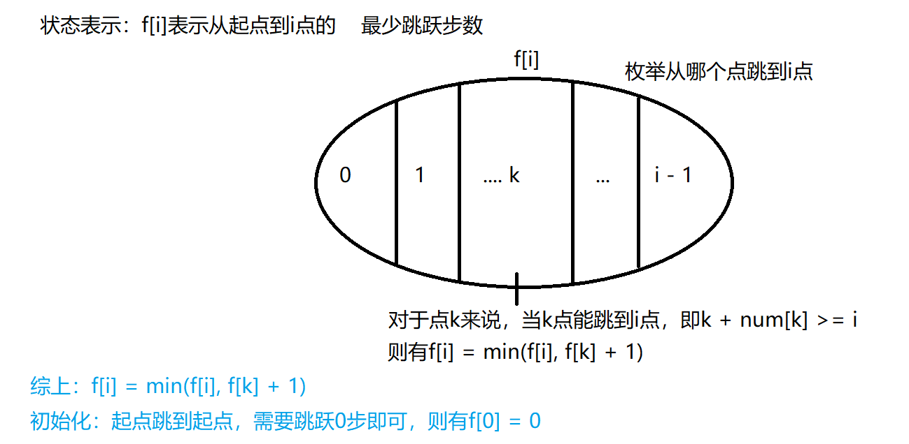
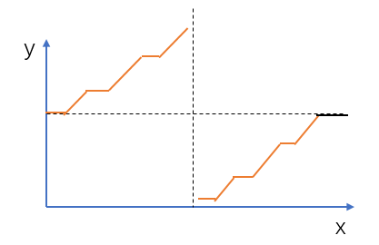
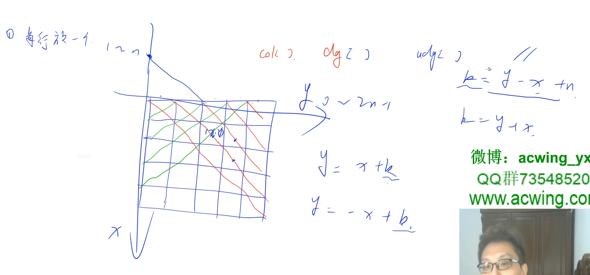

## 力扣500题刷题笔记

### [118. 杨辉三角](https://leetcode-cn.com/problems/pascals-triangle/)

**思路**

**动态规划：**   ` f[i][j] = f[i - 1][j - 1] + f[i - 1][j]`

**c++代码 **

```c++
class Solution {
public:

    /**
    
    **/
    vector<vector<int>> generate(int n) {
        vector<vector<int>> f;
        for(int i = 0; i < n; i++){
            vector<int> line(i + 1);  //每行的元素个数为i + 1
            line[0] = line[i] = 1;    //每行首尾元素为1
            for(int j = 1; j < i; j++)
                line[j] = f[i - 1][j - 1] + f[i - 1][j];  //填写一行
            f.push_back(line);    
        }
        return f;
    }
};
```

### [876. 链表的中间结点](https://leetcode-cn.com/problems/middle-of-the-linked-list/)

**思路**

**c++代码1**

```c++
class Solution {
public:
    ListNode* middleNode(ListNode* head) {
        if(!head) return NULL;
        int n = 0;
        for(ListNode* p = head; p; p = p->next){
            n++;
        }
        int k = n / 2 + 1;
        ListNode* p = head;
        for(int i = 0; i < k - 1; i++){
            p = p->next;
        }
        return p;
    }
};
```

**c++代码2**

```c++
class Solution {
public:
    ListNode* middleNode(ListNode* head) {
        auto p = head, q = head;
        while(q && q->next){
            p = p->next;
            q = q->next->next;
        }
        return p;
    }
};
```

### [172. 阶乘后的零](https://leetcode-cn.com/problems/factorial-trailing-zeroes/)

**思路**



由于`n!`的后缀`0`是由质因子`2`和质因子`5`相乘而来的，而`2`的个数总是比`5`多的，因此我们只需要计算`n!`中质因子`5`的个数即可。





**c++代码** 

```c++
class Solution {
public:
    int trailingZeroes(int n) {
        int res = 0;
        while(n){
            res += n / 5;
            n /= 5;
        }
        return res;
    }
};
```

### [235. 二叉搜索树的最近公共祖先](https://leetcode-cn.com/problems/lowest-common-ancestor-of-a-binary-search-tree/)

**思路**

**(递归)**  $O(h)$ `h`是树的高度



二叉搜索树的定义：左子树`val`小于根节点`val`，根节点值小于右子树`val`。

1、对于两个指针`p`和`q`，假设小的值是`p`，大的值是`q`（反过来也一样）
2、递归过程中只有`3`种情况

- `p.val <= root.val <= q.val`（结束，返回`root`值即结果）
-  `root.val < p.val < q.val`（`root->right`递归）
-  `root.val > q.val > p.val`（`root.left`递归）。

**c++代码**

```c++
```

### [71. 简化路径](https://leetcode-cn.com/problems/simplify-path/)*

**思路**

**(模拟)** $O(n)$

我们可以把整个路径看作是一个动态的“进入某个子目录”或“返回上级目录”的过程。所以我们可以模拟这个过程，`res`表示当前的路径，`name`表示遇到两个`'/'`之间的字符

- 如果遇到 `".."`，则返回上级目录，即将`res`最后一个以`"/"`开始往后的字符全部删去。
- 如果遇到 `"."`或多余的`“/”`，则不做任何处理：
- 其它情况，表示进入某个子目录，我们在 `res` 后面补上新路径，即将`"/" + name`字符串加入到`res`后面。

**实现细节：**

先在字符串尾部拼接一个`/`，使得每个截断的单词都以`/`结尾。

**时间复杂度分析：** $O(n)$。 

**c++代码**

```c++
class Solution {
public:
    string simplifyPath(string path) {
        string res, name;
        if(path.back() != '/') path += "/";
        for(char c : path){
            if(c != '/')  name += c;
            else{
                if(name == ".."){
                    while(res.size() && res.back() != '/') res.pop_back(); //弹出name
                    if(res.size()) res.pop_back();  //弹出/
                }else if(name != "." && name != ""){
                    res += "/" + name;
                }           
                name.clear();
            } 
        } 
        if(res.empty()) return "/";
        return res;
    }
};
```

### [496. 下一个更大元素 I](https://leetcode-cn.com/problems/next-greater-element-i/)

**思路**

**(单调栈)** $O(n)$ 


**c++代码** 

```c++
class Solution {
public:
    /**
        单调栈
    **/
    vector<int> nextGreaterElement(vector<int>& nums1, vector<int>& nums2) {
        stack<int> stk;   //单调递减栈
        vector<int> q(nums2.size()); //存贮nums2数组中每个nums2[i]元素右边第一个比其大的元素
        for(int i = nums2.size() - 1; i >= 0; i--){
             while(stk.size() && nums2[i] >= stk.top() ) stk.pop();  //维护单调递减栈
             if(stk.size()) q[i] = stk.top();
             else q[i] = -1;
             stk.push(nums2[i]);
        }

        unordered_map<int, int> hash;
        for(int i = 0; i < nums2.size(); i++){
            hash[nums2[i]] = i;
        }
        vector<int> res;
        for(int x : nums1){
            res.push_back(q[hash[x]]);
        }
        return res;
    }
};
```

### [503. 下一个更大元素 II](https://leetcode-cn.com/problems/next-greater-element-ii/)

**思路**

**(单调栈)** $O(n)$ 

将原数组复制一份接在原数组之后，这样可以处理类似的环形问题。

**c++代码**

```c++
class Solution {
public:
    vector<int> nextGreaterElements(vector<int>& nums) {
        int n = nums.size();
        stack<int> stk;
        nums.insert(nums.end(), nums.begin(), nums.end());
        vector<int> res(n);
        for(int i = nums.size() - 1; i >= 0; i--){
            while(stk.size() && nums[i] >= nums[stk.top()]) stk.pop();
            if(i < n){
                if(stk.size()) res[i] = nums[stk.top()];
                else  res[i] = -1;
            }
            stk.push(i);
        }
        return res;
    }
};
```

### [63. 不同路径 II](https://leetcode-cn.com/problems/unique-paths-ii/)

**思路**

**(动态规划)**   $O(n)$ 

**c++代码**

```c++
class Solution {
public:
    int uniquePathsWithObstacles(vector<vector<int>>& o) {
        int n = o.size(), m = o[0].size();   
        vector<vector<int>> f(n + 1, vector<int>(m + 1));
        for(int i = 0; i < n; i++)
            for(int j = 0; j < m; j++){
                if(!o[i][j]){
                    if(!i && !j) f[i][j] = 1;
                    else {
                        if(i) f[i][j] += f[i - 1][j];
                        if(j) f[i][j] += f[i][j - 1];
                    }         
                }
            }
        return f[n - 1][m - 1];    
    }
};
```

### [167. 两数之和 II - 输入有序数组](https://leetcode-cn.com/problems/two-sum-ii-input-array-is-sorted/)

**思路**

**(双指针)** $O(n)$

枚举`i`位置的时候，确保`j`指针满足`nums[i] + nums[j] <= target`，若当前两个指针满足`nums[i] + nums[j] == target` 则直接返回结果。

**c++代码**

```c++
class Solution {
public:
    vector<int> twoSum(vector<int>& nums, int target) {
        int i = 0, j = nums.size() - 1;
        while(i < j){
            if(nums[i] + nums[j] == target) return {i + 1, j + 1};
            else if(nums[i] + nums[j] < target) i++;
            else j--; 
        }
        return {};
    }
};
```

### [530. 二叉搜索树的最小绝对差](https://leetcode-cn.com/problems/minimum-absolute-difference-in-bst/)*

**思路**

**(递归)**  $O(n)$ 

- 1、二叉搜索树通过中序遍历铺成一维后的值是从小到大的，最小的绝对值差一定是在某两个相邻的数的差值中
- 2、通过递归的方式中序遍历整个树，用`pre`记录枚举到当前节点在中序序列中上一个结点的值，通过`root.val - pre`的差值更新答案

**细节:**

由于求的是两个不同节点值之间的最小差值，因此不去处理第一个节点。

**c++代码**

```c++
/**
 * Definition for a binary tree node.
 * struct TreeNode {
 *     int val;
 *     TreeNode *left;
 *     TreeNode *right;
 *     TreeNode() : val(0), left(nullptr), right(nullptr) {}
 *     TreeNode(int x) : val(x), left(nullptr), right(nullptr) {}
 *     TreeNode(int x, TreeNode *left, TreeNode *right) : val(x), left(left), right(right) {}
 * };
 */
class Solution {
public:
    int res = 1e5 + 10, pre ;
    bool first = true;
    int getMinimumDifference(TreeNode* root) {
        dfs(root);
        return res;
    }
    void dfs(TreeNode* root){
        if(!root) return ;
        dfs(root->left);
        if(!first)  res = min(res, root->val - pre);
        else first = false;
        pre = root->val;
        dfs(root->right);
    }
};
```

### [45. 跳跃游戏 II](https://leetcode-cn.com/problems/jump-game-ii/) *

**思路**

**(贪心 + 动态规划)**   $O(n)$



**状态表示：** `f[i]`表示从位置`0`跳到位置`i`所需要的最小跳跃数。

**状态计算：** `f[i] = f[j] +  1` 

这里的核心思想是动态规划，即 `f[i]` 表示到达 `i` 的最少步数。转移时，可以利用贪心来优化，免除了循环 `n` 来寻找可以转移到位置 `i `的最优决策。这里的贪心思想为，如果在某个位置`j` 可以一步到达 `i`，则 `j` 之后的位置就都不必再枚举了，而且这个 `j`是随着 `i` 单调递增的，所以我们在动态规划的过程中，维护 `j` 变量。

**c++代码 **

```c++
class Solution {
public:
    int jump(vector<int>& nums) {
        int n = nums.size();
        vector<int> f(n);
        for(int i = 1, j = 0; i < n; i++){
            while(j + nums[j] < i) j++;
            f[i] = f[j] + 1;
        }
        return f[n - 1];
     }
};
```

### [154. 寻找旋转排序数组中的最小值 II](https://leetcode-cn.com/problems/find-minimum-in-rotated-sorted-array-ii/) *

**思路**

**(二分)**  $O(logn)$ 



**c++代码**

```c++
class Solution {
public:
    int findMin(vector<int>& nums) {
        int l = 0, r = nums.size() - 1;
        while(l < r && nums[0] == nums[r]) r--;  //去除最后一段重复的元素
        if(nums[l] <= nums[r]) return nums[l];
        while(l < r){
            int mid = (l + r) / 2;
            if(nums[mid] < nums[0]) r = mid;
            else  l = mid + 1;
        }
        return nums[r];
    }
};
```

### [51. N 皇后](https://leetcode-cn.com/problems/n-queens/)

**思路**

**(回溯)** 



遍历每一行，搜索每一行上每个点是否可以放置棋子。

**c++代码**

```c++
 
```

### [404. 左叶子之和](https://leetcode-cn.com/problems/sum-of-left-leaves/) * 

**思路**

**(递归)**  $O(n)$ 

**c++代码**

```c++
class Solution {
public:
    int res = 0;
    int sumOfLeftLeaves(TreeNode* root) {
        dfs(root);
        return res;
    }
    void dfs(TreeNode* root){
        if(!root) return ;
        if(root->left){    //左子节点
             if(!root->left->left && !root->left->right) res += root->left->val;  //叶子节点
        }
        dfs(root->left);
        dfs(root->right);
    }
};
```

### [97. 交错字符串](https://leetcode-cn.com/problems/interleaving-string/) *

**思路**

**(动态规划)**   $O(n^2)$


**状态表示：** `f[i][j]`表示`s1`的前`i`个字符和`s2`的前`j`个字符是否可以交错组成`s3`的前`i + j`个字符。

**状态计算：**

考虑`s3`字符串的最后一个字符来自哪个字符串：

- 如果`s3[i + j] == s1[i]`，则`f[i][j] = f[i - 1][j]`。  
- 如果`s3[i + j] == s2[j]`，则`f[i][j] = f[i][j - 1]`。

两种情况只要有一种为真，则 `f[i][j] `就为真，状态转移方程为：`f[i][j]` = `f[i - 1][j]` | `f[i][j - 1]`。

**c++代码**

```c++
class Solution {
public:
    bool isInterleave(string s1, string s2, string s3) {
        int n = s1.size(), m = s2.size();
        if(n + m != s3.size()) return false;
        vector<vector<bool>> f(n + 1, vector<bool>(m + 1));
        s1 = ' ' + s1, s2 = ' ' + s2, s3 = ' ' +  s3; //下标从1开始
        for(int i = 0; i <= n; i++)
            for(int j = 0; j <= m; j++){
               if(!i && !j)  f[i][j] = true;
               else{
                    if(i && s1[i] == s3[i + j])  f[i][j] = f[i - 1][j];
                    if(j && s2[j] == s3[i + j])  f[i][j] = f[i][j] | f[i][j - 1];
               }      
            } 
        return f[n][m];    
    }
};
```

