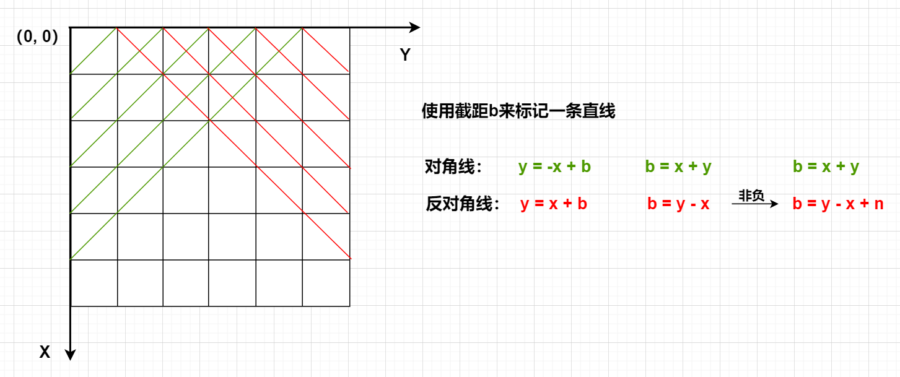

算法基础课

## 第一讲 基础算法

### 快速排序

#### [785. 快速排序 ](https://www.acwing.com/problem/content/787/)

**思路**

**代码**

```c++
#include<iostream>
#include<cstdio>

using namespace std;

const int N = 1e5 + 10;
int q[N];
void quick_sort(int q[], int l, int r)
{
    if(l >= r) return ;
    int i = l - 1, j = r + 1, x = q[i + j >> 1];
    while(i < j){
        do i++; while(q[i] < x);
        do j--; while(q[j] > x);
        if(i < j) swap(q[i], q[j]);
    }
    quick_sort(q, l, j), quick_sort(q, j + 1, r);
}
int main()
{
    int n;
    cin>>n;
    for(int i = 1; i <= n; i++){
        cin>>q[i];
    }
    quick_sort(q, 1, n);
    for(int i = 1; i <= n; i++){
        cout<<q[i]<<' ';
    }
    return 0;
}
```

#### AcWing 786. 第k个数

**思路**

**c++代码**

```c++
#include<iostream>
#include<cstdio>

using namespace std;
const int N = 1e5 + 10;
int q[N];
int quick_sort(int q[], int l, int r, int k){
    if(l >= r) return q[l];
    int i = l - 1, j = r + 1, x = q[(i + j )/ 2];
    while(i < j){
        do i++; while(q[i] < x);
        do j--; while(q[j] > x);
        if(i < j) swap(q[i], q[j]);
    }
    int sl = j - l + 1;
    if(sl >= k) return quick_sort(q, l, j, k);
    else return quick_sort(q, j + 1, r, k - sl);
}
int main()
{
    int n, k;
    cin>>n>>k;
    for(int i = 0; i < n; i++){
        cin>>q[i];
    }
    cout<<quick_sort(q, 0, n - 1, k)<<endl;
    return 0;
}
```

### 归并排序

#### AcWing 787. 归并排序     

**思路**

**c++代码**                            

```c++
#include<iostream>
using namespace std;
const int N = 1e5 + 10;
int q[N], tmp[N];

void merge_sort(int q[], int l, int r){
    if(l >= r) return ;
    int mid = (l + r) / 2;
    merge_sort(q, l, mid), merge_sort(q, mid + 1, r);
    int k = l, i = l, j = mid + 1;
    while(i <= mid && j <= r){
        if(q[i] <= q[j]) tmp[k++] = q[i++];
        else tmp[k++] = q[j++];
    }
    while(i <= mid) tmp[k++] = q[i++];
    while(j <= r)   tmp[k++] = q[j++];
    for(int i = l; i <= r; i++) q[i] = tmp[i];
}
int main()
{
    int n;
    cin>>n;
    for(int i = 0; i < n; i++){
        cin>> q[i];
    }
    merge_sort(q, 0, n - 1);
    for(int i = 0; i < n; i++){
        cout<<q[i]<<' ';
    }
    return 0;
}
```

#### AcWing 788. 逆序对的数量

**思路**

**c++代码**

```c++
#include<iostream>
#include<cstdio>
using namespace std;
const int N = 1e5+10;
int q[N],tmp[N];
long long ans = 0;
void merge_sort(int q[],int l,int r)
{
    if(l >= r) return ;
    int mid = (l+r)/2;
    merge_sort(q,l,mid);
    merge_sort(q,mid+1,r);
    int i = l, k =l, j = mid + 1;
    while(i<=mid&&j<=r)
    {
        if(q[i]<=q[j]) tmp[k++] = q[i++];
        else 
        {
            ans += mid - i + 1;
            tmp[k++] = q[j++];
        }
    }
    while(i<=mid) tmp[k++] = q[i++];
    while(j<=r)   tmp[k++] = q[j++];
    for(int i = l; i <= r; i++)  q[i] = tmp[i];
} 
int main()
{
    int n;
    cin>>n;
    for(int i = 0; i < n; i++) cin>>q[i];
    merge_sort(q,0,n-1);
    cout<<ans<<endl;
    return 0;
}
```

### 二分

#### AcWing 789. 数的范围

**思路**

**c++代码**

```c++
#include<iostream>
#include<cstdio>
using namespace std;
const int N = 1e5 + 10;
int a[N];
int main()
{
    int n,q;
    scanf("%d%d",&n,&q);
    for(int i = 0; i < n; i++) scanf("%d",&a[i]);
    while(q--)
    {
        int k;
        scanf("%d",&k);
        int l = 0, r = n-1;
        while(l<r)
        {
            int mid = (l + r)/2;
            if(a[mid]>=k) r = mid;
            else l = mid + 1;
        }
        if(a[l]!=k) printf("-1 -1\n");
        else 
        {
            printf("%d ",l);
            l = 0,r = n -1;
            while(l<r)
            {
                int mid = (l + r + 1)/2 ;
                if(a[mid]<=k) l = mid;
                else r = mid -1;
            }
            printf("%d\n",l);
        }
    }
    return 0;
}
```

#### AcWing 790. 数的三次方根

**思路**

**c++代码**

```c++
#include<iostream>

using namespace std;

int main()
{
    double n;
    cin>>n;
    double  l = -100 , r = 100;
    while(r-l >1e-8)
    {
        double mid = (l+r)/2;
        if(mid*mid*mid<=n) l = mid;
        else r = mid;
    }
    printf("%.6lf",l);
    return 0;
}
```

### 高精度

#### AcWing 791. 高精度加法     

**思路**

**c++代码**

```c++
//从个位数开始进行相加，使用t记录(A[i] + B[i] + next)得出的结果，
//t % 10为该位数确定好的元素，进行下一个位数操作时，需要t /= 10
#include<iostream>
#include<vector>
#include<string>
using namespace std;
vector<int> add(vector<int>&A, vector<int>&B)
{
	if (A.size() < B.size())  return add(B, A);
	vector<int>C;
	int t = 0;   //存贮进位
	for (int i = 0; i < A.size(); i++)
	{
		t += A[i];
		if (i < B.size()) t += B[i];
		C.push_back(t % 10);
		t /= 10;
	}
	if (t) C.push_back(t);
	return C;
}
int main()
{
	string a, b;
	vector<int>A, B;
	cin >> a >> b;  
	for (int i = a.size() - 1; i >= 0; i--)  A.push_back(a[i] - '0'); //倒着存储，便于进位操作
	for (int i = b.size() - 1; i >= 0; i--)  B.push_back(b[i] - '0');
	auto C = add(A, B);
	for (int i = C.size()-1; i >= 0; i--) cout << C[i];
	cout << endl;
	return 0;
}
```

####                             AcWing 792. 高精度减法

**思路**

**c++代码**

```c++
#include<iostream>
#include<vector>
#include<string>
using namespace std;
//判断是否有A>=B
bool cmp(vector<int> &A,vector<int> &B)
{
    if (A.size() != B.size()) return A.size() > B.size();
    for (int i = A.size() - 1; i >= 0; i--)
    {
        if (A[i] != B[i])
        {
            return A[i] > B[i];
        }
    }
    return 1;  //说明两者相等
}
vector<int> sub(vector<int>&A, vector<int>&B)
{
    vector<int>C;
    for (int i = 0, t = 0; i < A.size(); i++)  // t =A[i]-B[i]-t;
    {
        t = A[i]-t;
        if (i < B.size())  t -= B[i];
        C.push_back((t + 10) % 10);    //如果t<0, t+10借位; t>=0 ,为t;
        if (t < 0)  t = 1; //借位
        else t = 0;
    }
    while (C.size() > 1 && C.back() == 0)   C.pop_back();  //去除C的前导零
    return C;
}
int main()
{
    string a, b;
    vector<int>A, B;
    cin >> a >> b;
    for (int i = a.size() - 1; i >= 0; i--)  A.push_back(a[i] - '0'); //倒着存储，便于进位操作
    for (int i = b.size() - 1; i >= 0; i--)  B.push_back(b[i] - '0');
    vector<int>C;
    if(cmp(A,B))
    {
       C = sub(A, B);
    }
    else
    {       
        C = sub(B, A);
        printf("-");
    }
    for (int i = C.size() - 1; i >= 0; i--) cout << C[i];
    cout << endl;
    return 0;
}
```

#### AcWing 793. 高精度乘法

**思路**

**c++代码**

```c++
#include<iostream>
#include<cstdio>
#include<string>
#include<vector>
using namespace std;
// C=A*b;
vector<int>mul(vector<int>&A, int &b)
{
	vector<int>C;
	int t = 0; //存储进位
	for (int i = 0; i < A.size()||t; i++)
	{ 
		if(i<A.size()) t += A[i] * b;
		C.push_back(t % 10);
		t /= 10;
	}
	while(C.size()>1&&C.back()==0)  C.pop_back();
	return C;
}
int main()
{
	string a;
	int b;
	vector<int>A;
	cin >> a >> b;
	for (int i = a.size() - 1; i >= 0; i--)  A.push_back(a[i] - '0');
	auto C = mul(A, b);
	for (int i = C.size() - 1; i >= 0; i--)  cout << C[i];
	cout << endl;
	return 0;
}
```

#### AcWing 794. 高精度除法

**思路**

**c++代码**

```c++
#include<iostream>
#include<cstdio>
#include<vector>
#include<algorithm>
using namespace std;
vector<int> div(vector<int>&A, int b, int &r){
    vector<int>C;
    for(int i = A.size() - 1; i >= 0; i--){
        r = r * 10 + A[i];
        C.push_back(r / b);
        r %= b;
    }
    reverse(C.begin(), C.end());
    while(C.size() > 1 && C.back() == 0) C.pop_back();
    return C;
}
int main(){
    string a;
    int b;
    cin>>a>>b;
    vector<int>A;
    for (int i = a.size() - 1; i >= 0; i -- ) A.push_back(a[i] - '0');
    int r = 0;
    auto C = div(A, b, r);
    for(int i = C.size() - 1; i >= 0; i--)  cout<<C[i];
    cout<<endl;
    cout<<r<<endl;
    return 0;
}
```

### 前缀和与差分

#### AcWing 795. 前缀和

**思路**

**c++代码**

```c++
#include<iostream>
#include<cstdio>
using namespace std;
const int N = 1e5 + 10;
int s[N];
int main()
{
    int n, m;
    scanf("%d%d",&n,&m);
    for(int i = 1; i <= n; i++)
    {
        scanf("%d",&s[i]);
        s[i] += s[i-1]; 
    }
    while(m--)
    {
        int l,r;
        scanf("%d%d",&l,&r);
        printf("%d\n",s[r] - s[l-1]);
    }
    return 0;
}
```

#### AcWing 796. 子矩阵的和

**思路**

**c++代码**

```c++
#include<iostream>
#include<cstdio>
#include<algorithm>

using namespace std;
const int N = 1010;
int s[N][N];
int a[N][N];

int main()
{
    int n,m,q;
    cin>>n>>m>>q;
    for(int i = 1 ; i <= n; i++)
      for(int j = 1; j <= m; j++)
      {
          cin>>a[i][j];
          s[i][j] = s[i-1][j] +  s[i][j-1] - s[i-1][j-1] + a[i][j];
      }
    while(q--)
    {
        int x1,y1,x2,y2;
        cin>>x1>>y1>>x2>>y2;
        printf("%d\n",s[x2][y2] - s[x2][y1-1] - s[x1-1][y2] + s[x1-1][y1-1]);
    }
    return 0;
}
```

#### AcWing 797. 差分

**思路**

**c++代码**

```c++
#include<iostream>
#include<cstdio>

using namespace std;
const int N = 1e5 + 10;
int a[N],b[N];
int main()
{
    int n,m;
    scanf("%d%d",&n,&m);
    for(int i = 1; i <= n; i++)
    {
       scanf("%d",&a[i]);
       b[i] = a[i] - a[i-1];
    }
    while(m--)
    {
        int l,r, c;
        scanf("%d%d%d",&l,&r,&c);
        b[l] += c;
        b[r+1] -= c;
    }
    for(int i = 1; i <= n; i++)
    {
      a[i] = b[i] + a[i-1];
      printf("%d ",a[i]);
    }
    return 0;
}
```

### 双指针

#### AcWing 799. 最长连续不重复子序列

**思路**

**c++代码**

```c++
#include<iostream>
#include<cstdio>
#include<algorithm>
using namespace std;
const int N=1e5+10;
int a[N],s[N];
int main()
{
    int n;
    cin>>n;
    for(int i=0;i<n;i++)  cin>>a[i];
    int res=0;
    for(int i=0,j=0;i<n;i++)
    {
        s[a[i]]++;
        while(s[a[i]]>1)
        {
            s[a[j]]--;
            j++;
        }
        res=max(res,i-j+1);
    }
    cout<<res<<endl;
    return 0;
}
```

#### AcWing 800. 数组元素的目标和                                

**思路**

**c++代码**

```c++
//双指针算法应用非常广泛，而它能够拿出来作为一种效率较高的算法是因为它和普通的暴力搜索相比，
//为组合项固定了一些顺序，直接排除了一些组合选项。其思路就是，每次两个指针里面，
//一个指针负责循环遍历，另一个指针负责检查条件，配合。
#include<iostream>
#include<cstdio>
using namespace std;
const int N=1e5+10;
int a[N],b[N];
int main()
{
    int n,m,x;
    scanf("%d%d%d",&n,&m,&x);
    for(int i=0;i<n;i++)  scanf("%d",&a[i]);
    for(int j=0;j<m;j++)  scanf("%d",&b[j]);
    for(int i=0,j=m-1;i<n;i++)
    {
        while(j>=0&&a[i]+b[j]>x)  j--;
        if(j>=0&&a[i]+b[j]==x)
        {
            printf("%d %d\n",i,j);
            break;
        }
    }
    return 0;
}
```

#### AcWing 2816. 判断子序列

**思路**

**c++代码**

```c++
#include<iostream>
#include<cstdio>
using namespace std;
const int N=1e5+10;
int a[N],b[N];
int main()
{
    int n,m;
    scanf("%d%d",&n,&m);
    for(int i = 0;i < n; i++) scanf("%d",&a[i]);
    for(int j = 0;j < m; j++) scanf("%d",&b[j]);

    int i = 0;
    for(int j = 0;j < m; j++)
    {
        if(i < n&&a[i] == b[j])  i++;
    }
    if(i == n) puts("Yes");
    else puts("No");
    return 0;
}
```

### 位运算

#### AcWing 801. 二进制中1的个数

**思路**

**c++代码**

```c++
//使用lowbit操作，进行，每次lowbit操作截取一个数字最后一个1后面的所有位，
//每次减去lowbit得到的数字，直到数字减到0，就得到了最终1的个数
#include<iostream>
#include<cstdio>
using namespace std;
int lowbit(int x)
{
	return x & (-x);
}
int main()
{
	int n;
	cin >> n;
	while (n--)
	{
		int x,res=0;
		cin >> x;
		while (x)
		{
			x -= lowbit(x);
			res++;
		}
		cout << res << " ";
	}
	cout << endl;
	return 0;
}
```

### 区间合并

#### AcWing 803. 区间合并

**思路**

**c++代码**

```c++
#include<iostream>
#include<cstdio>
#include<vector>
#include<algorithm>
#include<map>
using namespace std;
typedef pair<int, int>PII;
int main()
{
    int n;
    scanf("%d", &n);
    vector<PII>segs;
    for(int i = 0; i < n; i++){
        int l, r;
        scanf("%d %d", &l, &r);
        segs.push_back({l, r});
    }
    vector<PII>res;
    sort(segs.begin(), segs.end());
    int st = -2e9, ed = -2e9;
    for(auto seg : segs){
        if(seg.first > ed){
            if(st != -2e9)  res.push_back({st, ed});
            st = seg.first, ed = seg.second;
        }else{
            ed = max(ed, seg.second);
        }
    }
    if(st != -2e9)  res.push_back({st, ed});
    printf("%d\n", res.size());
    return 0;
}
```

## 第二讲

### 单链表

#### AcWing 826. 单链表

**思路**

**c++代码**

```c++
#include<iostream>
#include<cstdio>
using namespace std;
const int N = 1e5 + 10;
int head;
int e[N];  //表示i节点的值
int ne[N];  //表示节点i的next指针是多少
int idx;  //存贮当前已经用到了那个节点
//初始化
void init()
{
	head = -1;
	idx = 0;
}
//将x插入到头结点
void add_to_head(int x)
{
	e[idx] = x;
	ne[idx] = head;
	head = idx;
	idx++;
}
//将x插入到下标是k的点后边
void add(int k, int x)
{
	e[idx] = x;
	ne[idx] = ne[k];
	ne[k] = idx;
	idx++;
}
//将下标是k的点后边的点删除
void remove(int k)
{
	ne[k] = ne[ne[k]];
}
int main()
{
	int m;
	cin >> m;
	init();
	while (m--)
	{
		int k, x;
		char op;
		cin >> op;
		if (op == 'H')
		{
			cin >> x;
			add_to_head(x);
		}
		else if (op == 'D')
		{
			cin >> k;
			if (!k) head = ne[head]; //删除头结点
			else remove(k-1);
		}
		else
		{
			cin >> k >> x;
			add(k - 1, x);
		}
	}
	for (int i = head; i != -1; i = ne[i])
	{
		cout << e[i] << ' ';
	}
	cout << endl;
	return 0;
}
```

### 双链表

#### AcWing 827. 双链表                     

**思路**

**c++代码**           

```c++
#include<iostream>
#include<cstdio>
#include<string>
using namespace  std;
const int N = 1e5 + 10;
int e[N];  //存储每个节点的值
int l[N];  //存储每个节点下一个节点的位置
int r[N];  //存储每个节点上一个节点的位置
int idx;   //当前要处理的节点
//在节点a的右边插入一个数x
void insert(int a, int x)
{
	e[idx] = x;
	l[idx] = a;
	r[idx] = r[a];
	l[r[a]] = idx;
	r[a] = idx++;
}
//删除节点a
void remove(int a)
{
	l[r[a]] = l[a];
	r[l[a]] = r[a];
}
int main()
{
	int m;
	cin >> m;
	//初始化 r[0]是左端点，l[1]是右端点
	r[0] = 1, l[1] = 0;
	idx = 2;
	while (m--)
	{
		string op;
		cin >> op;
		int k, x;
		if (op == "L")
		{
			cin >> x;
			insert(0, x);
		}
		else if (op == "R")
		{
			cin >> x;
			insert(l[1], x);
		}
		else if (op == "D")
		{
			cin >> k;
			remove(k + 1);
		}
		else if (op == "IL")  //在一个数的左边插入一个数相当于在这个数的上一个数的右边插入一个数
		{
			cin >> k >> x;
			insert(l[k + 1], x);
		}
		else
		{
			cin >> k >> x;
			insert(k + 1, x);
		}
	}
	for (int i = r[0]; i != 1; i = r[i])  cout << e[i] << " "; 
	cout << endl;
	return 0;
}
```

### 栈

#### AcWing 828. 模拟栈                                 

**思路**

**c++代码**

```c++
#include<iostream>
#include<cstdio>
#include<string>
using namespace std;
const int N = 1e5 + 10;
int stk[N], tt;
int main()
{
    int m;
    cin>>m;
    while(m--){
        int x;
        string op;
        cin>>op;
        if(op == "push")
        {
            cin>>x;
            stk[++tt] = x;
        }
        else if(op == "pop")  tt--;
        else if(op == "empty") 
        {
            if(!tt) cout<<"YES"<<endl;
            else cout<<"NO"<<endl;
        }
        else cout<<stk[tt]<<endl;
    }
    return 0;
}
```

#### AcWing 3302. 表达式求值

**思路**

**c++代码**

```c++
#include <iostream>
#include <cstring>
#include <algorithm>
#include <stack>
#include <unordered_map>

using namespace std;

stack<int> num;
stack<char> op;

void eval()
{
    auto b = num.top(); num.pop();
    auto a = num.top(); num.pop();
    auto c = op.top(); op.pop();
    int x;
    if (c == '+') x = a + b;
    else if (c == '-') x = a - b;
    else if (c == '*') x = a * b;
    else x = a / b;
    num.push(x);
}

int main()
{
    unordered_map<char, int> pr{{'+', 1}, {'-', 1}, {'*', 2}, {'/', 2}};
    string str;
    cin >> str;
    for (int i = 0; i < str.size(); i ++ )
    {
        auto c = str[i];
        if (isdigit(c))
        {
            int x = 0, j = i;
            while (j < str.size() && isdigit(str[j]))
                x = x * 10 + str[j ++ ] - '0';
            i = j - 1;
            num.push(x);
        }
        else if (c == '(') op.push(c);
        else if (c == ')')
        {
            while (op.top() != '(') eval();
            op.pop();
        }
        else
        {
            while (op.size() && op.top() != '(' && pr[op.top()] >= pr[c]) eval();
            op.push(c);
        }
    }
    while (op.size()) eval();
    cout << num.top() << endl;
    return 0;
}
```

### 队列

#### AcWing 829. 模拟队列

**思路**

**c++代码**

```c++
#include <iostream>

using namespace std;

const int N = 100010;

int m;
int q[N], hh, tt = -1;

int main()
{
    cin >> m;

    while (m -- )
    {
        string op;
        int x;

        cin >> op;
        if (op == "push")
        {
            cin >> x;
            q[ ++ tt] = x;
        }
        else if (op == "pop") hh ++ ;
        else if (op == "empty") cout << (hh <= tt ? "NO" : "YES") << endl;
        else cout << q[hh] << endl;
    }

    return 0;
}

```

### 单调栈

#### AcWing 830. 单调栈

**思路**

**c++代码**

```c++
#include<iostream>
#include<cstdio>
#include<stack>

using namespace std;
stack<int> stk;
int main()
{
    int n;
    cin>>n;
    while(n--){
        int x;
        cin>>x;
        while(!stk.empty() && stk.top() >= x)  stk.pop();
        if(stk.size()) cout<<stk.top()<<" ";
        else cout<<"-1 ";
        stk.push(x);
    }
    return 0;
}
```

### 单调队列

#### AcWing 154. 滑动窗口

**思路**

**c++代码**

```c++
#include <iostream>

using namespace std;

const int N = 1000010;

int a[N], q[N];

int main()
{
    int n, k;
    scanf("%d%d", &n, &k);
    for (int i = 0; i < n; i ++ ) scanf("%d", &a[i]);

    int hh = 0, tt = -1;
    for (int i = 0; i < n; i ++ )
    {
        if (hh <= tt && i - k + 1 > q[hh]) hh ++ ;

        while (hh <= tt && a[q[tt]] >= a[i]) tt -- ;
        q[ ++ tt] = i;

        if (i >= k - 1) printf("%d ", a[q[hh]]);
    }

    puts("");

    hh = 0, tt = -1;
    for (int i = 0; i < n; i ++ )
    {
        if (hh <= tt && i - k + 1 > q[hh]) hh ++ ;

        while (hh <= tt && a[q[tt]] <= a[i]) tt -- ;
        q[ ++ tt] = i;

        if (i >= k - 1) printf("%d ", a[q[hh]]);
    }

    puts("");

    return 0;
}

```

### KMP

#### AcWing 831. KMP字符串

**思路**

**c++代码**

```c++
#include<iostream>
#include<cstdio>
using namespace std;
const int N= 1e5 + 10,M=1e6+10;
int n, m;
int ne[N];  //next数组,next[i]表示子串s[1,2,,,,,,i-1,i]的最长相等前后缀的前缀最后一位下标
//或者说是子串的最长相等前后缀的长度，因为我们是从下标1开始的，这也体现出了从1开始的好处
char s[M];  //模式串
char p[N];  //模板串
int main()
{
	
	cin >> n >> p + 1 >> m >> s + 1;
	for (int i = 2, j = 0; i <= n; i++)   //求next数组 next[1]=0,因此从2开始
	{
		while (j&&p[i] != p[j + 1])   j = ne[j]; //p[i] != p[j + 1]匹配失败,j回退
		if (p[i] == p[j + 1])  j++; //匹配成功，ne[i]=j+1,先令j指向这个位置
		ne[i] = j;
 	}
	for(int i=1,j=0;i<=m;i++)  //由于s[i]和p[j+1]匹配,因此j要往前错一位从0开始
	{
	    while (j&&s[i] != p[j + 1])  j = ne[j];//此时next数组的含义就是当j+1位失配时，j应该退回的位置
		if (s[i] == p[j + 1]) j++;//匹配成功，j++指向下一个位置
		if (j == n)  //匹配到模板串尽头，输出位置
		{
			printf("%d ", i - n);  
			j = ne[j]; //让j回退到next[j]继续匹配
		}
	}
	return 0;
}
```

### Trie

#### AcWing 835. Trie字符串统计

**思路**

**c++代码**

```c++
#include<iostream>
#include<cstdio>
using namespace std;
const int N = 1e6 + 10;//N表示树中最大能存贮的节点数目
int son[N][26];//26（字符集大小）表示每个节点最多会有多少个子节点，字母是26，数字是0-9为10,01字符为2；
//son[i][j]=idx; 含义就是:节点编号为i的点,是否连接着一条编号为j的边，使其通往idx节点
int cnt[N]; //cnt[i]统计每个字符串出现的次数,也是标记数组,标记每个字符串的终止节点，非0表示这个字符串出现过
int idx;  //节点编号
char str[N];
void insert(char *str)
{
	int p = 0;  //从根节点开始
	for (int i = 0; str[i]; i++)
	{
		int u = str[i] - 'a';
		if (!son[p][u])  son[p][u] = ++idx;
		p = son[p][u];
	}
	cnt[p]++; //统计数量或者说是标记终止节点
}
int query(char *str)
{
	int p = 0;
	for (int i = 0; str[i]; i++)
	{
		int u = str[i] - 'a';
		if (!son[p][u])  return 0;
		p = son[p][u];
	}
	return cnt[p];
}
int main()
{
	int n;
	cin >> n;
	while (n--)
	{
		char op[2];
		cin >> op >> str;
		if (op[0] == 'I')  insert(str);
		else printf("%d\n", query(str));
	}
	return 0;
}
```

#### AcWing 143. 最大异或对

**思路**

**c++代码**

```c++
#include <iostream>
#include <algorithm>

using namespace std;

const int N = 100010, M = 3100010;

int n;
int a[N], son[M][2], idx;

void insert(int x)
{
    int p = 0;
    for (int i = 30; i >= 0; i -- )
    {
        int &s = son[p][x >> i & 1];
        if (!s) s = ++ idx;
        p = s;
    }
}

int search(int x)
{
    int p = 0, res = 0;
    for (int i = 30; i >= 0; i -- )
    {
        int s = x >> i & 1;
        if (son[p][!s])
        {
            res += 1 << i;
            p = son[p][!s];
        }
        else p = son[p][s];
    }
    return res;
}

int main()
{
    scanf("%d", &n);
    for (int i = 0; i < n; i ++ )
    {
        scanf("%d", &a[i]);
        insert(a[i]);
    }

    int res = 0;
    for (int i = 0; i < n; i ++ ) res = max(res, search(a[i]));

    printf("%d\n", res);

    return 0;
}
```

### 并查集

#### AcWing 836. 合并集合

**思路**

**c++代码**

```c++
#include<iostream>
#include<cstdio>
using namespace std;
const int N=1e5+10;
int p[N];
int n,m;
void init() //初始化，将每个结点的父节点设置为他本身
{
    for(int i=1;i<=n;i++) p[i]=i;
}
int find(int x)  //查询每个结点的根节点
{
    if(p[x]!=x)  p[x]=find(p[x]);
    return p[x];                       
}
int main()
{
    scanf("%d%d",&n,&m);
    init();
    while(m--)
    {
        char op[2];
        int a,b;
        scanf("%s",op);
        if(op[0]=='M')  //合并操作
        {
            scanf("%d%d",&a,&b);
            p[find(a)]=find(b);
        }
        else
        {
            scanf("%d%d",&a,&b);
            if(find(a)==find(b)) puts("Yes");
            else puts("No");
        }
    }
    return 0;
}
```

#### AcWing 837. 连通块中点的数量

**思路**

**c++代码**

```c++
#include<iostream>
#include<cstdio>
using namespace std;
const int N = 1e5 + 10;
int p[N];  //存储每个节点的父节点
int s[N]; //存贮根节点所在集合节点的数量
void init(int n)
{
	for (int i = 1; i <= n; i++)
	{
		p[i] = i; //每个节点的父节点都是他本身
		s[i] = 1;
	}
}
int find(int x)  //查询x的根节点,并进行路径压缩
{

	if (p[x] != x)  p[x] = find(p[x]);
	return p[x];
}
int n, m;
int main()
{
	scanf("%d%d", &n, &m);
	init(n);
	while (m--)
	{
		char op[2];
		int a, b;
		scanf("%s", op);
		if (op[0] == 'C')
		{
			scanf("%d%d", &a, &b);
			if (find(a) == find(b))  continue; //如果原本就在一个集合中，无需合并
			s[find(b)] += s[find(a)];
 			p[find(a)] = find(b);
		
		}
		else if(op[1]=='1')
		{
			scanf("%d%d", &a, &b);
			if (find(a) == find(b))
			{
				puts("Yes");
			}
			else
			{
				puts("No");
			}
		}
		else
		{
			scanf("%d", &a);
			printf("%d\n", s[find(a)]);
		}
	}
	return 0;
}
```

### 堆

#### AcWing 838. 堆排序

**思路**

**c++代码**

```c++
#include<iostream>
#include<cstdio>
#include<algorithm>
using namespace std;
const int N = 1e5 + 10;
int h[N], cnt;
void down(int u) //下沉操作
{
    int t = u;
    if (2 * u <= cnt && h[2 * u] < h[t])  t = 2 * u;
    if (2 * u + 1 <= cnt && h[2 * u + 1] < h[t]) t = 2 * u + 1;
    if (t!=u)
    {
        swap(h[t], h[u]);
        down(t);
    }
}
int main()
{
    int n, m;
    cin >> n >> m;
    for (int i = 1; i <= n; i++)  cin >> h[i];
    cnt = n;
    for (int i = n / 2; i >= 1; i--)  down(i);  //建堆
    while (m--)
    {
        printf("%d ", h[1]);   //输出最小值
        h[1] = h[cnt--];   //删除堆顶
        down(1);  //下沉
    }
    puts("");
    return 0;

}

```

## 第三讲 搜索与图论

### DFS

#### AcWing 842. 排列数字                                 

**思路**

**c++代码**

```c++
#include<iostream>
#include<cstdio>
#include<cstring>
using namespace std;
const int N = 10;
int st[N], path[N];
int n;
void dfs(int u)
{
    if(u == n){
        for(int i = 0; i < n; i++)
            printf("%d ", path[i]);
        puts("");
        return ;
    }
    for(int i = 1; i <= n; i++){
        if(!st[i])
        {
            path[u] = i;
            st[i] = true;
            dfs(u + 1);
            st[i] = false;
        }
    }
    return ;
}
int main()
{
    cin>>n;
    dfs(0);
    return 0;
}
```

#### AcWing 843. n-皇后问题                                 

**思路**

**(dfs)**

遍历每一行，搜索每一行上每个点是否可以放置棋子。题目要求：任意两个皇后都不能处于同一行、同一列或同一斜线上。

使用3个标记数组`col[x], dg[x + y], udg[y - x + n]`分别记录列，对角线，反对角线上是否存在棋子。



**c++代码**

```c++
#include<iostream>
#include<cstdio>
#include<cstring>
using namespace std;
const int N = 20;
char g[N][N];
bool col[N], dg[N], udg[N];
int n;
void dfs(int u)
{
    if(u == n)
    {
        for(int i = 0; i < n; i++) puts(g[i]);
        puts("");
        return ;
    }
    for(int i = 0; i < n; i++)
    {
        if(!col[i] && !dg[u + i] && !udg[i - u + n])
        {
            col[i] = dg[u + i] = udg[i - u + n] = true;
            g[u][i] = 'Q';
            dfs(u + 1);
            col[i] = dg[u + i] = udg[i - u + n] = false;
            g[u][i] = '.';
        }
    }
}
int main()
{
    cin>>n;
    for(int i = 0; i < n; i++)
        for(int j = 0; j < n; j++)
            g[i][j] = '.';
    dfs(0);        
    return 0;
}
```

### BFS

#### [AcWing 844. 走迷宫](https://www.acwing.com/activity/content/problem/content/907/)

**思路**

**c++代码**

```c++
#include<iostream>
#include<cstdio>
#include<queue>
#include<cstring>
#include<algorithm>
using namespace std;
typedef pair<int, int> PII;
const int N = 110;
int g[N][N];
int n, m;
int d[N][N];  //记录(0,0)到(x,y)的距离
int bfs()
{
    int dx[4] = {-1, 0, 1, 0}, dy[4] = {0, 1, 0, -1};
    queue<PII> q;
    memset(d, -1, sizeof(d));
    d[0][0] = 0;
    q.push({0, 0});
    while(q.size())
    {
        PII t = q.front();
        q.pop();
        for(int i = 0; i < 4; i++)
        {
            int x = t.first + dx[i], y = t.second + dy[i];
            if(x >= 0 && x < n && y >= 0 && y < m && d[x][y] == -1 && !g[x][y])
            {
                d[x][y] = d[t.first][t.second] + 1;
                q.push({x, y});
            }
        }
    }
    return d[n - 1][m - 1];
}
int main()
{
    cin>>n>>m;
    for(int i = 0; i < n; i++)
        for(int j = 0; j < m; j++)
            cin>>g[i][j];
    cout<<bfs()<<endl;        
    return 0;
}
```

#### [AcWing 845. 八数码](https://www.acwing.com/activity/content/problem/content/908/)    

**思路**

**(BFS)**

利用BFS来寻找最短步数

**c++代码**                            

```c++
#include<iostream>
#include<cstdio>
#include<cstring>
#include<algorithm>
#include<unordered_map>
#include<queue>
using namespace std;
int ne[4][2] = { {-1,0},{1,0},{0,-1},{0,1} };
int bfs(string state)
{
	queue<string>q; //字符串类型的队列
	unordered_map<string, int>d;//映射，存储起始状态到每个状态的距离（步数）
	q.push(state);  //头结点入队
	d[state] = 0;
	string end = "12345678x";
	while (q.size())
	{
		auto t = q.front();
		q.pop();
		int distance = d[t];
		if (t == end) return d[t];
		int k = t.find('x'); //查询x的下标位置
		int x = k / 3, y = k % 3; //将一维坐标转换成二维坐标
		for (int i = 0; i < 4; i++)
		{
			int a = x + ne[i][0], b = y + ne[i][1]; //扩展点
			if (a >= 0 && a < 3 && b >= 0 && b < 3)
			{
				swap(t[a * 3 + b], t[k]);
				if (!d.count(t)) //保证扩展的t状态只入队一次
				{
					q.push(t);
					d[t] = distance + 1;
				}
				swap(t[a * 3 + b], t[k]);//交换回来，进行下一次扩展
			}
		}
	}
	return -1;
}
int main()
{
	char s[2];
	string start;
	for (int i = 0; i < 9; i++)
	{
		cin >> s[0];
		start += s[0];
	}
	cout << bfs(start) << endl;
	return 0;
}
```

### 树与图的深度优先遍历

#### [AcWing 846. 树的重心](https://www.acwing.com/activity/content/problem/content/909/)      

**思路**

**c++代码**              

```c++
#include<iostream>
#include <cstring>
#include<cstdio>
#include<algorithm>
using namespace std;

const int N = 1e5 + 10, M = 2 * N;
int n;
int h[N], e[M], ne[M], idx;
int res = N;
bool st[N];
void add(int a, int b)  // a->b
{
    e[idx] = b, ne[idx] = h[a], h[a] = idx++;
}
//以u为根节点树的节点总个数
int dfs(int u)
{
    st[u] = true;
    int sum = 0, size = 0;  //sum是节点总数，size是各个连通块中点数的最大值
    for(int i = h[u]; i != -1; i = ne[i])
    {
        int j = e[i];
        if(st[j]) continue;
        int s = dfs(j);
        size = max(size, s);  //子节点
        sum += s;
    }
    size = max(size, n - sum - 1); //除去u节点子树
    res = min(res, size);
    return sum + 1;
}
int main()
{
    cin>>n;
    memset(h, -1, sizeof(h));
    for(int i = 0; i < n - 1; i++)
    {
        int a, b;
        cin>>a>>b;
        add(a, b), add(b, a);
    }
    dfs(1);
    cout<<res<<endl;
    return 0;
}

```

#### [AcWing 847. 图中点的层次](https://www.acwing.com/activity/content/problem/content/910/)

**思路**

**BFS** 

**c++代码**

```c++
#include<iostream>
#include<cstdio>
#include<queue>
#include<cstring>
using namespace std;
const int N = 1e5 + 10;
int d[N]; // d[i]存贮1号点到i号点的距离
int h[N], e[N], ne[N], idx;
int n, m;
void add(int a, int b)  // a->b
{
    e[idx] = b, ne[idx] = h[a], h[a] = idx++;
}
int bfs( )
{
    memset(d, -1, sizeof(d));
    d[1] = 0;
    queue<int>q;
    q.push(1);
    while(q.size())
    {
        int t = q.front();
        q.pop();
        for(int i = h[t]; i != -1; i = ne[i])
        {
            int j = e[i];
            if(d[j] == -1)
            {
                d[j] = d[t] + 1;
                q.push(j);
            }
        }
    }
    return d[n];
}
int main()
{
    cin>>n>>m;
    memset(h, -1, sizeof(h));
    for(int i = 0; i < m; i++)
    {
        int a, b;
        cin>>a>>b;
        add(a, b);
    }
    cout<<bfs()<<endl;
    return 0;
}
```

## 第五讲  动态规划

### 背包问题

#### AcWing 2. 01背包问题                                

**思路**

**状态表示：** `f[i][j]`表示只从前`i`个物品中选,并且总体积`≤j`的选法的最大价值

**状态计算：**`f[i][j] = max(f[i-1][j], f[i-1][j-v[i]]+w[i])`

**c++二维代码**

```c++
#include<iostream>
#include<cstdio>

using namespace std;
const int N = 1e3 + 10;
int v[N], w[N];
int f[N][N];
int main()
{
    int n, m;
    cin>>n>>m;
    for(int i = 1; i <= n; i++)
    {
        cin>>v[i]>>w[i];
    }
    for(int i = 1; i <= n; i++)
        for(int j = 1; j <= m; j++)
        {
            f[i][j] = f[i - 1][j];
            if(j >= v[i])
                f[i][j] = max(f[i][j], f[i - 1][j - v[i]] + w[i]);
        }
    cout<<f[n][m]<<endl;   
    return 0;    
}
```

**一维状态表示：**

`f[j] = max(f[j], f[j - v[i]] + w[i])`

**c++一维代码**

```c++
#include<iostream>
#include<cstdio>

using namespace std;
const int N = 1e3 + 10;
int v[N], w[N];
int f[N];
int main()
{
    int n, m;
    cin>>n>>m;
    for(int i = 1; i <= n; i++)
    {
        cin>>v[i]>>w[i];
    }
    for(int i = 1; i <= n; i++)
        for(int j = m; j >= v[i]; j--)
        {
            f[j] = max(f[j], f[j - v[i]] + w[i]);
        }
    cout<<f[m]<<endl;   
    return 0;    
}
```

#### AcWing 3. 完全背包问题

**思路**

**状态表示**:  `f[i][j] `只从前`i`个物品中选，总体积不超过`j`的所有选法集合的最大价值

**状态计算**：`f[i][j]= max(f[i-1][j],f[i-1][j-v]+w,f[i-1][j-2v]+2w,,,,,f[i-1][j-kv]+kw)`

**c++代码**

```c++
/*
完全背包问题
每种物品可以用无限次
时间复杂度 O(n*m*m)
*/
/*
#include<iostream>
#include<algorithm>
using namespace std;
const int N=1010;
int w[N],v[N];
int f[N][N];
int main()
{
    int n,m;
    cin>>n>>m;
    for(int i=1;i<=n;i++) cin>>v[i]>>w[i];
    for(int i=1;i<=n;i++)
     for(int j=0;j<=m;j++)
      for(int k=0;k*v[i]<=j;k++)
      {
          f[i][j]=max(f[i][j],f[i-1][j-k*v[i]]+k*w[i]);
      }
    cout<<f[n][m]<<endl;
    return 0;
}
*/
/*
优化版
f[i][j]=max(f[i-1][j],f[i-1][j-v]+w,f[i-1][j-2v]+2w,,,,,f[i-1][j-kv]+kw)
f[i][j-v]=max(        f[i-1,[j-v]  ,f[i-1][j-2v]+w,,,,,,f[i-1][j-kv]+(k-1)w)
f[i][j]=max(f[i-1][j],f[i][j-v]+w)
二维转一维
f[j]=max(f[j],f[j-v]+w);
*/
#include<iostream>
#include<algorithm>
using namespace std;
const int N=1010;
int w[N],v[N];
int f[N];
int main()
{
    int n,m;
    cin>>n>>m;
    for(int i=1;i<=n;i++) cin>>v[i]>>w[i];
    for(int i=1;i<=n;i++)
     for(int j=v[i];j<=m;j++)
          f[j]=max(f[j],f[j-v[i]]+w[i]);
    cout<<f[m]<<endl;
    return 0;
}
```

#### AcWing 4. 多重背包问题

**思路**

**c++代码**

```c++
/*
多重背包问题
每种物品最多可选s次
状态表示：f[i][j] 只从前i个物品中选，总体积不超过j的所有选法集合的最大价值
状态计算：f[i][j]=max(f[i][j],f[i-1][j-k*v[i]]+k*w[i]);
*/
#include<iostream>
#include<cstdio>
#include<algorithm>
using namespace  std;
const int N=110;
int v[N],w[N],s[N];
int f[N][N];
int main()
{
    int n,m;
    cin>>n>>m;
    for(int i=1;i<=n;i++) cin>>v[i]>>w[i]>>s[i];
    for(int i=1;i<=n;i++)
    {
        for(int j=0;j<=m;j++)
        {
            for(int k=0;k<=s[i]&&k*v[i]<=j;k++)
            {
                f[i][j]=max(f[i][j],f[i-1][j-k*v[i]]+k*w[i]);
            }
        }
    }
    cout<<f[n][m]<<endl;
    return 0;
}
```

#### AcWing 9. 分组背包问题                                

**思路**

**c++代码**

```c++
/*
分组背包问题: N个组，每个组中最多选一个物品
f[i][j]=max(f[i-1][j],f[i-1][j-v[i][k]+w[i][k]);
不选第i组，以及第i组中选第k个物品
一维优化
f[j]=max(f[j],f[j-v[i][k]+w[i][k]);
*/
#include<iostream>
#include<cstdio>
#include<algorithm>
using  namespace std;
const int N=110;
int f[N];
int v[N][N],w[N][N],s[N];
int main()
{
    int n,m;
    cin>>n>>m;
    for(int i=1;i<=n;i++)
    {
        cin>>s[i];
        for(int j=1;j<=s[i];j++)
        {
            cin>>v[i][j]>>w[i][j]; 
        }
    }
    for(int i=1;i<=n;i++)
    {
        for(int j=m;j>=0;j--)  //类似于01背包问题
        {
            for(int k=1;k<=s[i];k++)
            {
                if(j>=v[i][k])
                {
                    f[j]=max(f[j],f[j-v[i][k]]+w[i][k]);
                }
            }
        }
    }
    cout<<f[m]<<endl;
    return 0;
}
```

### 线性DP

#### AcWing 898. 数字三角形

**思路**

**c++代码**

```c++
#include<iostream>
#include<cstdio>

using namespace std;
const int N = 510;
int f[N][N], a[N][N];
int main()
{
    int n;
    cin>>n;
    for(int i = 1; i <= n; i++)
        for(int j = 1; j <= i; j++)
            cin>>a[i][j];
    for(int i = 1; i <= n; i++)
        f[n][i] = a[n][i];
    for(int i = n - 1; i >= 1; i--)
        for(int j = 1; j <= i; j++)
            f[i][j] = max(f[i + 1][j + 1], f[i + 1][j]) + a[i][j];
    cout<<f[1][1]<<endl;        
    return 0;        
}
```

#### AcWing 895. 最长上升子序列

**思路**

**c++代码**

```c++
/*
状态表示：f[i] 表示以a[i]为结尾的严格单调递增子序列的最长长度
状态计算: f[i] = max(1,f[j] + 1)  j<i
*/
#include<iostream>
#include<cstdio>
#include<algorithm>

using namespace std;
const int N = 1e4 + 10;
int f[N],a[N];
int main()
{
    int n;
    cin>>n;
    for(int i = 1; i <= n; i++)  cin>>a[i];
    int res = 0;
    for(int i = 1; i <= n; i++)
    {
       f[i] = 1; //初始化
       for(int j = 0; j < i; j++)
         if(a[j] < a[i])
           f[i] = max(f[i],f[j] + 1);
       res = max(res,f[i]);
    }
    cout<<res<<endl;
    return 0;
}
```

#### AcWing 897. 最长公共子序列

**思路**

**c++代码**

```c++
#include<iostream>
#include<cstdio>
#include<algorithm>
using namespace std;
const int N=1010;
int f[N][N];   //f[i][j]表示a串的前i位和b串的前j位最长公共子序列长度
char a[N],b[N];
int main()
{
    int n,m;
    cin>>n>>m;
    cin>>a+1>>b+1;
    for(int i=1;i<=n;i++)     //边界
    {
        f[i][0]=0;
        f[0][i]=0;
    }
    for(int i=1;i<=n;i++)
    {
        for(int j=1;j<=m;j++)
        {
            if(a[i]==b[j])   f[i][j]=f[i-1][j-1]+1;
            else     f[i][j]=max(f[i-1][j],f[i][j-1]);
        }
    }
    cout<<f[n][m]<<endl;
    return 0;
}
```

#### AcWing 902. 最短编辑距离

**思路**

**动态规划**  $O(n * m)$

**状态表示：** `f[i][j] `表示将 `word1` 的前` i` 个字符变成 `word2` 的前 `j `个字符所需要进行的最少操作次数。假设`word1`长度为`n`，`word2`长度为`m`，那么`f[n][m]`就表示将 `word1` 的前` n` 个字符变成` word2` 的前 `m` 个字符所需要进行的最少操作次数，即为答案。

有了状态表示以后，我们去进行状态计算，推导状态计算方程。

**状态计算：**

如何计算`f[i][j]`？考虑`word1`的第`i`个字符与`word2`的第`j`个字符，分为两种情况：

- 1、`word1[i] == word2[j]`，则`f[i][j] == f[i - 1`][j - 1];
- 2、`word1[i] != word2[j]`，我们有三种选择，替换、删除、插入：
      **替换**： 替换`word1`的第`i`个字符或者替换`word2`的第`j`个字符，则`f[i][j] == f[i - 1][j - 1] + 1`；
      **删除**： 删除`word1`的第`i`个字符或者删除`word2`的第`j`个字符，则`f[i][j] = min(f[i - 1][j], f[i][j - 1]) + 1`;
      **插入**:    在 `word2[j]` 后面添加 `word1[i]`或者在`word1[i]`后添加`word2[j]`，则`f[i][j] = min(f[i - 1][j], f[i][j - 1]) + 1`;

**c++代码**

```c++
#include<iostream>
#include<cstdio>
#include<algorithm>
using namespace std;
const int N=1010;
int f[N][N];  //将a[1,,,,,i]变成b[1,,,,j]的最少操作次数
char a[N],b[N];
int main()
{
    int n,m;
    scanf("%d%s",&n,a+1);
    scanf("%d%s",&m,b+1);
    for(int i=0;i<=m;i++)   f[0][i]=i;
    for(int i=0;i<=n;i++)   f[i][0]=i;
    for(int i=1;i<=n;i++)
    {
        for(int j=1;j<=m;j++)
        {
            f[i][j]=min(f[i-1][j]+1,f[i][j-1]+1);
            if(a[i]==b[j])  f[i][j]=min(f[i][j],f[i-1][j-1]);
            else f[i][j]=min(f[i][j],f[i-1][j-1]+1);
        }
    }
    printf("%d\n",f[n][m]);
    return 0;
}

```

### 区间DP

### 计数类DP

### 数位统计DP

### 树形DP

### 记忆化搜索

