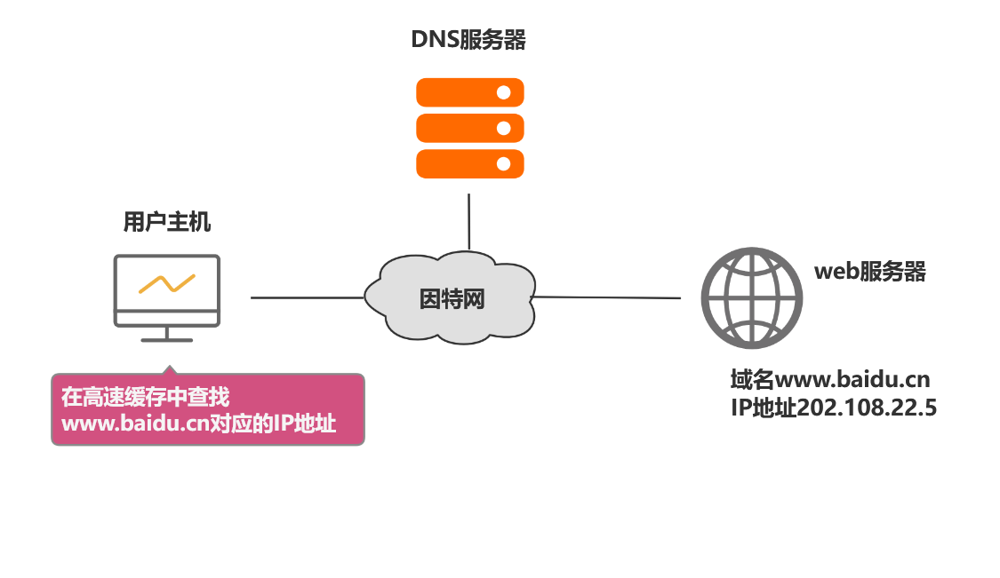
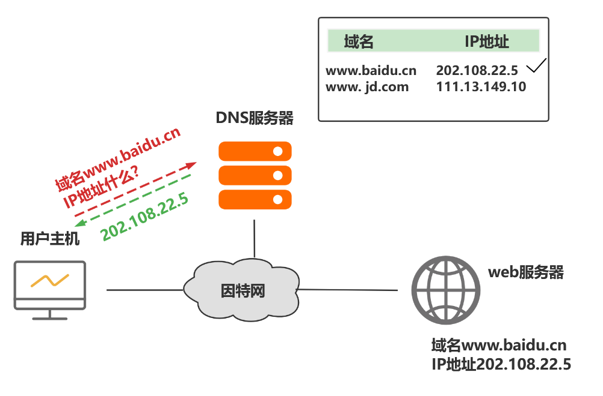
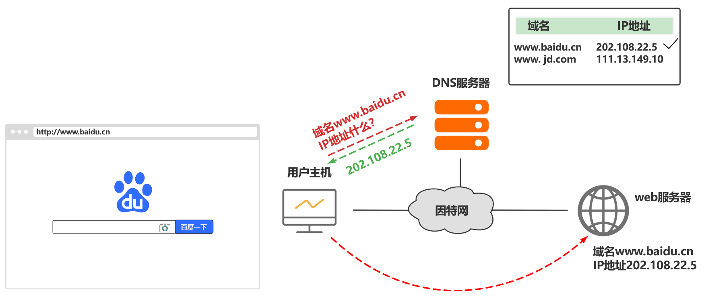
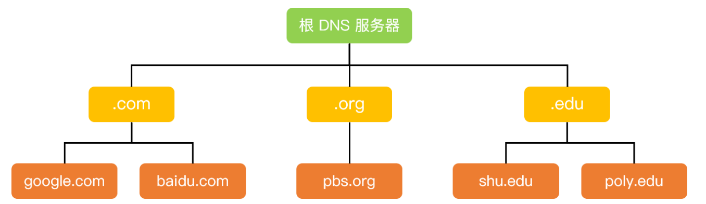
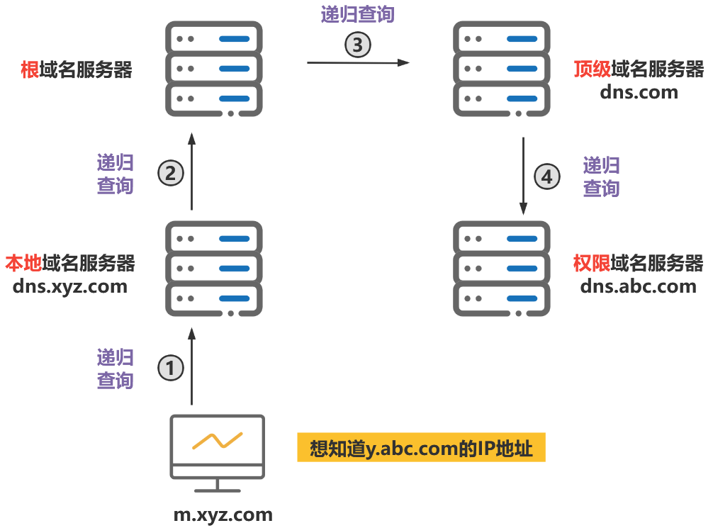
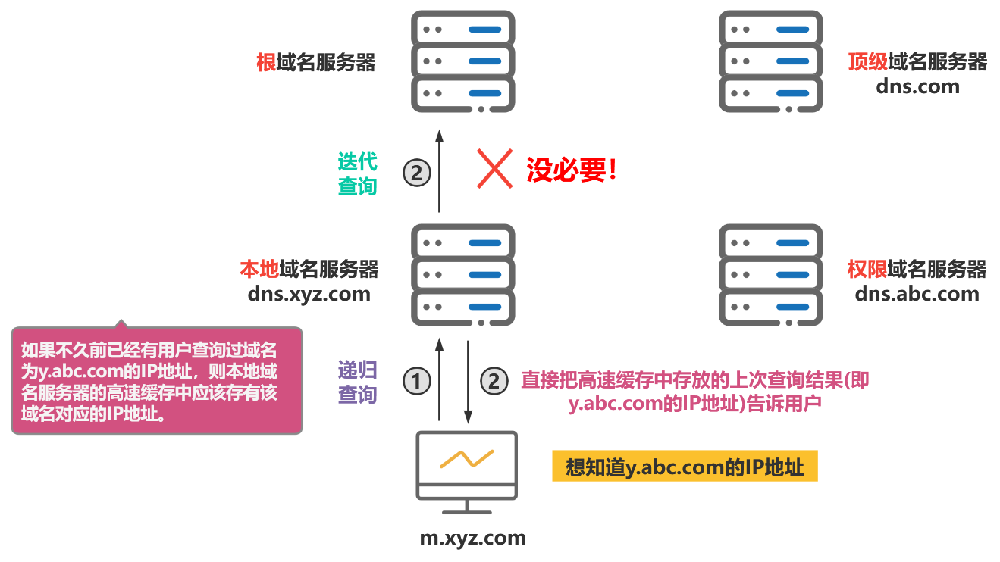

## 多张图带你彻底搞懂DNS域名解析过程

## 1、DNS

DNS（Domain Name System）是域名系统的英文缩写，是一种组织成域层次结构的计算机和网络服务命名系统，用于 TCP/IP 网络。

## 2、域名系统DNS 的作用

通常我们有两种方式识别主机：**通过主机名或者 IP 地址**。人们喜欢便于记忆的主机名表示，而路由器则喜欢定长的、有着层次结构的 IP 地址。为了满足这些不同的偏好，我们就需要一种能够进行主机名到IP 地址转换的目录服务，**域名系统作为将域名和 IP 地址相互映射的一个分布式数据库，能够使人更方便地访问互联网。** 

因此，即使不使用域名也可以通过IP地址来寻址目的主机，但域名与IP地址相比，便于人们记忆。因此对于大多数网络应用，我们一般使用域名来访问目的主机，而不是直接使用IP地址来访问。

对于本例，简单来说，当我们在浏览器地址栏中输入某个Web服务器的域名时。用户主机首先用户主机会首先在自己的DNS高速缓存中查找该域名所应的IP地址。

如果没有找到，则会向网络中的某台DNS服务器查询，DNS服务器中有域名和IP地映射关系的数据库。当DNS服务器收到DNS查询报文后，在其数据库中查询，之后将查询结果发送给用户主机。

现在，用户主机中的浏览器可以通过Web服务器的IP地址对其进行访问了。

## 3、域名的层级关系

**层级关系特点**  

- 因特网采用层次树状结构的域名结构
- 域名的结构由若干个分量组成，各分量之间用“点”隔开，分别代表不同级别的域名。
  - 每一级的域名都由英文字母和数字组成，不超过63个字符，不区分大小写字母。
  - 级别最低的域名写在最左边，而级别最高的顶级域名写在最右边。
  - 完整的域名不超过255个字符。
- 域名系统既不规定一个域名需要包含多少个下级域名，也不规定每一级的域名代表什么意思。
- 各级域名由其上一级的域名管理机构管理，而最高的顶级域名则由因特网名称与数字地址分配机构ICANN进行管理。

**因特网的域名空间**  

上图展示了 DNS 服务器的部分层次结构，从上到下依次为根域名服务器、顶级域名服务器和权威域名服务器。域名和IP地址的映射关系必须保存在域名服务器中，供所有其他应用查询。显然不能将所有信息都储存在一台域名服务器中。DNS使用分布在各地的域名服务器来实现域名到IP地址的转换。

**域名服务器可以划分为以下四种不同的类型:** 

- **根域名服务器** 
  根域名服务器是最高层次的域名服务器。每个根域名服务器都知道所有的顶级域名服务器的域名及其IP地址。因特网上共有13个不同IP地址的根域名服务器。当本地域名服务器向根域名服务器发出查询请求时，路由器就把查询请求报文转发到离这个DNS客户最近的一个根域名服务器。这就加快了DNS的查询过程，同时也更合理地利用了因特网的资源。
- **顶级域名服务器**
  这些域名服务器负责管理在该顶级域名服务器注册的所有二级域名。当收到DNS查询请求时就给出相应的回答（可能是最后的结果，也可能是下一级权限域名服务器的IP地址)。
- **权限域名服务器**
  这些域名服务器负责管理某个区的域名。每一个主机的域名都必须在某个权限域名服务器处注册登记。因此权限域名服务器知道其管辖的域名与IP地址的映射关系。另外，权限域名服务器还知道其下级域名服务器的地址。
-  **本地域名服务器**
  本地域名服务器不属于上述的域名服务器的等级结构。当一个主机发出DNS请求报文时，这个报文就首先被送往该主机的本地域名服务器。本地域名服务器起着代理的作用，会将该报文转发到上述的域名服务器的等级结构中。本地域名服务器离用户较近，一般不超过几个路由器的距离，也有可能就在同一个局域网中。本地域名服务器的IP地址需要直接配置在需要域名解析的主机中。

## 4、**DNS** 域名解析过程

域名解析包含两种查询方式，分别是**递归查询**和**迭代查询**。

### 递归查询

如果主机所询问的本地域名服务器不知道被查询域名的 IP 地址，那么本地域名服务器就以 DNS 客户端的身份，向其他根域名服务器继续发出查询请求报文，即替主机继续查询，而不是让主机自己进行下一步查询。

我们以一个例子来了解DNS递归查询的工作原理，假设图中的主机 (IP地址为m.xyz.com) 想知道域名y.abc.com的IP地址。

- 1、主机首先向其本地域名服务器进行**递归查询**。
- 2、本地域名服务器收到递归查询的委托后，也采用**递归查询**的方式向某个根域名服务器查询。
- 3、根域名服务器收到递归查询的委托后，也采用**递归查询**的方式向某个顶级域名服务器查询。
- 4、顶级域名服务器收到递归查询的委托后，也采用**递归查询**的方式向某个权限域名服务器查询。

**过程如图所示：**

当查询到域名对应的IP地址后，查询结果会在之前受委托的各域名服务器之间传递，最终传回给用户主机。

**过程如图所示：** 

### 迭代查询

当根域名服务器收到本地域名服务器发出的迭代查询请求报文时，要么给出所要查询的IP 地址，要么告诉本地服务器下一步应该找哪个域名服务器进行查询，然后让本地服务器进行后续的查询。

**迭代查询过程如下：**  

- 1、主机首先向其本地域名服务器进行**递归查询**。
- 2、本地域名服务器采用**迭代查询**，它先向某个根域名服务器查询。
- 3、根域名服务器告诉本地域名服务器，下一次应查询的顶级域名服务器的IP地址。
- 4、本地域名服务器向顶级域名服务器进行**迭代查询**。
- 5、顶级域名服务器告诉本地域名服务器，下一次应查询的权限域名服务器的IP地址。
- 6、本地域名服务器向权限域名服务器进行**迭代查询**。
- 7、权限域名服务器告诉本地域名服务器所查询的域名的IP地址。
- 8、本地域名服务器最后把查询的结果告诉主机。

**过程如图所示： **  

由于递归查询对于被查询的域名服务器负担太大，通常采用以下模式：**从请求主机到本地域名服务器的查询是递归查询，而其余的查询是迭代查询。** 

## 5、高速缓存

为了提高DNS的查询效率，并减轻根域名服务器的负荷和减少因特网上的DNS查询报文数量，在域名服务器中广泛地使用了**高速缓存**。高速缓存用来存放最近查询过的域名以及从何处获得域名映射信息的记录。

由于域名到IP地址的映射关系并不是永久不变，为保持高速缓存中的内容正确，域名服务器**应为每项内容设置计时器并删除超过合理时间的项**（例如，每个项目只存放两天)。

不但在本地域名服务器中需要高速缓存，在用户主机中也很需要。许多用户主机在启动时从本地域名服务器下载域名和IP地址的全部数据库，维护存放自己最近使用的域名的高速缓存，并且只在从缓存中找不到域名时才向域名服务器查询。同理，主机也需要保持高速缓存中内容的正确性。

**如图所示：**

如果**本地域名服务器**不久前已经有用户查询过域名为y.abc.com的IP地址，则本地域名服务器的高速缓存中应该存有该域名对应的IP地址。因此，直接把高速缓存中存放的上次查询结果(即y.abc.com的IP地址)告诉用户。

## 6、DNS相关面试问题

**1、DNS为什么用UDP？**  

更正确的答案是 DNS 既使用 TCP 又使用 UDP。当进行区域传送（主域名服务器向辅助域名服务器传送变化的那部分数据）时会使用 TCP，因为数据同步传送的数据量比一个请求和应答的数据量要多，而 TCP 允许的报文长度更长，因此为了保证数据的正确性，会使用基于可靠连接的 TCP。

当客户端向 DNS 服务器查询域名 ( 域名解析) 的时候，一般返回的内容不会超过 UDP 报文的最大长度，即 512 字节。用 UDP 传输时，不需要经过 TCP 三次握手的过程，从而大大提高了响应速度，但这要求域名解析器和域名服务器都必须自己处理超时和重传从而保证可靠性。

**2、递归查询和递归查询区别？**    

**递归查询:**   如果主机所询问的本地域名服务器不知道被查询域名的 IP 地址，那么本地域名服务器就以 DNS 客户端的身份，向其他根域名服务器继续发出查询请求报文，即替主机继续查询，而不是让主机自己进行下一步查询。

**迭代查询：** 当根域名服务器收到本地域名服务器发出的迭代查询请求报文时，要么给出所要查询的IP 地址，要么告诉本地服务器下一步应该找哪个域名服务器进行查询，然后让本地服务器进行后续的查询。

**3、使用域名访问web服务器过程**  

具体请看本专栏的这篇文章：[面试官问我：从地址栏输入URL到显示页面都发生了什么？](https://blog.csdn.net/weixin_45629285/article/details/120930370) 

**4、讲讲DNS解析过程？**  

详细解析过程请看上文**DNS域名解析过程**，这里我们做一个总结： 

浏览器缓存——》系统hosts文件——》本地DNS解析器缓存——》本地域名服务器（本地配置区域资源、本地域名服务器缓存)——》根域名服务器——》主域名服务器——》下一级域名域名服务器
客户端——》本地域名服务器（递归查询)
本地域名服务器—》DNS服务器的交互查询是迭代查询
