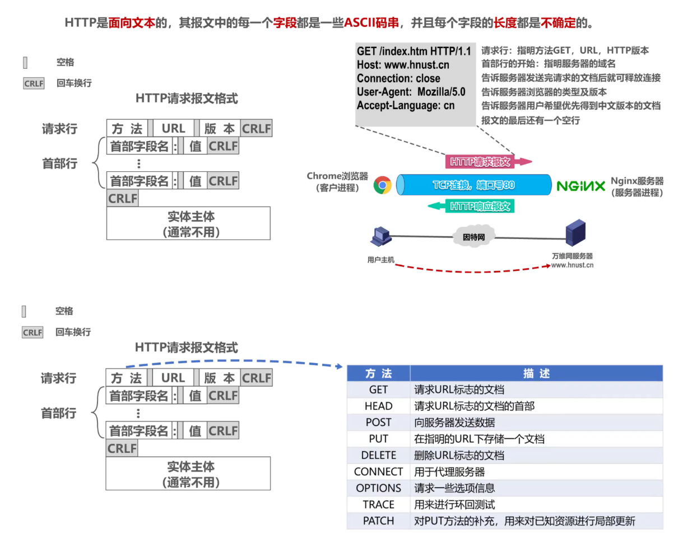

## Http协议

## 1、认识Http

### 1.1、什么是Http

我们在浏览器的地址中输入某个网站的域名后，就可以访问该网站的内容，这个就是**万维网WWW应用**，其相关的应用层协议为**超文本传送协议HTTP** (HyperText Transfer Protocol)。

HTTP定义了浏览器（即万维网客户进程)）怎样向万维网服务器请求万维网文档，以及万维网服务器怎样把万维网文档传送给浏览器。HTTP 是一个应用层协议，它使用 TCP 连接进行可靠的传送。

### 1.2、什么是超文本

在互联网早期的时候，我们输入的信息只能保存在本地，无法和其他电脑进行交互。我们保存的信息通常都以文本即简单字符的形式存在，文本是一种能够被计算机解析的有意义的二进制数据包。而随着互联网的高速发展，两台电脑之间能够进行数据的传输后，人们不满足只能在两台电脑之间传输文字，还想要传输图片、音频、视频，甚至点击文字或图片能够进行超链接的跳转，那么文本的语义就被扩大了，这种语义扩大后的文本就被称为超文本(Hypertext)。

### 1.3、万维网

**概述**

* **万维网** WWW (World Wide Web) 并非某种特殊的计算机网络。
* 万维网是一个大规模的、联机式的**信息储藏所**。
* 万维网用链接的方法能非常方便地从互联网上的一个站点访问另一个站点，从而主动地按需获取丰富的信息。
* 这种访问方式称为“**链接**”。

**万维网的工作方式**

* 万维网以**客户 - 服务器**方式工作。
* **浏览器**就是在用户计算机上的万维网**客户程序**。万维网文档所驻留的计算机则运行**服务器程序**，因此这个计算机也称为**万维网服务器**。
* 客户程序向服务器程序发出请求，服务器程序向客户程序送回客户所要的**万维网文档**。
* 在一个客户程序主窗口上显示出的万维网文档称为**页面** (page)。

## 2、HTTP报文格式

### 2.1、**HTTP请求报文格式**

HTTP是面向文本的，其报文中的每一个字段都是一些ASCII码串，并且每个字段的长度都是不确定的。HTTP 请求报文由请求行、请求头部行、空行和实体主体 4 个部分组成。

**1、请求行** 

HTTP请求报文中的“请求行”是由“请求方法”、“URL”和“协议版本”3个字段组成的，它们之间均以空格进行分隔。这部分是必不可少的。在请求行的最后有一个回车控制符和一个换行控制符（一起以“CRLF”表示），使下面的请求头部信息在下一行显示。	

**2、请求头部行** 

HTTP请求头部包括一系列的“请求头”和它们所对应的值，指出允许客户端向服务器传递请求的附加信息以及客户端自身的信息。当打开一个网页时，浏览器要向网站服务器发送一个HTTP请求头，然后网站服务器根据HTTP请求头的内容生成当次请求的内容并发送给浏览器，这就是HTTP请求报文中的“请求头”的作用。

**3、空行** 

最后一个请求头之后是一个空行，发送回车符和换行符，通知服务器以下不再有请求头;

**4、实体主体行** 

请求报文中“实体主体”部分通常是不用的。它不能在GET方法中使用，仅在POST方法中用于向服务器提供一些用户凭据信息（通常不用）。

### 2.2、HTTP响应报文格式

HTTP 响应报文由状态行、响应头部、空行 和 实体主体 4 个部分组成。

**1、状态行** 

状态行由 HTTP 协议版本字段、状态码和状态码的描述文本 3 个部分组成，他们之间使用空格隔开。

**2、响应头部**

响应头向客户端提供一些额外信息，比如谁在发送响应、响应者的功能，甚至与响应相关的一些特殊指令。这些头部有助于客户端处理响应，并在将来发起更好的请求。响应头域包含Age、Location、Proxy-Authenticate、Public、Retry-  After、Server、Vary、Warning、WWW-Authenticate。对响应头域的扩展要求通讯双方都支持，如果存在不支持的响应头域，一般将会作为实体头域处理。

**3、空行**

最后一个响应头部之后是一个空行，发送回车符和换行符，通知服务器以下不再有响应头部。

**4、实体主体** 

服务器返回给客户端的文本信息。

## 3、使用Cookie在服务器上记录用户信息

### 3.1、Cookie概念

早期的万维网应用非常简单，仅仅是用户查看存放在不同服务器上的各种静态的文档。因此HTTP被设计为—种无状态的协议。这样可以简化服务器的设计。

现在，用户可以通过万维网实现各种复杂的应用，如网上购物、电子商务等。这些应用往往需要万维网服务器能够识别用户。

Cookie提供了一种机制使得万维网服务器能够“记住”用户，而无需用户主动提供用户标识信息。也就是说，Cookie是一种对无状态的HTTP进行状态化的技术。

### 3.2、**具体过程**

- 1、用户主机中的浏览器向万维网服务器发送HTTP请求。
- 2、万维网服务器为该客户生成一个唯一的Cookie识别码，并以此为索引在服务器的后端数据库中创建一个项目，用来记录该用户访问该网站的各种信息。
- 3、万维网服务器向用户主机中的浏览器发送HTTP响应，响应体中携带设置的Cookie识别码。
- 4、用户主机中的浏览器从文件中读取Cookie。
- 5、用户主机中的浏览器向万维网服务器发送HTTP请求，并携带读取的Cookie识别码。
- 6、万维网服务器根据Cookie识别码就可以识别出该用户，并返回该用户的个性化网页。
- 7、万维网服务器向用户主机中的浏览器发送HTTP响应。

## 4、HTTP1.0和HTTP1.1

### 4.1、HTTP1.0

HTTP/1.0采用非持续连接方式。在该方式下，每次浏览器要请求一个文件都要与服务器建立TCP连接,当收到响应后就立即关闭连接。

- 每请求一个文档就要有两倍的RTT的开销。若一个网页上有很多引用对象（例如图片等)，那么请求每一个对象都需要花费2RTT的时间。
- 为了减小时延，浏览器通常会建立多个并行的TCP连接同时请求多个对象。但是，这会大量占用万
  维网服务器的资源，特别是万维网服务器往往要同时服务于大量客户的请求，这会使其负担很重。

### 4.2、HTTP1.1

HTTP/1.1采用持续连接方式。在该方式下，万维网服务器在发送响应后仍然保持这条连接
使同一个
客户(浏览器）和该服务器可以继续在这条连接上传送后续的HTTP请求报文和响应报文。这并不局限于传送同一个页面上引用的对象，而是只要这些文档都在同一个服务器上就行。

- 为了进一步提高效率，HTTP/1.1的持续连接还可以使用流水线方式工作，即浏览器在收到HTTP的响应报文之前就能够连续发送多个请求报文。这样的一个接一个的请求报文到达服务器后，服务器就发回一个接一个的响应报文。这样就节省了很多个RTT时间，使TCP连接中的空闲时间减少，提高了下载文档的效率。

> 请求一个万维网文档所需要的时间

### 4.3、HTTP/1.1 和 HTTP/1.0 的区别

**主要区别如下：**

- **缓存处理：**在 HTTP/1.0 中主要使用 header 里的 if-modified-Since, Expries 来做缓存判断的标准。而 HTTP/1.1 请求头中添加了更多与缓存相关的字段，从而支持更为灵活的缓存策略，例如 Entity-tag, If-Unmodified-Since, If-Match, If-None-Match 等可供选择的缓存头来控制缓存策略。

- **节约带宽：** 当客户端请求某个资源时，HTTP/1.0 默认将该资源相关的整个对象传送给请求方，但很多时候可能客户端并不需要对象的所有信息。而在 HTTP/1.1 的请求头中引入了 range 头域，它允许只请求部分资源，其使得开发者可以多线程请求某一资源，从而充分的利用带宽资源，实现高效并发。

- **错误通知的管理：**HTTP/1.1 在 1.0 的基础上新增了 24 个错误状态响应码，例如 414 表示客户端请求中所包含的 URL 地址太长，以至于服务器无法处理；410 表示所请求的资源已经被永久删除。

- **Host 请求头：**早期 HTTP/1.0 中认为每台服务器都绑定一个唯一的 IP 地址并提供单一的服务，请求消息中的 URL 并没有传递主机名。而随着虚拟主机的出现，一台物理服务器上可以存在多个虚拟主机，并且它们共享同一个 IP 地址。为了支持虚拟主机，HTTP/1.1 中添加了 host 请求头，请求消息和响应消息中应声明这个字段，若请求消息中缺少该字段时服务端会响应一个 404 错误状态码。 

- **长连接：**HTTP/1.0 默认浏览器和服务器之间保持短暂连接，浏览器的每次请求都需要与服务器建立一个 TCP 连接，服务器完成后立即断开 TCP 连接。HTTP/1.1 默认使用的是持久连接，其支持在同一个 TCP 请求中传送多个 HTTP 请求和响应。此之前的 HTTP 版本的默认连接都是使用非持久连接，如果想要在旧版本的 HTTP 协议上维持持久连接，则需要指定 Connection 的首部字段的值为 Keep-Alive。

## 5、HTTPS

### 5.1、HTTPS概念

**HTTPS**（Hypertext Transfer Protocol  Secure：超文本传输安全协议）是一种透过计算机网络进行安全通信的传输协议。HTTPS 经由 HTTP 进行通信，但利用 SSL/TLS  来加密数据包。HTTPS 开发的主要目的，是提供对网站服务器的身份认证，保护交换数据的隐私与完整性。

HTTPS 默认工作在 TCP 协议443端口，它的工作流程一般如以下方式：

- 1、TCP 三次同步握手
- 2、客户端验证服务器数字证书
- 3、DH 算法协商对称加密算法的密钥、hash 算法的密钥
- 4、SSL 安全加密隧道协商完成
- 5、网页以加密的方式传输，用协商的对称加密算法和密钥加密，保证数据机密性；用协商的hash算法进行数据完整性保护，保证数据不被篡改。

### 5.2、HTTPS 的加密方式

HTTPS 采用对称加密和非对称加密相结合的方式，首先使用 SSL/TLS 协议进行加密传输，为了弥补非对称加密的缺点，HTTPS 采用证书来进一步加强非对称加密的安全性，通过非对称加密，客户端和服务端协商好之后进行通信传输的对称密钥，后续的所有信息都通过该对称秘钥进行加密解密，完成整个 HTTPS 的流程。

### 5.3、HTTP 与 HTTPS 有哪些区别

- 1、HTTP 是超文本传输协议，信息是明文传输，存在安全风险的问题。HTTPS 则解决 HTTP 不安全

的缺陷，在 TCP 和 HTTP 网络层之间加入了 SSL/TLS 安全协议，使得报文能够加密传输。

- 2、HTTP 连接建立相对简单， TCP 三次握手之后便可进行 HTTP 的报文传输。而 HTTPS 在 TCP

三次握手之后，还需进行 SSL/TLS 的握手过程，才可进入加密报文传输。

- 3、HTTP 的端口号是 80，HTTPS 的端口号是 443。 

- 4、HTTPS 协议需要向 CA（证书权威机构）申请数字证书，来保证服务器的身份是可信的

### 5.4、HTTP 与 HTTPs 的工作方式【建立连接的过程】

**HTTP**

HTTP（Hyper Text Transfer Protocol: 超文本传输协议） 是一种简单的请求 - 响应协议，被用于在 Web 浏览器和网站服务器之间传递消息。HTTP 使用 TCP（而不是 UDP）作为它的支撑运输层协议。其默认工作在 TCP 协议 80 端口，HTTP 客户机发起一个与服务器的 TCP 连接，一旦连接建立，浏览器和服务器进程就可以通过套接字接口访问 TCP。客户机从套接字接口发送 HTTP 请求报文和接收 HTTP 响应报文。类似地，服务器也是从套接字接口接收 HTTP 请求报文和发送 HTTP 响应报文。其通信内容以明文的方式发送，不通过任何方式的数据加密。当通信结束时，客户端与服务器关闭连接。

**HTTPS**

HTTPS（Hyper Text Transfer Protocol over Secure Socket Layer）是以安全为目标的 HTTP 协议，在 HTTP 的基础上通过传输加密和身份认证的方式保证了传输过程的安全性。其工作流程如下：

① 客户端发起一个 HTTPS 请求，并连接到服务器的 443 端口，发送的信息主要包括自身所支持的算法列表和密钥长度等；

② 服务端将自身所支持的所有加密算法与客户端的算法列表进行对比并选择一种支持的加密算法，然后将它和其它密钥组件一同发送给客户端。

③ 服务器向客户端发送一个包含数字证书的报文，该数字证书中包含证书的颁发机构、过期时间、服务端的公钥等信息。

④ 最后服务端发送一个完成报文通知客户端 SSL 的第一阶段已经协商完成。

⑤ SSL 第一次协商完成后，客户端发送一个回应报文，报文中包含一个客户端生成的随机密码串，称为 pre_master_secre，并且该报文是经过证书中的公钥加密过的。

⑥ 紧接着客户端会发送一个报文提示服务端在此之后的报文是采用pre_master_secre 加密的。

⑦ 客户端向服务端发送一个 finish 报文，这次握手中包含第一次握手至今所有报文的整体校验值，最终协商是否完成取决于服务端能否成功解密。

⑧ 服务端同样发送与第 ⑥ 步中相同作用的报文，已让客户端进行确认，最后发送 finish 报文告诉客户端自己能够正确解密报文。

当服务端和客户端的 finish 报文交换完成之后，SSL 连接就算建立完成了，之后就进行和 HTTP 相同的通信过程，唯一不同的是在 HTTP 通信过程中并不是采用明文传输，而是采用对称加密的方式，其中对称密钥已经在 SSL 的建立过程中协商好了。

