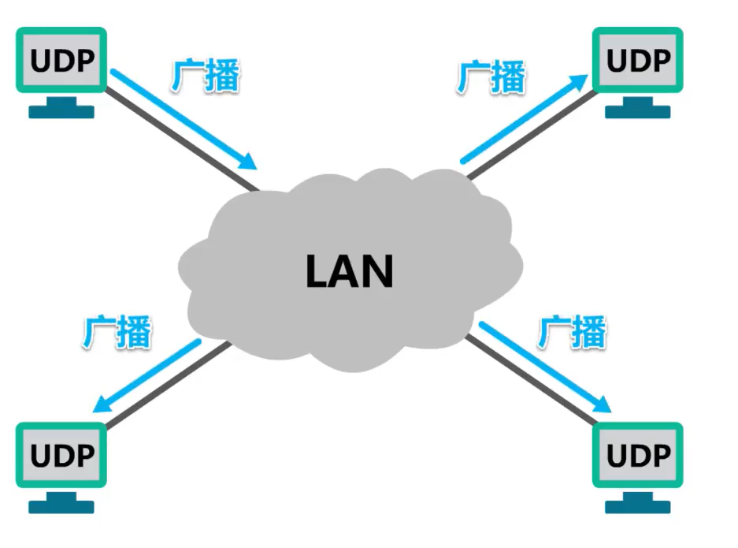

## TCP和UDP的区别

> TCP和UDP都位于计算机网络模型中的运输层，它们负责传输应用层产生的数据。在面试中也经常会问TCP和UDP的区别，下面我们将从几个方面来聊一聊TCP和UDP分别的特征和他们的区别。

## 1、概念

UDP和TCP 在使用TCP/IP 体系结构的网络通信中，这两个协议的使用频率仅次于网际层的IP协议。TCP/IP 体系结构应用层中的某些协议需要使用运输层的TCP 提供的服务，而另一些协议需要使用运输层的UDP 提供的服务，**UDP 是用户数据报协议的英文缩写词**

## 2、从是否面向连接来看

如下图所示，两个小电脑图标代表英特网上的两台主机，纵坐标为时间。

### 2.1、UDP

两台主机如果在运输层使用UDP协议进行通信，双方可以随时发送数据，因此**UDP是无连接的。** 

### 2.2、TCP

再来看使用TCP 协议的情况，使用TCP协议的通信，双方在进行数据传输之前必须使用三报文握手来建立TCP 连接。TCP 连接建立成功后才能进行数据传输，数据传输结束后必须使用四报文挥手来释放TCP连接。需要注意的是这里所谓的连接是指逻辑连接关系，而不是物理连接，**综上所述UDP是无连接的，而TCP是面向连接的。** 

## 3、从连接对象个数来看

### 3.1、UDP

-----------------

这是某个局域网上的使用UDP协议进行通信的四台主机，其中任何一台主机都可向其他三台主机发送广播，也可以向某个多播组发送多播，还可以向某台主机发送单播。也就是说UDP支持单播多播以及广播，换句话说**UDP支持一对一，一对多以及一对全的通信。** 

-----------------------

**一台主机向其他三台主机发送广播：** 

**向某个多播组发送多播：**

**向某台主机发送单播：**

-----------

### 3.2、TCP

再来看使用TCP协议的情况。使用TCP协议的通信，双方在进行数据传输之前必须使用三报文握手来建立TCP连接。TCP连接建立成功后

，通信双方之间就好像有一条可靠的通信信道，通信双方使用这条基于TCP连接的可靠信道进行通信。很显然，**TCP仅支持单播，也就是一对一的通信。**

-----------------

**三报文握手”建立TCP连接：**

**基于TCP连接的可靠信道：**

---------------------

## 4、从对应用报文的处理来看

### 4.1、UDP

先来看使用UDP协议的情况。发送方的应用进程将应用层报文交付给运输层的UDP，UDP直接给应用层报文添加一个UDP首部，使之成为UDP用户数据报，然后进行发送。需要说明的是，为了简单起见，我们忽略运输层下面的各层处理。

接收方的UDP收到该UDP用户数据报后，去掉UDP首部，将应用层报文交付给应用进程。也就是说，UDP对应用进程交下来的报文既不合并也不拆分，而是保留这些报文的边界。换句话说，**UDP是面向应用报文的。**  

### 4.2、TCP

再来看使用TCP协议的情况。

**发送方：**

- 1、发送方的TCP把应用进程交付下来的数据块仅仅看作是一连串的无结构的字节流，TCP并不知道这些带传送的字节流的含义。
- 2、发送方将他们编号并存储在自己的发送缓存中。
- 3、TCP根据发送策略，从发送缓存中提取一定数量的字节构建TCP报文段并发送。

**接收方：**

- 1、接收方的TCP一方面从所接收到的TCP报文段中取出数据载荷部分，并存储在接收缓存中，一方面将接收缓存中的一些字节交付给应用进程。

- 2、TCP不保证接收方应用进程所收到的数据块与发送方应用进程所发出的数据块具有对应大小的关系（例如，发送方应用进程交给发送方的TCP共10个数据块，但接收方的TCP可能只用了4个数据块，就把收到的字节流交付给了上层的应用进程，但接收方收到的字节流必须和发送方应用进程发出的字节流完全一样。）当然，接收方的应用进程必须有能力识别收到的字节流，并把它还原成有意义的应用层数据。

因此**，TCP是面向字节流的**，这正是TCP 实现可靠传输、流量控制以及控制的基础。

> 需要说明的是，为了突出示意图的要点，我们只画出了一个方向的数据流。在实际网络中，基于TCP连接的两端，可以同时进行TCP 报文段的发送和接收，也就是全双工通信。另外，图中的数据部分只包含了几个字节，实际当中一个TCP报文段包含上千个字节是很常见的。

## 5、从向其上层提供传输服务来看

### 5.1、UDP

TCP/IP体系结构的网际层向其上层提供的是无连接不可靠的传输服务，当运输层使用UDP协议时，向其上层提供的也是无连接不可靠的传输服务。

发送方给接收方发送UDP用户数据报，若传输过程中用户数据报受到干扰而产生误码，接收方UDP可以通过该数据报首部中的校验和字段的值检查出产生物码的情况，但仅仅丢弃该数据报其他什么也不做。

发送方给接收方发送UDP用户数据报，如果该数据报被英特网中的某个路由器丢弃了，发送方UDP不做任何处理，因为UDP向上层提供的是无连接不可靠的传输服务。 

因此，对于UDP用户数据报出现的物码和丢失等问题，UDP并不关心，基于UDP的这个特点，**UDP适用于实时应用**，**例如IP电话、视频会议等。**

### 5.2、TCP

再来看使用TCP协议的情况，尽管网际层中的IP协议向上层提供的是无连接不可靠的传输服务，也就是说，IP数据报可能在传输过程中出现丢失，误码，但只要运输层使用TCP协议，就可向其上层提供面向连接的可靠传输服务。

我们可将其想象成使用TCP协议的收发，双方基于TCP连接的可靠性到进行数据传输，不会出现误码丢失、乱序以及重复等传输差错。因此，**TCP适用于要求可靠传输的应用，例如文件传输。** 

## 6、从首部格式来看

### 6.1、UDP

一个UDP用户数据报由首部和数据载荷两部分构成，其首部格式如下图所示：

仅有4个字段，每个字段长度为2个字节，由于UDP不提供可靠传输服务，它仅仅在网际层的基础上添加了用于区分应用进程的端口，因此他的首部非常简单，仅有8个字节。

### 6.2、TCP

一个TCP报文段由手部和数据载荷两部分构成，其首部格式如下图所示：

这比UDP用户数据报的首部复杂的多，其最小长度为20字节，最大长度为60字节，这是因为TCP要实现可靠传输、流量控制控制等服务，其首部自然会比较复杂，首部中的字段比较多，首部长度也比较长。

## 7、总结

**UDP和TCP对比表格：**

| 类型 | 是否面向连接 | 传输可靠性 | 传输形式   | 传输效率 | 所需资源 | 应用场景           | 首部字节    |
| ---- | ------------ | ---------- | ---------- | -------- | -------- | ------------------ | ----------- |
| TCP  | 是           | 可靠       | 字节流     | 慢       | 多       | 文件传输、邮件传输 | 20~60个字节 |
| UDP  | 否           | 不可靠     | 数据报文段 | 快       | 少       | 即时通讯、域名转换 | 8个字节     |

**UDP和TCP对比图：** 

-----------------

