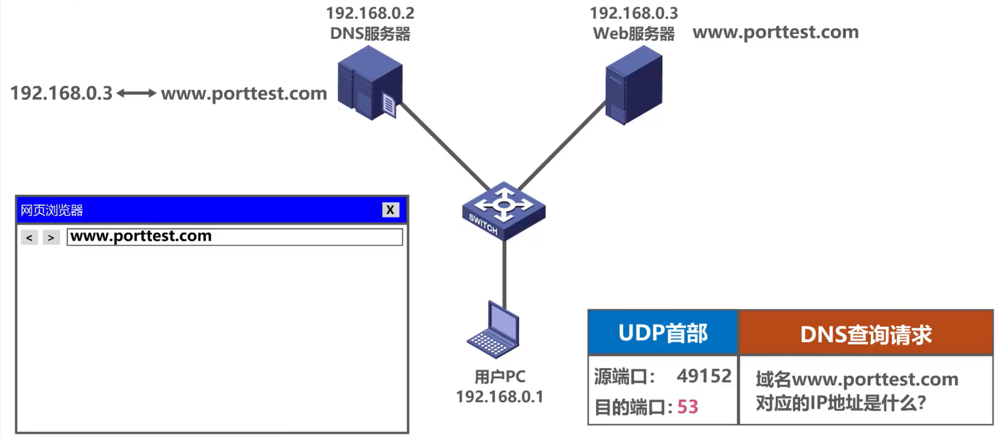
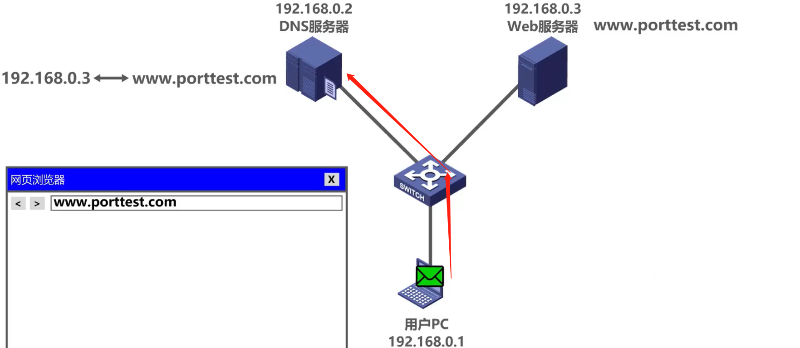
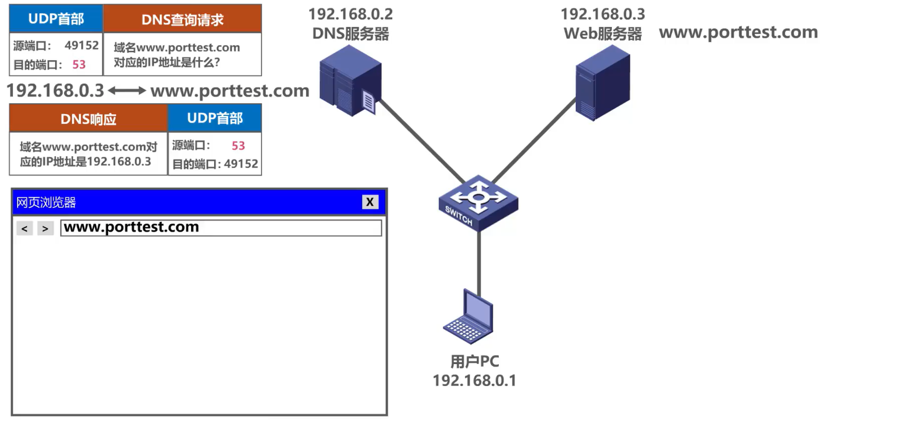
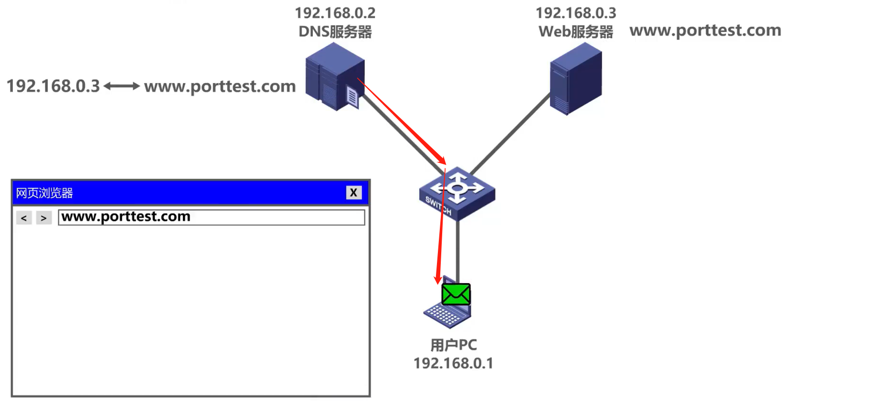
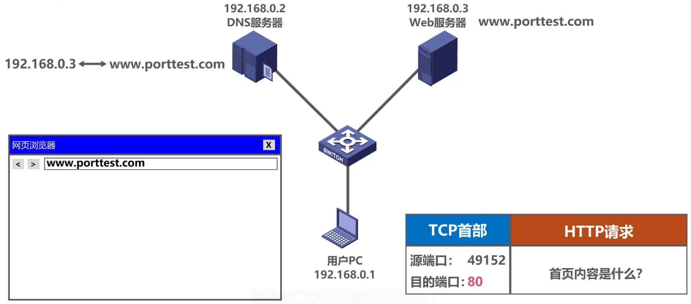
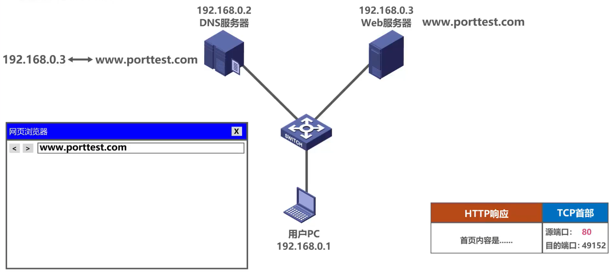

## 面试官问我：从地址栏输入URL到显示页面都发生了什么？

> 地址栏输入URL发生了什么？这是一道面试经常会考的面试题。那么下面我们就来探讨一下从你输入URL后到响应，都经历了哪些过程。 

## 1、DNS解析

我们在用户PC中使用网页浏览器来访问外部服务器的内容，在网页浏览器的地址栏中输入外部服务器的域名。比如我们输入www.porttest.com，用户PC中的DNS客户端进程会发送一个DNS查询请求报文，其内容为**域名www.porttest.com 所对应的IP地址是什么？** 

DNS 的查询请求报文需要使用运输层的UDP协议封装成UNP用户数据报，其首部中的源端口字段值在短暂端口号49151~65535中挑选一个未被占用的端口号用来表示DNS客户端进程进程，例如49152。目的端口字段的值设置为53，这是DNS服务器端进程所使用的熟知端口号。

之后用户PC将UDP用户数据报封装在IP数据报中通过以太网发送给DNS服务器。

DNS 服务器端收到该数据报后，从中解封出UDP用户数据报。

UDP首部中的目的端口号为53，这表明应将该UDP用户数据报的数据载荷部分，也就是DNS查询请求报文，交付给本服务器中的DNS服务器端进程。DNS服务器端进程解析DNS查询请求报文的内容，然后按其要求查找对应的IP地址。首先，查询请求会先找到本地DNS服务器来查询是否包含IP地址，如果本地DNS无法查询到目标IP地址，就会向根域名服务器发起一个DNS查询。

> 如果根域名服务器无法告知本地DNS服务器下一步需要访问哪个顶级域名服务器，就会使用递归查询。
>
> 如果根域名服务器能够告知DNS 服务器下一步需要访问的顶级域名服务器，就会使用迭代查询。

再由根域名服务器->顶级域名服务器->权威DNS服务器后，由权威服务器告诉本地服务器目标IP地址，再由本地DNS服务器告诉用户需要访问的IP地址。

> 下图是DNS 服务器层次系统解析域名 y.abc.com的IP地址过程。

得知目标IP地址之后，DNS服务器会给用户PC发送DNS的响应报文，其内容为域名www.porttest.com 所对应的IP地址是192.168.0.3。DNS响应报文需要使用运输层的UDP协议封装成UDP用户数据报，其首部中的原端口字段的值设置为熟知端口号53，表明这是DNS 服务器端进程所发送的UDP 用户数据报，目的端口字段的值设置为49152，这是之前用户PC中发送DNS查询请求报文的DNS客户端进程所使用的短暂端口号。

DNS 服务器之后将UDP用户数据报封装在IP 数据报中，通过以太网发送给用户PC。 

用户PC收到该数据报后，从中解封出UDP用户数据报。UDP首部中的目的端口号为49452，这表明应将该UDP用户数据报的数据载荷部分，也就是DNS的响应报文交付给用户PC中的DNS客户端进程。DNS客户端进程解析DNS响应报文的内容，就可知道自己之前所请求的外部服务器的域名所对应的IP地址为192.168.0.3。

## 2、TCP连接

用户PC的浏览器通过 DNS 获取到 Web 服务器真正的 IP 地址后，便向 Web 服务器发起 TCP 连接请求，通过 TCP 三次握手建立好连接后，浏览器便可以将 HTTP 请求数据发送给Web服务器了。

## 3、发起HTTP请求

现在用户PC中的HTTP客户端进程可以向Web服务器发送HTTP请求报文了。其内容为**首页内容是什么？** HTTP请求报文需要使用运输层的TCP协议封装成TCP报文段，其首部中的源端口字段的值在短暂端口号49151~65535中挑选一个未被占用的用来表示HTTP客户端进程。

例如：源端口仍然使用之前用过的49152，目的端口字段的值设置为80，这是HTTP服务器端进程所使用的熟知端口号，之后将TCP报文段封装在数据报中，通过以太网发送给Web服务器。

## 4、处理请求

Web服务器收到该数据报后，从中解封出TCP报文段，TCP 首部中的目的端口号为80，,这表明应该将该TCP报文段的数据载荷部分，也就是HTTP请求报文交付给本服务器中的HTTP 服务器端进程。

HTTP服务器端进程解析HTTP请求报文的内容，然后按其要求查找首页内容，之后会给用户PC发送HTTP响应报文，其内容是HTTP 客户端所请求的首页内容。

HTTP 响应报文需要使用运输层的TCP协议封装成TCP报文段，其首部中的源端口号字段的值设置为熟知端口号80，表明这是HTTP服务器端进程所发送的TCP报文段，目的端口字段的值设置为49152，这是之前用户PC中发送HTTP 请求报文的HTTP客户端进程所使用的短暂端口号。

之后Web服务器将TCP报文段封装在IP数据报文中，通过以太网发送给用户PC。 

## 5、浏览器渲染

用户PC收到该数据报后，从中解封出TCP报文段。TCP首部中的目的端口号为49152，,这表明应该将该TCP报文段的数据载荷部分，也就是HTTP响应报文交付给用户PC中的HTTP客户端进程，HTTP 客户端进程解析HTTP响应报文的内容，并在网页浏览器中进行显示。

## 6、TCP连接断开

最后客户端和服务器通过四次挥手终止 TCP 连接。

## 7、总结   

> 我们将上述过程总结成流程图，如下如所示：

> 文字说明： 

 ① **DNS 解析**：当用户输入一个网址并按下回车键的时候，浏览器获得一个域名，而在实际通信过程中，我们需要的是一个 IP 地址，因此我们需要先把域名转换成相应 IP 地址。

② **TCP 连接**：浏览器通过 DNS 获取到 Web 服务器真正的 IP 地址后，便向 Web 服务器发起 TCP 连接请求，通过 TCP 三次握手建立好连接后，浏览器便可以将 HTTP 请求数据发送给服务器了。

③ **发送 HTTP 请求**：浏览器向 Web 服务器发起一个 HTTP 请求，HTTP 协议是建立在 TCP 协议之上的应用层协议，其本质是在建立起的TCP连接中，按照HTTP协议标准发送一个索要网页的请求。在这一过程中，会涉及到负载均衡等操作。

④ **处理请求并返回**：服务器获取到客户端的 HTTP 请求后，会根据 HTTP 请求中的内容来决定如何获取相应的文件，并将文件发送给浏览器。

⑤ **浏览器渲染**：浏览器根据响应开始显示页面，首先解析 HTML 文件构建 DOM 树，然后解析 CSS 文件构建渲染树，等到渲染树构建完成后，浏览器开始布局渲染树并将其绘制到屏幕上。

⑥ **断开连接**：客户端和服务器通过四次挥手终止 TCP 连接。

