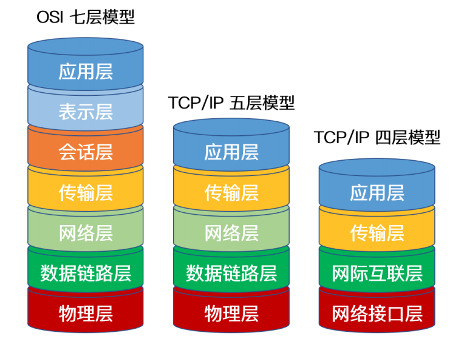
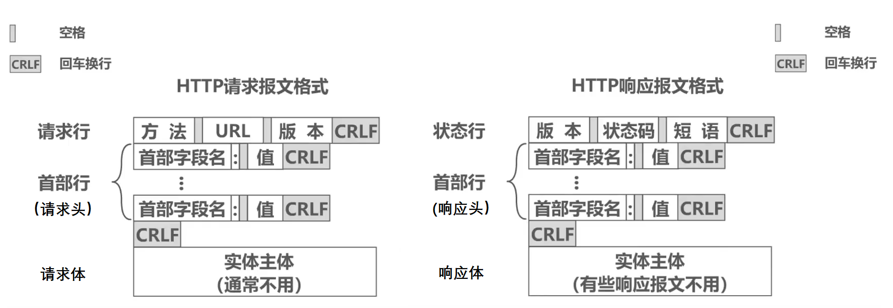
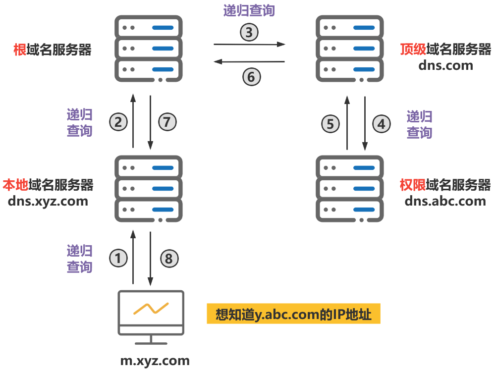
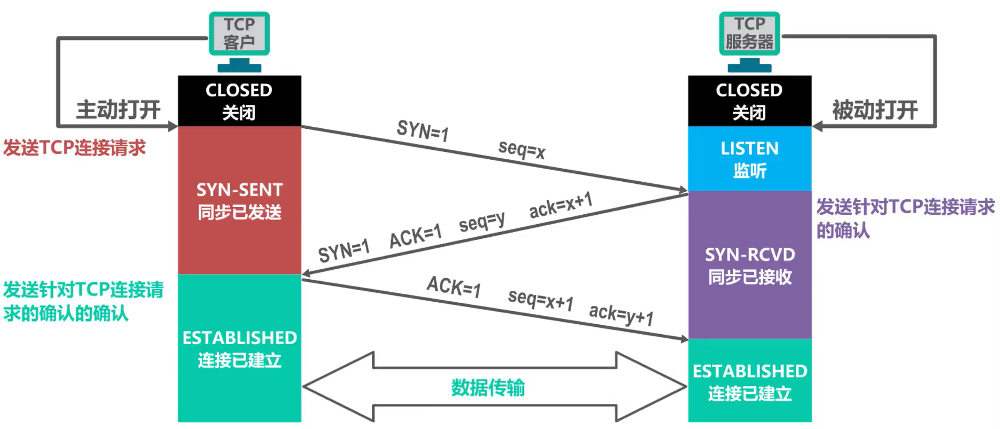
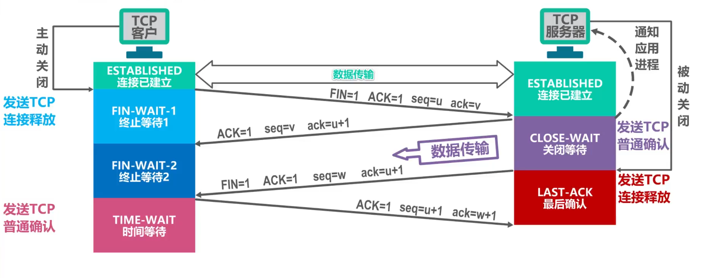

## 计算机网络

## 应用层

### 1、网络模型（说说OSI七层模型，TCP/IP四层模型、五层模型、各层协议以及作用)

#### **网络模型** 

**七层模型:** 应用层(Http、FTP)、表示层(Telnet)、会话层(DNS)、传输层、网络层、数据链路层、物理层。

**五层模型:** 应用层(http、DNS、FTP、SMTP、telnet)、传输层（TCP、UDP)、网络层（IP.ICMP、ARP)、数据链路层(ppp)、物理层。

**TCP/IP四层模型:** 应用层，运输层，网际层，网络接口层。

#### **作用：** 

**应用层：**解决通过应用进程之间的交互来实现特定网络应用的问题

**表示层：**解决通信双方交换信息的表示问题

**会话层：**解决进程之间进行会话问题

**运输层：**解决进程之间基于网络的通信问题

**网络层：**解决分组在多个网络之间传输（路由)的问题

**数据链路层：**解决分组在一个网络(或一段链路)上传输的问题

**物理层：**解决使用何种信号来传输比特0和1的问题

### 2、HTTP与HTTPS的区别?

**安全：** HTTP 协议以明文方式发送内容，数据都是未加密的，安全性较差。HTTPS 数据传输过程是加密的，安全性较好。

**连接方式：** HTTP 和 HTTPS 使用的是完全不同的连接方式，用的端口也不一样，前者是 80 端口，后者是 443 端口。

**效率：** HTTP 页面响应比 HTTPS 快，主要因为 HTTP 使用 3 次握手建立连接，客户端和服务器需要握手 3 次，而 HTTPS 除了 TCP 的 3 次握手，还需要经历一个 SSL 协商过程。

### 3、**HTTPS** 的加密方式

**HTTPS 采用对称加密和非对称加密相结合的方式：**

- 1、首先使用 SSL/TLS 协议进行加密传输。
- 2、为了弥补非对称加密的缺点，HTTPS 采用证书来进一步加强非对称加密的安全性。
- 3、通过非对称加密，客户端和服务端协商好之后进行通信传输的对称密钥，后续的所有信息都通过该对称秘钥进行加密解密，完成整个HTTPS 的流程。 

### 4、对称加密算法与非对称加密算法?

**对称加密:** 使用同一把密钥进行加密解密，运算速度快，安全性较低。

**非对称加密: **使用公钥对传输数据加密，再使用密钥对数据解密，运算速度慢更耗资源，安全性更高。

### 5、HTTP请求与响应报文格式?

**请求报文格式：** 请求行（请求方法+url地址+ http版本)、请求头(key-value键值对)、空格、请求体。

**响应报文格式：** 状态行（http版本+状态码+状态值)、响应头(key-value键值对)、空格、响应体。

### 6、HTTP常见状态码以及请求头部?

#### **状态码** 

| 状态码 |     英文名称      |          描述          |
| :----: | :---------------: | :--------------------: |
|  200   |        OK         |        请求成功        |
|  301   | Moved Permanently |       永久重定向       |
|  302   |       Found       |       临时重定向       |
|  400   |    Bad Request    |    请求报文语法错误    |
|  401   |   Unauthorized    | 授权失败，需要身份验证 |
|  404   |     Not Found     |     请求资源找不到     |
|  500   |  Internal Server  |     内部服务器错误     |
|  502   |    Bad Gateway    |        网关错误        |
|  504   | Gateway Time-out  |  网关超时，得不到响应  |

#### 请求头部

|     协议头      |                   说明                   |
| :-------------: | :--------------------------------------: |
|     Accept      |      告诉服务器自己允许哪些媒体类型      |
|   User-Agent    |          浏览器的身份标识字符串          |
|   Connection    |  客户端（浏览器）想要优先使用的连接类型  |
|      Host       | 表示服务器的域名以及服务器所监听的端口号 |
| Accept-Language |      浏览器可接受的响应内容语言列表      |

### 7、HTTP长连接和短连接

#### 长连接

**概念：** —次TCP连接，多次Http通信。

**使用场景：** 多用于操作频繁，点对点的通讯，而且客户端连接数目较少的情况。例如即时通讯、网络游戏

#### 短连接

**概念：**一次连接，一次通信。

**使用场景：** 用户数目较多的Web网站的 HTTP 服务一般用短连接。例如京东，淘宝这样的大型网站一般客户端数量达到千万级甚至上亿，若采用长连接势必会使得服务端大量的资源被无效占用，所以一般使用的是短连接。

### 8、cookie与session?

#### cookie

**什么是 Cookie**

HTTP Cookie（也叫 Web Cookie或浏览器 Cookie）是服务器发送到用户浏览器并保存在本地的一小块数据，它会在浏览器下次向同一服务器再发起请求时被携带并发送到服务器上。

**用途：** cookie一般存用户信息(Token)。

**工作机制:**  当浏览器第一次访问服务端，服务端创建cookie，可将用户信息存于其中，然后返回给浏览器，下一次浏览器访问服务端携带cookie，可以得到用户信息。

**存贮：** Cookie 数据保存在客户端(浏览器端）。

#### session

**什么是 Session** 

Session 代表着服务器和客户端一次会话的过程。Session 对象存储特定用户会话所需的属性及配置信息。

**用途：**session一般通过服务器记录用户状态（购物车)。

**工作机制:**  当浏览器第一次访问服务端，服务端会创建session，还会创建一个特殊的cookie，name为Jsessionld，value为sessionid，返回cookie给浏览器，之后访问服务端携带cookie，取出sessionid得到session。

 **存贮：** Session 数据保存在服务器端。

#### Cookie和Session的区别？

- 作用范围不同，Cookie 保存在客户端（浏览器），Session 保存在服务器端。
- 存取方式的不同，Cookie 只能保存 ASCII，Session 可以存任意数据类型，一般情况下我们可以在 Session 中保持一些常用变量信息，比如说 UserId 等。
- 有效期不同，Cookie 可设置为长时间保持，比如我们经常使用的默认登录功能，Session 一般失效时间较短，客户端关闭或者 Session 超时都会失效。
- 隐私策略不同，Cookie 存储在客户端，比较容易遭到不法获取，早期有人将用户的登录名和密码存储在 Cookie 中导致信息被窃取；Session 存储在服务端，安全性相对 Cookie 要好一些。
- 存储大小不同， 单个 Cookie 保存的数据不能超过 4K，Session 可存储数据远高于 Cookie。

### 9、使用Redis实现seeion共享

**场景：** 由于分布式环境下，对于多台服务器，当客户端请求服务器A，创建session，返回携带sessionid的cookie给客户端，下次客户端访问服务器B根据sessionid得不到session，就有问题。

**解决：** 可以用redis解决，比如将用户信息存入redis，key为sessionid，返回携带sessionid的cookie给客户端，下次访问携带cookie，通过sessionid从redis取出相关信息。

### 10、禁止cookie的情况下如何使用session?

url后附带sessionid。

### 11、 HTTP 1.0和HTTP 1.1的主要区别是什么？

**主要区别如下：**

- 1、**长连接：** 在HTTP/1.0中，默认使⽤的是短连接，也就是说每次请求都要重新建⽴⼀次连接。而每⼀次连接或者断开连接都需要三次握手四次挥手的开销，这样开销会比较大。HTTP/1.1 默认使用的是持久连接，其支持在同一个 TCP 请求中传送多个 HTTP 请求和响应。如果想要在旧版本的 HTTP 协议上维持持久连接，则需要指定 Connection 的首部字段的值为Keep-Alive。
- 2、**错误通知的管理：**HTTP/1.1 在 1.0 的基础上新增了 24 个错误状态响应码，例如：414 表示客户端请求中所包含的 URL 地址太长，以至于服务器无法处理；410 表示所请求的资源已经被永久删除。
- 3、**缓存处理：**在 HTTP/1.0 中主要使用 header 里的 if-modified-Since, Expries 来做缓存判断的标准。而 HTTP/1.1 请求头中添加了更多与缓存相关的字段，从而支持更为灵活的缓存策略，例如Entity-tag, If-Unmodified-Since, If-Match, If-None-Match 等可供选择的缓存头来控制缓存策略。
- 4、**节约带宽：** 当客户端请求某个资源时，HTTP/1.0 默认将该资源相关的整个对象传送给请求方，但很多时候可能客户端并不需要对象的所有信息。而在 HTTP/1.1 的请求头中引入了 range 头域，它允许只请求部分资源，其使得开发者可以多线程请求某一资源，从而充分的利用带宽资源，实现高效并发。

### 12、HTTP/1.1和HTTP/2.0的主要区别是什么？

**主要区别如下：** 

- 1、**二进制格式传输：**相比于 HTTP/1.X 的文本（字符串）传送， HTTP/2.0 采用二进制传送。客户端和服务器传输数据时把数据分成帧，帧组成了数据流，流具有流 ID 标识和优先级，通过优先级以及流依赖能够一定程度上解决关键请求被阻塞的问题。
- 2、**HTTP/2.0 支持多路复用：** HTTP/2.0 支持多路复用。因为流 ID 的存在， 通过同一个 HTTP 请求可以实现多个 HTTP 请求传输，客户端和服务器可以通过流 ID 来标识究竟是哪个流从而定位到是哪个 HTTP 请求。
- 3、**HTTP/2.0 头部压缩：**HTTP/2.0 通过 gzip 和 compress 压缩头部然后再发送，同时通信双方会维护一张头信息表，所有字段都记录在这张表中，在每次 HTTP 传输时只需要传头字段在表中的索引即可，大大减小了重传次数和数据量。
- 4、**HTTP/2.0 支持服务器推送：** 服务器在客户端未经请求许可的情况下，可预先向客户端推送需要的内容，客户端在退出服务时可通过发送复位相关的请求来取消服务端的推送。

### 13、HTTP方法有哪些？

HTTP/1.0 定义了三种请求方法：GET, POST 和 HEAD 方法。

HTTP/1.1 增加了六种请求方法：OPTIONS, PUT, PATCH, DELETE, TRACE 和 CONNECT 方法。

| 方法    | 作用                                                    |
| ------- | ------------------------------------------------------- |
| GET     | 获取资源                                                |
| POST    | 传输实体主体                                            |
| PUT     | 上传文件                                                |
| DELETE  | 删除文件                                                |
| HEAD    | 和GET方法类似，但只返回报文首部，不返回报文实体主体部分 |
| PATCH   | 对资源进行部分修改                                      |
| OPTIONS | 查询指定的URL支持的方法                                 |
| CONNECT | 要求用隧道协议连接代理                                  |
| TRACE   | 服务器会将通信路径返回给客户端                          |

为了方便记忆，可以将PUT、DELETE、POST、GET理解为客户端对服务端的增删改查。

- PUT：上传文件，向服务器添加数据，可以看作增
- DELETE：删除文件
- POST：传输数据，向服务器提交数据，对服务器数据进行更新。
- GET：获取资源，查询服务器资源

### 14、GET 和 POST 的区别？

**使用上的区别**：

- get 提交的数据会放在 URL 之后，并且请求参数会被完整的保留在浏览器的记录里，由于参数直接暴露在 URL 中，可能会存在安全问题，因此往往用于获取资源信息。而 post 参数放在请求主体中，并且参数不会被保留，相比 get 方法，post 方法更安全，主要用于修改服务器上的资源。
- get 提交的数据大小有限制（这里所说的限制是针对浏览器而言的），而 post 方法提交的数据没限制
- get 请求只支持 URL 编码，post 请求支持多种编码格式。
- get 只支持 ASCII 字符格式的参数，而 post 方法没有限制。

**本质区别**

- GET和POST最大的区别主要是GET请求是幂等性的，POST请求不是。这个是它们本质区别。（幂等性是指一次和多次请求某一个资源应该具有同样的副作用。简单来说意味着对同一URL的多个请求应该返回同样的结果。）

### 15、HTTPS 的优缺点?

**优点**：

- 安全性：
  - 使用HTTPS协议可认证用户和服务器，确保数据发送到正确的客户机和服务器；
  - HTTPS协议是由SSL+HTTP协议构建的可进行加密传输、身份认证的网络协议，要比http协议安全，可防止数据在传输过程中不被窃取、改变，确保数据的完整性。
  - HTTPS是现行架构下最安全的解决方案，虽然不是绝对安全，但它大幅增加了中间人攻击的成本。
- SEO方面：谷歌曾在2014年8月份调整搜索引擎算法，并称“比起同等HTTP网站，采用HTTPS加密的网站在搜索结果中的排名将会更高”。

**缺点**：

- 在相同网络环境中，HTTPS 相比 HTTP 无论是响应时间还是耗电量都有大幅度上升。
- HTTPS 的安全是有范围的，在黑客攻击、服务器劫持等情况下几乎起不到作用。
- 在现有的证书机制下，中间人攻击依然有可能发生。
- HTTPS 需要更多的服务器资源，也会导致成本的升高。

### 16、HTTPS建立连接的过程？

1. 客户端请求 HTTPS 网址，然后连接到 server 的 443 端口 (HTTPS 默认端口，类似于 HTTP 的80端口)。

2. 采用 HTTPS 协议的服务器必须要有一套数字 CA (Certification  Authority)证书。颁发证书的同时会产生一个私钥和公钥。私钥由服务端自己保存，不可泄漏。公钥则是附带在证书的信息中，可以公开的。证书本身也附带一个证书电子签名，这个签名用来验证证书的完整性和真实性，可以防止证书被篡改。

3. 服务器响应客户端请求，将证书传递给客户端，证书包含公钥和大量其他信息，比如证书颁发机构信息，公司信息和证书有效期等。

4. 客户端解析证书并对其进行验证。如果证书不是可信机构颁布，或者证书中的域名与实际域名不一致，或者证书已经过期，就会向访问者显示一个警告，由其选择是否还要继续通信。

   如果证书没有问题，客户端就会从服务器证书中取出服务器的公钥A。然后客户端还会生成一个随机码 KEY，并使用公钥A将其加密。

5. 客户端把加密后的随机码 KEY 发送给服务器，作为后面对称加密的密钥。

6. 服务器在收到随机码 KEY 之后会使用私钥B将其解密。经过以上这些步骤，客户端和服务器终于建立了安全连接，完美解决了对称加密的密钥泄露问题，接下来就可以用对称加密愉快地进行通信了。

7. 服务器使用密钥 (随机码 KEY)对数据进行对称加密并发送给客户端，客户端使用相同的密钥 (随机码 KEY)解密数据。

8. 双方使用对称加密愉快地传输所有数据。

### 17、网页解析全过程【用户输入网址到显示对应页面的全过程】

① **DNS 解析**：当用户输入一个网址并按下回车键的时候，浏览器获得一个域名，而在实际通信过程中，我们需要的是一个 IP 地址，因此我们需要先把域名转换成相应 IP 地址。

② **TCP 连接**：浏览器通过 DNS 获取到 Web 服务器真正的 IP 地址后，便向 Web 服务器发起 TCP 连接请求，通过 TCP 三次握手建立好连接后，浏览器便可以将 HTTP 请求数据发送给服务器了。

③ **发送 HTTP 请求**：浏览器向 Web 服务器发起一个 HTTP 请求，HTTP 协议是建立在 TCP 协议之上的应用层协议，其本质是在建立起的TCP连接中，按照HTTP协议标准发送一个索要网页的请求。在这一过程中，会涉及到负载均衡等操作。

④ **处理请求并返回**：服务器获取到客户端的 HTTP 请求后，会根据 HTTP 请求中的内容来决定如何获取相应的文件，并将文件发送给浏览器。

⑤ **浏览器渲染**：浏览器根据响应开始显示页面，首先解析 HTML 文件构建 DOM 树，然后解析 CSS 文件构建渲染树，等到渲染树构建完成后，浏览器开始布局渲染树并将其绘制到屏幕上。

⑥ **断开连接**：客户端和服务器通过四次挥手终止 TCP 连接。

### 18、**DNS** 域名解析过程

域名解析包含两种查询方式，分别是**递归查询**和**迭代查询**。

#### 递归查询

如果主机所询问的本地域名服务器不知道被查询域名的 IP 地址，那么本地域名服务器就以 DNS 客户端的身份，向其他根域名服务器继续发出查询请求报文，即替主机继续查询，而不是让主机自己进行下一步查询。

我们以一个例子来了解DNS递归查询的工作原理，假设图中的主机 (IP地址为m.xyz.com) 想知道域名y.abc.com的IP地址。

- 1、主机首先向其本地域名服务器进行**递归查询**。
- 2、本地域名服务器收到递归查询的委托后，也采用**递归查询**的方式向某个根域名服务器查询。
- 3、根域名服务器收到递归查询的委托后，也采用**递归查询**的方式向某个顶级域名服务器查询。
- 4、顶级域名服务器收到递归查询的委托后，也采用**递归查询**的方式向某个权限域名服务器查询。

**过程如图所示：**

当查询到域名对应的IP地址后，查询结果会在之前受委托的各域名服务器之间传递，最终传回给用户主机。

**过程如图所示：** 

#### 迭代查询

当根域名服务器收到本地域名服务器发出的迭代查询请求报文时，要么给出所要查询的IP 地址，要么告诉本地服务器下一步应该找哪个域名服务器进行查询，然后让本地服务器进行后续的查询。

**迭代查询过程如下：**  

- 1、主机首先向其本地域名服务器进行**递归查询**。
- 2、本地域名服务器采用**迭代查询**，它先向某个根域名服务器查询。
- 3、根域名服务器告诉本地域名服务器，下一次应查询的顶级域名服务器的IP地址。
- 4、本地域名服务器向顶级域名服务器进行**迭代查询**。
- 5、顶级域名服务器告诉本地域名服务器，下一次应查询的权限域名服务器的IP地址。
- 6、本地域名服务器向权限域名服务器进行**迭代查询**。
- 7、权限域名服务器告诉本地域名服务器所查询的域名的IP地址。
- 8、本地域名服务器最后把查询的结果告诉主机。

**过程如图所示： **  

由于递归查询对于被查询的域名服务器负担太大，通常采用以下模式：**从请求主机到本地域名服务器的查询是递归查询，而其余的查询是迭代查询。** 

### 19、递归查询和迭代查询区别？

**递归查询:**   如果主机所询问的本地域名服务器不知道被查询域名的 IP 地址，那么本地域名服务器就以 DNS 客户端的身份，向其他根域名服务器继续发出查询请求报文，即替主机继续查询，而不是让主机自己进行下一步查询。

**迭代查询：** 当根域名服务器收到本地域名服务器发出的迭代查询请求报文时，要么给出所要查询的IP 地址，要么告诉本地服务器下一步应该找哪个域名服务器进行查询，然后让本地服务器进行后续的查询。

### 20、DNS使用什么协议？

DNS 既使用 TCP 又使用 UDP：

- 当域名服务器之间进行数据同步时，需要保证数据一致性，要求可靠，因此使用TCP；
- 当客户端向 DNS 服务器查询域名( 域名解析) 的时候，用 UDP 传输时，不需要经过 TCP 三次握手的过程，从而大大提高了响应速度。

## 传输层

### 1、TCP 和 UDP 的区别

| 类型 | 是否面向连接 | 传输可靠性 | 传输形式   | 传输效率 | 所需资源 | 应用场景           | 首部字节 |
| ---- | ------------ | ---------- | ---------- | -------- | -------- | ------------------ | -------- |
| TCP  | 是           | 可靠       | 字节流     | 慢       | 多       | 文件传输、邮件传输 | 20~60    |
| UDP  | 否           | 不可靠     | 数据报文段 | 快       | 少       | 即时通讯、域名转换 | 8个字节  |

### 2、TCP三次握手

三次握手是 TCP 连接的建立过程。在握手之前，主动打开连接的客户端结束 CLOSE（关闭） 阶段，被动打开的服务器也结束 CLOSE（关闭） 阶段，并进入 LISTEN（监听） 阶段。随后进入三次握手阶段：

① 首先客户端向服务器发送TCP连接请求报文段，并等待服务器确认，其中：

- 同步位SYN被设置为1，,表明这是一个TCP连接请求报文段。；
- 序号字段seq被设置了一个初始值x作为TCP客户进程所选择的初始序号。 （x 一般取随机数）；
- 随后客户端进入 SYN-SENT 阶段。

② 服务器接收到客户端发来的 TCP连接请求报文段后，进行确认后结束 LISTEN 阶段，并返回TCP连接请求确认报文段，其中：

- 该报文段首部中的同步位SYN和确认位ACK 都设置为1，表明这是一个TCP连接请求；
- 序号字段seq被设置了一个初始值y，作为TCP服务器进程所选择的初始序号；
- 确认号字段ack的值被设置成了x+1，这是对TCP客户进程所选择的初始序号seq的确认，随后服务器端进入 SYN-RECD 阶段。

③ 客户端接收到发送的 TCP连接请求确认报文段后，明确了从客户端到服务器的数据传输是正常的，最后还要向TCP服务器进程发送一个普通的TCP 确认报文段。其中：

- 该报文段首部中的确认位ACK被设置为1，表明这是一个普通的TCP确认报文段 。
- 序号字段seq 被设置为x+1，这是因为TCP客户进程发送的第一个TCP报文段的序号为x，并且不携带数据，因此第二个报文段的序号为x +1。
- 确认号字段ack被设置为y + 1，这是对TCP服务器进程所选择的初始序号的确认。
- 随后客户端进入 ESTABLISHED。

当服务器端收到来自客户端确认收到服务器数据的报文后，得知从服务器到客户端的数据传输是正常的，从而结束 SYN-RECV 阶段，进入 ESTABLISHED 阶段，从而完成三次握手。

### 3、为什么需要三次握手，而不是两次？

**主要有三个原因：**

1、防止已失效的连接请求报文段突然又传送到了TCP服务器进程因而导致错误和资源浪费。

- 假设采用两报文握手，TCP客户进程发出一个TCP连接请求报文段，但是该报文段由于网络原因滞留了，这必然会造成该报文段的超时重传。
- 假设重传的报文段被TCP服务器进程正常接收，TCP服务器进程给TCP客户进程发送一个TCP连接请求确认报文段，并进入连接已建立状态。他们可以相互传输数据，之后可以通过四报文挥手来释放连接，TCP双方都进入了关闭状态。
- 一段时间后，失效的TCP连接请求报文段到达了TCP服务器进程，TCP服务器进程随即给TCP客户进程发送TCP连接请求确认报文段并进入连接已建立状态。
- 但由于TCP客户进程并没有发起新的TCP连接请求，并且处于关闭状态，因此不会理会该报文段。而TCP服务器进程一直等待TCP客户进程发来数据，这将白白浪费TCP服务器进程所在主机的很多资源。 

2、三次握手才能让双方均确认自己和对方的发送和接收能力都正常。

- 第一次握手：客户端只是发送处请求报文段，什么都无法确认，而服务器可以确认自己的接收能力和对方的发送能力正常；

- 第二次握手：客户端可以确认自己发送能力和接收能力正常，对方发送能力和接收能力正常；

- 第三次握手：服务器可以确认自己发送能力和接收能力正常，对方发送能力和接收能力正常；

- 可见三次握手才能让双方都确认自己和对方的发送和接收能力全部正常，这样就可以愉快地进行通信了。

3、告知对方自己的初始序号值，并确认收到对方的初始序号值。

- TCP 实现了可靠的数据传输，原因之一就是 TCP  报文段中维护了序号字段和确认序号字段，通过这两个字段双方都可以知道在自己发出的数据中，哪些是已经被对方确认接收的。
- 这两个字段的值会在初始序号值得基础递增，如果是两次握手，只有发起方的初始序号可以得到确认，而另一方的初始序号则得不到确认。

### 4、为什么要三次握手，而不是四次？

因为三次握手已经可以确认双方的发送接收能力正常，双方都知道彼此已经准备好，而且也可以完成对双方初始序号值得确认，也就无需再第四次握手了。

- 第一次握手：服务端确认“自己收、客户端发”报文功能正常。
- 第二次握手：客户端确认“自己发、自己收、服务端收、客户端发”报文功能正常，客户端认为连接已建立。
- 第三次握手：服务端确认“自己发、客户端收”报文功能正常，此时双方均建立连接，可以正常通信。

### 5、TCP四次挥手

四次挥手即 TCP 连接的释放，这里假设客户端主动释放连接。在挥手之前主动释放连接的客户端结束ESTABLISHED 阶段，随后开始四次挥手：

① 首先客户端向服务器发送一段 TCP 报文表明其想要释放 TCP 连接，其中：

- 终止位FIN和确认为ACK的值都被设置为1，表示请求释放连接；
- 序号为 Seq = u；
- 确认号ack = v；
- 随后客户端进入 FIN-WAIT-1 阶段，即半关闭阶段，并且停止向服务端发送通信数据。

② 服务器接收到客户端请求断开连接的 FIN 报文后，结束 ESTABLISHED 阶段，进入 CLOSE-WAIT 阶段并返回一段 TCP 报文，其中：

- 标记位为 ACK = 1，表示接收到客户端释放连接的请求；

- 序号为 Seq = v；

- 确认号ACK字段的值设置为u+1，这是对TCP连接释放报文段的确认。

- 随后服务器开始准备释放服务器端到客户端方向上的连接。

客户端收到服务器发送过来的 TCP 报文后，确认服务器已经收到了客户端连接释放的请求，随后客户端结束 FIN-WAIT-1 阶段，进入 FIN-WAIT-2 阶段。

③ 服务器端在发出 ACK 确认报文后，服务器端会将遗留的待传数据传送给客户端，待传输完成后即经 过 CLOSE-WAIT 阶段，便做好了释放服务器端到客户端的连接准备，再次向客户端发出一段 TCP 报文， 其中：

- 标记位为 FIN = 1  和 ACK = 1，表示已经准备好释放连接了；

- 序号为 Seq = w；
- 确认号 Ack = u + 1，这是对之前收到的TCP连接释放报文段的重复确认。

随后服务器端结束 CLOSE-WAIT 阶段，进入 LAST-ACK 阶段。并且停止向客户端发送数据。

④ 客户端收到从服务器发来的 TCP 报文，确认了服务器已经做好释放连接的准备，于是结束 FIN-WAIT-2 阶段，进入 TIME-WAIT 阶段，并向服务器发送一段报文，其中：

- 标记位为 ACK = 1，表示接收到服务器准备好释放连接的信号；

- 序号为 Seq= u + 1，表示是在已收到服务器报文的基础上，将其确认号 Ack 值作为本段序号的值；

- 确认号为 Ack= w + 1，这是对所收到的TCP连接释放报文段的确认。

随后客户端开始在 TIME-WAIT 阶段等待 2 MSL。服务器端收到从客户端发出的 TCP 报文之后结束LAST-ACK 阶段，进入 CLOSED 阶段。由此正式确认关闭服务器端到客户端方向上的连接。客户端等待完 2 MSL 之后，结束 TIME-WAIT 阶段，进入 CLOSED 阶段，由此完成「四次挥手」。

### 6、为什么连接的时候是三次握手，关闭的时候却是四次握手？

服务器在收到客户端的 FIN 报文段后，可能还有一些数据要传输，所以不能马上关闭连接，但是会做出应答，返回 ACK 报文段.

接下来可能会继续发送数据，在数据发送完后，服务器会向客户单发送 FIN 报文，表示数据已经发送完毕，请求关闭连接。服务器的**ACK和FIN一般都会分开发送**，从而导致多了一次，因此一共需要四次挥手。

### 7、为什么客户端的 TIME-WAIT 状态必须等待 2MSL ？

当客户端发出最后的 ACK 确认报文时，并不能确定服务器端能够收到该段报文。所以客户端在发送完 ACK 确认报文之后，会设置一个时长为 2 MSL 的计时器。MSL（Maximum Segment Lifetime），指一段 TCP 报文在传输过程中的最大生命周期。2 MSL 即是服务器端发出 FIN 报文和客户端发出的 ACK 确认报文所能保持有效的最大时长。

若服务器在 1 MSL 内没有收到客户端发出的 ACK 确认报文，再次向客户端发出 FIN 报文。如果客户端在 2 MSL 内收到了服务器再次发来的 FIN 报文，说明服务器由于一些原因并没有收到客户端发出的 ACK 确认报文。客户端将再次向服务器发出 ACK 确认报文，并重新开始 2 MSL 的计时。

若客户端在 2MSL 内没有再次收到服务器发送的 FIN 报文，则说明服务器正常接收到客户端 ACK 确认报文，客户端可以进入 CLOSE 阶段，即完成四次挥手。

所以客户端要经历 2 MSL 时长的 TIME-WAIT 阶段，为的是确认服务器能否接收到客户端发出的 ACK 确认报文。

### 8、TIME_WAIT 是服务器端的状态?还是客户端的状态?

TIME_WAIT 是主动断开连接的一方会进入的状态，一般情况下，都是客户端所处的状态;服务器端一般设置不主动关闭连接。

TIME_WAIT 需要等待 2MSL，在大量短连接的情况下，TIME_WAIT会太多，这也会消耗很多系统资源。对于服务器来说，在 HTTP 协议里指定  KeepAlive（浏览器重用一个 TCP 连接来处理多个 HTTP 请求），由浏览器来主动断开连接，可以一定程度上减少服务器的这个问题。

### 9、Time_wait过多有什么危害?

内存资源占用、端口资源占用(一个TCP连接至少消耗一个端口)，每端口，无法建立新连接。

服务器资源受限:服务器监听一个端口，会把连接丢给线程处理，可以继续监听端口，但是线程池处理不了那么多连接。

### 10、Time_wait过多的优化？

**什么时候产生**:  首先调用close()发起主动关闭的一方，再发送最后一个ACK之后。

**为何产生**:  确保最后一个ACK到达，保证TCP全双工连接可靠释放; 使旧的数据包过期消失。

**什么时候会产生大量Time_wait**: 当请求量比较大的时候，而且所有的请求都是短连接的时候

**如何避免**:     

- 多IP增加随机端口;
- 内核参数调优（服务器设置SO_REUSEADDR套接字选项来通知内核，如果端口忙，但TCP连接位于TIME_WAIT状态时可以重用端口)；
- 使用长连接(Connection: keep-alive) .Linux参数net.ipv4.tcp_tw_reuse和 tcp_timestamps开启，复用处于TIME_WAIT的socket为新的连接所用

### 11、TCP协议如何保证可靠性？

TCP主要提供了检验和、序列号/确认应答、超时重传、滑动窗口、拥塞控制和 流量控制等方法实现了可靠性传输。

- 检验和：通过检验和的方式，接收端可以检测出来数据是否有差错和异常，假如有差错就会直接丢弃TCP段，重新发送。

- 序列号/确认应答：

  序列号的作用不仅仅是应答的作用，有了序列号能够将接收到的数据根据序列号排序，并且去掉重复序列号的数据。

  TCP传输的过程中，每次接收方收到数据后，都会对传输方进行确认应答。也就是发送ACK报文，这个ACK报文当中带有对应的确认序列号，告诉发送方，接收到了哪些数据，下一次的数据从哪里发。

- 滑动窗口：滑动窗口既提高了报文传输的效率，也避免了发送方发送过多的数据而导致接收方无法正常处理的异常。

- 超时重传：超时重传是指发送出去的数据包到接收到确认包之间的时间，如果超过了这个时间会被认为是丢包了，需要重传。最大超时时间是动态计算的。

- 拥塞控制：在数据传输过程中，可能由于网络状态的问题，造成网络拥堵，此时引入拥塞控制机制，在保证TCP可靠性的同时，提高性能。

-  流量控制：如果主机A  一直向主机B发送数据，不考虑主机B的接受能力，则可能导致主机B的接受缓冲区满了而无法再接受数据，从而会导致大量的数据丢包，引发重传机制。而在重传的过程中，若主机B的接收缓冲区情况仍未好转，则会将大量的时间浪费在重传数据上，降低传送数据的效率。所以引入流量控制机制，主机B通过告诉主机A自己接收缓冲区的大小，来使主机A控制发送的数据量。流量控制与TCP协议报头中的窗口大小有关。

## 安全

### 1、 什么是DDos攻击？

DDos全称Distributed Denial of Service，分布式拒绝服务攻击。最基本的DOS攻击过程如下：

1. 客户端向服务端发送请求链接数据包。
2. 服务端向客户端发送确认数据包。
3. 客户端不向服务端发送确认数据包，服务器一直等待来自客户端的确认

DDoS则是采用分布式的方法，通过在网络上占领多台“肉鸡”，用多台计算机发起攻击。

DOS攻击现在基本没啥作用了，因为服务器的性能都很好，而且是多台服务器共同作用，1V1的模式黑客无法占上风。对于DDOS攻击，预防方法有：

- **减少SYN timeout时间**。在握手的第三步，服务器会等待30秒-120秒的时间，减少这个等待时间就能释放更多的资源。
- **限制同时打开的SYN半连接数目。**

### 2、 什么是XSS攻击？

XSS也称 cross-site scripting，**跨站脚本**。这种攻击是**由于服务器将攻击者存储的数据原原本本地显示给其他用户所致的**。比如一个存在XSS漏洞的论坛，用户发帖时就可以引入**带有＜script＞标签的代码**，导致恶意代码的执行。

预防措施有：

- 前端：过滤。
- 后端：转义，比如go自带的处理器就具有转义功能。

### 3、 SQL注入是什么，如何避免SQL注入？

SQL 注入就是在用户输入的字符串中加入 SQL 语句，如果在设计不良的程序中忽略了检查，那么这些注入进去的 SQL 语句就会被数据库服务器误认为是正常的 SQL 语句而运行，攻击者就可以执行计划外的命令或访问未被授权的数据。

**SQL注入的原理主要有以下 4 点**

- 恶意拼接查询
- 利用注释执行非法命令
- 传入非法参数
- 添加额外条件

**避免SQL注入的一些方法**：

- 限制数据库权限，给用户提供仅仅能够满足其工作的最低权限。
- 对进入数据库的特殊字符（’”\尖括号&*;等）转义处理。
- 提供参数化查询接口，不要直接使用原生SQL。

### 4、SYN攻击?

SYN攻击，就是伪造大量虚假IP发起连接，请求，服务端返回SYN+ACK报文，由于IP虚假不会给服务端确认应答，一直便处于半连接状态置于半连接队列，等队列占满，无法给正常连接服务。
